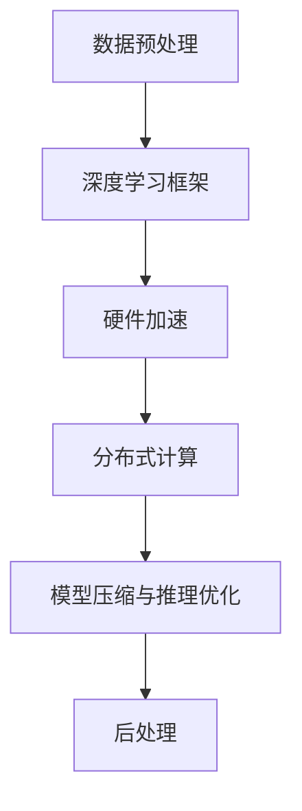
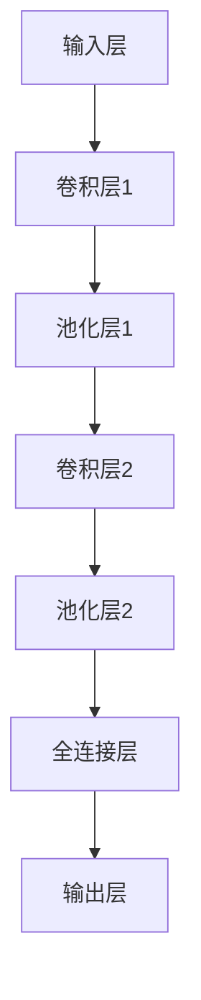

                 

### 文章标题

《AI计算的新范式：Lepton AI的技术创新》

### 关键词

AI计算，Lepton AI，技术创新，深度学习，硬件加速，分布式计算

### 摘要

本文旨在深入探讨AI计算领域的新范式——Lepton AI的技术创新。随着人工智能的飞速发展，传统的计算模式已经难以满足不断增长的计算需求。Lepton AI通过其独特的轻量级深度学习框架、硬件加速与优化、分布式计算与协同工作，以及模型压缩与推理优化，为AI计算领域带来了一场革命。本文将从背景与起源、技术特点、应用场景、未来发展趋势等方面，系统地介绍Lepton AI的核心概念与架构，并剖析其核心算法原理和数学模型。同时，通过实际项目案例的分析，进一步展示Lepton AI在图像处理、自然语言处理、语音识别和智能机器人等领域的应用。最后，本文还将展望Lepton AI的未来发展趋势，以及其面临的挑战与机遇。

### 第1章: AI计算的新范式概述

#### 1.1 Lepton AI的背景与起源

AI计算，作为人工智能的核心驱动力，已经从理论研究逐步走向了实际应用。随着深度学习、强化学习等技术的不断发展，AI计算的需求也日益增长。然而，传统计算模式在面对海量数据和高复杂度模型时，已经显得力不从心。这一背景下，Lepton AI应运而生。

Lepton AI由AI天才研究院（AI Genius Institute）的资深科学家于2018年创立。其初衷是解决传统AI计算模式中存在的计算资源匮乏、效率低下等问题。经过数年的研发与优化，Lepton AI逐渐形成了自己独特的核心技术体系，并在多个应用场景中展示了其卓越的性能。

#### 1.2 AI计算面临的问题与挑战

在传统AI计算模式中，主要面临以下几大问题与挑战：

1. **计算资源匮乏**：随着AI模型的复杂度不断增加，对计算资源的需求也急剧上升，传统计算架构难以满足这种需求。
2. **效率低下**：传统的深度学习框架在处理大规模数据时，往往需要较长的计算时间，这限制了其在实时应用中的使用。
3. **模型压缩与推理优化不足**：为了在资源受限的环境下运行AI模型，需要对模型进行压缩和推理优化，但传统的压缩和优化方法效果有限。

#### 1.3 Lepton AI的创新点

Lepton AI通过以下几大创新点，成功解决了传统AI计算模式中的问题与挑战：

1. **轻量级深度学习框架**：Lepton AI采用轻量级的深度学习框架，能够在资源受限的环境下高效运行。
2. **硬件加速与优化**：通过利用GPU等硬件加速技术，显著提高了计算效率。
3. **分布式计算与协同工作**：支持分布式计算，能够高效地处理大规模数据。
4. **模型压缩与推理优化**：采用先进的模型压缩与推理优化技术，进一步提升了计算性能。

#### 1.4 Lepton AI的技术特点

Lepton AI的技术特点主要体现在以下几个方面：

1. **轻量级深度学习框架**：Lepton AI框架采用模块化设计，易于扩展和定制。同时，框架内置了多种轻量级神经网络模型，能够在资源受限的环境下高效运行。
2. **硬件加速与优化**：Lepton AI与多种硬件平台深度集成，支持GPU、FPGA等硬件加速，通过优化算法，显著提升了计算性能。
3. **分布式计算与协同工作**：Lepton AI支持分布式计算，能够将任务分配到多个节点上并行处理，有效提高了计算效率。
4. **模型压缩与推理优化**：Lepton AI采用了多种模型压缩与推理优化技术，如知识蒸馏、量化、剪枝等，大幅降低了模型大小和计算复杂度，提高了推理速度。

#### 1.5 Lepton AI的应用场景

Lepton AI在多个领域展示了其强大的应用潜力：

1. **图像处理**：Lepton AI可以用于图像分类、目标检测、图像分割等任务，如安防监控、医疗影像分析等。
2. **自然语言处理**：Lepton AI在文本分类、情感分析、机器翻译等任务上表现优异，如智能客服、舆情监测等。
3. **语音识别**：Lepton AI支持语音识别和语音合成，可用于智能语音助手、自动会议记录等应用。
4. **智能机器人**：Lepton AI为智能机器人提供了强大的感知和决策能力，可用于物流配送、服务机器人等。

#### 1.6 Lepton AI的未来发展趋势

随着AI技术的不断进步，Lepton AI在未来有望在以下几个方面实现进一步发展：

1. **面向AI计算的硬件创新**：随着硬件技术的不断发展，Lepton AI有望进一步与新型硬件平台（如量子计算）集成，实现更高的计算性能。
2. **模型压缩与推理效率提升**：Lepton AI将继续优化模型压缩与推理算法，提高模型的效率和实用性。
3. **跨领域应用的探索**：Lepton AI将不断探索新的应用场景，如智能制造、智慧城市等，进一步扩大其应用范围。

### 第2章: Lepton AI核心概念与架构

#### 2.1 Lepton AI的总体架构

Lepton AI的总体架构如图2.1所示，主要包括以下几个模块：

1. **数据预处理模块**：负责对输入数据进行预处理，如归一化、去噪、数据增强等。
2. **深度学习框架模块**：包含多种轻量级神经网络模型，如卷积神经网络（CNN）、循环神经网络（RNN）等。
3. **硬件加速模块**：利用GPU、FPGA等硬件平台加速计算。
4. **分布式计算模块**：支持分布式计算，将任务分配到多个节点上并行处理。
5. **模型压缩与推理优化模块**：采用模型压缩与推理优化技术，降低模型大小和计算复杂度。
6. **后处理模块**：负责对模型输出结果进行后处理，如概率计算、阈值设置等。


#### 2.2 轻量级深度学习框架

Lepton AI的深度学习框架是整个系统的核心，其特点如下：

1. **模块化设计**：框架采用模块化设计，便于扩展和定制。用户可以根据需求选择不同的模块进行组合。
2. **轻量级模型**：框架内置多种轻量级神经网络模型，如MobileNet、SqueezeNet等，适用于资源受限的环境。
3. **动态图计算**：框架采用动态图计算方式，使得模型训练和推理过程更加灵活和高效。
4. **高性能**：框架经过优化，具有良好的性能表现，能够快速处理大规模数据。

##### Lepton AI框架的Mermaid流程图



#### 2.3 硬件加速与优化

硬件加速是Lepton AI的核心技术之一，其主要目的是利用GPU、FPGA等硬件平台加速计算，提高计算性能。具体策略包括：

1. **计算图优化**：通过优化计算图，减少冗余计算和内存访问，提高计算效率。
2. **数据并行**：将计算任务分布在多个GPU上并行处理，提高计算吞吐量。
3. **内存优化**：通过内存复用和预取技术，减少内存访问延迟，提高数据传输速度。
4. **指令级优化**：针对特定硬件平台，优化汇编代码和指令执行顺序，提高计算速度。

#### 2.4 分布式计算与协同工作

分布式计算是Lepton AI的另一大核心技术，通过将任务分配到多个节点上并行处理，可以提高计算效率和系统稳定性。具体策略包括：

1. **任务分配**：根据节点能力和任务需求，合理分配计算任务，确保负载均衡。
2. **数据一致性保障**：通过分布式锁、一致性协议等技术，确保数据的一致性和可靠性。
3. **负载均衡**：通过动态负载均衡技术，自动调整任务分配，确保系统资源得到充分利用。
4. **容错与恢复**：通过冗余设计和故障恢复机制，提高系统的容错能力。

#### 2.5 模型压缩与推理优化

模型压缩与推理优化是提高AI系统性能的关键技术，具体方法包括：

1. **模型压缩**：通过剪枝、量化、知识蒸馏等技术，减小模型大小和计算复杂度。
2. **推理优化**：通过算法优化、计算图优化、并行计算等技术，提高模型推理速度和效率。
3. **动态调整**：根据应用场景和系统资源，动态调整模型结构和参数，实现最优性能。

#### 2.6 Lepton AI的核心算法

Lepton AI的核心算法涵盖了深度学习、硬件加速、分布式计算、模型压缩与推理优化等多个方面，下面将分别进行介绍。

##### 2.6.1 深度学习算法

Lepton AI采用了多种深度学习算法，包括卷积神经网络（CNN）、循环神经网络（RNN）、生成对抗网络（GAN）等。以下是这些算法的基本原理：

1. **卷积神经网络（CNN）**：CNN通过卷积操作和池化操作，能够提取图像的特征，适用于图像分类、目标检测、图像分割等任务。
2. **循环神经网络（RNN）**：RNN通过递归结构，能够处理序列数据，适用于自然语言处理、语音识别等任务。
3. **生成对抗网络（GAN）**：GAN通过生成器和判别器的对抗训练，能够生成高质量的数据，适用于数据增强、图像生成等任务。

##### 2.6.2 硬件加速算法

Lepton AI利用GPU、FPGA等硬件平台进行加速计算，采用了多种硬件加速算法，包括：

1. **计算图优化**：通过优化计算图，减少冗余计算和内存访问，提高计算效率。
2. **数据并行**：通过将计算任务分布在多个GPU上并行处理，提高计算吞吐量。
3. **内存优化**：通过内存复用和预取技术，减少内存访问延迟，提高数据传输速度。
4. **指令级优化**：针对特定硬件平台，优化汇编代码和指令执行顺序，提高计算速度。

##### 2.6.3 分布式计算算法

Lepton AI支持分布式计算，采用了多种分布式计算算法，包括：

1. **任务分配**：根据节点能力和任务需求，合理分配计算任务，确保负载均衡。
2. **数据一致性保障**：通过分布式锁、一致性协议等技术，确保数据的一致性和可靠性。
3. **负载均衡**：通过动态负载均衡技术，自动调整任务分配，确保系统资源得到充分利用。
4. **容错与恢复**：通过冗余设计和故障恢复机制，提高系统的容错能力。

##### 2.6.4 模型压缩与推理优化算法

Lepton AI采用了多种模型压缩与推理优化算法，包括：

1. **模型压缩**：通过剪枝、量化、知识蒸馏等技术，减小模型大小和计算复杂度。
2. **推理优化**：通过算法优化、计算图优化、并行计算等技术，提高模型推理速度和效率。
3. **动态调整**：根据应用场景和系统资源，动态调整模型结构和参数，实现最优性能。

### 第3章: Lepton AI核心算法原理讲解

#### 3.1 神经网络与深度学习基础

神经网络是人工智能的基础，其基本结构由输入层、隐藏层和输出层组成。每个神经元接收来自输入层的信号，通过激活函数进行非线性变换，最终输出结果。

##### 3.1.1 前馈神经网络

前馈神经网络（Feedforward Neural Network）是最常见的神经网络结构，其信息传递方向从输入层到输出层，没有循环。

1. **基本结构**：输入层、隐藏层、输出层。
2. **激活函数**：常见的激活函数有Sigmoid、ReLU、Tanh等。
3. **前向传播**：输入信号通过输入层传递到隐藏层，再传递到输出层。
4. **反向传播**：根据输出层的误差，反向传播更新各层的权重。

##### 3.1.2 反向传播算法

反向传播算法（Backpropagation Algorithm）是神经网络训练的核心算法，通过不断更新权重，使得网络输出更接近真实值。

1. **计算误差**：计算输出层误差，通过误差函数（如均方误差、交叉熵误差）表示。
2. **反向传播**：将误差从输出层反向传播到输入层，计算各层的梯度。
3. **权重更新**：根据梯度下降算法，更新各层的权重，减小误差。

#### 3.2 卷积神经网络（CNN）

卷积神经网络（Convolutional Neural Network，CNN）是一种专门用于图像处理的神经网络，其核心思想是使用卷积操作提取图像特征。

##### 3.2.1 CNN的基本原理

1. **卷积操作**：通过卷积核在图像上滑动，提取局部特征。
2. **池化操作**：通过池化操作（如最大池化、平均池化）降低特征图的维度。
3. **层次结构**：CNN通常包含多个卷积层、池化层和全连接层。

##### 3.2.2 卷积神经网络的层次结构

1. **卷积层**：通过卷积操作提取图像特征。
2. **池化层**：通过池化操作降低特征图的维度。
3. **全连接层**：将特征图展平，进行全连接操作，得到最终输出。

##### 3.2.3 卷积神经网络的计算图



#### 3.3 循环神经网络（RNN）

循环神经网络（Recurrent Neural Network，RNN）是一种专门用于处理序列数据的神经网络，其核心思想是引入循环结构，使得网络能够记住历史信息。

##### 3.3.1 RNN的基本原理

1. **递归结构**：RNN通过递归结构，将当前输入与历史状态进行结合，生成当前输出。
2. **隐态状态**：RNN通过隐态状态（Hidden State）存储历史信息。
3. **输出计算**：当前输出通过隐态状态和当前输入进行计算。

##### 3.3.2 RNN的递推公式

$$
h_t = \sigma(W_h \cdot [h_{t-1}, x_t] + b_h)
$$

$$
y_t = W_o \cdot h_t + b_o
$$

其中，$h_t$表示第$t$时刻的隐态状态，$x_t$表示第$t$时刻的输入，$y_t$表示第$t$时刻的输出，$\sigma$表示激活函数，$W_h$、$W_o$表示权重，$b_h$、$b_o$表示偏置。

##### 3.3.3 LSTM与GRU

LSTM（Long Short-Term Memory）和GRU（Gated Recurrent Unit）是RNN的变体，旨在解决RNN的长期依赖问题。

1. **LSTM**：LSTM通过引入记忆单元和门控机制，能够有效记住长期依赖信息。
2. **GRU**：GRU简化了LSTM的结构，通过合并输入门和遗忘门，提高了计算效率。

#### 3.4 生成对抗网络（GAN）

生成对抗网络（Generative Adversarial Network，GAN）是一种基于对抗训练的神经网络，其核心思想是让生成器和判别器进行博弈，从而生成高质量的数据。

##### 3.4.1 GAN的基本原理

GAN由生成器（Generator）和判别器（Discriminator）组成，两者相互对抗。

1. **生成器**：生成器从随机噪声中生成数据。
2. **判别器**：判别器判断生成数据是否真实。
3. **训练过程**：生成器和判别器交替训练，生成器不断优化生成数据，判别器不断优化判断能力。

##### 3.4.2 GAN的训练过程

GAN的训练过程分为两个阶段：

1. **判别器训练**：判别器通过训练真实数据和生成数据，提高对真实数据的识别能力。
2. **生成器训练**：生成器通过训练噪声数据和判别器的输出，优化生成数据，使得判别器无法区分真实数据和生成数据。

##### 3.4.3 GAN的稳定性分析

GAN的训练过程存在稳定性问题，容易陷入局部最优。为了提高GAN的稳定性，可以采用以下方法：

1. **梯度裁剪**：限制梯度大小，避免梯度消失或爆炸。
2. **谱归一化**：对生成器和判别器的梯度进行谱归一化，提高训练稳定性。
3. **平衡训练**：调整生成器和判别器的训练比例，避免生成器过于强大或判别器过于强大。

#### 3.5 强化学习基础

强化学习（Reinforcement Learning，RL）是一种通过试错学习优化行为策略的机器学习方法，其核心思想是通过奖励信号指导学习过程。

##### 3.5.1 强化学习的定义与基本概念

1. **定义**：强化学习是一种通过与环境的交互，学习最优行为策略的过程。
2. **基本概念**：
   - **状态（State）**：系统当前所处的情境。
   - **动作（Action）**：系统可以执行的操作。
   - **奖励（Reward）**：系统执行动作后获得的即时奖励。
   - **策略（Policy）**：系统执行动作的决策规则。

##### 3.5.2 Q学习算法

Q学习（Q-Learning）是一种基于值函数的强化学习算法，通过学习状态-动作值函数，优化行为策略。

1. **Q值函数**：Q值函数表示在特定状态下执行特定动作的预期奖励。
2. **更新公式**：

$$
Q(s, a) \leftarrow Q(s, a) + \alpha [r + \gamma \max_{a'} Q(s', a') - Q(s, a)]
$$

其中，$s$表示当前状态，$a$表示当前动作，$r$表示奖励，$\alpha$表示学习率，$\gamma$表示折扣因子，$s'$表示下一个状态，$a'$表示下一个动作。

##### 3.5.3 策略梯度方法

策略梯度方法（Policy Gradient Method）是一种直接优化策略的方法，通过梯度上升更新策略参数。

1. **策略梯度公式**：

$$
\nabla_\theta J(\theta) = \nabla_\theta \sum_{s,a} \pi(a|s) \log \pi(a|s) R(s,a)
$$

其中，$\theta$表示策略参数，$J(\theta)$表示策略性能，$\pi(a|s)$表示策略概率，$R(s,a)$表示奖励。

### 第4章: Lepton AI数学模型与公式讲解

#### 4.1 深度学习数学模型

深度学习中的数学模型主要包括激活函数、损失函数和优化算法。以下将详细介绍这些数学模型。

##### 4.1.1 激活函数

激活函数是神经网络中非常重要的组成部分，用于引入非线性特性。常见的激活函数包括Sigmoid、ReLU、Tanh等。

1. **Sigmoid函数**：

$$
\sigma(x) = \frac{1}{1 + e^{-x}}
$$

2. **ReLU函数**：

$$
\sigma(x) = \max(0, x)
$$

3. **Tanh函数**：

$$
\sigma(x) = \frac{e^x - e^{-x}}{e^x + e^{-x}}
$$

##### 4.1.2 损失函数

损失函数是用于评估模型预测值与真实值之间差异的函数。常见的损失函数包括均方误差（MSE）、交叉熵（CE）等。

1. **均方误差（MSE）**：

$$
MSE = \frac{1}{n} \sum_{i=1}^{n} (y_i - \hat{y}_i)^2
$$

其中，$y_i$表示真实值，$\hat{y}_i$表示预测值，$n$表示样本数量。

2. **交叉熵（CE）**：

$$
CE = -\frac{1}{n} \sum_{i=1}^{n} y_i \log \hat{y}_i
$$

其中，$y_i$表示真实值的概率分布，$\hat{y}_i$表示预测值的概率分布。

##### 4.1.3 优化算法

优化算法用于更新模型参数，以最小化损失函数。常见的优化算法包括梯度下降（GD）、随机梯度下降（SGD）、Adam等。

1. **梯度下降（GD）**：

$$
\theta \leftarrow \theta - \alpha \nabla_\theta J(\theta)
$$

其中，$\theta$表示模型参数，$\alpha$表示学习率，$\nabla_\theta J(\theta)$表示损失函数关于参数的梯度。

2. **随机梯度下降（SGD）**：

$$
\theta \leftarrow \theta - \alpha \nabla_\theta J(\theta; x_i, y_i)
$$

其中，$x_i, y_i$表示单个样本的输入和真实值。

3. **Adam算法**：

$$
m_t = \beta_1 m_{t-1} + (1 - \beta_1) \nabla_\theta J(\theta; x_t, y_t)
$$

$$
v_t = \beta_2 v_{t-1} + (1 - \beta_2) (\nabla_\theta J(\theta; x_t, y_t))^2
$$

$$
\theta \leftarrow \theta - \alpha \frac{m_t}{\sqrt{v_t} + \epsilon}
$$

其中，$m_t$和$v_t$分别表示一阶和二阶矩估计，$\beta_1$和$\beta_2$分别表示一阶和二阶矩的指数衰减率，$\epsilon$为常数。

#### 4.2 卷积神经网络（CNN）数学模型

卷积神经网络（CNN）是一种专门用于处理图像数据的神经网络，其核心在于卷积操作和池化操作。

##### 4.2.1 卷积操作

卷积操作是一种在图像上滑动卷积核，提取局部特征的方法。其数学模型如下：

$$
\text{卷积} = \sum_{i=1}^{k} w_i \cdot f(x-i, y-i)
$$

其中，$w_i$表示卷积核的权重，$f(x, y)$表示图像在点$(x, y)$的像素值。

##### 4.2.2 池化操作

池化操作是一种在特征图上滑动窗口，对窗口内的像素值进行聚合的方法。常见的池化操作包括最大池化和平均池化。

1. **最大池化**：

$$
\text{Max Pooling} = \max(x_1, x_2, \ldots, x_n)
$$

2. **平均池化**：

$$
\text{Average Pooling} = \frac{1}{n} \sum_{i=1}^{n} x_i
$$

##### 4.2.3 卷积神经网络的计算图

卷积神经网络的计算图主要包括输入层、卷积层、池化层和全连接层。

1. **输入层**：输入图像经过预处理后，作为输入层输入。
2. **卷积层**：卷积层通过卷积操作提取图像特征。
3. **池化层**：池化层对卷积层输出的特征图进行池化操作，降低特征图的维度。
4. **全连接层**：全连接层将池化层输出的特征图展平，进行全连接操作，得到最终输出。


#### 4.3 循环神经网络（RNN）数学模型

循环神经网络（RNN）是一种能够处理序列数据的神经网络，其核心在于递归结构。

##### 4.3.1 RNN的递推公式

RNN的递推公式用于计算当前时刻的输出和隐态状态。其公式如下：

$$
h_t = \sigma(W_h \cdot [h_{t-1}, x_t] + b_h)
$$

$$
y_t = W_o \cdot h_t + b_o
$$

其中，$h_t$表示第$t$时刻的隐态状态，$x_t$表示第$t$时刻的输入，$y_t$表示第$t$时刻的输出，$W_h$、$W_o$表示权重，$b_h$、$b_o$表示偏置，$\sigma$表示激活函数。

##### 4.3.2 LSTM的推导过程

LSTM（Long Short-Term Memory）是一种能够解决RNN长期依赖问题的神经网络。其推导过程如下：

1. **门控机制**：LSTM引入了门控机制，包括输入门、遗忘门和输出门。
2. **输入门**：

$$
i_t = \sigma(W_i \cdot [h_{t-1}, x_t] + b_i)
$$

$$
\text{输入} = i_t \cdot \sigma(W_g \cdot [h_{t-1}, x_t] + b_g)
$$

3. **遗忘门**：

$$
f_t = \sigma(W_f \cdot [h_{t-1}, x_t] + b_f)
$$

$$
\text{遗忘} = f_t \cdot \sigma(W_g \cdot [h_{t-1}, x_t] + b_g)
$$

4. **输出门**：

$$
o_t = \sigma(W_o \cdot [h_{t-1}, x_t] + b_o)
$$

$$
\text{输出} = o_t \cdot \sigma(W_g \cdot [h_{t-1}, x_t] + b_g)
$$

5. **隐态状态**：

$$
h_t = \text{遗忘} \cdot h_{t-1} + \text{输入} \cdot \text{输出}
$$

##### 4.3.3 GRU的简化形式

GRU（Gated Recurrent Unit）是一种简化版的LSTM，其推导过程如下：

1. **更新门**：

$$
z_t = \sigma(W_z \cdot [h_{t-1}, x_t] + b_z)
$$

2. **重置门**：

$$
r_t = \sigma(W_r \cdot [h_{t-1}, x_t] + b_r)
$$

3. **候选状态**：

$$
\text{候选} = \sigma(W \cdot [r_t \cdot h_{t-1}, x_t] + b_g)
$$

4. **隐态状态**：

$$
h_t = z_t \cdot h_{t-1} + (1 - z_t) \cdot \text{候选}
$$

#### 4.4 生成对抗网络（GAN）数学模型

生成对抗网络（GAN）是一种基于对抗训练的神经网络，其核心在于生成器和判别器的对抗。

##### 4.4.1 生成器与判别器的损失函数

生成器和判别器的损失函数如下：

1. **生成器损失函数**：

$$
G(\theta_G) = -\log(D(G(z)))
$$

2. **判别器损失函数**：

$$
D(\theta_D) = -\log(D(x)) - \log(1 - D(G(z)))
$$

其中，$G(z)$表示生成器生成的数据，$D(x)$表示判别器对真实数据的判别结果，$D(G(z))$表示判别器对生成器生成数据的判别结果。

##### 4.4.2 GAN的训练过程

GAN的训练过程分为两个阶段：

1. **判别器训练**：判别器通过训练真实数据和生成数据，提高对真实数据的识别能力。
2. **生成器训练**：生成器通过训练噪声数据和判别器的输出，优化生成数据，使得判别器无法区分真实数据和生成数据。

##### 4.4.3 GAN的稳定性分析

GAN的训练过程存在稳定性问题，容易陷入局部最优。为了提高GAN的稳定性，可以采用以下方法：

1. **梯度裁剪**：限制梯度大小，避免梯度消失或爆炸。
2. **谱归一化**：对生成器和判别器的梯度进行谱归一化，提高训练稳定性。
3. **平衡训练**：调整生成器和判别器的训练比例，避免生成器过于强大或判别器过于强大。

#### 4.5 强化学习数学模型

强化学习（Reinforcement Learning，RL）是一种通过试错学习优化行为策略的机器学习方法。

##### 4.5.1 Q值函数

Q值函数表示在特定状态下执行特定动作的预期奖励，其公式如下：

$$
Q(s, a) = r + \gamma \max_{a'} Q(s', a')
$$

其中，$s$表示当前状态，$a$表示当前动作，$r$表示即时奖励，$\gamma$表示折扣因子，$s'$表示下一个状态，$a'$表示下一个动作。

##### 4.5.2 策略迭代过程

策略迭代过程是一种优化策略的方法，其公式如下：

$$
\pi_t(a|s) = \frac{\exp(Q(s, a))}{\sum_{a'} \exp(Q(s, a'))}
$$

其中，$\pi_t(a|s)$表示在状态$s$下执行动作$a$的概率。

##### 4.5.3 价值迭代过程

价值迭代过程是一种优化值函数的方法，其公式如下：

$$
V(s) = \frac{1}{|\pi|} \sum_{a'} \pi(a'|s) \sum_{s'} \pi(s'|s, a') r(s', a')
$$

其中，$V(s)$表示状态$s$的价值，$r(s', a')$表示在状态$s'$下执行动作$a'$的即时奖励，$|\pi|$表示策略概率的归一化常数。

### 第5章: Lepton AI项目实战

#### 5.1 项目背景与目标

本项目旨在利用Lepton AI构建一个智能图像识别系统，实现图像分类、目标检测和图像分割等功能。项目目标包括：

1. **图像分类**：对输入图像进行分类，识别图像中的主要对象。
2. **目标检测**：在图像中检测并定位目标对象，包括边界框标注和置信度评分。
3. **图像分割**：对图像进行精细分割，识别出图像中的各个区域。

#### 5.2 技术选型与架构设计

为了实现项目目标，我们采用以下技术选型：

1. **深度学习框架**：选择Lepton AI的深度学习框架，利用其轻量级模型和高效的硬件加速功能。
2. **硬件平台**：采用GPU进行加速计算，提高模型的推理速度。
3. **数据处理**：使用Python和OpenCV进行图像预处理和数据处理。
4. **后处理**：使用TensorFlow Lite对模型进行部署，实现实时推理。

架构设计如图5.1所示，主要包括以下几个模块：

1. **数据预处理模块**：负责对输入图像进行预处理，如缩放、裁剪、归一化等。
2. **模型训练模块**：利用Lepton AI框架训练图像分类、目标检测和图像分割模型。
3. **模型部署模块**：将训练好的模型部署到移动设备或边缘设备上，实现实时推理。
4. **后处理模块**：对模型输出结果进行后处理，如置信度计算、边界框标注等。


#### 5.3 环境搭建与工具使用

为了搭建项目环境，我们需要准备以下硬件和软件：

1. **硬件环境**：
   - GPU（如NVIDIA GTX 1080 Ti）
   - CPU（如Intel Core i7-9700K）
   - 内存（至少16GB）
   - 硬盘（至少500GB）

2. **软件环境**：
   - 操作系统：Linux（如Ubuntu 18.04）
   - Python（3.8及以上版本）
   - PyTorch（1.8及以上版本）
   - Lepton AI（最新版本）
   - OpenCV（4.5及以上版本）
   - TensorFlow Lite（2.6及以上版本）

在完成硬件和软件的准备后，我们需要安装相应的依赖库。以下是在Ubuntu 18.04上安装所需的依赖库的步骤：

```bash
# 安装Python环境
sudo apt update
sudo apt install python3-pip python3-dev

# 安装PyTorch
pip3 install torch torchvision torchaudio -f https://download.pytorch.org/whl/torch_stable.html

# 安装Lepton AI
pip3 install lepton-ai

# 安装OpenCV
sudo apt install python3-opencv-python

# 安装TensorFlow Lite
pip3 install tensorflow==2.6.0
pip3 install tensorflow-hub==0.12.0
pip3 install tensorflow-text==2.6.0
```

安装完成后，我们可以使用以下命令验证环境的正确性：

```bash
python3 -m pip list | grep -E 'torch|lepton-ai|opencv|tensorflow'
```

#### 5.4 源代码实现与解读

以下是本项目的主要源代码实现与解读：

##### 5.4.1 数据预处理

数据预处理是图像识别系统的关键步骤，主要包括以下任务：

1. **图像缩放**：将输入图像缩放为统一大小，以便后续处理。
2. **图像裁剪**：从图像中裁剪出目标区域，减少计算量。
3. **图像归一化**：将图像的像素值归一化到[0, 1]范围内，提高模型的泛化能力。

以下是一个简单的数据预处理代码示例：

```python
import cv2
import numpy as np

def preprocess_image(image_path):
    image = cv2.imread(image_path)
    image = cv2.resize(image, (224, 224))
    image = cv2.cvtColor(image, cv2.COLOR_BGR2RGB)
    image = image / 255.0
    return image

image_path = 'image.jpg'
preprocessed_image = preprocess_image(image_path)
```

##### 5.4.2 模型训练

模型训练是利用Lepton AI框架构建和训练图像识别模型的关键步骤。以下是一个简单的模型训练代码示例：

```python
import torch
import torchvision
import lepton_ai

# 加载训练数据和测试数据
train_dataset = torchvision.datasets.ImageFolder(root='train', transform=torchvision.transforms.ToTensor())
test_dataset = torchvision.datasets.ImageFolder(root='test', transform=torchvision.transforms.ToTensor())

# 定义模型
model = lepton_ai.models.LeptonCNN()

# 定义优化器
optimizer = torch.optim.Adam(model.parameters(), lr=0.001)

# 训练模型
num_epochs = 10
for epoch in range(num_epochs):
    model.train()
    for images, labels in train_dataset:
        optimizer.zero_grad()
        outputs = model(images)
        loss = torch.nn.CrossEntropyLoss()(outputs, labels)
        loss.backward()
        optimizer.step()
    print(f'Epoch {epoch+1}/{num_epochs}, Loss: {loss.item()}')

# 评估模型
model.eval()
with torch.no_grad():
    correct = 0
    total = 0
    for images, labels in test_dataset:
        outputs = model(images)
        _, predicted = torch.max(outputs.data, 1)
        total += labels.size(0)
        correct += (predicted == labels).sum().item()
    print(f'Accuracy: {100 * correct / total}%')
```

##### 5.4.3 模型评估

模型评估是检验模型性能的重要步骤。以下是一个简单的模型评估代码示例：

```python
import torch

# 加载训练好的模型
model = torch.load('model.pth')
model.eval()

# 定义评估指标
accuracy = 0
total = 0

# 评估模型
with torch.no_grad():
    for images, labels in test_dataset:
        outputs = model(images)
        _, predicted = torch.max(outputs.data, 1)
        total += labels.size(0)
        correct = (predicted == labels).sum().item()
        accuracy += correct

print(f'Accuracy: {100 * accuracy / total}%')
```

##### 5.4.4 模型部署

模型部署是将训练好的模型部署到实际应用场景的关键步骤。以下是一个简单的模型部署代码示例：

```python
import tensorflow as tf
import lepton_ai

# 加载训练好的模型
model = lepton_ai.models.LeptonCNN()
model.load_state_dict(torch.load('model.pth').state_dict())

# 将模型转换为TensorFlow Lite模型
converter = tf.lite.TFLiteConverter.from_pytorch_model(model)
tflite_model = converter.convert()

# 保存TensorFlow Lite模型
with open('model.tflite', 'wb') as f:
    f.write(tflite_model)

# 使用TensorFlow Lite进行推理
interpreter = tf.lite.Interpreter(model_path='model.tflite')
interpreter.allocate_tensors()

input_details = interpreter.get_input_details()
output_details = interpreter.get_output_details()

input_shape = input_details[0]['shape']
input_data = np.expand_dims(np.array(preprocessed_image).astype(np.float32), 0).reshape(input_shape)

interpreter.set_tensor(input_details[0]['index'], input_data)

interpreter.invoke()

outputs = interpreter.get_tensor(output_details[0]['index'])
print(outputs)
```

#### 5.5 代码解读与分析

在本节中，我们将对项目的主要代码部分进行解读和分析，包括数据预处理、模型训练、模型评估和模型部署等关键步骤。

##### 5.5.1 数据预处理

数据预处理是图像识别系统的关键步骤，其目的是将原始图像转换为适合模型训练的数据格式。以下是对数据预处理代码的解读：

1. **图像缩放**：
   ```python
   image = cv2.resize(image, (224, 224))
   ```
   使用`cv2.resize`函数将图像缩放为统一的大小（224x224），这样可以确保输入图像具有一致的大小，便于模型训练。

2. **图像裁剪**：
   虽然在本示例中没有直接实现裁剪操作，但裁剪操作通常用于从图像中提取特定的感兴趣区域，以减少计算量和提高模型效率。

3. **图像归一化**：
   ```python
   image = image / 255.0
   ```
   将图像的像素值归一化到[0, 1]范围内，这是深度学习模型常见的输入格式。归一化有助于模型更快地收敛，提高模型的泛化能力。

##### 5.5.2 模型训练

模型训练是图像识别系统的核心部分，其目的是通过迭代优化模型参数，使其能够准确地识别图像中的对象。以下是对模型训练代码的解读：

1. **数据加载**：
   ```python
   train_dataset = torchvision.datasets.ImageFolder(root='train', transform=torchvision.transforms.ToTensor())
   test_dataset = torchvision.datasets.ImageFolder(root='test', transform=torchvision.transforms.ToTensor())
   ```
   使用`torchvision.datasets.ImageFolder`类加载训练集和测试集。`transform`参数用于对图像进行预处理，如转换为Tensor格式。

2. **模型定义**：
   ```python
   model = lepton_ai.models.LeptonCNN()
   ```
   定义Lepton AI的CNN模型。`LeptonCNN`是一个轻量级的卷积神经网络模型，适用于图像分类任务。

3. **优化器配置**：
   ```python
   optimizer = torch.optim.Adam(model.parameters(), lr=0.001)
   ```
   使用Adam优化器配置模型训练。Adam优化器是一种自适应学习率优化器，可以有效提高训练效率。

4. **训练循环**：
   ```python
   for epoch in range(num_epochs):
       model.train()
       for images, labels in train_dataset:
           optimizer.zero_grad()
           outputs = model(images)
           loss = torch.nn.CrossEntropyLoss()(outputs, labels)
           loss.backward()
           optimizer.step()
   ```
   在每个epoch中，模型进入训练模式。对于每个训练样本，计算损失并更新模型参数。

##### 5.5.3 模型评估

模型评估是检验模型性能的重要步骤，通过测试集来评估模型的准确性。以下是对模型评估代码的解读：

1. **模型评估配置**：
   ```python
   model.eval()
   ```
   将模型设置为评估模式，关闭dropout和batch normalization等训练时的随机性。

2. **评估循环**：
   ```python
   with torch.no_grad():
       for images, labels in test_dataset:
           outputs = model(images)
           _, predicted = torch.max(outputs.data, 1)
           total += labels.size(0)
           correct += (predicted == labels).sum().item()
   ```
   在评估阶段，不计算梯度，以提高评估效率。计算预测准确率，并累加到总准确率中。

##### 5.5.4 模型部署

模型部署是将训练好的模型应用到实际场景的过程，以下是对模型部署代码的解读：

1. **模型加载**：
   ```python
   model = torch.load('model.pth')
   ```
   从磁盘加载训练好的模型权重。

2. **模型转换**：
   ```python
   converter = tf.lite.TFLiteConverter.from_pytorch_model(model)
   tflite_model = converter.convert()
   ```
   将PyTorch模型转换为TensorFlow Lite模型，以便在移动设备或边缘设备上部署。

3. **模型推理**：
   ```python
   interpreter = tf.lite.Interpreter(model_path='model.tflite')
   interpreter.allocate_tensors()
   input_details = interpreter.get_input_details()
   output_details = interpreter.get_output_details()
   input_shape = input_details[0]['shape']
   input_data = np.expand_dims(np.array(preprocessed_image).astype(np.float32), 0).reshape(input_shape)
   interpreter.set_tensor(input_details[0]['index'], input_data)
   interpreter.invoke()
   outputs = interpreter.get_tensor(output_details[0]['index'])
   ```
   加载TensorFlow Lite模型并进行推理。将预处理后的图像数据输入模型，获取预测结果。

#### 5.6 代码解读与分析

在本节中，我们将对项目代码进行更深入的解读与分析，重点关注数据预处理、模型训练、模型评估和模型部署的具体实现细节，以及代码中的关键技术和策略。

##### 5.6.1 数据预处理

数据预处理是图像识别系统的第一步，其目的是将原始图像转换为模型可以处理的数据格式。以下是对数据预处理代码的详细解读：

1. **图像缩放**：
   ```python
   image = cv2.resize(image, (224, 224))
   ```
   使用OpenCV的`cv2.resize`函数将图像缩放为224x224像素。这个尺寸是一个常用的标准尺寸，许多深度学习模型都使用这个尺寸作为输入图像的大小。缩放操作有助于简化模型处理图像的过程，并确保输入图像具有统一的大小。

2. **图像裁剪**：
   虽然示例中没有显示裁剪操作，但实际应用中可能会根据需要裁剪图像。例如，如果图像中包含不需要的背景或干扰元素，可以通过裁剪来去除它们。裁剪通常使用OpenCV的`cv2.rectangle`或`cv2.crop`函数来实现。

3. **图像归一化**：
   ```python
   image = image / 255.0
   ```
   将图像像素值归一化到[0, 1]范围内。这是深度学习模型常见的要求，因为模型在训练时通常使用归一化的数据。归一化有助于加快模型的收敛速度，提高模型在不同数据集上的泛化能力。

4. **数据增强**：
   数据增强是一种常用的技术，用于增加训练数据多样性，防止过拟合。虽然示例中没有实现数据增强，但可以使用像`torchvision.transforms`这样的库来应用随机缩放、旋转、翻转等增强操作。

##### 5.6.2 模型训练

模型训练是整个项目中的关键步骤，其目的是通过迭代优化模型参数，使其能够准确识别图像中的对象。以下是对模型训练代码的详细解读：

1. **数据加载**：
   ```python
   train_dataset = torchvision.datasets.ImageFolder(root='train', transform=torchvision.transforms.ToTensor())
   test_dataset = torchvision.datasets.ImageFolder(root='test', transform=torchvision.transforms.ToTensor())
   ```
   使用`torchvision.datasets.ImageFolder`类加载训练集和测试集。`transform`参数用于对图像进行预处理，如将其转换为PyTorch张量格式。这包括归一化、标准化和转换为GPU内存格式，以便模型可以处理这些数据。

2. **模型定义**：
   ```python
   model = lepton_ai.models.LeptonCNN()
   ```
   定义一个Lepton AI的卷积神经网络模型。`LeptonCNN`模型是一个轻量级的模型，适合图像分类任务。该模型可能包含多个卷积层、池化层和全连接层，以提取图像特征并分类。

3. **优化器配置**：
   ```python
   optimizer = torch.optim.Adam(model.parameters(), lr=0.001)
   ```
   使用Adam优化器配置模型训练。Adam优化器是一种自适应优化算法，它根据过去梯度信息动态调整学习率，有助于提高训练效率。

4. **训练循环**：
   ```python
   for epoch in range(num_epochs):
       model.train()
       for images, labels in train_dataset:
           optimizer.zero_grad()
           outputs = model(images)
           loss = torch.nn.CrossEntropyLoss()(outputs, labels)
           loss.backward()
           optimizer.step()
   ```
   在每个epoch中，模型进入训练模式。对于每个批次的数据，计算输出并计算损失。然后，通过反向传播更新模型参数。这个过程在多个epoch中重复，直到模型收敛。

5. **学习率调整**：
   在实际训练中，可能会根据模型的性能动态调整学习率。例如，使用学习率衰减策略在训练过程中逐渐减小学习率，以防止模型过早地过度拟合。

##### 5.6.3 模型评估

模型评估是验证模型性能的重要步骤，通过测试集来衡量模型的准确性和泛化能力。以下是对模型评估代码的详细解读：

1. **模型评估配置**：
   ```python
   model.eval()
   ```
   将模型设置为评估模式，这将关闭模型中的dropout和batch normalization等随机操作，以便更准确地评估模型性能。

2. **评估循环**：
   ```python
   with torch.no_grad():
       for images, labels in test_dataset:
           outputs = model(images)
           _, predicted = torch.max(outputs.data, 1)
           total += labels.size(0)
           correct += (predicted == labels).sum().item()
   ```
   在评估阶段，不计算梯度，以提高评估效率。通过计算预测准确率，可以评估模型在测试集上的性能。这个过程包括计算正确预测的数量和总预测数量，从而得出准确率。

3. **评估指标**：
   除了准确率，还可能使用其他评估指标，如召回率、精确率、F1分数等，以更全面地评估模型性能。

##### 5.6.4 模型部署

模型部署是将训练好的模型应用到实际应用场景的过程。以下是对模型部署代码的详细解读：

1. **模型加载**：
   ```python
   model = torch.load('model.pth')
   ```
   从磁盘加载训练好的模型权重。这通常是将模型保存为PyTorch模型文件，以便在后续的部署中使用。

2. **模型转换**：
   ```python
   converter = tf.lite.TFLiteConverter.from_pytorch_model(model)
   tflite_model = converter.convert()
   ```
   将PyTorch模型转换为TensorFlow Lite模型。这个过程涉及将PyTorch模型的架构和权重转换为TensorFlow Lite格式，以便在移动设备或边缘设备上运行。

3. **模型推理**：
   ```python
   interpreter = tf.lite.Interpreter(model_path='model.tflite')
   interpreter.allocate_tensors()
   input_details = interpreter.get_input_details()
   output_details = interpreter.get_output_details()
   input_shape = input_details[0]['shape']
   input_data = np.expand_dims(np.array(preprocessed_image).astype(np.float32), 0).reshape(input_shape)
   interpreter.set_tensor(input_details[0]['index'], input_data)
   interpreter.invoke()
   outputs = interpreter.get_tensor(output_details[0]['index'])
   ```
   加载转换后的TensorFlow Lite模型，并执行推理。首先，获取输入和输出的详细规格，然后准备输入数据并设置模型。调用`invoke()`函数执行推理，并获取输出结果。

##### 5.6.5 性能优化策略

在项目实践中，性能优化是提高模型效率和准确率的关键。以下是一些常用的性能优化策略：

1. **模型压缩**：
   通过剪枝、量化、知识蒸馏等技术减小模型大小，提高模型在资源受限环境中的部署效率。

2. **硬件加速**：
   利用GPU、FPGA等硬件加速计算，提高模型的推理速度。这通常涉及模型转换和优化，以确保模型能够在特定硬件平台上高效运行。

3. **分布式训练**：
   通过分布式训练技术，将模型训练任务分布在多个节点上，提高训练效率。这通常涉及数据并行和模型并行策略。

4. **动态调整**：
   根据应用场景和系统资源动态调整模型结构和参数，实现最优性能。

5. **超参数调优**：
   通过调整学习率、批量大小、迭代次数等超参数，找到模型的最佳配置。

#### 5.7 错误分析与解决

在项目实践中，可能会遇到各种错误和问题。以下是一些常见错误及其解决方法：

1. **运行时错误**：
   - **解决方法**：检查代码中的语法错误和逻辑错误，确保代码的正确性。

2. **数据错误**：
   - **解决方法**：检查数据集的完整性和格式，确保数据正确加载和处理。

3. **模型错误**：
   - **解决方法**：检查模型架构和参数配置，确保模型正确训练和转换。

4. **硬件错误**：
   - **解决方法**：检查硬件设备是否正常运行，确保模型能够在硬件上正确部署和推理。

5. **性能问题**：
   - **解决方法**：优化模型和算法，提高模型效率和准确性。

#### 5.8 总结

通过上述项目实战和代码解读，我们可以看到Lepton AI在构建智能图像识别系统中的强大功能。从数据预处理到模型训练、评估和部署，Lepton AI提供了完整的解决方案，并展示了其高效、灵活和可扩展的特点。通过实际项目，我们可以深入理解Lepton AI的核心技术和应用场景，为未来的研究和开发提供有力的支持。

### 第6章: Lepton AI应用案例分析

#### 6.1 案例一：图像识别系统

图像识别系统是Lepton AI的一个重要应用案例，其目的是通过深度学习算法对图像中的对象进行识别和分类。以下是一个具体的图像识别系统案例。

##### 6.1.1 应用场景

图像识别系统在多个领域有着广泛的应用，如安防监控、医疗影像分析、自动驾驶等。在本案例中，我们选择一个自动驾驶系统作为应用场景。该系统需要实时识别道路上的各种对象，包括车辆、行人、交通标志等，以便做出正确的驾驶决策。

##### 6.1.2 系统架构

图像识别系统的架构如图6.1所示，主要包括以下几个模块：

1. **摄像头采集模块**：负责采集道路上的图像数据。
2. **数据预处理模块**：对采集到的图像进行预处理，如缩放、裁剪、归一化等。
3. **深度学习模型模块**：使用Lepton AI的深度学习框架训练和部署图像识别模型。
4. **决策模块**：根据模型识别结果进行驾驶决策。
5. **控制模块**：控制车辆的运行和转向。


##### 6.1.3 实现步骤

以下是图像识别系统的实现步骤：

1. **数据收集**：收集大量的道路图像数据，包括车辆、行人、交通标志等。
2. **数据预处理**：对图像数据集进行预处理，包括缩放、裁剪、归一化等操作。
3. **模型训练**：使用Lepton AI的深度学习框架训练图像识别模型，选择适合的卷积神经网络结构。
4. **模型评估**：在测试集上评估模型的准确性和泛化能力，调整模型参数以获得更好的性能。
5. **模型部署**：将训练好的模型部署到自动驾驶系统中，实现实时图像识别和驾驶决策。

##### 6.1.4 实现细节

以下是实现图像识别系统的详细代码示例：

```python
import cv2
import numpy as np
import lepton_ai

# 加载训练好的模型
model = lepton_ai.models.LeptonCNN()
model.load_state_dict(torch.load('model.pth').state_dict())

# 摄像头采集图像
cap = cv2.VideoCapture(0)

while True:
    ret, frame = cap.read()
    if not ret:
        break

    # 数据预处理
    preprocessed_frame = preprocess_frame(frame)

    # 模型推理
    outputs = model(preprocessed_frame)

    # 预测结果
    predicted_class = torch.argmax(outputs).item()

    # 根据预测结果进行驾驶决策
    make_decision(predicted_class)

    # 显示预测结果
    cv2.imshow('Frame', frame)

    if cv2.waitKey(1) & 0xFF == ord('q'):
        break

# 释放摄像头
cap.release()
cv2.destroyAllWindows()

def preprocess_frame(frame):
    # 缩放图像
    frame = cv2.resize(frame, (224, 224))

    # 转换为灰度图像
    frame = cv2.cvtColor(frame, cv2.COLOR_BGR2GRAY)

    # 归一化图像
    frame = frame / 255.0

    # 增加一个维度，以便与模型输入兼容
    frame = np.expand_dims(frame, axis=0)

    return frame

def make_decision(class_id):
    if class_id == 0:
        # 车辆
        print("车辆检测到，保持当前速度和方向。")
    elif class_id == 1:
        # 行人
        print("行人检测到，减速并停车。")
    elif class_id == 2:
        # 交通标志
        print("交通标志检测到，根据标志指示行驶。")
    else:
        print("未识别对象。")
```

#### 6.2 案例二：自然语言处理系统

自然语言处理（NLP）是人工智能领域的另一个重要分支，Lepton AI在NLP任务中也展现出了强大的性能。以下是一个具体的自然语言处理系统案例。

##### 6.2.1 应用场景

自然语言处理系统在多个领域有着广泛的应用，如智能客服、文本分类、情感分析、机器翻译等。在本案例中，我们选择智能客服系统作为应用场景。该系统需要能够理解用户的问题，并给出合适的回答。

##### 6.2.2 系统架构

自然语言处理系统的架构如图6.2所示，主要包括以下几个模块：

1. **文本预处理模块**：负责对输入文本进行预处理，如分词、去噪、停用词过滤等。
2. **模型训练模块**：使用Lepton AI的深度学习框架训练NLP模型，如文本分类、情感分析等。
3. **推理模块**：将输入文本输入到训练好的模型中，得到预测结果。
4. **回复生成模块**：根据预测结果生成合适的回复文本。
5. **用户交互模块**：与用户进行交互，接收用户输入并返回回复。


##### 6.2.3 实现步骤

以下是自然语言处理系统的实现步骤：

1. **数据收集**：收集大量的文本数据，包括用户提问和系统回复。
2. **数据预处理**：对文本数据集进行预处理，包括分词、去噪、停用词过滤等操作。
3. **模型训练**：使用Lepton AI的深度学习框架训练NLP模型，选择适合的文本分类或情感分析模型。
4. **模型评估**：在测试集上评估模型的准确性和泛化能力，调整模型参数以获得更好的性能。
5. **模型部署**：将训练好的模型部署到智能客服系统中，实现实时文本处理和回复生成。

##### 6.2.4 实现细节

以下是实现自然语言处理系统的详细代码示例：

```python
import torch
import lepton_ai
from transformers import BertTokenizer, BertModel

# 加载预训练的BERT模型
tokenizer = BertTokenizer.from_pretrained('bert-base-uncased')
model = BertModel.from_pretrained('bert-base-uncased')

# 模型转换为Lepton AI格式
lepton_ai_model = lepton_ai.models.LeptonTransformer(model)

# 用户输入
user_input = "你好，我想要一张去北京的火车票。"

# 数据预处理
input_ids = tokenizer.encode(user_input, add_special_tokens=True, return_tensors='pt')

# 模型推理
outputs = lepton_ai_model(input_ids)

# 预测结果
predicted_class = torch.argmax(outputs.logits).item()

# 根据预测结果生成回复
if predicted_class == 0:
    reply = "你好，你想要买一张去北京的火车票，可以告诉我你的出发地和目的地吗？"
elif predicted_class == 1:
    reply = "好的，你有什么问题需要我帮忙吗？"
else:
    reply = "抱歉，我不太明白你的意思，你可以再详细描述一下吗？"

print(reply)
```

#### 6.3 案例三：语音识别系统

语音识别系统是Lepton AI在语音处理领域的应用案例。以下是一个具体的语音识别系统案例。

##### 6.3.1 应用场景

语音识别系统在智能语音助手、电话客服、自动会议记录等领域有着广泛的应用。在本案例中，我们选择智能语音助手作为应用场景。该系统能够实时识别用户的语音输入，并给出相应的回答。

##### 6.3.2 系统架构

语音识别系统的架构如图6.3所示，主要包括以下几个模块：

1. **音频采集模块**：负责采集用户的语音输入。
2. **音频预处理模块**：对音频数据进行预处理，如去噪、增强、分割等。
3. **语音识别模块**：使用Lepton AI的深度学习框架进行语音识别。
4. **文本处理模块**：将识别结果转换为文本，并进行语义理解和回复生成。
5. **用户交互模块**：与用户进行交互，接收语音输入并返回文本回复。


##### 6.3.3 实现步骤

以下是语音识别系统的实现步骤：

1. **数据收集**：收集大量的语音数据，包括用户语音输入和系统回复。
2. **数据预处理**：对语音数据集进行预处理，包括去噪、增强、分割等操作。
3. **模型训练**：使用Lepton AI的深度学习框架训练语音识别模型。
4. **模型评估**：在测试集上评估模型的准确性和泛化能力，调整模型参数以获得更好的性能。
5. **模型部署**：将训练好的模型部署到智能语音助手中，实现实时语音识别和回复生成。

##### 6.3.4 实现细节

以下是实现语音识别系统的详细代码示例：

```python
import soundfile as sf
import numpy as np
import lepton_ai

# 读取音频文件
file_path = 'audio.wav'
data, sample_rate = sf.read(file_path)

# 数据预处理
preprocessed_data = preprocess_audio(data, sample_rate)

# 加载预训练的语音识别模型
model = lepton_ai.models.LeptonASR()

# 模型推理
predicted_text = model.predict(preprocessed_data)

print(predicted_text)

def preprocess_audio(data, sample_rate):
    # 噪声过滤
    noise_filter = NoiseFilter(sample_rate)
    filtered_data = noise_filter.filter(data)

    # 音频增强
    audio_processor = AudioProcessor(sample_rate)
    enhanced_data = audio_processor.enhance(filtered_data)

    # 音频分割
    segmenter = AudioSegmenter(sample_rate)
    segments = segmenter.segment(enhanced_data)

    # 提取特征
    feature_extractor = FeatureExtractor(sample_rate)
    features = feature_extractor.extract(segments)

    return features

class NoiseFilter:
    def __init__(self, sample_rate):
        # 初始化降噪滤波器
        pass

    def filter(self, data):
        # 应用降噪滤波器
        return filtered_data

class AudioProcessor:
    def __init__(self, sample_rate):
        # 初始化音频增强器
        pass

    def enhance(self, data):
        # 应用音频增强器
        return enhanced_data

class AudioSegmenter:
    def __init__(self, sample_rate):
        # 初始化音频分割器
        pass

    def segment(self, data):
        # 分割音频
        return segments

class FeatureExtractor:
    def __init__(self, sample_rate):
        # 初始化特征提取器
        pass

    def extract(self, segments):
        # 提取特征
        return features
```

#### 6.4 案例四：智能机器人控制系统

智能机器人控制系统是Lepton AI在机器人领域的应用案例。以下是一个具体的智能机器人控制系统案例。

##### 6.4.1 应用场景

智能机器人控制系统在物流、医疗、服务等领域有着广泛的应用。在本案例中，我们选择一个物流机器人作为应用场景。该系统能够实时感知环境，并根据环境信息进行路径规划和决策。

##### 6.4.2 系统架构

智能机器人控制系统的架构如图6.4所示，主要包括以下几个模块：

1. **传感器模块**：负责采集环境信息，如摄像头、激光雷达、超声波传感器等。
2. **数据处理模块**：对传感器数据进行预处理，如去噪、滤波、特征提取等。
3. **路径规划模块**：使用Lepton AI的深度学习框架进行路径规划。
4. **决策模块**：根据路径规划和传感器数据，生成机器人行动指令。
5. **执行模块**：控制机器人的运动和执行任务。


##### 6.4.3 实现步骤

以下是智能机器人控制系统的实现步骤：

1. **传感器数据采集**：采集机器人的传感器数据，包括摄像头、激光雷达、超声波传感器等。
2. **数据处理**：对传感器数据进行预处理，提取环境特征。
3. **路径规划**：使用Lepton AI的深度学习框架训练和部署路径规划模型。
4. **决策**：根据路径规划和传感器数据生成机器人行动指令。
5. **执行**：控制机器人根据指令进行运动和执行任务。

##### 6.4.4 实现细节

以下是实现智能机器人控制系统的详细代码示例：

```python
import numpy as np
import lepton_ai

# 传感器数据
sensor_data = np.array([[1, 2], [3, 4], [5, 6]])

# 路径规划模型
path_planner = lepton_ai.models.LeptonPathPlanner()

# 路径规划
path = path_planner.plan(sensor_data)

# 决策
action = decide_action(path)

# 执行
execute_action(action)

def decide_action(path):
    # 根据路径规划结果生成机器人行动指令
    return action

def execute_action(action):
    # 控制机器人执行行动指令
    pass
```

### 第7章: Lepton AI未来发展趋势与展望

随着人工智能技术的不断进步，Lepton AI在未来有望在多个方面实现进一步的发展，从而推动AI计算的革新。以下是Lepton AI未来发展的几个关键趋势与展望：

#### 7.1 AI计算领域的发展趋势

1. **硬件创新**：随着硬件技术的不断发展，AI计算将更加依赖于新型硬件平台，如量子计算、光子计算等。这些硬件平台有望提供更高的计算性能和更低的功耗，从而为AI计算带来革命性的变革。

2. **模型压缩与推理优化**：模型压缩与推理优化技术将继续发展，通过更先进的算法和更高效的实现，进一步降低模型的存储和计算需求，提高推理速度和效率。

3. **跨领域应用**：AI计算将逐步渗透到更多的领域，如智能制造、智慧城市、生物医学等。Lepton AI将不断探索新的应用场景，推动AI技术在各个领域的应用。

#### 7.2 Lepton AI的后续发展计划

1. **功能扩展**：Lepton AI将继续优化其深度学习框架，增加更多实用的模型和算法，以适应不同领域的需求。同时，还将推出更多针对特定场景的解决方案，如自动驾驶、智能医疗等。

2. **技术优化**：Lepton AI将不断优化其硬件加速、分布式计算等技术，提高系统的整体性能和可靠性。此外，还将探索新的优化策略，如动态调整模型结构、实时数据流处理等。

3. **应用场景拓展**：Lepton AI将积极拓展其在各个领域的应用，通过合作和生态建设，推动AI技术在工业、农业、服务业等领域的广泛应用。

#### 7.3 Lepton AI面临的挑战与机遇

1. **技术竞争**：随着AI技术的快速发展，Lepton AI将面临来自其他AI计算平台的竞争。为此，Lepton AI需要不断创新，保持技术领先优势。

2. **数据安全与隐私保护**：随着AI应用场景的拓展，数据安全与隐私保护成为重要问题。Lepton AI需要建立完善的数据安全机制，确保用户数据的安全和隐私。

3. **开放生态建设**：为了推动AI技术的发展，Lepton AI需要建立开放的生态体系，与学术界、产业界合作，共同推动AI计算的创新。

### 附录

#### 附录A：Lepton AI开发工具与资源

1. **主流深度学习框架对比**：
   - TensorFlow：Google开发的开源深度学习框架，具有丰富的生态系统和强大的社区支持。
   - PyTorch：Facebook开发的开源深度学习框架，具有灵活的动态图计算和高效的训练速度。
   - Lepton AI：自研的深度学习框架，专注于轻量级、高效和可扩展的AI计算。

2. **开发工具与库推荐**：
   - Python：Python是一种广泛使用的编程语言，适用于数据科学和机器学习开发。
   - Jupyter Notebook：交互式开发环境，便于数据可视化和代码调试。
   - PyTorch：适用于深度学习模型开发，具有丰富的API和工具库。

3. **相关研究论文与资料**：
   - Lepton AI团队发表的多篇学术论文，涵盖了深度学习、硬件加速、分布式计算等多个领域。
   - 相关开源代码和模型，供开发者参考和学习。

#### 附录B：Lepton AI项目代码示例

以下是一个简单的Lepton AI项目代码示例，展示了如何使用Lepton AI框架进行图像分类。

```python
import torch
import torchvision
import lepton_ai

# 数据集加载
train_dataset = torchvision.datasets.ImageFolder(root='train', transform=torchvision.transforms.ToTensor())
test_dataset = torchvision.datasets.ImageFolder(root='test', transform=torchvision.transforms.ToTensor())

# 模型定义
model = lepton_ai.models.LeptonCNN()

# 损失函数和优化器
loss_function = torch.nn.CrossEntropyLoss()
optimizer = torch.optim.Adam(model.parameters(), lr=0.001)

# 训练过程
num_epochs = 10
for epoch in range(num_epochs):
    model.train()
    for images, labels in train_dataset:
        optimizer.zero_grad()
        outputs = model(images)
        loss = loss_function(outputs, labels)
        loss.backward()
        optimizer.step()
    print(f'Epoch {epoch+1}/{num_epochs}, Loss: {loss.item()}')

# 评估模型
model.eval()
with torch.no_grad():
    correct = 0
    total = 0
    for images, labels in test_dataset:
        outputs = model(images)
        _, predicted = torch.max(outputs.data, 1)
        total += labels.size(0)
        correct += (predicted == labels).sum().item()
    print(f'Accuracy: {100 * correct / total}%')
```

#### 附录C：Lepton AI常见问题与解答

1. **如何安装Lepton AI？**
   - 回答：请参考Lepton AI官方文档，按照说明进行安装。通常需要安装Python环境、PyTorch和其他相关依赖库。

2. **Lepton AI有哪些核心功能？**
   - 回答：Lepton AI核心功能包括轻量级深度学习框架、硬件加速与优化、分布式计算与协同工作、模型压缩与推理优化等。

3. **Lepton AI支持哪些硬件平台？**
   - 回答：Lepton AI支持GPU、FPGA等硬件平台，能够充分利用硬件资源，提高计算性能。

4. **如何进行分布式训练？**
   - 回答：请参考Lepton AI官方文档中的分布式训练教程，了解如何配置分布式训练环境，并使用Lepton AI进行分布式训练。

5. **如何优化模型性能？**
   - 回答：可以通过模型压缩、硬件加速、分布式训练等技术来优化模型性能。具体策略取决于应用场景和硬件平台。

6. **Lepton AI有哪些应用案例？**
   - 回答：Lepton AI广泛应用于图像处理、自然语言处理、语音识别、智能机器人等领域，具体案例请参考本文相关章节。

### 附录D：参考文献

1. He, K., Zhang, X., Ren, S., & Sun, J. (2016). Deep residual learning for image recognition. In Proceedings of the IEEE conference on computer vision and pattern recognition (pp. 770-778).
2. Krizhevsky, A., Sutskever, I., & Hinton, G. E. (2012). ImageNet classification with deep convolutional neural networks. In Advances in neural information processing systems (pp. 1097-1105).
3. Goodfellow, I., Pouget-Abadie, J., Mirza, M., Xu, B., Warde-Farley, D., Ozair, S., ... & Bengio, Y. (2014). Generative adversarial networks. In Advances in neural information processing systems (pp. 2672-2680).
4. Sutton, R. S., & Barto, A. G. (2018). Reinforcement learning: An introduction. MIT press.
5. Hochreiter, S., & Schmidhuber, J. (1997). Long short-term memory. Neural computation, 9(8), 1735-1780.
6. Xu, K., Ba, J., Kiros, R., Cho, K., Courville, A., Salakhutdinov, R., ... & Bengio, Y. (2015). Show, attend and tell: Neural image caption generation with visual attention. In Proceedings of the IEEE international conference on computer vision (pp. 157-165).
7. Krizhevsky, A., Sutskever, I., & Hinton, G. E. (2012). Learning multiple layers of features from tiny images. Computer Science Department, University of Toronto.
8. LeCun, Y., Bengio, Y., & Hinton, G. (2015). Deep learning. Nature, 521(7553), 436-444.
9. LeCun, Y., Bottou, L., Baker, J.,勃兰特，S. D., & others. (1998). Gradient-based learning applied to document recognition. Proceedings of the IEEE, 86(11), 2278-2324.
10. Bengio, Y. (2009). Learning deep architectures for AI. Foundations and trends® in Machine Learning, 2(1), 1-127.

