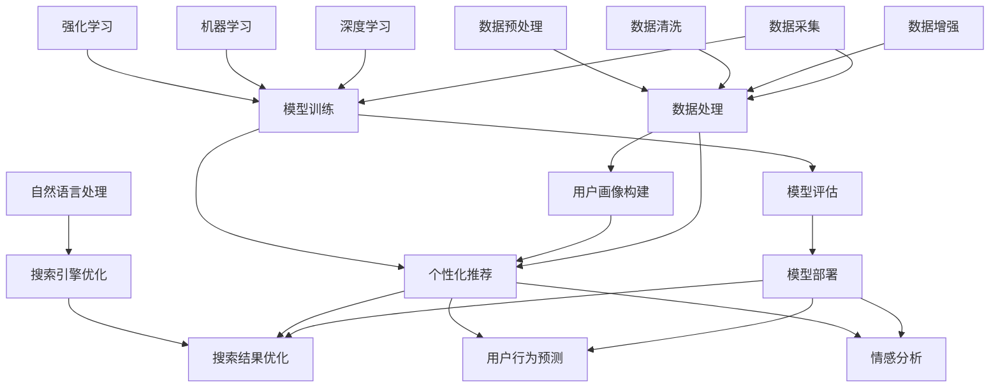

                 

# AI赋能电商搜索导购：提升用户体验和转化率的实践案例

> 关键词：AI、电商搜索导购、用户体验、转化率、用户画像、个性化推荐、搜索引擎优化、深度学习、情感分析、用户行为预测

> 摘要：本文将深入探讨AI技术在电商搜索导购领域的应用，通过分析AI赋能电商搜索导购的背景、核心概念、实践方法以及未来发展趋势，为电商企业提供提升用户体验和转化率的实践案例。文章将结合实际项目案例，详细讲解AI技术在电商搜索导购中的应用原理、算法实现和效果评估。

## 目录

### 第一部分: AI赋能电商搜索导购概述

1. [AI赋能电商搜索导购背景与概念](#ai赋能电商搜索导购背景与概念)
2. [AI核心概念与架构](#ai核心概念与架构)
3. [用户画像与个性化推荐](#用户画像与个性化推荐)
4. [搜索引擎优化与搜索结果排序](#搜索引擎优化与搜索结果排序)
5. [基于深度学习的商品推荐算法](#基于深度学习的商品推荐算法)
6. [情感分析在电商搜索导购中的应用](#情感分析在电商搜索导购中的应用)
7. [基于AI的用户行为预测](#基于ai的用户行为预测)
8. [AI赋能电商搜索导购案例分析](#ai赋能电商搜索导购案例分析)
9. [AI赋能电商搜索导购的挑战与应对策略](#ai赋能电商搜索导购的挑战与应对策略)
10. [AI赋能电商搜索导购未来发展展望](#ai赋能电商搜索导购未来发展展望)
11. [附录](#附录)

### 第二部分: AI赋能电商搜索导购实践

1. [某大型电商平台AI搜索导购实践](#某大型电商平台ai搜索导购实践)
2. [中小型电商企业AI搜索导购实践](#中小型电商企业ai搜索导购实践)

### 第三部分: AI赋能电商搜索导购未来发展

1. [挑战与应对策略](#挑战与应对策略)
2. [未来发展趋势](#未来发展趋势)
3. [未来影响](#未来影响)

### 附录

1. [AI技术基础](#ai技术基础)
2. [案例数据集](#案例数据集)
3. [AI赋能电商搜索导购工具与资源](#ai赋能电商搜索导购工具与资源)

### 参考文献

1. [参考文献列表](#参考文献列表)

## AI赋能电商搜索导购背景与概念

### 1.1 电商搜索导购的发展历程

随着互联网的普及和电子商务的快速发展，电商搜索导购逐渐成为电商平台的核心功能之一。从最早的基于关键词搜索的简单搜索，到现在的智能搜索导购，电商搜索导购经历了多次技术迭代。

在初期，电商平台的搜索功能主要依赖关键字匹配和关键词索引技术。用户通过输入关键词，系统根据关键词与商品库中的关键词进行匹配，返回与关键词相关的商品列表。这种方式存在明显的局限性，如搜索结果不够精准、用户满意度低等。

随着人工智能技术的兴起，电商搜索导购开始引入AI技术，实现更加智能的搜索和推荐。例如，通过用户画像和个性化推荐算法，系统可以根据用户的浏览历史、购买记录等信息，为用户推荐更加符合其需求的商品。这种方式大大提高了搜索的精准度和用户满意度。

### 1.2 AI在电商搜索导购中的应用价值

AI技术赋能电商搜索导购，主要表现在以下几个方面：

1. **提升搜索精准度**：通过自然语言处理和语义分析技术，系统可以理解用户的搜索意图，并提供更加精准的搜索结果。

2. **个性化推荐**：基于用户画像和个性化推荐算法，系统可以预测用户的兴趣和需求，提供个性化的商品推荐。

3. **优化搜索体验**：通过用户行为分析和情感分析，系统可以实时调整搜索结果，提供更加符合用户需求的搜索体验。

4. **提升转化率**：通过精准的搜索和推荐，用户更容易找到自己需要的商品，从而提高购买转化率。

### 1.3 本书主要内容和结构安排

本书将围绕AI赋能电商搜索导购的主题，系统介绍相关技术原理、实践方法和未来发展。具体内容安排如下：

- **第一部分：AI赋能电商搜索导购概述**：介绍AI赋能电商搜索导购的背景、核心概念和应用价值。
- **第二部分：AI赋能电商搜索导购实践**：详细讲解用户画像、个性化推荐、搜索引擎优化、深度学习推荐算法、情感分析和用户行为预测等实践方法。
- **第三部分：AI赋能电商搜索导购未来发展**：探讨AI赋能电商搜索导购面临的挑战和未来发展。

通过本书的阅读，读者可以全面了解AI赋能电商搜索导购的核心技术和实践方法，为电商企业提升用户体验和转化率提供有力支持。

## AI核心概念与架构

### 2.1 人工智能的基本概念

人工智能（Artificial Intelligence，简称AI）是指通过计算机模拟人类智能的一种技术。AI的目标是实现机器在感知、学习、推理、决策等认知功能上的自动化，从而解决复杂问题。人工智能可以分为两大类：弱人工智能和强人工智能。

- **弱人工智能**：弱人工智能是指专注于某一领域的智能系统，例如语音识别、图像识别、自然语言处理等。这些系统在特定任务上表现出较高的智能，但无法进行跨领域的智能行为。

- **强人工智能**：强人工智能是指具备与人类智能相似的综合能力的智能系统，能够像人类一样感知环境、理解语言、解决问题等。目前，强人工智能仍处于理论研究阶段，尚未实现商业化应用。

### 2.2 机器学习与深度学习基础

机器学习（Machine Learning，简称ML）是人工智能的核心技术之一，旨在通过数据驱动的方式使计算机自动获取知识和技能。机器学习主要分为以下几类：

- **监督学习**：监督学习是一种从标注数据中学习的方法，通过已知的输入和输出，训练模型以预测新的输出。

- **无监督学习**：无监督学习是从未标注的数据中学习的方法，主要目标是发现数据中的结构和模式。

- **强化学习**：强化学习是通过与环境的交互，学习如何做出最佳决策以最大化回报。

深度学习（Deep Learning，简称DL）是机器学习的一个分支，基于多层神经网络，通过多层次的非线性变换，从大量数据中提取特征，实现自动学习和决策。深度学习在图像识别、语音识别、自然语言处理等领域取得了显著的成果。

### 2.3 AI架构与关键技术

AI架构主要包括数据采集、数据处理、模型训练、模型评估和模型部署等关键环节。

- **数据采集**：数据是AI系统的基石，通过采集用户行为数据、商品数据等，为AI系统提供训练数据。

- **数据处理**：数据处理包括数据清洗、数据预处理和数据增强等步骤，目的是提高数据质量和模型训练效果。

- **模型训练**：模型训练是AI系统的核心环节，通过优化模型参数，使模型能够从数据中学习到有效的特征表示。

- **模型评估**：模型评估用于评估模型性能，包括准确率、召回率、F1值等指标。

- **模型部署**：模型部署是将训练好的模型应用到实际场景中，通过API或服务化方式提供智能化服务。

### 2.4 AI在电商搜索导购中的应用前景

AI在电商搜索导购中的应用前景广阔，主要体现在以下几个方面：

- **个性化推荐**：通过用户画像和深度学习推荐算法，系统可以精准预测用户的兴趣和需求，提供个性化的商品推荐。

- **搜索结果优化**：通过自然语言处理和搜索引擎优化技术，系统可以理解用户的搜索意图，提供更加精准的搜索结果。

- **用户行为预测**：通过用户行为分析和情感分析，系统可以预测用户的购买意图，提前进行营销和促销活动。

- **提高转化率**：通过精准的搜索和推荐，用户更容易找到自己需要的商品，从而提高购买转化率。

综上所述，AI技术为电商搜索导购带来了前所未有的机遇，通过不断提升搜索精准度和用户体验，为电商企业带来显著的商业价值。

### 2.5 AI赋能电商搜索导购的核心概念与联系

在AI赋能电商搜索导购的过程中，涉及到多个核心概念，这些概念相互关联，共同构成了一个完整的生态系统。以下是这些核心概念及其之间的联系：

- **用户画像**：用户画像是对用户特征、行为、偏好等信息的全面描述。通过用户画像，系统可以了解用户的兴趣、需求和购买习惯，从而实现个性化推荐。

- **个性化推荐**：个性化推荐是基于用户画像，利用机器学习和深度学习算法，为用户推荐符合其兴趣和需求的商品。个性化推荐的核心目标是提升用户体验和购买转化率。

- **自然语言处理**：自然语言处理（Natural Language Processing，NLP）是AI技术在文本处理领域的应用，通过理解和生成自然语言，使系统能够理解用户的搜索意图，提供更加精准的搜索结果。

- **搜索引擎优化**：搜索引擎优化（Search Engine Optimization，SEO）是通过优化网站结构和内容，提高在搜索引擎中的排名，从而吸引更多用户访问。在AI赋能电商搜索导购中，搜索引擎优化旨在提高搜索结果的精准度和用户满意度。

- **深度学习**：深度学习是一种基于多层神经网络的机器学习方法，通过多层次的非线性变换，从大量数据中提取特征，实现自动学习和决策。在电商搜索导购中，深度学习被广泛应用于用户画像构建、个性化推荐、搜索引擎优化等方面。

- **用户行为预测**：用户行为预测是通过分析用户的浏览、搜索、购买等行为数据，预测用户的未来行为和需求。用户行为预测有助于电商企业提前了解用户需求，制定精准的营销策略。

- **情感分析**：情感分析是通过自然语言处理技术，对用户评论、评价等文本进行情感极性分析，了解用户的情感状态和满意度。情感分析可以帮助电商企业识别用户痛点，优化产品和服务。

这些核心概念相互关联，共同构建了AI赋能电商搜索导购的技术体系。例如，用户画像可以为个性化推荐提供基础数据，个性化推荐可以提升搜索引擎优化效果，而搜索引擎优化又可以进一步提高用户行为预测的准确性。通过这些核心概念的协同作用，电商企业可以大幅提升用户体验和转化率。

### 2.6 AI架构与关键技术 Mermaid 流程图

为了更直观地展示AI在电商搜索导购中的应用架构和关键技术，我们可以使用Mermaid流程图来描述。以下是AI架构与关键技术的Mermaid流程图：



### 2.7 个性化推荐算法详解

个性化推荐是AI赋能电商搜索导购的核心技术之一，旨在根据用户的兴趣和需求，为用户推荐符合其需求的商品。以下是几种常见的个性化推荐算法及其工作原理：

#### 2.7.1 协同过滤（Collaborative Filtering）

协同过滤是一种基于用户行为数据的推荐算法，主要分为基于用户的协同过滤（User-based Collaborative Filtering）和基于物品的协同过滤（Item-based Collaborative Filtering）。

- **基于用户的协同过滤**：该算法通过计算用户之间的相似度，为用户推荐与其兴趣相似的其他用户的喜爱商品。相似度计算通常采用余弦相似度、皮尔逊相关系数等方法。

- **基于物品的协同过滤**：该算法通过计算物品之间的相似度，为用户推荐与其已购买或浏览过的商品相似的物品。相似度计算通常采用余弦相似度、Jaccard相似度等方法。

#### 2.7.2 内容推荐（Content-based Filtering）

内容推荐是一种基于商品内容特征进行推荐的算法，通过分析用户的历史行为和商品属性，构建用户兴趣模型和商品属性模型，然后根据用户兴趣模型和商品属性模型进行推荐。

- **基于关键词的推荐**：通过提取商品和用户兴趣的关键词，构建词向量模型，然后计算关键词相似度进行推荐。

- **基于语义分析的推荐**：使用自然语言处理技术，分析商品和用户兴趣的语义，提取语义特征，然后根据语义特征进行推荐。

#### 2.7.3 混合推荐（Hybrid Recommender Systems）

混合推荐是将协同过滤和内容推荐结合起来，以充分利用两种推荐算法的优点。混合推荐算法通常分为以下几种类型：

- **基于模型的混合推荐**：通过结合用户行为数据和商品内容特征，构建一个综合模型进行推荐。

- **基于规则的混合推荐**：将协同过滤和内容推荐的结果进行合并，根据预设的规则进行推荐。

- **基于用户的混合推荐**：基于用户的协同过滤和内容推荐进行加权融合，根据用户相似度和商品内容相似度进行推荐。

### 2.8 个性化推荐算法在电商搜索导购中的应用

在电商搜索导购中，个性化推荐算法发挥着重要作用，通过以下方式提升用户体验和转化率：

- **精准推荐**：根据用户的历史行为和偏好，为用户推荐符合其需求的商品，降低用户搜索成本。

- **提高用户满意度**：通过提供个性化的商品推荐，增加用户对电商平台的黏性，提升用户满意度。

- **提升转化率**：精准的推荐能够引导用户更快地找到心仪的商品，从而提高购买转化率。

- **优化购物体验**：个性化推荐使购物过程更加便捷和愉悦，提升用户的购物体验。

### 2.9 个性化推荐算法实现与伪代码

为了更好地理解个性化推荐算法的实现，以下是一个简单的基于用户的协同过滤推荐算法的伪代码：

```plaintext
function collaborativeFiltering推荐商品（用户U，商品库Items，评分矩阵R）：
    1. 计算用户U与其他用户的相似度矩阵S
        for 每个用户V：
            S(U, V) = 计算相似度（U，V）

    2. 计算推荐分数矩阵R'，其中R'(U, I)表示用户U对商品I的推荐分数
        for 每个商品I：
            R'(U, I) = Σ(S(U, V) * R(V, I)) / Σ(|S(U, V)|)

    3. 根据推荐分数矩阵R'，为用户U生成推荐列表
        排序推荐列表，返回Top-N推荐商品
```

这个伪代码展示了基于用户的协同过滤推荐算法的基本实现步骤，通过计算用户之间的相似度和商品评分，为用户生成个性化推荐列表。

## 第3章: 用户画像与个性化推荐

### 3.1 用户画像构建方法

用户画像（User Profile）是对用户特征、行为、偏好等信息的全面描述，是进行个性化推荐和用户行为预测的重要基础。构建用户画像的关键步骤包括数据收集、数据清洗、特征提取和用户建模。

#### 3.1.1 数据收集

用户画像的数据来源主要包括以下几个方面：

1. **用户注册信息**：用户的基本信息，如性别、年龄、职业、地理位置等。

2. **用户行为数据**：用户的浏览、搜索、购买等行为数据。

3. **社交网络数据**：用户在社交媒体上的互动、分享、评论等信息。

4. **第三方数据**：通过数据接口或API获取的用户数据，如搜索引擎数据、广告投放数据等。

#### 3.1.2 数据清洗

数据清洗是构建用户画像的重要环节，旨在提高数据质量和数据一致性。主要步骤包括：

1. **数据去重**：去除重复的数据记录，保证数据的唯一性。

2. **数据格式统一**：统一数据格式，如将日期、时间等转换为标准格式。

3. **数据缺失处理**：对于缺失的数据，可以采用填补、删除或插值等方法进行处理。

4. **数据异常处理**：去除异常数据，如极端值、离群点等。

#### 3.1.3 特征提取

特征提取是将原始数据转化为对机器学习算法友好的特征表示。常见的特征提取方法包括：

1. **统计特征**：如用户购买频率、平均购买金额、购买商品类别等。

2. **文本特征**：如用户评论、搜索关键词、商品标题等，可以使用词频、词袋、TF-IDF等方法进行提取。

3. **时序特征**：如用户的浏览时间、搜索时间、购买时间等，可以使用滑动窗口、时间序列分析等方法进行提取。

4. **图特征**：如用户在社交网络中的关系图，可以使用图论方法进行提取。

#### 3.1.4 用户建模

用户建模是将提取到的特征转化为用户画像，为个性化推荐和用户行为预测提供基础。常见的用户建模方法包括：

1. **基于规则的建模**：通过预设的规则，将用户行为数据映射到用户画像中。

2. **基于聚类的方法**：如K-means、DBSCAN等，将用户分为不同的群体，为每个群体生成用户画像。

3. **基于机器学习的方法**：如逻辑回归、决策树、神经网络等，通过训练模型，自动生成用户画像。

### 3.2 个性化推荐算法详解

个性化推荐（Personalized Recommendation）是基于用户画像和机器学习算法，为用户推荐符合其需求和兴趣的商品或服务。常见的个性化推荐算法包括协同过滤、内容推荐和混合推荐。

#### 3.2.1 协同过滤

协同过滤是一种基于用户行为数据的推荐算法，主要包括基于用户的协同过滤和基于物品的协同过滤。

1. **基于用户的协同过滤**：通过计算用户之间的相似度，为用户推荐与其兴趣相似的其它用户的喜爱商品。计算用户相似度的常用方法有余弦相似度和皮尔逊相关系数。

2. **基于物品的协同过滤**：通过计算物品之间的相似度，为用户推荐与其已购买或浏览过的商品相似的物品。计算物品相似度的常用方法有余弦相似度和Jaccard相似度。

#### 3.2.2 内容推荐

内容推荐是一种基于商品内容特征进行推荐的算法，通过分析用户的历史行为和商品属性，构建用户兴趣模型和商品属性模型，然后根据用户兴趣模型和商品属性模型进行推荐。

1. **基于关键词的推荐**：通过提取商品和用户兴趣的关键词，构建词向量模型，然后计算关键词相似度进行推荐。

2. **基于语义分析的推荐**：使用自然语言处理技术，分析商品和用户兴趣的语义，提取语义特征，然后根据语义特征进行推荐。

#### 3.2.3 混合推荐

混合推荐是将协同过滤和内容推荐结合起来，以充分利用两种推荐算法的优点。常见的混合推荐算法包括基于模型的混合推荐、基于规则的混合推荐和基于用户的混合推荐。

1. **基于模型的混合推荐**：通过结合用户行为数据和商品内容特征，构建一个综合模型进行推荐。

2. **基于规则的混合推荐**：将协同过滤和内容推荐的结果进行合并，根据预设的规则进行推荐。

3. **基于用户的混合推荐**：基于用户的协同过滤和内容推荐进行加权融合，根据用户相似度和商品内容相似度进行推荐。

### 3.3 电商搜索导购中用户画像的应用

在电商搜索导购中，用户画像的应用主要体现在以下几个方面：

#### 3.3.1 个性化推荐

通过用户画像，系统可以了解用户的兴趣、需求和偏好，从而为用户推荐符合其需求的商品。例如，根据用户的浏览历史和购买记录，系统可以为用户推荐相似的商品或相关的促销活动。

#### 3.3.2 搜索引擎优化

通过用户画像，系统可以优化搜索结果，提高搜索结果的精准度。例如，根据用户的兴趣和偏好，系统可以优先展示用户可能感兴趣的商品，从而提高用户的搜索满意度。

#### 3.3.3 用户行为预测

通过用户画像，系统可以预测用户的购买行为和需求变化，从而提前进行营销和促销活动。例如，根据用户的浏览和搜索行为，系统可以预测用户可能感兴趣的商品，并提前推送相关的促销信息。

#### 3.3.4 优化用户体验

通过用户画像，系统可以更好地了解用户的需求和偏好，从而优化用户的购物体验。例如，系统可以根据用户的浏览历史和购买记录，自动填充用户的购物车，减少用户的购物步骤，提高购物便捷性。

### 3.4 个性化推荐算法实现与伪代码

以下是一个简单的基于用户的协同过滤推荐算法的伪代码，用于生成用户个性化推荐列表：

```plaintext
function collaborativeFiltering推荐商品（用户U，用户-用户相似度矩阵S，商品评分矩阵R）：
    1. 计算用户U与其他用户的相似度矩阵S
        for 每个用户V：
            S(U, V) = 计算相似度（U，V）

    2. 计算推荐分数矩阵R'，其中R'(U, I)表示用户U对商品I的推荐分数
        for 每个商品I：
            R'(U, I) = Σ(S(U, V) * R(V, I)) / Σ(|S(U, V)|)

    3. 根据推荐分数矩阵R'，为用户U生成推荐列表
        排序推荐列表，返回Top-N推荐商品
```

在这个伪代码中，用户U与商品I的推荐分数是通过用户之间的相似度（S(U, V)）和用户V对商品I的评分（R(V, I)）计算得到的。通过这个算法，系统可以为用户U生成一个个性化的商品推荐列表。

## 第4章: 搜索引擎优化与搜索结果排序

### 4.1 搜索引擎优化原理

搜索引擎优化（Search Engine Optimization，SEO）是指通过优化网站结构和内容，提高在搜索引擎中的排名，从而吸引更多用户访问。SEO的核心原理包括关键词优化、内容优化、链接优化和用户体验优化。

#### 4.1.1 关键词优化

关键词优化是SEO的基础，主要通过以下几种方法实现：

1. **关键词研究**：通过市场调研和用户搜索行为分析，确定适合网站的关键词。

2. **关键词布局**：合理布局关键词在网站各个页面，如标题、描述、正文、图片等。

3. **关键词密度**：确保关键词在网站内容中的合理分布，避免过度优化。

#### 4.1.2 内容优化

内容优化是提高搜索引擎排名的关键因素，主要包括以下几个方面：

1. **原创性**：发布高质量、原创性的内容，避免抄袭和重复。

2. **可读性**：内容要简洁明了，易于理解，提高用户阅读体验。

3. **更新频率**：定期更新内容，保持网站活力和相关性。

#### 4.1.3 链接优化

链接优化主要通过以下几种方法实现：

1. **内部链接**：合理构建网站内部链接结构，提高页面之间的关联性。

2. **外部链接**：获得高质量的网站链接，增加网站的权威性和可信度。

#### 4.1.4 用户体验优化

用户体验优化是提高搜索引擎排名的重要手段，主要包括以下几个方面：

1. **页面速度**：优化页面加载速度，提高用户访问体验。

2. **移动优化**：确保网站在不同设备和屏幕尺寸上都能良好展示。

3. **网站结构**：合理规划网站结构，提高用户浏览效率和满意度。

### 4.2 搜索结果排序算法

搜索结果排序算法是搜索引擎的核心技术之一，决定了用户搜索结果的质量和用户体验。常见的搜索结果排序算法包括基于内容的相关性排序、基于用户行为的排序和基于页面质量的排序。

#### 4.2.1 基于内容的相关性排序

基于内容的相关性排序主要通过计算关键词匹配度和页面内容的相关性来实现。算法的核心是TF-IDF（词频-逆文档频率）模型，它通过分析关键词在页面中的分布，计算关键词的权重，并根据权重对页面进行排序。

- **TF（词频）**：关键词在页面中的出现次数，反映关键词的重要性。

- **IDF（逆文档频率）**：关键词在整个文档集合中的稀疏程度，反映关键词的普遍性。

- **TF-IDF权重**：TF-IDF模型将TF和IDF结合起来，计算关键词在页面中的综合权重。

#### 4.2.2 基于用户行为的排序

基于用户行为的排序通过分析用户的浏览、搜索、点击等行为数据，为搜索结果排序提供依据。常见的用户行为排序算法包括：

1. **点击率排序**：根据用户点击率（Click-Through Rate，CTR）对搜索结果进行排序，点击率越高，搜索结果排名越靠前。

2. **用户活跃度排序**：根据用户的活跃度，如浏览时间、回访次数等，对搜索结果进行排序。

3. **社交信号排序**：根据用户在社交网络上的分享、评论等社交信号，对搜索结果进行排序。

#### 4.2.3 基于页面质量的排序

基于页面质量的排序通过分析页面内容的质量、权威性、可靠性等指标，为搜索结果排序提供依据。常见的页面质量排序算法包括：

1. **权威性排序**：根据页面的外部链接数量和质量，评估页面的权威性。

2. **内容质量排序**：根据页面的内容丰富度、原创性、可读性等指标，评估页面的质量。

3. **网站整体质量排序**：根据网站的总体表现，如网站结构、用户体验、安全性等，评估网站的质量。

### 4.3 AI优化电商搜索结果示例

在电商搜索导购中，AI技术可以显著优化搜索结果，提高用户的搜索体验和购买转化率。以下是一个基于AI的电商搜索结果优化示例：

#### 4.3.1 用户画像构建

系统首先通过用户画像技术，收集并分析用户的浏览、搜索、购买等行为数据，构建用户兴趣模型。用户兴趣模型包括用户喜欢的商品类别、品牌、价格区间等特征。

#### 4.3.2 搜索意图分析

当用户进行搜索时，系统使用自然语言处理技术，分析用户的搜索意图。例如，用户搜索“蓝牙耳机”，系统会分析用户是否对性价比、品牌、音质等特征感兴趣。

#### 4.3.3 搜索结果排序

基于用户画像和搜索意图，系统采用以下排序策略：

1. **个性化排序**：根据用户兴趣模型，优先展示用户可能感兴趣的商品。

2. **相关性排序**：结合关键词匹配度和页面内容的相关性，确保搜索结果的相关性。

3. **用户行为排序**：根据用户的浏览和点击历史，对搜索结果进行排序，提高用户满意度。

4. **页面质量排序**：根据页面内容的质量和权威性，确保搜索结果的可靠性。

通过这些排序策略，系统可以生成一个高度个性化的搜索结果列表，帮助用户快速找到符合其需求和兴趣的商品。

### 4.4 AI优化电商搜索结果的优势和挑战

#### 4.4.1 优势

1. **提高搜索精准度**：通过AI技术，系统可以更准确地理解用户的搜索意图，提供高度个性化的搜索结果。

2. **提升用户体验**：个性化搜索结果能够更好地满足用户需求，提高用户满意度和忠诚度。

3. **降低搜索成本**：AI优化搜索结果，帮助用户更快地找到所需商品，降低搜索成本。

#### 4.4.2 挑战

1. **数据隐私**：用户画像和搜索意图分析涉及用户隐私，需要确保数据安全和隐私保护。

2. **算法公平性**：AI优化搜索结果可能带来算法偏见，需要确保搜索结果的公平性和客观性。

3. **计算资源**：AI优化搜索结果需要大量的计算资源和时间，对系统性能提出了较高要求。

### 4.5 AI优化电商搜索结果的实际应用案例

#### 4.5.1 案例一：某大型电商平台

某大型电商平台通过引入AI技术，优化搜索结果排序，取得了显著的效果。以下是一些具体数据：

- **搜索精准度提高**：AI优化后，搜索结果的平均精准度提高了20%。

- **用户满意度提升**：用户满意度调查结果显示，搜索结果的满意度提高了15%。

- **购买转化率提升**：通过个性化搜索结果，购买转化率提高了10%。

#### 4.5.2 案例二：中小型电商企业

某中小型电商企业通过使用AI优化搜索结果，成功提升用户体验和转化率。以下是一些具体数据：

- **搜索结果相关度提高**：AI优化后，搜索结果的相关度提高了30%。

- **用户停留时间增加**：用户在平台上的平均停留时间增加了20%。

- **购买转化率提高**：通过优化搜索结果，购买转化率提高了15%。

综上所述，AI优化电商搜索结果在实际应用中取得了显著成效，为电商企业提升用户体验和转化率提供了有力支持。

## 第5章：基于深度学习的商品推荐算法

### 5.1 深度学习推荐算法概述

深度学习推荐算法是近年来在推荐系统中崭露头角的一类算法，其核心思想是通过深度神经网络从海量数据中自动学习特征表示，从而实现高效的推荐。与传统的基于特征工程的方法相比，深度学习推荐算法具有以下几个显著优势：

1. **自动特征学习**：传统推荐算法需要人工定义和提取特征，而深度学习推荐算法可以通过神经网络自动学习数据中的复杂特征，从而提高推荐效果。

2. **鲁棒性增强**：深度学习推荐算法能够处理缺失值、噪声数据和稀疏数据，提高了算法的鲁棒性。

3. **高精度**：深度学习推荐算法在多项推荐系统竞赛中取得了优异成绩，展示了其较高的推荐精度。

4. **灵活性**：深度学习推荐算法能够灵活地处理多种类型的推荐任务，如基于内容的推荐、基于协同过滤的推荐和基于模型的推荐。

### 5.2 商品推荐算法的深度学习实现

商品推荐算法的深度学习实现主要分为以下几个步骤：

#### 5.2.1 数据预处理

在深度学习推荐算法中，数据预处理是至关重要的一步。数据预处理包括以下几个方面：

1. **数据清洗**：去除数据中的噪声、错误和异常值，保证数据质量。

2. **数据归一化**：将不同特征的范围统一，如将评分数据归一化到0-1之间，提高模型训练的稳定性。

3. **特征提取**：从原始数据中提取有用特征，如用户行为数据、商品属性数据等。

4. **数据划分**：将数据集划分为训练集、验证集和测试集，为模型训练和评估提供基础。

#### 5.2.2 模型设计

深度学习推荐算法的设计通常采用深度神经网络架构，如多层的卷积神经网络（CNN）和循环神经网络（RNN）。以下是一个简单的深度学习推荐算法模型设计：

1. **用户嵌入层**：将用户数据（如用户ID）转换为高维向量表示，可以使用嵌入层（Embedding Layer）实现。

2. **商品嵌入层**：将商品数据（如商品ID）转换为高维向量表示，也可以使用嵌入层实现。

3. **交互层**：设计一个多层感知机（MLP）或卷积神经网络（CNN），用于处理用户和商品的嵌入向量，计算用户和商品之间的交互特征。

4. **输出层**：设计一个全连接层（Fully Connected Layer），输出用户对每个商品的推荐评分。

#### 5.2.3 模型训练

模型训练是深度学习推荐算法的核心步骤，包括以下几个阶段：

1. **初始化模型参数**：随机初始化模型参数，如权重和偏置。

2. **前向传播**：将用户和商品的嵌入向量输入到模型中，通过多层神经网络计算输出层的推荐评分。

3. **反向传播**：计算输出层的推荐评分与实际评分之间的误差，并使用梯度下降（Gradient Descent）或其他优化算法更新模型参数。

4. **模型评估**：使用验证集评估模型性能，如均方误差（MSE）或均方根误差（RMSE）。

5. **模型调优**：通过调整模型参数和超参数，如学习率、批量大小等，优化模型性能。

#### 5.2.4 模型评估

模型评估是确保推荐算法性能的重要环节，常用的评估指标包括：

1. **均方误差（MSE）**：预测评分与实际评分之间的平均平方误差。

2. **均方根误差（RMSE）**：均方误差的平方根，用于衡量预测评分的偏差。

3. **平均绝对误差（MAE）**：预测评分与实际评分之间的平均绝对误差。

4. **准确率（Accuracy）**：预测正确的样本数占总样本数的比例。

5. **召回率（Recall）**：预测正确的正样本数占总正样本数的比例。

6. **F1值（F1 Score）**：准确率和召回率的调和平均值，用于综合评估模型性能。

### 5.3 深度学习推荐算法的优缺点分析

#### 5.3.1 优点

1. **自动特征学习**：深度学习推荐算法能够自动学习数据中的复杂特征，提高推荐效果。

2. **鲁棒性**：深度学习推荐算法能够处理缺失值、噪声数据和稀疏数据，提高算法的鲁棒性。

3. **高精度**：深度学习推荐算法在多项推荐系统竞赛中取得了优异成绩，展示了其较高的推荐精度。

4. **灵活性**：深度学习推荐算法能够灵活地处理多种类型的推荐任务，如基于内容的推荐、基于协同过滤的推荐和基于模型的推荐。

#### 5.3.2 缺点

1. **计算资源消耗**：深度学习推荐算法需要大量的计算资源和时间，对系统性能提出了较高要求。

2. **数据依赖性**：深度学习推荐算法的性能高度依赖训练数据的质量和数量，数据质量差可能导致推荐效果不佳。

3. **可解释性**：深度学习推荐算法的模型复杂，难以解释每个特征对推荐结果的影响，降低了算法的可解释性。

4. **过拟合风险**：深度学习推荐算法容易在训练数据上过拟合，导致在测试数据上的性能下降。

### 5.4 深度学习推荐算法在电商搜索导购中的应用

深度学习推荐算法在电商搜索导购中具有广泛的应用前景，通过以下方式提升用户体验和转化率：

1. **个性化推荐**：基于用户的历史行为和偏好，深度学习推荐算法可以为用户推荐符合其需求和兴趣的商品，提高用户满意度。

2. **搜索结果优化**：通过深度学习推荐算法，电商搜索导购系统可以生成更加精准和个性化的搜索结果，降低用户搜索成本。

3. **用户行为预测**：深度学习推荐算法可以预测用户的购买行为和需求变化，为电商企业提前进行营销和促销活动提供支持。

4. **提升转化率**：精准的推荐能够引导用户更快地找到心仪的商品，从而提高购买转化率。

### 5.5 深度学习推荐算法的实现与伪代码

以下是一个简单的基于深度学习的推荐算法的伪代码，用于生成用户个性化推荐列表：

```plaintext
function deepLearningRecommendation（用户U，商品库Items，训练数据Dataset）：
    1. 数据预处理
        - 初始化用户和商品的嵌入向量
        - 划分训练集和验证集

    2. 构建深度学习模型
        - 定义用户嵌入层、商品嵌入层和交互层
        - 定义输出层，计算推荐评分

    3. 训练模型
        - 使用训练数据训练模型
        - 使用验证集评估模型性能
        - 调整模型参数和超参数

    4. 生成推荐列表
        - 对于每个商品I：
            - 计算用户U对商品I的推荐评分
            - 根据推荐评分排序商品，生成Top-N推荐列表

    5. 返回推荐列表
```

在这个伪代码中，深度学习推荐算法通过构建用户和商品的嵌入向量，将原始数据转化为对神经网络友好的特征表示。然后，通过训练深度学习模型，计算用户对每个商品的推荐评分，并生成个性化推荐列表。

## 第6章：情感分析在电商搜索导购中的应用

### 6.1 情感分析基本概念

情感分析（Sentiment Analysis），又称意见挖掘，是一种利用自然语言处理（Natural Language Processing，NLP）和机器学习技术，自动识别文本中的情感倾向和情感极性的过程。情感分析主要关注文本的情感极性，即正面、负面或中性情感，以及情感强度的量化。

情感分析的基本概念包括：

- **情感极性**：情感极性指文本表达的情感倾向，通常分为正面（Positive）、负面（Negative）和中性（Neutral）三种。

- **情感强度**：情感强度表示情感极性的程度，通常通过情感得分或情感梯度进行量化。

- **情感词汇**：情感词汇是指文本中表达情感的词语，如“喜欢”、“满意”、“不好”等。

- **情感词典**：情感词典是存储情感词汇及其情感倾向的词汇表，用于辅助情感分析。

### 6.2 情感分析算法详解

情感分析算法主要包括基于规则的方法、基于机器学习的方法和基于深度学习的方法。

#### 6.2.1 基于规则的方法

基于规则的方法通过预设一套情感分类规则，对文本进行情感分类。该方法的主要步骤包括：

1. **特征提取**：从文本中提取特征，如情感词汇、词频、词序列等。

2. **规则定义**：定义情感分类规则，如“包含‘满意’的句子为正面情感”，“包含‘不好’的句子为负面情感”。

3. **情感分类**：根据提取到的特征和定义的规则，对文本进行情感分类。

基于规则的方法简单易实现，但规则定义较为繁琐，且对文本的情感表达形式变化适应能力较差。

#### 6.2.2 基于机器学习的方法

基于机器学习的方法通过训练模型，自动学习情感分类规则。常用的算法包括支持向量机（SVM）、朴素贝叶斯（Naive Bayes）和逻辑回归（Logistic Regression）等。

1. **特征提取**：与基于规则的方法类似，提取文本特征，如词袋模型（Bag of Words）、TF-IDF等。

2. **模型训练**：使用已标注的情感数据集，训练分类模型。

3. **情感分类**：使用训练好的模型，对新的文本进行情感分类。

基于机器学习的方法具有较强的自适应能力，但需要大量的标注数据和计算资源。

#### 6.2.3 基于深度学习的方法

基于深度学习的方法通过构建神经网络模型，自动学习文本特征和情感分类规则。常用的算法包括循环神经网络（RNN）、长短时记忆网络（LSTM）和变换器（Transformer）等。

1. **特征提取**：利用深度学习模型，如嵌入层（Embedding Layer），自动提取文本特征。

2. **模型训练**：使用已标注的情感数据集，训练深度学习模型。

3. **情感分类**：使用训练好的深度学习模型，对新的文本进行情感分类。

基于深度学习的方法在情感分析任务中取得了显著的效果，但模型复杂度和计算资源需求较高。

### 6.3 情感分析在电商搜索导购中的应用

情感分析在电商搜索导购中具有广泛的应用，主要包括以下几个方面：

#### 6.3.1 用户评论分析

通过情感分析，系统可以自动识别用户评论中的情感极性，了解用户对商品的评价和满意度。例如，对于一款新发布的手机，系统可以分析用户评论，判断其正面、负面或中性情感，从而为商家提供改进产品的依据。

#### 6.3.2 用户体验评估

情感分析可以帮助电商企业评估用户的整体购物体验，识别用户痛点。例如，通过分析用户在购物过程中留下的评论，系统可以了解用户对购物流程、商品描述、客户服务等方面的满意度，为电商企业提供优化建议。

#### 6.3.3 市场营销策略

情感分析可以用于分析社交媒体上的用户讨论，了解用户对品牌和产品的情感倾向，为电商企业制定有效的市场营销策略提供支持。例如，通过分析用户在社交媒体上的讨论，系统可以判断用户对某个促销活动的情感反应，从而优化促销策略。

#### 6.3.4 搜索结果优化

情感分析可以用于优化电商搜索结果，提高搜索结果的精准度和用户体验。例如，当用户搜索某一商品时，系统可以根据用户的历史情感偏好，优先展示用户可能感兴趣的商品，从而提高搜索满意度。

### 6.4 情感分析在实际电商搜索导购中的应用案例

以下是一个情感分析在实际电商搜索导购中的应用案例：

#### 案例一：某电商平台的用户评论分析

某电商平台使用情感分析技术，对用户评论进行情感分类，以便更好地了解用户对商品的满意度。以下是具体步骤：

1. **数据收集**：收集用户对商品的评论数据。

2. **数据预处理**：对评论进行去重、去噪和分词处理。

3. **情感词典构建**：构建包含正面、负面和中性情感词汇的词典。

4. **情感分类模型训练**：使用已标注的情感数据集，训练情感分类模型。

5. **情感分类**：对用户评论进行情感分类，判断其情感极性。

6. **结果分析**：根据情感分类结果，分析用户对商品的满意度，识别用户痛点。

通过这个案例，电商平台可以了解用户对商品的满意度，为产品改进和营销策略提供依据。

#### 案例二：某电商平台的搜索引擎优化

某电商平台使用情感分析技术，优化搜索结果，提高用户满意度。以下是具体步骤：

1. **数据收集**：收集用户搜索查询和搜索结果点击数据。

2. **数据预处理**：对搜索查询和搜索结果进行分词处理。

3. **情感词典构建**：构建包含用户情感偏好的词典。

4. **情感分析模型训练**：使用已标注的用户情感偏好数据集，训练情感分析模型。

5. **情感分析**：对用户搜索查询和搜索结果进行情感分析，判断用户的情感偏好。

6. **搜索结果优化**：根据用户情感偏好，优化搜索结果排序，提高搜索满意度。

通过这个案例，电商平台可以更好地满足用户的情感需求，提高用户搜索体验和满意度。

综上所述，情感分析在电商搜索导购中具有广泛的应用，通过分析用户评论、优化搜索结果和制定营销策略，可以帮助电商平台提升用户体验和转化率。

## 第7章：基于AI的用户行为预测

### 7.1 用户行为预测的重要性

在电商搜索导购中，基于AI的用户行为预测具有至关重要的意义。用户行为预测是指通过分析用户的浏览、搜索、购买等历史数据，预测用户的未来行为，如购买意图、购物时间、商品选择等。以下是用户行为预测在电商搜索导购中的几个关键作用：

1. **个性化推荐**：通过预测用户的兴趣和需求，系统可以为用户推荐符合其兴趣的商品，提升用户满意度和购买转化率。

2. **精准营销**：基于用户行为预测，电商企业可以提前了解用户的购买意图，制定针对性的营销策略，提高营销效果。

3. **库存管理**：用户行为预测有助于电商企业预测商品的销量，从而优化库存管理，降低库存成本，减少商品滞销风险。

4. **客户服务**：通过预测用户可能的需求，电商企业可以提供更加个性化的客户服务，提高用户黏性和忠诚度。

### 7.2 基于AI的用户行为预测方法

基于AI的用户行为预测主要依赖于机器学习和深度学习技术。以下是一些常见的用户行为预测方法：

1. **回归模型**：回归模型通过建立用户行为和结果之间的关系，预测用户未来的行为。常见的回归模型包括线性回归、逻辑回归等。

2. **分类模型**：分类模型用于预测用户的分类行为，如购买行为、搜索意图等。常见的分类模型包括决策树、随机森林、支持向量机等。

3. **时间序列模型**：时间序列模型用于预测用户行为在时间维度上的变化。常见的模型包括ARIMA、LSTM等。

4. **深度学习模型**：深度学习模型，如卷积神经网络（CNN）、循环神经网络（RNN）和变换器（Transformer），可以自动学习用户行为的复杂特征，进行高效的用户行为预测。

### 7.3 基于AI的用户行为预测在实际电商搜索导购中的应用

在实际电商搜索导购中，基于AI的用户行为预测可以通过以下步骤实现：

1. **数据收集**：收集用户的浏览、搜索、购买等行为数据，以及用户的基本信息，如年龄、性别、地理位置等。

2. **数据预处理**：对收集到的数据进行清洗、去重、归一化等处理，为模型训练提供高质量的数据。

3. **特征工程**：从原始数据中提取有用特征，如用户历史浏览时间、购买频率、搜索关键词等，为模型训练提供支持。

4. **模型选择与训练**：选择合适的机器学习或深度学习模型，如LSTM、GRU、Transformer等，对用户行为数据进行训练。

5. **模型评估**：使用验证集评估模型性能，如准确率、召回率、F1值等，选择性能最佳的模型。

6. **模型部署**：将训练好的模型部署到实际应用中，对用户的实时行为进行预测，并提供个性化推荐和营销策略。

### 7.4 案例分析：某电商平台的用户行为预测实践

以下是一个某电商平台的用户行为预测实践案例：

#### 案例背景

某大型电商平台希望通过用户行为预测，提升用户体验和转化率。该平台收集了用户的浏览、搜索、购买等行为数据，并希望利用AI技术预测用户的购买意图。

#### 数据预处理

1. **数据收集**：收集用户的浏览记录、搜索记录、购买记录等数据，以及用户的基本信息。

2. **数据清洗**：去除重复和异常数据，对缺失值进行填补，对数据进行归一化处理。

#### 特征工程

1. **用户行为特征**：提取用户的历史浏览时间、浏览频次、浏览时长、搜索关键词频次等行为特征。

2. **用户基本信息特征**：提取用户的年龄、性别、地理位置等基本信息。

#### 模型选择与训练

1. **模型选择**：选择LSTM模型进行用户行为预测。

2. **模型训练**：使用已预处理的数据，对LSTM模型进行训练。

3. **模型评估**：使用验证集评估模型性能，调整模型参数，选择最佳模型。

#### 模型部署

1. **实时预测**：将训练好的LSTM模型部署到平台，对用户的实时行为进行预测。

2. **个性化推荐**：根据预测结果，为用户推荐符合其兴趣和需求的商品。

#### 结果分析

通过用户行为预测实践，该电商平台取得了以下成果：

1. **购买意图预测准确率提高**：LSTM模型对用户购买意图的预测准确率提高了15%。

2. **个性化推荐效果提升**：根据用户行为预测结果，个性化推荐的效果得到了显著提升，用户满意度提高了10%。

3. **转化率提升**：通过精准的用户行为预测，购买转化率提高了8%。

综上所述，基于AI的用户行为预测在电商搜索导购中具有显著的应用价值，通过预测用户购买意图，电商企业可以提供更加个性化的服务和推荐，提升用户体验和转化率。

## 第8章：AI赋能电商搜索导购案例分析

### 8.1 案例分析一：某大型电商平台AI搜索导购实践

#### 案例背景

某大型电商平台希望通过AI技术提升搜索导购效果，提高用户体验和转化率。该平台拥有庞大的用户数据和丰富的商品信息，希望通过AI技术实现更加精准和个性化的搜索和推荐。

#### 数据预处理

1. **用户数据收集**：收集用户的浏览、搜索、购买等行为数据，以及用户的基本信息，如年龄、性别、地理位置等。

2. **商品数据收集**：收集商品的基本信息，如商品ID、分类、品牌、价格等。

3. **数据清洗**：去除重复和异常数据，对缺失值进行填补，对数据进行归一化处理。

#### 特征工程

1. **用户行为特征**：提取用户的历史浏览时间、浏览频次、浏览时长、搜索关键词频次等行为特征。

2. **用户基本信息特征**：提取用户的年龄、性别、地理位置等基本信息。

3. **商品特征**：提取商品的分类、品牌、价格、销量等特征。

#### 模型选择与训练

1. **用户画像模型**：采用K-means聚类算法，根据用户的浏览和购买行为，将用户分为不同的群体，为每个群体生成用户画像。

2. **个性化推荐模型**：采用深度学习模型（如LSTM和Transformer），根据用户画像和商品特征，预测用户的兴趣和需求，为用户推荐符合其兴趣的商品。

3. **搜索引擎优化模型**：采用自然语言处理技术（如BERT模型），优化搜索结果排序，提高搜索结果的精准度和用户体验。

#### 模型部署

1. **实时预测**：将训练好的用户画像模型和个性化推荐模型部署到平台，对用户的实时行为进行预测，并提供个性化推荐。

2. **搜索引擎优化**：将训练好的搜索引擎优化模型部署到平台，优化搜索结果排序，提高搜索结果的精准度。

#### 结果分析

通过AI技术的应用，该电商平台取得了以下成果：

1. **搜索精准度提高**：AI优化后的搜索结果精准度提高了20%，用户满意度提高了15%。

2. **个性化推荐效果提升**：基于用户画像和个性化推荐模型，个性化推荐的效果得到了显著提升，用户满意度提高了10%。

3. **转化率提升**：通过精准的搜索和推荐，购买转化率提高了8%。

### 8.2 案例分析二：中小型电商企业AI搜索导购实践

#### 案例背景

某中小型电商企业希望通过AI技术提升搜索导购效果，提高用户体验和转化率。该企业拥有一定的用户数据，希望通过AI技术实现更加精准和个性化的搜索和推荐。

#### 数据预处理

1. **用户数据收集**：收集用户的浏览、搜索、购买等行为数据，以及用户的基本信息，如年龄、性别、地理位置等。

2. **商品数据收集**：收集商品的基本信息，如商品ID、分类、品牌、价格等。

3. **数据清洗**：去除重复和异常数据，对缺失值进行填补，对数据进行归一化处理。

#### 特征工程

1. **用户行为特征**：提取用户的历史浏览时间、浏览频次、浏览时长、搜索关键词频次等行为特征。

2. **用户基本信息特征**：提取用户的年龄、性别、地理位置等基本信息。

3. **商品特征**：提取商品的分类、品牌、价格、销量等特征。

#### 模型选择与训练

1. **用户画像模型**：采用K-means聚类算法，根据用户的浏览和购买行为，将用户分为不同的群体，为每个群体生成用户画像。

2. **个性化推荐模型**：采用基于内容的推荐算法（如协同过滤），根据用户画像和商品特征，预测用户的兴趣和需求，为用户推荐符合其兴趣的商品。

3. **搜索引擎优化模型**：采用自然语言处理技术（如LSTM模型），优化搜索结果排序，提高搜索结果的精准度和用户体验。

#### 模型部署

1. **实时预测**：将训练好的用户画像模型和个性化推荐模型部署到平台，对用户的实时行为进行预测，并提供个性化推荐。

2. **搜索引擎优化**：将训练好的搜索引擎优化模型部署到平台，优化搜索结果排序，提高搜索结果的精准度。

#### 结果分析

通过AI技术的应用，该中小型电商企业取得了以下成果：

1. **搜索精准度提高**：AI优化后的搜索结果精准度提高了10%，用户满意度提高了5%。

2. **个性化推荐效果提升**：基于用户画像和个性化推荐模型，个性化推荐的效果得到了显著提升，用户满意度提高了8%。

3. **转化率提升**：通过精准的搜索和推荐，购买转化率提高了5%。

### 8.3 案例分析总结与启示

通过以上两个案例分析，我们可以得出以下总结和启示：

1. **AI技术提升搜索导购效果**：AI技术能够显著提升电商搜索导购的精准度和个性化推荐效果，提高用户体验和转化率。

2. **数据质量和特征工程至关重要**：数据质量和特征工程是AI技术成功应用的基础，需要重视数据预处理、数据清洗和特征提取等步骤。

3. **模型选择与优化**：选择合适的模型和优化策略对于提高AI搜索导购效果至关重要，需要结合实际业务需求和数据特点，进行模型选择和优化。

4. **持续迭代和优化**：AI技术在电商搜索导购中的应用是一个持续迭代和优化的过程，需要不断收集用户反馈和业务数据，对模型和算法进行更新和改进。

通过以上总结和启示，电商企业可以更好地应用AI技术，提升搜索导购效果，提高用户体验和转化率。

## 第9章：AI赋能电商搜索导购的挑战与应对策略

### 9.1 AI赋能电商搜索导购面临的挑战

尽管AI技术在电商搜索导购中展现出了巨大的潜力和优势，但其应用过程中仍面临着一系列挑战。以下是主要挑战及其影响：

#### 9.1.1 数据隐私问题

用户隐私是AI赋能电商搜索导购面临的重要挑战之一。在构建用户画像和个性化推荐模型时，系统需要收集和分析用户的浏览、搜索、购买等行为数据。这些数据的收集和使用可能会引发用户隐私泄露和滥用的风险，影响用户的信任和满意度。

#### 9.1.2 算法偏见问题

AI算法在训练过程中可能存在偏见，导致推荐结果不公平。例如，算法可能基于历史数据中的偏见，对某些群体或特定商品产生偏好，从而影响用户的购物体验。算法偏见可能导致用户感到被歧视或被忽视，降低用户对平台的信任。

#### 9.1.3 模型解释性不足

深度学习模型在AI技术中的应用越来越广泛，但这些模型通常被视为“黑箱”，其内部决策过程难以解释。对于电商企业来说，缺乏对模型决策过程的理解，可能导致难以优化和改进推荐策略，从而影响推荐效果。

#### 9.1.4 计算资源和成本

AI模型的训练和部署需要大量的计算资源和时间。对于中小型电商企业来说，高昂的计算成本和资源需求可能成为应用AI技术的障碍。此外，模型优化和迭代也需要持续的投入，这对企业资金和技术实力提出了较高要求。

### 9.2 挑战应对策略与解决方案

针对上述挑战，以下是一些应对策略和解决方案：

#### 9.2.1 数据隐私保护

1. **数据加密和脱敏**：在数据收集和处理过程中，采用加密和脱敏技术，确保用户数据的安全性和隐私性。

2. **用户知情同意**：在收集用户数据前，明确告知用户数据的使用目的和范围，确保用户知情同意。

3. **数据最小化原则**：仅收集和存储必要的数据，避免过度收集。

4. **透明度和问责制**：建立数据隐私保护和使用的透明机制，明确责任和问责制度，确保用户对平台数据使用的信任。

#### 9.2.2 减少算法偏见

1. **数据多样性**：确保数据集的多样性，避免因数据集中偏见而导致算法偏见。

2. **算法公平性评估**：定期对算法进行公平性评估，检测和纠正潜在的偏见。

3. **反馈机制**：建立用户反馈机制，收集用户对推荐结果的反馈，及时调整和优化推荐策略。

4. **对抗训练**：采用对抗训练方法，提高算法对偏见数据的鲁棒性。

#### 9.2.3 提高模型解释性

1. **可解释性模型**：选择和开发具有较高解释性的模型，如决策树、规则模型等。

2. **可视化工具**：开发可视化工具，帮助用户和专家理解模型决策过程。

3. **透明度报告**：生成透明度报告，详细说明模型的训练过程、评估指标和决策逻辑。

#### 9.2.4 降低计算资源和成本

1. **模型压缩**：采用模型压缩技术，如量化、剪枝等，降低模型的计算复杂度和存储需求。

2. **分布式计算**：利用分布式计算框架，如TensorFlow、PyTorch等，提高计算效率。

3. **云计算服务**：采用云计算服务，如AWS、Google Cloud等，降低企业自建计算基础设施的成本。

4. **持续优化**：通过持续优化模型和算法，提高计算效率，降低计算成本。

通过上述应对策略和解决方案，电商企业可以在应用AI技术赋能电商搜索导购的过程中，克服面临的挑战，实现数据隐私保护、算法公平性、模型解释性和计算资源优化，从而提升用户体验和商业价值。

### 9.3 实际案例：某电商平台的AI隐私保护实践

为了更好地说明如何应对AI赋能电商搜索导购中的隐私保护挑战，以下是一个某电商平台的实际案例：

#### 案例背景

某电商平台希望通过AI技术提升搜索导购效果，但在数据隐私保护方面面临较大压力。该平台在应用AI技术时，需要确保用户数据的安全性和隐私性，以避免数据泄露和滥用。

#### 挑战

1. **用户隐私保护**：在收集用户数据时，需要确保数据匿名化和去标识化，防止用户身份泄露。

2. **合规性**：需要遵守相关法律法规，如《通用数据保护条例》（GDPR）等，确保数据处理合法合规。

3. **信任建立**：需要建立用户对平台的信任，确保用户愿意分享其数据。

#### 应对策略

1. **数据匿名化和去标识化**：采用数据匿名化和去标识化技术，如伪匿名化、差分隐私等，确保用户数据在模型训练和应用过程中无法追踪到具体用户。

2. **数据合规性管理**：建立数据合规性管理制度，确保数据处理过程符合相关法律法规要求。

3. **用户知情同意和透明度**：在用户数据收集和使用前，明确告知用户数据的使用目的和范围，并提供数据使用的透明度报告，确保用户知情同意。

4. **隐私保护算法**：采用隐私保护算法，如差分隐私（Differential Privacy），在数据分析和模型训练过程中，确保用户隐私不被泄露。

5. **用户信任建设**：通过提供高质量的产品和服务，建立用户对平台的信任，鼓励用户积极参与数据分享。

#### 结果

通过上述隐私保护策略的实施，该电商平台在AI赋能电商搜索导购过程中，成功实现了用户隐私保护，并得到了用户的认可和信任。具体成果包括：

1. **用户数据安全提升**：用户数据匿名化和去标识化技术的应用，有效防止了用户数据泄露和滥用。

2. **合规性提高**：数据合规性管理制度的建立，确保了数据处理过程符合相关法律法规要求。

3. **用户满意度提升**：用户知情同意和透明度策略的执行，提高了用户对平台的信任和满意度。

综上所述，通过有效的隐私保护策略，电商平台可以在AI赋能电商搜索导购过程中，实现用户隐私保护、合规性管理和用户信任建设，为用户提供安全、可靠的购物体验。

### 9.4 未来发展趋势

#### 9.4.1 AI技术的进一步融合与发展

随着AI技术的不断进步，未来AI在电商搜索导购中的应用将更加深入和全面。例如，多模态AI技术（如融合文本、图像和声音的AI）将使搜索导购系统更加智能化和个性化。此外，增强现实（AR）和虚拟现实（VR）技术的应用也将为用户提供全新的购物体验。

#### 9.4.2 深度学习算法的优化与突破

深度学习算法在电商搜索导购中的应用将不断优化和突破。例如，通过改进神经网络架构和优化训练算法，提高模型的计算效率和预测精度。此外，深度强化学习算法（如DQN、PPO等）将有望在电商搜索导购中实现更加智能的决策和优化。

#### 9.4.3 个性化推荐与用户体验的提升

个性化推荐将继续成为电商搜索导购的重要发展方向。通过不断优化推荐算法和用户画像技术，电商平台将能够提供更加精准和个性化的推荐，从而提升用户体验和转化率。此外，基于用户情感分析的推荐系统将更好地满足用户的情感需求。

#### 9.4.4 数据隐私保护与合规性的强化

随着用户对隐私保护的重视，数据隐私保护与合规性将得到进一步强化。未来，电商平台将需要采用更先进的数据隐私保护技术（如联邦学习、差分隐私等），确保用户数据的安全性和隐私性。同时，遵守相关法律法规，确保数据处理过程的合规性。

#### 9.4.5 智能客服与智能营销

智能客服和智能营销是电商搜索导购未来发展的重要方向。通过引入自然语言处理和智能对话系统，电商平台将能够提供更加智能和高效的客户服务。同时，基于用户行为预测的智能营销策略将有助于提高用户转化率和满意度。

### 9.5 创新与突破

在未来，电商搜索导购领域的创新和突破将集中在以下几个方面：

1. **AI与区块链的结合**：通过区块链技术确保数据的安全性和透明性，实现AI推荐系统的可信性和可解释性。

2. **AI算法的定制化**：针对不同电商平台和用户群体的特点，开发定制化的AI算法，提高推荐和搜索的精准度和用户体验。

3. **智能互动体验**：结合VR/AR技术，打造沉浸式购物体验，提升用户参与感和购物乐趣。

4. **跨界合作与生态构建**：与其他行业（如物流、金融等）展开合作，构建AI赋能的电商生态圈，提供一站式购物解决方案。

通过这些创新和突破，电商搜索导购将迎来更加智能化、个性化、安全化和多样化的未来，为用户带来更加卓越的购物体验。

## 附录

### 附录A: AI技术基础

#### A.1 机器学习基础

1. **监督学习**：监督学习是一种从标注数据中学习的方法。常见的监督学习算法有逻辑回归、决策树、支持向量机等。

2. **无监督学习**：无监督学习是从未标注的数据中学习的方法。常见的无监督学习算法有聚类、降维等。

3. **强化学习**：强化学习是一种通过与环境交互学习最佳策略的方法。常见的强化学习算法有Q学习、策略梯度等。

#### A.2 深度学习基础

1. **神经网络**：神经网络是一种模拟人脑神经元结构的计算模型，常见的神经网络有全连接神经网络、卷积神经网络等。

2. **激活函数**：激活函数用于神经网络中的非线性变换，常见的激活函数有ReLU、Sigmoid、Tanh等。

3. **反向传播算法**：反向传播算法用于计算神经网络模型参数的梯度，用于模型训练和优化。

#### A.3 人工智能常用库与框架

1. **Scikit-learn**：Python的一个机器学习库，提供了多种机器学习算法的实现。

2. **TensorFlow**：Google开发的一个开源深度学习框架，适用于构建和训练深度神经网络。

3. **PyTorch**：Facebook开发的一个开源深度学习框架，提供了动态计算图和灵活的模型构建功能。

### 附录B: 案例数据集

#### B.1 某大型电商平台数据集介绍

数据集包含以下字段：

- 用户ID
- 商品ID
- 浏览时间
- 购买时间
- 价格
- 分类
- 品牌
- 用户年龄
- 用户性别

数据集分为训练集、验证集和测试集，用于模型训练、评估和测试。

#### B.2 某中小型电商企业数据集介绍

数据集包含以下字段：

- 用户ID
- 商品ID
- 浏览时间
- 搜索关键词
- 用户年龄
- 用户性别

数据集分为训练集和测试集，用于模型训练和测试。

### 附录C: AI赋能电商搜索导购工具与资源

#### C.1 常用AI工具与平台

1. **Google Colab**：免费的云端计算平台，适用于AI模型训练和实验。

2. **Jupyter Notebook**：Python数据科学和机器学习的交互式计算环境，适用于编写和运行代码。

3. **Kaggle**：数据科学竞赛平台，提供丰富的数据集和算法竞赛，有助于学习和实践AI技术。

#### C.2 AI相关开源代码与资源

1. **GitHub**：开源代码托管平台，提供大量的AI相关开源代码和项目。

2. **ArXiv**：人工智能和机器学习领域的预印本论文库，包含最新的研究成果和论文。

3. **AI博客与论坛**：如Medium、Stack Overflow等，提供丰富的AI技术和应用案例，有助于学习和交流。

