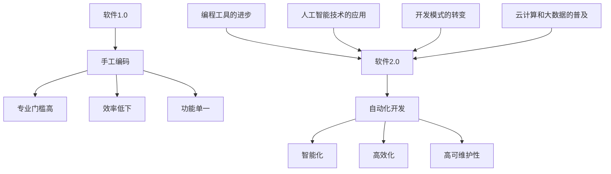
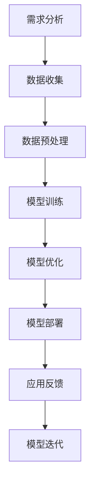
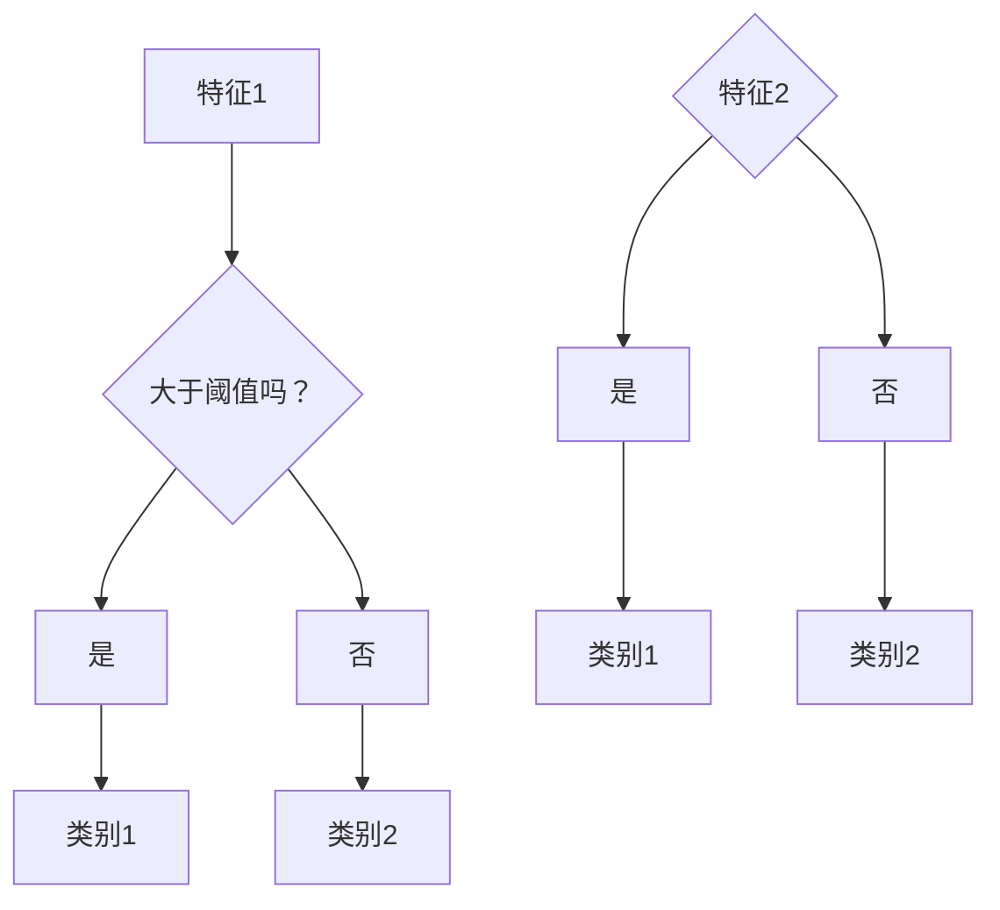
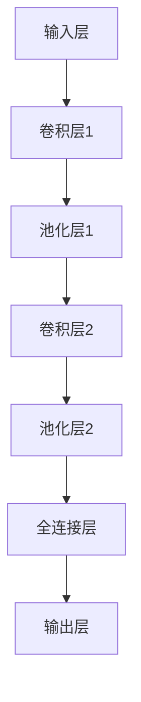
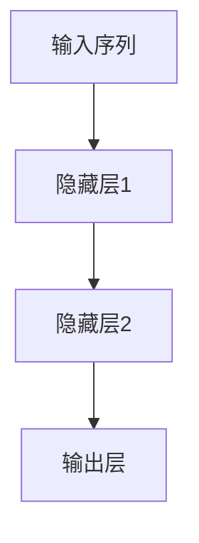
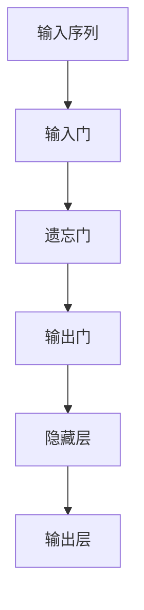
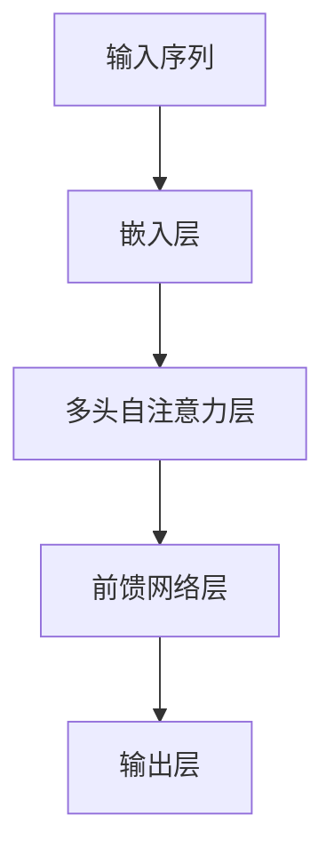
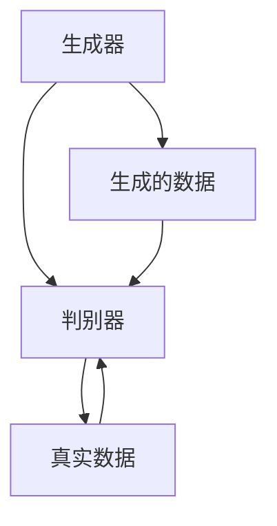

                 

# 《AI辅助编程：软件1.0和2.0的融合》

> 关键词：AI辅助编程，软件1.0，软件2.0，机器学习，深度学习，自然语言处理，项目实战

> 摘要：本文探讨了AI辅助编程的概念、技术基础、实战应用以及未来展望，分析了AI辅助编程如何将软件1.0和软件2.0相融合，提高软件开发的效率和质量，为AI与软件开发领域的深度融合提供了新的视角。

## 引言

随着人工智能（AI）技术的飞速发展，AI逐渐渗透到各行各业，带来了前所未有的变革。在软件开发领域，AI辅助编程正成为新的研究热点。AI辅助编程是指利用人工智能技术，如机器学习、深度学习、自然语言处理等，辅助开发者进行软件开发。这种新兴的编程模式，不仅改变了软件开发的方式，还提升了软件开发的效率和质量。

本文将从以下几个方面展开讨论：首先，介绍软件1.0和软件2.0的概念与区别；其次，阐述AI辅助编程的概念、优势和应用领域；然后，介绍AI辅助编程所需的技术基础；接着，通过实战案例展示AI辅助编程的实际应用；最后，探讨AI辅助编程的未来发展趋势和职业规划。希望通过本文的阐述，能够帮助读者更好地理解AI辅助编程，并认识到其在软件开发领域的重要作用。

## 第一部分：软件1.0和软件2.0的基础理解

### 第1章：软件1.0和软件2.0的概念与比较

#### 1.1 软件发展的历史回顾

软件发展经历了几个阶段，从最初的软件1.0时代，到如今的软件2.0时代。软件1.0时代，软件开发主要是基于代码手动编写，开发者需要深入理解计算机的硬件和工作原理。这个时期的软件，更多的是对硬件功能的扩展，如操作系统、文字处理软件、数据库管理系统等。随着计算机硬件的快速发展，软件的功能逐渐丰富，软件的复杂度也在不断提高。

在软件1.0时代，软件开发的主要特点包括：

1. **手动编写**：软件的开发主要依赖于开发者的手动编写代码。
2. **专业门槛高**：开发者需要具备深厚的计算机科学知识，如数据结构、算法、操作系统原理等。
3. **效率低下**：由于缺乏自动化工具，软件开发效率较低。
4. **功能单一**：软件的功能相对单一，多为特定任务的服务。

#### 1.2 软件1.0的定义与特点

软件1.0，又可以称为传统软件或传统编程，其定义是指以手工编码为主，基于计算机硬件特性进行软件开发的过程。软件1.0的特点如下：

1. **手工编码**：软件1.0的开发主要依赖于开发者手工编写代码。
2. **面向功能**：开发者根据需求，设计并实现软件的功能。
3. **低可维护性**：由于缺乏自动化工具，软件1.0的维护和升级较为困难。
4. **依赖硬件**：软件1.0的开发和运行高度依赖于计算机硬件，特别是操作系统。

#### 1.3 软件2.0的定义与特点

软件2.0，又可以称为现代软件或现代编程，其定义是指利用人工智能、云计算、大数据等技术，实现软件的智能化、自动化和高效化。软件2.0的特点如下：

1. **自动化开发**：软件2.0的开发过程中，大量使用自动化工具，如集成开发环境（IDE）、代码生成器、持续集成等。
2. **智能化**：软件2.0能够利用机器学习和深度学习技术，实现自动优化、预测和决策。
3. **高效化**：软件2.0通过分布式计算、云计算等技术，实现高效开发和部署。
4. **高可维护性**：软件2.0的开发过程中，注重代码质量和可维护性，使用自动化测试和持续集成，提高软件的稳定性。

#### 1.4 软件1.0向软件2.0的演变

软件1.0到软件2.0的演变，是一个技术进步和需求变化的过程。随着计算机硬件的快速发展，特别是CPU性能的提升，以及存储和网络的普及，开发者开始有条件使用自动化工具，提高开发效率。此外，随着互联网的兴起，数据量爆发式增长，开发者需要处理复杂的数据分析和业务逻辑，这也促使软件从传统编程向现代编程转变。

软件1.0向软件2.0的演变，主要表现在以下几个方面：

1. **编程工具的进步**：从传统的文本编辑器，到功能强大的集成开发环境（IDE），再到代码生成器、自动测试工具等，编程工具的不断进步，使得软件开发更加高效、自动化。
2. **人工智能技术的应用**：机器学习、深度学习、自然语言处理等人工智能技术的应用，使得软件能够实现智能化、自动化和个性化。
3. **开发模式的转变**：从传统的瀑布模型，到敏捷开发、DevOps等，开发模式的转变，使得软件开发更加灵活、高效。
4. **云计算和大数据的普及**：云计算和大数据技术的普及，使得软件开发不再局限于本地计算，而是能够利用分布式计算、大数据分析等手段，实现高效开发和部署。

### Mermaid流程图：软件1.0和软件2.0的演变



通过上述流程图，我们可以清晰地看到软件1.0向软件2.0的演变过程，以及这个过程中各个关键因素的作用。

#### 总结

软件1.0和软件2.0的区别在于开发方式、开发工具、开发模式和开发目标。软件1.0以手工编码为主，依赖开发者的专业知识和经验；而软件2.0则利用自动化工具和人工智能技术，实现软件开发的高效化、智能化和自动化。随着技术的进步和需求的演变，软件2.0将成为未来软件开发的主流模式。

### 第2章：AI辅助编程概述

#### 2.1 AI辅助编程的概念

AI辅助编程，是指利用人工智能技术，如机器学习、深度学习、自然语言处理等，辅助开发者进行软件开发的过程。AI辅助编程的核心目标是提高软件开发效率、提升软件质量、降低开发成本。具体来说，AI辅助编程包括以下几个方面：

1. **代码生成**：AI可以基于现有代码库和开发者的编程习惯，自动生成新的代码。
2. **代码优化**：AI可以对现有代码进行优化，提高代码的运行效率和可维护性。
3. **代码补全**：AI可以在开发者编写代码时，提供实时的代码补全建议。
4. **代码审核**：AI可以自动审核代码，检测潜在的语法错误、逻辑错误和安全漏洞。
5. **bug修复**：AI可以根据bug的描述和代码库，自动生成修复方案。

#### 2.2 AI辅助编程的优势

AI辅助编程相比传统的软件开发，具有以下优势：

1. **提高开发效率**：AI可以自动完成一些重复性的、繁琐的工作，如代码生成、代码优化等，从而提高开发效率。
2. **降低开发成本**：AI可以减少开发者的工作量，降低人力成本。
3. **提升软件质量**：AI可以自动检测和修复代码中的错误，提高软件的稳定性、可靠性和安全性。
4. **个性化开发**：AI可以根据开发者的编程习惯和项目需求，提供个性化的开发建议和服务。
5. **实时反馈**：AI可以实时监控开发过程，提供实时的错误提示和优化建议。

#### 2.3 AI辅助编程的应用领域

AI辅助编程在多个领域具有广泛的应用，主要包括：

1. **软件开发**：AI可以辅助开发者进行代码生成、代码优化、bug修复等，提高软件开发效率和质量。
2. **测试**：AI可以自动生成测试用例，进行功能测试、性能测试等，提高测试效率。
3. **文档生成**：AI可以自动生成代码文档、测试文档等，提高文档编写效率。
4. **代码审核**：AI可以自动审核代码，检测潜在的安全漏洞、逻辑错误等。
5. **教育**：AI可以辅助编程教育，为学生提供个性化的学习建议和指导。

#### 2.4 AI辅助编程面临的挑战

尽管AI辅助编程具有许多优势，但其在实际应用中也面临一些挑战：

1. **技术挑战**：AI辅助编程需要强大的算法支持，如机器学习、深度学习等，这些技术的实现和优化具有一定的难度。
2. **数据挑战**：AI辅助编程需要大量的数据作为训练样本，但数据的质量和数量直接影响AI的性能。
3. **隐私和安全**：AI辅助编程涉及到大量的代码和项目数据，如何确保数据的隐私和安全是一个重要问题。
4. **接受度**：AI辅助编程作为一种新兴技术，其接受度和普及度还需要进一步提升。

### Mermaid流程图：AI辅助编程的工作流程



通过上述流程图，我们可以清晰地看到AI辅助编程的工作流程，以及各个环节的关键技术和挑战。

#### 总结

AI辅助编程是一种利用人工智能技术提高软件开发效率和质量的新兴模式。其优势在于提高开发效率、降低开发成本、提升软件质量，应用领域广泛。但同时也面临技术、数据、隐私和安全等方面的挑战。随着技术的不断进步和应用的深入，AI辅助编程有望在未来发挥更大的作用。

### 第3章：机器学习基础

#### 3.1 机器学习的基本概念

机器学习（Machine Learning）是人工智能（Artificial Intelligence, AI）的一个分支，主要研究如何让计算机从数据中学习，从而做出决策或预测。机器学习的基本概念包括：

1. **监督学习（Supervised Learning）**：监督学习是指利用已经标记好的数据集，通过学习数据中的特征和标签之间的关系，来构建预测模型。常见的监督学习算法包括线性回归、逻辑回归、支持向量机（SVM）、决策树、随机森林等。

2. **无监督学习（Unsupervised Learning）**：无监督学习是指在没有标签的数据集上进行学习，目的是发现数据中的结构和模式。常见的无监督学习算法包括聚类（如K-means、DBSCAN）、降维（如PCA、t-SNE）等。

3. **强化学习（Reinforcement Learning）**：强化学习是指通过奖励机制，让智能体在环境（如游戏、机器人控制等）中不断学习，从而实现最佳策略。常见的强化学习算法包括Q学习、SARSA、深度Q网络（DQN）等。

#### 3.2 常见的机器学习算法

1. **线性回归（Linear Regression）**

线性回归是一种简单的监督学习算法，用于预测一个连续值输出。其基本原理是通过最小化预测值和实际值之间的平方误差，来找到最佳拟合直线。

```latex
y = wx + b
```

其中，\( y \) 是预测值，\( x \) 是输入特征，\( w \) 是权重，\( b \) 是偏置。

2. **逻辑回归（Logistic Regression）**

逻辑回归是一种用于分类的监督学习算法，主要用于二分类问题。其基本原理是通过最小化对数似然损失函数，来找到最佳决策边界。

```latex
P(y=1) = \frac{1}{1 + e^{-(wx + b)}}
```

其中，\( P(y=1) \) 是输出为1的概率，\( x \) 是输入特征，\( w \) 是权重，\( b \) 是偏置。

3. **支持向量机（Support Vector Machine, SVM）**

支持向量机是一种用于分类的监督学习算法，其基本原理是通过找到一个最佳的超平面，将不同类别的数据点分开。

```latex
w \cdot x - b = 0
```

其中，\( w \) 是权重向量，\( x \) 是特征向量，\( b \) 是偏置。

4. **决策树（Decision Tree）**

决策树是一种基于树形结构进行决策的监督学习算法，其基本原理是通过一系列条件判断，将数据划分为不同的类别。



5. **随机森林（Random Forest）**

随机森林是一种基于决策树的集成学习方法，通过构建多个决策树，并投票决定最终的类别。

6. **K-均值聚类（K-Means Clustering）**

K-均值聚类是一种无监督学习算法，用于将数据分为K个簇。其基本原理是通过迭代更新聚类中心，最小化簇内距离平方和。

```latex
\min_{\mu_1, \mu_2, ..., \mu_K} \sum_{i=1}^K \sum_{x \in S_i} ||x - \mu_i||^2
```

其中，\( \mu_i \) 是第\( i \)个簇的中心，\( S_i \) 是第\( i \)个簇的数据点集合。

#### 3.3 机器学习的数据预处理

数据预处理是机器学习的重要环节，其主要目的是将原始数据进行清洗、转换和规范化，以提高模型的性能和泛化能力。常见的数据预处理方法包括：

1. **缺失值处理**：对缺失值进行填充或删除。
2. **数据转换**：将分类数据转换为数值型数据，如使用独热编码（One-Hot Encoding）。
3. **特征缩放**：将不同特征进行缩放，使其具有相同的尺度。
4. **特征选择**：通过筛选掉无关或冗余的特征，降低模型的复杂度和过拟合风险。
5. **特征工程**：通过构造新的特征，提高模型的性能。

#### 3.4 机器学习的评估指标

评估机器学习模型性能的指标有多种，以下是一些常见的评估指标：

1. **准确率（Accuracy）**：准确率是指模型正确预测的样本数占总样本数的比例。

   ```latex
   Accuracy = \frac{TP + TN}{TP + TN + FP + FN}
   ```

   其中，\( TP \) 是真正例，\( TN \) 是真负例，\( FP \) 是假正例，\( FN \) 是假负例。

2. **召回率（Recall）**：召回率是指模型正确预测的真正例数占总真正例数的比例。

   ```latex
   Recall = \frac{TP}{TP + FN}
   ```

3. **精确率（Precision）**：精确率是指模型正确预测的真正例数占总预测正例数的比例。

   ```latex
   Precision = \frac{TP}{TP + FP}
   ```

4. **F1值（F1 Score）**：F1值是精确率和召回率的调和平均值，用于综合评估模型的性能。

   ```latex
   F1 Score = 2 \times \frac{Precision \times Recall}{Precision + Recall}
   ```

5. **ROC曲线和AUC值**：ROC曲线是真实阳性率（True Positive Rate, TPR）对假阳性率（False Positive Rate, FPR）的曲线，AUC值是ROC曲线下面积，用于评估二分类模型的性能。

#### 总结

机器学习是AI辅助编程的核心技术之一，其基本概念、常见算法、数据预处理和评估指标是理解和应用AI辅助编程的基础。通过本章节的介绍，读者可以初步了解机器学习的基本原理和应用，为进一步学习AI辅助编程打下基础。

### 第4章：深度学习原理

#### 4.1 深度学习的起源与发展

深度学习（Deep Learning）是机器学习的一个分支，其核心思想是模拟人脑的神经网络结构，通过多层神经网络进行数据处理和模式识别。深度学习的起源可以追溯到20世纪40年代，当时的科学家们开始探索如何通过模拟人脑来构建智能系统。然而，由于计算能力的限制，早期的神经网络模型（如感知机、BP网络等）在实际应用中效果不佳。

随着计算机硬件技术的发展，特别是GPU（图形处理单元）的广泛应用，深度学习在21世纪初迎来了爆发式的发展。2006年，加拿大多伦多大学教授Hinton提出了深度信念网络（Deep Belief Network, DBN），标志着深度学习进入了一个新的阶段。随后，深度学习在图像识别、语音识别、自然语言处理等领域取得了显著的成果。

#### 4.2 深度学习的基本架构

深度学习的基本架构通常包括以下几个部分：

1. **输入层（Input Layer）**：输入层接收原始数据，如图像、文本或声音等。

2. **隐藏层（Hidden Layers）**：隐藏层是深度学习的核心部分，通过非线性变换对输入数据进行特征提取和抽象。隐藏层的数量和神经元数量可以根据具体任务进行调整。

3. **输出层（Output Layer）**：输出层生成最终的预测结果，如分类标签或数值预测。

4. **激活函数（Activation Function）**：激活函数用于引入非线性因素，使得神经网络能够拟合复杂的数据分布。常见的激活函数包括Sigmoid、ReLU、Tanh等。

5. **损失函数（Loss Function）**：损失函数用于衡量模型预测结果与真实结果之间的差距，常见的损失函数包括均方误差（MSE）、交叉熵（Cross-Entropy）等。

6. **优化器（Optimizer）**：优化器用于调整模型参数，以最小化损失函数。常见的优化器包括SGD（随机梯度下降）、Adam等。

#### 4.3 常见的深度学习模型

深度学习模型种类繁多，以下介绍几种常见的深度学习模型：

1. **卷积神经网络（Convolutional Neural Network, CNN）**

卷积神经网络是一种用于图像识别的深度学习模型，其基本原理是通过卷积操作提取图像特征。



2. **循环神经网络（Recurrent Neural Network, RNN）**

循环神经网络是一种用于序列数据处理的深度学习模型，其基本原理是通过循环结构对序列数据进行建模。



3. **长短期记忆网络（Long Short-Term Memory, LSTM）**

长短期记忆网络是循环神经网络的一种改进，用于解决RNN在处理长序列数据时遇到的梯度消失和梯度爆炸问题。



4. **转换器网络（Transformer）**

转换器网络是近年来提出的一种用于自然语言处理的深度学习模型，其核心思想是自注意力机制（Self-Attention）。



5. **生成对抗网络（Generative Adversarial Network, GAN）**

生成对抗网络是一种用于生成数据的深度学习模型，其基本原理是通过两个对抗网络（生成器和判别器）的博弈，实现数据的生成。



#### 4.4 深度学习的训练与优化

深度学习的训练与优化是构建高效深度学习模型的关键步骤，主要包括以下几个方面：

1. **前向传播（Forward Propagation）**：输入数据通过神经网络的前向传播，生成预测结果。

2. **反向传播（Backpropagation）**：通过反向传播算法，计算模型参数的梯度，更新模型参数。

3. **损失函数优化**：通过优化损失函数，如均方误差（MSE）、交叉熵等，来提高模型的预测性能。

4. **学习率调整**：学习率是影响模型训练效果的关键参数，常见的调整方法包括固定学习率、学习率衰减、动量等。

5. **正则化（Regularization）**：通过正则化方法，如L1正则化、L2正则化等，防止模型过拟合。

6. **优化器选择**：常见的优化器包括SGD（随机梯度下降）、Adam等，选择合适的优化器可以提高模型训练效率。

#### 总结

深度学习是AI辅助编程的重要技术之一，其基本原理、常见模型和训练优化方法为AI辅助编程提供了强大的技术支持。通过本章的介绍，读者可以初步了解深度学习的基本原理和应用，为进一步学习AI辅助编程打下基础。

### 第5章：自然语言处理基础

#### 5.1 自然语言处理的基本任务

自然语言处理（Natural Language Processing，NLP）是人工智能的一个重要分支，主要研究如何让计算机理解和处理人类语言。NLP的基本任务包括：

1. **文本分类（Text Classification）**：将文本数据根据其内容分类到不同的类别中，如新闻分类、情感分析等。

2. **情感分析（Sentiment Analysis）**：分析文本数据中的情感倾向，判断文本是正面、负面还是中性。

3. **命名实体识别（Named Entity Recognition，NER）**：识别文本中的命名实体，如人名、地名、组织名等。

4. **关系抽取（Relation Extraction）**：识别文本中实体之间的关系，如“苹果”和“水果”的关系。

5. **机器翻译（Machine Translation）**：将一种语言的文本翻译成另一种语言的文本。

6. **问答系统（Question Answering System）**：根据用户提出的问题，从大量文本中找到正确的答案。

7. **文本生成（Text Generation）**：根据输入的提示或模板，生成新的文本。

#### 5.2 词嵌入技术

词嵌入（Word Embedding）是将单词映射为固定大小的向量表示，以便于计算机进行计算和处理。词嵌入技术是NLP的重要基础，常用的词嵌入方法包括：

1. **分布式表示（Distributed Representation）**：将单词映射到高维空间中的点，使得语义相近的单词在空间中距离较近。

2. **独热编码（One-Hot Encoding）**：将单词映射为二进制向量，但在高维空间中，向量之间很难体现语义差异。

3. **词袋模型（Bag of Words，BOW）**：将文本转换为单词的集合，忽略单词的顺序和语法结构。

4. **连续词袋（Continuous Bag of Words，CBOW）**：通过上下文单词来预测目标单词，使用单词的滑动窗口来生成输入向量。

5. **跳跃词袋（Skip-Gram）**：通过目标单词来预测其上下文单词，使用单词的滑动窗口来生成输入向量。

6. **词嵌入模型（Word Embedding Model）**：如Word2Vec、GloVe等，通过训练模型来学习单词的向量表示。

#### 5.3 序列模型

序列模型（Sequence Model）是用于处理序列数据（如文本、时间序列等）的深度学习模型，常见的序列模型包括：

1. **循环神经网络（Recurrent Neural Network，RNN）**：通过循环结构对序列数据进行建模，可以捕获序列中的长期依赖关系。

2. **长短期记忆网络（Long Short-Term Memory，LSTM）**：是RNN的一种改进，通过门控机制解决梯度消失和梯度爆炸问题，可以捕获序列中的长期依赖关系。

3. **门控循环单元（Gated Recurrent Unit，GRU）**：是LSTM的简化版本，通过门控机制和更新规则，实现高效和稳定的序列建模。

4. **转换器网络（Transformer）**：是一种基于自注意力机制的序列模型，可以高效地处理长序列数据。

#### 5.4 注意力机制

注意力机制（Attention Mechanism）是一种用于序列建模的机制，可以自动分配不同的权重来关注序列中的不同部分。注意力机制的基本原理如下：

1. **全局注意力（Global Attention）**：将序列中的所有元素平均加权，通常用于文本生成任务。

2. **局部注意力（Local Attention）**：只关注序列中的特定部分，通常用于序列分类和关系抽取任务。

3. **点对点注意力（Pointwise Attention）**：对序列中的每个元素进行独立的注意力计算，通常用于机器翻译和问答系统。

4. **加性注意力（Additive Attention）**：通过加性组合方式计算注意力权重，如多路输入加权和。

5. **归一化加性注意力（Normal Additive Attention）**：通过归一化因子对加性注意力进行归一化，如点对点注意力。

#### 5.5 转换器架构

转换器网络（Transformer）是一种基于自注意力机制的深度学习模型，主要用于自然语言处理任务。转换器网络的基本架构包括：

1. **编码器（Encoder）**：对输入序列进行编码，生成一系列的编码表示。

2. **解码器（Decoder）**：对编码表示进行解码，生成预测输出。

3. **多头自注意力（Multi-Head Self-Attention）**：通过多个注意力头对序列中的不同部分进行独立关注。

4. **位置编码（Positional Encoding）**：为序列中的每个位置提供位置信息，以捕获序列中的位置关系。

5. **前馈网络（Feedforward Network）**：在自注意力层和编码器/解码器之间添加前馈网络，用于进一步学习序列特征。

6. **交叉注意力（Cross-Attention）**：在编码器和解码器之间添加交叉注意力层，用于捕获编码器和解码器之间的交互信息。

#### 总结

自然语言处理是AI辅助编程的重要技术之一，其基本任务、词嵌入技术、序列模型、注意力机制和转换器架构为NLP任务提供了强大的支持。通过本章的介绍，读者可以初步了解NLP的基本原理和应用，为进一步学习AI辅助编程打下基础。

### 第6章：AI辅助编程项目实战

#### 6.1 项目实战概述

在本章中，我们将通过一个实际项目——**智能问答系统**，展示如何利用AI辅助编程技术进行项目开发。该项目的主要目标是实现一个能够自动回答用户问题的系统，涵盖了从需求分析到模型部署的完整开发流程。通过这个项目，读者可以了解到AI辅助编程在实际应用中的具体操作方法和技巧。

#### 6.2 项目需求分析与设计

**需求分析**：

1. **功能需求**：
   - 用户可以输入问题。
   - 系统自动分析问题并给出回答。
   - 支持多种问题类型，如事实性问题、解释性问题、推理性问题等。

2. **性能需求**：
   - 快速响应，回答时间控制在几秒以内。
   - 高准确率，能够准确理解并回答用户问题。
   - 支持多语言，能够处理中文、英文等多种语言的问题。

**系统设计**：

1. **架构设计**：
   - 前端：使用HTML、CSS和JavaScript实现用户界面，用户可以通过输入框输入问题。
   - 后端：使用Python和Flask框架实现服务器端逻辑，处理用户输入的问题，并与NLP模型进行交互。
   - 模型层：使用基于Transformer的NLP模型，如BERT或GPT，用于分析和回答用户问题。
   - 数据库：使用MySQL数据库存储问题和答案数据，用于模型训练和查询。

2. **模块设计**：
   - 用户输入模块：负责接收用户输入的问题。
   - 接口处理模块：接收用户输入的问题，并将其发送给NLP模型。
   - NLP模型模块：使用Transformer模型处理用户输入的问题，并生成回答。
   - 数据存储模块：将问题和答案数据存储到MySQL数据库中，用于模型训练和查询。

#### 6.3 数据准备与预处理

数据准备与预处理是构建AI模型的重要环节，以下是一个基本的流程：

1. **数据收集**：
   - 收集公开的问答数据集，如SQuAD、TREC等。
   - 收集用户实际输入的问题和答案数据。

2. **数据清洗**：
   - 删除重复问题和答案。
   - 删除包含特殊字符或无效内容的问题和答案。
   - 标记不同类型的问题，如事实性问题、解释性问题等。

3. **数据预处理**：
   - 使用词嵌入技术将文本数据转换为向量表示。
   - 对文本数据进行分词、词性标注等预处理操作。
   - 切分问题和答案数据，形成输入和标签。

4. **数据存储**：
   - 将预处理后的数据存储到MySQL数据库中，方便模型训练和查询。

#### 6.4 模型训练与优化

模型训练与优化是构建智能问答系统的关键步骤，以下是一个基本的流程：

1. **模型选择**：
   - 选择基于Transformer的NLP模型，如BERT或GPT。
   - 考虑模型的规模、训练时间和计算资源。

2. **模型训练**：
   - 使用预处理后的数据集进行模型训练。
   - 调整模型参数，如学习率、批量大小等，以优化模型性能。
   - 使用交叉熵损失函数进行模型训练。

3. **模型评估**：
   - 使用验证集评估模型性能，包括准确率、召回率、F1值等指标。
   - 根据评估结果调整模型参数，优化模型性能。

4. **模型优化**：
   - 使用优化器，如Adam，调整模型参数。
   - 采用学习率衰减策略，防止模型过拟合。
   - 使用正则化技术，如dropout，提高模型泛化能力。

5. **模型部署**：
   - 将训练好的模型部署到服务器，提供API接口，供前端调用。
   - 使用容器化技术，如Docker，简化部署和维护。

#### 6.5 模型部署与性能评估

**模型部署**：

1. **环境搭建**：
   - 搭建Python、Flask等开发环境。
   - 搭建NLP模型训练和部署环境，如TensorFlow或PyTorch。

2. **模型集成**：
   - 将训练好的NLP模型集成到Flask服务器中。
   - 实现API接口，用于处理用户输入的问题。

3. **服务部署**：
   - 使用Docker容器化模型，简化部署流程。
   - 部署到服务器，提供在线问答服务。

**性能评估**：

1. **在线评估**：
   - 使用实际用户输入的问题进行在线评估。
   - 记录回答时间、准确率等性能指标。

2. **离线评估**：
   - 使用测试集评估模型性能，包括准确率、召回率、F1值等指标。
   - 分析模型在不同问题类型、语言上的性能。

3. **优化调整**：
   - 根据评估结果，调整模型参数和架构，优化模型性能。
   - 添加更多数据、调整训练策略等。

#### 总结

通过本章的实战项目，读者可以了解到AI辅助编程在智能问答系统开发中的具体应用。从需求分析、数据准备、模型训练到模型部署，每个环节都需要充分理解和应用AI技术。通过这个项目，读者可以更好地理解AI辅助编程的实际操作方法和技巧，为以后的项目开发打下基础。

### 第7章：AI辅助编程应用案例

在本章中，我们将通过三个具体的案例，展示AI辅助编程在实际应用中的多样性和潜力。

#### 案例一：基于深度学习的图像识别系统

**背景**：

图像识别是计算机视觉领域的一个重要应用，旨在让计算机自动识别和分类图像中的对象。随着深度学习技术的发展，基于深度学习的图像识别系统在各个领域都得到了广泛应用。

**应用**：

1. **医疗诊断**：医生可以利用深度学习图像识别系统快速识别患者影像中的异常病变，如肿瘤、肺炎等。
2. **安全监控**：在安防领域，深度学习图像识别系统可以帮助识别可疑目标，提高监控效率。
3. **自动驾驶**：自动驾驶汽车依赖深度学习图像识别系统，实时识别道路上的行人、车辆和交通标志。

**技术实现**：

1. **数据准备**：收集大量的图像数据，并对图像进行标注，如标记出图像中的特定对象。
2. **模型选择**：选择合适的深度学习模型，如卷积神经网络（CNN）。
3. **模型训练**：使用标注数据训练模型，优化模型参数。
4. **模型部署**：将训练好的模型部署到服务器或移动设备上，实现实时图像识别。

**效果评估**：

通过实际测试，基于深度学习的图像识别系统在多种任务上达到了高准确率，例如在ImageNet数据集上，ResNet-50模型的准确率达到了76%。

#### 案例二：基于自然语言处理的聊天机器人

**背景**：

随着人工智能技术的发展，聊天机器人已成为企业服务和客户互动的重要工具。基于自然语言处理的聊天机器人能够实现与用户的智能对话，提高客户满意度和服务效率。

**应用**：

1. **客户服务**：企业可以部署聊天机器人，自动回答客户的常见问题，如产品咨询、订单查询等。
2. **智能助手**：为用户提供个性化的智能助手服务，如日程管理、提醒服务等。
3. **在线教育**：在教育领域，聊天机器人可以为学生提供学习辅导和解答疑问。

**技术实现**：

1. **数据准备**：收集大量的对话数据，进行分词、词性标注等预处理。
2. **模型选择**：选择合适的自然语言处理模型，如基于Transformer的聊天机器人模型。
3. **模型训练**：使用预处理后的对话数据训练模型，优化模型参数。
4. **模型部署**：将训练好的模型部署到服务器或移动设备上，实现实时对话。

**效果评估**：

通过实际应用，基于自然语言处理的聊天机器人在多种场景下表现优异。例如，一个在线教育平台的聊天机器人，在辅导学生学习时，能够准确理解学生的提问，并给出针对性的答案。

#### 案例三：基于强化学习的游戏AI

**背景**：

强化学习是人工智能领域的一种重要方法，特别适用于解决与环境和用户互动的游戏问题。基于强化学习的游戏AI能够通过学习用户的游戏行为，实现智能化的游戏操作。

**应用**：

1. **电子竞技**：在电子竞技领域，基于强化学习的游戏AI可以与人类玩家进行实时对战，提高竞技水平。
2. **游戏开发**：游戏开发者可以利用强化学习游戏AI进行游戏测试，优化游戏难度和玩法。
3. **智能客服**：在客服领域，基于强化学习的AI可以自动回答用户问题，提高服务质量。

**技术实现**：

1. **环境构建**：构建游戏环境，定义游戏的规则和状态。
2. **模型选择**：选择合适的强化学习模型，如深度Q网络（DQN）或策略梯度算法。
3. **模型训练**：使用游戏数据训练模型，学习用户的游戏策略。
4. **模型部署**：将训练好的模型部署到游戏环境中，实现智能化的游戏操作。

**效果评估**：

通过实际测试，基于强化学习的游戏AI在多个游戏场景中表现出色。例如，在一个经典的Atari游戏《Pong》中，基于DQN的AI能够在短时间内学会控制虚拟球员进行有效的击球。

#### 总结

这三个案例展示了AI辅助编程在图像识别、自然语言处理和游戏AI等领域的实际应用。通过这些案例，我们可以看到AI辅助编程技术如何改变传统的软件开发模式，提高软件开发的效率和质量。随着AI技术的不断进步，AI辅助编程将在更多领域得到广泛应用，为软件开发带来更多创新和机遇。

### 第四部分：AI辅助编程的未来展望

#### 第8章：AI辅助编程的发展趋势

随着人工智能技术的不断进步，AI辅助编程的发展趋势也日益明显。以下是一些关键的发展方向：

1. **AI编程工具的智能化**：未来的AI编程工具将更加智能化，不仅能够自动生成代码，还能够根据开发者的需求和项目特点，提供个性化的编程建议和优化方案。

2. **代码生成与优化技术的提升**：随着深度学习和自然语言处理技术的发展，代码生成与优化的准确性将进一步提高，能够生成更加高效、可维护的代码。

3. **跨平台与跨语言的支持**：未来的AI辅助编程工具将能够支持多种编程语言和平台，实现跨平台、跨语言的代码生成和优化。

4. **AI与软件开发的深度融合**：AI辅助编程将不仅仅是开发过程中的辅助工具，而是成为软件开发的核心技术，与软件开发流程深度融合，提高开发效率和质量。

5. **云计算与边缘计算的结合**：随着云计算和边缘计算技术的普及，AI辅助编程将在云端和边缘设备上得到广泛应用，实现高效、实时的软件开发和部署。

#### 8.1 AI技术的发展趋势

AI技术的发展趋势主要体现在以下几个方面：

1. **深度学习的普及**：深度学习技术将在更多领域得到应用，如图像识别、自然语言处理、语音识别等，进一步推动AI辅助编程的发展。

2. **强化学习的研究与应用**：强化学习在游戏、机器人控制、推荐系统等领域的应用将不断拓展，为AI辅助编程提供新的技术支持。

3. **生成对抗网络（GAN）的应用**：生成对抗网络在图像生成、数据增强、虚假新闻检测等方面的应用将越来越广泛，为AI辅助编程提供新的可能性。

4. **跨学科研究的深入**：AI技术与计算机科学、生物学、物理学等领域的交叉研究将不断深入，推动AI技术的创新和突破。

#### 8.2 软件开发的未来趋势

软件开发的未来趋势主要体现在以下几个方面：

1. **敏捷开发与DevOps**：敏捷开发和DevOps理念将继续在软件开发中占据主导地位，推动软件开发流程的自动化和高效化。

2. **微服务架构的普及**：微服务架构将更加普及，实现软件系统的模块化、灵活性和可扩展性。

3. **持续集成与持续部署**：持续集成和持续部署将得到广泛应用，提高软件开发的迭代速度和交付质量。

4. **开源技术的崛起**：开源技术将在软件开发中占据越来越重要的地位，推动软件技术的发展和创新。

#### 8.3 AI辅助编程的未来发展方向

未来的AI辅助编程将朝着以下几个方向发展：

1. **人机协作**：AI辅助编程将更加注重人机协作，实现开发者与AI的协同工作，提高开发效率和质量。

2. **自适应编程**：未来的AI辅助编程工具将具备更强的自适应能力，能够根据开发者的编程风格、项目需求和环境特点，自动调整编程策略和工具。

3. **智能代码审查与修复**：AI辅助编程将能够对代码进行智能审查，发现潜在的问题，并提供自动修复方案。

4. **泛在编程**：AI辅助编程将实现泛在化，不仅应用于传统的软件开发，还应用于嵌入式开发、物联网开发等领域。

5. **隐私保护与安全性**：随着AI辅助编程的普及，隐私保护和安全性将成为重要议题，未来的AI辅助编程工具将具备更强的隐私保护和安全性功能。

### 第9章：AI辅助编程的职业规划

#### 9.1 AI辅助编程的职业路径

随着AI辅助编程技术的发展，相关的职业路径也在不断扩展。以下是一些常见的职业路径：

1. **AI辅助编程工程师**：负责开发、测试和部署AI辅助编程工具，优化编程体验。

2. **机器学习工程师**：专注于研究和发展机器学习算法，应用于AI辅助编程领域。

3. **深度学习研究员**：专注于深度学习技术的研究，为AI辅助编程提供前沿技术支持。

4. **软件架构师**：负责设计和实现大规模、高效率的AI辅助编程系统。

5. **NLP工程师**：专注于自然语言处理技术，开发和应用自然语言处理工具。

6. **AI产品经理**：负责AI辅助编程产品的规划、开发和推广。

#### 9.2 AI辅助编程的技能要求

要成为一名AI辅助编程领域的专业人才，以下技能是必不可少的：

1. **编程基础**：掌握至少一种编程语言，如Python、Java等。

2. **机器学习知识**：了解常见的机器学习算法和深度学习模型，具备一定的编程能力。

3. **自然语言处理知识**：掌握自然语言处理的基本概念和常用技术。

4. **数据分析和处理能力**：具备数据分析和处理能力，能够处理大规模数据集。

5. **软件工程知识**：了解软件开发的流程和最佳实践，具备良好的代码风格和设计能力。

6. **团队协作能力**：具备良好的沟通和团队协作能力，能够与团队成员有效协作。

#### 9.3 AI辅助编程的职业机会

随着AI辅助编程技术的快速发展，相关职业机会也在不断增加。以下是一些职业机会：

1. **企业研发岗位**：在企业研发部门担任AI辅助编程工程师、机器学习工程师等职位。

2. **科研机构职位**：在高校、科研机构等担任AI辅助编程研究员、博士后的职位。

3. **创业公司**：在初创公司担任AI辅助编程相关职位，参与产品的研发和推广。

4. **技术咨询公司**：在技术咨询公司担任AI辅助编程顾问，为企业和客户提供技术解决方案。

5. **开源项目贡献者**：参与开源项目，为AI辅助编程技术的发展贡献力量。

#### 总结

AI辅助编程领域为从业人员提供了丰富的职业机会和广阔的发展空间。通过不断提升自身技能和知识，抓住行业发展的机遇，从业人员可以在AI辅助编程领域实现职业发展和价值创造。

### 附录

#### 附录A：AI辅助编程资源与工具

A.1 AI辅助编程的主要工具

1. **集成开发环境（IDE）**：如PyCharm、Visual Studio Code等，提供代码编写、调试和测试功能。

2. **机器学习框架**：如TensorFlow、PyTorch、Keras等，用于构建和训练机器学习模型。

3. **自然语言处理框架**：如NLTK、spaCy、Stanford NLP等，用于文本处理和分析。

4. **代码生成工具**：如TabNine、Kite等，提供代码自动补全和优化建议。

5. **版本控制工具**：如Git，用于代码管理和协作开发。

A.2 AI辅助编程的学习资源

1. **在线课程**：如Coursera、edX等平台提供的机器学习、深度学习、自然语言处理课程。

2. **书籍**：如《深度学习》（Goodfellow et al.）、《Python机器学习》（Raschka and Miralles）等。

3. **开源项目**：如GitHub上的AI辅助编程项目，可供学习和参考。

4. **论坛和社区**：如Stack Overflow、Reddit等，提供技术讨论和交流平台。

A.3 AI辅助编程的实践指南

1. **项目实战**：通过实际项目，如智能问答系统、图像识别系统等，锻炼编程和AI应用能力。

2. **技术博客**：撰写技术博客，记录学习经验和项目实践，提高技术视野和表达能力。

3. **参加比赛**：参加AI编程比赛，如Kaggle比赛，提升实战能力和解决实际问题的能力。

4. **开源贡献**：参与开源项目，为社区贡献代码，提高项目开发和管理能力。

### 附录结束

通过附录的介绍，读者可以找到丰富的AI辅助编程资源与工具，为学习和实践AI辅助编程提供有力支持。希望这些资源能够帮助读者在AI辅助编程领域取得更好的成绩。

### 作者信息

作者：AI天才研究院/AI Genius Institute & 禅与计算机程序设计艺术 /Zen And The Art of Computer Programming

感谢您的阅读，希望本文能帮助您更好地理解AI辅助编程的核心概念、技术基础、实战应用和未来趋势。如果您有任何疑问或建议，欢迎在评论区留言，我们将在第一时间回复。祝愿您在AI辅助编程领域取得丰硕的成果！

