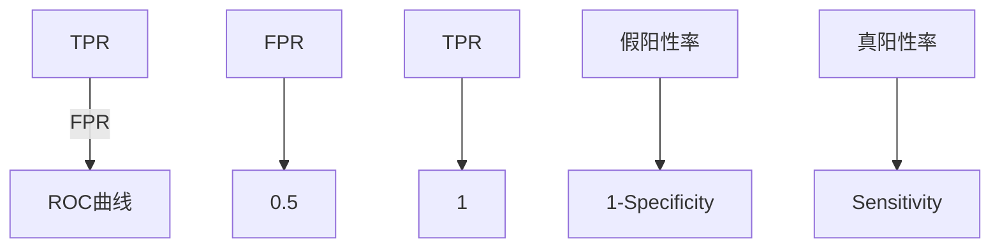

                 

# AUC-ROC 原理与代码实战案例讲解

> 关键词：AUC-ROC、二分类问题、多分类问题、深度学习、医学领域、金融领域、工业自动化

> 摘要：本文深入讲解了AUC-ROC（曲线下面积-接受者操作特征）的概念、原理及其在各类实际应用中的实战案例。通过详细的数学模型、伪代码及代码实战，帮助读者全面理解AUC-ROC在分类问题中的重要性，掌握其在各种应用场景下的应用方法。

## 第1章 引言

### 1.1 AUC-ROC简介

AUC-ROC（Area Under the Receiver Operating Characteristic Curve）是一种评估二分类模型性能的常用指标，它在统计学习和机器学习领域被广泛应用。ROC曲线是通过绘制真阳性率（True Positive Rate，TPR）与假阳性率（False Positive Rate，FPR）之间的关系而得到的，曲线上任意一点的坐标表示当前阈值下的TPR和FPR值。而AUC-ROC则是ROC曲线下面积，它代表了模型对正负样本的区分能力，值域在0到1之间，越接近1表示模型性能越好。

### 1.2 AUC-ROC的应用场景

AUC-ROC广泛应用于各类二分类问题，如医学诊断、金融风控、工业自动化等。例如，在医学领域，它可以用来评估疾病诊断模型的准确性；在金融领域，它可以用来评估欺诈检测模型的性能；在工业自动化中，它可以用来评估机器视觉系统的可靠性。

## 第2章 AUC-ROC原理详解

### 2.1 真阳性率（TPR）与假阳性率（FPR）

#### 2.1.1 真阳性率（TPR）计算方法

真阳性率（TPR），也称为灵敏度（Sensitivity），是模型预测为正样本且实际为正样本的比率。其计算公式为：

$$
TPR = \frac{TP}{TP + FN}
$$

其中，TP表示真正例，FN表示假反例。

#### 2.1.2 假阳性率（FPR）计算方法

假阳性率（FPR），也称为1-特异性（1-Specificity），是模型预测为正样本但实际为负样本的比率。其计算公式为：

$$
FPR = \frac{FP}{TN + FP}
$$

其中，FP表示假正例，TN表示真反例。

#### 2.1.3 TPR与FPR的关系图示

下图展示了TPR和FPR之间的关系，横轴表示FPR，纵轴表示TPR。随着阈值的改变，TPR和FPR也会相应变化，形成ROC曲线。



### 2.2 曲线下面积（AUC）

#### 2.2.1 AUC的定义

AUC（Area Under the Curve）是指ROC曲线下面积。它是衡量二分类模型性能的一个重要指标，值域在0到1之间，越接近1表示模型性能越好。

#### 2.2.2 AUC的计算方法

AUC可以通过积分计算得到，公式如下：

$$
AUC = \int_{0}^{1} (1 - FPR(x)) dTPR(x)
$$

其中，$FPR(x)$和$TPR(x)$分别为FPR和TPR在某一阈值$x$处的值。

#### 2.2.3 AUC的意义

AUC表示了模型在不同阈值下对正负样本的区分能力，值越大表示模型性能越好。在实际应用中，可以通过调整阈值来平衡模型的精确度与召回率，从而找到最优阈值。

## 第3章 AUC-ROC在二分类问题中的应用

### 3.1 二分类问题的基本概念

#### 3.1.1 二分类模型的评估指标

二分类模型常用的评估指标包括准确率（Accuracy）、精确率（Precision）、召回率（Recall）和F1值。这些指标在不同场景下具有不同的优先级。

#### 3.1.2 二分类问题的常见类型

二分类问题主要分为两类：无放回抽样和有放回抽样。无放回抽样适用于样本量较大的情况，而有放回抽样则适用于样本量较小的情况。

### 3.2 AUC-ROC曲线的绘制

#### 3.2.1 AUC-ROC曲线的绘制方法

AUC-ROC曲线的绘制方法如下：

1. 计算不同阈值下的TPR和FPR值。
2. 将TPR和FPR值绘制在坐标系中。
3. 连接各点，形成ROC曲线。

#### 3.2.2 AUC-ROC曲线的解读

AUC-ROC曲线的解读方法如下：

1. 曲线上任意一点表示当前阈值下的TPR和FPR值。
2. 曲线下面积表示模型性能，值越大表示模型性能越好。
3. 理想的模型对应于左上角点，即TPR接近1，FPR接近0。

### 3.3 AUC-ROC在二分类模型中的应用

#### 3.3.1 选择最佳阈值

选择最佳阈值的方法如下：

1. 根据应用场景确定优先级，如优先考虑精确度或召回率。
2. 在ROC曲线上找到对应优先级的最高点。
3. 该点的横坐标即为最佳阈值。

#### 3.3.2 模型评估与比较

模型评估与比较的方法如下：

1. 计算不同模型在相同阈值下的AUC值。
2. AUC值越大的模型性能越好。
3. 可以使用交叉验证等方法来评估模型的稳定性和泛化能力。

## 第4章 AUC-ROC在多分类问题中的应用

### 4.1 多分类问题的基本概念

#### 4.1.1 多分类模型的评估指标

多分类模型常用的评估指标包括准确率（Accuracy）、精确率（Precision）、召回率（Recall）和F1值。与二分类问题类似，这些指标在不同场景下具有不同的优先级。

#### 4.1.2 多分类问题的常见类型

多分类问题主要分为两类：单标签多分类和单标签多分类。单标签多分类适用于每个样本仅属于一个类别的情况，而单标签多分类适用于每个样本可能属于多个类别的情况。

### 4.2 AUC-ROC曲线在多分类中的应用

#### 4.2.1 单标签多分类问题的AUC-ROC分析

单标签多分类问题的AUC-ROC分析方法与二分类问题类似。主要步骤如下：

1. 对每个类别计算其自身的AUC值。
2. 选择AUC值最大的类别作为模型的预测结果。
3. 对所有类别进行统计分析，评估模型的整体性能。

#### 4.2.2 多标签多分类问题的AUC-ROC分析

多标签多分类问题的AUC-ROC分析方法与单标签多分类问题类似。主要步骤如下：

1. 对每个类别计算其自身的AUC值。
2. 对所有类别进行统计分析，评估模型的整体性能。
3. 可以使用不同的阈值来平衡模型的精确度与召回率。

### 4.3 多分类模型评估与优化

#### 4.3.1 多分类模型的阈值选择

多分类模型的阈值选择方法如下：

1. 根据应用场景确定优先级，如优先考虑精确度或召回率。
2. 在AUC-ROC曲线上找到对应优先级的最高点。
3. 该点的横坐标即为最佳阈值。

#### 4.3.2 模型优化策略

多分类模型的优化策略如下：

1. 调整模型参数，如正则化参数、学习率等。
2. 使用不同的优化算法，如梯度下降、随机梯度下降等。
3. 采用集成学习方法，如随机森林、梯度提升树等。

## 第5章 AUC-ROC在深度学习中的应用

### 5.1 深度学习的基本概念

#### 5.1.1 深度学习的基本架构

深度学习的基本架构包括输入层、隐藏层和输出层。其中，隐藏层可以有一个或多个。

#### 5.1.2 深度学习在分类问题中的应用

深度学习在分类问题中的应用包括图像分类、文本分类和音频分类等。其中，卷积神经网络（CNN）和循环神经网络（RNN）是常用的深度学习模型。

### 5.2 深度学习中的AUC-ROC

#### 5.2.1 深度学习模型中AUC-ROC的计算方法

深度学习模型中AUC-ROC的计算方法与传统的二分类问题类似。主要步骤如下：

1. 对每个类别计算其自身的AUC值。
2. 对所有类别进行统计分析，评估模型的整体性能。

#### 5.2.2 深度学习模型中AUC-ROC的优化策略

深度学习模型中AUC-ROC的优化策略如下：

1. 调整模型参数，如正则化参数、学习率等。
2. 使用不同的优化算法，如梯度下降、随机梯度下降等。
3. 采用集成学习方法，如随机森林、梯度提升树等。

### 5.3 案例分析：深度学习模型在分类问题中的应用

#### 5.3.1 数据预处理

数据预处理的主要步骤包括数据清洗、数据归一化和数据增强等。

#### 5.3.2 模型选择与训练

模型选择与训练的主要步骤包括选择合适的模型架构、训练模型、评估模型性能等。

#### 5.3.3 模型评估与优化

模型评估与优化的主要步骤包括计算AUC-ROC值、调整模型参数、重新训练模型等。

## 第6章 AUC-ROC在医学领域中的应用

### 6.1 医学领域的分类问题

#### 6.1.1 医学领域分类问题的特点

医学领域分类问题的特点包括样本量较小、特征维度较高、数据不平衡等。

#### 6.1.2 医学领域分类问题的挑战

医学领域分类问题的挑战包括模型解释性、数据隐私保护、模型泛化能力等。

### 6.2 AUC-ROC在医学诊断中的应用

#### 6.2.1 医学诊断中的分类模型评估

医学诊断中的分类模型评估主要包括AUC-ROC值、准确率、精确率、召回率等。

#### 6.2.2 AUC-ROC在医学诊断中的实际应用

AUC-ROC在医学诊断中的实际应用包括疾病预测、药物疗效评估、手术风险评估等。

### 6.3 医学领域AUC-ROC的优化策略

#### 6.3.1 数据增强

医学领域AUC-ROC的优化策略包括数据增强、模型集成、正则化等。

#### 6.3.2 模型优化

医学领域AUC-ROC的优化策略还包括模型优化，如选择合适的网络架构、调整超参数等。

## 第7章 AUC-ROC在金融领域中的应用

### 7.1 金融领域的分类问题

#### 7.1.1 金融领域分类问题的特点

金融领域分类问题的特点包括数据复杂、噪声大、时间序列特性等。

#### 7.1.2 金融领域分类问题的挑战

金融领域分类问题的挑战包括模型解释性、实时性要求、数据隐私保护等。

### 7.2 AUC-ROC在金融风险控制中的应用

#### 7.2.1 金融风险控制中的分类模型评估

金融风险控制中的分类模型评估主要包括AUC-ROC值、准确率、精确率、召回率等。

#### 7.2.2 AUC-ROC在金融风险控制中的实际应用

AUC-ROC在金融风险控制中的实际应用包括信用评分、欺诈检测、市场预测等。

### 7.3 金融领域AUC-ROC的优化策略

#### 7.3.1 模型选择与调优

金融领域AUC-ROC的优化策略包括模型选择与调优、特征工程、数据预处理等。

#### 7.3.2 模型解释性分析

金融领域AUC-ROC的优化策略还包括模型解释性分析，如特征重要性分析、模型可视化等。

## 第8章 AUC-ROC在工业自动化中的应用

### 8.1 工业自动化领域的分类问题

#### 8.1.1 工业自动化领域分类问题的特点

工业自动化领域分类问题的特点包括数据量大、实时性要求高、场景多样化等。

#### 8.1.2 工业自动化领域分类问题的挑战

工业自动化领域分类问题的挑战包括模型实时性、数据质量、模型部署等。

### 8.2 AUC-ROC在工业自动化中的应用

#### 8.2.1 工业自动化中的分类模型评估

工业自动化中的分类模型评估主要包括AUC-ROC值、准确率、精确率、召回率等。

#### 8.2.2 AUC-ROC在工业自动化中的实际应用

AUC-ROC在工业自动化中的实际应用包括机器视觉检测、故障诊断、质量检测等。

### 8.3 工业领域AUC-ROC的优化策略

#### 8.3.1 数据预处理

工业领域AUC-ROC的优化策略包括数据预处理、特征选择、模型集成等。

#### 8.3.2 模型优化与评估

工业领域AUC-ROC的优化策略还包括模型优化与评估，如选择合适的模型架构、调整超参数等。

## 附录

### 附录 A: AUC-ROC计算代码示例

#### A.1 Python代码实现

```python
import numpy as np
from sklearn.metrics import roc_auc_score

# 假设data为训练集，label为真实标签
data = np.array([[0.1], [0.8], [0.3], [0.6]])
label = np.array([0, 1, 0, 1])

# 计算AUC-ROC值
auc_roc = roc_auc_score(label, data[:, 0])
print("AUC-ROC值：", auc_roc)
```

#### A.2 R代码实现

```R
# 假设data为训练集，label为真实标签
data <- matrix(c(0.1, 0.8, 0.3, 0.6), nrow = 4)
label <- c(0, 1, 0, 1)

# 计算AUC-ROC值
library(pROC)
roc_obj <- roc(label, data)
auc_roc <- auc(roc_obj)
print(auc_roc)
```

### 附录 B: 常见问题解答

#### B.1 AUC-ROC与ACC的差异

AUC-ROC主要用于评估二分类模型的性能，而ACC（Accuracy）是评估模型准确性的常用指标。两者的主要区别在于：

1. AUC-ROC考虑了所有阈值，而ACC仅考虑单一阈值。
2. AUC-ROC适用于任何比例的正负样本，而ACC易受样本比例影响。

#### B.2 AUC-ROC与F1值的比较

AUC-ROC和F1值都是评估二分类模型性能的指标，但侧重点不同：

1. AUC-ROC主要衡量模型的总体性能，而F1值主要衡量模型的精确度和召回率的平衡。
2. AUC-ROC适用于任何比例的正负样本，而F1值对样本比例敏感。

#### B.3 AUC-ROC在实际应用中的注意事项

在实际应用中，使用AUC-ROC时需要注意以下几点：

1. 选择合适的阈值，以平衡精确度和召回率。
2. 考虑模型的解释性，以便更好地理解模型的决策过程。
3. 对模型进行充分的验证，确保其在实际应用中的稳定性和泛化能力。

---

**作者：AI天才研究院/AI Genius Institute & 禅与计算机程序设计艺术 /Zen And The Art of Computer Programming**

