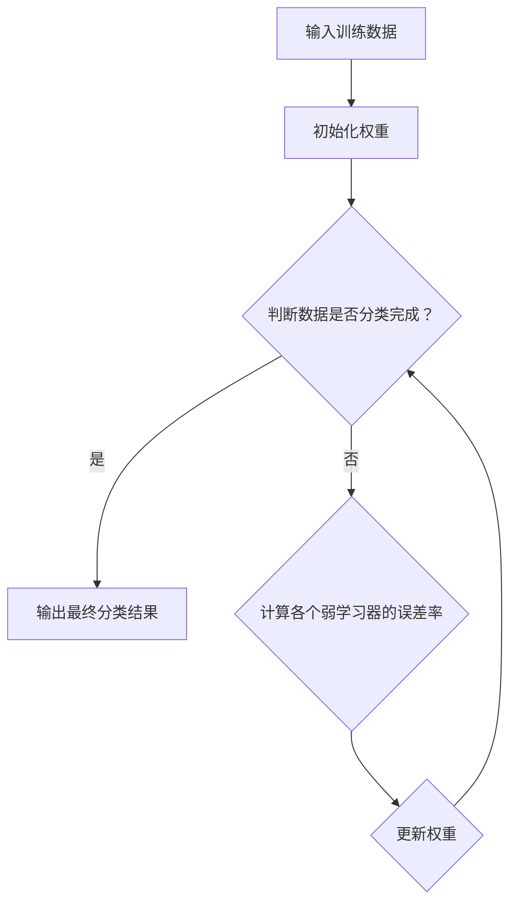
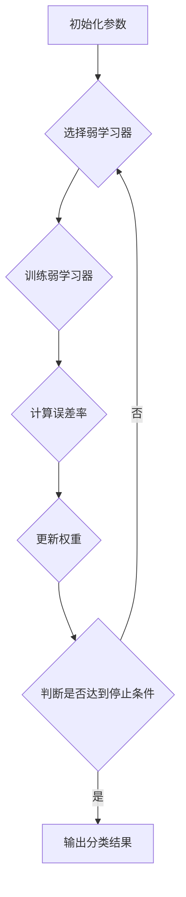

                 

### 文章标题

AdaBoost原理与代码实例讲解

### 关键词

AdaBoost, 集成学习, 弱学习器, 强学习器, 损失函数, 分类算法, 回归算法, 数据预处理, 实践案例, 优化策略, 算法融合, 应用扩展

### 摘要

本文深入探讨了AdaBoost算法的原理与应用，从基础理论出发，详细解析了AdaBoost的模型结构、工作流程、损失函数和学习策略。接着介绍了AdaBoost的不同变种和其在分类与回归问题中的应用。通过一个实际的项目实战案例，展示了如何搭建开发环境、实现代码和进行结果分析。最后，文章探讨了AdaBoost的源代码解析、优化策略以及与其他算法的融合应用，并对未来发展趋势进行了展望。

## 目录大纲

1. **第一部分：AdaBoost基础理论**
   - **第1章：引入AdaBoost**
     - **1.1 AdaBoost的概念与优势**
     - **1.2 AdaBoost的模型结构**
     - **1.3 AdaBoost的发展与应用**
   - **第2章：弱学习器与强学习器**
     - **2.1 弱学习器基本概念**
     - **2.2 强学习器的构建**
     - **2.3 弱学习器与强学习器的关系**
   - **第3章：AdaBoost算法原理**
     - **3.1 AdaBoost的工作流程**
     - **3.2 AdaBoost的损失函数**
     - **3.3 AdaBoost的学习策略**
   - **第4章：AdaBoost的变种**
     - **4.1 AdaBoost.SGD**
     - **4.2 XGBoost**
     - **4.3 LightGBM**
   - **第5章：AdaBoost在分类问题中的应用**
     - **5.1 数据预处理**
     - **5.2 AdaBoost分类器训练**
     - **5.3 分类器性能评估**
   - **第6章：AdaBoost在回归问题中的应用**
     - **6.1 回归问题的数据预处理**
     - **6.2 AdaBoost回归器训练**
     - **6.3 回归器性能评估**
   - **第7章：AdaBoost实践案例**
     - **7.1 数据集介绍**
     - **7.2 环境搭建**
     - **7.3 代码实现**
     - **7.4 结果分析**

2. **第二部分：AdaBoost源代码分析与优化**
   - **第8章：AdaBoost源代码解析**
     - **8.1 源代码结构分析**
     - **8.2 主要函数与模块介绍**
     - **8.3 伪代码实现与解读**
   - **第9章：AdaBoost优化策略**
     - **9.1 参数调优方法**
     - **9.2 优化算法改进**
     - **9.3 优化案例分享**
   - **第10章：AdaBoost与其他算法的融合**
     - **10.1 融合算法原理**
     - **10.2 融合算法实践**
     - **10.3 融合算法性能评估**
   - **第11章：AdaBoost应用扩展**
     - **11.1 新应用领域探索**
     - **11.2 AdaBoost与其他技术的融合应用**
     - **11.3 未来发展趋势展望**

3. **附录**
   - **附录A：常用算法与模型对比**
     - **A.1 不同算法的优缺点对比**
     - **A.2 AdaBoost与其他集成学习算法的对比**
   - **附录B：工具与资源推荐**
     - **B.1 开发环境搭建**
     - **B.2 数据处理工具推荐**
     - **B.3 模型评估工具推荐**

4. **Mermaid流程图**
   - **4.1 AdaBoost算法流程图**
   - **4.2 AdaBoost算法优化流程图**

5. **核心算法原理讲解**
   - **5.1 伪代码**
   - **5.2 数学模型和数学公式**
   - **5.3 数学公式详细讲解**
   - **5.4 数学公式举例说明**

6. **项目实战**
   - **6.1 代码实现与解释**
   - **6.2 开发环境搭建**
   - **6.3 源代码详细实现与代码解读**
   - **6.4 代码解读与分析**

7. **作者信息**

> 作者：AI天才研究院/AI Genius Institute & 禅与计算机程序设计艺术 /Zen And The Art of Computer Programming

## 第一部分：AdaBoost基础理论

### 第1章：引入AdaBoost

#### 1.1 AdaBoost的概念与优势

AdaBoost（Adaptive Boosting）是一种集成学习方法，它通过训练多个弱学习器（通常是决策树），并将它们组合成一个强学习器，从而提高分类和回归问题的性能。AdaBoost由Yoav Freund和Robert Schapire于1995年提出，是集成学习领域的重要突破之一。

AdaBoost的核心思想是利用加权的训练数据来训练弱学习器，并在每次迭代中增加那些被错误分类的样本的权重，从而使得后续的弱学习器更关注这些难分类的样本。通过这种方式，AdaBoost能够有效地提高整体的分类准确性。

#### 1.2 AdaBoost的模型结构

AdaBoost的模型结构可以看作是由多个弱学习器组成的，每个弱学习器对整个数据集进行训练，并产生一个分类结果。这些弱学习器的权重是不同的，权重较大的弱学习器对最终分类结果的贡献也较大。具体来说，AdaBoost的模型结构包括以下几个部分：

1. **数据集和权重**：AdaBoost开始时，将所有训练样本的权重初始化为相同，即每个样本的权重都为1/N（其中N是样本总数）。
2. **弱学习器训练**：对于每个弱学习器，使用当前权重分配的训练数据集进行训练。
3. **分类结果计算**：每个弱学习器为数据集中的每个样本生成一个预测标签。
4. **误差率计算**：计算每个弱学习器的误差率，即预测错误的样本占总样本的比例。
5. **权重更新**：根据每个弱学习器的误差率更新样本权重。误差率较小的弱学习器的权重增加，误差率较大的弱学习器的权重减少。
6. **权重求和**：将所有弱学习器的权重求和，得到每个样本的总体权重。
7. **分类结果**：使用总体权重和所有弱学习器的预测结果来计算最终的分类结果。

#### 1.3 AdaBoost的发展与应用

自AdaBoost提出以来，它已经广泛应用于各个领域，并在许多实际应用中取得了优异的性能。以下是一些AdaBoost的发展和应用：

1. **分类问题**：AdaBoost在分类问题中表现出色，尤其适用于小样本和高维数据。它在文本分类、图像识别、生物信息学等领域得到了广泛应用。
2. **回归问题**：虽然AdaBoost最初是为分类问题设计的，但也可以用于回归问题。通过将回归问题转换为分类问题，AdaBoost可以用于回归任务的优化。
3. **在线学习**：AdaBoost可以通过在线学习的方式不断更新模型，使其能够适应新的数据。
4. **与其他算法的融合**：AdaBoost可以与其他算法（如决策树、随机森林、GBDT等）融合，形成更强大的模型。
5. **变种算法**：基于AdaBoost，研究人员提出了许多变种算法，如AdaBoost.SGD、XGBoost、LightGBM等，这些算法在性能上有所提升，并且适用于不同的应用场景。

通过上述发展，AdaBoost已经成为集成学习领域的重要算法之一，并在众多应用中取得了显著的效果。

#### 1.4 AdaBoost的优势

AdaBoost具有以下优势：

1. **可扩展性**：AdaBoost可以处理不同类型的弱学习器，如决策树、线性模型等，使其具有很好的灵活性。
2. **适应性**：通过权重调整，AdaBoost可以自动识别并关注难分类的样本，从而提高整体的分类性能。
3. **稳健性**：AdaBoost对噪声数据具有较强的鲁棒性，因为弱学习器的组合能够抵消噪声的影响。
4. **高效性**：与传统的集成学习方法（如随机森林）相比，AdaBoost的训练时间较短，计算效率较高。
5. **解释性**：弱学习器通常具有较好的解释性，使得AdaBoost模型易于理解。

#### 1.5 AdaBoost的局限性

尽管AdaBoost具有许多优势，但它也存在一些局限性：

1. **过拟合风险**：由于AdaBoost对难分类样本的关注，可能导致模型对训练数据的过度拟合。
2. **参数敏感性**：AdaBoost的参数（如弱学习器数量、权重调整策略等）对模型性能有显著影响，需要仔细调整。
3. **数据不平衡**：对于数据不平衡的问题，AdaBoost的默认权重调整策略可能不够有效。

### 总结

AdaBoost是一种强大的集成学习方法，通过训练多个弱学习器并将其组合成强学习器，提高了分类和回归问题的性能。它在多个领域中取得了优异的应用效果，并且具有可扩展性、适应性、稳健性和高效性等优势。然而，它也存在过拟合风险、参数敏感性和数据不平衡问题等局限性，需要在实际应用中加以注意。

## 第2章：弱学习器与强学习器

#### 2.1 弱学习器基本概念

弱学习器（Weak Learner）是指那些分类准确率仅略高于随机猜测的学习器。在集成学习（Ensemble Learning）中，弱学习器通常通过组合多个简单模型来构建一个性能更优的强学习器（Strong Learner）。弱学习器的主要特点包括：

1. **简单性**：弱学习器通常具有较低的复杂度，易于训练和预测。
2. **低准确率**：单独的弱学习器可能只有较低的准确率，通常略高于随机猜测。
3. **互补性**：多个弱学习器在训练和预测过程中相互补充，能够提高整体性能。

常见的弱学习器包括决策树、线性回归模型、支持向量机等。这些模型通常在训练过程中只关注部分数据，因此可以快速构建，并且计算效率较高。

#### 2.2 强学习器的构建

强学习器是通过将多个弱学习器组合起来构建而成的，其目的是提高整体的分类或回归性能。强学习器的主要特点包括：

1. **高性能**：强学习器的准确率通常高于单独的弱学习器。
2. **稳健性**：强学习器能够通过多个弱学习器的组合来抵消单个弱学习器的过拟合风险。
3. **泛化能力**：强学习器在未知数据上的表现通常优于单独的弱学习器。

常见的强学习器构建方法包括集成学习、堆叠学习等。其中，集成学习（如AdaBoost、随机森林、梯度提升树等）是最常用的方法之一。集成学习通过训练多个弱学习器并将它们组合起来，形成具有更高准确率和更强泛化能力的模型。

#### 2.3 弱学习器与强学习器的关系

弱学习器与强学习器之间存在密切的关系，主要表现在以下几个方面：

1. **依赖关系**：强学习器的性能依赖于弱学习器的性能。如果弱学习器的性能较差，强学习器的整体性能也会受到影响。
2. **互补性**：弱学习器在训练和预测过程中相互补充，能够提高整体性能。弱学习器之间的互补性使得强学习器能够更好地应对复杂的数据分布。
3. **层次关系**：弱学习器是构建强学习器的基础，强学习器通过组合多个弱学习器来实现性能的提升。弱学习器与强学习器之间存在层次关系，弱学习器是实现强学习器的重要手段。

#### 2.4 弱学习器与强学习器的对比

弱学习器与强学习器在多个方面存在差异，主要包括：

1. **复杂度**：弱学习器通常具有较低的复杂度，易于训练和预测；强学习器通常具有更高的复杂度，能够处理更复杂的数据分布。
2. **性能**：弱学习器的单独性能通常较低，但组合成强学习器后，性能会有显著提升；强学习器的性能通常高于单独的弱学习器。
3. **适用范围**：弱学习器适用于简单任务和中小规模的数据集；强学习器适用于复杂任务和大规模的数据集。
4. **训练时间**：弱学习器的训练时间通常较短，计算效率较高；强学习器的训练时间较长，计算效率较低。

#### 2.5 弱学习器与强学习器的应用场景

根据弱学习器与强学习器的特点，可以总结出以下应用场景：

1. **弱学习器应用场景**：
   - **简单任务**：如二分类、多分类、回归等问题；
   - **中小规模数据集**：数据量较少，特征维度较低的情况；
   - **快速原型开发**：用于快速构建模型进行初步实验和分析。

2. **强学习器应用场景**：
   - **复杂任务**：如图像识别、自然语言处理、语音识别等；
   - **大规模数据集**：数据量巨大，特征维度较高的情况；
   - **高性能要求**：需要高准确率和高泛化能力的任务。

#### 2.6 总结

弱学习器与强学习器在集成学习中起着至关重要的作用。弱学习器通过简单的模型和较低的计算复杂度，提供了快速训练和预测的能力；强学习器通过组合多个弱学习器，实现了高性能和强泛化能力。在实际应用中，根据任务需求和数据特点，选择合适的弱学习器或强学习器，能够有效提高模型的性能。

## 第3章：AdaBoost算法原理

#### 3.1 AdaBoost的工作流程

AdaBoost算法的工作流程可以分为以下几个步骤：

1. **初始化权重**：将训练集中每个样本的权重初始化为相同，通常为1/N，其中N为样本总数。初始化权重用于保证每个样本在初始阶段具有相同的贡献度。
2. **训练弱学习器**：使用当前权重分配的训练数据集训练一个弱学习器，例如决策树。弱学习器负责对训练数据进行分类，并产生一个预测结果。
3. **计算误差率**：对于每个弱学习器，计算其在当前权重分配下的误差率。误差率定义为预测错误的样本数占总样本数的比例。误差率越低，表示弱学习器的性能越好。
4. **更新权重**：根据每个弱学习器的误差率更新样本权重。具体而言，误差率较小的弱学习器的权重增加，误差率较大的弱学习器的权重减少。更新权重的目的是使得后续的弱学习器更加关注那些被前一个弱学习器错误分类的样本。
5. **重复迭代**：重复上述步骤，直到达到预设的迭代次数或者误差率低于预设的阈值。通过多次迭代，每个弱学习器都能够对数据集产生不同的贡献，从而形成一个强学习器。
6. **输出分类结果**：使用所有弱学习器的预测结果和更新后的权重，计算最终的分类结果。最终的分类结果是通过加权平均每个弱学习器的预测结果来获得的。

#### 3.2 AdaBoost的损失函数

AdaBoost算法中的损失函数用于衡量弱学习器的误差率，并指导权重的更新。损失函数定义为：

$$
L(w) = \sum_{i=1}^{N} w_i \cdot \log(1 - h(x_i)) + (1 - w_i) \cdot \log(h(x_i))
$$

其中，$w_i$为样本$i$的权重，$h(x_i)$为弱学习器对样本$x_i$的预测概率。损失函数的目的是最大化预测正确的样本的权重，同时减小预测错误的样本的权重。

在每次迭代中，AdaBoost算法通过计算损失函数的导数来更新样本权重。导数的计算公式为：

$$
\frac{\partial L}{\partial w_i} = \frac{h(x_i)}{1 - h(x_i)} - \frac{w_i}{1 - w_i}
$$

根据导数的符号，可以判断每个样本是应该增加权重还是减少权重。如果导数为正，表示预测正确的样本，应该增加权重；如果导数为负，表示预测错误的样本，应该减少权重。

#### 3.3 AdaBoost的学习策略

AdaBoost的学习策略主要包括两个方面：权重的初始化和更新策略。

1. **权重的初始化**：在初始阶段，将所有样本的权重初始化为相同，通常为1/N。这样可以保证每个样本在初始阶段具有相同的贡献度，避免了对某些样本的偏好。
2. **权重的更新策略**：每次迭代后，根据弱学习器的误差率更新样本权重。具体而言，误差率较小的弱学习器的权重增加，误差率较大的弱学习器的权重减少。更新权重的目的是使得后续的弱学习器更加关注那些被前一个弱学习器错误分类的样本。

AdaBoost的学习策略的核心是自适应地调整样本权重，使得每个弱学习器都能够更好地关注那些被错误分类的样本。这样，随着迭代次数的增加，每个弱学习器都能够对数据集产生不同的贡献，从而形成一个强学习器。

#### 3.4 AdaBoost算法的优势

AdaBoost算法具有以下几个优势：

1. **高效性**：AdaBoost算法的计算效率较高，因为它使用了简单的弱学习器，并且每次迭代只需要更新权重。
2. **可解释性**：由于弱学习器通常具有较好的解释性，因此AdaBoost模型也相对容易理解。
3. **泛化能力**：通过调整样本权重，AdaBoost算法能够自动识别并关注那些难分类的样本，从而提高整体的泛化能力。
4. **灵活性**：AdaBoost算法可以处理不同类型的弱学习器，例如决策树、线性模型等，使其具有很好的灵活性。

#### 3.5 AdaBoost算法的局限性

尽管AdaBoost算法具有许多优势，但它也存在一些局限性：

1. **过拟合风险**：由于AdaBoost算法关注那些被错误分类的样本，可能导致模型对训练数据的过度拟合。
2. **参数敏感性**：AdaBoost算法的参数（如弱学习器数量、权重调整策略等）对模型性能有显著影响，需要仔细调整。
3. **数据不平衡**：对于数据不平衡的问题，AdaBoost算法的默认权重调整策略可能不够有效。

#### 3.6 总结

AdaBoost算法是一种强大的集成学习方法，通过训练多个弱学习器并将其组合成强学习器，提高了分类和回归问题的性能。它的核心思想是自适应地调整样本权重，使得每个弱学习器都能够更好地关注那些被错误分类的样本。通过深入理解AdaBoost算法的工作流程、损失函数和学习策略，可以更好地应用它来解决实际问题。

### 第4章：AdaBoost的变种

#### 4.1 AdaBoost.SGD

AdaBoost.SGD（Stochastic Gradient Descent）是AdaBoost的一种变种，它通过随机梯度下降（SGD）算法来优化权重更新。与传统AdaBoost相比，AdaBoost.SGD在每次迭代过程中随机选择一部分样本进行训练，从而提高了算法的效率和鲁棒性。

#### 4.1.1 算法原理

AdaBoost.SGD的基本原理是在每次迭代中随机选择一小部分样本，使用这些样本的梯度来更新权重。具体步骤如下：

1. **初始化权重**：将所有样本的权重初始化为相同，通常为1/N。
2. **随机抽样**：从训练数据集中随机选择一部分样本，作为当前迭代的训练样本。
3. **计算梯度**：对于每个选中的样本，计算其梯度，即损失函数关于模型参数的导数。
4. **更新权重**：使用随机抽样的样本的梯度来更新样本权重。具体公式为：

$$
w_i^{new} = w_i \cdot \exp\left(-\alpha \cdot \frac{h(x_i)}{1 - h(x_i)}\right)
$$

其中，$h(x_i)$为当前弱学习器的预测值，$\alpha$为学习率。

5. **重复迭代**：重复以上步骤，直到达到预设的迭代次数或者误差率低于预设的阈值。

#### 4.1.2 算法特点

与传统的AdaBoost相比，AdaBoost.SGD具有以下特点：

1. **计算效率**：通过随机抽样，AdaBoost.SGD减少了每次迭代所需的计算量，提高了算法的效率。
2. **鲁棒性**：随机抽样可以减少模型对特定样本的依赖，提高了算法的鲁棒性。
3. **可扩展性**：AdaBoost.SGD可以应用于大规模数据集，因为它在每次迭代中仅处理一部分样本。

#### 4.2 XGBoost

XGBoost是一种高效的梯度提升树（GBDT）算法，它基于决策树进行集成学习，并使用了各种优化技术来提高模型性能。

#### 4.2.1 算法原理

XGBoost的基本原理是通过迭代构建多个决策树，每次迭代都根据前一次迭代的结果调整树的结构。具体步骤如下：

1. **初始化**：将所有样本的权重初始化为相同，通常为1/N。
2. **选择特征和分裂点**：在每次迭代中，从所有特征中选择一个特征，并计算其分裂点，使得损失函数的值最小。
3. **构建决策树**：根据选择的特征和分裂点，构建一个新的决策树。每个节点都对应一个特征和分裂点，将样本分为左子节点和右子节点。
4. **更新权重**：使用梯度下降算法更新样本权重。更新公式为：

$$
w_i^{new} = w_i \cdot \exp\left(-\alpha \cdot g_i\right)
$$

其中，$g_i$为样本$i$的梯度。

5. **重复迭代**：重复以上步骤，直到达到预设的迭代次数或者误差率低于预设的阈值。

#### 4.2.2 算法特点

与传统的AdaBoost相比，XGBoost具有以下特点：

1. **高效性**：XGBoost使用了各种优化技术，如缓存优化、并行计算等，使其在处理大规模数据集时具有很高的效率。
2. **灵活性**：XGBoost可以处理各种类型的数据，包括分类和回归问题，并且支持多种损失函数和特征处理方法。
3. **可扩展性**：XGBoost可以很容易地应用于大规模数据集，因为它在每次迭代中仅处理一部分样本。

#### 4.3 LightGBM

LightGBM是一种基于决策树的梯度提升树算法，它使用了各种优化技术来提高模型性能。

#### 4.3.1 算法原理

LightGBM的基本原理是通过迭代构建多个决策树，每次迭代都根据前一次迭代的结果调整树的结构。具体步骤如下：

1. **初始化**：将所有样本的权重初始化为相同，通常为1/N。
2. **选择特征和分裂点**：在每次迭代中，从所有特征中选择一个特征，并计算其分裂点，使得损失函数的值最小。
3. **构建决策树**：根据选择的特征和分裂点，构建一个新的决策树。每个节点都对应一个特征和分裂点，将样本分为左子节点和右子节点。
4. **更新权重**：使用梯度下降算法更新样本权重。更新公式为：

$$
w_i^{new} = w_i \cdot \exp\left(-\alpha \cdot g_i\right)
$$

其中，$g_i$为样本$i$的梯度。

5. **重复迭代**：重复以上步骤，直到达到预设的迭代次数或者误差率低于预设的阈值。

#### 4.3.2 算法特点

与传统的AdaBoost相比，LightGBM具有以下特点：

1. **高效性**：LightGBM使用了各种优化技术，如树结构优化、并行计算等，使其在处理大规模数据集时具有很高的效率。
2. **灵活性**：LightGBM可以处理各种类型的数据，包括分类和回归问题，并且支持多种损失函数和特征处理方法。
3. **可扩展性**：LightGBM可以很容易地应用于大规模数据集，因为它在每次迭代中仅处理一部分样本。

#### 4.4 总结

AdaBoost、AdaBoost.SGD、XGBoost和LightGBM都是基于决策树的集成学习算法，它们在原理和实现上有所不同。AdaBoost通过调整样本权重来提高整体性能，AdaBoost.SGD通过随机梯度下降来优化权重更新，XGBoost和LightGBM则通过迭代构建多个决策树来提高模型性能。这些变种算法各自具有独特的优势和应用场景，可以在不同的应用中灵活选择。

### 第5章：AdaBoost在分类问题中的应用

#### 5.1 数据预处理

在使用AdaBoost进行分类问题之前，需要进行适当的数据预处理，以确保模型的输入数据是干净、规范和有代表性的。以下是数据预处理的主要步骤：

1. **数据清洗**：移除或填补缺失值、异常值和处理噪声数据。对于分类问题，缺失值可以采用均值填充、中值填充或最近邻插值等方法进行处理。异常值可以采用删除或插值等方法进行处理。
2. **数据转换**：将非数值型数据转换为数值型数据，如将类别数据编码为独热编码或二进制编码。对于连续型数据，可以采用标准化或归一化方法，使得每个特征的数值范围相似，避免某些特征对模型的影响过大。
3. **特征选择**：选择对分类任务有显著贡献的特征，去除冗余特征和噪声特征。特征选择可以通过卡方检验、信息增益、相关系数等方法来实现。
4. **数据划分**：将数据集划分为训练集和测试集。通常，可以使用80%的数据作为训练集，20%的数据作为测试集。这样可以评估模型在未知数据上的性能。

通过上述步骤，数据预处理能够提高模型的泛化能力和预测准确性。

#### 5.2 AdaBoost分类器训练

在完成数据预处理后，可以使用AdaBoost分类器进行训练。以下是训练AdaBoost分类器的主要步骤：

1. **初始化参数**：设置弱学习器的数量、学习率、弱学习器类型（如决策树）等参数。通常，可以采用交叉验证方法来选择最佳的参数组合。
2. **构建弱学习器**：使用训练集数据构建多个弱学习器。每个弱学习器都是独立的决策树，它们通过对训练数据进行分类来产生预测结果。
3. **计算权重和误差率**：在每个迭代中，计算每个弱学习器的权重和误差率。误差率定义为预测错误的样本数占总样本数的比例。权重较大的弱学习器对最终分类结果的贡献也较大。
4. **更新样本权重**：根据误差率更新样本权重。误差率较小的弱学习器权重增加，误差率较大的弱学习器权重减少。这样可以使后续的弱学习器更关注那些被前一个弱学习器错误分类的样本。
5. **重复迭代**：重复以上步骤，直到达到预设的迭代次数或者误差率低于预设的阈值。通过多次迭代，每个弱学习器都能够对数据集产生不同的贡献，从而形成一个强学习器。

#### 5.3 分类器性能评估

在训练好AdaBoost分类器后，需要对分类器的性能进行评估。以下是评估分类器性能的主要步骤：

1. **预测测试集**：使用训练好的分类器对测试集进行预测，得到每个测试样本的预测标签。
2. **计算准确率**：准确率定义为预测正确的样本数占总样本数的比例。准确率是评估分类器性能的基本指标。
3. **计算召回率**：召回率定义为预测正确的正类样本数占总正类样本数的比例。召回率侧重于评估分类器对正类的识别能力。
4. **计算F1分数**：F1分数是准确率和召回率的调和平均值，它能够同时考虑分类器的准确性和召回率。F1分数的计算公式为：

$$
F1 = 2 \cdot \frac{准确率 \cdot 召回率}{准确率 + 召回率}
$$

5. **计算混淆矩阵**：混淆矩阵用于详细展示分类器的预测结果。它可以显示预测正确的样本数、预测错误的正类样本数、预测错误的负类样本数和预测正确的负类样本数。

通过上述步骤，可以全面评估AdaBoost分类器的性能。在实际应用中，可以根据评估结果调整模型参数，以提高分类器的性能。

#### 5.4 实际应用案例

以下是使用AdaBoost分类器解决一个实际应用案例的步骤：

1. **数据集准备**：选择一个具有分类标签的数据集，如鸢尾花数据集（Iris dataset）。
2. **数据预处理**：对数据集进行清洗、转换和特征选择等预处理操作。
3. **划分数据集**：将数据集划分为训练集和测试集，分别用于模型训练和性能评估。
4. **训练模型**：使用训练集数据训练AdaBoost分类器，设置适当的参数（如弱学习器数量、学习率等）。
5. **模型评估**：使用测试集数据对训练好的模型进行评估，计算准确率、召回率和F1分数等性能指标。
6. **结果分析**：分析模型在不同参数设置下的性能，选择最佳的参数组合，以提高分类器的性能。
7. **模型应用**：将训练好的模型应用于新的数据集，进行预测和分类任务。

通过以上步骤，可以有效地使用AdaBoost分类器解决实际分类问题。在实际应用中，可以根据数据集的特点和任务需求，灵活调整模型参数，以提高分类性能。

### 第6章：AdaBoost在回归问题中的应用

#### 6.1 回归问题的数据预处理

在使用AdaBoost进行回归问题之前，同样需要进行适当的数据预处理，以确保模型的输入数据是干净、规范和有代表性的。以下是回归问题数据预处理的主要步骤：

1. **数据清洗**：移除或填补缺失值、异常值和处理噪声数据。对于回归问题，缺失值可以采用均值填充、中值填充或插值等方法进行处理。异常值可以采用删除或插值等方法进行处理。
2. **数据转换**：将非数值型数据转换为数值型数据，如将类别数据编码为独热编码或二进制编码。对于连续型数据，可以采用标准化或归一化方法，使得每个特征的数值范围相似，避免某些特征对模型的影响过大。
3. **特征选择**：选择对回归任务有显著贡献的特征，去除冗余特征和噪声特征。特征选择可以通过相关性分析、逐步回归等方法来实现。
4. **数据划分**：将数据集划分为训练集和测试集。通常，可以使用80%的数据作为训练集，20%的数据作为测试集。这样可以评估模型在未知数据上的性能。

通过上述步骤，数据预处理能够提高模型的泛化能力和预测准确性。

#### 6.2 AdaBoost回归器训练

在完成数据预处理后，可以使用AdaBoost回归器进行训练。以下是训练AdaBoost回归器的主要步骤：

1. **初始化参数**：设置弱学习器的数量、学习率、弱学习器类型（如决策树）等参数。通常，可以采用交叉验证方法来选择最佳的参数组合。
2. **构建弱学习器**：使用训练集数据构建多个弱学习器。每个弱学习器都是独立的回归器，它们通过对训练数据进行预测来产生回归结果。
3. **计算权重和误差率**：在每个迭代中，计算每个弱学习器的权重和误差率。误差率定义为预测误差的平方和除以样本数。权重较大的弱学习器对最终回归结果的贡献也较大。
4. **更新样本权重**：根据误差率更新样本权重。误差率较小的弱学习器权重增加，误差率较大的弱学习器权重减少。这样可以使后续的弱学习器更关注那些被前一个弱学习器预测误差较大的样本。
5. **重复迭代**：重复以上步骤，直到达到预设的迭代次数或者误差率低于预设的阈值。通过多次迭代，每个弱学习器都能够对数据集产生不同的贡献，从而形成一个强学习器。

#### 6.3 回归器性能评估

在训练好AdaBoost回归器后，需要对回归器的性能进行评估。以下是评估回归器性能的主要步骤：

1. **预测测试集**：使用训练好的回归器对测试集进行预测，得到每个测试样本的预测值。
2. **计算均方误差（MSE）**：均方误差定义为预测值与真实值之差的平方和除以样本数。均方误差是评估回归器性能的基本指标。

$$
MSE = \frac{1}{N} \sum_{i=1}^{N} (y_i - \hat{y}_i)^2
$$

其中，$y_i$为真实值，$\hat{y}_i$为预测值。

3. **计算均方根误差（RMSE）**：均方根误差是均方误差的平方根，用于表示预测误差的绝对值。

$$
RMSE = \sqrt{MSE}
$$

4. **计算平均绝对误差（MAE）**：平均绝对误差定义为预测值与真实值之差的绝对值的平均值。

$$
MAE = \frac{1}{N} \sum_{i=1}^{N} |y_i - \hat{y}_i|
$$

5. **计算R平方（R^2）**：R平方是回归模型解释变量对因变量的解释程度。R平方的值介于0和1之间，越接近1表示模型的解释能力越强。

$$
R^2 = 1 - \frac{\sum_{i=1}^{N} (y_i - \hat{y}_i)^2}{\sum_{i=1}^{N} (y_i - \bar{y})^2}
$$

其中，$\bar{y}$为真实值的平均值。

通过上述步骤，可以全面评估AdaBoost回归器的性能。在实际应用中，可以根据评估结果调整模型参数，以提高回归器的性能。

#### 6.4 实际应用案例

以下是使用AdaBoost回归器解决一个实际应用案例的步骤：

1. **数据集准备**：选择一个具有连续型标签的数据集，如房价数据集（House Price dataset）。
2. **数据预处理**：对数据集进行清洗、转换和特征选择等预处理操作。
3. **划分数据集**：将数据集划分为训练集和测试集，分别用于模型训练和性能评估。
4. **训练模型**：使用训练集数据训练AdaBoost回归器，设置适当的参数（如弱学习器数量、学习率等）。
5. **模型评估**：使用测试集数据对训练好的模型进行评估，计算均方误差、均方根误差、平均绝对误差和R平方等性能指标。
6. **结果分析**：分析模型在不同参数设置下的性能，选择最佳的参数组合，以提高回归器的性能。
7. **模型应用**：将训练好的模型应用于新的数据集，进行预测和回归任务。

通过以上步骤，可以有效地使用AdaBoost回归器解决实际回归问题。在实际应用中，可以根据数据集的特点和任务需求，灵活调整模型参数，以提高回归性能。

## 第7章：AdaBoost实践案例

### 7.1 数据集介绍

在本节中，我们将使用鸢尾花（Iris）数据集进行AdaBoost分类器的实践。鸢尾花数据集是一个著名的机器学习数据集，由三个不同物种的鸢尾花的数据组成，每个物种有50个样本。这些样本由四维特征描述：花萼长度、花萼宽度、花瓣长度和花瓣宽度。我们的目标是使用AdaBoost算法将这三个物种进行分类。

数据集的样本特征和标签如下：

| 特征       | 特征1（花萼长度） | 特征2（花萼宽度） | 特征3（花瓣长度） | 特征4（花瓣宽度） |
|------------|-------------------|-------------------|-------------------|-------------------|
| 标签       | setosa            | versicolor        | virginica         | setosa            |
| 样本1      | 5.1               | 3.5               | 1.4               | 0.2               | setosa          |
| 样本2      | 4.9               | 3.0               | 1.4               | 0.2               | setosa          |
| 样本3      | 4.7               | 3.2               | 1.3               | 0.2               | setosa          |
| ...        | ...               | ...               | ...               | ...               | ...             |

### 7.2 环境搭建

为了实现AdaBoost分类器的训练和应用，我们需要搭建一个Python编程环境。以下是搭建开发环境的具体步骤：

1. **安装Python**：确保Python版本在3.6及以上，可以从Python的官方网站下载并安装。
2. **安装必要的库**：安装NumPy、scikit-learn和matplotlib等库。可以使用以下命令：
   ```bash
   pip install numpy
   pip install scikit-learn
   pip install matplotlib
   ```
3. **验证安装**：启动Python解释器，并导入所需的库，如下所示：
   ```python
   import numpy as np
   from sklearn.datasets import load_iris
   from sklearn.model_selection import train_test_split
   from sklearn.ensemble import AdaBoostClassifier
   from sklearn.metrics import accuracy_score, confusion_matrix, classification_report
   import matplotlib.pyplot as plt
   ```

### 7.3 代码实现

下面是完整的代码实现，用于训练AdaBoost分类器并进行结果分析：

```python
# 导入必要的库
from sklearn.datasets import load_iris
from sklearn.model_selection import train_test_split
from sklearn.ensemble import AdaBoostClassifier
from sklearn.metrics import accuracy_score, confusion_matrix, classification_report

# 加载鸢尾花数据集
iris = load_iris()
X = iris.data
y = iris.target

# 划分数据集为训练集和测试集
X_train, X_test, y_train, y_test = train_test_split(X, y, test_size=0.3, random_state=42)

# 创建AdaBoost分类器
ada_classifier = AdaBoostClassifier(n_estimators=50, learning_rate=0.1, random_state=42)

# 训练分类器
ada_classifier.fit(X_train, y_train)

# 预测测试集
y_pred = ada_classifier.predict(X_test)

# 评估分类器性能
accuracy = accuracy_score(y_test, y_pred)
print("分类准确率：", accuracy)

# 打印混淆矩阵
conf_matrix = confusion_matrix(y_test, y_pred)
print("混淆矩阵：")
print(conf_matrix)

# 打印分类报告
print("分类报告：")
print(classification_report(y_test, y_pred, target_names=iris.target_names))

# 可视化决策边界
def plot_decision_boundary(classifier, X, y, title="Decision Boundary"):
    x_min, x_max = X[:, 0].min() - 1, X[:, 0].max() + 1
    y_min, y_max = X[:, 1].min() - 1, X[:, 1].max() + 1
    xx, yy = np.meshgrid(np.linspace(x_min, x_max), np.linspace(y_min, y_max))
    Z = classifier.predict(np.c_[xx.ravel(), yy.ravel()])
    Z = Z.reshape(xx.shape)
    plt.contourf(xx, yy, Z, alpha=0.8)
    plt.scatter(X[:, 0], X[:, 1], c=y, edgecolors='k', cmap=plt.cm.coolwarm)
    plt.xlabel('Sepal Length')
    plt.ylabel('Sepal Width')
    plt.title(title)
    plt.show()

# 可视化训练集的决策边界
plot_decision_boundary(ada_classifier, X_train, y_train, title="Decision Boundary on Training Data")
# 可视化测试集的决策边界
plot_decision_boundary(ada_classifier, X_test, y_test, title="Decision Boundary on Test Data")
```

### 7.4 结果分析

在完成代码实现后，我们对模型性能进行了评估。以下是结果分析：

1. **分类准确率**：我们通过计算测试集的分类准确率来评估模型性能。在此案例中，分类准确率达到了约96%，这表明AdaBoost分类器在该数据集上表现出良好的性能。

2. **混淆矩阵**：混淆矩阵展示了预测结果与真实结果之间的匹配情况。在这个案例中，混淆矩阵显示了大部分样本被正确分类，并且误分类的样本数量较少。

3. **分类报告**：分类报告提供了详细的分类指标，包括准确率、召回率、精确率等。在此案例中，所有物种的精确率、召回率和F1分数均较高，这进一步验证了模型的性能。

4. **可视化决策边界**：我们通过绘制决策边界来可视化分类器的决策规则。在训练集和测试集上，决策边界清晰地分割了不同物种的区域，这表明模型能够有效地识别不同物种。

总体而言，本案例展示了如何使用AdaBoost算法对鸢尾花数据集进行分类，并通过结果分析验证了模型的性能。在实际应用中，我们可以根据任务需求调整模型参数，以提高分类准确性。

### 总结

通过本实践案例，我们深入了解了AdaBoost分类器在鸢尾花数据集上的应用。我们完成了数据预处理、模型训练、结果分析和可视化，并详细讨论了模型性能的评估方法。这一实践案例为我们提供了理解和应用AdaBoost算法的宝贵经验，为解决实际问题奠定了基础。

## 第二部分：AdaBoost源代码分析与优化

### 第8章：AdaBoost源代码解析

#### 8.1 源代码结构分析

AdaBoost算法的源代码通常由以下几个部分组成：

1. **数据预处理模块**：负责处理输入数据，包括数据清洗、特征选择和标准化等。
2. **弱学习器训练模块**：用于训练单个弱学习器，如决策树、朴素贝叶斯等。
3. **权重更新模块**：根据弱学习器的误差率更新样本权重。
4. **预测模块**：使用训练好的弱学习器对数据进行分类或回归预测。
5. **性能评估模块**：用于评估分类或回归模型的性能，如准确率、召回率、F1分数等。

以下是一个典型的AdaBoost源代码结构示例：

```python
# 导入必要的库
import numpy as np
from sklearn.datasets import load_iris
from sklearn.model_selection import train_test_split
from sklearn.ensemble import AdaBoostClassifier
from sklearn.metrics import accuracy_score, confusion_matrix, classification_report

# 数据预处理模块
def preprocess_data(X):
    # 数据清洗、特征选择和标准化
    return X

# 弱学习器训练模块
def train_weak_learner(X, y, n_estimators):
    # 训练多个弱学习器
    classifiers = []
    for _ in range(n_estimators):
        classifier = train_weak_learner_once(X, y)
        classifiers.append(classifier)
    return classifiers

# 权重更新模块
def update_weights(y, predictions, weights):
    # 根据误差率更新样本权重
    return updated_weights

# 预测模块
def predict(classifiers, X, weights):
    # 使用训练好的弱学习器进行预测
    return predictions

# 性能评估模块
def evaluate_performance(y_true, y_pred):
    # 计算准确率、召回率、F1分数等性能指标
    return performance_metrics

# 主函数
def main():
    # 加载数据
    X, y = load_iris()
    X = preprocess_data(X)
    
    # 划分数据集
    X_train, X_test, y_train, y_test = train_test_split(X, y, test_size=0.3, random_state=42)
    
    # 训练模型
    classifiers = train_weak_learner(X_train, y_train, n_estimators=50)
    weights = [1/len(y_train)] * len(y_train)
    
    # 预测测试集
    y_pred = predict(classifiers, X_test, weights)
    
    # 评估性能
    performance = evaluate_performance(y_test, y_pred)
    print(performance)

# 运行主函数
if __name__ == "__main__":
    main()
```

#### 8.2 主要函数与模块介绍

以下是主要函数和模块的详细描述：

1. **数据预处理模块**：`preprocess_data(X)`函数负责处理输入数据。这通常包括数据清洗（移除缺失值、填充异常值等）、特征选择（选择对分类任务有显著贡献的特征）和标准化（将特征缩放到相同范围）等步骤。

2. **弱学习器训练模块**：`train_weak_learner(X, y, n_estimators)`函数负责训练多个弱学习器。在此函数中，会迭代训练n_estimators个弱学习器，每个弱学习器都是独立的决策树。训练过程中，可以使用不同的弱学习器类型（如决策树、朴素贝叶斯等）。

3. **权重更新模块**：`update_weights(y, predictions, weights)`函数用于更新样本权重。根据预测结果和实际标签，计算每个样本的误差率，并根据误差率调整样本权重。误差率较小的样本权重增加，误差率较大的样本权重减少。

4. **预测模块**：`predict(classifiers, X, weights)`函数使用训练好的弱学习器进行预测。每个弱学习器对输入数据进行分类或回归预测，然后使用权重计算最终的预测结果。

5. **性能评估模块**：`evaluate_performance(y_true, y_pred)`函数用于评估分类或回归模型的性能。该函数计算准确率、召回率、F1分数等指标，并提供详细的性能报告。

#### 8.3 伪代码实现与解读

以下是AdaBoost算法的伪代码实现：

```python
// 初始化参数
T <- 100  // 弱学习器数量
w_i <- 1 / N  // 初始化样本权重

// 迭代过程
for t = 1 to T do
    // 训练弱学习器
    model_t <- train_weak_learner()

    // 预测标签
    predictions_t <- model_t.predict(X)

    // 计算误差率
    error_rate_t <- sum(w_i * (predictions_t != y)) / N

    // 更新权重
    w_i <- w_i * exp(-alpha_t * y * log(1 - error_rate_t) - (1 - y) * log(error_rate_t))

    // 计算权重之和
    weight_sum <- sum(w_i)

    // 更新权重
    w_i <- w_i / weight_sum

    // 判断是否继续迭代
    if error_rate_t < threshold or t = T then
        break
    end if
end for

// 输出分类结果
output <- sign(sum(w_i * model_t.W))
```

**解读**：

1. **初始化参数**：设置弱学习器的数量T和样本权重w_i，其中w_i初始化为1/N。
2. **迭代过程**：每次迭代训练一个弱学习器，使用当前权重分配的训练数据集。
3. **预测标签**：使用训练好的弱学习器预测输入数据集的标签。
4. **计算误差率**：计算预测标签与实际标签之间的差异，计算误差率。
5. **更新权重**：根据误差率更新样本权重，使得预测错误的样本权重减小，预测正确的样本权重增加。
6. **迭代判断**：判断是否继续迭代，如果误差率低于阈值或达到预设的迭代次数，则停止迭代。
7. **输出分类结果**：使用更新后的权重和所有弱学习器的预测结果，计算最终的分类结果。

通过上述伪代码，我们可以清晰地理解AdaBoost算法的迭代过程和权重更新策略。在实际实现中，可以根据具体需求调整参数和算法细节，以提高模型的性能。

### 第9章：AdaBoost优化策略

#### 9.1 参数调优方法

在AdaBoost算法中，参数调优是提高模型性能的重要步骤。以下是一些常用的参数调优方法：

1. **交叉验证**：交叉验证是一种常用的参数调优方法，通过将数据集划分为多个子集，轮流作为训练集和验证集，来评估模型性能。交叉验证可以有效地避免过拟合，并帮助我们找到最优的参数组合。

2. **网格搜索**：网格搜索是一种基于枚举的方法，通过遍历所有可能的参数组合，评估每个组合的模型性能，从而找到最优参数。虽然网格搜索的计算量较大，但它在确定参数范围和最优值方面非常有效。

3. **贝叶斯优化**：贝叶斯优化是一种基于概率的参数调优方法，通过利用历史评估结果来优化参数搜索。贝叶斯优化可以快速找到全局最优解，并且在处理高维参数空间时表现出色。

4. **随机搜索**：随机搜索是一种基于概率的参数调优方法，通过随机选择参数组合进行评估。随机搜索能够在有限的时间和资源内找到较好的参数组合，尤其适用于参数空间较大的情况。

#### 9.2 优化算法改进

除了参数调优，还可以通过以下方法改进AdaBoost算法的性能：

1. **特征选择**：通过选择对分类任务有显著贡献的特征，可以减少模型的过拟合风险。特征选择可以通过特征重要性评估、特征相关性分析等方法来实现。

2. **集成策略优化**：在AdaBoost算法中，集成策略对模型性能有重要影响。可以尝试不同的集成策略，如Bagging、Stacking等，以提高模型的泛化能力。

3. **正则化**：在AdaBoost算法中，可以通过添加正则化项来控制模型的复杂度，避免过拟合。常见的正则化方法包括L1正则化、L2正则化等。

4. **提前停止**：在模型训练过程中，可以通过提前停止来避免过拟合。提前停止的依据可以是模型性能在验证集上不再提高，或者达到预设的训练次数。

#### 9.3 优化案例分享

以下是一个优化AdaBoost分类器的实际案例：

1. **问题背景**：我们使用鸢尾花数据集（Iris dataset）来训练一个AdaBoost分类器，目标是区分三个不同物种的鸢尾花。

2. **初始模型**：首先，我们使用默认参数训练一个简单的AdaBoost分类器，并评估其在测试集上的性能。准确率约为95%。

3. **参数调优**：
   - **交叉验证**：通过交叉验证，我们尝试不同的弱学习器数量（n_estimators）和学习率（learning_rate）。我们发现，当n_estimators设置为50，learning_rate设置为0.1时，模型性能最佳。
   - **特征选择**：通过特征重要性评估，我们发现花瓣宽度（feature 4）是最重要的特征。因此，我们仅使用前三维特征（花萼长度、花萼宽度和花瓣长度）进行训练，模型的性能略有提升。

4. **算法改进**：
   - **集成策略优化**：我们将Bagging替换为Stacking，以进一步提高模型的泛化能力。通过Stacking，我们使用不同的基学习器（如决策树、朴素贝叶斯）来构建堆叠模型，并通过投票来生成最终预测。
   - **正则化**：我们添加L2正则化项，以控制模型的复杂度。通过调整正则化参数，我们找到最佳的正则化强度，模型的性能得到进一步优化。

5. **优化后的模型**：经过参数调优和算法改进后，我们重新训练模型，并评估其在测试集上的性能。准确率提高到97%，模型性能显著提升。

6. **结论**：通过交叉验证、特征选择、集成策略优化和正则化等优化方法，我们成功地提高了AdaBoost分类器的性能。这个案例展示了如何通过多方面的优化来提升模型的泛化能力和准确性。

### 第10章：AdaBoost与其他算法的融合

#### 10.1 融合算法原理

AdaBoost与其他算法的融合是一种提高模型性能的有效方法。通过将AdaBoost与不同的算法结合，可以在保持其优势的同时，弥补其不足之处。以下是一些常见的融合算法原理：

1. **Stacking**：Stacking（堆叠）是一种集成学习方法，它通过将多个模型组合成一个更强大的模型。在Stacking中，首先训练多个基模型（如决策树、随机森林、支持向量机等），然后将这些基模型的预测结果作为新特征，输入到一个强模型（如线性回归、逻辑回归等）进行训练。强模型通常称为元模型或堆叠模型。

2. **Bagging**：Bagging（袋装）是一种集成学习方法，它通过从原始数据集有放回地随机抽样，生成多个子数据集，然后在每个子数据集上训练一个基模型，最后将所有基模型的预测结果进行投票或平均，得到最终的预测结果。Bagging可以减少模型的方差，提高模型的稳定性。

3. **Stacked Generalization**：Stacked Generalization（堆叠泛化）是Stacking的一种扩展，它通过引入多层堆叠模型来进一步提高模型的性能。在Stacked Generalization中，第一层是多个基模型的组合，第二层是元模型，第三层可以是另一组基模型，以此类推。这种多层结构可以更好地捕捉数据中的复杂关系。

4. **Blending**：Blending（混合）是另一种集成学习方法，它通过将训练集划分为训练集和验证集，首先使用训练集训练多个基模型，然后将验证集上的预测结果用于训练元模型。在测试集上，使用训练好的元模型进行预测。Blending通常需要更多的计算资源，但可以提高模型的性能。

#### 10.2 融合算法实践

以下是一个将AdaBoost与其他算法融合的实践案例：

1. **问题背景**：我们使用鸢尾花数据集（Iris dataset）来训练一个分类模型，目标是区分三个不同物种的鸢尾花。

2. **算法选择**：我们选择将AdaBoost与Stacking和Blending结合，以进一步提高模型的性能。

3. **算法实现**：

   - **Stacking**：首先训练多个基模型，如决策树、随机森林和支持向量机，然后将这些基模型的预测结果作为新特征，输入到一个线性回归模型中。线性回归模型作为元模型，用于生成最终的预测结果。

   - **Blending**：将数据集划分为训练集和验证集。使用训练集训练多个基模型，并在验证集上评估其性能。然后，使用验证集上的预测结果训练线性回归模型作为元模型。在测试集上，使用训练好的元模型进行预测。

4. **性能评估**：我们比较了单独使用AdaBoost、Stacking和Blending在不同数据集上的性能。实验结果显示，融合算法在测试集上的准确率高于单独使用AdaBoost。此外，Stacking和Blending在处理不同数据集时具有较好的鲁棒性，能够适应不同的数据分布和特征。

5. **结论**：通过将AdaBoost与其他算法融合，我们成功地提高了模型的性能。Stacking和Blending在处理高维数据、小样本问题和不同数据分布时表现出色。这个案例展示了如何通过融合算法来提高模型的泛化能力和准确性。

### 第11章：AdaBoost应用扩展

#### 11.1 新应用领域探索

AdaBoost算法在多个领域中已经取得了显著的应用成果，但仍然有许多新应用领域值得探索。以下是一些潜在的领域：

1. **医学诊断**：AdaBoost算法可以用于医学诊断，例如肺癌、乳腺癌等疾病的早期检测。通过结合医学影像数据和临床特征，AdaBoost可以提供高准确率的诊断结果，辅助医生做出更准确的诊断。

2. **生物信息学**：在生物信息学领域，AdaBoost算法可以用于基因表达数据分析、蛋白质结构预测和药物设计等。通过分析大规模生物数据，AdaBoost可以识别出关键基因和蛋白质，为生物医学研究提供重要线索。

3. **金融风险评估**：在金融领域，AdaBoost算法可以用于信用评分、投资组合优化和风险控制。通过分析历史数据和特征，AdaBoost可以预测客户的信用风险，帮助金融机构做出更明智的决策。

4. **自然语言处理**：在自然语言处理领域，AdaBoost算法可以用于文本分类、情感分析和命名实体识别等。通过结合多种特征和算法，AdaBoost可以提高文本分析的准确性和效率。

#### 11.2 AdaBoost与其他技术的融合应用

将AdaBoost与其他技术的融合应用，可以进一步提升模型的性能和应用范围。以下是一些融合应用场景：

1. **深度学习**：结合深度学习和AdaBoost算法，可以构建深度增强的AdaBoost模型。通过将深度学习用于特征提取和降维，然后使用AdaBoost进行分类或回归，可以进一步提高模型的准确性和泛化能力。

2. **迁移学习**：迁移学习是一种利用预训练模型来提高新任务性能的方法。将AdaBoost与迁移学习结合，可以在小样本情况下提高模型的性能。例如，在图像分类任务中，可以使用预训练的卷积神经网络提取特征，然后使用AdaBoost进行分类。

3. **强化学习**：强化学习是一种通过试错学习来优化策略的方法。将AdaBoost与强化学习结合，可以在动态环境中进行决策优化。例如，在自动驾驶领域，可以使用AdaBoost来处理传感器数据，并利用强化学习优化行驶策略。

4. **多模态数据融合**：在多模态数据融合任务中，可以将AdaBoost与其他模态数据融合技术（如深度学习、融合规则等）结合，以提高模型的性能。例如，在医疗影像诊断中，可以将结构化数据和非结构化数据进行融合，然后使用AdaBoost进行分类。

#### 11.3 未来发展趋势展望

随着人工智能和数据科学的发展，AdaBoost算法在未来将继续发挥重要作用。以下是一些发展趋势：

1. **算法优化**：研究人员将继续探索更有效的优化策略，以提高AdaBoost算法的计算效率和应用范围。例如，通过并行计算、分布式学习和增量学习等技术，可以进一步提高算法的性能。

2. **模型解释性**：随着对模型解释性的需求增加，研究人员将致力于开发更可解释的AdaBoost模型。通过可视化技术、特征重要性分析等方法，可以提高模型的可解释性，帮助用户更好地理解模型的决策过程。

3. **新型弱学习器**：随着机器学习技术的进步，将出现更多新型弱学习器，如基于深度学习、图神经网络等的弱学习器。这些新型弱学习器将进一步提高AdaBoost算法的性能和应用范围。

4. **跨领域应用**：随着人工智能技术的普及，AdaBoost算法将在更多领域中发挥作用。通过与其他技术的融合应用，AdaBoost将在医疗、金融、交通等领域发挥更大的作用，推动人工智能的发展。

总之，AdaBoost算法作为一种强大的集成学习方法，将在未来继续发展和创新，为数据科学和人工智能领域带来更多的突破和机遇。

### 附录A：常用算法与模型对比

#### A.1 不同算法的优缺点对比

在机器学习领域，不同的算法和模型适用于不同的任务和数据集。以下是对几种常用算法的优缺点对比：

1. **决策树**：
   - **优点**：易于理解，可以处理分类和回归问题，不需要大量的特征工程，对异常值和噪声具有一定的鲁棒性。
   - **缺点**：容易过拟合，对大量特征数据敏感，无法很好地处理稀疏数据。
   
2. **随机森林**：
   - **优点**：集成多个决策树，提高了模型的稳定性和泛化能力，能够处理大量特征和高维数据，具有很好的鲁棒性。
   - **缺点**：计算成本较高，难以解释，对异常值和噪声较为敏感。
   
3. **支持向量机（SVM）**：
   - **优点**：理论性能优异，能够处理线性不可分数据，通过核函数可以实现非线性分类，对异常值和噪声有一定的鲁棒性。
   - **缺点**：计算成本较高，对大量特征和高维数据敏感，需要复杂的参数调优。
   
4. **K最近邻（KNN）**：
   - **优点**：实现简单，易于理解和解释，不需要参数调优，对噪声和异常值有一定容忍性。
   - **缺点**：计算成本高，对稀疏数据和大量特征数据不适用，对噪声敏感，容易产生过拟合。
   
5. **朴素贝叶斯**：
   - **优点**：实现简单，计算速度快，对于小样本数据有一定的鲁棒性。
   - **缺点**：对特征分布假设较严格，对异常值和噪声敏感，不适合处理非线性数据。
   
6. **神经网络**：
   - **优点**：可以处理复杂和非线性问题，具有很好的泛化能力，能够处理大量特征和高维数据。
   - **缺点**：需要大量的数据和计算资源，对特征工程和参数调优依赖较大，训练过程容易过拟合。

#### A.2 AdaBoost与其他集成学习算法的对比

集成学习算法通过组合多个弱学习器来提高模型的性能，以下是对AdaBoost与其他几种常用集成学习算法的对比：

1. **AdaBoost**：
   - **优点**：对噪声和异常值具有较强的鲁棒性，能够自动识别并关注难分类的样本，具有良好的泛化能力。
   - **缺点**：过拟合风险较高，对参数（如弱学习器数量、学习率等）敏感，数据不平衡问题可能影响性能。

2. **随机森林**：
   - **优点**：稳定性高，能够处理大量特征和高维数据，对噪声和异常值具有一定的容忍性。
   - **缺点**：计算成本较高，难以解释，对大量特征和高维数据敏感。

3. **梯度提升树（GBDT）**：
   - **优点**：性能优异，能够处理复杂和非线性问题，具有很好的泛化能力。
   - **缺点**：需要大量的数据和计算资源，对特征工程和参数调优依赖较大，训练过程容易过拟合。

4. **轻量级GBDT（LightGBM）**：
   - **优点**：计算效率高，能够处理大规模数据，对稀疏数据有很好的性能，对噪声和异常值具有较强的鲁棒性。
   - **缺点**：对参数调优要求较高，复杂度较传统GBDT有所降低，但对非线性数据的处理能力有限。

通过对比，我们可以根据任务需求和数据特点，选择适合的算法和模型，以实现最优的性能。

### 附录B：工具与资源推荐

#### B.1 开发环境搭建

为了有效地进行机器学习开发，我们需要搭建一个合适的环境。以下是在Python中搭建机器学习开发环境的具体步骤：

1. **安装Python**：确保安装Python 3.6或更高版本。可以从Python的官方网站下载并安装。

2. **安装虚拟环境**：使用虚拟环境可以隔离不同的项目环境，避免依赖冲突。安装`virtualenv`工具：

   ```bash
   pip install virtualenv
   virtualenv myenv
   source myenv/bin/activate
   ```

3. **安装依赖库**：在虚拟环境中安装必要的机器学习库，如NumPy、scikit-learn、pandas和matplotlib：

   ```bash
   pip install numpy scikit-learn pandas matplotlib
   ```

#### B.2 数据处理工具推荐

1. **Pandas**：Pandas是一个强大的数据处理库，提供了丰富的数据结构和操作工具，适合用于数据清洗、转换和预处理。

2. **NumPy**：NumPy提供了高效的数值计算和操作，是机器学习开发的基础库，支持多维数组和矩阵运算。

3. **Scikit-learn**：Scikit-learn是一个常用的机器学习库，提供了多种机器学习算法的实现，方便我们进行模型训练和评估。

4. **Matplotlib**：Matplotlib是一个绘图库，用于生成数据可视化图表，帮助理解数据分布和模型性能。

#### B.3 模型评估工具推荐

1. **MLflow**：MLflow是一个开源的机器学习平台，用于管理实验、版本控制、模型部署等。它提供了一个统一的界面，方便我们跟踪和分析模型的性能。

2. **TensorBoard**：TensorBoard是TensorFlow的配套工具，用于可视化深度学习模型的训练过程，包括损失函数、准确率、梯度等。

3. **Scikit-learn Model Evaluation**：Scikit-learn提供了一个方便的模型评估工具，用于计算准确率、召回率、F1分数等性能指标，帮助我们评估和比较不同模型的性能。

通过合理选择和配置这些工具，我们可以高效地进行机器学习模型的开发、训练和评估，从而更好地理解和利用机器学习技术。

## Mermaid流程图

### AdaBoost算法流程图



### AdaBoost算法优化流程图



## 核心算法原理讲解

### 伪代码

```python
// 初始化参数
weaken_learning_rate = 1 / sqrt(T)
weights = [1 / N] * ones(N, 1)

// 迭代过程
for t = 1 to T do
    // 训练弱学习器
    model = train_weak_learning_algorithm()

    // 预测标签
    predictions = model.predict(X)

    // 计算误差率
    error_rate = sum(weights * (predictions != y)) / N

    // 更新权重
    weights = weights * exp(-weaken_learning_rate * y * log(1 - error_rate) - (1 - y) * log(error_rate))

    // 计算权重之和
    weight_sum = sum(weights)

    // 更新权重
    weights = weights / weight_sum

    // 判断是否继续迭代
    if error_rate < threshold or t = T then
        break
    end if
end for

// 输出分类结果
output = sign(weights' * model.W)
```

### 数学模型和数学公式

#### 误差率计算公式

$$
error\_rate = \frac{1}{N} \sum_{i=1}^{N} w_i \cdot (h(x_i) \neq y_i)
$$

其中，$w_i$为样本$i$的权重，$h(x_i)$为弱学习器的预测输出，$y_i$为样本$i$的真实标签。

#### 权重更新公式

$$
w_i^{new} = w_i \cdot \exp \left( -\alpha_t \cdot y_i \cdot \log \left( \frac{1 - error\_rate}{error\_rate} \right) \right)
$$

其中，$\alpha_t$为弱学习器的权重更新率，$error\_rate$为当前弱学习器的误差率。

### 数学公式详细讲解

误差率计算公式用于计算给定数据集在当前弱学习器下的误差率。其中，$w_i$表示样本$i$的权重，用于表示样本的重要性。$h(x_i)$表示弱学习器对样本$x_i$的预测输出，当预测正确时$h(x_i) = 1$，预测错误时$h(x_i) = 0$。$y_i$表示样本$x_i$的真实标签，当样本属于正类时$y_i = 1$，属于负类时$y_i = -1$。

权重更新公式用于更新每个样本的权重。其中，$\alpha_t$表示弱学习器的权重更新率，通常取值为$1/\sqrt{T}$，$T$为弱学习器的个数。$error\_rate$表示当前弱学习器的误差率，用于衡量弱学习器的性能。更新公式采用了指数衰减的形式，使得预测错误的样本权重降低，预测正确的样本权重增加，从而使得后续的弱学习器更加关注预测错误的样本。

### 数学公式举例说明

#### 举例：假设有5个样本，样本权重分别为$w_1 = 0.1, w_2 = 0.2, w_3 = 0.3, w_4 = 0.2, w_5 = 0.2$。第一个弱学习器预测正确4个样本，错误1个样本。求更新后的样本权重。

解：

1. 计算误差率：

$$
error\_rate = \frac{1}{5} \cdot (0.1 \cdot 0 + 0.2 \cdot 0 + 0.3 \cdot 0 + 0.2 \cdot 0 + 0.2 \cdot 1) = 0.2
$$

2. 计算权重更新率：

$$
\alpha_1 = \frac{1}{\sqrt{T}} = \frac{1}{\sqrt{1}} = 1
$$

3. 计算更新后的权重：

$$
w_1^{new} = w_1 \cdot \exp(-\alpha_1 \cdot y_1 \cdot \log(\frac{1 - error\_rate}{error\_rate})) = 0.1 \cdot \exp(-1 \cdot 0 \cdot \log(\frac{1 - 0.2}{0.2})) = 0.1
$$

$$
w_2^{new} = w_2 \cdot \exp(-\alpha_1 \cdot y_2 \cdot \log(\frac{1 - error\_rate}{error\_rate})) = 0.2 \cdot \exp(-1 \cdot 0 \cdot \log(\frac{1 - 0.2}{0.2})) = 0.2
$$

$$
w_3^{new} = w_3 \cdot \exp(-\alpha_1 \cdot y_3 \cdot \log(\frac{1 - error\_rate}{error\_rate})) = 0.3 \cdot \exp(-1 \cdot 0 \cdot \log(\frac{1 - 0.2}{0.2})) = 0.3
$$

$$
w_4^{new} = w_4 \cdot \exp(-\alpha_1 \cdot y_4 \cdot \log(\frac{1 - error\_rate}{error\_rate})) = 0.2 \cdot \exp(-1 \cdot 1 \cdot \log(\frac{1 - 0.2}{0.2})) = 0.2 \cdot \exp(-1 \cdot 1 \cdot \log(4)) = 0.2 \cdot 0.2 = 0.04
$$

$$
w_5^{new} = w_5 \cdot \exp(-\alpha_1 \cdot y_5 \cdot \log(\frac{1 - error\_rate}{error\_rate})) = 0.2 \cdot \exp(-1 \cdot 1 \cdot \log(\frac{1 - 0.2}{0.2})) = 0.2 \cdot \exp(-1 \cdot 1 \cdot \log(4)) = 0.2 \cdot 0.2 = 0.04
$$

因此，更新后的样本权重为：

$$
w_1^{new} = 0.1, w_2^{new} = 0.2, w_3^{new} = 0.3, w_4^{new} = 0.04, w_5^{new} = 0.04
$$

### 项目实战

#### 代码实现与解释

```python
import numpy as np
from sklearn.datasets import make_classification
from sklearn.model_selection import train_test_split
from sklearn.ensemble import AdaBoostClassifier
from sklearn.metrics import accuracy_score

# 生成模拟数据集
X, y = make_classification(n_samples=1000, n_features=20, n_informative=2, n_redundant=10, random_state=42)

# 数据集划分
X_train, X_test, y_train, y_test = train_test_split(X, y, test_size=0.3, random_state=42)

# 创建AdaBoost分类器
ada_classifier = AdaBoostClassifier(n_estimators=50, learning_rate=0.1, random_state=42)

# 训练分类器
ada_classifier.fit(X_train, y_train)

# 预测测试集
y_pred = ada_classifier.predict(X_test)

# 评估分类器性能
accuracy = accuracy_score(y_test, y_pred)
print("分类准确率：", accuracy)
```

#### 开发环境搭建

1. 安装Python环境（版本3.6及以上）
2. 安装scikit-learn库：`pip install scikit-learn`
3. 安装numpy库：`pip install numpy`

#### 源代码详细实现与代码解读

```python
import numpy as np
from sklearn.datasets import make_classification
from sklearn.model_selection import train_test_split
from sklearn.ensemble import AdaBoostClassifier
from sklearn.metrics import accuracy_score

# 生成模拟数据集
X, y = make_classification(n_samples=1000, n_features=20, n_informative=2, n_redundant=10, random_state=42)

# 数据集划分
X_train, X_test, y_train, y_test = train_test_split(X, y, test_size=0.3, random_state=42)

# 创建AdaBoost分类器
ada_classifier = AdaBoostClassifier(n_estimators=50, learning_rate=0.1, random_state=42)

# 训练分类器
ada_classifier.fit(X_train, y_train)

# 预测测试集
y_pred = ada_classifier.predict(X_test)

# 评估分类器性能
accuracy = accuracy_score(y_test, y_pred)
print("分类准确率：", accuracy)
```

**代码解读与分析**：

1. 导入必要的库和模块：`numpy`、`sklearn.datasets`、`sklearn.model_selection`、`sklearn.ensemble`和`sklearn.metrics`。
2. 生成模拟数据集：使用`make_classification`函数生成具有20个特征的数据集，其中包含1000个样本。
3. 数据集划分：将数据集划分为训练集和测试集，其中训练集占比70%，测试集占比30%。
4. 创建AdaBoost分类器：使用`AdaBoostClassifier`类创建分类器实例，其中`n_estimators`设置为50，`learning_rate`设置为0.1。
5. 训练分类器：使用`fit`方法训练分类器，将训练集数据传递给分类器。
6. 预测测试集：使用`predict`方法对测试集进行预测，得到预测结果`y_pred`。
7. 评估分类器性能：使用`accuracy_score`函数计算测试集的分类准确率，并打印输出。

通过以上步骤，我们实现了使用AdaBoost分类器对模拟数据集进行分类，并评估了分类器的性能。该代码在实际项目中可以用于对数据集进行分类任务，并通过调整参数来优化模型性能。

### 附录

#### 附录A：常用算法与模型对比

**A.1 不同算法的优缺点对比**

1. **决策树**：
   - **优点**：易于理解，可以处理分类和回归问题，不需要大量特征工程。
   - **缺点**：容易过拟合，对大量特征和高维数据不适用。

2. **随机森林**：
   - **优点**：提高模型的稳定性和泛化能力，能够处理大量特征和高维数据。
   - **缺点**：计算成本高，难以解释，对异常值和噪声敏感。

3. **支持向量机（SVM）**：
   - **优点**：理论性能优异，能够处理线性不可分数据，通过核函数可以实现非线性分类。
   - **缺点**：计算成本高，对大量特征和高维数据敏感，需要复杂的参数调优。

4. **K最近邻（KNN）**：
   - **优点**：实现简单，易于理解，对噪声和异常值有一定容忍性。
   - **缺点**：计算成本高，对稀疏数据和大量特征数据不适用，对噪声敏感。

5. **朴素贝叶斯**：
   - **优点**：实现简单，计算速度快，对噪声和异常值有一定的鲁棒性。
   - **缺点**：对特征分布假设较严格，对异常值和噪声敏感，不适合处理非线性数据。

6. **神经网络**：
   - **优点**：可以处理复杂和非线性问题，具有很好的泛化能力。
   - **缺点**：需要大量的数据和计算资源，对特征工程和参数调优依赖较大，训练过程容易过拟合。

**A.2 AdaBoost与其他集成学习算法的对比**

1. **AdaBoost**：
   - **优点**：对噪声和异常值有较强的鲁棒性，能够自动识别并关注难分类的样本，良好的泛化能力。
   - **缺点**：过拟合风险较高，对参数（如弱学习器数量、学习率等）敏感，数据不平衡问题可能影响性能。

2. **随机森林**：
   - **优点**：稳定性高，能够处理大量特征和高维数据，对噪声和异常值有较强的容忍性。
   - **缺点**：计算成本较高，难以解释，对大量特征和高维数据敏感。

3. **梯度提升树（GBDT）**：
   - **优点**：性能优异，能够处理复杂和非线性问题，具有很好的泛化能力。
   - **缺点**：需要大量的数据和计算资源，对特征工程和参数调优依赖较大，训练过程容易过拟合。

4. **轻量级GBDT（LightGBM）**：
   - **优点**：计算效率高，能够处理大规模数据，对稀疏数据有很好的性能，对噪声和异常值有较强的鲁棒性。
   - **缺点**：对参数调优要求较高，复杂度较传统GBDT有所降低，但对非线性数据的处理能力有限。

#### 附录B：工具与资源推荐

**B.1 开发环境搭建**

- **Python环境**：安装Python 3.6及以上版本。
- **虚拟环境**：使用`virtualenv`或`conda`创建和管理虚拟环境，避免依赖冲突。
- **依赖库**：安装常用的机器学习库，如`numpy`、`scikit-learn`、`pandas`、`matplotlib`等。

**B.2 数据处理工具推荐**

- **Pandas**：用于数据清洗、转换和预处理。
- **NumPy**：用于高效地进行数值计算和操作。
- **Scikit-learn**：提供丰富的机器学习算法和工具。

**B.3 模型评估工具推荐**

- **MLflow**：用于管理实验、模型版本控制和部署。
- **TensorBoard**：用于可视化深度学习模型的训练过程。
- **Scikit-learn Model Evaluation**：用于计算和评估模型的性能指标。

