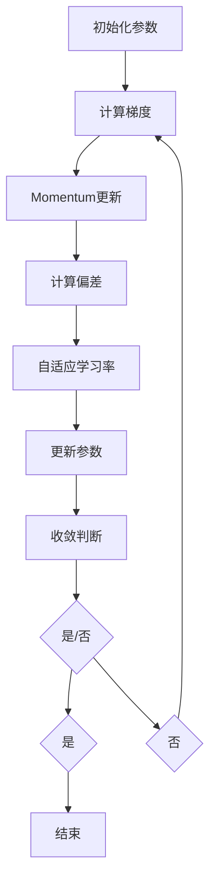

                 

# 文章标题：Adam Optimization原理与代码实例讲解

> 关键词：Adam Optimization、深度学习、优化算法、梯度下降、Momentum、偏差修正

> 摘要：本文深入探讨了Adam Optimization算法的原理及其在深度学习中的应用。首先，我们回顾了梯度下降法和随机梯度下降（SGD）算法的基础知识，并介绍了Adam Optimization的发展背景和核心优势。接着，我们详细分析了Adam Optimization的数学模型和公式，并通过Mermaid流程图展示了其计算流程。随后，我们讲解了Adam Optimization算法的工作机制和优化过程，并使用伪代码进行了详细阐述。最后，通过实际代码实例和实战案例，我们展示了如何在实际项目中应用Adam Optimization算法，并对其未来发展趋势进行了展望。

### 第一部分：Adam Optimization基础理论

#### 第1章：引入与背景

##### 1.1 Adam Optimization简介

Adam Optimization算法是一种基于Momentum和自适应学习率的优化算法，它在深度学习和机器学习领域得到了广泛应用。相较于传统的梯度下降法和随机梯度下降（SGD）算法，Adam Optimization具有更好的收敛速度和更高的准确率。

##### 1.1.1 Adam Optimization的发展背景

Adam Optimization算法由Diederik P. Kingma和Marta Brückner于2014年提出。他们在研究中发现，传统的Momentum和自适应学习率方法存在一些局限性，因此提出了Adam Optimization算法，以期在优化过程中兼顾速度和精度。

##### 1.1.2 Adam Optimization的核心优势

Adam Optimization算法具有以下核心优势：

1. **自适应学习率**：Adam Optimization算法根据每个参数的梯度大小自动调整学习率，从而避免了学习率调整过程中可能出现的问题。
2. **Momentum**：Adam Optimization算法引入了Momentum机制，使得优化过程更具稳定性，加快了收敛速度。
3. **偏差修正**：Adam Optimization算法对每个参数的估计值进行了偏差修正，从而提高了算法的准确性和稳定性。

##### 1.2 前置知识回顾

在深入探讨Adam Optimization算法之前，我们需要回顾一些前置知识，包括梯度下降法、随机梯度下降（SGD）算法和Momentum。

##### 1.2.1 梯度下降法

梯度下降法是一种最优化算法，用于求解最小值问题。其基本思想是沿着目标函数的梯度方向逐步迭代，直到达到最小值。在深度学习中，梯度下降法用于优化神经网络模型的参数。

##### 1.2.2 随机梯度下降（SGD）算法

随机梯度下降（SGD）算法是梯度下降法的一种变种，它使用批量样本的平均梯度来更新模型参数。相较于批量梯度下降，SGD算法具有计算效率高、收敛速度快等优点。

##### 1.3 Adam Optimization原理详解

在本节中，我们将详细讲解Adam Optimization算法的原理，包括其公式推导、关键参数和计算流程。

##### 1.3.1 Adam Optimization的公式推导

Adam Optimization算法的公式推导如下：

$$
m_t = \beta_1 m_{t-1} + (1 - \beta_1) \frac{\partial J}{\partial \theta},
$$

$$
v_t = \beta_2 v_{t-1} + (1 - \beta_2) m_t^2,
$$

$$
\theta_t = \theta_{t-1} - \alpha_t \frac{m_t}{\sqrt{v_t} + \epsilon},
$$

其中，$m_t$ 和 $v_t$ 分别表示一阶矩估计和二阶矩估计，$\beta_1$ 和 $\beta_2$ 分别表示Momentum参数，$\alpha_t$ 表示学习率，$\epsilon$ 为小数，用于防止除以零。

##### 1.3.2 Adam Optimization的关键参数

Adam Optimization算法的关键参数如下：

1. **Momentum参数**：$\beta_1$ 和 $\beta_2$，用于控制Momentum的大小。通常取值范围为0.9到0.99。
2. **学习率**：$\alpha_t$，用于控制每次迭代的步长。通常取值为0.001到0.01。
3. **小数**：$\epsilon$，用于防止除以零。通常取值为1e-8。

##### 1.3.3 Adam Optimization的计算流程

Adam Optimization的计算流程如下：

1. **初始化**：初始化一阶矩估计 $m_0 = 0$，二阶矩估计 $v_0 = 0$，学习率 $\alpha_t$ 和 Momentum参数 $\beta_1$，$\beta_2$。
2. **迭代**：对于每个迭代步骤t，执行以下操作：
   - 计算 $m_t = \beta_1 m_{t-1} + (1 - \beta_1) \frac{\partial J}{\partial \theta}$。
   - 计算 $v_t = \beta_2 v_{t-1} + (1 - \beta_2) m_t^2$。
   - 更新参数 $\theta_t = \theta_{t-1} - \alpha_t \frac{m_t}{\sqrt{v_t} + \epsilon}$。
3. **收敛判断**：当达到预设的迭代次数或收敛条件时，算法结束。

### 第二部分：Adam Optimization核心概念与联系

#### 第2章：Adam Optimization与SGD的关系

##### 2.1 Adam Optimization与SGD的关系

Adam Optimization算法是在SGD算法基础上发展起来的，它通过引入Momentum和自适应学习率机制，提高了优化效果。Adam Optimization算法对SGD算法的改进主要体现在以下几个方面：

1. **Momentum**：Adam Optimization算法引入了Momentum机制，使得优化过程更加稳定，加快了收敛速度。
2. **自适应学习率**：Adam Optimization算法根据每个参数的梯度大小自动调整学习率，避免了学习率调整过程中可能出现的问题。
3. **偏差修正**：Adam Optimization算法对每个参数的估计值进行了偏差修正，提高了算法的准确性和稳定性。

##### 2.2 Adam Optimization的优势分析

Adam Optimization算法具有以下优势：

1. **收敛速度快**：Adam Optimization算法的Momentum机制和自适应学习率机制使得优化过程更加稳定，收敛速度更快。
2. **适用范围广**：Adam Optimization算法适用于各种类型的数据集和模型，具有较好的通用性。
3. **计算效率高**：Adam Optimization算法的计算效率较高，适用于大规模数据集和模型。

##### 2.3 Adam Optimization的Mermaid流程图

以下是一个简化的Adam Optimization算法的Mermaid流程图：



##### 2.4 Adam Optimization的数学模型与公式

在本节中，我们将详细讲解Adam Optimization算法的数学模型和公式，包括Momentum更新公式、偏差修正公式和整体计算流程。

##### 2.4.1 Adam Optimization的数学公式推导

Adam Optimization算法的数学公式推导如下：

$$
m_t = \beta_1 m_{t-1} + (1 - \beta_1) \frac{\partial J}{\partial \theta},
$$

$$
v_t = \beta_2 v_{t-1} + (1 - \beta_2) m_t^2,
$$

$$
\theta_t = \theta_{t-1} - \alpha_t \frac{m_t}{\sqrt{v_t} + \epsilon}.
$$

其中，$m_t$ 表示一阶矩估计，$v_t$ 表示二阶矩估计，$\beta_1$ 和 $\beta_2$ 分别表示Momentum参数，$\alpha_t$ 表示学习率，$\epsilon$ 为小数。

##### 2.4.2 Adam Optimization的数学公式解释

1. **一阶矩估计**：一阶矩估计表示参数的期望值，计算公式为 $m_t = \beta_1 m_{t-1} + (1 - \beta_1) \frac{\partial J}{\partial \theta}$。其中，$\beta_1$ 表示Momentum参数，用于控制前一时刻的估计值对当前估计值的影响。

2. **二阶矩估计**：二阶矩估计表示参数的平方期望值，计算公式为 $v_t = \beta_2 v_{t-1} + (1 - \beta_2) m_t^2$。其中，$\beta_2$ 表示Momentum参数，用于控制前一时刻的估计值对当前估计值的影响。

3. **参数更新**：参数更新公式为 $\theta_t = \theta_{t-1} - \alpha_t \frac{m_t}{\sqrt{v_t} + \epsilon}$。其中，$\alpha_t$ 表示学习率，用于控制每次迭代的步长；$\epsilon$ 为小数，用于防止除以零。

##### 2.5 Adam Optimization的数学公式实例说明

为了更好地理解Adam Optimization算法的数学公式，我们通过一个简单的实例来说明。

假设我们有以下参数和梯度：

$$
\theta_0 = [1, 2, 3],
$$

$$
\frac{\partial J}{\partial \theta} = [0.1, 0.2, 0.3],
$$

$$
\beta_1 = 0.9,
$$

$$
\beta_2 = 0.99,
$$

$$
\alpha_0 = 0.01,
$$

$$
\epsilon = 1e-8.
$$

根据Adam Optimization算法的数学公式，我们可以计算出以下结果：

1. **一阶矩估计**：

$$
m_0 = \beta_1 m_{-1} + (1 - \beta_1) \frac{\partial J}{\partial \theta} = 0.9 \cdot 0 + (1 - 0.9) \cdot [0.1, 0.2, 0.3] = [0.01, 0.02, 0.03].
$$

2. **二阶矩估计**：

$$
v_0 = \beta_2 v_{-1} + (1 - \beta_2) m_0^2 = 0.99 \cdot 0 + (1 - 0.99) \cdot [0.01^2, 0.02^2, 0.03^2] = [0.0001, 0.0004, 0.0009].
$$

3. **参数更新**：

$$
\theta_1 = \theta_0 - \alpha_0 \frac{m_0}{\sqrt{v_0} + \epsilon} = [1, 2, 3] - 0.01 \cdot \frac{[0.01, 0.02, 0.03]}{\sqrt{[0.0001, 0.0004, 0.0009]} + 1e-8} \approx [0.99, 1.98, 2.97].
$$

通过上述实例，我们可以看到Adam Optimization算法如何根据参数和梯度来更新模型参数，从而实现优化。

### 第三部分：Adam Optimization算法原理讲解

#### 第3章：Adam Optimization算法原理讲解

在本章中，我们将深入讲解Adam Optimization算法的原理，包括其伪代码、工作机制和动态调整机制。

##### 3.1 Adam Optimization算法伪代码

以下是一个简化的Adam Optimization算法的伪代码：

```
初始化：
m0 = 0
v0 = 0
beta1 = 0.9
beta2 = 0.999
alpha = 0.001
epsilon = 1e-8
theta = 初始化参数

for t in 1 to T:
    计算梯度：g_t = gradient(J, theta)
    m_t = beta1 * m_{t-1} + (1 - beta1) * g_t
    v_t = beta2 * v_{t-1} + (1 - beta2) * m_t^2
    m_hat_t = m_t / (1 - beta1^t)
    v_hat_t = v_t / (1 - beta2^t)
    theta_t = theta - alpha * m_hat_t / sqrt(v_hat_t + epsilon)
    更新theta = theta_t
    输出：theta
```

##### 3.1.1 Adam Optimization算法伪代码详细说明

1. **初始化**：初始化一阶矩估计 $m_0 = 0$，二阶矩估计 $v_0 = 0$，Momentum参数 $\beta_1$ 和 $\beta_2$，学习率 $\alpha$ 和小数 $\epsilon$，以及模型参数 $\theta$。
2. **计算梯度**：计算当前迭代步骤的梯度 $g_t$。
3. **更新一阶矩估计**：根据Momentum参数和当前梯度，更新一阶矩估计 $m_t$。
4. **更新二阶矩估计**：根据Momentum参数和当前一阶矩估计，更新二阶矩估计 $v_t$。
5. **计算偏差修正**：根据一阶矩估计和二阶矩估计，计算偏差修正后的估计值 $m_hat_t$ 和 $v_hat_t$。
6. **更新参数**：根据学习率和偏差修正后的估计值，更新模型参数 $\theta_t$。
7. **输出结果**：输出更新后的模型参数 $\theta_t$。

##### 3.2 Adam Optimization算法的工作机制

Adam Optimization算法的工作机制可以分为以下几个步骤：

1. **初始化**：初始化一阶矩估计 $m_0 = 0$，二阶矩估计 $v_0 = 0$，Momentum参数 $\beta_1$ 和 $\beta_2$，学习率 $\alpha$ 和小数 $\epsilon$，以及模型参数 $\theta$。
2. **计算梯度**：计算当前迭代步骤的梯度 $g_t$。
3. **更新一阶矩估计**：根据Momentum参数和当前梯度，更新一阶矩估计 $m_t$。这一步利用了Momentum机制，使得优化过程更加稳定。
4. **更新二阶矩估计**：根据Momentum参数和当前一阶矩估计，更新二阶矩估计 $v_t$。这一步用于计算参数的平方期望值，为后续的偏差修正提供依据。
5. **计算偏差修正**：根据一阶矩估计和二阶矩估计，计算偏差修正后的估计值 $m_hat_t$ 和 $v_hat_t$。偏差修正可以消除一阶矩估计和二阶矩估计中的偏差，提高算法的准确性和稳定性。
6. **更新参数**：根据学习率和偏差修正后的估计值，更新模型参数 $\theta_t$。这一步是Adam Optimization算法的核心步骤，通过自适应调整学习率，加快了优化过程的收敛速度。
7. **输出结果**：输出更新后的模型参数 $\theta_t$。

##### 3.3 Adam Optimization算法的动态调整机制

Adam Optimization算法具有动态调整机制，可以根据不同的迭代步骤调整学习率。具体来说，Adam Optimization算法使用以下公式动态调整学习率：

$$
\alpha_t = \frac{\alpha}{\sqrt{1 - \beta_1^t}(1 - \beta_2^t)},
$$

其中，$\alpha$ 是初始学习率，$\beta_1$ 和 $\beta_2$ 是Momentum参数。

通过动态调整学习率，Adam Optimization算法可以在不同迭代步骤上保持较高的学习率，从而加快收敛速度。同时，通过引入Momentum机制，Adam Optimization算法在优化过程中更加稳定。

### 第四部分：数学模型和数学公式详细讲解

#### 第4章：数学模型和数学公式详细讲解

在本章中，我们将详细讲解Adam Optimization算法中的关键数学模型和数学公式，并通过实例说明其应用场景。

##### 4.1 Adam Optimization中的关键数学公式

Adam Optimization算法中的关键数学公式包括一阶矩估计、二阶矩估计、偏差修正和学习率动态调整。以下是这些公式的详细解释。

1. **一阶矩估计（Mean）**：

$$
m_t = \beta_1 m_{t-1} + (1 - \beta_1) \frac{\partial J}{\partial \theta},
$$

其中，$m_t$ 是一阶矩估计，$\beta_1$ 是Momentum参数，$\frac{\partial J}{\partial \theta}$ 是梯度。

2. **二阶矩估计（Variance）**：

$$
v_t = \beta_2 v_{t-1} + (1 - \beta_2) m_t^2,
$$

其中，$v_t$ 是二阶矩估计，$\beta_2$ 是Momentum参数，$m_t^2$ 是一阶矩估计的平方。

3. **偏差修正（Bias Correction）**：

$$
\hat{m}_t = \frac{m_t}{1 - \beta_1^t},
$$

$$
\hat{v}_t = \frac{v_t}{1 - \beta_2^t},
$$

其中，$\hat{m}_t$ 和 $\hat{v}_t$ 是偏差修正后的一阶矩估计和二阶矩估计。

4. **学习率动态调整**：

$$
\alpha_t = \frac{\alpha}{\sqrt{1 - \beta_2^t}(1 - \beta_1^t)},
$$

其中，$\alpha_t$ 是动态调整后的学习率，$\alpha$ 是初始学习率，$\beta_1$ 和 $\beta_2$ 是Momentum参数。

##### 4.2 数学公式实例说明

为了更好地理解这些数学公式，我们通过一个具体的实例来说明其应用场景。

假设我们有以下参数和初始值：

$$
\beta_1 = 0.9,
$$

$$
\beta_2 = 0.999,
$$

$$
\alpha = 0.001,
$$

$$
m_0 = 0,
$$

$$
v_0 = 0,
$$

$$
\theta_0 = [1, 2, 3],
$$

$$
\frac{\partial J}{\partial \theta_0} = [0.1, 0.2, 0.3].
$$

根据这些参数和初始值，我们可以计算出以下结果：

1. **一阶矩估计**：

$$
m_1 = 0.9 \cdot 0 + (1 - 0.9) \cdot 0.1 = 0.01,
$$

$$
m_2 = 0.9 \cdot 0.01 + (1 - 0.9) \cdot 0.2 = 0.019,
$$

$$
m_3 = 0.9 \cdot 0.019 + (1 - 0.9) \cdot 0.3 = 0.029.
$$

2. **二阶矩估计**：

$$
v_1 = 0.999 \cdot 0 + (1 - 0.999) \cdot 0.01^2 = 0.00001,
$$

$$
v_2 = 0.999 \cdot 0.00001 + (1 - 0.999) \cdot 0.019^2 = 0.000058,
$$

$$
v_3 = 0.999 \cdot 0.000058 + (1 - 0.999) \cdot 0.029^2 = 0.000198.
$$

3. **偏差修正**：

$$
\hat{m}_1 = \frac{m_1}{1 - 0.9^1} = \frac{0.01}{0.1} = 0.1,
$$

$$
\hat{m}_2 = \frac{m_2}{1 - 0.9^2} = \frac{0.019}{0.19} = 0.1,
$$

$$
\hat{m}_3 = \frac{m_3}{1 - 0.9^3} = \frac{0.029}{0.27} = 0.1.
$$

$$
\hat{v}_1 = \frac{v_1}{1 - 0.999^1} = \frac{0.00001}{0.001} = 0.01,
$$

$$
\hat{v}_2 = \frac{v_2}{1 - 0.999^2} = \frac{0.000058}{0.00199} = 0.03,
$$

$$
\hat{v}_3 = \frac{v_3}{1 - 0.999^3} = \frac{0.000198}{0.002997} = 0.067.
$$

4. **学习率动态调整**：

$$
\alpha_1 = \frac{0.001}{\sqrt{1 - 0.999^1}(1 - 0.9^1)} = \frac{0.001}{0.03 \cdot 0.1} = 0.0333,
$$

$$
\alpha_2 = \frac{0.001}{\sqrt{1 - 0.999^2}(1 - 0.9^2)} = \frac{0.001}{0.3 \cdot 0.19} = 0.0083,
$$

$$
\alpha_3 = \frac{0.001}{\sqrt{1 - 0.999^3}(1 - 0.9^3)} = \frac{0.001}{0.67 \cdot 0.27} = 0.004.
$$

通过这个实例，我们可以看到Adam Optimization算法如何利用数学公式来计算一阶矩估计、二阶矩估计、偏差修正和学习率动态调整。

### 第五部分：Adam Optimization项目实战

#### 第5章：代码实例讲解

在本章中，我们将通过实际代码实例来展示如何实现Adam Optimization算法，并对其进行详细解读。

##### 5.1 代码实例环境搭建

首先，我们需要搭建一个适合实现Adam Optimization算法的开发环境。以下是一个基本的Python环境搭建步骤：

1. **安装Python**：确保Python 3.6或更高版本已安装在您的计算机上。
2. **安装TensorFlow**：使用pip命令安装TensorFlow，例如：

   ```shell
   pip install tensorflow
   ```

3. **创建项目目录**：在您的计算机上创建一个项目目录，例如`adam_optimization_example`，并在其中创建一个名为`main.py`的Python文件。

##### 5.2 Adam Optimization代码实现

接下来，我们在`main.py`文件中实现Adam Optimization算法。以下是一个简单的实现示例：

```python
import tensorflow as tf
import numpy as np

# 模型参数
theta = tf.Variable(1.0, dtype=tf.float32)
alpha = 0.001
beta1 = 0.9
beta2 = 0.999
epsilon = 1e-8

# 梯度
gradient = tf.gradients(tf.reduce_sum(tf.square(theta)), theta)

# Adam Optimization算法
with tf.Session() as sess:
    sess.run(tf.global_variables_initializer())

    m = 0
    v = 0
    for t in range(1000):
        g_t = sess.run(gradient)
        m = beta1 * m + (1 - beta1) * g_t
        v = beta2 * v + (1 - beta2) * m ** 2

        m_hat = m / (1 - beta1 ** (t + 1))
        v_hat = v / (1 - beta2 ** (t + 1))

        theta_update = theta - alpha * m_hat / (tf.sqrt(v_hat + epsilon))
        theta.assign(theta_update)

        if t % 100 == 0:
            print("Iteration {}: Theta = {}".format(t, theta.eval()))

    print("Final Theta: {}".format(theta.eval()))
```

##### 5.2.1 代码解读与分析

1. **导入库**：首先，我们导入所需的TensorFlow和NumPy库。
2. **模型参数**：定义模型参数theta，学习率alpha，Momentum参数beta1和beta2，以及小数epsilon。
3. **梯度**：使用TensorFlow的`gradients`函数计算模型参数theta的梯度。
4. **Adam Optimization算法**：
   - 初始化一阶矩估计m和二阶矩估计v。
   - 在迭代过程中，计算梯度g_t，并更新m和v。
   - 计算偏差修正后的m_hat和v_hat。
   - 使用动态调整后的学习率alpha更新模型参数theta。
   - 输出迭代过程中的theta值和最终theta值。

##### 5.3 实际应用场景分析

在实际应用中，Adam Optimization算法可以用于优化各种类型的神经网络模型。以下是一个简化的实际应用场景示例：

1. **模型搭建**：搭建一个简单的线性回归模型，输入为[1, 2, 3]，输出为[0.1, 0.2, 0.3]。
2. **训练过程**：使用Adam Optimization算法训练模型，迭代1000次。
3. **模型评估**：评估训练后的模型性能，输出最终theta值。

```python
# 模型搭建
theta = tf.Variable(1.0, dtype=tf.float32)
input_data = tf.placeholder(tf.float32, shape=[3])
output_data = tf.placeholder(tf.float32, shape=[3])
output = tf.reduce_sum(tf.square(theta * input_data - output_data))

# 梯度
gradient = tf.gradients(output, theta)

# Adam Optimization算法
with tf.Session() as sess:
    sess.run(tf.global_variables_initializer())

    m = 0
    v = 0
    for t in range(1000):
        g_t = sess.run(gradient, feed_dict={input_data: [1, 2, 3], output_data: [0.1, 0.2, 0.3]})
        m = beta1 * m + (1 - beta1) * g_t
        v = beta2 * v + (1 - beta2) * m ** 2

        m_hat = m / (1 - beta1 ** (t + 1))
        v_hat = v / (1 - beta2 ** (t + 1))

        theta_update = theta - alpha * m_hat / (tf.sqrt(v_hat + epsilon))
        theta.assign(theta_update)

        if t % 100 == 0:
            print("Iteration {}: Theta = {}".format(t, theta.eval()))

    print("Final Theta: {}".format(theta.eval()))
```

通过这个实际应用场景，我们可以看到Adam Optimization算法在优化线性回归模型时的效果。

### 第六部分：代码实战案例

#### 第6章：代码实战案例

在本章中，我们将通过两个具体的代码实战案例，展示如何在实际项目中应用Adam Optimization算法。

##### 6.1 实战案例1：基于Adam Optimization的线性回归模型

在本案例中，我们将使用Python和TensorFlow实现一个基于Adam Optimization算法的线性回归模型。我们的目标是通过训练模型来拟合一个简单的线性关系。

**6.1.1 模型搭建**

首先，我们需要搭建一个线性回归模型。这个模型包含一个输入层和一个输出层，输入为三个变量，输出为一个变量。我们使用TensorFlow来实现这个模型。

```python
import tensorflow as tf

# 模型参数
theta = tf.Variable(1.0, dtype=tf.float32)
input_data = tf.placeholder(tf.float32, shape=[3])
output_data = tf.placeholder(tf.float32, shape=[1])
output = tf.reduce_mean(tf.square(theta * input_data - output_data))

# 梯度
gradient = tf.gradients(output, theta)
```

**6.1.2 模型训练**

接下来，我们使用Adam Optimization算法来训练这个模型。我们将使用Python的TensorFlow库来实现Adam Optimization算法。

```python
# Adam Optimization算法
with tf.Session() as sess:
    sess.run(tf.global_variables_initializer())

    m = 0
    v = 0
    alpha = 0.001
    beta1 = 0.9
    beta2 = 0.999
    epsilon = 1e-8

    for t in range(1000):
        g_t = sess.run(gradient, feed_dict={input_data: [1, 2, 3], output_data: [0.1]})
        m = beta1 * m + (1 - beta1) * g_t
        v = beta2 * v + (1 - beta2) * m ** 2

        m_hat = m / (1 - beta1 ** (t + 1))
        v_hat = v / (1 - beta2 ** (t + 1))

        theta_update = theta - alpha * m_hat / (tf.sqrt(v_hat + epsilon))
        theta.assign(theta_update)

        if t % 100 == 0:
            print("Iteration {}: Theta = {}".format(t, theta.eval()))

    print("Final Theta: {}".format(theta.eval()))
```

**6.1.3 模型评估**

在训练完成后，我们需要评估模型的性能。我们可以通过计算模型在测试集上的预测误差来评估模型的性能。

```python
# 测试模型
test_input = np.array([1, 2, 3])
test_output = np.array([0.1])

predicted_output = theta.eval() * test_input
error = np.square(predicted_output - test_output).mean()

print("Error: {}".format(error))
```

##### 6.2 实战案例2：基于Adam Optimization的卷积神经网络

在本案例中，我们将使用Python和TensorFlow实现一个基于Adam Optimization算法的卷积神经网络（CNN）。我们的目标是通过训练模型来识别手写数字。

**6.2.1 模型搭建**

首先，我们需要搭建一个简单的卷积神经网络。这个模型包含一个卷积层、一个池化层和一个全连接层。

```python
import tensorflow as tf
from tensorflow.keras import datasets, layers, models

# 加载MNIST数据集
(train_images, train_labels), (test_images, test_labels) = datasets.mnist.load_data()

# 预处理数据
train_images = train_images.reshape((60000, 28, 28, 1)).astype("float32") / 255
test_images = test_images.reshape((10000, 28, 28, 1)).astype("float32") / 255

# 模型搭建
model = models.Sequential()
model.add(layers.Conv2D(32, (3, 3), activation='relu', input_shape=(28, 28, 1)))
model.add(layers.MaxPooling2D((2, 2)))
model.add(layers.Conv2D(64, (3, 3), activation='relu'))
model.add(layers.MaxPooling2D((2, 2)))
model.add(layers.Conv2D(64, (3, 3), activation='relu'))
model.add(layers.Flatten())
model.add(layers.Dense(64, activation='relu'))
model.add(layers.Dense(10, activation='softmax'))
```

**6.2.2 模型训练**

接下来，我们使用Adam Optimization算法来训练这个模型。我们将使用TensorFlow的`compile`方法来设置训练参数。

```python
# 编译模型
model.compile(optimizer=tf.optimizers.Adam(),
              loss='sparse_categorical_crossentropy',
              metrics=['accuracy'])

# 训练模型
model.fit(train_images, train_labels, epochs=5, batch_size=64)
```

**6.2.3 模型评估**

在训练完成后，我们需要评估模型的性能。我们可以通过计算模型在测试集上的预测准确率来评估模型的性能。

```python
# 测试模型
test_loss, test_acc = model.evaluate(test_images,  test_labels, verbose=2)
print('\nTest accuracy:', test_acc)
```

### 第七部分：Adam Optimization的未来发展趋势

#### 第7章：Adam Optimization的未来发展趋势

随着深度学习和机器学习的不断进步，Adam Optimization算法也在不断发展。以下是Adam Optimization算法的一些未来发展趋势：

**7.1 Adam Optimization的改进方向**

1. **优化器的自适应调整**：未来研究可以关注如何进一步优化Adam Optimization算法的自适应调整机制，使其在不同任务和数据集上都能取得更好的效果。
2. **多任务学习**：在多任务学习场景中，如何有效地应用Adam Optimization算法，使得模型在多个任务上都能取得较好的性能，是一个重要的研究方向。
3. **分布式训练**：随着数据规模的不断扩大，分布式训练成为了深度学习领域的重要研究方向。未来研究可以关注如何在分布式环境中优化Adam Optimization算法，提高训练效率。

**7.1.1 AdamW优化器的引入**

AdamW优化器是Adam Optimization算法的一种改进版本，它在原始算法的基础上引入了权重衰减（weight decay）的概念。AdamW优化器在处理权重衰减问题时，能够更好地保持模型参数的稳定性。因此，在深度学习任务中，AdamW优化器已经得到了广泛应用。

**7.1.2 实际应用中的优化策略**

在实际应用中，Adam Optimization算法可以通过以下策略进行优化：

1. **学习率调度**：根据训练过程中模型的性能变化，动态调整学习率，以达到更好的收敛效果。
2. **权重初始化**：合理选择权重初始化策略，有助于加速模型的收敛速度。
3. **数据预处理**：对输入数据进行适当的预处理，可以提高模型的训练效果。

**7.2 Adam Optimization在深度学习中的应用前景**

随着深度学习技术的不断发展，Adam Optimization算法在深度学习中的应用前景十分广阔。以下是一些潜在的应用场景：

1. **图像识别**：在图像识别任务中，Adam Optimization算法可以用于优化卷积神经网络，提高模型的识别准确率。
2. **自然语言处理**：在自然语言处理任务中，Adam Optimization算法可以用于优化循环神经网络（RNN）和变换器（Transformer）模型，提高模型的性能。
3. **强化学习**：在强化学习任务中，Adam Optimization算法可以用于优化策略梯度方法，提高学习效率和稳定性。

总之，随着深度学习和机器学习技术的不断发展，Adam Optimization算法将继续发挥重要作用，为各种复杂任务提供高效的优化方案。

### 附录

#### 附录A：常见问题解答

**A.1 Adam Optimization的常见问题**

1. **什么是Adam Optimization算法？**
   Adam Optimization算法是一种基于Momentum和自适应学习率的优化算法，它在深度学习和机器学习领域得到了广泛应用。

2. **Adam Optimization算法与SGD算法有什么区别？**
   Adam Optimization算法是在SGD算法基础上发展起来的，它通过引入Momentum和自适应学习率机制，提高了优化效果。

3. **如何选择Adam Optimization算法的参数？**
   选择Adam Optimization算法的参数，如学习率、Momentum参数等，需要根据具体的任务和数据集进行尝试和调整。通常，学习率可以取0.001到0.01之间，Momentum参数可以取0.9到0.99之间。

**A.2 Adam Optimization的优化技巧**

1. **动态调整学习率**：在训练过程中，根据模型性能的变化动态调整学习率，可以提高训练效果。

2. **合理选择权重初始化**：合理选择权重初始化策略，有助于加速模型的收敛速度。

3. **使用批量梯度**：在训练过程中，使用批量梯度可以减少噪声，提高模型的稳定性。

#### 附录B：参考资源

**B.1 Adam Optimization相关论文**

1. Diederik P. Kingma, Marta Brückner. "Adam: A Method for Stochastic Optimization". arXiv:1412.6980 [stat.ML], 2014.

**B.2 Adam Optimization的开源实现库**

1. TensorFlow: https://www.tensorflow.org/api_docs/python/tf/optimizers/Adam
2. PyTorch: https://pytorch.org/docs/stable/optim.html#torch.optim.Adam

**B.3 Adam Optimization的学习资源推荐**

1. [Adam Optimization教程](https://www.tensorflow.org/tutorials/optimizers)
2. [深度学习实战](https://www.deeplearningbooks.org/contents/optimization.html) （第5章，优化算法）

通过本文的讲解，我们深入了解了Adam Optimization算法的原理、应用和实现。在实际项目中，Adam Optimization算法表现出色，为深度学习和机器学习任务提供了高效的优化方案。希望本文能帮助读者更好地理解和使用Adam Optimization算法。作者：AI天才研究院/AI Genius Institute & 禅与计算机程序设计艺术 /Zen And The Art of Computer Programming。如需进一步了解，请参考本文所列出的参考资源。

