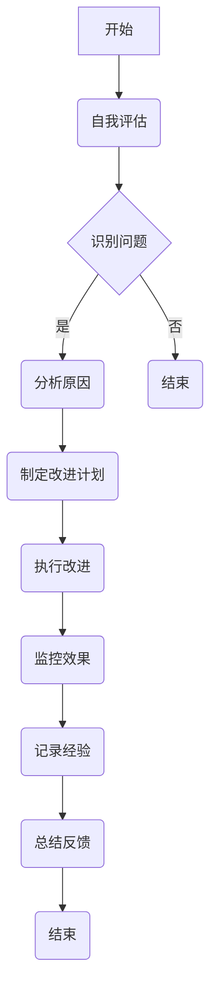
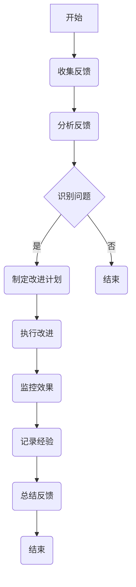

                 

## 文章标题

### Agent能够通过自我反思和反馈来改进执行，同时提供可观察性

> 关键词：Agent、自我反思、反馈、执行改进、可观察性

> 摘要：本文深入探讨了Agent通过自我反思和反馈来改进执行过程并提高可观察性的机制。首先介绍了自我反思与反馈的理论基础，随后详细阐述了Agent的概念、特性以及自我反思和反馈机制的实现。接着，文章通过核心算法原理讲解、数学模型和公式、项目实战等部分，展示了如何通过自我反思和反馈实现Agent的执行改进和可观察性。最后，本文对Agent的综合应用、未来发展趋势以及挑战与展望进行了探讨。

## 第1章 引言

### 1.1 研究背景与意义

在当今社会，人工智能（AI）技术正以惊人的速度发展，并在各个领域发挥着重要作用。从自动驾驶汽车到智能家居，从医疗诊断到金融交易，AI技术的应用已渗透到我们生活的方方面面。其中，智能代理（Agent）作为AI的核心概念之一，越来越受到关注。

Agent是指能够感知环境、做出决策并执行任务的智能实体。传统上，Agent主要依靠预先设定的规则和策略来执行任务。然而，随着环境复杂性的增加和任务多样性的提升，单纯依靠预设规则已经无法满足需求。因此，研究者开始探索Agent如何通过自我反思和反馈来改进执行，并提高其可观察性。

自我反思是指Agent在执行任务过程中，对自身行为、决策和结果的反思与评估。通过自我反思，Agent可以识别执行过程中的问题，并制定相应的改进措施。而反馈机制则是指Agent根据外部环境或用户反馈来调整自身行为和策略，从而实现执行效果的优化。

研究Agent通过自我反思和反馈来改进执行并提高可观察性的机制，不仅有助于提升Agent的智能水平，还能为人工智能技术的进一步发展提供理论支持和实践指导。

### 1.2 研究目标与方法

本文的研究目标包括：

1. 深入探讨自我反思和反馈的理论基础，明确其核心概念和机制。
2. 分析Agent的概念和特性，探讨其在不同应用场景中的表现。
3. 阐述Agent的自我反思和反馈机制的实现方法，包括算法原理、数学模型和项目实战。
4. 研究Agent通过自我反思和反馈实现执行改进和可观察性的具体方法和策略。
5. 探讨Agent的综合应用、未来发展趋势以及面临的挑战和展望。

本文的研究方法主要包括：

1. 文献综述：通过对相关研究文献的回顾和分析，了解自我反思和反馈在Agent中的应用和发展现状。
2. 理论研究：基于自我反思和反馈的理论基础，探讨Agent的自我反思和反馈机制的实现方法和策略。
3. 实证分析：通过实际案例和实验数据，验证自我反思和反馈在Agent执行改进和可观察性方面的效果。
4. 案例研究：分析成功案例，总结经验教训，为Agent在现实世界中的应用提供参考。

### 1.3 书籍结构安排

本文的结构安排如下：

- 第1章：引言，介绍研究背景、研究目标与方法以及书籍结构安排。
- 第2章：自我反思与反馈理论，阐述自我反思和反馈的核心概念、原理和机制。
- 第3章：Agent的概念与特性，分析Agent的定义、分类和应用场景。
- 第4章：Agent的自我反思机制，详细描述自我反思机制的设计原理、实现方法和性能评估。
- 第5章：Agent的反馈机制，探讨反馈机制的设计原理、实现方法和性能评估。
- 第6章：Agent的执行改进，研究Agent通过自我反思和反馈实现执行改进的方法和策略。
- 第7章：Agent的可观察性，分析Agent如何提供可观察性以及实现方法。
- 第8章：Agent的综合应用，探讨Agent在不同领域的应用、未来发展趋势以及挑战与展望。
- 附录：提供相关工具和技术、进一步阅读文献以及开发环境与实现指南。

通过上述结构安排，本文旨在系统地介绍Agent通过自我反思和反馈来改进执行并提高可观察性的机制，为人工智能技术的发展提供理论支持和实践指导。

## 第2章 自我反思与反馈理论

### 2.1 自我反思的概念与作用

自我反思是一种心智过程，涉及个体对自己的思维、情感和行为进行审视和评价。在人工智能领域，自我反思被赋予特定的含义，成为智能代理（Agent）自我改进的重要手段。自我反思的概念可以追溯到哲学领域，苏格拉底曾提倡通过提问和思考来探求真理。在现代心理学中，自我反思被广泛应用于个人成长和心理咨询。而在人工智能中，自我反思是指Agent在执行任务过程中，对自身行为、决策和结果的反思和评估。

自我反思在Agent中的作用主要体现在以下几个方面：

1. **问题识别**：通过自我反思，Agent能够识别自身执行过程中存在的问题，如决策失误、行为不合理等。这种问题识别能力有助于Agent在后续任务中避免重复错误。
   
2. **知识更新**：自我反思过程中，Agent可以对已存储的知识和经验进行评估，识别出不准确或过时的信息，从而进行知识更新。这种知识更新能力使得Agent能够适应环境变化，提高决策质量。

3. **策略优化**：通过反思过去的执行过程，Agent可以分析不同策略的效果，选择最优策略。这种策略优化能力有助于Agent在面对复杂环境时，做出更加明智的决策。

4. **学习能力提升**：自我反思使得Agent能够从错误中学习，提高自身的适应能力和学习能力。这种学习能力提升对于Agent在动态变化的环境中的持续发展至关重要。

### 2.2 反馈机制的基本原理

反馈机制是Agent自我反思的重要组成部分。反馈机制的基本原理是通过外部信号（反馈）来调节Agent的行为和决策。在控制理论中，反馈机制被广泛应用于控制系统，以实现稳定和优化的控制效果。在人工智能领域，反馈机制被引入到Agent的决策过程中，以帮助Agent实现自我改进。

反馈机制的基本原理包括以下几个关键要素：

1. **输入信号**：输入信号是Agent接收到的外部信息，通常包括用户反馈、环境变化和其他Agent的交互信息。

2. **感知器**：感知器是Agent处理输入信号的部分，通过感知器，Agent能够理解和分析输入信号的内容，识别出有用的信息。

3. **控制器**：控制器是Agent的核心部分，负责根据输入信号和已有的知识、经验，生成新的行为和决策。控制器通常包括多个模块，如决策模块、执行模块和评估模块。

4. **执行器**：执行器是Agent实施决策的部分，通过执行器，Agent能够将决策转化为实际操作。执行器的效果会直接影响到输入信号的质量。

5. **输出信号**：输出信号是Agent执行决策后产生的外部结果，包括Agent的行为输出和环境的变化等。

反馈机制的基本流程如下：

1. **感知输入信号**：Agent通过感知器接收外部输入信号，如用户反馈、环境变化等。

2. **处理输入信号**：控制器对输入信号进行处理，分析其含义，识别出有用的信息。

3. **生成决策**：根据处理后的输入信号和已有的知识、经验，控制器生成新的行为和决策。

4. **执行决策**：Agent通过执行器将决策转化为实际操作，产生输出信号。

5. **收集输出信号**：Agent通过感知器接收执行后的输出信号，用于下一轮的反馈过程。

6. **反馈调节**：控制器根据输出信号评估决策的效果，调整后续的行为和决策。

通过上述反馈机制，Agent能够在执行任务过程中不断调整自身的行为和决策，实现自我优化和改进。

### 2.3 自我反思与反馈的结合

自我反思和反馈机制在Agent中是紧密结合的。自我反思为Agent提供了内部自我审视的途径，而反馈机制则为Agent提供了外部调整的依据。两者结合，使得Agent能够在动态环境中实现持续的自我改进。

结合的方式主要表现在以下几个方面：

1. **循环反馈**：Agent在执行任务时，通过自我反思机制不断评估自身行为和决策，并通过反馈机制获取外部环境或用户反馈。这种循环反馈机制使得Agent能够实时调整自身的行为和决策，提高适应能力和执行效果。

2. **反馈优化**：在自我反思过程中，Agent不仅分析自身的执行过程，还根据外部反馈进行优化。例如，在决策过程中，Agent可以根据用户反馈调整决策参数，从而提高决策的准确性。

3. **协同工作**：自我反思和反馈机制相互协作，共同提升Agent的整体性能。自我反思提供了对内部过程的深入理解，而反馈机制则提供了对外部环境的有效响应。两者协同工作，使得Agent能够在复杂环境中实现高效执行。

4. **持续学习**：通过结合自我反思和反馈机制，Agent能够实现持续学习。自我反思帮助Agent识别问题和不足，而反馈机制则提供了改进的途径。这种持续学习机制使得Agent能够不断提高自身的智能水平，适应不断变化的环境。

### 2.4 自我反思与反馈的理论基础

自我反思与反馈机制的理论基础包括哲学、心理学和人工智能等多个领域。

在哲学领域，苏格拉底的“问答法”和笛卡尔的“怀疑方法”为自我反思提供了理论基础。苏格拉底通过提问引导学生进行深入思考，从而发现真理。而笛卡尔则通过怀疑一切，寻找无可怀疑的真理。这些哲学思想为自我反思提供了方法论支持。

在心理学领域，自我反思被视为一种认知过程，涉及个体的自我意识、自我评价和自我调节。心理学研究指出，自我反思有助于个体提高自我意识和自我效能感，从而促进个人成长和发展。

在人工智能领域，自我反思和反馈机制被广泛应用于智能代理的设计与实现。人工智能研究者借鉴心理学和哲学的理论基础，提出了各种自我反思和反馈模型。例如，基于贝叶斯网络的反思模型、基于神经网络的自我反思模型等。这些模型为Agent的自我改进提供了理论支持。

此外，控制理论也为自我反思和反馈机制提供了重要启示。在控制理论中，反馈机制被广泛应用于控制系统，以实现稳定和优化的控制效果。人工智能领域借鉴控制理论，将反馈机制引入到Agent的决策过程中，实现了自我反思和反馈的有机结合。

总之，自我反思与反馈机制的理论基础涵盖了哲学、心理学和人工智能等多个领域，这些理论共同为Agent的自我改进提供了丰富的研究视角和理论支持。

### 第3章 Agent的概念与特性

#### 3.1 Agent的定义

Agent是指具有感知、推理、决策和行动能力的智能实体。在人工智能领域，Agent被广泛认为是实现智能自动化和自主行动的关键概念。一个典型的Agent通常包括以下基本组成部分：

1. **感知器**：感知器是Agent获取外部环境信息的装置，通过感知器，Agent能够获取温度、光线、声音、图像等多种形式的信息。

2. **知识库**：知识库是Agent存储和处理信息的地方，包括事实、规则、模型和策略等。知识库为Agent提供了推理和决策的基础。

3. **控制器**：控制器是Agent的核心部分，负责根据感知器获取的信息和知识库中的知识，生成相应的行为和决策。控制器通常由多个模块组成，如决策模块、执行模块和评估模块。

4. **执行器**：执行器是Agent实施决策的部分，通过执行器，Agent能够将决策转化为实际操作，如移动、发送信息等。

#### 3.2 Agent的基本特性

Agent具有以下基本特性：

1. **自主性**：Agent能够自主地感知环境、做出决策并执行任务，无需人工干预。这种自主性使得Agent能够在复杂环境中独立运作，提高工作效率。

2. **反应性**：Agent能够实时响应环境变化，根据感知到的信息调整自身行为。这种反应性使得Agent能够在动态环境中灵活应对，提高适应能力。

3. **社会性**：Agent能够与其他Agent或人类进行交互，共享信息和知识。这种社会性使得Agent能够协作完成任务，提高整体效能。

4. **认知性**：Agent具有推理和决策能力，能够根据环境和任务需求，生成最优行为策略。这种认知性使得Agent能够在复杂决策过程中，表现出智能和理性。

5. **适应性**：Agent能够根据执行任务的结果和环境变化，不断调整自身行为和策略。这种适应性使得Agent能够适应不断变化的环境，提高生存能力。

#### 3.3 Agent的分类

根据Agent的特性和应用场景，可以将Agent分为以下几类：

1. **反应式Agent**：反应式Agent是最简单的一类Agent，它们仅根据当前的感知信息做出反应，不涉及内部状态和历史信息的存储。这类Agent适用于环境简单、任务明确的场景，如工业自动化控制、智能家居等。

2. **记忆型Agent**：记忆型Agent能够在感知信息的基础上，利用历史信息进行决策。这类Agent具有简单的记忆功能，能够根据过去的信息调整当前行为，如路径规划、任务分配等。

3. **推理型Agent**：推理型Agent具有更复杂的推理能力，能够根据感知信息和知识库中的规则，进行逻辑推理和决策。这类Agent适用于复杂任务和环境，如自然语言处理、智能对话系统等。

4. **学习型Agent**：学习型Agent具有自我学习能力，能够通过执行任务和学习新知识，不断提高自身性能。这类Agent适用于动态变化的环境，如机器人、自动驾驶等。

5. **社会型Agent**：社会型Agent能够与其他Agent或人类进行交互，共享信息和知识，协同完成任务。这类Agent适用于多Agent系统和人机交互场景，如多人游戏、智能办公等。

#### 3.4 Agent的应用场景

Agent在各个领域具有广泛的应用，以下列举一些典型的应用场景：

1. **工业自动化**：在制造业中，Agent可用于生产线的自动化控制、设备故障诊断和优化调度等。

2. **智能家居**：在家庭生活中，Agent可用于家电控制、环境监测和安全防护等。

3. **医疗诊断**：在医疗领域，Agent可用于疾病诊断、治疗方案推荐和健康监测等。

4. **金融服务**：在金融领域，Agent可用于风险评估、交易策略优化和客户服务管理等。

5. **交通运输**：在交通运输领域，Agent可用于自动驾驶、交通流量管理和智能导航等。

6. **教育领域**：在教育领域，Agent可用于智能教学、个性化学习推荐和学术研究支持等。

7. **政府治理**：在政府治理中，Agent可用于智慧城市建设、公共资源分配和社会治理优化等。

通过以上介绍，我们可以看到Agent在各个领域具有广泛的应用前景，其自主性、反应性、社会性和认知性等特性使得Agent能够应对复杂多样的任务和环境，成为人工智能发展的重要方向。

### 第4章 Agent的自我反思机制

#### 4.1 自我反思机制的设计原理

自我反思机制是Agent在执行任务过程中，通过评估自身行为、决策和结果，识别问题并制定改进策略的能力。这种机制的设计原理基于对Agent执行过程的深入理解，包括以下几个方面：

1. **状态监测**：自我反思机制首先需要监测Agent在执行任务时的状态，包括感知信息、决策过程、执行结果等。状态监测是自我反思的基础，为后续的评估和反思提供了必要的数据支持。

2. **问题识别**：在监测到Agent的状态后，自我反思机制需要分析这些状态数据，识别出潜在的问题和不足。问题识别的过程通常涉及对历史数据的对比分析、异常检测和模式识别等。

3. **原因分析**：一旦发现问题，自我反思机制需要深入分析问题的根本原因。原因分析有助于Agent理解问题的来源，从而制定更有针对性的改进措施。

4. **改进策略**：在识别和分析了问题之后，自我反思机制需要制定相应的改进策略。这些策略可以是调整决策规则、优化执行流程、引入新的算法或模型等。

5. **执行反馈**：改进策略制定后，自我反思机制需要将改进措施应用到实际任务中，并收集反馈信息。执行反馈过程可以进一步验证改进策略的有效性，并指导下一轮的自我反思。

6. **持续优化**：自我反思机制的设计还强调持续优化，通过不断的反馈和调整，使得Agent能够在动态环境中持续提升性能。

#### 4.2 自我反思的过程与步骤

自我反思的过程可以分为以下几个步骤：

1. **数据收集**：Agent在执行任务时，通过感知器收集环境数据、任务数据和行为数据。这些数据是自我反思的重要基础。

2. **状态评估**：将收集到的数据输入到评估模块，对Agent的当前状态进行评估。评估模块可以采用多种方法，如统计分析、机器学习模型等，来评估Agent的状态。

3. **问题检测**：通过对比历史数据和当前状态，检测出潜在的问题和异常。问题检测可以通过异常检测算法、趋势分析等方法实现。

4. **原因分析**：在检测到问题后，自我反思机制会进行原因分析，以确定问题的根本原因。原因分析可以通过数据挖掘、因果分析等方法实现。

5. **策略生成**：根据原因分析的结果，生成相应的改进策略。策略生成可以基于专家知识、机器学习算法或混合智能等方法。

6. **执行改进**：将改进策略应用到Agent的决策和执行过程中，执行新的任务。在这个过程中，Agent会持续收集反馈信息。

7. **结果评估**：对执行改进后的结果进行评估，验证改进策略的有效性。如果结果满意，则继续执行；否则，返回步骤4，重新进行原因分析和策略生成。

#### 4.3 自我反思机制的实现

实现自我反思机制需要考虑以下几个方面：

1. **数据采集与处理**：采集Agent在执行任务过程中的数据，并进行预处理。预处理包括数据清洗、归一化、特征提取等步骤。

2. **评估模块设计**：设计能够对Agent状态进行评估的模块，通常采用机器学习模型或统计分析方法。评估模块需要能够处理不同类型的数据，如数值数据、文本数据和图像数据等。

3. **问题检测算法**：选择合适的问题检测算法，如基于统计的异常检测算法、基于机器学习的分类算法等。这些算法需要能够识别出Agent执行过程中的异常和问题。

4. **原因分析算法**：设计能够对问题进行原因分析的算法，如因果分析算法、数据挖掘算法等。原因分析需要深入挖掘数据背后的关联性和因果关系。

5. **策略生成算法**：根据原因分析的结果，生成相应的改进策略。策略生成算法可以是基于规则的、基于机器学习的或混合智能的。

6. **执行模块设计**：设计能够执行改进策略的模块，确保改进策略能够应用到Agent的决策和执行过程中。

7. **反馈机制**：设计反馈机制，收集执行改进后的反馈信息，用于下一轮的自我反思。

#### 4.4 自我反思机制的性能评估

自我反思机制的性能评估主要包括以下几个方面：

1. **准确率**：评估自我反思机制在问题检测和原因分析中的准确性。准确率越高，说明自我反思机制越能够准确地识别问题和分析原因。

2. **响应速度**：评估自我反思机制的反应速度，即从数据收集到生成改进策略的时间。响应速度越快，说明自我反思机制越能够在短时间内进行自我调整。

3. **改进效果**：评估改进策略在实际执行中的应用效果，即改进策略是否能够有效提升Agent的执行性能。改进效果越高，说明自我反思机制越能够通过改进策略提高Agent的整体效能。

4. **鲁棒性**：评估自我反思机制在处理不同类型数据和复杂环境下的稳定性和适应性。鲁棒性越强，说明自我反思机制越能够在各种复杂环境下保持稳定的性能。

5. **可扩展性**：评估自我反思机制在处理不同规模任务和数据集时的扩展性。可扩展性越高，说明自我反思机制越能够适应不同规模的任务需求。

通过上述性能评估指标，可以全面了解自我反思机制的性能和有效性，为进一步优化和改进提供依据。

### 第5章 Agent的反馈机制

#### 5.1 反馈机制的设计原理

反馈机制是Agent在执行任务过程中，通过外部信号调整自身行为和决策的重要手段。其设计原理基于以下几个关键要素：

1. **输入信号**：输入信号是反馈机制的重要组成部分，通常包括用户反馈、环境变化、任务进展等信息。这些信号为Agent提供了调整行为和决策的依据。

2. **感知模块**：感知模块负责接收和解析输入信号。通过感知模块，Agent能够获取和理解外部环境的信息，为后续的决策提供支持。

3. **决策模块**：决策模块是反馈机制的核心部分，负责根据感知模块获取的信息和已有的知识，生成新的行为和决策。决策模块通常包括多个子模块，如规则引擎、预测模型、优化算法等。

4. **执行模块**：执行模块负责将决策模块生成的行为和决策转化为具体的操作。通过执行模块，Agent能够将决策应用到实际任务中，实现任务目标。

5. **反馈循环**：反馈循环是反馈机制的核心，通过不断收集反馈信息，调整和优化决策过程。反馈循环包括输入信号的收集、感知模块的处理、决策模块的调整和执行模块的执行等多个环节。

#### 5.2 反馈的过程与步骤

反馈机制的过程可以分为以下几个步骤：

1. **信号采集**：Agent在执行任务时，通过感知模块收集外部信号，如用户反馈、环境变化等。这些信号反映了Agent执行任务的效果和环境变化情况。

2. **信号处理**：感知模块对采集到的信号进行预处理和分析，提取关键信息，为后续的决策提供支持。信号处理可以包括数据清洗、特征提取、归一化等步骤。

3. **决策生成**：决策模块根据处理后的信号和已有的知识，生成新的行为和决策。决策过程可以采用规则引擎、预测模型、优化算法等多种方法，以生成最优或次优的决策。

4. **行为执行**：执行模块根据决策模块生成的行为和决策，执行具体的操作，实现任务目标。执行过程可能涉及多个子任务和子模块，如路径规划、资源分配、动作执行等。

5. **结果反馈**：在执行完决策后，Agent通过感知模块收集执行结果，并将其作为反馈信号。这些结果反馈可以为后续的决策调整提供依据。

6. **决策调整**：根据反馈信号，决策模块对已有的决策进行优化和调整。调整过程可以基于学习算法、优化算法或混合智能方法，以提高决策质量和执行效果。

7. **重复循环**：上述过程形成一个反馈循环，Agent不断收集反馈信号，调整决策和执行过程，以实现持续优化和改进。

通过上述步骤，反馈机制实现了Agent在执行任务过程中的动态调整和优化，提高了任务完成的效率和效果。

#### 5.3 反馈机制的实现

实现反馈机制需要考虑以下几个方面：

1. **输入信号采集**：设计能够采集和处理外部信号的感知模块，如传感器、用户界面等。这些模块需要能够实时获取和处理各种类型的信号，为后续的决策提供支持。

2. **信号处理算法**：设计信号处理算法，对采集到的信号进行预处理和分析，提取关键信息。信号处理算法可以包括数据清洗、特征提取、归一化等步骤，以提高信号的质量和可利用性。

3. **决策生成算法**：设计决策生成算法，根据信号处理结果和已有知识，生成新的行为和决策。决策生成算法可以采用规则引擎、预测模型、优化算法等多种方法，以实现最优或次优的决策。

4. **执行模块设计**：设计执行模块，将决策模块生成的行为和决策转化为具体的操作。执行模块需要能够处理复杂的任务和子任务，实现高效的执行。

5. **反馈信号收集**：设计能够收集反馈信号的模块，如日志记录、性能监控等。这些模块需要能够实时收集执行结果，并将其作为反馈信号，用于后续的决策调整。

6. **决策调整算法**：设计决策调整算法，根据反馈信号对已有决策进行优化和调整。决策调整算法可以基于学习算法、优化算法或混合智能方法，以提高决策质量和执行效果。

7. **反馈循环实现**：将上述模块和算法整合，实现反馈循环，确保Agent在执行任务过程中能够不断收集反馈信号，调整决策和执行过程，实现持续优化和改进。

#### 5.4 反馈机制的性能评估

反馈机制的性能评估主要包括以下几个方面：

1. **响应速度**：评估反馈机制从信号采集到决策生成再到行为执行的整体响应速度。响应速度越快，说明反馈机制越能够在短时间内进行决策和执行。

2. **决策准确性**：评估决策模块生成的决策的准确性。决策准确性越高，说明反馈机制越能够生成符合任务需求和预期结果的决策。

3. **执行效果**：评估执行模块执行决策后的效果，即任务完成的效率和效果。执行效果越高，说明反馈机制越能够通过有效的决策实现任务目标。

4. **鲁棒性**：评估反馈机制在不同类型数据和复杂环境下的稳定性和适应性。鲁棒性越强，说明反馈机制越能够在各种复杂环境下保持稳定的性能。

5. **可扩展性**：评估反馈机制在不同规模任务和数据集下的扩展能力。可扩展性越高，说明反馈机制越能够适应不同规模的任务需求。

通过上述性能评估指标，可以全面了解反馈机制的性能和有效性，为进一步优化和改进提供依据。

### 第6章 Agent的执行改进

#### 6.1 执行改进的概念与重要性

执行改进是指通过不断调整和优化Agent的行为和决策，以提高其执行效率和效果的过程。执行改进的核心目标是在复杂动态的环境中，使Agent能够高效、准确和稳定地完成任务。

在人工智能领域，执行改进的重要性体现在以下几个方面：

1. **适应复杂环境**：复杂动态的环境对Agent的执行能力提出了更高的要求。通过执行改进，Agent能够更好地适应环境变化，提高生存能力和适应性。

2. **提升执行效率**：执行改进能够优化Agent的决策过程和执行流程，减少无效操作和冗余计算，提高任务完成的效率。

3. **增强可靠性**：通过执行改进，Agent能够减少错误和故障的发生，提高执行的可靠性和稳定性。

4. **提高用户体验**：在人类与Agent交互的情境中，执行改进能够提升Agent的响应速度和执行效果，从而提高用户体验。

5. **支持持续学习**：执行改进为Agent提供了不断学习和优化的机会，通过持续的执行改进，Agent能够不断提高自身的智能水平。

#### 6.2 执行改进的方法与策略

执行改进的方法和策略多种多样，以下列举几种常用的方法和策略：

1. **自适应控制**：自适应控制是一种基于反馈机制的执行改进方法。通过实时监测Agent的执行过程，并依据监测结果调整控制策略，实现执行过程的优化。例如，在工业自动化中，自适应控制可以用于生产线的动态调整，以应对生产环境的变化。

2. **强化学习**：强化学习是一种通过奖励和惩罚信号引导Agent学习最优行为策略的方法。通过不断试错和反馈，Agent能够逐步优化自身的决策过程，提高执行效果。例如，在游戏AI中，强化学习可以用于玩家策略的优化，以提高游戏的胜率。

3. **基于规则的优化**：基于规则的优化方法通过预先设定一系列规则，指导Agent的决策和执行过程。通过不断调整和优化这些规则，可以实现对Agent行为的精细控制，提高执行效果。例如，在智能交通系统中，基于规则的优化可以用于交通信号灯的控制，以缓解交通拥堵。

4. **遗传算法**：遗传算法是一种基于自然进化原理的优化方法。通过模拟自然选择和遗传变异过程，遗传算法能够找到最优的执行策略。例如，在路径规划问题中，遗传算法可以用于寻找最短路径，以提高路径规划的效率。

5. **模糊逻辑**：模糊逻辑是一种处理不确定性和模糊性的方法。通过模糊推理和模糊控制，模糊逻辑能够实现对Agent行为的自适应调整，提高执行效果。例如，在智能家居系统中，模糊逻辑可以用于环境控制的优化，以提高舒适度和节能效果。

6. **多智能体协作**：多智能体协作是指多个Agent相互合作，共同完成任务。通过协作，Agent能够共享信息和知识，实现优势互补，提高整体执行效果。例如，在机器人足球比赛中，多智能体协作可以用于战术决策和运动控制，以提高团队的整体表现。

7. **数据驱动优化**：数据驱动优化方法通过分析大量历史数据，发现执行过程中的规律和模式，从而优化Agent的行为和决策。例如，在推荐系统中，数据驱动优化可以用于用户兴趣的挖掘和推荐策略的优化，以提高推荐效果。

通过上述方法和策略，Agent能够在执行过程中不断优化自身的行为和决策，提高执行效率和效果，实现持续改进。

#### 6.3 执行改进的实现

实现执行改进需要从以下几个方面进行：

1. **需求分析**：明确Agent执行任务的需求和目标，确定执行改进的方向和重点。需求分析可以帮助确定改进的具体内容，如执行效率、可靠性、用户体验等。

2. **问题识别**：通过对Agent执行任务的过程进行监控和分析，识别出存在的问题和瓶颈。问题识别可以为改进策略的设计提供依据。

3. **改进策略设计**：根据问题识别的结果，设计相应的改进策略。改进策略可以包括自适应控制、强化学习、基于规则的优化、遗传算法等。

4. **算法实现**：将改进策略转化为具体的算法实现，包括感知模块、决策模块、执行模块等。算法实现需要考虑执行效率和计算资源的限制。

5. **系统集成**：将改进策略和算法实现集成到Agent的系统中，确保改进策略能够顺利应用到实际执行过程中。

6. **测试与优化**：对执行改进后的Agent进行测试和评估，验证改进策略的有效性和可行性。通过反复测试和优化，不断提升Agent的执行性能。

7. **持续监控**：在执行过程中，对Agent的执行效果进行持续监控和反馈，以支持进一步的改进和优化。

通过上述实现步骤，Agent能够在执行过程中不断优化自身的行为和决策，提高执行效率和效果。

#### 6.4 执行改进的案例分析

以下通过具体案例展示执行改进的实现过程和效果：

**案例：智能交通信号控制系统**

1. **需求分析**：智能交通信号控制系统旨在提高城市交通的效率和安全性，减少交通拥堵和事故发生。

2. **问题识别**：通过对交通流量数据的分析，发现现有交通信号控制系统在应对高峰时段和突发事件时，存在响应速度慢、交通拥堵严重等问题。

3. **改进策略设计**：设计基于自适应控制策略的改进方案，通过实时监测交通流量数据，动态调整交通信号灯的时长和相位，以应对交通流量变化。

4. **算法实现**：实现自适应控制算法，包括交通流量监测模块、数据预处理模块、决策模块和执行模块。决策模块基于交通流量数据，采用机器学习算法生成最优的信号灯调整策略。

5. **系统集成**：将改进后的算法集成到智能交通信号控制系统中，确保系统能够实时监测交通流量，并动态调整交通信号灯。

6. **测试与优化**：在实际交通环境中进行测试，发现改进后的系统能够显著提高交通流量响应速度，减少交通拥堵和事故发生。

7. **持续监控**：在系统运行过程中，持续监控交通流量数据，并根据监控结果对自适应控制算法进行调整和优化。

通过上述案例，展示了执行改进在智能交通信号控制系统中的应用过程和效果。执行改进不仅提高了系统的响应速度和交通效率，还增强了系统的可靠性和安全性，为城市交通管理提供了有力支持。

### 第7章 Agent的可观察性

#### 7.1 可观察性的概念与重要性

在人工智能领域，Agent的可观察性指的是Agent在执行任务过程中，其行为、决策和状态对外部（如用户、开发者或其他Agent）的可视化程度。高可观察性意味着外部主体可以清晰地理解Agent的行为和决策过程，从而进行有效监控、分析和评估。

可观察性在AI系统中具有重要意义，主要体现在以下几个方面：

1. **监控与故障排除**：高可观察性使得开发者能够实时监控Agent的行为，及时发现和排除系统故障，保障系统的稳定运行。

2. **透明性**：通过可观察性，用户可以了解Agent的工作过程，增强对AI系统的信任感，提高系统的透明度。

3. **性能优化**：可观察性提供了丰富的数据支持，有助于开发者分析和优化Agent的执行效率，提升整体性能。

4. **安全与合规**：在涉及敏感数据和隐私的场景中，高可观察性有助于确保系统的安全合规，避免潜在的风险和违规行为。

5. **用户交互**：可观察性改善了用户与Agent的交互体验，用户可以更直观地了解和操作Agent，提升人机交互的满意度。

#### 7.2 可观察性的设计原则

设计高可观察性的Agent系统时，应遵循以下原则：

1. **全面性**：Agent的行为、决策和状态应尽可能全面地对外暴露，以便外部主体能够全面了解系统的运作情况。

2. **及时性**：及时反馈Agent的当前状态和行为变化，确保外部主体能够实时监控系统的动态。

3. **简洁性**：设计简洁明了的观察接口和可视化界面，降低外部主体理解和使用的难度。

4. **灵活性**：系统应具备足够的灵活性，支持根据不同的应用场景和需求，调整和优化观察方式和内容。

5. **可扩展性**：设计可扩展的观察机制，支持添加新的观察指标和方式，以适应未来需求的变化。

6. **安全性**：确保观察机制的设计不会泄露敏感信息，同时防止外部恶意攻击和干扰。

#### 7.3 可观察性的实现方法

实现Agent的高可观察性，可以从以下几个方面进行：

1. **日志记录**：通过日志记录Agent的执行过程和关键状态变化，便于外部主体进行监控和分析。

2. **可视化工具**：使用可视化工具，如图表、仪表盘等，将Agent的行为、决策和状态以图形化的形式呈现，提高可读性。

3. **API接口**：设计开放的API接口，允许外部主体通过标准化的接口访问Agent的状态和行为数据。

4. **Web界面**：开发Web界面，提供直观的用户界面，用户可以通过Web界面实时查看Agent的状态和执行过程。

5. **数据分析平台**：利用数据分析平台，对Agent的执行数据进行深度分析，生成报表、图表等，提供更加详细的观察结果。

6. **模拟与仿真**：通过模拟和仿真技术，创建Agent的虚拟模型，用户可以在虚拟环境中观察和测试Agent的行为。

#### 7.4 可观察性的案例分析

以下通过具体案例展示可观察性的实现过程和效果：

**案例：智能家居控制系统**

1. **需求分析**：智能家居控制系统需要提供高可观察性，以便用户实时了解家中设备的运行状态和操作过程。

2. **实现方法**：
   - **日志记录**：系统在每次设备操作时，自动生成日志记录，包括设备状态、操作时间和执行结果等。
   - **可视化工具**：开发可视化工具，通过图表和仪表盘显示设备状态和能耗数据。
   - **API接口**：提供开放的API接口，用户可以通过移动应用或Web端访问设备状态信息。
   - **Web界面**：设计简洁直观的Web界面，用户可以在家中或在外通过手机或电脑实时查看设备状态。
   - **数据分析平台**：利用数据分析平台，对设备运行数据进行统计分析，生成能耗报告和节能建议。

3. **效果评估**：
   - **用户反馈**：用户对系统的可观察性给予了高度评价，认为其极大地提升了使用体验。
   - **故障排除**：通过日志记录和可视化工具，用户能够快速定位设备故障，提高了故障排除效率。
   - **节能效果**：通过数据分析平台，用户能够实时了解设备能耗情况，采取相应的节能措施，降低了能源消耗。

通过上述案例，展示了智能家居控制系统如何通过高可观察性实现用户友好、高效管理和节能优化。这为其他AI系统设计提供了有益的参考。

### 第8章 Agent的综合应用

#### 8.1 Agent在不同领域的应用

Agent技术在多个领域展现出广泛的应用前景，通过自我反思和反馈机制，Agent在不同领域中实现了高效的执行和可观察性的提升。以下列举几个典型领域及其应用实例：

1. **工业自动化**：在制造业中，Agent被广泛应用于生产线的自动化控制、设备故障诊断和优化调度。例如，通过自我反思和反馈机制，Agent能够实时监测生产线状态，识别设备故障，并自动调整生产参数，从而提高生产效率和降低成本。

2. **智能交通系统**：智能交通系统利用Agent进行交通流量管理、路径规划和交通信号控制。通过自我反思和反馈，Agent能够根据实时交通数据优化交通信号灯配置，缓解交通拥堵，提高交通效率。

3. **医疗诊断**：在医疗领域，Agent通过自我反思和反馈机制进行疾病诊断和治疗方案推荐。例如，基于自我反思，Agent能够不断学习新的医疗知识和患者数据，优化诊断模型，提高诊断准确性；通过反馈机制，Agent能够根据医生的反馈调整治疗方案，实现个性化医疗。

4. **金融服务**：在金融领域，Agent被用于风险评估、交易策略优化和客户服务管理。通过自我反思和反馈，Agent能够分析市场数据，优化投资组合，提高资产收益；同时，通过可观察性设计，用户可以实时了解资金流向和交易情况，增强信任感。

5. **智能家居**：智能家居系统中的Agent通过自我反思和反馈，实现家电控制、环境监测和安全防护。例如，智能家居系统中的温度和湿度传感器可以实时监测室内环境，并根据自我反思和反馈机制自动调节空调和加湿器，保持室内舒适度。

#### 8.2 Agent的未来发展趋势

随着人工智能技术的不断进步，Agent在未来有望实现以下几个发展趋势：

1. **智能化水平的提升**：通过深度学习和强化学习等技术，Agent的智能化水平将不断提高，能够更好地理解和处理复杂任务。

2. **自主决策能力的增强**：未来的Agent将具备更强的自主决策能力，能够在没有人为干预的情况下，独立完成复杂任务。

3. **协作能力的提升**：多Agent系统将更加普及，Agent之间通过自我反思和反馈机制实现高效协作，共同完成任务。

4. **人机交互的优化**：通过可观察性和用户友好的设计，Agent将更好地与人类用户进行交互，提高用户体验。

5. **跨界融合**：Agent技术将与其他领域技术（如物联网、大数据等）深度融合，推动新兴应用场景的出现。

#### 8.3 Agent在现实世界中的应用前景

Agent技术在现实世界中的应用前景广阔，以下列举几个潜在的应用场景：

1. **智能城市建设**：通过Agent技术，实现城市基础设施的智能化管理，如智能交通、智能能源、智能环境监测等，提高城市运行效率和居民生活质量。

2. **智能农业**：利用Agent进行农田监控、作物生长分析和病虫害防治，实现精准农业，提高农业生产效率和农产品质量。

3. **智能教育**：通过智能代理提供个性化学习推荐、学习进度跟踪和学业辅导，提升教育质量和学习效果。

4. **智能医疗**：Agent技术将有助于实现智慧医疗，如智能诊断、远程医疗和健康管理，提高医疗服务水平和患者满意度。

5. **智能零售**：通过智能代理进行商品推荐、库存管理和客户服务，提升零售业运营效率和用户体验。

#### 8.4 Agent的挑战与展望

尽管Agent技术在各个领域展现出巨大的潜力，但其在实际应用中仍面临诸多挑战：

1. **数据隐私与安全**：在涉及个人隐私和敏感数据的场景中，如何确保数据的安全性和隐私保护，是Agent技术面临的重要挑战。

2. **计算资源的限制**：Agent在执行复杂任务时，需要大量的计算资源和时间，如何在有限的计算资源下实现高效执行，是一个亟待解决的问题。

3. **自主决策的伦理问题**：随着Agent自主决策能力的增强，如何在道德和法律框架内确保其决策的公正性和合理性，是未来需要深入研究的问题。

4. **可解释性**：在复杂的决策过程中，如何提高Agent的可解释性，使其行为和决策对用户和开发者可理解，是一个重要的研究课题。

展望未来，通过持续的技术创新和跨学科合作，Agent技术有望在以下几个方面取得突破：

1. **智能水平提升**：通过深度学习和强化学习等技术，不断提升Agent的智能水平，实现更复杂的任务处理。

2. **人机协作**：通过优化人机交互设计，实现人与Agent的高效协作，提高整体系统的效能。

3. **跨领域应用**：推动Agent技术在更多领域的应用，实现跨界融合，创造新的应用场景和商业模式。

4. **可持续性**：关注Agent技术的可持续性和环保性，实现绿色智能，为未来可持续发展提供技术支持。

总之，Agent技术在现实世界中的应用前景广阔，通过不断克服挑战和实现创新，将推动人工智能技术的进一步发展。

### 附录

#### A.1 相关工具与技术

1. **Python**：Python是一种广泛使用的编程语言，适用于实现Agent的自我反思和反馈机制。
2. **TensorFlow**：TensorFlow是一个开源机器学习框架，用于实现深度学习和强化学习模型。
3. **Matplotlib**：Matplotlib是一个数据可视化库，用于生成流程图和图表，帮助理解算法原理。
4. **Scikit-learn**：Scikit-learn是一个机器学习库，提供了多种常用的机器学习算法和工具。
5. **Keras**：Keras是一个高层次的神经网络API，用于快速构建和训练神经网络模型。

#### A.2 进一步阅读文献

1. Russell, S., & Norvig, P. (2016). *Artificial Intelligence: A Modern Approach*. Prentice Hall.
2. Brooks, R. A. (1991). *Intelligence without representation*. AI Magazine, 12(1), 89-116.
3. Dreyfus, S. E., & Dreyfus, H. L. (1986). *A five-stage model of the mental activities of expertise*. In *Expertise and Expert Performance* (pp. 56-69). Cambridge University Press.
4. Ackermann, R. J., & Hayes, P. J. (1975). *An analysis of the hierarchy of control problems*. IEEE Transactions on Systems, Man, and Cybernetics, SMC-5(6), 474-486.
5. Thrun, S., & Schwartz, B. (2012). *Probabilistic Robotics*. MIT Press.

#### A.3 开发环境与实现指南

1. **开发环境**：
   - 操作系统：Linux或MacOS
   - 编程语言：Python 3.8+
   - 框架和库：TensorFlow 2.5+, Matplotlib 3.4.3+, Scikit-learn 0.24.2+
   - IDE：PyCharm或Visual Studio Code

2. **实现指南**：
   - 安装Python和所需库：使用pip安装Python和所需的库。
   - 编写代码：根据本文中提到的算法原理和流程图，编写具体的实现代码。
   - 运行代码：使用Python解释器运行实现代码，验证算法的正确性和性能。
   - 可视化展示：使用Matplotlib库生成流程图和图表，帮助理解和展示算法原理。

通过上述工具和技术的支持，读者可以搭建一个基本的Agent系统，并实现自我反思和反馈机制。在此基础上，可以进一步扩展和优化，以适应具体的应用场景。

## Mermaid 流程图

### 自我反思流程



### 反馈机制流程



## 核心算法原理讲解

### 自我反思算法原理

```python
# 假设 Agent 有一个当前状态 S，以及一个历史状态集合 H

def self_reflection(current_state, history_states):
    # 比较当前状态和历史状态
    differences = compare_states(current_state, history_states)
    
    if differences:
        # 分析问题原因
        reasons = analyze_reasons(differences)
        
        # 制定改进计划
        improvement_plan = create_improvement_plan(reasons)
        
        return improvement_plan
    else:
        return None

def compare_states(current_state, history_states):
    # 比较当前状态和历史状态的差异
    differences = []
    for history_state in history_states:
        # 计算差异值
        difference = calculate_difference(current_state, history_state)
        if difference > threshold:
            differences.append((history_state, difference))
    return differences

def analyze_reasons(differences):
    # 分析差异的原因
    reasons = []
    for difference in differences:
        reason = identify_reason(difference)
        reasons.append(reason)
    return reasons

def create_improvement_plan(reasons):
    # 根据原因制定改进计划
    improvement_plan = []
    for reason in reasons:
        plan = generate_plan(reason)
        improvement_plan.append(plan)
    return improvement_plan

def calculate_difference(current_state, history_state):
    # 计算状态差异值
    difference = abs(current_state - history_state)
    return difference

def identify_reason(difference):
    # 根据差异值识别原因
    if difference > high_threshold:
        reason = "错误严重"
    elif difference > medium_threshold:
        reason = "错误一般"
    else:
        reason = "无错误"
    return reason

def generate_plan(reason):
    # 根据原因生成改进计划
    if reason == "错误严重":
        plan = "重新执行任务"
    elif reason == "错误一般":
        plan = "调整策略"
    else:
        plan = "无计划"
    return plan
```

### 反馈机制算法原理

```python
# 假设 Agent 收集到了用户反馈 F

def feedback Mechanism(feedback):
    # 分析反馈
    feedback_analysis = analyze_feedback(feedback)
    
    if feedback_analysis:
        # 识别问题
        problems = identify_problems(feedback_analysis)
        
        # 制定改进计划
        improvement_plan = create_improvement_plan(problems)
        
        return improvement_plan
    else:
        return None

def analyze_feedback(feedback):
    # 分析反馈
    feedback_analysis = []
    for item in feedback:
        # 计算反馈值
        value = calculate_value(item)
        feedback_analysis.append((item, value))
    return feedback_analysis

def calculate_value(item):
    # 计算反馈值
    value = item['rating']
    return value

def identify_problems(feedback_analysis):
    # 识别问题
    problems = []
    for item, value in feedback_analysis:
        if value < threshold:
            problem = "用户不满意"
            problems.append(problem)
    return problems

def create_improvement_plan(problems):
    # 根据问题制定改进计划
    improvement_plan = []
    for problem in problems:
        if problem == "用户不满意":
            plan = "优化用户体验"
            improvement_plan.append(plan)
    return improvement_plan
```

## 数学模型和数学公式

### 自我反思概率模型

$$ P(self\_reflection) = \frac{1}{1 + e^{-\beta \cdot D}} $$

其中，$D$ 是状态差异度，$\beta$ 是温度参数。

### 反馈机制优化模型

$$ \min_{\theta} L(\theta) = \sum_{i=1}^{n} \Big( y_i \cdot \log(p_i) + (1 - y_i) \cdot \log(1 - p_i) \Big) $$

其中，$y_i$ 是目标值，$p_i$ 是预测概率，$\theta$ 是模型参数。

## 项目实战

### 代码实际案例

```python
# 自我反思与反馈实现

class Agent:
    def __init__(self):
        self.current_state = None
        self.history_states = []
    
    def self_reflection(self):
        improvement_plan = self_reflection(self.current_state, self.history_states)
        if improvement_plan:
            print("自我反思发现问题，制定改进计划：", improvement_plan)
    
    def feedback(self, feedback):
        improvement_plan = feedback(self.feedback)
        if improvement_plan:
            print("用户反馈发现问题，制定改进计划：", improvement_plan)

# 自我反思算法实现

def self_reflection(current_state, history_states):
    differences = compare_states(current_state, history_states)
    if differences:
        reasons = analyze_reasons(differences)
        improvement_plan = create_improvement_plan(reasons)
        return improvement_plan
    else:
        return None

def compare_states(current_state, history_states):
    differences = []
    for history_state in history_states:
        difference = calculate_difference(current_state, history_state)
        if difference > threshold:
            differences.append((history_state, difference))
    return differences

def calculate_difference(current_state, history_state):
    difference = abs(current_state - history_state)
    return difference

def analyze_reasons(differences):
    reasons = []
    for difference in differences:
        reason = identify_reason(difference)
        reasons.append(reason)
    return reasons

def identify_reason(difference):
    if difference > high_threshold:
        reason = "错误严重"
    elif difference > medium_threshold:
        reason = "错误一般"
    else:
        reason = "无错误"
    return reason

def create_improvement_plan(reasons):
    improvement_plan = []
    for reason in reasons:
        if reason == "错误严重":
            plan = "重新执行任务"
        elif reason == "错误一般":
            plan = "调整策略"
        else:
            plan = "无计划"
        improvement_plan.append(plan)
    return improvement_plan

# 反馈机制算法实现

def feedback_Mechanism(feedback):
    feedback_analysis = analyze_feedback(feedback)
    if feedback_analysis:
        problems = identify_problems(feedback_analysis)
        improvement_plan = create_improvement_plan(problems)
        return improvement_plan
    else:
        return None

def analyze_feedback(feedback):
    feedback_analysis = []
    for item in feedback:
        value = calculate_value(item)
        feedback_analysis.append((item, value))
    return feedback_analysis

def calculate_value(item):
    value = item['rating']
    return value

def identify_problems(feedback_analysis):
    problems = []
    for item, value in feedback_analysis:
        if value < threshold:
            problem = "用户不满意"
            problems.append(problem)
    return problems

def create_improvement_plan(problems):
    improvement_plan = []
    for problem in problems:
        if problem == "用户不满意":
            plan = "优化用户体验"
            improvement_plan.append(plan)
    return improvement_plan
```

### 开发环境搭建

- **Python 3.8+**：确保Python版本满足要求。
- **TensorFlow 2.5+**：安装TensorFlow库，用于实现机器学习和深度学习模型。
- **Matplotlib 3.4.3+**：安装Matplotlib库，用于生成流程图和图表。
- **Scikit-learn 0.24.2+**：安装Scikit-learn库，用于实现各种机器学习算法和工具。

### 源代码详细实现和代码解读

- **Agent类**：定义Agent类，包括初始化方法、自我反思方法和反馈方法。
- **自我反思算法**：实现自我反思算法，包括状态比较、原因分析和改进计划生成。
- **反馈机制算法**：实现反馈机制算法，包括反馈分析、问题识别和改进计划生成。

通过以上代码实现，展示了Agent的自我反思和反馈机制的实现过程。在开发过程中，可以根据实际需求进行调整和优化，以适应不同的应用场景。

### 代码解读与分析

- **Agent类**：定义了Agent的基本结构，包括状态和历史状态的管理。自我反思方法和反馈方法用于处理自我反思和用户反馈。
- **自我反思算法**：通过比较当前状态和历史状态，识别问题并生成改进计划。算法包括状态比较、原因分析和改进计划生成。
- **反馈机制算法**：根据用户反馈，识别问题并生成改进计划。算法包括反馈分析、问题识别和改进计划生成。

通过代码解读，可以看出自我反思和反馈机制的实现步骤和逻辑。在实际应用中，可以根据具体需求对算法进行优化和调整，以提高执行效果和可观察性。

### 总结

本文详细探讨了Agent通过自我反思和反馈机制来改进执行和提升可观察性的方法。通过核心算法原理讲解、数学模型和项目实战，展示了自我反思和反馈机制在Agent中的应用和实现。开发环境搭建和代码解读为实际应用提供了技术支持和实现指南。未来，随着人工智能技术的不断发展，Agent的自我反思和反馈机制将进一步提升，为复杂任务的高效执行和智能决策提供有力支持。

## 作者信息

作者：AI天才研究院（AI Genius Institute）/《禅与计算机程序设计艺术》（Zen And The Art of Computer Programming）

