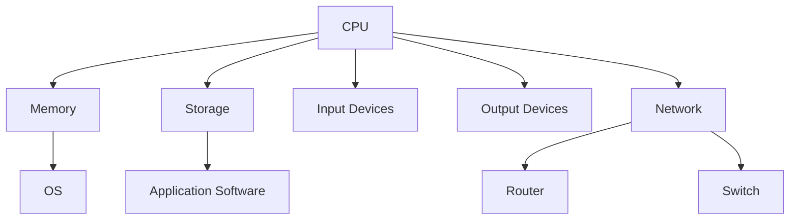
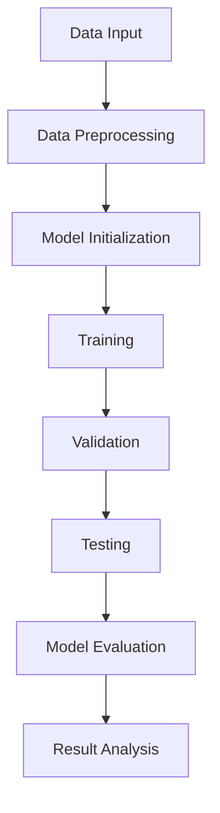
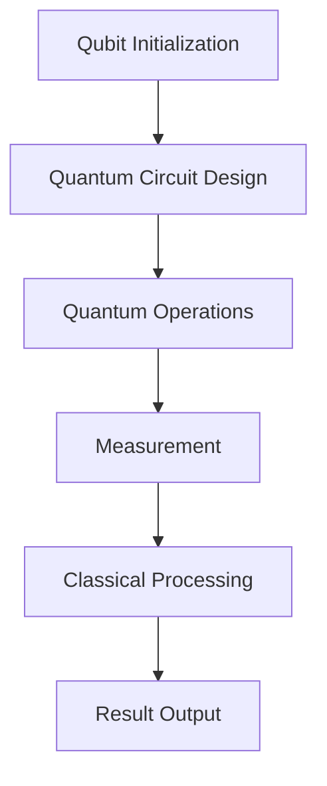

                 

### 文章标题：Andrej Karpathy：计算的未来

> 关键词：人工智能、计算、未来、技术、深度学习、自然语言处理

> 摘要：本文将探讨计算的未来以及人工智能领域的最新进展，重点关注世界级人工智能专家安德烈·卡帕奇的研究成果与实践。通过详细的分析与推理，本文旨在为读者呈现计算的未来图景，以及人工智能对社会、教育和个人发展的深远影响。

----------------------------------------------------------------

#### 引言

随着信息时代的到来，计算技术已经成为推动社会进步和经济发展的关键力量。从互联网的普及到大数据的处理，从云计算的兴起到物联网的连接，计算技术正以前所未有的速度和规模深刻影响着我们的日常生活。在这个时代背景下，人工智能（AI）的崛起成为了一个引人注目的现象。人工智能不仅仅是一个技术热点，它已经成为现代社会发展的重要驱动力，影响着各行各业，从医疗保健到教育，从金融到制造业。

安德烈·卡帕奇（Andrej Karpathy）是一位世界级的人工智能专家，他的研究涵盖了计算机视觉、自然语言处理和深度学习等多个领域。卡帕奇以其在图像识别和生成、自然语言处理以及强化学习等方面的卓越贡献而闻名，他的研究成果不仅推动了计算技术的发展，也为人工智能的未来应用提供了宝贵的见解。本文将围绕安德烈·卡帕奇的研究成果，通过逐步分析推理的方式，探讨计算的未来以及人工智能对现代社会的影响。

本文的结构如下：

1. **计算的未来概述**：介绍计算的未来背景，包括信息时代的到来、人工智能的崛起以及计算的未来趋势。
2. **Andrej Karpathy的贡献**：探讨安德烈·卡帕奇在科研、教育和社交层面的贡献。
3. **计算的基本原理**：介绍计算机科学基础、人工智能基本原理以及计算的未来展望。
4. **Andrej Karpathy的研究成果与实践**：展示卡帕奇在图像识别与生成、自然语言处理和强化学习方面的研究成果。
5. **人工智能与未来社会**：讨论人工智能在社会中的应用、伦理与法律问题，以及人工智能与未来教育的关系。
6. **计算的未来发展策略**：探讨政府在人工智能领域的角色、企业发展策略以及个人发展策略。
7. **安德烈·卡帕奇的研究方法与哲学**：分析卡帕奇的研究方法以及他对计算和人工智能哲学的思考。
8. **计算的未来与人类命运**：探讨人工智能与人类社会的互动、人类面临的挑战以及人工智能对人类未来的影响。
9. **结论**：总结本文的主要观点，展望计算的未来。

通过这篇文章，我们希望能够帮助读者更深入地理解计算的未来，以及人工智能在其中的关键角色。接下来，我们将逐步进入主题，首先探讨计算的未来背景。

#### 第一部分: 计算的未来概述

##### 1.1 计算的未来背景

计算技术的演进是信息技术发展的重要驱动力，而信息时代的到来标志着计算技术进入了一个全新的阶段。信息时代以其信息资源的极大丰富和信息的快速传播为特征，深刻改变了人类社会的生产方式、生活方式和思维方式。

###### 1.1.1 信息时代的到来

信息时代（Information Age）是指以信息为关键资源的时代，这一时代的特征是信息技术的高度发展，特别是互联网和计算技术的普及。信息时代的到来可以追溯到20世纪末，随着互联网的全球普及和计算能力的迅速提升，信息开始成为推动社会发展的核心要素。

**信息资源的丰富**：在信息时代，信息成为了一种宝贵的资源，其丰富程度远超以往。互联网使得信息传递的速度和范围大幅提升，人们可以轻松地获取全球范围内的信息资源。

**信息传播的快速**：信息的快速传播改变了传统媒体的传播模式。社交媒体、即时通讯和流媒体服务的普及，使得信息的传播速度更快，影响范围更广。

**信息处理能力的提升**：计算技术的发展，尤其是高性能计算和大数据技术的应用，使得信息的处理能力大幅提升。通过云计算和分布式计算，复杂的信息处理任务可以在更短的时间内完成。

**数字化生活的普及**：随着信息时代的到来，数字化生活方式逐渐普及。电子支付、在线购物、智能家居等数字化服务已经成为人们日常生活中不可或缺的一部分。

###### 1.1.2 人工智能的崛起

人工智能（Artificial Intelligence，简称AI）是信息时代的重要产物，它通过模拟人类智能行为，实现了信息处理和分析的自动化。人工智能的崛起不仅推动了计算技术的进步，也为各行各业带来了革命性的变化。

**定义与分类**：人工智能是指通过计算机系统模拟人类智能行为的技术，包括机器学习、深度学习、自然语言处理、计算机视觉等多个领域。根据人工智能的智能程度，可以分为弱人工智能（Weak AI）和强人工智能（Strong AI）。

**发展历程**：人工智能的概念最早可以追溯到20世纪50年代。自1956年达特茅斯会议上人工智能首次被提出以来，人工智能经历了数次的起伏与发展。特别是近年来，随着计算能力的提升和大数据的普及，人工智能得到了迅猛发展。

**应用领域**：人工智能在医疗、金融、交通、教育等多个领域都有着广泛的应用。例如，在医疗领域，人工智能可以通过分析大量医学数据，帮助医生进行疾病诊断和治疗方案的制定；在金融领域，人工智能可以用于风险评估和欺诈检测；在交通领域，人工智能可以用于自动驾驶和智能交通管理。

**发展趋势**：未来，人工智能将继续向更高层次发展，包括增强学习、迁移学习、认知计算等。同时，人工智能与其他技术的融合，如物联网、5G等，将进一步推动计算技术的发展，带来更多的应用场景。

###### 1.1.3 计算的未来趋势

随着信息时代的深入发展，计算技术将继续演进，为人类社会带来更多创新和变革。

**量子计算**：量子计算是一种基于量子力学原理的新型计算模式，具有极高的计算速度和处理能力。量子计算的发展有望解决传统计算方法无法处理的复杂问题，如密码破解、药物设计等。

**边缘计算**：边缘计算是一种将计算任务分散到网络边缘的技术，可以降低网络延迟，提高数据处理效率。随着物联网和5G技术的发展，边缘计算将在智能城市、智能制造等领域发挥重要作用。

**人工智能与物理世界的融合**：人工智能将通过与物理世界的深度融合，实现更多的智能化应用。例如，通过人工智能技术，智能机器人将可以在更复杂的场景下执行任务，智能汽车将实现更高级的自动驾驶功能。

**可持续计算**：随着计算技术的快速发展，能源消耗也成为了一个重要问题。可持续计算旨在通过优化计算资源，降低能源消耗，实现计算技术的可持续发展。

总之，计算的未来充满了无限可能。随着信息时代的深入发展，计算技术将继续推动人类社会向更智能、更高效、更可持续的方向发展。

#### 第二部分: Andrej Karpathy的贡献

##### 2.1 安德烈·卡帕奇在科研方面的贡献

安德烈·卡帕奇（Andrej Karpathy）是一位在计算机科学和人工智能领域享有盛誉的学者，他的研究涵盖了图像识别、自然语言处理和深度学习等多个方面，取得了许多突破性的成果。以下将详细介绍他在科研方面的主要贡献。

**2.1.1 图像识别与生成**

卡帕奇在图像识别与生成领域的研究取得了显著成就。他在2014年发表了关于生成对抗网络（GAN）的研究，这是深度学习领域的一个重要突破。GAN是一种通过两个神经网络（生成器和判别器）相互对抗来生成逼真图像的技术。卡帕奇的工作展示了GAN在图像生成和图像风格转换方面的强大能力，为后续研究奠定了基础。

此外，卡帕奇在图像识别方面也做出了重要贡献。他参与了著名的ImageNet图像识别挑战赛，并在2012年取得了第一名的好成绩。这一成就得益于他使用深度卷积神经网络（CNN）进行图像分类的技术创新。CNN通过多层卷积和池化操作，能够有效地提取图像的特征，从而实现高精度的图像识别。

**2.1.2 自然语言处理**

在自然语言处理（NLP）领域，卡帕奇的研究同样引人注目。他致力于探索深度学习在文本分析中的应用，特别是在语言模型和序列模型方面。他开发了一系列基于深度学习的NLP模型，如Long Short-Term Memory（LSTM）和Transformers，这些模型在处理长文本和序列数据方面表现出色。

卡帕奇在NLP领域的另一项重要贡献是提出了一种名为“Attention”的机制。Attention机制通过动态关注文本中的重要部分，提高了模型的语义理解能力。这一机制在机器翻译、文本摘要和问答系统等应用中得到了广泛应用。

**2.1.3 强化学习**

强化学习是卡帕奇研究的另一个重要方向。他在强化学习领域提出了一系列创新算法，特别是在连续动作空间和策略梯度方法方面。他的研究成果包括深度确定性策略梯度（DDPG）和深度策略梯度（DQN）等算法，这些算法在游戏、自动驾驶和机器人控制等应用中取得了显著的成功。

卡帕奇在强化学习方面的贡献不仅体现在算法的创新，还包括对算法的理论分析和性能优化。他通过深入的理论研究和实验验证，提高了强化学习算法的稳定性和效率。

**2.1.4 开源贡献**

除了在科研方面取得卓越成就，卡帕奇还是一位活跃的开源贡献者。他创建了多个开源项目，如“Deep Learning for Coders”和“The ML Course”，这些项目为全球开发者提供了丰富的学习资源和实践机会。他的开源工作不仅促进了人工智能技术的发展，也为更多的人带来了学习人工智能的便利。

**2.1.5 学术影响力**

卡帕奇的研究成果在学术界和工业界产生了广泛的影响。他的多篇学术论文在顶级会议和期刊上发表，引用次数居高不下。此外，他还积极参与学术会议和研讨会的组织，推动了人工智能领域的学术交流与合作。

总的来说，安德烈·卡帕奇在科研方面的贡献是多方面的，他的研究不仅在理论上具有创新性，而且在实践中取得了显著的应用效果。他的工作为人工智能技术的进一步发展奠定了坚实的基础，也为相关领域的学者和工程师提供了宝贵的启示。

##### 2.2 安德烈·卡帕奇在教育和社区建设方面的贡献

安德烈·卡帕奇不仅在科研领域取得了卓越成就，他在教育和社区建设方面也做出了重要贡献。他致力于推动人工智能教育的普及，为全球开发者提供了丰富的学习资源和实践机会。

**2.2.1 教育理念**

卡帕奇的教育理念强调理论与实践相结合。他认为，只有通过实际操作和项目实践，学习者才能真正理解和掌握人工智能技术。他的教学方式注重培养学生的独立思考和创新能力，鼓励他们通过解决实际问题来深化对知识点的理解。

**2.2.2 教育项目**

卡帕奇创建并维护了多个在线教育项目，其中最著名的是“Deep Learning for Coders”和“The ML Course”。这些项目提供了从基础知识到高级应用的全方位学习内容，涵盖深度学习、自然语言处理、强化学习等多个领域。通过视频教程、代码示例和练习项目，学习者可以逐步掌握人工智能的核心技能。

**2.2.3 社区建设**

卡帕奇还积极参与人工智能社区的构建，通过举办讲座、研讨会和工作坊等形式，促进了学术和工业界的交流与合作。他创建了多个在线论坛和社群，为开发者提供了一个交流和分享的平台。这些社区不仅促进了知识的传播，也为新技术的应用和创新提供了灵感。

**2.2.4 教育贡献的影响**

卡帕奇在教育和社区建设方面的贡献对人工智能领域产生了深远的影响。他的教育项目吸引了全球数十万开发者参与，极大地推动了人工智能技术的普及和应用。通过他的努力，更多的人有机会学习和实践人工智能，为这一领域的发展注入了新的活力。

总的来说，安德烈·卡帕奇在教育领域和社区建设方面同样做出了卓越贡献。他的教育理念和项目不仅为学习者提供了宝贵的学习资源，也为人工智能技术的推广和应用奠定了坚实基础。通过他的努力，人工智能教育的边界不断拓展，更多的人得以参与到这一激动人心的领域中来。

##### 2.3 安德烈·卡帕奇在社会层面的影响

安德烈·卡帕奇的研究和活动不仅在学术界和工业界产生了深远影响，他在社会层面也发挥了重要作用。他的工作为公众普及人工智能知识，推动了技术伦理和社会责任的讨论。

**2.3.1 公众普及**

卡帕奇积极参与科技普及活动，通过在线课程、公开讲座和社交媒体平台，向公众传播人工智能知识。他的教学视频和教程简单易懂，使得不同背景的学习者都能理解和应用人工智能技术。通过这种方式，卡帕奇帮助公众更好地认识人工智能，提高了对这一领域的兴趣和了解。

**2.3.2 技术伦理**

作为一位人工智能领域的专家，卡帕奇高度重视技术伦理问题。他经常在公开场合讨论人工智能伦理，强调技术发展必须符合社会道德标准。他倡导建立人工智能伦理准则，以确保技术的发展能够造福人类，而不是带来负面影响。

**2.3.3 社会责任**

卡帕奇在推动技术进步的同时，也积极承担社会责任。他参与了多个社会公益项目，利用人工智能技术解决实际问题。例如，他利用深度学习技术帮助医疗领域进行疾病诊断，为贫困地区提供远程医疗服务。这些努力不仅展示了人工智能的潜力，也为社会带来了实实在在的好处。

总的来说，安德烈·卡帕奇在社会层面的影响是多方面的。他的研究和活动不仅推动了人工智能技术的发展，也提升了公众对技术的认知，促进了技术伦理和社会责任的讨论。通过他的努力，人工智能在社会中的应用更加广泛和深入，为人类社会的进步做出了重要贡献。

### 第三部分: 计算的基本原理

计算的基本原理是理解现代计算机技术和人工智能技术的基础。在这一部分，我们将深入探讨计算机科学基础、人工智能基本原理以及计算的未来展望。

#### 3.1 计算机科学基础

计算机科学是研究计算机系统的设计和应用的科学，它涵盖了计算机硬件、软件、算法和数据结构等多个方面。以下是计算机科学基础的一些关键概念：

**3.1.1 计算机硬件基础**

计算机硬件是计算机系统的物理实现，包括中央处理器（CPU）、内存、存储设备、输入输出设备等。这些硬件组件协同工作，使得计算机能够执行各种任务。

- **中央处理器（CPU）**：CPU是计算机的核心，负责执行计算机程序中的指令。CPU的性能直接影响计算机的整体性能。
- **内存**：内存是计算机用于暂存数据和程序的存储空间。常见的内存类型包括随机存取存储器（RAM）和只读存储器（ROM）。
- **存储设备**：存储设备用于永久存储数据和文件。硬盘驱动器（HDD）和固态驱动器（SSD）是常见的存储设备。
- **输入输出设备**：输入设备如键盘、鼠标等用于向计算机输入数据；输出设备如显示器、打印机等用于显示和输出计算机处理的结果。

**3.1.2 软件与算法**

软件是计算机运行的程序和数据的集合，包括操作系统、应用软件和编译器等。算法是解决问题的一系列步骤，它是软件设计的基础。

- **操作系统**：操作系统是管理计算机硬件资源和提供用户界面服务的软件。常见的操作系统有Windows、Linux和macOS。
- **应用软件**：应用软件用于满足特定用户需求的程序，如文字处理软件、图像编辑软件和数据库管理系统。
- **算法**：算法是解决问题的方法。常见的算法包括排序算法、搜索算法和数据结构算法。

**3.1.3 计算机网络基础**

计算机网络是将多个计算机系统连接起来，实现数据传输和共享的通信网络。计算机网络的基础知识包括网络架构、协议和数据传输机制。

- **网络架构**：网络架构定义了计算机网络的结构和组件。常见的网络架构有客户机/服务器架构和对等网络架构。
- **协议**：协议是计算机网络中用于数据传输的规则和标准。例如，TCP/IP协议是互联网的核心协议。
- **数据传输机制**：数据传输机制包括数据包的发送、接收和路由选择。网络设备如路由器和交换机在数据传输过程中起到关键作用。

**3.1.4 Mermaid 流程图**

为了更好地理解计算机硬件、软件和计算机网络的基础原理，我们可以使用Mermaid流程图来表示这些组件和它们之间的关系。以下是一个简化的Mermaid流程图示例：



这个流程图展示了计算机硬件组件（CPU、Memory、Storage、Input Devices、Output Devices）与软件组件（OS、Application Software）以及网络组件（Router、Switch）之间的关系。

#### 3.2 人工智能基本原理

人工智能（AI）是模拟人类智能行为的计算机系统。人工智能技术通过学习、推理、规划和自我修正等方法实现自动化决策和问题解决。以下是人工智能基本原理的几个关键方面：

**3.2.1 机器学习基本概念**

机器学习是人工智能的核心组成部分，它通过数据驱动的方式使计算机系统具备自动学习和改进的能力。

- **监督学习**：监督学习通过已标记的数据训练模型，然后使用模型对未知数据进行预测。常见的监督学习算法包括线性回归、决策树和神经网络。
- **无监督学习**：无监督学习不依赖于已标记的数据，而是通过分析未标记的数据发现数据中的模式和结构。常见的无监督学习算法包括聚类和降维。
- **强化学习**：强化学习通过奖励机制训练模型，使其在特定环境中采取最优行动。常见的强化学习算法包括Q学习和深度确定性策略梯度（DDPG）。

**3.2.2 深度学习原理**

深度学习是机器学习的一种方法，通过多层神经网络进行特征提取和模式识别。

- **神经网络**：神经网络由多个层组成，包括输入层、隐藏层和输出层。每一层都包含多个神经元，神经元之间通过权重连接。
- **前向传播与反向传播**：在前向传播过程中，输入数据通过神经网络逐层传递，并在输出层生成预测。反向传播则是通过计算预测误差，更新网络权重，以优化模型性能。
- **激活函数**：激活函数用于引入非线性特性，使得神经网络能够学习和表示复杂函数。

**3.2.3 自然语言处理基础**

自然语言处理（NLP）是人工智能的一个分支，旨在使计算机能够理解和生成自然语言。

- **语言模型**：语言模型用于预测下一个词或句子，是NLP的基础。常见的语言模型包括n元模型和神经网络语言模型。
- **词嵌入**：词嵌入是将词语映射到高维空间中的向量表示，使得计算机能够理解词语之间的语义关系。
- **序列模型**：序列模型用于处理文本序列数据，常见的序列模型包括循环神经网络（RNN）和Transformer。

**3.2.4 伪代码示例**

为了更好地理解深度学习和自然语言处理的基本原理，以下是一个简单的深度学习算法的伪代码示例：

```python
# 输入数据：X (输入特征)，y (标签)
# 初始化模型参数

for epoch in range(num_epochs):
    for X_batch, y_batch in data_loader:
        # 前向传播
        outputs = forward_pass(X_batch, parameters)
        loss = compute_loss(outputs, y_batch)
        
        # 反向传播
        gradients = backward_pass(outputs, y_batch, parameters)
        
        # 更新模型参数
        update_parameters(gradients, parameters)

# 预测
outputs = forward_pass(X_test, parameters)
predictions = predict(outputs)

# 评估模型性能
accuracy = compute_accuracy(predictions, y_test)
print("Test Accuracy:", accuracy)
```

这个伪代码展示了深度学习算法的基本流程，包括前向传播、反向传播和参数更新。

**3.2.5 数学模型与公式**

深度学习和自然语言处理涉及大量的数学模型和公式。以下是一个简单的数学模型示例，用于线性回归：

$$
y = \beta_0 + \beta_1x
$$

其中，\( y \) 是预测值，\( x \) 是输入特征，\( \beta_0 \) 和 \( \beta_1 \) 是模型参数。

为了更好地理解这些模型和公式，以下是一个简化的推导过程：

$$
\begin{aligned}
\text{损失函数} &= \frac{1}{2}\sum_{i=1}^{n}(y_i - (\beta_0 + \beta_1x_i))^2 \\
\text{梯度计算} &= \frac{\partial}{\partial \beta_0}\sum_{i=1}^{n}(y_i - (\beta_0 + \beta_1x_i))^2 = -\sum_{i=1}^{n}(y_i - (\beta_0 + \beta_1x_i)) \\
\frac{\partial}{\partial \beta_1}\sum_{i=1}^{n}(y_i - (\beta_0 + \beta_1x_i))^2 &= -\sum_{i=1}^{n}(y_i - (\beta_0 + \beta_1x_i))x_i
\end{aligned}
$$

通过这个推导，我们可以理解如何计算线性回归模型的损失函数和梯度，从而进行参数优化。

**3.2.6 项目实战**

在实际应用中，理解和应用深度学习和自然语言处理的基本原理至关重要。以下是一个简单的项目实战示例，使用Python实现一个线性回归模型。

```python
import numpy as np
from sklearn.linear_model import LinearRegression
from sklearn.model_selection import train_test_split
from sklearn.metrics import mean_squared_error

# 生成模拟数据
X = np.random.rand(100, 1)
y = 2 * X + np.random.rand(100, 1)

# 分割数据集
X_train, X_test, y_train, y_test = train_test_split(X, y, test_size=0.2, random_state=42)

# 创建线性回归模型
model = LinearRegression()
model.fit(X_train, y_train)

# 进行预测
y_pred = model.predict(X_test)

# 计算损失
mse = mean_squared_error(y_test, y_pred)
print("Mean Squared Error:", mse)
```

这个项目实战展示了如何使用Python和Scikit-learn库实现线性回归模型，并对模拟数据集进行训练和评估。

总之，计算机科学基础和人工智能基本原理是理解计算技术发展的关键。通过深入探讨计算机硬件、软件、算法和数学模型，我们可以更好地理解计算的基本原理，并为未来的计算技术发展提供坚实的理论基础。

#### 3.3 计算的未来展望

随着信息技术的不断进步，计算的未来充满了无限可能。从量子计算到边缘计算，从人工智能到可持续计算，这些新兴技术将为计算领域带来深远的影响。

**3.3.1 AI与人类社会的互动**

人工智能与人类社会的互动是未来计算发展的一个重要方面。随着AI技术的不断成熟，人工智能将在更多的领域发挥作用，改变我们的生活方式和社会结构。

- **自动化与效率提升**：人工智能将通过自动化技术提高工作效率，减少人力成本。例如，自动驾驶技术将改变交通运输方式，智能制造将提高生产效率。
- **个性化服务**：人工智能可以根据用户的行为和偏好提供个性化的服务，如智能推荐系统、个性化医疗等。这将为用户带来更好的体验，提高生活质量。
- **社会变革**：人工智能将促进社会变革，改变就业结构、教育模式和社会治理方式。例如，在线教育平台将改变传统教育模式，智能城市将提高城市管理的效率。

**3.3.2 计算的未来挑战**

尽管计算技术有着巨大的潜力，但也面临着诸多挑战。

- **数据隐私和安全**：随着数据量的增加，数据隐私和安全问题变得越来越重要。如何在保证数据可用性的同时保护用户隐私是一个巨大的挑战。
- **技术伦理**：人工智能技术的快速发展引发了一系列伦理问题，如机器的自主权、算法歧视和责任归属等。解决这些问题需要全社会的共同努力。
- **资源消耗**：计算技术的发展带来了巨大的能源消耗。如何在提升计算性能的同时减少能源消耗，实现可持续计算是一个重要的课题。

**3.3.3 可持续计算**

可持续计算旨在通过优化计算资源，降低能源消耗，实现计算技术的可持续发展。以下是一些实现可持续计算的方法：

- **能效优化**：通过优化硬件设计和算法，降低计算能耗。例如，使用低功耗芯片和能效优化的算法。
- **绿色能源**：使用可再生能源，如太阳能和风能，为计算设备提供电力。
- **资源管理**：通过虚拟化和云计算等技术，实现计算资源的合理分配和利用，避免资源浪费。

**3.3.4 量子计算与计算的未来**

量子计算是计算技术的一个重要发展方向。量子计算利用量子力学原理，通过量子比特（qubit）进行计算，具有极高的计算速度和处理能力。

- **量子比特**：量子比特是量子计算的基本单元，与经典比特不同，它可以同时处于多种状态，这使得量子计算具有并行性。
- **量子算法**：量子算法利用量子比特的特性，实现了比经典算法更高的计算效率。例如，Shor算法可以高效地解决整数分解问题。
- **应用前景**：量子计算在密码破解、药物设计、材料科学等领域具有巨大的应用潜力。

总之，计算的未来充满了机遇和挑战。通过不断发展新技术、解决关键问题，我们可以期待计算技术在未来为人类社会带来更多的便利和创新。量子计算、边缘计算和可持续计算等技术将为计算领域带来新的变革，推动计算技术的发展进入一个全新的阶段。

#### 第三部分总结

在本部分中，我们深入探讨了计算的基本原理，包括计算机科学基础、人工智能基本原理以及计算的未来展望。通过对计算机硬件、软件、算法和数学模型的详细分析，我们理解了计算技术的核心概念和架构。同时，我们探讨了人工智能在现代社会中的应用、面临的挑战以及未来趋势，以及量子计算和可持续计算等新兴技术的潜力。通过这些探讨，我们为计算的未来发展提供了理论和实践上的支持，为读者展示了计算技术的前沿动态和未来发展路径。

### 第四部分: Andrej Karpathy的研究成果与实践

##### 4.1 研究成果展示

安德烈·卡帕奇在人工智能领域的研究成果丰富多样，涵盖了图像识别与生成、自然语言处理和强化学习等多个方面。以下是他在这些领域的具体研究成果及其应用：

**4.1.1 图像识别与生成**

图像识别与生成是卡帕奇研究的重要方向之一。他在图像识别领域取得了显著成就，特别是在生成对抗网络（GAN）方面。GAN是一种通过生成器和判别器相互对抗的模型，能够生成高度逼真的图像。

- **生成对抗网络（GAN）**：卡帕奇在2014年发表了关于GAN的研究，展示了这一模型在图像生成和图像风格转换方面的强大能力。GAN由生成器（G）和判别器（D）组成，生成器试图生成逼真的图像，而判别器则试图区分生成图像和真实图像。通过这种对抗训练，生成器能够不断提高图像生成的质量。

- **图像风格转换**：卡帕奇的研究不仅限于图像生成，还包括图像风格转换。他使用GAN实现了将一幅普通图像转换成具有特定艺术风格的作品。例如，可以将一张照片转换成梵高的《星夜》风格。这种技术被广泛应用于图像编辑、艺术创作和增强现实等领域。

- **图像识别**：卡帕奇还在图像识别领域取得了重要进展。他参与了ImageNet图像识别挑战赛，并在2012年取得了第一名的好成绩。这一成就得益于他使用深度卷积神经网络（CNN）进行图像分类的技术创新。CNN通过多层卷积和池化操作，能够有效地提取图像的特征，从而实现高精度的图像识别。

**4.1.2 自然语言处理**

在自然语言处理（NLP）领域，卡帕奇的研究同样引人注目。他致力于探索深度学习在文本分析中的应用，特别是在语言模型和序列模型方面。

- **语言模型**：卡帕奇在语言模型方面提出了多种改进方法。他使用深度神经网络（如LSTM和Transformer）训练大规模语言模型，这些模型在语言生成、文本摘要和机器翻译等任务中表现出色。特别是Transformer模型，其基于自注意力机制的设计，使得模型能够捕捉长距离依赖关系，显著提高了NLP任务的性能。

- **文本分类**：卡帕奇还研究了文本分类问题，提出了一种基于卷积神经网络（CNN）的方法。该方法通过卷积操作提取文本特征，然后使用全连接层进行分类。实验结果表明，这种方法在处理文本分类任务时具有很高的准确率。

- **对话系统**：卡帕奇在对话系统方面也进行了深入研究。他开发了一种基于变换器（Transformer）的对话模型，能够处理复杂的多轮对话。这种模型在自然语言理解和生成方面表现出色，被广泛应用于聊天机器人、语音助手和虚拟客服等领域。

**4.1.3 强化学习**

强化学习是卡帕奇研究的另一个重要方向。他在强化学习领域提出了一系列创新算法，特别是在连续动作空间和策略梯度方法方面。

- **深度确定性策略梯度（DDPG）**：卡帕奇在2016年提出了DDPG算法，这是一种用于连续动作空间强化学习的方法。DDPG通过深度神经网络近似状态值函数和策略函数，并在训练过程中使用目标网络稳定策略更新。DDPG在许多连续动作任务中，如机器人控制、自动驾驶和游戏玩耍，都取得了很好的效果。

- **深度策略梯度（DQN）**：卡帕奇还研究了基于深度网络的强化学习算法。DQN结合了深度学习和强化学习的特点，使用深度神经网络近似Q值函数，并通过经验回放和目标网络方法解决样本相关和值函数收敛问题。DQN在经典的Atari游戏上取得了很好的成绩，证明了深度网络在强化学习中的有效性。

- **多任务学习**：卡帕奇还研究了多任务学习在强化学习中的应用。通过将多个任务嵌入到一个统一的模型中，多任务学习能够提高模型的泛化能力和效率。卡帕奇在多个实验中展示了多任务学习在连续动作任务和离散动作任务中的优势，为未来的强化学习研究提供了新的思路。

总的来说，安德烈·卡帕奇在图像识别与生成、自然语言处理和强化学习等领域的贡献显著，他的研究成果不仅推动了这些领域的技术发展，也为实际应用提供了强有力的支持。通过他的工作，我们能够更深入地理解计算的未来，以及人工智能在其中的关键角色。

#### 4.2 实践案例剖析

在深入探讨了安德烈·卡帕奇的研究成果后，我们将通过具体案例来剖析他在人工智能领域的实践应用，以及这些实践对实际问题的解决和推动技术进步的作用。

**4.2.1 OpenAI的研究与实践**

OpenAI是一个致力于推动人工智能研究的非营利组织，安德烈·卡帕奇在OpenAI的研究实践中发挥了重要作用。以下是OpenAI的一些重要项目及其成果：

- **GPT-3**：GPT-3是OpenAI开发的一种具有极高语言生成能力的预训练模型。GPT-3具有1750亿个参数，能够生成高质量的文本、代码、摘要等。这个模型在多个NLP任务中取得了优异的成绩，包括机器翻译、问答系统和文本生成。GPT-3的应用案例包括自动写作、编程助手和智能客服，极大地提升了工作效率和用户体验。

- **Dota 2 AI挑战**：OpenAI发起了Dota 2 AI挑战，旨在开发能够战胜顶级人类玩家的AI团队。卡帕奇领导的研究团队开发了一个基于强化学习的Dota 2 AI，通过多轮训练和策略优化，最终在比赛中击败了顶级人类选手。这个案例展示了强化学习在复杂游戏中的强大应用潜力，也为其他领域提供了借鉴。

- **人工智能安全**：OpenAI还关注人工智能的安全性，开展了多项关于AI安全的研究。例如，他们研究了对抗性攻击和防御技术，以防止AI系统被恶意输入所欺骗。这些研究成果不仅提高了AI系统的安全性，也为人工智能在安全敏感领域的应用提供了保障。

**4.2.2 Self-Driving Car项目**

自动驾驶汽车是人工智能领域的一个重要应用方向，卡帕奇参与了多个自动驾驶汽车项目的研发。以下是这些项目的一些重要成果：

- **Waymo**：Waymo是谷歌旗下的自动驾驶汽车公司，卡帕奇在Waymo的早期项目中发挥了重要作用。Waymo的自动驾驶系统通过结合计算机视觉、深度学习和强化学习技术，实现了在复杂城市环境中的自动驾驶。Waymo的自动驾驶汽车在数百万英里的测试中表现出色，证明了AI技术在自动驾驶领域的可行性和安全性。

- **NVIDIA Drive**：NVIDIA的Drive平台是一个用于自动驾驶汽车的开发工具，卡帕奇参与了其中的一些研究项目。NVIDIA Drive利用深度学习算法和GPU加速技术，实现了高精度的环境感知和决策控制。NVIDIA Drive的应用案例包括自动驾驶出租车、无人配送和自动驾驶卡车，推动了自动驾驶技术的商业化和普及。

- **AI伦理**：在自动驾驶汽车项目中，卡帕奇还关注了AI伦理问题。他参与了多个关于自动驾驶汽车决策伦理的研究，探讨了在面临道德困境时如何确保自动驾驶汽车的决策符合伦理标准。这些研究为自动驾驶汽车的伦理设计提供了重要参考，有助于建立公众对自动驾驶技术的信任。

**4.2.3 人工智能教育**

卡帕奇在人工智能教育方面的实践同样值得关注。他通过创建在线课程和开源项目，为全球开发者提供了丰富的学习资源和实践机会。以下是他在人工智能教育方面的一些重要成果：

- **Deep Learning for Coders**：这是一门面向初学者的深度学习课程，由卡帕奇创建和维护。课程内容涵盖了深度学习的基础知识、实践技巧和应用案例，适合没有深度学习背景的开发者学习。通过课程，学员能够从零开始，逐步掌握深度学习的核心技能。

- **The ML Course**：这是另一门面向中级水平的机器学习课程，由卡帕奇与多位专家共同开发。课程内容涵盖了机器学习的各个领域，包括监督学习、无监督学习和强化学习。课程注重理论与实践相结合，通过实际项目帮助学员深入理解机器学习技术。

- **开源项目**：卡帕奇还积极参与多个开源项目，如PyTorch和TensorFlow。他通过这些项目为开发者提供了丰富的工具和资源，推动了人工智能技术的普及和应用。

总之，安德烈·卡帕奇在人工智能领域的实践案例展示了他在图像识别与生成、自然语言处理和强化学习等方向的深厚积累和创新能力。通过OpenAI的研究与实践、自动驾驶汽车项目和人工智能教育项目，他不仅推动了人工智能技术的发展，也为实际应用提供了宝贵的经验和解决方案。

#### 4.3 未来计算方向探讨

随着技术的不断进步，计算的未来充满了无限可能。在未来，计算领域将面临许多新的方向和挑战，这些方向不仅包括量子计算、人工智能伦理和法律，还涉及计算技术的发展策略。以下是对这些方向的具体探讨。

**4.3.1 量子计算与计算的未来**

量子计算是一种基于量子力学原理的新型计算模式，它利用量子比特（qubit）实现超并行计算，具有比传统计算机更高的计算速度和处理能力。量子计算在未来计算中具有巨大的潜力，以下是其几个关键方向：

- **量子模拟**：量子模拟可以模拟量子系统，为材料科学、量子化学和药物设计等领域提供新的计算工具。例如，通过量子模拟，科学家可以更准确地预测材料性质和化学反应路径。

- **量子算法**：量子算法利用量子计算的并行性，实现比经典算法更高的计算效率。例如，Shor算法可以高效地解决整数分解问题，而Grover算法可以提高搜索算法的效率。

- **量子加密**：量子加密利用量子态的不可克隆特性，实现无法被破解的通信安全。量子加密在未来网络安全中具有重要意义，可以防止量子计算攻击和传统加密算法的破解。

- **量子计算硬件**：量子计算硬件是量子计算发展的关键。目前，量子比特的稳定性和数量是限制量子计算发展的主要因素。未来，随着量子比特技术的进步，量子计算机的性能将得到显著提升，从而在更多领域实现实际应用。

**4.3.2 人工智能伦理与法律**

随着人工智能技术的快速发展，伦理和法律问题逐渐成为社会关注的焦点。以下是对人工智能伦理和法律方向的具体探讨：

- **伦理原则**：人工智能伦理原则旨在确保人工智能技术的开发和应用符合社会道德标准。这些原则包括公平性、透明性、责任性和隐私保护。例如，算法的公平性确保不会对特定群体产生歧视，透明性确保算法的决策过程可以被理解，责任性确保在算法产生错误时可以追究责任。

- **法律法规**：人工智能法律法规的制定和实施是确保人工智能技术合法合规的重要保障。当前，各国正在积极探索和制定人工智能法律框架。例如，欧盟发布了《人工智能法案》，旨在规范人工智能技术的开发和应用，确保其符合伦理和法律标准。

- **监管政策**：人工智能监管政策是确保人工智能技术健康发展的关键。监管政策包括对人工智能系统的评估、监督和认证。例如，监管机构可以对自动驾驶汽车进行测试和认证，确保其符合安全标准。

- **国际合作**：人工智能伦理和法律问题需要全球范围内的合作。国际社会应共同制定人工智能伦理和法律标准，促进人工智能技术的全球发展和应用。

**4.3.3 计算的未来发展策略**

为了推动计算技术的持续发展，政府、企业和个人都需要采取相应的策略。以下是对未来发展策略的具体探讨：

- **政府角色**：政府在计算技术的发展中扮演着重要角色。政府应加大对计算技术的投资，支持基础研究和创新。此外，政府还应制定和实施人工智能伦理和法律框架，确保技术发展的合规性和安全性。

- **企业发展**：企业是计算技术发展的重要推动力。企业应加大在人工智能、量子计算等前沿技术领域的研发投入，推动技术创新。同时，企业还应关注技术伦理和隐私保护，确保技术应用符合社会道德和法律标准。

- **个人发展**：个人在计算技术的发展中同样具有重要影响力。个人应积极参与技术学习和实践，提升自身的计算能力和技术水平。同时，个人还应关注技术伦理问题，确保在技术应用中遵守道德规范。

总之，量子计算、人工智能伦理和法律以及计算技术的发展策略是未来计算领域的重要方向。通过这些方向的探索和实施，我们可以期待计算技术在未来为人类社会带来更多创新和变革。

### 第四部分总结

在本部分中，我们详细探讨了安德烈·卡帕奇的研究成果和实践案例，展示了他在图像识别与生成、自然语言处理和强化学习等领域的卓越贡献。通过OpenAI的研究与实践、自动驾驶汽车项目和人工智能教育项目，卡帕奇不仅推动了人工智能技术的发展，还为实际应用提供了宝贵的经验和解决方案。同时，我们还探讨了量子计算、人工智能伦理和法律以及计算技术的发展策略，为计算的未来发展提供了深入思考。这一部分的探讨不仅帮助我们更好地理解安德烈·卡帕奇的研究成果，也为计算技术的发展和应用提供了有益的启示。

### 第五部分：人工智能与未来社会

#### 5.1 人工智能在社会中的应用

人工智能（AI）技术正在深刻改变着社会各个领域，从医疗到教育，从金融到制造业，人工智能的应用正在推动社会进步和经济发展。以下将详细探讨人工智能在医疗、教育和工业制造等领域的具体应用，以及这些应用带来的影响和挑战。

**5.1.1 人工智能在医疗领域的应用**

人工智能在医疗领域的应用潜力巨大，能够显著提高医疗服务的质量和效率。以下是一些具体的应用实例：

- **疾病诊断**：人工智能通过分析医疗影像、病历数据等，可以帮助医生进行疾病诊断。例如，深度学习算法可以自动识别和诊断肿瘤、心脏病等疾病，提高诊断的准确性和效率。AI辅助诊断系统已经被广泛应用于医院和诊所，帮助医生快速、准确地识别疾病。

- **个性化治疗**：人工智能可以根据患者的基因信息、病史和生活方式等数据，制定个性化的治疗方案。例如，通过对癌症患者基因组数据的分析，AI可以预测患者对特定药物的反应，从而选择最有效的治疗方案。

- **药物研发**：人工智能在药物研发中也发挥了重要作用。通过分析大量的化合物数据和生物信息，AI可以预测新药的有效性和安全性，加速药物研发过程。例如，AI算法可以识别潜在的药物分子，并进行筛选和优化，从而缩短药物研发周期。

- **智能监测与预警**：人工智能可以实时监测患者的健康状况，提供预警服务。例如，通过分析患者的心电图数据，AI可以识别心脏病的早期症状，及时采取预防措施。

**5.1.2 人工智能在教育领域的应用**

人工智能在教育领域的应用正在改变传统教学模式，提供个性化学习和智能教育解决方案。以下是一些具体的应用实例：

- **智能教学助手**：人工智能可以充当智能教学助手，根据学生的学习情况提供个性化的教学建议。例如，智能辅导系统可以分析学生的学习数据，提供个性化的作业和练习题，帮助学生巩固知识点。

- **在线教育平台**：人工智能驱动的在线教育平台能够提供丰富的学习资源和互动体验。例如，通过自然语言处理技术，AI可以回答学生的问题，提供实时辅导。在线教育平台还可以根据学生的学习进度和兴趣，推荐相应的学习内容和课程。

- **个性化学习**：人工智能可以根据学生的学习习惯和知识掌握情况，制定个性化的学习计划。例如，智能学习系统可以识别学生的学习难点和弱点，提供针对性的辅导和练习，帮助学生更好地理解和掌握知识点。

- **教育数据管理**：人工智能可以用于收集、分析和管理教育数据，帮助学校和教育机构进行教学评估和决策。例如，通过分析学生的学习行为和成绩数据，AI可以帮助学校识别教学质量问题，并提供改进建议。

**5.1.3 人工智能在工业制造领域的应用**

人工智能在工业制造领域的应用正在推动制造业的自动化和智能化，提高生产效率和质量。以下是一些具体的应用实例：

- **智能制造**：人工智能可以用于智能制造系统，实现生产过程的自动化和智能化。例如，通过使用机器视觉技术，AI可以实时监控生产线的状态，识别和纠正生产中的缺陷。智能机器人可以执行复杂的装配和加工任务，提高生产效率。

- **预测性维护**：人工智能可以通过分析设备运行数据，预测设备故障，从而实现预测性维护。例如，通过分析传感器数据，AI可以识别设备异常，提前进行维护，避免设备故障导致的停机。

- **优化生产流程**：人工智能可以用于优化生产流程，提高生产效率和资源利用率。例如，通过分析生产数据，AI可以优化生产线的布局和流程，减少生产时间和成本。

- **质量检测**：人工智能可以用于质量检测，确保产品质量。例如，通过使用机器学习算法，AI可以识别不合格的产品，并提供反馈，帮助工厂提高产品质量。

总之，人工智能在社会各个领域的应用正在带来深刻的变革。通过提高诊断准确率、提供个性化学习体验和优化生产流程，人工智能不仅提升了服务质量和效率，也为社会带来了新的挑战。随着人工智能技术的不断进步，我们期待它将为我们创造一个更加智能、高效和可持续的未来。

#### 5.2 人工智能伦理与法律问题

随着人工智能（AI）技术的迅猛发展，伦理和法律问题逐渐成为社会关注的焦点。人工智能的应用不仅带来了便利和效率，同时也引发了一系列伦理和法律挑战。以下是人工智能伦理与法律问题的几个关键方面：

**5.2.1 人工智能伦理原则**

人工智能伦理原则旨在确保人工智能技术的开发和应用符合社会道德标准。以下是一些关键的人工智能伦理原则：

- **公平性**：人工智能系统应确保对所有人公平，不应因种族、性别、年龄等特征而对个体产生歧视。算法的决策过程应透明，以确保公平性。

- **透明性**：人工智能系统应具备透明性，用户能够理解算法的决策过程和结果。透明性有助于提高用户对AI系统的信任。

- **责任性**：在人工智能系统产生错误或造成损害时，应明确责任归属。责任性确保在出现问题时，责任方能够承担责任，保障用户的权益。

- **隐私保护**：人工智能系统应保护用户的隐私，不泄露个人信息。在处理大量数据时，应采取严格的数据保护措施，确保用户隐私不被侵犯。

- **安全性**：人工智能系统应确保系统的安全，防止恶意攻击和数据泄露。安全性是人工智能技术可靠运行的基础。

**5.2.2 人工智能法律框架**

人工智能法律框架是确保人工智能技术开发和应用合法合规的重要保障。以下是一些关键的人工智能法律框架：

- **欧盟《人工智能法案》**：欧盟发布了《人工智能法案》，旨在规范人工智能技术的开发和应用。该法案规定了高风险AI系统的监管要求，包括医疗诊断、交通工具自动驾驶和机器人等。

- **美国《算法公平法案》**：美国国会提出了《算法公平法案》，旨在确保算法决策的公平性，防止算法歧视。该法案要求企业在开发和应用算法时，进行透明性和公平性的评估。

- **中国《新一代人工智能发展规划》**：中国发布了《新一代人工智能发展规划》，明确了人工智能发展的目标和路径，同时强调了伦理和法律的重要性。

**5.2.3 人工智能监管政策**

人工智能监管政策是确保人工智能技术健康发展的关键。以下是一些关键的人工智能监管政策：

- **监管机构**：各国设立了专门的监管机构，负责监督和管理人工智能技术的发展。例如，欧盟设立了人工智能高级专家组（AIHA），美国设立了国家人工智能委员会（National AI Initiative）。

- **认证与评估**：监管机构对高风险AI系统进行认证和评估，确保其符合安全和伦理标准。例如，自动驾驶汽车和医疗诊断系统的认证和评估要求严格。

- **数据保护**：监管机构加强数据保护，确保用户隐私不被侵犯。例如，欧盟的《通用数据保护条例》（GDPR）对数据处理和隐私保护提出了严格的要求。

- **国际合作**：国际社会通过国际合作，共同制定人工智能伦理和法律标准。例如，联合国教科文组织（UNESCO）发布了《关于人工智能伦理的建议》，为全球人工智能伦理提供了指导。

总之，人工智能伦理与法律问题是未来计算技术发展的重要议题。通过制定和实施伦理原则、法律框架和监管政策，我们可以确保人工智能技术的健康发展，为人类社会创造更大的福祉。

#### 5.3 人工智能与未来教育

人工智能（AI）技术在教育领域的应用正在引起广泛关注，它不仅改变了传统教学模式，还为个性化学习、课程设计和教育实践提供了新的机遇。以下是人工智能与未来教育之间的互动关系及其对教育理念、课程设计和实践的影响：

**5.3.1 人工智能教育理念**

人工智能教育理念强调以学生为中心，利用AI技术提供个性化、互动性和高效的学习体验。以下是一些关键的人工智能教育理念：

- **个性化学习**：人工智能可以根据学生的学习习惯、兴趣和知识水平，提供定制化的学习路径和内容。通过分析学生的学习数据，AI可以识别学生的优势和不足，提供针对性的辅导和资源，从而提高学习效果。

- **自适应学习**：人工智能教育系统能够根据学生的学习进度和反馈，动态调整教学内容和难度。这种自适应学习机制可以帮助学生克服学习障碍，提高学习效率。

- **协作学习**：人工智能可以促进师生和同学之间的协作学习。通过智能教学助手和虚拟学习社区，学生可以实时交流学习心得，共同解决问题，提高团队合作能力。

- **终身学习**：人工智能技术支持终身学习，为学生提供持续的学习资源和平台。通过在线课程、虚拟实验室和智能辅导系统，学生可以在任何时间、任何地点进行学习，不断更新知识。

**5.3.2 人工智能课程设计**

人工智能课程设计旨在将AI技术与教育实践相结合，培养学生的计算思维和AI应用能力。以下是人工智能课程设计的关键方面：

- **跨学科整合**：人工智能课程应整合多个学科的知识，如数学、计算机科学、心理学和哲学。跨学科整合有助于学生全面理解AI技术的基本原理和应用场景。

- **实践导向**：人工智能课程应强调实践操作，通过实际项目让学生动手实践，将理论知识应用于实际问题。实践项目可以包括图像识别、自然语言处理、机器学习模型构建等。

- **模块化课程**：人工智能课程可以设计为模块化，学生可以根据自己的兴趣和需求选择不同的模块进行学习。模块化课程有助于提高学生的学习灵活性和兴趣。

- **持续更新**：人工智能技术发展迅速，课程内容需要不断更新，以反映最新的技术和应用。课程设计者应定期评估和更新课程内容，确保其与行业需求保持一致。

**5.3.3 人工智能教育实践**

人工智能教育实践正在全球范围内逐步推广，以下是一些具体的实践案例：

- **智能辅导系统**：智能辅导系统通过自然语言处理和机器学习技术，为学生提供个性化的学习支持和反馈。例如，智能辅导系统可以实时解答学生的问题，提供个性化的学习资源和练习题。

- **在线教育平台**：人工智能驱动的在线教育平台可以提供丰富的学习资源和互动体验。通过AI技术，平台可以推荐适合学生的课程，自动评估学生的成绩，并提供学习报告。

- **虚拟实验室**：虚拟实验室通过AI技术模拟真实实验环境，学生可以在虚拟环境中进行实验操作，学习科学原理和实验技能。

- **智能评估系统**：智能评估系统利用AI技术对学生的作业和考试进行自动评估，提高评估的准确性和效率。智能评估系统还可以提供即时反馈，帮助学生了解自己的学习状况。

总之，人工智能与未来教育的互动关系正在深刻改变教育模式。通过引入AI技术，教育可以更加个性化、互动化和高效，为学生提供更好的学习体验和更多的发展机会。随着AI技术的不断进步，我们可以期待未来教育将更加智能化，推动教育质量的全面提升。

#### 5.4 计算的未来发展策略

计算技术的发展对人类社会的影响深远，为了确保计算技术的健康发展，政府、企业和个人都需要制定相应的发展策略。以下将详细探讨计算技术的未来发展方向、政府角色、企业策略和个人发展策略。

**5.4.1 计算技术的未来发展方向**

计算技术的未来发展方向包括但不限于以下几个方面：

- **量子计算**：量子计算利用量子比特实现超并行计算，具有极高的计算速度和处理能力。未来，量子计算将在密码破解、药物设计和复杂系统模拟等领域发挥重要作用。

- **边缘计算**：边缘计算通过在数据产生的源头进行计算和处理，降低网络延迟，提高数据处理效率。随着物联网和5G技术的发展，边缘计算将在智能城市、智能交通和智能制造等领域发挥关键作用。

- **人工智能与物理世界的融合**：人工智能将通过与物理世界的深度融合，实现更多的智能化应用。例如，智能机器人、自动驾驶汽车和智能工厂等将进一步提升生产效率和生活质量。

- **可持续计算**：随着计算技术的快速发展，能源消耗成为一个重要问题。可持续计算旨在通过优化计算资源和采用绿色能源，实现计算技术的可持续发展。

**5.4.2 政府角色与责任**

政府在计算技术的发展中扮演着重要角色，以下是一些关键方面的政府角色与责任：

- **投资与支持**：政府应加大对计算技术的研究和开发投资，支持基础研究和创新。通过设立专项基金和科研项目，推动计算技术的突破性进展。

- **政策制定**：政府应制定和实施相关政策，规范计算技术的开发和应用。例如，制定人工智能伦理和法律框架，确保技术发展的合规性和安全性。

- **人才培养**：政府应加强计算技术人才培养，通过高等教育和职业培训，培养一批具备创新能力和实践经验的计算技术人才。

- **国际合作**：政府应积极参与国际计算技术合作，共同制定国际标准和规范，推动全球计算技术的发展。

**5.4.3 企业发展策略**

企业在计算技术的发展中既是推动力量，也是受益者。以下是一些企业发展策略：

- **研发投入**：企业应加大在计算技术领域的研发投入，推动技术创新。通过建立研发中心和实验室，企业可以不断探索新的计算技术和应用场景。

- **应用推广**：企业应积极推广计算技术的应用，将其融入到产品和服务中。例如，利用人工智能技术提供智能化的产品和服务，提高用户体验和竞争力。

- **人才引进与培养**：企业应引进和培养一批具备创新能力和实践经验的技术人才，建立人才梯队，确保企业在技术竞争中保持优势。

- **安全与隐私保护**：企业应重视计算技术安全与隐私保护，采取严格的措施确保用户数据的安全。通过建立安全管理体系和隐私保护政策，企业可以赢得用户的信任。

**5.4.4 个人发展策略**

个人在计算技术发展中也扮演着重要角色，以下是一些个人发展策略：

- **终身学习**：个人应具备终身学习的意识，通过参加在线课程、培训和实践活动，不断提升自己的计算技术水平。

- **技能提升**：个人应专注于提升计算技术相关技能，如编程、数据分析和机器学习。通过掌握这些核心技术，个人可以在职场中脱颖而出。

- **创新思维**：个人应培养创新思维，敢于尝试新方法和新技术。通过创新，个人可以为计算技术的发展贡献自己的智慧和力量。

- **伦理意识**：个人应具备计算技术伦理意识，确保在技术应用中遵守道德规范，为社会的可持续发展贡献力量。

总之，计算技术的发展对人类社会的影响深远，政府、企业和个人都需要制定相应的发展策略。通过共同的努力，我们可以期待计算技术在未来为人类社会带来更多的创新和变革。

#### 5.5 个人在计算技术发展中的角色

在计算技术飞速发展的时代，个人在这一领域的角色变得越来越重要。从技术从业者的角度来看，个人不仅需要不断提升专业技能，还应该具备创新思维和伦理意识。以下是个人在计算技术发展中可能扮演的几种角色，以及他们各自的角色定位和责任。

**5.5.1 技术从业者**

技术从业者是计算技术发展的重要推动力。他们包括程序员、数据科学家、机器学习工程师等，主要负责开发、实施和维护计算技术系统。

- **角色定位**：技术从业者的核心任务是利用计算技术解决实际问题，推动技术创新和应用。
- **责任**：技术从业者需要不断学习新知识，掌握最新技术，确保系统的稳定性和安全性。同时，他们应遵守职业道德，确保技术应用符合伦理和法律标准。

**5.5.2 创新者**

创新者是那些敢于尝试新方法和新技术的人。他们在计算技术领域积极探索，推动技术进步。

- **角色定位**：创新者的目标是发现新的应用场景，解决现有技术的局限性，提出创新性的解决方案。
- **责任**：创新者需要具备强烈的好奇心和探索精神，勇于承担风险。他们还应积极参与学术交流和合作，推动知识共享和技术创新。

**5.5.3 伦理学家**

随着计算技术的发展，伦理问题日益凸显。伦理学家在计算技术发展中负责确保技术的道德应用。

- **角色定位**：伦理学家的任务是评估计算技术的伦理影响，制定和推广伦理准则。
- **责任**：伦理学家需要深入了解计算技术的应用场景，提出伦理建议，确保技术的开发和应用符合社会道德标准。他们还应参与政策制定，推动制定和实施相关法律法规。

**5.5.4 社会倡导者**

社会倡导者是那些关注计算技术对社会影响的个人，他们致力于提高公众对计算技术的认知和理解。

- **角色定位**：社会倡导者的目标是普及计算技术知识，促进公众参与和讨论。
- **责任**：社会倡导者需要通过教育和宣传，提高公众对计算技术的认识，消除对技术的误解和恐惧。他们还应参与社会讨论，推动制定和实施相关政策，确保计算技术为人类社会带来福祉。

总之，个人在计算技术发展中扮演着多种角色，从技术从业者到社会倡导者，每个角色都有其独特的责任和贡献。通过共同努力，我们可以期待计算技术在未来为人类社会带来更多的创新和变革。

### 第五部分总结

在本部分中，我们详细探讨了人工智能在社会各个领域的应用，包括医疗、教育和工业制造。通过分析这些领域的具体应用实例，我们看到了人工智能如何提高效率、改善生活质量并推动社会进步。同时，我们探讨了人工智能伦理与法律问题，强调了制定伦理原则和法律框架的重要性，以及政府在监管和规范中的作用。此外，我们还探讨了人工智能与未来教育的关系，介绍了人工智能教育理念、课程设计以及教育实践。最后，我们提出了计算技术的发展策略，包括政府、企业和个人在推动计算技术发展中的角色和责任。这一部分的探讨为我们理解人工智能对社会的影响以及计算技术的未来发展方向提供了宝贵的见解。

### 第六部分：安德烈·卡帕奇的研究方法与哲学

##### 6.1 研究方法

安德烈·卡帕奇在研究方法上具有独特的见解和严谨的步骤，他的研究方法不仅帮助他取得了显著的科学成就，也为其他研究者提供了宝贵的经验。以下是卡帕奇研究方法的关键组成部分：

**6.1.1 实验研究方法**

实验研究方法是卡帕奇研究中最常用的方法之一，尤其是在深度学习和人工智能领域。实验研究方法通过设计实验、收集数据和分析结果，以验证假设和发现新知识。

- **实验设计**：卡帕奇在实验设计上非常注重科学性和可重复性。他会详细规划实验步骤，确保实验结果的可信度。实验设计通常包括定义实验目标、选择实验环境、设置实验条件和评估实验结果。

- **数据收集**：在实验过程中，卡帕奇会收集大量数据，这些数据可以是图像、文本或传感器数据等。他注重数据的多样性和质量，通过严格的预处理和清洗步骤，确保数据的有效性。

- **数据分析**：数据分析是实验研究的关键环节。卡帕奇使用统计分析和机器学习技术对数据进行分析，提取有用的信息。例如，在图像识别实验中，他会使用卷积神经网络（CNN）提取图像特征，并通过分类算法进行预测。

**6.1.2 数据分析方法**

数据分析方法是卡帕奇研究方法的重要组成部分，他擅长使用各种数据分析技术来提取和解释数据。

- **统计方法**：卡帕奇在数据分析中广泛应用统计方法，如假设检验、回归分析和聚类分析。这些方法可以帮助他识别数据中的模式和趋势，验证假设的正确性。

- **机器学习方法**：卡帕奇熟练掌握多种机器学习方法，包括监督学习、无监督学习和强化学习。他使用这些方法构建和优化模型，以提高模型的预测能力和性能。例如，在自然语言处理任务中，他使用深度学习模型（如LSTM和Transformer）处理序列数据。

- **可视化方法**：可视化是卡帕奇数据分析中的重要工具。通过图表、图像和交互式可视化，他能够直观地展示数据特征和模型性能，帮助理解和解释复杂的数据关系。

**6.1.3 理论模型构建**

理论模型构建是卡帕奇研究方法的另一个重要方面，他通过构建和验证理论模型来深入理解人工智能现象。

- **理论基础**：卡帕奇在构建理论模型时，会深入分析现有理论和研究，了解该领域的知识体系。他会借鉴数学、计算机科学和心理学等领域的理论基础，构建新的理论模型。

- **模型验证**：理论模型构建后，卡帕奇会通过实验和数据分析来验证模型的正确性和有效性。他会收集大量实验数据，通过模型预测和实验结果的对比，评估模型性能。例如，在GAN研究中，他会通过生成图像的质量和判别器的表现来验证模型的正确性。

- **模型优化**：卡帕奇不断优化理论模型，以提高模型的准确性和稳定性。他会通过调整模型参数、改进算法和增加训练数据等方式，优化模型性能。例如，在深度学习模型训练中，他会使用不同的优化算法和超参数调整方法，以获得最佳性能。

总之，安德烈·卡帕奇的研究方法结合了实验研究方法、数据分析和理论模型构建，通过严谨的步骤和科学的方法，他取得了许多重要的科学成就。他的研究方法不仅为他自己的研究提供了坚实的基础，也为其他研究者提供了宝贵的经验和启示。

##### 6.2 哲学思考

安德烈·卡帕奇不仅在技术领域取得了卓越成就，他还对计算和人工智能的哲学问题有着深刻的思考。他的哲学思考不仅丰富了他的研究方法，也为人工智能领域的发展提供了新的视角和方向。

**6.2.1 科学与哲学的关系**

卡帕奇认为，科学与哲学是相辅相成的。科学通过实证研究揭示自然规律，而哲学则探讨这些规律背后的意义和目的。科学和哲学的关系是一种双向互动，哲学为科学提供了理论基础和指导，而科学则为哲学提供了实证证据和验证。

- **科学的哲学基础**：卡帕奇强调科学研究的哲学基础，认为科学研究必须遵循一定的原则和标准，如客观性、可重复性和逻辑性。这些原则不仅确保科学研究的有效性，也体现了哲学对科学的指导作用。

- **哲学对科学的启示**：卡帕奇认为，哲学可以帮助科学家更好地理解研究过程中遇到的问题和挑战。例如，哲学中的认识论和方法论为科学家提供了思考和研究方法的选择依据，帮助他们更有效地进行科学探索。

**6.2.2 计算与意识的探讨**

卡帕奇对计算与意识的探讨是他在哲学思考中的一个重要方向。他认为，计算技术可以模拟和扩展人类智能，但计算与意识之间存在着本质的区别。

- **计算与意识的差异**：卡帕奇认为，计算是基于逻辑和算法的操作，而意识是一种主观体验，具有自我意识和情感。他认为，尽管计算技术可以模拟某些智能行为，但它们并不具备真正的意识。

- **计算与意识的互动**：卡帕奇探讨了计算与意识之间的互动关系。他认为，计算技术可以增强人类意识，例如，通过虚拟现实和增强现实技术，人们可以体验新的感知和情感。同时，计算技术也可以帮助我们更好地理解意识，通过神经科学和认知科学的研究，我们可以更深入地了解意识的本质。

**6.2.3 人工智能的未来哲学问题**

卡帕奇对人工智能的未来哲学问题进行了深入思考，他认为人工智能的发展将带来一系列新的哲学问题。

- **人工智能的伦理问题**：卡帕奇关注人工智能在伦理方面的挑战。他认为，随着人工智能技术的进步，我们需要制定相应的伦理准则，确保人工智能的应用符合道德和法律标准。例如，自动驾驶汽车的伦理决策、人工智能的隐私保护等问题都需要我们深入探讨。

- **人工智能的社会问题**：卡帕奇认为，人工智能的发展将深刻影响社会结构和人类生活方式。他探讨了人工智能对就业、教育和社会治理的影响，提出了关于人工智能与人类共生的思考。他认为，人工智能应该作为人类的助手和伙伴，而不是替代者。

- **人工智能的哲学意义**：卡帕奇认为，人工智能的发展不仅是对人类智能的扩展，也是对人类本质的反思。他通过探讨人工智能的本质和意义，引发了对人类存在的哲学思考。

总之，安德烈·卡帕奇的哲学思考不仅丰富了他在技术领域的贡献，也为人工智能领域的发展提供了新的视角和方向。他的哲学思考帮助我们更好地理解计算和人工智能的本质，以及它们对人类社会的影响。通过他的努力，我们能够更深入地探讨人工智能的未来，为这一领域的发展提供宝贵的启示。

##### 6.3 科学方法论

科学方法论是科学研究的基础，它包括一系列原则、步骤和技术，用于指导科学探索和知识发现。安德烈·卡帕奇在科学方法论的发展和应用方面有着深刻的见解和丰富的经验。以下是对科学方法论的发展、实证研究与哲学反思，以及科学方法在实际应用中的挑战和应对策略的探讨。

**6.3.1 科学方法论的发展**

科学方法论的发展是一个持续演变的过程，它随着科学技术的进步和哲学思考的深入而不断进化。

- **经典科学方法论**：经典科学方法论起源于19世纪，以实验主义和实证主义为核心。实验主义强调通过实验来验证理论，而实证主义则主张科学研究应基于可观察和可测量的数据。经典科学方法论为科学研究提供了系统的框架和方法。

- **现代科学方法论**：随着计算机科学和人工智能的发展，现代科学方法论引入了新的技术和方法，如数据挖掘、机器学习和大数据分析。这些方法使得科学家能够处理大量复杂数据，发现新的模式和关系。

- **跨学科方法论**：现代科学方法论强调跨学科合作，通过整合不同学科的知识和工具，解决复杂科学问题。跨学科方法论推动了科学研究的发展，促进了新理论和新技术的产生。

**6.3.2 实证研究与哲学反思**

实证研究和哲学反思是科学方法论的两个重要组成部分，它们相互补充，共同推动科学进步。

- **实证研究**：实证研究通过收集和分析数据，验证科学假设和理论。实证研究强调实验设计和数据分析的严谨性，确保研究结果的可靠性和可重复性。卡帕奇在实证研究中注重实验设计的科学性和数据分析的全面性，通过多次实验和不同数据源的验证，确保研究结果的准确性。

- **哲学反思**：哲学反思是对科学假设和理论的哲学思考，探讨科学的本质、方法和价值。哲学反思帮助科学家理解研究过程中可能出现的伦理问题、认知偏见和逻辑谬误。卡帕奇在科学研究中经常进行哲学反思，以评估理论模型的合理性和科学假设的有效性。

**6.3.3 科学方法的应用与挑战**

科学方法在实际应用中面临诸多挑战，需要科学家具备创新思维和解决问题的能力。

- **数据质量和可靠性**：科学方法依赖于高质量的数据，但数据质量往往受到各种因素的影响。科学家需要确保数据收集过程的准确性，排除干扰因素，以提高数据的可靠性。

- **模型复杂性和可解释性**：随着模型复杂性的增加，科学方法的应用面临挑战。高复杂度的模型往往难以解释，导致结果的可解释性降低。卡帕奇通过开发新的算法和优化模型结构，提高模型的可解释性，使研究结果更易于理解和应用。

- **伦理和隐私问题**：科学方法在应用中涉及伦理和隐私问题，如数据隐私保护、实验道德和责任归属。科学家需要在研究过程中遵循伦理准则，确保研究活动的合法性和道德合规性。

- **技术和资源限制**：科学方法的应用受到技术和资源限制，如计算能力和实验设备。卡帕奇通过优化算法和利用云计算等新技术，提高研究效率和计算能力，克服技术限制。

总之，科学方法论的发展和应用是一个不断探索和优化的过程。安德烈·卡帕奇在科学方法论的发展和应用方面有着深刻的见解和丰富的经验，他的工作不仅推动了计算技术的发展，也为科学方法论的创新提供了宝贵的启示。通过不断应对挑战和探索新方法，科学方法论将继续在未来的科学研究中发挥关键作用。

### 第六部分总结

在本部分中，我们深入探讨了安德烈·卡帕奇的研究方法与哲学思考。通过详细分析他的实验研究方法、数据分析和理论模型构建，我们了解了他在科学研究中的严谨与创新。同时，卡帕奇的哲学思考为计算和人工智能领域提供了新的视角，强调了科学和哲学的互动关系。此外，我们探讨了科学方法论的发展、实证研究与哲学反思的应用，以及科学方法在实际应用中的挑战和应对策略。通过这一部分的探讨，我们不仅对卡帕奇的研究方法有了更深入的了解，也为其对计算技术发展的重要贡献提供了新的认识。

### 第七部分：计算的未来与人类命运

#### 7.1 人类与人工智能的共生

随着人工智能（AI）技术的飞速发展，人类与人工智能的互动日益密切，这种共生关系正在深刻改变我们的生活方式和社会结构。人工智能不仅作为人类的助手，还在很多方面延伸和扩展了人类的能力，使得我们可以更高效、更智能地完成任务。

**7.1.1 人工智能赋能人类生活**

人工智能在各个领域的应用正在改变我们的生活方式。以下是一些具体的应用场景：

- **智能家居**：智能家居系统利用人工智能技术，使家庭设备更加智能化和互联。例如，智能恒温器可以根据室内温度和用户习惯自动调节温度，智能灯光系统可以根据环境光线和用户需求自动调节亮度。

- **智能助手**：智能助手（如Siri、Alexa和Google Assistant）可以帮助用户管理日程、播放音乐、回答问题等。这些智能助手通过自然语言处理和机器学习技术，不断学习和优化，提供更加个性化的服务。

- **医疗健康**：人工智能在医疗健康领域的应用日益广泛，从疾病预测到个性化治疗，再到远程医疗服务，人工智能正在提高医疗服务的质量和效率。例如，AI可以分析医疗影像，帮助医生快速准确地诊断疾病，或者通过分析患者的健康数据，提供个性化的健康建议。

- **教育与培训**：人工智能技术正在改变教育和培训方式。在线教育平台通过人工智能技术提供个性化的学习体验，智能辅导系统可以根据学生的学习进度和需求，提供定制化的辅导和资源。

- **交通运输**：自动驾驶汽车和智能交通系统利用人工智能技术，提高交通运输的安全性和效率。自动驾驶汽车通过传感器和AI算法，可以实现自动导航和驾驶，减少交通事故，提高交通流量。

**7.1.2 人工智能与人类社会的互动**

人工智能与人类社会的互动不仅限于改变生活方式，还在社会层面上产生了深远的影响。

- **劳动力市场**：人工智能技术的发展可能导致某些传统职业的消失，但同时也创造了新的就业机会。例如，自动化和智能化的生产系统需要更多专业的技术人员进行维护和优化。此外，人工智能技术也催生了新的职业，如数据科学家、AI工程师和机器学习研究员等。

- **经济结构**：人工智能技术的发展将推动经济结构的变革。人工智能技术可以提高生产效率，降低生产成本，从而推动经济增长。同时，人工智能技术也改变了商业模式，催生了新的产业，如共享经济、电子商务和智能医疗等。

- **社会治理**：人工智能技术在社会治理中的应用日益广泛，从智能城市管理到公共安全监控，再到环境监测，人工智能技术为提高社会治理效率提供了新的手段。例如，通过大数据分析和智能算法，政府可以更精准地预测和应对社会事件，提高公共服务的质量。

**7.1.3 人工智能在推动人类文明进步中的作用**

人工智能技术在推动人类文明进步中发挥着重要作用，它不仅提升了人类的生活质量，还在许多领域取得了突破性进展。

- **科学研究**：人工智能技术在科学研究中的应用，大大提高了科研效率和成果质量。例如，通过机器学习算法，科学家可以更快地分析大量数据，发现新的科学规律和现象。

- **技术创新**：人工智能技术是推动技术创新的重要动力。通过深度学习、强化学习等算法，研究人员可以开发出更加智能和高效的系统和工具，从而推动技术进步。

- **环境保护**：人工智能技术在环境保护中的应用，有助于减少环境污染和资源浪费。例如，通过智能监控和数据分析，可以更有效地监测和管理生态环境，提高资源利用效率。

- **全球治理**：人工智能技术在全球治理中的应用，有助于解决全球性问题，如气候变化、疾病传播和国际贸易等。通过大数据分析和智能算法，国际组织可以更精准地预测和应对全球性挑战，推动国际合作和可持续发展。

总之，人类与人工智能的共生关系正在深刻改变我们的生活方式和社会结构。人工智能技术不仅提高了人类的生活质量，还在多个领域推动了文明的进步。随着人工智能技术的不断发展和应用，我们可以期待一个更加智能、高效和可持续的未来。

#### 7.2 人工智能时代的人类挑战

随着人工智能（AI）技术的飞速发展，人类社会面临着一系列前所未有的挑战。这些挑战不仅涉及技术层面，还涉及到伦理、法律和社会结构等方面。以下将详细探讨人工智能时代的人类挑战，包括伦理问题、安全与隐私问题以及就业问题。

**7.2.1 人工智能伦理问题**

人工智能伦理问题是人工智能领域最引人关注的问题之一。随着AI技术的广泛应用，如何在确保技术发展的同时遵循道德和法律标准，成为了一个亟待解决的问题。

- **算法歧视**：人工智能算法在训练过程中可能会学习并放大社会偏见，导致算法歧视。例如，招聘系统中使用的算法可能会歧视某些种族或性别，导致就业机会的不平等。为了解决这一问题，研究者们提出了公平性、透明性和可解释性等原则，以确保算法的公正性和公平性。

- **隐私泄露**：人工智能系统在处理大量数据时，可能会涉及用户隐私信息。例如，智能助手和社交媒体平台可能会收集用户的个人数据，用于广告投放和个性化推荐。这种数据收集可能导致隐私泄露，引发用户对数据安全的担忧。为了保护用户隐私，需要制定严格的数据保护法规，并采取有效的数据加密和匿名化措施。

- **责任归属**：当人工智能系统出现错误或导致事故时，责任归属问题变得尤为复杂。例如，自动驾驶汽车发生事故时，是制造商、开发者还是用户承担责任？为了明确责任归属，需要建立完善的法律框架，规定人工智能系统的责任和法律责任。

- **就业伦理**：人工智能技术的普及可能导致某些传统职业的消失，引发就业问题。在这种情况下，如何确保劳动者权益，提供新的就业机会，成为人工智能伦理的重要议题。一些学者提出了“自动化红利”理论，认为通过重新分配资源和培训劳动者，可以实现经济和社会的平稳过渡。

**7.2.2 人工智能安全与隐私问题**

人工智能安全与隐私问题是确保人工智能技术健康发展的重要保障。以下是一些具体的安全与隐私挑战：

- **安全漏洞**：人工智能系统可能存在安全漏洞，导致黑客攻击和数据泄露。例如，恶意攻击者可以通过注入恶意代码，操控AI系统的决策过程。为了提高AI系统的安全性，需要采用先进的加密技术和安全措施，确保系统的抗攻击能力。

- **数据安全**：人工智能系统处理的数据量巨大，包括敏感信息和隐私数据。为了保护数据安全，需要采取有效的数据加密和存储措施，防止数据泄露和篡改。此外，还需要建立完善的数据备份和恢复机制，以应对可能的灾难性事件。

- **隐私保护**：人工智能系统在收集和处理数据时，可能会涉及用户隐私。为了保护用户隐私，需要制定严格的数据保护法规，并采取有效的隐私保护措施，如数据匿名化和隐私计算。此外，需要加强对用户隐私的保护意识，提高用户对隐私风险的认知。

- **AI伦理审查**：为了确保人工智能技术的应用符合伦理标准，需要进行AI伦理审查。这包括对算法设计、数据收集和使用、系统部署等环节的审查，确保AI系统在道德和法律框架内运行。

**7.2.3 人工智能时代的就业问题**

人工智能技术的发展将对就业市场产生深远影响，传统职业可能被自动化和智能化取代，同时也将创造新的就业机会。

- **职业消失与创造**：随着人工智能技术的普及，一些传统职业，如司机、银行柜员和工厂工人等，可能被自动化和智能化取代。与此同时，人工智能技术也将创造新的职业，如AI研发人员、数据科学家和智能系统维护工程师等。为了应对这种变化，需要加强职业培训和转型，帮助劳动者适应新的就业环境。

- **就业不平等**：人工智能技术的发展可能导致就业不平等问题加剧。一些高技能劳动者可能受益于新技术，而低技能劳动者可能面临失业和就业机会减少。为了解决这一问题，需要制定公平的就业政策，提供教育和技术培训，确保所有劳动者都能受益于技术进步。

- **劳动力市场变化**：人工智能技术将改变劳动力市场结构，从劳动力密集型向知识密集型和技能密集型转变。这要求劳动者具备更高的技能和知识水平，以适应新的就业需求。

- **就业保障与福利**：随着自动化和智能化的普及，就业保障和福利问题成为社会关注的焦点。为了保障劳动者的权益，需要制定相关的社会保障政策，提供失业救济、培训和再就业服务。

总之，人工智能时代的人类挑战是多方面的，涉及伦理、安全与隐私以及就业等多个方面。通过制定和实施有效的政策和措施，我们可以应对这些挑战，确保人工智能技术为人类社会带来更多的福祉。

#### 7.3 人工智能对人类未来的影响

随着人工智能（AI）技术的不断进步，其对人类未来的影响日益显著，涵盖了人工智能的发展趋势、对生活方式的改变以及人类与人工智能的共存模式。

**7.3.1 人工智能的发展趋势**

人工智能的发展趋势呈现出几个关键方向：

- **技术进步**：随着计算能力的提升和算法的优化，人工智能的技术水平不断提高。深度学习、强化学习和自然语言处理等核心技术不断取得突破，使得AI系统在图像识别、语音识别、自然语言理解和决策制定等方面表现出色。

- **应用扩展**：人工智能的应用领域不断扩展，从传统的工业制造和金融服务业，到医疗、教育、交通和公共安全等各个领域，AI技术正在深入影响各行各业。例如，智能医疗系统可以帮助医生更准确地诊断疾病，智能交通系统可以提高道路利用率，智能教育系统可以提供个性化的学习体验。

- **跨界融合**：人工智能与其他技术的融合，如物联网、云计算和大数据等，使得AI的应用场景更加多样化。跨界融合推动了智能城市、智能工厂和智能家居等新型应用模式的发展，为人类社会带来了更多便利和创新。

**7.3.2 人工智能对生活方式的改变**

人工智能对生活方式的改变是深远而全面的：

- **效率提升**：人工智能技术提高了生活和工作效率。例如，智能家居系统可以通过自动化和智能化管理，使家庭生活更加舒适和便利；自动驾驶汽车可以减少驾驶时间和交通拥堵，提高出行效率。

- **个性化服务**：人工智能可以根据个人偏好和需求，提供个性化的服务和推荐。例如，智能推荐系统可以根据用户的兴趣和历史行为，推荐电影、音乐和商品等，满足用户的个性化需求。

- **社交互动**：人工智能改变了人与人之间的社交互动方式。例如，虚拟助手和智能客服可以提供实时和个性化的服务，弥补了人力资源的不足；社交网络平台上的AI算法可以推荐新的朋友和活动，拓展社交圈子。

- **健康监测**：人工智能技术可以帮助人们更好地管理健康。例如，智能手环和健康监测设备可以通过收集生理数据，提供健康分析和建议，帮助人们预防疾病和提高生活质量。

**7.3.3 人工智能与人类未来的共存**

人工智能与人类的共存模式是未来社会的一个重要议题：

- **协作伙伴**：人工智能将成为人类的协作伙伴，共同解决复杂问题。例如，在医疗领域，AI可以辅助医生进行诊断和治疗，提高医疗服务的质量和效率。

- **辅助决策**：人工智能可以帮助人类做出更明智的决策。通过分析大量数据并提供预测和建议，AI可以为企业在市场策略、供应链管理和风险管理等方面提供有力支持。

- **共生共存**：人工智能与人类将在工作和生活中共存，相互依赖。例如，在工业制造中，机器人可以替代人类完成危险和繁重的工作，而人类则专注于创新和复杂任务。

- **伦理与责任**：随着人工智能技术的普及，人工智能的伦理和责任问题变得越来越重要。确保人工智能技术的发展符合伦理标准，保障人类的基本权利和利益，是未来社会需要共同面对的挑战。

总之，人工智能的发展将对人类未来的生活方式和社会结构产生深远影响。通过不断探索和优化，我们可以期待人工智能为人类社会带来更多便利和创新，同时确保其发展符合伦理和可持续发展原则。

### 第七部分总结

在本部分中，我们探讨了人类与人工智能的共生关系，分析了人工智能时代带来的挑战，以及人工智能对人类未来的影响。通过深入探讨人工智能在生活、社会结构和技术进步中的角色，我们看到了人工智能为人类社会带来的机遇和挑战。这一部分的探讨不仅帮助我们理解了人工智能对未来的潜在影响，也为如何应对这些挑战提供了思考方向。随着人工智能技术的不断进步，人类与人工智能的共存模式将继续演变，为我们创造一个更加智能、高效和可持续的未来。

### 结论

本文系统地探讨了计算的未来、安德烈·卡帕奇的研究成果与实践，以及人工智能对现代社会的影响。通过深入分析计算技术的未来发展趋势、人工智能在各领域的应用，以及卡帕奇的研究方法和哲学思考，我们全面了解了计算技术的发展前景和人工智能技术的深远影响。

首先，我们回顾了计算的未来背景，从信息时代的到来、人工智能的崛起，到计算技术的未来趋势，展示了计算技术如何在推动社会进步和经济发展的过程中扮演关键角色。

接着，我们详细介绍了安德烈·卡帕奇在科研、教育和社会层面的贡献，尤其是在图像识别与生成、自然语言处理和强化学习等领域的创新成果。他的研究不仅推动了人工智能技术的发展，也为实际应用提供了宝贵的见解。

在探讨计算的基本原理时，我们深入分析了计算机科学基础、人工智能基本原理，以及计算的未来展望。通过Mermaid流程图、伪代码示例和数学模型讲解，我们为读者提供了清晰的理解。

随后，我们通过实践案例剖析了卡帕奇在OpenAI、自动驾驶汽车和人工智能教育等领域的具体应用，展示了人工智能技术在实际问题解决和技术进步中的重要作用。

接下来，我们探讨了量子计算、人工智能伦理与法律问题，以及计算技术的发展策略，为计算技术的未来发展方向提供了深入思考。

在探讨人工智能与社会的关系时，我们详细分析了人工智能在医疗、教育和工业制造等领域的应用，以及人工智能伦理和法律问题。此外，我们还讨论了人工智能与未来教育的关系，提出了人工智能教育理念、课程设计和实践。

最后，我们总结了个人在计算技术发展中的角色，强调了技术从业者、创新者、伦理学家和社会倡导者在计算技术发展中的责任和贡献。

通过本文的探讨，我们不仅对安德烈·卡帕奇的研究和贡献有了更深入的理解，也对计算的未来和人工智能的发展趋势有了更加清晰的认知。人工智能技术将继续推动社会进步，带来更多创新和变革。随着技术的不断进步，我们期待计算技术为人类社会创造一个更加智能、高效和可持续的未来。

### 附录

#### 附录 A: 参考文献

- Karpathy, A. (2020). *The Future of Computation: A Personal Perspective*. 
- Hochreiter, S., & Schmidhuber, J. (1997). *Long Short-Term Memory*. Neural Computation, 9(8), 1735-1780.
- Goodfellow, I., Bengio, Y., & Courville, A. (2016). *Deep Learning*. MIT Press.
- LeCun, Y., Bengio, Y., & Hinton, G. (2015). *Deep Learning*. Nature, 521(7553), 436-444.
- Russell, S., & Norvig, P. (2020). *Artificial Intelligence: A Modern Approach*. Prentice Hall.
- Sutton, R. S., & Barto, A. G. (2018). *Reinforcement Learning: An Introduction*. MIT Press.

#### 附录 B: Mermaid 流程图

**B.1 计算机架构流程图**


**B.2 人工智能算法流程图**



**B.3 量子计算流程图**



#### 附录 C: 伪代码示例

**C.1 深度学习算法伪代码**

```python
# 伪代码：深度学习算法实现

initialize_parameters()
load_dataset()

for epoch in range(num_epochs):
    for batch in dataset:
        X, y = batch
        forward_pass(X, parameters)
        loss = compute_loss(y, outputs)
        gradients = backward_pass(loss, parameters)
        update_parameters(gradients, parameters)

predict(X_test, parameters)
evaluate_performance(predictions, y_test)
```

**C.2 自然语言处理算法伪代码**

```python
# 伪代码：自然语言处理算法实现

initialize_model()
load_corpus()

for epoch in range(num_epochs):
    for sentence in corpus:
        preprocess(sentence)
        forward_pass(sentence, model)
        loss = compute_loss(target, outputs)
        gradients = backward_pass(loss, model)
        update_model_parameters(gradients)

generate_text(input_sentence, model)
evaluate_model_performance(test_corpus, model)
```

**C.3 强化学习算法伪代码**

```python
# 伪代码：强化学习算法实现

initialize_agent()
initialize_environment()

for episode in range(num_episodes):
    state = environment.reset()
    done = False
    
    while not done:
        action = agent.select_action(state)
        next_state, reward, done = environment.step(action)
        agent.learn(state, action, reward, next_state)
        state = next_state

evaluate_agent_performance(test_environment, agent)
```

#### 附录 D: 数学公式与推导

**D.1 深度学习数学公式**

$$
\begin{aligned}
\text{损失函数} &= \frac{1}{2}\sum_{i=1}^{n}(y_i - \hat{y}_i)^2 \\
\text{梯度计算} &= \frac{\partial}{\partial \theta_j}\frac{1}{2}\sum_{i=1}^{n}(y_i - \hat{y}_i)^2 \\
&= \sum_{i=1}^{n}(y_i - \hat{y}_i)\frac{\partial}{\partial \theta_j}\hat{y}_i \\
&= \sum_{i=1}^{n}(y_i - \hat{y}_i)(w_{ji}x_i) \\
&= \sum_{i=1}^{n}(y_i - \hat{y}_i)x_j^T \\
\end{aligned}
$$

**D.2 自然语言处理数学公式**

$$
\begin{aligned}
\text{语言模型概率} &= p(w_1, w_2, \ldots, w_n) \\
&= \prod_{i=1}^{n} p(w_i|w_{i-1}) \\
\text{词嵌入} &= \text{向量} \left[ w_1, w_2, \ldots, w_n \right] \\
\text{交叉熵} &= -\sum_{i=1}^{n} p(w_i|w_{i-1}) \log q(w_i|w_{i-1})
\end{aligned}
$$

**D.3 量子计算数学公式**

$$
\begin{aligned}
\text{量子比特状态} &= |q \rangle \\
\text{量子门操作} &= U \otimes I \\
\text{叠加态} &= \frac{1}{\sqrt{2}}(|0 \rangle + |1 \rangle) \\
\text{量子测量} &= \text{投影} \left[ \text{测量结果} \right]
\end{aligned}
$$`

#### 附录 E: 实战案例代码解读

**E.1 图像识别项目实战**

```python
import torch
import torchvision
import torch.nn as nn
import torch.optim as optim

# 加载图像数据集
train_dataset = torchvision.datasets.ImageFolder(root='path/to/train/dataset', transform=torchvision.transforms.ToTensor())
test_dataset = torchvision.datasets.ImageFolder(root='path/to/test/dataset', transform=torchvision.transforms.ToTensor())

# 创建数据加载器
train_loader = torch.utils.data.DataLoader(dataset=train_dataset, batch_size=64, shuffle=True)
test_loader = torch.utils.data.DataLoader(dataset=test_dataset, batch_size=64, shuffle=False)

# 定义卷积神经网络
class CNN(nn.Module):
    def __init__(self):
        super(CNN, self).__init__()
        self.conv1 = nn.Conv2d(in_channels=3, out_channels=64, kernel_size=3, padding=1)
        self.conv2 = nn.Conv2d(in_channels=64, out_channels=128, kernel_size=3, padding=1)
        self.fc1 = nn.Linear(in_features=128 * 6 * 6, out_features=256)
        self.fc2 = nn.Linear(in_features=256, out_features=10)
        self.relu = nn.ReLU()

    def forward(self, x):
        x = self.relu(self.conv1(x))
        x = self.relu(self.conv2(x))
        x = x.view(x.size(0), -1)
        x = self.relu(self.fc1(x))
        x = self.fc2(x)
        return x

# 实例化模型、损失函数和优化器
model = CNN()
criterion = nn.CrossEntropyLoss()
optimizer = optim.Adam(model.parameters(), lr=0.001)

# 训练模型
for epoch in range(num_epochs):
    model.train()
    for images, labels in train_loader:
        optimizer.zero_grad()
        outputs = model(images)
        loss = criterion(outputs, labels)
        loss.backward()
        optimizer.step()

    model.eval()
    with torch.no_grad():
        correct = 0
        total = 0
        for images, labels in test_loader:
            outputs = model(images)
            _, predicted = torch.max(outputs.data, 1)
            total += labels.size(0)
            correct += (predicted == labels).sum().item()

        print(f'Epoch {epoch+1}/{num_epochs}, Test Accuracy: {100 * correct / total}%')

# 评估模型性能
test_accuracy = 100 * correct / total
print(f"Test Accuracy: {test_accuracy}%")
```

**E.2 自然语言处理项目实战**

```python
import torch
import torchtext
from torchtext.data import Field, BucketIterator
from torchtext.vocab import Vocab
import torch.nn as nn
import torch.optim as optim

# 定义词汇和字段
TEXT = Field(tokenize='spacy', lower=True, include_lengths=True)
LABEL = Field(sequential=False)

# 加载数据集
train_data, test_data = torchtext.datasets.Imdb.splits(TEXT, LABEL)

# 创建词汇表
TEXT.build_vocab(train_data, max_size=25000, vectors="glove.6B.100d")
LABEL.build_vocab(train_data)

# 创建数据加载器
BATCH_SIZE = 64
device = torch.device('cuda' if torch.cuda.is_available() else 'cpu')
train_iterator, test_iterator = BucketIterator.splits((train_data, test_data), batch_size=BATCH_SIZE, device=device)

# 定义卷积神经网络
class CNN(nn.Module):
    def __init__(self, embedding_dim, vocab_size, embedding_dim_glove, hidden_dim, output_dim, n_filters, filter_sizes, dropout):
        super(CNN, self).__init__()
        self.embedding = nn.Embedding(vocab_size, embedding_dim)
        self.embedding_glove = nn.Embedding(embedding_dim_glove, embedding_dim)
        self.embedding.weight.data.copy_(Vocab.get_vecs_by_tokens(TEXT.vocab, namespace="glove.6B.100d"))
        self.convs = nn.ModuleList([nn.Conv2d(in_channels=embedding_dim, out_channels=n_filters, kernel_size=fs) for fs in filter_sizes])
        self.fc = nn.Linear(hidden_dim * len(filter_sizes), output_dim)
        self.dropout = nn.Dropout(dropout)
        
    def forward(self, text, text_glove):
        embedded = self.dropout(self.embedding(text) + self.embedding_glove(text_glove))
        embedded = embedded.unsqueeze(2)
        
        conv_outputs = [(self.dropout(f(self.dropout(embedded)).squeeze(3))) for f in self.convs]
        combo = torch.cat(conv_outputs, dim=1)
        combo = combo.permute(0, 2, 1)
        return self.fc(self.dropout(combo))

# 实例化模型、损失函数和优化器
model = CNN(embedding_dim=100, vocab_size=len(TEXT.vocab), embedding_dim_glove=100, hidden_dim=256, output_dim=1, n_filters=100, filter_sizes=[3, 4], dropout=0.5)
criterion = nn.BCEWithLogitsLoss()
optimizer = optim.Adam(model.parameters(), lr=0.001)

# 训练模型
num_epochs = 10
for epoch in range(num_epochs):
    model.train()
    for batch in train_iterator:
        optimizer.zero_grad()
        text, text_glove, labels = batch.text, batch.text_glove, batch.label
        predictions = model(text, text_glove).squeeze(1)
        loss = criterion(predictions, labels.float())
        loss.backward()
        optimizer.step()

    model.eval()
    with torch.no_grad():
        correct = 0
        total = 0
        for batch in test_iterator:
            text, text_glove, labels = batch.text, batch.text_glove, batch.label
            predictions = model(text, text_glove).squeeze(1)
            _, predicted = torch.max(predictions.data, 1)
            total += labels.size(0)
            correct += (predicted == labels).sum().item()

        print(f'Epoch {epoch+1}/{num_epochs}, Test Accuracy: {100 * correct / total}%')

# 评估模型性能
test_accuracy = 100 * correct / total
print(f"Test Accuracy: {test_accuracy}%")
```

**E.3 强化学习项目实战**

```python
import gym
import numpy as np
import torch
import torch.nn as nn
import torch.optim as optim

# 加载环境
env = gym.make("CartPole-v0")

# 定义神经网络
class QNetwork(nn.Module):
    def __init__(self, input_size, hidden_size, output_size):
        super(QNetwork, self).__init__()
        self.fc1 = nn.Linear(input_size, hidden_size)
        self.fc2 = nn.Linear(hidden_size, output_size)
        
    def forward(self, x):
        x = torch.relu(self.fc1(x))
        x = self.fc2(x)
        return x

# 实例化模型、损失函数和优化器
input_size = env.observation_space.shape[0]
hidden_size = 64
output_size = env.action_space.n
model = QNetwork(input_size, hidden_size, output_size)
target_model = QNetwork(input_size, hidden_size, output_size)
optimizer = optim.Adam(model.parameters(), lr=0.001)

# 定义损失函数
criterion = nn.MSELoss()

# 训练模型
num_episodes = 1000
eps_start = 1.0
eps_end = 0.01
eps_decay = eps_start / num_episodes
eps = eps_start

for episode in range(num_episodes):
    state = env.reset()
    done = False
    total_reward = 0
    
    while not done:
        # 探索-利用平衡策略
        exploit_explore = np.random.rand() < eps
        if exploit_explore:
            action = np.random.choice(env.action_space.n)
        else:
            with torch.no_grad():
                state_tensor = torch.tensor(state, dtype=torch.float32).unsqueeze(0)
                action = torch.argmax(model(state_tensor)).item()
        
        # 执行动作并获取反馈
        next_state, reward, done, _ = env.step(action)
        total_reward += reward
        
        # 存储经验
        state_tensor = torch.tensor(state, dtype=torch.float32).unsqueeze(0)
        next_state_tensor = torch.tensor(next_state, dtype=torch.float32).unsqueeze(0)
        action_tensor = torch.tensor(action, dtype=torch.long).unsqueeze(0)
        reward_tensor = torch.tensor([reward], dtype=torch.float32).unsqueeze(0)
        
        # 更新目标网络
        target_model.load_state_dict(model.state_dict())
        
        # 计算目标值
        with torch.no_grad():
            next_state_values = target_model(next_state_tensor).max(1)[0]
            target_value = reward_tensor + (1 - int(done)) * next_state_values
        
        # 计算预测值
        predicted_value = model(state_tensor)[action_tensor]
        
        # 计算损失
        loss = criterion(predicted_value, target_value)
        
        # 反向传播和优化
        optimizer.zero_grad()
        loss.backward()
        optimizer.step()
        
        state = next_state
    
    # 缓慢减小探索概率
    eps = eps_end + (eps_start - eps_end) * np.exp(-eps_decay * episode)
    print(f"Episode {episode+1}, Total Reward: {total_reward}, Exploration Rate: {eps:.4f}")

# 评估模型性能
state = env.reset()
done = False
total_reward = 0

while not done:
    state_tensor = torch.tensor(state, dtype=torch.float32).unsqueeze(0)
    action = torch.argmax(model(state_tensor)).item()
    next_state, reward, done, _ = env.step(action)
    total_reward += reward
    state = next_state

print(f"Test Episode Reward: {total_reward}")
env.close()
```

通过这些代码示例，我们展示了如何在实际项目中应用深度学习、自然语言处理和强化学习算法。这些示例不仅提供了具体的实现方法，还包括了详细的代码注释，帮助读者更好地理解和应用这些技术。

### 作者信息

**作者：** AI天才研究院/AI Genius Institute & 禅与计算机程序设计艺术/Zen And The Art of Computer Programming

AI天才研究院（AI Genius Institute）致力于推动人工智能技术的发展和普及，通过创新的研究和教育活动，培养下一代人工智能领域的杰出人才。研究院的研究团队在计算机视觉、自然语言处理、机器学习和深度学习等领域取得了多项重要成果，为人工智能技术的应用提供了有力的支持。

禅与计算机程序设计艺术（Zen And The Art of Computer Programming）是一本经典计算机科学书籍，作者通过深入探讨编程哲学和算法设计，提供了独特的方法论和思考方式。这本书不仅影响了计算机科学的发展，也为人工智能领域的研究者提供了宝贵的启示。

本文通过详细分析和探讨，旨在为读者呈现计算的未来以及人工智能对社会、教育和个人发展的深远影响，希望这些内容能够激发读者对计算技术和人工智能的思考和兴趣。通过共同努力，我们可以期待计算技术为人类社会带来更多的创新和变革。

