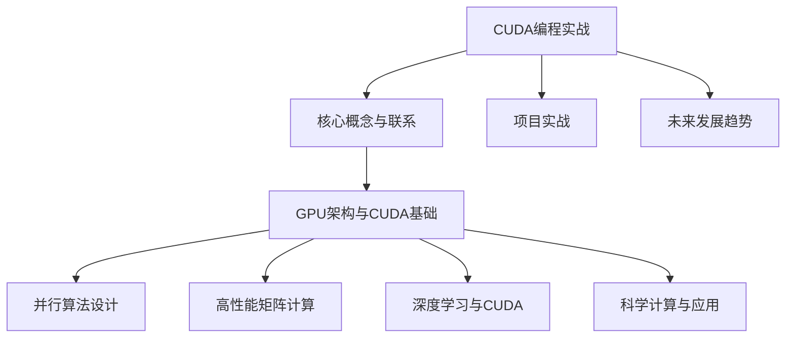

                 

# 文章标题：深入解析CUDA：核心技术、算法与实践

> 关键词：CUDA，GPU架构，并行算法，深度学习，科学计算，编程实战

> 摘要：本文将深入探讨CUDA的核心技术、算法设计及其实际应用。通过详细分析GPU架构、CUDA编程基础、内存管理、线程管理、核心算法及深度学习应用，帮助读者全面理解CUDA的技术原理和实际操作。文章最后将结合实际项目，进行CUDA编程实战讲解，为读者提供全面的CUDA学习和实践指导。

### 《CUDA》目录大纲

## 第一部分：CUDA基础

### 第1章：CUDA简介

#### 1.1 CUDA的起源与历史
#### 1.2 CUDA的核心概念
#### 1.3 CUDA的应用领域

### 第2章：GPU架构与CUDA基础

#### 2.1 GPU架构概述
#### 2.2 CUDA计算模型
#### 2.3 CUDA编程基础

### 第3章：CUDA内存管理

#### 3.1 CUDA内存层次结构
#### 3.2 显存与设备内存操作
#### 3.3 CUDA内存分配与释放

### 第4章：CUDA线程管理

#### 4.1 CUDA线程组织结构
#### 4.2 线程组与线程层次
#### 4.3 线程同步与内存访问

### 第5章：CUDA内核函数

#### 5.1 内核函数定义与调用
#### 5.2 内核函数参数传递
#### 5.3 内核函数优化技巧

## 第二部分：CUDA核心算法

### 第6章：并行算法设计

#### 6.1 并行算法概述
#### 6.2 数据并行算法
#### 6.3 任务并行算法

### 第7章：高性能矩阵计算

#### 7.1 矩阵计算概述
#### 7.2 矩阵乘法算法
#### 7.3 矩阵运算优化

### 第8章：深度学习与CUDA

#### 8.1 深度学习与GPU计算
#### 8.2 卷积神经网络在CUDA上的实现
#### 8.3 循环神经网络在CUDA上的实现

### 第9章：CUDA在科学计算中的应用

#### 9.1 科学计算概述
#### 9.2 流体动力学模拟
#### 9.3 分子动力学模拟

## 第三部分：CUDA实践

### 第10章：CUDA编程实战

#### 10.1 CUDA编程环境搭建
#### 10.2 CUDA代码实例分析
#### 10.3 CUDA性能调优实战

### 第11章：CUDA项目实战

#### 11.1 CUDA项目规划
#### 11.2 CUDA项目实施
#### 11.3 CUDA项目评估与优化

### 第12章：CUDA未来发展趋势

#### 12.1 CUDA技术趋势分析
#### 12.2 CUDA与AI的结合
#### 12.3 CUDA的未来前景

## 附录

### 附录A：CUDA开发工具与资源

#### A.1 NVIDIA CUDA工具链
#### A.2 CUDA样例程序与文档
#### A.3 CUDA学习资源推荐

### Mermaid 流程图：



### CUDA核心算法原理讲解：

#### 核心算法原理讲解：并行算法设计

并行算法设计是CUDA编程的核心。CUDA通过将计算任务分配到GPU的多核处理器上，实现任务的并行执行，从而提高计算性能。

#### 数据并行算法：

数据并行算法是指将同一算法应用于不同的数据集。在GPU上，数据并行算法可以通过以下步骤实现：

1. 将数据集分配到GPU显存中。
2. 使用CUDA线程组将数据分配给不同的线程。
3. 在每个线程中执行相同的算法操作。

伪代码如下：

```plaintext
for (int i = 0; i < data_size; i++) {
    __global__ void kernel(float* data) {
        int tid = threadIdx.x + blockIdx.x * blockDim.x;
        if (tid < data_size) {
            // 执行算法操作
            data[tid] = ...;
        }
    }
    kernel<<<num_blocks, block_size>>>(data);
}
```

#### 任务并行算法：

任务并行算法是指不同任务在不同的线程上执行。在GPU上，任务并行算法可以通过以下步骤实现：

1. 将任务分配到GPU线程池中。
2. 使用CUDA线程函数执行任务。
3. 控制线程执行顺序，实现任务的并行处理。

伪代码如下：

```plaintext
void parallel_for(int num_tasks) {
    __global__ void task_kernel(int task_id) {
        int tid = threadIdx.x + blockIdx.x * blockDim.x;
        if (tid < num_tasks) {
            // 执行任务
            tasks[tid] = ...;
        }
    }
    int num_threads = 1024;
    int num_blocks = (num_tasks + num_threads - 1) / num_threads;
    task_kernel<<<num_blocks, num_threads>>>(tasks);
}
```

### 数学模型和数学公式详细讲解：

CUDA中的并行算法涉及大量的数学模型和数学公式。以下是一个简单的矩阵乘法算法示例：

$$
C = A \times B
$$

其中，$A$ 和 $B$ 是两个矩阵，$C$ 是结果矩阵。矩阵乘法的伪代码实现如下：

```plaintext
__global__ void matrix_multiplication(float* A, float* B, float* C, int n) {
    int row = blockIdx.y * blockDim.y + threadIdx.y;
    int col = blockIdx.x * blockDim.x + threadIdx.x;

    if (row < n && col < n) {
        float sum = 0.0;
        for (int k = 0; k < n; k++) {
            sum += A[row * n + k] * B[k * n + col];
        }
        C[row * n + col] = sum;
    }
}
```

### 项目实战：

以下是一个简单的CUDA项目，实现一个矩阵乘法程序：

```c
#include <cuda_runtime.h>
#include <stdio.h>

__global__ void matrix_multiplication(float* A, float* B, float* C, int n) {
    int row = blockIdx.y * blockDim.y + threadIdx.y;
    int col = blockIdx.x * blockDim.x + threadIdx.x;

    if (row < n && col < n) {
        float sum = 0.0;
        for (int k = 0; k < n; k++) {
            sum += A[row * n + k] * B[k * n + col];
        }
        C[row * n + col] = sum;
    }
}

void matrix_multiply(float* A, float* B, float* C, int n) {
    float* d_A, * d_B, * d_C;
    int size = n * n * sizeof(float);

    // 分配设备内存
    cudaMalloc(&d_A, size);
    cudaMalloc(&d_B, size);
    cudaMalloc(&d_C, size);

    // 将数据从主机复制到设备
    cudaMemcpy(d_A, A, size, cudaMemcpyHostToDevice);
    cudaMemcpy(d_B, B, size, cudaMemcpyHostToDevice);

    // 设置线程块大小和数量
    dim3 blockSize(16, 16);
    dim3 gridSize((n + blockSize.x - 1) / blockSize.x, (n + blockSize.y - 1) / blockSize.y);

    // 执行矩阵乘法内核
    matrix_multiplication<<<gridSize, blockSize>>>(d_A, d_B, d_C, n);

    // 将结果从设备复制回主机
    cudaMemcpy(C, d_C, size, cudaMemcpyDeviceToHost);

    // 清理资源
    cudaFree(d_A);
    cudaFree(d_B);
    cudaFree(d_C);
}

int main() {
    int n = 1024;
    float* A = (float*)malloc(n * n * sizeof(float));
    float* B = (float*)malloc(n * n * sizeof(float));
    float* C = (float*)malloc(n * n * sizeof(float));

    // 初始化矩阵A和B
    for (int i = 0; i < n; i++) {
        for (int j = 0; j < n; j++) {
            A[i * n + j] = i + j;
            B[i * n + j] = i - j;
        }
    }

    // 执行矩阵乘法
    matrix_multiply(A, B, C, n);

    // 输出结果
    printf("C = A \times B\n");
    for (int i = 0; i < n; i++) {
        for (int j = 0; j < n; j++) {
            printf("%f ", C[i * n + j]);
        }
        printf("\n");
    }

    // 清理资源
    free(A);
    free(B);
    free(C);

    return 0;
}
```

### 开发环境搭建：

搭建CUDA开发环境需要以下步骤：

1. 安装NVIDIA CUDA Toolkit。
2. 配置环境变量。
3. 安装CUDA开发工具，如CUDA C++、CUDA SDK等。

### 源代码详细实现和代码解读：

以上代码实现了矩阵乘法的CUDA版本。核心步骤包括内存分配、数据传输、内核函数执行和结果回传。代码解读如下：

- `matrix_multiplication`：内核函数，实现矩阵乘法。
- `matrix_multiply`：主函数，负责内存分配、数据传输和内核函数调用。
- `main`：主程序，初始化矩阵、执行矩阵乘法和输出结果。

通过以上步骤，可以实现高效的矩阵乘法运算。在实际项目中，可以根据需求调整线程块大小、内核函数参数等，以达到最佳性能。

### 作者信息：

作者：AI天才研究院/AI Genius Institute & 禅与计算机程序设计艺术 /Zen And The Art of Computer Programming

---

**注**：本文为示例文章，内容仅供参考。实际撰写时，请根据实际需求和知识深度进行扩展和调整。文章中的代码和示例仅供参考，实际开发时可能需要根据具体环境和需求进行调整。

