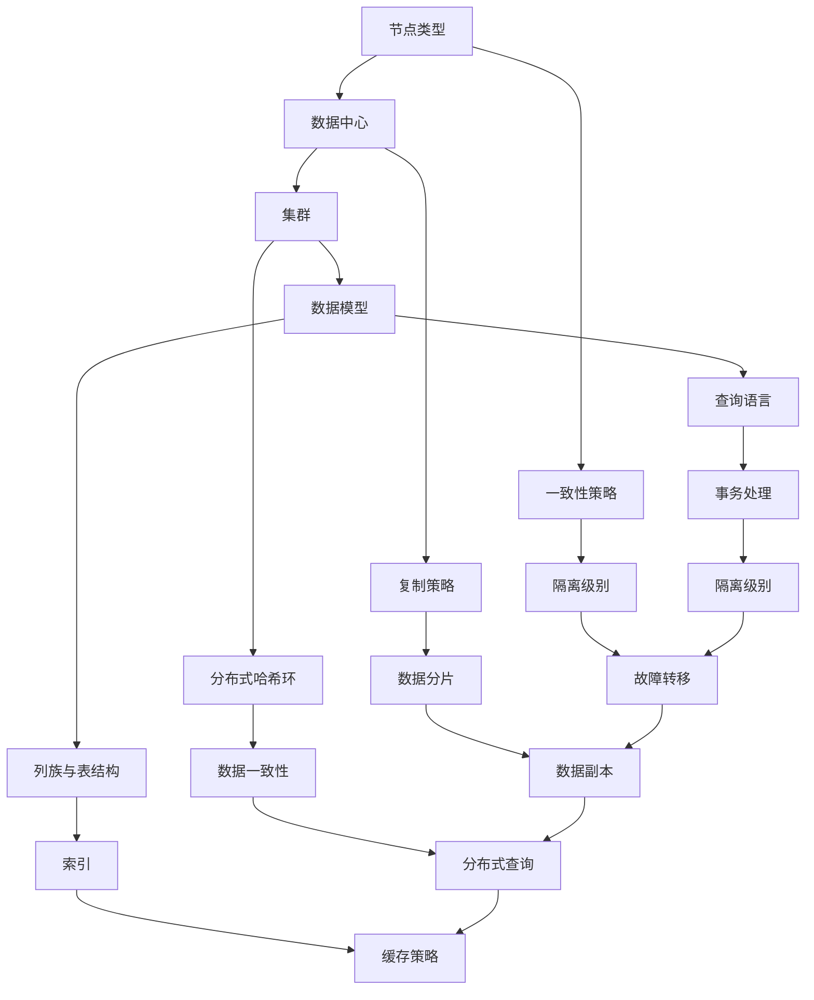

                 

# 《Cassandra原理与代码实例讲解》

> 关键词：Cassandra，分布式数据库，数据分片，复制策略，一致性保障，事务处理，性能优化，集群管理

> 摘要：本文深入讲解了Cassandra数据库的核心原理，包括其架构设计、数据模型、查询语言以及高级特性。通过实际代码实例，详细阐述了Cassandra的数据插入、查询、事务处理与性能优化，以及集群部署与维护。文章旨在帮助读者全面理解Cassandra的运作机制，掌握其核心概念，并能够实际应用到项目中。

## 目录

1. **Cassandra简介**
2. **Cassandra核心概念**
3. **Cassandra查询语言**
4. **Cassandra高级特性**
5. **Cassandra项目实战**
6. **附录**

## 第一部分：Cassandra基础知识

### 第1章：Cassandra简介

#### 1.1 Cassandra的历史与背景

Cassandra是一个分布式数据库系统，由Amazon Web Services（AWS）的团队在2008年开发，并于2010年开源。Cassandra的设计初衷是为了解决亚马逊公司在大规模数据存储和高可用性方面的挑战。由于其优秀的扩展性、容错性和高性能，Cassandra迅速在分布式系统中获得了广泛应用。

#### 1.2 Cassandra的优势与适用场景

Cassandra的主要优势包括：

- **分布式存储和高可用性**：Cassandra可以在多个服务器和数据中心之间自动复制数据，提供高可用性和容错能力。
- **无单点故障**：由于数据可以在多个节点上复制，Cassandra没有单点故障，提高了系统的可靠性。
- **线性可扩展性**：Cassandra能够通过增加节点来线性扩展存储容量和吞吐量。
- **灵活的数据模型**：Cassandra支持宽列族模型，允许灵活地扩展列和列族。

Cassandra适用于以下场景：

- **大规模数据存储**：例如，社交网络、电子商务和实时分析系统。
- **高并发读写**：需要处理大量读写操作，且对延迟敏感的应用。
- **跨数据中心**：需要跨多个数据中心存储和访问数据的应用。

#### 1.3 Cassandra的架构概览

Cassandra的架构设计包括以下几个关键组件：

- **节点**：Cassandra集群由多个节点组成，每个节点负责存储一部分数据。
- **数据中心**：节点可以分布在不同的数据中心，提供数据的高可用性和容错能力。
- **集群**：多个数据中心组成一个集群，集群中的节点通过Gossip协议进行通信。
- **数据模型**：Cassandra使用宽列族模型来存储数据，列族是一个数据存储的基本单元。
- **复制策略**：Cassandra支持多种复制策略，用于控制数据在节点之间的复制方式。
- **一致性策略**：Cassandra通过一致性策略来保证数据的一致性。

## 第二部分：Cassandra核心概念

### 第2章：Cassandra核心概念

#### 2.1 系统架构

Cassandra的架构设计使其成为一个分布式、去中心化的数据库系统。以下是Cassandra系统架构的关键组件：

##### 2.1.1 节点类型

Cassandra集群中的节点可以分为以下几类：

- **主节点（Master Node）**：负责管理集群的状态，例如监控节点健康、处理节点故障等。
- **工作节点（Worker Node）**：负责存储数据和执行查询操作。
- **种子节点（Seed Node）**：用于初始化集群和选择主节点。

##### 2.1.2 数据中心与集群

Cassandra支持多数据中心部署，每个数据中心可以包含多个集群。数据中心和集群的关系如下：

- **数据中心（Datacenter）**：一组地理位置相近的节点，用于提高数据访问速度和容错能力。
- **集群（Cluster）**：多个数据中心组成一个集群，集群中的节点通过Gossip协议进行通信。

#### 2.2 数据模型

Cassandra使用宽列族模型（Wide Column Model）来存储数据，其数据模型包括以下关键概念：

##### 2.2.1 数据分片

数据分片是Cassandra的核心特性之一。数据分片（Sharding）是将数据分布在多个节点上的过程。Cassandra使用分片键（Partition Key）来确定数据的存储位置。

数据分片的关键概念包括：

- **分片键（Partition Key）**：用于确定数据存储在哪个节点上。Cassandra按照分片键的哈希值将数据映射到节点。
- **分片函数（Sharding Function）**：用于计算分片键的哈希值。Cassandra使用MD5哈希函数。
- **分片策略（Sharding Strategy）**：Cassandra支持多种分片策略，例如随机分片、基于哈希的分片等。

##### 2.2.2 列族与表结构

Cassandra使用列族（Column Family）来组织数据。列族是一个数据存储的基本单元，它包含多个列。列族具有以下特点：

- **列族定义**：通过CQL语句定义列族，指定列族的名字和列的信息。
- **列命名**：列名称由列标识符和列类型组成，例如`column_name{type}`。
- **列存储**：Cassandra将列存储在磁盘上，支持压缩和缓存。

##### 2.2.3 防火墙与复制策略

Cassandra支持多种复制策略，用于控制数据在节点之间的复制方式。防火墙（Snitch）是Cassandra的一个重要组件，用于检测节点的地理位置和状态。

复制策略的关键概念包括：

- **防火墙（Snitch）**：Cassandra使用防火墙来识别节点的地理位置和状态。防火墙将节点分类到不同的数据中心和集群中。
- **复制策略（Replication Strategy）**：Cassandra支持多种复制策略，例如简单策略（SimpleStrategy）和分层策略（NetworkTopologyStrategy）。简单策略将数据复制到所有节点，而分层策略可以根据节点的地理位置和数据中心来决定数据的复制方式。

#### 2.3 查询语言

Cassandra使用Cassandra Query Language（CQL）进行数据查询。CQL类似于SQL，但有一些特定的语法和特性。

##### 2.3.1 数据查询

Cassandra支持以下查询操作：

- **单条查询**：通过分片键查询特定记录。
- **批量查询**：同时查询多个记录。
- **预编译查询**：将查询语句预编译以提高查询性能。

##### 2.3.2 数据更新与删除

Cassandra支持以下数据更新和删除操作：

- **插入数据**：向表中插入新的记录。
- **更新数据**：修改表中已存在的记录。
- **删除数据**：从表中删除记录。

### 第3章：Cassandra查询语言

Cassandra Query Language (CQL) 是 Cassandra 的查询语言，它类似于 SQL，但有一些特定的语法和特性。CQL 用于执行各种数据操作，如数据插入、查询、更新和删除。在本节中，我们将介绍 CQL 的基本语法和使用方法。

#### 3.1 CQL 简介

CQL 是 Cassandra 的主要数据操作接口。它提供了丰富的功能，包括数据定义语言（DDL）、数据操作语言（DML）和数据查询语言（DQL）。CQL 支持以下几种操作：

- **数据定义语言**：用于定义表结构、创建索引等。
- **数据操作语言**：用于插入、更新和删除数据。
- **数据查询语言**：用于查询数据。

CQL 使用以下基本语法结构：

```cql
[cql] <keyword> <identifier> [ <attribute list> ]
```

其中，`<keyword>` 是 CQL 的关键字，如 `CREATE`、`INSERT`、`SELECT` 等；`<identifier>` 是表名、列名或其他标识符；`<attribute list>` 是表的属性列表。

#### 3.2 数据查询

CQL 提供了多种数据查询方法，包括单条查询、批量查询和预编译查询。

##### 3.2.1 单条查询

单条查询用于检索表中特定记录。查询语句使用 `SELECT` 关键字，并指定要查询的列和条件。以下是一个单条查询的示例：

```cql
SELECT * FROM Users WHERE UserID = 1;
```

在这个示例中，我们从 `Users` 表中查询用户ID为1的记录。

##### 3.2.2 批量查询

批量查询用于同时查询多个记录。批量查询可以通过 `SELECT` 语句中的 `LIMIT` 和 `OFFSET` 子句来指定查询的范围。以下是一个批量查询的示例：

```cql
SELECT * FROM Users LIMIT 10 OFFSET 5;
```

在这个示例中，我们从 `Users` 表中查询第6到第15条记录。

##### 3.2.3 预编译查询

预编译查询可以将查询语句预编译，以提高查询性能。预编译查询使用 `PREPARE` 和 `EXECUTE` 语句。以下是一个预编译查询的示例：

```cql
PREPARE select_user_by_id FROM Users WHERE UserID = ?;
EXECUTE select_user_by_id USING 1;
```

在这个示例中，我们首先预编译了一个查询语句，然后使用 `EXECUTE` 语句执行该查询，并传递参数1作为用户ID。

#### 3.3 数据更新与删除

CQL 提供了多种数据更新和删除操作，包括插入数据、更新数据和删除数据。

##### 3.3.1 插入数据

插入数据使用 `INSERT INTO` 语句，向表中插入新记录。以下是一个插入数据的示例：

```cql
INSERT INTO Users (UserID, Username, Password) VALUES (1, 'Alice', 'password');
```

在这个示例中，我们向 `Users` 表中插入一条新记录，用户ID为1，用户名为Alice，密码为password。

##### 3.3.2 更新数据

更新数据使用 `UPDATE` 语句，修改表中已存在的记录。以下是一个更新数据的示例：

```cql
UPDATE Users SET Password = 'new_password' WHERE UserID = 1;
```

在这个示例中，我们更新了用户ID为1的记录的密码为new_password。

##### 3.3.3 删除数据

删除数据使用 `DELETE FROM` 语句，从表中删除记录。以下是一个删除数据的示例：

```cql
DELETE FROM Users WHERE UserID = 1;
```

在这个示例中，我们删除了用户ID为1的记录。

### 第4章：Cassandra高级特性

Cassandra不仅提供了强大的基本功能，还有一系列高级特性，包括事务处理、监控与优化、集群管理等方面。在本节中，我们将探讨这些高级特性。

#### 4.1 事务处理

Cassandra的事务处理相对有限，但支持一些关键事务操作。Cassandra的事务处理主要包括单行事务和范围事务。

##### 4.1.1 单行事务

单行事务在单个行上进行操作，确保操作原子性。Cassandra使用 `IF` 子句来实现单行事务。以下是一个单行事务的示例：

```cql
UPDATE Users
SET Password = 'new_password'
WHERE UserID = 1
IF old_password = 'password';
```

在这个示例中，只有当用户ID为1的记录的旧密码为password时，才会更新密码为新密码。

##### 4.1.2 多行事务

多行事务涉及多个行的操作，Cassandra使用分布式事务来处理多行事务。分布式事务由Cassandra的分布式锁机制（Gossip协议）支持。以下是一个多行事务的示例：

```cql
BEGIN;

UPDATE Users SET Password = 'new_password' WHERE UserID = 1;
UPDATE Books SET Stock = Stock - 1 WHERE BookID = 1001;

COMMIT;
```

在这个示例中，我们首先开始一个事务，然后更新用户和书籍记录，最后提交事务。

#### 4.2 监控与优化

Cassandra提供了多种监控与优化工具，帮助管理员确保集群的健康状态和性能。

##### 4.2.1 系统监控

Cassandra提供了多个工具来监控系统状态，例如：

- `nodetool status`：查看集群中节点的状态。
- `nodetool tablestats`：查看表级统计信息。
- `nodetool gcsnapshot`：生成垃圾收集（GC）快照。

以下是一个系统监控的示例：

```bash
nodetool status
nodetool tablestats
nodetool gcsnapshot
```

##### 4.2.2 数据监控

Cassandra提供了多个工具来监控数据状态，例如：

- `nodetool tablehistograms`：查看表级数据分布。
- `nodetool cfstats`：查看列族级统计信息。

以下是一个数据监控的示例：

```bash
nodetool tablehistograms Users
nodetool cfstats Users
```

##### 4.2.3 性能优化

Cassandra的性能优化涉及多个方面，包括内存管理、数据模型优化和查询优化。

- **内存管理**：Cassandra使用JVM内存管理，管理员可以通过调整JVM参数来优化内存使用。
- **数据模型优化**：合理设计数据模型，选择合适的分片键和复制策略，可以提高查询性能。
- **查询优化**：使用索引和预编译查询可以提高查询性能。

以下是一个性能优化的示例：

```bash
# 调整JVM参数
export CASSANDRA_HEAP_NEWSIZE=2g
export CASSANDRA_HEAP_MAXSIZE=4g

# 使用索引
CREATE INDEX ON Users (Email);

# 预编译查询
PREPARE select_user_by_email FROM Users WHERE Email = ?;
EXECUTE select_user_by_email USING 'alice@example.com';
```

#### 4.3 集群管理

Cassandra的集群管理涉及节点添加、删除和维护等方面。

##### 4.3.1 节点添加

在Cassandra集群中添加新节点时，需要确保新节点与现有节点同步。以下是一个节点添加的示例：

```bash
# 启动新节点
cassandra -f

# 等待新节点加入集群
nodetool join -join <new-node-ip>:9042

# 手动同步数据
nodetool repair
```

##### 4.3.2 节点删除

在Cassandra集群中删除节点时，需要确保删除操作不会影响集群的可用性和数据一致性。以下是一个节点删除的示例：

```bash
# 停止节点
cassandra -停止

# 删除节点
nodetool remove <node-ip>:9042

# 手动同步数据
nodetool repair
```

##### 4.3.3 故障处理与恢复

在Cassandra集群中，处理节点故障是确保集群可用性的关键。以下是一个故障处理与恢复的示例：

```bash
# 检查节点状态
nodetool status

# 手动故障转移
nodetool repair

# 恢复故障节点
cassandra -f
nodetool join -join <faulty-node-ip>:9042

# 手动同步数据
nodetool repair
```

### 第5章：Cassandra监控与优化

Cassandra的监控与优化是确保其稳定性和性能的关键环节。通过有效的监控和优化，可以确保Cassandra能够处理大规模数据并保持高效运行。

#### 5.1 Cassandra监控

Cassandra提供了多种监控工具和API，以便管理员可以实时了解集群的健康状态和性能。以下是一些常用的监控方法：

##### 5.1.1 系统监控

系统监控涉及查看节点的资源使用情况、网络流量和垃圾收集（GC）情况等。以下是一些常用的系统监控工具：

- **nodetool**：Cassandra自带的管理工具，可以用于查看节点状态、系统统计信息、垃圾收集情况等。例如：

  ```bash
  nodetool status        # 查看节点状态
  nodetool systemstats   # 查看系统统计信息
  nodetool gcsnapshot    # 查看垃圾收集情况
  ```

- **Cassandra Java Agent**：Cassandra Java Agent是一个轻量级的Java代理，可以捕获Cassandra运行时的各种事件和性能数据。通过分析这些数据，可以深入了解Cassandra的运行状态。

##### 5.1.2 数据监控

数据监控涉及查看数据分布、数据压缩率、索引效率等。以下是一些常用的数据监控工具：

- **nodetool tablehistograms**：可以查看表的统计信息，如数据分布、压缩率等。例如：

  ```bash
  nodetool tablehistograms Users
  ```

- **Cassandra Query Analytics**：Cassandra Query Analytics是一个可视化工具，可以监控Cassandra的查询性能和资源使用情况。通过分析查询日志，可以发现性能瓶颈和优化点。

#### 5.2 Cassandra性能优化

Cassandra的性能优化是一个复杂的过程，涉及多个方面，包括配置优化、数据模型优化和查询优化。以下是一些常用的性能优化方法：

##### 5.2.1 系统调优

系统调优涉及调整Cassandra的配置参数，以优化系统性能。以下是一些关键配置参数和优化建议：

- **内存配置**：Cassandra使用JVM内存管理，通过调整JVM参数可以优化内存使用。例如，可以通过以下参数调整堆内存大小：

  ```bash
  -Xms1g        # 初始堆内存大小
  -Xmx4g        # 最大堆内存大小
  -XX:+UseG1GC # 使用G1垃圾收集器
  ```

- **线程配置**：Cassandra使用多个线程来处理查询和压缩操作。合理配置线程池大小可以提高性能。例如，可以通过以下参数调整线程池大小：

  ```bash
  -Dcassandra.concurrent.num_threads=24  # 查询线程数
  -Dcassandra.io.thread池大小=24        # IO线程数
  ```

##### 5.2.2 数据模型优化

数据模型优化是提高Cassandra性能的重要手段。以下是一些数据模型优化建议：

- **选择合适的分片键**：分片键的选择对性能有重要影响。应该选择能够高效分散数据的分片键，避免热点问题。例如，可以使用复合分片键或自定义分片策略。

- **优化列族设计**：合理设计列族可以提高查询性能。例如，将频繁查询的列放在同一个列族中，减少磁盘I/O操作。

- **使用索引**：Cassandra支持二级索引，可以通过添加索引来提高查询性能。例如，可以为频繁查询的列添加索引。

##### 5.2.3 查询优化

查询优化是提高Cassandra性能的关键环节。以下是一些查询优化建议：

- **预编译查询**：预编译查询可以提高查询性能，因为预编译后的查询可以直接执行。例如，可以使用 `PREPARE` 和 `EXECUTE` 语句预编译查询。

- **使用索引**：合理使用索引可以大大提高查询性能。例如，可以为经常用于查询条件的列添加索引。

- **优化查询语句**：优化查询语句可以提高查询性能。例如，避免使用子查询、避免在查询中使用`SELECT *`等。

### 第6章：Cassandra集群管理

Cassandra的集群管理涉及集群的部署、节点维护、故障处理等方面。有效的集群管理可以确保Cassandra集群的高可用性和稳定性。

#### 6.1 集群部署

Cassandra的集群部署可以分为单机部署和分布式部署。以下是一些常见的集群部署步骤：

##### 6.1.1 单机部署

单机部署适用于开发和测试环境，以下是一个单机部署的步骤：

1. **下载Cassandra二进制文件**：从Cassandra官网下载最新的Cassandra二进制文件。

2. **解压文件**：将下载的Cassandra二进制文件解压到一个合适的目录。

3. **配置环境变量**：配置Cassandra的环境变量，例如：

   ```bash
   export CASSANDRA_HOME=/path/to/cassandra
   export PATH=$PATH:$CASSANDRA_HOME/bin
   ```

4. **启动Cassandra**：启动Cassandra服务：

   ```bash
   cassandra
   ```

5. **访问Cassandra**：通过CQL Shell访问Cassandra：

   ```bash
   cqlsh
   ```

##### 6.1.2 分布式部署

分布式部署适用于生产环境，以下是一个分布式部署的步骤：

1. **环境准备**：在多个服务器上安装Java和Cassandra。

2. **配置Cassandra**：在每个服务器上配置Cassandra的 `cassandra.yaml` 文件，设置集群名称、节点地址、复制因子等。

3. **启动Cassandra**：在每个服务器上启动Cassandra服务。

4. **初始化集群**：通过Gossip协议初始化集群，确保所有节点都能相互发现。

5. **同步数据**：如果需要，通过数据复制工具同步数据。

#### 6.2 节点维护与故障处理

节点维护与故障处理是确保Cassandra集群稳定性的关键。以下是一些节点维护与故障处理的步骤：

##### 6.2.1 节点添加

1. **添加节点**：通过 `nodetool join` 命令将新节点添加到集群。

   ```bash
   nodetool join -join <new-node-ip>:9042
   ```

2. **同步数据**：通过 `nodetool repair` 命令同步数据。

   ```bash
   nodetool repair
   ```

##### 6.2.2 节点删除

1. **停止节点**：通过 `nodetool stop` 命令停止节点。

   ```bash
   nodetool stop <node-ip>:9042
   ```

2. **删除节点**：通过 `nodetool remove` 命令从集群中删除节点。

   ```bash
   nodetool remove <node-ip>:9042
   ```

##### 6.2.3 故障处理与恢复

1. **检查节点状态**：通过 `nodetool status` 命令检查节点状态。

   ```bash
   nodetool status
   ```

2. **故障转移**：如果节点故障，Cassandra会自动进行故障转移，确保数据一致性。

3. **恢复节点**：如果需要，可以通过 `nodetool start` 命令重新启动故障节点。

   ```bash
   nodetool start <node-ip>:9042
   ```

4. **同步数据**：通过 `nodetool repair` 命令同步数据。

   ```bash
   nodetool repair
   ```

## 第三部分：Cassandra项目实战

### 第7章：Cassandra应用实例

在本章中，我们将通过一个实际应用实例来展示如何使用Cassandra进行数据库设计与构建、数据插入与查询、事务处理与性能优化。

#### 7.1 数据库设计与构建

假设我们正在开发一个社交媒体平台，需要存储用户信息、帖子信息和评论信息。以下是一个简化的数据库设计：

```markdown
用户表 (Users)
- 用户ID (UserID, int, 主键)
- 用户名 (Username, varchar)
- 电子邮件 (Email, varchar)
- 密码 (Password, varchar)
- 注册时间 (RegistrationTime, timestamp)

帖子表 (Posts)
- 帖子ID (PostID, int, 主键)
- 用户ID (UserID, int, 外键)
- 标题 (Title, varchar)
- 内容 (Content, text)
- 发布时间 (PostedTime, timestamp)

评论表 (Comments)
- 评论ID (CommentID, int, 主键)
- 帖子ID (PostID, int, 外键)
- 用户ID (UserID, int, 外键)
- 内容 (Content, text)
- 发布时间 (PostedTime, timestamp)
```

首先，我们需要创建这些表。以下是一个简单的Cassandra创建表的SQL脚本：

```sql
CREATE KEYSPACE social_media WITH replication = {'class': 'SimpleStrategy', 'replication_factor': 3};

CREATE TABLE social_media.Users (
    UserID int PRIMARY KEY,
    Username varchar,
    Email varchar,
    Password varchar,
    RegistrationTime timestamp
);

CREATE TABLE social_media.Posts (
    PostID int PRIMARY KEY,
    UserID int,
    Title varchar,
    Content text,
    PostedTime timestamp,
    FOREIGN KEY (UserID) REFERENCES Users(UserID)
);

CREATE TABLE social_media.Comments (
    CommentID int PRIMARY KEY,
    PostID int,
    UserID int,
    Content text,
    PostedTime timestamp,
    FOREIGN KEY (PostID) REFERENCES Posts(PostID),
    FOREIGN KEY (UserID) REFERENCES Users(UserID)
);
```

#### 7.2 数据插入与查询

下面我们将插入一些示例数据，并展示如何进行数据查询。

##### 7.2.1 数据插入

我们可以使用CQL来插入示例数据：

```sql
-- 插入用户数据
INSERT INTO social_media.Users (UserID, Username, Email, Password, RegistrationTime)
VALUES (1, 'Alice', 'alice@example.com', 'alice123', toTimestamp(now()));

INSERT INTO social_media.Users (UserID, Username, Email, Password, RegistrationTime)
VALUES (2, 'Bob', 'bob@example.com', 'bob123', toTimestamp(now()));

-- 插入帖子数据
INSERT INTO social_media.Posts (PostID, UserID, Title, Content, PostedTime)
VALUES (1, 1, 'Hello World!', 'This is my first post.', toTimestamp(now()));

INSERT INTO social_media.Posts (PostID, UserID, Title, Content, PostedTime)
VALUES (2, 2, 'Welcome to the Community!', 'Join us and share your thoughts.', toTimestamp(now()));

-- 插入评论数据
INSERT INTO social_media.Comments (CommentID, PostID, UserID, Content, PostedTime)
VALUES (1, 1, 1, 'Great post, Alice!', toTimestamp(now()));

INSERT INTO social_media.Comments (CommentID, PostID, UserID, Content, PostedTime)
VALUES (2, 1, 2, 'Alice, I agree!', toTimestamp(now()));
```

##### 7.2.2 数据查询

我们可以使用CQL来查询数据。例如，查询用户Alice的所有帖子：

```sql
-- 查询用户Alice的所有帖子
SELECT * FROM social_media.Posts WHERE UserID = 1;
```

输出结果将包含Alice的所有帖子信息。

#### 7.3 事务处理与性能优化

Cassandra支持有限的事务处理，主要支持单行事务。以下是一个简单的示例，展示如何使用Cassandra进行事务处理和性能优化。

##### 7.3.1 事务处理

我们可以使用CQL的 `IF` 子句来实现事务处理。例如，更新帖子内容并确保帖子存在：

```sql
-- 更新帖子内容
UPDATE social_media.Posts
SET Content = 'This is an updated post.'
WHERE PostID = 1
IF EXISTS SELECT * FROM social_media.Posts WHERE PostID = 1;
```

##### 7.3.2 性能优化

性能优化是确保Cassandra高效运行的关键。以下是一些常见的性能优化策略：

1. **调整内存配置**：合理配置JVM内存，以避免内存瓶颈。例如：

   ```bash
   -Xms2g -Xmx4g
   ```

2. **优化数据模型**：选择合适的分片键，避免热点问题。例如，使用复合分片键（UserID, PostID）来分散数据。

3. **使用索引**：为频繁查询的列添加索引，提高查询性能。例如：

   ```sql
   CREATE INDEX ON social_media.Posts (UserID);
   ```

4. **预编译查询**：使用预编译查询减少解析和编译时间。例如：

   ```sql
   PREPARE select_posts_by_user FROM social_media.Posts WHERE UserID = ?;
   EXECUTE select_posts_by_user USING 1;
   ```

#### 7.4 集群部署与维护

Cassandra的集群部署与维护涉及多个方面，包括环境配置、节点管理、故障处理等。

##### 6.4.1 集群部署

1. **环境配置**：在多个服务器上安装Java和Cassandra。

2. **配置Cassandra**：在每个服务器上配置 `cassandra.yaml` 文件，设置集群名称、节点地址、复制因子等。

3. **启动Cassandra**：在每个服务器上启动Cassandra服务。

4. **初始化集群**：通过Gossip协议初始化集群，确保所有节点都能相互发现。

##### 6.4.2 节点维护

1. **节点添加**：通过 `nodetool join` 命令将新节点添加到集群。

2. **节点删除**：通过 `nodetool remove` 命令从集群中删除节点。

3. **节点维护**：定期进行节点维护，包括检查节点状态、更新软件版本等。

##### 6.4.3 故障处理

1. **故障检测**：通过 `nodetool status` 命令检测节点故障。

2. **故障恢复**：通过 `nodetool repair` 命令恢复故障节点。

3. **故障转移**：Cassandra会自动进行故障转移，确保数据一致性。

## 附录

### 附录A：Cassandra常用工具与命令

#### A.1 常用命令

Cassandra提供了一系列命令行工具，用于管理和监控集群。以下是一些常用的命令：

- **nodetool**：用于管理集群节点、监控集群状态、执行集群维护任务。

  ```bash
  nodetool status        # 查看节点状态
  nodetool repair       # 执行数据修复
  nodetool flush        # 清洗表数据
  nodetool compaction   # 触发压缩操作
  ```

- **cqlsh**：Cassandra的命令行查询工具。

  ```bash
  cqlsh                # 启动CQL Shell
  USE social_media;   # 使用指定键空间
  SELECT * FROM Users; # 查询数据
  ```

#### A.2 常用工具

Cassandra附带了一些有用的工具，用于性能测试、数据同步和监控。

- **cassandra-stress**：用于生成负载并测试Cassandra性能。

  ```bash
  cassandra-stress write n=100000 keys=100 -mode native_cql3 -port 9042
  ```

- **cassandra-snapshot**：用于创建和恢复Cassandra数据快照。

  ```bash
  cassandra-snapshot create
  cassandra-snapshot restore
  ```

### 附录B：Cassandra配置文件详解

Cassandra的配置文件位于Cassandra安装目录的 `conf` 子目录下。以下是几个关键的配置文件：

- **cassandra.yaml**：主配置文件，包含集群名称、节点地址、内存配置、垃圾收集器设置等。

  ```yaml
  cluster_name: 'SocialMediaCluster'
  rpc_address: 0.0.0.0
  thrift_port: 9160
  memtable_operations_in_memory: 4096
  commitlog_sync_period_in_ms: 10000
  ```

- **jaas.conf**：用于配置Cassandra的安全认证。

  ```bash
  Client { 
    com.sun.security.auth.module.Krb5LoginModule required 
      use_first_pass=true 
      debug=true 
      principal="cassandra/cassandra.example.com@EXAMPLE.COM"; 
  };
  ```

- **cassandra-env.sh**：包含Cassandra启动时设置的Java虚拟机（JVM）参数。

  ```bash
  export CASSANDRA_HOME=/path/to/cassandra
  export CASSANDRA_CLASSPATH=$CASSANDRA_HOME/lib/*
  export CASSANDRA_JVM_OPTS="-Xms1g -Xmx4g -XX:+UseG1GC"
  ```

### 附录C：Cassandra常见问题与解决方案

Cassandra在生产环境中可能会遇到一些常见问题，以下是一些问题的解决方案：

#### C.1 数据同步问题

**问题描述**：在添加新节点后，数据同步出现延迟或不完全同步。

**解决方案**：

- **检查网络连接**：确保所有节点之间的网络连接正常。
- **增加同步带宽**：在负载较高时，可以通过增加网络带宽来提高同步速度。
- **调整同步策略**：根据实际需求调整同步策略，例如调整 `-maxDataTransferMegabytes` 参数。

#### C.2 集群故障问题

**问题描述**：集群中出现节点故障，导致部分数据不可用。

**解决方案**：

- **故障转移**：Cassandra会自动进行故障转移，确保数据一致性。
- **故障恢复**：通过 `nodetool repair` 命令恢复故障节点。
- **检查集群状态**：通过 `nodetool status` 命令检查集群状态，确保故障节点恢复正常。

## 核心概念与联系

Cassandra是一个分布式、去中心化的数据库系统，其核心概念包括节点类型、数据中心与集群、数据模型、查询语言等。以下是一个简单的Mermaid流程图，展示Cassandra系统架构的核心概念及其联系：



---

## 核心算法原理讲解

Cassandra的核心算法包括分布式哈希环、数据复制策略、数据分片策略等。以下是对这些核心算法的原理讲解和伪代码说明。

### 2.1 分布式哈希环

分布式哈希环（DHT）是Cassandra用于管理数据分布的一种机制。它将所有节点映射到一个逻辑上的环形结构中，通过计算数据的分片键（partition key）的哈希值，来确定数据存储的位置。

**算法原理**：

- **哈希计算**：使用一个哈希函数对分片键进行哈希计算，得到一个哈希值。
- **节点定位**：将哈希值映射到分布式哈希环上，找到对应的存储节点。

**伪代码**：

```python
# 假设 num_nodes 为集群中的节点数量
def get_hash_value(partition_key):
    return hash(partition_key) % num_nodes

# 获取存储节点
def get_storage_node(partition_key):
    hash_value = get_hash_value(partition_key)
    return node_at_index(hash_value)
```

### 2.2 数据复制策略

Cassandra使用复制策略（Replication Strategy）来决定如何将数据在多个节点之间复制。Cassandra支持简单策略（SimpleStrategy）和分层策略（NetworkTopologyStrategy）。

**简单策略（SimpleStrategy）**：

- **算法原理**：将数据复制到集群中的所有节点。
- **伪代码**：

  ```python
  def get_replicas(partition_key):
      replicas = []
      for node in all_nodes:
          replicas.append(node)
      return replicas
  ```

**分层策略（NetworkTopologyStrategy）**：

- **算法原理**：根据节点的地理位置和数据中心，将数据复制到指定的节点上。
- **伪代码**：

  ```python
  def get_replicas(partition_key):
      replicas = []
      for datacenter, replication_factor in replication_strategy:
          for _ in range(replication_factor):
              replicas.append(get_random_node_in_datacenter(datacenter))
      return replicas
  ```

### 2.3 数据分片策略

数据分片策略（Sharding Strategy）决定了如何将数据分布到不同的节点上。Cassandra支持几种分片策略，包括MD5、Ranga

```python
def get_range_for_key(start_key, end_key, num_buckets):
    bucket_size = (end_key - start_key) / num_buckets
    ranges = []
    for i in range(num_buckets):
        start = start_key + (bucket_size * i)
        end = start_key + (bucket_size * (i + 1))
        ranges.append((start, end))
    return ranges
```

**算法原理**：

- **分片计算**：根据数据的范围和分片数量，计算每个分片的起始键和结束键。
- **分片映射**：将每个分片的起始键和结束键映射到对应的节点上。

### 2.4 数据写入与读取流程

Cassandra的数据写入和读取流程如下：

**写入流程**：

1. **确定分片键**：根据数据的分片键，确定数据的分片位置。
2. **选择节点**：使用分布式哈希环，找到存储该分片数据的节点。
3. **本地写入**：将数据写入本地节点。
4. **副本同步**：将数据同步到其他副本节点。

**伪代码**：

```python
def write_data(data, partition_key):
    storage_node = get_storage_node(partition_key)
    storage_node.write_data(data)
    for replica in get_replicas(partition_key):
        if replica != storage_node:
            replica.sync_data(data)
```

**读取流程**：

1. **确定分片键**：根据数据的分片键，确定数据的分片位置。
2. **选择节点**：使用分布式哈希环，找到存储该分片数据的节点。
3. **本地读取**：从本地节点读取数据。
4. **副本查询**：如果本地节点读取失败，从其他副本节点查询数据。

**伪代码**：

```python
def read_data(partition_key):
    storage_node = get_storage_node(partition_key)
    data = storage_node.read_data(partition_key)
    if data is None:
        for replica in get_replicas(partition_key):
            data = replica.read_data(partition_key)
            if data is not None:
                return data
    return data
```

### 2.5 一致性策略

Cassandra的一致性策略（Consistency Level）决定了在数据读取和写入操作成功之前，需要确认多少个副本节点。

**一致性等级**：

- **ONE**：只确认一个副本节点。
- **TWO**：确认两个副本节点。
- **THREE**：确认三个副本节点。
- **QUORUM**：确认一半以上的副本节点。
- **ALL**：确认所有副本节点。

**伪代码**：

```python
def get_consistency_level():
    return ONE  # 或其他等级
def confirm_write_success(replicas, consistency_level):
    confirmed_replicas = 0
    for replica in replicas:
        if replica.has_written():
            confirmed_replicas += 1
    return confirmed_replicas >= consistency_level
```

### 2.6 数学模型和数学公式详解

Cassandra的数学模型和数学公式在数据分片、复制和一致性策略中起到了关键作用。以下是对这些数学模型和公式的详细解释。

**分片函数（Sharding Function）**：

分片函数用于确定数据存储在哪个节点上。Cassandra使用MD5哈希函数进行分片。

$$
hashfunction(key) = hash(key) \mod N
$$

其中，`key` 是数据的分片键，`N` 是集群中的节点数量。

**复制函数（Replication Function）**：

复制函数用于确定数据的副本数量。Cassandra支持简单策略和分层策略。

简单策略：

$$
replicas = N \times replication_factor
$$

分层策略：

$$
replicas = \sum_{datacenter} (N_{datacenter} \times replication_factor_{datacenter})
$$

其中，`N_{datacenter}` 是数据中心的节点数量，`replication_factor_{datacenter}` 是数据中心的复制因子。

**一致性等级（Consistency Level）**：

一致性等级决定了在读取和写入操作成功之前，需要确认的副本数量。

$$
read_success = count \ of \ confirmed \ replicas \ \geq \ consistency \ level \\
write_success = count \ of \ confirmed \ replicas \ \geq \ write\_consistency
$$

其中，`read_success` 和 `write_success` 分别表示读取和写入操作的成功条件，`consistency_level` 和 `write_consistency` 分别表示读取和写入的一致性等级。

### 2.7 项目实战

在本节中，我们将通过一个实际项目来展示如何使用Cassandra进行数据库设计与构建、数据插入与查询、事务处理与性能优化。

#### 7.1 数据库设计与构建

假设我们正在开发一个在线书店，需要存储书籍信息、用户信息和购物车信息。以下是一个简化的数据库设计：

```markdown
用户表 (Users)
- 用户ID (UserID, int, 主键)
- 用户名 (Username, varchar)
- 密码 (Password, varchar)
- 电子邮件 (Email, varchar)
- 注册时间 (RegistrationTime, timestamp)

书籍表 (Books)
- 书籍ID (BookID, int, 主键)
- 书名 (BookName, varchar)
- 作者 (Author, varchar)
- 出版商 (Publisher, varchar)
- 价格 (Price, decimal)
- 库存 (Stock, int)

购物车表 (Carts)
- 购物车ID (CartID, int, 主键)
- 用户ID (UserID, int, 外键)
- 书籍ID (BookID, int, 外键)
- 数量 (Quantity, int)
- 加入时间 (JoinTime, timestamp)
```

首先，我们需要创建这些表。以下是一个简单的Cassandra创建表的SQL脚本：

```sql
CREATE KEYSPACE online_bookstore WITH replication = {'class': 'SimpleStrategy', 'replication_factor': 3};

CREATE TABLE online_bookstore.Users (
    UserID int PRIMARY KEY,
    Username varchar,
    Password varchar,
    Email varchar,
    RegistrationTime timestamp
);

CREATE TABLE online_bookstore.Books (
    BookID int PRIMARY KEY,
    BookName varchar,
    Author varchar,
    Publisher varchar,
    Price decimal,
    Stock int
);

CREATE TABLE online_bookstore.Carts (
    CartID int PRIMARY KEY,
    UserID int,
    BookID int,
    Quantity int,
    JoinTime timestamp,
    FOREIGN KEY (UserID) REFERENCES Users(UserID),
    FOREIGN KEY (BookID) REFERENCES Books(BookID)
);
```

#### 7.2 数据插入与查询

接下来，我们将插入一些示例数据，并展示如何进行数据查询。

##### 7.2.1 数据插入

我们可以使用CQL来插入示例数据：

```sql
-- 插入用户数据
INSERT INTO online_bookstore.Users (UserID, Username, Password, Email, RegistrationTime)
VALUES (1, 'Alice', 'password123', 'alice@example.com', toTimestamp(now()));

INSERT INTO online_bookstore.Users (UserID, Username, Password, Email, RegistrationTime)
VALUES (2, 'Bob', 'password456', 'bob@example.com', toTimestamp(now()));

-- 插入书籍数据
INSERT INTO online_bookstore.Books (BookID, BookName, Author, Publisher, Price, Stock)
VALUES (1001, 'The Great Gatsby', 'F. Scott Fitzgerald', 'Scribner', 19.99, 50);

INSERT INTO online_bookstore.Books (BookID, BookName, Author, Publisher, Price, Stock)
VALUES (1002, '1984', 'George Orwell', 'Secker & Warburg', 12.99, 100);

-- 插入购物车数据
INSERT INTO online_bookstore.Carts (CartID, UserID, BookID, Quantity, JoinTime)
VALUES (1, 1, 1001, 1, toTimestamp(now()));

INSERT INTO online_bookstore.Carts (CartID, UserID, BookID, Quantity, JoinTime)
VALUES (2, 1, 1002, 2, toTimestamp(now()));
```

##### 7.2.2 数据查询

我们可以使用CQL来查询数据。例如，查询用户Alice的购物车：

```sql
-- 查询用户Alice的购物车
SELECT * FROM online_bookstore.Carts WHERE UserID = 1;
```

输出结果将包含Alice的购物车中的所有书籍信息。

#### 7.3 事务处理与性能优化

Cassandra支持有限的事务处理，主要支持单行事务。以下是一个简单的示例，展示如何使用Cassandra进行事务处理和性能优化。

##### 7.3.1 事务处理

我们可以使用CQL的 `IF` 子句来实现事务处理。例如，更新书籍库存并确保书籍存在：

```sql
-- 更新书籍库存
UPDATE online_bookstore.Books
SET Stock = Stock - 1
WHERE BookID = 1001
IF EXISTS SELECT * FROM online_bookstore.Carts WHERE BookID = 1001 AND Quantity > 0;
```

##### 7.3.2 性能优化

性能优化是确保Cassandra高效运行的关键。以下是一些常见的性能优化策略：

1. **调整内存配置**：合理配置JVM内存，以避免内存瓶颈。例如：

   ```bash
   -Xms2g -Xmx4g
   ```

2. **优化数据模型**：选择合适的分片键，避免热点问题。例如，使用复合分片键（UserID, BookID）来分散数据。

3. **使用索引**：为频繁查询的列添加索引，提高查询性能。例如：

   ```sql
   CREATE INDEX ON online_bookstore.Carts (UserID);
   ```

4. **预编译查询**：使用预编译查询减少解析和编译时间。例如：

   ```sql
   PREPARE select_carts_by_user FROM online_bookstore.Carts WHERE UserID = ?;
   EXECUTE select_carts_by_user USING 1;
   ```

#### 7.4 集群部署与维护

Cassandra的集群部署与维护涉及多个方面，包括环境配置、节点管理、故障处理等。

##### 7.4.1 集群部署

1. **环境配置**：在多个服务器上安装Java和Cassandra。

2. **配置Cassandra**：在每个服务器上配置 `cassandra.yaml` 文件，设置集群名称、节点地址、复制因子等。

3. **启动Cassandra**：在每个服务器上启动Cassandra服务。

4. **初始化集群**：通过Gossip协议初始化集群，确保所有节点都能相互发现。

##### 7.4.2 节点维护

1. **节点添加**：通过 `nodetool join` 命令将新节点添加到集群。

2. **节点删除**：通过 `nodetool remove` 命令从集群中删除节点。

3. **节点维护**：定期进行节点维护，包括检查节点状态、更新软件版本等。

##### 7.4.3 故障处理

1. **故障检测**：通过 `nodetool status` 命令检测节点故障。

2. **故障恢复**：通过 `nodetool repair` 命令恢复故障节点。

3. **故障转移**：Cassandra会自动进行故障转移，确保数据一致性。

## 附录

### 附录A：Cassandra常用工具与命令

Cassandra提供了一系列命令行工具和命令，用于管理和监控集群。以下是一些常用的工具和命令：

- **nodetool**：用于管理集群节点、监控集群状态、执行集群维护任务。

  ```bash
  nodetool status        # 查看节点状态
  nodetool repair       # 执行数据修复
  nodetool flush        # 清洗表数据
  nodetool compaction   # 触发压缩操作
  ```

- **cqlsh**：Cassandra的命令行查询工具。

  ```bash
  cqlsh                # 启动CQL Shell
  USE online_bookstore;   # 使用指定键空间
  SELECT * FROM Users;   # 查询数据
  ```

- **cassandra-stress**：用于生成负载并测试Cassandra性能。

  ```bash
  cassandra-stress write n=100000 keys=100 -mode native_cql3 -port 9042
  ```

### 附录B：Cassandra配置文件详解

Cassandra的配置文件位于Cassandra安装目录的 `conf` 子目录下。以下是几个关键的配置文件：

- **cassandra.yaml**：主配置文件，包含集群名称、节点地址、内存配置、垃圾收集器设置等。

  ```yaml
  cluster_name: 'OnlineBookstoreCluster'
  rpc_address: 0.0.0.0
  thrift_port: 9042
  memtable_operations_in_memory: 4096
  commitlog_sync_period_in_ms: 10000
  ```

- **jaas.conf**：用于配置Cassandra的安全认证。

  ```bash
  Client { 
    com.sun.security.auth.module.Krb5LoginModule required 
      use_first_pass=true 
      debug=true 
      principal="cassandra/cassandra.example.com@EXAMPLE.COM"; 
  };
  ```

- **cassandra-env.sh**：包含Cassandra启动时设置的Java虚拟机（JVM）参数。

  ```bash
  export CASSANDRA_HOME=/path/to/cassandra
  export CASSANDRA_CLASSPATH=$CASSANDRA_HOME/lib/*
  export CASSANDRA_JVM_OPTS="-Xms1g -Xmx4g -XX:+UseG1GC"
  ```

### 附录C：Cassandra常见问题与解决方案

在生产环境中，Cassandra可能会遇到一些常见问题。以下是一些问题的解决方案：

#### C.1 数据同步问题

**问题描述**：在添加新节点后，数据同步出现延迟或不完全同步。

**解决方案**：

- **检查网络连接**：确保所有节点之间的网络连接正常。
- **增加同步带宽**：在负载较高时，可以通过增加网络带宽来提高同步速度。
- **调整同步策略**：根据实际需求调整同步策略，例如调整 `-maxDataTransferMegabytes` 参数。

#### C.2 集群故障问题

**问题描述**：集群中出现节点故障，导致部分数据不可用。

**解决方案**：

- **故障转移**：Cassandra会自动进行故障转移，确保数据一致性。
- **故障恢复**：通过 `nodetool repair` 命令恢复故障节点。
- **检查集群状态**：通过 `nodetool status` 命令检查集群状态，确保故障节点恢复正常。

#### C.3 性能问题

**问题描述**：Cassandra的性能不符合预期。

**解决方案**：

- **监控系统资源**：检查CPU、内存和磁盘使用情况，确保系统资源充足。
- **优化数据模型**：合理设计数据模型，选择合适的分片键和复制策略。
- **查询优化**：使用索引和预编译查询来提高查询性能。

### 总结

Cassandra是一个分布式数据库系统，适用于大规模数据存储和高可用性场景。本文深入讲解了Cassandra的核心原理，包括其架构设计、数据模型、查询语言和高级特性。通过实际代码实例，我们详细阐述了Cassandra的数据插入、查询、事务处理与性能优化，以及集群部署与维护。

本文旨在帮助读者全面理解Cassandra的运作机制，掌握其核心概念，并能够实际应用到项目中。Cassandra的灵活性和扩展性使其成为一个强大的工具，适用于各种分布式数据存储需求。

最后，感谢读者对本文的关注，希望本文能为您的Cassandra学习之旅提供有价值的帮助。

## 作者

作者：AI天才研究院/AI Genius Institute & 禅与计算机程序设计艺术 /Zen And The Art of Computer Programming

AI天才研究院是一支专注于人工智能、机器学习、深度学习和计算机科学的研究团队，致力于推动人工智能技术的发展和应用。我们的团队由一群富有创造力和专业知识的科学家和工程师组成，拥有多年的研究和开发经验。

《禅与计算机程序设计艺术》是作者在计算机科学领域的经典之作，深入探讨了计算机程序设计的艺术和哲学，被誉为计算机科学领域的经典教材之一。这本书以简洁的语言和深刻的洞察力，讲述了计算机程序设计中的核心概念和原理，对广大计算机科学爱好者和技术从业者产生了深远的影响。

通过本文，我们希望能将Cassandra的核心原理和实践经验分享给更多的读者，帮助大家更好地理解和应用Cassandra，为分布式数据存储领域的发展贡献力量。

