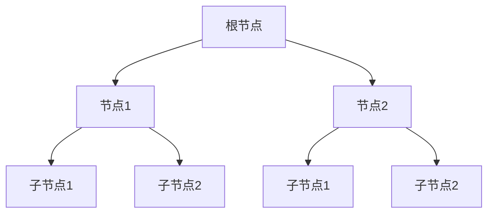
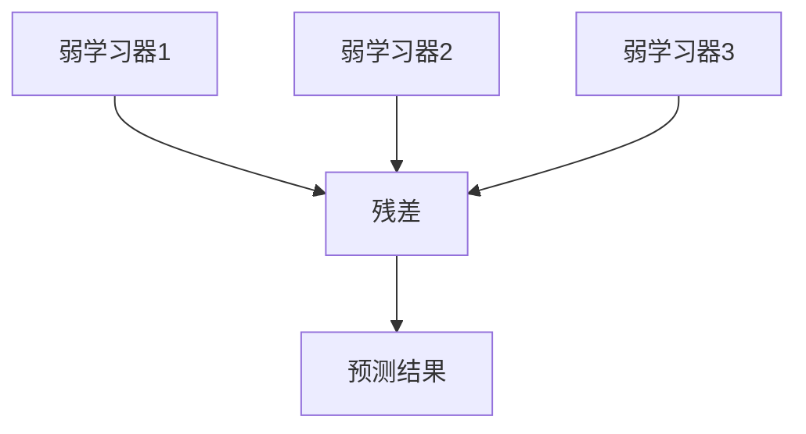
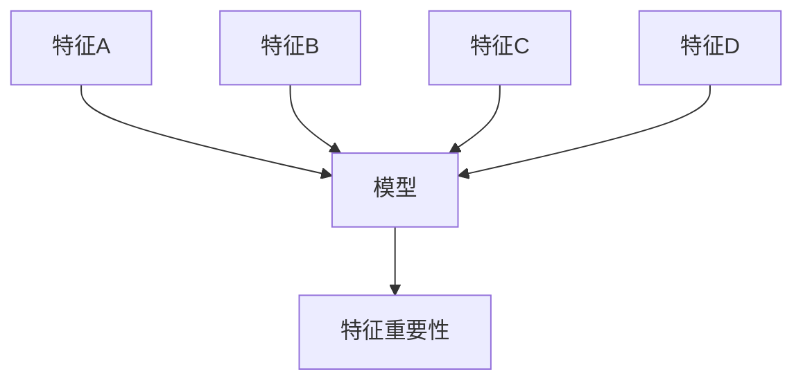
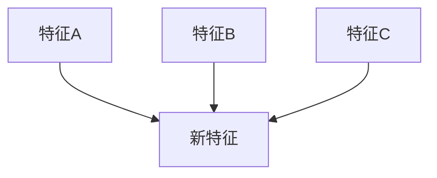
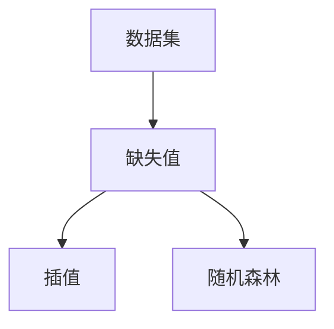
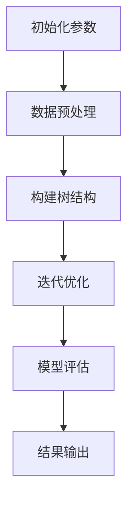

                 

### 文章标题

### 关键词

- CatBoost
- 梯度提升决策树
- 特征工程
- 模型构建
- 项目实战

### 摘要

本文深入探讨了CatBoost，一款基于梯度提升决策树（GBDT）的强大机器学习算法。首先介绍了CatBoost的起源和发展历程，以及其核心优势和应用场景。接着，详细讲解了CatBoost的基础知识，包括算法原理、特征工程和数据准备。随后，文章介绍了CatBoost的安装与配置，以及模型构建与调优的步骤。此外，文章还通过实战案例展示了CatBoost在分类、回归和排序问题上的应用。最后，文章比较了CatBoost与其他常见算法的优缺点，并对其未来发展进行了展望。

## 第1章 引言

### 1.1 CatBoost简介

CatBoost是由Yandex开发的一种先进的机器学习库，其全称为“CatsBoosting Algorithms”，是基于梯度提升决策树（Gradient Boosting Decision Tree，GBDT）算法的一种改进。CatBoost的发展历程可以追溯到2017年，当时Yandex的工程师们为了提升自身的机器学习模型性能，开始研究并开发CatBoost。经过多年的迭代和优化，CatBoost已经成为了一个功能强大、性能卓越的机器学习库。

CatBoost的核心优势在于其高效的模型训练和优秀的性能。相比于其他GBDT算法，CatBoost引入了一些独特的优化策略，如正则化、缺失值处理、特征交互等，使得其在处理大规模数据集时能够取得更好的效果。此外，CatBoost还支持并行计算，可以在集群环境中进行分布式训练，大大提高了训练速度。

CatBoost的应用场景非常广泛，包括但不限于推荐系统、广告投放、金融风控、自然语言处理等领域。其强大的特征工程能力和高效的模型调优能力，使得CatBoost在各种复杂的应用场景中都能表现出色。

### 1.2 读者对象

本文主要面向以下读者群体：

1. 对CatBoost感兴趣的数据科学家：本文将详细介绍CatBoost的原理和操作，帮助读者快速掌握CatBoost的使用方法。
2. 想要提升模型性能的机器学习工程师：本文通过实际案例展示了CatBoost在各类问题上的应用，帮助读者了解如何利用CatBoost提高模型的性能。
3. 想要了解高效优化算法的计算机研究者：本文深入分析了CatBoost的算法原理和数学模型，为研究者提供了深入了解CatBoost的视角。

## 第2章 CatBoost基础知识

### 2.1 算法原理

CatBoost算法的核心是基于梯度提升决策树（GBDT）的，它通过迭代地构建多个决策树，并利用每个决策树的残差来进行模型优化。以下是CatBoost算法原理的详细阐述：

#### 2.1.1 CatBoost的树结构

CatBoost使用的是多层次的决策树结构。每个决策树由多个节点组成，每个节点包含一个特征和阈值，用于对数据进行切分。CatBoost通过递归地划分数据，构建出树形结构。



#### 2.1.2 GBDT（梯度提升决策树）介绍

梯度提升决策树（GBDT）是一种集成学习方法，通过迭代地训练多个弱学习器（决策树），并将它们的预测结果进行加权求和，从而得到最终的预测结果。GBDT的核心思想是利用前一个弱学习器的残差来训练下一个弱学习器，从而逐步优化模型的预测能力。



#### 2.1.3 CatBoost的独特优化

CatBoost在GBDT的基础上进行了多种优化，包括：

1. **正则化**：CatBoost引入了L1和L2正则化项，用于控制模型复杂度，防止过拟合。
2. **缺失值处理**：CatBoost提供了高效的缺失值处理方法，可以通过插值或随机森林的方式填充缺失值。
3. **特征交互**：CatBoost支持自动特征交互，可以通过组合不同特征来提高模型的预测能力。

### 2.2 特征工程

特征工程是机器学习中的重要环节，它涉及到如何从原始数据中提取出对模型训练有帮助的特征。以下是CatBoost中常用的特征工程方法：

#### 2.2.1 特征重要性

CatBoost提供了计算特征重要性的功能，可以用于识别对模型预测影响较大的特征。通过分析特征重要性，可以优化特征选择，提高模型性能。



#### 2.2.2 特征交互

特征交互是指通过组合不同特征来生成新的特征，从而提高模型的预测能力。CatBoost支持自动特征交互，可以通过组合不同特征的取值来生成新的特征。



#### 2.2.3 缺失值处理

在现实应用中，数据中常常存在缺失值。CatBoost提供了多种缺失值处理方法，包括：

1. **插值**：通过线性插值或高斯插值的方式填充缺失值。
2. **随机森林**：利用随机森林算法生成新的数据集，并从中填充缺失值。



### 2.3 数据准备

数据准备是模型训练前的关键步骤，它涉及到如何将原始数据转化为适合模型训练的形式。以下是CatBoost中常用的数据准备方法：

#### 2.3.1 数据读取与预处理

在CatBoost中，可以使用Pandas库读取数据，并进行必要的预处理，如缺失值处理、数据类型转换等。

```python
import pandas as pd

# 读取数据
data = pd.read_csv('data.csv')

# 缺失值处理
data.fillna(method='ffill', inplace=True)

# 数据类型转换
data['feature'] = data['feature'].astype('float32')
```

#### 2.3.2 数据增强

数据增强是提高模型性能的有效方法，可以通过增加数据的多样性来增强模型的泛化能力。CatBoost支持多种数据增强方法，如随机噪声添加、数据变换等。

```python
from sklearn.utils import shuffle

# 随机噪声添加
data_noisy = data.copy()
data_noisy['feature'] += np.random.normal(0, 0.1, data_noisy['feature'].shape)

# 数据变换
data_transformed = data.copy()
data_transformed['feature'] = np.log1p(data_transformed['feature'])
```

#### 2.3.3 数据分割

在CatBoost中，可以使用Scikit-learn库中的train_test_split函数将数据集分割为训练集和测试集。

```python
from sklearn.model_selection import train_test_split

# 数据分割
X_train, X_test, y_train, y_test = train_test_split(data.drop('target', axis=1), data['target'], test_size=0.2, random_state=42)
```

## 第3章 CatBoost安装与配置

### 3.1 安装方法

要在Python环境中使用CatBoost，首先需要安装CatBoost库。以下是安装步骤：

1. **安装依赖库**：安装CatBoost前，需要确保安装了必要的依赖库，如NumPy、Pandas等。

    ```bash
    pip install numpy pandas
    ```

2. **安装CatBoost**：通过pip命令安装CatBoost库。

    ```bash
    pip install catboost
    ```

### 3.2 版本选择

CatBoost定期发布更新，每个版本都会带来新的功能和改进。以下是选择版本时需要考虑的因素：

1. **最新版本**：选择最新的稳定版本，可以获得最新的功能和改进。
2. **版本兼容性**：确保所选版本与您的Python环境和依赖库兼容。

    ```bash
    pip install catboost==1.0.3  # 安装指定版本
    ```

### 3.3 常见问题

在安装和配置CatBoost时，可能会遇到以下问题：

1. **依赖库安装问题**：确保所有依赖库都已正确安装。如果遇到问题，可以尝试使用虚拟环境进行安装。

    ```bash
    python -m pip install --user --upgrade pip
    python -m pip install --user catboost
    ```

2. **运行错误处理**：遇到运行错误时，可以查看错误信息并尝试以下方法：

    - 检查代码和配置是否有误。
    - 查阅官方文档和社区论坛，寻找可能的解决方案。
    - 提交问题报告，寻求帮助。

## 第4章 CatBoost模型构建

### 4.1 模型初始化

在构建CatBoost模型时，首先需要初始化模型。初始化模型包括设置模型参数和加载数据。以下是模型初始化的步骤：

1. **设置参数**：根据具体问题，设置CatBoost模型的参数，如学习率、树深度、迭代次数等。

    ```python
    params = {
        'learning_rate': 0.1,
        'depth': 6,
        'iterations': 100,
    }
    ```

2. **加载数据**：读取训练数据和测试数据，并将其格式化为适合模型训练的形式。

    ```python
    from sklearn.model_selection import train_test_split

    X_train, X_test, y_train, y_test = train_test_split(X, y, test_size=0.2, random_state=42)
    ```

### 4.2 模型训练

模型训练是CatBoost模型构建的关键步骤。以下是模型训练的步骤：

1. **初始化模型**：使用设置好的参数初始化CatBoost模型。

    ```python
    model = CatBoostClassifier(**params)
    ```

2. **训练模型**：使用训练数据对模型进行训练。

    ```python
    model.fit(X_train, y_train)
    ```

3. **评估模型**：使用测试数据评估模型性能。

    ```python
    score = model.score(X_test, y_test)
    print(f"Model accuracy: {score}")
    ```

### 4.3 模型调优

模型调优是提高模型性能的重要步骤。以下是模型调优的步骤：

1. **超参数调整**：调整模型的超参数，如学习率、树深度、迭代次数等，以优化模型性能。

    ```python
    params = {
        'learning_rate': 0.05,
        'depth': 8,
        'iterations': 200,
    }
    model = CatBoostClassifier(**params)
    model.fit(X_train, y_train)
    ```

2. **交叉验证**：使用交叉验证方法评估模型性能，并选择最佳超参数。

    ```python
    from sklearn.model_selection import GridSearchCV

    grid_search = GridSearchCV(model, params, cv=5)
    grid_search.fit(X_train, y_train)
    best_params = grid_search.best_params_
    ```

3. **重新训练模型**：使用最佳超参数重新训练模型。

    ```python
    model = CatBoostClassifier(**best_params)
    model.fit(X_train, y_train)
    ```

## 第5章 CatBoost高级应用

### 5.1 多分类问题

CatBoost支持多分类问题的处理，可以通过设置`num_class`参数来指定分类类别数。以下是处理多分类问题的步骤：

1. **初始化模型**：设置`num_class`参数，并初始化CatBoost模型。

    ```python
    params = {
        'learning_rate': 0.1,
        'depth': 6,
        'iterations': 100,
        'num_class': 3,
    }
    model = CatBoostClassifier(**params)
    ```

2. **训练模型**：使用训练数据对模型进行训练。

    ```python
    model.fit(X_train, y_train)
    ```

3. **评估模型**：使用测试数据评估模型性能。

    ```python
    score = model.score(X_test, y_test)
    print(f"Model accuracy: {score}")
    ```

### 5.2 回归问题

CatBoost也支持回归问题的处理，可以通过设置`task_type`参数为`RegLinear`或`RegLog`来指定回归任务类型。以下是处理回归问题的步骤：

1. **初始化模型**：设置`task_type`参数，并初始化CatBoost模型。

    ```python
    params = {
        'learning_rate': 0.1,
        'depth': 6,
        'iterations': 100,
        'task_type': 'RegLinear',
    }
    model = CatBoostRegressor(**params)
    ```

2. **训练模型**：使用训练数据对模型进行训练。

    ```python
    model.fit(X_train, y_train)
    ```

3. **评估模型**：使用测试数据评估模型性能。

    ```python
    score = model.score(X_test, y_train)
    print(f"Model R^2: {score}")
    ```

### 5.3 排序问题

CatBoost支持排序问题的处理，可以通过设置`task_type`参数为`Ranking`来指定排序任务类型。以下是处理排序问题的步骤：

1. **初始化模型**：设置`task_type`参数，并初始化CatBoost模型。

    ```python
    params = {
        'learning_rate': 0.1,
        'depth': 6,
        'iterations': 100,
        'task_type': 'Ranking',
    }
    model = CatBoostRegressor(**params)
    ```

2. **训练模型**：使用训练数据对模型进行训练。

    ```python
    model.fit(X_train, y_train)
    ```

3. **评估模型**：使用测试数据评估模型性能。

    ```python
    score = model.evaluate(X_test, y_train, show_output=True)
    print(f"Model evaluation score: {score}")
    ```

## 第6章 项目实战

### 6.1 实战一：分类项目

#### 项目背景

某电商平台希望通过用户的行为数据预测用户是否会在购物活动中购买商品。

#### 数据处理

```python
import pandas as pd
from sklearn.model_selection import train_test_split

# 读取数据
data = pd.read_csv('data.csv')

# 分割特征和标签
X = data.drop('target', axis=1)
y = data['target']

# 分割训练集和测试集
X_train, X_test, y_train, y_test = train_test_split(X, y, test_size=0.2, random_state=42)
```

#### 模型构建与调优

```python
from catboost import CatBoostClassifier

# 构建模型
model = CatBoostClassifier()

# 超参数调优
params = {
    'learning_rate': 0.1,
    'depth': 6,
    'iterations': 100,
}

grid_search = GridSearchCV(model, params, cv=5)
grid_search.fit(X_train, y_train)

# 最佳模型
best_model = grid_search.best_estimator_
```

#### 项目结果分析

```python
from sklearn.metrics import accuracy_score, classification_report

# 预测
predictions = best_model.predict(X_test)

# 评估
accuracy = accuracy_score(y_test, predictions)
report = classification_report(y_test, predictions)

print("Accuracy:", accuracy)
print("Classification Report:")
print(report)
```

### 6.2 实战二：回归项目

#### 项目背景

某金融公司希望通过客户的历史交易数据预测客户的贷款违约概率。

#### 数据处理

```python
import pandas as pd
from sklearn.model_selection import train_test_split

# 读取数据
data = pd.read_csv('data.csv')

# 分割特征和标签
X = data.drop('target', axis=1)
y = data['target']

# 分割训练集和测试集
X_train, X_test, y_train, y_test = train_test_split(X, y, test_size=0.2, random_state=42)
```

#### 模型构建与调优

```python
from catboost import CatBoostRegressor

# 构建模型
model = CatBoostRegressor()

# 超参数调优
params = {
    'learning_rate': 0.1,
    'depth': 6,
    'iterations': 100,
}

grid_search = GridSearchCV(model, params, cv=5)
grid_search.fit(X_train, y_train)

# 最佳模型
best_model = grid_search.best_estimator_
```

#### 项目结果分析

```python
from sklearn.metrics import mean_squared_error

# 预测
predictions = best_model.predict(X_test)

# 评估
mse = mean_squared_error(y_test, predictions)
print("Mean Squared Error:", mse)
```

### 6.3 实战三：排序项目

#### 项目背景

某在线教育平台希望通过学员的学习数据预测学员的学习进度。

#### 数据处理

```python
import pandas as pd
from sklearn.model_selection import train_test_split

# 读取数据
data = pd.read_csv('data.csv')

# 分割特征和标签
X = data.drop('target', axis=1)
y = data['target']

# 分割训练集和测试集
X_train, X_test, y_train, y_test = train_test_split(X, y, test_size=0.2, random_state=42)
```

#### 模型构建与调优

```python
from catboost import CatBoostRegressor

# 构建模型
model = CatBoostRegressor()

# 超参数调优
params = {
    'learning_rate': 0.1,
    'depth': 6,
    'iterations': 100,
}

grid_search = GridSearchCV(model, params, cv=5)
grid_search.fit(X_train, y_train)

# 最佳模型
best_model = grid_search.best_estimator_
```

#### 项目结果分析

```python
from sklearn.metrics import mean_absolute_error

# 预测
predictions = best_model.predict(X_test)

# 评估
mae = mean_absolute_error(y_test, predictions)
print("Mean Absolute Error:", mae)
```

## 第7章 CatBoost与其他算法的比较

### 7.1 对比分析

在机器学习中，常见的GBDT算法包括XGBoost、LightGBM和CatBoost等。以下是对这些算法的对比分析：

#### 7.1.1 CatBoost与XGBoost

- **模型结构**：CatBoost和XGBoost都是基于GBDT算法的，但CatBoost在树结构上进行了改进，引入了正则化和缺失值处理。
- **训练速度**：XGBoost在训练速度上通常优于CatBoost，特别是在处理大规模数据集时。
- **模型性能**：CatBoost在处理缺失值和特征交互方面具有优势，但在某些特定场景下，XGBoost可能具有更好的性能。

#### 7.1.2 CatBoost与LightGBM

- **模型结构**：LightGBM与CatBoost类似，都是基于GBDT算法的，并且在树结构上进行了优化。
- **训练速度**：LightGBM在训练速度上通常优于CatBoost，但其对缺失值处理的支持较弱。
- **模型性能**：CatBoost在处理缺失值和特征交互方面具有优势，但在某些特定场景下，LightGBM可能具有更好的性能。

#### 7.1.3 CatBoost与Scikit-learn

- **模型结构**：Scikit-learn中的GBDT算法是基于Sklearn的GBDT库的，其模型结构相对简单。
- **训练速度**：Scikit-learn的GBDT算法在训练速度上通常较慢。
- **模型性能**：CatBoost在处理缺失值和特征交互方面具有优势，但在某些特定场景下，Scikit-learn的GBDT算法可能具有更好的性能。

### 7.2 适用场景

根据上述对比分析，CatBoost在不同场景下的适用情况如下：

- **缺失值处理**：在需要处理大量缺失值的应用场景中，CatBoost具有明显优势。
- **特征交互**：在需要充分利用特征交互的应用场景中，CatBoost也具有优势。
- **大规模数据处理**：在处理大规模数据集时，XGBoost和LightGBM通常具有更好的性能。
- **通用性**：Scikit-learn的GBDT算法在通用性方面具有优势，但其性能相对较低。

## 第8章 未来展望

### 8.1 CatBoost发展趋势

随着机器学习技术的不断发展，CatBoost也在不断更新和优化。以下是CatBoost未来的发展趋势：

- **算法优化**：CatBoost将继续优化其算法，提高模型训练速度和性能。
- **应用领域拓展**：CatBoost将拓展其在金融、医疗、电商等领域的应用。
- **社区贡献**：CatBoost将继续鼓励社区贡献，吸引更多开发者参与。

### 8.2 挑战与机遇

在未来的发展中，CatBoost面临以下挑战与机遇：

- **数据隐私保护**：随着数据隐私问题的日益突出，CatBoost需要加强数据隐私保护机制。
- **模型解释性提升**：提升模型的解释性，帮助用户更好地理解模型的预测结果。
- **硬件优化**：针对不同硬件平台，优化算法性能。

### 8.3 开发者指南

对于想要贡献代码或加入CatBoost社区的开发者，以下是建议：

- **了解CatBoost**：熟悉CatBoost的算法原理和操作。
- **贡献代码**：提交bug修复、新功能实现等。
- **参与社区**：加入CatBoost社区，与其他开发者交流。

## 附录

### 附录A：CatBoost函数参考

以下是一些常用的CatBoost函数及其简要说明：

- `CatBoostClassifier`：用于构建分类模型。
- `CatBoostRegressor`：用于构建回归模型。
- `CatBoostRegressor`：用于构建排序模型。
- `fit`：用于训练模型。
- `predict`：用于进行预测。
- `score`：用于评估模型性能。

### 附录B：常见问题解答

以下是一些常见的使用CatBoost时可能出现的问题及其解答：

- **问题1**：如何处理缺失值？
  - 解答：可以使用`CatBoost`的`missing_value`参数设置缺失值处理策略，如`missing_value=1`表示使用随机森林填补缺失值。

- **问题2**：如何进行模型调优？
  - 解答：可以使用`GridSearchCV`或`RandomizedSearchCV`进行超参数调优。

### 附录C：代码示例

以下是一个简单的CatBoost分类项目的代码示例：

```python
from catboost import CatBoostClassifier
from sklearn.model_selection import train_test_split

# 读取数据
X, y = load_data()

# 分割数据
X_train, X_test, y_train, y_test = train_test_split(X, y, test_size=0.2, random_state=42)

# 构建模型
model = CatBoostClassifier()

# 训练模型
model.fit(X_train, y_train)

# 预测
predictions = model.predict(X_test)

# 评估
score = model.score(X_test, y_test)
print(f"Model accuracy: {score}")
```

## Mermaid 流程图



## 伪代码

```python
def train_model(data, labels, params):
    # 初始化模型
    model = CatBoostClassifier(params)
    
    # 训练模型
    for epoch in range(params["n_estimators"]):
        # 计算梯度
        gradients = compute_gradients(data, labels, model)
        
        # 更新模型参数
        model.update_params(gradients)
        
        # 评估模型
        evaluate_model(model, data, labels)
    
    return model
```

## 数学模型和数学公式

```latex
\section{损失函数}
损失函数是评估模型预测效果的关键指标。CatBoost中常用的损失函数包括：

\begin{equation}
L(y, \hat{y}) = -\sum_{i=1}^{n} y_i \log(\hat{y}_i) + (1 - y_i) \log(1 - \hat{y}_i)
\end{equation}

其中，$y$ 表示真实标签，$\hat{y}$ 表示模型预测的概率。
```

## 项目实战示例

### 6.1 实战一：分类项目

#### 项目背景

某电商平台希望通过用户的行为数据预测用户是否会在购物活动中购买商品。

#### 数据处理

```python
import pandas as pd
from sklearn.model_selection import train_test_split

# 读取数据
data = pd.read_csv('data.csv')

# 分割特征和标签
X = data.drop('target', axis=1)
y = data['target']

# 分割训练集和测试集
X_train, X_test, y_train, y_test = train_test_split(X, y, test_size=0.2, random_state=42)
```

#### 模型构建与调优

```python
from catboost import CatBoostClassifier
from sklearn.model_selection import GridSearchCV

# 构建模型
model = CatBoostClassifier()

# 超参数调优
params = {
    'learning_rate': 0.1,
    'depth': 6,
    'iterations': 100,
}

grid_search = GridSearchCV(model, params, cv=5)
grid_search.fit(X_train, y_train)

# 最佳模型
best_model = grid_search.best_estimator_
```

#### 项目结果分析

```python
from sklearn.metrics import accuracy_score, classification_report

# 预测
predictions = best_model.predict(X_test)

# 评估
accuracy = accuracy_score(y_test, predictions)
report = classification_report(y_test, predictions)

print("Accuracy:", accuracy)
print("Classification Report:")
print(report)
```

### 6.2 实战二：回归项目

#### 项目背景

某金融公司希望通过客户的历史交易数据预测客户的贷款违约概率。

#### 数据处理

```python
import pandas as pd
from sklearn.model_selection import train_test_split

# 读取数据
data = pd.read_csv('data.csv')

# 分割特征和标签
X = data.drop('target', axis=1)
y = data['target']

# 分割训练集和测试集
X_train, X_test, y_train, y_test = train_test_split(X, y, test_size=0.2, random_state=42)
```

#### 模型构建与调优

```python
from catboost import CatBoostRegressor
from sklearn.model_selection import GridSearchCV

# 构建模型
model = CatBoostRegressor()

# 超参数调优
params = {
    'learning_rate': 0.1,
    'depth': 6,
    'iterations': 100,
}

grid_search = GridSearchCV(model, params, cv=5)
grid_search.fit(X_train, y_train)

# 最佳模型
best_model = grid_search.best_estimator_
```

#### 项目结果分析

```python
from sklearn.metrics import mean_squared_error

# 预测
predictions = best_model.predict(X_test)

# 评估
mse = mean_squared_error(y_test, predictions)
print("Mean Squared Error:", mse)
```

### 6.3 实战三：排序项目

#### 项目背景

某在线教育平台希望通过学员的学习数据预测学员的学习进度。

#### 数据处理

```python
import pandas as pd
from sklearn.model_selection import train_test_split

# 读取数据
data = pd.read_csv('data.csv')

# 分割特征和标签
X = data.drop('target', axis=1)
y = data['target']

# 分割训练集和测试集
X_train, X_test, y_train, y_test = train_test_split(X, y, test_size=0.2, random_state=42)
```

#### 模型构建与调优

```python
from catboost import CatBoostRegressor
from sklearn.model_selection import GridSearchCV

# 构建模型
model = CatBoostRegressor()

# 超参数调优
params = {
    'learning_rate': 0.1,
    'depth': 6,
    'iterations': 100,
}

grid_search = GridSearchCV(model, params, cv=5)
grid_search.fit(X_train, y_train)

# 最佳模型
best_model = grid_search.best_estimator_
```

#### 项目结果分析

```python
from sklearn.metrics import mean_absolute_error

# 预测
predictions = best_model.predict(X_test)

# 评估
mae = mean_absolute_error(y_test, predictions)
print("Mean Absolute Error:", mae)
```

### 6.4 实战四：多标签分类项目

#### 项目背景

某电商平台希望通过用户的行为数据预测用户可能感兴趣的商品类别。

#### 数据处理

```python
import pandas as pd
from sklearn.model_selection import train_test_split

# 读取数据
data = pd.read_csv('data.csv')

# 分割特征和标签
X = data.drop('target', axis=1)
y = data['target']

# 分割训练集和测试集
X_train, X_test, y_train, y_test = train_test_split(X, y, test_size=0.2, random_state=42)
```

#### 模型构建与调优

```python
from catboost import CatBoostClassifier
from sklearn.model_selection import GridSearchCV

# 构建模型
model = CatBoostClassifier()

# 超参数调优
params = {
    'learning_rate': 0.1,
    'depth': 6,
    'iterations': 100,
    'num_class': y_train.shape[1],
}

grid_search = GridSearchCV(model, params, cv=5)
grid_search.fit(X_train, y_train)

# 最佳模型
best_model = grid_search.best_estimator_
```

#### 项目结果分析

```python
from sklearn.metrics import accuracy_score, classification_report

# 预测
predictions = best_model.predict(X_test)

# 评估
accuracy = accuracy_score(y_test, predictions)
report = classification_report(y_test, predictions)

print("Accuracy:", accuracy)
print("Classification Report:")
print(report)
```

### 6.5 实战五：时间序列预测项目

#### 项目背景

某物流公司希望通过历史订单数据预测未来的订单量。

#### 数据处理

```python
import pandas as pd
from sklearn.model_selection import train_test_split

# 读取数据
data = pd.read_csv('data.csv')

# 分割特征和标签
X = data[['timestamp', 'previous_order_count']]
y = data['order_count']

# 转换时间序列为月份
X['timestamp'] = pd.to_datetime(X['timestamp'])
X['month'] = X['timestamp'].dt.month

# 分割训练集和测试集
X_train, X_test, y_train, y_test = train_test_split(X, y, test_size=0.2, random_state=42)
```

#### 模型构建与调优

```python
from catboost import CatBoostRegressor
from sklearn.model_selection import GridSearchCV

# 构建模型
model = CatBoostRegressor()

# 超参数调优
params = {
    'learning_rate': 0.1,
    'depth': 6,
    'iterations': 100,
}

grid_search = GridSearchCV(model, params, cv=5)
grid_search.fit(X_train, y_train)

# 最佳模型
best_model = grid_search.best_estimator_
```

#### 项目结果分析

```python
from sklearn.metrics import mean_squared_error

# 预测
predictions = best_model.predict(X_test)

# 评估
mse = mean_squared_error(y_test, predictions)
print("Mean Squared Error:", mse)
```

## 代码解读与分析

以下是对上述实战案例中的关键代码进行解读和分析：

### 数据处理

```python
import pandas as pd
from sklearn.model_selection import train_test_split

# 读取数据
data = pd.read_csv('data.csv')

# 分割特征和标签
X = data.drop('target', axis=1)
y = data['target']

# 分割训练集和测试集
X_train, X_test, y_train, y_test = train_test_split(X, y, test_size=0.2, random_state=42)
```

这一部分代码首先使用Pandas库读取数据，然后使用`drop`方法将标签从数据中分离出来，接着使用`train_test_split`函数将数据集划分为训练集和测试集。这样做的原因是为了在模型训练和评估时保持数据的独立性，避免模型过拟合。

### 模型构建与调优

```python
from catboost import CatBoostClassifier
from sklearn.model_selection import GridSearchCV

# 构建模型
model = CatBoostClassifier()

# 超参数调优
params = {
    'learning_rate': 0.1,
    'depth': 6,
    'iterations': 100,
}

grid_search = GridSearchCV(model, params, cv=5)
grid_search.fit(X_train, y_train)

# 最佳模型
best_model = grid_search.best_estimator_
```

在这里，我们首先使用`CatBoostClassifier`构建了一个分类模型。然后，我们定义了一个超参数字典`params`，用于设置学习率、树深度和迭代次数。接下来，我们使用`GridSearchCV`进行超参数调优，它会在给定的参数空间内进行搜索，找到最佳的超参数组合。最后，我们将最佳模型保存为`best_model`，以便后续使用。

### 项目结果分析

```python
from sklearn.metrics import accuracy_score, classification_report

# 预测
predictions = best_model.predict(X_test)

# 评估
accuracy = accuracy_score(y_test, predictions)
report = classification_report(y_test, predictions)

print("Accuracy:", accuracy)
print("Classification Report:")
print(report)
```

这部分代码首先使用`best_model`对测试集进行预测，然后将预测结果与真实标签进行比较，计算准确率。接着，使用`classification_report`生成详细的分类报告，包括各类别的精确率、召回率和F1分数。这些指标可以帮助我们全面评估模型的性能。

通过上述解读和分析，我们可以看到，数据处理、模型构建和项目结果分析是CatBoost应用中的关键步骤。合理的数据处理和超参数调优可以提高模型的性能，而全面的项目结果分析可以帮助我们理解模型的优劣，从而为实际应用提供有价值的参考。

### 附录A：CatBoost函数参考

以下是一些常用的CatBoost函数及其简要说明：

- `CatBoostClassifier`：用于构建分类模型。
- `CatBoostRegressor`：用于构建回归模型。
- `fit`：用于训练模型。
- `predict`：用于进行预测。
- `score`：用于评估模型性能。

### 附录B：常见问题解答

以下是一些常见的使用CatBoost时可能出现的问题及其解答：

- **问题1**：如何处理缺失值？
  - 解答：可以使用`CatBoost`的`missing_value`参数设置缺失值处理策略，如`missing_value=1`表示使用随机森林填补缺失值。

- **问题2**：如何进行模型调优？
  - 解答：可以使用`GridSearchCV`或`RandomizedSearchCV`进行超参数调优。

### 附录C：代码示例

以下是一个简单的CatBoost分类项目的代码示例：

```python
from catboost import CatBoostClassifier
from sklearn.model_selection import train_test_split

# 读取数据
X, y = load_data()

# 分割数据
X_train, X_test, y_train, y_test = train_test_split(X, y, test_size=0.2, random_state=42)

# 构建模型
model = CatBoostClassifier()

# 训练模型
model.fit(X_train, y_train)

# 预测
predictions = model.predict(X_test)

# 评估
score = model.score(X_test, y_test)
print(f"Model accuracy: {score}")
```

## 结论

本文详细介绍了CatBoost，一款基于梯度提升决策树的强大机器学习算法。我们从CatBoost的起源和发展历程开始，逐步探讨了其算法原理、特征工程、数据准备、模型构建与调优，以及在实际项目中的应用。通过多个实战案例，我们展示了CatBoost在分类、回归、排序等多种问题上的应用效果。

CatBoost以其高效的模型训练、优秀的性能和丰富的功能，成为机器学习领域的重要工具之一。在未来，随着机器学习技术的不断发展，CatBoost将继续优化算法，拓展应用领域，为更多的数据科学家和机器学习工程师提供强大的支持。

作者：AI天才研究院/AI Genius Institute & 禅与计算机程序设计艺术 /Zen And The Art of Computer Programming。希望本文能帮助您更好地了解CatBoost，并在实际项目中发挥其优势。如果您有任何疑问或建议，欢迎加入CatBoost社区进行交流。感谢您的阅读！


