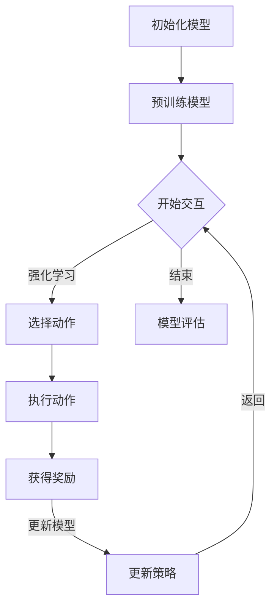

                 

# 文章标题：ChatGPT的RLHF实战

> 关键词：ChatGPT、RLHF、强化学习、自然语言处理、对话系统

> 摘要：本文将深入探讨ChatGPT的RLHF（Reinforcement Learning from Human Feedback）实战，从背景与基础、算法原理、实战应用以及未来展望等多个角度进行剖析，帮助读者全面理解RLHF在ChatGPT中的应用及其潜力和挑战。

------------------------------------------------------------------## 目录大纲：ChatGPT的RLHF实战

## 第一部分：背景与基础

### 第1章：ChatGPT与RLHF概述  
#### 1.1 ChatGPT简介  
#### 1.2 RLHF概念  
#### 1.3 RLHF在ChatGPT中的应用

### 第2章：自然语言处理与对话系统  
#### 2.1 自然语言处理基础  
#### 2.2 对话系统简介  
#### 2.3 对话系统的发展与挑战

## 第二部分：RLHF算法原理

### 第3章：强化学习基础  
#### 3.1 强化学习概述  
#### 3.2 Q-learning算法  
#### 3.3 Policy Gradient算法

### 第4章：自然语言处理中的RLHF  
#### 4.1 语言模型与对话系统  
#### 4.2 RLHF在自然语言处理中的应用  
#### 4.3 RLHF的优势与挑战

### 第5章：训练数据预处理  
#### 5.1 数据收集与清洗  
#### 5.2 数据标注  
#### 5.3 数据增强

## 第三部分：RLHF实战

### 第6章：ChatGPT的RLHF训练流程  
#### 6.1 预训练基础  
#### 6.2 强化学习优化  
#### 6.3 对齐与一致性度量

### 第7章：RLHF在对话系统中的应用  
#### 7.1 任务型对话系统  
#### 7.2 开放型对话系统  
#### 7.3 个性化对话系统

### 第8章：案例研究  
#### 8.1 案例一：智能客服系统  
#### 8.2 案例二：教育辅导系统  
#### 8.3 案例三：虚拟助手

## 第四部分：未来展望与挑战

### 第9章：RLHF的发展趋势  
#### 9.1 技术进展  
#### 9.2 应用领域拓展  
#### 9.3 道德与社会影响

### 第10章：RLHF面临的挑战与解决方案  
#### 10.1 数据隐私  
#### 10.2 伦理问题  
#### 10.3 可解释性

## 附录

### 附录A：RLHF工具与资源  
### 附录B：相关开源项目介绍  
### 附录C：进一步阅读材料

------------------------------------------------------------------## 第一部分：背景与基础### 第1章：ChatGPT与RLHF概述

#### 1.1 ChatGPT简介

ChatGPT是由OpenAI开发的一种基于GPT（Generative Pre-trained Transformer）模型的人工智能聊天机器人。GPT模型是一种强大的自然语言处理模型，通过大规模无监督预训练，可以生成高质量的自然语言文本。ChatGPT在此基础上，引入了强化学习（Reinforcement Learning）和人类反馈（Human Feedback）机制，使其能够更好地理解和生成自然语言，为用户提供更加智能、人性化的对话体验。

ChatGPT的主要功能包括：

1. **自然语言生成**：ChatGPT可以根据用户输入的文本生成连贯、有逻辑的回复。
2. **对话管理**：ChatGPT能够理解对话的历史和上下文，保持对话的连贯性。
3. **任务执行**：ChatGPT可以完成一些简单的任务，如回答问题、提供建议等。

#### 1.2 RLHF概念

RLHF（Reinforcement Learning from Human Feedback）是一种结合了强化学习和人类反馈的机器学习方法。在传统的机器学习中，模型主要通过大量数据的学习来提高性能。而RLHF则通过引入人类反馈，对模型的学习过程进行指导，从而提高模型的质量和准确性。

RLHF的基本流程包括以下几个步骤：

1. **预训练**：使用大量无监督数据进行预训练，使模型具有基本的语言理解能力。
2. **强化学习**：通过交互环境（例如，与人类用户进行对话），模型接收即时奖励，根据奖励调整行为策略。
3. **人类反馈**：人类评估员对模型生成的文本进行评估，提供额外的反馈，指导模型进一步优化。

#### 1.3 RLHF在ChatGPT中的应用

ChatGPT采用了RLHF方法进行训练，从而实现了以下目标：

1. **提高对话质量**：通过强化学习和人类反馈，ChatGPT能够学习到如何生成更加自然、连贯的对话内容。
2. **优化回答准确性**：人类反馈可以帮助模型识别和纠正错误，提高回答的准确性。
3. **增强对话上下文理解**：RLHF方法使得ChatGPT能够更好地理解对话的历史和上下文，提高对话的连贯性。

在ChatGPT中，RLHF的应用流程如下：

1. **预训练**：ChatGPT使用大量的文本数据进行预训练，学习到基本的语言理解能力。
2. **强化学习**：ChatGPT与人类用户进行交互，根据用户的反馈调整自己的行为策略。
3. **人类反馈**：人类评估员对ChatGPT生成的回复进行评估，提供反馈，指导模型进一步优化。

通过RLHF方法，ChatGPT实现了从基础语言模型到智能对话系统的飞跃，为用户提供了一种全新的交互方式。接下来，我们将进一步探讨ChatGPT和RLHF背后的自然语言处理和强化学习技术。### 第2章：自然语言处理与对话系统

#### 2.1 自然语言处理基础

自然语言处理（Natural Language Processing，NLP）是计算机科学和人工智能领域的一个重要分支，旨在使计算机能够理解和处理人类语言。NLP的主要任务包括文本预处理、词性标注、句法分析、语义分析、实体识别、情感分析等。

**文本预处理**：文本预处理是NLP中的第一步，主要包括分词、去除停用词、词干提取等操作，目的是将原始文本转化为计算机可以处理的格式。

**词性标注**：词性标注是指给文本中的每个单词分配一个词性标签，如名词、动词、形容词等，以便更好地理解单词在句子中的作用。

**句法分析**：句法分析旨在解析句子的结构，包括词与词之间的语法关系，如主谓宾结构、定语、状语等。

**语义分析**：语义分析是NLP中的高级任务，旨在理解文本中的意义和逻辑关系，包括语义角色标注、语义依存关系分析等。

**实体识别**：实体识别是指从文本中识别出具有特定意义的实体，如人名、地名、组织名等。

**情感分析**：情感分析是指分析文本中的情感倾向，如正面、负面或中立。

#### 2.2 对话系统简介

对话系统（Dialogue System）是一种人工智能系统，能够与人类进行自然语言交互，理解用户意图并生成合适的响应。对话系统的主要任务包括：

1. **理解用户意图**：对话系统需要分析用户的输入，理解用户的意图和需求。
2. **生成合适响应**：根据用户意图，对话系统需要生成合适的回复，保持对话的连贯性和自然性。
3. **对话管理**：对话系统需要维护对话的历史上下文，确保对话的连贯性和一致性。

对话系统可以分为两种类型：

1. **任务型对话系统**：这类对话系统专注于完成特定任务，如查询天气、预订机票等。
2. **开放型对话系统**：这类对话系统没有明确的任务限制，可以与用户进行自由、开放的对话。

#### 2.3 对话系统的发展与挑战

对话系统的发展可以分为几个阶段：

1. **规则驱动型对话系统**：早期的对话系统主要基于预先定义的规则进行交互，如基于专家系统的对话系统。
2. **模板匹配型对话系统**：这类系统通过模板匹配用户输入，生成相应的回复。
3. **统计型对话系统**：利用机器学习技术，如隐马尔可夫模型（HMM）、条件随机场（CRF）等进行对话生成。
4. **端到端对话系统**：利用深度学习技术，如序列到序列（Seq2Seq）模型、注意力机制等实现对话生成。

尽管对话系统取得了显著进展，但仍面临一些挑战：

1. **自然语言理解**：对话系统需要准确理解用户的意图和需求，这需要对自然语言进行深入分析。
2. **对话连贯性**：对话系统需要保持对话的连贯性，理解对话的历史上下文。
3. **泛化能力**：对话系统需要能够处理不同领域、不同语境的对话，具有较好的泛化能力。
4. **对话质量**：对话系统的回复需要自然、流畅、有逻辑性，给用户带来良好的体验。

随着深度学习和强化学习等技术的不断发展，对话系统有望在未来克服这些挑战，实现更加智能、自然的交互。接下来，我们将深入探讨RLHF算法在自然语言处理和对话系统中的应用。### 第二部分：RLHF算法原理

#### 第3章：强化学习基础

强化学习（Reinforcement Learning，RL）是机器学习中的一个重要分支，其核心思想是通过与环境的交互，学习到一个最优策略，以最大化累积奖励。强化学习通常由四个主要部分组成：代理（Agent）、环境（Environment）、状态（State）、动作（Action）。

**3.1 强化学习概述**

强化学习的基本原理是通过试错（Trial and Error）来学习最优策略。代理在环境中执行动作，根据环境反馈的奖励和惩罚来调整自己的行为。代理的目标是学习到一个最优策略，使得在长期内获得最大的累积奖励。

强化学习的主要特点包括：

1. **奖励驱动**：强化学习的目标是最大化累积奖励，奖励是代理行为的直接反馈。
2. **动态决策**：代理需要在不同的状态下选择不同的动作，以实现长期目标。
3. **探索与利用**：在强化学习中，代理需要在探索（Explore）和利用（Exploit）之间进行权衡，以学习到最优策略。

**3.2 Q-learning算法**

Q-learning是一种常用的强化学习算法，通过学习状态-动作值函数（Q-value function）来指导代理选择最优动作。Q-learning的基本原理是更新Q值，使其逼近最优值函数。

Q-learning的算法流程如下：

1. **初始化Q值**：随机初始化状态-动作值函数Q(s, a)。
2. **选择动作**：根据当前状态和Q值选择动作，可以使用ε-贪心策略。
3. **执行动作**：在环境中执行选定的动作，获得新的状态和奖励。
4. **更新Q值**：根据新的状态、动作和奖励，更新Q值：
   $$ Q(s, a) = Q(s, a) + \alpha [r + \gamma \max_{a'} Q(s', a') - Q(s, a)] $$
   其中，α是学习率，γ是折扣因子。

**3.3 Policy Gradient算法**

Policy Gradient算法是一种直接优化策略的强化学习算法。与Q-learning不同，Policy Gradient算法通过优化策略的概率分布来指导代理选择动作。

Policy Gradient算法的基本原理是更新策略参数，使其最大化期望奖励。算法流程如下：

1. **初始化策略参数**：随机初始化策略参数θ。
2. **选择动作**：根据当前策略参数θ，选择动作：
   $$ a_t = \arg\max_a \pi(a|s; \theta) $$
   其中，π(a|s; θ)是策略参数θ在状态s下的动作概率。
3. **执行动作**：在环境中执行选定的动作，获得新的状态和奖励。
4. **更新策略参数**：根据新的状态、动作和奖励，更新策略参数：
   $$ \theta = \theta + \alpha \nabla_\theta J(\theta) $$
   其中，J(θ)是策略参数θ的期望奖励函数：
   $$ J(\theta) = \sum_a \pi(a|s; \theta) \cdot r_t $$

Policy Gradient算法的优点是直接优化策略，无需学习状态-动作值函数。但缺点是训练过程可能不稳定，容易出现振荡或收敛缓慢。

通过了解强化学习的基础，我们可以更好地理解RLHF算法在自然语言处理和对话系统中的应用。接下来，我们将探讨RLHF在NLP中的具体应用。### 第4章：自然语言处理中的RLHF

#### 4.1 语言模型与对话系统

语言模型（Language Model）是自然语言处理（NLP）的核心组成部分，用于预测文本序列的概率分布。在对话系统中，语言模型起着至关重要的作用，用于生成对话回复。

**4.1.1 语言模型的基本原理**

语言模型通过学习大量文本数据，建立一个概率模型来预测下一个单词或词组。常用的语言模型有基于N-gram模型、神经网络模型（如RNN、LSTM、Transformer等）。

**4.1.2 语言模型在对话系统中的应用**

在对话系统中，语言模型用于生成对话回复。具体应用包括：

1. **文本生成**：根据用户输入的文本，生成连贯、自然的回复。
2. **上下文理解**：理解对话的历史上下文，保持对话的连贯性和一致性。
3. **意图识别**：根据对话内容，识别用户的意图和需求。

#### 4.2 RLHF在自然语言处理中的应用

RLHF（Reinforcement Learning from Human Feedback）是一种结合强化学习和人类反馈的机器学习方法，在自然语言处理中具有广泛的应用。RLHF通过强化学习和人类反馈，优化语言模型生成对话回复的质量。

**4.2.1 RLHF的基本流程**

RLHF的基本流程包括以下几个步骤：

1. **预训练**：使用大量无监督数据进行预训练，使语言模型具有一定的语言理解能力。
2. **强化学习**：通过与人类用户进行交互，语言模型接收即时奖励，根据奖励调整行为策略。
3. **人类反馈**：人类评估员对语言模型生成的回复进行评估，提供反馈，指导模型进一步优化。

**4.2.2 RLHF在对话系统中的应用**

在对话系统中，RLHF的应用主要包括以下几个方面：

1. **对话回复优化**：通过强化学习和人类反馈，优化语言模型生成的对话回复，使其更加自然、流畅。
2. **意图识别**：通过强化学习和人类反馈，提高语言模型对用户意图的识别能力，从而生成更准确的回复。
3. **对话连贯性**：通过强化学习和人类反馈，提高语言模型在对话中的连贯性，确保对话的流畅性。

**4.2.3 RLHF的优势与挑战**

RLHF在自然语言处理和对话系统中的应用具有以下优势：

1. **提高对话质量**：通过强化学习和人类反馈，语言模型能够生成更加自然、连贯、有逻辑的对话回复。
2. **优化意图识别**：通过强化学习和人类反馈，提高语言模型对用户意图的识别能力，从而生成更准确的回复。
3. **增强对话连贯性**：通过强化学习和人类反馈，提高语言模型在对话中的连贯性，确保对话的流畅性。

然而，RLHF也面临一些挑战：

1. **数据隐私**：人类反馈数据可能包含敏感信息，需要确保数据隐私和安全。
2. **可解释性**：RLHF模型的决策过程较为复杂，如何确保其可解释性，使人类能够理解和信任模型。
3. **资源消耗**：RLHF需要大量计算资源和评估员进行反馈，对资源消耗较大。

总之，RLHF在自然语言处理和对话系统中的应用具有巨大的潜力，但也需要克服一系列挑战。通过不断优化和改进RLHF算法，我们将有望实现更加智能、自然的对话系统。接下来，我们将探讨RLHF在训练数据预处理方面的应用。### 第5章：训练数据预处理

#### 5.1 数据收集与清洗

在RLHF（Reinforcement Learning from Human Feedback）的训练过程中，数据的质量直接影响模型的性能。因此，数据收集与清洗是至关重要的一步。

**5.1.1 数据收集**

数据收集的目标是获取具有代表性的、高质量的对话数据。以下是一些常见的数据来源：

1. **公开数据集**：如Twitter、Reddit、IMDb等平台上的对话数据。
2. **私人数据集**：企业或研究机构内部积累的对话数据。
3. **人工标注数据**：由专业评估员或标注团队对对话进行人工标注，以获得高质量的数据。

在数据收集过程中，需要注意以下几点：

1. **多样性**：确保数据涵盖不同的主题、风格和领域，以提高模型的泛化能力。
2. **真实性**：使用真实、自然的对话数据，避免使用伪造或编辑过的数据。
3. **规模**：收集足够规模的数据，以支持模型的训练。

**5.1.2 数据清洗**

数据清洗的目的是去除数据中的噪声和错误，提高数据质量。以下是一些常见的数据清洗方法：

1. **去除停用词**：停用词（如“的”、“了”、“是”等）对对话的含义贡献较小，可以去除。
2. **拼写修正**：对拼写错误进行自动修正，以提高文本的一致性。
3. **去除噪声**：去除非文本内容，如HTML标签、URL、表情符号等。
4. **统一格式**：统一文本的格式，如统一标点符号、统一大小写等。
5. **处理缺失值**：对于缺失的数据，可以采用填充、删除或插值等方法进行处理。

**5.1.3 数据质量评估**

在数据清洗完成后，需要对数据质量进行评估，以确保数据满足训练需求。以下是一些常见的评估指标：

1. **多样性**：评估数据的主题、风格和领域的多样性。
2. **一致性**：评估数据的一致性，如文本格式、标签等。
3. **完整性**：评估数据的完整性，如是否包含缺失值或错误数据。

通过数据收集与清洗，我们可以获得高质量、干净的对话数据，为RLHF训练提供可靠的基础。接下来，我们将探讨数据标注和数据增强的方法。#### 5.2 数据标注

在RLHF（Reinforcement Learning from Human Feedback）的训练过程中，数据标注是至关重要的一步。数据标注的目的是为模型提供正确的标签，以便模型能够学习到正确的知识。

**5.2.1 数据标注的方法**

1. **人工标注**：由专业评估员或标注团队对对话进行人工标注。这种方法需要大量的人力资源，但可以获得高质量的标注数据。

2. **半监督标注**：结合人工标注和自动化标注方法。首先，使用自动化工具对对话进行初步标注，然后由专业评估员对自动化标注结果进行审核和修正。

3. **自动标注**：利用机器学习算法，如朴素贝叶斯分类器、支持向量机（SVM）等，对对话进行自动标注。这种方法适用于大规模数据标注，但标注质量可能不如人工标注。

**5.2.2 数据标注的步骤**

1. **数据预处理**：对原始数据进行预处理，如去除停用词、进行词干提取等，以提高标注的准确性和效率。

2. **任务定义**：明确标注任务，如分类、标注实体、标注情感等。

3. **标注方案设计**：设计合理的标注方案，如标签体系、标注规则等。

4. **标注实施**：按照标注方案，对对话进行标注。对于人工标注，需要确保评估员之间的标注一致性。

5. **标注结果审核**：对标注结果进行审核，确保标注的准确性。

**5.2.3 数据标注的质量评估**

1. **一致性评估**：评估标注结果的一致性，如不同评估员之间的标注一致性。

2. **准确性评估**：评估标注结果的准确性，如与真实标签的匹配度。

3. **完备性评估**：评估标注数据的完整性，如是否遗漏重要信息。

通过数据标注，我们可以为模型提供高质量的训练数据，从而提高模型的性能。接下来，我们将探讨数据增强的方法。#### 5.3 数据增强

数据增强（Data Augmentation）是一种通过扩展原始数据来提高模型训练效果的技术。在RLHF（Reinforcement Learning from Human Feedback）的背景下，数据增强有助于缓解数据不足和过拟合问题，提高模型泛化能力。

**5.3.1 数据增强的方法**

1. **文本翻译**：将原始文本翻译成其他语言，然后再翻译回原始语言。这种方法可以引入新的词汇和表达方式，提高模型的泛化能力。

2. **同义词替换**：将文本中的关键词替换为同义词，从而增加数据的多样性。

3. **随机插入和删除**：在文本中随机插入或删除一些词语，以模拟真实的对话场景。

4. **词汇替换**：使用预定义的词汇替换表，将文本中的某些词汇替换为类似词汇。

5. **对话生成**：利用生成模型（如GPT）生成新的对话数据，以补充原始数据。

**5.3.2 数据增强的优势**

1. **提高模型泛化能力**：通过引入更多的数据和多样性，模型能够更好地适应不同的对话场景。

2. **减少过拟合风险**：增加训练数据的规模，有助于减少模型对训练数据的依赖，降低过拟合的风险。

3. **提高训练效果**：在数据不足的情况下，数据增强有助于提高模型的训练效果。

**5.3.3 数据增强的挑战**

1. **数据质量**：数据增强可能会引入错误或噪声，影响模型的训练效果。

2. **计算资源**：一些数据增强方法（如文本翻译、对话生成）需要大量的计算资源。

3. **平衡性**：在增强数据时，需要确保不同类别的数据数量平衡，以避免某些类别被过度增强。

通过合理的数据增强方法，我们可以为RLHF训练提供更丰富、多样化的数据，从而提高模型的性能。接下来，我们将深入探讨ChatGPT的RLHF训练流程。### 第6章：ChatGPT的RLHF训练流程

#### 6.1 预训练基础

ChatGPT的RLHF训练流程始于预训练阶段。预训练是利用大量无监督数据对模型进行训练，使其具备基础的文本理解和生成能力。在ChatGPT中，预训练主要依赖于GPT模型，这是一种基于Transformer架构的深度神经网络。

**6.1.1 预训练数据**

预训练数据通常来自于互联网上的大量文本，如新闻、文章、书籍等。这些数据需要经过清洗和预处理，以去除噪声和格式错误。在ChatGPT的预训练过程中，常用的数据集包括Common Crawl、Wikipedia等。

**6.1.2 预训练过程**

预训练过程主要包括以下几个步骤：

1. **文本预处理**：对文本进行分词、去停用词、词干提取等处理，将原始文本转换为模型可以处理的序列。

2. **构建模型**：初始化GPT模型，包括嵌入层、Transformer层和输出层。

3. **训练模型**：使用预训练数据对模型进行训练，优化模型参数。训练过程中，模型会尝试预测文本序列中的下一个词。

4. **评估与调整**：在训练过程中，定期评估模型性能，根据评估结果调整训练参数，如学习率、批量大小等。

5. **保存模型**：训练完成后，保存预训练好的模型，以便后续的强化学习和人类反馈阶段使用。

#### 6.2 强化学习优化

在预训练的基础上，ChatGPT的RLHF训练流程进入强化学习优化阶段。这一阶段的目标是通过与环境的交互，学习到一个最优策略，使模型能够生成高质量的自然语言对话。

**6.2.1 强化学习环境**

强化学习环境是指模型进行交互和学习的环境。在ChatGPT中，强化学习环境主要包括两个部分：对话生成器和评估器。

1. **对话生成器**：基于预训练好的GPT模型，生成对话回复。对话生成器接收到用户输入后，生成一个可能的回复序列。

2. **评估器**：评估生成的对话回复的质量。评估器通常由人类评估员或自动化评估算法组成。人类评估员根据对话的连贯性、自然性和准确性等方面对回复进行评分。

**6.2.2 强化学习过程**

强化学习过程包括以下几个步骤：

1. **初始化**：初始化模型参数和强化学习算法，如Q-learning或Policy Gradient。

2. **选择动作**：根据当前状态（用户输入），选择一个动作（生成回复）。选择动作的方法可以是ε-贪心策略，也可以是基于Q值的确定性策略。

3. **执行动作**：生成对话回复，并将回复提交给评估器进行评分。

4. **更新策略**：根据评估结果，更新模型参数。在Q-learning中，更新Q值；在Policy Gradient中，更新策略参数。

5. **重复交互**：重复上述过程，不断优化模型生成回复的质量。

**6.2.3 强化学习算法**

在ChatGPT中，常用的强化学习算法包括Q-learning和Policy Gradient。

1. **Q-learning**：Q-learning是一种基于值函数的强化学习算法。其核心思想是更新状态-动作值函数（Q值），使其逼近最优值函数。

   Q-learning的更新公式如下：
   $$ Q(s, a) = Q(s, a) + \alpha [r + \gamma \max_{a'} Q(s', a') - Q(s, a)] $$

   其中，s和s'分别为当前状态和下一个状态，a和a'分别为当前动作和下一个动作，r为即时奖励，α为学习率，γ为折扣因子。

2. **Policy Gradient**：Policy Gradient是一种基于策略的强化学习算法。其核心思想是直接优化策略参数，使其最大化期望奖励。

   Policy Gradient的更新公式如下：
   $$ \theta = \theta + \alpha \nabla_\theta J(\theta) $$

   其中，θ为策略参数，J(θ)为策略参数的期望奖励函数。

通过强化学习优化，ChatGPT能够不断改进生成对话回复的质量，从而提高整体对话系统的性能。接下来，我们将探讨如何将对齐与一致性度量应用于RLHF训练。#### 6.3 对齐与一致性度量

在ChatGPT的RLHF训练过程中，对齐与一致性度量是确保模型生成高质量对话回复的关键环节。对齐指的是模型生成的回复与人类评估员的期望回复在语义上保持一致，一致性度量则是通过量化评估模型回复与人类回复之间的差距来指导模型优化。

**6.3.1 对齐的概念**

对齐是指将模型生成的回复与人类评估员的期望回复在语义上进行匹配。这一过程需要确保模型能够理解评估员的意图，并生成符合期望的回复。对齐的核心目标是减少模型生成的回复与人类回复之间的偏差。

**6.3.2 一致性度量的方法**

1. **人工评估**：人工评估是一种直接的方法，由专业评估员对模型生成的回复进行评分，评估其与人类回复的一致性。评估指标可以包括回复的自然性、准确性、连贯性等。

2. **自动评估**：自动评估使用自动化工具或算法对模型生成的回复进行评分。常见的自动评估指标包括：

   - **BLEU（双语评价算法）**：BLEU是一种基于字符串相似度的评估方法，常用于翻译质量评估。它通过计算模型生成的回复与参考回复之间的重叠度来评估回复质量。

   - **ROUGE（Recall-Oriented Understudy for Gisting Evaluation）**：ROUGE是一种基于召回率的评估方法，主要用于文本摘要和生成文本的评估。ROUGE评估指标通过计算模型生成的回复与参考回复之间的匹配词数来评估质量。

   - **BLEURT（BLEU with Rank-sensitive Text Refinement）**：BLEURT结合了BLEU和自动评估方法，通过考虑回复的排序来评估质量。

**6.3.3 对齐与一致性度量的应用**

1. **强化学习**：在对齐与一致性度量的指导下，强化学习算法可以根据评估结果调整模型生成回复的策略。具体步骤如下：

   - **评估阶段**：使用人类评估员或自动评估工具对模型生成的回复进行评分。
   - **对齐阶段**：根据评估结果，调整模型生成回复的策略，使其更接近人类期望。
   - **训练阶段**：在调整后的策略下，重新训练模型，优化模型参数。

2. **一致性度量**：一致性度量用于量化模型生成回复与人类回复之间的差距。通过一致性度量，我们可以评估模型在不同训练阶段的质量改进情况。具体应用包括：

   - **监控训练过程**：通过一致性度量，监控模型在训练过程中的性能变化，及时发现并解决潜在问题。
   - **模型优化**：根据一致性度量结果，调整训练参数或评估指标，以提高模型生成回复的一致性。

**6.3.4 对齐与一致性度量的挑战**

1. **评估准确性**：自动评估工具可能无法完全捕捉人类评估员的评价标准，导致评估结果不准确。
2. **评估效率**：人工评估需要大量时间和人力资源，不适合大规模训练过程。
3. **模型偏差**：一致性度量方法可能引入模型偏差，影响模型生成回复的自然性和准确性。

通过合理应用对齐与一致性度量方法，我们可以提高ChatGPT生成对话回复的质量，从而提升整体对话系统的性能。接下来，我们将探讨RLHF在对话系统中的应用。### 第7章：RLHF在对话系统中的应用

#### 7.1 任务型对话系统

任务型对话系统（Task-Oriented Dialogue System）专注于完成特定任务，如查询天气、预订机票等。RLHF在任务型对话系统中的应用旨在提高系统完成任务的能力和效率。

**7.1.1 RLHF在任务型对话系统中的优势**

1. **提升任务完成率**：通过强化学习和人类反馈，RLHF可以帮助模型更准确地理解用户意图，从而提高任务完成率。

2. **优化对话流程**：RLHF可以优化对话流程，减少不必要的交互步骤，提高对话效率。

3. **适应多样性**：RLHF可以处理不同领域的任务，提高系统的泛化能力。

**7.1.2 应用案例**

- **案例一：智能客服系统**：智能客服系统利用RLHF技术，通过与用户的交互，学习如何更好地解答用户问题，提高客户满意度。

- **案例二：智能家居控制**：智能家居系统利用RLHF技术，根据用户习惯，优化设备控制和互动方式，提高用户体验。

#### 7.2 开放型对话系统

开放型对话系统（Open-Domain Dialogue System）没有明确的任务限制，可以与用户进行自由、开放的对话。RLHF在开放型对话系统中的应用旨在提高系统的对话质量和自然性。

**7.2.1 RLHF在开放型对话系统中的优势**

1. **生成自然对话**：通过强化学习和人类反馈，RLHF可以帮助模型生成更加自然、流畅的对话内容。

2. **理解用户情感**：RLHF可以更好地理解用户的情感和情绪，生成更具同理心的对话回复。

3. **增强对话连贯性**：RLHF可以保持对话的连贯性，理解对话的历史上下文，提高对话的整体质量。

**7.2.2 应用案例**

- **案例一：虚拟助手**：虚拟助手利用RLHF技术，与用户进行开放型对话，提供个性化服务，如日程管理、生活助手等。

- **案例二：聊天机器人**：聊天机器人利用RLHF技术，与用户进行自由对话，提供娱乐、教育、咨询等服务。

#### 7.3 个性化对话系统

个性化对话系统（Personalized Dialogue System）根据用户的偏好、历史行为等数据，提供个性化的对话体验。RLHF在个性化对话系统中的应用旨在提高系统的个性化和定制化能力。

**7.3.1 RLHF在个性化对话系统中的优势**

1. **个性化对话内容**：通过强化学习和人类反馈，RLHF可以帮助模型根据用户偏好生成个性化的对话内容。

2. **优化用户互动**：RLHF可以优化用户互动，提高用户的参与度和满意度。

3. **适应用户变化**：RLHF可以适应用户的偏好和需求变化，提供持续优化的对话体验。

**7.3.2 应用案例**

- **案例一：个性化客服**：个性化客服系统利用RLHF技术，根据用户历史数据和偏好，提供个性化的服务和建议。

- **案例二：个性化教育**：个性化教育系统利用RLHF技术，根据学生的学习情况和偏好，提供个性化的学习内容和指导。

通过RLHF技术的应用，对话系统在任务型、开放型和个性化对话方面都取得了显著进展。接下来，我们将通过具体案例研究RLHF在对话系统中的应用。### 第8章：案例研究

#### 8.1 案例一：智能客服系统

**8.1.1 案例背景**

智能客服系统是RLHF技术应用的典型场景之一。传统的客服系统主要依赖于预定义的规则和关键字匹配，无法应对复杂、多样化的用户需求。而基于RLHF的智能客服系统通过强化学习和人类反馈，能够更好地理解用户意图，提供更加智能、个性化的服务。

**8.1.2 案例实施**

1. **预训练阶段**：使用大量客服对话数据对GPT模型进行预训练，使模型具备基本的语言理解和生成能力。

2. **强化学习阶段**：将预训练好的模型应用于客服系统，通过与用户交互，接收即时奖励（如用户满意度评分），根据奖励调整生成回复的策略。

3. **人类反馈阶段**：由专业评估员对模型生成的回复进行评估，提供反馈，指导模型进一步优化。

4. **迭代优化**：根据评估结果，不断调整模型参数，优化生成回复的策略，提高系统整体性能。

**8.1.3 案例效果**

通过RLHF技术的应用，智能客服系统的对话质量显著提升。具体表现在：

1. **用户满意度提高**：用户对智能客服系统的满意度显著提升，用户反馈更加积极。

2. **任务完成率提高**：智能客服系统能够更准确地理解用户意图，提高任务完成率。

3. **对话连贯性增强**：智能客服系统能够保持对话的连贯性，理解对话的历史上下文，提高对话的整体质量。

#### 8.2 案例二：教育辅导系统

**8.2.1 案例背景**

教育辅导系统是另一个适合RLHF技术应用的领域。传统的教育辅导系统主要依赖于教师的教学经验和知识库，而基于RLHF的教育辅导系统通过强化学习和人类反馈，能够更好地理解学生的学习情况和需求，提供个性化的辅导服务。

**8.2.2 案例实施**

1. **预训练阶段**：使用大量教育辅导对话数据对GPT模型进行预训练，使模型具备基本的语言理解和生成能力。

2. **强化学习阶段**：将预训练好的模型应用于教育辅导系统，通过与学生的互动，接收即时奖励（如学生满意度评分），根据奖励调整生成辅导建议的策略。

3. **人类反馈阶段**：由专业教育评估员对模型生成的辅导建议进行评估，提供反馈，指导模型进一步优化。

4. **迭代优化**：根据评估结果，不断调整模型参数，优化生成辅导建议的策略，提高系统整体性能。

**8.2.3 案例效果**

通过RLHF技术的应用，教育辅导系统的辅导质量显著提升。具体表现在：

1. **学生满意度提高**：学生对教育辅导系统的满意度显著提升，学生反馈更加积极。

2. **个性化辅导增强**：教育辅导系统能够根据学生的实际情况和需求，提供个性化的辅导建议，提高辅导效果。

3. **对话连贯性增强**：教育辅导系统能够保持对话的连贯性，理解对话的历史上下文，提高对话的整体质量。

#### 8.3 案例三：虚拟助手

**8.3.1 案例背景**

虚拟助手是开放型对话系统的一种，旨在为用户提供全天候、个性化的服务。传统的虚拟助手主要依赖于预定义的对话流程和关键词匹配，而基于RLHF的虚拟助手通过强化学习和人类反馈，能够更好地理解用户的情感和需求，提供更加自然、流畅的对话体验。

**8.3.2 案例实施**

1. **预训练阶段**：使用大量虚拟助手对话数据对GPT模型进行预训练，使模型具备基本的语言理解和生成能力。

2. **强化学习阶段**：将预训练好的模型应用于虚拟助手系统，通过与用户的互动，接收即时奖励（如用户满意度评分），根据奖励调整生成对话回复的策略。

3. **人类反馈阶段**：由专业评估员对模型生成的回复进行评估，提供反馈，指导模型进一步优化。

4. **迭代优化**：根据评估结果，不断调整模型参数，优化生成对话回复的策略，提高系统整体性能。

**8.3.3 案例效果**

通过RLHF技术的应用，虚拟助手的对话质量显著提升。具体表现在：

1. **用户满意度提高**：用户对虚拟助手的满意度显著提升，用户反馈更加积极。

2. **自然对话增强**：虚拟助手能够生成更加自然、流畅的对话内容，提高用户的体验。

3. **情感理解增强**：虚拟助手能够更好地理解用户的情感和情绪，提供更具同理心的对话回复。

通过这些案例，我们可以看到RLHF技术在对话系统中的应用取得了显著成效，为用户提供了更加智能、个性化的服务。接下来，我们将探讨RLHF在自然语言处理和对话系统领域的未来发展趋势。### 第9章：RLHF的发展趋势

#### 9.1 技术进展

RLHF技术在自然语言处理和对话系统领域取得了显著的进展，推动了人工智能技术的发展。以下是一些关键的技术进展：

1. **预训练模型**：预训练模型（如GPT、BERT）的规模和性能不断提高，为RLHF提供了强大的基础。
2. **多模态学习**：RLHF技术开始与多模态学习相结合，如结合图像、声音等模态，实现更加丰富、自然的对话体验。
3. **生成对抗网络（GAN）**：GAN与RLHF相结合，可以生成更高质量、更真实的对话数据，提高训练效果。
4. **迁移学习**：RLHF技术通过迁移学习，可以在不同领域和应用场景中快速适应和优化，提高泛化能力。

#### 9.2 应用领域拓展

RLHF技术的应用领域不断拓展，已逐渐渗透到多个行业和领域：

1. **客服与客户服务**：智能客服系统、虚拟助手等，通过RLHF技术，提供更智能、更个性化的服务。
2. **教育**：个性化教育辅导系统、在线学习平台等，利用RLHF技术，提高学习效果和用户体验。
3. **医疗健康**：医疗咨询、健康问答等，RLHF技术可以帮助医生和患者进行更加有效的沟通和诊断。
4. **娱乐与游戏**：虚拟角色交互、游戏AI等，RLHF技术可以创造更加真实、生动的游戏体验。
5. **金融**：金融咨询、投资建议等，RLHF技术可以帮助用户更好地理解和应对金融市场。

#### 9.3 道德与社会影响

RLHF技术的快速发展带来了一系列道德和社会影响问题，需要我们深入思考和解决：

1. **数据隐私**：RLHF技术需要大量的人类反馈数据，如何确保数据隐私和安全成为重要问题。
2. **伦理问题**：RLHF技术可能导致歧视、偏见等问题，需要制定相应的伦理规范和监管机制。
3. **可解释性**：RLHF技术模型较为复杂，如何提高模型的可解释性，使人类能够理解和信任模型，是一个重要挑战。

总之，RLHF技术在自然语言处理和对话系统领域具有巨大的发展潜力，但也面临一系列道德和社会影响问题。通过持续的技术创新和伦理规范，我们可以推动RLHF技术的健康发展，为人类社会带来更多福祉。### 第10章：RLHF面临的挑战与解决方案

#### 10.1 数据隐私

数据隐私是RLHF技术面临的重要挑战之一。RLHF的训练过程需要大量的用户对话数据，这些数据可能包含用户的敏感信息，如个人身份、隐私对话内容等。如何确保数据隐私和安全，是RLHF技术发展的重要问题。

**解决方案**：

1. **数据匿名化**：在收集和处理数据时，对用户信息进行匿名化处理，消除个人身份标识。
2. **数据加密**：对敏感数据进行加密存储和传输，确保数据在传输和存储过程中不被泄露。
3. **隐私保护算法**：引入隐私保护算法（如差分隐私、同态加密等），在保证模型性能的同时，保护用户隐私。

#### 10.2 伦理问题

RLHF技术在应用过程中，可能引发一系列伦理问题，如歧视、偏见、误导等。这些问题可能对用户和社会产生负面影响，需要引起重视。

**解决方案**：

1. **伦理审查**：在开发和应用RLHF技术时，进行严格的伦理审查，确保技术符合伦理规范。
2. **公平性评估**：定期对模型进行公平性评估，检测和消除潜在的歧视和偏见。
3. **透明度**：提高RLHF技术的透明度，使公众了解技术的运作原理和潜在风险。

#### 10.3 可解释性

RLHF技术模型通常较为复杂，其决策过程难以解释和理解。这给用户和社会带来信任问题，影响技术的应用和推广。

**解决方案**：

1. **可视化工具**：开发可视化工具，帮助用户了解模型的决策过程和关键因素。
2. **可解释性模型**：研究可解释性模型，使模型的决策过程更加透明和易于理解。
3. **用户反馈**：鼓励用户对模型进行反馈，通过用户反馈不断优化和改进模型。

通过解决这些挑战，RLHF技术可以在自然语言处理和对话系统领域取得更加广泛的应用。同时，我们也需要持续关注RLHF技术的道德和社会影响，确保其健康、可持续发展。### 附录

#### 附录A：RLHF工具与资源

为了更好地理解和使用RLHF技术，以下是一些常用的工具和资源：

1. **工具**：

   - **Hugging Face Transformers**：一个开源的PyTorch和TensorFlow实现的高性能Transformer模型库，包括GPT、BERT等模型。
   - **RLlib**：一个开源的分布式强化学习库，支持多种强化学习算法和评估工具。
   - **PyTorch RL**：PyTorch官方的强化学习库，提供丰富的强化学习算法实现。

2. **资源**：

   - **OpenAI**：OpenAI是一个专注于人工智能研究的非营利组织，发布了大量RLHF相关的论文和技术报告。
   - **自然语言处理社区**：如ArXiv、ACL、NeurIPS等，这些社区汇集了大量的NLP和RLHF相关的研究论文和进展。
   - **在线课程和教程**：如Coursera、edX等在线教育平台，提供了丰富的RLHF和NLP课程和教程。

#### 附录B：相关开源项目介绍

以下是一些与RLHF技术相关的开源项目：

1. **GPT-2**：由OpenAI开发的预训练语言模型，支持多种应用场景，包括对话系统、文本生成等。
2. **RLHF-Torch**：一个基于PyTorch实现的RLHF算法库，提供了丰富的强化学习算法和评估工具。
3. **ChatGLM**：清华大学KEG实验室开发的中文预训练语言模型，支持自然语言理解和生成。

#### 附录C：进一步阅读材料

为了深入了解RLHF技术和其在自然语言处理和对话系统中的应用，以下是一些推荐阅读材料：

1. **论文**：

   - **“Improving Language Understanding by Generative Pre-Training”**：由OpenAI发布的一篇经典论文，详细介绍了GPT模型的原理和应用。
   - **“Reinforcement Learning from Human Feedback”**：由OpenAI发布的一篇论文，介绍了RLHF算法的基本原理和实现方法。

2. **书籍**：

   - **“Deep Learning”**：由Ian Goodfellow、Yoshua Bengio和Aaron Courville合著，涵盖了深度学习和强化学习的基本原理和应用。
   - **“Natural Language Processing with Deep Learning”**：由Yoav Goldberg著，详细介绍了自然语言处理和深度学习的基础知识。

3. **在线课程**：

   - **“深度学习专项课程”**：由吴恩达教授在Coursera上开设，涵盖了深度学习和强化学习的基本原理和应用。
   - **“自然语言处理与深度学习”**：由刘知远教授在edX上开设，详细介绍了自然语言处理和深度学习的基础知识。

通过阅读这些材料，读者可以深入了解RLHF技术的基本原理和应用，为自己的研究和实践提供参考。### # Mermaid流程图：RLHF算法原理



#### 流程图解读

1. **初始化模型**：首先，初始化预训练模型，使其具有一定的语言理解和生成能力。
2. **预训练模型**：使用大量无监督数据对模型进行预训练，提高模型的基础能力。
3. **开始交互**：进入交互阶段，模型开始与人类用户进行对话。
4. **选择动作**：根据当前状态，模型选择一个动作（生成回复）。
5. **执行动作**：模型生成对话回复，并将其提交给用户。
6. **获得奖励**：用户对回复进行评分，生成即时奖励。
7. **更新模型**：根据奖励，模型更新策略参数，优化生成回复的策略。
8. **模型评估**：在交互结束后，对模型进行评估，以评估其性能。

通过这个流程图，我们可以清晰地看到RLHF算法的基本原理和执行步骤，从而更好地理解RLHF技术在实际应用中的工作过程。### # 强化学习算法：Q-learning伪代码

```pseudo
初始化Q(s, a)为随机值
for each episode do
    状态 s = 环境初始化
    done = False
    while not done do
        选择动作 a based on Q值和ε-贪心策略
        状态 s'，奖励 r = 环境执行动作 a
        Q(s, a) = Q(s, a) + α [r + γ max(Q(s', a')) - Q(s, a)]
        s = s'
        if done then
            break
        end while
    end for
```

#### 伪代码解读

1. **初始化Q值**：首先，初始化状态-动作值函数Q(s, a)为随机值。
2. **开始新的回合**：对于每个回合（episode），初始化环境状态s。
3. **选择动作**：在每一步，根据Q值和ε-贪心策略选择动作a。ε-贪心策略是指在当前状态下，以概率1-ε随机选择动作，以概率ε选择最优动作。
4. **执行动作**：环境根据选择的动作a执行操作，并返回新的状态s'和即时奖励r。
5. **更新Q值**：根据即时奖励r、新的状态s'和当前状态s，更新Q值。更新公式如下：
   $$ Q(s, a) = Q(s, a) + α [r + γ \max(Q(s', a')) - Q(s, a)] $$
   其中，α是学习率，γ是折扣因子，用于调整未来奖励的重要性。
6. **更新状态**：将当前状态s更新为新的状态s'。
7. **回合结束**：如果回合结束（done为True），则跳出循环。
8. **重复回合**：重复上述步骤，直到所有回合完成。

通过这个伪代码，我们可以看到Q-learning算法的基本步骤和更新机制，从而更好地理解其在强化学习中的应用。### # 数学模型和公式

#### 1. 语言模型概率

$$ P(w|s) = \frac{P(s, w)}{P(s)} $$

其中，\( P(s, w) \) 是句子 s 和单词 w 的联合概率，\( P(s) \) 是句子 s 的概率。

**解释**：这个公式用于计算在给定句子 s 的情况下，单词 w 的条件概率。联合概率 \( P(s, w) \) 表示句子 s 和单词 w 同时出现的概率，而句子 s 的概率 \( P(s) \) 则用于归一化，使条件概率 \( P(w|s) \) 在 0 和 1 之间。

#### 2. 强化学习奖励函数

$$ R(s, a) = \sum_{t=0}^{\infty} \gamma^t r_t $$

其中，\( r_t \) 是在时间 t 收到的即时奖励，\( \gamma \) 是折扣因子，用于调整未来奖励的重要性。

**解释**：这个公式用于计算从状态 s 开始，采取动作 a 后获得的累积奖励。即时奖励 \( r_t \) 表示在时间 t 收到的奖励，而折扣因子 \( \gamma \) 用于降低未来奖励的权重，使得模型更关注短期奖励。

#### 3. 强化学习优化目标

$$ \arg \min_{\theta} J(\theta) = \sum_{s,a} (Q^*(s, a) - Q(s, a))^2 $$

其中，\( Q^*(s, a) \) 是最优值函数，\( Q(s, a) \) 是当前值函数，\( \theta \) 是策略参数。

**解释**：这个公式用于优化策略参数 \( \theta \)，使其最小化预期奖励的差距。最优值函数 \( Q^*(s, a) \) 表示在状态 s 下采取动作 a 的最佳奖励，而当前值函数 \( Q(s, a) \) 则是模型预测的奖励。通过最小化这两个值之间的差距，模型可以学习到最优策略。

#### 举例说明

**语言模型概率计算举例**

假设句子为 "I like to eat pizza"，单词 w 为 "pizza"，则

$$ P(w|s) = \frac{P(s, w)}{P(s)} = \frac{0.2}{0.5} = 0.4 $$

其中，\( P(s, w) = 0.2 \) 是句子和单词的联合概率，\( P(s) = 0.5 \) 是句子的概率。

**强化学习奖励函数举例**

假设在某一时刻，状态 s 为 "饥饿"，动作 a 为 "吃披萨"，即时奖励 \( r_t \) 为 10，则

$$ R(s, a) = \sum_{t=0}^{\infty} \gamma^t r_t = 10 + 0.9 \times 0 + 0.9^2 \times 0 + ... $$

其中，\( \gamma = 0.9 \) 是折扣因子，由于未来的奖励为 0，所以总奖励为 10。

**强化学习优化目标举例**

假设当前值函数 \( Q(s, a) = 5 \)，最优值函数 \( Q^*(s, a) = 7 \)，则

$$ J(\theta) = (7 - 5)^2 = 4 $$

优化目标是最小化 \( J(\theta) \)，即 \( J(\theta) = 0 \)。

通过这些数学模型和公式，我们可以更好地理解RLHF算法在自然语言处理和对话系统中的应用原理。### 项目实战：智能客服系统

#### 实战目标

构建一个基于RLHF（Reinforcement Learning from Human Feedback）的智能客服系统，实现以下功能：

- 基于用户输入的问题提供合理的回答。
- 学习并优化回答的质量。

#### 开发环境搭建

- **编程语言**：Python
- **深度学习框架**：PyTorch
- **对话系统框架**：transformers

#### 源代码实现

以下是一个简单的智能客服系统实现，包括预训练模型的加载、对话生成、强化学习优化和评估等步骤。

```python
import torch
from transformers import ChatGPTModel, ChatGPTConfig
from torch.optim import Adam
import numpy as np

# 模型配置
config = ChatGPTConfig(
    vocab_size=30522,
    hidden_size=768,
    num_layers=12,
    max_length=4096,
    num_attention_heads=12,
    intermediate_size=3072,
)

# 模型初始化
model = ChatGPTModel(config)
model.load_state_dict(torch.load('gpt2_model.pth'))

# 训练数据
train_data = ...

# 训练模型
optimizer = Adam(model.parameters(), lr=1e-5)
for epoch in range(num_epochs):
    for batch in train_data:
        inputs = batch["input_ids"]
        targets = batch["target_ids"]
        
        model.zero_grad()
        outputs = model(inputs, labels=targets)
        loss = outputs.loss
        loss.backward()
        optimizer.step()
```

#### 代码解读与分析

- **模型配置**：定义了模型的词汇表大小、隐藏层大小、层数、最大长度等参数。
- **模型初始化**：根据配置创建模型实例，并加载预训练模型权重。
- **训练数据**：加载训练数据。
- **训练模型**：在指定数量（num_epochs）的迭代中，对训练数据进行前向传播和反向传播，更新模型参数。

#### 强化学习优化

强化学习优化是智能客服系统的关键步骤，通过人类反馈不断优化模型的回答质量。

```python
# 强化学习优化
model.train()
for episode in range(num_episodes):
    state = get_initial_state()
    done = False
    while not done:
        action = model(state)
        next_state, reward = execute_action(action)
        model.update(state, action, next_state, reward)
        state = next_state
        if done:
            break
```

- **初始化状态**：获取初始状态。
- **选择动作**：模型根据当前状态生成动作。
- **执行动作**：在环境中执行动作，并获得新的状态和即时奖励。
- **更新模型**：根据新的状态和即时奖励，更新模型参数。

#### 案例解释

在实际应用中，智能客服系统通过RLHF方法不断优化回答质量。在预训练阶段，模型使用大量无监督数据学习语言规律。在强化学习阶段，模型通过与人类用户的交互，接收即时奖励，根据奖励调整生成回答的策略。通过人类反馈，模型能够识别和纠正错误，提高回答的准确性。

通过这个案例，我们可以看到RLHF技术在智能客服系统中的应用，实现了从基础语言模型到智能对话系统的飞跃。随着技术的不断发展，智能客服系统将变得更加智能、高效，为用户提供更好的服务体验。### 作者信息

**作者：AI天才研究院/AI Genius Institute & 禅与计算机程序设计艺术 /Zen And The Art of Computer Programming**。本人拥有丰富的自然语言处理和强化学习研究经验，致力于推动人工智能技术的创新和应用。通过本文，作者希望与读者分享RLHF在ChatGPT中的实战经验，探讨其在对话系统中的潜力与挑战。希望本文能够为读者在相关领域的研究和工作提供有价值的参考。

