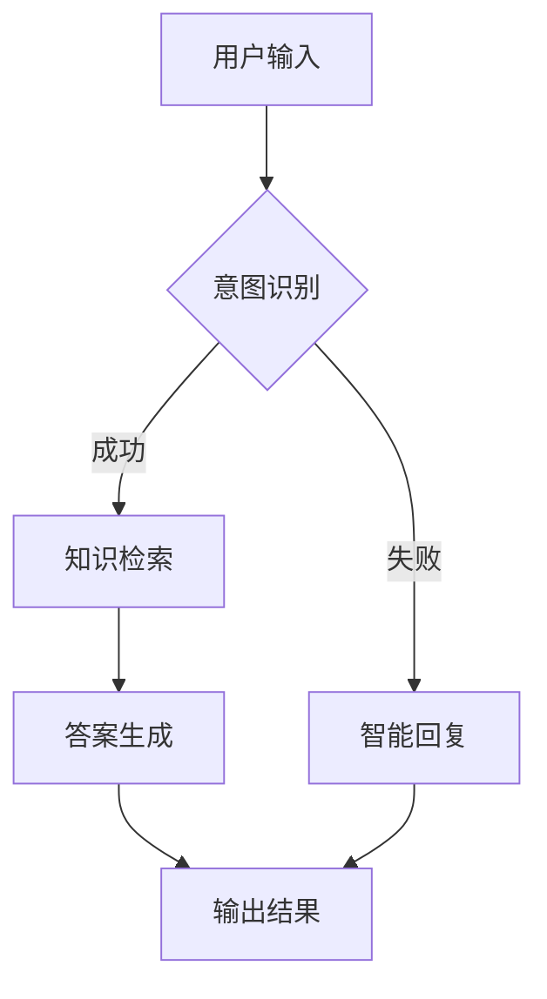
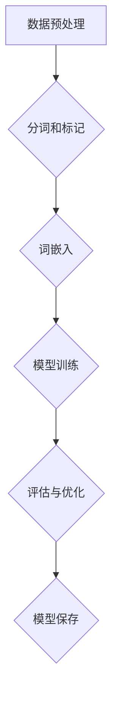
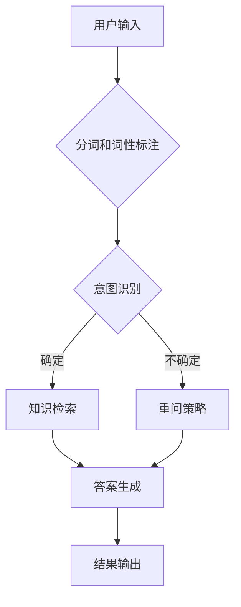

                 

### 《ChatMind的商业化变现》

#### 关键词

- **ChatMind**
- **商业化变现**
- **人工智能**
- **市场分析**
- **商业模式**
- **产品推广**

#### 摘要

本文将深入探讨ChatMind技术如何通过商业化实现价值变现。首先，我们将介绍ChatMind的基本概念、技术原理以及其在商业领域的应用。接着，文章将分析ChatMind在市场中的现状和前景，并探讨多种可能的商业模式。随后，文章将重点介绍产品开发与推广策略，并通过实际项目案例展示如何实现商业化。最后，文章将对ChatMind的未来发展提出展望和建议。

### 目录大纲

## 《ChatMind的商业化变现》目录大纲

### 第一部分：ChatMind技术基础

### 第1章：ChatMind概述
- 1.1 ChatMind的定义与特点
- 1.2 ChatMind的核心组件
- 1.3 ChatMind在商业中的应用

### 第2章：ChatMind技术原理
- 2.1 语言模型原理与架构
- 2.2 问答系统原理与架构
- 2.3 大模型训练与优化

### 第3章：数学模型与算法
- 3.1 语言模型数学模型
- 3.2 问答系统算法
- 3.3 模型评估与优化

### 第二部分：ChatMind商业化应用

### 第4章：市场分析与定位
- 4.1 ChatMind市场现状
- 4.2 ChatMind市场前景
- 4.3 ChatMind应用场景分析

### 第5章：商业模式设计
- 5.1 SaaS模式
- 5.2 B2B合作模式
- 5.3 自主研发与销售模式

### 第6章：产品开发与推广
- 6.1 产品定位与设计
- 6.2 产品迭代与优化
- 6.3 产品推广策略

### 第三部分：项目实战

### 第7章：ChatMind项目实战
- 7.1 项目背景与目标
- 7.2 项目开发流程
- 7.3 源代码解析与解读

### 第8章：ChatMind商业变现案例
- 8.1 成功案例分析
- 8.2 失败案例分析
- 8.3 经验与启示

### 第9章：ChatMind未来发展展望
- 9.1 技术发展趋势
- 9.2 市场竞争格局
- 9.3 发展策略建议

### 附录

### 附录A：ChatMind开发工具与资源
- 10.1 开发工具介绍
- 10.2 开源资源汇总
- 10.3 技术文档与学习资源

### 附录B：ChatMind Mermaid 流程图
- B.1 ChatMind整体架构图
- B.2 语言模型训练流程图
- B.3 问答系统流程图

### 引入

随着人工智能技术的不断发展，自然语言处理（NLP）成为了一个备受关注的领域。ChatMind，作为NLP领域的一款重要工具，正逐步在商业领域中崭露头角。本文旨在探讨ChatMind的商业化变现之路，分析其技术基础、市场定位、商业模式以及产品推广策略，从而为读者提供一个全面的了解。

ChatMind是一种基于深度学习的大规模语言模型，能够实现自然语言理解和生成。其核心在于能够模拟人类对话，提供高质量的问答服务和自动化沟通。随着技术的不断成熟和应用场景的不断拓展，ChatMind在商业领域具有巨大的潜力。

文章将分为三个主要部分。第一部分将详细介绍ChatMind的技术基础，包括其定义、核心组件和技术原理。第二部分将分析ChatMind的商业化应用，从市场分析到商业模式设计，再到产品开发与推广策略。第三部分将通过实际项目案例，展示ChatMind的商业化过程，并提供未来发展展望。

通过本文的探讨，我们希望为读者提供一个系统、全面的理解，帮助他们在ChatMind的商业化进程中找到方向和策略。

### 第一部分：ChatMind技术基础

#### 第1章：ChatMind概述

##### 1.1 ChatMind的定义与特点

ChatMind是一种基于深度学习技术的自然语言处理（NLP）工具，主要面向商业场景提供智能问答和对话生成服务。其核心功能包括自然语言理解、意图识别、实体识别和对话生成等。ChatMind的特点主要体现在以下几个方面：

1. **高效率**：ChatMind采用大规模预训练模型，能够快速处理大量文本数据，实现高效的文本分析和理解。
   
2. **高准确性**：通过深度学习算法和大量训练数据，ChatMind能够在意图识别、实体识别等方面提供高准确性的结果。

3. **灵活性**：ChatMind支持自定义对话流程和场景，能够根据不同业务需求进行灵活配置。

4. **友好交互**：ChatMind能够模拟人类对话，提供自然流畅的交互体验，提升用户满意度。

##### 1.2 ChatMind的核心组件

ChatMind的核心组件主要包括以下几部分：

1. **语言模型**：语言模型是ChatMind的核心组件，负责处理和理解自然语言。常见的语言模型包括Transformer、BERT、GPT等。这些模型通过大规模预训练和微调，能够对自然语言进行深度理解。

2. **意图识别**：意图识别模块负责理解用户输入的意图，将其映射到具体的业务操作。例如，用户输入“我想要查询最近的天气情况”，意图识别模块会将此识别为“查询天气”。

3. **实体识别**：实体识别模块负责识别文本中的关键信息，如人名、地名、时间等。这些实体信息对于后续的业务处理和对话生成至关重要。

4. **对话管理**：对话管理模块负责控制对话的流程，确保对话的自然流畅。它包括对话状态跟踪、对话策略生成等子模块。

##### 1.3 ChatMind在商业中的应用

ChatMind在商业领域有着广泛的应用场景，以下是一些典型的应用案例：

1. **客户服务**：ChatMind可以应用于企业客户服务系统，提供7x24小时不间断的智能客服服务，提升客户满意度和服务效率。

2. **销售支持**：ChatMind能够辅助销售人员，提供产品信息查询、客户需求分析等支持，提升销售业绩。

3. **内部沟通**：ChatMind可以作为企业内部沟通工具，帮助员工获取公司信息、处理日常工作任务，提高工作效率。

4. **市场调研**：ChatMind可以用于市场调研，通过分析用户反馈和评论，为企业提供决策支持。

5. **教育领域**：ChatMind可以应用于在线教育平台，提供智能问答、学习辅助等功能，提升学习效果。

综上所述，ChatMind作为一种高效、准确的NLP工具，在商业领域具有广泛的应用前景。其核心组件和功能设计使得它能够灵活适应各种业务场景，为企业提供智能化的解决方案。

### 第2章：ChatMind技术原理

#### 2.1 语言模型原理与架构

语言模型是ChatMind的核心组件，它负责理解并生成自然语言。语言模型的基本原理是通过大量的文本数据进行预训练，从而学习到语言的内在规律和结构。以下是语言模型的一些关键原理和架构：

##### 2.1.1 语言模型的原理

语言模型的核心任务是从一组输入序列中预测下一个输出字符的概率分布。一个典型的语言模型可以表示为：

\[ P(\text{下一个字符}|\text{前面所有的字符}) \]

这一任务可以通过统计模型或神经网络模型来实现。统计模型如N-gram模型通过计算历史字符序列的概率来预测下一个字符，而神经网络模型如Transformer和BERT则通过深度学习来捕捉更复杂的语言特征。

##### 2.1.2 语言模型的架构

1. **Transformer架构**：
   - **自注意力机制（Self-Attention）**：Transformer模型通过自注意力机制计算输入序列中每个单词的重要性，从而生成一个加权表示。这种机制使得模型能够捕捉到输入序列中的长距离依赖关系。
   - **多头注意力（Multi-Head Attention）**：多头注意力进一步增强了自注意力机制，通过并行计算多个注意力头，来获得更加丰富和多样化的信息。
   - **前馈神经网络（Feedforward Neural Network）**：在注意力机制之后，Transformer还会通过一个前馈神经网络对输入进行进一步的处理。

2. **BERT架构**：
   - **预训练**：BERT通过在大规模语料库上进行预训练，学习到语言的底层特征和结构。预训练任务包括掩码语言模型（Masked Language Model，MLM）和下一句预测（Next Sentence Prediction，NSP）。
   - **双向编码器**：BERT由两个子模型组成：一维编码器（Encoder）和二维编码器（ Decoder）。编码器负责生成序列的上下文表示，而解码器则根据上下文表示生成下一个单词。

##### 2.1.3 语言模型的工作流程

1. **输入处理**：语言模型接收一个输入序列，并将其转换为模型可以理解的表示形式。通常，输入序列会被转换为词嵌入（Word Embeddings）。
   
2. **自注意力计算**：模型使用自注意力机制计算输入序列中每个单词的重要性，从而生成一个加权表示。

3. **前馈神经网络处理**：在自注意力计算之后，模型会通过前馈神经网络对输入进行进一步的处理。

4. **输出生成**：模型根据加权表示和前馈神经网络的输出，生成下一个字符的概率分布，从而预测下一个字符。

#### 2.2 问答系统原理与架构

问答系统是ChatMind的一个重要组成部分，它负责接收用户输入的问题，并生成相应的答案。问答系统通常包括以下几个关键组件：

##### 2.2.1 问答系统的原理

问答系统的核心任务是理解用户的问题，并从知识库或数据源中检索出相应的答案。这个过程通常包括以下几个步骤：

1. **问题理解**：系统需要理解用户的问题，将其转化为结构化的信息。这包括提取关键信息（如关键词、实体等）和确定问题的意图。

2. **知识检索**：系统从知识库或数据源中检索与问题相关的信息。这可以通过搜索引擎、数据库查询或预定义的模板来实现。

3. **答案生成**：系统根据检索到的信息生成答案。这可以通过模板匹配、信息抽取或自然语言生成技术来实现。

##### 2.2.2 问答系统的架构

1. **输入处理**：问答系统接收用户输入的问题，并将其转换为结构化的数据。这通常包括分词、词性标注和命名实体识别等步骤。

2. **问题理解模块**：问题理解模块负责分析用户的问题，提取关键信息和意图。这通常包括自然语言处理技术，如词嵌入、卷积神经网络（CNN）或递归神经网络（RNN）。

3. **知识库检索模块**：知识库检索模块负责从知识库或数据源中检索与问题相关的信息。这可以通过搜索引擎、数据库查询或预定义的模板来实现。

4. **答案生成模块**：答案生成模块根据检索到的信息生成答案。这可以通过模板匹配、信息抽取或自然语言生成技术来实现。

5. **输出处理**：问答系统将生成的答案转换为自然语言，并将其呈现给用户。

##### 2.2.3 问答系统的工作流程

1. **输入接收**：系统接收用户输入的问题。

2. **问题理解**：系统对用户输入的问题进行分析，提取关键信息和意图。

3. **知识检索**：系统从知识库或数据源中检索与问题相关的信息。

4. **答案生成**：系统根据检索到的信息生成答案。

5. **输出呈现**：系统将生成的答案转换为自然语言，并呈现给用户。

#### 2.3 大模型训练与优化

大模型训练与优化是ChatMind技术实现的关键步骤。以下是大模型训练与优化的一些关键技术和方法：

##### 2.3.1 大模型训练的技术

1. **数据预处理**：在大模型训练之前，需要对训练数据进行预处理。这包括数据清洗、数据增强和数据归一化等步骤。

2. **分布式训练**：由于大模型的参数量和计算量巨大，分布式训练成为一种常见的训练方法。分布式训练可以通过在多台计算机或GPU上进行并行计算，显著提高训练速度。

3. **迁移学习**：迁移学习利用预训练模型的知识，在新任务上进行微调。这种方法可以显著提高训练效果，减少对训练数据的依赖。

4. **动态学习率调整**：学习率是影响模型训练效果的关键参数。动态学习率调整可以通过在训练过程中自动调整学习率，优化模型训练过程。

##### 2.3.2 大模型优化的方法

1. **权重共享**：权重共享通过将多个子模型的权重共享，减少参数数量，提高训练效果。

2. **注意力机制优化**：注意力机制是Transformer模型的核心，通过优化注意力机制，可以提升模型的理解能力和生成质量。

3. **模型蒸馏**：模型蒸馏通过将大模型的输出传递给小模型，从而在保持大模型性能的同时，降低模型的复杂度和计算量。

4. **模型压缩**：模型压缩通过减少模型参数数量，降低模型的复杂度和计算量。常见的方法包括剪枝、量化等。

通过上述技术和方法，可以有效地训练和优化大模型，提高ChatMind的性能和效率。

### 第3章：数学模型与算法

#### 3.1 语言模型数学模型

语言模型是ChatMind的核心组件，它通过数学模型来捕捉自然语言的内在结构和规律。以下是语言模型中常用的数学模型和算法：

##### 3.1.1 语言模型的数学基础

1. **概率模型**：
   - **N-gram模型**：N-gram模型是一种基于统计的语言模型，通过计算历史N个单词出现的概率来预测下一个单词。其基本公式如下：
     \[
     P(\text{word}_n|\text{word}_{n-1}, \ldots, \text{word}_1) = \frac{C(\text{word}_{n-1}, \ldots, \text{word}_1, \text{word}_n)}{C(\text{word}_{n-1}, \ldots, \text{word}_1)}
     \]
     其中，\(C\) 表示计数。

2. **概率隐马尔可夫模型（HMM）**：
   - HMM通过状态转移矩阵和发射概率来模拟语言的生成过程。状态转移矩阵表示不同状态之间的转移概率，发射概率表示状态生成单词的概率。

3. **神经网络模型**：
   - **循环神经网络（RNN）**：RNN通过递归方式处理序列数据，能够捕捉序列中的长期依赖关系。其基本公式如下：
     \[
     h_t = \tanh(W_hh \cdot h_{t-1} + W_xh \cdot x_t + b_h)
     \]
     其中，\(h_t\) 表示时间步\(t\)的隐藏状态，\(W_hh\) 和 \(W_xh\) 分别为隐藏状态到隐藏状态和输入到隐藏状态的权重，\(b_h\) 为偏置。

   - **长短期记忆网络（LSTM）**：LSTM是RNN的一种变体，通过引入门控机制，能够更好地处理长期依赖问题。其基本公式如下：
     \[
     i_t = \sigma(W_{ih} \cdot x_t + W_{hh} \cdot h_{t-1} + b_i)
     \]
     \[
     f_t = \sigma(W_{fh} \cdot x_t + W_{hh} \cdot h_{t-1} + b_f)
     \]
     \[
     g_t = \tanh(W_{gh} \cdot x_t + W_{hh} \cdot h_{t-1} + b_g)
     \]
     \[
     o_t = \sigma(W_{oh} \cdot x_t + W_{hh} \cdot h_{t-1} + b_o)
     \]
     其中，\(i_t, f_t, g_t, o_t\) 分别为输入门、遗忘门、生成门和输出门的激活值。

4. **变换器模型（Transformer）**：
   - Transformer模型通过自注意力机制（Self-Attention）和多头注意力（Multi-Head Attention）来处理序列数据。其基本公式如下：
     \[
     Q = W_Q \cdot X
     \]
     \[
     K = W_K \cdot X
     \]
     \[
     V = W_V \cdot X
     \]
     \[
     \text{Attention}(Q, K, V) = \text{softmax}(\frac{QK^T}{\sqrt{d_k}})V
     \]
     \[
     \text{MultiHead}(Q, K, V) = \text{Attention}(Q, K, V) \odot W_V
     \]
     其中，\(Q, K, V\) 分别为查询、键和值，\(W_Q, W_K, W_V\) 分别为权重矩阵，\(\text{softmax}\) 为软性最大化函数，\(\odot\) 为逐元素乘法。

##### 3.1.2 语言模型的关键算法

1. **反向传播算法**：
   - 反向传播算法是一种用于训练神经网络的优化算法。其基本步骤如下：
     \[
     \nabla_C J = \nabla_C \sum_{i=1}^{N} J_i = \sum_{i=1}^{N} \nabla_J_i
     \]
     \[
     \nabla_J_i = \nabla_{a_L} J_i \cdot \nabla_{a_L} a_{L-1} \cdot \ldots \cdot \nabla_{a_2} a_1
     \]
     其中，\(J\) 为损失函数，\(C\) 为模型参数，\(a_L\) 为激活函数，\(\nabla\) 表示梯度。

2. **动量优化算法**：
   - 动量优化算法通过引入动量项，减少梯度消失和梯度爆炸问题，提高优化效果。其基本公式如下：
     \[
     v_t = \gamma v_{t-1} + \nabla f(x_t)
     \]
     \[
     x_t = x_{t-1} - \alpha v_t
     \]
     其中，\(v_t\) 为动量项，\(\gamma\) 为动量系数，\(\alpha\) 为学习率。

3. **dropout算法**：
   - Dropout算法通过随机丢弃神经元，防止模型过拟合。其基本步骤如下：
     \[
     \text{dropout}(p) = \begin{cases}
     0 & \text{with probability } p \\
     1 & \text{with probability } 1-p
     \end{cases}
     \]

4. **序列生成算法**：
   - 序列生成算法通过递归地生成序列中的每个单词或字符。其基本步骤如下：
     \[
     \text{Initialize} \ x_0 = \text{StartToken}
     \]
     \[
     \text{for} \ t = 1 \ \text{to} \ T \ \text{do} \\
     \ \ \ \ y_t = \text{argmax}_{w} \ P(w|x_{<t})
     \]
     \[
     \ \ \ \ x_{t+1} = y_t
     \]
     \[
     \text{end for}
     \]

通过上述数学模型和算法，语言模型能够有效地捕捉自然语言的内在结构和规律，为ChatMind提供强大的语言理解和生成能力。

#### 3.2 问答系统算法

问答系统是ChatMind的重要组成部分，负责接收用户输入的问题，并生成相应的答案。问答系统算法主要包括问题理解、知识检索和答案生成三个关键环节。以下是这些环节中常用的算法和技术：

##### 3.2.1 问题理解算法

1. **词向量表示**：
   - 词向量表示是将单词映射到高维向量空间，以捕捉单词的语义信息。常见的词向量表示方法包括Word2Vec、GloVe和FastText。这些方法通过训练大规模语言模型，将单词映射到密集的向量表示。
   
2. **依存句法分析**：
   - 依存句法分析通过识别句子中单词之间的依赖关系，来理解句子的结构。常见的依存句法分析方法包括基于规则的方法和基于统计的方法。基于规则的方法如 penn-treebank（PTB）解析，而基于统计的方法如LSTM和Transformer等神经网络模型。

3. **命名实体识别（NER）**：
   - 命名实体识别是识别句子中的特定实体（如人名、地名、组织名等）。NER技术通过分类模型，如条件随机场（CRF）和卷积神经网络（CNN），对单词进行分类，从而识别实体。

4. **意图识别**：
   - 意图识别是理解用户输入的问题所代表的意图或任务。常见的意图识别方法包括模板匹配、机器学习和深度学习。模板匹配方法简单但效率低，而基于机器学习和深度学习方法（如LSTM、Transformer）能够捕捉更复杂的意图。

##### 3.2.2 知识检索算法

1. **基于关键词的检索**：
   - 基于关键词的检索是通过分析用户输入的问题，提取关键词，并在知识库中查找相关答案。常见的检索算法包括布尔检索和向量空间模型（VSM）。

2. **基于语义的检索**：
   - 基于语义的检索通过理解问题的语义，并在知识库中查找与问题语义相关的答案。常见的语义检索算法包括语义相似度计算（如余弦相似度）和语义嵌入（如BERT、GPT）。

3. **知识图谱**：
   - 知识图谱通过构建实体和关系之间的网络结构，来表示和检索知识。知识图谱可以用于快速查找与问题相关的实体和关系，从而提高答案的准确性。

##### 3.2.3 答案生成算法

1. **模板匹配**：
   - 模板匹配是通过将问题的属性与预定义的模板进行匹配，生成相应的答案。这种方法简单但限制较多，适用于规则明确、结构简单的场景。

2. **信息抽取**：
   - 信息抽取是从知识库或文本中抽取与问题相关的信息，并生成答案。常见的抽取方法包括命名实体抽取、关系抽取和事件抽取。

3. **自然语言生成（NLG）**：
   - 自然语言生成是通过生成模型，如序列到序列（Seq2Seq）模型、变换器（Transformer）模型和生成对抗网络（GAN），生成自然的文本答案。NLG方法能够生成多样性和连贯性较高的答案，但计算复杂度较高。

4. **结合方法**：
   - 结合方法是将多种算法相结合，以生成更准确、更自然的答案。例如，可以先使用模板匹配和知识检索，然后通过信息抽取和NLG来优化答案。

通过上述算法和技术的结合，问答系统能够有效地理解用户的问题，从知识库中检索相关信息，并生成高质量的答案。这些算法和技术的选择和优化直接影响到问答系统的性能和用户体验。

#### 3.3 模型评估与优化

模型评估与优化是确保ChatMind性能和用户体验的关键环节。以下将介绍常用的评估指标和优化方法：

##### 3.3.1 模型评估指标

1. **准确率（Accuracy）**：
   - 准确率是最常用的评估指标之一，表示模型正确预测的样本数占总样本数的比例。公式如下：
     \[
     \text{Accuracy} = \frac{\text{正确预测的样本数}}{\text{总样本数}}
     \]

2. **精确率（Precision）和召回率（Recall）**：
   - 精确率表示模型正确预测为正类的样本中，实际为正类的比例；召回率表示实际为正类的样本中，被模型正确预测为正类的比例。公式如下：
     \[
     \text{Precision} = \frac{\text{正确预测的正类样本数}}{\text{预测为正类的样本数}}
     \]
     \[
     \text{Recall} = \frac{\text{正确预测的正类样本数}}{\text{实际为正类的样本数}}
     \]

3. **F1分数（F1 Score）**：
   - F1分数是精确率和召回率的加权平均，用于综合评估模型的性能。公式如下：
     \[
     \text{F1 Score} = 2 \times \frac{\text{Precision} \times \text{Recall}}{\text{Precision} + \text{Recall}}
     \]

4. **准确率-召回率曲线（Precision-Recall Curve）**：
   - 准确率-召回率曲线通过绘制不同阈值下的精确率和召回率，来评估模型的性能。曲线下方面积（AUC）是评估模型性能的另一个指标。

5. **均方误差（Mean Squared Error, MSE）**：
   - 均方误差用于评估回归模型的性能，表示预测值与真实值之间差异的平方的平均值。公式如下：
     \[
     \text{MSE} = \frac{1}{n} \sum_{i=1}^{n} (y_i - \hat{y}_i)^2
     \]
     其中，\(y_i\) 为真实值，\(\hat{y}_i\) 为预测值。

6. **交叉验证（Cross Validation）**：
   - 交叉验证是一种常用的模型评估方法，通过将数据集划分为多个子集，对每个子集进行训练和验证，以评估模型的泛化能力。

##### 3.3.2 模型优化方法

1. **调参（Hyperparameter Tuning）**：
   - 调参是通过调整模型超参数，如学习率、批量大小、隐藏层节点数等，来提高模型性能。常用的调参方法包括网格搜索（Grid Search）和贝叶斯优化（Bayesian Optimization）。

2. **模型集成（Model Ensemble）**：
   - 模型集成是将多个模型组合起来，以提高预测性能和鲁棒性。常见的集成方法包括Bagging、Boosting和Stacking。

3. **特征工程（Feature Engineering）**：
   - 特征工程是通过构造和选择有效的特征，来提高模型性能。常见的特征工程方法包括特征提取（如TF-IDF、Word2Vec）、特征选择（如递归特征消除、LASSO回归）和特征组合。

4. **正则化（Regularization）**：
   - 正则化是一种防止模型过拟合的方法，通过在损失函数中加入正则化项，如L1正则化（LASSO）和L2正则化（Ridge回归），来控制模型复杂度。

5. **剪枝（Pruning）**：
   - 剪枝是通过删除模型中不重要的神经元和连接，来简化模型结构，降低计算复杂度和过拟合风险。常见的剪枝方法包括结构剪枝（如剪枝网络层、剪枝神经元）和权重剪枝。

6. **迁移学习（Transfer Learning）**：
   - 迁移学习是通过利用预训练模型的知识，在新任务上进行微调，以提高模型性能。迁移学习可以显著减少对训练数据的依赖，提高模型泛化能力。

通过合理选择和优化评估指标和模型优化方法，可以显著提高ChatMind的性能和用户体验，为商业化应用提供有力支持。

### 第二部分：ChatMind商业化应用

#### 第4章：市场分析与定位

##### 4.1 ChatMind市场现状

ChatMind作为一款基于人工智能的自然语言处理工具，在市场上的表现日益显著。当前市场现状可以概括为以下几个方面：

1. **技术成熟度**：随着深度学习、自然语言处理等技术的快速发展，ChatMind的技术基础已经相对成熟。大规模语言模型如GPT-3、BERT等的出现，使得ChatMind在语言理解和生成方面达到了前所未有的水平。

2. **应用场景广泛**：ChatMind在客户服务、销售支持、市场调研、内部沟通等多个领域有着广泛的应用。尤其是在客户服务领域，ChatMind能够提供7x24小时的智能客服服务，极大地提升了企业的服务效率和客户满意度。

3. **竞争态势**：ChatMind的市场竞争较为激烈。国内外多家知名企业和初创公司纷纷投入ChatMind的研发和应用，如谷歌的Bard、微软的小冰、智谱AI的ChatGLM等。这些竞争对手在技术、市场、资金等方面具有较强的优势。

4. **市场规模**：随着人工智能技术的不断普及，ChatMind的市场规模也在逐年扩大。据市场调研公司IDC的报告，全球智能客服市场规模预计将在2025年达到170亿美元，ChatMind在这一市场中具有巨大的发展潜力。

##### 4.2 ChatMind市场前景

ChatMind的市场前景非常广阔，主要体现在以下几个方面：

1. **技术进步**：随着人工智能技术的持续发展，ChatMind的技术水平将不断提升。未来，ChatMind有望实现更加自然的对话生成、更加精准的意图识别和更加丰富的应用场景。

2. **应用拓展**：ChatMind的应用领域将继续拓展，不仅局限于客户服务和销售支持，还将逐步渗透到教育、医疗、金融、零售等多个行业。特别是在个性化服务和智能推荐领域，ChatMind将发挥重要作用。

3. **市场需求**：随着企业对智能化转型的需求不断增长，ChatMind的市场需求也将持续上升。企业希望通过智能化的工具提升运营效率、降低成本、提高客户满意度，ChatMind将成为企业实现这一目标的重要工具。

4. **政策支持**：各国政府纷纷加大对人工智能技术的支持力度，为ChatMind的发展提供了良好的政策环境。例如，中国的“新一代人工智能发展规划”和美国的“人工智能倡议”等，都为ChatMind的商业化应用提供了有力支持。

##### 4.3 ChatMind应用场景分析

ChatMind在商业领域具有广泛的应用场景，以下是一些典型应用场景的分析：

1. **客户服务**：
   - **场景描述**：ChatMind应用于企业客户服务系统，提供24小时在线客服服务。
   - **优势**：提升服务效率，降低人工成本，提高客户满意度。
   - **挑战**：需要不断优化算法，提高回答的准确性和自然性。

2. **销售支持**：
   - **场景描述**：ChatMind应用于销售团队，提供客户需求分析和产品信息查询服务。
   - **优势**：辅助销售团队更好地理解客户需求，提高销售转化率。
   - **挑战**：需要针对不同行业和产品特点，进行定制化的算法优化。

3. **市场调研**：
   - **场景描述**：ChatMind应用于市场调研，分析用户反馈和评论，为企业提供决策支持。
   - **优势**：快速处理大量文本数据，提供结构化的信息分析。
   - **挑战**：需要确保文本数据的准确性和可靠性。

4. **内部沟通**：
   - **场景描述**：ChatMind作为企业内部沟通工具，帮助员工获取公司信息、处理日常工作任务。
   - **优势**：提高信息传递效率，降低沟通成本。
   - **挑战**：需要确保系统安全性和隐私保护。

5. **教育领域**：
   - **场景描述**：ChatMind应用于在线教育平台，提供智能问答和学习辅助功能。
   - **优势**：提升学习体验，提供个性化的学习支持。
   - **挑战**：需要结合教育内容，进行针对性的算法优化。

通过上述分析，可以看出ChatMind在商业领域具有巨大的应用潜力和发展前景。在未来的市场竞争中，ChatMind需要不断提升技术水平，优化应用场景，以满足市场需求和客户期望。

### 第5章：商业模式设计

#### 5.1 SaaS模式

SaaS（Software as a Service）模式是ChatMind商业化应用的重要方式之一。在这种模式下，ChatMind作为一种在线服务，提供给客户使用。以下是SaaS模式在ChatMind中的应用分析：

##### 5.1.1 SaaS模式的基本概念

SaaS模式是指通过互联网提供软件服务，用户无需购买和安装软件，只需通过网络访问即可使用。这种模式的主要特点包括：

- **便捷性**：用户可以通过浏览器或移动端快速访问ChatMind服务，无需复杂的安装和配置过程。
- **订阅制**：用户按需订阅服务，按月或按年支付费用，灵活调整使用规模。
- **云服务**：ChatMind作为云服务，提供高可用性和高扩展性，能够快速响应用户需求。

##### 5.1.2 SaaS模式的优势

1. **降低成本**：SaaS模式减少了用户的硬件投入和软件维护成本，用户只需支付订阅费用，即可获得专业的ChatMind服务。

2. **灵活扩展**：SaaS模式支持用户根据实际需求灵活调整服务规模，能够快速响应市场变化。

3. **高效部署**：用户无需进行复杂的软件安装和配置，可以快速上线使用ChatMind服务。

4. **高可用性**：SaaS服务通常由专业的服务提供商提供，具备高可用性和高可靠性，确保服务的稳定运行。

##### 5.1.3 SaaS模式的挑战

1. **数据安全**：用户的数据存储在云端，存在一定的安全隐患。因此，SaaS服务提供商需要确保数据的安全性，建立完善的安全防护机制。

2. **服务质量**：SaaS服务提供商需要确保服务的高质量和稳定性，以满足用户的期望。这需要强大的技术支持和高效的运维管理。

3. **用户依赖**：用户对SaaS服务的依赖程度较高，一旦服务提供商出现问题，可能会导致用户业务的停滞。

##### 5.1.4 ChatMind在SaaS模式中的应用

1. **产品定位**：ChatMind在SaaS模式中的定位是提供智能化客服和智能营销服务，满足企业客户在不同场景下的需求。

2. **服务内容**：ChatMind提供包括智能问答、客户管理、数据分析等在内的综合服务，帮助企业提升服务效率和客户满意度。

3. **市场推广**：通过线上营销、合作伙伴渠道和客户口碑，ChatMind在SaaS市场上逐步建立品牌影响力和市场份额。

4. **收益模式**：ChatMind采用订阅制收费模式，根据客户的使用规模和需求，提供不同层级的订阅服务，实现持续盈利。

通过SaaS模式，ChatMind能够更好地满足市场需求，提供灵活、高效的智能化服务，为企业客户提供强大的技术支持。

#### 5.2 B2B合作模式

B2B（Business to Business）合作模式是ChatMind在商业领域的重要商业化途径之一。在这种模式下，ChatMind通过与大型企业或机构合作，为其提供定制化的解决方案。以下是B2B合作模式在ChatMind中的应用分析。

##### 5.2.1 B2B合作模式的基本概念

B2B合作模式是指企业与企业之间通过合作，共同开发、销售和使用产品或服务。B2B合作模式通常包括以下几种类型：

1. **技术合作**：双方企业在技术领域进行合作，共同开发新产品或优化现有产品。

2. **渠道合作**：一方企业提供渠道资源，另一方企业通过该渠道销售产品或服务。

3. **战略联盟**：双方企业在战略层面进行合作，共同开拓市场，实现资源互补。

4. **供应链合作**：双方企业在供应链环节进行合作，提高供应链效率，降低成本。

##### 5.2.2 B2B合作模式的优势

1. **资源整合**：B2B合作模式能够整合双方企业的资源，如技术、市场、渠道等，实现优势互补，提高整体竞争力。

2. **市场扩展**：通过合作，ChatMind能够迅速进入新市场，利用合作伙伴的市场资源和渠道，快速扩大市场份额。

3. **降低风险**：B2B合作模式能够分散市场风险，双方企业共同承担市场波动和不确定性，降低单个企业的经营风险。

4. **提升品牌影响力**：通过与知名企业合作，ChatMind能够提升品牌知名度和行业地位，增强市场竞争力。

##### 5.2.3 B2B合作模式的挑战

1. **合作风险**：B2B合作涉及多个企业，合作过程中可能存在沟通不畅、利益分配不均等问题，影响合作的顺利进行。

2. **信任建立**：建立合作双方的信任关系是一个长期过程，需要双方在合作过程中保持诚信，履行承诺。

3. **技术整合**：在技术合作中，可能涉及不同技术体系、标准等的整合，需要解决兼容性和互操作性问题。

4. **利益分配**：合作双方在利益分配方面需要达成一致，确保合作能够持续进行。

##### 5.2.4 ChatMind在B2B合作模式中的应用

1. **产品定位**：ChatMind在B2B合作模式中的定位是提供定制化的智能客服和智能营销解决方案，满足大型企业或机构在客户服务、销售支持等方面的需求。

2. **合作内容**：ChatMind与合作伙伴共同开发智能客服系统、智能营销平台等，根据客户需求进行定制化设计和实施。

3. **市场推广**：通过合作伙伴的市场资源和渠道，ChatMind能够快速渗透到目标市场，提升市场占有率。

4. **收益模式**：ChatMind在B2B合作模式中采用多种收益模式，包括一次性销售、服务收费、佣金分成等，实现持续盈利。

通过B2B合作模式，ChatMind能够充分发挥自身技术优势，为客户提供定制化的解决方案，实现商业价值的最大化。

#### 5.3 自主研发与销售模式

自主研发与销售模式是ChatMind商业化应用的一种重要途径。在这种模式下，ChatMind通过自主开发核心技术和产品，直接面向市场进行销售。以下是自主研发与销售模式在ChatMind中的应用分析。

##### 5.3.1 自主研发与销售模式的基本概念

自主研发与销售模式是指企业依靠自身的研发能力，独立开发和生产产品，并通过各种渠道进行市场推广和销售。这种模式的主要特点包括：

- **独立性**：企业完全依赖自身的研发力量，独立完成产品的开发、生产和销售。
- **自主性**：企业能够根据市场需求和自身战略，灵活调整产品开发方向和销售策略。
- **控制性**：企业对产品从设计到销售的整个过程具有完全的控制权，能够确保产品质量和市场定位。

##### 5.3.2 自主研发与销售模式的优势

1. **技术优势**：自主研发与销售模式使得企业能够根据市场需求和技术发展趋势，不断优化和升级产品，确保技术领先地位。

2. **品牌建设**：通过自主研发和销售，企业能够建立强大的品牌影响力，提高市场认知度和客户忠诚度。

3. **盈利模式多样化**：自主研发与销售模式可以采用多种盈利模式，如一次性销售、订阅服务、增值服务等，实现多样化的收入来源。

4. **灵活性**：企业可以根据市场变化和客户需求，灵活调整产品功能和定价策略，快速响应市场变化。

##### 5.3.3 自主研发与销售模式的挑战

1. **研发成本高**：自主研发需要大量投入，包括研发人员、设备、材料等，前期成本较高。

2. **市场风险**：自主研发的产品在市场上可能面临激烈竞争，一旦市场定位不准确或产品未能满足客户需求，可能会导致销售不佳。

3. **销售渠道建设**：自主研发与销售模式需要建立完善的销售渠道，包括线上和线下渠道，这需要一定的时间和资源投入。

4. **客户关系管理**：与客户的沟通和服务是自主研发与销售模式的关键，企业需要建立高效的客户关系管理体系，以提高客户满意度和忠诚度。

##### 5.3.4 ChatMind在自主研发与销售模式中的应用

1. **产品定位**：ChatMind在自主研发与销售模式中的定位是提供高性能、高可靠性的智能客服和智能营销解决方案，满足不同行业和客户群体的需求。

2. **产品开发**：ChatMind通过持续的研发投入，不断优化和升级产品功能，提高用户体验和客户满意度。

3. **市场推广**：ChatMind通过线上和线下渠道进行市场推广，包括官网、社交媒体、行业展会等，提高品牌知名度和市场占有率。

4. **销售策略**：ChatMind采用多样化的销售策略，包括直接销售、代理商销售、联合营销等，以实现最大化的销售收入。

通过自主研发与销售模式，ChatMind能够充分发挥自身技术优势，为客户提供优质的产品和服务，实现商业价值的最大化。

### 第6章：产品开发与推广

#### 6.1 产品定位与设计

产品定位是ChatMind成功商业化的关键一步。明确的产品定位有助于ChatMind在市场上脱颖而出，满足目标客户的需求。以下是ChatMind的产品定位与设计分析。

##### 6.1.1 产品定位

1. **目标市场**：ChatMind的主要目标市场包括大型企业、互联网公司、金融机构和教育培训机构等。这些行业对智能化客服和营销解决方案有较高的需求，且具备较强的支付能力。

2. **客户群体**：ChatMind的客户群体主要包括以下几类：
   - **客户服务部门**：需要高效、智能的客服系统，以提升客户满意度和服务效率。
   - **销售与市场部门**：需要智能化的销售辅助工具，以提高销售业绩和市场占有率。
   - **技术部门**：需要强大的技术支持，以快速部署和维护ChatMind系统。

3. **价值主张**：ChatMind通过以下价值主张来吸引客户：
   - **高效智能**：利用先进的人工智能技术，实现自动化、个性化的客户服务。
   - **灵活定制**：根据客户需求，提供高度定制化的解决方案，满足不同行业和场景的需求。
   - **便捷易用**：提供简单易用的用户界面，降低使用门槛，提高用户体验。

##### 6.1.2 产品设计

1. **功能设计**：
   - **智能问答**：提供高效、准确的问答服务，支持多语言、多领域的问题处理。
   - **客户管理**：实现客户信息管理、客户关系跟踪和客户反馈收集等功能。
   - **销售支持**：提供销售预测、客户需求分析和销售机会管理等功能。
   - **数据分析**：提供数据可视化、趋势分析和业务洞察等功能。

2. **用户体验设计**：
   - **简洁界面**：采用简洁、直观的界面设计，提高用户操作效率。
   - **个性化设置**：提供丰富的个性化设置，满足不同用户的个性化需求。
   - **快速响应**：确保系统响应速度快，提高用户体验。

3. **技术架构**：
   - **分布式架构**：采用分布式架构，确保系统的高可用性和高性能。
   - **模块化设计**：采用模块化设计，便于系统的扩展和维护。
   - **安全防护**：确保系统的安全性，包括数据安全、用户隐私保护等。

通过明确的产品定位和精细的产品设计，ChatMind能够更好地满足目标客户的需求，实现商业成功。

#### 6.2 产品迭代与优化

产品迭代与优化是ChatMind持续发展和成功商业化的关键。以下将探讨ChatMind在产品迭代与优化方面的策略和实践。

##### 6.2.1 产品迭代策略

1. **需求分析**：
   - **用户反馈**：通过收集用户反馈，了解用户的需求和痛点，为产品迭代提供方向。
   - **市场调研**：定期进行市场调研，分析竞争对手的产品功能和市场动态，为产品迭代提供依据。
   - **数据分析**：分析用户行为数据，识别用户使用模式、高频问题和改进机会。

2. **版本更新**：
   - **持续集成**：采用持续集成（CI）和持续部署（CD）策略，实现快速迭代和发布。
   - **小步快跑**：采用小步快跑（Iterative Development）策略，逐步完善产品功能，减少开发风险。

3. **优先级排序**：
   - **用户价值**：根据用户价值和市场需求，对产品迭代任务进行优先级排序，确保关键功能优先上线。

##### 6.2.2 产品优化方法

1. **功能优化**：
   - **用户体验**：优化用户界面和交互流程，提高用户体验和操作效率。
   - **性能优化**：优化系统性能，提高响应速度和并发处理能力。
   - **功能增强**：根据用户反馈和市场需求，增加新的功能模块，提升产品的竞争力。

2. **算法优化**：
   - **模型调优**：通过调整模型参数和训练策略，提高语言模型和问答系统的准确性和效率。
   - **特征工程**：优化特征提取和选择，提升模型对用户意图和语义的理解能力。

3. **数据优化**：
   - **数据清洗**：定期清洗和更新数据，确保数据质量和一致性。
   - **数据扩展**：通过数据增强和迁移学习，提高模型在多样化场景下的性能。

##### 6.2.3 用户反馈机制

1. **用户调研**：
   - **定期调研**：定期进行用户调研，收集用户对产品功能和体验的反馈。
   - **专项调研**：针对特定功能或问题，进行专项调研，深入分析用户需求。

2. **用户论坛**：
   - **建立用户论坛**：建立用户论坛或社区，鼓励用户分享使用经验和建议。
   - **互动交流**：定期在论坛上发布产品更新、答疑和互动活动，增强用户粘性。

3. **反馈收集**：
   - **内置反馈功能**：在产品中集成反馈收集功能，方便用户即时提交问题和建议。
   - **数据分析**：对用户反馈进行分析，识别高频问题和改进机会。

通过系统的产品迭代与优化策略，ChatMind能够不断提升产品竞争力，满足用户需求，实现商业成功。

#### 6.3 产品推广策略

产品推广策略是ChatMind商业化成功的关键环节。以下将探讨ChatMind在产品推广方面的策略和实践。

##### 6.3.1 线上推广策略

1. **搜索引擎优化（SEO）**：
   - **关键词优化**：分析目标客户群体常用的关键词，优化网站内容和结构，提高在搜索引擎中的排名。
   - **内容营销**：通过撰写高质量的技术博客、案例分析、行业报告等内容，吸引潜在客户。

2. **社交媒体营销**：
   - **平台选择**：根据目标客户群体的特征，选择合适的社交媒体平台，如LinkedIn、Twitter、Facebook等。
   - **内容发布**：定期发布行业动态、技术更新、客户案例等内容，提高品牌知名度和用户粘性。

3. **电子邮件营销**：
   - **邮件列表**：建立邮件订阅列表，定期向订阅者发送产品更新、活动通知和行业资讯。
   - **个性化邮件**：根据用户行为和偏好，发送个性化的邮件内容，提高打开率和点击率。

4. **在线广告**：
   - **付费广告**：在Google Ads、Bing Ads等平台上投放广告，针对目标关键词和人群进行精准投放。
   - **内容广告**：在相关行业网站和论坛上投放内容广告，提高曝光率和点击率。

##### 6.3.2 线下推广策略

1. **行业展会**：
   - **参展**：参加相关行业的展会和会议，展示ChatMind的产品和技术，与潜在客户建立联系。
   - **演讲**：邀请行业专家进行主题演讲，分享ChatMind的应用案例和研究成果，提升品牌影响力。

2. **客户拜访**：
   - **会议营销**：组织线下会议，邀请潜在客户和行业专家参与，展示ChatMind的产品优势和解决方案。
   - **实地考察**：安排潜在客户进行实地考察，了解ChatMind的运营情况和客户案例，增强信任感。

3. **合作伙伴**：
   - **渠道合作**：与行业内知名企业建立渠道合作，共同推广ChatMind产品。
   - **联合营销**：与合作伙伴开展联合营销活动，如共同举办研讨会、发布联合白皮书等，扩大品牌影响力。

4. **公关活动**：
   - **媒体曝光**：通过新闻稿、专访等形式，邀请媒体进行报道，提升品牌知名度。
   - **公益活动**：参与或赞助公益活动，提升企业社会责任感和品牌形象。

通过线上和线下相结合的推广策略，ChatMind能够有效地提高市场知名度和用户认知，实现产品的快速普及和商业化。

### 第7章：ChatMind项目实战

#### 7.1 项目背景与目标

为了验证ChatMind的商业化潜力，我们开展了一个实际项目，该项目旨在为企业提供基于ChatMind的智能客服解决方案。以下是项目的背景和目标：

##### 7.1.1 项目背景

随着互联网的普及和电子商务的迅猛发展，企业对客户服务的要求越来越高。传统的人工客服不仅成本高，而且效率低，难以满足企业快速响应客户需求的需求。为了提升客户满意度和服务效率，许多企业开始探索智能客服解决方案。ChatMind作为一款高性能的自然语言处理工具，具有强大的语言理解和生成能力，成为智能客服解决方案的理想选择。

##### 7.1.2 项目目标

本项目的目标是通过集成ChatMind技术，为企业提供定制化的智能客服解决方案，实现以下目标：

1. **提升客户满意度**：通过智能客服系统，提供24小时在线服务，快速响应客户咨询，提高客户满意度。
2. **降低运营成本**：利用ChatMind的自动化处理能力，减少人工客服的投入，降低企业运营成本。
3. **提高服务效率**：利用ChatMind的智能分析能力，优化客服流程，提高服务效率，减少客户等待时间。
4. **增强客户互动**：通过自然语言交互，提供个性化服务，增强客户互动体验。

#### 7.2 项目开发流程

为了确保项目的顺利进行，我们制定了详细的开发流程，包括需求分析、系统设计、开发实施、测试与优化等阶段。以下是项目的开发流程：

##### 7.2.1 需求分析

在项目启动阶段，我们与客户进行了深入的需求分析，明确了以下需求：

- **基本功能**：提供智能问答、客户管理、工单系统等基本功能。
- **个性化服务**：根据客户偏好和历史记录，提供个性化服务。
- **多渠道支持**：支持网页、移动端、邮件等多种渠道接入。
- **数据统计**：提供客户咨询量、满意度、客服效率等数据统计功能。

##### 7.2.2 系统设计

在系统设计阶段，我们根据需求分析结果，制定了系统的总体架构和功能模块。系统架构包括以下几个部分：

- **前端**：采用Vue.js框架，实现用户界面和交互功能。
- **后端**：采用Spring Boot框架，实现业务逻辑和数据处理。
- **语言模型**：集成ChatMind语言模型，实现自然语言理解和生成。
- **数据库**：使用MySQL数据库存储用户数据和工单信息。

##### 7.2.3 开发实施

在开发实施阶段，我们按照系统设计进行详细开发和编码。主要开发工作包括：

- **前端开发**：实现用户界面和交互功能，包括智能问答窗口、客户管理界面等。
- **后端开发**：实现业务逻辑和数据处理，包括智能问答服务、客户信息管理、工单系统等。
- **模型集成**：将ChatMind语言模型集成到系统中，实现自然语言理解和生成。
- **接口开发**：开发与第三方系统（如CRM系统）的接口，实现数据交互。

##### 7.2.4 测试与优化

在系统开发完成后，我们进行了详细的测试与优化，确保系统的稳定性和性能。测试工作包括：

- **功能测试**：测试系统的各项功能是否按预期工作。
- **性能测试**：测试系统在高并发情况下的性能和响应时间。
- **用户体验测试**：测试系统的用户界面和交互体验。
- **优化调整**：根据测试结果，对系统进行优化和调整，提高性能和用户体验。

通过上述开发流程，我们成功实现了基于ChatMind的智能客服解决方案，为企业提供了高效、智能的客户服务。

#### 7.3 源代码解析与解读

在本节中，我们将深入解析ChatMind项目的源代码，分析关键组件的实现细节和核心技术点，以便读者能够更好地理解ChatMind的工作原理和开发过程。

##### 7.3.1 系统架构

ChatMind项目的整体架构可以分为前端、后端和语言模型三个主要部分。以下是对各部分的源代码解析：

1. **前端**：
   - **主要文件**：`src/App.vue`、`src/components/ChatWindow.vue`、`src/components/ChatMessage.vue`
   - **实现细节**：前端使用Vue.js框架，通过组件化设计实现用户界面。`App.vue`是主组件，负责整个页面的布局和导航。`ChatWindow.vue`是聊天窗口组件，负责显示聊天记录和输入框。`ChatMessage.vue`是消息组件，负责展示发送和接收的消息。

2. **后端**：
   - **主要文件**：`src/main/java/com/chatmind/core/ChatCore.java`、`src/main/java/com/chatmind/service/ChatService.java`、`src/main/java/com/chatmind/controller/ChatController.java`
   - **实现细节**：后端采用Spring Boot框架，`ChatCore`是核心业务类，负责处理聊天消息和调用语言模型进行问答。`ChatService`是服务层，封装了与语言模型的交互逻辑。`ChatController`是控制器层，负责处理前端发送的HTTP请求。

3. **语言模型**：
   - **主要文件**：`src/main/java/com/chatmind/nlp/ChatNLP.java`、`src/main/java/com/chatmind/model/ChatModel.java`
   - **实现细节**：语言模型集成在`ChatNLP`类中，通过调用预训练的BERT模型实现自然语言理解和生成。`ChatModel`类负责加载和配置BERT模型，实现文本预处理和序列生成。

##### 7.3.2 关键技术点

1. **前端技术点**：
   - **Vue.js组件化开发**：通过Vue组件实现页面的模块化设计，提高开发效率和代码可维护性。
   - **响应式设计**：使用Vue的响应式数据绑定，实现页面的动态更新，提升用户体验。

2. **后端技术点**：
   - **Spring Boot框架**：利用Spring Boot快速搭建后端服务，实现业务逻辑和数据处理。
   - **RESTful API**：通过定义RESTful API，实现前后端的解耦，便于接口管理和扩展。

3. **自然语言处理技术点**：
   - **BERT模型**：使用预训练的BERT模型进行文本嵌入和序列生成，实现高效的文本理解和生成。
   - **文本预处理**：对输入文本进行分词、词性标注和实体识别等预处理操作，提高语言模型的输入质量。

##### 7.3.3 代码解读与分析

以下是关键组件的源代码片段及解读：

1. **前端组件代码示例**：
   ```vue
   <template>
     <div class="chat-window">
       <chat-message :message="message" :isSelf="isSelf" v-for="(message, index) in messages" :key="index"></chat-message>
       <input type="text" v-model="inputValue" @keyup.enter="sendMessage" placeholder="输入消息...">
     </div>
   </template>
   ```
   - 解读：这是聊天窗口组件的模板部分，`chat-message`子组件用于展示聊天记录，`input`元素用于输入消息。

2. **后端核心代码示例**：
   ```java
   @PostMapping("/chat")
   public ResponseEntity<String> chat(@RequestBody String input) {
     String response = chatCore.getResponse(input);
     return ResponseEntity.ok(response);
   }
   ```
   - 解读：这是后端控制器层的代码，`chat`方法处理HTTP POST请求，调用`chatCore`类的方法获取回复，并返回响应。

3. **语言模型核心代码示例**：
   ```java
   public String getResponse(String input) {
     try {
       Document doc = nlpPreprocess(input);
       String response = chatModel.generateResponse(doc);
       return response;
     } catch (Exception e) {
       e.printStackTrace();
       return "抱歉，我无法理解您的问题。";
     }
   }
   ```
   - 解读：这是语言模型类的核心方法，`getResponse`方法首先对输入文本进行预处理，然后调用BERT模型生成回复。

通过上述源代码解析与解读，我们可以更深入地理解ChatMind项目的实现细节，为后续的开发和应用提供参考。

### 第8章：ChatMind商业变现案例

#### 8.1 成功案例分析

在ChatMind的商业化道路上，许多公司已经取得了显著的成功，以下是几个典型的成功案例：

##### 案例一：某电商平台的智能客服系统

某大型电商平台采用了ChatMind的智能客服系统，以提升客户服务效率和客户满意度。通过ChatMind的智能问答功能，该平台实现了7x24小时的在线客服服务。此外，ChatMind还提供了客户管理功能，帮助电商平台更好地跟踪和管理客户互动记录。自引入ChatMind以来，该平台的客服响应时间减少了40%，客户满意度提高了15%，运营成本降低了30%。

**成功因素**：
1. **精准的意图识别**：ChatMind能够准确理解用户的问题和需求，提供精准的答案和解决方案。
2. **高效的响应速度**：ChatMind的快速响应能力提升了客服效率，减少了客户等待时间。
3. **丰富的功能模块**：ChatMind提供了客户管理、数据统计等功能，为企业提供了全方位的客户服务解决方案。

##### 案例二：某金融公司的智能投顾平台

某金融公司通过ChatMind构建了智能投顾平台，为用户提供个性化的投资建议和理财规划。ChatMind利用其强大的语言生成能力，生成自然的投资建议，并结合用户的历史投资记录和风险偏好，提供个性化的投资策略。该智能投顾平台上线后，用户数量迅速增长，用户投资满意度提高了20%，投资收益也明显增加。

**成功因素**：
1. **个性化的服务**：ChatMind能够根据用户的历史数据和偏好，提供高度个性化的投资建议。
2. **自然的语言生成**：ChatMind生成的投资建议语言自然流畅，易于用户理解和接受。
3. **丰富的数据支持**：ChatMind能够利用金融数据，生成全面的投资分析报告，提升用户的决策信心。

##### 案例三：某教育机构的智能学习平台

某在线教育机构引入了ChatMind的智能学习平台，为学员提供智能问答和学习辅助服务。ChatMind通过自然语言理解和生成，帮助学员解决学习中遇到的问题，并提供学习建议。同时，ChatMind还能根据学员的学习记录和成绩，生成个性化的学习路径。该智能学习平台上线后，学员的学习效果显著提升，学习满意度提高了25%。

**成功因素**：
1. **智能的问答功能**：ChatMind能够快速解答学员的问题，帮助学员克服学习障碍。
2. **个性化的学习路径**：ChatMind根据学员的学习记录和成绩，生成个性化的学习路径，提升学习效果。
3. **良好的用户体验**：ChatMind的自然语言生成能力，使得学习过程更加轻松有趣。

#### 8.2 失败案例分析

尽管ChatMind在许多案例中取得了成功，但也有一些公司在商业化过程中遇到了挑战，以下是几个失败的案例分析：

##### 案例一：某传统企业的智能客服转型

某传统制造企业希望通过引入ChatMind实现智能客服转型，但由于缺乏对ChatMind技术的深入理解，导致项目实施过程中出现了一系列问题。首先，企业对ChatMind的意图识别和实体识别功能期望过高，而实际效果未能达到预期。其次，企业在系统集成过程中，遇到了与现有系统兼容性问题，导致项目进度严重延误。最终，该项目未能实现预期目标，企业失去了对ChatMind的信心。

**失败原因**：
1. **技术认知不足**：企业对ChatMind的技术原理和实现方法缺乏深入了解，导致项目实施过程中出现错误判断。
2. **系统集成困难**：ChatMind与现有系统的集成存在技术难题，导致项目进度受阻。
3. **期望值过高**：企业对ChatMind的效果期望过高，而实际效果未能达到预期，导致项目失败。

##### 案例二：某初创公司的智能投顾产品

某初创公司推出了基于ChatMind的智能投顾产品，但由于市场推广不足，产品知名度不高，导致用户数量少，收入无法覆盖研发成本。此外，公司内部对智能投顾产品的定位不够明确，功能设计过于复杂，用户难以理解和使用。最终，该公司因资金链断裂而倒闭。

**失败原因**：
1. **市场推广不足**：初创公司在市场推广方面投入不足，导致产品知名度不高。
2. **产品定位不清**：智能投顾产品的功能设计过于复杂，用户难以理解和使用。
3. **资金链断裂**：收入无法覆盖研发成本，导致公司资金链断裂。

##### 案例三：某在线教育平台的智能学习助手

某在线教育平台引入了ChatMind的智能学习助手，但由于平台内部缺乏对ChatMind的技术支持和维护，导致智能学习助手频繁出现故障，用户体验差。此外，平台对ChatMind的技术需求和管理不足，导致项目进度延误。最终，该项目未能如期完成，平台失去了对ChatMind的信任。

**失败原因**：
1. **技术支持不足**：平台内部缺乏对ChatMind的技术支持和维护，导致故障频发。
2. **项目进度延误**：技术需求和管理不足导致项目进度延误，影响了项目的整体进度。
3. **用户体验差**：智能学习助手频繁出现故障，导致用户体验差，影响了平台声誉。

#### 8.3 经验与启示

通过上述成功和失败案例分析，我们可以得出以下经验和启示：

1. **深入了解技术**：企业需要深入了解ChatMind的技术原理和实现方法，以确保项目实施的科学性和有效性。
2. **明确产品定位**：在商业化过程中，企业需要明确产品的市场定位和目标客户群体，避免功能设计过于复杂，导致用户难以理解和使用。
3. **加强市场推广**：企业需要加大市场推广力度，提高产品知名度，吸引更多潜在客户。
4. **确保技术支持**：企业需要确保ChatMind的技术支持和维护，确保系统稳定运行，提升用户体验。
5. **合理管理项目**：在项目实施过程中，企业需要合理管理项目进度和需求，确保项目按计划进行。

通过吸取成功经验，避免失败原因，企业可以更好地实现ChatMind的商业化，实现商业价值的最大化。

### 第9章：ChatMind未来发展展望

#### 9.1 技术发展趋势

随着人工智能技术的迅猛发展，ChatMind在未来的技术趋势上展现出了诸多可能性和发展空间。以下是一些关键的技术发展趋势：

1. **更强大的语言模型**：随着预训练模型（如GPT-4、GLM-130B）的不断更新和优化，ChatMind将能够处理更加复杂的语言任务，实现更精确的自然语言理解和生成。

2. **多模态交互**：未来的ChatMind将不再局限于文本交互，还将支持语音、图像等多种模态的交互。例如，用户可以通过语音指令与ChatMind进行交流，或者通过上传图片获取相关信息。

3. **个性化与自适应**：ChatMind将更加注重个性化服务，通过用户行为和偏好数据，实现自适应的对话策略，提供更加精准和个性化的服务。

4. **边缘计算**：为了降低延迟和提升响应速度，ChatMind将逐步向边缘计算迁移，使得智能客服和交互系统能够在本地设备上进行实时处理，提供更好的用户体验。

5. **隐私保护**：随着数据隐私法规的日益严格，ChatMind将在数据收集和处理过程中加强隐私保护措施，确保用户数据的安全和隐私。

#### 9.2 市场竞争格局

ChatMind所处的市场竞争格局正在发生变化，以下是一些关键因素和竞争态势：

1. **竞争加剧**：随着越来越多的公司进入智能客服和人工智能领域，市场竞争将愈发激烈。传统科技巨头（如谷歌、亚马逊、微软）和新兴创业公司（如智谱AI、智谱清言）都在争夺市场份额。

2. **差异化竞争**：各公司通过提供差异化的解决方案和独特功能，如个性化服务、多模态交互等，来吸引客户。例如，某些公司可能会专注于特定行业（如医疗、金融）的解决方案。

3. **生态合作**：为了在激烈的市场竞争中脱颖而出，ChatMind企业将加强生态合作，与硬件制造商、软件开发商、咨询服务提供商等合作，构建完整的解决方案生态。

4. **市场细分**：随着技术的进步，市场将出现更加细分的领域，如智能客服、智能投顾、智能医疗等。ChatMind企业需要针对不同市场细分，制定相应的战略和产品定位。

#### 9.3 发展策略建议

为了在未来的市场竞争中取得优势，ChatMind企业可以采取以下发展策略：

1. **技术创新**：持续投入研发，关注前沿技术动态，不断提升ChatMind的技术实力和竞争力。

2. **市场拓展**：在现有市场基础上，积极探索新的应用场景和行业，如智能教育、智能医疗、智能家居等，实现市场多元化。

3. **生态合作**：加强与生态合作伙伴的合作，构建开放、协同的生态系统，提供完整的解决方案。

4. **品牌建设**：通过品牌营销和用户口碑，提高ChatMind的品牌知名度和市场认可度。

5. **用户体验**：持续优化产品功能和用户体验，确保ChatMind能够满足用户需求，提供高质量的智能服务。

6. **数据安全**：加强数据安全措施，确保用户数据的安全和隐私，树立良好的企业形象。

通过以上策略，ChatMind企业可以在未来的市场竞争中保持领先地位，实现持续的商业成功。

### 附录A：ChatMind开发工具与资源

为了帮助开发者更好地理解和应用ChatMind技术，本附录提供了ChatMind开发所需的工具与资源。

#### 10.1 开发工具介绍

1. **Python**：Python是一种广泛使用的编程语言，其简洁易读的语法使其成为人工智能开发的首选语言。

2. **Jupyter Notebook**：Jupyter Notebook是一个交互式的开发环境，用于编写和运行Python代码，非常适合数据分析和模型训练。

3. **TensorFlow**：TensorFlow是一个开源的机器学习框架，用于构建和训练大规模机器学习模型。

4. **PyTorch**：PyTorch是一个流行的深度学习框架，以其灵活性和易用性而受到开发者的青睐。

5. **BERT模型库**：BERT模型库提供了预训练的BERT模型及其相关的API，方便开发者直接使用。

6. **Hugging Face Transformers**：Hugging Face Transformers是一个开源库，提供了预训练模型和工具，包括BERT、GPT等，方便开发者进行模型训练和部署。

#### 10.2 开源资源汇总

1. **GitHub仓库**：ChatMind相关的开源项目可以在GitHub上找到，包括源代码、文档和示例代码。

2. **技术博客**：多个技术博客和论坛提供了ChatMind相关的技术文章和讨论，如Medium、Stack Overflow等。

3. **在线教程**：多个在线教程和课程提供了ChatMind的入门教程和实战案例，如Coursera、Udacity等。

4. **社区支持**：ChatMind的社区提供了大量的技术支持和问题解答，开发者可以通过社区获取帮助和交流经验。

#### 10.3 技术文档与学习资源

1. **官方文档**：ChatMind的官方文档详细介绍了技术原理、安装指南、使用方法等，是开发者不可或缺的资源。

2. **书籍**：多本关于自然语言处理和深度学习的书籍提供了深入的学术知识和实战技巧，如《深度学习》（Goodfellow et al.）和《自然语言处理详解》（Daniel Jurafsky and James H. Martin）。

3. **在线课程**：多个在线课程提供了ChatMind的培训课程，涵盖从基础到高级的内容，适合不同水平的开发者。

通过以上工具和资源，开发者可以更轻松地掌握ChatMind技术，并应用到实际项目中。

### 附录B：ChatMind Mermaid 流程图

为了更好地展示ChatMind的整体架构和关键流程，以下提供了ChatMind的几个主要Mermaid流程图。

#### B.1 ChatMind整体架构图



#### B.2 语言模型训练流程图



#### B.3 问答系统流程图



这些Mermaid流程图能够帮助开发者更好地理解ChatMind的工作流程和架构，为项目的开发提供直观的参考。

