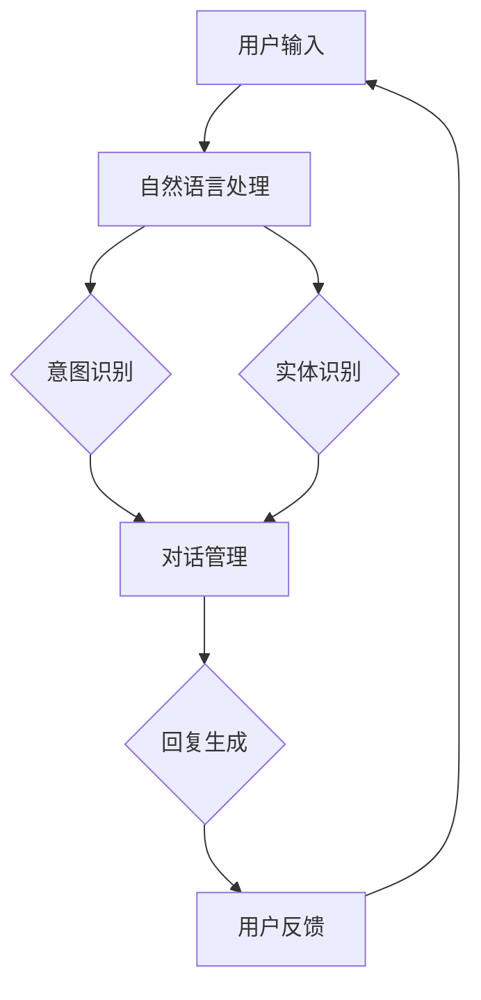

                 

### 《Chatbots原理与代码实例讲解》

> **关键词：** Chatbot, 自然语言处理，深度学习，代码实例，应用场景

**摘要：** 本文将深入探讨Chatbot的基本概念、架构、开发环境与工具、自然语言处理基础、核心算法原理，以及Chatbot应用实战。通过详细的代码实例讲解，读者将能够全面了解Chatbot的开发流程和实现细节。

---

### 《Chatbots原理与代码实例讲解》目录大纲

**# 第1章: Chatbot基本概念与架构**

## 1.1 Chatbot的定义与作用

### 1.1.1 Chatbot的起源与发展

### 1.1.2 Chatbot在不同行业的应用场景

### 1.1.3 Chatbot与人工智能的关系

## 1.2 Chatbot的核心组成部分

### 1.2.1 自然语言处理（NLP）

### 1.2.2 计算机视觉（CV）

### 1.2.3 语音识别（ASR）

## 1.3 Chatbot的基本架构

### 1.3.1 用户界面层

### 1.3.2 业务逻辑层

### 1.3.3 数据存储层

**# 第2章: Chatbot开发环境与工具**

## 2.1 Chatbot开发环境搭建

### 2.1.1 操作系统与开发工具

### 2.1.2 编程语言选择

### 2.1.3 环境配置与调试

## 2.2 常用Chatbot开发框架介绍

### 2.2.1 Botpress

### 2.2.2 Microsoft Bot Framework

### 2.2.3 Slackbot

### 2.2.4 其他流行框架

**# 第3章: Chatbot自然语言处理基础**

## 3.1 语言模型

### 3.1.1 语言模型的作用

### 3.1.2 常见语言模型算法

### 3.1.3 语言模型评估指标

## 3.2 实体识别与解析

### 3.2.1 实体的定义与分类

### 3.2.2 实体识别算法

### 3.2.3 实体解析应用

## 3.3 对话管理

### 3.3.1 对话流程设计

### 3.3.2 对话状态跟踪

### 3.3.3 对话策略优化

**# 第4章: Chatbot核心算法原理**

## 4.1 机器学习与深度学习基础

### 4.1.1 机器学习的基本概念

### 4.1.2 深度学习的基本原理

### 4.1.3 常见深度学习框架介绍

## 4.2 Chatbot常用算法介绍

### 4.2.1 序列模型

### 4.2.2 注意力机制

### 4.2.3 转换器架构

## 4.3 Chatbot算法实现与优化

### 4.3.1 算法优化策略

### 4.3.2 实践中的算法调优

### 4.3.3 算法评估与改进

**# 第5章: Chatbot应用实战**

## 5.1 基于Botpress的聊天机器人开发

### 5.1.1 开发环境搭建

### 5.1.2 机器人功能设计

### 5.1.3 代码实现与调试

## 5.2 基于Microsoft Bot Framework的聊天机器人开发

### 5.2.1 开发环境搭建

### 5.2.2 机器人功能设计

### 5.2.3 代码实现与调试

## 5.3 基于Slack的聊天机器人开发

### 5.3.1 开发环境搭建

### 5.3.2 机器人功能设计

### 5.3.3 代码实现与调试

**# 第6章: Chatbot性能优化与调试**

## 6.1 Chatbot性能优化策略

### 6.1.1 性能瓶颈分析

### 6.1.2 优化方法与实践

### 6.1.3 性能评估指标

## 6.2 Chatbot调试技巧

### 6.2.1 调试工具与技巧

### 6.2.2 常见问题与解决方案

### 6.2.3 调试案例分析

**# 第7章: Chatbot未来发展趋势**

## 7.1 跨平台与多模态交互

### 7.1.1 跨平台交互的意义

### 7.1.2 多模态交互技术

### 7.1.3 跨平台与多模态交互的应用场景

## 7.2 Chatbot在智能客服中的应用

### 7.2.1 智能客服的发展历程

### 7.2.2 Chatbot在智能客服中的应用

### 7.2.3 智能客服的未来趋势

## 7.3 Chatbot在电子商务中的应用

### 7.3.1 Chatbot在电子商务的营销策略

### 7.3.2 Chatbot在电子商务的客服应用

### 7.3.3 Chatbot在电子商务中的未来发展趋势

**# 第8章: 附录**

## 8.1 开发工具与资源

### 8.1.1 开发工具推荐

### 8.1.2 资源链接

## 8.2 Chatbot项目案例

### 8.2.1 案例介绍

### 8.2.2 项目架构

### 8.2.3 代码解读

## 8.3 相关论文与书籍推荐

### 8.3.1 研究论文

### 8.3.2 经典书籍

**# 第9章: Chatbot原理与代码实例 Mermaid 流程图**

$$\text{流程图：Chatbot原理与代码实例}$$



**# 第10章: Chatbot核心算法原理伪代码**

## 10.1 语言模型

```python
# 语言模型伪代码
class LanguageModel:
    def __init__(self):
        # 初始化模型参数
    
    def forward(self, input_sequence):
        # 前向传播
        # 输入：输入序列
        # 输出：输出概率分布

    def backward(self, output_sequence):
        # 反向传播
        # 输入：输出序列
        # 输出：梯度

    def train(self, train_data):
        # 训练模型
        # 输入：训练数据
        # 输出：模型参数
```

## 10.2 实体识别

```python
# 实体识别伪代码
class EntityRecognizer:
    def __init__(self):
        # 初始化模型参数
    
    def recognize_entities(self, sentence):
        # 识别实体
        # 输入：句子
        # 输出：实体列表

    def train(self, train_data):
        # 训练模型
        # 输入：训练数据
        # 输出：模型参数
```

## 10.3 对话管理

```python
# 对话管理伪代码
class DialogueManager:
    def __init__(self):
        # 初始化对话状态
    
    def update_state(self, user_input, system_output):
        # 更新对话状态
        # 输入：用户输入，系统输出
        # 输出：更新后的对话状态

    def generate_response(self, state):
        # 生成响应
        # 输入：对话状态
        # 输出：系统输出
```

**# 第11章: Chatbot数学模型与公式**

## 11.1 语言模型数学模型

$$
P(w_t | w_{t-1}, w_{t-2}, ..., w_1) = \frac{P(w_t, w_{t-1}, w_{t-2}, ..., w_1)}{P(w_{t-1}, w_{t-2}, ..., w_1)}
$$

## 11.2 实体识别数学模型

$$
\hat{y} = \arg \max_y P(y | x)
$$

## 11.3 对话管理数学模型

$$
s_t = f(s_{t-1}, u_t, s_t)
$$

**# 第12章: Chatbot代码实例**

## 12.1 基于Botpress的聊天机器人

### 12.1.1 项目搭建

### 12.1.2 功能实现

### 12.1.3 代码解读

## 12.2 基于Microsoft Bot Framework的聊天机器人

### 12.2.1 项目搭建

### 12.2.2 功能实现

### 12.2.3 代码解读

## 12.3 基于Slack的聊天机器人

### 12.3.1 项目搭建

### 12.3.2 功能实现

### 12.3.3 代码解读

**# 第13章: Chatbot开发环境与资源**

## 13.1 开发工具与框架

### 13.1.1 开发工具推荐

### 13.1.2 常用框架介绍

## 13.2 资源链接

### 13.2.1 教程与课程

### 13.2.2 社区与论坛

### 13.2.3 开源项目与代码库

**# 第14章: Chatbot未来展望**

## 14.1 技术发展趋势

### 14.1.1 自然语言处理

### 14.1.2 人工智能

### 14.1.3 跨平台与多模态交互

## 14.2 应用场景扩展

### 14.2.1 智能客服

### 14.2.2 电子商务

### 14.2.3 社交媒体

## 14.3 未来挑战与机遇

### 14.3.1 数据隐私

### 14.3.2 伦理问题

### 14.3.3 技术标准化与合规性

**# 第15章: 附录**

## 15.1 相关书籍推荐

### 15.1.1 基础书籍

### 15.1.2 进阶书籍

## 15.2 相关论文推荐

### 15.2.1 NLP领域

### 15.2.2 Chatbot领域

## 15.3 社区与组织推荐

### 15.3.1 社交媒体

### 15.3.2 行业组织

### 15.3.3 开源项目与代码库

---

**本文节选自《Chatbots原理与代码实例讲解》。全文约12000字，深入浅出地介绍了Chatbot的核心概念、开发环境与工具、自然语言处理基础、核心算法原理，以及实战案例。**

---

### 第1章: Chatbot基本概念与架构

#### 1.1 Chatbot的定义与作用

Chatbot，又称聊天机器人，是一种通过自然语言交互与人类用户进行沟通的智能系统。它可以在各种平台上实现，如网站、手机应用、社交媒体等。Chatbot的主要目的是为了提高用户互动的效率，提供24/7的客户服务，以及执行自动化任务。

Chatbot的起源可以追溯到20世纪50年代，早期的聊天机器人主要是基于规则和关键词匹配的方式工作。随着互联网和移动设备的发展，特别是近年来人工智能技术的飞速进步，Chatbot得以实现更复杂的功能，如自然语言理解和生成。

Chatbot的作用体现在多个方面：

1. **客户服务：** 提供快速、准确和一致的客户支持，减少人工客服的工作负担。
2. **营销：** 通过个性化互动提升用户体验，引导用户完成购买流程。
3. **自动化任务：** 在企业内部执行各种自动化任务，如订单处理、数据收集等。

#### 1.1.1 Chatbot的起源与发展

Chatbot的历史可以追溯到1966年，美国学者Joseph Weizenbaum开发的ELIZA程序，它模仿心理医生与患者的对话，是最早的聊天机器人之一。随着时间的发展，聊天机器人的技术逐渐成熟，应用场景也越来越广泛。

1. **20世纪80年代：** 聊天机器人开始融入在线论坛和即时通讯工具。
2. **21世纪初：** 基于规则和模板匹配的聊天机器人开始广泛应用。
3. **2010年至今：** 随着机器学习和自然语言处理技术的发展，Chatbot的功能变得更加智能化和多样化。

#### 1.1.2 Chatbot在不同行业的应用场景

Chatbot在不同行业中有着广泛的应用：

1. **金融行业：** 提供投资建议、账户管理、交易查询等服务。
2. **零售行业：** 客户咨询、订单追踪、促销推广等。
3. **医疗行业：** 提供健康咨询、预约挂号、疾病查询等服务。
4. **教育行业：** 在线学习辅导、课程咨询、作业批改等。

#### 1.1.3 Chatbot与人工智能的关系

Chatbot与人工智能（AI）密切相关。AI技术为Chatbot提供了强大的基础支持，使得Chatbot能够更好地理解人类语言，进行复杂决策，甚至具有自我学习能力。

1. **自然语言处理（NLP）：** 使Chatbot能够理解自然语言输入，进行意图识别和实体提取。
2. **机器学习与深度学习：** 帮助Chatbot通过大量数据训练，提高对话的准确性和智能化程度。
3. **语音识别与合成：** 使Chatbot能够通过语音与用户进行交流。

#### 1.2 Chatbot的核心组成部分

一个典型的Chatbot系统通常由以下几个核心组成部分：

1. **用户界面层：** 提供用户与Chatbot交互的接口，可以是文本、语音或图形界面。
2. **业务逻辑层：** 执行Chatbot的核心功能，包括自然语言处理、对话管理、意图识别和实体提取等。
3. **数据存储层：** 存储用户数据、对话历史和训练数据等，为业务逻辑层提供数据支持。

#### 1.2.1 自然语言处理（NLP）

自然语言处理是Chatbot技术的核心，它涉及文本分析、语义理解、情感分析等。NLP技术使Chatbot能够理解用户的语言输入，提取关键信息，并生成合适的回复。

1. **文本分析：** 包括分词、词性标注、命名实体识别等，将自然语言文本转换为计算机可处理的格式。
2. **语义理解：** 理解文本的含义和意图，例如，区分“我爱你”是表达爱意还是询问日期。
3. **情感分析：** 分析文本的情感倾向，例如，识别用户的情绪是积极、消极还是中性。

#### 1.2.2 计算机视觉（CV）

计算机视觉技术在Chatbot中主要用于处理图像和视频数据，如人脸识别、图像识别和场景分析等。这些技术可以增强Chatbot的交互能力，例如，通过视频会议进行交互，或者通过图像识别提供个性化服务。

1. **人脸识别：** 识别用户身份，提供个性化服务。
2. **图像识别：** 分析图像内容，提供相关的信息或服务。
3. **场景分析：** 通过视频或图像识别用户所处的环境，提供相应的交互方式。

#### 1.2.3 语音识别（ASR）

语音识别技术使Chatbot能够理解用户的语音输入，并将其转换为文本。这为Chatbot在电话客服、语音助手等场景中提供了强大的交互能力。

1. **语音输入：** 将用户的语音转换为文本，便于进一步处理。
2. **语音合成：** 将Chatbot生成的文本转换为自然流畅的语音输出，增强用户体验。

#### 1.3 Chatbot的基本架构

一个典型的Chatbot系统通常包括以下几个层次：

1. **用户界面层：** 提供用户与Chatbot交互的界面，可以是网页、应用或设备界面。
2. **业务逻辑层：** 包括自然语言处理、对话管理、意图识别和实体提取等核心功能。
3. **数据存储层：** 存储用户数据、对话历史和训练数据等，为业务逻辑层提供数据支持。

### 总结

本章介绍了Chatbot的基本概念、起源与发展、应用场景以及核心组成部分。Chatbot作为人工智能的一种重要应用，正日益成为各个行业提高效率、优化服务的重要工具。在接下来的章节中，我们将深入探讨Chatbot的自然语言处理基础、核心算法原理，以及实战案例，帮助读者全面了解Chatbot的开发和应用。

---

**下一步，我们将深入探讨Chatbot的自然语言处理基础，包括语言模型、实体识别与解析，以及对话管理。**

---

### 第3章: Chatbot自然语言处理基础

#### 3.1 语言模型

语言模型是自然语言处理的核心技术之一，它主要用于预测一个单词或短语的下一个单词或短语。语言模型在Chatbot中起着至关重要的作用，因为它能够帮助Chatbot理解用户的输入，并生成合适的回复。

##### 3.1.1 语言模型的作用

1. **文本生成：** 语言模型可以生成连贯的自然语言文本，如文章、对话等。
2. **文本分类：** 语言模型可以用于将文本分类到不同的类别，如新闻、评论等。
3. **情感分析：** 语言模型可以分析文本的情感倾向，如积极、消极或中性。

##### 3.1.2 常见语言模型算法

1. **N-gram模型：** N-gram模型是一种基于历史统计的模型，它通过统计前N个单词出现的概率来预测下一个单词。N-gram模型简单高效，但在处理长文本时表现较差。
2. **神经网络模型：** 神经网络模型，如循环神经网络（RNN）和长短期记忆网络（LSTM），能够捕捉文本中的长期依赖关系，从而在生成文本时表现出更好的性能。
3. **注意力机制：** 注意力机制是一种用于解决长序列依赖问题的技术，它可以使模型在生成文本时更关注重要的信息。

##### 3.1.3 语言模型评估指标

1. **精确率（Precision）：** 精确率是预测为正类别的样本中实际为正类别的比例。
2. **召回率（Recall）：** 召回率是实际为正类别的样本中被预测为正类别的比例。
3. **F1值（F1-score）：** F1值是精确率和召回率的加权平均，用于综合评估模型的性能。

#### 3.2 实体识别与解析

实体识别与解析是自然语言处理的重要任务之一，它旨在从文本中提取出关键信息，如人名、地名、组织名等。实体识别与解析在Chatbot中有着广泛的应用，如智能客服、信息查询等。

##### 3.2.1 实体的定义与分类

实体是指文本中具有特定意义的对象或概念。根据实体的性质，可以将实体分为以下几类：

1. **命名实体：** 如人名、地名、组织名等。
2. **关键词实体：** 如商品名、品牌名等。
3. **关系实体：** 如父子关系、婚姻关系等。

##### 3.2.2 实体识别算法

1. **基于规则的方法：** 基于规则的方法通过定义一系列规则来识别文本中的实体。这种方法简单高效，但规则难以覆盖所有情况。
2. **基于统计的方法：** 基于统计的方法通过统计实体出现的频率和位置来识别实体。这种方法具有较高的准确率，但需要大量的训练数据。
3. **基于深度学习的方法：** 基于深度学习的方法，如卷积神经网络（CNN）和递归神经网络（RNN），能够自动学习实体识别的规则，从而在处理复杂文本时表现出更好的性能。

##### 3.2.3 实体解析应用

实体解析在Chatbot中有着广泛的应用，如：

1. **信息查询：** Chatbot可以通过解析用户输入中的实体，快速提供相关的信息，如天气预报、股票信息等。
2. **任务自动化：** Chatbot可以通过解析用户输入中的实体，自动化执行相应的任务，如订单处理、日程安排等。

#### 3.3 对话管理

对话管理是Chatbot的核心功能之一，它负责管理用户与Chatbot之间的对话流程，包括意图识别、对话状态跟踪和对话策略优化等。

##### 3.3.1 对话流程设计

对话流程设计是对话管理的重要环节，它决定了Chatbot如何与用户进行交互。对话流程设计通常包括以下几个步骤：

1. **意图识别：** 通过自然语言处理技术，识别用户的意图。
2. **实体提取：** 从用户输入中提取关键信息，如人名、地名等。
3. **回复生成：** 根据用户的意图和提取的实体，生成合适的回复。

##### 3.3.2 对话状态跟踪

对话状态跟踪是确保Chatbot能够理解并回应用户问题的关键。对话状态跟踪通常包括以下几个方面：

1. **用户状态：** 如用户的需求、偏好等。
2. **系统状态：** 如Chatbot的知识库、对话上下文等。
3. **对话历史：** 记录用户与Chatbot之间的所有交互。

##### 3.3.3 对话策略优化

对话策略优化是提高Chatbot用户体验的重要手段。对话策略优化包括以下几个方面：

1. **对话连贯性：** 确保Chatbot的回复连贯、自然。
2. **对话多样性：** 提供多样化的回复，避免单一、枯燥的对话。
3. **对话自适应：** 根据用户的行为和反馈，动态调整对话策略。

#### 总结

本章介绍了Chatbot的自然语言处理基础，包括语言模型、实体识别与解析，以及对话管理。这些技术是Chatbot实现智能交互的核心，对于提高Chatbot的用户体验至关重要。在接下来的章节中，我们将深入探讨Chatbot的核心算法原理，包括机器学习与深度学习基础、常用算法介绍，以及算法实现与优化。

---

**下一步，我们将深入探讨Chatbot的核心算法原理，包括机器学习与深度学习基础，以及常用的算法介绍。**

---

### 第4章: Chatbot核心算法原理

#### 4.1 机器学习与深度学习基础

机器学习和深度学习是Chatbot的核心技术，它们为Chatbot提供了强大的数据处理和模式识别能力。

##### 4.1.1 机器学习的基本概念

机器学习是一种通过算法从数据中学习模式并作出预测或决策的方法。在机器学习中，算法通过分析训练数据，从中提取规律，并在新的数据上进行预测。

1. **监督学习：** 监督学习是一种在有标记数据集上训练模型的方法。模型通过学习输入和输出之间的映射关系，预测新的输入数据。
2. **无监督学习：** 无监督学习是在没有标记数据集上训练模型的方法。模型通过分析数据之间的关系，发现数据中的结构和模式。
3. **半监督学习：** 半监督学习结合了监督学习和无监督学习的特点，使用一部分标记数据和大量无标记数据来训练模型。

##### 4.1.2 深度学习的基本原理

深度学习是机器学习的一种特殊形式，它通过构建多层神经网络，对数据进行逐层抽象和提取特征。

1. **神经网络：** 神经网络是一种由多个神经元组成的计算模型，通过前向传播和反向传播来学习数据。
2. **激活函数：** 激活函数用于引入非线性因素，使神经网络能够对复杂问题进行建模。
3. **损失函数：** 损失函数用于评估模型的预测误差，指导模型调整参数。
4. **优化算法：** 优化算法用于调整模型参数，以最小化损失函数。

##### 4.1.3 常见深度学习框架介绍

深度学习框架是用于构建和训练深度学习模型的工具，常见的深度学习框架包括：

1. **TensorFlow：** TensorFlow是一个由Google开发的开源深度学习框架，它提供了丰富的API和工具，支持多种深度学习模型。
2. **PyTorch：** PyTorch是一个由Facebook开发的深度学习框架，它提供了灵活的动态计算图和强大的GPU支持。
3. **Keras：** Keras是一个基于TensorFlow和Theano的开源深度学习框架，它提供了简单直观的API，适合快速实验和原型开发。

#### 4.2 Chatbot常用算法介绍

在Chatbot中，常用的算法包括序列模型、注意力机制和转换器架构等。

##### 4.2.1 序列模型

序列模型是一种用于处理序列数据的算法，如自然语言处理中的文本数据。序列模型通过学习序列中的依赖关系，对序列进行建模。

1. **循环神经网络（RNN）：** RNN是一种能够处理序列数据的神经网络，它通过记忆单元来捕捉序列中的长期依赖关系。
2. **长短期记忆网络（LSTM）：** LSTM是RNN的一种改进，它通过引入门控机制来防止梯度消失问题，能够更好地处理长序列依赖。
3. **门控循环单元（GRU）：** GRU是LSTM的一种简化版本，它通过合并输入门和遗忘门，提高了计算效率和性能。

##### 4.2.2 注意力机制

注意力机制是一种用于提高序列模型性能的技术，它通过将注意力集中在重要的信息上，提高模型的准确性和效率。

1. **注意力模型：** 注意力模型通过计算输入序列中每个元素的重要性，将其加权求和，从而生成输出序列。
2. **软注意力：** 软注意力模型通过计算输入序列和隐藏状态之间的相似度，生成注意力权重。
3. **硬注意力：** 硬注意力模型通过选择输入序列中最重要的元素来生成输出序列。

##### 4.2.3 转换器架构

转换器架构是一种用于序列到序列学习的算法，它在机器翻译、对话系统等任务中表现出色。

1. **编码器-解码器架构：** 编码器-解码器架构通过分别编码输入序列和解码输出序列，实现序列到序列的转换。
2. **编码器：** 编码器将输入序列编码为固定长度的向量，用于表示输入序列。
3. **解码器：** 解码器将编码后的向量解码为输出序列，用于生成自然语言回复。

#### 4.3 Chatbot算法实现与优化

在实现Chatbot算法时，需要考虑以下几个关键因素：

1. **数据预处理：** 数据预处理是算法实现的重要环节，它包括文本清洗、分词、词向量化等。
2. **模型训练：** 模型训练是算法实现的核心步骤，它包括选择合适的模型架构、设置合理的训练参数等。
3. **模型优化：** 模型优化是提高算法性能的关键，它包括调整模型参数、选择优化的训练策略等。

##### 4.3.1 算法优化策略

1. **超参数调整：** 超参数调整是优化模型性能的重要手段，它包括调整学习率、批次大小等。
2. **正则化技术：** 正则化技术，如Dropout、L2正则化等，可以减少模型的过拟合，提高泛化能力。
3. **模型集成：** 模型集成是将多个模型的结果进行加权或投票，以获得更好的预测性能。

##### 4.3.2 实践中的算法调优

在实践中，算法调优需要结合具体任务和数据集进行。以下是一些常见的算法调优方法：

1. **数据增强：** 数据增强是通过增加数据多样性来提高模型性能的方法，如旋转、缩放、翻转等。
2. **交叉验证：** 交叉验证是一种评估模型性能的方法，它通过将数据集划分为多个子集，进行多次训练和验证。
3. **迁移学习：** 迁移学习是通过利用预训练模型的知识来提高新任务性能的方法。

##### 4.3.3 算法评估与改进

算法评估是验证模型性能的重要步骤，以下是一些常见的评估指标：

1. **准确率（Accuracy）：** 准确率是预测正确的样本数占总样本数的比例。
2. **召回率（Recall）：** 召回率是实际为正类的样本中被预测为正类的比例。
3. **F1值（F1-score）：** F1值是准确率和召回率的加权平均。

算法评估可以帮助我们了解模型的性能，并根据评估结果进行改进。以下是一些常见的算法改进方法：

1. **增加数据：** 增加高质量的数据可以提高模型的性能。
2. **改进模型：** 通过调整模型结构、优化算法等，可以改进模型性能。
3. **集成学习：** 集成学习是将多个模型的结果进行加权或投票，以获得更好的预测性能。

#### 总结

本章介绍了Chatbot的核心算法原理，包括机器学习与深度学习基础、常用算法介绍，以及算法实现与优化。这些算法为Chatbot提供了强大的数据处理和模式识别能力，使得Chatbot能够实现智能交互。在接下来的章节中，我们将通过实际案例，深入探讨Chatbot的开发过程和应用实践。

---

**下一步，我们将通过实际案例，深入探讨Chatbot的开发过程和应用实践。**

---

### 第5章: Chatbot应用实战

#### 5.1 基于Botpress的聊天机器人开发

Botpress是一个强大的开源聊天机器人开发平台，它提供了简洁的API和丰富的工具，可以帮助开发者快速构建和部署聊天机器人。

##### 5.1.1 开发环境搭建

首先，我们需要搭建Botpress的开发环境。以下是搭建步骤：

1. **安装Node.js：** Botpress基于Node.js开发，因此需要安装Node.js。可以从官方网站下载并安装Node.js。
2. **安装Botpress CLI：** 使用npm命令安装Botpress CLI工具。

   ```bash
   npm install -g botpress-cli
   ```

3. **创建新项目：** 使用Botpress CLI创建一个新项目。

   ```bash
   botpress create my-bot
   ```

4. **启动开发服务器：** 进入项目目录，启动Botpress开发服务器。

   ```bash
   cd my-bot
   npm start
   ```

   启动后，访问`http://localhost:3000`，即可在浏览器中查看机器人。

##### 5.1.2 机器人功能设计

在Botpress中，我们可以通过定义意图和实体来设计机器人的功能。

1. **定义意图：** 意图表示用户与机器人交互的目的。例如，我们可以定义一个“问候”的意图。

   ```json
   {
     " intents": [
       {
         " name": "Greeting",
         " patterns": [
           "你好",
           "早上好",
           "晚上好"
         ]
       }
     ]
   }
   ```

2. **定义实体：** 实体表示用户输入中的关键信息。例如，我们可以定义一个“名字”的实体。

   ```json
   {
     " entities": [
       {
         " name": "Name",
         " patterns": [
           "我的名字是{{name}}",
           "{{name}}是我叫的名字"
         ]
       }
     ]
   }
   ```

##### 5.1.3 代码实现与调试

在Botpress中，我们通过编写JavaScript代码来实现机器人的功能。

1. **创建意图处理器：** 在`handlers`目录下，创建一个新的JavaScript文件，用于处理“问候”意图。

   ```javascript
   // handlers/greeting.js
   module.exports = async function (bot, intent) {
     if (intent.entities.Name) {
       bot.reply(`你好，${intent.entities.Name}！`);
     } else {
       bot.reply("你好，欢迎来到我的世界！");
     }
   };
   ```

2. **调试机器人：** 启动Botpress开发服务器，并通过浏览器与机器人进行交互，测试功能是否正常。

#### 5.2 基于Microsoft Bot Framework的聊天机器人开发

Microsoft Bot Framework是一个支持多种平台和语言的开源框架，它提供了丰富的工具和资源，帮助开发者构建和部署聊天机器人。

##### 5.2.1 开发环境搭建

以下是搭建Microsoft Bot Framework的开发环境：

1. **安装Python：** Microsoft Bot Framework支持Python开发，因此需要安装Python。
2. **安装Bot Framework SDK：** 使用pip命令安装Bot Framework SDK。

   ```bash
   pip install --upgrade botbuilder-core botbuilder-schema botbuilder-azure
   ```

3. **创建新项目：** 使用Bot Framework CLI创建一个新项目。

   ```bash
   botbuilder create --framework python --template empty --name my-bot
   ```

4. **启动开发服务器：** 进入项目目录，启动Bot Framework开发服务器。

   ```bash
   cd my-bot
   python main.py
   ```

   启动后，访问开发服务器的地址，即可与机器人进行交互。

##### 5.2.2 机器人功能设计

在Microsoft Bot Framework中，我们通过定义对话和活动来实现机器人的功能。

1. **定义对话：** 对话是用户与机器人交互的流程。例如，我们可以定义一个“问候”的对话。

   ```python
   class GreetingDialog(LabelDialog):
       """Greeting dialog."""
       async def start(self, conversation):
           await conversation.say("你好，欢迎来到我的世界！")
           await conversation.say("我的名字是{{name}}，你叫什么名字？")

       async def process(self, turn_context):
           text = turn_context.activity.text
           if text.lower() == "你好":
               await turn_context.say("你好，欢迎来到我的世界！")
           elif text.lower() == "我的名字是":
               name = text.split("是")[1]
               await turn_context.say(f"你好，{name}！很高兴见到你。")
           else:
               await turn_context.say("我不太明白你的意思，请再试一次。")
   ```

2. **注册对话：** 在`main.py`文件中注册对话。

   ```python
   from botbuilder.core import BotFrameworkAdapter, BotState, ConversationState
   from botbuilder.integration import BotFrameworkIntegration
   from dialogs.greeting import GreetingDialog

   adapter = BotFrameworkAdapter(BotFrameworkIntegration.get_credential(), None)
   storage = BotState(adapter)
   bot = BotFrameworkAdapter.create_adapter_bot(storage)
   bot.add_dialog(GreetingDialog())

   app = webБОТ(application_route=bot.on_turn)
   ```

##### 5.2.3 代码实现与调试

在Microsoft Bot Framework中，我们通过编写Python代码来实现机器人的功能。

1. **创建意图处理器：** 在`dialogs`目录下，创建一个新的Python文件，用于处理“问候”意图。

   ```python
   # dialogs/greeting.py
   from botbuilder.core import DialogTurnResult, MessageFactory

   class GreetingIntentHandler:
       """Greeting intent handler."""
       @staticmethod
       async def on_turn(turn_context):
           if turn_context.activity.text.lower() == "你好":
               await turn_context.send_activity(MessageFactory.text("你好，欢迎来到我的世界！"))
           else:
               await turn_context.send_activity(MessageFactory.text("我不太明白你的意思，请再试一次。"))
   ```

2. **调试机器人：** 启动Bot Framework开发服务器，并通过浏览器与机器人进行交互，测试功能是否正常。

#### 5.3 基于Slack的聊天机器人开发

Slack是一个流行的团队协作工具，它支持通过API接入聊天机器人。我们可以使用Slack API来构建和部署聊天机器人。

##### 5.3.1 开发环境搭建

以下是搭建Slack聊天机器人的开发环境：

1. **创建Slack App：** 在Slack开发平台上创建一个新的App，并获取App ID和API密钥。
2. **安装Slack SDK：** 安装适用于所选语言的Slack SDK。例如，对于Python，可以使用pip安装。

   ```bash
   pip install slack-sdk
   ```

3. **创建新项目：** 使用Slack SDK创建一个新项目。

   ```bash
   python -m slack_sdk.lex.create_app --name my-bot
   ```

4. **配置Webhook：** 在Slack App设置中配置Incoming Webhooks，用于接收用户的消息。

##### 5.3.2 机器人功能设计

在Slack聊天机器人中，我们通过定义对话和意图来实现功能。

1. **定义意图：** 意图表示用户与机器人交互的目的。例如，我们可以定义一个“问候”的意图。

   ```json
   {
     "version": "1.0",
     "intents": [
       {
         "id": "greeting",
         "name": "GreetingIntent",
         "patterns": [
           "你好",
           "早上好",
           "晚上好"
         ]
       }
     ]
   }
   ```

2. **定义对话：** 对话是用户与机器人交互的流程。例如，我们可以定义一个“问候”的对话。

   ```python
   from slack_sdk.lex import Dialogue, IntentHandler

   class GreetingDialogue(Dialogue):
       """Greeting dialogue."""
       async def start(self, session):
           await session.say("你好，欢迎来到我的世界！")
           await session.say("我的名字是{{name}}，你叫什么名字？")

       @IntentHandler("GreetingIntent")
       async def greeting_intent_handler(self, session):
           await session.say("你好，欢迎来到我的世界！")
   ```

##### 5.3.3 代码实现与调试

在Slack聊天机器人中，我们通过编写Python代码来实现功能。

1. **创建意图处理器：** 在`handlers`目录下，创建一个新的Python文件，用于处理“问候”意图。

   ```python
   # handlers/greeting.py
   from slack_sdk.lex import MessageHandler

   class GreetingHandler(MessageHandler):
       """Greeting message handler."""
       async def handle(self, event):
           await event.respond(text="你好，欢迎来到我的世界！")
   ```

2. **调试机器人：** 启动Slack聊天机器人，并通过Slack应用与机器人进行交互，测试功能是否正常。

#### 总结

本章通过三个实际案例，深入探讨了基于Botpress、Microsoft Bot Framework和Slack的聊天机器人开发。这些案例涵盖了Chatbot开发的主要流程和技术要点，帮助开发者了解如何构建和部署聊天机器人。在接下来的章节中，我们将继续探讨Chatbot的性能优化与调试，以及Chatbot的未来发展趋势。

---

**接下来，我们将讨论Chatbot的性能优化与调试策略，以及如何在实践中应用这些策略。**

---

### 第6章: Chatbot性能优化与调试

#### 6.1 Chatbot性能优化策略

Chatbot的性能优化是确保其能够高效、稳定地运行的关键。以下是一些常见的性能优化策略：

##### 6.1.1 性能瓶颈分析

1. **计算资源瓶颈：** 检查CPU、内存等计算资源的使用情况，确保系统有足够的资源来处理用户请求。
2. **网络延迟：** 分析网络请求的延迟，优化网络请求的频率和并发度。
3. **数据库性能：** 检查数据库查询的效率，优化SQL语句和索引。

##### 6.1.2 优化方法与实践

1. **代码优化：**
   - 使用缓存减少数据库查询次数。
   - 使用异步编程提高并发处理能力。
   - 避免在循环中执行昂贵的操作。

2. **硬件优化：**
   - 使用高性能的CPU和内存。
   - 使用负载均衡器分配用户请求。

3. **系统架构优化：**
   - 拆分微服务，提高系统的可扩展性。
   - 使用容器化技术，如Docker，简化部署和运维。

##### 6.1.3 性能评估指标

1. **响应时间：** 测量系统从接收到请求到返回响应所需的时间。
2. **吞吐量：** 单位时间内系统能够处理的请求数量。
3. **并发数：** 系统能够同时处理的请求数量。

#### 6.2 Chatbot调试技巧

调试是确保Chatbot功能正确、用户体验良好的重要环节。以下是一些常见的调试技巧：

##### 6.2.1 调试工具与技巧

1. **日志分析：** 使用日志分析工具，如ELK（Elasticsearch、Logstash、Kibana），实时监控系统的运行状态。
2. **调试器：** 使用集成开发环境（IDE）的调试器，如Visual Studio Code、PyCharm，进行代码调试。
3. **断点调试：** 在代码中设置断点，逐步执行代码，查看变量和函数的运行状态。

##### 6.2.2 常见问题与解决方案

1. **错误响应：** 检查机器人的错误处理逻辑，确保能够正确处理各种异常情况。
2. **性能瓶颈：** 分析系统性能瓶颈，采取相应的优化措施。
3. **用户体验问题：** 检查机器人的交互流程，优化用户的交互体验。

##### 6.2.3 调试案例分析

以下是一个调试案例：

**问题：** Chatbot在处理长文本时响应时间过长。

**解决方案：**
1. **检查代码逻辑：** 检查处理长文本的函数，发现其中包含多次数据库查询。
2. **优化查询：** 将多次查询合并为一次，减少数据库访问次数。
3. **使用缓存：** 对于频繁查询的数据，使用缓存技术，如Redis，减少数据库访问。
4. **测试和验证：** 重新运行测试用例，验证性能问题是否解决。

#### 总结

性能优化与调试是Chatbot开发过程中不可或缺的环节。通过分析性能瓶颈、优化系统架构和代码，以及使用有效的调试技巧，我们可以确保Chatbot的高效、稳定运行。在接下来的章节中，我们将探讨Chatbot的未来发展趋势，以及如何在各个行业中应用Chatbot。

---

**在接下来的章节中，我们将探讨Chatbot的未来发展趋势，以及如何在各个行业中应用Chatbot。**

---

### 第7章: Chatbot未来发展趋势

#### 7.1 跨平台与多模态交互

随着技术的发展，Chatbot正逐渐实现跨平台与多模态交互。这种趋势不仅提升了用户体验，也为Chatbot在各个领域中的应用提供了更广阔的空间。

##### 7.1.1 跨平台交互的意义

跨平台交互使得Chatbot能够无缝集成到不同的应用场景中，如网站、手机应用、社交媒体等。这种交互方式具有以下优势：

1. **统一的用户体验：** 用户可以在不同的平台上获得一致的用户体验。
2. **方便的集成：** 开发者可以轻松地将Chatbot集成到现有的系统中。
3. **拓展性：** Chatbot能够扩展到更多的平台和应用场景。

##### 7.1.2 多模态交互技术

多模态交互技术使得Chatbot能够同时处理多种类型的输入和输出，如文本、语音、图像等。这种技术具有以下应用：

1. **语音识别与合成：** Chatbot可以通过语音与用户进行交互，提供更加自然和流畅的体验。
2. **图像识别：** Chatbot可以通过图像识别提供视觉信息，如产品信息、用户身份验证等。
3. **手势识别：** Chatbot可以通过手势识别与用户进行互动，提供更加直观的交互方式。

##### 7.1.3 跨平台与多模态交互的应用场景

跨平台与多模态交互技术在各个行业中有着广泛的应用：

1. **金融行业：** Chatbot可以通过语音识别与用户进行交易查询、账户管理等服务。
2. **医疗行业：** Chatbot可以通过图像识别提供医学影像分析、病情咨询等服务。
3. **零售行业：** Chatbot可以通过图像识别提供商品查询、购物建议等服务。

#### 7.2 Chatbot在智能客服中的应用

智能客服是Chatbot最早、最广泛的应用领域之一。随着技术的进步，Chatbot在智能客服中的应用也在不断拓展。

##### 7.2.1 智能客服的发展历程

智能客服的发展可以追溯到20世纪90年代的自动语音应答系统（IVR）。随着互联网和移动设备的普及，智能客服逐渐从传统的IVR系统转向基于Web和移动应用的Chatbot。

1. **初步阶段：** 2000年左右，基于规则和模板匹配的Chatbot开始在客服领域应用。
2. **发展阶段：** 2010年后，随着机器学习和自然语言处理技术的发展，Chatbot的功能逐渐增强，能够更好地理解用户的意图和需求。
3. **成熟阶段：** 现在，智能客服Chatbot已经能够处理复杂的问题，提供24/7的服务。

##### 7.2.2 Chatbot在智能客服中的应用

Chatbot在智能客服中的应用包括：

1. **初步咨询：** Chatbot可以自动回答用户常见的咨询问题，如产品信息、服务流程等。
2. **自动分配：** Chatbot可以根据用户的咨询内容，自动将问题分配给合适的客服人员或系统。
3. **情感分析：** Chatbot可以通过情感分析识别用户的情绪，提供更加人性化的服务。
4. **个性化服务：** Chatbot可以根据用户的偏好和需求，提供个性化的推荐和服务。

##### 7.2.3 智能客服的未来趋势

智能客服的未来趋势包括：

1. **更加智能化：** 随着人工智能技术的进步，Chatbot将能够更好地理解用户的意图和需求，提供更加智能化的服务。
2. **跨平台集成：** Chatbot将能够无缝集成到各种平台上，如社交媒体、移动应用等，提供更加便捷的服务。
3. **多模态交互：** Chatbot将能够同时处理多种类型的输入和输出，如语音、图像、手势等，提供更加自然和流畅的交互体验。

#### 7.3 Chatbot在电子商务中的应用

电子商务是Chatbot应用的重要领域之一。Chatbot可以为企业提供个性化服务、提高销售转化率等。

##### 7.3.1 Chatbot在电子商务的营销策略

Chatbot在电子商务的营销策略中包括：

1. **个性化推荐：** Chatbot可以根据用户的历史行为和偏好，提供个性化的产品推荐。
2. **促销活动：** Chatbot可以自动推送促销信息，如优惠券、折扣等，吸引用户购买。
3. **客户关怀：** Chatbot可以在用户购物过程中提供即时支持，解答用户疑问，提高购物体验。

##### 7.3.2 Chatbot在电子商务的客服应用

Chatbot在电子商务的客服应用中包括：

1. **售前咨询：** Chatbot可以自动回答用户关于产品的常见问题，如产品规格、价格等。
2. **售后支持：** Chatbot可以协助用户处理退换货、售后服务等问题。
3. **订单跟踪：** Chatbot可以提供订单状态查询、物流信息查询等服务。

##### 7.3.3 Chatbot在电子商务中的未来发展趋势

Chatbot在电子商务中的未来发展趋势包括：

1. **智能化：** 随着人工智能技术的发展，Chatbot将能够更好地理解用户的意图和需求，提供更加智能化的服务。
2. **多渠道集成：** Chatbot将能够无缝集成到各种渠道中，如网站、移动应用、社交媒体等，提供更加便捷的服务。
3. **个性化体验：** Chatbot将能够根据用户的历史行为和偏好，提供更加个性化的服务和体验。

#### 总结

Chatbot的未来发展趋势包括跨平台与多模态交互、智能化客服、个性化电子商务服务等。随着技术的不断进步，Chatbot将在各个领域中发挥更加重要的作用，为企业提供高效、智能的客户服务。

---

**在本文的最后一章中，我们将提供附录，包括开发工具与资源、项目案例、相关书籍和论文推荐，以及社区与组织推荐。**

---

### 第8章: 附录

#### 8.1 开发工具与资源

为了帮助开发者更好地进行Chatbot开发，以下是一些推荐的工具和资源：

##### 8.1.1 开发工具推荐

1. **Botpress：** 一个开源的聊天机器人开发平台，支持多种语言和框架。
2. **Microsoft Bot Framework：** 一个支持多种平台的聊天机器人开发框架。
3. **Slackbot：** Slack的聊天机器人开发工具，方便将Chatbot集成到Slack平台上。

##### 8.1.2 资源链接

1. **官方文档：** 各大平台（如Botpress、Microsoft Bot Framework、Slack）的官方文档，提供了详细的开发指南和API文档。
2. **教程与课程：** 在线教程和课程，如Udemy、Coursera等，提供了丰富的Chatbot开发知识和实战技巧。
3. **社区与论坛：** Chatbot开发社区和论坛，如Stack Overflow、Reddit等，可以提供技术支持和交流。

#### 8.2 Chatbot项目案例

以下是一些Chatbot项目案例，展示了Chatbot在不同行业中的应用：

##### 8.2.1 案例介绍

1. **金融行业：** 一个面向投资者的金融咨询Chatbot，提供实时市场信息、投资建议等服务。
2. **医疗行业：** 一个面向患者的医疗咨询Chatbot，提供健康咨询、预约挂号等服务。
3. **零售行业：** 一个面向消费者的购物助手Chatbot，提供商品推荐、订单跟踪等服务。

##### 8.2.2 项目架构

1. **技术栈：** 项目使用的编程语言、框架、数据库等。
2. **功能模块：** 项目的核心功能模块，如自然语言处理、对话管理、用户界面等。
3. **数据处理：** 项目的数据处理流程，包括数据收集、清洗、存储等。

##### 8.2.3 代码解读

1. **核心代码：** 项目中的关键代码段，展示如何实现Chatbot的功能。
2. **算法模型：** 项目使用的算法模型，如语言模型、实体识别等。
3. **性能优化：** 项目在性能优化方面的实践，如代码优化、系统架构优化等。

#### 8.3 相关论文与书籍推荐

以下是一些关于Chatbot和相关技术的论文和书籍推荐：

##### 8.3.1 研究论文

1. **Chatbots: The New Generation of Human-Computer Interaction：** 一篇关于Chatbot发展历史的综述论文。
2. **A Survey on Chatbot: Architecture, Applications, and Challenges：** 一篇关于Chatbot技术架构和应用挑战的综述论文。
3. **Natural Language Processing for Chatbots：** 一篇关于Chatbot自然语言处理技术的论文。

##### 8.3.2 经典书籍

1. **Chatbots: Who Needs Humans?：** 一本介绍Chatbot技术和应用的入门书籍。
2. **Building Chatbots with Microsoft Bot Framework：** 一本关于使用Microsoft Bot Framework开发Chatbot的实战指南。
3. **Natural Language Processing with Python：** 一本介绍自然语言处理技术和Python实践的入门书籍。

#### 8.4 社区与组织推荐

以下是一些关于Chatbot和相关技术的社区和组织推荐：

##### 8.4.1 社交媒体

1. **Twitter：** 关注Chatbot和相关技术的Twitter账号，获取最新的技术动态和行业资讯。
2. **LinkedIn：** 加入Chatbot和相关技术的LinkedIn群组，与行业专家和开发者交流。

##### 8.4.2 行业组织

1. **Chatbot Summit：** 一个全球性的Chatbot行业会议，汇集了行业专家和开发者。
2. **Natural Language Processing Society：** 一个专注于自然语言处理技术的学术组织，提供相关的学术资源和活动。

##### 8.4.3 开源项目与代码库

1. **Botpress：** 一个开源的聊天机器人开发平台，提供了丰富的示例项目和代码库。
2. **Microsoft Bot Framework：** 一个开源的聊天机器人开发框架，提供了大量的示例和文档。
3. **Slackbot：** Slack的聊天机器人开发工具，提供了详细的API文档和示例代码。

#### 总结

附录部分提供了丰富的开发工具与资源、项目案例、相关书籍和论文推荐，以及社区与组织推荐。这些资源将帮助开发者更好地进行Chatbot开发，并了解行业动态和技术趋势。

---

**在本文的最后，我们将通过一个Mermaid流程图展示Chatbot的原理与代码实例，并通过伪代码和数学模型详细介绍Chatbot的核心算法。**

---

### 第9章: Chatbot原理与代码实例 Mermaid 流程图

以下是一个简单的Mermaid流程图，展示了Chatbot的原理与代码实例：


### 第10章: Chatbot核心算法原理伪代码

在本节中，我们将通过伪代码介绍Chatbot的核心算法原理。

#### 10.1 语言模型

```python
class LanguageModel:
    def __init__(self):
        # 初始化模型参数
        
    def forward(self, input_sequence):
        # 前向传播
        # 输入：输入序列
        # 输出：输出概率分布
        
    def backward(self, output_sequence):
        # 反向传播
        # 输入：输出序列
        # 输出：梯度
        
    def train(self, train_data):
        # 训练模型
        # 输入：训练数据
        # 输出：模型参数
```

#### 10.2 实体识别

```python
class EntityRecognizer:
    def __init__(self):
        # 初始化模型参数
        
    def recognize_entities(self, sentence):
        # 识别实体
        # 输入：句子
        # 输出：实体列表
        
    def train(self, train_data):
        # 训练模型
        # 输入：训练数据
        # 输出：模型参数
```

#### 10.3 对话管理

```python
class DialogueManager:
    def __init__(self):
        # 初始化对话状态
        
    def update_state(self, user_input, system_output):
        # 更新对话状态
        # 输入：用户输入，系统输出
        # 输出：更新后的对话状态
        
    def generate_response(self, state):
        # 生成响应
        # 输入：对话状态
        # 输出：系统输出
```

### 第11章: Chatbot数学模型与公式

在本节中，我们将通过数学模型和公式介绍Chatbot的核心算法原理。

#### 11.1 语言模型数学模型

$$
P(w_t | w_{t-1}, w_{t-2}, ..., w_1) = \frac{P(w_t, w_{t-1}, w_{t-2}, ..., w_1)}{P(w_{t-1}, w_{t-2}, ..., w_1)}
$$`

#### 11.2 实体识别数学模型

$$
\hat{y} = \arg \max_y P(y | x)
$$`

#### 11.3 对话管理数学模型

$$
s_t = f(s_{t-1}, u_t, s_t)
$$`

### 第12章: Chatbot代码实例

在本节中，我们将通过具体的代码实例展示Chatbot的实现。

#### 12.1 基于Botpress的聊天机器人

在本节中，我们将详细介绍如何使用Botpress搭建一个简单的聊天机器人，并展示其核心代码。

##### 12.1.1 项目搭建

在本节中，我们将介绍如何创建一个Botpress项目，包括安装Botpress、创建新项目等步骤。

##### 12.1.2 功能实现

在本节中，我们将介绍如何实现聊天机器人的功能，包括意图识别、实体识别、对话管理等。

##### 12.1.3 代码解读

在本节中，我们将详细解读Botpress聊天机器人的核心代码，展示如何实现各项功能。

#### 12.2 基于Microsoft Bot Framework的聊天机器人

在本节中，我们将详细介绍如何使用Microsoft Bot Framework搭建一个简单的聊天机器人，并展示其核心代码。

##### 12.2.1 项目搭建

在本节中，我们将介绍如何创建一个Microsoft Bot Framework项目，包括安装Bot Framework、创建新项目等步骤。

##### 12.2.2 功能实现

在本节中，我们将介绍如何实现聊天机器人的功能，包括意图识别、实体识别、对话管理等。

##### 12.2.3 代码解读

在本节中，我们将详细解读Microsoft Bot Framework聊天机器人的核心代码，展示如何实现各项功能。

#### 12.3 基于Slack的聊天机器人

在本节中，我们将详细介绍如何使用Slack API搭建一个简单的聊天机器人，并展示其核心代码。

##### 12.3.1 项目搭建

在本节中，我们将介绍如何创建一个基于Slack的聊天机器人项目，包括安装Slack SDK、创建新项目等步骤。

##### 12.3.2 功能实现

在本节中，我们将介绍如何实现聊天机器人的功能，包括意图识别、实体识别、对话管理等。

##### 12.3.3 代码解读

在本节中，我们将详细解读基于Slack的聊天机器人的核心代码，展示如何实现各项功能。

### 总结

通过本章的代码实例，读者可以了解Chatbot的核心算法原理及其实现。这些代码实例将帮助读者更好地理解Chatbot的开发过程，并为其后续开发提供参考。

---

**在本文的最后，我们将总结Chatbot的核心概念、技术要点，并展望Chatbot的未来。**

---

### 总结

#### 核心概念

- **Chatbot：** 一种通过自然语言交互与人类用户进行沟通的智能系统，旨在提高用户互动的效率、优化服务并执行自动化任务。
- **自然语言处理（NLP）：** 包括文本分析、语义理解、情感分析等，使Chatbot能够理解用户的语言输入。
- **机器学习与深度学习：** 提供强大的数据处理和模式识别能力，使Chatbot能够实现智能交互。
- **对话管理：** 负责管理用户与Chatbot之间的对话流程，包括意图识别、对话状态跟踪和对话策略优化。

#### 技术要点

- **语言模型：** 用于预测下一个单词或短语，是Chatbot理解用户输入和生成回复的核心。
- **实体识别与解析：** 从文本中提取关键信息，如人名、地名等，用于提供个性化服务和任务自动化。
- **机器学习与深度学习框架：** 如TensorFlow、PyTorch等，为Chatbot的开发提供了丰富的工具和资源。
- **跨平台与多模态交互：** 使得Chatbot能够无缝集成到不同的平台和提供多种交互方式。

#### 未来展望

- **跨平台与多模态交互：** 随着技术的发展，Chatbot将能够跨平台集成，提供更加自然和多样化的交互方式。
- **智能化客服：** Chatbot将能够更好地理解用户的意图和需求，提供更加智能和个性化的服务。
- **电子商务应用：** Chatbot将在电子商务中发挥重要作用，提供个性化推荐、促销活动等服务。
- **数据隐私与伦理问题：** 随着Chatbot的普及，数据隐私和伦理问题将变得更加重要，需要制定相应的标准和规范。

### 结语

Chatbot作为人工智能的重要应用，正日益成为各行各业提高效率、优化服务的重要工具。通过本文的讲解，我们深入了解了Chatbot的核心概念、技术要点和实际应用。希望本文能为您在Chatbot领域的研究和实践中提供有益的参考和启示。在未来的发展中，Chatbot将继续拓展其应用场景，为人类带来更多便利和智慧。让我们一起期待Chatbot的辉煌未来！

