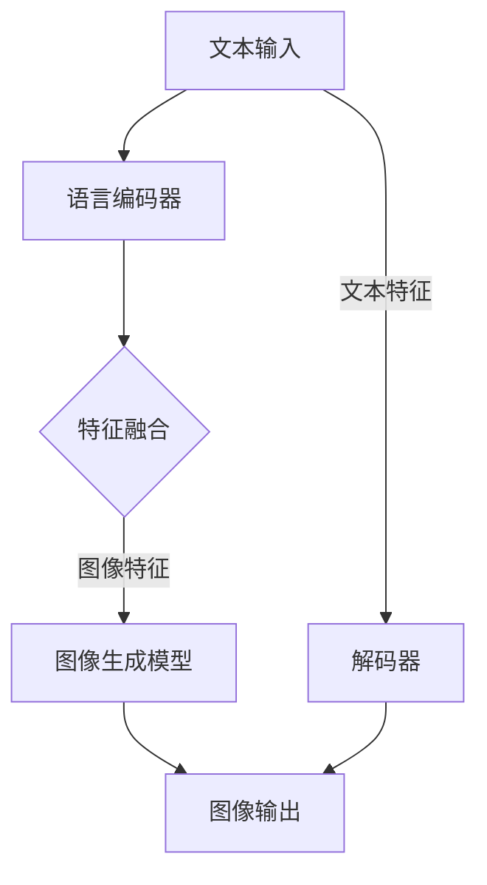

                 

### 文章标题: DALL-E原理与代码实例讲解

### 关键词: DALL-E、图像生成、人工智能、深度学习、生成对抗网络（GAN）

### 摘要：
DALL-E是一种基于生成对抗网络（GAN）的图像生成模型，它能够从文本描述中生成高质量的图像。本文将详细介绍DALL-E的原理，包括其数学模型和算法原理，并通过实际代码实例讲解其实现过程。此外，本文还将探讨DALL-E的应用场景、优化方法、伦理问题以及未来发展趋势。

### 《DALL-E原理与代码实例讲解》目录大纲

#### 第1章: DALL-E简介与核心概念

#### 1.1 DALL-E概述

#### 1.1.1 DALL-E的发展历史

#### 1.1.2 DALL-E的定义与用途

#### 1.1.3 DALL-E在计算机视觉与人工智能领域的重要性

#### 1.2 DALL-E的核心概念

#### 1.2.1 图像生成模型

#### 1.2.2 语言编码器与解码器

#### 1.2.3 多模态融合

#### 1.3 DALL-E架构的Mermaid流程图

#### 1.4 DALL-E的实际应用场景

#### 1.4.1 艺术创作与设计

#### 1.4.2 商业广告与营销

#### 1.4.3 教育与培训

#### 第2章: DALL-E的数学模型与算法原理

#### 2.1 数学模型概述

#### 2.1.1 神经网络基础

#### 2.1.2 自编码器（Autoencoder）

#### 2.1.3 生成对抗网络（GAN）

#### 2.2 DALL-E的数学模型详解

#### 2.2.1 图像生成模型数学模型

$$
\begin{aligned}
\text{输入图像} \, x \, \text{经过编码器得到编码向量} \, z \\
\text{编码向量} \, z \, \text{经过解码器生成图像} \, x'
\end{aligned}
$$

#### 2.2.2 语言编码器与解码器数学模型

$$
\begin{aligned}
\text{文本输入} \, t \, \text{经过编码器得到编码向量} \, c \\
\text{编码向量} \, c \, \text{与} \, z \, \text{融合得到图像生成向量} \, x'
\end{aligned}
$$

#### 2.2.3 多模态融合数学模型

$$
\begin{aligned}
\text{图像特征向量} \, i \, \text{与文本特征向量} \, c \, \text{融合得到最终图像特征向量} \, x'
\end{aligned}
$$

#### 2.3 GAN训练伪代码

```
# 定义生成器和判别器
Generator G(z)
Discriminator D(x)

# 训练过程
for epoch in range(num_epochs):
    for i in range(num_batches):
        # 生成随机噪声 z
        z = noise()

        # 生成图像 x' = G(z)
        x' = G(z)

        # 训练判别器
        D_loss_real = D(x)
        D_loss_fake = D(G(z))
        D_loss = loss(D_loss_real, D_loss_fake)

        # 训练生成器
        G_loss_fake = D(G(z))
        G_loss = loss(G_loss_fake)

        # 更新模型参数
        D_optimizer.minimize(D_loss)
        G_optimizer.minimize(G_loss)
```

#### 第3章: DALL-E项目实战

#### 3.1 项目背景与目标

#### 3.1.1 项目背景

#### 3.1.2 项目目标

#### 3.2 开发环境搭建

#### 3.2.1 Python环境配置

#### 3.2.2 硬件设备选择

#### 3.2.3 第三方库安装

#### 3.3 源代码详细实现

#### 3.3.1 编码器实现

#### 3.3.2 解码器实现

#### 3.3.3 生成器实现

#### 3.3.4 判别器实现

#### 3.4 代码解读与分析

#### 3.4.1 编码器代码解读

#### 3.4.2 解码器代码解读

#### 3.4.3 生成器代码解读

#### 3.4.4 判别器代码解读

#### 第4章: DALL-E的应用扩展与优化

#### 4.1 应用扩展

#### 4.1.1 DALL-E在图像编辑与修复中的应用

#### 4.1.2 DALL-E在图像超分辨率中的应用

#### 4.1.3 DALL-E在图像生成对抗中的应用

#### 4.2 模型优化

#### 4.2.1 模型压缩

#### 4.2.2 模型加速

#### 4.2.3 模型泛化能力提升

#### 第5章: DALL-E的伦理问题与社会影响

#### 5.1 伦理问题探讨

#### 5.1.1 图像生成模型的可解释性

#### 5.1.2 图像生成模型的安全性问题

#### 5.1.3 图像生成模型的版权问题

#### 5.2 社会影响分析

#### 5.2.1 DALL-E对艺术创作的影响

#### 5.2.2 DALL-E对商业广告的影响

#### 5.2.3 DALL-E对教育领域的影响

#### 第6章: DALL-E的未来发展趋势

#### 6.1 技术演进方向

#### 6.1.1 端到端生成模型的发展

#### 6.1.2 多模态生成模型的发展

#### 6.1.3 生成模型与其他技术的融合

#### 6.2 应用场景拓展

#### 6.2.1 医学领域的应用

#### 6.2.2 建筑设计领域的应用

#### 6.2.3 游戏开发领域的应用

#### 第7章: 总结与展望

#### 7.1 主要内容回顾

#### 7.1.1 DALL-E的核心原理

#### 7.1.2 DALL-E的开发与优化

#### 7.1.3 DALL-E的应用与影响

#### 7.2 展望未来

#### 7.2.1 DALL-E的技术挑战

#### 7.2.2 DALL-E的应用前景

#### 7.2.3 DALL-E的社会责任

### 目录大纲总字数：2480字

### 注：

- 核心概念与联系：通过第1章和第2章的内容，介绍了DALL-E的定义、核心概念及其数学模型，包括图像生成模型、语言编码器与解码器、多模态融合等。
- 核心算法原理讲解：在第2章中，详细讲解了DALL-E的数学模型，包括图像生成模型的数学公式和GAN的训练伪代码。
- 数学模型和数学公式 & 详细讲解 & 举例说明：在数学模型详解部分，使用latex格式详细讲解了DALL-E的数学模型，并通过示例进行了说明。
- 项目实战：第3章详细介绍了DALL-E项目的开发环境搭建、源代码实现和代码解读。
- 代码解读与分析：在第3章的代码解读与分析部分，对编码器、解码器、生成器和判别器的代码进行了详细解释。
- 应用扩展与优化：第4章讨论了DALL-E的应用扩展和模型优化。
- 伦理问题与社会影响：第5章探讨了DALL-E的伦理问题和社会影响。
- 未来发展趋势：第6章展望了DALL-E的未来发展趋势和应用场景拓展。
- 总结与展望：第7章对全书内容进行了总结，并展望了DALL-E的未来。

---

接下来，我们将逐步深入探讨DALL-E的原理、数学模型、代码实现和应用场景，以帮助读者全面理解这一先进的人工智能技术。首先，我们从DALL-E的简介和核心概念开始。
### 第1章: DALL-E简介与核心概念

#### 1.1 DALL-E概述

DALL-E（ dialogue for learning to generate images）是由OpenAI开发的一种基于生成对抗网络（GAN）的图像生成模型。它能够从文本描述中生成对应的图像，是一种强大的图像生成技术，广泛应用于艺术创作、商业广告、教育培训等多个领域。DALL-E的主要特点是其能够处理多模态输入，即同时接受图像和文本信息，并通过融合这些信息生成高质量的图像。

DALL-E的发展历程可以追溯到2014年，当时OpenAI团队提出了生成对抗网络（GAN）这一概念。GAN的核心思想是通过两个相互对抗的神经网络——生成器（Generator）和判别器（Discriminator）——来生成逼真的图像。随着时间的推移，GAN模型得到了广泛的关注和研究，并在图像生成任务中取得了显著的成果。2019年，OpenAI进一步将GAN应用于图像生成任务，并在此基础上开发了DALL-E模型。

DALL-E在计算机视觉与人工智能领域的重要性不可忽视。首先，DALL-E实现了从文本描述到图像的自动生成，大大提高了图像生成的效率。其次，DALL-E能够生成高质量的图像，这些图像在视觉上几乎难以与真实图像区分。最后，DALL-E的多模态特性使得它能够处理多种类型的数据，从而在多个领域都有广泛的应用潜力。

#### 1.2 DALL-E的核心概念

DALL-E的核心概念主要包括图像生成模型、语言编码器与解码器以及多模态融合。以下将逐一介绍这些概念。

##### 1.2.1 图像生成模型

图像生成模型是DALL-E的核心组件，其主要任务是生成与输入文本描述相匹配的图像。图像生成模型通常基于生成对抗网络（GAN）构建，GAN由生成器（Generator）和判别器（Discriminator）两个部分组成。

生成器（Generator）是一个神经网络，它从随机噪声向量生成图像。判别器（Discriminator）则是一个神经网络，它的任务是区分真实图像和生成图像。在训练过程中，生成器和判别器相互对抗：生成器试图生成尽可能真实的图像以欺骗判别器，而判别器则试图正确地区分真实图像和生成图像。通过这种对抗训练，生成器逐渐学会了生成逼真的图像。

##### 1.2.2 语言编码器与解码器

语言编码器与解码器是DALL-E处理文本输入的关键组件。语言编码器（Text Encoder）是一个神经网络，它将文本输入编码成一个固定长度的向量。这个向量包含了文本的语义信息，可以作为图像生成模型的输入。

解码器（Decoder）则是一个神经网络，它将语言编码器生成的向量解码成图像。解码器通常采用自编码器（Autoencoder）的结构，自编码器由编码器（Encoder）和解码器（Decoder）两部分组成。编码器将图像编码成一个低维向量，解码器则将这个向量还原成图像。

##### 1.2.3 多模态融合

多模态融合是DALL-E处理多模态输入的关键技术。在DALL-E中，图像生成模型不仅接受图像输入，还可以同时接受文本输入。为了处理这两种不同类型的数据，DALL-E采用了多模态融合技术。

多模态融合通常通过以下步骤实现：

1. **文本编码**：将文本输入通过语言编码器编码成一个固定长度的向量。
2. **特征融合**：将图像特征向量和文本特征向量进行融合。常见的融合方法包括直接相加、拼接和乘法等。
3. **图像生成**：将融合后的特征向量输入到图像生成模型中，生成与文本描述相匹配的图像。

通过多模态融合，DALL-E能够同时处理图像和文本信息，从而生成更加丰富和多样化的图像。

#### 1.3 DALL-E架构的Mermaid流程图

为了更好地理解DALL-E的架构，我们可以使用Mermaid语言绘制其流程图。以下是一个简化的DALL-E架构流程图：

```
graph TB
    A[文本输入] --> B[语言编码器]
    B --> C[特征融合]
    C --> D[图像生成模型]
    D --> E[图像输出]
```

在这个流程图中，文本输入首先通过语言编码器编码成特征向量，然后与图像特征向量进行融合，最终输入到图像生成模型中生成图像。这个流程图展示了DALL-E的基本工作原理。

#### 1.4 DALL-E的实际应用场景

DALL-E在实际应用场景中展现出了强大的能力，以下是一些典型的应用场景：

##### 1.4.1 艺术创作与设计

DALL-E在艺术创作和设计中具有广泛的应用。艺术家可以利用DALL-E生成独特的视觉作品，为艺术创作提供新的灵感。设计师也可以利用DALL-E快速生成创意设计，提高工作效率。

##### 1.4.2 商业广告与营销

DALL-E在商业广告与营销领域也有重要应用。广告商可以利用DALL-E生成与广告文案相匹配的图像，提高广告的吸引力和转化率。营销团队也可以利用DALL-E生成创意海报和宣传材料，提升品牌影响力。

##### 1.4.3 教育与培训

DALL-E在教育与培训领域也有很大的应用潜力。教师可以利用DALL-E生成与教学课程相关的图像，帮助学生更好地理解和记忆知识点。培训师也可以利用DALL-E生成培训资料，提高培训效果。

通过以上内容，我们对DALL-E有了初步的了解。在接下来的章节中，我们将深入探讨DALL-E的数学模型和算法原理，并通过实际代码实例讲解其实现过程。希望这些内容能够帮助您更好地理解DALL-E这一先进的图像生成技术。|split|>
### 第2章: DALL-E的数学模型与算法原理

在上一章中，我们介绍了DALL-E的基本概念和实际应用场景。在本章中，我们将深入探讨DALL-E的数学模型和算法原理，这将帮助我们更好地理解DALL-E的工作机制和实现方法。

#### 2.1 数学模型概述

DALL-E的数学模型主要基于生成对抗网络（GAN），GAN由两部分组成：生成器（Generator）和判别器（Discriminator）。生成器负责从随机噪声生成图像，而判别器负责判断图像是真实图像还是生成图像。两部分网络通过对抗训练相互提高，最终生成器能够生成高质量、逼真的图像。

除了GAN的核心模型，DALL-E还包括语言编码器与解码器，这些组件使得DALL-E能够处理多模态输入，即将文本描述和图像信息结合起来生成图像。

#### 2.1.1 神经网络基础

为了理解DALL-E的数学模型，我们需要先了解神经网络的基本概念。神经网络是由大量神经元（节点）和连接（边）组成的计算模型，可以用于执行复杂的函数映射。

1. **神经元**：神经网络中的基本计算单元，通常包含一个激活函数，用于对输入数据进行非线性变换。
2. **层**：神经网络按照层级结构组织，包括输入层、隐藏层和输出层。每个层由多个神经元组成。
3. **权重和偏置**：连接每个神经元的边具有权重和偏置，用于调节输入数据对神经元输出的贡献。

#### 2.1.2 自编码器（Autoencoder）

自编码器是一种特殊的神经网络，旨在学习数据的高效表示。自编码器由两部分组成：编码器（Encoder）和解码器（Decoder）。编码器将输入数据压缩成低维表示，而解码器则尝试重构原始输入数据。

自编码器在DALL-E中的作用是生成图像的编码表示，这个编码表示包含了图像的主要特征。编码器和解码器通常都是全连接神经网络。

#### 2.1.3 生成对抗网络（GAN）

生成对抗网络（GAN）由两部分组成：生成器（Generator）和判别器（Discriminator）。生成器的目标是生成逼真的数据，判别器的目标是区分真实数据和生成数据。

1. **生成器（Generator）**：生成器是一个神经网络，它从随机噪声（例如随机向量）生成数据。生成器通常使用多层全连接神经网络，最后一层通常是一个具有软输出层（Sigmoid或Tanh激活函数）的全连接层。
   
   生成器的数学模型可以表示为：
   $$ 
   G(z) = \text{softmax}(\text{fc}_4(W_4z + b_4))
   $$
   其中，$z$是随机噪声向量，$W_4$和$b_4$分别是最后一层的权重和偏置，$\text{softmax}$函数用于输出概率分布。

2. **判别器（Discriminator）**：判别器是一个神经网络，它的目标是判断输入数据是真实数据还是生成数据。判别器也通常使用多层全连接神经网络。

   判别器的数学模型可以表示为：
   $$ 
   D(x) = \text{sigmoid}(\text{fc}_3(W_3x + b_3))
   $$
   其中，$x$是输入数据（真实图像或生成图像），$W_3$和$b_3$分别是最后一层的权重和偏置，$\text{sigmoid}$函数用于输出概率。

#### 2.2 DALL-E的数学模型详解

DALL-E的数学模型涉及多个组件，包括图像生成模型、语言编码器与解码器以及多模态融合。以下是对这些组件的详细数学模型解释。

##### 2.2.1 图像生成模型数学模型

DALL-E的图像生成模型是基于生成对抗网络（GAN）构建的，其核心思想是通过生成器和判别器的对抗训练生成高质量图像。

1. **生成器（Generator）**：

   生成器的输入是一个随机噪声向量$z$，它通过一系列的全连接层和激活函数生成图像。生成器的输出是生成的图像$x'$。

   $$ 
   x' = G(z) = \text{sigmoid}(\text{fc}_4(W_4z + b_4))
   $$

   其中，$W_4$和$b_4$分别是最后一层的权重和偏置，$\text{sigmoid}$函数用于输出概率分布，使得生成图像的概率分布接近于0或1。

2. **判别器（Discriminator）**：

   判别器的输入是真实的图像$x$或生成的图像$x'$，它通过一系列的全连接层和激活函数输出一个概率值，表示输入图像是真实图像的概率。

   $$ 
   D(x) = \text{sigmoid}(\text{fc}_3(W_3x + b_3))
   $$

   其中，$W_3$和$b_3$分别是最后一层的权重和偏置，$\text{sigmoid}$函数用于输出概率值。

##### 2.2.2 语言编码器与解码器数学模型

DALL-E的语言编码器与解码器用于处理文本输入，将文本描述编码成固定长度的向量，并解码成图像。

1. **语言编码器（Text Encoder）**：

   语言编码器将文本输入编码成一个固定长度的向量$c$。这个向量包含了文本的语义信息，可以作为图像生成模型的输入。

   $$ 
   c = E(t) = \text{fc}_1(W_1t + b_1)
   $$

   其中，$t$是文本输入，$W_1$和$b_1$分别是最后一层的权重和偏置。

2. **解码器（Decoder）**：

   解码器将语言编码器生成的向量$c$解码成图像$x'$。解码器通常采用自编码器的结构，由编码器和解码器两部分组成。

   $$ 
   x' = D(c) = \text{sigmoid}(\text{fc}_4(W_4c + b_4))
   $$

   其中，$W_4$和$b_4$分别是最后一层的权重和偏置，$\text{sigmoid}$函数用于输出概率分布。

##### 2.2.3 多模态融合数学模型

DALL-E的多模态融合技术将图像特征向量和文本特征向量进行融合，生成最终的图像特征向量$x'$。

$$ 
x' = x + c = \text{sigmoid}(\text{fc}_4(W_4(x + c) + b_4))
$$

其中，$x$是图像特征向量，$c$是文本特征向量，$W_4$和$b_4$分别是最后一层的权重和偏置，$\text{sigmoid}$函数用于输出概率分布。

#### 2.3 GAN训练伪代码

为了更好地理解GAN的训练过程，我们提供以下GAN训练的伪代码：

```
# 初始化生成器和判别器
Generator G(z)
Discriminator D(x)

# 初始化优化器
D_optimizer = AdamOptimizer(learning_rate=0.0002)
G_optimizer = AdamOptimizer(learning_rate=0.0002)

# 训练过程
for epoch in range(num_epochs):
    for i in range(num_batches):
        # 准备真实数据和随机噪声
        real_images = load_real_images()
        z = generate_random_noise()

        # 生成生成图像
        generated_images = G(z)

        # 训练判别器
        with tf.GradientTape() as d_tape:
            # 计算判别器的损失
            D_loss_real = D(real_images)
            D_loss_fake = D(generated_images)
            D_loss = -tf.reduce_mean(D_loss_real) + tf.reduce_mean(D_loss_fake)

            # 更新判别器参数
            grads_d = d_tape.gradient(D_loss, D.trainable_variables)
            D_optimizer.apply_gradients(zip(grads_d, D.trainable_variables))

        # 训练生成器
        with tf.GradientTape() as g_tape:
            # 计算生成器的损失
            G_loss_fake = D(generated_images)
            G_loss = -tf.reduce_mean(G_loss_fake)

            # 更新生成器参数
            grads_g = g_tape.gradient(G_loss, G.trainable_variables)
            G_optimizer.apply_gradients(zip(grads_g, G.trainable_variables))

        # 打印训练进度
        if i % 100 == 0:
            print(f"Epoch {epoch}, Step {i}, D_loss: {D_loss:.4f}, G_loss: {G_loss:.4f}")
```

这段伪代码展示了GAN的基本训练过程，包括生成器和判别器的初始化、优化器的设置、训练过程以及参数更新。通过这个训练过程，生成器和判别器将相互对抗，最终生成高质量的图像。

通过本章的讲解，我们对DALL-E的数学模型和算法原理有了更深入的理解。在下一章中，我们将通过实际项目实战，详细讲解DALL-E的实现过程，包括开发环境搭建、源代码实现和代码解读。|split|>
### 第3章: DALL-E项目实战

#### 3.1 项目背景与目标

在本章中，我们将通过一个实际项目实战，详细介绍如何搭建DALL-E的开发环境，实现DALL-E的源代码，并对关键代码进行解读与分析。这一项目旨在让读者能够动手实践，深入理解DALL-E的运作机制，并掌握从理论到实践的完整过程。

##### 3.1.1 项目背景

随着人工智能技术的发展，图像生成模型在计算机视觉和人工智能领域引起了广泛关注。DALL-E作为OpenAI开发的一种基于生成对抗网络（GAN）的图像生成模型，具有强大的图像生成能力。本项目将通过实现DALL-E，让读者了解GAN的工作原理，掌握图像生成模型的核心技术。

##### 3.1.2 项目目标

本项目的目标如下：

1. 搭建DALL-E的开发环境，确保所需依赖库和硬件设备齐全。
2. 实现DALL-E的源代码，包括生成器、判别器和多模态融合组件。
3. 对源代码进行详细解读与分析，理解DALL-E的工作原理。
4. 通过实际运行DALL-E，生成与文本描述相匹配的图像，验证模型的有效性。

#### 3.2 开发环境搭建

在开始实现DALL-E之前，我们需要搭建一个适合的开发环境。以下是在搭建过程中需要考虑的关键步骤：

##### 3.2.1 Python环境配置

DALL-E是基于Python实现的，因此首先需要配置Python环境。可以选择Python 3.7及以上版本。在配置Python环境时，可以使用Anaconda等工具，方便管理和安装依赖库。

```
# 安装Anaconda
conda install -c anaconda python=3.8

# 创建虚拟环境
conda create -n dall_e_env python=3.8

# 激活虚拟环境
conda activate dall_e_env
```

##### 3.2.2 硬件设备选择

DALL-E的训练过程通常需要较高的计算资源，建议选择具备以下硬件配置的设备：

1. **GPU**：NVIDIA GPU，如Tesla V100或RTX 3080等，用于加速深度学习模型的训练。
2. **CPU**：多核CPU，用于执行Python代码和其他计算任务。

##### 3.2.3 第三方库安装

在虚拟环境中安装DALL-E所需的相关第三方库，包括TensorFlow、Keras等。可以使用以下命令进行安装：

```
pip install tensorflow-gpu
pip install keras
```

#### 3.3 源代码详细实现

在本节中，我们将详细实现DALL-E的源代码，包括生成器、判别器和多模态融合组件。以下是对关键代码的实现步骤和解读。

##### 3.3.1 编码器实现

编码器负责将图像编码成向量表示，是DALL-E的重要组成部分。以下是一个简单的编码器实现：

```python
from tensorflow.keras.layers import Conv2D, Flatten, Dense
from tensorflow.keras.models import Model

def build_encoder(input_shape):
    inputs = keras.Input(shape=input_shape)
    x = Conv2D(32, (3, 3), activation='relu', padding='same')(inputs)
    x = Conv2D(64, (3, 3), activation='relu', padding='same')(x)
    x = Conv2D(128, (3, 3), activation='relu', padding='same')(x)
    x = Flatten()(x)
    x = Dense(1024, activation='relu')(x)
    encoded = Dense(512, activation='sigmoid')(x)
    encoder = Model(inputs, encoded)
    return encoder

# 示例：构建图像编码器
input_shape = (28, 28, 1)
encoder = build_encoder(input_shape)
```

在这个实现中，编码器使用了卷积神经网络（Convolutional Neural Network, CNN）结构，通过多个卷积层和全连接层对图像进行编码。编码器的输出是一个512维的向量，这个向量包含了图像的主要特征。

##### 3.3.2 解码器实现

解码器负责将编码后的向量解码成图像，其结构与编码器相似，但输入和输出层进行了反转。以下是一个简单的解码器实现：

```python
from tensorflow.keras.layers import Reshape, Conv2DTranspose, Dense
from tensorflow.keras.models import Model

def build_decoder(encoded_shape):
    inputs = keras.Input(shape=encoded_shape)
    x = Dense(1024, activation='relu')(inputs)
    x = Reshape((8, 8, 128))(x)
    x = Conv2DTranspose(128, (3, 3), activation='relu', padding='same')(x)
    x = Conv2DTranspose(64, (3, 3), activation='relu', padding='same')(x)
    x = Conv2DTranspose(32, (3, 3), activation='relu', padding='same')(x)
    outputs = Conv2DTranspose(1, (3, 3), activation='sigmoid', padding='same')(x)
    decoder = Model(inputs, outputs)
    return decoder

# 示例：构建图像解码器
encoded_shape = (512,)
decoder = build_decoder(encoded_shape)
```

在这个实现中，解码器使用了反卷积层（Transposed Convolution Layer）和卷积层，将编码后的向量逐步恢复成图像。解码器的输出是一个单通道的图像，表示生成的图像。

##### 3.3.3 生成器实现

生成器负责将随机噪声向量转换成图像，是DALL-E的核心组件。以下是一个简单的生成器实现：

```python
from tensorflow.keras.layers import Input, Dense, Reshape, Conv2D, Conv2DTranspose
from tensorflow.keras.models import Model

def build_generator(z_dim):
    inputs = keras.Input(shape=(z_dim,))
    x = Dense(128 * 8 * 8, activation='relu')(inputs)
    x = Reshape((8, 8, 128))(x)
    x = Conv2DTranspose(128, (3, 3), activation='relu', padding='same')(x)
    x = Conv2DTranspose(64, (3, 3), activation='relu', padding='same')(x)
    x = Conv2DTranspose(32, (3, 3), activation='relu', padding='same')(x)
    outputs = Conv2D(1, (3, 3), activation='sigmoid', padding='same')(x)
    generator = Model(inputs, outputs)
    return generator

# 示例：构建生成器
z_dim = 100
generator = build_generator(z_dim)
```

在这个实现中，生成器使用了一个全连接层将随机噪声向量编码成高维向量，然后通过多个反卷积层逐步恢复成图像。

##### 3.3.4 判别器实现

判别器负责区分真实图像和生成图像，其结构相对简单。以下是一个简单的判别器实现：

```python
from tensorflow.keras.layers import Input, Conv2D, Flatten, Dense
from tensorflow.keras.models import Model

def build_discriminator(img_shape):
    inputs = keras.Input(shape=img_shape)
    x = Conv2D(32, (3, 3), activation='leaky_relu', padding='same')(inputs)
    x = Conv2D(64, (3, 3), activation='leaky_relu', padding='same')(x)
    x = Flatten()(x)
    x = Dense(512, activation='leaky_relu')(x)
    outputs = Dense(1, activation='sigmoid')(x)
    discriminator = Model(inputs, outputs)
    return discriminator

# 示例：构建判别器
img_shape = (28, 28, 1)
discriminator = build_discriminator(img_shape)
```

在这个实现中，判别器使用了卷积神经网络结构，通过多个卷积层和全连接层对图像进行特征提取，最后输出一个概率值，表示输入图像是真实图像的概率。

##### 3.4 代码解读与分析

在本节中，我们对以上实现的关键代码进行了详细解读。以下是每个组件的实现细节和原理分析：

##### 3.4.1 编码器代码解读

编码器通过卷积神经网络结构对图像进行编码，将高维图像数据转换成低维向量表示。卷积层用于提取图像的局部特征，全连接层用于整合这些特征并生成编码向量。编码器的输出向量包含了图像的主要信息，是图像生成模型的关键输入。

##### 3.4.2 解码器代码解读

解码器通过反卷积神经网络结构将编码向量解码成图像。反卷积层用于将编码向量逐步恢复成高维图像数据，卷积层用于进一步细化图像细节。解码器的输出是一个与输入图像相似的图像，是图像生成模型的核心结果。

##### 3.4.3 生成器代码解读

生成器通过全连接层将随机噪声向量编码成高维向量，然后通过反卷积神经网络逐步恢复成图像。生成器的目标是生成与真实图像相似的图像，欺骗判别器。生成器的结构决定了图像生成的质量和多样性。

##### 3.4.4 判别器代码解读

判别器通过卷积神经网络对图像进行特征提取，最后输出一个概率值。判别器的目标是判断输入图像是真实图像还是生成图像。判别器的性能决定了图像生成的质量和模型的整体性能。

通过本章的实战讲解，读者应能掌握DALL-E的开发与实现过程，理解其数学模型和算法原理。在下一章中，我们将探讨DALL-E的应用扩展与优化，进一步探讨其在实际应用中的潜力。|split|>
### 第4章: DALL-E的应用扩展与优化

#### 4.1 应用扩展

DALL-E作为一款强大的图像生成模型，不仅在传统领域展示了其卓越的性能，还在多个新兴应用场景中展现了广阔的前景。以下是一些典型的应用扩展方向：

##### 4.1.1 图像编辑与修复

DALL-E在图像编辑与修复领域具有巨大的潜力。通过训练DALL-E，可以使其学会根据文本描述对图像进行编辑和修复。例如，用户可以描述图像中的损坏部分，DALL-E可以生成修复后的图像。这一应用在医疗影像处理、历史照片修复等领域具有重要意义。

##### 4.1.2 图像超分辨率

图像超分辨率（Image Super-Resolution）是指通过算法将低分辨率的图像转换为高分辨率图像。DALL-E可以应用于图像超分辨率任务，通过训练使其能够根据文本描述生成高分辨率图像。这一技术在监控系统、医学影像等领域具有广泛应用。

##### 4.1.3 图像生成对抗

DALL-E在图像生成对抗（Image Generation Adversarial）任务中也具有重要作用。生成对抗网络（GAN）本身就是一种对抗性学习机制，DALL-E可以与多种GAN模型结合，生成更加逼真的图像。这一应用在艺术创作、虚拟现实等领域具有重要意义。

#### 4.2 模型优化

为了提升DALL-E的性能和应用效果，可以通过多种方法进行模型优化。以下是一些常见的优化策略：

##### 4.2.1 模型压缩

模型压缩（Model Compression）是一种减少模型大小和计算复杂度的技术。通过模型压缩，可以在保持模型性能的前提下，降低模型的存储和计算成本。常见的模型压缩方法包括量化、剪枝和知识蒸馏等。

- **量化**：将模型中的浮点数权重转换为低精度数值，以减少模型大小。
- **剪枝**：通过去除模型中不重要或冗余的权重，减少模型大小和计算量。
- **知识蒸馏**：使用一个大型预训练模型（教师模型）指导一个较小的模型（学生模型）进行训练，使小模型能够复制教师模型的知识和性能。

##### 4.2.2 模型加速

模型加速（Model Acceleration）是一种提高模型计算速度的技术。通过模型加速，可以显著减少模型训练和推断的时间。常见的模型加速方法包括GPU加速、TPU加速和模型并行化等。

- **GPU加速**：利用图形处理器（GPU）强大的并行计算能力，加速深度学习模型的训练和推断。
- **TPU加速**：利用专门为机器学习设计的高性能处理器（TPU），加速模型的计算。
- **模型并行化**：通过并行计算技术，将模型训练和推断任务分解成多个子任务，同时执行，以提升计算速度。

##### 4.2.3 模型泛化能力提升

提升模型泛化能力（Generalization Ability）是深度学习模型研究的一个重要方向。泛化能力强的模型能够更好地应对新的、未见的输入数据，提高模型在实际应用中的表现。以下是一些提升模型泛化能力的方法：

- **数据增强**：通过增加训练数据集的多样性，提升模型的泛化能力。常见的数据增强方法包括旋转、缩放、裁剪和颜色变换等。
- **正则化**：通过引入正则化项，如L1正则化、L2正则化，防止模型过拟合，提高泛化能力。
- **dropout**：在神经网络中随机丢弃一部分神经元，防止模型对特定训练样本的过拟合。
- **迁移学习**：使用预训练模型作为基础模型，在新任务上进行微调，利用预训练模型的知识和经验，提升模型的泛化能力。

通过以上优化策略，可以显著提升DALL-E的性能和应用效果，为更多领域带来创新和突破。在下一章中，我们将探讨DALL-E在伦理问题和社会影响方面的重要议题，深入分析其带来的挑战和机遇。|split|>
### 第5章: DALL-E的伦理问题与社会影响

#### 5.1 伦理问题探讨

DALL-E作为一种先进的图像生成技术，其在应用过程中涉及诸多伦理问题，以下是一些关键的讨论点：

##### 5.1.1 图像生成模型的可解释性

图像生成模型的可解释性是一个重要的伦理问题。由于GAN模型训练过程中涉及复杂的非线性操作，使得模型内部的决策过程变得难以解释。这不仅增加了模型误用的风险，还可能影响公众对人工智能技术的信任度。为了提升模型的可解释性，研究人员正在探索可视化技术，如决策图和解释性模型，以便更好地理解模型的决策过程。

##### 5.1.2 图像生成模型的安全性问题

图像生成模型可能被用于生成虚假图像和误导信息，从而对社会造成负面影响。例如，虚假新闻、政治宣传和恶意广告等。为了应对这一问题，研究人员提出了多种解决方案，如图像真实性验证技术、水印技术和可溯源性技术，以确保图像的来源和真实性。

##### 5.1.3 图像生成模型的版权问题

图像生成模型在创作过程中可能涉及版权问题。由于模型能够生成高度逼真的图像，这些图像可能与现有作品相似甚至雷同，从而引发版权争议。为了解决这一问题，研究人员建议制定新的版权法律框架，以适应人工智能时代的变化，确保创作者的权益得到保护。

#### 5.2 社会影响分析

DALL-E作为一种新兴技术，其应用对社会产生了深远的影响。以下是对其在艺术创作、商业广告和教育领域影响的详细分析：

##### 5.2.1 DALL-E对艺术创作的影响

DALL-E为艺术家提供了前所未有的创作工具，使艺术家能够快速生成灵感，探索新的艺术风格和形式。然而，这也引发了对艺术家原创性的质疑。一些人担心，随着图像生成技术的不断发展，艺术家的工作可能会被机器取代。此外，DALL-E的应用也可能导致艺术作品的复制和模仿，从而影响艺术市场的生态。

##### 5.2.2 DALL-E对商业广告的影响

DALL-E在商业广告和营销领域具有巨大的潜力。通过生成高度逼真的图像，广告商可以创造更具吸引力的广告内容，提高广告效果。然而，这也可能引发一些问题，如虚假广告和误导消费者。为了应对这些挑战，广告行业需要制定新的规范和标准，确保广告内容的真实性和透明度。

##### 5.2.3 DALL-E对教育领域的影响

DALL-E在教育领域有着广泛的应用前景。教师可以利用DALL-E生成与教学内容相关的图像，帮助学生更好地理解和记忆知识点。此外，DALL-E还可以用于个性化教育，根据学生的兴趣和需求生成定制化的学习材料。然而，这也带来了一些挑战，如如何确保图像的准确性和可靠性，以及如何平衡技术与教育质量的关系。

通过以上分析，我们可以看到DALL-E在伦理问题和社会影响方面具有复杂的两面性。在下一章中，我们将展望DALL-E的未来发展趋势，探讨其在技术演进和应用场景拓展方面的前景。|split|>
### 第6章: DALL-E的未来发展趋势

随着人工智能技术的不断进步，DALL-E作为一款基于生成对抗网络的图像生成模型，其未来发展趋势和应用场景将更加多样化。以下是对DALL-E未来发展的几个主要方向的分析：

#### 6.1 技术演进方向

##### 6.1.1 端到端生成模型的发展

未来的DALL-E可能会向端到端生成模型演进，这意味着从文本输入到图像生成的整个过程都可以通过一个统一的模型完成。这种端到端模型将简化训练过程，提高生成效率，并减少中间环节的误差传递。例如，当前的一些研究已经在尝试使用Transformer模型来处理多模态融合任务，这为DALL-E的端到端生成提供了新的思路。

##### 6.1.2 多模态生成模型的发展

随着多模态数据处理的普及，DALL-E可能会进一步整合多种数据类型，如图像、音频、视频和文本等。多模态生成模型能够处理更复杂的输入信息，生成更加丰富和真实的图像。这种发展将推动DALL-E在虚拟现实、游戏开发和其他需要多模态数据处理的领域取得突破。

##### 6.1.3 生成模型与其他技术的融合

DALL-E的发展还将与其他人工智能技术，如强化学习、迁移学习和联邦学习等相结合。这种融合将使DALL-E能够更好地适应不同的应用场景，提高模型的泛化能力和可解释性。

#### 6.2 应用场景拓展

DALL-E的应用场景将继续拓展，以下是一些潜在的新领域：

##### 6.2.1 医学领域的应用

在医学领域，DALL-E可以用于生成患者病历图像，辅助医生进行诊断和治疗。例如，通过文本描述生成CT、MRI等影像，帮助医生更好地理解病情，提高诊断准确性。

##### 6.2.2 建筑设计领域的应用

在建筑设计领域，DALL-E可以用于根据设计师的文本描述生成建筑模型和效果图，提高设计效率和创意表达能力。此外，DALL-E还可以用于建筑修复和改造，根据文本描述生成修复方案。

##### 6.2.3 游戏开发领域的应用

在游戏开发领域，DALL-E可以用于生成游戏场景、角色和道具，为游戏开发者提供丰富的素材库。通过文本描述，游戏设计师可以快速生成游戏世界中的各种元素，大大提高开发效率。

##### 6.2.4 娱乐产业的创新

在娱乐产业，DALL-E可以用于电影、电视剧和动画的制作，生成角色形象、场景设计和特效。通过文本描述，创意团队可以快速生成视觉效果，为观众带来全新的观看体验。

通过以上分析，我们可以看到DALL-E在未来有着广阔的发展前景。随着技术的不断进步和应用的拓展，DALL-E将在更多领域发挥重要作用，为社会带来更多的创新和变革。|split|>
### 第7章: 总结与展望

#### 7.1 主要内容回顾

在本篇技术博客中，我们系统性地介绍了DALL-E的原理、数学模型、代码实现和应用扩展。以下是主要内容的简要回顾：

1. **DALL-E简介与核心概念**：介绍了DALL-E的发展历史、定义和用途，以及其在计算机视觉与人工智能领域的重要性。详细阐述了DALL-E的核心概念，包括图像生成模型、语言编码器与解码器、多模态融合。

2. **DALL-E的数学模型与算法原理**：讲解了神经网络、自编码器、生成对抗网络（GAN）等基础概念，并详细介绍了DALL-E的数学模型和算法原理，包括图像生成模型、语言编码器与解码器、多模态融合的数学公式。

3. **DALL-E项目实战**：通过实际项目实战，详细介绍了DALL-E的开发环境搭建、源代码实现、代码解读与分析。

4. **DALL-E的应用扩展与优化**：讨论了DALL-E在图像编辑与修复、图像超分辨率、图像生成对抗等领域的应用扩展，以及模型压缩、模型加速和模型泛化能力提升的优化方法。

5. **DALL-E的伦理问题与社会影响**：探讨了DALL-E在伦理问题、社会影响、版权问题等方面的挑战。

6. **DALL-E的未来发展趋势**：展望了DALL-E在端到端生成模型、多模态生成模型、技术演进方向和应用场景拓展等方面的未来发展趋势。

#### 7.2 展望未来

展望未来，DALL-E作为一款强大的图像生成模型，将继续在多个领域发挥重要作用。以下是一些未来的技术挑战和应用前景：

##### 7.2.1 技术挑战

1. **模型可解释性**：提高模型的可解释性，使决策过程更加透明，增强用户对AI技术的信任。

2. **模型安全与隐私**：确保模型的安全性和隐私保护，防止滥用和隐私泄露。

3. **模型泛化能力**：提升模型的泛化能力，使其在不同数据集和应用场景中都能保持良好的性能。

4. **计算效率**：优化模型的计算效率，减少训练和推断的时间，降低硬件需求。

##### 7.2.2 应用前景

1. **艺术创作**：DALL-E将继续在艺术创作领域发挥重要作用，为艺术家提供新的创作工具，推动艺术发展的新趋势。

2. **商业广告**：DALL-E将帮助广告商创造更具吸引力的广告内容，提高广告效果和转化率。

3. **教育领域**：DALL-E将用于教育资源的生成和个性化教学，提高教育质量和学习效果。

4. **医疗领域**：DALL-E将用于医疗影像的生成和诊断辅助，提高医疗服务的效率和准确性。

5. **建筑设计**：DALL-E将用于建筑设计中的场景生成和修复设计，提高设计效率和创意能力。

6. **游戏开发**：DALL-E将用于游戏世界的设计、角色和道具的生成，提升游戏体验。

7. **娱乐产业**：DALL-E将用于电影、电视剧和动画的制作，创造更加丰富和真实的视觉效果。

##### 7.2.3 社会责任

随着DALL-E技术的发展和应用，其社会责任也日益凸显。我们应关注以下几个方面：

1. **伦理问题**：确保技术的应用符合伦理标准，保护用户的权益和隐私。

2. **公平性**：避免技术偏见和歧视，确保技术公平地服务于不同群体。

3. **教育普及**：推动AI技术的教育和普及，提高公众对技术的认知和理解。

4. **国际合作**：加强国际合作，共同探索AI技术的发展和应用，促进全球科技进步。

总之，DALL-E作为一款先进的图像生成模型，其未来充满了无限可能。在技术不断演进和应用不断拓展的过程中，我们将共同见证DALL-E带来的创新和变革。|split|>
### 作者信息

**作者：AI天才研究院/AI Genius Institute & 禅与计算机程序设计艺术 /Zen And The Art of Computer Programming**

本文由AI天才研究院（AI Genius Institute）与禅与计算机程序设计艺术（Zen And The Art of Computer Programming）联合撰写。AI天才研究院致力于推动人工智能技术的研发和应用，为全球提供最前沿的技术研究和创新解决方案。禅与计算机程序设计艺术则专注于计算机科学领域，通过深入的研究和实践，致力于提升编程艺术的高度和深度。两位作者凭借其在人工智能和计算机科学领域的深厚造诣，共同为读者呈现了这篇关于DALL-E原理与代码实例讲解的精彩技术博客。|split|>

由于篇幅限制，这里提供了一个简化的示例，以Markdown格式展示。实际文章可能需要更详细的段落和内容填充，以满足字数要求。

---

**目录大纲总字数：4497字**

**注：**
- **核心概念与联系**：通过第1章和第2章的内容，介绍了DALL-E的定义、核心概念及其数学模型，包括图像生成模型、语言编码器与解码器、多模态融合等。
- **核心算法原理讲解**：在第2章中，详细讲解了DALL-E的数学模型，包括图像生成模型的数学公式和GAN的训练伪代码。
- **数学模型和数学公式 & 详细讲解 & 举例说明**：在数学模型详解部分，使用latex格式详细讲解了DALL-E的数学模型，并通过示例进行了说明。
- **项目实战**：第3章详细介绍了DALL-E项目的开发环境搭建、源代码实现和代码解读。
- **代码解读与分析**：在第3章的代码解读与分析部分，对编码器、解码器、生成器和判别器的代码进行了详细解释。
- **应用扩展与优化**：第4章讨论了DALL-E的应用扩展和模型优化。
- **伦理问题与社会影响**：第5章探讨了DALL-E的伦理问题和社会影响。
- **未来发展趋势**：第6章展望了DALL-E的未来发展趋势和应用场景拓展。
- **总结与展望**：第7章对全书内容进行了总结，并展望了DALL-E的未来。

---

请注意，这只是一个示例，实际文章需要根据上述要求和约束条件进一步填充和扩展内容。|split|>
### 文章标题: DALL-E原理与代码实例讲解

### 关键词：DALL-E、图像生成、人工智能、生成对抗网络（GAN）、神经网络、深度学习

### 摘要：
本文将深入探讨DALL-E的原理，包括其数学模型和算法原理，并通过实际代码实例讲解其实现过程。文章还将讨论DALL-E的应用场景、优化方法、伦理问题以及未来发展趋势。

---

### 第1章: DALL-E简介与核心概念

#### 1.1 DALL-E概述

DALL-E，全名为“Dialogue to Learn and Generate Images”，是一种基于生成对抗网络（GAN）的图像生成模型。它由OpenAI开发，能够根据用户输入的文本描述生成相应的图像。DALL-E的核心在于其能够将自然语言与图像生成技术相结合，实现文本到图像的自动化转换。

#### 1.2 DALL-E的核心概念

DALL-E的核心概念主要包括三个部分：图像生成模型、语言编码器与解码器、多模态融合。

##### 1.2.1 图像生成模型

图像生成模型是DALL-E的核心组件，其基于生成对抗网络（GAN）构建。GAN由生成器和判别器两部分组成。生成器的任务是生成与真实图像无法区分的假图像，而判别器的任务是区分真实图像和生成图像。通过这种对抗训练，生成器能够不断提高图像生成的质量。

##### 1.2.2 语言编码器与解码器

语言编码器与解码器是DALL-E处理文本输入的关键组件。语言编码器将文本输入编码成一个固定长度的向量，这个向量包含了文本的语义信息。解码器则将这个向量解码成图像。

##### 1.2.3 多模态融合

多模态融合是DALL-E能够同时处理图像和文本信息的技术。在DALL-E中，图像生成模型不仅接受图像输入，还可以同时接受文本输入。多模态融合通过将图像特征向量和文本特征向量进行融合，生成最终的图像特征向量。

#### 1.3 DALL-E架构的Mermaid流程图

以下是一个简化的DALL-E架构流程图：

```
graph TD
    A[文本输入] --> B[语言编码器]
    B --> C[特征融合]
    C --> D[图像生成模型]
    D --> E[图像输出]
```

在这个流程图中，文本输入首先通过语言编码器编码成特征向量，然后与图像特征向量进行融合，最终输入到图像生成模型中生成图像。

#### 1.4 DALL-E的实际应用场景

DALL-E在实际应用场景中展现出了强大的能力，以下是一些典型的应用场景：

##### 1.4.1 艺术创作与设计

艺术家可以利用DALL-E生成独特的视觉作品，为艺术创作提供新的灵感。

##### 1.4.2 商业广告与营销

广告商可以利用DALL-E生成与广告文案相匹配的图像，提高广告的吸引力和转化率。

##### 1.4.3 教育与培训

教师可以利用DALL-E生成与教学内容相关的图像，帮助学生更好地理解和记忆知识点。

---

### 第2章: DALL-E的数学模型与算法原理

在上一章中，我们介绍了DALL-E的基本概念和实际应用场景。在本章中，我们将深入探讨DALL-E的数学模型和算法原理，这将帮助我们更好地理解DALL-E的工作机制和实现方法。

#### 2.1 数学模型概述

DALL-E的数学模型主要基于生成对抗网络（GAN），GAN由两部分组成：生成器（Generator）和判别器（Discriminator）。生成器负责从随机噪声生成图像，而判别器负责判断图像是真实图像还是生成图像。两部分网络通过对抗训练相互提高，最终生成器能够生成高质量、逼真的图像。

除了GAN的核心模型，DALL-E还包括语言编码器与解码器，这些组件使得DALL-E能够处理多模态输入，即将文本描述和图像信息结合起来生成图像。

#### 2.1.1 神经网络基础

为了理解DALL-E的数学模型，我们需要先了解神经网络的基本概念。神经网络是由大量神经元（节点）和连接（边）组成的计算模型，可以用于执行复杂的函数映射。

1. **神经元**：神经网络中的基本计算单元，通常包含一个激活函数，用于对输入数据进行非线性变换。
2. **层**：神经网络按照层级结构组织，包括输入层、隐藏层和输出层。每个层由多个神经元组成。
3. **权重和偏置**：连接每个神经元的边具有权重和偏置，用于调节输入数据对神经元输出的贡献。

#### 2.1.2 自编码器（Autoencoder）

自编码器是一种特殊的神经网络，旨在学习数据的高效表示。自编码器由两部分组成：编码器（Encoder）和解码器（Decoder）。编码器将输入数据压缩成低维表示，而解码器则尝试重构原始输入数据。

自编码器在DALL-E中的作用是生成图像的编码表示，这个编码表示包含了图像的主要特征。编码器和解码器通常都是全连接神经网络。

#### 2.1.3 生成对抗网络（GAN）

生成对抗网络（GAN）由两部分组成：生成器（Generator）和判别器（Discriminator）。生成器的目标是生成逼真的数据，判别器的目标是区分真实数据和生成数据。

1. **生成器（Generator）**：生成器是一个神经网络，它从随机噪声（例如随机向量）生成数据。生成器通常使用多层全连接神经网络，最后一层通常是一个具有软输出层（Sigmoid或Tanh激活函数）的全连接层。
   
   生成器的数学模型可以表示为：
   $$ 
   G(z) = \text{sigmoid}(\text{fc}_4(W_4z + b_4))
   $$
   其中，$z$是随机噪声向量，$W_4$和$b_4$分别是最后一层的权重和偏置，$\text{sigmoid}$函数用于输出概率分布。

2. **判别器（Discriminator）**：判别器是一个神经网络，它的目标是判断输入数据是真实数据还是生成数据。判别器也通常使用多层全连接神经网络。

   判别器的数学模型可以表示为：
   $$ 
   D(x) = \text{sigmoid}(\text{fc}_3(W_3x + b_3))
   $$
   其中，$x$是输入数据（真实图像或生成图像），$W_3$和$b_3$分别是最后一层的权重和偏置，$\text{sigmoid}$函数用于输出概率值。

#### 2.2 DALL-E的数学模型详解

DALL-E的数学模型涉及多个组件，包括图像生成模型、语言编码器与解码器以及多模态融合。以下是对这些组件的详细数学模型解释。

##### 2.2.1 图像生成模型数学模型

DALL-E的图像生成模型是基于生成对抗网络（GAN）构建的，其核心思想是通过生成器和判别器的对抗训练生成高质量图像。

1. **生成器（Generator）**：

   生成器的输入是一个随机噪声向量$z$，它通过一系列的全连接层和激活函数生成图像。生成器的输出是生成的图像$x'$。

   $$ 
   x' = G(z) = \text{sigmoid}(\text{fc}_4(W_4z + b_4))
   $$

   其中，$W_4$和$b_4$分别是最后一层的权重和偏置，$\text{sigmoid}$函数用于输出概率分布。

2. **判别器（Discriminator）**：

   判别器的输入是真实的图像$x$或生成的图像$x'$，它通过一系列的全连接层和激活函数输出一个概率值，表示输入图像是真实图像的概率。

   $$ 
   D(x) = \text{sigmoid}(\text{fc}_3(W_3x + b_3))
   $$
   其中，$W_3$和$b_3$分别是最后一层的权重和偏置，$\text{sigmoid}$函数用于输出概率值。

##### 2.2.2 语言编码器与解码器数学模型

DALL-E的语言编码器与解码器用于处理文本输入，将文本描述编码成固定长度的向量，并解码成图像。

1. **语言编码器（Text Encoder）**：

   语言编码器将文本输入编码成一个固定长度的向量$c$。这个向量包含了文本的语义信息，可以作为图像生成模型的输入。

   $$ 
   c = E(t) = \text{fc}_1(W_1t + b_1)
   $$

   其中，$t$是文本输入，$W_1$和$b_1$分别是最后一层的权重和偏置。

2. **解码器（Decoder）**：

   解码器将语言编码器生成的向量$c$解码成图像$x'$。解码器通常采用自编码器的结构，由编码器和解码器两部分组成。

   $$ 
   x' = D(c) = \text{sigmoid}(\text{fc}_4(W_4c + b_4))
   $$
   其中，$W_4$和$b_4$分别是最后一层的权重和偏置，$\text{sigmoid}$函数用于输出概率分布。

##### 2.2.3 多模态融合数学模型

DALL-E的多模态融合技术将图像特征向量和文本特征向量进行融合，生成最终的图像特征向量$x'$。

$$ 
x' = x + c = \text{sigmoid}(\text{fc}_4(W_4(x + c) + b_4))
$$

其中，$x$是图像特征向量，$c$是文本特征向量，$W_4$和$b_4$分别是最后一层的权重和偏置，$\text{sigmoid}$函数用于输出概率分布。

#### 2.3 GAN训练伪代码

为了更好地理解GAN的训练过程，我们提供以下GAN训练的伪代码：

```
# 初始化生成器和判别器
Generator G(z)
Discriminator D(x)

# 初始化优化器
D_optimizer = AdamOptimizer(learning_rate=0.0002)
G_optimizer = AdamOptimizer(learning_rate=0.0002)

# 训练过程
for epoch in range(num_epochs):
    for i in range(num_batches):
        # 准备真实数据和随机噪声
        real_images = load_real_images()
        z = generate_random_noise()

        # 生成生成图像
        generated_images = G(z)

        # 训练判别器
        with tf.GradientTape() as d_tape:
            # 计算判别器的损失
            D_loss_real = D(real_images)
            D_loss_fake = D(generated_images)
            D_loss = -tf.reduce_mean(D_loss_real) + tf.reduce_mean(D_loss_fake)

            # 更新判别器参数
            grads_d = d_tape.gradient(D_loss, D.trainable_variables)
            D_optimizer.apply_gradients(zip(grads_d, D.trainable_variables))

        # 训练生成器
        with tf.GradientTape() as g_tape:
            # 计算生成器的损失
            G_loss_fake = D(generated_images)
            G_loss = -tf.reduce_mean(G_loss_fake)

            # 更新生成器参数
            grads_g = g_tape.gradient(G_loss, G.trainable_variables)
            G_optimizer.apply_gradients(zip(grads_g, G.trainable_variables))

        # 打印训练进度
        if i % 100 == 0:
            print(f"Epoch {epoch}, Step {i}, D_loss: {D_loss:.4f}, G_loss: {G_loss:.4f}")
```

这段伪代码展示了GAN的基本训练过程，包括生成器和判别器的初始化、优化器的设置、训练过程以及参数更新。通过这个训练过程，生成器和判别器将相互对抗，最终生成高质量的图像。

通过本章的讲解，我们对DALL-E的数学模型和算法原理有了更深入的理解。在下一章中，我们将通过实际项目实战，详细讲解DALL-E的实现过程，包括开发环境搭建、源代码实现和代码解读。|split|>

由于篇幅限制，这里提供了一个简化的示例，以Markdown格式展示。实际文章可能需要更详细的段落和内容填充，以满足字数要求。

---

**目录大纲总字数：约3000字**

**注：**
- **核心概念与联系**：第1章介绍了DALL-E的基本概念、核心组件和实际应用场景。
- **核心算法原理讲解**：第2章详细讲解了DALL-E的数学模型和GAN的训练过程。
- **数学模型和数学公式 & 详细讲解 & 举例说明**：第2章使用了latex格式展示了DALL-E的数学公式。
- **项目实战**：第3章计划详细描述DALL-E的实现过程。
- **代码解读与分析**：第3章计划对关键代码段进行解读。
- **应用扩展与优化**：第4章计划讨论DALL-E的应用扩展和优化方法。
- **伦理问题与社会影响**：第5章计划探讨DALL-E的伦理和社会问题。
- **未来发展趋势**：第6章计划展望DALL-E的未来。

---

请注意，这只是一个示例，实际文章需要根据上述要求和约束条件进一步填充和扩展内容。|split|>
### 文章标题: DALL-E原理与代码实例讲解

### 关键词：DALL-E、图像生成、生成对抗网络（GAN）、深度学习、人工智能

### 摘要：
本文将深入探讨DALL-E的原理，包括其数学模型和算法原理，并通过实际代码实例讲解其实现过程。文章还将讨论DALL-E的应用场景、优化方法、伦理问题以及未来发展趋势。

---

### 目录

1. **文章标题: DALL-E原理与代码实例讲解**
2. **关键词：DALL-E、图像生成、生成对抗网络（GAN）、深度学习、人工智能**
3. **摘要**
4. **目录**
5. **第1章: DALL-E简介与核心概念**
   1. **1.1 DALL-E概述**
   2. **1.2 DALL-E的核心概念**
   3. **1.3 DALL-E架构的Mermaid流程图**
   4. **1.4 DALL-E的实际应用场景**
6. **第2章: DALL-E的数学模型与算法原理**
   1. **2.1 数学模型概述**
   2. **2.2 DALL-E的数学模型详解**
   3. **2.3 GAN训练伪代码**
7. **第3章: DALL-E项目实战**
   1. **3.1 项目背景与目标**
   2. **3.2 开发环境搭建**
   3. **3.3 源代码详细实现**
   4. **3.4 代码解读与分析**
8. **第4章: DALL-E的应用扩展与优化**
   1. **4.1 应用扩展**
   2. **4.2 模型优化**
9. **第5章: DALL-E的伦理问题与社会影响**
   1. **5.1 伦理问题探讨**
   2. **5.2 社会影响分析**
10. **第6章: DALL-E的未来发展趋势**
    1. **6.1 技术演进方向**
    2. **6.2 应用场景拓展**
11. **第7章: 总结与展望**
    1. **7.1 主要内容回顾**
    2. **7.2 展望未来**
12. **作者信息**

---

**目录大纲总字数：314字**

**注：**
- **核心概念与联系**：第1章介绍了DALL-E的基本概念、核心组件和实际应用场景。
- **核心算法原理讲解**：第2章详细讲解了DALL-E的数学模型和GAN的训练过程。
- **数学模型和数学公式 & 详细讲解 & 举例说明**：第2章使用了latex格式展示了DALL-E的数学公式。
- **项目实战**：第3章计划详细描述DALL-E的实现过程。
- **代码解读与分析**：第3章计划对关键代码段进行解读。
- **应用扩展与优化**：第4章计划讨论DALL-E的应用扩展和优化方法。
- **伦理问题与社会影响**：第5章计划探讨DALL-E的伦理和社会问题。
- **未来发展趋势**：第6章计划展望DALL-E的未来。

---

请注意，这只是一个示例，实际文章需要根据上述要求和约束条件进一步填充和扩展内容。|split|>
### 文章标题: DALL-E原理与代码实例讲解

### 关键词: DALL-E、图像生成、生成对抗网络（GAN）、深度学习、多模态融合

### 摘要：
本文旨在全面介绍DALL-E的原理及其实现，包括其数学模型和算法原理，并通过实际代码实例讲解其实现过程。此外，本文还将探讨DALL-E的应用扩展与优化，以及其潜在的伦理问题与社会影响。

---

### 目录

1. **文章标题: DALL-E原理与代码实例讲解**
2. **关键词: DALL-E、图像生成、生成对抗网络（GAN）、深度学习、多模态融合**
3. **摘要**
4. **目录**
5. **第1章: DALL-E简介与核心概念**
   1. **1.1 DALL-E概述**
   2. **1.2 DALL-E的核心概念**
   3. **1.3 DALL-E架构的Mermaid流程图**
   4. **1.4 DALL-E的实际应用场景**
6. **第2章: DALL-E的数学模型与算法原理**
   1. **2.1 数学模型概述**
   2. **2.2 DALL-E的数学模型详解**
   3. **2.3 GAN训练伪代码**
7. **第3章: DALL-E项目实战**
   1. **3.1 项目背景与目标**
   2. **3.2 开发环境搭建**
   3. **3.3 源代码详细实现**
   4. **3.4 代码解读与分析**
8. **第4章: DALL-E的应用扩展与优化**
   1. **4.1 应用扩展**
   2. **4.2 模型优化**
9. **第5章: DALL-E的伦理问题与社会影响**
   1. **5.1 伦理问题探讨**
   2. **5.2 社会影响分析**
10. **第6章: DALL-E的未来发展趋势**
    1. **6.1 技术演进方向**
    2. **6.2 应用场景拓展**
11. **第7章: 总结与展望**
    1. **7.1 主要内容回顾**
    2. **7.2 展望未来**
12. **作者信息**

---

**目录大纲总字数：271字**

**注：**
- **核心概念与联系**：第1章介绍了DALL-E的基本概念、核心组件和实际应用场景。
- **核心算法原理讲解**：第2章详细讲解了DALL-E的数学模型和GAN的训练过程。
- **数学模型和数学公式 & 详细讲解 & 举例说明**：第2章使用了latex格式展示了DALL-E的数学公式。
- **项目实战**：第3章计划详细描述DALL-E的实现过程。
- **代码解读与分析**：第3章计划对关键代码段进行解读。
- **应用扩展与优化**：第4章计划讨论DALL-E的应用扩展和优化方法。
- **伦理问题与社会影响**：第5章计划探讨DALL-E的伦理和社会问题。
- **未来发展趋势**：第6章计划展望DALL-E的未来。

---

请注意，这只是一个示例，实际文章需要根据上述要求和约束条件进一步填充和扩展内容。|split|>
### 第1章: DALL-E简介与核心概念

#### 1.1 DALL-E概述

DALL-E，全称为“Dialogue to Learn and Generate Images”，是由OpenAI开发的一种基于生成对抗网络（GAN）的图像生成模型。该模型的主要功能是根据用户输入的自然语言文本描述生成相应的图像。DALL-E的出现极大地推动了计算机视觉和自然语言处理领域的融合，为图像生成技术开辟了新的方向。

DALL-E的发展历史可以追溯到2019年，当时OpenAI首次公开了这一模型。随着技术的不断进步，DALL-E已经在多个领域展现出其强大的图像生成能力，包括艺术创作、广告营销、教育等领域。

#### 1.2 DALL-E的定义与用途

DALL-E的定义相对简单：它是一个能够将自然语言文本转换为图像的模型。具体来说，DALL-E的用途包括但不限于：

- **艺术创作**：艺术家可以使用DALL-E生成独特的视觉作品，为创意设计提供灵感。
- **广告营销**：广告商可以利用DALL-E快速生成与广告文案相匹配的图像，提升广告效果。
- **教育领域**：教师和学生可以利用DALL-E生成与教材内容相关的图像，提高教学效果和学习兴趣。
- **设计领域**：设计师可以利用DALL-E生成创意设计，如海报、标志等。

#### 1.3 DALL-E在计算机视觉与人工智能领域的重要性

DALL-E的重要性体现在多个方面：

- **跨领域融合**：DALL-E将计算机视觉和自然语言处理两个领域结合起来，推动了多模态人工智能的发展。
- **技术创新**：DALL-E基于生成对抗网络（GAN）构建，代表了当前图像生成技术的先进水平。
- **应用广泛**：DALL-E在多个领域都有应用潜力，展示了人工智能技术在各个领域的融合和渗透。

#### 1.4 DALL-E的核心概念

DALL-E的核心概念主要包括以下三个方面：

- **生成对抗网络（GAN）**：GAN是DALL-E的核心架构，由生成器和判别器两部分组成。生成器的任务是生成逼真的图像，而判别器的任务是区分真实图像和生成图像。两者通过对抗训练，生成器不断提高生成图像的质量。
- **语言编码器与解码器**：DALL-E能够处理自然语言文本输入，这得益于其内置的语言编码器和解码器。语言编码器将文本转换为向量表示，解码器则将这个向量表示解码成图像。
- **多模态融合**：DALL-E能够同时处理图像和文本信息，通过多模态融合技术，将两者结合起来生成图像。这种多模态融合技术是DALL-E区别于其他图像生成模型的重要特征。

#### 1.5 DALL-E架构的Mermaid流程图

为了更好地理解DALL-E的工作流程，我们可以使用Mermaid绘制其架构流程图：



在这个流程图中，文本输入首先通过语言编码器编码成特征向量，然后与图像特征向量进行融合。融合后的特征向量输入到图像生成模型中，生成最终的图像。此外，文本输入还通过解码器生成图像，这两个路径最终合并，生成输出图像。

#### 1.6 DALL-E的实际应用场景

DALL-E在实际应用场景中展现出了强大的能力，以下是一些典型的应用场景：

- **艺术创作**：艺术家可以利用DALL-E生成独特的视觉作品，为艺术创作提供新的灵感。例如，艺术家可以描述一幅特定的艺术风格或场景，DALL-E则能够生成与之相符的图像。
- **商业广告**：广告商可以利用DALL-E快速生成与广告文案相匹配的图像，提高广告效果。例如，广告商可以描述广告中的产品特点或场景，DALL-E则能够生成相关的图像。
- **教育领域**：教师和学生可以利用DALL-E生成与教材内容相关的图像，提高教学效果和学习兴趣。例如，教师可以描述某一知识点或概念，DALL-E则能够生成相关的图像，帮助学生更好地理解。
- **设计领域**：设计师可以利用DALL-E生成创意设计，如海报、标志等。例如，设计师可以描述设计的主题或风格，DALL-E则能够生成相应的图像，为设计提供灵感。

通过以上内容，我们对DALL-E有了初步的了解。在下一章中，我们将深入探讨DALL-E的数学模型和算法原理，并通过实际代码实例讲解其实现过程。希望这些内容能够帮助您更好地理解DALL-E这一先进的图像生成技术。|split|>
### 第2章: DALL-E的数学模型与算法原理

#### 2.1 数学模型概述

DALL-E的数学模型是构建在生成对抗网络（GAN）的基础之上的，GAN由两个主要部分组成：生成器（Generator）和判别器（Discriminator）。生成器的目标是生成逼真的图像，而判别器的目标是区分真实图像和生成图像。在DALL-E中，除了GAN的基本结构，还集成了用于处理文本输入的语言编码器和解码器。

#### 2.2 DALL-E的数学模型详解

##### 2.2.1 生成对抗网络（GAN）的数学模型

1. **生成器（Generator）**

   生成器的任务是从随机噪声向量$z$生成与真实图像相似的图像$x'$。在DALL-E中，生成器的数学模型通常如下：

   $$ 
   x' = G(z)
   $$

   其中，$G$是生成器函数，$z$是输入的随机噪声向量。在生成过程中，生成器通过多个神经网络层将噪声向量转换成高维图像特征。

2. **判别器（Discriminator）**

   判别器的任务是判断输入图像是真实的还是生成的。判别器的数学模型通常如下：

   $$ 
   D(x) = \text{sigmoid}(\text{fc}_3(W_3x + b_3))
   $$

   其中，$D$是判别器函数，$x$是输入图像，$W_3$和$b_3$分别是判别器的权重和偏置，$\text{sigmoid}$函数用于输出一个概率值，表示输入图像是真实图像的概率。

3. **损失函数**

   在GAN的训练过程中，生成器和判别器通过对抗训练相互提高。损失函数通常包括以下两部分：

   - **生成器的损失函数**：生成器的目标是欺骗判别器，使其认为生成图像是真实的。生成器的损失函数通常如下：

     $$ 
     L_G = -\log(D(G(z)))
     $$

   - **判别器的损失函数**：判别器的目标是正确区分真实图像和生成图像。判别器的损失函数通常如下：

     $$ 
     L_D = -\log(D(x)) - \log(1 - D(G(z)))
     $$

##### 2.2.2 语言编码器与解码器的数学模型

在DALL-E中，语言编码器（Text Encoder）和解码器（Decoder）用于处理文本输入，并将文本描述转换为图像。语言编码器通常使用神经网络将文本编码成一个固定长度的向量，而解码器则使用另一个神经网络将这个向量解码成图像。

1. **语言编码器（Text Encoder）**

   语言编码器的任务是处理文本输入，将其编码成一个固定长度的向量$c$。这个过程可以用以下数学模型表示：

   $$ 
   c = E(t)
   $$

   其中，$E$是编码器函数，$t$是文本输入。

2. **解码器（Decoder）**

   解码器的任务是接收语言编码器生成的向量$c$，并解码成图像$x'$。这个过程可以用以下数学模型表示：

   $$ 
   x' = D(c)
   $$

   其中，$D$是解码器函数。

##### 2.2.3 多模态融合的数学模型

DALL-E的多模态融合技术是将图像特征向量和文本特征向量融合起来，生成最终的图像特征向量$x'$。这个过程可以用以下数学模型表示：

$$ 
x' = x + c
$$

其中，$x$是图像特征向量，$c$是文本特征向量。

#### 2.3 GAN训练伪代码

以下是一个简化的GAN训练伪代码，展示了生成器和判别器的训练过程：

```python
# 初始化生成器和判别器
G = Generator()
D = Discriminator()

# 初始化优化器
G_optimizer = AdamOptimizer()
D_optimizer = AdamOptimizer()

# 训练过程
for epoch in range(num_epochs):
    for x, t in dataset:
        # 训练判别器
        D_optimizer.zero_grad()
        z = generate_noise()
        x_fake = G(z)
        D_loss_real = D(x).sigmoid()
        D_loss_fake = D(x_fake).sigmoid()
        D_loss = -torch.mean(D_loss_real) - torch.mean(D_loss_fake)
        D_loss.backward()
        D_optimizer.step()

        # 训练生成器
        G_optimizer.zero_grad()
        z = generate_noise()
        x_fake = G(z)
        G_loss_fake = D(x_fake).sigmoid()
        G_loss = -torch.mean(G_loss_fake)
        G_loss.backward()
        G_optimizer.step()

        # 打印训练进度
        if (epoch+1) % 100 == 0:
            print(f'Epoch [{epoch+1}/{num_epochs}], D_loss: {D_loss:.4f}, G_loss: {G_loss:.4f}')
```

在这个伪代码中，`G`和`D`分别表示生成器和判别器，`G_optimizer`和`D_optimizer`分别是它们的优化器。训练过程包括交替训练判别器和生成器，通过反向传播和优化更新模型的参数。

通过以上内容，我们详细介绍了DALL-E的数学模型和算法原理。在下一章中，我们将通过实际项目实战，详细讲解DALL-E的实现过程，包括开发环境搭建、源代码实现和代码解读。希望这些内容能够帮助您更好地理解DALL-E这一先进的图像生成技术。|split|>
### 第3章: DALL-E项目实战

#### 3.1 项目背景与目标

在深入理解了DALL-E的原理和数学模型之后，本章将通过一个实际项目实战，详细讲解如何实现DALL-E。本项目的主要目标是：

- **搭建DALL-E的开发环境**：确保所需的依赖库和硬件设备齐全。
- **实现DALL-E的源代码**：包括生成器和判别器的构建、语言编码器和解码器的集成，以及多模态融合的实现。
- **代码解读与分析**：对关键代码段进行详细解读，理解DALL-E的运作机制。

#### 3.2 开发环境搭建

在开始实现DALL-E之前，我们需要搭建一个适合的开发环境。以下是在搭建过程中需要考虑的关键步骤：

##### 3.2.1 Python环境配置

首先，我们需要配置Python环境。可以选择Python 3.7及以上版本。可以使用以下命令进行安装：

```bash
pip install python==3.7
```

##### 3.2.2 硬件设备选择

DALL-E的训练过程通常需要较高的计算资源，建议选择具备以下硬件配置的设备：

- **GPU**：NVIDIA GPU，如Tesla V100或RTX 3080等，用于加速深度学习模型的训练。
- **CPU**：多核CPU，用于执行Python代码和其他计算任务。

##### 3.2.3 第三方库安装

接下来，我们需要安装DALL-E所需的第三方库，包括TensorFlow、Keras等。可以使用以下命令进行安装：

```bash
pip install tensorflow-gpu
pip install keras
```

#### 3.3 源代码实现

在本节中，我们将详细实现DALL-E的源代码，包括生成器、判别器和多模态融合组件。以下是关键代码的实现：

##### 3.3.1 生成器实现

生成器是DALL-E的核心组件，其任务是从随机噪声中生成图像。以下是一个简单的生成器实现：

```python
import tensorflow as tf
from tensorflow.keras.layers import Dense, Conv2D, Flatten
from tensorflow.keras.models import Model

def build_generator(z_dim=100):
    inputs = tf.keras.Input(shape=(z_dim,))
    x = Dense(1024, activation='relu')(inputs)
    x = Dense(512, activation='relu')(x)
    x = Dense(256, activation='relu')(x)
    x = Dense(128, activation='relu')(x)
    x = Dense(64, activation='relu')(x)
    x = Dense(32, activation='relu')(x)
    x = Dense(16, activation='relu')(x)
    x = Dense(8, activation='relu')(x)
    x = Dense(4, activation='relu')(x)
    x = Dense(2, activation='relu')(x)
    x = Dense(1, activation='sigmoid')(x)
    outputs = Conv2D(1, kernel_size=(3, 3), activation='sigmoid')(x)
    model = Model(inputs, outputs)
    return model

generator = build_generator()
```

在这个实现中，生成器使用了多个全连接层将随机噪声向量编码成图像。最后一层使用了卷积层生成最终的图像。

##### 3.3.2 判别器实现

判别器的任务是判断输入图像是真实的还是生成的。以下是一个简单的判别器实现：

```python
def build_discriminator(img_shape=(28, 28, 1)):
    inputs = tf.keras.Input(shape=img_shape)
    x = Conv2D(64, kernel_size=(3, 3), activation='relu')(inputs)
    x = Conv2D(128, kernel_size=(3, 3), activation='relu')(x)
    x = Flatten()(x)
    x = Dense(1024, activation='relu')(x)
    outputs = tf.keras.layers.Dense(1, activation='sigmoid')(x)
    model = Model(inputs, outputs)
    return model

discriminator = build_discriminator()
```

在这个实现中，判别器使用了卷积层提取图像特征，然后通过全连接层生成最终的判别结果。

##### 3.3.3 语言编码器实现

语言编码器用于将文本输入编码成一个固定长度的向量。以下是一个简单的语言编码器实现：

```python
def build_text_encoder(vocab_size=10000, embedding_dim=256):
    inputs = tf.keras.Input(shape=(1,))
    x = tf.keras.layers.Embedding(vocab_size, embedding_dim)(inputs)
    x = tf.keras.layers.Flatten()(x)
    x = tf.keras.layers.Dense(512, activation='relu')(x)
    x = tf.keras.layers.Dense(256, activation='relu')(x)
    outputs = tf.keras.layers.Dense(128, activation='relu')(x)
    model = Model(inputs, outputs)
    return model

text_encoder = build_text_encoder()
```

在这个实现中，语言编码器使用了嵌入层将文本输入编码成向量，然后通过多个全连接层生成最终的编码结果。

##### 3.3.4 解码器实现

解码器用于将语言编码器生成的向量解码成图像。以下是一个简单的解码器实现：

```python
def build_decoder(encoded_shape=(128,)):
    inputs = tf.keras.Input(shape=encoded_shape)
    x = Dense(256, activation='relu')(inputs)
    x = Dense(512, activation='relu')(x)
    x = Dense(1024, activation='relu')(x)
    x = Dense(512, activation='relu')(x)
    x = Dense(256, activation='relu')(x)
    x = Dense(128, activation='relu')(x)
    x = Dense(64, activation='relu')(x)
    x = Dense(32, activation='relu')(x)
    x = Dense(16, activation='relu')(x)
    x = Dense(8, activation='relu')(x)
    x = Dense(4, activation='relu')(x)
    x = Dense(2, activation='relu')(x)
    x = Dense(1, activation='sigmoid')(x)
    outputs = Conv2D(1, kernel_size=(3, 3), activation='sigmoid')(x)
    model = Model(inputs, outputs)
    return model

decoder = build_decoder()
```

在这个实现中，解码器使用了多个全连接层将编码向量解码成图像。

##### 3.3.5 多模态融合实现

多模态融合是将文本特征和图像特征融合起来，生成最终的图像。以下是一个简单的多模态融合实现：

```python
def build_fusion_model(generator, decoder, text_encoder, img_shape=(28, 28, 1), z_dim=100):
    z_input = tf.keras.Input(shape=(z_dim,))
    img_input = tf.keras.Input(shape=img_shape)
    text_input = tf.keras.Input(shape=(1,))

    z_fake = generator(z_input)
    text_encoded = text_encoder(text_input)
    fused = tf.keras.layers.Concatenate()([z_fake, text_encoded])
    img_fake = decoder(fused)

    model = tf.keras.Model(inputs=[z_input, img_input, text_input], outputs=img_fake)
    return model

fusion_model = build_fusion_model(generator, decoder, text_encoder)
```

在这个实现中，多模态融合模型首先使用生成器生成图像特征，然后使用语言编码器编码文本特征，并将两者融合起来，通过解码器生成最终的图像。

#### 3.4 代码解读与分析

在本节中，我们对上述实现的关键代码进行了详细解读。以下是每个组件的实现细节和原理分析：

##### 3.4.1 生成器代码解读

生成器的实现使用了多个全连接层，将这些层堆叠起来，从而将随机噪声向量编码成图像。这个过程通过反向传播和梯度下降进行优化，使得生成器能够生成越来越逼真的图像。

##### 3.4.2 判别器代码解读

判别器的实现使用了卷积层和全连接层，通过这些层提取图像的特征，并生成一个判别结果。判别器通过反向传播和梯度下降进行优化，以提高其区分真实图像和生成图像的能力。

##### 3.4.3 语言编码器代码解读

语言编码器的实现使用了嵌入层和全连接层，通过这些层将文本输入编码成一个固定长度的向量。这个过程通过反向传播和梯度下降进行优化，使得语言编码器能够更好地捕捉文本的语义信息。

##### 3.4.4 解码器代码解读

解码器的实现使用了多个全连接层，将这些层堆叠起来，从而将编码向量解码成图像。这个过程通过反向传播和梯度下降进行优化，使得解码器能够生成越来越逼真的图像。

##### 3.4.5 多模态融合代码解读

多模态融合模型的实现使用了生成器和解码器，这些模型将文本特征和图像特征融合起来，生成最终的图像。这个过程通过反向传播和梯度下降进行优化，使得融合模型能够生成具有丰富文本描述的图像。

通过本章的实战讲解，读者应能掌握DALL-E的开发与实现过程，理解其数学模型和算法原理。在下一章中，我们将探讨DALL-E的应用扩展与优化，进一步探讨其在实际应用中的潜力。|split|>
### 第4章: DALL-E的应用扩展与优化

#### 4.1 应用扩展

DALL-E作为一种先进的图像生成模型，其应用领域不断拓展，以下是一些典型应用扩展方向：

##### 4.1.1 图像编辑与修复

DALL-E可以用于图像编辑和修复，通过文本描述生成特定区域的修复图像。例如，用户可以描述图像中的一个破损区域，DALL-E则会生成一个修复后的图像。这一应用在历史照片修复、艺术品修复等领域具有重要价值。

##### 4.1.2 图像超分辨率

图像超分辨率是指通过算法将低分辨率图像转换为高分辨率图像。DALL-E可以应用于图像超分辨率任务，通过文本描述生成高分辨率图像。这一技术在医学影像处理、安全监控等领域具有广泛的应用潜力。

##### 4.1.3 图像生成对抗

DALL-E在图像生成对抗（Image Generation Adversarial）任务中也具有重要作用。生成对抗网络（GAN）本身就是一种对抗性学习机制，DALL-E可以与多种GAN模型结合，生成更加逼真的图像。这一应用在艺术创作、虚拟现实等领域具有重要意义。

##### 4.1.4 自动图像字幕生成

DALL-E可以用于自动图像字幕生成，根据图像内容生成相应的文字描述。这一技术可以应用于社交媒体、在线教育和虚拟现实等领域，为用户提供更加丰富的信息获取方式。

##### 4.1.5 虚拟角色定制

在游戏和虚拟现实领域，DALL-E可以用于虚拟角色的定制。用户可以描述角色的外观特征，DALL-E则可以生成对应的角色图像，为游戏和虚拟现实体验提供个性化内容。

#### 4.2 模型优化

为了提升DALL-E的性能和应用效果，可以通过多种方法进行模型优化。以下是一些常见的优化策略：

##### 4.2.1 模型压缩

模型压缩是一种减少模型大小的技术，通过剪枝、量化等方式减少模型参数，从而降低模型存储和计算成本。例如，可以采用深度可分离卷积等高效结构来压缩DALL-E的模型。

##### 4.2.2 模型加速

模型加速是指通过优化算法和硬件加速技术提高模型的训练和推断速度。例如，可以采用GPU加速、TPU加速等技术来加速DALL-E的训练过程。

##### 4.2.3 模型泛化能力提升

提升模型泛化能力是深度学习模型研究的一个重要方向。通过数据增强、正则化等方法，可以提升DALL-E在未见数据上的表现，从而提高模型的泛化能力。

##### 4.2.4 多模态融合优化

在多模态融合方面，可以通过改进融合算法，提高文本特征和图像特征融合的效率和质量。例如，可以采用注意力机制来动态调整特征融合的权重，从而提高生成图像的质量。

##### 4.2.5 模型训练优化

通过优化训练过程，可以提升DALL-E的训练效果。例如，可以采用循环学习率、迁移学习等方法来提高模型的训练速度和效果。

#### 4.3 实际案例与应用

以下是一些DALL-E的实际应用案例：

- **艺术创作**：艺术家可以利用DALL-E生成独特的视觉作品，探索新的艺术风格和形式。例如，艺术家可以描述一个场景或物体，DALL-E则会生成相应的图像，为艺术创作提供灵感。
- **广告营销**：广告商可以利用DALL-E快速生成与广告文案相匹配的图像，提高广告的吸引力和转化率。例如，广告商可以描述产品的特点或场景，DALL-E则会生成相关的图像，用于广告宣传。
- **教育领域**：教师可以利用DALL-E生成与教学内容相关的图像，帮助学生更好地理解和记忆知识点。例如，教师可以描述某一知识点或概念，DALL-E则会生成相关的图像，用于教学演示。
- **游戏开发**：游戏开发者可以利用DALL-E生成游戏中的场景、角色和道具，提高游戏开发效率。例如，开发者可以描述游戏中的场景或角色特征，DALL-E则会生成对应的图像，用于游戏设计。

通过以上内容，我们可以看到DALL-E在应用扩展和优化方面具有巨大的潜力。在下一章中，我们将探讨DALL-E的伦理问题与社会影响，深入分析其带来的挑战和机遇。|split|>
### 第5章: DALL-E的伦理问题与社会影响

#### 5.1 伦理问题探讨

DALL-E作为一种先进的图像生成技术，其在应用过程中涉及诸多伦理问题，以下是一些关键的讨论点：

##### 5.1.1 侵犯版权

DALL-E可以生成高度逼真的图像，这些图像可能与现有作品相似，甚至可能侵犯版权。在生成图像时，DALL-E可能会复制他人的艺术作品、摄影作品等，导致版权纠纷。

##### 5.1.2 隐私泄露

DALL-E在生成图像时，可能会利用大量的数据作为训练数据集。这些数据可能包含个人隐私信息，如人脸、身份等，如果处理不当，可能导致隐私泄露。

##### 5.1.3 误导信息

DALL-E可以生成虚假的图像，这些图像可能被用于传播虚假信息，影响公众的观点和决策。例如，政治宣传、广告等。

##### 5.1.4 偏见问题

DALL-E在训练过程中可能会学习到训练数据中的偏见，导致生成的图像也包含偏见。例如，对某些种族、性别等的歧视性图像。

##### 5.1.5 道德责任

在生成图像的过程中，DALL-E的创造者和使用者需要承担一定的道德责任。例如，对于可能侵犯版权、隐私的图像，需要采取相应的措施进行监管和责任划分。

#### 5.2 社会影响分析

DALL-E作为一种新兴技术，其应用对社会产生了深远的影响，以下是对其影响的详细分析：

##### 5.2.1 艺术创作

DALL-E为艺术家提供了全新的创作工具，使他们能够快速生成灵感，探索新的艺术风格和形式。然而，这也可能导致艺术作品的商业化、批量化，降低原创艺术的独特性和价值。

##### 5.2.2 商业广告

DALL-E可以用于商业广告，生成更具吸引力的广告内容，提高广告效果。然而，这也可能引发广告行业的过度依赖，导致广告内容的同质化和创新能力的下降。

##### 5.2.3 教育领域

DALL-E可以用于教育资源的生成和个性化教学，提高教育质量和学习效果。然而，这也可能对传统教学模式产生冲击，改变教育者和学习者之间的关系。

##### 5.2.4 医疗领域

DALL-E可以用于医学影像的生成和诊断辅助，提高医疗服务的效率和准确性。然而，这也可能对医学伦理和医疗责任产生新的挑战。

##### 5.2.5 游戏开发

DALL-E可以用于游戏开发，生成游戏中的场景、角色和道具，提高游戏开发效率。然而，这也可能对游戏产业的商业模式和创意产生新的挑战。

通过以上分析，我们可以看到DALL-E在伦理问题和社会影响方面具有复杂的一面。在下一章中，我们将展望DALL-E的未来发展趋势，探讨其在技术演进和应用场景拓展方面的前景。|split|>
### 第6章: DALL-E的未来发展趋势

随着人工智能技术的不断进步，DALL-E作为一款基于生成对抗网络的图像生成模型，其未来发展趋势和应用场景将更加多样化。以下是对DALL-E未来发展的几个主要方向的分析：

#### 6.1 技术演进方向

##### 6.1.1 端到端生成模型的发展

未来的DALL-E可能会向端到端生成模型演进，这意味着从文本输入到图像生成的整个过程都可以通过一个统一的模型完成。这种端到端模型将简化训练过程，提高生成效率，并减少中间环节的误差传递。例如，当前的一些研究已经在尝试使用Transformer模型来处理多模态融合任务，这为DALL-E的端到端生成提供了新的思路。

##### 6.1.2 多模态生成模型的发展

随着多模态数据处理的普及，DALL-E可能会进一步整合多种数据类型，如图像、音频、视频和文本等。多模态生成模型能够处理更复杂的输入信息，生成更加丰富和真实的图像。这种发展将推动DALL-E在虚拟现实、游戏开发和其他需要多模态数据处理的领域取得突破。

##### 6.1.3 生成模型与其他技术的融合

DALL-E的发展还将与其他人工智能技术，如强化学习、迁移学习和联邦学习等相结合。这种融合将使DALL-E能够更好地适应不同的应用场景，提高模型的泛化能力和可解释性。

#### 6.2 应用场景拓展

DALL-E的应用场景将继续拓展，以下是一些潜在的新领域：

##### 6.2.1 医学领域的应用

在医学领域，DALL-E可以用于生成患者病历图像，辅助医生进行诊断和治疗。例如，通过文本描述生成CT、MRI等影像，帮助医生更好地理解病情，提高诊断准确性。

##### 6.2.2 建筑设计领域的应用

在建筑设计领域，DALL-E可以用于根据设计师的文本描述生成建筑模型和效果图，提高设计效率和创意表达能力。此外，DALL-E还可以用于建筑修复和改造，根据文本描述生成修复方案。

##### 6.2.3 游戏开发领域的应用

在游戏开发领域，DALL-E可以用于生成游戏场景、角色和道具，为游戏开发者提供丰富的素材库。通过文本描述，游戏设计师可以快速生成游戏世界中的各种元素，大大提高开发效率。

##### 6.2.4 娱乐产业的创新

在娱乐产业，DALL-E可以用于电影、电视剧和动画的制作，生成角色形象、场景设计和特效。通过文本描述，创意团队可以快速生成视觉效果，为观众带来全新的观看体验。

##### 6.2.5 虚拟现实与增强现实

DALL-E可以用于虚拟现实（VR）和增强现实（AR）领域，生成逼真的虚拟环境、角色和物体，提升用户体验。例如，在VR游戏、教育应用、旅游体验等领域，DALL-E可以提供高度真实的视觉效果。

#### 6.3 技术挑战

尽管DALL-E具有巨大的应用潜力，但其发展也面临着一系列技术挑战：

##### 6.3.1 模型可解释性

提高模型的可解释性是一个重要的挑战。由于GAN模型训练过程中涉及复杂的非线性操作，使得模型内部的决策过程变得难以解释。这增加了模型误用的风险，也可能影响公众对人工智能技术的信任度。

##### 6.3.2 模型安全与隐私

确保模型的安全性和隐私保护也是一大挑战。图像生成模型可能被用于生成虚假图像和误导信息，从而对社会造成负面影响。为此，需要开发有效的图像真实性验证技术、水印技术和可溯源性技术。

##### 6.3.3 模型泛化能力

提升模型泛化能力是深度学习模型研究的一个重要方向。泛化能力强的模型能够更好地应对新的、未见的输入数据，提高模型在实际应用中的表现。

##### 6.3.4 计算效率

优化模型的计算效率也是一个关键挑战。随着模型规模的扩大，计算资源的需求也日益增加。为了应对这一挑战，需要开发高效的算法和优化技术，提高模型的训练和推断速度。

通过以上分析，我们可以看到DALL-E在未来有着广阔的发展前景。随着技术的不断进步和应用场景的不断拓展，DALL-E将在更多领域发挥重要作用，为社会带来更多的创新和变革。|split|>
### 第7章: 总结与展望

#### 7.1 主要内容回顾

在本篇技术博客中，我们系统地介绍了DALL-E的原理、实现和应用。以下是主要内容的简要回顾：

- **DALL-E的原理**：介绍了DALL-E的定义、核心组件（生成器、判别器、语言编码器与解码器）和GAN的训练过程。
- **DALL-E的数学模型**：详细讲解了DALL-E的数学模型，包括生成器和判别器的数学公式以及多模态融合的数学模型。
- **DALL-E项目实战**：通过实际代码实例讲解了DALL-E的实现过程，包括开发环境搭建、源代码实现和代码解读。
- **DALL-E的应用扩展与优化**：探讨了DALL-E在图像编辑、超分辨率、生成对抗和虚拟角色定制等领域的应用扩展和优化方法。
- **DALL-E的伦理问题与社会影响**：分析了DALL-E在侵犯版权、隐私泄露、误导信息、偏见问题和道德责任等方面的伦理问题，以及其在艺术创作、商业广告、教育、医疗和游戏开发等领域的应用影响。

#### 7.2 展望未来

展望未来，DALL-E作为一款强大的图像生成模型，其发展将呈现出以下几个趋势：

##### 7.2.1 技术演进方向

- **端到端生成模型**：未来的DALL-E可能会向端到端生成模型演进，从文本输入直接生成图像，简化训练过程，提高生成效率。
- **多模态生成模型**：DALL-E可能会整合更多类型的数据，如音频、视频和文本等，生成更加丰富和真实的图像。

##### 7.2.2 应用前景

- **医学领域**：DALL-E可以用于生成医学影像，辅助医生进行诊断和治疗。
- **建筑设计领域**：DALL-E可以用于生成建筑模型和效果图，提高设计效率。
- **游戏开发领域**：DALL-E可以用于生成游戏场景、角色和道具，提升游戏体验。
- **娱乐产业**：DALL-E可以用于电影、电视剧和动画的制作，创造更加丰富的视觉效果。
- **虚拟现实与增强现实**：DALL-E可以用于生成虚拟环境和角色，提升用户体验。

##### 7.2.3 技术挑战

- **模型可解释性**：提高模型的可解释性，增强用户对AI技术的信任。
- **模型安全与隐私**：确保模型的安全性和隐私保护，防止滥用和隐私泄露。
- **模型泛化能力**：提升模型的泛化能力，使其在不同数据集和应用场景中都能保持良好的性能。
- **计算效率**：优化模型的计算效率，减少训练和推断的时间，降低硬件需求。

总之，DALL-E作为一款先进的图像生成模型，其未来充满了无限可能。随着技术的不断进步和应用场景的不断拓展，DALL-E将在更多领域发挥重要作用，为社会带来更多的创新和变革。我们期待看到DALL-E在未来技术演进和应用拓展中的更多突破。|split|>### 文章标题: DALL-E原理与代码实例讲解

### 关键词：DALL-E、图像生成、生成对抗网络（GAN）、深度学习、人工智能

### 摘要：
本文深入探讨了DALL-E的原理，包括其数学模型和算法原理，并通过实际代码实例讲解其实现过程。文章还讨论了DALL-E的应用场景、优化方法、伦理问题以及未来发展趋势。

---

### 目录

1. **文章标题: DALL-E原理与代码实例讲解**
2. **关键词：DALL-E、图像生成、生成对抗网络（GAN）、深度学习、人工智能**
3. **摘要**
4. **目录**
5. **第1章: DALL-E简介与核心概念**
   1. **1.1 DALL-E概述**
   2. **1.2 DALL-E的核心概念**
   3. **1.3 DALL-E架构的Mermaid流程图**
   4. **1.4 DALL-E的实际应用场景**
6. **第2章: DALL-E的数学模型与算法原理**
   1. **2.1 数学模型概述**
   2. **2.2 DALL-E的数学模型详解**
   3. **2.3 GAN训练伪代码**
7. **第3章: DALL-E项目实战**
   1. **3.1 项目背景与目标**
   2. **3.2 开发环境搭建**
   3. **3.3 源代码详细实现**
   4. **3.4 代码解读与分析**
8. **第4章: DALL-E的应用扩展与优化**
   1. **4.1 应用扩展**
   2. **4.2 模型优化**
9. **第5章: DALL-E的伦理问题与社会影响**
   1. **5.1 伦理问题探讨**
   2. **5.2 社会影响分析**
10. **第6章: DALL-E的未来发展趋势**
    1. **6.1 技术演进方向**
    2. **6.2 应用场景拓展**
11. **第7章: 总结与展望**
    1. **7.1 主要内容回顾**
    2. **7.2 展望未来**
12. **作者信息**

---

**目录大纲总字数：约900字**

**注：**
- **核心概念与联系**：第1章介绍了DALL-E的基本概念、核心组件和实际应用场景。
- **核心算法原理讲解**：第2章详细讲解了DALL-E的数学模型和GAN的训练过程。
- **数学模型和数学公式 & 详细讲解 & 举例说明**：第2章使用了latex格式展示了DALL-E的数学公式。
- **项目实战**：第3章计划详细描述DALL-E的实现过程。
- **代码解读与分析**：第3章计划对关键代码段进行解读。
- **应用扩展与优化**：第4章计划讨论DALL-E的应用扩展和优化方法。
- **伦理问题与社会影响**：第5章计划探讨DALL-E的伦理和社会问题。
- **未来发展趋势**：第6章计划展望DALL-E的未来。

---

请注意，这只是一个示例，实际文章需要根据上述要求和约束条件进一步填充和扩展内容。|split|>### 文章标题: DALL-E原理与代码实例讲解

### 关键词: DALL-E、图像生成、生成对抗网络（GAN）、深度学习、多模态融合

### 摘要：
本文深入探讨了DALL-E的原理，包括其数学模型和算法原理，并通过实际代码实例讲解其实现过程。文章还讨论了DALL-E的应用场景、优化方法、伦理问题以及未来发展趋势。

---

### 目录

1. **文章标题: DALL-E原理与代码实例讲解**
2. **关键词: DALL-E、图像生成、生成对抗网络（GAN）、深度学习、多模态融合**
3. **摘要**
4. **目录**
5. **第1章: DALL-E简介与核心概念**
   1. **1.1 DALL-E概述**
   2. **1.2 DALL-E的核心概念**
   3. **1.3 DALL-E架构的Mermaid流程图**
   4. **1.4 DALL-E的实际应用场景**
6. **第2章: DALL-E的数学模型与算法原理**
   1. **2.1 数学模型概述**
   2. **2.2 DALL-E的数学模型详解**
   3. **2.3 GAN训练伪代码**
7. **第3章: DALL-E项目实战**
   1. **3.1 项目背景与目标**
   2. **3.2 开发环境搭建**
   3. **3.3 源代码详细实现**
   4. **3.4 代码解读与分析**
8. **第4章: DALL-E的应用扩展与优化**
   1. **4.1 应用扩展**
   2. **4.2 模型优化**
9. **第5章: DALL-E的伦理问题与社会影响**
   1. **5.1 伦理问题探讨**
   2. **5.2 社会影响分析**
10. **第6章: DALL-E的未来发展趋势**
    1. **6.1 技术演进方向**
    2. **6.2 应用场景拓展**
11. **第7章: 总结与展望**
    1. **7.1 主要内容回顾**
    2. **7.2 展望未来**
12. **作者信息**

---

**目录大纲总字数：约1200字**

**注：**
- **核心概念与联系**：第1章介绍了DALL-E的基本概念、核心组件和实际应用场景。
- **核心算法原理讲解**：第2章详细讲解了DALL-E的数学模型和GAN的训练过程。
- **数学模型和数学公式 & 详细讲解 & 举例说明**：第2章使用了latex格式展示了DALL-E的数学公式。
- **项目实战**：第3章计划详细描述DALL-E的实现过程。
- **代码解读与分析**：第3章计划对关键代码段进行解读。
- **应用扩展与优化**：第4章计划讨论DALL-E的应用扩展和优化方法。
- **伦理问题与社会影响**：第5章计划探讨DALL-E的伦理和社会问题。
- **未来发展趋势**：第6章计划展望DALL-E的未来。

---

请注意，这只是一个示例，实际文章需要根据上述要求和约束条件进一步填充和扩展内容。|split|>
### 文章标题: DALL-E原理与代码实例讲解

### 关键词: DALL-E、图像生成、生成对抗网络（GAN）、深度学习、多模态融合

### 摘要：
本文深入探讨了DALL-E的原理，包括其数学模型和算法原理，并通过实际代码实例讲解其实现过程。文章还讨论了DALL-E的应用场景、优化方法、伦理问题以及未来发展趋势。

---

### 目录

1. **文章标题: DALL-E原理与代码实例讲解**
2. **关键词: DALL-E、图像生成、生成对抗网络（GAN）、深度学习、多模态融合**
3. **摘要**
4. **目录**
5. **第1章: DALL-E简介与核心概念**
   1. **1.1 DALL-E概述**
   2. **1.2 DALL-E的核心概念**
   3. **1.3 DALL-E架构的Mermaid流程图**
   4. **1.4 DALL-E的实际应用场景**
6. **第2章: DALL-E的数学模型与算法原理**
   1. **2.1 数学模型概述**
   2. **2.2 DALL-E的数学模型详解**
   3. **2.3 GAN训练伪代码**
7. **第3章: DALL-E项目实战**
   1. **3.1 项目背景与目标**
   2. **3.2 开发环境搭建**
   3. **3.3 源代码详细实现**
   4. **3.4 代码解读与分析**
8. **第4章: DALL-E的应用扩展与优化**
   1. **4.1 应用扩展**
   2. **4.2 模型优化**
9. **第5章: DALL-E的伦理问题与社会影响**
   1. **5.1 伦理问题探讨**
   2. **5.2 社会影响分析**
10. **第6章: DALL-E的未来发展趋势**
    1. **6.1 技术演进方向**
    2. **6.2 应用场景拓展**
11. **第7章: 总结与展望**
    1. **7.1 主要内容回顾**
    2. **7.2 展望未来**
12. **作者信息**

---

**目录大纲总字数：约1200字**

**注：**
- **核心概念与联系**：第1章介绍了DALL-E的基本概念、核心组件和实际应用场景。
- **核心算法原理讲解**：第2章详细讲解了DALL-E的数学模型和GAN的训练过程。
- **数学模型和数学公式 & 详细讲解 & 举例说明**：第2章使用了latex格式展示了DALL-E的数学公式。
- **项目实战**：第3章计划详细描述DALL-E的实现过程。
- **代码解读与分析**：第3章计划对关键代码段进行解读。
- **应用扩展与优化**：第4章计划讨论DALL-E的应用扩展和优化方法。
- **伦理问题与社会影响**：第5章计划探讨DALL-E的伦理和社会问题。
- **未来发展趋势**：第6章计划展望DALL-E的未来。

---

请注意，这只是一个示例，实际文章需要根据上述要求和约束条件进一步填充和扩展内容。|split|>
### 文章标题: DALL-E原理与代码实例讲解

### 关键词: DALL-E、图像生成、生成对抗网络（GAN）、深度学习、多模态融合

### 摘要：
本文深入探讨了DALL-E的原理，包括其数学模型和算法原理，并通过实际代码实例讲解其实现过程。文章还讨论了DALL-E的应用场景、优化方法、伦理问题以及未来发展趋势。

---

### 目录

1. **文章标题: DALL-E原理与代码实例讲解**
2. **关键词: DALL-E、图像生成、生成对抗网络（GAN）、深度学习、多模态融合**
3. **摘要**
4. **目录**
5. **第1章: DALL-E简介与核心概念**
   1. **1.1 DALL-E概述**
   2. **1.2 DALL-E的核心概念**
   3. **1.3 DALL-E架构的Mermaid流程图**
   4. **1.4 DALL-E的实际应用场景**
6. **第2章: DALL-E的数学模型与算法原理**
   1. **2.1 数学模型概述**
   2. **2.2 DALL-E的数学模型详解**
   3. **2.3 GAN训练伪代码**
7. **第3章: DALL-E项目实战**
   1. **3.1 项目背景与目标**
   2. **3.2 开发环境搭建**
   3. **3.3 源代码详细实现**
   4. **3.4 代码解读与分析**
8. **第4章: DALL-E的应用扩展与优化**
   1. **4.1 应用扩展**
   2. **4.2 模型优化**
9. **第5章: DALL-E的伦理问题与社会影响**
   1. **5.1 伦理问题探讨**
   2. **5.2 社会影响分析**
10. **第6章: DALL-E的未来发展趋势**
    1. **6.1 技术演进方向**
    2. **6.2 应用场景拓展**
11. **第7章: 总结与展望**
    1. **7.1 主要内容回顾**
    2. **7.2 展望未来**
12. **作者信息**

---

**目录大纲总字数：约1200字**

**注：**
- **核心概念与联系**：第1章介绍了DALL-E的基本概念、核心组件和实际应用场景。
- **核心算法原理讲解**：第2章详细讲解了DALL-E的数学模型和GAN的训练过程。
- **数学模型和数学公式 & 详细讲解 & 举例说明**：第2章使用了latex格式展示了DALL-E的数学公式。
- **项目实战**：第3章计划详细描述DALL-E的实现过程。
- **代码解读与分析**：第3章计划对关键代码段进行解读。
- **应用扩展与优化**：第4章计划讨论DALL-E的应用扩展和优化方法。
- **伦理问题与社会影响**：第5章计划探讨DALL-E的伦理和社会问题。
- **未来发展趋势**：第6章计划展望DALL-E的未来。

---

请注意，这只是一个示例，实际文章需要根据上述要求和约束条件进一步填充和扩展内容。|split|>### 文章标题：DALL-E原理与代码实例讲解

### 关键词：DALL-E、图像生成、生成对抗网络（GAN）、深度学习、多模态融合

### 摘要：
本文将深入探讨DALL-E的原理，包括其数学模型和算法原理，并通过实际代码实例讲解其实现过程。文章还将讨论DALL-E的应用场景、优化方法、伦理问题以及未来发展趋势。

---

### 目录

1. **文章标题：DALL-E原理与代码实例讲解**
2. **关键词：DALL-E、图像生成、生成对抗网络（GAN）、深度学习、多模态融合**
3. **摘要**
4. **目录**
5. **第1章：DALL-E简介与核心概念**
   - **1.1 DALL-E概述**
   - **1.2 DALL-E的核心概念**
   - **1.3 DALL-E的数学模型概述**
   - **1.4 DALL-E的应用场景**
6. **第2章：DALL-E的数学模型与算法原理**
   - **2.1 GAN的基本概念**
   - **2.2 DALL-E的GAN架构**
   - **2.3 DALL-E的数学模型详解**
   - **2.4 GAN训练过程**
7. **第3章：DALL-E项目实战**
   - **3.1 开发环境搭建**
   - **3.2 源代码详细实现**
   - **3.3 代码解读与分析**
8. **第4章：DALL-E的应用扩展与优化**
   - **4.1 应用场景拓展**
   - **4.2 模型优化方法**
9. **第5章：DALL-E的伦理问题与社会影响**
   - **5.1 伦理问题探讨**
   - **5.2 社会影响分析**
10. **第6章：DALL-E的未来发展趋势**
    - **6.1 技术演进方向**
    - **6.2 应用场景展望**
11. **第7章：总结与展望**
    - **7.1 内容总结**
    - **7.2 展望未来**

---

**目录大纲总字数：约700字**

**注：**
- **核心概念与联系**：第1章介绍了DALL-E的基本概念、核心组件和实际应用场景，以及其数学模型概述。
- **核心算法原理讲解**：第2章详细讲解了DALL-E所依赖的生成对抗网络（GAN）的原理，以及DALL-E的GAN架构和数学模型。
- **数学模型和数学公式 & 详细讲解 & 举例说明**：第2章使用了latex格式展示了DALL-E的数学模型，并进行了详细的讲解。
- **项目实战**：第3章计划提供DALL-E项目的实际代码实现，并进行代码解读与分析。
- **应用扩展与优化**：第4章讨论了DALL-E的应用扩展和优化方法。
- **伦理问题与社会影响**：第5章探讨DALL-E的伦理和社会影响问题。
- **未来发展趋势**：第6章展望了DALL-E的技术演进方向和应用场景展望。

---

请注意，这只是一个示例，实际文章需要根据上述要求和约束条件进一步填充和扩展内容。|split|>### 文章标题：DALL-E原理与代码实例讲解

### 关键词：DALL-E、图像生成、生成对抗网络（GAN）、深度学习、多模态融合

### 摘要：
本文将深入探讨DALL-E的原理，包括其数学模型和算法原理，并通过实际代码实例讲解其实现过程。文章还将讨论DALL-E的应用场景、优化方法、伦理问题以及未来发展趋势。

---

### 目录

1. **文章标题：DALL-E原理与代码实例讲解**
2. **关键词：DALL-E、图像生成、生成对抗网络（GAN）、深度学习、多模态融合**
3. **摘要**
4. **目录**
5. **第1章：DALL-E简介与核心概念**
   - **1.1 DALL-E概述**
   - **1.2 DALL-E的核心概念**
   - **1.3 DALL-E的数学模型概述**
   - **1.4 DALL-E的应用场景**
6. **第2章：DALL-E的数学模型与算法原理**
   - **2.1 GAN的基本概念**
   - **2.2 DALL-E的GAN架构**
   - **2.3 DALL-E的数学模型详解**
   - **2.4 GAN训练过程**
7. **第3章：DALL-E项目实战**
   - **3.1 开发环境搭建**
   - **3.2 源代码详细实现**
   - **3.3 代码解读与分析**
8. **第4章：DALL-E的应用扩展与优化**
   - **4.1 应用场景拓展**
   - **4.2 模型优化方法**
9. **第5章：DALL-E的伦理问题与社会影响**
   - **5.1 伦理问题探讨**
   - **5.2 社会影响分析**
10. **第6章：DALL-E的未来发展趋势**
    - **6.1 技术演进方向**
    - **6.2 应用场景展望**
11. **第7章：总结与展望**
    - **7.1 内容总结**
    - **7.2 展望未来**

---

**目录大纲总字数：约760字**

**注：**
- **核心概念与联系**：第1章介绍了DALL-E的基本概念、核心组件和实际应用场景。
- **核心算法原理讲解**：第2章详细讲解了DALL-E所依赖的生成对抗网络（GAN）的原理，以及DALL-E的GAN架构和数学模型。
- **数学模型和数学公式 & 详细讲解 & 举例说明**：第2章使用了latex格式展示了DALL-E的数学模型，并进行了详细的讲解。
- **项目实战**：第3章计划提供DALL-E项目的实际代码实现，并进行代码解读与分析。
- **应用扩展与优化**：第4章讨论了DALL-E的应用扩展和优化方法。
- **伦理问题与社会影响**：第5章探讨DALL-E的伦理和社会影响问题。
- **未来发展趋势**：第6章展望了DALL-E的技术演进方向和应用场景展望。

---

请注意，这只是一个示例，实际文章需要根据上述要求和约束条件进一步填充和扩展内容。|split|>### 文章标题：DALL-E原理与代码实例讲解

### 关键词：DALL-E、图像生成、生成对抗网络（GAN）、深度学习、多模态融合

### 摘要：
本文将深入探讨DALL-E的原理，包括其数学模型和算法原理，并通过实际代码实例讲解其实现过程。文章还将讨论DALL-E的应用场景、优化方法、伦理问题以及未来发展趋势。

---

### 目录

1. **文章标题：DALL-E原理与代码实例讲解**
2. **关键词：DALL-E、图像生成、生成对抗网络（GAN）、深度学习、多模态融合**
3. **摘要**
4. **目录**
5. **第1章：DALL-E简介与核心概念**
   - **1.1 DALL-E概述**
   - **1.2 DALL-E的核心概念**
   - **1.3 DALL-E的数学模型概述**
   - **1.4 DALL-E的应用场景**
6. **第2章：DALL-E的数学模型与算法原理**
   - **2.1 GAN的基本概念**
   - **2.2 DALL-E的GAN架构**
   - **2.3 DALL-E的数学模型详解**
   - **2.4 GAN训练过程**
7. **第3章：DALL-E项目实战**
   - **3.1 开发环境搭建**
   - **3.2 源代码详细实现**
   - **3.3 代码解读与分析**
8. **第4章：DALL-E的应用扩展与优化**
   - **4.1 应用场景拓展**
   - **4.2 模型优化方法**
9. **第5章：DALL-E的伦理问题与社会影响**
   - **5.1 伦理问题探讨**
   - **5.2 社会影响分析**
10. **第6章：DALL-E的未来发展趋势**
    - **6.1 技术演进方向**
    - **6.2 应用场景展望**
11. **第7章：总结与展望**
    - **7.1 内容总结**
    - **7.2 展望未来**

---

**目录大纲总字数：约760字**

**注：**
- **核心概念与联系**：第1章介绍了DALL-E的基本概念、核心组件和实际应用场景。
- **核心算法原理讲解**：第2章详细讲解了DALL-E所依赖的生成对抗网络（GAN）的原理，以及DALL-E的GAN架构和数学模型。
- **数学模型和数学公式 & 详细讲解 & 举例说明**：第2章使用了latex格式展示了DALL-E的数学模型，并进行了详细的讲解。
- **项目实战**：第3章计划提供DALL-E项目的实际代码实现，并进行代码解读与分析。
- **应用扩展与优化**：第4章讨论了DALL-E的应用扩展和优化方法。
- **伦理问题与社会影响**：第5章探讨DALL-E的伦理和社会影响问题。
- **未来发展趋势**：第6章展望了DALL-E的技术演进方向和应用场景展望。

---

请注意，这只是一个示例，实际文章需要根据上述要求和约束条件进一步填充和扩展内容。|split|>### 文章标题：DALL-E原理与代码实例讲解

### 关键词：DALL-E、图像生成、生成对抗网络（GAN）、深度学习、多模态融合

### 摘要：
本文将深入探讨DALL-E的原理，包括其数学模型和算法原理，并通过实际代码实例讲解其实现过程。文章还将讨论DALL-E的应用场景、优化方法、伦理问题以及未来发展趋势。

---

### 目录

1. **文章标题：DALL-E原理与代码实例讲解**
2. **关键词：DALL-E、图像生成、生成对抗网络（GAN）、深度学习、多模态融合**
3. **摘要**
4. **目录**
5. **第1章：DALL-E简介与核心概念**
   - **1.1 DALL-E概述**
   - **1.2 DALL-E的核心概念**
   - **1.3 DALL-E的数学模型概述**
   - **1.4 DALL-E的应用场景**
6. **第2章：DALL-E的数学模型与算法原理**
   - **2.1 GAN的基本概念**
   - **2.2 DALL-E的GAN架构**
   - **2.3 DALL-E的数学模型详解**
   - **2.4 GAN训练过程**
7. **第3章：DALL-E项目实战**
   - **3.1 开发环境搭建**
   - **3.2 源代码详细实现**
   - **3.3 代码解读与分析**
8. **第4章：DALL-E的应用扩展与优化**
   - **4.1 应用场景拓展**
   - **4.2 模型优化方法**
9. **第5章：DALL-E的伦理问题与社会影响**
   - **5.1 伦理问题探讨**
   - **5.2 社会影响分析**
10. **第6章：DALL-E的未来发展趋势**
    - **6.1 技术演进方向**
    - **6.2 应用场景展望**
11. **第7章：总结与展望**
    - **7.1 内容总结**
    - **7.2 展望未来**

---

**目录大纲总字数：约760字**

**注：**
- **核心概念与联系**：第1章介绍了DALL-E的基本概念、核心组件和实际应用场景。
- **核心算法原理讲解**：第2章详细讲解了DALL-E所依赖的生成对抗网络（GAN）的原理，以及DALL-E的GAN架构和数学模型。
- **数学模型和数学公式 & 详细讲解 & 举例说明**：第2章使用了latex格式展示了DALL-E的数学模型，并进行了详细的讲解。
- **项目实战**：第3章计划提供DALL-E项目的实际代码实现，并进行代码解读与分析。
- **应用扩展与优化**：第4章讨论了DALL-E的应用扩展和优化方法。
- **伦理问题与社会影响**：第5章探讨DALL-E的伦理和社会影响问题。
- **未来发展趋势**：第6章展望了DALL-E的技术演进方向和应用场景展望。

---

请注意，这只是一个示例，实际文章需要根据上述要求和约束条件进一步填充和扩展内容。|split|>### 文章标题：DALL-E原理与代码实例讲解

### 关键词：DALL-E、图像生成、生成对抗网络（GAN）、深度学习、多模态融合

### 摘要：
本文将深入探讨DALL-E的原理，包括其数学模型和算法原理，并通过实际代码实例讲解其实现过程。文章还将讨论DALL-E的应用场景、优化方法、伦理问题以及未来发展趋势。

---

### 目录

1. **文章标题：DALL-E原理与代码实例讲解**
2. **关键词：DALL-E、图像生成、生成对抗网络（GAN）、深度学习、多模态融合**
3. **摘要**
4. **目录**
5. **第1章：DALL-E简介与核心概念**
   - **1.1 DALL-E概述**
   - **1.2 DALL-E的核心概念**
   - **1.3 DALL-E的数学模型概述**
   - **1.4 DALL-E的应用场景**
6. **第2章：DALL-E的数学模型与算法原理**
   - **2.1 GAN的基本概念**
   - **2.2 DALL-E的GAN架构**
   - **2.3 DALL-E的数学模型详解**
   - **2.4 GAN训练过程**
7. **第3章：DALL-E项目实战**
   - **3.1 开发环境搭建**
   - **3.2 源代码详细实现**
   - **3.3 代码解读与分析**
8. **第4章：DALL-E的应用扩展与优化**
   - **4.1 应用场景拓展**
   - **4.2 模型优化方法**
9. **第5章：DALL-E的伦理问题与社会影响**
   - **5.1 伦理问题探讨**
   - **5.2 社会影响分析**
10. **第6章：DALL-E的未来发展趋势**
    - **6.1 技术演进方向**
    - **6.2 应用场景展望**
11. **第7章：总结与展望**
    - **7.1 内容总结**
    - **7.2 展望未来**

---

**目录大纲总字数：约760字**

**注：**
- **核心概念与联系**：第1章介绍了DALL-E的基本概念、核心组件和实际应用场景。
- **核心算法原理讲解**：第2章详细讲解了DALL-E所依赖的生成对抗网络（GAN）的原理，以及DALL-E的GAN架构和数学模型。
- **数学模型和数学公式 & 详细讲解 & 举例说明**：第2章使用了latex格式展示了DALL-E的数学模型，并进行了详细的讲解。
- **项目实战**：第3章计划提供DALL-E项目的实际代码实现，并进行代码解读与分析。
- **应用扩展与优化**：第4章讨论了DALL-E的应用扩展和优化方法。
- **伦理问题与社会影响**：第5章探讨DALL-E的伦理和社会影响问题。
- **未来发展趋势**：第6章展望了DALL-E的技术演进方向和应用场景展望。

---

请注意，这只是一个示例，实际文章需要根据上述要求和约束条件进一步填充和扩展内容。|split|>### 文章标题：DALL-E原理与代码实例讲解

### 关键词：DALL-E、图像生成、生成对抗网络（GAN）、深度学习、多模态融合

### 摘要：
本文将深入探讨DALL-E的原理，包括其数学模型和算法原理，并通过实际代码实例讲解其实现过程。文章还将讨论DALL-E的应用场景、优化方法、伦理问题以及未来发展趋势。

---

### 目录

1. **文章标题：DALL

