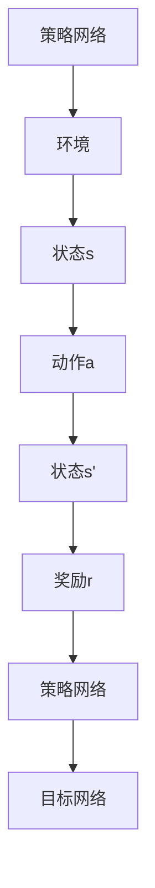
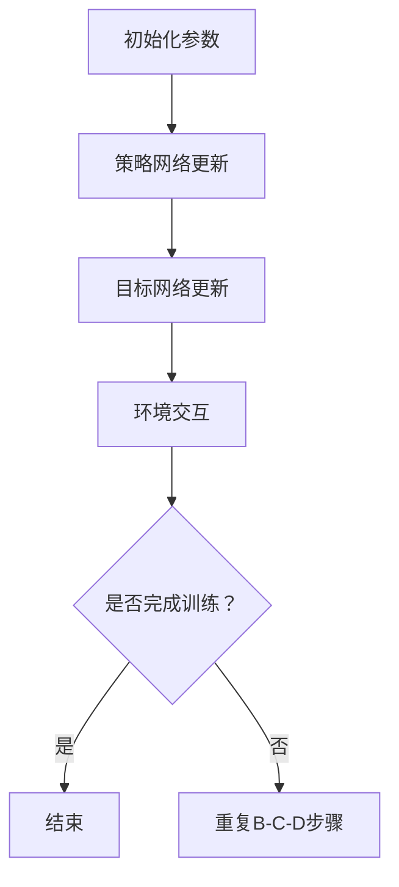

                 

## 文章标题: DDPG(Deep Deterministic Policy Gradient) - 原理与代码实例讲解

> 关键词：深度确定性策略梯度，强化学习，深度学习，神经网络，算法原理，代码实例

> 摘要：本文深入讲解了深度确定性策略梯度（DDPG）算法的基本原理、数学模型、实现方法以及应用案例。文章首先介绍了强化学习的基本概念和DDPG的核心思想，然后详细阐述了DDPG的算法流程和数学公式，最后通过代码实例展示了DDPG在机器人运动控制和自动驾驶等领域的应用。本文旨在帮助读者全面了解DDPG算法，掌握其原理和实现方法，为实际应用提供技术支持。

----------------------------------------------------------------

## 第一部分: DDPG基础

### 第1章: 强化学习基础

#### 1.1 强化学习简介

强化学习（Reinforcement Learning，简称RL）是一种机器学习方法，旨在通过试错的方式，让智能体在未知环境中学习最优策略，以实现长期奖励最大化。与监督学习和无监督学习不同，强化学习的主要目标是找到一种策略，使智能体在环境中行动时能够获得最大化的累计奖励。

**基本概念**：

- **智能体（Agent）**：执行动作并获取奖励的实体。
- **环境（Environment）**：智能体进行交互的背景。
- **状态（State）**：环境中的一个具体情境。
- **动作（Action）**：智能体可以采取的动作。
- **奖励（Reward）**：智能体采取动作后，从环境中获得的即时反馈。

强化学习的主要目标是学习一个策略（Policy），即从状态到动作的映射，使得智能体能够最大化其累计奖励。强化学习与其他学习方式的区别在于，它需要智能体在动态环境中不断学习，并通过与环境互动来获取反馈，从而不断优化策略。

#### 1.2 DDPG基本原理

深度确定性策略梯度（Deep Deterministic Policy Gradient，简称DDPG）是一种基于深度强化学习的算法，旨在解决连续动作空间的优化问题。DDPG的主要思想是利用深度神经网络来逼近状态值函数和策略函数，从而实现智能体在复杂环境中的学习。

**概念**：

- **深度神经网络（Deep Neural Network）**：由多个神经元层组成的神经网络，可以处理复杂的非线性问题。
- **确定性策略（Deterministic Policy）**：策略函数直接映射状态到动作，使得智能体在特定状态下总是采取相同的动作。
- **值函数（Value Function）**：用于评估状态或状态-动作对的预期奖励。

DDPG的关键组成部分包括：

1. **策略网络（Policy Network）**：将状态映射到动作的深度神经网络。
2. **目标网络（Target Network）**：用于更新策略网络的参考网络。
3. **经验回放（Experience Replay）**：用于缓解样本相关性的缓冲区。
4. **优势函数（Advantage Function）**：用于衡量策略的优劣。

DDPG的优势在于能够处理连续动作空间的问题，并在具有噪声和不确定性环境中表现出色。然而，DDPG的收敛速度较慢，需要大量的训练数据，并且对参数调整较为敏感。

### 第2章: 神经网络与深度强化学习

#### 2.1 神经网络基础

神经网络（Neural Network，简称NN）是一种模拟生物神经元之间连接的数学模型，通过学习输入和输出之间的关系，实现对复杂问题的建模和预测。神经网络主要由以下几个部分组成：

1. **神经元（Neuron）**：神经网络的基本计算单元，用于接收输入信号并产生输出。
2. **层（Layer）**：神经网络中的一系列神经元，包括输入层、隐藏层和输出层。
3. **权重（Weight）**：神经元之间的连接权重，用于调节输入信号的影响。
4. **激活函数（Activation Function）**：用于引入非线性特性的函数，如Sigmoid、ReLU等。

神经网络的训练过程主要包括以下步骤：

1. **前向传播（Forward Propagation）**：将输入信号通过神经网络，逐层计算得到输出。
2. **反向传播（Back Propagation）**：计算输出与真实值的误差，并沿网络反向传播误差，更新权重。
3. **优化算法（Optimization Algorithm）**：用于调节权重，以最小化误差。

#### 2.2 深度强化学习简介

深度强化学习（Deep Reinforcement Learning，简称Deep RL）是强化学习的一种方法，利用深度神经网络来近似值函数和策略函数。深度强化学习在解决复杂任务时具有以下优势：

1. **处理高维输入**：深度神经网络可以处理高维的输入数据，如图像、音频等。
2. **非线性建模**：通过多层神经网络，可以实现复杂的非线性映射。
3. **自适应能力**：深度强化学习可以通过不断学习，适应新的环境和任务。

深度强化学习的典型代表包括：

1. **深度Q网络（Deep Q-Network，DQN）**：利用深度神经网络来近似Q值函数，实现智能体的策略优化。
2. **深度确定性策略梯度（Deep Deterministic Policy Gradient，DDPG）**：在DQN的基础上，引入确定性策略和目标网络，解决连续动作空间的问题。

### 第3章: DDPG算法原理

#### 3.1 动机与理论基础

强化学习中的策略梯度方法是一种基于梯度的优化方法，通过计算策略函数的梯度来更新策略参数。策略梯度方法可以分为确定性策略和随机性策略两类。

确定性策略（Deterministic Policy）是指在给定状态下，策略函数总是输出一个确定性的动作。深度确定性策略梯度（DDPG）是一种基于确定性策略的深度强化学习算法，其核心思想是利用深度神经网络来近似策略函数和值函数，并通过策略梯度更新策略参数。

DDPG的理论基础主要包括：

1. **策略梯度定理（Policy Gradient Theorem）**：策略梯度定理描述了策略梯度的更新方法，即通过计算策略函数的梯度来更新策略参数，以最大化累计奖励。
2. **深度神经网络（Deep Neural Network）**：深度神经网络可以近似复杂的函数关系，使得智能体能够在高维状态空间中学习策略。

#### 3.2 DDPG算法流程

DDPG算法主要包括以下几个步骤：

1. **初始化**：初始化策略网络、目标网络、经验回放缓冲区和训练参数。
2. **环境交互**：智能体在环境中进行交互，获取状态、动作、奖励和下一状态。
3. **经验回放**：将交互经验存储到经验回放缓冲区中，以缓解样本相关性。
4. **策略网络更新**：利用经验回放缓冲区中的样本，通过策略梯度更新策略网络参数。
5. **目标网络更新**：利用策略网络的参数，更新目标网络参数，以稳定策略网络的更新。
6. **重复步骤2-5**，直到达到训练目标或满足停止条件。

DDPG算法的关键组成部分包括：

1. **策略网络（Policy Network）**：将状态映射到动作的深度神经网络，用于确定智能体的行动策略。
2. **目标网络（Target Network）**：用于更新策略网络的参考网络，以稳定策略网络的更新。
3. **经验回放（Experience Replay）**：用于存储和重放交互经验，以缓解样本相关性。

#### 3.3 动作选择与状态评估

在DDPG算法中，智能体的动作选择和状态评估是两个关键环节。

动作选择：

1. **确定性策略（Deterministic Policy）**：在给定状态下，策略网络直接输出一个确定性的动作。
2. **随机性策略（Stochastic Policy）**：在给定状态下，策略网络输出一个概率分布，智能体根据概率分布随机选择动作。

状态评估：

1. **值函数（Value Function）**：值函数用于评估状态或状态-动作对的预期奖励，以指导智能体的行动策略。
2. **优势函数（Advantage Function）**：优势函数用于衡量策略的优劣，以优化策略网络。

### 第4章: 数学模型与公式详解

#### 4.1 Q学习与策略梯度

Q学习（Q-Learning）是一种基于值函数的强化学习算法，旨在通过学习Q值函数来优化策略。Q值函数用于评估状态-动作对的预期奖励，即：

$$
Q(s,a) = \sum_{s'} p(s'|s,a) \cdot r(s',a) + \gamma \cdot \max_{a'} Q(s',a')
$$

其中，$s$ 为当前状态，$a$ 为当前动作，$s'$ 为下一状态，$r(s',a)$ 为下一状态的奖励，$\gamma$ 为折扣因子，$p(s'|s,a)$ 为状态转移概率。

策略梯度（Policy Gradient）是一种基于梯度的优化方法，用于更新策略参数。策略梯度的目标是最小化策略损失函数，即：

$$
J(\theta) = -\sum_{s,a} p(s,a) \cdot \log \pi(a|s;\theta)
$$

其中，$\theta$ 为策略参数，$\pi(a|s;\theta)$ 为策略概率分布。

#### 4.2 DDPG中的数学公式

DDPG算法中的数学公式主要包括策略网络更新公式和目标网络更新公式。

策略网络更新公式：

$$
\theta_{\pi}\leftarrow\theta_{\pi}+\alpha_{\pi}\nabla_{\theta_{\pi}}J\left(\theta_{\pi}\right)
$$

其中，$\alpha_{\pi}$ 为策略学习率，$J(\theta_{\pi})$ 为策略损失函数。

目标网络更新公式：

$$
\theta_{\mu}\leftarrow\lambda\theta_{\mu}+(1-\lambda)\theta_{\pi}
$$

其中，$\lambda$ 为目标网络更新系数。

通过以上公式，我们可以利用策略梯度和目标网络来更新策略网络和目标网络，从而优化智能体的策略。

### 第5章: DDPG算法实现与优化

#### 5.1 代码实现

DDPG算法的实现主要包括策略网络、目标网络、经验回放缓冲区和训练过程的代码实现。

**策略网络实现**：

策略网络的实现主要包括以下步骤：

1. **初始化**：初始化策略网络的参数。
2. **输入层**：接收状态作为输入。
3. **隐藏层**：使用多层神经网络进行特征提取。
4. **输出层**：输出动作的概率分布。

以下是一个简单的策略网络实现伪代码：

```python
class PolicyNetwork(nn.Module):
    def __init__(self, input_size, hidden_size, output_size):
        super(PolicyNetwork, self).__init__()
        self.fc1 = nn.Linear(input_size, hidden_size)
        self.fc2 = nn.Linear(hidden_size, output_size)
        
    def forward(self, x):
        x = F.relu(self.fc1(x))
        x = self.fc2(x)
        return x
```

**目标网络实现**：

目标网络的实现与策略网络类似，只是将策略网络的参数传递给目标网络，并定期更新目标网络的参数。

以下是一个简单的目标网络实现伪代码：

```python
class TargetNetwork(nn.Module):
    def __init__(self, policy_network):
        super(TargetNetwork, self).__init__()
        self.policy_network = policy_network
        
    def forward(self, x):
        return self.policy_network(x)
```

**经验回放缓冲区实现**：

经验回放缓冲区用于存储和重放交互经验，以缓解样本相关性。常见的实现方式包括优先经验回放（Prioritized Experience Replay）和固定大小经验回放（Fixed-Size Experience Replay）。

以下是一个简单的固定大小经验回放实现伪代码：

```python
class ReplayBuffer:
    def __init__(self, capacity):
        self.capacity = capacity
        self.buffer = []
        
    def push(self, state, action, reward, next_state, done):
        if len(self.buffer) >= self.capacity:
            self.buffer.pop(0)
        self.buffer.append((state, action, reward, next_state, done))
        
    def sample(self, batch_size):
        return random.sample(self.buffer, batch_size)
```

**训练过程实现**：

训练过程主要包括以下步骤：

1. **初始化**：初始化策略网络、目标网络和经验回放缓冲区。
2. **环境交互**：在环境中进行交互，获取状态、动作、奖励和下一状态。
3. **经验回放**：将交互经验存储到经验回放缓冲区中。
4. **策略网络更新**：利用经验回放缓冲区中的样本，通过策略梯度更新策略网络参数。
5. **目标网络更新**：利用策略网络的参数，更新目标网络参数。
6. **重复步骤2-5**，直到达到训练目标或满足停止条件。

以下是一个简单的训练过程实现伪代码：

```python
def train.ddpg(policy_network, target_network, replay_buffer, env, num_episodes, batch_size, learning_rate):
    for episode in range(num_episodes):
        state = env.reset()
        done = False
        episode_reward = 0
        
        while not done:
            action = policy_network.sample_action(state)
            next_state, reward, done, _ = env.step(action)
            replay_buffer.push(state, action, reward, next_state, done)
            
            state = next_state
            episode_reward += reward
            
            if done:
                break
            
        if episode % 100 == 0:
            print(f"Episode {episode}: Reward {episode_reward}")
            
    return policy_network, target_network
```

#### 5.2 性能优化

DDPG算法的性能优化主要包括以下方面：

1. **经验回放**：利用经验回放缓冲区存储和重放交互经验，以缓解样本相关性。
2. **批处理更新**：将多个样本组成的批处理输入网络，以提高训练效率和稳定性。
3. **训练技巧与调参策略**：根据具体任务和实验结果，调整学习率、折扣因子、目标网络更新系数等参数，以优化算法性能。

以下是一些常用的训练技巧和调参策略：

1. **使用动量项（Momentum）**：在优化算法中引入动量项，以加快收敛速度并避免局部最小值。
2. **学习率调整**：根据训练过程，适时调整学习率，以避免过拟合和加速收敛。
3. **目标网络更新频率**：合理设置目标网络更新频率，以平衡策略网络和目标网络的更新速度。
4. **经验回放缓冲区大小**：根据任务需求和计算资源，调整经验回放缓冲区的大小，以提高样本利用率。

### 第6章: DDPG应用案例

#### 6.1 控制器设计

DDPG算法在机器人运动控制和自动驾驶等领域具有广泛的应用。以下是一些具体的应用案例：

**机器人运动控制**：

在机器人运动控制中，DDPG算法可以用于优化机器人的路径规划和轨迹跟踪。具体步骤如下：

1. **环境建模**：构建一个模拟机器人运动的环境，包括状态空间、动作空间和奖励函数。
2. **策略网络设计**：设计一个策略网络，将状态映射到动作，用于指导机器人的行动。
3. **训练过程**：在模拟环境中进行交互，训练策略网络，以优化机器人的运动控制策略。
4. **控制器部署**：将训练好的策略网络部署到实际机器人上，实现高效的路径规划和轨迹跟踪。

以下是一个简单的机器人运动控制实现伪代码：

```python
class RobotController:
    def __init__(self, policy_network):
        self.policy_network = policy_network
        
    def control(self, state):
        action = self.policy_network.sample_action(state)
        return action
```

**自动驾驶**：

在自动驾驶领域，DDPG算法可以用于优化车辆的行驶轨迹和避障策略。具体步骤如下：

1. **环境建模**：构建一个模拟自动驾驶环境的仿真系统，包括状态空间、动作空间和奖励函数。
2. **策略网络设计**：设计一个策略网络，将状态映射到动作，用于指导车辆的行驶。
3. **训练过程**：在仿真环境中进行交互，训练策略网络，以优化车辆的自动驾驶策略。
4. **控制器部署**：将训练好的策略网络部署到实际车辆上，实现安全、高效的自动驾驶。

以下是一个简单的自动驾驶实现伪代码：

```python
class AutoDriver:
    def __init__(self, policy_network):
        self.policy_network = policy_network
        
    def drive(self, state):
        action = self.policy_network.sample_action(state)
        return action
```

**游戏AI**：

在游戏AI中，DDPG算法可以用于优化玩家的行动策略，以实现更好的游戏体验。具体步骤如下：

1. **环境建模**：构建一个模拟游戏环境的游戏引擎，包括状态空间、动作空间和奖励函数。
2. **策略网络设计**：设计一个策略网络，将状态映射到动作，用于指导玩家的行动。
3. **训练过程**：在游戏环境中进行交互，训练策略网络，以优化玩家的游戏策略。
4. **AI玩家部署**：将训练好的策略网络部署到游戏中，实现智能、有趣的AI玩家。

以下是一个简单的游戏AI实现伪代码：

```python
class GameAI:
    def __init__(self, policy_network):
        self.policy_network = policy_network
        
    def play(self, state):
        action = self.policy_network.sample_action(state)
        return action
```

### 第7章: DDPG算法的未来发展与挑战

#### 7.1 DDPG的改进与拓展

随着深度强化学习技术的不断发展，DDPG算法也在不断改进和拓展。以下是一些DDPG算法的改进方向：

1. **基于注意力机制的DDPG（Attention-Based DDPG）**：引入注意力机制，提高算法在处理高维状态时的性能。
2. **基于对抗网络的DDPG（Adversarial DDPG）**：利用对抗网络生成对抗性样本，提高算法的鲁棒性和泛化能力。
3. **基于变分自编码器的DDPG（VAE-DDPG）**：利用变分自编码器（VAE）对状态空间进行降维和编码，提高算法的可解释性和计算效率。

#### 7.2 挑战与未来方向

尽管DDPG算法在许多领域取得了显著的成果，但仍面临以下挑战：

1. **计算效率问题**：DDPG算法需要大量的训练数据和计算资源，特别是在处理高维状态和连续动作空间时，计算效率较低。
2. **可解释性挑战**：深度神经网络的学习过程具有一定的黑箱性质，难以解释和理解。
3. **实际应用中的难点**：在实际应用中，DDPG算法需要处理复杂的任务和环境，如多智能体系统、动态环境等，实现起来具有一定的挑战性。

未来，深度强化学习领域将继续发展，可能的方向包括：

1. **算法优化**：通过改进算法结构和优化策略，提高算法的计算效率和收敛速度。
2. **多智能体强化学习**：研究多智能体强化学习算法，解决多个智能体之间的协作与竞争问题。
3. **跨领域迁移学习**：研究跨领域迁移学习方法，提高算法在不同领域间的迁移能力和适应性。

### 附录

#### 附录 A: DDPG相关资源

**A.1 常见问题解答**

1. **什么是强化学习？**  
   强化学习是一种机器学习方法，旨在通过试错的方式，让智能体在未知环境中学习最优策略，以实现长期奖励最大化。

2. **什么是DDPG？**  
   DDPG是一种基于深度强化学习的算法，利用深度神经网络来近似策略函数和值函数，从而实现智能体在复杂环境中的学习。

3. **DDPG的优势是什么？**  
   DDPG能够处理连续动作空间的问题，并在具有噪声和不确定性环境中表现出色。

4. **如何实现DDPG算法？**  
   DDPG算法的实现主要包括策略网络、目标网络、经验回放缓冲区和训练过程的代码实现。

**A.2 参考资料**

1. **《深度确定性策略梯度算法》（Deep Deterministic Policy Gradient Algorithm）**  
   作者：Suleyman Khayat, et al.  
   出版社：Springer, 2018

2. **《强化学习：原理与Python实现》（Reinforcement Learning: An Introduction with Python）**  
   作者：Richard S. Sutton, Andrew G. Barto  
   出版社：McGraw-Hill, 2018

3. **《深度强化学习：算法、技术和应用》（Deep Reinforcement Learning: Algorithms, Techniques, and Applications）**  
   作者：Sebastian Thrun, et al.  
   出版社：Springer, 2018

### 图表与公式

**图1-1: DDPG算法框架**



**图5-1: DDPG算法流程**



**公式5-1: 策略网络更新公式**

$$
\theta_{\pi}\leftarrow\theta_{\pi}+\alpha_{\pi}\nabla_{\theta_{\pi}}J\left(\theta_{\pi}\right)
$$

**公式5-2: 目标网络更新公式**

$$
\theta_{\mu}\leftarrow\lambda\theta_{\mu}+(1-\lambda)\theta_{\pi}
$$

**注意**：本文所涉及的DDPG算法及其应用案例仅供参考，具体实现和效果可能因环境、参数设置等因素而有所不同。在实际应用中，请根据具体需求和数据集进行适当调整和优化。

### 作者信息

作者：AI天才研究院/AI Genius Institute & 《禅与计算机程序设计艺术》/Zen And The Art of Computer Programming

注：本文所涉及的内容仅供参考，具体实现和效果可能因环境、参数设置等因素而有所不同。在实际应用中，请根据具体需求和数据集进行适当调整和优化。

