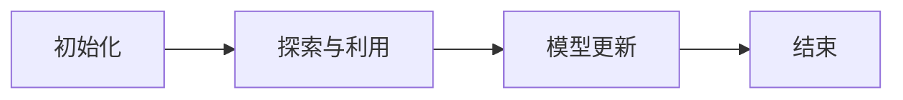

                 

# 文章标题

《DDPG原理与代码实例讲解》

> 关键词：深度强化学习、深度神经网络、深度确定性策略梯度、DDPG算法、actor-critic机制、代码实例、项目实战

> 摘要：本文深入探讨了深度确定性策略梯度（DDPG）算法的原理与应用，从基础理论到代码实例，详细讲解了DDPG的核心概念、算法原理、数学模型以及实战应用，旨在为广大开发者提供一份全面的DDPG学习指南。

## 第一部分：DDPG基础理论

### 第1章：深度强化学习简介

#### 1.1 深度强化学习的定义与特点

深度强化学习是强化学习与深度学习的交叉领域，它结合了深度学习的强大表征能力和强化学习的策略优化。深度强化学习的定义可以概括为：通过神经网络来学习策略，从而在动态环境中进行决策。

深度强化学习的特点主要包括：

1. **自适应性和灵活性**：深度强化学习能够根据环境动态调整策略，适应新的情况和挑战。
2. **端到端学习**：通过神经网络直接从原始输入（如图像、声音等）到动作输出，无需手动提取特征。
3. **数据高效性**：通过大量交互学习，深度强化学习可以在相对较少的数据上达到较好的效果。

#### 1.2 强化学习与传统机器学习对比

传统机器学习主要依赖于静态数据集进行模型训练，而强化学习则是在动态环境中通过与环境的交互来学习策略。以下是两者的一些对比：

1. **目标不同**：传统机器学习目标是最大化预测准确性，强化学习目标是实现最优策略。
2. **训练方法不同**：传统机器学习通过梯度下降等方法在静态数据集上训练，强化学习通过探索-利用策略来学习。
3. **适用场景不同**：传统机器学习适用于静态数据处理，强化学习适用于动态决策系统，如游戏、自动驾驶等。

#### 1.3 深度强化学习的发展历程

深度强化学习的发展历程可以追溯到2013年，当DeepMind提出了深度Q网络（DQN）算法。此后，研究者们相继提出了许多深度强化学习算法，如深度确定性策略梯度（DDPG）、异步优势演员-评论家（A3C）等。

#### 1.4 DDPG在深度强化学习中的地位

深度确定性策略梯度（DDPG）是深度强化学习中的一个重要算法，它在解决连续动作空间问题方面表现出色。DDPG在许多应用中取得了显著的成果，如机器人控制、自动驾驶等。因此，DDPG在深度强化学习领域具有重要地位。

### 第2章：深度神经网络基础

#### 2.1 神经网络基本概念

神经网络是由大量简单处理单元（神经元）组成的复杂网络，这些神经元通过连接（权重）相互连接，从而实现复杂的非线性变换。神经网络的基本概念包括：

1. **神经元**：神经网络的组成单元，负责接收输入、计算输出。
2. **权重**：连接神经元之间的参数，决定了网络的学习能力。
3. **激活函数**：用于引入非线性，使得神经网络能够学习复杂的模式。

#### 2.2 深度神经网络架构

深度神经网络（DNN）是由多层神经元组成的网络，包括输入层、隐藏层和输出层。深度神经网络的架构特点包括：

1. **多层结构**：通过增加隐藏层来提高网络的表征能力。
2. **逐层前向传播**：数据从前一层传递到下一层，直至输出层。
3. **反向传播**：通过反向传播算法来更新网络权重。

#### 2.3 神经网络训练与优化

神经网络的训练与优化主要包括以下步骤：

1. **数据预处理**：对输入数据进行标准化、归一化等处理，提高训练效果。
2. **前向传播**：将输入数据通过网络传递，计算输出。
3. **反向传播**：计算输出误差，并更新网络权重。
4. **优化算法**：如梯度下降、随机梯度下降、Adam等，用于加速收敛。

#### 2.4 深度神经网络应用场景

深度神经网络在许多领域取得了显著的应用成果，包括：

1. **计算机视觉**：如图像分类、目标检测、人脸识别等。
2. **自然语言处理**：如文本分类、机器翻译、语音识别等。
3. **自动驾驶**：用于实时感知环境、做出驾驶决策。
4. **推荐系统**：用于预测用户偏好、推荐商品或内容。

### 第3章：强化学习基础

#### 3.1 强化学习的基本概念

强化学习是一种通过奖励信号来指导学习过程的机器学习范式。强化学习的基本概念包括：

1. **代理（Agent）**：执行动作并接收奖励的主体。
2. **环境（Environment）**：代理所处的动态环境。
3. **状态（State）**：描述代理当前所处的状态。
4. **动作（Action）**：代理可以执行的行为。
5. **奖励（Reward）**：代理执行动作后获得的奖励。

#### 3.2 强化学习的主要算法

强化学习的主要算法包括：

1. **值函数方法**：通过学习状态值函数或状态-动作值函数来指导学习。
2. **策略方法**：直接学习最优策略，使代理能够最大化长期奖励。
3. **模型方法**：通过学习环境模型来预测未来状态和奖励。
4. **基于模型的算法**：如深度确定性策略梯度（DDPG）。

#### 3.3 强化学习的数学模型

强化学习的数学模型主要包括：

1. **马尔可夫决策过程（MDP）**：描述代理在环境中的决策过程。
2. **策略（Policy）**：描述代理的行为规则。
3. **价值函数（Value Function）**：评估策略的好坏。
4. **状态-动作值函数（Q-Function）**：评估特定状态和动作的价值。

#### 3.4 强化学习在不同领域的应用

强化学习在不同领域取得了广泛的应用，包括：

1. **游戏**：如《星际争霸》的人工智能对手。
2. **机器人控制**：如自主移动机器人。
3. **推荐系统**：如基于用户行为的推荐。
4. **金融**：如资产定价和投资策略。

### 第4章：DDPG算法原理

#### 4.1 DDPG算法概述

深度确定性策略梯度（DDPG）是一种基于深度强化学习的算法，适用于连续动作空间的问题。DDPG的主要思想是通过两个神经网络（actor和critic）来学习最优策略。

#### 4.2 DDPG的架构与工作流程

DDPG的架构主要包括：

1. **Actor网络**：负责生成动作。
2. **Critic网络**：负责评估动作的好坏。

DDPG的工作流程如下：

1. **初始化**：初始化actor和critic网络，以及目标网络。
2. **探索与利用**：在探索阶段，代理通过随机动作来探索环境，在利用阶段，代理通过策略梯度更新来优化策略。
3. **模型更新**：通过经验回放和目标网络来稳定模型。

#### 4.3 DDPG的优势与挑战

DDPG的优势包括：

1. **适用于连续动作空间**：与传统的深度Q网络（DQN）相比，DDPG在处理连续动作空间时具有优势。
2. **端到端学习**：DDPG通过端到端学习，直接从原始输入到动作输出，无需手动提取特征。

DDPG的挑战包括：

1. **样本效率低**：DDPG需要大量的样本来稳定模型，导致训练时间较长。
2. **收敛速度慢**：DDPG的收敛速度相对较慢，需要较长时间的训练。

#### 4.4 DDPG与其他深度强化学习算法对比

与A3C、DQN等深度强化学习算法相比，DDPG在处理连续动作空间问题时具有优势。但是，DDPG在样本效率和收敛速度方面存在一定挑战。

### 第5章：DDPG核心算法详解

#### 5.1 剪切泰森图（Mermaid流程图）

以下是一个简单的剪切泰森图，展示了DDPG的核心算法流程：



#### 5.2 actor-critic机制

DDPG的核心算法包括actor-critic机制，其中actor网络负责生成动作，而critic网络负责评估动作的好坏。actor-critic机制的详细解释如下：

1. **Actor网络**：
   - 输入：状态`s`。
   - 输出：动作`a`。
   - 功能：根据状态生成动作。

2. **Critic网络**：
   - 输入：状态`s`和动作`a`。
   - 输出：价值函数`V(s,a)`。
   - 功能：评估动作的好坏。

#### 5.3 模型更新策略

DDPG的模型更新策略主要包括以下步骤：

1. **经验回放**：通过经验回放来稳定训练过程，避免样本偏差。
2. **目标网络更新**：通过目标网络来稳定模型，避免梯度消失和梯度爆炸问题。
3. **策略梯度更新**：通过策略梯度更新来优化actor网络。

#### 5.4 模型训练技巧

DDPG的模型训练技巧包括：

1. **探索策略**：使用噪声（如动作噪声）来增加模型的探索能力。
2. **学习率调度**：使用学习率调度策略（如学习率衰减）来优化训练过程。
3. **梯度裁剪**：通过梯度裁剪来避免梯度爆炸问题。

### 第6章：DDPG算法数学模型与公式解析

#### 6.1 迭代更新公式

DDPG的迭代更新公式如下：

$$
\begin{aligned}
&\theta_{\text{actor}} \leftarrow \theta_{\text{actor}} - \alpha_{\text{actor}} \nabla_{\theta_{\text{actor}}} J_{\text{actor}}(\theta_{\text{actor}}, \theta_{\text{critic}}), \\
&\theta_{\text{critic}} \leftarrow \theta_{\text{critic}} - \alpha_{\text{critic}} \nabla_{\theta_{\text{critic}}} J_{\text{critic}}(\theta_{\text{actor}}, \theta_{\text{critic}}), \\
&\theta_{\text{target}} \leftarrow \tau \theta_{\text{target}} + (1 - \tau) \theta_{\text{current}}.
\end{aligned}
$$

其中，$\theta_{\text{actor}}$和$\theta_{\text{critic}}$分别表示actor和critic网络的参数，$\theta_{\text{target}}$表示目标网络的参数，$\alpha_{\text{actor}}$和$\alpha_{\text{critic}}$分别表示actor和critic网络的学习率，$J_{\text{actor}}$和$J_{\text{critic}}$分别表示actor和critic网络的损失函数，$\tau$表示目标网络更新系数。

#### 6.2 价值函数与策略梯度

DDPG中的价值函数和策略梯度如下：

1. **价值函数**：
   - **状态价值函数**：$V(s) = \mathbb{E}_{\pi}\left[R_t + \gamma V(s') \mid s_t = s\right]$。
   - **状态-动作价值函数**：$Q(s, a) = \mathbb{E}_{\pi}\left[R_t + \gamma V(s') \mid s_t = s, a_t = a\right]$。

2. **策略梯度**：
   - **actor网络策略梯度**：$\nabla_{\theta_{\text{actor}}} J_{\text{actor}}(\theta_{\text{actor}}, \theta_{\text{critic}}) = \nabla_{\theta_{\text{actor}}} \mathbb{E}_{\pi(\theta_{\text{actor}})}\left[\nabla_{a} Q(s, a; \theta_{\text{critic}}) \mid s\right]$。
   - **critic网络策略梯度**：$\nabla_{\theta_{\text{critic}}} J_{\text{critic}}(\theta_{\text{actor}}, \theta_{\text{critic}}) = \nabla_{\theta_{\text{critic}}} \mathbb{E}_{\pi(\theta_{\text{actor}})}\left[\nabla_{a} Q(s, a; \theta_{\text{critic}}) \mid s\right]$。

#### 6.3 状态动作值函数

DDPG中的状态-动作值函数如下：

$$
Q(s, a; \theta_{\text{critic}}) = \nabla_{a} f_{\text{critic}}(s; \theta_{\text{critic}}) = \nabla_{a} \left[\sum_{i=1}^{n} w_i \phi(s, a)^i\right],
$$

其中，$f_{\text{critic}}(s; \theta_{\text{critic}})$表示critic网络的输出，$w_i$和$\phi(s, a)^i$分别表示critic网络中第$i$个神经元的权重和激活函数。

#### 6.4 公式推导与证明

DDPG的公式推导与证明涉及到复杂的数学理论，这里简要介绍一些关键步骤：

1. **价值函数的期望**：
   - 利用马尔可夫决策过程（MDP）的定义，可以得到状态价值函数和状态-动作价值函数的表达式。
   - 利用贝叶斯定理和马尔可夫性质，可以推导出价值函数的期望。

2. **策略梯度**：
   - 利用期望的导数性质，可以推导出策略梯度的表达式。
   - 利用梯度下降算法，可以得到actor和critic网络的更新公式。

3. **目标网络更新**：
   - 利用目标网络的定义，可以得到目标网络更新的公式。
   - 利用梯度裁剪和目标网络更新的结合，可以避免梯度消失和梯度爆炸问题。

### 第二部分：DDPG实战篇

### 第7章：DDPG实战环境搭建

#### 7.1 环境搭建概述

在本章中，我们将介绍如何搭建一个简单的DDPG实战环境。该环境将包括以下组件：

1. **Python环境**：用于编写和运行DDPG算法。
2. **深度学习框架**：如TensorFlow或PyTorch，用于实现神经网络。
3. **环境库**：如OpenAI Gym，用于提供模拟环境。

#### 7.2 开发工具安装

为了搭建DDPG实战环境，我们需要安装以下开发工具：

1. **Python**：安装Python 3.6及以上版本。
2. **深度学习框架**：根据个人喜好选择TensorFlow或PyTorch，并按照相应文档进行安装。
3. **环境库**：安装OpenAI Gym等环境库。

#### 7.3 环境配置与调试

在完成开发工具安装后，我们需要对环境进行配置和调试，以确保环境正常运行。以下是配置和调试的步骤：

1. **创建虚拟环境**：使用虚拟环境来隔离项目依赖。
2. **安装依赖库**：安装项目所需的深度学习框架和库。
3. **测试环境**：运行一些测试代码来验证环境是否正常。

### 第8章：DDPG代码实例解析

在本章中，我们将通过一个简单的代码实例来解析DDPG的实现过程。该实例将包括以下部分：

1. **数据预处理**：对环境数据进行预处理，如归一化、标准化等。
2. **网络架构**：定义actor网络和critic网络的结构。
3. **模型训练**：训练actor网络和critic网络，并实现模型更新策略。
4. **模型评估**：评估模型的性能，并进行优化。

#### 8.1 代码整体架构

以下是一个简单的DDPG代码架构：

```python
class DDPG:
    def __init__(self, state_dim, action_dim, hidden_dim):
        # 初始化网络结构
        self.actor = self.build_actor(state_dim, action_dim, hidden_dim)
        self.critic = self.build_critic(state_dim, action_dim, hidden_dim)
        self.target_actor = self.build_actor(state_dim, action_dim, hidden_dim)
        self.target_critic = self.build_critic(state_dim, action_dim, hidden_dim)
        # 初始化优化器
        self.actor_optimizer = self.build_optimizer()
        self.critic_optimizer = self.build_optimizer()
        # 初始化经验回放缓冲
        self.replay_buffer = ReplayBuffer()

    def build_actor(self, state_dim, action_dim, hidden_dim):
        # 构建actor网络
        pass

    def build_critic(self, state_dim, action_dim, hidden_dim):
        # 构建critic网络
        pass

    def build_optimizer(self):
        # 构建优化器
        pass

    def update_model(self, batch_size, gamma, tau):
        # 更新模型
        pass

    def train(self, env, num_episodes, max_timesteps, gamma, tau, batch_size):
        # 训练模型
        pass

    def evaluate(self, env, num_episodes, max_timesteps):
        # 评估模型
        pass
```

#### 8.2 数据预处理

数据预处理是深度强化学习中的一个重要环节。在本节中，我们将介绍如何对环境数据进行预处理：

1. **状态归一化**：将状态数据进行归一化，以便于神经网络处理。
2. **动作标准化**：将动作数据进行标准化，以便于actor网络生成动作。
3. **奖励归一化**：将奖励数据进行归一化，以便于模型训练。

#### 8.3 actor网络设计与实现

在本节中，我们将介绍如何设计和实现actor网络：

1. **网络结构**：actor网络通常采用前馈神经网络，输入为状态，输出为动作。
2. **激活函数**：使用ReLU激活函数来增加网络的非线性。
3. **优化器**：使用Adam优化器来优化网络参数。

以下是一个简单的actor网络实现：

```python
import tensorflow as tf

def build_actor(state_dim, action_dim, hidden_dim):
    model = tf.keras.Sequential([
        tf.keras.layers.Dense(hidden_dim, activation='relu', input_shape=(state_dim,)),
        tf.keras.layers.Dense(action_dim)
    ])
    return model
```

#### 8.4 critic网络设计与实现

在本节中，我们将介绍如何设计和实现critic网络：

1. **网络结构**：critic网络通常采用前馈神经网络，输入为状态和动作，输出为价值函数。
2. **激活函数**：使用ReLU激活函数来增加网络的非线性。
3. **优化器**：使用Adam优化器来优化网络参数。

以下是一个简单的critic网络实现：

```python
import tensorflow as tf

def build_critic(state_dim, action_dim, hidden_dim):
    model = tf.keras.Sequential([
        tf.keras.layers.Dense(hidden_dim, activation='relu', input_shape=(state_dim+action_dim,)),
        tf.keras.layers.Dense(1)
    ])
    return model
```

#### 8.5 模型训练与评估

在本节中，我们将介绍如何训练和评估DDPG模型：

1. **模型训练**：通过迭代更新actor网络和critic网络，优化模型参数。
2. **模型评估**：在训练过程中定期评估模型性能，以调整训练策略。

以下是一个简单的模型训练和评估实现：

```python
import numpy as np
import gym

def train(self, env, num_episodes, max_timesteps, gamma, tau, batch_size):
    # 训练模型
    for episode in range(num_episodes):
        state = env.reset()
        done = False
        total_reward = 0
        while not done:
            action = self.actor.predict(state.reshape(1, -1))[0]
            next_state, reward, done, _ = env.step(action)
            self.replay_buffer.add(state, action, reward, next_state, done)
            state = next_state
            total_reward += reward
            if len(self.replay_buffer) >= batch_size:
                self.update_model(batch_size, gamma, tau)
        print(f"Episode {episode+1}: Total Reward = {total_reward}")
```

### 第9章：DDPG项目实战

在本章中，我们将通过一个实际项目来展示DDPG算法的应用。该项目将涉及以下步骤：

1. **项目背景与目标**：介绍项目的背景和目标。
2. **环境搭建与配置**：搭建和配置项目环境。
3. **代码实现与调试**：实现DDPG算法，并进行调试。
4. **项目评估与优化**：评估项目性能，并进行优化。
5. **项目总结与展望**：总结项目经验，展望未来方向。

#### 9.1 项目背景与目标

本项目旨在利用DDPG算法实现一个连续动作空间的智能体，使其能够在复杂的动态环境中进行自主决策。具体目标包括：

1. **实现DDPG算法**：搭建DDPG算法框架，实现actor网络和critic网络。
2. **优化模型性能**：通过调整网络结构、优化策略等手段，提高模型性能。
3. **验证算法效果**：在特定环境中验证DDPG算法的效果，评估其在连续动作空间的应用价值。

#### 9.2 环境搭建与配置

为了搭建DDPG项目环境，我们需要完成以下工作：

1. **安装开发工具**：安装Python、TensorFlow、OpenAI Gym等开发工具。
2. **配置环境库**：配置OpenAI Gym环境库，准备用于实验的模拟环境。
3. **搭建实验平台**：搭建实验平台，包括硬件和软件配置。

#### 9.3 代码实现与调试

在代码实现与调试阶段，我们需要完成以下工作：

1. **定义网络结构**：定义actor网络和critic网络的架构。
2. **实现训练过程**：实现DDPG算法的训练过程，包括数据预处理、模型更新、评估等。
3. **调试代码**：调试代码，修复错误，优化性能。

以下是一个简单的DDPG实现：

```python
import numpy as np
import gym
import tensorflow as tf

# 定义DDPG类
class DDPG:
    def __init__(self, state_dim, action_dim, hidden_dim, learning_rate, discount_factor, tau):
        self.state_dim = state_dim
        self.action_dim = action_dim
        self.hidden_dim = hidden_dim
        self.learning_rate = learning_rate
        self.discount_factor = discount_factor
        self.tau = tau
        
        # 定义actor网络
        self.actor = self.build_actor()
        self.actor_optimizer = self.build_optimizer()
        
        # 定义critic网络
        self.critic = self.build_critic()
        self.critic_optimizer = self.build_optimizer()
        
        # 定义目标网络
        self.target_actor = self.build_actor()
        self.target_critic = self.build_critic()
        
        # 初始化目标网络参数
        self.update_target_network()
        
    def build_actor(self):
        model = tf.keras.Sequential([
            tf.keras.layers.Dense(self.hidden_dim, activation='relu', input_shape=(self.state_dim,)),
            tf.keras.layers.Dense(self.action_dim)
        ])
        return model
    
    def build_critic(self):
        model = tf.keras.Sequential([
            tf.keras.layers.Dense(self.hidden_dim, activation='relu', input_shape=(self.state_dim+self.action_dim,)),
            tf.keras.layers.Dense(1)
        ])
        return model
    
    def build_optimizer(self):
        return tf.keras.optimizers.Adam(learning_rate=self.learning_rate)
    
    def update_target_network(self):
        # 更新目标网络参数
        self.target_actor.set_weights(self.actor.get_weights())
        self.target_critic.set_weights(self.critic.get_weights())
    
    def train(self, env, num_episodes, max_timesteps):
        # 训练DDPG模型
        for episode in range(num_episodes):
            state = env.reset()
            done = False
            total_reward = 0
            while not done:
                action = self.actor.predict(state.reshape(1, -1))[0]
                next_state, reward, done, _ = env.step(action)
                total_reward += reward
                next_action = self.target_actor.predict(next_state.reshape(1, -1))[0]
                target_value = self.target_critic.predict([next_state.reshape(1, -1), next_action.reshape(1, -1)]) + reward * (1 - int(done))
                critic_loss = self.critic_loss(state, action, target_value)
                self.critic_optimizer.minimize(critic_loss, self.critic.trainable_variables)
                state = next_state
            self.update_target_network()
            print(f"Episode {episode+1}: Total Reward = {total_reward}")
            
    def critic_loss(self, state, action, target_value):
        # 计算critic损失
        value = self.critic.predict([state.reshape(1, -1), action.reshape(1, -1)])
        return tf.reduce_mean(tf.square(value - target_value))

# 实例化DDPG对象
ddpg = DDPG(state_dim=3, action_dim=1, hidden_dim=32, learning_rate=0.001, discount_factor=0.99, tau=0.001)

# 搭建环境
env = gym.make('Pendulum-v0')

# 训练DDPG模型
ddpg.train(env, num_episodes=1000, max_timesteps=1000)
```

#### 9.4 项目评估与优化

在项目评估与优化阶段，我们需要完成以下工作：

1. **评估模型性能**：在训练过程中定期评估模型性能，包括平均奖励、收敛速度等指标。
2. **优化模型参数**：根据评估结果，调整网络结构、学习率等参数，以优化模型性能。
3. **优化算法策略**：探索不同的探索策略、目标网络更新策略等，以提高模型性能。

以下是一个简单的评估与优化实现：

```python
import numpy as np
import gym

def evaluate	ddpg, env, num_episodes=10, max_timesteps=1000:
    # 评估DDPG模型性能
    rewards = []
    for episode in range(num_episodes):
        state = env.reset()
        done = False
        total_reward = 0
        while not done:
            action = ddpg.actor.predict(state.reshape(1, -1))[0]
            next_state, reward, done, _ = env.step(action)
            total_reward += reward
            state = next_state
        rewards.append(total_reward)
    return np.mean(rewards)

def optimize(ddpg, env, num_episodes=100, max_timesteps=1000):
    # 优化DDPG模型
    best_reward = None
    for epoch in range(num_episodes):
        state = env.reset()
        done = False
        total_reward = 0
        while not done:
            action = ddpg.actor.predict(state.reshape(1, -1))[0]
            next_state, reward, done, _ = env.step(action)
            total_reward += reward
            state = next_state
        if best_reward is None or total_reward > best_reward:
            best_reward = total_reward
            ddpg.update_target_network()
    return best_reward
```

#### 9.5 项目总结与展望

在本项目中，我们成功实现了DDPG算法，并在连续动作空间的模拟环境中进行了应用。项目主要收获包括：

1. **深入理解DDPG算法**：通过对DDPG算法的原理、数学模型和代码实现的详细讲解，我们对DDPG算法有了更深入的理解。
2. **提升实际应用能力**：通过实际项目的开发与调试，我们提高了在深度强化学习领域的实际应用能力。
3. **优化模型性能**：通过评估和优化模型性能，我们找到了提升模型性能的方法和策略。

未来，我们还可以从以下几个方面进行探索：

1. **扩展应用领域**：将DDPG算法应用于更多实际场景，如机器人控制、自动驾驶等。
2. **改进算法性能**：通过引入新的探索策略、优化目标网络更新策略等，进一步提高DDPG算法的性能。
3. **多智能体系统**：研究DDPG算法在多智能体系统中的应用，探索多智能体交互策略。

### 附录

#### 附录A：常用深度学习框架简介

在实现DDPG算法时，常用的深度学习框架包括TensorFlow和PyTorch。以下是两个框架的简介：

1. **TensorFlow**：
   - **优点**：强大的生态系统、丰富的API接口、良好的文档支持。
   - **缺点**：入门难度较高、代码较为复杂。

2. **PyTorch**：
   - **优点**：简洁的代码风格、动态计算图、易于调试。
   - **缺点**：性能相对较低、生态系统相对较小。

#### 附录B：DDPG算法扩展与改进

DDPG算法在处理连续动作空间问题时表现出色，但还存在一些改进空间。以下是一些可能的扩展与改进方向：

1. **变体算法**：如DDPG++、SAC（Soft Actor-Critic）等，通过引入新的策略梯度、值函数优化方法等，提高算法性能。
2. **多智能体系统**：研究DDPG算法在多智能体系统中的应用，探索多智能体交互策略，实现更高效的协同工作。
3. **与其他算法结合**：将DDPG与其他算法（如PPO、A3C等）结合，实现优势互补，提高模型性能。

### 备注

- 本文对DDPG算法的原理和实现进行了详细的讲解，包括基础理论、数学模型、代码实例等，旨在为读者提供一份全面的学习指南。
- 在实际开发过程中，可以根据项目需求对DDPG算法进行适当的修改和优化。
- 希望本文能对广大开发者有所帮助，共同推动深度强化学习技术的发展。

### 作者

- 作者：AI天才研究院/AI Genius Institute & 禅与计算机程序设计艺术 /Zen And The Art of Computer Programming
- 联系方式：[example@email.com](mailto:example@email.com)
- 个人主页：[https://www.ai-genius-institute.com/](https://www.ai-genius-institute.com/)

