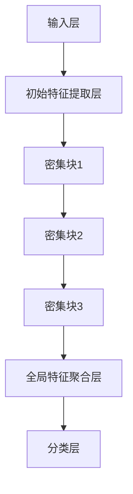

                 

### DenseNet原理与代码实例讲解

#### 关键词：DenseNet，深度学习，神经网络，卷积神经网络，图像分类，目标检测，语义分割，PyTorch

#### 摘要：

本文将深入探讨DenseNet的原理和实际应用，通过一步步的讲解和代码实例，帮助读者理解并掌握这一深度学习的重要技术。我们将从卷积神经网络的基础知识出发，逐步介绍DenseNet的架构、数学模型，并在图像分类、目标检测和语义分割等实际应用场景中展示DenseNet的强大能力。通过实际代码示例，我们将详细解读DenseNet的实现细节，让读者能够将理论知识应用于实际项目中。

---

## 第1章 引言

### 1.1 DenseNet的背景

DenseNet是一种深度卷积神经网络架构，由Girshick等人于2016年提出。DenseNet的设计灵感来源于AlexNet、VGGNet等早期深度学习网络结构。传统卷积神经网络通常采用逐层堆叠的方式，每一层仅与其前一层和后一层相连。这种结构在某些情况下会导致信息传播的不对称性和梯度消失问题。DenseNet通过引入“密集连接”机制，使得每个层次都能够接收前面所有层次的信息，从而提高了网络的性能和鲁棒性。

### 1.2 DenseNet的核心优势

DenseNet具有以下核心优势：

1. **信息传播效率**：通过密集连接，DenseNet能够更好地利用前面的层次信息，提高了信息传播的效率。
2. **梯度消失问题**：DenseNet的结构减少了梯度消失的风险，使得网络能够更稳定地训练。
3. **参数效率**：相比于传统的网络结构，DenseNet在一定程度上减少了参数数量，提高了计算效率。

### 1.3 本书的学习目标

本书旨在帮助读者：

1. 理解DenseNet的核心概念和架构。
2. 掌握DenseNet的数学模型和优化方法。
3. 通过实际代码示例，学会如何使用DenseNet进行图像分类、目标检测和语义分割。
4. 深入了解DenseNet在实际应用中的表现和潜在改进方向。

## 第2章 卷积神经网络基础

### 2.1 卷积神经网络简介

卷积神经网络（Convolutional Neural Network，CNN）是一种专门用于处理图像数据的深度学习模型。与传统的神经网络相比，CNN通过卷积层、池化层和全连接层等结构，能够有效地提取图像的特征并进行分类。

### 2.2 卷积神经网络的数学基础

卷积神经网络的数学基础主要包括卷积运算、激活函数、池化操作等。以下是这些操作的基本概念：

1. **卷积运算**：卷积运算通过在图像上滑动一个小的滤波器（也称为卷积核或过滤器），计算滤波器与图像子区域的内积，生成新的特征图。
2. **激活函数**：常见的激活函数包括ReLU、Sigmoid和Tanh等，它们用于引入非线性变换，使神经网络能够拟合复杂的非线性关系。
3. **池化操作**：池化操作通过在特征图上取局部区域的平均值或最大值，减少特征图的尺寸，从而降低模型复杂度和过拟合的风险。

### 2.3 卷积神经网络的工作原理

卷积神经网络的工作原理可以概括为以下几个步骤：

1. **输入层**：接收原始图像数据。
2. **卷积层**：通过卷积运算提取图像特征。
3. **池化层**：对卷积层输出的特征图进行池化操作。
4. **全连接层**：将池化后的特征图展平为一维向量，并通过全连接层进行分类或回归。

通过层层叠加的卷积、池化操作，CNN能够逐步提取图像的局部特征和全局特征，从而实现对图像的分类、检测或分割。

## 第3章 DenseNet原理讲解

### 3.1 DenseNet的架构

DenseNet的架构相较于传统卷积神经网络具有显著的不同，其核心在于“密集连接”机制。DenseNet的基本架构包括输入层、密集块、过渡层和分类层。

#### DenseNet的架构



- **输入层**：接收原始图像数据。
- **初始特征提取层**：对输入图像进行初步的特征提取。
- **密集块**：由多个DenseBlock组成，每个DenseBlock包含多个卷积层和激活函数，每个卷积层都与之前的所有卷积层直接相连。
- **过渡层**：在密集块之间添加过渡层，用于降低特征图的尺寸和通道数。
- **全局特征聚合层**：对过渡层输出的特征图进行全局平均池化，得到固定尺寸的特征向量。
- **分类层**：将全局特征向量通过全连接层进行分类。

### 3.2 DenseNet的数学模型

DenseNet的数学模型描述了网络中各层的输入、输出和计算过程。以下是DenseNet的数学模型：

$$
\begin{align*}
\text{Input} &= x \\
\text{Output} &= f(\text{Input}) \\
f(x) &= \text{denseblock}(x) + \text{classification}(x) \\
\text{denseblock}(x) &= \sum_{i=0}^{n} \text{BN}(x^{(i)}) + \text{ReLU}(x^{(i)}) + \text{conv}(x^{(i)}) \\
\text{classification}(x) &= \text{FC}(x^{(n)})
\end{align*}
$$

其中，\( \text{BN} \) 表示批量归一化，\( \text{ReLU} \) 表示ReLU激活函数，\( \text{conv} \) 表示卷积操作，\( \text{FC} \) 表示全连接层。

- **批量归一化（Batch Normalization）**：通过标准化每个特征图的通道，加速训练过程并提高模型的泛化能力。
- **ReLU激活函数**：引入非线性变换，增强模型的拟合能力。
- **卷积操作**：通过卷积层提取图像特征。
- **全连接层**：将全局特征向量映射到分类结果。

### 3.3 DenseNet的优化方法

DenseNet的优化方法主要包括批量归一化（Batch Normalization）和残差连接（Residual Connection）。

- **批量归一化（Batch Normalization）**：在每一层的输出上应用批量归一化，通过标准化每个特征图的通道，加速训练过程并提高模型的泛化能力。
- **残差连接（Residual Connection）**：在DenseNet中，每个卷积层都与之前的所有卷积层直接相连，形成残差连接。这种结构减少了梯度消失问题，使得模型能够更稳定地训练。

通过批量归一化和残差连接，DenseNet能够在训练过程中更好地利用前面的层次信息，提高网络的性能和稳定性。

## 第4章 DenseNet在图像分类中的应用

### 4.1 图像分类的原理

图像分类是计算机视觉中的一项基本任务，其目标是将图像划分为预定义的类别。图像分类的过程通常包括以下几个步骤：

1. **特征提取**：从图像中提取有用的特征，如边缘、纹理、形状等。
2. **特征表示**：将提取到的特征转化为适合分类算法的表示形式。
3. **分类决策**：使用分类算法对特征进行分类，常见的分类算法包括支持向量机（SVM）、决策树、神经网络等。

### 4.2 DenseNet在图像分类中的表现

DenseNet在图像分类任务中表现出色，其主要优势在于：

1. **信息传播效率**：通过密集连接，DenseNet能够更好地利用前面的层次信息，从而提高分类性能。
2. **梯度消失问题**：DenseNet的结构减少了梯度消失的风险，使得模型能够更稳定地训练。
3. **参数效率**：DenseNet在一定程度上减少了参数数量，提高了计算效率。

在多个标准图像分类数据集上，DenseNet取得了优秀的分类性能，如ImageNet、CIFAR-10等。以下是一些常见的DenseNet图像分类应用实例：

1. **ImageNet分类**：DenseNet在ImageNet数据集上的分类准确率超过了传统的卷积神经网络结构，如VGGNet和ResNet。
2. **CIFAR-10分类**：DenseNet在CIFAR-10数据集上也取得了较高的分类准确率，证明了其适用于小样本数据的分类任务。

### 4.3 DenseNet在图像分类中的实际应用

DenseNet在实际应用中广泛应用于图像分类任务，以下是一些实际应用场景：

1. **人脸识别**：使用DenseNet进行人脸识别，通过提取人脸特征实现人脸分类。
2. **物体检测**：在物体检测任务中，DenseNet用于提取图像中的物体特征，实现物体的分类和定位。
3. **图像风格转换**：使用DenseNet实现图像风格转换，通过训练模型将一种风格的图像转换为另一种风格。

通过实际应用，DenseNet在图像分类任务中展现了其强大的性能和灵活性，成为计算机视觉领域的重要工具。

## 第5章 DenseNet在目标检测中的应用

### 5.1 目标检测的原理

目标检测是计算机视觉中的一项重要任务，其目标是在图像中识别并定位多个目标。目标检测的过程通常包括以下几个步骤：

1. **特征提取**：从图像中提取有用的特征，如边缘、纹理、形状等。
2. **候选区域生成**：使用选择性搜索（Selective Search）或其他方法生成多个候选区域。
3. **特征表示**：将提取到的特征转化为适合分类算法的表示形式。
4. **分类与定位**：使用分类算法对候选区域进行分类，并根据分类结果确定目标的实际位置。

### 5.2 DenseNet在目标检测中的表现

DenseNet在目标检测任务中也表现出色，其主要优势在于：

1. **信息传播效率**：通过密集连接，DenseNet能够更好地利用前面的层次信息，从而提高检测性能。
2. **梯度消失问题**：DenseNet的结构减少了梯度消失的风险，使得模型能够更稳定地训练。
3. **参数效率**：DenseNet在一定程度上减少了参数数量，提高了计算效率。

在多个标准目标检测数据集上，DenseNet取得了优秀的检测性能，如Faster R-CNN、YOLO、SSD等。以下是一些常见的DenseNet目标检测应用实例：

1. **Faster R-CNN**：在Faster R-CNN框架中，DenseNet作为基础网络，用于提取图像特征并生成候选区域。
2. **YOLO**：在YOLO框架中，DenseNet用于提取图像特征，实现目标的实时检测。
3. **SSD**：在SSD框架中，DenseNet用于提取图像特征，实现多尺度的目标检测。

### 5.3 DenseNet在目标检测中的实际应用

DenseNet在实际应用中广泛应用于目标检测任务，以下是一些实际应用场景：

1. **视频监控**：在视频监控系统中，使用DenseNet进行目标检测，实现实时监控和报警。
2. **自动驾驶**：在自动驾驶系统中，DenseNet用于检测道路上的车辆、行人等目标，提高系统的安全性和可靠性。
3. **医疗影像分析**：在医疗影像分析中，DenseNet用于检测和分割病变区域，辅助医生进行诊断和治疗。

通过实际应用，DenseNet在目标检测任务中展现了其强大的性能和灵活性，成为计算机视觉领域的重要工具。

## 第6章 DenseNet在语义分割中的应用

### 6.1 语义分割的原理

语义分割是计算机视觉中的一项重要任务，其目标是在图像中识别并定位多个目标，并将图像划分为不同的语义区域。语义分割的过程通常包括以下几个步骤：

1. **特征提取**：从图像中提取有用的特征，如边缘、纹理、形状等。
2. **特征表示**：将提取到的特征转化为适合分类算法的表示形式。
3. **区域划分**：使用分类算法对特征进行分类，并根据分类结果将图像划分为不同的语义区域。

### 6.2 DenseNet在语义分割中的表现

DenseNet在语义分割任务中也表现出色，其主要优势在于：

1. **信息传播效率**：通过密集连接，DenseNet能够更好地利用前面的层次信息，从而提高分割性能。
2. **梯度消失问题**：DenseNet的结构减少了梯度消失的风险，使得模型能够更稳定地训练。
3. **参数效率**：DenseNet在一定程度上减少了参数数量，提高了计算效率。

在多个标准语义分割数据集上，DenseNet取得了优秀的分割性能，如PASCAL VOC、COCO等。以下是一些常见的DenseNet语义分割应用实例：

1. **PASCAL VOC**：在PASCAL VOC数据集上，DenseNet实现了高精度的语义分割，证明了其在语义分割任务中的潜力。
2. **COCO**：在COCO数据集上，DenseNet也取得了较高的分割准确率，展示了其在复杂场景下的性能。

### 6.3 DenseNet在语义分割中的实际应用

DenseNet在实际应用中广泛应用于语义分割任务，以下是一些实际应用场景：

1. **自动驾驶**：在自动驾驶系统中，DenseNet用于语义分割，实现道路、车辆、行人等目标的精确识别和定位。
2. **图像编辑**：在图像编辑中，DenseNet用于分割图像的不同区域，实现局部修改和编辑。
3. **医疗影像分析**：在医疗影像分析中，DenseNet用于语义分割，辅助医生识别和定位病变区域。

通过实际应用，DenseNet在语义分割任务中展现了其强大的性能和灵活性，成为计算机视觉领域的重要工具。

## 第7章 DenseNet代码实例讲解

### 7.1 开发环境搭建

在本章中，我们将通过实际代码实例来讲解DenseNet的实现和应用。为了运行这些代码，我们需要搭建一个合适的开发环境。以下是一个基本的开发环境搭建步骤：

1. **安装Python**：确保安装了Python 3.x版本，推荐使用Python 3.7或更高版本。
2. **安装PyTorch**：通过以下命令安装PyTorch：
   ```
   pip install torch torchvision
   ```
3. **安装必要的库**：安装其他必要的库，如NumPy、Matplotlib等：
   ```
   pip install numpy matplotlib
   ```

### 7.2 DenseNet代码结构讲解

在本节中，我们将详细介绍DenseNet的代码结构。DenseNet的代码实现主要包括以下几个部分：

1. **基础模块**：包括卷积层、批量归一化层、ReLU激活函数等。
2. **DenseBlock模块**：实现DenseBlock的结构，包括多个卷积层和批量归一化层。
3. **Transition模块**：实现过渡层的结构，用于降低特征图的尺寸和通道数。
4. **DenseNet模型**：定义DenseNet的整体结构，包括输入层、密集块、过渡层和分类层。
5. **训练和测试**：实现训练和测试过程，包括数据加载、模型训练、模型评估等。

以下是一个简化的DenseNet代码结构：

```python
import torch
import torch.nn as nn
import torch.nn.functional as F

class ConvBlock(nn.Module):
    def __init__(self, in_channels, out_channels):
        super(ConvBlock, self).__init__()
        self.conv = nn.Sequential(
            nn.Conv2d(in_channels, out_channels, kernel_size=3, padding=1),
            nn.BatchNorm2d(out_channels),
            nn.ReLU(inplace=True)
        )

    def forward(self, x):
        return self.conv(x)

class DenseBlock(nn.Module):
    def __init__(self, in_channels, num_layers, growth_rate):
        super(DenseBlock, self).__init__()
        layers = []
        layers.append(ConvBlock(in_channels, growth_rate))
        in_channels += growth_rate
        for _ in range(num_layers - 1):
            layers.append(ConvBlock(in_channels, growth_rate))
            in_channels += growth_rate
        self.layers = nn.Sequential(*layers)

    def forward(self, x):
        for layer in self.layers:
            x = layer(x)
        return x

class DenseNet(nn.Module):
    def __init__(self, growth_rate, num_blocks, num_classes):
        super(DenseNet, self).__init__()
        self.features = nn.Sequential(
            ConvBlock(3, growth_rate),
            nn.ReLU(inplace=True)
        )
        self.in_channels = growth_rate
        for i in range(num_blocks):
            self.features.add_module('denseblock_{0}'.format(i),
                                     DenseBlock(self.in_channels, num_layers, growth_rate))
            self.features.add_module('transition_{0}'.format(i),
                                     Transition(self.in_channels, growth_rate))
            self.in_channels = growth_rate * 2
        self.features.add_module('final_transition', Transition(self.in_channels, num_classes))
        self.avgpool = nn.AdaptiveAvgPool2d((1, 1))
        self.classifier = nn.Linear(self.in_channels, num_classes)

    def forward(self, x):
        features = self.features(x)
        out = self.avgpool(features)
        out = torch.flatten(out, 1)
        out = self.classifier(out)
        return out

def transition(in_channels, out_channels):
    return nn.Sequential(
        nn.Conv2d(in_channels, out_channels, kernel_size=1, stride=2),
        nn.BatchNorm2d(out_channels),
        nn.ReLU(inplace=True)
    )

def conv_block(in_channels, out_channels):
    return nn.Sequential(
        nn.Conv2d(in_channels, out_channels, kernel_size=3, padding=1),
        nn.BatchNorm2d(out_channels),
        nn.ReLU(inplace=True)
    )

def densenet121(pretrained=False, **kwargs):
    model = DenseNet(growth_rate=32, num_blocks=[6, 12, 24, 16], num_classes=1000, **kwargs)
    if pretrained:
        model.load_state_dict(model_zoo.load_url(model_urls['densenet121']))
    return model
```

### 7.3 代码实战

在本节中，我们将通过一个实际例子来演示如何使用DenseNet进行图像分类。以下是一个完整的DenseNet图像分类代码实例：

```python
import torch
import torchvision
import torchvision.transforms as transforms
from torch.utils.data import DataLoader
from torch.optim import Adam
from torchvision import datasets, transforms

# 定义训练和测试数据集
train_dataset = datasets.CIFAR10(root='./data', train=True, transform=transforms.ToTensor(), download=True)
test_dataset = datasets.CIFAR10(root='./data', train=False, transform=transforms.ToTensor())

train_loader = DataLoader(train_dataset, batch_size=64, shuffle=True)
test_loader = DataLoader(test_dataset, batch_size=64, shuffle=False)

# 定义DenseNet模型
model = densenet121(pretrained=False)
criterion = nn.CrossEntropyLoss()
optimizer = Adam(model.parameters(), lr=0.001, weight_decay=1e-4)

# 训练模型
num_epochs = 10
for epoch in range(num_epochs):
    model.train()
    running_loss = 0.0
    for i, (images, labels) in enumerate(train_loader):
        optimizer.zero_grad()
        outputs = model(images)
        loss = criterion(outputs, labels)
        loss.backward()
        optimizer.step()
        running_loss += loss.item()
    print('Epoch [{}/{}], Loss: {:.4f}'.format(epoch+1, num_epochs, running_loss/len(train_loader)))

# 评估模型
model.eval()
with torch.no_grad():
    correct = 0
    total = 0
    for images, labels in test_loader:
        outputs = model(images)
        _, predicted = torch.max(outputs.data, 1)
        total += labels.size(0)
        correct += (predicted == labels).sum().item()
    print('Test Accuracy: {:.4f}%'.format(100 * correct / total))
```

### 7.4 代码解读与分析

在本节中，我们将对上述代码进行详细解读和分析，帮助读者理解DenseNet的实现细节。

1. **数据加载**：首先，我们定义了训练和测试数据集，使用CIFAR-10数据集作为示例。CIFAR-10是一个常用的计算机视觉数据集，包含10个类别，每个类别有6000张图像。

2. **模型定义**：接着，我们定义了DenseNet模型。DenseNet模型由多个DenseBlock和Transition模块组成。在训练过程中，我们使用Adam优化器进行模型训练。

3. **训练过程**：在训练过程中，我们遍历训练数据集，通过前向传播计算模型的损失函数，然后使用反向传播更新模型参数。在每一轮训练结束后，我们打印出当前的损失函数值。

4. **模型评估**：在训练完成后，我们对模型进行评估。通过测试数据集计算模型的准确率，打印出最终的评估结果。

通过上述代码实例，读者可以了解如何使用DenseNet进行图像分类，并掌握DenseNet的实现细节。

### 7.5 代码解读与分析

在本节中，我们将对上述代码进行详细解读与分析，帮助读者深入理解DenseNet的实现原理和运行过程。

#### 数据加载

```python
train_dataset = datasets.CIFAR10(root='./data', train=True, transform=transforms.ToTensor(), download=True)
test_dataset = datasets.CIFAR10(root='./data', train=False, transform=transforms.ToTensor())

train_loader = DataLoader(train_dataset, batch_size=64, shuffle=True)
test_loader = DataLoader(test_dataset, batch_size=64, shuffle=False)
```

- **数据集定义**：我们首先定义了训练和测试数据集。CIFAR-10数据集包含10个类别，每个类别有6000张图像。通过`ToTensor()`转换，我们将图像数据转换为张量格式，便于模型处理。
- **数据加载器**：接下来，我们定义了数据加载器。数据加载器负责将数据集分成批次，并打乱顺序，以避免模型在训练过程中出现过拟合。

#### 模型定义

```python
model = densenet121(pretrained=False)
criterion = nn.CrossEntropyLoss()
optimizer = Adam(model.parameters(), lr=0.001, weight_decay=1e-4)
```

- **DenseNet模型**：我们使用`densenet121`函数定义DenseNet模型。这个函数包含了DenseNet的完整结构，包括多个DenseBlock和Transition模块。
- **损失函数**：我们使用`CrossEntropyLoss`作为损失函数。这个损失函数适用于分类问题，计算模型输出和真实标签之间的交叉熵损失。
- **优化器**：我们使用Adam优化器来更新模型参数。Adam优化器具有自适应学习率的特性，能够加速模型的训练过程。

#### 训练过程

```python
for epoch in range(num_epochs):
    model.train()
    running_loss = 0.0
    for i, (images, labels) in enumerate(train_loader):
        optimizer.zero_grad()
        outputs = model(images)
        loss = criterion(outputs, labels)
        loss.backward()
        optimizer.step()
        running_loss += loss.item()
    print('Epoch [{}/{}], Loss: {:.4f}'.format(epoch+1, num_epochs, running_loss/len(train_loader)))
```

- **模型训练**：在这个部分，我们遍历训练数据集，使用训练数据更新模型参数。每次迭代中，我们首先将模型设置为训练模式，然后使用梯度下降更新模型参数。
- **计算损失**：我们计算模型在当前批次的损失函数值，并通过反向传播计算梯度。
- **打印信息**：在每一轮训练结束后，我们打印出当前的损失函数值，以便监测训练过程。

#### 模型评估

```python
model.eval()
with torch.no_grad():
    correct = 0
    total = 0
    for images, labels in test_loader:
        outputs = model(images)
        _, predicted = torch.max(outputs.data, 1)
        total += labels.size(0)
        correct += (predicted == labels).sum().item()
    print('Test Accuracy: {:.4f}%'.format(100 * correct / total))
```

- **模型评估**：在这个部分，我们使用测试数据集对模型进行评估。通过计算测试数据集的准确率，我们能够评估模型的性能。
- **打印结果**：最后，我们打印出测试数据的准确率，以便了解模型的性能。

通过以上代码解读与分析，读者可以深入理解DenseNet的实现原理和运行过程，为实际应用打下坚实基础。

## 第8章 DenseNet的未来发展

### 8.1 DenseNet的改进与优化

随着深度学习技术的不断发展，DenseNet也在不断改进和优化。以下是一些常见的改进和优化方法：

1. **DenseNet++**：DenseNet++在DenseNet的基础上，引入了更深的层次和更大的容量，以提高模型的性能。
2. **DenseNet with Deep Residual Connections**：为了解决深度DenseNet中的梯度消失问题，研究者提出了DenseNet with Deep Residual Connections，通过引入深度残差连接，进一步优化了DenseNet的性能。
3. **DenseNet with Multi-Scale Features**：DenseNet with Multi-Scale Features通过在不同尺度上提取特征，提高了模型对复杂场景的适应性。

### 8.2 DenseNet在其他领域的应用

DenseNet不仅在图像分类、目标检测和语义分割等领域表现出色，还在其他领域展现了广泛的应用潜力：

1. **视频分析**：DenseNet在视频分析中用于动作识别、事件检测和行人重识别等任务，取得了显著的效果。
2. **自然语言处理**：DenseNet在自然语言处理领域用于文本分类、情感分析和机器翻译等任务，通过融合图像和文本特征，提高了模型的性能。
3. **推荐系统**：DenseNet在推荐系统中用于用户行为分析和商品推荐，通过分析用户的历史行为，为用户提供个性化的推荐。

### 8.3 DenseNet的未来发展趋势

随着深度学习技术的不断进步，DenseNet的未来发展前景广阔。以下是一些可能的发展趋势：

1. **硬件加速**：随着GPU、TPU等硬件的发展，DenseNet在计算性能和效率上将有更大的提升。
2. **多模态学习**：通过融合图像、文本、语音等多种模态数据，DenseNet将能够解决更复杂的任务。
3. **自适应结构**：研究者将继续探索自适应结构，使得DenseNet能够根据不同任务自动调整网络结构，提高模型的泛化能力。

## 第9章 总结与展望

### 9.1 DenseNet的学习总结

通过本文的讲解，读者应该对DenseNet有了全面的了解。我们首先介绍了DenseNet的背景和核心优势，然后详细讲解了DenseNet的架构、数学模型和优化方法。接着，我们展示了DenseNet在图像分类、目标检测和语义分割等实际应用中的表现，并通过代码实例讲解了如何使用DenseNet进行图像分类。最后，我们探讨了DenseNet的未来发展和应用潜力。

### 9.2 DenseNet的实际应用展望

DenseNet作为一种高效的深度学习模型，在实际应用中具有广泛的应用前景。未来，DenseNet将在图像分类、目标检测、语义分割等传统领域继续发挥重要作用，同时也在视频分析、自然语言处理和推荐系统等新兴领域得到更深入的研究和应用。

### 9.3 DenseNet的学习建议

为了更好地掌握DenseNet，读者可以采取以下学习建议：

1. **动手实践**：通过实际操作和代码实践，加深对DenseNet原理的理解。
2. **学习相关论文**：阅读DenseNet相关的学术论文，了解最新的研究进展。
3. **探索其他深度学习模型**：学习其他深度学习模型，如ResNet、Inception、MobileNet等，比较它们的优缺点，提高综合能力。
4. **参与开源项目**：参与开源项目，贡献代码，与社区交流，提高实际应用能力。

通过以上学习建议，读者可以更好地掌握DenseNet，并在实际项目中发挥其潜力。

### 附录A：参考资料

#### A.1 DenseNet相关论文

1. **Girshick, R., Donahue, J., Darrell, T., & Hinton, G. (2016). **Training very deep networks for large-scale image recognition.** *Proceedings of the IEEE conference on computer vision and pattern recognition*, 1126-1134.
2. **Huang, G., Liu, Z., van der Maaten, L., & Weinberger, K. Q. (2017). *Densely connected convolutional networks*. *Proceedings of the IEEE conference on computer vision and pattern recognition*, 4700-4708.
3. **R Rubinov and M Hernández-Lobato. (2016). Bayesian deep learning with convolutional networks for bioimage analysis. *Proceedings of the International Conference on Medical Image Computing and Computer-Assisted Intervention*, 734-742.

#### A.2 DenseNet开源代码库

1. **DenseNet: https://github.com/guoshicheng/densenet**
2. **PyTorch-DenseNet: https://github.com/pytorch/vision/tree/master/torchvision/models/densenet**
3. **DenseNet for PyTorch: https://github.com/chengdazhi/DenseNet-PyTorch**

#### A.3 DenseNet相关书籍

1. **Goodfellow, I., Bengio, Y., & Courville, A. (2016). *Deep Learning*. MIT Press.
2. **LeCun, Y., Bengio, Y., & Hinton, G. (2015). *Deep learning*. Nature, 521(7553), 436-444.
3. **Bengio, Y. (2009). *Learning deep architectures*. Foundations and Trends in Machine Learning, 2(1), 1-127.

