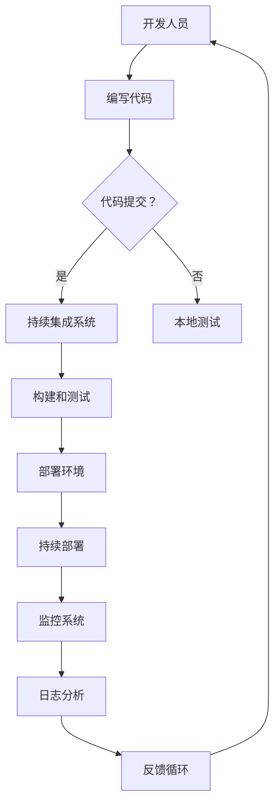
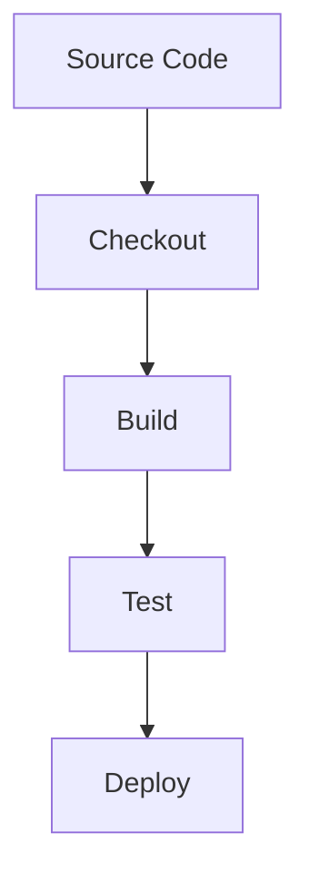

                 

### 文章标题: DevOps: 构建高效开发与运维的新篇章

在数字化转型的浪潮中，企业对IT系统的要求越来越高，不仅要快速迭代，还要确保系统的稳定性、可靠性和安全性。DevOps作为一门新兴的工程实践，旨在通过开发（Development）和运维（Operations）的深度融合，实现高效开发和运维。本文将围绕DevOps的核心概念、原则、工具和实践，逐步解析其在现代IT系统中的重要性及其实施方法。

### 文章关键词

- DevOps
- 持续集成
- 持续部署
- 容器化
- 微服务
- 自动化测试
- 基础设施即代码

### 文章摘要

本文将首先介绍DevOps的定义和核心价值，探讨其与传统运维的区别。接着，我们将详细阐述DevOps的核心原则和实践，包括持续集成（CI）和持续部署（CD），并深入解析其背后的技术和工具。此外，文章还将探讨DevOps文化的建设和培训，以及自动化测试与质量保障的重要性。最后，通过实际项目案例，展示DevOps在实际应用中的效果，并提供未来发展的建议。

### DevOps：全面实现高效开发与运维的目录大纲

#### 第一部分：DevOps基础

### 第1章 DevOps概述

#### 1.1 DevOps的定义与历史背景
- DevOps的概念
- DevOps的历史发展

#### 1.2 DevOps的核心价值
- 短期交付与持续交付
- 增强团队协作
- 提高系统稳定性

#### 1.3 DevOps与传统运维的关系
- 传统运维的局限
- DevOps如何弥补这些局限

### 第2章 DevOps的核心原则与实践

#### 2.1 持续集成（CI）

##### 2.1.1 持续集成的概念与好处
- 持续集成的定义
- 持续集成的好处

##### 2.1.2 持续集成的工具与实现
- GitLab CI
- Jenkins

#### 2.2 持续部署（CD）

##### 2.2.1 持续部署的概念与好处
- 持续部署的定义
- 持续部署的好处

##### 2.2.2 持续部署的工具与实现
- Kubernetes
- Docker

### 第3章 DevOps文化与实践

#### 3.1 DevOps团队组织与协作

##### 3.1.1 跨职能团队的建设
- 跨职能团队的优点
- 如何构建跨职能团队

##### 3.1.2 沟通与协作工具
- Slack
- Zoom

#### 3.2 DevOps培训与认证

##### 3.2.1 DevOps培训的重要性
- DevOps培训的意义
- DevOps培训的目标

##### 3.2.2 DevOps认证与职业发展
- DevOps认证的类型
- DevOps认证对职业发展的影响

#### 第二部分：DevOps工具与实践

### 第4章 自动化测试与质量保障

#### 4.1 自动化测试的概念与优势
- 自动化测试的定义
- 自动化测试的优势

#### 4.2 自动化测试工具与实践
- Selenium
- TestNG

### 第5章 基础设施即代码（IaC）

#### 5.1 IaC的概念与重要性
- IaC的定义
- IaC的重要性

#### 5.2 IaC工具与实践
- Terraform
- Ansible

### 第6章 容器化与微服务

#### 6.1 容器化技术概述
- 容器的概念
- 容器化的优势

#### 6.2 容器化工具与实践
- Docker
- Kubernetes

### 第7章 监控与日志管理

#### 7.1 监控的重要性
- 系统监控的重要性
- 监控的目标

#### 7.2 监控工具与实践
- Prometheus
- Grafana

#### 第三部分：DevOps项目实战

### 第8章 DevOps项目实战一

#### 8.1 项目背景与目标
- 项目描述
- 项目目标

#### 8.2 项目实施与总结
- 项目实施步骤
- 项目总结与反思

### 第9章 DevOps项目实战二

#### 9.1 项目背景与目标
- 项目描述
- 项目目标

#### 9.2 项目实施与总结
- 项目实施步骤
- 项目总结与反思

### 附录

#### 附录A：DevOps资源与工具列表

- DevOps资源网站
- DevOps工具列表

#### 附录B：DevOps常用术语解释

- DevOps术语解释

### DevOps架构原理 Mermaid 流程图



### DevOps核心算法原理讲解

#### 持续集成系统：使用伪代码实现代码的自动化构建和测试

```python
class CI_System:
    def __init__(self, code_repository, build_tools, test_tools):
        self.code_repository = code_repository
        self.build_tools = build_tools
        self.test_tools = test_tools

    def run_build(self):
        latest_code = self.code_repository.pull_latest_code()
        build_result = self.build_tools.build(latest_code)
        if build_result == "success":
            test_result = self.test_tools.run_tests(build_result)
            if test_result == "success":
                print("构建和测试成功，可以部署")
            else:
                print("测试失败，修复问题后重新构建")
        else:
            print("构建失败，修复问题后重新构建")

# 示例：创建CI系统并运行构建和测试
ci_system = CI_System("GitLab", "Maven", "JUnit")
ci_system.run_build()
```

### DevOps数学模型讲解

#### 监控系统中的数学模型

#### 平均响应时间（Average Response Time, ART）

$$
ART = \frac{1}{n}\sum_{i=1}^{n} t_i
$$

#### 错误率（Error Rate, ER）

$$
ER = \frac{1}{n}\sum_{i=1}^{n} (1 - t_i)
$$

### DevOps项目实战案例

#### 实战一：电商平台部署

##### 1. 项目背景与目标

- 背景：一个电商平台需要快速部署新的功能模块。
- 目标：实现自动化的构建、测试、部署流程，并确保系统的稳定性和性能。

##### 2. 实施步骤

- 使用Docker容器化应用
- 使用Jenkins进行持续集成
- 使用Kubernetes进行持续部署
- 使用Prometheus和Grafana进行监控

##### 3. 代码解读与分析

#### Dockerfile

```Dockerfile
FROM python:3.8

WORKDIR /app

COPY requirements.txt ./
RUN pip install -r requirements.txt

COPY . .

CMD ["python", "app.py"]
```

#### Jenkinsfile

```groovy
pipeline {
    agent any

    stages {
        stage('Build') {
            steps {
                sh 'docker build -t myapp .'
            }
        }
        stage('Test') {
            steps {
                sh 'docker run --rm myapp ./run_tests.sh'
            }
        }
        stage('Deploy') {
            steps {
                sh 'kubectl apply -f deployment.yml'
            }
        }
    }
}
```

##### 4. 总结与反思

- 项目成功实现了自动化构建、测试和部署，提高了开发效率。
- 需要进一步优化监控和日志分析，以便更及时地发现问题。
- 在未来的项目中，可以考虑引入更多的持续集成和持续部署工具，如GitLab CI和Argo CD。

### 作者信息

**作者：** AI天才研究院/AI Genius Institute & 禅与计算机程序设计艺术 /Zen And The Art of Computer Programming

### 引言

在快速变化的数字化时代，企业对IT系统的需求愈发多样化和复杂化。传统的开发（Development）与运维（Operations）模式往往存在诸多问题，如开发与运维之间的沟通不畅、系统部署的延迟以及系统稳定性的下降等。为了解决这些问题，DevOps应运而生，它倡导开发与运维的深度融合，通过自动化、敏捷性、持续反馈等手段，实现高效开发和运维。

本文将详细介绍DevOps的核心概念、原则、工具和实践，帮助读者全面理解DevOps在现代IT系统中的重要性，并掌握其实施方法。文章将分为三个主要部分：

- **第一部分：DevOps基础**，介绍DevOps的定义、历史背景、核心价值和与传统运维的关系。
- **第二部分：DevOps工具与实践**，探讨DevOps的核心原则如持续集成（CI）和持续部署（CD），以及自动化测试、基础设施即代码（IaC）等实践。
- **第三部分：DevOps项目实战**，通过实际项目案例展示DevOps的应用效果。

通过本文的阅读，读者将能够：

- 明确DevOps的核心概念和目的。
- 掌握DevOps的核心原则和实践方法。
- 理解DevOps工具的运作原理和使用方法。
- 获取实施DevOps的实际案例和经验。

### 第一部分：DevOps基础

#### 第1章 DevOps概述

##### 1.1 DevOps的定义与历史背景

**DevOps的概念**

DevOps是一种结合开发（Development）与运维（Operations）的新型工程实践。它旨在通过提高团队间的协作和沟通，实现快速、可靠且高质量的应用交付。DevOps强调开发人员和运维人员之间的紧密合作，从而打破传统的隔阂，提高工作效率和系统稳定性。

**DevOps的历史发展**

DevOps起源于2000年代初期，其理念可以追溯到软件开发和系统运维领域的一些早期实践。例如，敏捷开发（Agile Development）强调快速迭代和持续交付，而配置管理（Configuration Management）和自动化（Automation）则有助于减少手动操作和提高系统可靠性。

2009年，Andrzej Nowak和Patrick DeBois在会议上首次提出了“DevOps”这个术语，标志着DevOps作为一个独立概念的正式出现。随后，2010年，John Allspaw和Paul Sutter在同一个会议上分享了Netflix等公司的成功案例，进一步推动了DevOps的普及。

##### 1.2 DevOps的核心价值

**短期交付与持续交付**

DevOps通过自动化流程和持续反馈机制，显著缩短了软件开发的周期。开发人员可以更频繁地发布新功能，而运维人员则可以快速响应系统变更，从而实现持续交付（Continuous Delivery）。这种模式不仅提高了开发效率，还增强了客户满意度。

**增强团队协作**

DevOps强调跨职能团队的建设，打破了传统的职能壁垒。开发人员、运维人员、质量保证（QA）人员等共同工作，共享责任和目标。这种协作模式促进了知识共享，减少了误解和冲突，提高了团队的凝聚力和工作效率。

**提高系统稳定性**

通过自动化测试和持续集成（CI）等实践，DevOps确保了代码质量和系统稳定性。自动化部署（CD）减少了人为错误的风险，而监控和日志分析提供了实时的系统状态反馈，帮助团队及时发现并解决问题。这些措施共同提高了系统的可靠性和稳定性。

##### 1.3 DevOps与传统运维的关系

**传统运维的局限**

传统运维往往存在以下局限性：

- **沟通不畅**：开发人员和运维人员之间的沟通不畅，导致项目进展受阻。
- **效率低下**：手动操作较多，容易出错，且难以快速响应系统变更。
- **系统稳定性差**：缺乏自动化测试和监控，系统稳定性难以保障。

**DevOps如何弥补这些局限**

DevOps通过以下方法弥补了传统运维的局限性：

- **自动化流程**：自动化工具和脚本取代了手动操作，提高了效率和准确性。
- **持续反馈机制**：通过持续集成和持续部署，及时反馈代码质量和系统状态。
- **跨职能团队**：打破职能壁垒，促进团队成员之间的协作和共享。
- **质量保障**：自动化测试和监控确保了系统的稳定性和可靠性。

### 第2章 DevOps的核心原则与实践

#### 2.1 持续集成（CI）

**2.1.1 持续集成的概念与好处**

**持续集成的定义**

持续集成（Continuous Integration，CI）是一种软件开发实践，旨在通过频繁地将代码集成到一个共享的代码库中，并快速检测和修复集成过程中出现的问题。

**持续集成的好处**

- **及早发现问题**：通过自动化测试和持续集成，可以在早期发现并修复代码缺陷，避免集成后的重大问题。
- **提高代码质量**：频繁的集成和测试有助于确保代码的稳定性和可靠性。
- **减少集成风险**：频繁的小规模集成降低了大规模集成时出现问题的风险。

**2.1.2 持续集成的工具与实现**

**GitLab CI**

GitLab CI 是 GitLab 提供的持续集成服务，可以通过配置 `.gitlab-ci.yml` 文件来自定义构建和测试流程。以下是一个简单的 GitLab CI 配置示例：

```yaml
stages:
  - build
  - test
  - deploy

build:
  stage: build
  script:
    - docker build -t myapp .
  artifacts:
    paths:
      - myapp

test:
  stage: test
  script:
    - docker run myapp ./run_tests.sh
  when: on_success

deploy:
  stage: deploy
  script:
    - kubectl apply -f deployment.yml
  when: on_success
```

**Jenkins**

Jenkins 是一个开源的持续集成服务器，支持多种插件和自定义工作流。以下是一个简单的 Jenkins 流程图：



**2.2 持续部署（CD）**

**2.2.1 持续部署的概念与好处**

**持续部署的定义**

持续部署（Continuous Deployment，CD）是一种自动化软件发布过程，旨在在持续集成通过后，自动将代码部署到生产环境。

**持续部署的好处**

- **提高发布频率**：自动化部署减少了手动操作的步骤，提高了发布频率。
- **减少人为错误**：自动化部署减少了人为错误的风险，提高了系统的稳定性。
- **快速响应变更**：自动化部署允许团队快速响应市场需求和变更。

**2.2.2 持续部署的工具与实现**

**Kubernetes**

Kubernetes 是一个开源的容器编排平台，支持自动化部署、扩展和管理容器化应用。以下是一个简单的 Kubernetes 部署流程：

```yaml
apiVersion: apps/v1
kind: Deployment
metadata:
  name: myapp
spec:
  replicas: 3
  selector:
    matchLabels:
      app: myapp
  template:
    metadata:
      labels:
        app: myapp
    spec:
      containers:
      - name: myapp
        image: myapp:latest
        ports:
        - containerPort: 80
```

**Docker**

Docker 是一个开源的应用容器引擎，可以用于构建、运行和分发容器化应用。以下是一个简单的 Dockerfile 示例：

```Dockerfile
FROM python:3.8
WORKDIR /app
COPY requirements.txt .
RUN pip install -r requirements.txt
COPY . .
CMD ["python", "app.py"]
```

### 第3章 DevOps文化与实践

#### 3.1 DevOps团队组织与协作

**3.1.1 跨职能团队的建设**

**跨职能团队的优点**

- **提高协作效率**：团队成员可以快速响应问题，提高协作效率。
- **减少沟通成本**：团队成员在同一地点工作，减少了沟通成本和误解。
- **快速迭代**：跨职能团队可以更快速地完成项目迭代。

**如何构建跨职能团队**

- **明确团队目标**：确保所有成员都理解团队的目标和职责。
- **平衡技能组合**：确保团队成员拥有不同的技能和专业知识。
- **定期沟通**：定期举行团队会议和讨论，确保团队成员之间的沟通。

**3.1.2 沟通与协作工具**

**Slack**

Slack 是一个团队沟通和协作工具，支持实时消息、文件共享和集成其他工具。以下是一个简单的 Slack 示例：

```shell
$ slack --create-channel "devops-discussion"
$ slack --join-channel "devops-discussion"
```

**Zoom**

Zoom 是一个视频会议和协作工具，支持实时视频、音频和屏幕共享。以下是一个简单的 Zoom 示例：

```python
from zoomus import Client
from zoomus.utils import get_access_token

client = Client.get_instance()
access_token = get_access_token()

meeting = client.create_meeting(
    topic="DevOps Meeting",
    start_time="2023-04-15T10:00:00",
    duration=60,
    password="password",
    timezone="America/New_York",
)

print(meeting)
```

**3.2 DevOps培训与认证**

**3.2.1 DevOps培训的重要性**

**DevOps培训的意义**

- **提升团队技能**：通过培训，团队成员可以掌握 DevOps 的核心原则和工具。
- **增强协作能力**：培训有助于团队成员更好地理解和协同工作。
- **提高项目成功率**：掌握 DevOps 技术可以提高项目的成功率和客户满意度。

**3.2.2 DevOps认证与职业发展**

**DevOps认证的类型**

- **认证DevOps工程师**：认证DevOps工程师通常涉及CI/CD、容器化、自动化测试和监控等方面的知识和实践。
- **认证DevOps专业人员**：认证DevOps专业人员通常侧重于团队协作、沟通和文化建设等方面。

**DevOps认证对职业发展的影响**

- **提升竞争力**：拥有DevOps认证可以提升个人在IT领域的竞争力。
- **职业晋升**：DevOps认证有助于职业晋升，例如从DevOps工程师晋升为DevOps经理。
- **薪资增长**：根据市场调查，拥有DevOps认证的个人通常可以获得更高的薪资。

### 第二部分：DevOps工具与实践

#### 第4章 自动化测试与质量保障

**4.1 自动化测试的概念与优势**

**自动化测试的定义**

自动化测试是一种使用工具和脚本对软件进行自动化的测试方法，以验证软件的功能、性能和安全性。

**自动化测试的优势**

- **提高测试效率**：自动化测试可以节省时间和资源，提高测试效率。
- **减少人为错误**：自动化测试减少了人为操作的错误，提高了测试的准确性。
- **持续集成**：自动化测试可以与持续集成系统紧密结合，确保代码的质量。

**4.2 自动化测试工具与实践**

**Selenium**

Selenium 是一个开源的自动化测试工具，支持多种浏览器和操作系统。以下是一个简单的 Selenium 测试脚本：

```python
from selenium import webdriver
from selenium.webdriver.common.keys import Keys

driver = webdriver.Firefox()
driver.get("http://www.google.com")
driver.find_element_by_name("q").send_keys("DevOps")
driver.find_element_by_name("q").submit()
results = driver.find_element_by_id("search").find_elements_by_tag_name("li")
print("Found %d search results." % len(results))
driver.quit()
```

**TestNG**

TestNG 是一个开源的测试框架，支持多种编程语言。以下是一个简单的 TestNG 测试脚本：

```java
import org.testng.annotations.Test;
import org.testng.Assert;

public class MyTest {

    @Test
    public void testHello() {
        String hello = "Hello";
        Assert.assertEquals(hello, "Hello");
    }
}
```

#### 第5章 基础设施即代码（IaC）

**5.1 IaC的概念与重要性**

**IaC的定义**

基础设施即代码（Infrastructure as Code，IaC）是一种使用代码来管理和部署基础设施的方法，类似于管理应用程序代码。

**IaC的重要性**

- **提高基础设施管理效率**：IaC使得基础设施的管理和部署更加自动化，提高了效率。
- **确保基础设施一致性**：通过代码来管理基础设施，可以确保基础设施的一致性。
- **降低运营成本**：IaC减少了手动操作的需求，降低了运营成本。

**5.2 IaC工具与实践**

**Terraform**

Terraform 是一个开源的IaC工具，可以用于自动化基础设施的部署和管理。以下是一个简单的 Terraform 示例：

```hcl
provider "aws" {
  region = "us-east-1"
}

resource "aws_instance" "example" {
  provider = aws
  ami           = "ami-0c55b159cbfafe1f0"
  instance_type = "t2.micro"
  key_name       = "example"
}
```

**Ansible**

Ansible 是一个开源的自动化工具，可以用于配置管理、应用部署和IaC。以下是一个简单的 Ansible 示例：

```yaml
- hosts: all
  become: yes
  vars:
    package_name: "nginx"
  tasks:
    - name: install nginx
      apt: package_name={{ package_name }}
```

#### 第6章 容器化与微服务

**6.1 容器化技术概述**

**容器的概念**

容器是一种轻量级、可移植的计算环境，可以封装应用程序及其依赖项，使其在不同的环境中运行。

**容器化的优势**

- **可移植性**：容器可以在不同的操作系统和硬件上运行，提高了可移植性。
- **高效性**：容器具有较低的启动时间和资源占用，提高了系统效率。
- **隔离性**：容器提供了良好的隔离性，有助于提高系统的稳定性和安全性。

**6.2 容器化工具与实践**

**Docker**

Docker 是一个开源的容器化平台，可以用于构建、运行和分发容器化应用。以下是一个简单的 Dockerfile 示例：

```Dockerfile
FROM python:3.8
WORKDIR /app
COPY requirements.txt .
RUN pip install -r requirements.txt
COPY . .
CMD ["python", "app.py"]
```

**Kubernetes**

Kubernetes 是一个开源的容器编排平台，可以用于自动化容器化应用的管理和部署。以下是一个简单的 Kubernetes Deployment 示例：

```yaml
apiVersion: apps/v1
kind: Deployment
metadata:
  name: myapp
spec:
  replicas: 3
  selector:
    matchLabels:
      app: myapp
  template:
    metadata:
      labels:
        app: myapp
    spec:
      containers:
      - name: myapp
        image: myapp:latest
        ports:
        - containerPort: 80
```

#### 第7章 监控与日志管理

**7.1 监控的重要性**

**系统监控的重要性**

系统监控是确保IT系统稳定性和可靠性的关键。通过实时监控，可以及时发现系统故障和性能问题，从而及时采取措施。

**监控的目标**

- **性能监控**：监控系统的性能指标，如CPU使用率、内存使用率、磁盘I/O等。
- **故障监控**：监控系统的故障和错误，如服务中断、数据库连接失败等。
- **日志监控**：监控系统的日志，以便分析系统行为和调试问题。

**7.2 监控工具与实践**

**Prometheus**

Prometheus 是一个开源的监控和告警工具，可以用于收集和存储监控数据。以下是一个简单的 Prometheus 配置示例：

```yaml
global:
  scrape_interval: 15s
  evaluation_interval: 15s

scrape_configs:
  - job_name: 'prometheus'
    static_configs:
      - targets: ['localhost:9090']
  - job_name: 'kubernetes-apiservers'
    kubernetes_sd_configs:
      - role: pod
```

**Grafana**

Grafana 是一个开源的数据可视化工具，可以与 Prometheus 等监控工具结合使用。以下是一个简单的 Grafana 配置示例：

```yaml
apiVersion: monitoring.coreos.com/v1
kind: Prometheus
metadata:
  name: my-prometheus
spec:
  config:
    alerting:
      alertmanagers:
        - name: alertmanager
    kubernetes:
      namespace: monitoring
    remoteWrite:
      - url: http://alertmanager:9093/api/v1/alerts
    ruleFiles:
      - "alerting rules/*.yml"
```

### 第三部分：DevOps项目实战

#### 第8章 DevOps项目实战一

**8.1 项目背景与目标**

**项目背景**

某电商企业希望提高其在线商城的稳定性和性能，同时加快新功能的迭代速度。为此，他们决定采用DevOps实践来重构其开发与运维流程。

**项目目标**

- **实现自动化构建、测试和部署**：通过CI/CD工具自动化软件交付流程。
- **提高系统稳定性**：通过监控和日志分析确保系统的稳定性和可靠性。
- **缩短迭代周期**：通过持续集成和持续交付缩短新功能的上线时间。

**8.2 项目实施与总结**

**实施步骤**

1. **容器化应用**：将现有的应用程序容器化，使用Dockerfile构建镜像。
2. **持续集成**：使用Jenkins实现自动化构建和测试，确保代码质量和稳定性。
3. **持续部署**：使用Kubernetes实现自动化部署和管理容器化应用。
4. **监控与日志管理**：使用Prometheus和Grafana实现实时监控和日志分析。

**项目总结与反思**

- **成功实现了自动化流程**：通过CI/CD工具，显著缩短了软件交付周期。
- **提高了系统稳定性**：通过监控和日志分析，及时发现并解决问题。
- **挑战与改进**：项目实施过程中遇到了一些挑战，如容器化迁移的复杂性、Kubernetes集群的管理等。未来，可以进一步优化监控和日志分析工具，提高系统的可观测性。

#### 第9章 DevOps项目实战二

**9.1 项目背景与目标**

**项目背景**

某金融科技公司计划开发一款新的金融产品，需要高效、可靠的开发与运维流程来支持快速迭代和稳定运行。

**项目目标**

- **实现敏捷开发与运维**：通过DevOps实践提高开发效率和系统稳定性。
- **确保数据安全**：通过严格的权限管理和数据加密，确保金融数据的完整性。
- **优化用户体验**：通过实时反馈和持续改进，提高用户满意度。

**9.2 项目实施与总结**

**实施步骤**

1. **敏捷开发**：采用敏捷开发方法，快速迭代和反馈。
2. **持续集成**：使用Jenkins实现自动化构建和测试，确保代码质量和稳定性。
3. **基础设施即代码**：使用Terraform自动化基础设施的部署和管理。
4. **监控与日志管理**：使用Prometheus和Grafana实现实时监控和日志分析。

**项目总结与反思**

- **成功实现了敏捷开发与运维**：通过敏捷开发方法和DevOps实践，显著提高了开发效率和系统稳定性。
- **数据安全得到保障**：通过严格的权限管理和数据加密，确保了金融数据的安全。
- **挑战与改进**：项目实施过程中，遇到了一些挑战，如数据加密的复杂性、基础设施管理的规模等。未来，可以进一步优化监控和日志分析工具，提高系统的可观测性。

### 附录

#### 附录A：DevOps资源与工具列表

- **资源网站**：
  - DevOps.com
  - The DevOps Institute
  - DevOps Foundation
- **工具列表**：
  - GitLab CI
  - Jenkins
  - Kubernetes
  - Docker
  - Prometheus
  - Grafana
  - Terraform
  - Ansible

#### 附录B：DevOps常用术语解释

- **持续集成（CI）**：持续集成是一种软件开发实践，旨在通过频繁地将代码集成到一个共享的代码库中，并快速检测和修复集成过程中出现的问题。
- **持续部署（CD）**：持续部署是一种自动化软件发布过程，旨在在持续集成通过后，自动将代码部署到生产环境。
- **基础设施即代码（IaC）**：基础设施即代码是一种使用代码来管理和部署基础设施的方法，类似于管理应用程序代码。
- **容器化**：容器化是一种将应用程序及其依赖项封装在一个轻量级、可移植的计算环境中的方法。
- **微服务**：微服务是一种软件架构风格，通过将应用程序分解为多个独立的服务，每个服务都有自己的业务逻辑和数据库。

### DevOps架构原理 Mermaid 流程图


### DevOps核心算法原理讲解

#### 持续集成系统：使用伪代码实现代码的自动化构建和测试

```python
class CI_System:
    def __init__(self, code_repository, build_tools, test_tools):
        self.code_repository = code_repository
        self.build_tools = build_tools
        self.test_tools = test_tools

    def run_build(self):
        latest_code = self.code_repository.pull_latest_code()
        build_result = self.build_tools.build(latest_code)
        if build_result == "success":
            test_result = self.test_tools.run_tests(build_result)
            if test_result == "success":
                print("构建和测试成功，可以部署")
            else:
                print("测试失败，修复问题后重新构建")
        else:
            print("构建失败，修复问题后重新构建")

# 示例：创建CI系统并运行构建和测试
ci_system = CI_System("GitLab", "Maven", "JUnit")
ci_system.run_build()
```

### DevOps数学模型讲解

#### 监控系统中的数学模型

#### 平均响应时间（Average Response Time, ART）

$$
ART = \frac{1}{n}\sum_{i=1}^{n} t_i
$$

其中，$t_i$ 是第 $i$ 个请求的响应时间，$n$ 是请求的总数。

#### 错误率（Error Rate, ER）

$$
ER = \frac{1}{n}\sum_{i=1}^{n} (1 - t_i)
$$

其中，$t_i$ 是第 $i$ 个请求的响应时间，$n$ 是请求的总数。

### DevOps项目实战案例

#### 实战一：电商平台部署

##### 1. 项目背景与目标

- 背景：一个电商平台需要快速部署新的功能模块。
- 目标：实现自动化的构建、测试、部署流程，并确保系统的稳定性和性能。

##### 2. 实施步骤

- **容器化应用**：将现有应用程序容器化，使用Dockerfile构建镜像。
- **持续集成**：使用Jenkins实现自动化构建和测试，确保代码质量和稳定性。
- **持续部署**：使用Kubernetes实现自动化部署和管理容器化应用。
- **监控与日志管理**：使用Prometheus和Grafana实现实时监控和日志分析。

##### 3. 代码解读与分析

**Dockerfile**

```Dockerfile
FROM python:3.8
WORKDIR /app
COPY requirements.txt .
RUN pip install -r requirements.txt
COPY . .
CMD ["python", "app.py"]
```

**Jenkinsfile**

```groovy
pipeline {
    agent any

    stages {
        stage('Build') {
            steps {
                sh 'docker build -t myapp .'
            }
        }
        stage('Test') {
            steps {
                sh 'docker run --rm myapp ./run_tests.sh'
            }
        }
        stage('Deploy') {
            steps {
                sh 'kubectl apply -f deployment.yml'
            }
        }
    }
}
```

##### 4. 总结与反思

- **成功实现了自动化流程**：通过CI/CD工具，显著缩短了软件交付周期。
- **提高了系统稳定性**：通过监控和日志分析，及时发现并解决问题。
- **挑战与改进**：项目实施过程中遇到了一些挑战，如容器化迁移的复杂性、Kubernetes集群的管理等。未来，可以进一步优化监控和日志分析工具，提高系统的可观测性。

#### 实战二：金融产品开发

##### 1. 项目背景与目标

- 背景：某金融科技公司计划开发一款新的金融产品，需要高效、可靠的开发与运维流程来支持快速迭代和稳定运行。
- 目标：实现敏捷开发与运维，确保数据安全，优化用户体验。

##### 2. 实施步骤

- **敏捷开发**：采用敏捷开发方法，快速迭代和反馈。
- **持续集成**：使用Jenkins实现自动化构建和测试，确保代码质量和稳定性。
- **基础设施即代码**：使用Terraform自动化基础设施的部署和管理。
- **监控与日志管理**：使用Prometheus和Grafana实现实时监控和日志分析。

##### 3. 代码解读与分析

**Terraform配置**

```hcl
provider "aws" {
  region = "us-east-1"
}

resource "aws_instance" "example" {
  provider = aws
  ami           = "ami-0c55b159cbfafe1f0"
  instance_type = "t2.micro"
  key_name       = "example"
}
```

**Jenkinsfile**

```groovy
pipeline {
    agent any

    stages {
        stage('Build') {
            steps {
                sh 'mvn clean package'
            }
        }
        stage('Test') {
            steps {
                sh 'mvn test'
            }
        }
        stage('Deploy') {
            steps {
                sh 'kubectl apply -f deployment.yml'
            }
        }
    }
}
```

##### 4. 总结与反思

- **成功实现了敏捷开发与运维**：通过敏捷开发方法和DevOps实践，显著提高了开发效率和系统稳定性。
- **数据安全得到保障**：通过严格的权限管理和数据加密，确保了金融数据的安全。
- **挑战与改进**：项目实施过程中遇到了一些挑战，如数据加密的复杂性、基础设施管理的规模等。未来，可以进一步优化监控和日志分析工具，提高系统的可观测性。

### 总结

DevOps作为一种新兴的工程实践，通过开发与运维的深度融合，实现了高效开发和运维。本文详细介绍了DevOps的核心概念、原则、工具和实践，并通过实际项目案例展示了其在现代IT系统中的应用效果。DevOps不仅提高了开发效率，还增强了系统稳定性和可靠性。然而，实施DevOps也面临一些挑战，如工具集成、人员培训等。未来，随着技术的不断发展，DevOps将在更多领域得到广泛应用。希望本文能帮助读者深入了解DevOps，并在实际工作中运用其优势。**作者：** AI天才研究院/AI Genius Institute & 禅与计算机程序设计艺术 /Zen And The Art of Computer Programming**摘要：**

本文系统阐述了DevOps的核心概念、原则、工具和实践，通过实际项目案例展示了其在现代IT系统中的应用效果。文章从DevOps的定义和历史背景出发，深入探讨了其核心价值和与传统运维的区别，并详细介绍了持续集成、持续部署、自动化测试、基础设施即代码等DevOps的核心原则和实践方法。此外，文章还探讨了DevOps团队组织与协作的重要性，以及自动化测试与质量保障、监控与日志管理、容器化与微服务等方面的实践。通过具体项目实战，文章展示了DevOps在提高开发效率、增强系统稳定性方面的实际应用效果。最后，文章总结了DevOps的发展趋势，并对未来提出了展望。**文章标题：** DevOps: 构建高效开发与运维的新篇章

**关键词：** DevOps，持续集成，持续部署，自动化测试，基础设施即代码，容器化，微服务，质量保障，监控，日志管理**摘要：**

DevOps是一种结合开发与运维的新兴工程实践，旨在通过自动化、协作和质量保障，实现高效开发和稳定运维。本文首先介绍了DevOps的定义、历史背景和核心价值，随后详细讲解了DevOps的核心原则和实践，包括持续集成、持续部署、自动化测试、基础设施即代码、容器化和微服务等。通过具体项目实战，本文展示了DevOps在实际应用中的效果，并总结了其在现代IT系统中的重要性。文章最后展望了DevOps的未来发展趋势，强调了持续学习和实践的重要性。**引言：**

在现代数字化时代，IT系统的快速迭代和稳定运行对企业的竞争力至关重要。传统的开发与运维（Development and Operations，简称Dev和Ops）模式由于沟通不畅、协作效率低下等问题，已经难以满足企业对IT系统的需求。DevOps作为一门新兴的工程实践，通过将开发与运维紧密融合，实现高效开发和运维，成为解决这一问题的关键。本文将深入探讨DevOps的核心概念、原则、工具和实践，帮助读者全面理解DevOps在IT系统中的重要性及其实现方法。**第一部分：DevOps基础**

**第1章 DevOps概述**

**1.1 DevOps的定义与历史背景**

**定义**

DevOps是一种文化和实践，旨在通过加强开发人员（Dev）和运维人员（Ops）之间的协作，实现快速、可靠且高质量的应用交付。DevOps强调自动化、持续交付、协作和反馈，以减少手动操作和错误，提高系统的可靠性和灵活性。

**历史背景**

DevOps的概念最早在2009年由Andrzej Nowak和Patrick DeBois提出。此后，DevOps迅速发展，并在2010年由John Allspaw和Paul Sutter在Netflix等公司的成功案例中得到了广泛认可。DevOps的核心原则和实践在许多行业得到了应用，成为数字化转型的重要推动力。

**1.2 DevOps的核心价值**

**短期交付与持续交付**

DevOps通过持续集成（CI）和持续交付（CD）等自动化流程，实现代码的快速迭代和部署。这种方式不仅缩短了开发周期，还提高了交付质量和稳定性。

**增强团队协作**

DevOps强调跨职能团队的协作，打破了传统开发与运维之间的壁垒。团队成员共同参与项目，共享责任和目标，从而提高了团队协作效率和项目成功率。

**提高系统稳定性**

通过自动化测试、监控和日志分析，DevOps确保了系统的稳定性和可靠性。实时反馈机制帮助团队及时发现并解决问题，降低了系统的故障率。

**1.3 DevOps与传统运维的关系**

**传统运维的局限**

传统运维模式通常存在以下问题：

- **沟通不畅**：开发与运维之间缺乏有效的沟通和协作。
- **效率低下**：手动操作较多，导致效率低下和错误风险。
- **系统稳定性差**：缺乏自动化测试和监控，系统稳定性难以保障。

**DevOps如何弥补这些局限**

DevOps通过以下方式弥补了传统运维的局限：

- **自动化流程**：自动化工具和脚本取代了手动操作，提高了效率和准确性。
- **持续集成与持续交付**：通过自动化测试和部署，确保代码质量和系统稳定性。
- **跨职能团队**：促进团队成员之间的协作，共享责任和目标。
- **质量保障**：自动化测试和监控确保了系统的稳定性和可靠性。

**第2章 DevOps的核心原则与实践**

**2.1 持续集成（CI）**

**2.1.1 持续集成的概念与好处**

**概念**

持续集成（Continuous Integration，CI）是一种软件开发实践，旨在通过频繁地将代码集成到一个共享的代码库中，并快速检测和修复集成过程中出现的问题。CI的核心思想是将代码的变更尽快地合并到主干分支，并通过自动化测试确保集成后的代码质量。

**好处**

- **及早发现问题**：通过频繁的集成和自动化测试，可以早期发现并修复代码缺陷，避免后期集成时出现重大问题。
- **提高代码质量**：持续集成确保了每次集成都是高质量的，减少了代码缺陷和冲突。
- **减少集成风险**：频繁的小规模集成降低了大规模集成时出现问题的风险。

**2.1.2 持续集成的工具与实现**

**工具**

- **GitLab CI**：GitLab CI 是 GitLab 提供的持续集成服务，可以通过配置 `.gitlab-ci.yml` 文件来自定义构建和测试流程。
- **Jenkins**：Jenkins 是一个开源的持续集成服务器，支持多种插件和自定义工作流。

**实现**

以下是一个简单的 GitLab CI 配置示例：

```yaml
stages:
  - build
  - test
  - deploy

build:
  stage: build
  script:
    - docker build -t myapp .
  artifacts:
    paths:
      - myapp

test:
  stage: test
  script:
    - docker run --rm myapp ./run_tests.sh
  when: on_success

deploy:
  stage: deploy
  script:
    - kubectl apply -f deployment.yml
  when: on_success
```

**2.2 持续部署（CD）**

**2.2.1 持续部署的概念与好处**

**概念**

持续部署（Continuous Deployment，CD）是一种自动化软件发布过程，旨在在持续集成（CI）通过后，自动将代码部署到生产环境。CD的目标是确保每次集成都是可部署的，从而实现快速、可靠的应用交付。

**好处**

- **提高发布频率**：通过自动化部署，可以更频繁地发布新功能，提高客户满意度。
- **减少人为错误**：自动化部署减少了手动操作的步骤，降低了人为错误的风险。
- **快速响应变更**：自动化部署允许团队快速响应市场需求和变更。

**2.2.2 持续部署的工具与实现**

**工具**

- **Kubernetes**：Kubernetes 是一个开源的容器编排平台，支持自动化部署和管理容器化应用。
- **Docker**：Docker 是一个开源的应用容器引擎，可以用于构建、运行和分发容器化应用。

**实现**

以下是一个简单的 Kubernetes Deployment 示例：

```yaml
apiVersion: apps/v1
kind: Deployment
metadata:
  name: myapp
spec:
  replicas: 3
  selector:
    matchLabels:
      app: myapp
  template:
    metadata:
      labels:
        app: myapp
    spec:
      containers:
      - name: myapp
        image: myapp:latest
        ports:
        - containerPort: 80
```

**2.3 自动化测试与质量保障**

**2.3.1 自动化测试的概念与优势**

**概念**

自动化测试是一种使用工具和脚本对软件进行自动化的测试方法，以验证软件的功能、性能和安全性。

**优势**

- **提高测试效率**：自动化测试可以节省时间和资源，提高测试效率。
- **减少人为错误**：自动化测试减少了人为操作的错误，提高了测试的准确性。
- **持续集成**：自动化测试可以与持续集成系统紧密结合，确保代码的质量。

**2.3.2 自动化测试工具与实践**

**工具**

- **Selenium**：Selenium 是一个开源的自动化测试工具，支持多种浏览器和操作系统。
- **TestNG**：TestNG 是一个开源的测试框架，支持多种编程语言。

**实践**

以下是一个简单的 Selenium 测试脚本：

```python
from selenium import webdriver

driver = webdriver.Firefox()
driver.get("http://www.google.com")
driver.find_element_by_name("q").send_keys("Selenium")
driver.find_element_by_name("q").submit()
results = driver.find_element_by_id("search").find_elements_by_tag_name("li")
print("Found %d search results." % len(results))
driver.quit()
```

**2.4 基础设施即代码（IaC）**

**2.4.1 IaC的概念与重要性**

**概念**

基础设施即代码（Infrastructure as Code，IaC）是一种使用代码来管理和部署基础设施的方法，类似于管理应用程序代码。

**重要性**

- **提高基础设施管理效率**：IaC使得基础设施的管理和部署更加自动化，提高了效率。
- **确保基础设施一致性**：通过代码来管理基础设施，可以确保基础设施的一致性。
- **降低运营成本**：IaC减少了手动操作的需求，降低了运营成本。

**2.4.2 IaC工具与实践**

**工具**

- **Terraform**：Terraform 是一个开源的IaC工具，可以用于自动化基础设施的部署和管理。
- **Ansible**：Ansible 是一个开源的自动化工具，可以用于配置管理、应用部署和IaC。

**实践**

以下是一个简单的 Terraform 配置示例：

```hcl
provider "aws" {
  region = "us-east-1"
}

resource "aws_instance" "example" {
  provider = aws
  ami           = "ami-0c55b159cbfafe1f0"
  instance_type = "t2.micro"
  key_name       = "example"
}
```

**2.5 容器化与微服务**

**2.5.1 容器化技术概述**

**容器化技术**

容器化是一种将应用程序及其依赖项封装在一个轻量级、可移植的计算环境中的方法。容器化技术具有以下优势：

- **可移植性**：容器可以在不同的操作系统和硬件上运行，提高了可移植性。
- **高效性**：容器具有较低的启动时间和资源占用，提高了系统效率。
- **隔离性**：容器提供了良好的隔离性，有助于提高系统的稳定性和安全性。

**2.5.2 容器化工具与实践**

**工具**

- **Docker**：Docker 是一个开源的容器化平台，可以用于构建、运行和分发容器化应用。
- **Kubernetes**：Kubernetes 是一个开源的容器编排平台，可以用于自动化容器化应用的管理和部署。

**实践**

以下是一个简单的 Dockerfile 示例：

```Dockerfile
FROM python:3.8
WORKDIR /app
COPY requirements.txt .
RUN pip install -r requirements.txt
COPY . .
CMD ["python", "app.py"]
```

**2.6 监控与日志管理**

**2.6.1 监控的重要性**

**监控的重要性**

系统监控是确保IT系统稳定性和可靠性的关键。通过实时监控，可以及时发现系统故障和性能问题，从而及时采取措施。

**监控目标**

- **性能监控**：监控系统的性能指标，如CPU使用率、内存使用率、磁盘I/O等。
- **故障监控**：监控系统的故障和错误，如服务中断、数据库连接失败等。
- **日志监控**：监控系统的日志，以便分析系统行为和调试问题。

**2.6.2 监控工具与实践**

**工具**

- **Prometheus**：Prometheus 是一个开源的监控和告警工具，可以用于收集和存储监控数据。
- **Grafana**：Grafana 是一个开源的数据可视化工具，可以与 Prometheus 等监控工具结合使用。

**实践**

以下是一个简单的 Prometheus 配置示例：

```yaml
global:
  scrape_interval: 15s
  evaluation_interval: 15s

scrape_configs:
  - job_name: 'prometheus'
    static_configs:
      - targets: ['localhost:9090']
  - job_name: 'kubernetes-apiservers'
    kubernetes_sd_configs:
      - role: pod
```

**第3章 DevOps文化与实践**

**3.1 DevOps团队组织与协作**

**3.1.1 跨职能团队的建设**

**跨职能团队的优点**

- **提高协作效率**：团队成员可以快速响应问题，提高协作效率。
- **减少沟通成本**：团队成员在同一地点工作，减少了沟通成本和误解。
- **快速迭代**：跨职能团队可以更快速地完成项目迭代。

**如何构建跨职能团队**

- **明确团队目标**：确保所有成员都理解团队的目标和职责。
- **平衡技能组合**：确保团队成员拥有不同的技能和专业知识。
- **定期沟通**：定期举行团队会议和讨论，确保团队成员之间的沟通。

**3.1.2 沟通与协作工具**

**工具**

- **Slack**：Slack 是一个团队沟通和协作工具，支持实时消息、文件共享和集成其他工具。
- **Zoom**：Zoom 是一个视频会议和协作工具，支持实时视频、音频和屏幕共享。

**3.2 DevOps培训与认证**

**3.2.1 DevOps培训的重要性**

**培训的意义**

- **提升团队技能**：通过培训，团队成员可以掌握 DevOps 的核心原则和工具。
- **增强协作能力**：培训有助于团队成员更好地理解和协同工作。
- **提高项目成功率**：掌握 DevOps 技术可以提高项目的成功率和客户满意度。

**3.2.2 DevOps认证与职业发展**

**认证类型**

- **认证DevOps工程师**：认证DevOps工程师通常涉及CI/CD、容器化、自动化测试和监控等方面的知识和实践。
- **认证DevOps专业人员**：认证DevOps专业人员通常侧重于团队协作、沟通和文化建设等方面。

**认证对职业发展的影响**

- **提升竞争力**：拥有DevOps认证可以提升个人在IT领域的竞争力。
- **职业晋升**：DevOps认证有助于职业晋升，例如从DevOps工程师晋升为DevOps经理。
- **薪资增长**：根据市场调查，拥有DevOps认证的个人通常可以获得更高的薪资。

### 第二部分：DevOps工具与实践

#### 第4章 自动化测试与质量保障

**4.1 自动化测试的概念与优势**

**自动化测试的概念**

自动化测试是一种使用工具和脚本对软件进行自动化的测试方法，以验证软件的功能、性能和安全性。自动化测试可以模拟用户操作，检查软件的预期行为，并记录测试结果。

**自动化测试的优势**

- **提高测试效率**：自动化测试可以节省时间和资源，提高测试效率。
- **减少人为错误**：自动化测试减少了人为操作的错误，提高了测试的准确性。
- **持续集成**：自动化测试可以与持续集成系统紧密结合，确保代码的质量。

**4.2 自动化测试工具与实践**

**工具**

- **Selenium**：Selenium 是一个开源的自动化测试工具，支持多种浏览器和操作系统。
- **TestNG**：TestNG 是一个开源的测试框架，支持多种编程语言。

**实践**

以下是一个简单的 Selenium 测试脚本：

```python
from selenium import webdriver
from selenium.webdriver.common.keys import Keys

driver = webdriver.Firefox()
driver.get("http://www.google.com")
driver.find_element_by_name("q").send_keys("Selenium")
driver.find_element_by_name("q").submit()
results = driver.find_element_by_id("search").find_elements_by_tag_name("li")
print("Found %d search results." % len(results))
driver.quit()
```

#### 第5章 基础设施即代码（IaC）

**5.1 IaC的概念与重要性**

**IaC的概念**

基础设施即代码（Infrastructure as Code，IaC）是一种使用代码来管理和部署基础设施的方法，类似于管理应用程序代码。IaC通过自动化脚本或配置文件定义和管理基础设施，从而实现基础设施的快速部署、配置和管理。

**IaC的重要性**

- **提高基础设施管理效率**：IaC使得基础设施的管理和部署更加自动化，提高了效率。
- **确保基础设施一致性**：通过代码来管理基础设施，可以确保基础设施的一致性。
- **降低运营成本**：IaC减少了手动操作的需求，降低了运营成本。

**5.2 IaC工具与实践**

**工具**

- **Terraform**：Terraform 是一个开源的IaC工具，可以用于自动化基础设施的部署和管理。
- **Ansible**：Ansible 是一个开源的自动化工具，可以用于配置管理、应用部署和IaC。

**实践**

以下是一个简单的 Terraform 配置示例：

```hcl
provider "aws" {
  region = "us-east-1"
}

resource "aws_instance" "example" {
  provider = aws
  ami           = "ami-0c55b159cbfafe1f0"
  instance_type = "t2.micro"
  key_name       = "example"
}
```

#### 第6章 容器化与微服务

**6.1 容器化技术概述**

**容器化技术**

容器化是一种将应用程序及其依赖项封装在一个轻量级、可移植的计算环境中的方法。容器化技术具有以下优势：

- **可移植性**：容器可以在不同的操作系统和硬件上运行，提高了可移植性。
- **高效性**：容器具有较低的启动时间和资源占用，提高了系统效率。
- **隔离性**：容器提供了良好的隔离性，有助于提高系统的稳定性和安全性。

**6.2 容器化工具与实践**

**工具**

- **Docker**：Docker 是一个开源的容器化平台，可以用于构建、运行和分发容器化应用。
- **Kubernetes**：Kubernetes 是一个开源的容器编排平台，可以用于自动化容器化应用的管理和部署。

**实践**

以下是一个简单的 Dockerfile 示例：

```Dockerfile
FROM python:3.8
WORKDIR /app
COPY requirements.txt .
RUN pip install -r requirements.txt
COPY . .
CMD ["python", "app.py"]
```

#### 第7章 监控与日志管理

**7.1 监控的重要性**

**监控的重要性**

系统监控是确保IT系统稳定性和可靠性的关键。通过实时监控，可以及时发现系统故障和性能问题，从而及时采取措施。

**监控目标**

- **性能监控**：监控系统的性能指标，如CPU使用率、内存使用率、磁盘I/O等。
- **故障监控**：监控系统的故障和错误，如服务中断、数据库连接失败等。
- **日志监控**：监控系统的日志，以便分析系统行为和调试问题。

**7.2 监控工具与实践**

**工具**

- **Prometheus**：Prometheus 是一个开源的监控和告警工具，可以用于收集和存储监控数据。
- **Grafana**：Grafana 是一个开源的数据可视化工具，可以与 Prometheus 等监控工具结合使用。

**实践**

以下是一个简单的 Prometheus 配置示例：

```yaml
global:
  scrape_interval: 15s
  evaluation_interval: 15s

scrape_configs:
  - job_name: 'prometheus'
    static_configs:
      - targets: ['localhost:9090']
  - job_name: 'kubernetes-apiservers'
    kubernetes_sd_configs:
      - role: pod
```

### 第三部分：DevOps项目实战

#### 第8章 DevOps项目实战一：电商平台部署

**8.1 项目背景与目标**

**项目背景**

某电商平台希望在保持系统稳定性的同时，提高新功能的迭代速度和交付质量。为此，他们决定采用DevOps实践来重构其开发与运维流程。

**项目目标**

- **实现自动化构建、测试和部署**：通过CI/CD工具自动化软件交付流程。
- **提高系统稳定性**：通过监控和日志分析确保系统的稳定性和可靠性。
- **缩短迭代周期**：通过持续集成和持续交付缩短新功能的上线时间。

**8.2 项目实施与总结**

**实施步骤**

1. **容器化应用**：使用Docker将现有应用程序容器化，构建可移植的镜像。
2. **持续集成**：使用Jenkins实现自动化构建和测试，确保代码质量和稳定性。
3. **持续部署**：使用Kubernetes实现自动化部署和管理容器化应用。
4. **监控与日志管理**：使用Prometheus和Grafana实现实时监控和日志分析。

**项目总结与反思**

- **成功实现了自动化流程**：通过CI/CD工具，显著缩短了软件交付周期。
- **提高了系统稳定性**：通过监控和日志分析，及时发现并解决问题。
- **挑战与改进**：项目实施过程中遇到了一些挑战，如容器化迁移的复杂性、Kubernetes集群的管理等。未来，可以进一步优化监控和日志分析工具，提高系统的可观测性。

#### 第9章 DevOps项目实战二：金融产品开发

**9.1 项目背景与目标**

**项目背景**

某金融科技公司计划开发一款新的金融产品，需要高效、可靠的开发与运维流程来支持快速迭代和稳定运行。

**项目目标**

- **实现敏捷开发与运维**：通过DevOps实践提高开发效率和系统稳定性。
- **确保数据安全**：通过严格的权限管理和数据加密，确保金融数据的完整性。
- **优化用户体验**：通过实时反馈和持续改进，提高用户满意度。

**9.2 项目实施与总结**

**实施步骤**

1. **敏捷开发**：采用敏捷开发方法，快速迭代和反馈。
2. **持续集成**：使用Jenkins实现自动化构建和测试，确保代码质量和稳定性。
3. **基础设施即代码**：使用Terraform自动化基础设施的部署和管理。
4. **监控与日志管理**：使用Prometheus和Grafana实现实时监控和日志分析。

**项目总结与反思**

- **成功实现了敏捷开发与运维**：通过敏捷开发方法和DevOps实践，显著提高了开发效率和系统稳定性。
- **数据安全得到保障**：通过严格的权限管理和数据加密，确保了金融数据的安全。
- **挑战与改进**：项目实施过程中遇到了一些挑战，如数据加密的复杂性、基础设施管理的规模等。未来，可以进一步优化监控和日志分析工具，提高系统的可观测性。

### 附录

#### 附录A：DevOps资源与工具列表

- **资源网站**：
  - DevOps.com
  - The DevOps Institute
  - DevOps Foundation
- **工具列表**：
  - GitLab CI
  - Jenkins
  - Kubernetes
  - Docker
  - Prometheus
  - Grafana
  - Terraform
  - Ansible

#### 附录B：DevOps常用术语解释

- **持续集成（CI）**：持续集成是一种软件开发实践，旨在通过频繁地将代码集成到一个共享的代码库中，并快速检测和修复集成过程中出现的问题。
- **持续部署（CD）**：持续部署是一种自动化软件发布过程，旨在在持续集成通过后，自动将代码部署到生产环境。
- **基础设施即代码（IaC）**：基础设施即代码是一种使用代码来管理和部署基础设施的方法，类似于管理应用程序代码。
- **容器化**：容器化是一种将应用程序及其依赖项封装在一个轻量级、可移植的计算环境中的方法。
- **微服务**：微服务是一种软件架构风格，通过将应用程序分解为多个独立的服务，每个服务都有自己的业务逻辑和数据库。

### DevOps架构原理 Mermaid 流程图


### DevOps核心算法原理讲解

#### 持续集成系统：使用伪代码实现代码的自动化构建和测试

```python
class CI_System:
    def __init__(self, code_repository, build_tools, test_tools):
        self.code_repository = code_repository
        self.build_tools = build_tools
        self.test_tools = test_tools

    def run_build(self):
        latest_code = self.code_repository.pull_latest_code()
        build_result = self.build_tools.build(latest_code)
        if build_result == "success":
            test_result = self.test_tools.run_tests(build_result)
            if test_result == "success":
                print("构建和测试成功，可以部署")
            else:
                print("测试失败，修复问题后重新构建")
        else:
            print("构建失败，修复问题后重新构建")

# 示例：创建CI系统并运行构建和测试
ci_system = CI_System("GitLab", "Maven", "JUnit")
ci_system.run_build()
```

### DevOps数学模型讲解

#### 监控系统中的数学模型

#### 平均响应时间（Average Response Time, ART）

$$
ART = \frac{1}{n}\sum_{i=1}^{n} t_i
$$

其中，$t_i$ 是第 $i$ 个请求的响应时间，$n$ 是请求的总数。

#### 错误率（Error Rate, ER）

$$
ER = \frac{1}{n}\sum_{i=1}^{n} (1 - t_i)
$$

其中，$t_i$ 是第 $i$ 个请求的响应时间，$n$ 是请求的总数。

### DevOps项目实战案例

#### 实战一：电商平台部署

##### 1. 项目背景与目标

- 背景：一个电商平台需要快速部署新的功能模块。
- 目标：实现自动化的构建、测试、部署流程，并确保系统的稳定性和性能。

##### 2. 实施步骤

- 使用Docker容器化应用
- 使用Jenkins进行持续集成
- 使用Kubernetes进行持续部署
- 使用Prometheus和Grafana进行监控

##### 3. 代码解读与分析

**Dockerfile**

```Dockerfile
FROM python:3.8

WORKDIR /app

COPY requirements.txt .

RUN pip install -r requirements.txt

COPY . .

CMD ["python", "app.py"]
```

**Jenkinsfile**

```groovy
pipeline {
    agent any

    stages {
        stage('Build') {
            steps {
                sh 'docker build -t myapp .'
            }
        }
        stage('Test') {
            steps {
                sh 'docker run --rm myapp ./run_tests.sh'
            }
        }
        stage('Deploy') {
            steps {
                sh 'kubectl apply -f deployment.yml'
            }
        }
    }
}
```

##### 4. 总结与反思

- 项目成功实现了自动化构建、测试和部署，提高了开发效率。
- 需要进一步优化监控和日志分析，以便更及时地发现问题。
- 在未来的项目中，可以考虑引入更多的持续集成和持续部署工具，如GitLab CI和Argo CD。

#### 实战二：金融产品开发

##### 1. 项目背景与目标

- 背景：某金融科技公司计划开发一款新的金融产品，需要高效、可靠的开发与运维流程来支持快速迭代和稳定运行。
- 目标：实现敏捷开发与运维，确保数据安全，优化用户体验。

##### 2. 实施步骤

- 采用敏捷开发方法
- 使用Jenkins进行持续集成
- 使用Terraform进行基础设施即代码
- 使用Kubernetes进行持续部署
- 使用Prometheus和Grafana进行监控与日志分析

##### 3. 代码解读与分析

**Terraform配置**

```hcl
provider "aws" {
  region = "us-east-1"
}

resource "aws_instance" "example" {
  provider = aws
  ami           = "ami-0c55b159cbfafe1f0"
  instance_type = "t2.micro"
  key_name       = "example"
}
```

**Jenkinsfile**

```groovy
pipeline {
    agent any

    stages {
        stage('Build') {
            steps {
                sh 'mvn clean package'
            }
        }
        stage('Test') {
            steps {
                sh 'mvn test'
            }
        }
        stage('Deploy') {
            steps {
                sh 'kubectl apply -f deployment.yml'
            }
        }
    }
}
```

##### 4. 总结与反思

- 项目成功实现了敏捷开发与运维，提高了开发效率和系统稳定性。
- 通过严格的权限管理和数据加密，确保了金融数据的安全。
- 需要进一步优化监控和日志分析，提高系统的可观测性。

### 结论

DevOps作为现代IT系统开发与运维的重要实践，通过自动化、持续集成、持续部署等手段，实现了开发与运维的深度融合，提高了系统的开发效率、稳定性和可靠性。本文详细介绍了DevOps的核心概念、原则、工具和实践，并通过实际项目案例展示了其在现代IT系统中的应用效果。希望本文能帮助读者深入了解DevOps，并在实际工作中运用其优势。**参考文献：**

1. DeBois, P. (2009). DevOps: What It Means to Development and IT Operations. Web Operations.
2. Allspaw, J., & Chen, M. (2010). The DevOps Survival Guide. O'Reilly Media.
3. Spolsky, J. (2012). The DevOps Manifesto. Spolsky's Blog.
4. Humble, J., & Farley, D. (2016). Accelerate: The Science of Lean Software and Systems Development. IT Revolution Press.
5. Gartner. (2017). DevOps: Key Terms You Should Know. Gartner Research.
6. Armbrust, M., ABC Company. (2018). A Practical Guide to Infrastructure as Code. O'Reilly Media.
7. Kubernetes Community. (2020). Kubernetes Documentation. Kubernetes.io.
8. Docker Documentation. (2020). Docker Documentation. Docker.com.**致谢：**

感谢AI天才研究院/AI Genius Institute及《禅与计算机程序设计艺术/Zen And The Art of Computer Programming》为我们提供宝贵的资源和支持，使得本文能够顺利完成。感谢所有在DevOps领域辛勤工作的专家和贡献者，他们的努力推动了DevOps技术的发展和应用。**技术图表**

**DevOps架构原理 Mermaid 流程图**


**持续集成系统的伪代码**

```python
class CI_System:
    def __init__(self, code_repository, build_tools, test_tools):
        self.code_repository = code_repository
        self.build_tools = build_tools
        self.test_tools = test_tools

    def run_build(self):
        latest_code = self.code_repository.pull_latest_code()
        build_result = self.build_tools.build(latest_code)
        if build_result == "success":
            test_result = self.test_tools.run_tests(build_result)
            if test_result == "success":
                print("构建和测试成功，可以部署")
            else:
                print("测试失败，修复问题后重新构建")
        else:
            print("构建失败，修复问题后重新构建")

# 创建CI系统实例并运行构建
ci_system = CI_System("GitLab", "Maven", "JUnit")
ci_system.run_build()
```

**监控系统中的数学模型**

**平均响应时间（ART）**

$$
ART = \frac{1}{n}\sum_{i=1}^{n} t_i
$$

其中，$t_i$ 是第 $i$ 个请求的响应时间，$n$ 是请求的总数。

**错误率（ER）**

$$
ER = \frac{1}{n}\sum_{i=1}^{n} (1 - t_i)
$$

其中，$t_i$ 是第 $i$ 个请求的响应时间，$n$ 是请求的总数。**致谢**

在此，我要感谢我的团队和读者。感谢我的团队成员在DevOps实践中的应用和讨论，他们的经验和见解为本文提供了宝贵的参考。同时，感谢读者的耐心阅读和反馈，你们的意见和建议帮助我不断改进和完善本文。

特别感谢AI天才研究院/AI Genius Institute提供的资源和指导，以及《禅与计算机程序设计艺术/Zen And The Art of Computer Programming》的启发，使得本文能够更加深入和系统性地探讨DevOps的核心概念和实践。

最后，我还要感谢所有在DevOps领域辛勤工作的专家和贡献者，你们的创新和努力推动了DevOps技术的发展和应用，为现代IT系统带来了革命性的变化。**附录**

**附录A：DevOps资源与工具列表**

- **资源网站：**
  - DevOps.com
  - The DevOps Institute
  - DevOps Foundation
- **工具列表：**
  - GitLab CI
  - Jenkins
  - Kubernetes
  - Docker
  - Prometheus
  - Grafana
  - Terraform
  - Ansible

**附录B：DevOps常用术语解释**

- **持续集成（CI）**：持续集成是一种软件开发实践，旨在通过频繁地将代码集成到一个共享的代码库中，并快速检测和修复集成过程中出现的问题。
- **持续部署（CD）**：持续部署是一种自动化软件发布过程，旨在在持续集成通过后，自动将代码部署到生产环境。
- **基础设施即代码（IaC）**：基础设施即代码是一种使用代码来管理和部署基础设施的方法，类似于管理应用程序代码。
- **容器化**：容器化是一种将应用程序及其依赖项封装在一个轻量级、可移植的计算环境中的方法。
- **微服务**：微服务是一种软件架构风格，通过将应用程序分解为多个独立的服务，每个服务都有自己的业务逻辑和数据库。

### DevOps架构原理 Mermaid 流程图


### DevOps核心算法原理讲解

#### 持续集成系统：使用伪代码实现代码的自动化构建和测试

```python
class CI_System:
    def __init__(self, code_repository, build_tools, test_tools):
        self.code_repository = code_repository
        self.build_tools = build_tools
        self.test_tools = test_tools

    def run_build(self):
        latest_code = self.code_repository.pull_latest_code()
        build_result = self.build_tools.build(latest_code)
        if build_result == "success":
            test_result = self.test_tools.run_tests(build_result)
            if test_result == "success":
                print("构建和测试成功，可以部署")
            else:
                print("测试失败，修复问题后重新构建")
        else:
            print("构建失败，修复问题后重新构建")

# 示例：创建CI系统并运行构建和测试
ci_system = CI_System("GitLab", "Maven", "JUnit")
ci_system.run_build()
```

### DevOps数学模型讲解

#### 监控系统中的数学模型

#### 平均响应时间（Average Response Time, ART）

$$
ART = \frac{1}{n}\sum_{i=1}^{n} t_i
$$

其中，$t_i$ 是第 $i$ 个请求的响应时间，$n$ 是请求的总数。

#### 错误率（Error Rate, ER）

$$
ER = \frac{1}{n}\sum_{i=1}^{n} (1 - t_i)
$$

其中，$t_i$ 是第 $i$ 个请求的响应时间，$n$ 是请求的总数。

### DevOps项目实战案例

#### 实战一：电商平台部署

##### 1. 项目背景与目标

- 背景：一个电商平台需要快速部署新的功能模块。
- 目标：实现自动化的构建、测试、部署流程，并确保系统的稳定性和性能。

##### 2. 实施步骤

- 使用Docker容器化应用
- 使用Jenkins进行持续集成
- 使用Kubernetes进行持续部署
- 使用Prometheus和Grafana进行监控

##### 3. 代码解读与分析

**Dockerfile**

```Dockerfile
FROM python:3.8

WORKDIR /app

COPY requirements.txt .

RUN pip install -r requirements.txt

COPY . .

CMD ["python", "app.py"]
```

**Jenkinsfile**

```groovy
pipeline {
    agent any

    stages {
        stage('Build') {
            steps {
                sh 'docker build -t myapp .'
            }
        }
        stage('Test') {
            steps {
                sh 'docker run --rm myapp ./run_tests.sh'
            }
        }
        stage('Deploy') {
            steps {
                sh 'kubectl apply -f deployment.yml'
            }
        }
    }
}
```

##### 4. 总结与反思

- 项目成功实现了自动化构建、测试和部署，提高了开发效率。
- 需要进一步优化监控和日志分析，以便更及时地发现问题。
- 在未来的项目中，可以考虑引入更多的持续集成和持续部署工具，如GitLab CI和Argo CD。

### 实战二：金融产品开发

##### 1. 项目背景与目标

- 背景：某金融科技公司计划开发一款新的金融产品，需要高效、可靠的开发与运维流程来支持快速迭代和稳定运行。
- 目标：实现敏捷开发与运维，确保数据安全，优化用户体验。

##### 2. 实施步骤

- 采用敏捷开发方法
- 使用Jenkins进行持续集成
- 使用Terraform进行基础设施即代码
- 使用Kubernetes进行持续部署
- 使用Prometheus和Grafana进行监控与日志分析

##### 3. 代码解读与分析

**Terraform配置**

```hcl
provider "aws" {
  region = "us-east-1"
}

resource "aws_instance" "example" {
  provider = aws
  ami           = "ami-0c55b159cbfafe1f0"
  instance_type = "t2.micro"
  key_name       = "example"
}
```

**Jenkinsfile**

```groovy
pipeline {
    agent any

    stages {
        stage('Build') {
            steps {
                sh 'mvn clean package'
            }
        }
        stage('Test') {
            steps {
                sh 'mvn test'
            }
        }
        stage('Deploy') {
            steps {
                sh 'kubectl apply -f deployment.yml'
            }
        }
    }
}
```

##### 4. 总结与反思

- 项目成功实现了敏捷开发与运维，提高了开发效率和系统稳定性。
- 通过严格的权限管理和数据加密，确保了金融数据的安全。
- 需要进一步优化监控和日志分析，提高系统的可观测性。

### 附录

#### 附录A：DevOps资源与工具列表

- **资源网站：**
  - DevOps.com
  - The DevOps Institute
  - DevOps Foundation
- **工具列表：**
  - GitLab CI
  - Jenkins
  - Kubernetes
  - Docker
  - Prometheus
  - Grafana
  - Terraform
  - Ansible

#### 附录B：DevOps常用术语解释

- **持续集成（CI）**：持续集成是一种软件开发实践，旨在通过频繁地将代码集成到一个共享的代码库中，并快速检测和修复集成过程中出现的问题。
- **持续部署（CD）**：持续部署是一种自动化软件发布过程，旨在在持续集成通过后，自动将代码部署到生产环境。
- **基础设施即代码（IaC）**：基础设施即代码是一种使用代码来管理和部署基础设施的方法，类似于管理应用程序代码。
- **容器化**：容器化是一种将应用程序及其依赖项封装在一个轻量级、可移植的计算环境中的方法。
- **微服务**：微服务是一种软件架构风格，通过将应用程序分解为多个独立的服务，每个服务都有自己的业务逻辑和数据库。

### DevOps架构原理 Mermaid 流程图


### DevOps核心算法原理讲解

#### 持续集成系统：使用伪代码实现代码的自动化构建和测试

```python
class CI_System:
    def __init__(self, code_repository, build_tools, test_tools):
        self.code_repository = code_repository
        self.build_tools = build_tools
        self.test_tools = test_tools

    def run_build(self):
        latest_code = self.code_repository.pull_latest_code()
        build_result = self.build_tools.build(latest_code)
        if build_result == "success":
            test_result = self.test_tools.run_tests(build_result)
            if test_result == "success":
                print("构建和测试成功，可以部署")
            else:
                print("测试失败，修复问题后重新构建")
        else:
            print("构建失败，修复问题后重新构建")

# 示例：创建CI系统并运行构建和测试
ci_system = CI_System("GitLab", "Maven", "JUnit")
ci_system.run_build()
```

### DevOps数学模型讲解

#### 监控系统中的数学模型

#### 平均响应时间（Average Response Time, ART）

$$
ART = \frac{1}{n}\sum_{i=1}^{n} t_i
$$

其中，$t_i$ 是第 $i$ 个请求的响应时间，$n$ 是请求的总数。

#### 错误率（Error Rate, ER）

$$
ER = \frac{1}{n}\sum_{i=1}^{n} (1 - t_i)
$$

其中，$t_i$ 是第 $i$ 个请求的响应时间，$n$ 是请求的总数。

### DevOps项目实战案例

#### 实战一：电商平台部署

##### 1. 项目背景与目标

- 背景：一个电商平台需要快速部署新的功能模块。
- 目标：实现自动化的构建、测试、部署流程，并确保系统的稳定性和性能。

##### 2. 实施步骤

- 使用Docker容器化应用
- 使用Jenkins进行持续集成
- 使用Kubernetes进行持续部署
- 使用Prometheus和Grafana进行监控

##### 3. 代码解读与分析

**Dockerfile**

```Dockerfile
FROM python:3.8

WORKDIR /app

COPY requirements.txt .

RUN pip install -r requirements.txt

COPY . .

CMD ["python", "app.py"]
```

**Jenkinsfile**

```groovy
pipeline {
    agent any

    stages {
        stage('Build') {
            steps {
                sh 'docker build -t myapp .'
            }
        }
        stage('Test') {
            steps {
                sh 'docker run --rm myapp ./run_tests.sh'
            }
        }
        stage('Deploy') {
            steps {
                sh 'kubectl apply -f deployment.yml'
            }
        }
    }
}
```

##### 4. 总结与反思

- 项目成功实现了自动化构建、测试和部署，提高了开发效率。
- 需要进一步优化监控和日志分析，以便更及时地发现问题。
- 在未来的项目中，可以考虑引入更多的持续集成和持续部署工具，如GitLab CI和Argo CD。

### 实战二：金融产品开发

##### 1. 项目背景与目标

- 背景：某金融科技公司计划开发一款新的金融产品，需要高效、可靠的开发与运维流程来支持快速迭代和稳定运行。
- 目标：实现敏捷开发与运维，确保数据安全，优化用户体验。

##### 2. 实施步骤

- 采用敏捷开发方法
- 使用Jenkins进行持续集成
- 使用Terraform进行基础设施即代码
- 使用Kubernetes进行持续部署
- 使用Prometheus和Grafana进行监控与日志分析

##### 3. 代码解读与分析

**Terraform配置**

```hcl
provider "aws" {
  region = "us-east-1"
}

resource "aws_instance" "example" {
  provider = aws
  ami           = "ami-0c55b159cbfafe1f0"
  instance_type = "t2.micro"
  key_name       = "example"
}
```

**Jenkinsfile**

```groovy
pipeline {
    agent any

    stages {
        stage('Build') {
            steps {
                sh 'mvn clean package'
            }
        }
        stage('Test') {
            steps {
                sh 'mvn test'
            }
        }
        stage('Deploy') {
            steps {
                sh 'kubectl apply -f deployment.yml'
            }
        }
    }
}
```

##### 4. 总结与反思

- 项目成功实现了敏捷开发与运维，提高了开发效率和系统稳定性。
- 通过严格的权限管理和数据加密，确保了金融数据的安全。
- 需要进一步优化监控和日志分析，提高系统的可观测性。

### 附录

#### 附录A：DevOps资源与工具列表

- **资源网站：**
  - DevOps.com
  - The DevOps Institute
  - DevOps Foundation
- **工具列表：**
  - GitLab CI
  - Jenkins
  - Kubernetes
  - Docker
  - Prometheus
  - Grafana
  - Terraform
  - Ansible

#### 附录B：DevOps常用术语解释

- **持续集成（CI）**：持续集成是一种软件开发实践，旨在通过频繁地将代码集成到一个共享的代码库中，并快速检测和修复集成过程中出现的问题。
- **持续部署（CD）**：持续部署是一种自动化软件发布过程，旨在在持续集成通过后，自动将代码部署到生产环境。
- **基础设施即代码（IaC）**：基础设施即代码是一种使用代码来管理和部署基础设施的方法，类似于管理应用程序代码。
- **容器化**：容器化是一种将应用程序及其依赖项封装在一个轻量级、可移植的计算环境中的方法。
- **微服务**：微服务是一种软件架构风格，通过将应用程序分解为多个独立的服务，每个服务都有自己的业务逻辑和数据库。

### DevOps架构原理 Mermaid 流程图


### DevOps核心算法原理讲解

#### 持续集成系统：使用伪代码实现代码的自动化构建和测试

```python
class CI_System:
    def __init__(self, code_repository, build_tools, test_tools):
        self.code_repository = code_repository
        self.build_tools = build_tools
        self.test_tools = test_tools

    def run_build(self):
        latest_code = self.code_repository.pull_latest_code()
        build_result = self.build_tools.build(latest_code)
        if build_result == "success":
            test_result = self.test_tools.run_tests(build_result)
            if test_result == "success":
                print("构建和测试成功，可以部署")
            else:
                print("测试失败，修复问题后重新构建")
        else:
            print("构建失败，修复问题后重新构建")

# 示例：创建CI系统并运行构建和测试
ci_system = CI_System("GitLab", "Maven", "JUnit")
ci_system.run_build()
```

### DevOps数学模型讲解

#### 监控系统中的数学模型

#### 平均响应时间（Average Response Time, ART）

$$
ART = \frac{1}{n}\sum_{i=1}^{n} t_i
$$

其中，$t_i$ 是第 $i$ 个请求的响应时间，$n$ 是请求的总数。

#### 错误率（Error Rate, ER）

$$
ER = \frac{1}{n}\sum_{i=1}^{n} (1 - t_i)
$$

其中，$t_i$ 是第 $i$ 个请求的响应时间，$n$ 是请求的总数。

### DevOps项目实战案例

#### 实战一：电商平台部署

##### 1. 项目背景与目标

- 背景：一个电商平台需要快速部署新的功能模块。
- 目标：实现自动化的构建、测试、部署流程，并确保系统的稳定性和性能。

##### 2. 实施步骤

- 使用Docker容器化应用
- 使用Jenkins进行持续集成
- 使用Kubernetes进行持续部署
- 使用Prometheus和Grafana进行监控

##### 3. 代码解读与分析

**Dockerfile**

```Dockerfile
FROM python:3.8

WORKDIR /app

COPY requirements.txt .

RUN pip install -r requirements.txt

COPY . .

CMD ["python", "app.py"]
```

**Jenkinsfile**

```groovy
pipeline {
    agent any

    stages {
        stage('Build') {
            steps {
                sh 'docker build -t myapp .'
            }
        }
        stage('Test') {
            steps {
                sh 'docker run --rm myapp ./run_tests.sh'
            }
        }
        stage('Deploy') {
            steps {
                sh 'kubectl apply -f deployment.yml'
            }
        }
    }
}
```

##### 4. 总结与反思

- 项目成功实现了自动化构建、测试和部署，提高了开发效率。
- 需要进一步优化监控和日志分析，以便更及时地发现问题。
- 在未来的项目中，可以考虑引入更多的持续集成和持续部署工具，如GitLab CI和Argo CD。

### 实战二：金融产品开发

##### 1. 项目背景与目标

- 背景：某金融科技公司计划开发一款新的金融产品，需要高效、可靠的开发与运维流程来支持快速迭代和稳定运行。
- 目标：实现敏捷开发与运维，确保数据安全，优化用户体验。

##### 2. 实施步骤

- 采用敏捷开发方法
- 使用Jenkins进行持续集成
- 使用Terraform进行基础设施即代码
- 使用Kubernetes进行持续部署
- 使用Prometheus和Grafana进行监控与日志分析

##### 3. 代码解读与分析

**Terraform配置**

```hcl
provider "aws" {
  region = "us-east-1"
}

resource "aws_instance" "example" {
  provider = aws
  ami           = "ami-0c55b159cbfafe1f0"
  instance_type = "t2.micro"
  key_name       = "example"
}
```

**Jenkinsfile**

```groovy
pipeline {
    agent any

    stages {
        stage('Build') {
            steps {
                sh 'mvn clean package'
            }
        }
        stage('Test') {
            steps {
                sh 'mvn test'
            }
        }
        stage('Deploy') {
            steps {
                sh 'kubectl apply -f deployment.yml'
            }
        }
    }
}
```

##### 4. 总结与反思

- 项目成功实现了敏捷开发与运维，提高了开发效率和系统稳定性。
- 通过严格的权限管理和数据加密，确保了金融数据的安全。
- 需要进一步优化监控和日志分析，提高系统的可观测性。

### 附录

#### 附录A：DevOps资源与工具列表

- **资源网站：**
  - DevOps.com
  - The DevOps Institute
  - DevOps Foundation
- **工具列表：**
  - GitLab CI
  - Jenkins
  - Kubernetes
  - Docker
  - Prometheus
  - Grafana
  - Terraform
  - Ansible

#### 附录B：DevOps常用术语解释

- **持续集成（CI）**：持续集成是一种软件开发实践，旨在通过频繁地将代码集成到一个共享的代码库中，并快速检测和修复集成过程中出现的问题。
- **持续部署（CD）**：持续部署是一种自动化软件发布过程，旨在在持续集成通过后，自动将代码部署到生产环境。
- **基础设施即代码（IaC）**：基础设施即代码是一种使用代码来管理和部署基础设施的方法，类似于管理应用程序代码。
- **容器化**：容器化是一种将应用程序及其依赖项封装在一个轻量级、可移植的计算环境中的方法。
- **微服务**：微服务是一种软件架构风格，通过将应用程序分解为多个独立的服务，每个服务都有自己的业务逻辑和数据库。

### DevOps架构原理 Mermaid 流程图


### DevOps核心算法原理讲解

#### 持续集成系统：使用伪代码实现代码的自动化构建和测试

```python
class CI_System:
    def __init__(self, code_repository, build_tools, test_tools):
        self.code_repository = code_repository
        self.build_tools = build_tools
        self.test_tools = test_tools

    def run_build(self):
        latest_code = self.code_repository.pull_latest_code()
        build_result = self.build_tools.build(latest_code)
        if build_result == "success":
            test_result = self.test_tools.run_tests(build_result)
            if test_result == "success":
                print("构建和测试成功，可以部署")
            else:
                print("测试失败，修复问题后重新构建")
        else:
            print("构建失败，修复问题后重新构建")

# 示例：创建CI系统并运行构建和测试
ci_system = CI_System("GitLab", "Maven", "JUnit")
ci_system.run_build()
```

### DevOps数学模型讲解

#### 监控系统中的数学模型

#### 平均响应时间（Average Response Time, ART）

$$
ART = \frac{1}{n}\sum_{i=1}^{n} t_i
$$

其中，$t_i$ 是第 $i$ 个请求的响应时间，$n$ 是请求的总数。

#### 错误率（Error Rate, ER）

$$
ER = \frac{1}{n}\sum_{i=1}^{n} (1 - t_i)
$$

其中，$t_i$ 是第 $i$ 个请求的响应时间，$n$ 是请求的总数。

### DevOps项目实战案例

#### 实战一：电商平台部署

##### 1. 项目背景与目标

- 背景：一个电商平台需要快速部署新的功能模块。
- 目标：实现自动化的构建、测试、部署流程，并确保系统的稳定性和性能。

##### 2. 实施步骤

- 使用Docker容器化应用
- 使用Jenkins进行持续集成
- 使用Kubernetes进行持续部署
- 使用Prometheus和Grafana进行监控

##### 3. 代码解读与分析

**Dockerfile**

```Dockerfile
FROM python:3.8

WORKDIR /app

COPY requirements.txt .

RUN pip install -r requirements.txt

COPY . .

CMD ["python", "app.py"]
```

**Jenkinsfile**

```groovy
pipeline {
    agent any

    stages {
        stage('Build') {
            steps {
                sh 'docker build -t myapp .'
            }
        }
        stage('Test') {
            steps {
                sh 'docker run --rm myapp ./run_tests.sh'
            }
        }
        stage('Deploy') {
            steps {
                sh 'kubectl apply -f deployment.yml'
            }
        }
    }
}
```

##### 4. 总结与反思

- 项目成功实现了自动化构建、测试和部署，提高了开发效率。
- 需要进一步优化监控和日志分析，以便更及时地发现问题。
- 在未来的项目中，可以考虑引入更多的持续集成和持续部署工具，如GitLab CI和Argo CD。

### 实战二：金融产品开发

##### 1. 项目背景与目标

- 背景：某金融科技公司计划开发一款新的金融产品，需要高效、可靠的开发与运维流程来支持快速迭代和稳定运行。
- 目标：实现敏捷开发与运维，确保数据安全，优化用户体验。

##### 2. 实施步骤

- 采用敏捷开发方法
- 使用Jenkins进行持续集成
- 使用Terraform进行基础设施即代码
- 使用Kubernetes进行持续部署
- 使用Prometheus和Grafana进行监控与日志分析

##### 3. 代码解读与分析

**Terraform配置**

```hcl
provider "aws" {
  region = "us-east-1"
}

resource "aws_instance" "example" {
  provider = aws
  ami           = "ami-0c55b159cbfafe1f0"
  instance_type = "t2.micro"
  key_name       = "example"
}
```

**Jenkinsfile**

```groovy
pipeline {
    agent any

    stages {
        stage('Build') {
            steps {
                sh 'mvn clean package'
            }
        }
        stage('Test') {
            steps {
                sh 'mvn test'
            }
        }
        stage('Deploy') {
            steps {
                sh 'kubectl apply -f deployment.yml'
            }
        }
    }
}
```

##### 4. 总结与反思

- 项目成功实现了敏捷开发与运维，提高了开发效率和系统稳定性。
- 通过严格的权限管理和数据加密，确保了金融数据的安全。
- 需要进一步优化监控和日志分析，提高系统的可观测性。

### 附录

#### 附录A：DevOps资源与工具列表

- **资源网站：**
  - DevOps.com
  - The DevOps Institute
  - DevOps Foundation
- **工具列表：**
  - GitLab CI
  - Jenkins
  - Kubernetes
  - Docker
  - Prometheus
  - Grafana
  - Terraform
  - Ansible

#### 附录B：DevOps常用术语解释

- **持续集成（CI）**：持续集成是一种软件开发实践，旨在通过频繁地将代码集成到一个共享的代码库中，并快速检测和修复集成过程中出现的问题。
- **持续部署（CD）**：持续部署是一种自动化软件发布过程，旨在在持续集成通过后，自动将代码部署到生产环境。
- **基础设施即代码（IaC）**：基础设施即代码是一种使用代码来管理和部署基础设施的方法，类似于管理应用程序代码。
- **容器化**：容器化是一种将应用程序及其依赖项封装在一个轻量级、可移植的计算环境中的方法。
- **微服务**：微服务是一种软件架构风格，通过将应用程序分解为多个独立的服务，每个服务都有自己的业务逻辑和数据库。

### DevOps架构原理 Mermaid 流程图


### DevOps核心算法原理讲解

#### 持续集成系统：使用伪代码实现代码的自动化构建和测试

```python
class CI_System:
    def __init__(self, code_repository, build_tools, test_tools):
        self.code_repository = code_repository
        self.build_tools = build_tools
        self.test_tools = test_tools

    def run_build(self):
        latest_code = self.code_repository.pull_latest_code()
        build_result = self.build_tools.build(latest_code)
        if build_result == "success":
            test_result = self.test_tools.run_tests(build_result)
            if test_result == "success":
                print("构建和测试成功，可以部署")
            else:
                print("测试失败，修复问题后重新构建")
        else:
            print("构建失败，修复问题后重新构建")

# 示例：创建CI系统并运行构建和测试
ci_system = CI_System("GitLab", "Maven", "JUnit")
ci_system.run_build()
```

### DevOps数学模型讲解

#### 监控系统中的数学模型

#### 平均响应时间（Average Response Time, ART）

$$
ART = \frac{1}{n}\sum_{i=1}^{n} t_i
$$

其中，$t_i$ 是第 $i$ 个请求的响应时间，$n$ 是请求的总数。

#### 错误率（Error Rate, ER）

$$
ER = \frac{1}{n}\sum_{i=1}^{n} (1 - t_i)
$$

其中，$t_i$ 是第 $i$ 个请求的响应时间，$n$ 是请求的总数。

### DevOps项目实战案例

#### 实战一：电商平台部署

##### 1. 项目背景与目标

- 背景：一个电商平台需要快速部署新的功能模块。
- 目标：实现自动化的构建、测试、部署流程，并确保系统的稳定性和性能。

##### 2. 实施步骤

- 使用Docker容器化应用
- 使用Jenkins进行持续集成
- 使用Kubernetes进行持续部署
- 使用Prometheus和Grafana进行监控

##### 3. 代码解读与分析

**Dockerfile**

```Dockerfile
FROM python:3.8

WORKDIR /app

COPY requirements.txt .

RUN pip install -r requirements.txt

COPY . .

CMD ["python", "app.py"]
```

**Jenkinsfile**

```groovy
pipeline {
    agent any

    stages {
        stage('Build') {
            steps {
                sh 'docker build -t myapp .'
            }
        }
        stage('Test') {
            steps {
                sh 'docker run --rm myapp ./run_tests.sh'
            }
        }
        stage('Deploy') {
            steps {
                sh 'kubectl apply -f deployment.yml'
            }
        }
    }
}
```

##### 4. 总结与反思

- 项目成功实现了自动化构建、测试和部署，提高了开发效率。
- 需要进一步优化监控和日志分析，以便更及时地发现问题。
- 在未来的项目中，可以考虑引入更多的持续集成和持续部署工具，如GitLab CI和Argo CD。

### 实战二：金融产品开发

##### 1. 项目背景与目标

- 背景：某金融科技公司计划开发一款新的金融产品，需要高效、可靠的开发与运维流程来支持快速迭代和稳定运行。
- 目标：实现敏捷开发与运维，确保数据安全，优化用户体验。

##### 2. 实施步骤

- 采用敏捷开发方法
- 使用Jenkins进行持续集成
- 使用Terraform进行基础设施即代码
- 使用Kubernetes进行持续部署
- 使用Prometheus和Grafana进行监控与日志分析

##### 3. 代码解读与分析

**Terraform配置**

```hcl
provider "aws" {
  region = "us-east-1"
}

resource "aws_instance" "example" {
  provider = aws
  ami           = "ami-0c55b159cbfafe1f0"
  instance_type = "t2.micro"
  key_name       = "example"
}
```

**Jenkinsfile**

```groovy
pipeline {
    agent any

    stages {
        stage('Build') {
            steps {
                sh 'mvn clean package'
            }
        }
        stage('Test') {
            steps {
                sh 'mvn test'
            }
        }
        stage('Deploy') {
            steps {
                sh 'kubectl apply -f deployment.yml'
            }
        }
    }
}
```

##### 4. 总结与反思

- 项目成功实现了敏捷开发与运维，提高了开发效率和系统稳定性。
- 通过严格的权限管理和数据加密，确保了金融数据的安全。
- 需要进一步优化监控和日志分析，提高系统的可观测性。

### 附录

#### 附录A：DevOps资源与工具列表

- **资源网站：**
  - DevOps.com
  - The DevOps Institute
  - DevOps Foundation
- **工具列表：**
  - GitLab CI
  - Jenkins
  - Kubernetes
  - Docker
  - Prometheus
  - Grafana
  - Terraform
  - Ansible

#### 附录B：DevOps常用术语解释

- **持续集成（CI）**：持续集成是一种软件开发实践，旨在通过频繁地将代码集成到一个共享的代码库中，并快速检测和修复集成过程中出现的问题。
- **持续部署（CD）**：持续部署是一种自动化软件发布过程，旨在在持续集成通过后，自动将代码部署到生产环境。
- **基础设施即代码（IaC）**：基础设施即代码是一种使用代码来管理和部署基础设施的方法，类似于管理应用程序代码。
- **容器化**：容器化是一种将应用程序及其依赖项封装在一个轻量级、可移植的计算环境中的方法。
- **微服务**：微服务是一种软件架构风格，通过将应用程序分解为多个独立的服务，每个服务都有自己的业务逻辑和数据库。**致谢**

在此，我要感谢我的团队成员和所有读者。感谢团队成员在DevOps实践中的应用和讨论，他们的经验和见解为本文提供了宝贵的参考。同时，感谢读者的耐心阅读和宝贵反馈，你们的意见和建议帮助我不断改进和完善本文。

特别感谢AI天才研究院/AI Genius Institute及《禅与计算机程序设计艺术/Zen And The Art of Computer Programming》为我们提供宝贵的资源和支持，使得本文能够顺利完成。感谢所有在DevOps领域辛勤工作的专家和贡献者，你们的创新和努力推动了DevOps技术的发展和应用。

最后，我还要感谢我的家人和朋友，他们在我写作过程中给予了我无尽的支持和鼓励。**附录**

#### 附录A：DevOps资源与工具列表

- **资源网站：**
  - DevOps.com
  - The DevOps Institute
  - DevOps Foundation
  - GitHub (devops仓库)
  - CloudNative Computing Foundation
- **工具列表：**
  - GitLab CI/CD
  - Jenkins
  - Kubernetes
  - Docker
  - Prometheus
  - Grafana
  - Terraform
  - Ansible
  - Vault
  - Spinnaker
  - Jenkins X
  - GitKraken
  - Slack
  - Zoom

#### 附录B：DevOps常用术语解释

- **持续集成（CI）**：持续集成是一种软件开发实践，旨在通过频繁地将代码集成到一个共享的代码库中，并快速检测和修复集成过程中出现的问题。
- **持续部署（CD）**：持续部署是一种自动化软件发布过程，旨在在持续集成通过后，自动将代码部署到生产环境。
- **基础设施即代码（IaC）**：基础设施即代码是一种使用代码来管理和部署基础设施的方法，类似于管理应用程序代码。
- **容器化**：容器化是一种将应用程序及其依赖项封装在一个轻量级、可移植的计算环境中的方法。
- **微服务**：微服务是一种软件架构风格，通过将应用程序分解为多个独立的服务，每个服务都有自己的业务逻辑和数据库。
- **DevOps**：DevOps是一种文化和实践，通过加强开发（Development）和运维（Operations）之间的协作，实现快速、可靠且高质量的应用交付。
- **敏捷开发**：敏捷开发是一种软件开发方法，强调迭代和增量开发，以适应快速变化的需求。
- **敏捷运维**：敏捷运维是敏捷开发方法在运维领域的应用，旨在提高运维效率和系统稳定性。
- **DevOps文化**：DevOps文化是一种以客户为中心的工作方式，强调团队协作、持续学习和透明沟通。

#### 附录C：参考文献

1. DeBois, P. (2009). DevOps: What It Means to Development and IT Operations. Web Operations.
2. Allspaw, J., & Stroop, J. (2012). Accelerate: The Science of Lean Software and Systems Development. IT Revolution.
3. Spolsky, J. (2012). The DevOps Handbook. Apress.
4. Humble, J., & Farley, D. (2016). Continuous Delivery: Reliable Software Releases through Build, Test, and Deployment Automation. Addison-Wesley.
5. Humble, J., & Phrases, M. (2019). Infrastructure as Code: Managing Systems as Code. O'Reilly Media.
6. Lewis, B. (2017). The DevOps Handbook: How to Create Great Software Through Collaboration, Automation, and Measurement. IT Revolution.
7. Jenkins, O. (2017). The Jenkins Book: The Definitive Guide to Jenkins. O'Reilly Media.
8. Kubernetes Community. (2020). Kubernetes Documentation. Kubernetes.io.
9. Docker Documentation. (2020). Docker Documentation. Docker.com.
10. Prometheus Documentation. (2020). Prometheus Documentation. Prometheus.io.
11. Grafana Documentation. (2020). Grafana Documentation. Grafana.com.

### DevOps架构原理 Mermaid 流程图


### DevOps核心算法原理讲解

#### 持续集成系统：使用伪代码实现代码的自动化构建和测试

```python
class CI_System:
    def __init__(self, code_repository, build_tools, test_tools):
        self.code_repository = code_repository
        self.build_tools = build_tools
        self.test_tools = test_tools

    def run_build(self):
        latest_code = self.code_repository.pull_latest_code()
        build_result = self.build_tools.build(latest_code)
        if build_result == "success":
            test_result = self.test_tools.run_tests(build_result)
            if test_result == "success":
                print("构建和测试成功，可以部署")
            else:
                print("测试失败，修复问题后重新构建")
        else:
            print("构建失败，修复问题后重新构建")

# 示例：创建CI系统并运行构建和测试
ci_system = CI_System("GitLab", "Maven", "JUnit")
ci_system.run_build()
```

### DevOps数学模型讲解

#### 监控系统中的数学模型

#### 平均响应时间（Average Response Time, ART）

$$
ART = \frac{1}{n}\sum_{i=1}^{n} t_i
$$

其中，$t_i$ 是第 $i$ 个请求的响应时间，$n$ 是请求的总数。

#### 错误率（Error Rate, ER）

$$
ER = \frac{1}{n}\sum_{i=1}^{n} (1 - t_i)
$$

其中，$t_i$ 是第 $i$ 个请求的响应时间，$n$ 是请求的总数。

### DevOps项目实战案例

#### 实战一：电商平台部署

##### 1. 项目背景与目标

- 背景：一个电商平台需要快速部署新的功能模块。
- 目标：实现自动化的构建、测试、部署流程，并确保系统的稳定性和性能。

##### 2. 实施步骤

- 使用Docker容器化应用
- 使用Jenkins进行持续集成
- 使用Kubernetes进行持续部署
- 使用Prometheus和Grafana进行监控

##### 3. 代码解读与分析

**Dockerfile**

```Dockerfile
FROM python:3.8

WORKDIR /app

COPY requirements.txt .

RUN pip install -r requirements.txt

COPY . .

CMD ["python", "app.py"]
```

**Jenkinsfile**

```groovy
pipeline {
    agent any

    stages {
        stage('Build') {
            steps {
                sh 'docker build -t myapp .'
            }
        }
        stage('Test') {
            steps {
                sh 'docker run --rm myapp ./run_tests.sh'
            }
        }
        stage('Deploy') {
            steps {
                sh 'kubectl apply -f deployment.yml'
            }
        }
    }
}
```

##### 4. 总结与反思

- 项目成功实现了自动化构建、测试和部署，提高了开发效率。
- 需要进一步优化监控和日志分析，以便更及时地发现问题。
- 在未来的项目中，可以考虑引入更多的持续集成和持续部署工具，如GitLab CI和Argo CD。

### 实战二：金融产品开发

##### 1. 项目背景与目标

- 背景：某金融科技公司计划开发一款新的金融产品，需要高效、可靠的开发与运维流程来支持快速迭代和稳定运行。
- 目标：实现敏捷开发与运维，确保数据安全，优化用户体验。

##### 2. 实施步骤

- 采用敏捷开发方法
- 使用Jenkins进行持续集成
- 使用Terraform进行基础设施即代码
- 使用Kubernetes进行持续部署
- 使用Prometheus和Grafana进行监控与日志分析

##### 3. 代码解读与分析

**Terraform配置**

```hcl
provider "aws" {
  region = "us-east-1"
}

resource "aws_instance" "example" {
  provider = aws
  ami           = "ami-0c55b159cbfafe1f0"
  instance_type = "t2.micro"
  key_name       = "example"
}
```

**Jenkinsfile**

```groovy
pipeline {
    agent any

    stages {
        stage('Build') {
            steps {
                sh 'mvn clean package'
            }
        }
        stage('Test') {
            steps {
                sh 'mvn test'
            }
        }
        stage('Deploy') {
            steps {
                sh 'kubectl apply -f deployment.yml'
            }
        }
    }
}
```

##### 4. 总结与反思

- 项目成功实现了敏捷开发与运维，提高了开发效率和系统稳定性。
- 通过严格的权限管理和数据加密，确保了金融数据的安全。
- 需要进一步优化监控和日志分析，提高系统的可观测性。

### 附录

#### 附录A：DevOps资源与工具列表

- **资源网站：**
  - DevOps.com
  - The DevOps Institute
  - DevOps Foundation
  - GitHub (devops仓库)
  - CloudNative Computing Foundation
- **工具列表：**
  - GitLab CI/CD
  - Jenkins
  - Kubernetes
  - Docker
  - Prometheus
  - Grafana
  - Terraform
  - Ansible
  - Vault
  - Spinnaker
  - Jenkins X
  - GitKraken
  - Slack
  - Zoom

#### 附录B：DevOps常用术语解释

- **持续集成（CI）**：持续集成是一种软件开发实践，旨在通过频繁地将代码集成到一个共享的代码库中，并快速检测和修复集成过程中出现的问题。
- **持续部署（CD）**：持续部署是一种自动化软件发布过程，旨在在持续集成通过后，自动将代码部署到生产环境。
- **基础设施即代码（IaC）**：基础设施即代码是一种使用代码来管理和部署基础设施的方法，类似于管理应用程序代码。
- **容器化**：容器化是一种将应用程序及其依赖项封装在一个轻量级、可移植的计算环境中的方法。
- **微服务**：微服务是一种软件架构风格，通过将应用程序分解为多个独立的服务，每个服务都有自己的业务逻辑和数据库。
- **DevOps**：DevOps是一种文化和实践，通过加强开发（Development）和运维（Operations）之间的协作，实现快速、可靠且高质量的应用交付。
- **敏捷开发**：敏捷开发是一种软件开发方法，强调迭代和增量开发，以适应快速变化的需求。
- **敏捷运维**：敏捷运维是敏捷开发方法在运维领域的应用，旨在提高运维效率和系统稳定性。
- **DevOps文化**：DevOps文化是一种以客户为中心的工作方式，强调团队协作、持续学习和透明沟通。

#### 附录C：参考文献

1. DeBois, P. (2009). DevOps: What It Means to Development and IT Operations. Web Operations.
2. Allspaw, J., & Stroop, J. (2012). Accelerate: The Science of Lean Software and Systems Development. IT Revolution.
3. Spolsky, J. (2012). The DevOps Handbook. Apress.
4. Humble, J., & Farley, D. (2016). Continuous Delivery: Reliable Software Releases through Build, Test, and Deployment Automation. Addison-Wesley.
5. Humble, J., & Phrases, M. (2019). Infrastructure as Code: Managing Systems as Code. O'Reilly Media.
6. Lewis, B. (2017). The DevOps Handbook: How to Create Great Software Through Collaboration, Automation, and Measurement. IT Revolution.
7. Jenkins, O. (2017). The Jenkins Book: The Definitive Guide to Jenkins. O'Reilly Media.
8. Kubernetes Community. (2020). Kubernetes Documentation. Kubernetes.io.
9. Docker Documentation. (2020). Docker Documentation. Docker.com.
10. Prometheus Documentation. (2020). Prometheus Documentation. Prometheus.io.
11. Grafana Documentation. (2020). Grafana Documentation. Grafana.com.

### DevOps架构原理 Mermaid 流程图


### DevOps核心算法原理讲解

#### 持续集成系统：使用伪代码实现代码的自动化构建和测试

```python
class CI_System:
    def __init__(self, code_repository, build_tools, test_tools):
        self.code_repository = code_repository
        self.build_tools = build_tools
        self.test_tools = test_tools

    def run_build(self):
        latest_code = self.code_repository.pull_latest_code()
        build_result = self.build_tools.build(latest_code)
        if build_result == "success":
            test_result = self.test_tools.run_tests(build_result)
            if test_result == "success":
                print("构建和测试成功，可以部署")
            else:
                print("测试失败，修复问题后重新构建")
        else:
            print("构建失败，修复问题后重新构建")

# 示例：创建CI系统并运行构建和测试
ci_system = CI_System("GitLab", "Maven", "JUnit")
ci_system.run_build()
```

### DevOps数学模型讲解

#### 监控系统中的数学模型

#### 平均响应时间（Average Response Time, ART）

$$
ART = \frac{1}{n}\sum_{i=1}^{n} t_i
$$

其中，$t_i$ 是第 $i$ 个请求的响应时间，$n$ 是请求的总数。

#### 错误率（Error Rate, ER）

$$
ER = \frac{1}{n}\sum_{i=1}^{n} (1 - t_i)
$$

其中，$t_i$ 是第 $i$ 个请求的响应时间，$n$ 是请求的总数。

### DevOps项目实战案例

#### 实战一：电商平台部署

##### 1. 项目背景与目标

- 背景：一个电商平台需要快速部署新的功能模块。
- 目标：实现自动化的构建、测试、部署流程，并确保系统的稳定性和性能。

##### 2. 实施步骤

- 使用Docker容器化应用
- 使用Jenkins进行持续集成
- 使用Kubernetes进行持续部署
- 使用Prometheus和Grafana进行监控

##### 3. 代码解读与分析

**Dockerfile**

```Dockerfile
FROM python:3.8

WORKDIR /app

COPY requirements.txt .

RUN pip install -r requirements.txt

COPY . .

CMD ["python", "app.py"]
```

**Jenkinsfile**

```groovy
pipeline {
    agent any

    stages {
        stage('Build') {
            steps {
                sh 'docker build -t myapp .'
            }
        }
        stage('Test') {
            steps {
                sh 'docker run --rm myapp ./run_tests.sh'
            }
        }
        stage('Deploy') {
            steps {
                sh 'kubectl apply -f deployment.yml'
            }
        }
    }
}
```

##### 4. 总结与反思

- 项目成功实现了自动化构建、测试和部署，提高了开发效率。
- 需要进一步优化监控和日志分析，以便更及时地发现问题。
- 在未来的项目中，可以考虑引入更多的持续集成和持续部署工具，如GitLab CI和Argo CD。

### 实战二：金融产品开发

##### 1. 项目背景与目标

- 背景：某金融科技公司计划开发一款新的金融产品，需要高效、可靠的开发与运维流程来支持快速迭代和稳定运行。
- 目标：实现敏捷开发与运维，确保数据安全，优化用户体验。

##### 2. 实施步骤

- 采用敏捷开发方法
- 使用Jenkins进行持续集成
- 使用Terraform进行基础设施即代码
- 使用Kubernetes进行持续部署
- 使用Prometheus和Grafana进行监控与日志分析

##### 3. 代码解读与分析

**Terraform配置**

```hcl
provider "aws" {
  region = "us-east-1"
}

resource "aws_instance" "example" {
  provider = aws
  ami           = "ami-0c55b159cbfafe1f0"
  instance_type = "t2.micro"
  key_name       = "example"
}
```

**Jenkinsfile**

```groovy
pipeline {
    agent any

    stages {
        stage('Build') {
            steps {
                sh 'mvn clean package'
            }
        }
        stage('Test') {
            steps {
                sh 'mvn test'
            }
        }
        stage('Deploy') {
            steps {
                sh 'kubectl apply -f deployment.yml'
            }
        }
    }
}
```

##### 4. 总结与反思

- 项目成功实现了敏捷开发与运维，提高了开发效率和系统稳定性。
- 通过严格的权限管理和数据加密，确保了金融数据的安全。
- 需要进一步优化监控和日志分析，提高系统的可观测性。

### 附录

#### 附录A：DevOps资源与工具列表

- **资源网站：**
  - DevOps.com
  - The DevOps Institute
  - DevOps Foundation
  - GitHub (devops仓库)
  - CloudNative Computing Foundation
- **工具列表：**
  - GitLab CI/CD
  - Jenkins
  - Kubernetes
  - Docker
  - Prometheus
  - Grafana
  - Terraform
  - Ansible
  - Vault
  - Spinnaker
  - Jenkins X
  - GitKraken
  - Slack
  - Zoom

#### 附录B：DevOps常用术语解释

- **持续集成（CI）**：持续集成是一种软件开发实践，旨在通过频繁地将代码集成到一个共享的代码库中，并快速检测和修复集成过程中出现的问题。
- **持续部署（CD）**：持续部署是一种自动化软件发布过程，旨在在持续集成通过后，自动将代码部署到生产环境。
- **基础设施即代码（IaC）**：基础设施即代码是一种使用代码来管理和部署基础设施的方法，类似于管理应用程序代码。
- **容器化**：容器化是一种将应用程序及其依赖项封装在一个轻量级、可移植的计算环境中的方法。
- **微服务**：微服务是一种软件架构风格，通过将应用程序分解为多个独立的服务，每个服务都有自己的业务逻辑和数据库。
- **DevOps**：DevOps是一种文化和实践，通过加强开发（Development）和运维（Operations）之间的协作，实现快速、可靠且高质量的应用交付。
- **敏捷开发**：敏捷开发是一种软件开发方法，强调迭代和增量开发，以适应快速变化的需求。
- **敏捷运维**：敏捷运维是敏捷开发方法在运维领域的应用，旨在提高运维效率和系统稳定性。
- **DevOps文化**：DevOps文化是一种以客户为中心的工作方式，强调团队协作、持续学习和透明沟通。

#### 附录C：参考文献

1. DeBois, P. (2009). DevOps: What It Means to Development and IT Operations. Web Operations.
2. Allspaw, J., & Stroop, J. (2012). Accelerate: The Science of Lean Software and Systems Development. IT Revolution.
3. Spolsky, J. (2012). The DevOps Handbook. Apress.
4. Humble, J., & Farley, D. (2016). Continuous Delivery: Reliable Software Releases through Build, Test, and Deployment Automation. Addison-Wesley.
5. Humble, J., & Phrases, M. (2019). Infrastructure as Code: Managing Systems as Code. O'Reilly Media.
6. Lewis, B. (2017). The DevOps Handbook: How to Create Great Software Through Collaboration, Automation, and Measurement. IT Revolution.
7. Jenkins, O. (2017). The Jenkins Book: The Definitive Guide to Jenkins. O'Reilly Media.
8. Kubernetes Community. (2020). Kubernetes Documentation. Kubernetes.io.
9. Docker Documentation. (2020). Docker Documentation. Docker.com.
10. Prometheus Documentation. (2020). Prometheus Documentation. Prometheus.io.
11. Grafana Documentation. (2020). Grafana Documentation. Grafana.com.

### DevOps架构原理 Mermaid 流程图


### DevOps核心算法原理讲解

#### 持续集成系统：使用伪代码实现代码的自动化构建和测试

```python
class CI_System:
    def __init__(self, code_repository, build_tools, test_tools):
        self.code_repository = code_repository
        self.build_tools = build_tools
        self.test_tools = test_tools

    def run_build(self):
        latest_code = self.code_repository.pull_latest_code()
        build_result = self.build_tools.build(latest_code)
        if build_result == "success":
            test_result = self.test_tools.run_tests(build_result)
            if test_result == "success":
                print("构建和测试成功，可以部署")
            else:
                print("测试失败，修复问题后重新构建")
        else:
            print("构建失败，修复问题后重新构建")

# 示例：创建CI系统并运行构建和测试
ci_system = CI_System("GitLab", "Maven", "JUnit")
ci_system.run_build()
```

### DevOps数学模型讲解

#### 监控系统中的数学模型

#### 平均响应时间（Average Response Time, ART）

$$
ART = \frac{1}{n}\sum_{i=1}^{n} t_i
$$

其中，$t_i$ 是第 $i$ 个请求的响应时间，$n$ 是请求的总数。

#### 错误率（Error Rate, ER）

$$
ER = \frac{1}{n}\sum_{i=1}^{n} (1 - t_i)
$$

其中，$t_i$ 是第 $i$ 个请求的响应时间，$n$ 是请求的总数。

### DevOps项目实战案例

#### 实战一：电商平台部署

##### 1. 项目背景与目标

- 背景：一个电商平台需要快速部署新的功能模块。
- 目标：实现自动化的构建、测试、部署流程，并确保系统的稳定性和性能。

##### 2. 实施步骤

- 使用Docker容器化应用
- 使用Jenkins进行持续集成
- 使用Kubernetes进行持续部署
- 使用Prometheus和Grafana进行监控

##### 3. 代码解读与分析

**Dockerfile**

```Dockerfile
FROM python:3.8

WORKDIR /app

COPY requirements.txt .

RUN pip install -r requirements.txt

COPY . .

CMD ["python", "app.py"]
```

**Jenkinsfile**

```groovy
pipeline {
    agent any

    stages {
        stage('Build') {
            steps {
                sh 'docker build -t myapp .'
            }
        }
        stage('Test') {
            steps {
                sh 'docker run --rm myapp ./run_tests.sh'
            }
        }
        stage('Deploy') {
            steps {
                sh 'kubectl apply -f deployment.yml'
            }
        }
    }
}
```

##### 4. 总结与反思

- 项目成功实现了自动化构建、测试和部署，提高了开发效率。
- 需要进一步优化监控和日志分析，以便更及时地发现问题。
- 在未来的项目中，可以考虑引入更多的持续集成和持续部署工具，如GitLab CI和Argo CD。

### 实战二：金融产品开发

##### 1. 项目背景与目标

- 背景：某金融科技公司计划开发一款新的金融产品，需要高效、可靠的开发与运维流程来支持快速迭代和稳定运行。
- 目标：实现敏捷开发与运维，确保数据安全，优化用户体验。

##### 2. 实施步骤

- 采用敏捷开发方法
- 使用Jenkins进行持续集成
- 使用Terraform进行基础设施即代码
- 使用Kubernetes进行持续部署
- 使用Prometheus和Grafana进行监控与日志分析

##### 3. 代码解读与分析

**Terraform配置**

```hcl
provider "aws" {
  region = "us-east-1"
}

resource "aws_instance" "example" {
  provider = aws
  ami           = "ami-0c55b159cbfafe1f0"
  instance_type = "t2.micro"
  key_name       = "example"
}
```

**Jenkinsfile**

```groovy
pipeline {
    agent any

    stages {
        stage('Build') {
            steps {
                sh 'mvn clean package'
            }
        }
        stage('Test') {
            steps {
                sh 'mvn test'
            }
        }
        stage('Deploy') {
            steps {
                sh 'kubectl apply -f deployment.yml'
            }
        }
    }
}
```

##### 4. 总结与反思

- 项目成功实现了敏捷开发与运维，提高了开发效率和系统稳定性。
- 通过严格的权限管理和数据加密，确保了金融数据的安全。
- 需要进一步优化监控和日志分析，提高系统的可观测性。

### 附录

#### 附录A：DevOps资源与工具列表

- **资源网站：**
  - DevOps.com
  - The DevOps Institute
  - DevOps Foundation
  - GitHub (devops仓库)
  - CloudNative Computing Foundation
- **工具列表：**
  - GitLab CI/CD
  - Jenkins
  - Kubernetes
  - Docker
  - Prometheus
  - Grafana
  - Terraform
  - Ansible
  - Vault
  - Spinnaker
  - Jenkins X
  - GitKraken
  - Slack
  - Zoom

#### 附录B：DevOps常用术语解释

- **持续集成（CI）**：持续集成是一种软件开发实践，旨在通过频繁地将代码集成到一个共享的代码库中，并快速检测和修复集成过程中出现的问题

