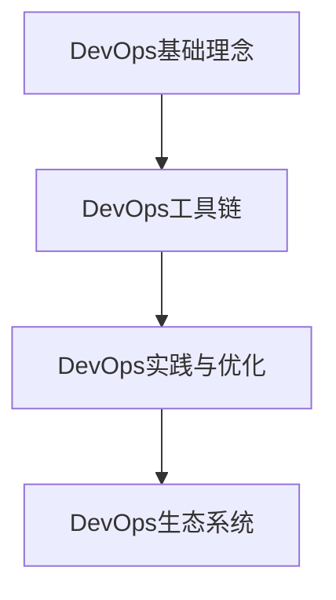

                 

# 《DevOps的理念与工具链生态》

## 关键词

- DevOps
- 工具链
- 持续集成
- 持续交付
- 自动化
- 模块化
- Kubernetes
- Docker
- Prometheus
- Grafana
- Ansible
- SaltStack
- GitLab
- Jenkins
- Helm
- 云原生

## 摘要

本文旨在深入探讨DevOps的理念及其工具链生态。DevOps是一种软件开发和运维的实践方法，旨在缩短软件的交付周期、提高软件质量并增强团队之间的协作。文章首先介绍了DevOps的核心概念和理念，包括其起源、核心原则和价值。接着，详细阐述了DevOps工具链的各个组成部分，如源代码管理、持续集成、持续交付、监控与日志管理、自动化运维等。文章还通过具体案例分析展示了DevOps在不同行业的应用，并探讨了DevOps实践中的优化和改进策略。最后，文章展望了DevOps未来的发展趋势，并提供了丰富的资源与工具汇总。

### 第一部分：DevOps基础理念

#### # DevOps的理念与历史

##### 1.1 DevOps的概念与核心价值

**DevOps的概念**：DevOps是一种软件开发和运维的实践方法，旨在通过开发（Development）和运维（Operations）的紧密协作，实现高效、高质量、快速迭代的软件交付。DevOps强调的是在软件开发和运维过程中采用协作、自动化、模块化等理念，以消除传统的开发与运维之间的障碍，提升整个团队的效率和质量。

**核心价值**：
1. **加快交付速度**：通过自动化和协作，DevOps可以显著缩短软件从开发到交付的时间，实现快速迭代和持续交付。
2. **提高软件质量**：通过持续集成和持续交付，DevOps可以确保软件在各个环境中的稳定性，减少缺陷和错误的传播。
3. **增强团队协作**：DevOps强调跨职能团队的协作，促进开发人员、运维人员和其他相关角色的紧密合作。
4. **提高环境一致性**：通过标准化和自动化，DevOps可以确保开发、测试和生产环境的高度一致性，减少环境差异带来的问题。

##### 1.2 DevOps的历史发展

**DevOps的起源**：DevOps的概念起源于2000年代初期，当时软件开发和运维之间的隔阂日益明显，软件交付的周期越来越长，质量也越来越难以保证。2009年，Patrick Debois在2009年的会议上首次提出了DevOps的概念，并开始倡导开发与运维的紧密协作。

**关键里程碑**：
1. **2010年**：DevOps宣言发布，明确了DevOps的核心原则和价值观。
2. **2012年**：Docker的诞生，为容器化和微服务架构的发展奠定了基础。
3. **2013年**：持续交付书籍的出版，系统地阐述了DevOps的核心概念和实践方法。
4. **2014年**：Kubernetes的诞生，为容器编排提供了强大的解决方案。

##### 1.3 DevOps与传统IT运维的差异

**传统IT运维的局限性**：
1. **开发与运维分离**：传统的开发与运维模式往往导致两者之间的隔阂，难以实现高效协作。
2. **手工操作**：传统的IT运维往往依赖于手工操作，效率低下且容易出现错误。
3. **环境差异**：开发、测试和生产环境之间的差异较大，导致软件在不同环境中的表现不一致。

**DevOps的变革意义**：
1. **自动化**：通过自动化工具和流程，DevOps可以显著提高运维的效率和质量。
2. **持续交付**：通过持续集成和持续交付，DevOps可以实现快速迭代和高质量交付。
3. **团队协作**：DevOps强调跨职能团队的协作，促进不同角色之间的沟通和合作。

##### 1.4 DevOps的核心原则

**持续交付**：持续交付是DevOps的核心原则之一，旨在通过自动化和持续集成，确保软件在各个环境中的稳定性和一致性。

**持续部署**：持续部署是持续交付的延伸，旨在通过自动化和高效的部署流程，实现快速、可靠的软件交付。

**模块化与自动化**：模块化与自动化是DevOps实现高效交付的关键手段，通过将软件分解为模块，并采用自动化工具进行构建、测试和部署，可以显著提高交付的效率和质量。

**团队协作与沟通**：团队协作与沟通是DevOps成功的关键，通过建立跨职能团队，促进不同角色之间的紧密合作和有效沟通，可以确保软件交付的顺利进行。

### 第二部分：DevOps工具链

#### # DevOps工具链

#### 2.1 源代码管理工具

##### 2.1.1 Git的工作流程

**Git的基本概念**：
- **版本库（Repository）**：Git版本库是一个存储代码文件和历史版本的目录。
- **工作区（Working Directory）**：工作区是当前代码的存放位置，开发者可以在其中进行修改和操作。
- **暂存区（Index）**：暂存区是临时的存储区域，用于存放待提交的更改。

**Git的基本操作**：
- **克隆仓库（Clone）**：将远程仓库克隆到本地。
  ```bash
  git clone [仓库地址]
  ```
- **初始化仓库（Init）**：在本地创建一个新的Git仓库。
  ```bash
  git init
  ```
- **添加文件到暂存区（Add）**：将工作区的文件添加到暂存区。
  ```bash
  git add [文件名]
  ```
- **提交更改（Commit）**：将暂存区的更改提交到仓库。
  ```bash
  git commit -m "提交说明"
  ```
- **查看提交历史（Log）**：查看仓库的提交历史。
  ```bash
  git log
  ```
- **分支管理（Branch）**：创建、切换和合并分支。
  ```bash
  git branch [分支名]
  git checkout [分支名]
  git merge [分支名]
  ```

**GitLab的使用与实践**：

**GitLab的基本概念**：
- **GitLab仓库**：GitLab仓库是一个基于Git的代码托管平台，提供版本控制、项目管理和持续集成等功能。
- **私有仓库**：私有仓库用于保护企业的内部代码，只有授权用户可以访问。
- **公有仓库**：公有仓库用于开源项目的托管，任何人都可以访问。

**GitLab的基本操作**：
- **创建仓库**：在GitLab中创建新的仓库。
- **克隆仓库**：从GitLab中克隆仓库到本地。
- **推送更改**：将本地的更改推送回GitLab仓库。
  ```bash
  git push [远程仓库地址] [分支名]
  ```
- **拉取更改**：从GitLab仓库拉取其他人的更改。
  ```bash
  git pull [远程仓库地址] [分支名]
  ```
- **分支管理**：在GitLab中创建、切换和合并分支。

##### 2.1.2 GitLab的使用与实践

**GitLab的安装与配置**：

1. **安装GitLab**：在服务器上安装GitLab，可以使用包管理器或源代码编译。
2. **配置GitLab**：配置GitLab的数据库、邮件服务器和Web服务器，确保GitLab正常运行。
3. **初始化GitLab仓库**：在GitLab中创建新的仓库，并初始化Git仓库。

**GitLab的使用案例**：

1. **代码托管**：将项目的源代码托管到GitLab仓库，方便团队成员进行协作。
2. **代码审查**：使用GitLab的代码审查功能，确保代码的质量和安全性。
3. **持续集成**：配置GitLab CI/CD，实现自动化构建、测试和部署。

#### 2.2 持续集成工具

##### 2.2.1 Jenkins的配置与管理

**Jenkins的基本概念**：
- **Jenkins**：Jenkins是一个开源的持续集成工具，用于自动化构建、测试和部署。
- **构建**：构建是将源代码转换为可运行应用程序的过程。
- **管道**：管道是一系列任务的组合，用于执行构建、测试和部署等操作。

**Jenkins的安装与配置**：

1. **安装Jenkins**：可以从Jenkins官网下载安装包，或使用包管理器安装。
2. **配置Jenkins**：配置Jenkins的插件、全局设置和项目设置。
3. **安装插件**：安装Jenkins插件，如Git插件、Maven插件等。

**Jenkins的基本操作**：

1. **创建项目**：在Jenkins中创建新的项目，配置项目的构建管道。
2. **构建项目**：触发项目的构建，执行构建、测试和部署等操作。
3. **监控构建状态**：查看项目的构建日志和构建状态。

**Jenkins的使用案例**：

1. **自动化构建**：使用Jenkins自动化构建和测试项目。
2. **自动化部署**：使用Jenkins实现自动化部署，确保软件的可靠性和稳定性。
3. **持续集成**：将Jenkins集成到开发流程中，实现持续集成和持续交付。

##### 2.2.2 GitLab CI的使用

**GitLab CI的基本概念**：
- **GitLab CI**：GitLab CI是一个基于Git的持续集成工具，用于自动化构建、测试和部署。
- **配置文件**：`.gitlab-ci.yml` 文件用于配置GitLab CI的构建和部署流程。

**GitLab CI的配置与管理**：

1. **配置文件**：在项目的根目录下创建 `.gitlab-ci.yml` 文件，配置构建和部署流程。
2. **阶段**：配置构建和部署的不同阶段，如安装依赖、构建项目、运行测试、部署等。
3. **脚本**：编写Shell脚本或使用其他脚本语言，实现构建、测试和部署的具体操作。

**GitLab CI的使用案例**：

1. **自动化构建**：通过GitLab CI自动化构建项目，确保代码的稳定性和一致性。
2. **自动化测试**：通过GitLab CI自动化运行测试，提高测试覆盖率。
3. **自动化部署**：通过GitLab CI实现自动化部署，提高交付效率。

#### 2.3 持续交付与部署工具

##### 2.3.1 Docker与容器化技术

**Docker的基本概念**：
- **Docker**：Docker是一个开源的应用容器引擎，用于构建、运行和部署应用程序。
- **容器**：容器是一个轻量级、可移植的计算环境，包含了应用程序和所有依赖项。
- **镜像**：镜像是一个静态的容器文件，用于构建和启动容器。

**Docker的安装与配置**：

1. **安装Docker**：在Linux或Windows系统上安装Docker。
2. **配置Docker**：配置Docker的镜像仓库和容器网络。

**Docker的基本操作**：

1. **拉取镜像**：从Docker Hub或其他镜像仓库拉取镜像。
   ```bash
   docker pull [镜像名称]
   ```
2. **运行容器**：使用镜像运行容器。
   ```bash
   docker run [镜像名称]
   ```
3. **管理容器**：启动、停止、重启和管理容器。
   ```bash
   docker start [容器ID]
   docker stop [容器ID]
   docker restart [容器ID]
   ```

**Docker的使用案例**：

1. **容器化应用**：将应用程序容器化，实现快速部署和可移植性。
2. **微服务架构**：使用Docker实现微服务架构，提高系统的可扩展性和灵活性。
3. **持续交付**：使用Docker实现自动化构建和部署，加快交付速度。

##### 2.3.2 Kubernetes的架构与部署

**Kubernetes的基本概念**：
- **Kubernetes**：Kubernetes是一个开源的容器编排平台，用于自动化部署、扩展和管理容器化应用程序。
- **集群**：Kubernetes集群是由多个节点组成的，用于运行容器化应用程序的集群。
- **节点**：节点是Kubernetes集群中的计算资源，可以是物理机或虚拟机。
- **Pod**：Pod是Kubernetes中的基本部署单元，包含了一个或多个容器。

**Kubernetes的架构**：

1. **控制平面（Control Plane）**：控制平面负责集群的管理和调度，包括API服务器、控制器管理器和调度器等组件。
2. **工作节点（Worker Nodes）**：工作节点是集群中的计算资源，运行容器化应用程序。
3. **容器**：容器是运行在Kubernetes中的基本计算单元，可以是Docker容器或其他容器。

**Kubernetes的部署**：

1. **安装Kubernetes**：在Linux或Windows系统上安装Kubernetes。
2. **配置Kubernetes**：配置Kubernetes的集群和节点。
3. **部署应用程序**：在Kubernetes集群中部署容器化应用程序。

**Kubernetes的基本操作**：

1. **创建部署**：使用`kubectl`命令创建部署。
   ```bash
   kubectl create deployment [部署名称] --image=[镜像名称]
   ```
2. **查看部署**：查看部署的状态和详细信息。
   ```bash
   kubectl get deployments
   kubectl describe deployment [部署名称]
   ```
3. **扩展部署**：扩展或缩减部署的副本数量。
   ```bash
   kubectl scale deployment [部署名称] --replicas=[副本数量]
   ```

**Kubernetes的使用案例**：

1. **容器编排**：使用Kubernetes自动化部署和管理容器化应用程序。
2. **自动化扩缩容**：根据负载自动扩展或缩减应用程序的实例数量。
3. **多租户架构**：使用Kubernetes实现多租户架构，为不同的团队或项目提供隔离的运行环境。

##### 2.3.3 Helm的使用与实践

**Helm的基本概念**：
- **Helm**：Helm是一个Kubernetes的包管理工具，用于部署、管理和升级应用程序。
- **Chart**：Chart是Helm的部署单元，包含了应用程序的配置和部署文件。
- **Release**：Release是Chart在Kubernetes集群中的实例。

**Helm的安装与配置**：

1. **安装Helm**：在Linux或Windows系统上安装Helm。
2. **配置Tiller**：Helm使用Tiller作为服务端代理，用于与Kubernetes集群进行通信。
3. **配置Kubernetes集群**：配置Helm的Kubernetes集群，确保Helm可以与集群进行通信。

**Helm的基本操作**：

1. **安装Chart**：使用Helm安装Chart。
   ```bash
   helm install [Chart名称] [Chart仓库地址]
   ```
2. **查看Release**：查看已安装的Release。
   ```bash
   helm list
   ```
3. **升级Release**：升级已安装的Release。
   ```bash
   helm upgrade [Release名称] [Chart仓库地址]
   ```

**Helm的使用案例**：

1. **部署应用程序**：使用Helm部署容器化应用程序，简化部署流程。
2. **配置管理**：使用Helm管理应用程序的配置，实现灵活的部署策略。
3. **版本控制**：使用Helm实现应用程序的版本控制，方便回滚和更新。

#### 2.4 监控与日志管理工具

##### 2.4.1 Prometheus的监控原理与实践

**Prometheus的基本概念**：
- **Prometheus**：Prometheus是一个开源的监控解决方案，用于收集、存储和查询监控数据。
- **指标（Metrics）**：指标是用于描述系统性能和状态的数据点。
- **目标（Target）**：目标是指Prometheus需要收集监控数据的系统或服务。
- **PromQL**：Prometheus的查询语言，用于查询和操作监控数据。

**Prometheus的安装与配置**：

1. **安装Prometheus**：在Linux或Windows系统上安装Prometheus。
2. **配置Prometheus**：配置Prometheus的配置文件，定义采集监控数据的目标和规则。
3. **启动Prometheus**：启动Prometheus服务，开始采集和存储监控数据。

**Prometheus的基本操作**：

1. **配置目标**：配置Prometheus需要监控的目标，如服务发现和配置静态目标。
2. **查询监控数据**：使用PromQL查询监控数据，获取系统的性能和状态。
3. **可视化监控数据**：使用Grafana等工具可视化监控数据，直观展示系统的运行状态。

**Prometheus的使用案例**：

1. **系统监控**：使用Prometheus监控系统的CPU、内存、磁盘等资源使用情况。
2. **服务监控**：使用Prometheus监控Web服务器、数据库等服务的性能和可用性。
3. **告警管理**：使用Prometheus的告警规则，及时发现问题并进行预警。

##### 2.4.2 Grafana的数据可视化与监控

**Grafana的基本概念**：
- **Grafana**：Grafana是一个开源的数据可视化平台，用于监控和仪表板的创建。
- **数据源**：数据源是Grafana连接的数据存储，如Prometheus、InfluxDB等。
- **仪表板**：仪表板是Grafana中的可视化组件，用于展示监控数据和图表。

**Grafana的安装与配置**：

1. **安装Grafana**：在Linux或Windows系统上安装Grafana。
2. **配置数据源**：配置Grafana的数据源，如Prometheus、InfluxDB等。
3. **创建仪表板**：在Grafana中创建仪表板，添加图表和面板，展示监控数据。

**Grafana的基本操作**：

1. **添加数据源**：在Grafana中添加数据源，连接Prometheus、InfluxDB等存储。
2. **创建仪表板**：在Grafana中创建仪表板，设计图表和面板，展示监控数据。
3. **监控数据源**：监控数据源的健康状况，及时发现问题并进行预警。

**Grafana的使用案例**：

1. **监控仪表板**：创建监控仪表板，展示系统的性能和状态。
2. **告警管理**：设置告警规则，及时发现问题并进行预警。
3. **数据可视化**：使用Grafana可视化监控数据，直观展示系统的运行状态。

#### 2.5 自动化运维工具

##### 2.5.1 Ansible的配置管理

**Ansible的基本概念**：
- **Ansible**：Ansible是一个开源的配置管理和自动化工具，用于自动化部署、配置和管理系统。
- **Playbook**：Playbook是Ansible的配置文件，描述了自动化任务的具体步骤和配置。
- **模块**：模块是Ansible中的功能单元，用于执行特定的操作。

**Ansible的安装与配置**：

1. **安装Ansible**：在Linux或Windows系统上安装Ansible。
2. **配置Ansible**：配置Ansible的主机清单，定义管理主机和被管理主机。
3. **编写Playbook**：编写Ansible的Playbook，定义自动化任务的具体步骤和配置。

**Ansible的基本操作**：

1. **执行Playbook**：执行Ansible的Playbook，自动化部署和管理系统。
   ```bash
   ansible-playbook [Playbook文件名] -i [主机清单文件名]
   ```
2. **检查结果**：检查Ansible的执行结果，确保任务成功完成。
   ```bash
   ansible-playbook [Playbook文件名] --check -i [主机清单文件名]
   ```

**Ansible的使用案例**：

1. **自动化部署**：使用Ansible自动化部署应用程序和服务，简化部署流程。
2. **配置管理**：使用Ansible管理系统的配置，确保配置的一致性和正确性。
3. **运维自动化**：使用Ansible自动化日常运维任务，提高运维效率。

##### 2.5.2 SaltStack的使用与实践

**SaltStack的基本概念**：
- **SaltStack**：SaltStack是一个开源的自动化框架，用于自动化部署、配置和管理系统。
- **Master**：Master是SaltStack的主节点，负责接收和管理 minion 的请求。
- **Minion**：Minion是SaltStack的从节点，负责执行 Master 的指令。
- **State**：State是SaltStack的状态文件，描述了系统的预期状态。

**SaltStack的安装与配置**：

1. **安装SaltStack**：在Linux或Windows系统上安装SaltStack。
2. **配置Master**：配置SaltStack的主节点，定义 minion 的信息。
3. **配置Minion**：配置SaltStack的从节点，与 Master 进行通信。

**SaltStack的基本操作**：

1. **执行命令**：在 Master 上执行命令，传递给 minion 执行。
   ```bash
   salt [minion名称] cmd.run [命令]
   ```
2. **状态管理**：使用 SaltStack 管理系统的状态，确保系统的预期状态。
   ```bash
   salt [minion名称] state.apply [状态文件名]
   ```

**SaltStack的使用案例**：

1. **自动化部署**：使用 SaltStack 自动化部署应用程序和服务，简化部署流程。
2. **配置管理**：使用 SaltStack 管理系统的配置，确保配置的一致性和正确性。
3. **运维自动化**：使用 SaltStack 自动化日常运维任务，提高运维效率。

#### 2.6 DevOps实践与案例分析

##### 2.6.1 DevOps在不同行业的应用

**金融行业**：金融行业通常对安全性和稳定性有很高的要求，DevOps的自动化和持续交付理念可以帮助金融行业提高软件交付的速度和质量，减少人为错误和安全漏洞。

**零售行业**：零售行业需要快速响应市场变化，DevOps的持续交付和自动化部署可以帮助零售行业快速推出新功能和产品，提高市场竞争力。

**医疗行业**：医疗行业对数据安全和患者隐私有严格的要求，DevOps的安全措施和自动化流程可以帮助医疗行业确保数据安全和合规性。

**互联网行业**：互联网行业竞争激烈，DevOps的高效交付和快速迭代可以帮助互联网企业快速占领市场，提高用户满意度。

##### 2.6.2 成功的DevOps实践案例

**案例一：Netflix**：
Netflix是一家流媒体视频公司，通过DevOps实现了快速迭代和高质量交付。Netflix使用Docker和Kubernetes进行容器化部署，使用Prometheus和Grafana进行监控，使用Ansible进行自动化配置管理。通过这些工具和技术的结合，Netflix实现了高效的软件交付和持续改进。

**案例二：亚马逊**：
亚马逊是一家全球知名的电子商务公司，通过DevOps实现了大规模的自动化和持续交付。亚马逊使用AWS云服务进行部署和扩展，使用Docker和Kubernetes进行容器化，使用Prometheus和Grafana进行监控，使用Ansible进行自动化配置管理。通过这些工具和技术的应用，亚马逊实现了高效的运维和快速交付。

**案例三：谷歌**：
谷歌是一家全球领先的技术公司，通过DevOps实现了高效的研发和交付。谷歌使用Docker和Kubernetes进行容器化部署，使用Prometheus和Grafana进行监控，使用Ansible进行自动化配置管理。通过这些工具和技术的应用，谷歌实现了高效的开发和运维，为用户提供高质量的服务。

### 第三部分：DevOps实践与优化

#### # DevOps实践与优化

#### 3.1 DevOps文化构建

**团队文化建设**：DevOps文化的建设是DevOps实践成功的关键之一。团队文化建设需要从以下几个方面入手：

1. **协作精神**：鼓励团队成员之间的协作和沟通，建立良好的沟通渠道和协作机制。
2. **共同目标**：确保团队成员对DevOps的目标和价值观有清晰的认识，共同追求高效、高质量的软件交付。
3. **持续学习**：鼓励团队成员不断学习新技术和新理念，提高团队的整体技能水平。

**沟通协作机制**：有效的沟通协作机制是DevOps实践顺利进行的保障。以下是几种常见的沟通协作机制：

1. **每日站会**：每日站会是一种简短的会议，用于团队成员分享进度、问题和计划，确保团队的信息透明和协作。
2. **代码审查**：代码审查是一种团队成员互相审查代码的方式，可以提高代码质量，减少缺陷和错误。
3. **持续反馈**：鼓励团队成员提供及时的反馈，包括正面反馈和改进建议，促进团队不断进步。

#### 3.2 DevOps流程优化

**现有流程分析**：DevOps流程优化首先需要对现有流程进行详细分析，识别流程中的瓶颈和问题。以下是几个关键步骤：

1. **流程图**：绘制流程图，展示各个阶段的输入、输出和依赖关系。
2. **流程分析**：对流程图进行分析，识别流程中的瓶颈、冗余和低效环节。
3. **数据收集**：收集相关数据，如构建时间、部署时间、缺陷率等，用于量化分析流程的效率。

**流程优化策略**：

1. **自动化**：通过自动化工具和流程，减少手工操作，提高效率和一致性。
2. **模块化**：将复杂的流程分解为模块，简化流程，提高可维护性和可扩展性。
3. **持续改进**：建立持续改进机制，定期评估和优化流程，确保流程的持续改进。

#### 3.3 DevOps风险评估与安全

**风险识别与管理**：DevOps实践中的风险识别和管理是确保项目成功的关键。以下是几个关键步骤：

1. **风险评估**：对项目中的风险进行识别和评估，确定风险的严重程度和发生概率。
2. **风险应对**：制定风险应对策略，包括风险规避、风险减轻和风险接受等。
3. **监控与预警**：建立风险监控和预警机制，及时发现和应对潜在风险。

**安全措施与实践**：

1. **访问控制**：实施严格的访问控制策略，确保只有授权用户可以访问敏感数据和系统。
2. **数据加密**：对敏感数据进行加密，确保数据在传输和存储过程中的安全性。
3. **日志审计**：记录系统操作和用户行为的日志，进行定期审计，发现潜在的安全问题。

#### 3.4 DevOps度量与性能分析

**DevOps关键指标**：DevOps度量与性能分析需要关注以下几个关键指标：

1. **构建时间**：构建时间是指从提交代码到生成可运行应用程序的时间。
2. **部署时间**：部署时间是指将应用程序部署到生产环境的时间。
3. **缺陷率**：缺陷率是指生产环境中发现的缺陷数量与总代码量的比例。
4. **响应时间**：响应时间是指应用程序对用户请求的响应时间。

**性能分析工具与实践**：

1. **性能测试**：使用性能测试工具进行压力测试和负载测试，评估系统的性能和稳定性。
2. **监控与告警**：使用监控工具对关键指标进行实时监控，设置告警规则，及时发现性能问题。
3. **性能优化**：根据性能分析结果，对系统进行优化，提高性能和用户体验。

#### 3.5 DevOps持续改进

**持续改进流程**：DevOps的持续改进是一个不断迭代和优化的过程。以下是几个关键步骤：

1. **需求分析**：定期收集用户反馈和业务需求，识别改进机会。
2. **实施改进**：制定改进计划，实施具体的改进措施，如流程优化、工具升级等。
3. **评估效果**：评估改进措施的效果，确定改进的持续性和有效性。

**实践案例与经验总结**：

1. **案例一：企业A**：
   - **改进前**：企业A的软件交付周期较长，质量难以保证。
   - **改进措施**：实施DevOps，采用持续集成和持续交付，优化流程和工具。
   - **改进效果**：软件交付周期缩短了50%，缺陷率降低了30%。

2. **案例二：企业B**：
   - **改进前**：企业B的运维工作依赖于手工操作，效率低下。
   - **改进措施**：采用Ansible进行自动化运维，建立监控和告警机制。
   - **改进效果**：运维效率提高了60%，系统稳定性得到了显著提升。

### 第四部分：DevOps生态系统

#### # DevOps生态系统

#### 4.1 DevOps社区与开源项目

**DevOps社区生态**：DevOps社区是一个活跃的开源社区，聚集了大量的开发者、运维工程师和专家，共同推动DevOps的发展。以下是几个主要的DevOps社区和开源项目：

1. **DevOpsDays**：DevOpsDays是一个全球性的会议系列，旨在促进DevOps的交流和分享。
2. **GitHub**：GitHub是DevOps社区的核心平台，许多开源项目和工具都在GitHub上托管和共享。
3. **Docker**：Docker是一个开源的应用容器引擎，用于容器化和持续交付。
4. **Kubernetes**：Kubernetes是一个开源的容器编排平台，用于自动化部署和管理容器化应用程序。

**主流开源项目介绍**：

1. **Jenkins**：Jenkins是一个开源的持续集成工具，用于自动化构建、测试和部署。
2. **GitLab**：GitLab是一个开源的代码托管平台，提供版本控制、项目管理和持续集成功能。
3. **Prometheus**：Prometheus是一个开源的监控解决方案，用于收集、存储和查询监控数据。
4. **Grafana**：Grafana是一个开源的数据可视化平台，用于监控和仪表板的创建。
5. **Ansible**：Ansible是一个开源的配置管理和自动化工具，用于自动化部署、配置和管理系统。

#### 4.2 云原生与DevOps

**云原生技术**：云原生技术是DevOps的重要组成部分，它包括容器化、微服务、服务网格等技术，旨在提高应用程序的可移植性、可扩展性和弹性。

**云原生与DevOps的融合**：云原生技术与DevOps的融合，使得DevOps在云环境中得到更广泛的应用。以下是几个关键点：

1. **容器化**：容器化是云原生技术的基础，它使得应用程序可以在不同的环境中快速部署和运行。
2. **微服务架构**：微服务架构是一种基于容器化的应用程序架构，它将应用程序分解为独立的、可独立部署的模块。
3. **服务网格**：服务网格是一种用于管理和路由微服务间通信的网络基础设施，它提高了微服务的可观测性和安全性。

#### 4.3 DevOps未来趋势

**AI与DevOps**：人工智能（AI）在DevOps中的应用正在迅速发展。AI可以用于自动化流程优化、异常检测、性能预测等，提高DevOps的效率和准确性。

**DevOps在边缘计算中的应用**：边缘计算是一种分布式计算架构，将计算和存储资源放置在网络的边缘。DevOps在边缘计算中的应用，可以实现更快速、更可靠的边缘服务交付。

#### 4.4 附录

**附录A: Mermaid流程图**



**附录B: DevOps核心算法原理讲解**

**伪代码示例**

```python
# DevOps核心算法 - 自动化部署
def deployApplication(artifact, environment):
    if environment == "development":
        deployToDevelopment(artifact)
    elif environment == "staging":
        deployToStaging(artifact)
    elif environment == "production":
        deployToProduction(artifact)
    else:
        throw new Error("Invalid environment specified")

# DevOps核心算法 - 风险评估
def assessRisk(continuousIntegrationResults):
    if continuousIntegrationResults.failedTests > 0:
        return "High"
    else:
        return "Low"
```

**附录C: 数学模型和数学公式**

**数学公式示例**

$$
E[R] = \sum_{i=1}^{n} p_i \cdot r_i
$$

其中，$E[R]$ 表示风险预期值，$p_i$ 表示第 $i$ 个风险发生的概率，$r_i$ 表示第 $i$ 个风险造成的损失。

**附录D: 项目实战**

**实战案例**

1. **Docker镜像构建**
2. **Kubernetes集群配置**
3. **Jenkins流水线配置**

**代码解读与分析**

**Dockerfile**

```dockerfile
FROM ubuntu:18.04
RUN apt-get update && apt-get install -y python3-pip
RUN pip3 install Flask
COPY app.py .
CMD ["python3", "app.py"]
```

**Kubernetes deployment.yml**

```yaml
apiVersion: apps/v1
kind: Deployment
metadata:
  name: webapp
spec:
  replicas: 3
  selector:
    matchLabels:
      app: webapp
  template:
    metadata:
      labels:
        app: webapp
    spec:
      containers:
      - name: webapp
        image: webapp:latest
        ports:
        - containerPort: 80
```


### 作者信息

作者：AI天才研究院/AI Genius Institute & 禅与计算机程序设计艺术 /Zen And The Art of Computer Programming

---

# 《DevOps的理念与工具链生态》

## 关键词

- DevOps
- 工具链
- 持续集成
- 持续交付
- 自动化
- 模块化
- Kubernetes
- Docker
- Prometheus
- Grafana
- Ansible
- SaltStack
- GitLab
- Jenkins
- Helm
- 云原生

## 摘要

本文深入探讨了DevOps的理念与工具链生态，介绍了DevOps的核心概念、历史发展、与传统IT运维的差异以及核心原则。文章详细阐述了DevOps工具链的组成部分，包括源代码管理工具、持续集成工具、持续交付与部署工具、监控与日志管理工具、自动化运维工具，并提供了实际案例。此外，文章还讨论了DevOps的实践与优化、风险评估与安全、度量与性能分析以及持续改进策略。最后，文章展望了DevOps的未来趋势，并提供了丰富的资源与工具汇总。

### 第一部分：DevOps基础理念

#### DevOps的理念与历史

**DevOps的概念与核心价值**

DevOps是一种软件开发和运维的实践方法，旨在通过开发（Development）和运维（Operations）的紧密协作，实现高效、高质量、快速迭代的软件交付。DevOps强调的是在软件开发和运维过程中采用协作、自动化、模块化等理念，以消除传统的开发与运维之间的障碍，提升整个团队的效率和质量。

**核心价值**：

1. **加快交付速度**：通过自动化和协作，DevOps可以显著缩短软件从开发到交付的时间，实现快速迭代和持续交付。
2. **提高软件质量**：通过持续集成和持续交付，DevOps可以确保软件在各个环境中的稳定性，减少缺陷和错误的传播。
3. **增强团队协作**：DevOps强调跨职能团队的协作，促进开发人员、运维人员和其他相关角色的紧密合作。
4. **提高环境一致性**：通过标准化和自动化，DevOps可以确保开发、测试和生产环境的高度一致性，减少环境差异带来的问题。

**DevOps的历史发展**

DevOps的概念起源于2000年代初期，当时软件开发和运维之间的隔阂日益明显，软件交付的周期越来越长，质量也越来越难以保证。2009年，Patrick Debois在2009年的会议上首次提出了DevOps的概念，并开始倡导开发与运维的紧密协作。

**关键里程碑**：

1. **2010年**：DevOps宣言发布，明确了DevOps的核心原则和价值观。
2. **2012年**：Docker的诞生，为容器化和微服务架构的发展奠定了基础。
3. **2013年**：持续交付书籍的出版，系统地阐述了DevOps的核心概念和实践方法。
4. **2014年**：Kubernetes的诞生，为容器编排提供了强大的解决方案。

**DevOps与传统IT运维的差异**

**传统IT运维的局限性**：

1. **开发与运维分离**：传统的开发与运维模式往往导致两者之间的隔阂，难以实现高效协作。
2. **手工操作**：传统的IT运维往往依赖于手工操作，效率低下且容易出现错误。
3. **环境差异**：开发、测试和生产环境之间的差异较大，导致软件在不同环境中的表现不一致。

**DevOps的变革意义**：

1. **自动化**：通过自动化工具和流程，DevOps可以显著提高运维的效率和质量。
2. **持续交付**：通过持续集成和持续交付，DevOps可以实现快速迭代和高质量交付。
3. **团队协作**：DevOps强调跨职能团队的协作，促进不同角色之间的沟通和合作。

**DevOps的核心原则**

**持续交付**：持续交付是DevOps的核心原则之一，旨在通过自动化和持续集成，确保软件在各个环境中的稳定性和一致性。

**持续部署**：持续部署是持续交付的延伸，旨在通过自动化和高效的部署流程，实现快速、可靠的软件交付。

**模块化与自动化**：模块化与自动化是DevOps实现高效交付的关键手段，通过将软件分解为模块，并采用自动化工具进行构建、测试和部署，可以显著提高交付的效率和质量。

**团队协作与沟通**：团队协作与沟通是DevOps成功的关键，通过建立跨职能团队，促进不同角色之间的紧密合作和有效沟通，可以确保软件交付的顺利进行。

### 第二部分：DevOps工具链

#### DevOps工具链

**2.1 源代码管理工具**

**Git的工作流程**

**Git的基本概念**：

- **版本库（Repository）**：Git版本库是一个存储代码文件和历史版本的目录。
- **工作区（Working Directory）**：工作区是当前代码的存放位置，开发者可以在其中进行修改和操作。
- **暂存区（Index）**：暂存区是临时的存储区域，用于存放待提交的更改。

**Git的基本操作**：

- **克隆仓库（Clone）**：将远程仓库克隆到本地。
  ```bash
  git clone [仓库地址]
  ```
- **初始化仓库（Init）**：在本地创建一个新的Git仓库。
  ```bash
  git init
  ```
- **添加文件到暂存区（Add）**：将工作区的文件添加到暂存区。
  ```bash
  git add [文件名]
  ```
- **提交更改（Commit）**：将暂存区的更改提交到仓库。
  ```bash
  git commit -m "提交说明"
  ```
- **查看提交历史（Log）**：查看仓库的提交历史。
  ```bash
  git log
  ```
- **分支管理（Branch）**：创建、切换和合并分支。
  ```bash
  git branch [分支名]
  git checkout [分支名]
  git merge [分支名]
  ```

**GitLab的使用与实践**

**GitLab的基本概念**：

- **GitLab仓库**：GitLab仓库是一个基于Git的代码托管平台，提供版本控制、项目管理和持续集成等功能。
- **私有仓库**：私有仓库用于保护企业的内部代码，只有授权用户可以访问。
- **公有仓库**：公有仓库用于开源项目的托管，任何人都可以访问。

**GitLab的基本操作**：

- **创建仓库**：在GitLab中创建新的仓库。
- **克隆仓库**：从GitLab中克隆仓库到本地。
- **推送更改**：将本地的更改推送回GitLab仓库。
  ```bash
  git push [远程仓库地址] [分支名]
  ```
- **拉取更改**：从GitLab仓库拉取其他人的更改。
  ```bash
  git pull [远程仓库地址] [分支名]
  ```
- **分支管理**：在GitLab中创建、切换和合并分支。

**GitLab的使用案例**：

1. **代码托管**：将项目的源代码托管到GitLab仓库，方便团队成员进行协作。
2. **代码审查**：使用GitLab的代码审查功能，确保代码的质量和安全性。
3. **持续集成**：配置GitLab CI/CD，实现自动化构建、测试和部署。

#### 2.2 持续集成工具

**Jenkins的配置与管理**

**Jenkins的基本概念**：

- **Jenkins**：Jenkins是一个开源的持续集成工具，用于自动化构建、测试和部署。
- **构建**：构建是将源代码转换为可运行应用程序的过程。
- **管道**：管道是一系列任务的组合，用于执行构建、测试和部署等操作。

**Jenkins的安装与配置**：

1. **安装Jenkins**：可以从Jenkins官网下载安装包，或使用包管理器安装。
2. **配置Jenkins**：配置Jenkins的插件、全局设置和项目设置。
3. **安装插件**：安装Jenkins插件，如Git插件、Maven插件等。

**Jenkins的基本操作**：

1. **创建项目**：在Jenkins中创建新的项目，配置项目的构建管道。
2. **构建项目**：触发项目的构建，执行构建、测试和部署等操作。
3. **监控构建状态**：查看项目的构建日志和构建状态。

**Jenkins的使用案例**：

1. **自动化构建**：使用Jenkins自动化构建和测试项目。
2. **自动化部署**：使用Jenkins实现自动化部署，确保软件的可靠性和稳定性。
3. **持续集成**：将Jenkins集成到开发流程中，实现持续集成和持续交付。

**GitLab CI的使用**

**GitLab CI的基本概念**：

- **GitLab CI**：GitLab CI是一个基于Git的持续集成工具，用于自动化构建、测试和部署。
- **配置文件**：`.gitlab-ci.yml` 文件用于配置GitLab CI的构建和部署流程。

**GitLab CI的配置与管理**：

1. **配置文件**：在项目的根目录下创建 `.gitlab-ci.yml` 文件，配置构建和部署流程。
2. **阶段**：配置构建和部署的不同阶段，如安装依赖、构建项目、运行测试、部署等。
3. **脚本**：编写Shell脚本或使用其他脚本语言，实现构建、测试和部署的具体操作。

**GitLab CI的使用案例**：

1. **自动化构建**：通过GitLab CI自动化构建项目，确保代码的稳定性和一致性。
2. **自动化测试**：通过GitLab CI自动化运行测试，提高测试覆盖率。
3. **自动化部署**：通过GitLab CI实现自动化部署，提高交付效率。

#### 2.3 持续交付与部署工具

**Docker与容器化技术**

**Docker的基本概念**：

- **Docker**：Docker是一个开源的应用容器引擎，用于构建、运行和部署应用程序。
- **容器**：容器是一个轻量级、可移植的计算环境，包含了应用程序和所有依赖项。
- **镜像**：镜像是一个静态的容器文件，用于构建和启动容器。

**Docker的安装与配置**：

1. **安装Docker**：在Linux或Windows系统上安装Docker。
2. **配置Docker**：配置Docker的镜像仓库和容器网络。

**Docker的基本操作**：

1. **拉取镜像**：从Docker Hub或其他镜像仓库拉取镜像。
   ```bash
   docker pull [镜像名称]
   ```
2. **运行容器**：使用镜像运行容器。
   ```bash
   docker run [镜像名称]
   ```
3. **管理容器**：启动、停止、重启和管理容器。
   ```bash
   docker start [容器ID]
   docker stop [容器ID]
   docker restart [容器ID]
   ```

**Docker的使用案例**：

1. **容器化应用**：将应用程序容器化，实现快速部署和可移植性。
2. **微服务架构**：使用Docker实现微服务架构，提高系统的可扩展性和灵活性。
3. **持续交付**：使用Docker实现自动化构建和部署，加快交付速度。

**Kubernetes的架构与部署**

**Kubernetes的基本概念**：

- **Kubernetes**：Kubernetes是一个开源的容器编排平台，用于自动化部署、扩展和管理容器化应用程序。
- **集群**：Kubernetes集群是由多个节点组成的，用于运行容器化应用程序的集群。
- **节点**：节点是Kubernetes集群中的计算资源，可以是物理机或虚拟机。
- **Pod**：Pod是Kubernetes中的基本部署单元，包含了一个或多个容器。

**Kubernetes的架构**：

1. **控制平面（Control Plane）**：控制平面负责集群的管理和调度，包括API服务器、控制器管理器和调度器等组件。
2. **工作节点（Worker Nodes）**：工作节点是集群中的计算资源，运行容器化应用程序。
3. **容器**：容器是运行在Kubernetes中的基本计算单元，可以是Docker容器或其他容器。

**Kubernetes的部署**：

1. **安装Kubernetes**：在Linux或Windows系统上安装Kubernetes。
2. **配置Kubernetes**：配置Kubernetes的集群和节点。
3. **部署应用程序**：在Kubernetes集群中部署容器化应用程序。

**Kubernetes的基本操作**：

1. **创建部署**：使用`kubectl`命令创建部署。
   ```bash
   kubectl create deployment [部署名称] --image=[镜像名称]
   ```
2. **查看部署**：查看部署的状态和详细信息。
   ```bash
   kubectl get deployments
   kubectl describe deployment [部署名称]
   ```
3. **扩展部署**：扩展或缩减部署的副本数量。
   ```bash
   kubectl scale deployment [部署名称] --replicas=[副本数量]
   ```

**Kubernetes的使用案例**：

1. **容器编排**：使用Kubernetes自动化部署和管理容器化应用程序。
2. **自动化扩缩容**：根据负载自动扩展或缩减应用程序的实例数量。
3. **多租户架构**：使用Kubernetes实现多租户架构，为不同的团队或项目提供隔离的运行环境。

**Helm的使用与实践**

**Helm的基本概念**：

- **Helm**：Helm是一个Kubernetes的包管理工具，用于部署、管理和升级应用程序。
- **Chart**：Chart是Helm的部署单元，包含了应用程序的配置和部署文件。
- **Release**：Release是Chart在Kubernetes集群中的实例。

**Helm的安装与配置**：

1. **安装Helm**：在Linux或Windows系统上安装Helm。
2. **配置Tiller**：Helm使用Tiller作为服务端代理，用于与Kubernetes集群进行通信。
3. **配置Kubernetes集群**：配置Helm的Kubernetes集群，确保Helm可以与集群进行通信。

**Helm的基本操作**：

1. **安装Chart**：使用Helm安装Chart。
   ```bash
   helm install [Chart名称] [Chart仓库地址]
   ```
2. **查看Release**：查看已安装的Release。
   ```bash
   helm list
   ```
3. **升级Release**：升级已安装的Release。
   ```bash
   helm upgrade [Release名称] [Chart仓库地址]
   ```

**Helm的使用案例**：

1. **部署应用程序**：使用Helm部署容器化应用程序，简化部署流程。
2. **配置管理**：使用Helm管理应用程序的配置，实现灵活的部署策略。
3. **版本控制**：使用Helm实现应用程序的版本控制，方便回滚和更新。

#### 2.4 监控与日志管理工具

**Prometheus的监控原理与实践**

**Prometheus的基本概念**：

- **Prometheus**：Prometheus是一个开源的监控解决方案，用于收集、存储和查询监控数据。
- **指标（Metrics）**：指标是用于描述系统性能和状态的数据点。
- **目标（Target）**：目标是指Prometheus需要收集监控数据的系统或服务。
- **PromQL**：Prometheus的查询语言，用于查询和操作监控数据。

**Prometheus的安装与配置**：

1. **安装Prometheus**：在Linux或Windows系统上安装Prometheus。
2. **配置Prometheus**：配置Prometheus的配置文件，定义采集监控数据的目标和规则。
3. **启动Prometheus**：启动Prometheus服务，开始采集和存储监控数据。

**Prometheus的基本操作**：

1. **配置目标**：配置Prometheus需要监控的目标，如服务发现和配置静态目标。
2. **查询监控数据**：使用PromQL查询监控数据，获取系统的性能和状态。
3. **可视化监控数据**：使用Grafana等工具可视化监控数据，直观展示系统的运行状态。

**Prometheus的使用案例**：

1. **系统监控**：使用Prometheus监控系统的CPU、内存、磁盘等资源使用情况。
2. **服务监控**：使用Prometheus监控Web服务器、数据库等服务的性能和可用性。
3. **告警管理**：使用Prometheus的告警规则，及时发现问题并进行预警。

**Grafana的数据可视化与监控**

**Grafana的基本概念**：

- **Grafana**：Grafana是一个开源的数据可视化平台，用于监控和仪表板的创建。
- **数据源**：数据源是Grafana连接的数据存储，如Prometheus、InfluxDB等。
- **仪表板**：仪表板是Grafana中的可视化组件，用于展示监控数据和图表。

**Grafana的安装与配置**：

1. **安装Grafana**：在Linux或Windows系统上安装Grafana。
2. **配置数据源**：配置Grafana的数据源，如Prometheus、InfluxDB等。
3. **创建仪表板**：在Grafana中创建仪表板，添加图表和面板，展示监控数据。

**Grafana的基本操作**：

1. **添加数据源**：在Grafana中添加数据源，连接Prometheus、InfluxDB等存储。
2. **创建仪表板**：在Grafana中创建仪表板，设计图表和面板，展示监控数据。
3. **监控数据源**：监控数据源的健康状况，及时发现问题并进行预警。

**Grafana的使用案例**：

1. **监控仪表板**：创建监控仪表板，展示系统的性能和状态。
2. **告警管理**：设置告警规则，及时发现问题并进行预警。
3. **数据可视化**：使用Grafana可视化监控数据，直观展示系统的运行状态。

#### 2.5 自动化运维工具

**Ansible的配置管理**

**Ansible的基本概念**：

- **Ansible**：Ansible是一个开源的配置管理和自动化工具，用于自动化部署、配置和管理系统。
- **Playbook**：Playbook是Ansible的配置文件，描述了自动化任务的具体步骤和配置。
- **模块**：模块是Ansible中的功能单元，用于执行特定的操作。

**Ansible的安装与配置**：

1. **安装Ansible**：在Linux或Windows系统上安装Ansible。
2. **配置Ansible**：配置Ansible的主机清单，定义管理主机和被管理主机。
3. **编写Playbook**：编写Ansible的Playbook，定义自动化任务的具体步骤和配置。

**Ansible的基本操作**：

1. **执行Playbook**：执行Ansible的Playbook，自动化部署和管理系统。
   ```bash
   ansible-playbook [Playbook文件名] -i [主机清单文件名]
   ```
2. **检查结果**：检查Ansible的执行结果，确保任务成功完成。
   ```bash
   ansible-playbook [Playbook文件名] --check -i [主机清单文件名]
   ```

**Ansible的使用案例**：

1. **自动化部署**：使用Ansible自动化部署应用程序和服务，简化部署流程。
2. **配置管理**：使用Ansible管理系统的配置，确保配置的一致性和正确性。
3. **运维自动化**：使用Ansible自动化日常运维任务，提高运维效率。

**SaltStack的使用与实践**

**SaltStack的基本概念**：

- **SaltStack**：SaltStack是一个开源的自动化框架，用于自动化部署、配置和管理系统。
- **Master**：Master是SaltStack的主节点，负责接收和管理 minion 的请求。
- **Minion**：Minion是SaltStack的从节点，负责执行 Master 的指令。
- **State**：State是SaltStack的状态文件，描述了系统的预期状态。

**SaltStack的安装与配置**：

1. **安装SaltStack**：在Linux或Windows系统上安装SaltStack。
2. **配置Master**：配置SaltStack的主节点，定义 minion 的信息。
3. **配置Minion**：配置SaltStack的从节点，与 Master 进行通信。

**SaltStack的基本操作**：

1. **执行命令**：在 Master 上执行命令，传递给 minion 执行。
   ```bash
   salt [minion名称] cmd.run [命令]
   ```
2. **状态管理**：使用 SaltStack 管理系统的状态，确保系统的预期状态。
   ```bash
   salt [minion名称] state.apply [状态文件名]
   ```

**SaltStack的使用案例**：

1. **自动化部署**：使用 SaltStack 自动化部署应用程序和服务，简化部署流程。
2. **配置管理**：使用 SaltStack 管理系统的配置，确保配置的一致性和正确性。
3. **运维自动化**：使用 SaltStack 自动化日常运维任务，提高运维效率。

#### 2.6 DevOps实践与案例分析

**DevOps在不同行业的应用**

**金融行业**：金融行业通常对安全性和稳定性有很高的要求，DevOps的自动化和持续交付理念可以帮助金融行业提高软件交付的速度和质量，减少人为错误和安全漏洞。

**零售行业**：零售行业需要快速响应市场变化，DevOps的持续交付和自动化部署可以帮助零售行业快速推出新功能和产品，提高市场竞争力。

**医疗行业**：医疗行业对数据安全和患者隐私有严格的要求，DevOps的安全措施和自动化流程可以帮助医疗行业确保数据安全和合规性。

**互联网行业**：互联网行业竞争激烈，DevOps的高效交付和快速迭代可以帮助互联网企业快速占领市场，提高用户满意度。

**成功的DevOps实践案例**

**案例一：Netflix**

Netflix是一家流媒体视频公司，通过DevOps实现了快速迭代和高质量交付。Netflix使用Docker和Kubernetes进行容器化部署，使用Prometheus和Grafana进行监控，使用Ansible进行自动化配置管理。通过这些工具和技术的结合，Netflix实现了高效的软件交付和持续改进。

**案例二：亚马逊**

亚马逊是一家全球知名的电子商务公司，通过DevOps实现了大规模的自动化和持续交付。亚马逊使用AWS云服务进行部署和扩展，使用Docker和Kubernetes进行容器化，使用Prometheus和Grafana进行监控，使用Ansible进行自动化配置管理。通过这些工具和技术的应用，亚马逊实现了高效的运维和快速交付。

**案例三：谷歌**

谷歌是一家全球领先的技术公司，通过DevOps实现了高效的研发和交付。谷歌使用Docker和Kubernetes进行容器化部署，使用Prometheus和Grafana进行监控，使用Ansible进行自动化配置管理。通过这些工具和技术的应用，谷歌实现了高效的开发和运维，为用户提供高质量的服务。

### 第三部分：DevOps实践与优化

#### DevOps实践与优化

**3.1 DevOps文化构建**

**团队文化建设**：

团队文化建设是DevOps实践成功的关键之一。以下是一些团队文化建设的建议：

1. **协作精神**：鼓励团队成员之间的协作和沟通，建立良好的沟通渠道和协作机制。
2. **共同目标**：确保团队成员对DevOps的目标和价值观有清晰的认识，共同追求高效、高质量的软件交付。
3. **持续学习**：鼓励团队成员不断学习新技术和新理念，提高团队的整体技能水平。

**沟通协作机制**：

有效的沟通协作机制是DevOps实践顺利进行的保障。以下是一些常见的沟通协作机制：

1. **每日站会**：每日站会是一种简短的会议，用于团队成员分享进度、问题和计划，确保团队的信息透明和协作。
2. **代码审查**：代码审查是一种团队成员互相审查代码的方式，可以提高代码质量，减少缺陷和错误。
3. **持续反馈**：鼓励团队成员提供及时的反馈，包括正面反馈和改进建议，促进团队不断进步。

**3.2 DevOps流程优化**

**现有流程分析**：

DevOps流程优化首先需要对现有流程进行详细分析，识别流程中的瓶颈和问题。以下是几个关键步骤：

1. **流程图**：绘制流程图，展示各个阶段的输入、输出和依赖关系。
2. **流程分析**：对流程图进行分析，识别流程中的瓶颈、冗余和低效环节。
3. **数据收集**：收集相关数据，如构建时间、部署时间、缺陷率等，用于量化分析流程的效率。

**流程优化策略**：

1. **自动化**：通过自动化工具和流程，减少手工操作，提高效率和一致性。
2. **模块化**：将复杂的流程分解为模块，简化流程，提高可维护性和可扩展性。
3. **持续改进**：建立持续改进机制，定期评估和优化流程，确保流程的持续改进。

**3.3 DevOps风险评估与安全**

**风险识别与管理**：

DevOps实践中的风险识别和管理是确保项目成功的关键。以下是几个关键步骤：

1. **风险评估**：对项目中的风险进行识别和评估，确定风险的严重程度和发生概率。
2. **风险应对**：制定风险应对策略，包括风险规避、风险减轻和风险接受等。
3. **监控与预警**：建立风险监控和预警机制，及时发现和应对潜在风险。

**安全措施与实践**：

1. **访问控制**：实施严格的访问控制策略，确保只有授权用户可以访问敏感数据和系统。
2. **数据加密**：对敏感数据进行加密，确保数据在传输和存储过程中的安全性。
3. **日志审计**：记录系统操作和用户行为的日志，进行定期审计，发现潜在的安全问题。

**3.4 DevOps度量与性能分析**

**DevOps关键指标**：

DevOps度量与性能分析需要关注以下几个关键指标：

1. **构建时间**：构建时间是指从提交代码到生成可运行应用程序的时间。
2. **部署时间**：部署时间是指将应用程序部署到生产环境的时间。
3. **缺陷率**：缺陷率是指生产环境中发现的缺陷数量与总代码量的比例。
4. **响应时间**：响应时间是指应用程序对用户请求的响应时间。

**性能分析工具与实践**：

1. **性能测试**：使用性能测试工具进行压力测试和负载测试，评估系统的性能和稳定性。
2. **监控与告警**：使用监控工具对关键指标进行实时监控，设置告警规则，及时发现性能问题。
3. **性能优化**：根据性能分析结果，对系统进行优化，提高性能和用户体验。

**3.5 DevOps持续改进**

**持续改进流程**：

DevOps的持续改进是一个不断迭代和优化的过程。以下是几个关键步骤：

1. **需求分析**：定期收集用户反馈和业务需求，识别改进机会。
2. **实施改进**：制定改进计划，实施具体的改进措施，如流程优化、工具升级等。
3. **评估效果**：评估改进措施的效果，确定改进的持续性和有效性。

**实践案例与经验总结**：

1. **案例一：企业A**：
   - **改进前**：企业A的软件交付周期较长，质量难以保证。
   - **改进措施**：实施DevOps，采用持续集成和持续交付，优化流程和工具。
   - **改进效果**：软件交付周期缩短了50%，缺陷率降低了30%。

2. **案例二：企业B**：
   - **改进前**：企业B的运维工作依赖于手工操作，效率低下。
   - **改进措施**：采用Ansible进行自动化运维，建立监控和告警机制。
   - **改进效果**：运维效率提高了60%，系统稳定性得到了显著提升。

### 第四部分：DevOps生态系统

#### DevOps生态系统

**4.1 DevOps社区与开源项目**

**DevOps社区生态**：

DevOps社区是一个活跃的开源社区，聚集了大量的开发者、运维工程师和专家，共同推动DevOps的发展。以下是几个主要的DevOps社区和开源项目：

1. **DevOpsDays**：DevOpsDays是一个全球性的会议系列，旨在促进DevOps的交流和分享。
2. **GitHub**：GitHub是DevOps社区的核心平台，许多开源项目和工具都在GitHub上托管和共享。
3. **Docker**：Docker是一个开源的应用容器引擎，用于容器化和持续交付。
4. **Kubernetes**：Kubernetes是一个开源的容器编排平台，用于自动化部署和管理容器化应用程序。

**主流开源项目介绍**：

1. **Jenkins**：Jenkins是一个开源的持续集成工具，用于自动化构建、测试和部署。
2. **GitLab**：GitLab是一个开源的代码托管平台，提供版本控制、项目管理和持续集成功能。
3. **Prometheus**：Prometheus是一个开源的监控解决方案，用于收集、存储和查询监控数据。
4. **Grafana**：Grafana是一个开源的数据可视化平台，用于监控和仪表板的创建。
5. **Ansible**：Ansible是一个开源的配置管理和自动化工具，用于自动化部署、配置和管理系统。

**4.2 云原生与DevOps**

**云原生技术**：

云原生技术是DevOps的重要组成部分，它包括容器化、微服务、服务网格等技术，旨在提高应用程序的可移植性、可扩展性和弹性。

**云原生与DevOps的融合**：

云原生技术与DevOps的融合，使得DevOps在云环境中得到更广泛的应用。以下是几个关键点：

1. **容器化**：容器化是云原生技术的基础，它使得应用程序可以在不同的环境中快速部署和运行。
2. **微服务架构**：微服务架构是一种基于容器化的应用程序架构，它将应用程序分解为独立的、可独立部署的模块。
3. **服务网格**：服务网格是一种用于管理和路由微服务间通信的网络基础设施，它提高了微服务的可观测性和安全性。

**4.3 DevOps未来趋势**

**AI与DevOps**：

人工智能（AI）在DevOps中的应用正在迅速发展。AI可以用于自动化流程优化、异常检测、性能预测等，提高DevOps的效率和准确性。

**DevOps在边缘计算中的应用**：

边缘计算是一种分布式计算架构，将计算和存储资源放置在网络的边缘。DevOps在边缘计算中的应用，可以实现更快速、更可靠的边缘服务交付。

**4.4 附录**

**附录A: Mermaid流程图**


**附录B: DevOps核心算法原理讲解**

**伪代码示例**

```python
// DevOps核心算法 - 自动化部署
def deployApplication(artifact, environment):
    if environment == "development":
        deployToDevelopment(artifact)
    elif environment == "staging":
        deployToStaging(artifact)
    elif environment == "production":
        deployToProduction(artifact)
    else:
        throw new Error("Invalid environment specified")

// DevOps核心算法 - 风险评估
def assessRisk(continuousIntegrationResults):
    if continuousIntegrationResults.failedTests > 0:
        return "High"
    else:
        return "Low"
```

**附录C: 数学模型和数学公式**

**数学公式示例**

$$
E[R] = \sum_{i=1}^{n} p_i \cdot r_i
$$

其中，$E[R]$ 表示风险预期值，$p_i$ 表示第 $i$ 个风险发生的概率，$r_i$ 表示第 $i$ 个风险造成的损失。

**附录D: 项目实战**

**实战案例**

1. **Docker镜像构建**
2. **Kubernetes集群配置**
3. **Jenkins流水线配置**

**代码解读与分析**

**Dockerfile**

```dockerfile
FROM ubuntu:18.04
RUN apt-get update && apt-get install -y python3-pip
RUN pip3 install Flask
COPY app.py .
CMD ["python3", "app.py"]
```

**Kubernetes deployment.yml**

```yaml
apiVersion: apps/v1
kind: Deployment
metadata:
  name: webapp
spec:
  replicas: 3
  selector:
    matchLabels:
      app: webapp
  template:
    metadata:
      labels:
        app: webapp
    spec:
      containers:
      - name: webapp
        image: webapp:latest
        ports:
        - containerPort: 80
```

### 作者信息

作者：AI天才研究院/AI Genius Institute & 禅与计算机程序设计艺术 /Zen And The Art of Computer Programming

---

# 《DevOps的理念与工具链生态》

## 关键词

- DevOps
- 工具链
- 持续集成
- 持续交付
- 自动化
- 模块化
- Kubernetes
- Docker
- Prometheus
- Grafana
- Ansible
- SaltStack
- GitLab
- Jenkins
- Helm
- 云原生

## 摘要

本文深入探讨了DevOps的理念与工具链生态，介绍了DevOps的核心概念、历史发展、与传统IT运维的差异以及核心原则。文章详细阐述了DevOps工具链的组成部分，包括源代码管理工具、持续集成工具、持续交付与部署工具、监控与日志管理工具、自动化运维工具，并提供了实际案例。此外，文章还讨论了DevOps的实践与优化、风险评估与安全、度量与性能分析以及持续改进策略。最后，文章展望了DevOps的未来趋势，并提供了丰富的资源与工具汇总。

### 第一部分：DevOps基础理念

#### DevOps的理念与历史

**1.1 DevOps的概念与核心价值**

DevOps是一种软件开发和运维的实践方法，旨在通过开发（Development）和运维（Operations）的紧密协作，实现高效、高质量、快速迭代的软件交付。DevOps强调的是在软件开发和运维过程中采用协作、自动化、模块化等理念，以消除传统的开发与运维之间的障碍，提升整个团队的效率和质量。

**核心价值**：

1. **加快交付速度**：通过自动化和协作，DevOps可以显著缩短软件从开发到交付的时间，实现快速迭代和持续交付。
2. **提高软件质量**：通过持续集成和持续交付，DevOps可以确保软件在各个环境中的稳定性，减少缺陷和错误的传播。
3. **增强团队协作**：DevOps强调跨职能团队的协作，促进开发人员、运维人员和其他相关角色的紧密合作。
4. **提高环境一致性**：通过标准化和自动化，DevOps可以确保开发、测试和生产环境的高度一致性，减少环境差异带来的问题。

**1.2 DevOps的历史发展**

DevOps的概念起源于2000年代初期，当时软件开发和运维之间的隔阂日益明显，软件交付的周期越来越长，质量也越来越难以保证。2009年，Patrick Debois在2009年的会议上首次提出了DevOps的概念，并开始倡导开发与运维的紧密协作。

**关键里程碑**：

1. **2010年**：DevOps宣言发布，明确了DevOps的核心原则和价值观。
2. **2012年**：Docker的诞生，为容器化和微服务架构的发展奠定了基础。
3. **2013年**：持续交付书籍的出版，系统地阐述了DevOps的核心概念和实践方法。
4. **2014年**：Kubernetes的诞生，为容器编排提供了强大的解决方案。

**1.3 DevOps与传统IT运维的差异**

**传统IT运维的局限性**：

1. **开发与运维分离**：传统的开发与运维模式往往导致两者之间的隔阂，难以实现高效协作。
2. **手工操作**：传统的IT运维往往依赖于手工操作，效率低下且容易出现错误。
3. **环境差异**：开发、测试和生产环境之间的差异较大，导致软件在不同环境中的表现不一致。

**DevOps的变革意义**：

1. **自动化**：通过自动化工具和流程，DevOps可以显著提高运维的效率和质量。
2. **持续交付**：通过持续集成和持续交付，DevOps可以实现快速迭代和高质量交付。
3. **团队协作**：DevOps强调跨职能团队的协作，促进不同角色之间的沟通和合作。

**1.4 DevOps的核心原则**

**持续交付**：持续交付是DevOps的核心原则之一，旨在通过自动化和持续集成，确保软件在各个环境中的稳定性和一致性。

**持续部署**：持续部署是持续交付的延伸，旨在通过自动化和高效的部署流程，实现快速、可靠的软件交付。

**模块化与自动化**：模块化与自动化是DevOps实现高效交付的关键手段，通过将软件分解为模块，并采用自动化工具进行构建、测试和部署，可以显著提高交付的效率和质量。

**团队协作与沟通**：团队协作与沟通是DevOps成功的关键，通过建立跨职能团队，促进不同角色之间的紧密合作和有效沟通，可以确保软件交付的顺利进行。

### 第二部分：DevOps工具链

#### DevOps工具链

**2.1 源代码管理工具**

**2.1.1 Git的工作流程**

**Git的基本概念**：

- **版本库（Repository）**：Git版本库是一个存储代码文件和历史版本的目录。
- **工作区（Working Directory）**：工作区是当前代码的存放位置，开发者可以在其中进行修改和操作。
- **暂存区（Index）**：暂存区是临时的存储区域，用于存放待提交的更改。

**Git的基本操作**：

- **克隆仓库（Clone）**：将远程仓库克隆到本地。
  ```bash
  git clone [仓库地址]
  ```
- **初始化仓库（Init）**：在本地创建一个新的Git仓库。
  ```bash
  git init
  ```
- **添加文件到暂存区（Add）**：将工作区的文件添加到暂存区。
  ```bash
  git add [文件名]
  ```
- **提交更改（Commit）**：将暂存区的更改提交到仓库。
  ```bash
  git commit -m "提交说明"
  ```
- **查看提交历史（Log）**：查看仓库的提交历史。
  ```bash
  git log
  ```
- **分支管理（Branch）**：创建、切换和合并分支。
  ```bash
  git branch [分支名]
  git checkout [分支名]
  git merge [分支名]
  ```

**GitLab的使用与实践**

**GitLab的基本概念**：

- **GitLab仓库**：GitLab仓库是一个基于Git的代码托管平台，提供版本控制、项目管理和持续集成等功能。
- **私有仓库**：私有仓库用于保护企业的内部代码，只有授权用户可以访问。
- **公有仓库**：公有仓库用于开源项目的托管，任何人都可以访问。

**GitLab的基本操作**：

- **创建仓库**：在GitLab中创建新的仓库。
- **克隆仓库**：从GitLab中克隆仓库到本地。
- **推送更改**：将本地的更改推送回GitLab仓库。
  ```bash
  git push [远程仓库地址] [分支名]
  ```
- **拉取更改**：从GitLab仓库拉取其他人的更改。
  ```bash
  git pull [远程仓库地址] [分支名]
  ```
- **分支管理**：在GitLab中创建、切换和合并分支。

**GitLab的使用案例**：

1. **代码托管**：将项目的源代码托管到GitLab仓库，方便团队成员进行协作。
2. **代码审查**：使用GitLab的代码审查功能，确保代码的质量和安全性。
3. **持续集成**：配置GitLab CI/CD，实现自动化构建、测试和部署。

**2.2 持续集成工具**

**2.2.1 Jenkins的配置与管理**

**Jenkins的基本概念**：

- **Jenkins**：Jenkins是一个开源的持续集成工具，用于自动化构建、测试和部署。
- **构建**：构建是将源代码转换为可运行应用程序的过程。
- **管道**：管道是一系列任务的组合，用于执行构建、测试和部署等操作。

**Jenkins的安装与配置**：

1. **安装Jenkins**：可以从Jenkins官网下载安装包，或使用包管理器安装。
2. **配置Jenkins**：配置Jenkins的插件、全局设置和项目设置。
3. **安装插件**：安装Jenkins插件，如Git插件、Maven插件等。

**Jenkins的基本操作**：

1. **创建项目**：在Jenkins中创建新的项目，配置项目的构建管道。
2. **构建项目**：触发项目的构建，执行构建、测试和部署等操作。
3. **监控构建状态**：查看项目的构建日志和构建状态。

**Jenkins的使用案例**：

1. **自动化构建**：使用Jenkins自动化构建和测试项目。
2. **自动化部署**：使用Jenkins实现自动化部署，确保软件的可靠性和稳定性。
3. **持续集成**：将Jenkins集成到开发流程中，实现持续集成和持续交付。

**2.2.2 GitLab CI的使用**

**GitLab CI的基本概念**：

- **GitLab CI**：GitLab CI是一个基于Git的持续集成工具，用于自动化构建、测试和部署。
- **配置文件**：`.gitlab-ci.yml` 文件用于配置GitLab CI的构建和部署流程。

**GitLab CI的配置与管理**：

1. **配置文件**：在项目的根目录下创建 `.gitlab-ci.yml` 文件，配置构建和部署流程。
2. **阶段**：配置构建和部署的不同阶段，如安装依赖、构建项目、运行测试、部署等。
3. **脚本**：编写Shell脚本或使用其他脚本语言，实现构建、测试和部署的具体操作。

**GitLab CI的使用案例**：

1. **自动化构建**：通过GitLab CI自动化构建项目，确保代码的稳定性和一致性。
2. **自动化测试**：通过GitLab CI自动化运行测试，提高测试覆盖率。
3. **自动化部署**：通过GitLab CI实现自动化部署，提高交付效率。

**2.3 持续交付与部署工具**

**2.3.1 Docker与容器化技术**

**Docker的基本概念**：

- **Docker**：Docker是一个开源的应用容器引擎，用于构建、运行和部署应用程序。
- **容器**：容器是一个轻量级、可移植的计算环境，包含了应用程序和所有依赖项。
- **镜像**：镜像是一个静态的容器文件，用于构建和启动容器。

**Docker的安装与配置**：

1. **安装Docker**：在Linux或Windows系统上安装Docker。
2. **配置Docker**：配置Docker的镜像仓库和容器网络。

**Docker的基本操作**：

1. **拉取镜像**：从Docker Hub或其他镜像仓库拉取镜像。
   ```bash
   docker pull [镜像名称]
   ```
2. **运行容器**：使用镜像运行容器。
   ```bash
   docker run [镜像名称]
   ```
3. **管理容器**：启动、停止、重启和管理容器。
   ```bash
   docker start [容器ID]
   docker stop [容器ID]
   docker restart [容器ID]
   ```

**Docker的使用案例**：

1. **容器化应用**：将应用程序容器化，实现快速部署和可移植性。
2. **微服务架构**：使用Docker实现微服务架构，提高系统的可扩展性和灵活性。
3. **持续交付**：使用Docker实现自动化构建和部署，加快交付速度。

**2.3.2 Kubernetes的架构与部署**

**Kubernetes的基本概念**：

- **Kubernetes**：Kubernetes是一个开源的容器编排平台，用于自动化部署、扩展和管理容器化应用程序。
- **集群**：Kubernetes集群是由多个节点组成的，用于运行容器化应用程序的集群。
- **节点**：节点是Kubernetes集群中的计算资源，可以是物理机或虚拟机。
- **Pod**：Pod是Kubernetes中的基本部署单元，包含了一个或多个容器。

**Kubernetes的架构**：

1. **控制平面（Control Plane）**：控制平面负责集群的管理和调度，包括API服务器、控制器管理器和调度器等组件。
2. **工作节点（Worker Nodes）**：工作节点是集群中的计算资源，运行容器化应用程序。
3. **容器**：容器是运行在Kubernetes中的基本计算单元，可以是Docker容器或其他容器。

**Kubernetes的部署**：

1. **安装Kubernetes**：在Linux或Windows系统上安装Kubernetes。
2. **配置Kubernetes**：配置Kubernetes的集群和节点。
3. **部署应用程序**：在Kubernetes集群中部署容器化应用程序。

**Kubernetes的基本操作**：

1. **创建部署**：使用`kubectl`命令创建部署。
   ```bash
   kubectl create deployment [部署名称] --image=[镜像名称]
   ```
2. **查看部署**：查看部署的状态和详细信息。
   ```bash
   kubectl get deployments
   kubectl describe deployment [部署名称]
   ```
3. **扩展部署**：扩展或缩减部署的副本数量。
   ```bash
   kubectl scale deployment [部署名称] --replicas=[副本数量]
   ```

**Kubernetes的使用案例**：

1. **容器编排**：使用Kubernetes自动化部署和管理容器化应用程序。
2. **自动化扩缩容**：根据负载自动扩展或缩减应用程序的实例数量。
3. **多租户架构**：使用Kubernetes实现多租户架构，为不同的团队或项目提供隔离的运行环境。

**2.3.3 Helm的使用与实践**

**Helm的基本概念**：

- **Helm**：Helm是一个Kubernetes的包管理工具，用于部署、管理和升级应用程序。
- **Chart**：Chart是Helm的部署单元，包含了应用程序的配置和部署文件。
- **Release**：Release是Chart在Kubernetes集群中的实例。

**Helm的安装与配置**：

1. **安装Helm**：在Linux或Windows系统上安装Helm。
2. **配置Tiller**：Helm使用Tiller作为服务端代理，用于与Kubernetes集群进行通信。
3. **配置Kubernetes集群**：配置Helm的Kubernetes集群，确保Helm可以与集群进行通信。

**Helm的基本操作**：

1. **安装Chart**：使用Helm安装Chart。
   ```bash
   helm install [Chart名称] [Chart仓库地址]
   ```
2. **查看Release**：查看已安装的Release。
   ```bash
   helm list
   ```
3. **升级Release**：升级已安装的Release。
   ```bash
   helm upgrade [Release名称] [Chart仓库地址]
   ```

**Helm的使用案例**：

1. **部署应用程序**：使用Helm部署容器化应用程序，简化部署流程。
2. **配置管理**：使用Helm管理应用程序的配置，实现灵活的部署策略。
3. **版本控制**：使用Helm实现应用程序的版本控制，方便回滚和更新。

**2.4 监控与日志管理工具**

**2.4.1 Prometheus的监控原理与实践**

**Prometheus的基本概念**：

- **Prometheus**：Prometheus是一个开源的监控解决方案，用于收集、存储和查询监控数据。
- **指标（Metrics）**：指标是用于描述系统性能和状态的数据点。
- **目标（Target）**：目标是指Prometheus需要收集监控数据的系统或服务。
- **PromQL**：Prometheus的查询语言，用于查询和操作监控数据。

**Prometheus的安装与配置**：

1. **安装Prometheus**：在Linux或Windows系统上安装Prometheus。
2. **配置Prometheus**：配置Prometheus的配置文件，定义采集监控数据的目标和规则。
3. **启动Prometheus**：启动Prometheus服务，开始采集和存储监控数据。

**Prometheus的基本操作**：

1. **配置目标**：配置Prometheus需要监控的目标，如服务发现和配置静态目标。
2. **查询监控数据**：使用PromQL查询监控数据，获取系统的性能和状态。
3. **可视化监控数据**：使用Grafana等工具可视化监控数据，直观展示系统的运行状态。

**Prometheus的使用案例**：

1. **系统监控**：使用Prometheus监控系统的CPU、内存、磁盘等资源使用情况。
2. **服务监控**：使用Prometheus监控Web服务器、数据库等服务的性能和可用性。
3. **告警管理**：使用Prometheus的告警规则，及时发现问题并进行预警。

**2.4.2 Grafana的数据可视化与监控**

**Grafana的基本概念**：

- **Grafana**：Grafana是一个开源的数据可视化平台，用于监控和仪表板的创建。
- **数据源**：数据源是Grafana连接的数据存储，如Prometheus、InfluxDB等。
- **仪表板**：仪表板是Grafana中的可视化组件，用于展示监控数据和图表。

**Grafana的安装与配置**：

1. **安装Grafana**：在Linux或Windows系统上安装Grafana。
2. **配置数据源**：配置Grafana的数据源，如Prometheus、InfluxDB等。
3. **创建仪表板**：在Grafana中创建仪表板，添加图表和面板，展示监控数据。

**Grafana的基本操作**：

1. **添加数据源**：在Grafana中添加数据源，连接Prometheus、InfluxDB等存储。
2. **创建仪表板**：在Grafana中创建仪表板，设计图表和面板，展示监控数据。
3. **监控数据源**：监控数据源的健康状况，及时发现问题并进行预警。

**Grafana的使用案例**：

1. **监控仪表板**：创建监控仪表板，展示系统的性能和状态。
2. **告警管理**：设置告警规则，及时发现问题并进行预警。
3. **数据可视化**：使用Grafana可视化监控数据，直观展示系统的运行状态。

**2.5 自动化运维工具**

**2.5.1 Ansible的配置管理**

**Ansible的基本概念**：

- **Ansible**：Ansible是一个开源的配置管理和自动化工具，用于自动化部署、配置和管理系统。
- **Playbook**：Playbook是Ansible的配置文件，描述了自动化任务的具体步骤和配置。
- **模块**：模块是Ansible中的功能单元，用于执行特定的操作。

**Ansible的安装与配置**：

1. **安装Ansible**：在Linux或Windows系统上安装Ansible。
2. **配置Ansible**：配置Ansible的主机清单，定义管理主机和被管理主机。
3. **编写Playbook**：编写Ansible的Playbook，定义自动化任务的具体步骤和配置。

**Ansible的基本操作**：

1. **执行Playbook**：执行Ansible的Playbook，自动化部署和管理系统。
   ```bash
   ansible-playbook [Playbook文件名] -i [主机清单文件名]
   ```
2. **检查结果**：检查Ansible的执行结果，确保任务成功完成。
   ```bash
   ansible-playbook [Playbook文件名] --check -i [主机清单文件名]
   ```

**Ansible的使用案例**：

1. **自动化部署**：使用Ansible自动化部署应用程序和服务，简化部署流程。
2. **配置管理**：使用Ansible管理系统的配置，确保配置的一致性和正确性。
3. **运维自动化**：使用Ansible自动化日常运维任务，提高运维效率。

**2.5.2 SaltStack的使用与实践**

**SaltStack的基本概念**：

- **SaltStack**：SaltStack是一个开源的自动化框架，用于自动化部署、配置和管理系统。
- **Master**：Master是SaltStack的主节点，负责接收和管理 minion 的请求。
- **Minion**：Minion是SaltStack的从节点，负责执行 Master 的指令。
- **State**：State是SaltStack的状态文件，描述了系统的预期状态。

**SaltStack的安装与配置**：

1. **安装SaltStack**：在Linux或Windows系统上安装SaltStack。
2. **配置Master**：配置SaltStack的主节点，定义 minion 的信息。
3. **配置Minion**：配置SaltStack的从节点，与 Master 进行通信。

**SaltStack的基本操作**：

1. **执行命令**：在 Master 上执行命令，传递给 minion 执行。
   ```bash
   salt [minion名称] cmd.run [命令]
   ```
2. **状态管理**：使用 SaltStack 管理系统的状态，确保系统的预期状态。
   ```bash
   salt [minion名称] state.apply [状态文件名]
   ```

**SaltStack的使用案例**：

1. **自动化部署**：使用 SaltStack 自动化部署应用程序和服务，简化部署流程。
2. **配置管理**：使用 SaltStack 管理系统的配置，确保配置的一致性和正确性。
3. **运维自动化**：使用 SaltStack 自动化日常运维任务，提高运维效率。

**2.6 DevOps实践与案例分析**

**2.6.1 DevOps在不同行业的应用**

**金融行业**：金融行业通常对安全性和稳定性有很高的要求，DevOps的自动化和持续交付理念可以帮助金融行业提高软件交付的速度和质量，减少人为错误和安全漏洞。

**零售行业**：零售行业需要快速响应市场变化，DevOps的持续交付和自动化部署可以帮助零售行业快速推出新功能和产品，提高市场竞争力。

**医疗行业**：医疗行业对数据安全和患者隐私有严格的要求，DevOps的安全措施和自动化流程可以帮助医疗行业确保数据安全和合规性。

**互联网行业**：互联网行业竞争激烈，DevOps的高效交付和快速迭代可以帮助互联网企业快速占领市场，提高用户满意度。

**2.6.2 成功的DevOps实践案例**

**案例一：Netflix**

Netflix是一家流媒体视频公司，通过DevOps实现了快速迭代和高质量交付。Netflix使用Docker和Kubernetes进行容器化部署，使用Prometheus和Grafana进行监控，使用Ansible进行自动化配置管理。通过这些工具和技术的结合，Netflix实现了高效的软件交付和持续改进。

**案例二：亚马逊**

亚马逊是一家全球知名的电子商务公司，通过DevOps实现了大规模的自动化和持续交付。亚马逊使用AWS云服务进行部署和扩展，使用Docker和Kubernetes进行容器化，使用Prometheus和Grafana进行监控，使用Ansible进行自动化配置管理。通过这些工具和技术的应用，亚马逊实现了高效的运维和快速交付。

**案例三：谷歌**

谷歌是一家全球领先的技术公司，通过DevOps实现了高效的研发和交付。谷歌使用Docker和Kubernetes进行容器化部署，使用Prometheus和Grafana进行监控，使用Ansible进行自动化配置管理。通过这些工具和技术的应用，谷歌实现了高效的开发和运维，为用户提供高质量的服务。

### 第三部分：DevOps实践与优化

#### DevOps实践与优化

**3.1 DevOps文化构建**

**团队文化建设**：

团队文化建设是DevOps实践成功的关键之一。以下是一些团队文化建设的建议：

1. **协作精神**：鼓励团队成员之间的协作和沟通，建立良好的沟通渠道和协作机制。
2. **共同目标**：确保团队成员对DevOps的目标和价值观有清晰的认识，共同追求高效、高质量的软件交付。
3. **持续学习**：鼓励团队成员不断学习新技术和新理念，提高团队的整体技能水平。

**沟通协作机制**：

有效的沟通协作机制是DevOps实践顺利进行的保障。以下是一些常见的沟通协作机制：

1. **每日站会**：每日站会是一种简短的会议，用于团队成员分享进度、问题和计划，确保团队的信息透明和协作。
2. **代码审查**：代码审查是一种团队成员互相审查代码的方式，可以提高代码质量，减少缺陷和错误。
3. **持续反馈**：鼓励团队成员提供及时的反馈，包括正面反馈和改进建议，促进团队不断进步。

**3.2 DevOps流程优化**

**现有流程分析**：

DevOps流程优化首先需要对现有流程进行详细分析，识别流程中的瓶颈和问题。以下是几个关键步骤：

1. **流程图**：绘制流程图，展示各个阶段的输入、输出和依赖关系。
2. **流程分析**：对流程图进行分析，识别流程中的瓶颈、冗余和低效环节。
3. **数据收集**：收集相关数据，如构建时间、部署时间、缺陷率等，用于量化分析流程的效率。

**流程优化策略**：

1. **自动化**：通过自动化工具和流程，减少手工操作，提高效率和一致性。
2. **模块化**：将复杂的流程分解为模块，简化流程，提高可维护性和可扩展性。
3. **持续改进**：建立持续改进机制，定期评估和优化流程，确保流程的持续改进。

**3.3 DevOps风险评估与安全**

**风险识别与管理**：

DevOps实践中的风险识别和管理是确保项目成功的关键。以下是几个关键步骤：

1. **风险评估**：对项目中的风险进行识别和评估，确定风险的严重程度和发生概率。
2. **风险应对**：制定风险应对策略，包括风险规避、风险减轻和风险接受等。
3. **监控与预警**：建立风险监控和预警机制，及时发现和应对潜在风险。

**安全措施与实践**：

1. **访问控制**：实施严格的访问控制策略，确保只有授权用户可以访问敏感数据和系统。
2. **数据加密**：对敏感数据进行加密，确保数据在传输和存储过程中的安全性。
3. **日志审计**：记录系统操作和用户行为的日志，进行定期审计，发现潜在的安全问题。

**3.4 DevOps度量与性能分析**

**DevOps关键指标**：

DevOps度量与性能分析需要关注以下几个关键指标：

1. **构建时间**：构建时间是指从提交代码到生成可运行应用程序的时间。
2. **部署时间**：部署时间是指将应用程序部署到生产环境的时间。
3. **缺陷率**：缺陷率是指生产环境中发现的缺陷数量与总代码量的比例。
4. **响应时间**：响应时间是指应用程序对用户请求的响应时间。

**性能分析工具与实践**：

1. **性能测试**：使用性能测试工具进行压力测试和负载测试，评估系统的性能和稳定性。
2. **监控与告警**：使用监控工具对关键指标进行实时监控，设置告警规则，及时发现性能问题。
3. **性能优化**：根据性能分析结果，对系统进行优化，提高性能和用户体验。

**3.5 DevOps持续改进**

**持续改进流程**：

DevOps的持续改进是一个不断迭代和优化的过程。以下是几个关键步骤：

1. **需求分析**：定期收集用户反馈和业务需求，识别改进机会。
2. **实施改进**：制定改进计划，实施具体的改进措施，如流程优化、工具升级等。
3. **评估效果**：评估改进措施的效果，确定改进的持续性和有效性。

**实践案例与经验总结**：

1. **案例一：企业A**：
   - **改进前**：企业A的软件交付周期较长，质量难以保证。
   - **改进措施**：实施DevOps，采用持续集成和持续交付，优化流程和工具。
   - **改进效果**：软件交付周期缩短了50%，缺陷率降低了30%。

2. **案例二：企业B**：
   - **改进前**：企业B的运维工作依赖于手工操作，效率低下。
   - **改进措施**：采用Ansible进行自动化运维，建立监控和告警机制。
   - **改进效果**：运维效率提高了60%，系统稳定性得到了显著提升。

### 第四部分：DevOps生态系统

#### DevOps生态系统

**4.1 DevOps社区与开源项目**

**DevOps社区生态**：

DevOps社区是一个活跃的开源社区，聚集了大量的开发者、运维工程师和专家，共同推动DevOps的发展。以下是几个主要的DevOps社区和开源项目：

1. **DevOpsDays**：DevOpsDays是一个全球性的会议系列，旨在促进DevOps的交流和分享。
2. **GitHub**：GitHub是DevOps社区的核心平台，许多开源项目和工具都在GitHub上托管和共享。
3. **Docker**：Docker是一个开源的应用容器引擎，用于容器化和持续交付。
4. **Kubernetes**：Kubernetes是一个开源的容器编排平台，用于自动化部署和管理容器化应用程序。

**主流开源项目介绍**：

1. **Jenkins**：Jenkins是一个开源的持续集成工具，用于自动化构建、测试和部署。
2. **GitLab**：GitLab是一个开源的代码托管平台，提供版本控制、项目管理和持续集成功能。
3. **Prometheus**：Prometheus是一个开源的监控解决方案，用于收集、存储和查询监控数据。
4. **Grafana**：Grafana是一个开源的数据可视化平台，用于监控和仪表板的创建。
5. **Ansible**：Ansible是一个开源的配置管理和自动化工具，用于自动化部署、配置和管理系统。

**4.2 云原生与DevOps**

**云原生技术**：

云原生技术是DevOps的重要组成部分，它包括容器化、微服务、服务网格等技术，旨在提高应用程序的可移植性、可扩展性和弹性。

**云原生与DevOps的融合**：

云原生技术与DevOps的融合，使得DevOps在云环境中得到更广泛的应用。以下是几个关键点：

1. **容器化**：容器化是云原生技术的基础，它使得应用程序可以在不同的环境中快速部署和运行。
2. **微服务架构**：微服务架构是一种基于容器化的应用程序架构，它将应用程序分解为独立的、可独立部署的模块。
3. **服务网格**：服务网格是一种用于管理和路由微服务间通信的网络基础设施，它提高了微服务的可观测性和安全性。

**4.3 DevOps未来趋势**

**AI与DevOps**：

人工智能（AI）在DevOps中的应用正在迅速发展。AI可以用于自动化流程优化、异常检测、性能预测等，提高DevOps的效率和准确性。

**DevOps在边缘计算中的应用**：

边缘计算是一种分布式计算架构，将计算和存储资源放置在网络的边缘。DevOps在边缘计算中的应用，可以实现更快速、更可靠的边缘服务交付。

**4.4 附录**

**附录A: Mermaid流程图**


**附录B: DevOps核心算法原理讲解**

**伪代码示例**

```python
// DevOps核心算法 - 自动化部署
def deployApplication(artifact, environment):
    if environment == "development":
        deployToDevelopment(artifact)
    elif environment == "staging":
        deployToStaging(artifact)
    elif environment == "production":
        deployToProduction(artifact)
    else:
        throw new Error("Invalid environment specified")

// DevOps核心算法 - 风险评估
def assessRisk(continuousIntegrationResults):
    if continuousIntegrationResults.failedTests > 0:
        return "High"
    else:
        return "Low"
```

**附录C: 数学模型和数学公式**

**数学公式示例**

$$
E[R] = \sum_{i=1}^{n} p_i \cdot r_i
$$

其中，$E[R]$ 表示风险预期值，$p_i$ 表示第 $i$ 个风险发生的概率，$r_i$ 表示第 $i$ 个风险造成的损失。

**附录D: 项目实战**

**实战案例**

1. **Docker镜像构建**
2. **Kubernetes集群配置**
3. **Jenkins流水线配置**

**代码解读与分析**

**Dockerfile**

```dockerfile
FROM ubuntu:18.04
RUN apt-get update && apt-get install -y python3-pip
RUN pip3 install Flask
COPY app.py .
CMD ["python3", "app.py"]
```

**Kubernetes deployment.yml**

```yaml
apiVersion: apps/v1
kind: Deployment
metadata:
  name: webapp
spec:
  replicas: 3
  selector:
    matchLabels:
      app: webapp
  template:
    metadata:
      labels:
        app: webapp
    spec:
      containers:
      - name: webapp
        image: webapp:latest
        ports:
        - containerPort: 80
```

### 作者信息

作者：AI天才研究院/AI Genius Institute & 禅与计算机程序设计艺术 /Zen And The Art of Computer Programming

---

# 《DevOps的理念与工具链生态》

## 关键词

- DevOps
- 工具链
- 持续集成
- 持续交付
- 自动化
- 模块化
- Kubernetes
- Docker
- Prometheus
- Grafana
- Ansible
- SaltStack
- GitLab
- Jenkins
- Helm
- 云原生

## 摘要

本文深入探讨了DevOps的理念与工具链生态，介绍了DevOps的核心概念、历史发展、与传统IT运维的差异以及核心原则。文章详细阐述了DevOps工具链的组成部分，包括源代码管理工具、持续集成工具、持续交付与部署工具、监控与日志管理工具、自动化运维工具，并提供了实际案例。此外，文章还讨论了DevOps的实践与优化、风险评估与安全、度量与性能分析以及持续改进策略。最后，文章展望了DevOps的未来趋势，并提供了丰富的资源与工具汇总。

### 第一部分：DevOps基础理念

#### DevOps的理念与历史

**1.1 DevOps的概念与核心价值**

DevOps是一种软件开发和运维的实践方法，旨在通过开发（Development）和运维（Operations）的紧密协作，实现高效、高质量、快速迭代的软件交付。DevOps强调的是在软件开发和运维过程中采用协作、自动化、模块化等理念，以消除传统的开发与运维之间的障碍，提升整个团队的效率和质量。

**核心价值**：

1. **加快交付速度**：通过自动化和协作，DevOps可以显著缩短软件从开发到交付的时间，实现快速迭代和持续交付。
2. **提高软件质量**：通过持续集成和持续交付，DevOps可以确保软件在各个环境中的稳定性，减少缺陷和错误的传播。
3. **增强团队协作**：DevOps强调跨职能团队的协作，促进开发人员、运维人员和其他相关角色的紧密合作。
4. **提高环境一致性**：通过标准化和自动化，DevOps可以确保开发、测试和生产环境的高度一致性，减少环境差异带来的问题。

**1.2 DevOps的历史发展**

DevOps的概念起源于2000年代初期，当时软件开发和运维之间的隔阂日益明显，软件交付的周期越来越长，质量也越来越难以保证。2009年，Patrick Debois在2009年的会议上首次提出了DevOps的概念，并开始倡导开发与运维的紧密协作。

**关键里程碑**：

1. **2010年**：DevOps宣言发布，明确了DevOps的核心原则和价值观。
2. **2012年**：Docker的诞生，为容器化和微服务架构的发展奠定了基础。
3. **2013年**：持续交付书籍的出版，系统地阐述了DevOps的核心概念和实践方法。
4. **2014年**：Kubernetes的诞生，为容器编排提供了强大的解决方案。

**1.3 DevOps与传统IT运维的差异**

**传统IT运维的局限性**：

1. **开发与运维分离**：传统的开发与运维模式往往导致两者之间的隔阂，难以实现高效协作。
2. **手工操作**：传统的IT运维往往依赖于手工操作，效率低下且容易出现错误。
3. **环境差异**：开发、测试和生产环境之间的差异较大，导致软件在不同环境中的表现不一致。

**DevOps的变革意义**：

1. **自动化**：通过自动化工具和流程，DevOps可以显著提高运维的效率和质量。
2. **持续交付**：通过持续集成和持续交付，DevOps可以实现快速迭代和高质量交付。
3. **团队协作**：DevOps强调跨职能团队的协作，促进不同角色之间的沟通和合作。

**1.4 DevOps的核心原则**

**持续交付**：持续交付是DevOps的核心原则之一，旨在通过自动化和持续集成，确保软件在各个环境中的稳定性和一致性。

**持续部署**：持续部署是持续交付的延伸，旨在通过自动化和高效的部署流程，实现快速、可靠的软件交付。

**模块化与自动化**：模块化与自动化是DevOps实现高效交付的关键手段，通过将软件分解为模块，并采用自动化工具进行构建、测试和部署，可以显著提高交付的效率和质量。

**团队协作与沟通**：团队协作与沟通是DevOps成功的关键，通过建立跨职能团队，促进不同角色之间的紧密合作和有效沟通，可以确保软件交付的顺利进行。

### 第二部分：DevOps工具链

#### DevOps工具链

**2.1 源代码管理工具**

**2.1.1 Git的工作流程**

**Git的基本概念**：

- **版本库（Repository）**：Git版本库是一个存储代码文件和历史版本的目录。
- **工作区（Working Directory）**：工作区是当前代码的存放位置，开发者可以在其中进行修改和操作。
- **暂存区（Index）**：暂存区是临时的存储区域，用于存放待提交的更改。

**Git的基本操作**：

- **克隆仓库（Clone）**：将远程仓库克隆到本地。
  ```bash
  git clone [仓库地址]
  ```
- **初始化仓库（Init）**：在本地创建一个新的Git仓库。
  ```bash
  git init
  ```
- **添加文件到暂存区（Add）**：将工作区的文件添加到暂存区。
  ```bash
  git add [文件名]
  ```
- **提交更改（Commit）**：将暂存区的更改提交到仓库。
  ```bash
  git commit -m "提交说明"
  ```
- **查看提交历史（Log）**：查看仓库的提交历史。
  ```bash
  git log
  ```
- **分支管理（Branch）**：创建、切换和合并分支。
  ```bash
  git branch [分支名]
  git checkout [分支名]
  git merge [分支名]
  ```

**GitLab的使用与实践**

**GitLab的基本概念**：

- **GitLab仓库**：GitLab仓库是一个基于Git的代码托管平台，提供版本控制、项目管理和持续集成等功能。
- **私有仓库**：私有仓库用于保护企业的内部代码，只有授权用户可以访问。
- **公有仓库**：公有仓库用于开源项目的托管，任何人都可以访问。

**GitLab的基本操作**：

- **创建仓库**：在GitLab中创建新的仓库。
- **克隆仓库**：从GitLab中克隆仓库到本地。
- **推送更改**：将本地的更改推送回GitLab仓库。
  ```bash
  git push [远程仓库地址] [分支名]
  ```
- **拉取更改**：从GitLab仓库拉取其他人的更改。
  ```bash
  git pull [远程仓库地址] [分支名]
  ```
- **分支管理**：在GitLab中创建、切换和合并分支。

**GitLab的使用案例**：

1. **代码托管**：将项目的源代码托管到GitLab仓库，方便团队成员进行协作。
2. **代码审查**：使用GitLab的代码审查功能，确保代码的质量和安全性。
3. **持续集成**：配置GitLab CI/CD，实现自动化构建、测试和部署。

**2.2 持续集成工具**

**2.2.1 Jenkins的配置与管理**

**Jenkins的基本概念**：

- **Jenkins**：Jenkins是一个开源的持续集成工具，用于自动化构建、测试和部署。
- **构建**：构建是将源代码转换为可运行应用程序的过程。
- **管道**：管道是一系列任务的组合，用于执行构建、测试和部署等操作。

**Jenkins的安装与配置**：

1. **安装Jenkins**：可以从Jenkins官网下载安装包，或使用包管理器安装。
2. **配置Jenkins**：配置Jenkins的插件、全局设置和项目设置。
3. **安装插件**：安装Jenkins插件，如Git插件、Maven插件等。

**Jenkins的基本操作**：

1. **创建项目**：在Jenkins中创建新的项目，配置项目的构建管道。
2. **构建项目**：触发项目的构建，执行构建、测试和部署等操作。
3. **监控构建状态**：查看项目的构建日志和构建状态。

**Jenkins的使用案例**：

1. **自动化构建**：使用Jenkins自动化构建和测试项目。
2. **自动化部署**：使用Jenkins实现自动化部署，确保软件的可靠性和稳定性。
3. **持续集成**：将Jenkins集成到开发流程中，实现持续集成和持续交付。

**2.2.2 GitLab CI的使用**

**GitLab CI的基本概念**：

- **GitLab CI**：GitLab CI是一个基于Git的持续集成工具，用于自动化构建、测试和部署。
- **配置文件**：`.gitlab-ci.yml` 文件用于配置GitLab CI的构建和部署流程。

**GitLab CI的配置与管理**：

1. **配置文件**：在项目的根目录下创建 `.gitlab-ci.yml` 文件，配置构建和部署流程。
2. **阶段**：配置构建和部署的不同阶段，如安装依赖、构建项目、运行测试、部署等。
3. **脚本**：编写Shell脚本或使用其他脚本语言，实现构建、测试和部署的具体操作。

**GitLab CI的使用案例**：

1. **自动化构建**：通过GitLab CI自动化构建项目，确保代码的稳定性和一致性。
2. **自动化测试**：通过GitLab CI自动化运行测试，提高测试覆盖率。
3. **自动化部署**：通过GitLab CI实现自动化部署，提高交付效率。

**2.3 持续交付与部署工具**

**2.3.1 Docker与容器化技术**

**Docker的基本概念**：

- **Docker**：Docker是一个开源的应用容器引擎，用于构建、运行和部署应用程序。
- **容器**：容器是一个轻量级、可移植的计算环境，包含了应用程序和所有依赖项。
- **镜像**：镜像是一个静态的容器文件，用于构建和启动容器。

**Docker的安装与配置**：

1. **安装Docker**：在Linux或Windows系统上安装Docker。
2. **配置Docker**：配置Docker的镜像仓库和容器网络。

**Docker的基本操作**：

1. **拉取镜像**：从Docker Hub或其他镜像仓库拉取镜像。
   ```bash
   docker pull [镜像名称]
   ```
2. **运行容器**：使用镜像运行容器。
   ```bash
   docker run [镜像名称]
   ```
3. **管理容器**：启动、停止、重启和管理容器。
   ```bash
   docker start [容器ID]
   docker stop [容器ID]
   docker restart [容器ID]
   ```

**Docker的使用案例**：

1. **容器化应用**：将应用程序容器化，实现快速部署和可移植性。
2. **微服务架构**：使用Docker实现微服务架构，提高系统的可扩展性和灵活性。
3. **持续交付**：使用Docker实现自动化构建和部署，加快交付速度。

**2.3.2 Kubernetes的架构与部署**

**Kubernetes的基本概念**：

- **Kubernetes**：Kubernetes是一个开源的容器编排平台，用于自动化部署、扩展和管理容器化应用程序。
- **集群**：Kubernetes集群是由多个节点组成的，用于运行容器化应用程序的集群。
- **节点**：节点是Kubernetes集群中的计算资源，可以是物理机或虚拟机。
- **Pod**：Pod是Kubernetes中的基本部署单元，包含了一个或多个容器。

**Kubernetes的架构**：

1. **控制平面（Control Plane）**：控制平面负责集群的管理和调度，包括API服务器、控制器管理器和调度器等组件。
2. **工作节点（Worker Nodes）**：工作节点是集群中的计算资源，运行容器化应用程序。
3. **容器**：容器是运行在Kubernetes中的基本计算单元，可以是Docker容器或其他容器。

**Kubernetes的部署**：

1. **安装Kubernetes**：在Linux或Windows系统上安装Kubernetes。
2. **配置Kubernetes**：配置Kubernetes的集群和节点。
3. **部署应用程序**：在Kubernetes集群中部署容器化应用程序。

**Kubernetes的基本操作**：

1. **创建部署**：使用`kubectl`命令创建部署。
   ```bash
   kubectl create deployment [部署名称] --image=[镜像名称]
   ```
2. **查看部署**：查看部署的状态和详细信息。
   ```bash
   kubectl get deployments
   kubectl describe deployment [部署名称]
   ```
3. **扩展部署**：扩展或缩减部署的副本数量。
   ```bash
   kubectl scale deployment [部署名称] --replicas=[副本数量]
   ```

**Kubernetes的使用案例**：

1. **容器编排**：使用Kubernetes自动化部署和管理容器化应用程序。
2. **自动化扩缩容**：根据负载自动扩展或缩减应用程序的实例数量。
3. **多租户架构**：使用Kubernetes实现多租户架构，为不同的团队或项目提供隔离的运行环境。

**2.3.3 Helm的使用与实践**

**Helm的基本概念**：

- **Helm**：Helm是一个Kubernetes的包管理工具，用于部署、管理和升级应用程序。
- **Chart**：Chart是Helm的部署单元，包含了应用程序的配置和部署文件。
- **Release**：Release是Chart在Kubernetes集群中的实例。

**Helm的安装与配置**：

1. **安装Helm**：在Linux或Windows系统上安装Helm。
2. **配置Tiller**：Helm使用Tiller作为服务端代理，用于与Kubernetes集群进行通信。
3. **配置Kubernetes集群**：配置Helm的Kubernetes集群，确保Helm可以与集群进行通信。

**Helm的基本操作**：

1. **安装Chart**：使用Helm安装Chart。
   ```bash
   helm install [Chart名称] [Chart仓库地址]
   ```
2. **查看Release**：查看已安装的Release。
   ```bash
   helm list
   ```
3. **升级Release**：升级已安装的Release。
   ```bash
   helm upgrade [Release名称] [Chart仓库地址]
   ```

**Helm的使用案例**：

1. **部署应用程序**：使用Helm部署容器化应用程序，简化部署流程。
2. **配置管理**：使用Helm管理应用程序的配置，实现灵活的部署策略。
3. **版本控制**：使用Helm实现应用程序的版本控制，方便回滚和更新。

**2.4 监控与日志管理工具**

**2.4.1 Prometheus的监控原理与实践**

**Prometheus的基本概念**：

- **Prometheus**：Prometheus是一个开源的监控解决方案，用于收集、存储和查询监控数据。
- **指标（Metrics）**：指标是用于描述系统性能和状态的数据点。
- **目标（Target）**：目标是指Prometheus需要收集监控数据的系统或服务。
- **PromQL**：Prometheus的查询语言，用于查询和操作监控数据。

**Prometheus的安装与配置**：

1. **安装Prometheus**：在Linux或Windows系统上安装Prometheus。
2. **配置Prometheus**：配置Prometheus的配置文件，定义采集监控数据的目标和规则。
3. **启动Prometheus**：启动Prometheus服务，开始采集和存储监控数据。

**Prometheus的基本操作**：

1. **配置目标**：配置Prometheus需要监控的目标，如服务发现和配置静态目标。
2. **查询监控数据**：使用PromQL查询监控数据，获取系统的性能和状态。
3. **可视化监控数据**：使用Grafana等工具可视化监控数据，直观展示系统的运行状态。

**Prometheus的使用案例**：

1. **系统监控**：使用Prometheus监控系统的CPU、内存、磁盘等资源使用情况。
2. **服务监控**：使用Prometheus监控Web服务器、数据库等服务的性能和可用性。
3. **告警管理**：使用Prometheus的告警规则，及时发现问题并进行预警。

**2.4.2 Grafana的数据可视化与监控**

**Grafana的基本概念**：

- **Grafana**：Grafana是一个开源的数据可视化平台，用于监控和仪表板的创建。
- **数据源**：数据源是Grafana连接的数据存储，如Prometheus、InfluxDB等。
- **仪表板**：仪表板是Grafana中的可视化组件，用于展示监控数据和图表。

**Grafana的安装与配置**：

1. **安装Grafana**：在Linux或Windows系统上安装Grafana。
2. **配置数据源**：配置Grafana的数据源，如Prometheus、InfluxDB等。
3. **创建仪表板**：在Grafana中创建仪表板，添加图表和面板，展示监控数据。

**Grafana的基本操作**：

1. **添加数据源**：在Grafana中添加数据源，连接Prometheus、InfluxDB等存储。
2. **创建仪表板**：在Grafana中创建仪表板，设计图表和面板，展示监控数据。
3. **监控数据源**：监控数据源的健康状况，及时发现问题并进行预警。

**Grafana的使用案例**：

1. **监控仪表板**：创建监控仪表板，展示系统的性能和状态。
2. **告警管理**：设置告警规则，及时发现问题并进行预警。
3. **数据可视化**：使用Grafana可视化监控数据，直观展示系统的运行状态。

**2.5 自动化运维工具**

**2.5.1 Ansible的配置管理**

**Ansible的基本概念**：

- **Ansible**：Ansible是一个开源的配置管理和自动化工具，用于自动化部署、配置和管理系统。
- **Playbook**：Playbook是Ansible的配置文件，描述了自动化任务的具体步骤和配置。
- **模块**：模块是Ansible中的功能单元，用于执行特定的操作。

**Ansible的安装与配置**：

1. **安装Ansible**：在Linux或Windows系统上安装Ansible。
2. **配置Ansible**：配置Ansible的主机清单，定义管理主机和被管理主机。
3. **编写Playbook**：编写Ansible的Playbook，定义自动化任务的具体步骤和配置。

**Ansible的基本操作**：

1. **执行Playbook**：执行Ansible的Playbook，自动化部署和管理系统。
   ```bash
   ansible-playbook [Playbook文件名] -i [主机清单文件名]
   ```
2. **检查结果**：检查Ansible的执行结果，确保任务成功完成。
   ```bash
   ansible-playbook [Playbook文件名] --check -i [主机清单文件名]
   ```

**Ansible的使用案例**：

1. **自动化部署**：使用Ansible自动化部署应用程序和服务，简化部署流程。
2. **配置管理**：使用Ansible管理系统的配置，确保配置的一致性和正确性。
3. **运维自动化**：使用Ansible自动化日常运维任务，提高运维效率。

**2.5.2 SaltStack的使用与实践**

**SaltStack的基本概念**：

- **SaltStack**：SaltStack是一个开源的自动化框架，用于自动化部署、配置和管理系统。
- **Master**：Master是SaltStack的主节点，负责接收和管理 minion 的请求。
- **Minion**：Minion是SaltStack的从节点，负责执行 Master 的指令。
- **State**：State是SaltStack的状态文件，描述了系统的预期状态。

**SaltStack的安装与配置**：

1. **安装SaltStack**：在Linux或Windows系统上安装SaltStack。
2. **配置Master**：配置SaltStack的主节点，定义 minion 的信息。
3. **配置Minion**：配置SaltStack的从节点，与 Master 进行通信。

**SaltStack的基本操作**：

1. **执行命令**：在 Master 上执行命令，传递给 minion 执行。
   ```bash
   salt [minion名称] cmd.run [命令]
   ```
2. **状态管理**：使用 SaltStack 管理系统的状态，确保系统的预期状态。
   ```bash
   salt [minion名称] state.apply [状态文件名]
   ```

**SaltStack的使用案例**：

1. **自动化部署**：使用 SaltStack 自动化部署应用程序和服务，简化部署流程。
2. **配置管理**：使用 SaltStack 管理系统的配置，确保配置的一致性和正确性。
3. **运维自动化**：使用 SaltStack 自动化日常运维任务，提高运维效率。

**2.6 DevOps实践与案例分析**

**2.6.1 DevOps在不同行业的应用**

**金融行业**：金融行业通常对安全性和稳定性有很高的要求，DevOps的自动化和持续交付理念可以帮助金融行业提高软件交付的速度和质量，减少人为错误和安全漏洞。

**零售行业**：零售行业需要快速响应市场变化，DevOps的持续交付和自动化部署可以帮助零售行业快速推出新功能和产品，提高市场竞争力。

**医疗行业**：医疗行业对数据安全和患者隐私有严格的要求，DevOps的安全措施和自动化流程可以帮助医疗行业确保数据安全和合规性。

**互联网行业**：互联网行业竞争激烈，DevOps的高效交付和快速迭代可以帮助互联网企业快速占领市场，提高用户满意度。

**2.6.2 成功的DevOps实践案例**

**案例一：Netflix**

Netflix是一家流媒体视频公司，通过DevOps实现了快速迭代和高质量交付。Netflix使用Docker和Kubernetes进行容器化部署，使用Prometheus和Grafana进行监控，使用Ansible进行自动化配置管理。通过这些工具和技术的结合，Netflix实现了高效的软件交付和持续改进。

**案例二：亚马逊**

亚马逊是一家全球知名的电子商务公司，通过DevOps实现了大规模的自动化和持续交付。亚马逊使用AWS云服务进行部署和扩展，使用Docker和Kubernetes进行容器化，使用Prometheus和Grafana进行监控，使用Ansible进行自动化配置管理。通过这些工具和技术的应用，亚马逊实现了高效的运维和快速交付。

**案例三：谷歌**

谷歌是一家全球领先的技术公司，通过DevOps实现了高效的研发和交付。谷歌使用Docker和Kubernetes进行容器化部署，使用Prometheus和Grafana进行监控，使用Ansible进行自动化配置管理。通过这些工具和技术的应用，谷歌实现了高效的开发和运维，为用户提供高质量的服务。

### 第三部分：DevOps实践与优化

#### DevOps实践与优化

**3.1 DevOps文化构建**

**团队文化建设**：

团队文化建设是DevOps实践成功的关键之一。以下是一些团队文化建设的建议：

1. **协作精神**：鼓励团队成员之间的协作和沟通，建立良好的沟通渠道和协作机制。
2. **共同目标**：确保团队成员对DevOps的目标和价值观有清晰的认识，共同追求高效、高质量的软件交付。
3. **持续学习**：鼓励团队成员不断学习新技术和新理念，提高团队的整体技能水平。

**沟通协作机制**：

有效的沟通协作机制是DevOps实践顺利进行的保障。以下是一些常见的沟通协作机制：

1. **每日站会**：每日站会是一种简短的会议，用于团队成员分享进度、问题和计划，确保团队的信息透明和协作。
2. **代码审查**：代码审查是一种团队成员互相审查代码的方式，可以提高代码质量，减少缺陷和错误。
3. **持续反馈**：鼓励团队成员提供及时的反馈，包括正面反馈和改进建议，促进团队不断进步。

**3.2 DevOps流程优化**

**现有流程分析**：

DevOps流程优化首先需要对现有流程进行详细分析，识别流程中的瓶颈和问题。以下是几个关键步骤：

1. **流程图**：绘制流程图，展示各个阶段的输入、输出和依赖关系。
2. **流程分析**：对流程图进行分析，识别流程中的瓶颈、冗余和低效环节。
3. **数据收集**：收集相关数据，如构建时间、部署时间、缺陷率等，用于量化分析流程的效率。

**流程优化策略**：

1. **自动化**：通过自动化工具和流程，减少手工操作，提高效率和一致性。
2. **模块化**：将复杂的流程分解为模块，简化流程，提高可维护性和可扩展性。
3. **持续改进**：建立持续改进机制，定期评估和优化流程，确保流程的持续改进。

**3.3 DevOps风险评估与安全**

**风险识别与管理**：

DevOps实践中的风险识别和管理是确保项目成功的关键。以下是几个关键步骤：

1. **风险评估**：对项目中的风险进行识别和评估，确定风险的严重程度和发生概率。
2. **风险应对**：制定风险应对策略，包括风险规避、风险减轻和风险接受等。
3. **监控与预警**：建立风险监控和预警机制，及时发现和应对潜在风险。

**安全措施与实践**：

1. **访问控制**：实施严格的访问控制策略，确保只有授权用户可以访问敏感数据和系统。
2. **数据加密**：对敏感数据进行加密，确保数据在传输和存储过程中的安全性。
3. **日志审计**：记录系统操作和用户行为的日志，进行定期审计，发现潜在的安全问题。

**3.4 DevOps度量与性能分析**

**DevOps关键指标**：

DevOps度量与性能分析需要关注以下几个关键指标：

1. **构建时间**：构建时间是指从提交代码到生成可运行应用程序的时间。
2. **部署时间**：部署时间是指将应用程序部署到生产环境的时间。
3. **缺陷率**：缺陷率是指生产环境中发现的缺陷数量与总代码量的比例。
4. **响应时间**：响应时间是指应用程序对用户请求的响应时间。

**性能分析工具与实践**：

1. **性能测试**：使用性能测试工具进行压力测试和负载测试，评估系统的性能和稳定性。
2. **监控与告警**：使用监控工具对关键指标进行实时监控，设置告警规则，及时发现性能问题。
3. **性能优化**：根据性能分析结果，对系统进行优化，提高性能和用户体验。

**3.5 DevOps持续改进**

**持续改进流程**：

DevOps的持续改进是一个不断迭代和优化的过程。以下是几个关键步骤：

1. **需求分析**：定期收集用户反馈和业务需求，识别改进机会。
2. **实施改进**：制定改进计划，实施具体的改进措施，如流程优化、工具升级等。
3. **评估效果**：评估改进措施的效果，确定改进的持续性和有效性。

**实践案例与经验总结**：

1. **案例一：企业A**：
   - **改进前**：企业A的软件交付周期较长，质量难以保证。
   - **改进措施**：实施DevOps，采用持续集成和持续交付，优化流程和工具。
   - **改进效果**：软件交付周期缩短了50%，缺陷率降低了30%。

2. **案例二：企业B**：
   - **改进前**：企业B的运维工作依赖于手工操作，效率低下。
   - **改进措施**：采用Ansible进行自动化运维，建立监控和告警机制。
   - **改进效果**：运维效率提高了60%，系统稳定性得到了显著提升。

### 第四部分：DevOps生态系统

#### DevOps生态系统

**4.1 DevOps社区与开源项目**

**DevOps社区生态**：

DevOps社区是一个活跃的开源社区，聚集了大量的开发者、运维工程师和专家，共同推动DevOps的发展。以下是几个主要的DevOps社区和开源项目：

1. **DevOpsDays**：DevOpsDays是一个全球性的会议系列，旨在促进DevOps的交流和分享。
2. **GitHub**：GitHub是DevOps社区的核心平台，许多开源项目和工具都在GitHub上托管和共享。
3. **Docker**：Docker是一个开源的应用容器引擎，用于容器化和持续交付。
4. **Kubernetes**：Kubernetes是一个开源的容器编排平台，用于自动化部署和管理容器化应用程序。

**主流开源项目介绍**：

1. **Jenkins**：Jenkins是一个开源的持续集成工具，用于自动化构建、测试和部署。
2. **GitLab**：GitLab是一个开源的代码托管平台，提供版本控制、项目管理和持续集成功能。
3. **Prometheus**：Prometheus是一个开源的监控解决方案，用于收集、存储和查询监控数据。
4. **Grafana**：Grafana是一个开源的数据可视化平台，用于监控和仪表板的创建。
5. **Ansible**：Ansible是一个开源的配置管理和自动化工具，用于自动化部署、配置和管理系统。

**4.2 云原生与DevOps**

**云原生技术**：

云原生技术是DevOps的重要组成部分，它包括容器化、微服务、服务网格等技术，旨在提高应用程序的可移植性、可扩展性和弹性。

**云原生与DevOps的融合**：

云原生技术与DevOps的融合，使得DevOps在云环境中得到更广泛的应用。以下是几个关键点：

1. **容器化**：容器化是云原生技术的基础，它使得应用程序可以在不同的环境中快速部署和运行。
2. **微服务架构**：微服务架构是一种基于容器化的应用程序架构，它将应用程序分解为独立的、可独立部署的模块。
3. **服务网格**：服务网格是一种用于管理和路由微服务间通信的网络基础设施，它提高了微服务的可观测性和安全性。

**4.3 DevOps未来趋势**

**AI与DevOps**：

人工智能（AI）在DevOps中的应用正在迅速发展。AI可以用于自动化流程优化、异常检测、性能预测等，提高DevOps的效率和准确性。

**DevOps在边缘计算中的应用**：

边缘计算是一种分布式计算架构，将计算和存储资源放置在网络的边缘。DevOps在边缘计算中的应用，可以实现更快速、更可靠的边缘服务交付。

**4.4 附录**

**附录A: Mermaid流程图**


**附录B: DevOps核心算法原理讲解**

**伪代码示例**

```python
// DevOps核心算法 - 自动化部署
def deployApplication(artifact, environment):
    if environment == "development":
        deployToDevelopment(artifact)
    elif environment == "staging":
        deployToStaging(artifact)
    elif environment == "production":
        deployToProduction(artifact)
    else:
        throw new Error("Invalid environment specified")

// DevOps核心算法 - 风险评估
def assessRisk(continuousIntegrationResults):
    if continuousIntegrationResults.failedTests > 0:
        return "High"
    else:
        return "Low"
```

**附录C: 数学模型和数学公式**

**数学公式示例**

$$
E[R] = \sum_{i=1}^{n} p_i \cdot r_i
$$

其中，$E[R]$ 表示风险预期值，$p_i$ 表示第 $i$ 个风险发生的概率，$r_i$ 表示第 $i$ 个风险造成的损失。

**附录D: 项目实战**

**实战案例**

1. **Docker镜像构建**
2. **Kubernetes集群配置**
3. **Jenkins流水线配置**

**代码解读与分析**

**Dockerfile**

```dockerfile
FROM ubuntu:18.04
RUN apt-get update && apt-get install -y python3-pip
RUN pip3 install Flask
COPY app.py .
CMD ["python3", "app.py"]
```

**Kubernetes deployment.yml**

```yaml
apiVersion: apps/v1
kind: Deployment
metadata:
  name: webapp
spec:
  replicas: 3
  selector:
    matchLabels:
      app: webapp
  template:
    metadata:
      labels:
        app: webapp
    spec:
      containers:
      - name: webapp
        image: webapp:latest
        ports:
        - containerPort: 80
```

### 作者信息

作者：AI天才研究院/AI Genius Institute & 禅与计算机程序设计艺术 /Zen And The Art of Computer Programming

---

# 《DevOps的理念与工具链生态》

## 关键词

- DevOps
- 工具链
- 持续集成
- 持续交付
- 自动化
- 模块化
- Kubernetes
- Docker
- Prometheus
- Grafana
- Ansible
- SaltStack
- GitLab
- Jenkins
- Helm
- 云原生

## 摘要

本文深入探讨了DevOps的理念与工具链生态，介绍了DevOps的核心概念、历史发展、与传统IT运维的差异以及核心原则。文章详细阐述了DevOps工具链的组成部分，包括源代码管理工具、持续集成工具、持续交付与部署工具、监控与日志管理工具、自动化运维工具，并提供了实际案例。此外，文章还讨论了DevOps的实践与优化、风险评估与安全、度量与性能分析以及持续改进策略。最后，文章展望了DevOps的未来趋势，并提供了丰富的资源与工具汇总。

### 第一部分：DevOps基础理念

#### DevOps的理念与历史

**1.1 DevOps的概念与核心价值**

DevOps是一种软件开发和运维的实践方法，旨在通过开发（Development）和运维（Operations）的紧密协作，实现高效、高质量、快速迭代的软件交付。DevOps强调的是在软件开发和运维过程中采用协作、自动化、模块化等理念，以消除传统的开发与运维之间的障碍，提升整个团队的效率和质量。

**核心价值**：

1. **加快交付速度**：通过自动化和协作，DevOps可以显著缩短软件从开发到交付的时间，实现快速迭代和持续交付。
2. **提高软件质量**：通过持续集成和持续交付，DevOps可以确保软件在各个环境中的稳定性，减少缺陷和错误的传播。
3. **增强团队协作**：DevOps强调跨职能团队的协作，促进开发人员、运维人员和其他相关角色的紧密合作。
4. **提高环境一致性**：通过标准化和自动化，DevOps可以确保开发、测试和生产环境的高度一致性，减少环境差异带来的问题。

**1.2 DevOps的历史发展**

DevOps的概念起源于2000年代初期，当时软件开发和运维之间的隔阂日益明显，软件交付的周期越来越长，质量也越来越难以保证。2009年，Patrick Debois在2009年的会议上首次提出了DevOps的概念，并开始倡导开发与运维的紧密协作。

**关键里程碑**：

1. **2010年**：DevOps宣言发布，明确了DevOps的核心原则和价值观。
2. **2012年**：Docker的诞生，为容器化和微服务架构的发展奠定了基础。
3. **2013年**：持续交付书籍的出版，系统地阐述了DevOps的核心概念和实践方法。
4. **2014年**：Kubernetes的诞生，为容器编排提供了强大的解决方案。

**1.3 DevOps与传统IT运维的差异**

**传统IT运维的局限性**：

1. **开发与运维分离**：传统的开发与运维模式往往导致两者之间的隔阂，难以实现高效协作。
2. **手工操作**：传统的IT运维往往依赖于手工操作，效率低下且容易出现错误。
3. **环境差异**：开发、测试和生产环境之间的差异较大，导致软件在不同环境中的表现不一致。

**DevOps的变革意义**：

1. **自动化**：通过自动化工具和流程，DevOps可以显著提高运维的效率和质量。
2. **持续交付**：通过持续集成和持续交付，DevOps可以实现快速迭代和高质量交付。
3. **团队协作**：DevOps强调跨职能团队的协作，促进不同角色之间的沟通和合作。

**1.4 DevOps的核心原则**

**持续交付**：持续交付是DevOps的核心原则之一，旨在通过自动化和持续集成，确保软件在各个环境中的稳定性和一致性。

**持续部署**：持续部署是持续交付的延伸，旨在通过自动化和高效的部署流程，实现快速、可靠的软件交付。

**模块化与自动化**：模块化与

