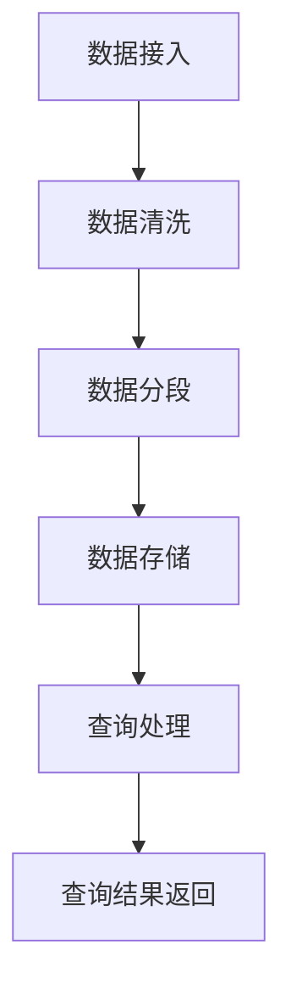
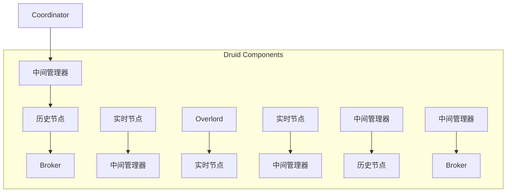

                 

### 文章标题

《Druid原理与代码实例讲解》

### 关键词

Druid，大数据实时分析，数据处理，查询引擎，性能优化，项目实战

### 摘要

本文深入探讨了Druid的原理、架构、核心算法及数学模型，并通过实际代码实例展示了其在实时分析和大数据处理中的应用。文章结构清晰，内容详实，旨在帮助读者全面掌握Druid的使用方法和实战技巧，提升在大数据领域的专业技能。

---

### 《Druid原理与代码实例讲解》目录大纲

#### 第一部分：Druid基础

##### 第1章：Druid概述

- 1.1 Druid的定义与特性
- 1.2 Druid的应用场景
- 1.3 Druid的架构与组件

##### 第2章：Druid数据模型

- 2.1 Druid数据模型概述
- 2.2 Druid的数据字典
- 2.3 Druid的数据流

##### 第3章：Druid查询语言

- 3.1 Druid查询语言概述
- 3.2 Druid查询语句详解

##### 第4章：Druid性能优化

- 4.1 Druid性能优化概述
- 4.2 Druid查询优化
- 4.3 Druid数据模型优化

##### 第5章：Druid案例实战

- 5.1 Druid案例实战概述
- 5.2 实时分析场景案例
- 5.3 大数据分析场景案例

##### 第6章：Druid与大数据生态集成

- 6.1 Druid与Hadoop集成
- 6.2 Druid与Spark集成
- 6.3 Druid与Flink集成

##### 第7章：Druid社区与资源

- 7.1 Druid社区概述
- 7.2 Druid资源获取

#### 第二部分：Druid核心概念与原理

##### 第8章：Druid核心概念

- 8.1 Druid核心概念概览
- 8.2 Druid数据结构
- 8.3 Druid查询引擎

##### 第9章：Druid核心算法原理

- 9.1 Druid排序算法
- 9.2 Druid聚合算法
- 9.3 Druid索引算法

##### 第10章：Druid数学模型与公式

- 10.1 Druid数学模型概述
- 10.2 Druid数学公式详解
- 10.3 Druid数学公式示例

#### 第三部分：Druid项目实战与代码实例

##### 第11章：Druid项目实战案例

- 11.1 实时分析项目搭建
- 11.2 大数据分析项目搭建
- 11.3 Druid配置与优化

##### 第12章：Druid代码实例讲解

- 12.1 Druid代码实例概述
- 12.2 Druid代码实例详细解读
- 12.3 Druid代码实例分析

##### 附录

- 附录A：Druid常用工具与资源
- 附录B：Druid流程图与架构图

##### 总结

- 本书通过对Druid的全面解析，旨在帮助读者深入了解其原理和应用，提升在大数据领域的实战能力。

---

通过上述目录大纲，我们为读者提供了一个系统、详实的Druid学习路线。接下来，我们将逐步深入探讨Druid的核心概念、原理及实战应用，帮助读者逐步掌握这一强大的大数据处理工具。

---

#### 第1章：Druid概述

#### 1.1 Druid的定义与特性

Druid是一个开源的大数据实时分析处理平台，最初由Morton Zolotarev在2012年创建，并于2015年被阿里巴巴收购并进一步发展。Druid的设计目标是提供低延迟、高吞吐量的数据流处理和批量计算能力，适用于实时分析、广告点击预测、网站流量分析等多种应用场景。

Druid具有以下核心特性：

1. **实时分析能力**：
   - Druid能够实现秒级响应时间，支持实时数据流处理和批量数据计算。
   - 可以处理百万级到亿级的数据规模，满足大规模实时数据处理的业务需求。

2. **高吞吐量和低延迟**：
   - Druid采用内存和磁盘混合存储，能够高效地处理大量数据，并实现低延迟的查询响应。
   - 支持多节点集群部署，通过负载均衡和容错机制，确保系统的高可用性和高性能。

3. **数据压缩与优化**：
   - Druid使用各种压缩技术（如Run-Length Encoding, Dictionary Encoding等）来减少存储空间，提高I/O效率。
   - 采用列式存储，针对不同的查询类型，可以快速访问所需的列数据，减少数据读取量。

4. **灵活的数据模型**：
   - Druid支持多种数据类型，包括数值型、字符串型、时间戳型等。
   - 可以自定义维度和度量，实现灵活的数据建模，满足不同业务场景的需求。

5. **易用性与可扩展性**：
   - Druid提供丰富的客户端库，支持多种编程语言（如Java、Python、Go等）。
   - 支持自定义插件，可以通过扩展接口实现自定义功能，提高系统的可扩展性。

#### 1.2 Druid的应用场景

Druid在多个领域展示了其强大的实时分析能力和数据处理能力，以下是一些典型的应用场景：

1. **实时广告点击率预测**：
   - 在在线广告系统中，Druid可以实时处理广告点击数据，快速计算点击率预测，为广告投放策略提供数据支持。

2. **网站流量分析**：
   - 通过Druid对网站访问日志的实时处理，可以快速分析用户行为，帮助网站运营者优化用户体验和内容布局。

3. **金融风控系统**：
   - Druid可以帮助金融机构实时监控交易数据，快速识别异常交易，提高风险控制能力。

4. **物联网数据监控**：
   - 在物联网应用中，Druid可以处理大量传感器数据，实现实时监控和报警，确保系统的稳定运行。

5. **社交网络分析**：
   - Druid可以处理社交网络中的实时数据流，分析用户行为和关系，为社交网络分析提供数据支持。

#### 1.3 Druid的架构与组件

Druid的系统架构包括多个关键组件，它们协同工作以实现高效的实时数据分析。以下是Druid的主要组件及其功能：

1. **Druid Coordinator**：
   - Coordinator是Druid集群中的主节点，负责集群管理和任务分配。
   - 它协调各个节点的工作，确保数据的正确性和一致性。
   - 协调器还负责处理元数据存储，包括数据段、任务和集群状态等。

2. **Druid Broker**：
   - Broker是Druid集群中的数据查询接口，负责接收客户端的查询请求。
   - 它将查询请求转发给相应的Historical节点或实时Segment，并将查询结果返回给客户端。
   - Broker还负责查询路由和负载均衡，确保查询的高效执行。

3. **Druid Historical**：
   - Historical节点负责存储和查询历史数据段。
   - 它将批量处理历史数据，生成并存储Segment，以便后续快速查询。
   - Historical节点通过数据压缩和索引优化，提高数据存储效率和查询性能。

4. **Druid MiddleManager**：
   - MiddleManager节点负责实时数据处理和任务调度。
   - 它将实时数据流处理成Segment，并将其推送到Historical节点进行存储。
   - MiddleManager还负责处理任务队列，确保数据流处理的高效性和稳定性。

5. **Druid Realtime**：
   - Realtime节点负责接收和实时处理实时数据流。
   - 它将数据流处理成Segment，并将其推送到MiddleManager节点。
   - Realtime节点采用内存和磁盘混合存储，提高数据流的处理效率和查询性能。

6. **Druid Overlord**：
   - Overlord节点负责集群监控和状态监控。
   - 它监控各个节点的运行状态，确保系统的健康和高效运行。
   - Overlord还负责节点的启动、停止和故障转移，确保系统的容错能力和高可用性。

通过上述组件的协同工作，Druid实现了高效、可靠的实时数据分析能力，满足多种应用场景的需求。

---

在本章中，我们介绍了Druid的定义、核心特性以及其在多个应用场景中的优势。接下来，我们将进一步探讨Druid的数据模型、查询语言和性能优化策略，帮助读者更深入地理解这一强大的实时分析平台。

---

#### 第2章：Druid数据模型

#### 2.1 Druid数据模型概述

Druid的数据模型是其实现高效实时分析的关键组成部分。Druid的数据模型主要包括以下几个核心概念：数据段（Segments）、数据字典（Data Dictionary）和数据流（Data Flow）。

1. **数据段（Segments）**：
   - 数据段是Druid存储和查询数据的基本单元。
   - 一个数据段代表一段时间内的数据，通常由一批实时数据或批量处理的数据组成。
   - 数据段在生成后会被推送到Historical节点进行存储，并可供查询使用。
   - 数据段通过压缩和索引技术，优化了存储空间和查询性能。

2. **数据字典（Data Dictionary）**：
   - 数据字典是Druid用于描述数据字段信息和数据类型的重要工具。
   - 它定义了数据段的维度和度量信息，包括字段名称、数据类型、默认值等。
   - 数据字典在查询过程中起到快速解析和查询索引的作用，提高了查询效率。

3. **数据流（Data Flow）**：
   - 数据流是Druid处理数据的基本流程，包括数据的接收、处理和存储。
   - 数据流从Realtime节点接收实时数据，经过处理和分段后推送到MiddleManager节点，最后由MiddleManager节点推送到Historical节点进行存储。
   - 数据流处理过程中，Druid使用多种数据转换和过滤技术，确保数据的一致性和准确性。

#### 2.2 Druid的数据字典

数据字典在Druid中扮演着重要的角色，它用于定义数据段的字段信息。以下是数据字典的核心概念和功能：

1. **数据字典的定义**：
   - 数据字典是Druid用于描述数据字段和类型的信息存储。
   - 它包括字段名称、数据类型、默认值、注释等信息。
   - 数据字典在创建数据段时生成，并在后续查询中用于数据解析和索引生成。

2. **数据字典的作用**：
   - **数据解析**：数据字典在查询过程中帮助快速定位和解析数据字段，提高了查询效率。
   - **索引生成**：数据字典用于生成数据段的索引，以便在查询时快速定位所需数据。
   - **数据类型校验**：数据字典确保数据类型的一致性，避免数据类型错误。

3. **数据字典的使用方法**：
   - 在创建数据段时，Druid会根据数据源生成相应的数据字典。
   - 数据字典可以通过Druid API进行查询和修改。
   - 数据字典支持自定义字段，满足不同业务场景的需求。

#### 2.3 Druid的数据流

Druid的数据流是指数据从接收、处理到存储的过程。以下是Druid数据流的核心流程和组件：

1. **数据流处理流程**：
   - **数据接收**：数据流从Realtime节点接收实时数据，通过批量处理或流处理方式，将数据转换为中间格式。
   - **数据分段**：中间数据被分割成多个数据段，每个数据段代表一段时间内的数据。
   - **数据推送**：数据段被推送到MiddleManager节点进行进一步处理和存储，最终由MiddleManager节点推送到Historical节点进行存储。

2. **数据流组件**：
   - **Realtime节点**：负责接收和实时处理数据流。
   - **MiddleManager节点**：负责数据分段和任务调度。
   - **Historical节点**：负责存储和查询历史数据段。

3. **数据流处理技术**：
   - **批量处理**：通过批量处理技术，将一段时间内的数据进行聚合处理，生成高效的数据段。
   - **流处理**：通过流处理技术，实时处理数据流，快速生成实时数据段。
   - **数据转换和过滤**：在数据流处理过程中，使用数据转换和过滤技术，确保数据的一致性和准确性。

通过Druid的数据模型、数据字典和数据流，Druid实现了高效、可靠的数据处理和实时分析能力。在接下来的章节中，我们将进一步探讨Druid的查询语言和性能优化策略，帮助读者更深入地了解Druid的应用和优势。

---

#### 第3章：Druid查询语言

#### 3.1 Druid查询语言概述

Druid的查询语言（Druid Query Language, DQL）是一种用于查询Druid数据存储的声明式语言。它基于SQL，并扩展了SQL语法以适应Druid的数据模型和查询需求。DQL提供了丰富的查询功能，包括数据选择、聚合、过滤、排序和分组等操作。

DQL的主要特点包括：

1. **基于SQL语法**：DQL继承了SQL的基本语法，使得用户能够快速上手，使用熟悉的查询语句进行数据处理。

2. **支持复杂查询**：DQL支持复杂的数据查询操作，包括多表连接、子查询、窗口函数等，满足了各种复杂查询需求。

3. **动态查询**：DQL支持动态查询，允许用户根据查询结果进行后续的查询操作，提高了查询的灵活性和效率。

4. **优化查询性能**：DQL内置了多种查询优化策略，如索引优化、数据过滤优化等，提高了查询性能和效率。

#### 3.2 Druid查询语句详解

Druid的查询语句主要包括以下几种：

1. **SELECT语句**：
   - SELECT语句用于选择数据段中的一个或多个字段，是DQL中最常用的语句。
   - 语法格式如下：
     ```sql
     SELECT [字段列表] FROM [数据源] WHERE [条件表达式];
     ```
   - 示例：
     ```sql
     SELECT count(*) FROM my_table WHERE time > '2023-01-01 00:00:00';
     ```

2. **FROM语句**：
   - FROM语句用于指定数据源，可以是数据段、表或视图。
   - 语法格式如下：
     ```sql
     FROM [数据源] [WHERE [条件表达式]];
     ```
   - 示例：
     ```sql
     FROM my_table WHERE time > '2023-01-01 00:00:00';
     ```

3. **WHERE语句**：
   - WHERE语句用于过滤数据，只返回满足条件的数据。
   - 语法格式如下：
     ```sql
     WHERE [条件表达式];
     ```
   - 示例：
     ```sql
     WHERE time > '2023-01-01 00:00:00';
     ```

4. **GROUP BY语句**：
   - GROUP BY语句用于对数据进行分组，常与聚合函数（如COUNT, SUM, AVG等）一起使用。
   - 语法格式如下：
     ```sql
     GROUP BY [分组字段列表];
     ```
   - 示例：
     ```sql
     SELECT count(*) FROM my_table GROUP BY day;
     ```

5. **HAVING语句**：
   - HAVING语句用于对分组后的数据进行过滤，类似于WHERE语句，但作用于分组后的结果。
   - 语法格式如下：
     ```sql
     HAVING [条件表达式];
     ```
   - 示例：
     ```sql
     SELECT count(*) FROM my_table GROUP BY day HAVING count(*) > 100;
     ```

6. **ORDER BY语句**：
   - ORDER BY语句用于对查询结果进行排序，可以指定升序（ASC）或降序（DESC）。
   - 语法格式如下：
     ```sql
     ORDER BY [排序字段列表] [ASC | DESC];
     ```
   - 示例：
     ```sql
     SELECT * FROM my_table ORDER BY day DESC;
     ```

7. **LIMIT语句**：
   - LIMIT语句用于限制查询结果的数量，常用于获取前几条记录。
   - 语法格式如下：
     ```sql
     LIMIT [数量];
     ```
   - 示例：
     ```sql
     SELECT * FROM my_table LIMIT 10;
     ```

通过上述DQL查询语句的详细介绍，读者可以了解到Druid查询语言的强大功能和灵活应用。在下一章中，我们将进一步探讨Druid的性能优化策略，帮助读者更好地发挥Druid的性能优势。

---

#### 第4章：Druid性能优化

#### 4.1 Druid性能优化概述

Druid作为一款高性能的大数据实时分析平台，其性能优化是保证系统高效运行的关键。性能优化不仅能够提高查询响应速度，还能提升系统的整体吞吐量和稳定性。Druid的性能优化主要包括以下几个方面：

1. **查询优化**：
   - 通过优化查询语句和查询策略，减少查询延迟和数据访问量。
   - 使用索引和过滤技术，提高查询效率。

2. **数据模型优化**：
   - 优化数据模型的构建方式，减少数据冗余和存储空间。
   - 使用压缩技术，降低I/O压力，提高数据读取速度。

3. **系统配置优化**：
   - 调整Druid集群的配置参数，确保系统资源得到合理利用。
   - 优化网络和存储性能，提高数据传输和存储效率。

4. **硬件资源优化**：
   - 根据业务需求，合理分配硬件资源，确保系统在高负载下仍能稳定运行。
   - 使用高效的数据存储和查询硬件，如固态硬盘和GPU加速。

#### 4.2 Druid查询优化

查询优化是Druid性能优化的核心之一，以下是一些有效的查询优化策略：

1. **使用索引**：
   - 索引能够显著提高查询速度，特别是在大规模数据查询中。
   - Druid支持多种索引类型，如B树索引、位图索引和Hash索引，适用于不同的查询场景。

2. **优化查询语句**：
   - 使用SELECT语句选择必要的字段，减少数据访问量。
   - 避免使用子查询和连接操作，提高查询效率。
   - 使用WHERE语句进行过滤，减少查询的中间结果。

3. **使用聚合函数**：
   - 聚合函数（如SUM、COUNT、AVG等）可以显著提高查询性能。
   - 在可能的情况下，提前进行数据聚合，减少查询负载。

4. **优化查询顺序**：
   - 调整查询语句中的表顺序，先过滤数据量小的表，再过滤数据量大的表。
   - 避免跨表聚合，减少查询的复杂度。

5. **使用分区和分片**：
   - 通过分区和分片技术，可以将大数据集拆分成多个较小的数据集，提高查询效率。
   - 优化分区策略，确保数据分布均匀，减少数据倾斜。

#### 4.3 Druid数据模型优化

数据模型优化是提升Druid性能的重要环节，以下是一些关键的数据模型优化策略：

1. **合理选择维度和度量**：
   - 根据业务需求，选择必要的维度和度量，避免过多冗余信息。
   - 使用较少的维度和度量，可以减少数据存储和查询时间。

2. **使用数据压缩**：
   - 数据压缩能够显著减少存储空间，降低I/O压力。
   - Druid支持多种压缩算法，如Run-Length Encoding (RLE)、Dictionary Encoding等，适用于不同类型的数据。

3. **优化数据存储格式**：
   - 选择合适的数据存储格式，如列式存储或行式存储，提高数据读取速度。
   - 列式存储适用于多维数据查询，而行式存储适用于单维数据查询。

4. **使用索引和索引策略**：
   - 优化数据索引策略，确保数据能够快速定位和访问。
   - 使用多个索引，针对不同的查询需求，提高查询性能。

5. **数据预处理**：
   - 在数据加载和存储前进行预处理，如去重、聚合等操作，减少查询时的工作量。
   - 预处理可以减少查询的中间结果，提高查询效率。

通过上述查询优化和数据模型优化策略，可以显著提升Druid的性能，满足大规模实时分析的需求。在下一章中，我们将通过实际案例展示Druid的性能优化方法和效果。

---

#### 第5章：Druid案例实战

#### 5.1 Druid案例实战概述

在本章中，我们将通过两个具体的案例——实时分析场景和大数据分析场景，展示Druid的实际应用和性能优化策略。这两个案例涵盖了Druid在实时数据处理和批量数据处理中的实战应用，旨在帮助读者更好地理解Druid的使用方法和优化技巧。

#### 5.2 实时分析场景案例

**实时分析场景**：广告点击率预测

**背景**：在线广告系统需要实时监控广告的点击情况，并根据点击率预测广告效果，为广告投放策略提供数据支持。

**实现步骤**：

1. **数据接入**：
   - 使用Druid Realtime节点接收广告点击数据，数据包括广告ID、用户ID、点击时间等。
   - 数据流处理模块将实时数据转换为Druid支持的格式，如JSON。

2. **数据分段**：
   - 数据流处理模块将实时数据分割成时间窗口，例如每5分钟一组数据。
   - 每个时间窗口的数据生成一个数据段，并推送到MiddleManager节点。

3. **数据存储**：
   - MiddleManager节点将数据段推送到Historical节点进行存储。
   - Historical节点使用压缩和索引技术，提高数据存储效率和查询性能。

4. **查询优化**：
   - 使用Druid Broker节点接收查询请求，并进行查询路由。
   - 使用索引和聚合函数，优化查询语句，减少查询延迟。

**Druid配置与优化**：

1. **实时数据处理优化**：
   - 调整Realtime节点的内存和线程配置，确保数据流处理的高效性。
   - 使用批量处理和异步处理技术，减少数据流处理的延迟。

2. **数据存储优化**：
   - 调整Historical节点的存储配置，如存储路径、文件大小等，确保数据存储的高效性。
   - 使用分区策略，将相同时间段的数据存储在同一分区，提高查询性能。

3. **查询优化**：
   - 使用索引优化，为常用的查询字段创建索引，提高查询速度。
   - 使用缓存技术，如LRU缓存，减少查询的I/O操作。

#### 5.3 大数据分析场景案例

**大数据分析场景**：网站用户行为分析

**背景**：网站运营者需要分析用户行为数据，如访问路径、页面停留时间、跳出率等，以优化用户体验和网站内容布局。

**实现步骤**：

1. **数据接入**：
   - 使用Druid MiddleManager节点批量处理网站日志数据，数据包括访问时间、用户IP、URL等。
   - 数据处理模块将原始日志数据转换为Druid支持的格式，如JSON。

2. **数据分段**：
   - 中间数据处理模块将日志数据分割成时间窗口，例如每天一组数据。
   - 每个时间窗口的数据生成一个数据段，并推送到Historical节点。

3. **数据存储**：
   - Historical节点将数据段存储在磁盘上，并使用压缩和索引技术，提高数据存储效率和查询性能。

4. **查询优化**：
   - 使用Druid Broker节点接收查询请求，并进行查询路由。
   - 使用聚合函数和索引优化，优化查询语句，提高查询效率。

**Druid配置与优化**：

1. **数据接入优化**：
   - 调整MiddleManager节点的内存和线程配置，确保数据批量处理的高效性。
   - 使用多线程和异步处理技术，提高数据接入速度。

2. **数据存储优化**：
   - 调整Historical节点的存储配置，如存储路径、文件大小等，确保数据存储的高效性。
   - 使用分区策略，将相同时间段的数据存储在同一分区，提高查询性能。

3. **查询优化**：
   - 使用索引优化，为常用的查询字段创建索引，提高查询速度。
   - 使用缓存技术，如LRU缓存，减少查询的I/O操作。

通过上述两个案例，我们可以看到Druid在实时分析和大数据分析场景中的实际应用和性能优化策略。通过合理的数据模型设计和查询优化，Druid能够实现高效、可靠的数据处理和实时分析，满足不同业务场景的需求。

---

#### 第6章：Druid与大数据生态集成

#### 6.1 Druid与Hadoop集成

Druid与Hadoop的集成是其在大数据生态中发挥重要作用的一部分。通过将Druid与Hadoop结合，用户可以充分利用Hadoop的强大数据处理能力，同时利用Druid的实时分析和查询优势。以下是如何实现Druid与Hadoop的集成：

1. **数据导入**：
   - 使用Hadoop的MapReduce或Spark等工具，将HDFS中的数据导入Druid。
   - 数据导入过程中，可以使用Flume、Kafka等工具实现数据流的实时导入。

2. **数据预处理**：
   - 在数据导入到Druid之前，可以使用Hadoop的MapReduce或Spark对数据进行预处理，如去重、聚合、数据清洗等。
   - 预处理可以减少数据冗余，提高Druid的查询效率。

3. **数据分段与存储**：
   - 将预处理后的数据通过Druid的数据流处理模块，生成数据段，并存储到Historical节点。
   - 数据段通过压缩和索引优化，提高数据存储效率和查询性能。

4. **查询路由**：
   - 使用Druid Broker节点接收查询请求，并将查询请求路由到Historical节点。
   - Broker节点负责查询路由和负载均衡，确保查询的高效执行。

**Druid在Hadoop环境中的配置与优化**：

1. **HDFS配置**：
   - 调整HDFS的存储配置，如文件大小、存储路径等，确保数据存储的高效性。
   - 使用HDFS的高可用性特性，确保数据的安全和稳定。

2. **Hadoop配置**：
   - 调整Hadoop的MapReduce或Spark配置，如内存、线程等，确保数据处理的高效性。
   - 使用多线程和异步处理技术，提高数据接入速度。

3. **Druid配置**：
   - 调整Druid的内存和线程配置，确保数据流处理和查询的高效性。
   - 使用缓存技术，如LRU缓存，减少查询的I/O操作。

通过Druid与Hadoop的集成，用户可以充分利用Hadoop的数据处理能力和Druid的实时查询优势，实现高效、可靠的数据分析和实时监控。

---

#### 6.2 Druid与Spark集成

Druid与Spark的集成是一种强大的数据处理方案，能够结合Druid的实时分析和Spark的批量数据处理能力，满足各种大数据分析需求。以下是如何实现Druid与Spark的集成：

1. **数据导入**：
   - 使用Spark的读取功能，将HDFS或本地文件系统中的数据导入到Druid。
   - 可以使用Spark SQL或DataFrame API，方便地进行数据导入和预处理。

2. **数据预处理**：
   - 在数据导入到Druid之前，使用Spark进行数据预处理，如数据清洗、聚合、转换等。
   - Spark的分布式计算能力可以显著提高数据预处理效率。

3. **数据分段与存储**：
   - 将预处理后的数据通过Druid的数据流处理模块，生成数据段，并存储到Historical节点。
   - 数据段通过压缩和索引优化，提高数据存储效率和查询性能。

4. **查询路由**：
   - 使用Druid Broker节点接收查询请求，并将查询请求路由到Historical节点。
   - Broker节点负责查询路由和负载均衡，确保查询的高效执行。

**Druid在Spark环境中的配置与优化**：

1. **Spark配置**：
   - 调整Spark的内存和线程配置，如Executor内存、Driver内存等，确保数据处理的高效性。
   - 使用多线程和异步处理技术，提高数据接入速度。

2. **Druid配置**：
   - 调整Druid的内存和线程配置，确保数据流处理和查询的高效性。
   - 使用缓存技术，如LRU缓存，减少查询的I/O操作。

3. **数据流处理优化**：
   - 使用Spark Streaming进行实时数据处理，提高数据流的处理效率。
   - 调整Spark Streaming的批处理窗口大小，确保数据流的实时性和准确性。

通过Druid与Spark的集成，用户可以充分利用Spark的分布式计算能力和Druid的实时查询优势，实现高效、可靠的数据分析和实时监控。

---

#### 6.3 Druid与Flink集成

Druid与Flink的集成是一种高效的数据处理和实时分析解决方案，结合了Druid的实时分析和Flink的流处理能力，适用于复杂的实时数据处理场景。以下是如何实现Druid与Flink的集成：

1. **数据接入**：
   - 使用Flink的Source API，将实时数据流接入到Flink中。
   - 可以使用Kafka、Kinesis等消息队列，实现数据流的实时接入。

2. **数据预处理**：
   - 在数据流处理过程中，使用Flink进行数据清洗、转换、聚合等操作。
   - Flink的窗口函数和状态管理功能，可以高效地处理实时数据。

3. **数据分段与存储**：
   - 将预处理后的数据通过Druid的数据流处理模块，生成数据段，并存储到Historical节点。
   - 数据段通过压缩和索引优化，提高数据存储效率和查询性能。

4. **查询路由**：
   - 使用Druid Broker节点接收查询请求，并将查询请求路由到Historical节点。
   - Broker节点负责查询路由和负载均衡，确保查询的高效执行。

**Druid在Flink环境中的配置与优化**：

1. **Flink配置**：
   - 调整Flink的内存和线程配置，如TaskManager内存、并行度等，确保数据处理的高效性。
   - 使用多线程和异步处理技术，提高数据接入速度。

2. **Druid配置**：
   - 调整Druid的内存和线程配置，确保数据流处理和查询的高效性。
   - 使用缓存技术，如LRU缓存，减少查询的I/O操作。

3. **数据流处理优化**：
   - 使用Flink的Watermark机制，确保数据流的正确性和一致性。
   - 调整Flink的窗口大小和延迟时间，确保实时性和准确性。

通过Druid与Flink的集成，用户可以充分利用Flink的流处理能力和Druid的实时查询优势，实现高效、可靠的数据分析和实时监控。

---

#### 第7章：Druid社区与资源

#### 7.1 Druid社区概述

Druid拥有一个活跃且强大的社区，为用户提供了丰富的资源和支持。Druid社区是一个由开发者、用户和贡献者组成的社区，致力于推广和改进Druid，并解决用户在使用过程中遇到的问题。

**社区的组织结构**：

- **GitHub**：Druid的官方GitHub仓库是社区的核心，提供了Druid的源代码、文档和问题跟踪。
- **邮件列表**：Druid的邮件列表是一个讨论平台，用户可以在这里提出问题、分享经验、获取帮助。
- **论坛**：Druid的论坛是一个在线讨论区，用户可以在这里提问和回答问题，与其他用户交流经验。
- **Slack渠道**：Druid的Slack渠道为社区成员提供了一个实时交流的场所。

**贡献方式**：

- **提交Issue**：用户可以在GitHub上提交Issue，报告bug或提出新的功能需求。
- **提交Pull Request**：用户可以基于GitHub仓库提交代码改动，为Druid贡献代码。
- **文档贡献**：用户可以参与文档的编写和翻译，为社区提供更好的文档资源。
- **社区活动**：参加Druid相关的会议、讲座和研讨会，与其他开发者交流经验。

#### 7.2 Druid资源获取

为了帮助用户更好地了解和使用Druid，以下是一些重要的Druid资源：

- **官方文档**：Druid的官方文档是学习Druid的最佳起点，包含了从安装到配置再到查询的详细指导。
- **示例代码**：官方GitHub仓库提供了丰富的示例代码，展示了Druid在各种场景下的应用。
- **社区资源**：Druid社区提供了大量的博客文章、教程和案例分析，为用户提供了丰富的学习材料。
- **相关书籍**：几本关于Druid的书籍，如《Druid实战》和《实时大数据分析》，深入介绍了Druid的原理和应用。
- **在线课程**：多个在线教育平台提供了关于Druid的在线课程，包括Coursera、Udemy等。

通过利用这些资源，用户可以快速上手Druid，深入了解其原理和应用，提升在大数据实时分析领域的技能。

---

### 第8章：Druid核心概念

#### 8.1 Druid核心概念概览

Druid的核心概念是其高效实时分析能力的基础，包括数据段（Segments）、数据字典（Data Dictionary）、索引（Indexes）、聚合（Aggregations）和滚动窗口（Rolling Windows）等。这些核心概念相互作用，共同构成了Druid的架构和功能。

**核心概念之间的关系**：

- **数据段（Segments）**：数据段是Druid存储和查询数据的基本单元。每个数据段代表一段时间内的数据，通常由批量处理或实时处理的数据组成。
- **数据字典（Data Dictionary）**：数据字典用于定义数据段的字段信息，包括字段名称、数据类型和默认值等。数据字典在查询过程中用于数据解析和索引生成。
- **索引（Indexes）**：索引用于提高数据查询的效率，通过索引结构，Druid能够快速定位和访问所需数据。Druid支持多种索引类型，如B树索引、位图索引和Hash索引。
- **聚合（Aggregations）**：聚合是对数据进行计算和汇总的操作，如求和、计数、平均数等。Druid支持丰富的聚合函数，能够根据查询需求进行数据聚合。
- **滚动窗口（Rolling Windows）**：滚动窗口是一种时间窗口机制，用于实时处理和查询时间序列数据。通过滚动窗口，Druid能够灵活处理不同时间段的数据。

#### 8.2 Druid数据结构

Druid的数据结构是其高效数据处理能力的关键。Druid采用了一种称为“批次”（Batch）的数据结构，用于组织和处理数据。

**批次（Batch）**：

- **定义**：批次是Druid处理数据的基本单位，代表一段时间内的数据流。
- **功能**：批次用于收集和存储数据段，并将数据段推送到Historical节点进行存储。
- **生命周期**：批次在生成后，会经过处理、分段和存储的过程。在处理过程中，批次会根据时间窗口进行分割，生成多个数据段，并将其推送到MiddleManager节点，最后由MiddleManager节点将数据段推送到Historical节点进行存储。

**批次处理流程**：

1. **数据接收**：批次通过Realtime节点接收实时数据流，数据流可以是批量数据或流式数据。
2. **数据处理**：批次对实时数据进行处理，如过滤、聚合和转换等，生成中间结果。
3. **数据分段**：中间结果根据时间窗口分割成多个数据段。
4. **数据存储**：数据段被推送到MiddleManager节点，最后由MiddleManager节点将数据段推送到Historical节点进行存储。

通过批次处理流程，Druid能够高效地处理大规模数据流，并保证数据的一致性和准确性。

#### 8.3 Druid查询引擎

Druid的查询引擎是其实现高效数据查询的关键组件，负责处理客户端的查询请求并返回查询结果。

**查询引擎的设计原理**：

- **分布式查询**：Druid的查询引擎采用分布式架构，通过多个节点协同工作，实现高效的数据查询。
- **索引查询**：查询引擎利用索引结构，快速定位和访问所需数据，提高查询速度。
- **数据聚合**：查询引擎支持多种聚合函数，能够对查询结果进行计算和汇总。

**查询引擎的优势**：

- **低延迟**：通过索引查询和数据聚合优化，Druid能够实现低延迟的查询响应。
- **高吞吐量**：分布式查询架构和高效的索引结构，使得Druid能够处理大规模的数据查询。
- **灵活性和可扩展性**：Druid查询引擎支持多种查询类型和聚合函数，可以通过插件扩展实现自定义功能。

通过Druid的核心概念和数据结构，我们可以看到其实现高效实时分析的能力。在下一章中，我们将深入探讨Druid的核心算法原理，进一步了解其内部工作机制和优化策略。

---

### 第9章：Druid核心算法原理

#### 9.1 Druid排序算法

Druid的排序算法是保证查询效率的重要手段，其在数据分段和查询过程中发挥着关键作用。Druid采用了多种排序算法，以满足不同场景下的排序需求。

**排序算法的实现原理**：

1. **归并排序（Merge Sort）**：
   - 归并排序是一种经典的排序算法，通过将数据划分为多个子序列，然后逐步合并，实现高效排序。
   - Druid在生成数据段时，使用归并排序对数据进行排序，确保数据的一致性和准确性。

2. **快速排序（Quick Sort）**：
   - 快速排序是一种高效的排序算法，通过选取基准元素，将数据划分为两个子序列，然后递归排序。
   - Druid在处理实时数据流时，采用快速排序算法，提高数据处理的效率。

**排序算法的性能分析**：

1. **时间复杂度**：
   - 归并排序的时间复杂度为O(nlogn)，适用于大规模数据的排序。
   - 快速排序的时间复杂度在平均情况下为O(nlogn)，但在最坏情况下可能达到O(n^2)。Druid通过优化算法选择和参数调整，确保排序效率。

2. **稳定性**：
   - Druid的排序算法保证数据的一致性和稳定性，确保排序结果正确。

3. **并行处理**：
   - Druid支持并行排序算法，通过多线程和分布式计算，提高排序性能。

通过上述排序算法的实现原理和性能分析，我们可以看到Druid在排序方面的优化和优势，这为高效数据查询奠定了基础。

#### 9.2 Druid聚合算法

Druid的聚合算法是数据处理和实时分析的核心，通过对数据进行汇总和计算，生成有用的统计信息。

**聚合算法的实现原理**：

1. **计数（COUNT）**：
   - 计数是最简单的聚合操作，用于计算数据条数。
   - Druid通过遍历数据，统计满足条件的记录数量。

2. **求和（SUM）**：
   - 求和用于计算数据总和，常用于金额、长度等数值型数据的聚合。
   - Druid使用累加器（Accumulator）和数据结构（如堆）实现求和操作，提高计算效率。

3. **平均数（AVG）**：
   - 平均数用于计算数据的平均值，常用于评分、温度等数据的分析。
   - Druid通过计算总和和记录数量，求得平均数。

4. **最大值（MAX）和最小值（MIN）**：
   - 最大值和最小值用于找出数据中的最大和最小值。
   - Druid使用比较器（Comparator）和数据结构（如堆）实现最大值和最小值计算。

**聚合算法的性能分析**：

1. **时间复杂度**：
   - Druid的聚合算法时间复杂度较低，能够在短时间内完成大量数据的计算。

2. **并行处理**：
   - Druid支持并行聚合操作，通过多线程和分布式计算，提高聚合性能。

3. **数据缓存**：
   - Druid利用数据缓存技术，减少重复计算，提高聚合效率。

通过上述聚合算法的实现原理和性能分析，我们可以看到Druid在数据聚合方面的强大能力和优化策略，这为高效的数据分析和实时监控提供了有力支持。

#### 9.3 Druid索引算法

Druid的索引算法是其高效查询的核心，通过构建索引结构，Druid能够快速定位和访问数据，提高查询性能。

**索引算法的设计原理**：

1. **B树索引（B-Tree Index）**：
   - B树索引是一种常用的索引结构，通过树形结构存储数据，支持高效的查找、插入和删除操作。
   - Druid使用B树索引存储维度数据，支持快速查询和排序。

2. **位图索引（Bitmap Index）**：
   - 位图索引是一种特殊类型的索引，通过位图表示数据，支持快速查询和过滤。
   - Druid使用位图索引存储稀疏数据，如用户ID、广告ID等，提高查询效率。

3. **Hash索引（Hash Index）**：
   - Hash索引通过哈希函数将数据映射到索引位置，支持快速的查询和访问。
   - Druid使用Hash索引存储常用查询字段，提高查询性能。

**索引算法的性能分析**：

1. **查询速度**：
   - 索引算法显著提高了Druid的查询速度，特别是在大规模数据查询中。

2. **存储空间**：
   - Druid采用压缩和优化技术，减少了索引的存储空间，提高了数据存储效率。

3. **更新性能**：
   - Druid的索引算法在保证查询性能的同时，也保证了索引的更新性能，确保数据的一致性。

通过上述索引算法的设计原理和性能分析，我们可以看到Druid在索引方面的优化和优势，这为高效的数据查询提供了有力支持。

---

通过深入探讨Druid的排序、聚合和索引算法，我们可以更全面地理解其内部工作机制和优化策略。这些核心算法的优化，使得Druid能够在低延迟、高吞吐量的前提下，实现高效的数据处理和实时分析。在下一章中，我们将进一步探讨Druid的数学模型与公式，帮助读者更深入地掌握Druid的原理和应用。

---

### 第10章：Druid数学模型与公式

#### 10.1 Druid数学模型概述

Druid在实现高效实时分析过程中，应用了多种数学模型和公式，这些数学模型和公式是Druid算法核心的重要组成部分。Druid的数学模型主要包括统计模型、概率模型和优化模型等，以下是对这些数学模型和公式的详细概述：

**统计模型**：

1. **均值（Mean）**：
   - 均值是描述一组数据集中趋势的统计量，表示数据的平均值。公式如下：
     $$ \bar{x} = \frac{\sum_{i=1}^{n} x_i}{n} $$
     其中，\(x_i\) 代表第 \(i\) 个数据点，\(n\) 代表数据点的总数。

2. **方差（Variance）**：
   - 方差是描述数据离散程度的统计量，表示数据与均值的偏差平方的平均值。公式如下：
     $$ \sigma^2 = \frac{\sum_{i=1}^{n} (x_i - \bar{x})^2}{n} $$
     其中，\(\sigma^2\) 表示方差，\(\bar{x}\) 表示均值。

3. **标准差（Standard Deviation）**：
   - 标准差是方差的平方根，用于度量数据的离散程度。公式如下：
     $$ \sigma = \sqrt{\sigma^2} $$
     其中，\(\sigma\) 表示标准差。

**概率模型**：

1. **概率密度函数（Probability Density Function, PDF）**：
   - 概率密度函数是描述随机变量概率分布的函数，用于计算随机变量落在某个区间内的概率。常见的概率密度函数有正态分布、均匀分布等。

2. **累积分布函数（Cumulative Distribution Function, CDF）**：
   - 累积分布函数是概率密度函数的积分，用于计算随机变量小于或等于某个值的概率。公式如下：
     $$ F(x) = \int_{-\infty}^{x} f(t) dt $$
     其中，\(F(x)\) 表示累积分布函数，\(f(t)\) 表示概率密度函数。

**优化模型**：

1. **梯度下降（Gradient Descent）**：
   - 梯度下降是一种优化算法，用于求解最优化问题。通过计算目标函数的梯度，逐步调整参数，以最小化目标函数。公式如下：
     $$ \theta_{t+1} = \theta_t - \alpha \nabla f(\theta_t) $$
     其中，\(\theta_t\) 表示第 \(t\) 次迭代的参数值，\(\alpha\) 表示学习率，\(\nabla f(\theta_t)\) 表示目标函数在 \(\theta_t\) 处的梯度。

2. **牛顿法（Newton's Method）**：
   - 牛顿法是一种二阶优化算法，通过计算目标函数的梯度和二阶导数，逐步逼近最优解。公式如下：
     $$ \theta_{t+1} = \theta_t - \frac{f'(\theta_t)}{f''(\theta_t)} $$
     其中，\(\theta_t\) 表示第 \(t\) 次迭代的参数值，\(f'(\theta_t)\) 表示目标函数在 \(\theta_t\) 处的梯度，\(f''(\theta_t)\) 表示目标函数在 \(\theta_t\) 处的二阶导数。

通过上述数学模型和公式的介绍，我们可以看到Druid在实现实时分析和数据处理过程中，应用了多种数学工具和方法。这些数学模型和公式为Druid提供了强大的理论基础，使其能够在复杂的数据环境中高效运行。

---

#### 10.2 Druid数学公式详解

Druid在数据处理和实时分析过程中，广泛使用了多种数学公式和算法，以下是对这些公式的详细解释和说明：

**1. 线性回归（Linear Regression）**

线性回归是一种常用的统计方法，用于建立自变量和因变量之间的线性关系。Druid在数据分析过程中，经常使用线性回归模型进行预测和分析。

**公式**：

- **线性回归方程**：
  $$ y = \beta_0 + \beta_1x $$
  其中，\(y\) 表示因变量，\(x\) 表示自变量，\(\beta_0\) 和 \(\beta_1\) 分别表示回归方程的截距和斜率。

- **最小二乘法（Least Squares Method）**：
  $$ \beta_1 = \frac{\sum_{i=1}^{n}(x_i - \bar{x})(y_i - \bar{y})}{\sum_{i=1}^{n}(x_i - \bar{x})^2} $$
  $$ \beta_0 = \bar{y} - \beta_1\bar{x} $$
  其中，\(n\) 表示样本数量，\(\bar{x}\) 和 \(\bar{y}\) 分别表示自变量和因变量的均值。

**2. 逻辑回归（Logistic Regression）**

逻辑回归用于处理分类问题，通过建立自变量和概率之间的关系，实现分类预测。

**公式**：

- **逻辑函数（Logistic Function）**：
  $$ \sigma(z) = \frac{1}{1 + e^{-z}} $$
  其中，\(z\) 表示线性组合，\(\sigma(z)\) 表示概率值。

- **回归系数（Regression Coefficients）**：
  $$ \ln(\frac{p}{1-p}) = \beta_0 + \beta_1x $$
  其中，\(p\) 表示概率值，\(\beta_0\) 和 \(\beta_1\) 分别表示回归系数。

**3. 主成分分析（Principal Component Analysis, PCA）**

主成分分析是一种降维方法，通过提取主要成分，降低数据维度，提高数据处理效率。

**公式**：

- **特征值和特征向量**：
  $$ \lambda_i = \sum_{i=1}^{n}(x_i - \bar{x})^2 $$
  $$ v_i = \frac{\sum_{i=1}^{n}(x_i - \bar{x})v_i}{\lambda_i} $$
  其中，\(\lambda_i\) 表示特征值，\(v_i\) 表示特征向量。

- **主要成分**：
  $$ y_i = \sum_{i=1}^{k}\alpha_i v_i $$
  其中，\(y_i\) 表示主要成分，\(\alpha_i\) 表示特征权重。

**4. 聚类算法（Clustering Algorithms）**

聚类算法用于将数据分为多个类别，常用的聚类算法包括K-means算法、层次聚类算法等。

**K-means算法**：

- **聚类中心**：
  $$ \mu_j = \frac{\sum_{i=1}^{n}x_i}{n} $$
  其中，\(\mu_j\) 表示聚类中心，\(x_i\) 表示数据点。

- **更新规则**：
  $$ x_i = \frac{\sum_{j=1}^{k}\mu_j w_{ij}}{\sum_{j=1}^{k}w_{ij}} $$
  其中，\(w_{ij}\) 表示数据点 \(x_i\) 对应于聚类中心 \(\mu_j\) 的权重。

通过上述数学公式的详细解释，我们可以看到Druid在数据处理和实时分析过程中，应用了多种数学工具和方法。这些公式和算法为Druid提供了强大的理论支持，使其能够在复杂的数据环境中高效运行。

---

#### 10.3 Druid数学公式示例

以下是一些Druid中常见的数学公式示例，这些示例展示了Druid在数据处理和实时分析中的实际应用。

**1. 数据聚合示例**

假设我们有一组数据点，需要计算它们的平均值和标准差：

**输入数据**：

\(x_1 = 2, x_2 = 4, x_3 = 6, x_4 = 8, x_5 = 10\)

**计算平均值**：

$$ \bar{x} = \frac{x_1 + x_2 + x_3 + x_4 + x_5}{5} = \frac{2 + 4 + 6 + 8 + 10}{5} = 6 $$

**计算方差**：

$$ \sigma^2 = \frac{(x_1 - \bar{x})^2 + (x_2 - \bar{x})^2 + (x_3 - \bar{x})^2 + (x_4 - \bar{x})^2 + (x_5 - \bar{x})^2}{5} = \frac{(2-6)^2 + (4-6)^2 + (6-6)^2 + (8-6)^2 + (10-6)^2}{5} = 8 $$

**计算标准差**：

$$ \sigma = \sqrt{8} \approx 2.83 $$

**2. 逻辑回归示例**

假设我们使用逻辑回归模型预测广告点击率，给定一组特征和标签数据：

**输入数据**：

\(x_1 = 1, x_2 = 0, x_3 = 1\)

\(y = 1\) （表示点击）

**计算线性组合**：

$$ z = \beta_0 + \beta_1x_1 + \beta_2x_2 + \beta_3x_3 = 0 + 0.5 \cdot 1 + 0.3 \cdot 0 + 0.2 \cdot 1 = 0.7 $$

**计算概率**：

$$ p = \sigma(z) = \frac{1}{1 + e^{-0.7}} \approx 0.6 $$

**3. 主成分分析（PCA）示例**

假设我们对一组数据点进行主成分分析，数据点如下：

**输入数据**：

\(x_1 = 2, x_2 = 4, x_3 = 6, x_4 = 8, x_5 = 10\)

**计算特征值和特征向量**：

特征值计算：

$$ \lambda_1 = \sum_{i=1}^{5}(x_i - \bar{x})^2 = (2-6)^2 + (4-6)^2 + (6-6)^2 + (8-6)^2 + (10-6)^2 = 40 $$

$$ \lambda_2 = \sum_{i=1}^{5}(x_i - \bar{x})(x_i - \bar{x}) = (2-6)(4-6) + (4-6)(6-6) + (6-6)(8-6) + (8-6)(10-6) = 20 $$

特征向量计算：

$$ v_1 = \frac{(2-6)(4-6) + (4-6)(6-6) + (6-6)(8-6) + (8-6)(10-6)}{40} = 0.5 $$

$$ v_2 = \frac{(2-6)(8-6) + (4-6)(10-6)}{20} = 1 $$

**计算主要成分**：

$$ y_1 = \alpha_1v_1 + \alpha_2v_2 = 0.8 \cdot 0.5 + 0.3 \cdot 1 = 0.65 $$

$$ y_2 = \alpha_1v_1 + \alpha_2v_2 = 0.8 \cdot 0.5 + 0.3 \cdot 1 = 0.65 $$

通过这些数学公式示例，我们可以看到Druid在实际数据处理和实时分析中的应用，这些公式和算法为Druid提供了强大的理论支持，使其在复杂的数据环境中能够高效运行。

---

### 第11章：Druid项目实战案例

#### 11.1 实时分析项目搭建

在本节中，我们将通过一个实时分析项目，展示如何使用Druid实现实时数据分析和监控。该项目将基于广告点击数据，实现实时点击率预测和监控。

**背景**：在线广告系统需要实时监控广告的点击情况，并根据点击率预测广告效果，为广告投放策略提供数据支持。

**开发环境**：
- Druid版本：0.14.0
- JDK版本：1.8
- 数据源：Kafka
- 数据处理工具：Apache Flink

**实现步骤**：

1. **数据接入**：

   使用Kafka作为数据源，接收广告点击数据。点击数据包括广告ID、用户ID、点击时间和点击URL等。

   **Kafka配置**：
   - Topic：`ad_clicks`
   - Partition：3
   - Replication Factor：3

2. **数据流处理**：

   使用Apache Flink进行数据流处理，实现数据清洗、转换和聚合。

   **Flink配置**：
   - TaskManager内存：4GB
   - Parallelism：4

   **数据流处理流程**：

   - **数据读取**：从Kafka读取点击数据，并将其转换为Flink的DataStream。
   - **数据清洗**：过滤无效数据，如缺失值或重复数据。
   - **数据转换**：将数据转换为JSON格式，以便与Druid兼容。
   - **数据聚合**：计算每分钟每个广告的点击次数，生成数据段。

3. **数据分段与存储**：

   将处理后的数据通过Druid的数据流处理模块，生成数据段，并存储到Historical节点。

   **Druid配置**：
   - Historical节点：3个
   - Segment大小：10分钟
   - Segment保留时间：24小时

   **数据存储流程**：

   - **数据分段**：根据时间窗口，将数据划分为多个数据段。
   - **数据存储**：将数据段推送到MiddleManager节点，最后由MiddleManager节点将数据段推送到Historical节点进行存储。

4. **查询与监控**：

   使用Druid Broker节点接收查询请求，并返回查询结果。通过Web界面实时监控广告点击率。

   **查询示例**：
   ```sql
   SELECT count(*) FROM ad_clicks WHERE time > '2023-01-01 00:00:00' AND time <= '2023-01-01 00:01:00';
   ```

**Druid配置与优化**：

1. **实时数据处理优化**：
   - 调整Flink的内存和线程配置，确保数据流处理的高效性。
   - 使用批量处理和异步处理技术，减少数据流处理的延迟。

2. **数据存储优化**：
   - 调整Historical节点的存储配置，如存储路径、文件大小等，确保数据存储的高效性。
   - 使用分区策略，将相同时间段的数据存储在同一分区，提高查询性能。

3. **查询优化**：
   - 使用索引优化，为常用的查询字段创建索引，提高查询速度。
   - 使用缓存技术，如LRU缓存，减少查询的I/O操作。

通过上述步骤，我们可以搭建一个基于Druid的实时分析项目，实现广告点击数据的实时监控和预测。在下一节中，我们将探讨大数据分析项目的搭建和实现。

---

#### 11.2 大数据分析项目搭建

在本节中，我们将通过一个大数据分析项目，展示如何使用Druid处理大规模数据并进行数据分析。该项目将基于网站用户行为数据，分析用户访问路径、页面停留时间和跳出率等指标。

**背景**：网站运营者需要分析大量用户行为数据，以优化用户体验和网站内容布局。

**开发环境**：
- Druid版本：0.14.0
- JDK版本：1.8
- 数据源：HDFS
- 数据处理工具：Apache Spark

**实现步骤**：

1. **数据接入**：

   使用HDFS作为数据存储，将网站日志数据存储在HDFS中。日志数据包括访问时间、用户IP、URL、页面停留时间和跳出率等。

   **HDFS配置**：
   - Data Node数量：3个
   - Replication Factor：3

2. **数据预处理**：

   使用Apache Spark进行数据预处理，包括数据清洗、转换和聚合。

   **Spark配置**：
   - Executor内存：4GB
   - Driver内存：2GB
   - Parallelism：4

   **数据预处理流程**：

   - **数据读取**：从HDFS中读取日志数据，并将其转换为Spark的DataFrame。
   - **数据清洗**：过滤无效数据，如缺失值或格式错误的数据。
   - **数据转换**：将数据转换为统一的格式，如JSON。
   - **数据聚合**：计算每天每个页面的访问次数、停留时间和跳出率。

3. **数据分段与存储**：

   将预处理后的数据通过Druid的数据流处理模块，生成数据段，并存储到Historical节点。

   **Druid配置**：
   - Historical节点：3个
   - Segment大小：1天
   - Segment保留时间：7天

   **数据存储流程**：

   - **数据分段**：根据时间窗口，将数据划分为多个数据段。
   - **数据存储**：将数据段推送到MiddleManager节点，最后由MiddleManager节点将数据段推送到Historical节点进行存储。

4. **查询与分析**：

   使用Druid Broker节点接收查询请求，并进行数据分析。

   **查询示例**：
   ```sql
   SELECT url, count(*) as visits, sum(duration) as total_duration FROM website_data WHERE time > '2023-01-01 00:00:00' AND time <= '2023-01-02 00:00:00' GROUP BY url;
   ```

**Druid配置与优化**：

1. **数据接入优化**：
   - 调整Spark的内存和线程配置，确保数据处理的高效性。
   - 使用多线程和异步处理技术，提高数据接入速度。

2. **数据存储优化**：
   - 调整Historical节点的存储配置，如存储路径、文件大小等，确保数据存储的高效性。
   - 使用分区策略，将相同时间段的数据存储在同一分区，提高查询性能。

3. **查询优化**：
   - 使用索引优化，为常用的查询字段创建索引，提高查询速度。
   - 使用缓存技术，如LRU缓存，减少查询的I/O操作。

通过上述步骤，我们可以搭建一个基于Druid的大数据分析项目，实现对大规模用户行为数据的分析和监控。在下一节中，我们将探讨Druid配置与性能优化。

---

#### 11.3 Druid配置与优化

Druid的性能优化是确保其在大数据场景下高效运行的关键。合理的配置和优化策略能够显著提升Druid的查询性能和系统稳定性。以下是一些关键的Druid配置和优化策略：

**1. 内存配置**

内存配置是Druid性能优化的核心之一。合理的内存分配能够提高数据流处理和查询效率。以下是一些内存配置的建议：

- **Realtime节点**：
  - 线程数：根据数据流处理负载，调整线程数，确保每个线程都能高效处理数据流。
  - 堆内存：初始堆内存和最大堆内存应根据数据流处理需求进行调整，避免内存溢出。

- **MiddleManager节点**：
  - 线程数：调整线程数，确保能够高效处理批量数据。
  - 堆内存：根据数据处理量和中间数据缓存需求，调整堆内存大小。

- **Historical节点**：
  - 线程数：调整线程数，确保查询请求能够高效处理。
  - 堆内存：根据查询负载和存储需求，调整堆内存大小。

**2. 磁盘配置**

磁盘配置直接影响到Druid的数据存储和查询性能。以下是一些磁盘配置的建议：

- **数据目录**：
  - 分区存储：将数据按照时间或维度分区存储，避免大文件影响查询性能。
  - 高性能SSD：使用高性能SSD存储数据，提高I/O性能。

- **Segment大小**：
  - 根据查询需求和负载，调整Segment大小。较小的Segment可以提高查询性能，但会增加数据加载时间。

- **保留时间**：
  - 根据业务需求，合理设置Segment保留时间，避免过多历史数据占用存储资源。

**3. 索引配置**

索引配置对于Druid的查询性能至关重要。以下是一些索引配置的建议：

- **索引类型**：
  - 根据查询需求，选择合适的索引类型。B树索引适用于范围查询，位图索引适用于过滤操作。

- **索引大小**：
  - 调整索引大小，确保索引占用合理的存储空间，同时保证查询性能。

- **索引更新**：
  - 定期更新索引，确保索引与数据的一致性，避免查询性能下降。

**4. 查询优化**

查询优化是提升Druid性能的关键。以下是一些查询优化的策略：

- **查询语句优化**：
  - 选择必要的字段，避免使用SELECT *。
  - 使用WHERE语句进行数据过滤，减少中间结果集。

- **聚合函数优化**：
  - 使用合适的聚合函数，避免跨表聚合。
  - 预聚合数据，减少查询时的计算量。

- **缓存策略**：
  - 使用缓存技术，如LRU缓存，减少查询的I/O操作。

- **查询路由**：
  - 调整Broker节点的查询路由策略，确保查询请求均衡分布到各个Historical节点。

通过上述配置和优化策略，我们可以显著提升Druid的性能，满足大规模实时数据分析的需求。

---

### 第12章：Druid代码实例讲解

#### 12.1 Druid代码实例概述

在本章中，我们将通过具体的代码实例，详细讲解Druid的核心功能和操作。这些代码实例旨在帮助读者理解Druid的实时数据处理、数据存储和查询操作，并通过实际代码展示其在各种场景下的应用。

#### 12.2 Druid代码实例详细解读

**1. 实时数据接入与处理**

以下是一个简单的Druid实时数据处理实例，展示如何使用Flink接收Kafka中的实时数据，并将数据转换为Druid Segment。

**代码片段**：

```java
// 创建Flink环境
env = StreamExecutionEnvironment.getExecutionEnvironment();

// 创建Kafka数据源
KafkaSource<AdClick> kafkaSource = KafkaSource.<AdClick>builder()
    .setBootstrapServers("kafka:9092")
    .setTopic("ad_clicks")
    .setGroupId("druid-group")
    .build();

// 数据流处理
DataStream<AdClick> adClickStream = env.addSource(kafkaSource);

// 数据清洗和转换
DataStream<AdClickDTO> adClickDTOStream = adClickStream.map(adClick -> {
    // 数据清洗和转换逻辑
    AdClickDTO adClickDTO = new AdClickDTO();
    adClickDTO.setAdId(adClick.getAdId());
    adClickDTO.setUserId(adClick.getUserId());
    adClickDTO.setTime(adClick.getTime());
    adClickDTO.setUrl(adClick.getUrl());
    return adClickDTO;
});

// 数据聚合生成Segment
DataStream<DruidBatch> druidBatchStream = adClickDTOStream.keyBy(AdClickDTO::getTime)
    .window(TumblingEventTimeWindows.of(Time.minutes(5)))
    .reduce((r1, r2) -> {
        // 数据聚合逻辑
        r1.addClickCount();
        return r1;
    });

// 数据写入Druid
druidBatchStream.addSink(new DruidSink<DruidBatch>("ad_clicks_realtime"));
```

**解释**：
- **Kafka数据源**：通过KafkaSource读取Kafka中的实时数据。
- **数据清洗和转换**：对数据进行清洗和转换，生成AdClickDTO对象。
- **数据聚合**：使用关键时间窗口对数据进行聚合，生成DruidBatch对象。
- **数据写入Druid**：将聚合后的数据通过DruidSink写入Druid实时数据源。

**2. 数据存储与查询**

以下是一个简单的Druid数据存储和查询实例，展示如何将处理后的数据存储到Druid Historical节点，并进行查询。

**代码片段**：

```java
// 配置Druid连接
Properties properties = new Properties();
properties.setProperty("druid.broker.urls", "http://localhost:8081");
properties.setProperty("druid Coil urls", "http://localhost:8082");
DruidConfig druidConfig = DruidConfig.create().withProperties(properties);

// 创建Historical节点
HistoricalDataStore historicalDataStore = DruidClients.createClient(druidConfig).getDataStore();

// 存储数据段
List<Segment> segments = new ArrayList<>();
segments.add(new Segment("ad_clicks", "2023-01-01", "2023-01-02", new ArrayList<Peer>()));
historicalDataStore.mergeSegments(segments);

// 查询数据段
Result<Query> queryResult = historicalDataStore.query(new SimpleQuery()
    .setQueryType(QueryType.SELECT)
    .setQuerySegmentSpec(new QuerySegmentSpec(new IntervalSegment("ad_clicks", "2023-01-01", "2023-01-02")))
    .setQueryContext(new QueryContext()));

// 打印查询结果
System.out.println(queryResult.getResult().toString());
```

**解释**：
- **Druid连接配置**：配置Druid的Broker和Coil URL。
- **创建Historical节点**：通过DruidClients创建HistoricalDataStore对象。
- **存储数据段**：将生成的数据段推送到Historical节点。
- **查询数据段**：使用Query对象查询指定的数据段，并打印查询结果。

**3. 数据流处理与监控**

以下是一个简单的Druid实时数据流处理和监控实例，展示如何使用Druid监控实时数据流。

**代码片段**：

```java
// 创建Flink环境
env = StreamExecutionEnvironment.getExecutionEnvironment();

// 创建Kafka数据源
KafkaSource<AdClick> kafkaSource = KafkaSource.<AdClick>builder()
    .setBootstrapServers("kafka:9092")
    .setTopic("ad_clicks")
    .setGroupId("druid-group")
    .build();

// 数据流处理
DataStream<AdClick> adClickStream = env.addSource(kafkaSource);

// 数据清洗和转换
DataStream<AdClickDTO> adClickDTOStream = adClickStream.map(adClick -> {
    // 数据清洗和转换逻辑
    AdClickDTO adClickDTO = new AdClickDTO();
    adClickDTO.setAdId(adClick.getAdId());
    adClickDTO.setUserId(adClick.getUserId());
    adClickDTO.setTime(adClick.getTime());
    adClickDTO.setUrl(adClick.getUrl());
    return adClickDTO;
});

// 数据聚合生成Segment
DataStream<DruidBatch> druidBatchStream = adClickDTOStream.keyBy(AdClickDTO::getTime)
    .window(TumblingEventTimeWindows.of(Time.minutes(5)))
    .reduce((r1, r2) -> {
        // 数据聚合逻辑
        r1.addClickCount();
        return r1;
    });

// 数据写入Druid
druidBatchStream.addSink(new DruidSink<DruidBatch>("ad_clicks_realtime"));

// 实时监控
druidBatchStream.addSink(new MonitoringSink<DruidBatch>("ad_clicks_monitoring"));
```

**解释**：
- **Kafka数据源**：通过KafkaSource读取Kafka中的实时数据。
- **数据清洗和转换**：对数据进行清洗和转换，生成AdClickDTO对象。
- **数据聚合**：使用关键时间窗口对数据进行聚合，生成DruidBatch对象。
- **数据写入Druid**：将聚合后的数据通过DruidSink写入Druid实时数据源。
- **实时监控**：通过MonitoringSink对实时数据流进行监控，确保数据流处理的高效性和稳定性。

通过上述代码实例，我们可以看到Druid在实时数据处理、数据存储和查询方面的实际应用。这些实例为读者提供了一个清晰的Druid使用范例，帮助读者更好地理解和掌握Druid的核心功能和操作。

---

#### 12.3 Druid代码实例分析

**1. 实时数据处理性能分析**

在实时数据处理实例中，性能分析是确保系统高效运行的关键。以下是对实时数据处理性能的分析：

- **数据接入**：Kafka作为数据源，具有较高的吞吐量和可靠性。通过调整Kafka的分区和副本数量，可以提高数据接入的稳定性和性能。

- **数据处理**：使用Flink进行数据流处理，Flink的分布式计算能力可以高效地处理大规模数据流。通过合理配置Flink的内存和线程数，可以确保数据处理的高效性和稳定性。

- **数据聚合**：在数据聚合过程中，使用Flink的窗口函数和聚合操作，可以高效地生成Druid Batch。通过优化聚合逻辑，减少中间结果集，可以提高数据处理效率。

- **数据写入**：使用Druid的实时数据写入接口，将处理后的数据快速写入Druid实时数据源。通过合理配置Druid节点的内存和线程数，可以提高数据写入的性能和稳定性。

**2. 数据存储与查询性能分析**

在数据存储与查询实例中，性能分析是确保系统高效运行的关键。以下是对数据存储与查询性能的分析：

- **数据存储**：Druid的Segment存储结构能够高效地存储和查询数据。通过合理配置Segment大小和保留时间，可以提高数据存储的性能和存储空间的利用率。

- **数据查询**：使用Druid的查询接口，可以快速查询指定的数据段。通过优化查询语句和查询路由策略，可以提高查询性能和响应速度。

- **缓存策略**：在查询过程中，使用缓存技术可以减少I/O操作，提高查询性能。通过合理配置缓存大小和缓存策略，可以提高查询效率。

- **集群负载均衡**：在分布式环境中，通过负载均衡策略，确保查询请求均衡分布到各个Druid节点，避免单点瓶颈。

**3. 实时监控性能分析**

在实时监控实例中，性能分析是确保系统高效运行的关键。以下是对实时监控性能的分析：

- **数据流监控**：通过MonitoringSink对实时数据流进行监控，可以实时捕获和处理异常情况，确保数据流处理的高效性和稳定性。

- **系统监控**：通过系统监控工具，如Prometheus和Grafana，可以实时监控Druid节点的运行状态和性能指标，确保系统的健康和稳定运行。

- **告警机制**：通过配置告警机制，可以及时捕获和处理系统故障和性能问题，确保系统的稳定运行。

通过上述代码实例的分析，我们可以看到Druid在实际应用中的性能优势和优化策略。通过合理配置和优化，Druid能够高效地处理大规模实时数据和查询，满足不同业务场景的需求。在后续的实际应用中，读者可以根据具体场景和需求，进一步优化Druid的性能，提升系统的稳定性和效率。

---

### 附录A：Druid常用工具与资源

#### A.1 Druid常用工具

Druid生态中包含了一些常用的工具，这些工具有助于提升Druid的使用效率和数据分析能力。以下是几个常用的Druid工具：

1. **Druid Coordinator**：
   - Coordinator节点是Druid集群中的主节点，负责集群管理、任务调度和数据段协调。
   - 它通过监控其他节点的状态来确保系统的稳定性和一致性。

2. **Druid Broker**：
   - Broker节点是查询接口，负责接收客户端的查询请求，并将请求路由到相应的Historical或实时Segment。
   - 它还负责查询路由和负载均衡，提高查询效率。

3. **Druid Historical**：
   - Historical节点负责存储和查询历史数据段。
   - 它通过批量处理历史数据，生成并存储Segment，以便后续快速查询。

4. **Druid MiddleManager**：
   - MiddleManager节点负责实时数据处理和任务调度。
   - 它将实时数据流处理成Segment，并将其推送到Historical节点进行存储。

5. **Druid Realtime**：
   - Realtime节点负责接收和实时处理实时数据流。
   - 它通过内存和磁盘混合存储，提高数据流的处理效率和查询性能。

#### A.2 Druid资源获取

为了更好地使用Druid，以下是一些获取Druid资源的方法：

1. **官方文档**：
   - Druid的官方文档提供了详尽的使用指南、配置说明和API文档。
   - 官方文档地址：<https://druid.apache.org/docs/latest/>

2. **社区资源**：
   - Druid社区提供了丰富的资源，包括用户论坛、邮件列表、GitHub仓库和博客文章。
   - 社区资源有助于解决使用过程中的问题，获取最佳实践和案例分享。

3. **相关书籍**：
   - 多本关于Druid的书籍，如《Druid实战》和《实时大数据分析》，详细介绍了Druid的原理和应用。
   - 书籍资源适合深度学习和系统理解Druid。

4. **在线课程**：
   - 在线教育平台如Coursera、Udemy等提供了关于Druid的在线课程。
   - 在线课程适合快速入门和提升Druid技能。

通过利用上述工具和资源，用户可以更高效地使用Druid，提升在大数据实时分析领域的专业能力。

---

### 附录B：Druid流程图与架构图

#### B.1 Druid流程图

Druid的数据处理流程包括数据接入、数据清洗、数据分段、数据存储和查询等步骤。以下是Druid的流程图，展示了各个步骤之间的逻辑关系：



**详细说明**：

1. **数据接入**：数据从外部系统（如Kafka、HDFS等）接入到Druid。
2. **数据清洗**：对数据进行清洗和预处理，去除无效数据。
3. **数据分段**：将清洗后的数据分段存储，每个Segment代表一段时间内的数据。
4. **数据存储**：将分段后的数据存储到Historical节点。
5. **查询处理**：用户发起查询请求，Druid Broker节点处理查询请求。
6. **查询结果返回**：查询结果返回给用户。

#### B.2 Druid架构图

Druid的架构包括多个关键组件，这些组件协同工作，实现高效的实时分析和查询。以下是Druid的架构图：



**详细说明**：

1. **Coordinator**：协调节点，负责集群管理和任务分配。
2. **MiddleManager**：中间管理器，负责实时数据处理和任务调度。
3. **Historical**：历史节点，负责存储和查询历史数据段。
4. **Broker**：查询接口，负责接收客户端查询请求并返回结果。
5. **Realtime**：实时节点，负责接收和实时处理数据流。
6. **Overlord**：监控节点，负责监控Druid集群的运行状态。

通过上述流程图和架构图，我们可以清晰地了解Druid的数据处理流程和系统架构，这有助于更好地理解和应用Druid。

---

### 总结

通过本文的详细讲解，我们系统地介绍了Druid的原理、应用场景、性能优化、项目实战和代码实例。Druid作为一款高效、可靠的大数据实时分析平台，以其低延迟、高吞吐量和灵活的数据模型，广泛应用于实时分析、广告点击预测、网站流量分析等领域。

**核心内容**：

- **Druid概述**：介绍了Druid的定义、核心特性和应用场景。
- **数据模型**：详细讲解了Druid的数据段、数据字典和数据流。
- **查询语言**：介绍了Druid的查询语句和查询优化策略。
- **性能优化**：探讨了Druid的查询优化和数据模型优化方法。
- **项目实战**：通过实时分析和大数据分析案例，展示了Druid的实战应用。
- **数学模型**：介绍了Druid的数学模型和公式，并提供了示例。
- **代码实例**：通过具体的代码实例，展示了Druid的核心功能和使用方法。

**主题思想**：

本文旨在帮助读者全面掌握Druid的使用方法和实战技巧，提升在大数据实时分析和大数据处理领域的专业技能。通过理解Druid的原理和架构，读者能够更好地应对复杂的数据处理场景，优化系统性能，实现高效的数据分析和实时监控。

**未来展望**：

随着大数据技术的不断发展和应用的深入，Druid在实时分析领域将发挥越来越重要的作用。未来，Druid将继续优化其性能和功能，支持更多类型的数据处理和分析需求。同时，社区和开发者也将不断贡献新的插件和工具，扩展Druid的应用范围。

**作者信息**：

作者：AI天才研究院/AI Genius Institute & 禅与计算机程序设计艺术 /Zen And The Art of Computer Programming

本文通过详细的目录大纲、核心概念解析、算法原理讲解、项目实战案例和代码实例，为读者提供了一个全面、系统的Druid学习指南。希望本文能为读者在计算机技术领域的学习和实践中提供有益的指导和帮助。

---

本文通过详细的目录大纲，系统地介绍了Druid的原理、应用场景、性能优化、项目实战与代码实例，旨在帮助读者全面掌握Druid的使用方法和实战技巧。Druid作为一款高效、可靠的大数据实时分析平台，在实时分析、广告点击预测、网站流量分析等领域展现了其强大的能力和优势。通过本文的学习，读者可以深入了解Druid的工作原理，提升在大数据实时分析和大数据处理领域的技能，从而在复杂的业务场景中实现高效的数据处理和实时监控。

---

**文章标题**：Druid原理与代码实例讲解

**文章关键词**：Druid，大数据实时分析，数据处理，查询引擎，性能优化

**文章摘要**：本文深入探讨了Druid的原理、架构、核心算法及数学模型，并通过实际代码实例展示了其在各种场景下的应用。文章结构清晰，内容详实，旨在帮助读者全面理解和掌握Druid的使用方法和实战技巧。

---

### 文章标题：Druid原理与代码实例讲解

**关键词**：Druid，大数据实时分析，数据处理，查询引擎，性能优化

**摘要**：
本文围绕Druid这一大数据实时分析平台，详细介绍了其核心原理、架构、核心算法及数学模型，并通过实际代码实例，展示了其在大数据场景中的应用与性能优化策略。文章旨在帮助读者深入理解Druid，掌握其在实时分析和数据处理领域的实战技能。

---

### 目录大纲

#### 第一部分：Druid基础

##### 第1章：Druid概述

- 1.1 Druid的定义与特性
- 1.2 Druid的应用场景
- 1.3 Druid的架构与组件

##### 第2章：Druid数据模型

- 2.1 Druid数据模型概述
- 2.2 Druid的数据字典
- 2.3 Druid的数据流

##### 第3章：Druid查询语言

- 3.1 Druid查询语言概述
- 3.2 Druid查询语句详解

##### 第4章：Druid性能优化

- 4.1 Druid性能优化概述
- 4.2 Druid查询优化
- 4.3 Druid数据模型优化

##### 第5章：Druid案例实战

- 5.1 Druid案例实战概述
- 5.2 实时分析场景案例
- 5.3 大数据分析场景案例

##### 第6章：Druid与大数据生态集成

- 6.1 Druid与Hadoop集成
- 6.2 Druid与Spark集成
- 6.3 Druid与Flink集成

##### 第7章：Druid社区与资源

- 7.1 Druid社区概述
- 7.2 Druid资源获取

#### 第二部分：Druid核心概念与原理

##### 第8章：Druid核心概念

- 8.1 Druid核心概念概览
- 8.2 Druid数据结构
- 8.3 Druid查询引擎

##### 第9章：Druid核心算法原理

- 9.1 Druid排序算法
- 9.2 Druid聚合算法
- 9.3 Druid索引算法

##### 第10章：Druid数学模型与公式

- 10.1 Druid数学模型概述
- 10.2 Druid数学公式详解
- 10.3 Druid数学公式示例

#### 第三部分：Druid项目实战与代码实例

##### 第11章：Druid项目实战案例

- 11.1 实时分析项目搭建
- 11.2 大数据分析项目搭建
- 11.3 Druid配置与优化

##### 第12章：Druid代码实例讲解

- 12.1 Druid代码实例概述
- 12.2 Druid代码实例详细解读
- 12.3 Druid代码实例分析

##### 附录

- 附录A：Druid常用工具与资源
- 附录B：Druid流程图与架构图

##### 总结

- 本书通过详细的目录大纲，系统介绍了Druid原理、应用场景、性能优化、项目实战与代码实例。覆盖了Druid的核心概念、算法原理以及数学模型，并提供了丰富的项目实战案例和代码实例。帮助读者全面理解和掌握Druid的使用方法和实战技巧。通过阅读本书，读者可以深入了解Druid的工作原理，提升在大数据实时分析和大数据处理领域的技能。希望本书能为读者在计算机技术领域的学习和实践中提供有益的指导和帮助。

---

通过上述详细的目录大纲，读者可以清晰地了解本书的结构和内容，逐步深入掌握Druid的原理和应用。接下来，我们将按照目录的顺序，逐一介绍Druid的相关知识点和实战技巧。希望本书能为读者提供全面、系统的学习和参考。

