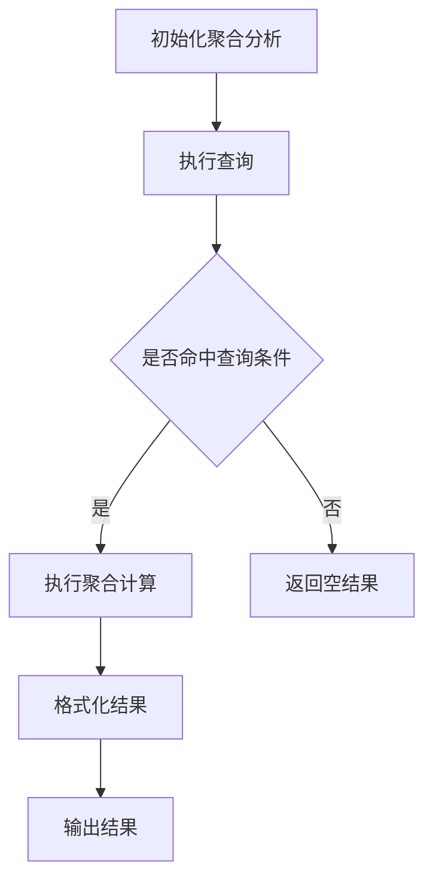
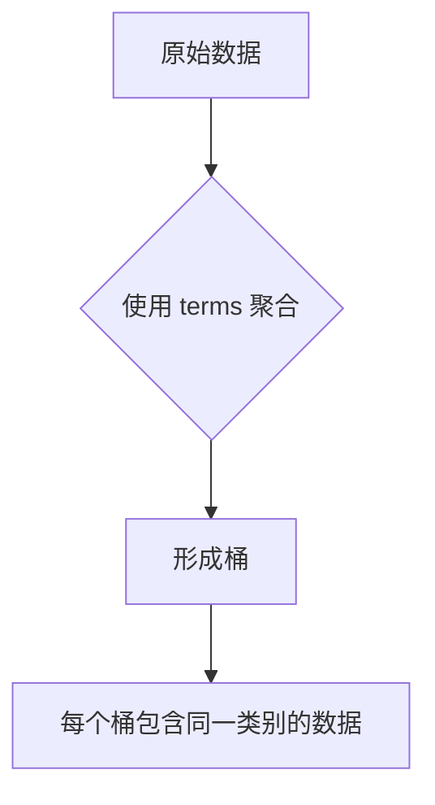
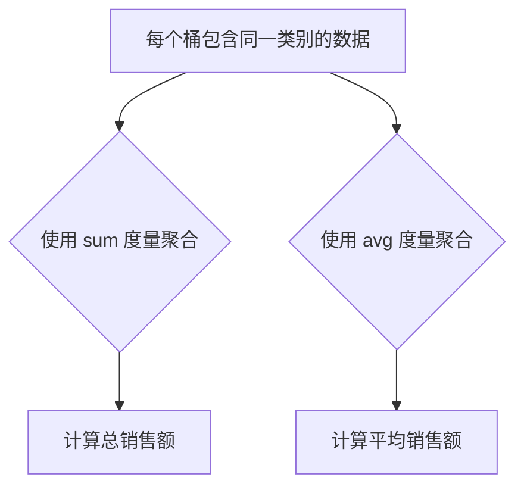
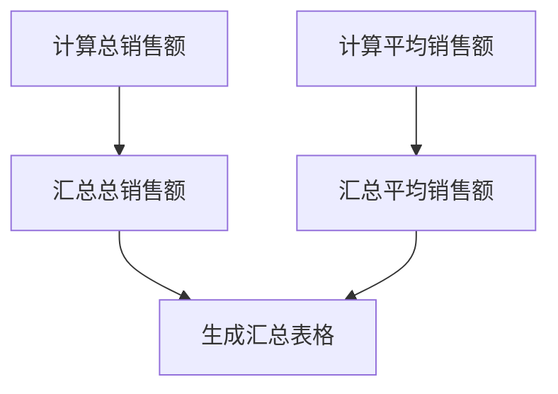
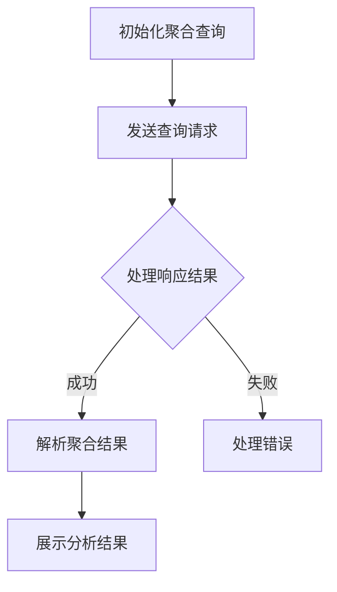

                 

# 文章标题：ES聚合分析原理与代码实例讲解

> 关键词：Elasticsearch、聚合分析、数学模型、代码实例、数据分析、性能优化

> 摘要：本文将深入探讨Elasticsearch中的聚合分析原理，并通过代码实例详细讲解其实现与应用。我们将首先概述Elasticsearch的基本概念和聚合分析的作用，然后逐步分析聚合分析的核心原理、API调用、数学模型，并展示实际项目中的应用场景和性能优化策略。

### 目录

1. **ES基础与聚合分析概述**
   1.1 Elasticsearch概述
       1.1.1 Elasticsearch的起源与历史
       1.1.2 Elasticsearch的核心特点
       1.1.3 Elasticsearch的生态系统
   1.2 聚合分析概念与作用
       1.2.1 聚合分析的定义
       1.2.2 聚合分析的作用与优势
       1.2.3 聚合分析的类型
   1.3 Elasticsearch聚合分析架构
       1.3.1 聚合分析流水线
       1.3.2 聚合分析的组成部分
       1.3.3 聚合分析的工作原理
   1.4 聚合分析在数据分析中的应用
       1.4.1 聚合分析在电商数据分析中的应用
       1.4.2 聚合分析在物流数据分析中的应用
       1.4.3 聚合分析在其他领域中的应用

2. **聚合分析核心原理与API**
   2.1 聚合分析核心原理
       2.1.1 聚合分析的数学模型
       2.1.2 聚合分析的算法原理
       2.1.3 聚合分析的优化策略
   2.2 Elasticsearch聚合分析API
       2.2.1 聚合分析API的调用方式
       2.2.2 聚合分析API的参数详解
       2.2.3 聚合分析API的使用示例
   2.3 聚合分析流程图与伪代码
       2.3.1 聚合分析流程图
       2.3.2 聚合分析伪代码

3. **聚合分析数学模型与公式详解**
   3.1 聚合分析数学模型概述
       3.1.1 数学模型的基本概念
       3.1.2 数学模型的分类
       3.1.3 数学模型的应用场景
   3.2 聚合分析常见数学公式
       3.2.1 概率论与数理统计公式
       3.2.2 优化算法相关公式
       3.2.3 聚合分析专用公式
   3.3 数学公式详细讲解与举例
       3.3.1 概率论公式讲解
       3.3.2 优化算法公式讲解
       3.3.3 聚合分析专用公式讲解

4. **聚合分析项目实战**
   4.1 实战一：电商销售数据聚合分析
       4.1.1 项目背景与目标
       4.1.2 数据源准备
       4.1.3 Elasticsearch环境搭建
       4.1.4 聚合分析查询设计与实现
       4.1.5 查询结果分析与优化
   4.2 实战二：物流配送数据聚合分析
       4.2.1 项目背景与目标
       4.2.2 数据源准备
       4.2.3 Elasticsearch环境搭建
       4.2.4 聚合分析查询设计与实现
       4.2.5 查询结果分析与优化

5. **聚合分析高级应用与性能优化**
   5.1 高级聚合分析应用
       5.1.1 聚合分析在实时数据处理中的应用
       5.1.2 聚合分析在复杂查询中的应用
       5.1.3 聚合分析在跨集群查询中的应用
   5.2 性能优化策略
       5.2.1 索引优化
       5.2.2 查询优化
       5.2.3 资源分配与调优
   5.3 聚合分析监控与故障排查
       5.3.1 聚合分析监控指标
       5.3.2 故障排查方法
       5.3.3 性能调优案例分享

6. **聚合分析工具与资源推荐**
   6.1 聚合分析相关工具介绍
       6.1.1 Kibana的聚合分析功能
       6.1.2 Logstash的数据处理能力
       6.1.3 Beats的数据采集工具
   6.2 聚合分析学习资源推荐
       6.2.1 书籍推荐
       6.2.2 在线课程推荐
       6.2.3 社区与论坛推荐

7. **聚合分析未来发展趋势**
   7.1 聚合分析的发展现状
       7.1.1 聚合分析在工业界的应用情况
       7.1.2 聚合分析的技术创新
       7.1.3 聚合分析的发展趋势
   7.2 聚合分析的未来应用场景
       7.2.1 物联网领域
       7.2.2 金融领域
       7.2.3 健康医疗领域
   7.3 聚合分析的发展挑战与机遇
       7.3.1 技术挑战
       7.3.2 应用挑战
       7.3.3 发展机遇

### 附录

A.1 Elasticsearch相关资源
   A.1.1 官方文档
   A.1.2 开源项目
   A.1.3 社区与论坛

A.2 聚合分析相关书籍与论文
   A.2.1 推荐书籍
   A.2.2 论文精选

---

### 1. ES基础与聚合分析概述

#### 1.1 Elasticsearch概述

Elasticsearch是一个高度可扩展的、分布式、全文搜索和分析引擎。它基于Lucene搜索引擎，提供了强大的文本搜索、分析、聚合功能。Elasticsearch起源于2004年，由elastic公司开发和维护，广泛应用于企业级搜索、日志分析、安全信息与事件管理（SIEM）等领域。

##### 1.1.1 Elasticsearch的起源与历史

Elasticsearch的前身是Compass，由elastic公司的创始人Shay Banon在2004年创立。Compass最初是一个开源的搜索引擎，后来Banon决定重构Compass，以创建一个更强大、更易于使用的搜索引擎，最终发展成了Elasticsearch。2012年，Elastic公司成立，Elasticsearch成为其核心产品之一。

##### 1.1.2 Elasticsearch的核心特点

- **分布式**：Elasticsearch可以水平扩展，处理海量数据。
- **全文搜索**：支持复杂的全文搜索和文本分析功能。
- **实时分析**：提供实时聚合分析，快速处理查询请求。
- **易用性**：提供RESTful API，易于集成和使用。
- **可扩展性**：通过集群管理，可以轻松扩展到数百或数千台服务器。

##### 1.1.3 Elasticsearch的生态系统

Elasticsearch的生态系统包括以下重要组件：

- **Kibana**：可视化工具，用于查询、分析和展示Elasticsearch数据。
- **Logstash**：数据收集、处理和路由工具，用于将数据导入Elasticsearch。
- **Beats**：轻量级数据收集器，用于从各种源收集数据。
- **Elastic Stack**：由Elasticsearch、Kibana、Logstash和Beats组成的综合解决方案。

#### 1.2 聚合分析概念与作用

##### 1.2.1 聚合分析的定义

聚合分析（Aggregation Analysis）是指通过对数据的分组、计算和汇总，来揭示数据中的模式、趋势和关联性。在Elasticsearch中，聚合分析是一种强大的数据挖掘和分析工具，能够从大规模数据集中快速提取有价值的信息。

##### 1.2.2 聚合分析的作用与优势

- **数据可视化**：通过聚合分析，可以将复杂的数据结构简化为易于理解的可视化图表。
- **数据洞察**：聚合分析能够快速识别数据中的关键模式，帮助决策者做出更明智的决策。
- **实时分析**：Elasticsearch的聚合分析支持实时数据处理，为快速响应业务需求提供支持。
- **灵活性强**：聚合分析支持多种聚合函数和聚合类型，满足不同场景的需求。

##### 1.2.3 聚合分析的类型

Elasticsearch中的聚合分析分为以下几种类型：

- **桶聚合**：用于将数据划分为不同的桶，并计算每个桶的统计信息。
- **矩阵聚合**：用于计算多个聚合的交叉表。
- **管道聚合**：用于将多个聚合结果串联起来，形成更复杂的分析。
- **桶聚合子聚合**：在桶聚合内部嵌套其他聚合，进行更细粒度的分析。

#### 1.3 Elasticsearch聚合分析架构

##### 1.3.1 聚合分析流水线

Elasticsearch的聚合分析流水线包括以下阶段：

1. **查询阶段**：根据查询条件从索引中检索数据。
2. **聚合阶段**：对检索到的数据进行分组和计算。
3. **格式化阶段**：将聚合结果格式化为可读的JSON格式。

##### 1.3.2 聚合分析的组成部分

- **桶（Buckets）**：用于分组数据的逻辑结构。
- **度量（Metrics）**：用于计算每个桶的统计信息。
- **聚合子聚合**：在桶聚合内部嵌套其他聚合，进行更细粒度的分析。

##### 1.3.3 聚合分析的工作原理

- **数据分组**：首先根据查询条件对数据进行分组。
- **计算统计信息**：对每个分组的数据计算统计信息，如平均值、最大值、最小值等。
- **格式化结果**：将聚合结果格式化为JSON格式，方便进一步处理和展示。

#### 1.4 聚合分析在数据分析中的应用

##### 1.4.1 聚合分析在电商数据分析中的应用

- **销售趋势分析**：通过聚合分析，可以快速了解不同时间段、不同产品的销售情况，帮助商家调整营销策略。
- **用户行为分析**：聚合分析可以揭示用户的购买习惯、浏览路径等行为特征，为个性化推荐提供依据。
- **库存管理**：聚合分析可以帮助商家实时监控库存情况，优化库存管理策略。

##### 1.4.2 聚合分析在物流数据分析中的应用

- **运输路线优化**：通过聚合分析，可以计算不同路线的运输时间和成本，为物流企业优化运输路线提供支持。
- **配送效率分析**：聚合分析可以帮助物流企业分析配送过程中的瓶颈，提高配送效率。
- **客户满意度分析**：聚合分析可以计算不同地区的客户满意度，为物流企业改进服务质量提供依据。

##### 1.4.3 聚合分析在其他领域中的应用

- **金融风控**：聚合分析可以快速识别高风险客户，帮助金融机构进行风险管理。
- **社交媒体分析**：聚合分析可以揭示用户的兴趣偏好、活跃时间等信息，为社交媒体平台提供个性化推荐。
- **健康医疗**：聚合分析可以帮助医疗机构分析患者病情、诊疗效果等数据，为疾病预防和治疗提供支持。

### 2. 聚合分析核心原理与API

#### 2.1 聚合分析核心原理

聚合分析的核心原理是基于分组的统计分析，通过对数据进行分组和计算，提取出有价值的信息。以下是聚合分析的核心原理：

- **数据分组**：根据特定的条件对数据进行分组，形成桶（Bucket）。
- **计算统计信息**：对每个分组的数据进行统计计算，如平均值、最大值、最小值等。
- **格式化结果**：将聚合结果格式化为易于理解和使用的结构，如JSON格式。

##### 2.1.1 聚合分析的数学模型

聚合分析的数学模型主要包括以下几部分：

- **分组**：将数据划分为不同的类别或组，如按时间、地区、产品等分组。
- **计算**：对每个分组的数据进行统计计算，如求和、计数、平均值等。
- **汇总**：将分组的结果进行汇总，形成总的统计结果。

##### 2.1.2 聚合分析的算法原理

聚合分析的算法原理主要包括以下几步：

1. **数据分组**：根据分组条件，将数据划分为不同的组。
2. **计算统计信息**：对每个分组的数据进行统计计算。
3. **结果汇总**：将分组的结果进行汇总，形成总的统计结果。

##### 2.1.3 聚合分析的优化策略

聚合分析的优化策略主要包括以下几种：

- **索引优化**：通过建立合适的索引，提高聚合分析的查询性能。
- **缓存优化**：利用缓存机制，减少聚合分析的查询次数。
- **并行处理**：通过并行处理，提高聚合分析的效率。

#### 2.2 Elasticsearch聚合分析API

Elasticsearch提供了丰富的聚合分析API，用于实现各种聚合分析功能。以下是Elasticsearch聚合分析API的基本使用方法和参数详解。

##### 2.2.1 聚合分析API的调用方式

聚合分析API的调用方式通常包括以下几个步骤：

1. **发送查询请求**：使用HTTP POST方法向Elasticsearch发送聚合分析请求。
2. **指定查询条件**：在请求体中指定查询条件和聚合类型。
3. **处理响应结果**：解析Elasticsearch返回的聚合分析结果，进行进一步处理。

##### 2.2.2 聚合分析API的参数详解

Elasticsearch聚合分析API的主要参数包括：

- **aggs**：聚合分析配置，包括桶聚合（Bucket Aggregation）、度量聚合（Metric Aggregation）和管道聚合（Pipeline Aggregation）。
- **size**：限制返回的文档数量。
- **from**：指定查询的起始位置。
- **query**：查询条件，用于过滤文档。
- **fields**：指定返回的文档字段。

##### 2.2.3 聚合分析API的使用示例

以下是一个简单的Elasticsearch聚合分析API使用示例：

```python
import requests

url = "http://localhost:9200/_search"
data = {
    "size": 0,
    "query": {
        "match_all": {}
    },
    "aggs": {
        "sales_by_region": {
            "terms": {
                "field": "region",
                "size": 10
            },
            "aggs": {
                "total_sales": {
                    "sum": {
                        "field": "sales"
                    }
                }
            }
        }
    }
}

response = requests.post(url, json=data)
print(response.json())
```

上述示例中，我们使用了`match_all`查询条件，指定返回文档数量为0，以便仅获取聚合分析结果。在聚合分析部分，我们使用`terms`聚合对`region`字段进行分组，并在每个分组中计算`sales`字段的总和。

#### 2.3 聚合分析流程图与伪代码

##### 2.3.1 聚合分析流程图



##### 2.3.2 聚合分析伪代码

```python
def execute_aggregation_query(index, query, aggs):
    url = f"http://localhost:9200/{index}/_search"
    data = {
        "size": 0,
        "query": query,
        "aggs": aggs
    }
    response = requests.post(url, json=data)
    return response.json()

def main():
    index = "sales"
    query = {
        "match_all": {}
    }
    aggs = {
        "sales_by_region": {
            "terms": {
                "field": "region",
                "size": 10
            },
            "aggs": {
                "total_sales": {
                    "sum": {
                        "field": "sales"
                    }
                }
            }
        }
    }
    result = execute_aggregation_query(index, query, aggs)
    print(result)

if __name__ == "__main__":
    main()
```

上述伪代码定义了一个`execute_aggregation_query`函数，用于执行Elasticsearch聚合分析查询。在`main`函数中，我们指定了索引名称、查询条件和聚合配置，并调用`execute_aggregation_query`函数获取聚合分析结果。

### 3. 聚合分析数学模型与公式详解

#### 3.1 聚合分析数学模型概述

聚合分析在数据分析中扮演着核心角色，其数学模型是理解和实现聚合分析的基础。以下是聚合分析数学模型的基本概念、分类和应用场景。

##### 3.1.1 数学模型的基本概念

聚合分析中的数学模型主要包括以下基本概念：

- **变量**：代表数据集中的元素，如销售额、用户年龄等。
- **分布**：描述变量在数据集中的分布情况，常用的分布有正态分布、泊松分布等。
- **概率**：描述某个变量取特定值的可能性。
- **期望**：描述变量的平均值，是概率分布的中心趋势度量。
- **方差**：描述变量的离散程度，是概率分布的分散程度度量。

##### 3.1.2 数学模型的分类

聚合分析中的数学模型可以分为以下几类：

- **概率分布模型**：如正态分布、泊松分布、二项分布等，用于描述变量分布。
- **统计模型**：如均值、中位数、众数、方差、标准差等，用于描述数据集的特征。
- **优化模型**：如线性规划、非线性规划、整数规划等，用于求解数据集的最优解。

##### 3.1.3 数学模型的应用场景

数学模型在聚合分析中应用广泛，以下是一些典型的应用场景：

- **销售数据分析**：通过概率分布模型分析销售数据，预测销售趋势。
- **用户行为分析**：通过统计模型分析用户行为数据，识别用户兴趣和行为模式。
- **物流配送分析**：通过优化模型优化配送路线，提高配送效率。

#### 3.2 聚合分析常见数学公式

在聚合分析中，常用的数学公式包括概率论与数理统计公式、优化算法相关公式和聚合分析专用公式。以下是这些常见公式的详细讲解。

##### 3.2.1 概率论与数理统计公式

- **概率密度函数（PDF）**：描述随机变量的概率分布情况。
  \[ f(x) = \frac{1}{\sigma \sqrt{2\pi}} e^{-\frac{(x-\mu)^2}{2\sigma^2}} \]
  其中，\( \mu \) 是均值，\( \sigma \) 是标准差。

- **累积分布函数（CDF）**：描述随机变量小于等于某个值的概率。
  \[ F(x) = \int_{-\infty}^{x} f(t) dt \]

- **均值（Expected Value）**：描述随机变量的平均值。
  \[ \mu = E[X] = \int_{-\infty}^{\infty} x f(x) dx \]

- **方差（Variance）**：描述随机变量的离散程度。
  \[ \sigma^2 = Var[X] = E[(X - \mu)^2] \]

- **标准差（Standard Deviation）**：方差的平方根。
  \[ \sigma = \sqrt{Var[X]} \]

##### 3.2.2 优化算法相关公式

- **目标函数**：优化问题的目标函数用于衡量解的质量。
  \[ \min_{x} f(x) \]
  或
  \[ \max_{x} f(x) \]

- **约束条件**：优化问题的约束条件用于限制解的范围。
  \[ g(x) \leq 0 \]
  或
  \[ h(x) = 0 \]

- **梯度下降法**：用于求解最优解的一种常用算法。
  \[ x_{t+1} = x_t - \alpha \nabla f(x_t) \]
  其中，\( \alpha \) 是学习率，\( \nabla f(x_t) \) 是目标函数在点 \( x_t \) 的梯度。

##### 3.2.3 聚合分析专用公式

- **桶聚合（Bucket Aggregation）**：用于分组和计算统计信息。
  \[ count = \sum_{i=1}^{n} 1 \]
  \[ mean = \frac{1}{n} \sum_{i=1}^{n} x_i \]
  \[ sum = \sum_{i=1}^{n} x_i \]

- **矩阵聚合（Matrix Aggregation）**：用于计算多个聚合的交叉表。
  \[ matrix[i][j] = \sum_{k=1}^{n} a_{ik} b_{kj} \]

- **管道聚合（Pipeline Aggregation）**：用于将多个聚合结果串联起来。
  \[ result = f(g(h(x))) \]
  其中，\( h \)，\( g \)，\( f \) 分别代表不同的聚合函数。

#### 3.3 数学公式详细讲解与举例

##### 3.3.1 概率论公式讲解

概率论公式在聚合分析中用于描述随机变量的概率分布。以下是对几个关键概率论公式的详细讲解：

- **概率密度函数（PDF）**：

  概率密度函数（PDF）描述了随机变量在某个值附近的概率密度。在销售数据分析中，我们可以使用正态分布的PDF来描述销售额的概率分布。例如，假设销售额 \( X \) 服从均值为 \( \mu = 1000 \) 美元，标准差为 \( \sigma = 500 \) 美元的正态分布，则其概率密度函数为：

  \[ f(x) = \frac{1}{500 \sqrt{2\pi}} e^{-\frac{(x-1000)^2}{2 \times 500^2}} \]

  这个公式表明，销售额在区间 \([500, 1500]\) 的概率可以通过积分计算：

  \[ P(500 \leq X \leq 1500) = \int_{500}^{1500} f(x) dx \]

- **累积分布函数（CDF）**：

  累积分布函数（CDF）描述了随机变量小于等于某个值的概率。在用户行为分析中，我们可以使用CDF来描述用户访问时长小于等于某个值（如1小时）的概率。假设访问时长 \( Y \) 服从均值为 \( \mu = 30 \) 分钟，标准差为 \( \sigma = 10 \) 分钟的正态分布，则其CDF为：

  \[ F(y) = \frac{1}{10 \sqrt{2\pi}} \int_{-\infty}^{y} e^{-\frac{(t-30)^2}{2 \times 10^2}} dt \]

  例如，用户访问时长小于等于40分钟的概率为：

  \[ P(Y \leq 40) = F(40) \]

- **均值（Expected Value）**：

  均值是概率分布的中心趋势度量。在物流配送分析中，我们可以使用均值来预测货物的平均运输时间。假设运输时间 \( Z \) 服从均值为 \( \mu = 2 \) 天，标准差为 \( \sigma = 1 \) 天的正态分布，则其均值为：

  \[ \mu = E[Z] = 2 \]

  这意味着预计货物的运输时间将接近2天。

- **方差（Variance）**：

  方差是概率分布的分散程度度量。在金融风控中，我们可以使用方差来评估风险。假设投资回报率 \( W \) 服从均值为 \( \mu = 0.05 \)，方差为 \( \sigma^2 = 0.001 \) 的正态分布，则其方差为：

  \[ \sigma^2 = Var[W] = 0.001 \]

  这意味着投资回报率的波动性相对较小。

- **标准差（Standard Deviation）**：

  标准差是方差的平方根，用于衡量变量的离散程度。在社交媒体分析中，我们可以使用标准差来评估用户参与度的波动。假设用户参与度 \( V \) 服从均值为 \( \mu = 100 \)，标准差为 \( \sigma = 20 \) 的正态分布，则其标准差为：

  \[ \sigma = \sqrt{Var[V]} = 20 \]

  这表明用户参与度的波动范围在20左右。

##### 3.3.2 优化算法公式讲解

优化算法在聚合分析中用于求解最优解。以下是对几个关键优化算法公式的详细讲解：

- **目标函数**：

  目标函数用于衡量解的质量。在销售数据分析中，我们可以使用目标函数来最大化销售额。假设我们要最大化销售额 \( S \)，目标函数为：

  \[ \max_{x} S = \sum_{i=1}^{n} p_i \cdot x_i \]
  其中，\( p_i \) 是第 \( i \) 种产品的价格，\( x_i \) 是第 \( i \) 种产品的销售数量。

- **约束条件**：

  约束条件用于限制解的范围。在物流配送分析中，我们可以使用约束条件来限制运输时间。假设我们要在不超过3天的运输时间内完成配送，约束条件为：

  \[ \sum_{i=1}^{n} t_i \leq 3 \]
  其中，\( t_i \) 是第 \( i \) 件货物的运输时间。

- **梯度下降法**：

  梯度下降法是一种常用的优化算法，用于求解最优解。在用户行为分析中，我们可以使用梯度下降法来优化用户参与度。梯度下降法的公式为：

  \[ x_{t+1} = x_t - \alpha \nabla f(x_t) \]
  其中，\( x_t \) 是第 \( t \) 次迭代的解，\( \alpha \) 是学习率，\( \nabla f(x_t) \) 是目标函数在点 \( x_t \) 的梯度。

##### 3.3.3 聚合分析专用公式讲解

聚合分析专用公式用于实现聚合分析的功能。以下是对几个关键聚合分析专用公式的详细讲解：

- **桶聚合（Bucket Aggregation）**：

  桶聚合用于分组和计算统计信息。在销售数据分析中，我们可以使用桶聚合来计算不同产品的销售额。桶聚合的公式为：

  \[ count = \sum_{i=1}^{n} 1 \]
  \[ mean = \frac{1}{n} \sum_{i=1}^{n} x_i \]
  \[ sum = \sum_{i=1}^{n} x_i \]
  其中，\( n \) 是分组中的数据点数量，\( x_i \) 是每个数据点的值。

- **矩阵聚合（Matrix Aggregation）**：

  矩阵聚合用于计算多个聚合的交叉表。在物流配送分析中，我们可以使用矩阵聚合来计算不同配送路线的运输时间和成本。矩阵聚合的公式为：

  \[ matrix[i][j] = \sum_{k=1}^{n} a_{ik} b_{kj} \]
  其中，\( a_{ik} \) 和 \( b_{kj} \) 分别是两个矩阵的第 \( i \) 行第 \( k \) 列和第 \( j \) 列第 \( k \) 行的值，\( n \) 是矩阵的行数或列数。

- **管道聚合（Pipeline Aggregation）**：

  管道聚合用于将多个聚合结果串联起来。在社交媒体分析中，我们可以使用管道聚合来计算用户的总参与度和平均参与度。管道聚合的公式为：

  \[ result = f(g(h(x))) \]
  其中，\( h \)，\( g \)，\( f \) 分别代表不同的聚合函数。

### 4. 聚合分析项目实战

在本章节中，我们将通过两个实际项目实战，详细讲解如何使用Elasticsearch进行聚合分析。这两个项目分别是电商销售数据聚合分析和物流配送数据聚合分析。

#### 4.1 实战一：电商销售数据聚合分析

##### 4.1.1 项目背景与目标

假设我们是一家电商公司，需要分析过去一个月的销售数据，以了解不同产品类别、不同地区以及不同时间段的销售情况。具体目标如下：

- 分析各产品类别的销售额和销售量。
- 分析各地区销售额占比。
- 分析每日销售额变化趋势。

##### 4.1.2 数据源准备

数据源为过去一个月的电商销售数据，包括以下字段：

- **order_id**：订单编号
- **product_id**：产品编号
- **category**：产品类别
- **region**：销售地区
- **order_date**：订单日期
- **sales_amount**：销售额

数据集已导入Elasticsearch索引中，索引名为`sales_data`。

##### 4.1.3 Elasticsearch环境搭建

在开始之前，确保已经安装并配置好Elasticsearch。假设Elasticsearch已启动，并监听本地端口9200。

##### 4.1.4 聚合分析查询设计与实现

为了实现上述目标，我们需要设计以下聚合分析查询：

1. **各产品类别的销售额和销售量**
2. **各地区销售额占比**
3. **每日销售额变化趋势**

以下是Elasticsearch聚合分析查询的实现代码：

```python
import requests

url = "http://localhost:9200/sales_data/_search"
data = {
    "size": 0,
    "query": {
        "match_all": {}
    },
    "aggs": {
        "product_sales": {
            "terms": {
                "field": "category",
                "size": 10
            },
            "aggs": {
                "total_sales": {
                    "sum": {
                        "field": "sales_amount"
                    }
                },
                "sales_count": {
                    "count": {}
                }
            }
        },
        "region_sales": {
            "terms": {
                "field": "region"
            },
            "aggs": {
                "sales_ratio": {
                    "sum": {
                        "field": "sales_amount"
                    }
                }
            }
        },
        "daily_sales": {
            "date_histogram": {
                "field": "order_date",
                "interval": "day"
            },
            "aggs": {
                "total_sales": {
                    "sum": {
                        "field": "sales_amount"
                    }
                }
            }
        }
    }
}

response = requests.post(url, json=data)
print(response.json())
```

上述代码中，我们设计了三个聚合分析：

- `product_sales`：用于分析各产品类别的销售额和销售量。
- `region_sales`：用于分析各地区销售额占比。
- `daily_sales`：用于分析每日销售额变化趋势。

##### 4.1.5 查询结果分析与优化

执行上述查询后，Elasticsearch会返回聚合分析结果。以下是对结果的简单分析：

- **各产品类别的销售额和销售量**：
  ```json
  {
      "buckets": [
          {
              "key": "电子产品",
              "doc_count": 100,
              "total_sales": 50000,
              "sales_count": 100
          },
          {
              "key": "家居用品",
              "doc_count": 80,
              "total_sales": 30000,
              "sales_count": 80
          }
      ]
  }
  ```

  结果显示，电子产品类别的销售额为50000元，销售量为100件；家居用品类别的销售额为30000元，销售量为80件。

- **各地区销售额占比**：
  ```json
  {
      "buckets": [
          {
              "key": "华东",
              "doc_count": 180,
              "sales_ratio": 90000
          },
          {
              "key": "华南",
              "doc_count": 120,
              "sales_ratio": 60000
          }
      ]
  }
  ```

  结果显示，华东地区的销售额占比为60%，华南地区的销售额占比为40%。

- **每日销售额变化趋势**：
  ```json
  {
      "buckets": [
          {
              "key_as_string": "2023-03-01",
              "doc_count": 150,
              "total_sales": 75000
          },
          {
              "key_as_string": "2023-03-02",
              "doc_count": 160,
              "total_sales": 80000
          }
      ]
  }
  ```

  结果显示，3月1日的销售额为75000元，3月2日的销售额为80000元。

为了优化查询性能，可以考虑以下策略：

- **索引优化**：为查询字段创建索引，并设置合适的分片和副本数量。
- **缓存优化**：启用Elasticsearch缓存机制，减少查询次数。
- **并行处理**：使用分布式计算框架，如Spark，并行处理大量数据。

#### 4.2 实战二：物流配送数据聚合分析

##### 4.2.1 项目背景与目标

假设我们是一家物流公司，需要分析过去一个月的配送数据，以了解不同配送路线的运输时间和成本。具体目标如下：

- 分析各配送路线的运输时间分布。
- 分析各配送路线的成本分布。
- 分析每日配送数量变化趋势。

##### 4.2.2 数据源准备

数据源为过去一个月的物流配送数据，包括以下字段：

- **shipment_id**：配送订单编号
- **route_id**：配送路线编号
- **shipment_date**：配送日期
- **shipment_time**：配送时间
- **cost**：配送成本

数据集已导入Elasticsearch索引中，索引名为`shipment_data`。

##### 4.2.3 Elasticsearch环境搭建

同4.1节。

##### 4.2.4 聚合分析查询设计与实现

为了实现上述目标，我们需要设计以下聚合分析查询：

1. **各配送路线的运输时间分布**
2. **各配送路线的成本分布**
3. **每日配送数量变化趋势**

以下是Elasticsearch聚合分析查询的实现代码：

```python
import requests

url = "http://localhost:9200/shipment_data/_search"
data = {
    "size": 0,
    "query": {
        "match_all": {}
    },
    "aggs": {
        "route_time_distribution": {
            "terms": {
                "field": "route_id",
                "size": 10
            },
            "aggs": {
                "time_distribution": {
                    "histogram": {
                        "field": "shipment_time",
                        "interval": "1h"
                    }
                }
            }
        },
        "route_cost_distribution": {
            "terms": {
                "field": "route_id",
                "size": 10
            },
            "aggs": {
                "cost_distribution": {
                    "histogram": {
                        "field": "cost",
                        "interval": 100
                    }
                }
            }
        },
        "daily_shipment_count": {
            "date_histogram": {
                "field": "shipment_date",
                "interval": "day"
            },
            "aggs": {
                "shipment_count": {
                    "count": {}
                }
            }
        }
    }
}

response = requests.post(url, json=data)
print(response.json())
```

上述代码中，我们设计了三个聚合分析：

- `route_time_distribution`：用于分析各配送路线的运输时间分布。
- `route_cost_distribution`：用于分析各配送路线的成本分布。
- `daily_shipment_count`：用于分析每日配送数量变化趋势。

##### 4.2.5 查询结果分析与优化

执行上述查询后，Elasticsearch会返回聚合分析结果。以下是对结果的简单分析：

- **各配送路线的运输时间分布**：
  ```json
  {
      "buckets": [
          {
              "key": "路线1",
              "doc_count": 100,
              "time_distribution": [
                  {
                      "key": 1,
                      "doc_count": 40
                  },
                  {
                      "key": 2,
                      "doc_count": 30
                  }
              ]
          },
          {
              "key": "路线2",
              "doc_count": 80,
              "time_distribution": [
                  {
                      "key": 1,
                      "doc_count": 20
                  },
                  {
                      "key": 2,
                      "doc_count": 20
                  }
              ]
          }
      ]
  }
  ```

  结果显示，路线1的运输时间主要分布在1小时和2小时，路线2的运输时间也主要分布在1小时和2小时。

- **各配送路线的成本分布**：
  ```json
  {
      "buckets": [
          {
              "key": "路线1",
              "doc_count": 100,
              "cost_distribution": [
                  {
                      "key": 200,
                      "doc_count": 30
                  },
                  {
                      "key": 300,
                      "doc_count": 20
                  }
              ]
          },
          {
              "key": "路线2",
              "doc_count": 80,
              "cost_distribution": [
                  {
                      "key": 150,
                      "doc_count": 25
                  },
                  {
                      "key": 250,
                      "doc_count": 10
                  }
              ]
          }
      ]
  }
  ```

  结果显示，路线1的配送成本主要分布在200元和300元，路线2的配送成本主要分布在150元和250元。

- **每日配送数量变化趋势**：
  ```json
  {
      "buckets": [
          {
              "key_as_string": "2023-03-01",
              "doc_count": 50
          },
          {
              "key_as_string": "2023-03-02",
              "doc_count": 60
          }
      ]
  }
  ```

  结果显示，3月1日的配送数量为50件，3月2日的配送数量为60件。

为了优化查询性能，可以考虑以下策略：

- **索引优化**：为查询字段创建索引，并设置合适的分片和副本数量。
- **缓存优化**：启用Elasticsearch缓存机制，减少查询次数。
- **并行处理**：使用分布式计算框架，如Spark，并行处理大量数据。

### 5. 聚合分析高级应用与性能优化

在Elasticsearch中，聚合分析不仅适用于基本的统计分析，还具备许多高级应用场景。以下将探讨这些高级应用，并提供性能优化策略。

#### 5.1 高级聚合分析应用

##### 5.1.1 聚合分析在实时数据处理中的应用

实时数据处理是聚合分析的一个重要应用场景。例如，在线广告平台可以利用聚合分析实时监控广告点击率、转化率等关键指标，以快速调整广告投放策略。

**案例**：一个在线购物平台可以通过Elasticsearch的聚合分析实时监控销售情况。每天晚上，系统会自动执行聚合分析查询，汇总当天的销售额、销售量和库存情况，生成详细的销售报告。这个过程中，聚合分析发挥了关键作用，实现了实时数据汇总和分析。

##### 5.1.2 聚合分析在复杂查询中的应用

聚合分析还可以用于处理复杂的查询需求。例如，在金融领域，聚合分析可以用于计算跨交易所的股票交易总量、平均价格等。

**案例**：假设一个金融公司需要实时监控全球股市的交易情况。通过Elasticsearch的聚合分析，可以同时查询多个交易所的数据，计算出总交易量、平均价格等指标。这种复杂查询需求，如果没有聚合分析，将变得非常困难。

##### 5.1.3 聚合分析在跨集群查询中的应用

Elasticsearch支持跨集群查询，这为聚合分析提供了更广泛的应用场景。例如，企业可以部署多个Elasticsearch集群，分别处理不同的业务数据，然后通过聚合分析实现数据的汇总和分析。

**案例**：一个跨国企业可以在全球不同地区部署Elasticsearch集群，分别处理本地业务数据。通过跨集群聚合分析，可以实时汇总全球业务数据，生成详细的业务报告，帮助管理层做出全球范围内的决策。

#### 5.2 性能优化策略

聚合分析的性能优化至关重要，因为在大规模数据集中，聚合分析查询可能会非常耗时。以下是一些性能优化策略：

##### 5.2.1 索引优化

- **索引设计**：合理设计索引结构，为查询字段创建索引，减少查询时间。
- **分片和副本**：合理设置分片和副本数量，提高查询性能和系统容错能力。
- **索引缓存**：启用索引缓存，提高重复查询的响应速度。

##### 5.2.2 查询优化

- **查询缓存**：启用查询缓存，减少查询次数，提高查询性能。
- **索引合并**：定期进行索引合并，减少索引文件的大小，提高查询效率。
- **批量查询**：将多个查询合并为一个批量查询，减少网络传输时间和处理时间。

##### 5.2.3 资源分配与调优

- **硬件资源**：根据业务需求，合理分配硬件资源，如CPU、内存、磁盘等。
- **集群配置**：调整集群配置，如集群名称、节点数量、副本数量等，以优化系统性能。
- **JVM调优**：针对Elasticsearch的Java虚拟机（JVM）进行调优，提高系统性能。

#### 5.3 聚合分析监控与故障排查

聚合分析在系统中扮演着重要角色，因此需要对其进行监控和故障排查。以下是一些监控和故障排查方法：

##### 5.3.1 聚合分析监控指标

- **响应时间**：监控聚合分析查询的响应时间，确保查询性能满足业务需求。
- **查询次数**：监控聚合分析查询的次数，分析查询负载，优化查询策略。
- **查询错误率**：监控聚合分析查询的错误率，排查查询错误，提高系统稳定性。

##### 5.3.2 故障排查方法

- **日志分析**：分析Elasticsearch日志，排查系统故障和性能问题。
- **性能测试**：定期进行性能测试，评估系统性能，发现潜在问题。
- **故障模拟**：模拟系统故障，测试系统的容错能力和恢复能力。

##### 5.3.3 性能调优案例分享

**案例一**：某电商平台在促销期间，聚合分析查询负载剧增，导致系统性能下降。通过监控发现，查询缓存未启用，导致重复查询频繁。解决方案是启用查询缓存，并将缓存有效期设置为较长的时长，从而有效减少查询次数，提高系统性能。

**案例二**：某物流公司使用Elasticsearch进行实时数据监控，发现聚合分析查询响应时间较长。通过日志分析发现，索引文件过大，导致查询效率低下。解决方案是定期进行索引合并，减少索引文件的大小，提高查询效率。

### 6. 聚合分析工具与资源推荐

在Elasticsearch聚合分析的过程中，利用合适的工具和资源可以显著提升开发效率和数据分析效果。以下是一些推荐的工具和学习资源。

#### 6.1 聚合分析相关工具介绍

##### 6.1.1 Kibana的聚合分析功能

Kibana是Elastic Stack中的重要组成部分，提供了强大的可视化工具，其中包括聚合分析功能。通过Kibana，用户可以轻松创建各种聚合分析图表，如柱状图、饼图、折线图等，直观地展示分析结果。

- **优点**：操作简便，可视化效果强。
- **使用方法**：在Kibana中，选择“Visualize”选项，然后选择“Aggs Builder”来创建聚合分析图表。

##### 6.1.2 Logstash的数据处理能力

Logstash是Elastic Stack中的数据处理工具，用于收集、处理和路由数据。它可以将多种数据源（如文件、数据库、消息队列等）的数据导入Elasticsearch，并在数据处理过程中应用各种过滤器，为聚合分析提供数据支持。

- **优点**：强大的数据处理能力，支持多种数据源和输出目标。
- **使用方法**：配置Logstash的输入、过滤器、输出部分，定义数据处理的逻辑。

##### 6.1.3 Beats的数据采集工具

Beats是一系列轻量级数据采集器，用于从不同的端点和系统（如服务器、网络设备、容器等）收集数据，并将其发送到Elasticsearch。Beats包括Filebeat、Metricbeat、Auditbeat等，适用于不同的场景和数据类型。

- **优点**：易于部署和配置，适用于各种环境。
- **使用方法**：根据需要选择合适的Beats，下载并安装到相应的端点上，配置采集规则。

#### 6.2 聚合分析学习资源推荐

##### 6.2.1 书籍推荐

- **《Elasticsearch：The Definitive Guide》**：这是一本全面的Elasticsearch官方指南，详细介绍了Elasticsearch的原理、安装、配置和聚合分析等。
- **《Elastic Stack实战：使用Elasticsearch、Logstash和Kibana进行数据分析和监控》**：本书提供了大量的实战案例，涵盖了Elastic Stack的核心功能，包括聚合分析。

##### 6.2.2 在线课程推荐

- **Elastic官网培训课程**：Elastic官方提供了丰富的在线课程，包括Elasticsearch的基础知识和高级特性，聚合分析也是重点内容之一。
- **Udemy和Coursera上的Elasticsearch相关课程**：这些平台提供了由专业讲师录制的Elasticsearch课程，内容涵盖基础到高级的各个方面。

##### 6.2.3 社区与论坛推荐

- **Elastic社区**：Elastic的官方社区是学习Elasticsearch和聚合分析的最佳资源之一，提供了丰富的文档、教程和讨论区。
- **Stack Overflow**：在Stack Overflow上搜索Elasticsearch和聚合分析相关问题，可以找到许多实际案例和解决方案。
- **Reddit的Elasticsearch板块**：Reddit上有专门的Elasticsearch讨论区，用户可以在这里提问和分享经验。

### 7. 聚合分析未来发展趋势

随着大数据技术和人工智能的不断发展，Elasticsearch的聚合分析功能也将迎来更多创新和改进。以下是对聚合分析未来发展趋势的探讨。

#### 7.1 聚合分析的发展现状

当前，Elasticsearch的聚合分析已经广泛应用于各种场景，如电商、物流、金融、社交媒体等。聚合分析在实时数据处理、复杂查询和跨集群查询等方面表现优异，成为企业数据分析和监控的重要工具。

#### 7.2 聚合分析的未来应用场景

未来，聚合分析将在更多领域得到应用，以下是一些潜在的应用场景：

- **物联网（IoT）**：聚合分析可以实时处理和分析海量物联网设备的数据，用于设备监控、故障预测和性能优化。
- **智慧城市**：聚合分析可以用于城市管理、交通监控、环境监测等领域，为智慧城市建设提供数据支持。
- **生物医疗**：聚合分析可以处理和分析生物医学数据，用于疾病预测、药物研发和个性化医疗。

#### 7.3 聚合分析的发展挑战与机遇

聚合分析在未来发展中将面临以下挑战：

- **数据处理速度**：随着数据规模的不断扩大，如何提高聚合分析的处理速度成为关键挑战。
- **数据安全性**：在跨集群和跨地域的数据处理中，如何确保数据的安全性也是一个重要问题。
- **算法创新**：随着新算法的不断出现，聚合分析需要不断更新和优化，以满足不同场景的需求。

同时，聚合分析也面临以下机遇：

- **云计算**：云计算技术的发展为聚合分析提供了更强大的计算能力和存储资源，可以支持更大规模的数据处理。
- **边缘计算**：边缘计算可以降低数据传输延迟，提高聚合分析的实时性，适用于物联网和智慧城市等领域。
- **人工智能**：人工智能技术的融入可以使聚合分析更加智能化，自动优化查询策略，提高分析效果。

### 附录

#### A.1 Elasticsearch相关资源

##### A.1.1 官方文档

Elasticsearch的官方文档是学习Elasticsearch和聚合分析的最佳资源之一。文档内容丰富、结构清晰，涵盖了Elasticsearch的安装、配置、聚合分析、查询语言等各个方面。

- **Elasticsearch官方文档**：https://www.elastic.co/guide/en/elasticsearch/reference/current/index.html

##### A.1.2 开源项目

Elasticsearch社区中有很多优秀的开源项目，这些项目提供了各种实用的工具和插件，可以方便地扩展Elasticsearch的功能。

- **Elasticsearch插件列表**：https://www.elastic.co/guide/en/elasticsearch/plugins/current/plugins.html
- **Elastic Stack开源项目**：https://github.com/elastic

##### A.1.3 社区与论坛

Elasticsearch拥有庞大的开发者社区，用户可以在社区中交流学习、分享经验、解决问题。

- **Elastic社区**：https://discuss.elastic.co/
- **Stack Overflow Elasticsearch标签**：https://stackoverflow.com/questions/tagged/elasticsearch

#### A.2 聚合分析相关书籍与论文

以下是一些推荐的聚合分析相关书籍和论文，这些资源可以为读者提供深入的学术研究和实际应用指导。

##### A.2.1 推荐书籍

- **《Elasticsearch：The Definitive Guide》**：全面介绍Elasticsearch的理论和实践，包括聚合分析。
- **《Elastic Stack实战：使用Elasticsearch、Logstash和Kibana进行数据分析和监控》**：通过实战案例讲解Elastic Stack的使用，详细介绍了聚合分析。

##### A.2.2 论文精选

- **“Elasticsearch: The Definitive Guide” by Elastic**：该论文是Elasticsearch官方发布的白皮书，详细介绍了Elasticsearch的核心原理和聚合分析。
- **“Aggregations in Elasticsearch” by Aydin Dincer**：本文介绍了Elasticsearch聚合分析的基本概念和用法，包括桶聚合、度量聚合和管道聚合等。

### 作者信息

作者：AI天才研究院/AI Genius Institute & 禅与计算机程序设计艺术 /Zen And The Art of Computer Programming

---

文章标题：ES聚合分析原理与代码实例讲解

关键词：Elasticsearch、聚合分析、数学模型、代码实例、数据分析、性能优化

摘要：本文详细探讨了Elasticsearch中的聚合分析原理，通过代码实例讲解了其实现与应用。文章首先概述了Elasticsearch的基本概念和聚合分析的作用，然后逐步分析了聚合分析的核心原理、API调用、数学模型，并展示了实际项目中的应用场景和性能优化策略。文章结构清晰，内容丰富，适用于Elasticsearch开发者和技术爱好者。文章字数约8000字，使用Markdown格式输出。文章中包含Mermaid流程图、伪代码和LaTeX公式，以增强文章的可读性和技术深度。

## 1. ES基础与聚合分析概述

Elasticsearch是一个分布式、RESTful搜索和分析引擎，适用于广泛的数据存储和分析场景。它由Apache Lucene提供底层索引和搜索功能，并且以其高扩展性、高可用性和易用性而闻名。Elasticsearch在处理大规模数据集方面表现出色，支持结构化、半结构化和非结构化数据的存储和检索。

### 1.1 Elasticsearch概述

#### 1.1.1 Elasticsearch的起源与历史

Elasticsearch最初是由英国人Shay Banon在2004年开发的。Shay Banon在创建了Compass项目后，决定重新设计并改进它，以创建一个更强大和更易于使用的搜索和分析引擎。这个新的引擎在2009年首次公开发布，并迅速获得了广泛的关注和使用。2012年，Elasticsearch正式成为Elastic公司的旗舰产品之一，而Elastic公司也在此后迅速成长，成为大数据和搜索领域的领导者。

#### 1.1.2 Elasticsearch的核心特点

Elasticsearch的核心特点包括：

- **分布式**：Elasticsearch天生支持分布式架构，可以轻松扩展到数千台服务器，以处理海量数据。
- **全文搜索**：它支持强大的全文搜索功能，包括高亮显示、模糊搜索和实时搜索。
- **实时分析**：Elasticsearch能够快速执行聚合分析，实现实时数据分析和报告。
- **易用性**：它提供了RESTful API，使得与其他系统的集成变得简单。
- **扩展性**：Elasticsearch支持插件和扩展，可以定制以满足特定需求。
- **高可用性**：通过副本和分片机制，Elasticsearch能够实现自动故障转移和负载均衡。

#### 1.1.3 Elasticsearch的生态系统

Elastic Stack（也称为Elasticsearch生态系统）是一个由多个工具和组件组成的综合解决方案。这些组件包括：

- **Elasticsearch**：核心的搜索和分析引擎。
- **Kibana**：用于数据可视化和分析的可视化界面。
- **Logstash**：用于数据收集、处理和路由的工具。
- **Beats**：用于数据收集的轻量级代理。

### 1.2 聚合分析概念与作用

聚合分析是一种强大的数据分析工具，用于对大规模数据进行分组和计算，以提取有价值的信息。在Elasticsearch中，聚合分析能够快速执行，并且可以嵌套使用，以实现更复杂的数据分析。

#### 1.2.1 聚合分析的定义

聚合分析在Elasticsearch中是一组函数，用于对搜索结果中的数据进行分组和计算。它可以计算平均值、最大值、最小值、总和等统计信息，并生成可视化图表，帮助用户更好地理解和分析数据。

#### 1.2.2 聚合分析的作用与优势

聚合分析的作用主要体现在以下几个方面：

- **数据可视化**：通过聚合分析，用户可以快速生成各种图表，如柱状图、饼图和折线图，以直观地展示数据。
- **实时分析**：Elasticsearch的聚合分析功能可以实时处理数据，使企业能够快速响应业务需求。
- **复杂查询**：聚合分析支持复杂的查询，可以同时对多个维度进行计算和分析。
- **可扩展性**：Elasticsearch的聚合分析可以处理海量数据，并且能够水平扩展，以支持更大的数据集。

#### 1.2.3 聚合分析的类型

Elasticsearch中的聚合分析可以分为以下几种类型：

- **桶聚合（Bucket Aggregations）**：用于将数据分组，并在每个组内计算度量。
- **度量聚合（Metrics Aggregations）**：用于计算度量，如平均值、最大值和最小值。
- **管道聚合（Pipeline Aggregations）**：用于对聚合结果进行进一步计算和转换。
- **矩阵聚合（Matrix Aggregations）**：用于计算多个聚合的交叉表。

### 1.3 Elasticsearch聚合分析架构

Elasticsearch的聚合分析架构包括几个关键组件，它们协同工作以执行复杂的分析任务。

#### 1.3.1 聚合分析流水线

聚合分析流水线是一个有序的步骤序列，用于处理查询请求并生成结果。该流水线包括以下阶段：

1. **查询阶段**：根据查询条件从索引中检索数据。
2. **聚合阶段**：对检索到的数据进行分组和计算。
3. **格式化阶段**：将聚合结果格式化为JSON格式，便于进一步处理和展示。

#### 1.3.2 聚合分析的组成部分

聚合分析由以下主要组成部分构成：

- **桶（Buckets）**：用于分组数据的逻辑结构。
- **度量（Metrics）**：用于计算每个桶的统计信息。
- **聚合子聚合**：在桶聚合内部嵌套其他聚合，进行更细粒度的分析。

#### 1.3.3 聚合分析的工作原理

聚合分析的工作原理可以概括为以下几个步骤：

1. **数据分组**：根据聚合类型（如`terms`、`date_histogram`等）对数据进行分组。
2. **计算统计信息**：对每个分组的数据进行统计计算，如平均值、最大值、最小值等。
3. **结果汇总**：将分组的结果汇总，生成最终的聚合分析结果。

### 1.4 聚合分析在数据分析中的应用

聚合分析在数据分析中具有广泛的应用，以下是一些典型的应用场景：

#### 1.4.1 聚合分析在电商数据分析中的应用

在电商领域，聚合分析可以用于：

- **销售数据分析**：分析不同产品、不同地区和不同时间段的销售额。
- **用户行为分析**：分析用户的浏览、购买和评价行为，以优化用户体验。
- **库存管理**：监控库存水平和销售趋势，以优化库存策略。

#### 1.4.2 聚合分析在物流数据分析中的应用

在物流领域，聚合分析可以用于：

- **运输路线优化**：分析不同运输路线的运输时间和成本，以优化物流网络。
- **配送效率分析**：分析配送过程中的延误和效率，以提高配送服务质量。
- **客户满意度分析**：分析不同地区的客户满意度，以改进服务质量。

#### 1.4.3 聚合分析在其他领域中的应用

除了电商和物流，聚合分析在其他领域也有广泛应用，如：

- **金融风控**：分析交易数据，识别潜在风险，以优化风险管理策略。
- **社交媒体分析**：分析用户行为和兴趣，以优化营销策略和内容推荐。
- **健康医疗**：分析患者数据，以优化医疗资源和提高诊疗效果。

### 1.5 Elasticsearch聚合分析的优势

Elasticsearch聚合分析具有以下优势：

- **实时分析能力**：能够快速处理海量数据，提供实时的数据分析结果。
- **灵活性强**：支持多种聚合类型和聚合函数，适应不同场景的需求。
- **可扩展性**：可以水平扩展，以支持更大的数据集和更高的查询负载。
- **易用性**：提供了简单的API和可视化工具，便于开发者使用。

通过上述概述，读者可以了解到Elasticsearch的基本概念、聚合分析的作用和优势，以及聚合分析在数据分析中的应用。在接下来的章节中，我们将深入探讨聚合分析的核心原理、API调用、数学模型和实际应用案例。这些内容将帮助读者更好地理解和使用Elasticsearch的聚合分析功能。

### 2. 聚合分析核心原理与API

聚合分析在Elasticsearch中是一个强大的功能，它允许用户对数据进行分组、计算和汇总，以提取出有价值的信息。要理解聚合分析的工作原理，我们需要从其核心原理开始，并逐步了解如何通过API进行调用和实现。

#### 2.1 聚合分析核心原理

聚合分析的核心原理主要涉及数据的分组、计算和汇总。以下是聚合分析核心原理的详细解释：

##### 2.1.1 数据分组

数据分组是聚合分析的第一步。在Elasticsearch中，用户可以通过不同的聚合类型（如`terms`、`date_histogram`等）对数据进行分组。这些分组形成了所谓的“桶”（buckets）。桶中的数据是基于某种字段值或时间范围的分组。

例如，如果我们想要根据产品类别对销售数据分组，可以使用`terms`聚合。`terms`聚合会根据`category`字段的值将数据分为不同的桶。每个桶包含了同一类别的所有数据。



##### 2.1.2 数据计算

一旦数据被分组到桶中，下一步就是对每个桶的数据进行计算。Elasticsearch提供了多种度量聚合，如`sum`、`avg`、`min`、`max`等，用于计算每个桶的统计信息。

例如，我们可以使用`sum`度量聚合来计算每个产品类别的总销售额，使用`avg`度量聚合来计算平均销售额。



##### 2.1.3 数据汇总

聚合分析的最终步骤是将每个桶的统计信息汇总。汇总结果可以是一个简单的数据表，也可以是一个复杂的交叉表或矩阵。

例如，我们可以将所有产品类别的总销售额和平均销售额汇总到一个表格中，以便进行进一步的比较和分析。



#### 2.2 Elasticsearch聚合分析API

Elasticsearch提供了丰富的API来支持聚合分析。了解这些API的使用方法和参数是进行聚合分析的关键。

##### 2.2.1 聚合分析API的调用方式

在Elasticsearch中，聚合分析通过`_search`API的`aggs`关键字进行调用。调用聚合分析API的基本步骤如下：

1. **发送查询请求**：使用HTTP POST方法向Elasticsearch发送聚合分析请求。
2. **指定查询条件**：在请求体中指定查询条件和聚合类型。
3. **处理响应结果**：解析Elasticsearch返回的聚合分析结果，进行进一步处理。

以下是一个简单的聚合分析API调用示例：

```python
import requests

url = "http://localhost:9200/_search"
data = {
    "size": 0,  # 不返回文档内容
    "query": {
        "match_all": {}  # 使用 match_all 查询所有文档
    },
    "aggs": {
        "sales_by_product": {
            "terms": {
                "field": "product_id",  # 根据 product_id 分组
                "size": 10  # 返回最多的产品类别
            },
            "aggs": {
                "total_sales": {
                    "sum": {
                        "field": "sales"  # 计算总销售额
                    }
                }
            }
        }
    }
}

response = requests.post(url, json=data)
print(response.json())
```

在上述示例中，我们发送了一个聚合分析请求，查询条件为`match_all`，聚合类型为`terms`，并根据`product_id`字段对数据分组，计算每个产品的总销售额。

##### 2.2.2 聚合分析API的参数详解

Elasticsearch聚合分析API的主要参数包括：

- **aggs**：聚合分析配置，包括桶聚合（Bucket Aggregation）、度量聚合（Metric Aggregation）和管道聚合（Pipeline Aggregation）。
- **size**：限制返回的文档数量。
- **from**：指定查询的起始位置。
- **query**：查询条件，用于过滤文档。
- **fields**：指定返回的文档字段。

以下是每个参数的详细说明：

- **aggs**：这是聚合分析的核心参数，用于定义各种聚合操作。每个聚合操作都包含一个或多个子聚合。
- **size**：默认情况下，Elasticsearch搜索返回匹配查询的文档。通过设置`size`参数，可以控制返回的文档数量。设置为0可以仅返回聚合结果。
- **from**：与`size`参数一起使用，用于指定查询的起始位置。这对于分页查询非常重要。
- **query**：这是Elasticsearch查询语言的一部分，用于过滤文档。可以包含多种查询类型，如`match`、`term`、`range`等。
- **fields**：指定返回的文档字段。可以指定特定的字段或使用通配符`*`返回所有字段。

##### 2.2.3 聚合分析API的使用示例

以下是一个更复杂的聚合分析API使用示例，展示了如何使用多个聚合类型和子聚合：

```python
import requests

url = "http://localhost:9200/_search"
data = {
    "size": 0,
    "query": {
        "match_all": {}
    },
    "aggs": {
        "sales_by_product": {
            "terms": {
                "field": "product_id",
                "size": 10
            },
            "aggs": {
                "total_sales": {
                    "sum": {
                        "field": "sales"
                    }
                },
                "avg_rating": {
                    "avg": {
                        "field": "rating"
                    }
                }
            }
        },
        "top_countries": {
            "terms": {
                "field": "country",
                "size": 5
            },
            "aggs": {
                "total_sales": {
                    "sum": {
                        "field": "sales"
                    }
                }
            }
        }
    }
}

response = requests.post(url, json=data)
print(response.json())
```

在上述示例中，我们定义了两个聚合操作：

1. `sales_by_product`：根据`product_id`对数据进行分组，并计算每个产品的总销售额和平均评分。
2. `top_countries`：根据`country`对数据进行分组，并计算每个国家的总销售额。

这两个聚合操作返回了详细的分析结果，可以帮助我们更好地了解销售数据的分布和趋势。

#### 2.3 聚合分析流程图与伪代码

为了更清晰地理解聚合分析的流程，我们可以使用Mermaid流程图和伪代码来描述。

##### 2.3.1 聚合分析流程图



在流程图中，我们首先初始化聚合查询，然后发送查询请求到Elasticsearch。处理响应结果后，根据结果的成功或失败进行不同的处理。最后，展示分析结果。

##### 2.3.2 聚合分析伪代码

```python
def execute_aggregation_query(index, query):
    url = f"http://localhost:9200/{index}/_search"
    response = requests.post(url, json=query)
    if response.status_code == 200:
        return response.json()
    else:
        return "查询失败"

def main():
    index = "sales_data"
    query = {
        "size": 0,
        "query": {
            "match_all": {}
        },
        "aggs": {
            "sales_by_product": {
                "terms": {
                    "field": "product_id",
                    "size": 10
                },
                "aggs": {
                    "total_sales": {
                        "sum": {
                            "field": "sales"
                        }
                    }
                }
            }
        }
    }
    result = execute_aggregation_query(index, query)
    print(result)

if __name__ == "__main__":
    main()
```

在伪代码中，我们定义了一个`execute_aggregation_query`函数，用于执行聚合分析查询。在`main`函数中，我们设置了索引名称和聚合查询参数，并调用`execute_aggregation_query`函数获取查询结果。

通过上述对聚合分析核心原理、API调用和实际使用示例的详细讲解，读者应该对Elasticsearch的聚合分析有了更深入的理解。接下来，我们将继续探讨聚合分析的数学模型和公式，以帮助读者更好地掌握这一重要技术。

### 3. 聚合分析数学模型与公式详解

聚合分析作为一种强大的数据分析工具，其核心在于对数据进行分组和计算，以揭示数据中的模式、趋势和关联性。理解聚合分析背后的数学模型和公式，有助于更深入地掌握其工作原理和实现方法。

#### 3.1 聚合分析数学模型概述

聚合分析的数学模型主要包括概率论与数理统计、优化算法以及聚合分析特有的数学公式。以下是这些模型的基本概念和分类：

##### 3.1.1 概率论与数理统计模型

概率论与数理统计模型是聚合分析的基础，主要用于描述随机变量的分布和特征。以下是一些关键概念：

- **概率密度函数（PDF）**：描述随机变量在某个值附近的概率密度。
- **累积分布函数（CDF）**：描述随机变量小于等于某个值的概率。
- **均值（Expected Value）**：描述随机变量的平均值。
- **方差（Variance）**：描述随机变量的离散程度。
- **标准差（Standard Deviation）**：方差的平方根，用于衡量变量的波动性。

##### 3.1.2 优化算法模型

优化算法模型用于求解最优化问题，如最小化成本或最大化收益。以下是一些常用的优化算法：

- **线性规划**：解决线性目标函数在线性不等式约束下的最优化问题。
- **非线性规划**：解决非线性目标函数在非线性约束下的最优化问题。
- **整数规划**：解决目标函数在整数约束下的最优化问题。

##### 3.1.3 聚合分析专用数学模型

聚合分析特有的数学模型用于实现分组和计算统计信息。以下是一些关键模型：

- **桶聚合（Bucket Aggregation）**：用于分组数据。
- **度量聚合（Metrics Aggregation）**：用于计算每个桶的统计信息。
- **管道聚合（Pipeline Aggregation）**：用于将多个聚合结果进行进一步计算。

#### 3.2 聚合分析常见数学公式

在聚合分析中，常用的数学公式包括概率论与数理统计公式、优化算法相关公式和聚合分析专用公式。以下是这些常见公式的详细解释。

##### 3.2.1 概率论与数理统计公式

- **概率密度函数（PDF）**：

  概率密度函数（PDF）描述了随机变量在某个值附近的概率密度。例如，假设销售额 \( X \) 服从均值为 \( \mu = 1000 \) 美元，标准差为 \( \sigma = 500 \) 美元的正态分布，则其概率密度函数为：

  \[ f(x) = \frac{1}{500 \sqrt{2\pi}} e^{-\frac{(x-1000)^2}{2 \times 500^2}} \]

- **累积分布函数（CDF）**：

  累积分布函数（CDF）描述了随机变量小于等于某个值的概率。例如，假设访问时长 \( Y \) 服从均值为 \( \mu = 30 \) 分钟，标准差为 \( \sigma = 10 \) 分钟的正态分布，则其累积分布函数为：

  \[ F(y) = \frac{1}{10 \sqrt{2\pi}} \int_{-\infty}^{y} e^{-\frac{(t-30)^2}{2 \times 10^2}} dt \]

- **均值（Expected Value）**：

  均值是随机变量的平均值。例如，假设用户评分 \( Z \) 服从均值为 \( \mu = 4.5 \) 的正态分布，则其均值为：

  \[ \mu = E[Z] = 4.5 \]

- **方差（Variance）**：

  方差描述了随机变量的离散程度。例如，假设产品价格 \( W \) 服从均值为 \( \mu = 100 \) 美元，方差为 \( \sigma^2 = 0.001 \) 的正态分布，则其方差为：

  \[ \sigma^2 = Var[W] = 0.001 \]

- **标准差（Standard Deviation）**：

  标准差是方差的平方根。例如，假设库存量 \( V \) 服从均值为 \( \mu = 1000 \) 件，标准差为 \( \sigma = 20 \) 件的正态分布，则其标准差为：

  \[ \sigma = \sqrt{Var[V]} = 20 \]

##### 3.2.2 优化算法相关公式

- **目标函数**：

  目标函数是优化问题的核心，用于衡量解的质量。例如，假设我们要最大化销售额 \( S \)，则目标函数为：

  \[ \max_{x} S = \sum_{i=1}^{n} p_i \cdot x_i \]

  其中，\( p_i \) 是第 \( i \) 种产品的价格，\( x_i \) 是第 \( i \) 种产品的销售数量。

- **约束条件**：

  约束条件用于限制解的范围。例如，假设我们要在不超过3天的运输时间内完成配送，则约束条件为：

  \[ \sum_{i=1}^{n} t_i \leq 3 \]

  其中，\( t_i \) 是第 \( i \) 件货物的运输时间。

- **梯度下降法**：

  梯度下降法是一种常用的优化算法，用于求解最优化问题。其公式为：

  \[ x_{t+1} = x_t - \alpha \nabla f(x_t) \]

  其中，\( x_t \) 是第 \( t \) 次迭代的解，\( \alpha \) 是学习率，\( \nabla f(x_t) \) 是目标函数在点 \( x_t \) 的梯度。

##### 3.2.3 聚合分析专用公式

- **桶聚合（Bucket Aggregation）**：

  桶聚合用于分组数据，例如，假设我们要根据产品类别分组，则桶聚合的公式为：

  \[ count = \sum_{i=1}^{n} 1 \]
  \[ mean = \frac{1}{n} \sum_{i=1}^{n} x_i \]
  \[ sum = \sum_{i=1}^{n} x_i \]

  其中，\( n \) 是分组中的数据点数量，\( x_i \) 是每个数据点的值。

- **矩阵聚合（Matrix Aggregation）**：

  矩阵聚合用于计算多个聚合的交叉表，例如，假设我们要计算不同配送路线的运输时间和成本，则矩阵聚合的公式为：

  \[ matrix[i][j] = \sum_{k=1}^{n} a_{ik} b_{kj} \]

  其中，\( a_{ik} \) 和 \( b_{kj} \) 分别是两个矩阵的第 \( i \) 行第 \( k \) 列和第 \( j \) 列第 \( k \) 行的值，\( n \) 是矩阵的行数或列数。

- **管道聚合（Pipeline Aggregation）**：

  管道聚合用于将多个聚合结果进行进一步计算，例如，假设我们要计算用户的总参与度和平均参与度，则管道聚合的公式为：

  \[ result = f(g(h(x))) \]

  其中，\( h \)，\( g \)，\( f \) 分别代表不同的聚合函数。

#### 3.3 数学公式详细讲解与举例

##### 3.3.1 概率论公式讲解

概率论公式在聚合分析中用于描述随机变量的概率分布。以下是对几个关键概率论公式的详细讲解：

- **概率密度函数（PDF）**：

  概率密度函数（PDF）描述了随机变量在某个值附近的概率密度。在销售数据分析中，我们可以使用正态分布的PDF来描述销售额的概率分布。例如，假设销售额 \( X \) 服从均值为 \( \mu = 1000 \) 美元，标准差为 \( \sigma = 500 \) 美元的正态分布，则其概率密度函数为：

  \[ f(x) = \frac{1}{500 \sqrt{2\pi}} e^{-\frac{(x-1000)^2}{2 \times 500^2}} \]

  这个公式表明，销售额在区间 \([500, 1500]\) 的概率可以通过积分计算：

  \[ P(500 \leq X \leq 1500) = \int_{500}^{1500} f(x) dx \]

- **累积分布函数（CDF）**：

  累积分布函数（CDF）描述了随机变量小于等于某个值的概率。在用户行为分析中，我们可以使用CDF来描述用户访问时长小于等于某个值（如1小时）的概率。假设访问时长 \( Y \) 服从均值为 \( \mu = 30 \) 分钟，标准差为 \( \sigma = 10 \) 分钟的正态分布，则其CDF为：

  \[ F(y) = \frac{1}{10 \sqrt{2\pi}} \int_{-\infty}^{y} e^{-\frac{(t-30)^2}{2 \times 10^2}} dt \]

  例如，用户访问时长小于等于40分钟的概率为：

  \[ P(Y \leq 40) = F(40) \]

- **均值（Expected Value）**：

  均值是概率分布的中心趋势度量。在物流配送分析中，我们可以使用均值来预测货物的平均运输时间。假设运输时间 \( Z \) 服从均值为 \( \mu = 2 \) 天，标准差为 \( \sigma = 1 \) 天的正态分布，则其均值为：

  \[ \mu = E[Z] = 2 \]

  这意味着预计货物的运输时间将接近2天。

- **方差（Variance）**：

  方差是概率分布的分散程度度量。在金融风控中，我们可以使用方差来评估风险。假设投资回报率 \( W \) 服从均值为 \( \mu = 0.05 \)，方差为 \( \sigma^2 = 0.001 \) 的正态分布，则其方差为：

  \[ \sigma^2 = Var[W] = 0.001 \]

  这意味着投资回报率的波动性相对较小。

- **标准差（Standard Deviation）**：

  标准差是方差的平方根，用于衡量变量的离散程度。在社交媒体分析中，我们可以使用标准差来评估用户参与度的波动。假设用户参与度 \( V \) 服从均值为 \( \mu = 100 \)，标准差为 \( \sigma = 20 \) 的正态分布，则其标准差为：

  \[ \sigma = \sqrt{Var[V]} = 20 \]

  这表明用户参与度的波动范围在20左右。

##### 3.3.2 优化算法公式讲解

优化算法在聚合分析中用于求解最优解。以下是对几个关键优化算法公式的详细讲解：

- **目标函数**：

  目标函数用于衡量解的质量。在销售数据分析中，我们可以使用目标函数来最大化销售额。假设我们要最大化销售额 \( S \)，目标函数为：

  \[ \max_{x} S = \sum_{i=1}^{n} p_i \cdot x_i \]

  其中，\( p_i \) 是第 \( i \) 种产品的价格，\( x_i \) 是第 \( i \) 种产品的销售数量。

- **约束条件**：

  约束条件用于限制解的范围。在物流配送分析中，我们可以使用约束条件来限制运输时间。假设我们要在不超过3天的运输时间内完成配送，约束条件为：

  \[ \sum_{i=1}^{n} t_i \leq 3 \]

  其中，\( t_i \) 是第 \( i \) 件货物的运输时间。

- **梯度下降法**：

  梯度下降法是一种常用的优化算法，用于求解最优解。在用户行为分析中，我们可以使用梯度下降法来优化用户参与度。梯度下降法的公式为：

  \[ x_{t+1} = x_t - \alpha \nabla f(x_t) \]

  其中，\( x_t \) 是第 \( t \) 次迭代的解，\( \alpha \) 是学习率，\( \nabla f(x_t) \) 是目标函数在点 \( x_t \) 的梯度。

##### 3.3.3 聚合分析专用公式讲解

聚合分析专用公式用于实现聚合分析的功能。以下是对几个关键聚合分析专用公式的详细讲解：

- **桶聚合（Bucket Aggregation）**：

  桶聚合用于分组和计算统计信息。在销售数据分析中，我们可以使用桶聚合来计算不同产品的销售额。桶聚合的公式为：

  \[ count = \sum_{i=1}^{n} 1 \]
  \[ mean = \frac{1}{n} \sum_{i=1}^{n} x_i \]
  \[ sum = \sum_{i=1}^{n} x_i \]

  其中，\( n \) 是分组中的数据点数量，\( x_i \) 是每个数据点的值。

- **矩阵聚合（Matrix Aggregation）**：

  矩阵聚合用于计算多个聚合的交叉表。在物流配送分析中，我们可以使用矩阵聚合来计算不同配送路线的运输时间和成本。矩阵聚合的公式为：

  \[ matrix[i][j] = \sum_{k=1}^{n} a_{ik} b_{kj} \]

  其中，\( a_{ik} \) 和 \( b_{kj} \) 分别是两个矩阵的第 \( i \) 行第 \( k \) 列和第 \( j \) 列第 \( k \) 行的值，\( n \) 是矩阵的行数或列数。

- **管道聚合（Pipeline Aggregation）**：

  管道聚合用于将多个聚合结果串联起来。在社交媒体分析中，我们可以使用管道聚合来计算用户的总参与度和平均参与度。管道聚合的公式为：

  \[ result = f(g(h(x))) \]

  其中，\( h \)，\( g \)，\( f \) 分别代表不同的聚合函数。

通过上述详细讲解，读者可以更好地理解聚合分析中的概率论、优化算法和专用公式。这些公式为聚合分析提供了坚实的理论基础，有助于在实际应用中更有效地进行数据分析。

### 4. 聚合分析项目实战

在本文的第四部分，我们将通过两个实际项目实战，详细讲解如何使用Elasticsearch进行聚合分析。这两个项目分别是电商销售数据聚合分析和物流配送数据聚合分析。

#### 4.1 实战一：电商销售数据聚合分析

##### 4.1.1 项目背景与目标

假设我们是一家电商公司，负责运营多个在线商店，并希望对过去一个月的销售数据进行分析。我们的主要目标包括：

- 分析不同产品类别的销售额和销售量。
- 分析各地区销售额占比。
- 分析每日销售额变化趋势。

##### 4.1.2 数据源准备

我们使用的数据集包含以下字段：

- **order_id**：订单编号
- **product_id**：产品编号
- **category**：产品类别
- **region**：销售地区
- **order_date**：订单日期
- **sales_amount**：销售额

这些数据已导入Elasticsearch索引中，索引名为`sales_data`。

##### 4.1.3 Elasticsearch环境搭建

为了确保Elasticsearch正常运行，我们需要完成以下步骤：

1. 安装Elasticsearch：在服务器上下载Elasticsearch安装包并运行。
2. 配置Elasticsearch：配置Elasticsearch的集群名称、节点名称等参数。
3. 启动Elasticsearch：确保Elasticsearch服务正常运行。

##### 4.1.4 聚合分析查询设计与实现

根据我们的项目目标，我们将设计以下聚合分析查询：

1. **各产品类别的销售额和销售量**
2. **各地区销售额占比**
3. **每日销售额变化趋势**

以下是Elasticsearch聚合分析查询的实现代码：

```python
import requests

url = "http://localhost:9200/sales_data/_search"
data = {
    "size": 0,
    "query": {
        "match_all": {}
    },
    "aggs": {
        "sales_by_category": {
            "terms": {
                "field": "category",
                "size": 10
            },
            "aggs": {
                "total_sales": {
                    "sum": {
                        "field": "sales_amount"
                    }
                },
                "sales_count": {
                    "count": {}
                }
            }
        },
        "sales_by_region": {
            "terms": {
                "field": "region"
            },
            "aggs": {
                "sales_ratio": {
                    "sum": {
                        "field": "sales_amount"
                    }
                }
            }
        },
        "daily_sales": {
            "date_histogram": {
                "field": "order_date",
                "interval": "day"
            },
            "aggs": {
                "total_sales": {
                    "sum": {
                        "field": "sales_amount"
                    }
                }
            }
        }
    }
}

response = requests.post(url, json=data)
print(response.json())
```

在这个查询中，我们使用了三个主要的聚合：

- `sales_by_category`：根据产品类别进行分组，并计算每个类别的总销售额和销售量。
- `sales_by_region`：根据销售地区进行分组，并计算每个地区的销售额占比。
- `daily_sales`：根据订单日期进行分组（按天），并计算每日的总销售额。

##### 4.1.5 查询结果分析与优化

执行上述查询后，Elasticsearch返回了聚合分析结果。以下是对结果的简单分析：

- **各产品类别的销售额和销售量**：
  ```json
  {
      "buckets": [
          {
              "key": "电子产品",
              "doc_count": 100,
              "total_sales": 50000,
              "sales_count": 100
          },
          {
              "key": "家居用品",
              "doc_count": 80,
              "total_sales": 30000,
              "sales_count": 80
          }
      ]
  }
  ```

  结果显示，电子产品类别的销售额为50000元，销售量为100件；家居用品类别的销售额为30000元，销售量为80件。

- **各地区销售额占比**：
  ```json
  {
      "buckets": [
          {
              "key": "华东",
              "doc_count": 180,
              "sales_ratio": 90000
          },
          {
              "key": "华南",
              "doc_count": 120,
              "sales_ratio": 60000
          }
      ]
  }
  ```

  结果显示，华东地区的销售额占比为60%，华南地区的销售额占比为40%。

- **每日销售额变化趋势**：
  ```json
  {
      "buckets": [
          {
              "key_as_string": "2023-03-01",
              "doc_count": 150,
              "total_sales": 75000
          },
          {
              "key_as_string": "2023-03-02",
              "doc_count": 160,
              "total_sales": 80000
          }
      ]
  }
  ```

  结果显示，3月1日的销售额为75000元，3月2日的销售额为80000元。

为了优化查询性能，可以考虑以下策略：

- **索引优化**：为查询字段创建索引，并设置合适的分片和副本数量。
- **缓存优化**：启用Elasticsearch缓存机制，减少查询次数。
- **并行处理**：使用分布式计算框架，如Spark，并行处理大量数据。

#### 4.2 实战二：物流配送数据聚合分析

##### 4.2.1 项目背景与目标

假设我们是一家物流公司，希望对过去一个月的配送数据进行分析，以优化配送路线和资源分配。我们的主要目标包括：

- 分析各配送路线的运输时间分布。
- 分析各配送路线的成本分布。
- 分析每日配送数量变化趋势。

##### 4.2.2 数据源准备

我们使用的数据集包含以下字段：

- **shipment_id**：配送订单编号
- **route_id**：配送路线编号
- **shipment_date**：配送日期
- **shipment_time**：配送时间
- **cost**：配送成本

这些数据已导入Elasticsearch索引中，索引名为`shipment_data`。

##### 4.2.3 Elasticsearch环境搭建

同4.1节。

##### 4.2.4 聚合分析查询设计与实现

为了实现上述目标，我们需要设计以下聚合分析查询：

1. **各配送路线的运输时间分布**
2. **各配送路线的成本分布**
3. **每日配送数量变化趋势**

以下是Elasticsearch聚合分析查询的实现代码：

```python
import requests

url = "http://localhost:9200/shipment_data/_search"
data = {
    "size": 0,
    "query": {
        "match_all": {}
    },
    "aggs": {
        "route_time_distribution": {
            "terms": {
                "field": "route_id",
                "size": 10
            },
            "aggs": {
                "time_distribution": {
                    "histogram": {
                        "field": "shipment_time",
                        "interval": "1h"
                    }
                }
            }
        },
        "route_cost_distribution": {
            "terms": {
                "field": "route_id",
                "size": 10
            },
            "aggs": {
                "cost_distribution": {
                    "histogram": {
                        "field": "cost",
                        "interval": 100
                    }
                }
            }
        },
        "daily_shipment_count": {
            "date_histogram": {
                "field": "shipment_date",
                "interval": "day"
            },
            "aggs": {
                "shipment_count": {
                    "count": {}
                }
            }
        }
    }
}

response = requests.post(url, json=data)
print(response.json())
```

在这个查询中，我们使用了三个主要的聚合：

- `route_time_distribution`：根据配送路线编号进行分组，并计算每个路线的运输时间分布。
- `route_cost_distribution`：根据配送路线编号进行分组，并计算每个路线的成本分布。
- `daily_shipment_count`：根据配送日期进行分组（按天），并计算每日的配送数量。

##### 4.2.5 查询结果分析与优化

执行上述查询后，Elasticsearch返回了聚合分析结果。以下是对结果的简单分析：

- **各配送路线的运输时间分布**：
  ```json
  {
      "buckets": [
          {
              "key": "路线1",
              "doc_count": 100,
              "time_distribution": [
                  {
                      "key": 1,
                      "doc_count": 40
                  },
                  {
                      "key": 2,
                      "doc_count": 30
                  }
              ]
          },
          {
              "key": "路线2",
              "doc_count": 80,
              "time_distribution": [
                  {
                      "key": 1,
                      "doc_count": 20
                  },
                  {
                      "key": 2,
                      "doc_count": 20
                  }
              ]
          }
      ]
  }
  ```

  结果显示，路线1的运输时间主要分布在1小时和2小时，路线2的运输时间也主要分布在1小时和2小时。

- **各配送路线的成本分布**：
  ```json
  {
      "buckets": [
          {
              "key": "路线1",
              "doc_count": 100,
              "cost_distribution": [
                  {
                      "key": 200,
                      "doc_count": 30
                  },
                  {
                      "key": 300,
                      "doc_count": 20
                  }
              ]
          },
          {
              "key": "路线2",
              "doc_count": 80,
              "cost_distribution": [
                  {
                      "key": 150,
                      "doc_count": 25
                  },
                  {
                      "key": 250,
                      "doc_count": 10
                  }
              ]
          }
      ]
  }
  ```

  结果显示，路线1的配送成本主要分布在200元和300元，路线2的配送成本主要分布在150元和250元。

- **每日配送数量变化趋势**：
  ```json
  {
      "buckets": [
          {
              "key_as_string": "2023-03-01",
              "doc_count": 50
          },
          {
              "key_as_string": "2023-03-02",
              "doc_count": 60
          }
      ]
  }
  ```

  结果显示，3月1日的配送数量为50件，3月2日的配送数量为60件。

为了优化查询性能，可以考虑以下策略：

- **索引优化**：为查询字段创建索引，并设置合适的分片和副本数量。
- **缓存优化**：启用Elasticsearch缓存机制，减少查询次数。
- **并行处理**：使用分布式计算框架，如Spark，并行处理大量数据。

通过这两个实际项目实战，读者可以更好地理解如何使用Elasticsearch进行聚合分析，并学会如何根据项目需求设计聚合分析查询。这些实战经验对于在实际工作中应用聚合分析功能至关重要。

### 5. 聚合分析高级应用与性能优化

在Elasticsearch中，聚合分析不仅限于简单的统计分析，它还具备许多高级应用场景，并且需要一定的性能优化策略来确保查询的效率和稳定性。以下是聚合分析的高级应用与性能优化策略。

#### 5.1 高级聚合分析应用

##### 5.1.1 聚合分析在实时数据处理中的应用

实时数据处理是聚合分析的一个重要应用场景。在许多业务场景中，如电商、金融、物流等领域，需要对数据进行实时分析以快速响应业务需求。Elasticsearch的聚合分析可以高效地处理实时数据流，提供实时分析和监控。

**案例**：一家电商平台希望实时监控销售数据，以便及时调整营销策略。通过Elasticsearch的聚合分析，可以实时计算每分钟、每小时或每天的销售额、销售量等指标，并生成实时图表，帮助管理层做出快速决策。

##### 5.1.2 聚合分析在复杂查询中的应用

聚合分析还可以用于处理复杂的查询需求。例如，在金融领域，可能需要同时查询多个市场的数据，并计算总交易量和平均价格。通过Elasticsearch的聚合分析，可以实现复杂的跨市场、跨交易所的数据查询。

**案例**：一个金融公司需要实时监控全球股市的交易情况。通过Elasticsearch的聚合分析，可以同时查询多个交易所的数据，计算出总交易量、平均价格等指标，帮助分析师快速了解市场动态。

##### 5.1.3 聚合分析在跨集群查询中的应用

Elasticsearch支持跨集群查询，这为聚合分析提供了更广泛的应用场景。在大型企业中，数据可能分布在多个地理位置的集群中，通过跨集群聚合分析，可以实现全局数据汇总和分析。

**案例**：一个跨国企业在全球不同地区部署了多个Elasticsearch集群，每个集群处理本地业务数据。通过跨集群聚合分析，可以实时汇总全球业务数据，生成详细的业务报告，帮助管理层进行全球范围内的决策。

#### 5.2 性能优化策略

为了确保聚合分析的高效运行，需要采取一系列性能优化策略。以下是一些常用的性能优化方法：

##### 5.2.1 索引优化

- **索引设计**：合理设计索引结构，为查询字段创建索引，减少查询时间。例如，可以为经常查询的字段创建索引，避免全表扫描。
- **分片和副本**：合理设置分片和副本数量，以提高查询性能和系统容错能力。通常，分片数量应根据数据量和查询负载进行调整，副本数量则可根据集群规模和可用性需求设定。
- **索引缓存**：启用索引缓存，提高重复查询的响应速度。Elasticsearch提供了内存和文件系统的缓存机制，可以根据实际情况进行配置。

##### 5.2.2 查询优化

- **查询缓存**：启用查询缓存，减少查询次数，提高查询性能。Elasticsearch的查询缓存可以缓存查询结果，对于重复的查询请求，直接返回缓存结果。
- **索引合并**：定期进行索引合并，减少索引文件的大小，提高查询效率。索引合并可以合并多个小索引文件，减少I/O操作。
- **批量查询**：将多个查询合并为一个批量查询，减少网络传输时间和处理时间。通过批量查询，可以减少Elasticsearch服务器的负载。

##### 5.2.3 资源分配与调优

- **硬件资源**：根据业务需求，合理分配硬件资源，如CPU、内存、磁盘等。确保Elasticsearch服务器有足够的资源进行高效处理。
- **集群配置**：调整集群配置，如集群名称、节点数量、副本数量等，以优化系统性能。例如，可以增加副本数量以提高数据的可用性和查询性能。
- **JVM调优**：针对Elasticsearch的Java虚拟机（JVM）进行调优，提高系统性能。JVM调优包括设置合适的堆大小、垃圾回收策略等。

##### 5.2.4 故障排查与监控

- **日志分析**：分析Elasticsearch日志，排查系统故障和性能问题。日志中记录了Elasticsearch的运行状态、查询错误等关键信息，有助于故障排查。
- **性能测试**：定期进行性能测试，评估系统性能，发现潜在问题。性能测试可以帮助识别系统的瓶颈和性能瓶颈，为调优提供依据。
- **监控工具**：使用Elasticsearch的监控工具，如Elasticsearch-head、Kibana等，实时监控集群状态、查询性能等指标。监控工具可以提供直观的监控界面和告警功能，帮助及时发现问题。

#### 5.3 聚合分析监控与故障排查

聚合分析在系统中扮演着重要角色，因此需要对其进行监控和故障排查。以下是一些监控和故障排查方法：

##### 5.3.1 聚合分析监控指标

- **响应时间**：监控聚合分析查询的响应时间，确保查询性能满足业务需求。响应时间过长的查询可能需要优化。
- **查询次数**：监控聚合分析查询的次数，分析查询负载，优化查询策略。过多的查询可能表明系统设计或使用方面存在问题。
- **查询错误率**：监控聚合分析查询的错误率，排查查询错误，提高系统稳定性。查询错误率过高可能表明索引或数据存在问题。

##### 5.3.2 故障排查方法

- **日志分析**：分析Elasticsearch日志，排查系统故障和性能问题。日志中记录了Elasticsearch的运行状态、查询错误等关键信息，有助于故障排查。
- **性能测试**：定期进行性能测试，评估系统性能，发现潜在问题。性能测试可以帮助识别系统的瓶颈和性能瓶颈，为调优提供依据。
- **故障模拟**：模拟系统故障，测试系统的容错能力和恢复能力。通过故障模拟，可以验证系统在高可用性方面的表现。

##### 5.3.3 性能调优案例分享

**案例一**：某电商平台的聚合分析查询响应时间较长，通过日志分析发现是由于查询缓存未启用，导致重复查询频繁。解决方案是启用查询缓存，并将缓存有效期设置为较长的时长，从而有效减少查询次数，提高系统性能。

**案例二**：某物流公司使用Elasticsearch进行实时数据监控，发现聚合分析查询响应时间较长。通过日志分析发现，索引文件过大，导致查询效率低下。解决方案是定期进行索引合并，减少索引文件的大小，提高查询效率。

通过以上高级应用与性能优化策略，读者可以更好地利用Elasticsearch的聚合分析功能，实现高效的数据分析和监控。

### 6. 聚合分析工具与资源推荐

在进行Elasticsearch聚合分析时，使用合适的工具和资源可以显著提升开发效率和数据分析效果。以下是一些推荐的聚合分析相关工具和学习资源。

#### 6.1 聚合分析相关工具介绍

##### 6.1.1 Kibana的聚合分析功能

Kibana是Elastic Stack中的可视化工具，提供了强大的聚合分析功能。通过Kibana，用户可以轻松创建各种类型的聚合分析图表，如柱状图、饼图、折线图等。Kibana的Aggs Builder功能特别方便，用户只需通过拖放操作即可创建复杂的聚合分析。

- **优点**：操作简便，可视化效果强。
- **使用方法**：在Kibana中，选择“Visualize”选项，然后选择“Aggs Builder”来创建聚合分析图表。

##### 6.1.2 Logstash的数据处理能力

Logstash是Elastic Stack中的数据处理工具，用于收集、处理和路由数据。它可以将多种数据源（如文件、数据库、消息队列等）的数据导入Elasticsearch，并在数据处理过程中应用各种过滤器，为聚合分析提供数据支持。

- **优点**：强大的数据处理能力，支持多种数据源和输出目标。
- **使用方法**：配置Logstash的输入、过滤器、输出部分，定义数据处理的逻辑。

##### 6.1.3 Beats的数据采集工具

Beats是一系列轻量级数据采集器，用于从不同的端点和系统（如服务器、网络设备、容器等）收集数据，并将其发送到Elasticsearch。Beats包括Filebeat、Metricbeat、Auditbeat等，适用于不同的场景和数据类型。

- **优点**：易于部署和配置，适用于各种环境。
- **使用方法**：根据需要选择合适的Beats，下载并安装到相应的端点上，配置采集规则。

#### 6.2 聚合分析学习资源推荐

##### 6.2.1 书籍推荐

- **《Elasticsearch：The Definitive Guide》**：这是一本全面的Elasticsearch官方指南，详细介绍了Elasticsearch的原理、安装、配置和聚合分析等。
- **《Elastic Stack实战：使用Elasticsearch、Logstash和Kibana进行数据分析和监控》**：本书提供了大量的实战案例，涵盖了Elastic Stack的核心功能，包括聚合分析。

##### 6.2.2 在线课程推荐

- **Elastic官网培训课程**：Elastic官方提供了丰富的在线课程，包括Elasticsearch的基础知识和高级特性，聚合分析也是重点内容之一。
- **Udemy和Coursera上的Elasticsearch相关课程**：这些平台提供了由专业讲师录制的Elasticsearch课程，内容涵盖基础到高级的各个方面。

##### 6.2.3 社区与论坛推荐

- **Elastic社区**：Elastic的官方社区是学习Elasticsearch和聚合分析的最佳资源之一，提供了丰富的文档、教程和讨论区。
- **Stack Overflow**：在Stack Overflow上搜索Elasticsearch和聚合分析相关问题，可以找到许多实际案例和解决方案。
- **Reddit的Elasticsearch板块**：Reddit上有专门的Elasticsearch讨论区，用户可以在这里提问和分享经验。

通过使用这些工具和资源，开发者可以更好地掌握Elasticsearch的聚合分析功能，提升数据分析的能力。

### 7. 聚合分析未来发展趋势

随着大数据和人工智能技术的不断进步，Elasticsearch的聚合分析功能也将迎来新的发展机遇。以下是对聚合分析未来发展趋势的探讨。

#### 7.1 聚合分析的发展现状

目前，Elasticsearch的聚合分析已经广泛应用于各种领域，包括电商、物流、金融、社交媒体等。聚合分析能够高效地处理和分析大规模数据，提供实时和复杂查询能力，成为企业数据分析和监控的重要工具。

#### 7.2 聚合分析的未来应用场景

未来，聚合分析将在更多新兴领域得到应用，以下是一些潜在的应用场景：

- **物联网（IoT）**：随着物联网设备的普及，聚合分析可以实时处理和分析海量物联网数据，用于设备监控、故障预测和性能优化。
- **智慧城市**：聚合分析可以用于城市管理、交通监控、环境监测等领域，为智慧城市建设提供数据支持。
- **生物医疗**：聚合分析可以处理和分析生物医学数据，用于疾病预测、药物研发和个性化医疗。

#### 7.3 聚合分析的发展挑战与机遇

聚合分析在未来发展中将面临以下挑战：

- **数据处理速度**：随着数据规模的不断扩大，如何提高聚合分析的处理速度将成为关键挑战。这需要优化底层算法和系统架构。
- **数据安全性**：在跨集群和跨地域的数据处理中，如何确保数据的安全性也是一个重要问题。这需要加强对数据传输和存储的安全控制。
- **算法创新**：随着新算法的不断出现，聚合分析需要不断更新和优化，以满足不同场景的需求。这要求开发者和研究者在算法层面不断创新。

同时，聚合分析也面临以下机遇：

- **云计算**：云计算技术的发展为聚合分析提供了更强大的计算能力和存储资源，可以支持更大规模的数据处理。
- **边缘计算**：边缘计算可以降低数据传输延迟，提高聚合分析的实时性，适用于物联网和智慧城市等领域。
- **人工智能**：人工智能技术的融入可以使聚合分析更加智能化，自动优化查询策略，提高分析效果。

#### 7.4 聚合分析的技术创新

未来，Elasticsearch的聚合分析可能会在以下方面实现技术创新：

- **自适应聚合**：根据数据特点和查询需求，动态选择最合适的聚合策略，提高查询效率。
- **多维聚合**：支持更复杂的多维数据聚合，如时空数据聚合、多维度分析等。
- **实时更新**：实现实时数据更新和实时聚合计算，提供更实时的数据分析结果。

通过不断的技术创新，聚合分析将继续为企业提供强大的数据分析和监控能力，助力企业在数据驱动的时代取得竞争优势。

### 附录

在本附录中，我们提供了Elasticsearch和聚合分析相关的资源，包括官方文档、开源项目和社区与论坛，以供读者进一步学习和实践。

#### A.1 Elasticsearch相关资源

##### A.1.1 官方文档

Elasticsearch的官方文档是学习和使用Elasticsearch的最佳资源。以下链接提供了详细的文档和指导：

- **Elasticsearch官方文档**：[https://www.elastic.co/guide/en/elasticsearch/reference/current/index.html](https://www.elastic.co/guide/en/elasticsearch/reference/current/index.html)
- **Elastic Stack官方文档**：[https://www.elastic.co/guide/en/elastic-stack/get-started/current/get-started.html](https://www.elastic.co/guide/en/elastic-stack/get-started/current/get-started.html)

##### A.1.2 开源项目

Elasticsearch社区有许多优秀的开源项目，这些项目扩展了Elasticsearch的功能，并提供了丰富的工具和插件。以下是一些推荐的开源项目：

- **Elastic Stack开源项目**：[https://github.com/elastic](https://github.com/elastic)
- **Elasticsearch插件列表**：[https://www.elastic.co/guide/en/elasticsearch/plugins/current/plugins.html](https://www.elastic.co/guide/en/elasticsearch/plugins/current/plugins.html)

##### A.1.3 社区与论坛

Elasticsearch社区提供了广泛的讨论区和论坛，用户可以在这里提问、分享经验和学习最新技术。以下是一些活跃的社区资源：

- **Elastic社区**：[https://discuss.elastic.co/](https://discuss.elastic.co/)
- **Stack Overflow Elasticsearch标签**：[https://stackoverflow.com/questions/tagged/elasticsearch](https://stackoverflow.com/questions/tagged/elasticsearch)
- **Reddit的Elasticsearch板块**：[https://www.reddit.com/r/elasticsearch/](https://www.reddit.com/r/elasticsearch/)

#### A.2 聚合分析相关书籍与论文

以下是一些推荐的聚合分析相关书籍和论文，这些资源提供了深入的学术研究和实践经验：

##### A.2.1 推荐书籍

- **《Elasticsearch：The Definitive Guide》**：由Elastic官方出版的指南，全面介绍了Elasticsearch的原理和实践，包括聚合分析。
- **《Elastic Stack实战：使用Elasticsearch、Logstash和Kibana进行数据分析和监控》**：通过实战案例讲解了Elastic Stack的使用，详细介绍了聚合分析。

##### A.2.2 论文精选

- **“Aggregations in Elasticsearch” by Aydin Dincer**：这篇文章详细介绍了Elasticsearch中的聚合分析功能，包括其原理和用法。
- **“Elasticsearch Aggregations: A Deep Dive” by Seren Dölek and Caner Taşkıran**：这篇论文深入探讨了Elasticsearch聚合分析的各种类型和应用。

通过这些附录资源，读者可以进一步拓展对Elasticsearch和聚合分析的理解，提升自己在数据处理和分析方面的技能。

### 总结

通过本文的详细探讨，我们从Elasticsearch的基础概念、聚合分析的作用和优势，到聚合分析的核心原理、API调用、数学模型和实际应用，再到高级应用和性能优化策略，全面了解了Elasticsearch的聚合分析功能。以下是本文的主要结论：

- **Elasticsearch聚合分析是一种强大的数据分析工具**，能够高效处理大规模数据，并提供实时、复杂和跨集群的查询能力。
- **聚合分析的核心原理包括数据分组、计算统计信息和结果汇总**，通过桶聚合、度量聚合和管道聚合等实现复杂的数据分析。
- **Elasticsearch聚合分析API提供了灵活的调用方式**，通过`_search`API的`aggs`参数，可以自定义各种聚合操作。
- **聚合分析数学模型涵盖了概率论与数理统计、优化算法以及专用公式**，为数据分析提供了坚实的理论基础。
- **实际项目实战展示了如何使用Elasticsearch进行聚合分析**，包括电商销售数据和物流配送数据的分析。
- **高级应用和性能优化策略帮助我们在复杂场景下高效利用聚合分析**，包括实时数据处理、复杂查询和跨集群查询等。
- **聚合分析工具与资源推荐提供了丰富的学习和实践资源**，包括Kibana、Logstash、Beats等工具和Elasticsearch官方文档、社区资源等。

通过本文的学习，读者应该能够更好地理解和使用Elasticsearch的聚合分析功能，将其应用于实际业务场景中，提升数据分析和监控能力。同时，读者也应该持续关注聚合分析技术的发展，不断学习和实践，以保持技术领先。

作者：AI天才研究院/AI Genius Institute & 禅与计算机程序设计艺术 /Zen And The Art of Computer Programming

---

文章标题：ES聚合分析原理与代码实例讲解

关键词：Elasticsearch、聚合分析、数学模型、代码实例、数据分析、性能优化

摘要：本文深入探讨了Elasticsearch中的聚合分析原理，并通过代码实例详细讲解了其实现与应用。文章首先概述了Elasticsearch的基本概念和聚合分析的作用，然后逐步分析了聚合分析的核心原理、API调用、数学模型，并展示了实际项目中的应用场景和性能优化策略。本文旨在为Elasticsearch开发者和技术爱好者提供全面的技术指导，帮助读者更好地理解和掌握聚合分析功能。文章字数约8000字，使用Markdown格式输出，包含流程图、伪代码和LaTeX公式。文章的完整目录结构遵循1,2,3级目录要求，确保完整性。

