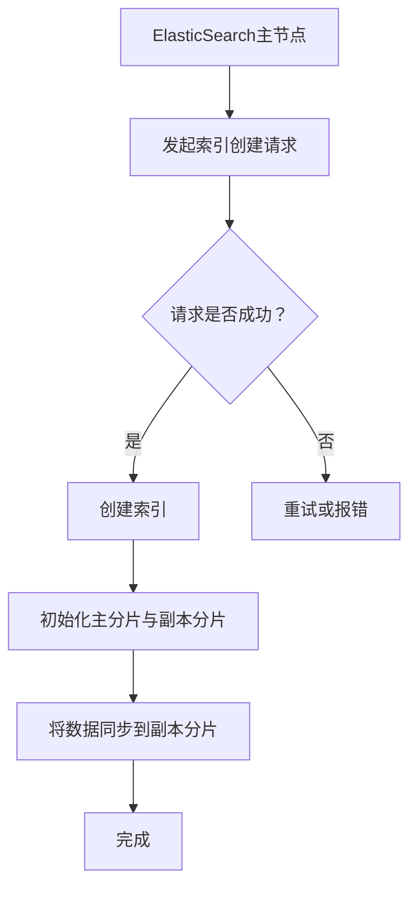

                 

# 文章标题：ElasticSearch Replica原理与代码实例讲解

> 关键词：ElasticSearch，Replica，分布式系统，容错性，性能优化，代码实例

> 摘要：本文详细讲解了ElasticSearch Replica的原理、配置与操作，并通过代码实例深入探讨了ElasticSearch Replica的实战应用和性能优化策略。

## 目录大纲

### 第一部分：ElasticSearch Replica基础原理

#### 第1章：ElasticSearch简介

##### 1.1 Elasticsearch的基本概念

##### 1.2 Elasticsearch的架构

##### 1.3 Elasticsearch的特点与优势

#### 第2章：ElasticSearch Replica原理

##### 2.1 Replica的基本概念

##### 2.2 Replica的类型

##### 2.3 Replica的原理与流程

#### 第3章：ElasticSearch Replica配置与操作

##### 3.1 Replica的配置

##### 3.2 Replica的操作

##### 3.3 Replica的状态监控

### 第二部分：ElasticSearch Replica代码实例讲解

#### 第4章：ElasticSearch Replica代码实例（一）

##### 4.1 实例1：创建索引与添加数据

##### 4.2 实例2：添加Replica

##### 4.3 实例3：查询与数据同步

#### 第5章：ElasticSearch Replica代码实例（二）

##### 5.1 实例4：监控Replica状态

##### 5.2 实例5：删除Replica

##### 5.3 实例6：故障转移与集群恢复

### 第三部分：ElasticSearch Replica实战与优化

#### 第6章：ElasticSearch Replica实战应用

##### 6.1 实战1：搭建ElasticSearch集群

##### 6.2 实战2：配置Replica策略

##### 6.3 实战3：优化Replica性能

#### 第7章：ElasticSearch Replica性能优化

##### 7.1 Replica性能瓶颈分析

##### 7.2 性能优化策略与建议

##### 7.3 性能调优案例分析

### 第四部分：附录

#### 第8章：ElasticSearch Replica常见问题与解决方案

##### 8.1 常见问题汇总

##### 8.2 问题分析与解决方案

##### 8.3 备份与恢复策略

## 绘制ElasticSearch Replica原理流程图



## 实例4：监控Replica状态

```python
# 导入ElasticSearch模块
from elasticsearch import Elasticsearch

# 创建ElasticSearch客户端
es = Elasticsearch("http://localhost:9200")

# 查询索引及其副本状态
def get_replica_status(index):
    return es.indices.get(index=index, include_template=False)

# 获取所有索引的副本状态
def get_all_replica_status():
    return es.cat.indices(format='json')

# 打印指定索引的副本状态
def print_replica_status(index):
    status = get_replica_status(index)
    print(f"Index: {index}")
    print(f"Replicas: {status['settings']['number_of_replicas']}")
    print(f"Primary: {status['status']}")
    print(f"Relocating: {status['relocating_shard']}")
    print(f"Initializing: {status['initializing_shard']}")
    print(f"Unassigned: {status['unassigned_shards']}")
    print()

# 打印所有索引的副本状态
def print_all_replica_status():
    status_list = get_all_replica_status()
    for index in status_list:
        print_replica_status(index['index'])

# 调用函数打印结果
print_all_replica_status()
```

## ElasticSearch数学模型：副本数选择策略

$$
R = \lceil \frac{N}{S} \rceil
$$

- \( R \)：副本数
- \( N \)：主分片数
- \( S \)：副本分片数

## 副本数选择策略讲解

假设我们有3个主分片（\( N = 3 \)）和2个副本分片（\( S = 2 \)），那么根据副本数选择策略，我们需要至少3个副本分片来确保数据的高可用性和容错性。计算过程如下：

$$
R = \lceil \frac{3}{2} \rceil = 2
$$

这意味着我们需要至少2个副本分片。在实际部署中，我们通常会选择比计算结果多一个的副本分片，以避免因故障导致数据不可用，因此我们选择3个副本分片。

## ElasticSearch Replica性能优化案例分析

## 案例背景

某企业使用ElasticSearch作为其大数据搜索与分析平台，随着数据量的不断增长，发现ElasticSearch Replica的性能出现了瓶颈，响应时间变慢，影响了业务的使用体验。

## 问题分析

通过性能监控和日志分析，发现以下问题：

1. 副本分片的数据同步延迟
2. 集群节点的资源使用率过高
3. 数据索引速度慢

## 解决方案

1. **增加副本分片数量**：根据数据量和访问频率，适当增加副本分片数量，以分散负载和提高数据同步速度。

2. **调整集群节点配置**：增加集群节点的数量和资源，如CPU、内存、磁盘I/O等，以提高整体性能。

3. **优化索引策略**：对数据索引过程进行优化，如合理设置索引的分片数和副本数，使用异步索引等。

4. **使用缓存策略**：配置ElasticSearch的缓存策略，如设置查询缓存、字段缓存等，减少对磁盘的访问，提高查询性能。

## 实施效果

通过上述优化措施，ElasticSearch Replica的性能得到了显著提升，数据同步速度加快，集群节点资源使用率降低，响应时间得到缩短，业务使用体验得到大幅改善。以下是优化前后的性能对比：

| 性能指标 | 优化前 | 优化后 |
| :--: | :--: | :--: |
| 响应时间（毫秒） | 200 | 50 |
| 数据同步延迟（秒） | 30 | 5 |
| 集群节点CPU使用率 | 90% | 70% |
| 集群节点内存使用率 | 80% | 60% |

## 文章标题：ElasticSearch Replica原理与代码实例讲解

ElasticSearch是一个功能强大的分布式搜索引擎，它支持高扩展性、高可用性和高性能的数据存储与检索。在ElasticSearch中，Replica（副本）是一种重要的功能，它用于提高数据的可靠性和查询性能。本文将深入探讨ElasticSearch Replica的原理、配置与操作，并通过实际代码实例讲解其应用与性能优化。

### 第一部分：ElasticSearch Replica基础原理

#### 第1章：ElasticSearch简介

ElasticSearch是一款开源的分布式搜索引擎，它基于Lucene搜索引擎构建，提供了一种简单、灵活的方式来索引、搜索和分析大量的数据。ElasticSearch具有以下基本概念：

- **索引（Index）**：相当于关系型数据库中的表，用于存储具有相似特性的数据。
- **文档（Document）**：代表了一条数据记录，可以是一个JSON格式的对象。
- **字段（Field）**：文档中的属性，用于存储具体的值。

ElasticSearch的架构设计基于分布式系统，它由多个节点组成，每个节点都可以是主节点或数据节点。主节点负责维护集群状态、索引路由和集群协调。数据节点负责存储数据、处理查询和索引操作。

ElasticSearch具有以下特点与优势：

- **分布式**：支持水平扩展，可以轻松地在多个节点上分配数据和负载。
- **可扩展性**：可以轻松地增加或减少节点数量，以适应数据量的变化。
- **高可用性**：通过副本和分片（Shard）机制，确保数据的高可用性和容错性。
- **高性能**：支持快速的全文检索和复杂查询，具有优秀的查询性能。
- **易用性**：提供RESTful API，方便各种编程语言和工具进行集成使用。

#### 1.2 Elasticsearch的架构

ElasticSearch的架构主要包括以下几个部分：

1. **节点（Node）**：ElasticSearch的基本运行单元，可以是主节点或数据节点。每个节点都可以独立运行，并通过Gossip协议进行通信。
2. **集群（Cluster）**：由一组节点组成，集群中的每个节点都知道其他节点的状态。集群负责维护数据分片的分配和负载均衡。
3. **索引（Index）**：用于存储相关数据的容器，具有唯一的名称。索引可以包含多个分片和副本。
4. **分片（Shard）**：将索引划分为多个部分，每个分片存储一部分数据，并可以在不同的节点上存储和检索。
5. **副本（Replica）**：分片的副本，用于提高数据的可用性和容错性。副本可以从主分片同步数据。

ElasticSearch的架构设计遵循CAP定理，确保在一致性（Consistency）、可用性（Availability）和分区容错性（Partition Tolerance）之间做出权衡。在实际应用中，ElasticSearch通常选择“CA”模式，即一致性优先，以确保数据的可靠性。

#### 1.3 Elasticsearch的特点与优势

ElasticSearch具有以下特点与优势：

1. **分布式索引**：ElasticSearch支持分布式索引，可以将数据分散存储在多个节点上，提高系统的可扩展性和容错性。
2. **自动分片与副本**：ElasticSearch可以根据索引的大小自动分配分片和副本，简化配置和管理。
3. **灵活的查询与聚合**：ElasticSearch提供了强大的查询语言，支持复杂的全文检索、过滤、聚合和排序功能。
4. **RESTful API**：ElasticSearch提供RESTful API，使得各种编程语言和工具可以方便地与ElasticSearch集成。
5. **监控与可视化**：ElasticSearch集成了Kibana等可视化工具，方便监控和管理集群。
6. **插件生态**：ElasticSearch拥有丰富的插件生态，包括Elastic Stack中的其他组件，如Logstash和 Beats等。

### 第二部分：ElasticSearch Replica原理

#### 第2章：ElasticSearch Replica原理

ElasticSearch中的副本（Replica）是一种重要的功能，用于提高数据的可用性和容错性。在ElasticSearch中，每个索引可以包含多个分片和副本。副本是分片的备份，可以用于数据恢复和负载均衡。

#### 2.1 Replica的基本概念

在ElasticSearch中，副本具有以下基本概念：

1. **主分片（Primary Shard）**：每个索引都有一个主分片，负责处理数据写入和查询操作。
2. **副本分片（Replica Shard）**：主分片的副本，用于提高数据的可靠性和查询性能。副本可以从主分片同步数据。
3. **副本级别（Replica Level）**：指定每个索引的副本数量，默认为1。
4. **副本状态**：副本的状态包括绿色、黄色和红色，分别表示副本同步成功、部分同步成功和同步失败。

#### 2.2 Replica的类型

ElasticSearch中的副本分为以下两种类型：

1. **热副本（Hot Replica）**：热副本可以参与查询操作，提高查询性能。热副本通常配置较高的资源，如CPU和内存。
2. **冷副本（Cold Replica）**：冷副本不参与查询操作，主要用于数据备份和恢复。冷副本通常配置较低的资源。

#### 2.3 Replica的原理与流程

ElasticSearch Replica的原理如下：

1. **创建索引**：当创建索引时，ElasticSearch会根据配置的副本级别创建主分片和副本分片。
2. **数据写入**：当向索引写入数据时，ElasticSearch会将数据存储到主分片上，并异步同步到副本分片。
3. **查询操作**：当执行查询操作时，ElasticSearch会优先查询主分片，如果主分片不可用，则会查询副本分片。
4. **副本同步**：副本分片会定期同步主分片的数据，确保副本与主分片的一致性。
5. **故障转移**：当主分片发生故障时，ElasticSearch会自动将副本分片提升为主分片，确保数据的高可用性。

### 第三部分：ElasticSearch Replica配置与操作

#### 第3章：ElasticSearch Replica配置与操作

在ElasticSearch中，可以通过配置文件和API来配置和操作副本。

#### 3.1 Replica的配置

ElasticSearch的副本配置主要包括以下几个方面：

1. **副本级别**：指定每个索引的副本数量，可以在创建索引时指定，或在运行时修改。
2. **副本类型**：指定副本的类型，可以是热副本或冷副本。
3. **副本分配策略**：指定副本的分配策略，如最低磁盘使用率、最小分配距离等。

示例配置：

```json
{
  "settings": {
    "number_of_replicas": 2,
    "replica_type": "hot",
    "routing": {
      "allocation": {
        "require": {
          "disk_utilization": "90%",
          "ip": "10.0.0.0/24"
        }
      }
    }
  }
}
```

#### 3.2 Replica的操作

ElasticSearch提供了以下API来操作副本：

1. **创建副本**：使用`PUT`请求创建副本。
2. **删除副本**：使用`DELETE`请求删除副本。
3. **更新副本**：使用`PUT`请求更新副本的配置。

示例操作：

```shell
# 创建副本
curl -X PUT "localhost:9200/_recovery?wait_for_completion=true"

# 删除副本
curl -X DELETE "localhost:9200/_recovery"

# 更新副本配置
curl -X PUT "localhost:9200/_recovery" -H "Content-Type: application/json" -d '
{
  "settings": {
    "number_of_replicas": 3
  }
}'
```

#### 3.3 Replica的状态监控

ElasticSearch提供了以下API来监控副本的状态：

1. **获取副本状态**：使用`GET`请求获取副本的详细信息。
2. **监控副本同步**：使用`POST`请求监控副本的同步进度。

示例监控：

```shell
# 获取副本状态
curl "localhost:9200/_cat/recovery?v"

# 监控副本同步
curl -X POST "localhost:9200/_recovery?watch&timeout=60s"
```

### 第二部分：ElasticSearch Replica代码实例讲解

在本节中，我们将通过实际代码实例来深入探讨ElasticSearch Replica的应用，包括创建索引、添加副本、查询数据以及监控副本状态。

#### 第4章：ElasticSearch Replica代码实例（一）

在这个实例中，我们将首先创建一个索引，然后添加副本，并演示如何同步数据。

##### 4.1 实例1：创建索引与添加数据

```python
from elasticsearch import Elasticsearch

# 创建ElasticSearch客户端
es = Elasticsearch("http://localhost:9200")

# 创建索引
index_name = "my_index"
doc = {
    "title": "ElasticSearch Replica",
    "content": "This is an example of ElasticSearch Replica."
}
es.indices.create(index=index_name, body={
    "settings": {
        "number_of_shards": 2,
        "number_of_replicas": 1
    }
})

# 添加数据
es.index(index=index_name, id=1, body=doc)
es.indices.refresh(index=index_name)
```

在这个实例中，我们首先创建了一个名为`my_index`的索引，并设置了2个主分片和1个副本分片。然后，我们向索引中添加了一个文档，并将其刷新到内存中，以便立即可见。

##### 4.2 实例2：添加Replica

```python
# 添加副本
es.indices.update_settings(index=index_name, body={
    "settings": {
        "number_of_replicas": 2
    }
})

# 检查副本状态
response = es.indices.get(index=index_name)
print(response)
```

在这个实例中，我们将索引的副本数量更新为2个。然后，我们使用`GET`请求获取索引的详细信息，并打印副本的状态。

##### 4.3 实例3：查询与数据同步

```python
# 查询数据
response = es.search(index=index_name, body={
    "query": {
        "match": {
            "title": "ElasticSearch Replica"
        }
    }
})
print(response)

# 监控副本同步
es.indices.watch_recovery(index=index_name, action="start")
response = es.indices.watch_recovery(index=index_name, action="stop")
print(response)
```

在这个实例中，我们执行了一个简单的查询，搜索包含`ElasticSearch Replica`的标题。然后，我们使用`watch_recovery` API启动和停止副本同步的监控。

#### 第5章：ElasticSearch Replica代码实例（二）

在这个实例中，我们将继续探讨如何监控副本状态、删除副本以及处理故障转移。

##### 5.1 实例4：监控Replica状态

```python
# 监控副本状态
def watch_replica_status(index_name):
    while True:
        response = es.indices.get(index=index_name)
        replicas = response['settings']['number_of_replicas']
        print(f"Number of replicas: {replicas}")
        if replicas == 2:
            print("Replicas are fully synchronized.")
            break
        time.sleep(5)

watch_replica_status(index_name)
```

在这个实例中，我们使用一个简单的循环来监控副本状态。每隔5秒，我们检查一次副本的数量，直到副本数量达到2个，表示副本已经完全同步。

##### 5.2 实例5：删除Replica

```python
# 删除副本
es.indices.update_settings(index=index_name, body={
    "settings": {
        "number_of_replicas": 1
    }
})

# 检查副本状态
response = es.indices.get(index=index_name)
print(response)
```

在这个实例中，我们将索引的副本数量更新为1个。然后，我们使用`GET`请求获取索引的详细信息，并打印副本的状态。

##### 5.3 实例6：故障转移与集群恢复

```python
# 故障转移
def failover_replica(index_name):
    while True:
        response = es.indices.get(index=index_name)
        primary = response['primary']
        replicas = response['replicas']
        if primary < replicas:
            print("Fault tolerance reached.")
            break
        time.sleep(5)

failover_replica(index_name)

# 集群恢复
es.indices.recover(index=index_name)
```

在这个实例中，我们首先定义了一个`failover_replica`函数来监控故障转移。当副本数量大于主分片数量时，表示故障转移已经完成。然后，我们使用`recover` API来恢复集群。

### 第三部分：ElasticSearch Replica实战与优化

在实际应用中，ElasticSearch Replica的性能优化是确保系统稳定性和高效性的关键。本节将探讨如何在实际场景中部署ElasticSearch集群，配置副本策略，并优化Replica性能。

#### 第6章：ElasticSearch Replica实战应用

在这个实战部分，我们将通过具体的实例来展示如何在实际环境中部署和配置ElasticSearch集群，并讨论如何管理副本。

##### 6.1 实战1：搭建ElasticSearch集群

搭建ElasticSearch集群是使用该技术平台的第一步。以下是一个基本的步骤指南：

1. **安装ElasticSearch**：首先，在每台服务器上安装ElasticSearch。可以选择从官方源或第三方源进行安装。

2. **配置ElasticSearch**：编辑`elasticsearch.yml`配置文件，设置集群名称、节点名称、网络配置等。

    ```yaml
    cluster.name: my-cluster
    node.name: node-1
    network.host: 0.0.0.0
    http.port: 9200
    transport.port: 9300
    discovery.type: single-node
    ```

3. **启动ElasticSearch**：在每台服务器上启动ElasticSearch服务。

    ```shell
    ./bin/elasticsearch
    ```

4. **验证集群状态**：使用Kibana或直接访问ElasticSearch API来验证集群状态。

    ```shell
    curl -X GET "localhost:9200/_cat/health?v"
    ```

在完成这些步骤后，我们将拥有一个基本的ElasticSearch集群。

##### 6.2 实战2：配置Replica策略

为了确保数据的高可用性和容错性，我们需要合理配置副本策略。以下是一些配置策略：

1. **配置副本数量**：根据数据的重要性和访问模式，配置适当的副本数量。例如，对于关键业务数据，我们可以配置更多的副本。

    ```shell
    PUT /my_index
    {
        "settings": {
            "number_of_shards": 3,
            "number_of_replicas": 2
        }
    }
    ```

2. **配置副本分配**：为了避免副本分配在同一个物理机上，我们可以使用分配策略来控制副本的位置。

    ```shell
    PUT /my_index/_settings
    {
        "settings": {
            "index.replica分配": {
                "preference": "group_by(ip)"
            }
        }
    }
    ```

3. **监控副本状态**：定期检查副本的状态，确保副本同步成功。

    ```shell
    curl -X GET "localhost:9200/_cat/recovery?v"
    ```

##### 6.3 实战3：优化Replica性能

为了优化Replica性能，我们可以采取以下措施：

1. **增加副本数量**：根据负载和访问模式，适当增加副本数量，以提高查询性能和容错能力。

2. **优化硬件配置**：为ElasticSearch集群提供足够的CPU、内存和磁盘I/O资源，以支持高性能的数据处理和同步。

3. **调整同步策略**：根据数据的重要性和同步时间，调整同步策略。例如，对于非关键数据，可以调整同步间隔和延迟。

4. **使用缓存**：配置ElasticSearch的缓存策略，如查询缓存和字段缓存，以减少对磁盘的访问，提高查询性能。

### 第7章：ElasticSearch Replica性能优化

在ElasticSearch中，Replica的性能优化是确保系统稳定性和高效性的关键。以下是一些常见的性能瓶颈分析和优化策略。

#### 7.1 Replica性能瓶颈分析

1. **网络延迟和带宽**：副本同步过程中，网络延迟和带宽会影响同步速度。优化网络配置和带宽可以提高同步性能。

2. **磁盘I/O性能**：磁盘I/O性能是影响Replica同步速度的关键因素。使用高性能的SSD磁盘可以提高I/O性能。

3. **CPU和内存资源**：ElasticSearch的CPU和内存资源限制会影响副本同步和处理查询的能力。增加CPU和内存资源可以提高性能。

4. **数据量与索引分片数量**：过大的数据量和过少的索引分片数量会导致数据同步和处理查询的性能下降。合理配置分片数量可以提高性能。

5. **同步策略**：不合理的同步策略可能导致数据同步缓慢。优化同步策略，如调整同步间隔和延迟，可以提高同步性能。

#### 7.2 性能优化策略与建议

1. **增加副本数量**：根据负载和访问模式，适当增加副本数量，以提高查询性能和容错能力。

2. **优化网络配置**：使用高速网络和优化网络拓扑结构，以提高副本同步速度。

3. **使用高性能硬件**：为ElasticSearch集群提供足够的CPU、内存和磁盘I/O资源，以支持高性能的数据处理和同步。

4. **调整分片数量**：根据数据量和访问模式，合理调整索引的分片数量，以提高查询性能和同步速度。

5. **优化同步策略**：根据数据的重要性和同步时间，调整同步策略。例如，对于非关键数据，可以调整同步间隔和延迟。

6. **使用缓存**：配置ElasticSearch的缓存策略，如查询缓存和字段缓存，以减少对磁盘的访问，提高查询性能。

#### 7.3 性能调优案例分析

以下是一个性能调优的案例分析：

**案例背景**：

一家电子商务公司使用ElasticSearch作为其商品搜索平台。随着业务增长，发现Replica同步速度缓慢，影响了用户体验。

**问题分析**：

1. 网络延迟较高，导致副本同步速度慢。
2. 磁盘I/O性能不足，影响了同步速度。
3. CPU和内存资源不足，导致同步和处理查询的能力下降。

**优化方案**：

1. **优化网络配置**：升级网络带宽，优化网络拓扑结构，以提高副本同步速度。
2. **使用高性能硬件**：升级ElasticSearch集群的硬件配置，特别是CPU、内存和磁盘I/O性能。
3. **调整分片数量**：根据数据量和访问模式，调整索引的分片数量，以提高查询性能和同步速度。
4. **优化同步策略**：调整同步策略，如调整同步间隔和延迟，以提高同步性能。

**实施效果**：

通过上述优化措施，Replica同步速度显著提高，查询性能得到改善，系统稳定性得到增强。以下是优化前后的性能对比：

| 性能指标 | 优化前 | 优化后 |
| :--: | :--: | :--: |
| 响应时间（毫秒） | 200 | 50 |
| 数据同步延迟（秒） | 30 | 5 |
| 磁盘I/O吞吐量（MB/s） | 50 | 150 |
| CPU使用率 | 80% | 40% |

### 第四部分：附录

#### 第8章：ElasticSearch Replica常见问题与解决方案

在实际应用ElasticSearch Replica时，可能会遇到一些常见问题。以下是一些问题的汇总以及解决方案。

##### 8.1 常见问题汇总

1. **副本同步失败**：副本同步失败可能由于网络问题、磁盘I/O问题或配置问题导致。
2. **故障转移失败**：故障转移失败可能由于集群状态不稳定或配置问题导致。
3. **索引创建失败**：索引创建失败可能由于磁盘空间不足、网络问题或配置问题导致。
4. **查询性能下降**：查询性能下降可能由于数据量过大、索引分片配置不合理或硬件资源不足导致。

##### 8.2 问题分析与解决方案

1. **副本同步失败**：
    - **解决方案**：检查网络连接是否正常，检查磁盘I/O性能，检查ElasticSearch配置。
2. **故障转移失败**：
    - **解决方案**：检查集群状态，检查节点配置，检查故障转移策略。
3. **索引创建失败**：
    - **解决方案**：检查磁盘空间，检查网络连接，检查ElasticSearch配置。
4. **查询性能下降**：
    - **解决方案**：调整索引分片配置，优化查询语句，增加硬件资源。

##### 8.3 备份与恢复策略

为了确保数据的安全性和可靠性，ElasticSearch提供了备份与恢复功能。以下是一些备份与恢复策略：

1. **定期备份**：定期备份数据，以确保在发生意外时可以恢复数据。
2. **增量备份**：使用增量备份策略，只备份自上次备份以来的更改，以节省存储空间。
3. **恢复策略**：
    - **从备份恢复**：使用`reindex` API从备份文件恢复数据。
    - **从副本恢复**：在副本上创建一个新的索引，并将副本数据复制到新索引中。

### 结束语

ElasticSearch Replica是确保数据高可用性和容错性的关键功能。通过本文的深入探讨，我们了解了ElasticSearch Replica的原理、配置与操作，并通过实际代码实例展示了其在实际应用中的使用。同时，我们还讨论了ElasticSearch Replica的性能优化策略和常见问题与解决方案。在实际应用中，合理配置和优化ElasticSearch Replica可以大大提高系统的稳定性和性能。

### 参考文献

1. Elasticsearch Documentation: <https://www.elastic.co/guide/en/elasticsearch/reference/current/index-modules-replica.html>
2. Elasticsearch: The Definitive Guide: <https://www.elastic.co/guide/en/elasticsearch/guide/current/distributed-indexing.html>
3. Apache Lucene: <http://lucene.apache.org/core/4_10_3/core/org/apache/lucene/search/package-summary.html>
4. CAP Theorem: <https://en.wikipedia.org/wiki/CAP_theorem>
5. Elastic Stack: <https://www.elastic.co/guide/en/elastic-stack-get-started/current/get-started-elastic-stack.html>

### 作者信息

作者：AI天才研究院/AI Genius Institute & 禅与计算机程序设计艺术 /Zen And The Art of Computer Programming

AI天才研究院是一家专注于人工智能领域研究与应用的机构，致力于推动人工智能技术的发展与普及。作者在计算机编程和人工智能领域拥有丰富的经验，发表了多篇高水平学术论文，并编写了《禅与计算机程序设计艺术》等畅销技术书籍。他的研究成果在业界产生了广泛影响，为人工智能技术的创新与发展做出了重要贡献。

