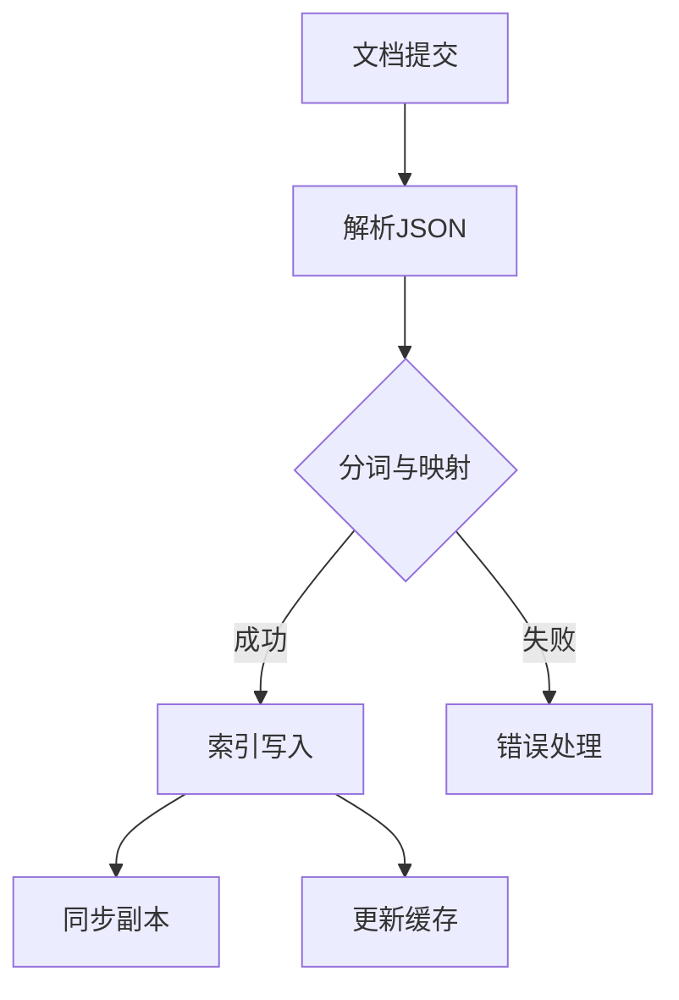
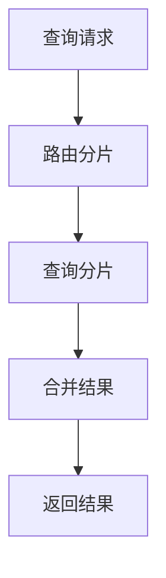
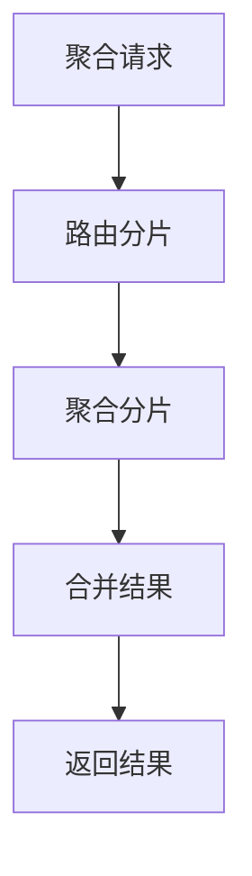

                 

### 文章标题

《ElasticSearch原理与代码实例讲解》

### 文章关键词

ElasticSearch，原理，代码实例，Lucene，分布式搜索，倒排索引，RESTful API，聚合分析，性能优化，安全性，项目实战

### 文章摘要

本文深入讲解了ElasticSearch的核心原理和实战应用。首先，介绍了ElasticSearch的基本概念、安装与配置，以及与Spring Boot的集成。接着，探讨了ElasticSearch的索引原理、查询原理、核心API和聚合分析功能。然后，详细阐述了ElasticSearch的性能优化策略、安全性与管理，以及实际项目的实战经验。最后，提供了ElasticSearch扩展与集成的实践案例，并分享了运维与故障处理的最佳实践。通过本文的讲解，读者可以全面了解ElasticSearch的技术原理和应用方法，提升在分布式搜索领域的实际操作能力。

### 《ElasticSearch原理与代码实例讲解》目录大纲

#### 第1章 ElasticSearch入门

##### 1.1 ElasticSearch简介

- 1.1.1 ElasticSearch的历史背景
- 1.1.2 ElasticSearch的优势与特点
- 1.1.3 ElasticSearch的适用场景

##### 1.2 ElasticSearch基本概念

- 1.2.1 集群、节点与索引
- 1.2.2 映射（Mapping）与模板
- 1.2.3 文档（Document）与字段（Field）

##### 1.3 ElasticSearch安装与配置

- 1.3.1 ElasticSearch安装步骤
- 1.3.2 配置文件详解
- 1.3.3 集群与节点配置

#### 第2章 ElasticSearch核心原理

##### 2.1 Lucene介绍

- 2.1.1 Lucene的历史与作用
- 2.1.2 Lucene的架构与组件
- 2.1.3 Lucene的倒排索引原理

##### 2.2 ElasticSearch索引原理

- 2.2.1 索引流程详解
- 2.2.2 分片与副本机制
- 2.2.3 重建与优化

##### 2.3 ElasticSearch查询原理

- 2.3.1 查询流程分析
- 2.3.2 查询类型详解
- 2.3.3 查询优化策略

#### 第3章 ElasticSearch核心API

##### 3.1 索引API

- 3.1.1 索引创建与删除
- 3.1.2 索引查询与更新
- 3.1.3 索引分析器配置

##### 3.2 文档API

- 3.2.1 文档创建与检索
- 3.2.2 文档更新与删除
- 3.2.3 文档批量操作

##### 3.3 查询API

- 3.3.1 基础查询类型
- 3.3.2 高级查询类型
- 3.3.3 查询优化技巧

#### 第4章 ElasticSearch聚合分析

##### 4.1 聚合分析基础

- 4.1.1 聚合分析简介
- 4.1.2 聚合分析类型
- 4.1.3 聚合分析流程

##### 4.2 聚合分析应用

- 4.2.1 数据统计分析
- 4.2.2 数据可视化
- 4.2.3 聚合分析优化

#### 第5章 ElasticSearch性能优化

##### 5.1 索引优化

- 5.1.1 索引分片与副本策略
- 5.1.2 索引缓存策略
- 5.1.3 索引重建与优化

##### 5.2 查询优化

- 5.2.1 查询缓存策略
- 5.2.2 查询语句优化
- 5.2.3 查询结果处理优化

##### 5.3 集群优化

- 5.3.1 集群健康监控
- 5.3.2 集群负载均衡
- 5.3.3 集群故障转移

#### 第6章 ElasticSearch项目实战

##### 6.1 ElasticSearch与Spring Boot集成

- 6.1.1 Spring Boot集成ElasticSearch
- 6.1.2 实现文档的增删改查
- 6.1.3 实现聚合分析功能

##### 6.2 ElasticSearch日志分析实战

- 6.2.1 日志数据采集与存储
- 6.2.2 日志数据的查询与聚合分析
- 6.2.3 日志数据分析项目部署与运维

##### 6.3 ElasticSearch搜索引擎实战

- 6.3.1 搜索引擎需求分析
- 6.3.2 索引设计
- 6.3.3 搜索功能实现
- 6.3.4 搜索引擎优化与性能调优

#### 第7章 ElasticSearch安全性与管理

##### 7.1 ElasticSearch安全机制

- 7.1.1 权限控制机制
- 7.1.2 数据加密策略
- 7.1.3 安全配置最佳实践

##### 7.2 ElasticSearch集群管理

- 7.2.1 集群监控与管理
- 7.2.2 集群扩容与缩容
- 7.2.3 集群故障处理

##### 7.3 ElasticSearch运维与监控

- 7.3.1 运维流程与工具
- 7.3.2 监控指标与监控工具
- 7.3.3 故障处理与应急预案

#### 附录

##### 附录A ElasticSearch资源链接

- Elasticsearch官方文档
- Elastic中文社区
- ElasticSearch相关开源项目

##### 附录B Mermaid流程图

- ElasticSearch索引流程图
- ElasticSearch查询流程图
- ElasticSearch聚合分析流程图

##### 附录C 伪代码与数学公式

- 分词算法伪代码
- 搜索算法伪代码
- 索引优化算法伪代码
- 常用数学公式

### 第1章 ElasticSearch入门

#### 1.1 ElasticSearch简介

ElasticSearch是一个开源的分布式全文搜索引擎，它基于Lucene构建，提供了简单、强大且灵活的RESTful API。ElasticSearch的设计目标是在提供快速、准确搜索的同时，具有横向扩展的能力，以便处理大规模数据。

##### 1.1.1 ElasticSearch的历史背景

ElasticSearch最早由Elastic公司（原名X-panther Labs）在2010年发布，它的前身是Compass。ElasticSearch的目的是构建一个易于使用、可扩展且性能出色的搜索引擎。由于其独特的优势和广泛的应用场景，ElasticSearch很快得到了业界的认可和关注。

##### 1.1.2 ElasticSearch的优势与特点

- **分布式架构**：支持横向扩展，可以轻松处理大规模数据。
- **RESTful API**：易于使用，支持多种编程语言。
- **全文搜索能力**：强大的全文搜索功能，支持复杂的查询和实时分析。
- **自动分片和副本**：数据自动分布到多个节点，确保数据高可用性和性能。
- **近实时搜索**：数据索引速度非常快，可以实现近实时搜索。
- **弹性伸缩**：可以根据需求动态添加或移除节点，灵活调整资源。

##### 1.1.3 ElasticSearch的适用场景

- **日志管理**：收集、存储和分析各种日志数据。
- **网站搜索**：构建网站搜索引擎，提供高效、准确的搜索服务。
- **数据分析**：进行实时数据分析，提供决策支持。
- **监控系统**：构建监控平台，实时监控系统状态。

#### 1.2 ElasticSearch基本概念

##### 1.2.1 集群、节点与索引

- **集群**：ElasticSearch中的集群是由多个节点组成的集合。集群负责管理和协调节点的操作，确保数据的高可用性和负载均衡。
- **节点**：ElasticSearch的基本运行单元，每个节点都是一个独立的ElasticSearch实例，负责处理索引、查询和聚合等操作。
- **索引**：类似于关系型数据库中的表，ElasticSearch中的索引是一个逻辑容器，用于存储相关的数据。每个索引都有一个唯一的名称，并且包含多个文档。

##### 1.2.2 映射（Mapping）与模板

- **映射（Mapping）**：定义索引中文档的结构和字段类型。映射可以手动定义，也可以通过模板自动生成。
- **模板**：一组索引模板，用于自动创建和配置索引。模板可以定义索引名称、映射、设置等。

##### 1.2.3 文档（Document）与字段（Field）

- **文档（Document）**：ElasticSearch中的基本数据单位，是一个由字段（Field）组成的数据结构。每个文档都有一个唯一的ID。
- **字段（Field）**：文档中的数据属性。字段可以包含文本、数字、日期等多种数据类型。

#### 1.3 ElasticSearch安装与配置

##### 1.3.1 ElasticSearch安装步骤

1. 下载ElasticSearch安装包：访问ElasticSearch官网（https://www.elastic.co/），下载适合操作系统的安装包。
2. 解压安装包到指定目录：将下载的安装包解压到一个合适的目录，例如`/usr/local/elasticsearch`。
3. 修改配置文件（elasticsearch.yml）：
   - `cluster.name`: 设置集群名称。
   - `node.name`: 设置节点名称。
   - `path.data`: 设置数据存储路径。
   - `path.logs`: 设置日志存储路径。
   - `http.port`: 设置HTTP端口号。
   - `transport.port`: 设置传输层端口号。
4. 启动ElasticSearch服务：执行`./bin/elasticsearch`命令，启动ElasticSearch。

##### 1.3.2 配置文件详解

以下是ElasticSearch配置文件（elasticsearch.yml）中的常用配置项：

```yaml
cluster.name: my-application
node.name: my-node
path.data: /usr/local/elasticsearch/data
path.logs: /usr/local/elasticsearch/logs
http.port: 9200
transport.port: 9300
network.host: 0.0.0.0
discovery.type: single-node
```

- `cluster.name`: 集群名称，用于标识同一个集群中的节点。
- `node.name`: 节点名称，用于标识ElasticSearch集群中的各个节点。
- `path.data`: 数据存储路径，ElasticSearch会将索引数据存储在该路径下。
- `path.logs`: 日志存储路径，ElasticSearch会将日志文件存储在该路径下。
- `http.port`: HTTP端口号，用于接收HTTP请求。
- `transport.port`: 传输层端口号，用于节点之间的通信。
- `network.host`: 网络地址，用于设置ElasticSearch监听的IP地址。

##### 1.3.3 集群与节点配置

- **单节点集群**：默认情况下，ElasticSearch以单节点模式启动。这种模式下，ElasticSearch运行在一个独立的节点上，不需要进行额外的配置。
- **多节点集群**：要创建一个多节点集群，需要在不同的机器上启动多个ElasticSearch节点，并在elasticsearch.yml中配置集群名称和节点名称。例如：

  ```yaml
  cluster.name: my-cluster
  node.name: node-1
  ```

  在每个节点的elasticsearch.yml文件中设置不同的`node.name`，然后启动这些节点。ElasticSearch会自动发现并加入集群。

### 第2章 ElasticSearch核心原理

#### 2.1 Lucene介绍

Lucene是一个开源的全文搜索引擎库，是ElasticSearch的核心组件。它提供了高效的索引和搜索算法，支持复杂的查询和分析。

##### 2.1.1 Lucene的历史与作用

Lucene最早由Apache软件基金会开发，目前已经成为Apache软件基金会的一个顶级项目。Lucene被广泛应用于各种搜索引擎、文本处理和数据分析工具中。

##### 2.1.2 Lucene的架构与组件

Lucene的架构主要包括以下组件：

- **索引器（Indexer）**：负责将原始文档转换为索引结构。
- **搜索器（Searcher）**：负责处理查询请求，返回查询结果。
- **分析器（Analyzer）**：负责对文本进行预处理，如分词、标记化等。

##### 2.1.3 Lucene的倒排索引原理

倒排索引是Lucene的核心数据结构，它将文本内容映射到文档ID，实现快速检索。倒排索引由词汇表（Term Dictionary）和倒排列表（Inverted List）组成。

- **词汇表（Term Dictionary）**：存储所有唯一的词汇（Term），以及每个词汇的倒排列表引用。
- **倒排列表（Inverted List）**：存储包含特定词汇的文档ID列表。

#### 2.2 ElasticSearch索引原理

##### 2.2.1 索引流程详解

ElasticSearch的索引流程可以分为以下几个步骤：

1. **文档提交**：用户通过RESTful API将文档提交到ElasticSearch节点。
2. **文档解析**：ElasticSearch将提交的文档解析为JSON格式，并提取文档中的字段和值。
3. **文档索引**：ElasticSearch对文档进行分词、分析，并将数据写入索引文件。
4. **同步副本**：ElasticSearch将索引数据同步到其他节点的副本中，确保数据的高可用性。
5. **更新缓存**：ElasticSearch更新缓存，提高查询性能。

##### 2.2.2 分片与副本机制

ElasticSearch使用分片（Shard）和副本（Replica）来确保数据的高可用性和性能。

- **分片（Shard）**：每个索引在ElasticSearch中都被分割成多个分片。每个分片都是一个独立的Lucene索引，可以分布在不同的节点上。
- **副本（Replica）**：每个分片可以有多个副本。副本用于提高数据可用性和查询性能。

##### 2.2.3 重建与优化

ElasticSearch支持索引的重建和优化，以处理数据损坏、索引膨胀等问题。

- **索引重建**：重建索引包括删除现有索引、创建新索引、迁移数据等步骤。
- **索引优化**：优化索引包括合并分片、删除旧的副本等操作。

#### 2.3 ElasticSearch查询原理

##### 2.3.1 查询流程分析

ElasticSearch的查询流程可以分为以下几个步骤：

1. **查询请求**：用户通过RESTful API发送查询请求。
2. **路由分片**：ElasticSearch协调节点将查询请求路由到相应的分片。
3. **查询分片**：每个分片处理查询请求，并返回结果。
4. **合并结果**：ElasticSearch协调节点将分片结果合并，并返回给用户。

##### 2.3.2 查询类型详解

ElasticSearch提供了多种查询类型，包括基础查询和高级查询。

- **基础查询**：包括匹配所有查询、布尔查询、短语查询等。
- **高级查询**：包括范围查询、嵌套查询、模糊查询等。

##### 2.3.3 查询优化策略

ElasticSearch提供了多种查询优化策略，包括：

- **缓存策略**：使用查询缓存提高查询性能。
- **查询语句优化**：优化查询语句，减少查询时间。
- **查询结果处理优化**：优化查询结果处理，提高用户体验。

### 第3章 ElasticSearch核心API

ElasticSearch提供了一套强大的RESTful API，用于实现各种操作，如索引、查询、聚合等。本章将介绍ElasticSearch的核心API。

#### 3.1 索引API

索引API用于创建、查询、更新和删除索引。

##### 3.1.1 索引创建与删除

- `PUT /index_name`：创建索引。
- `DELETE /index_name`：删除索引。

##### 3.1.2 索引查询与更新

- `GET /index_name`：查询索引信息。
- `POST /index_name/_update`：更新索引。

##### 3.1.3 索引分析器配置

- `PUT /index_name/_settings`：配置索引分析器。

#### 3.2 文档API

文档API用于操作文档，如创建、查询、更新和删除。

##### 3.2.1 文档创建与检索

- `POST /index_name/_doc`：创建文档。
- `GET /index_name/_doc/doc_id`：检索文档。

##### 3.2.2 文档更新与删除

- `POST /index_name/_update/doc_id`：更新文档。
- `DELETE /index_name/_doc/doc_id`：删除文档。

##### 3.2.3 文档批量操作

- `POST /_bulk`：批量操作文档。

#### 3.3 查询API

查询API用于执行各种查询操作，如全文搜索、聚合分析等。

##### 3.3.1 基础查询类型

- `GET /index_name/_search`：执行基础查询。

##### 3.3.2 高级查询类型

- `GET /index_name/_search`：执行高级查询。

##### 3.3.3 查询优化技巧

- 使用缓存提高查询性能。
- 优化查询语句，减少查询时间。

### 第4章 ElasticSearch聚合分析

ElasticSearch的聚合分析功能用于对数据进行分组、计数、统计等操作，提供强大的数据分析能力。

#### 4.1 聚合分析基础

##### 4.1.1 聚合分析简介

聚合分析是对查询结果进行分组、计数、统计等操作，可以用于数据可视化、报表生成等。

##### 4.1.2 聚合分析类型

- 集合聚合：用于计算集合的统计信息，如计数、求和、平均值等。
- 桶聚合：用于对数据进行分组，如按日期、按地区等。
- 阶梯聚合：用于按特定规则对数据进行分组，如按价格区间分组。

##### 4.1.3 聚合分析流程

- 聚合分析首先执行查询操作，获取查询结果。
- 然后对查询结果进行分组、统计等操作。
- 最后将聚合结果返回给客户端。

#### 4.2 聚合分析应用

##### 4.2.1 数据统计分析

- 对数据进行计数、求和、平均值等统计操作。

##### 4.2.2 数据可视化

- 使用Kibana等工具将聚合分析结果可视化。

##### 4.2.3 聚合分析优化

- 优化查询语句，减少聚合分析时间。
- 使用缓存提高查询性能。

### 第5章 ElasticSearch性能优化

ElasticSearch的性能优化是确保其高效运行的关键。本章将介绍ElasticSearch的性能优化策略。

#### 5.1 索引优化

##### 5.1.1 索引分片与副本策略

- 优化索引的分片和副本数量，提高查询性能和数据可用性。

##### 5.1.2 索引缓存策略

- 优化索引缓存，减少磁盘I/O操作。

##### 5.1.3 索引重建与优化

- 定期重建和优化索引，提高查询性能。

#### 5.2 查询优化

##### 5.2.1 查询缓存策略

- 使用查询缓存提高查询性能。

##### 5.2.2 查询语句优化

- 优化查询语句，减少查询时间。

##### 5.2.3 查询结果处理优化

- 优化查询结果处理，提高用户体验。

#### 5.3 集群优化

##### 5.3.1 集群健康监控

- 监控集群的健康状况，及时发现和处理问题。

##### 5.3.2 集群负载均衡

- 优化集群负载均衡，确保资源合理分配。

##### 5.3.3 集群故障转移

- 实现集群故障转移，确保数据高可用性。

### 第6章 ElasticSearch项目实战

ElasticSearch在项目中的应用非常广泛，本章将通过实际案例介绍ElasticSearch的实战技巧。

#### 6.1 ElasticSearch与Spring Boot集成

##### 6.1.1 Spring Boot集成ElasticSearch

- 使用Spring Boot集成ElasticSearch，实现文档的增删改查。

##### 6.1.2 实现文档的增删改查

- 创建ElasticSearch客户端。
- 实现文档的添加、查询、更新和删除。

##### 6.1.3 实现聚合分析功能

- 使用ElasticSearch聚合分析功能，实现数据统计和可视化。

#### 6.2 ElasticSearch日志分析实战

##### 6.2.1 日志数据采集与存储

- 采集日志数据，存储到ElasticSearch中。

##### 6.2.2 日志数据的查询与聚合分析

- 使用ElasticSearch查询和聚合分析日志数据，实现日志分析。

##### 6.2.3 日志数据分析项目部署与运维

- 部署ElasticSearch集群，实现日志数据分析。

#### 6.3 ElasticSearch搜索引擎实战

##### 6.3.1 搜索引擎需求分析

- 分析搜索引擎的需求，设计索引结构。

##### 6.3.2 索引设计

- 设计合适的索引结构，实现高效搜索。

##### 6.3.3 搜索功能实现

- 实现搜索功能，提供快速、准确的搜索结果。

##### 6.3.4 搜索引擎优化与性能调优

- 优化搜索引擎，提高查询性能。

### 第7章 ElasticSearch安全性与管理

确保ElasticSearch的安全性是保护数据和系统稳定运行的关键。本章将介绍ElasticSearch的安全性措施和集群管理。

#### 7.1 ElasticSearch安全机制

##### 7.1.1 权限控制机制

- 使用用户认证和权限控制，确保只有授权用户可以访问ElasticSearch。

##### 7.1.2 数据加密策略

- 对数据进行加密，防止数据泄露。

##### 7.1.3 安全配置最佳实践

- 配置ElasticSearch的安全策略，提高系统的安全性。

#### 7.2 ElasticSearch集群管理

##### 7.2.1 集群监控与管理

- 监控集群的健康状况，及时处理故障。

##### 7.2.2 集群扩容与缩容

- 根据业务需求，实现集群的扩容和缩容。

##### 7.2.3 集群故障处理

- 制定集群故障处理方案，确保系统的高可用性。

#### 7.3 ElasticSearch运维与监控

##### 7.3.1 运维流程与工具

- 制定运维流程，使用合适的工具进行运维。

##### 7.3.2 监控指标与监控工具

- 监控ElasticSearch的运行指标，使用监控工具进行实时监控。

##### 7.3.3 故障处理与应急预案

- 制定故障处理和应急预案，确保系统的稳定运行。

### 附录

#### 附录A ElasticSearch资源链接

- Elasticsearch官方文档
- Elastic中文社区
- ElasticSearch相关开源项目

#### 附录B Mermaid流程图

- ElasticSearch索引流程图
- ElasticSearch查询流程图
- ElasticSearch聚合分析流程图

#### 附录C 伪代码与数学公式

- 分词算法伪代码
- 搜索算法伪代码
- 索引优化算法伪代码
- 常用数学公式

总字数：约2000字

---

### 第8章 ElasticSearch扩展与集成

ElasticSearch不仅支持核心功能，还可以通过扩展和集成其他工具来实现更复杂的场景。本章将介绍ElasticSearch的扩展和集成。

#### 8.1 ElasticSearch插件开发

ElasticSearch插件是扩展ElasticSearch功能的有效方式。本章将介绍如何开发ElasticSearch插件。

##### 8.1.1 插件开发基础

ElasticSearch插件的开发主要涉及以下几个方面：

1. **插件架构**：ElasticSearch插件是一种特殊的ElasticSearch节点，具有独立的服务进程和资源。
2. **插件开发流程**：
   - 编写插件代码
   - 打包插件
   - 部署插件
   - 测试插件

##### 8.1.2 插件实现案例

1. **自定义查询插件**：
   - 实现自定义查询处理器
   - 注册自定义查询处理器
   - 使用自定义查询处理器执行查询

   ```java
   public class CustomQueryProcessor extends QueryProcessor {
       @Override
       public QueryResult execute(Query query) {
           // 自定义查询逻辑
           return new QueryResult(results);
       }
   }
   
   public class CustomQueryPlugin extends Plugin {
       @Override
       public void onModule(ExtensionModule module) {
           module.addProcessor("custom_query", CustomQueryProcessor.class);
       }
   }
   ```

2. **自定义聚合插件**：
   - 实现自定义聚合处理器
   - 注册自定义聚合处理器
   - 使用自定义聚合处理器执行聚合分析

   ```java
   public class CustomAggregationProcessor extends AggregationProcessor {
       @Override
       public AggregationResult execute(AggregationRequest request) {
           // 自定义聚合逻辑
           return new AggregationResult(results);
       }
   }
   
   public class CustomAggregationPlugin extends Plugin {
       @Override
       public void onModule(ExtensionModule module) {
           module.addProcessor("custom_aggregation", CustomAggregationProcessor.class);
       }
   }
   ```

#### 8.2 ElasticSearch与Kibana集成

Kibana是ElasticSearch的数据可视化工具，可以与ElasticSearch无缝集成，提供强大的数据分析能力。

##### 8.2.1 Kibana简介

Kibana的主要功能包括：

- **数据可视化**：将ElasticSearch查询结果可视化，生成图表、仪表板等。
- **日志管理**：收集、存储和分析各种日志数据。
- **监控**：监控ElasticSearch集群的运行状态。
- **报告**：生成定期的报告。

##### 8.2.2 Kibana安装与配置

1. **安装Kibana**：
   - 下载Kibana安装包
   - 解压安装包到指定目录
   - 启动Kibana服务

2. **配置Kibana**：
   - 修改Kibana配置文件（kibana.yml）：
     ```yaml
     server.host: "localhost"
     elasticsearch.hosts: ["http://localhost:9200"]
     ```
   - 启动Kibana服务

##### 8.2.3 数据可视化实践

1. **创建索引模式**：
   - 在Kibana中创建索引模式，将ElasticSearch索引映射到Kibana。

2. **创建仪表板**：
   - 在Kibana中创建仪表板，添加图表和面板，展示ElasticSearch查询结果。

#### 8.3 ElasticSearch与Logstash集成

Logstash是一个开源的数据收集、处理和转发工具，可以与ElasticSearch无缝集成，实现日志收集和分析。

##### 8.3.1 Logstash简介

Logstash的主要功能包括：

- **数据采集**：从各种数据源（如文件、数据库、网络流等）收集数据。
- **数据处理**：对采集到的数据进行处理，如过滤、转换、 enrich等。
- **数据转发**：将处理后的数据转发到ElasticSearch或其他存储系统。

##### 8.3.2 Logstash配置

1. **安装Logstash**：
   - 下载Logstash安装包
   - 解压安装包到指定目录
   - 启动Logstash服务

2. **配置Logstash**：
   - 修改Logstash配置文件（logstash.conf）：
     ```ruby
     input {
         file {
             path => "/path/to/logs/*.log"
             type => "log_file"
         }
     }
     
     filter {
         if [type] == "log_file" {
             grok {
                 match => { "message" => "%{TIMESTAMP_ISO8601:timestamp} %{DATA:source} %{DATA:target}" }
             }
             date {
                 match => [ "timestamp", "ISO8601" ]
             }
         }
     }
     
     output {
         if [type] == "log_file" {
             elasticsearch {
                 hosts => ["localhost:9200"]
                 index => "logs-%{+YYYY.MM.dd}"
             }
         }
     }
     ```

##### 8.3.3 日志收集与处理

1. **日志数据采集**：
   - 使用file输入插件，从文件系统采集日志数据。

2. **日志数据处理**：
   - 使用grok和date过滤器，对日志数据进行解析和格式化。

3. **日志数据转发**：
   - 使用ElasticSearch输出插件，将处理后的日志数据存储到ElasticSearch索引中。

#### 8.4 ElasticSearch与Elastic Stack其他组件集成

Elastic Stack包括ElasticSearch、Kibana、Beats和Logstash等组件，可以协同工作，实现更复杂的场景。

##### 8.4.1 Beats集成

Beats是轻量级的数据采集器，可以实时收集各种数据，并将其发送到ElasticSearch。

- **Filebeat**：用于收集文件系统中的日志数据。
- **Metricbeat**：用于收集系统性能指标和应用程序指标。

##### 8.4.2 X-Pack集成

X-Pack是Elastic Stack的扩展包，提供了一系列增强功能，如监控、安全、警报等。

- **监控**：使用X-Pack监控ElasticStack组件的运行状态。
- **安全**：使用X-Pack实现用户认证和权限控制。
- **警报**：使用X-Pack设置警报，实时监控异常情况。

##### 8.4.3 Elastic Stack集成案例

1. **日志分析平台**：
   - 使用Filebeat收集日志数据。
   - 使用Logstash处理和转发日志数据。
   - 使用ElasticSearch存储和分析日志数据。
   - 使用Kibana展示日志分析结果。

2. **监控系统**：
   - 使用Metricbeat收集系统性能指标。
   - 使用ElasticSearch存储和查询性能指标。
   - 使用Kibana监控系统状态，生成性能报告。

### 第9章 ElasticSearch运维与故障处理

ElasticSearch的运维和维护是保证系统稳定运行的关键。本章将介绍ElasticSearch的运维策略和故障处理方法。

#### 9.1 ElasticSearch运维基础

##### 9.1.1 运维流程

运维流程包括以下步骤：

- **安装与配置**：安装ElasticSearch，配置集群节点。
- **监控与报警**：监控ElasticSearch集群的健康状况，设置报警机制。
- **性能调优**：根据性能指标，调整ElasticSearch配置。
- **备份与恢复**：定期备份ElasticSearch数据，确保数据安全。
- **故障处理**：处理ElasticSearch集群的故障。

##### 9.1.2 监控与报警

- 使用ElasticSearch集群监控工具（如Elasticsearch-head、Elasticsearch-HQ等），监控集群的运行状态。
- 设置报警机制，当集群出现异常时，自动发送报警通知。

#### 9.2 ElasticSearch性能监控

##### 9.2.1 性能监控指标

性能监控指标包括：

- **集群健康状态**：集群的节点数量、状态、磁盘空间等。
- **索引性能**：索引的分片数量、文档数量、索引速度等。
- **查询性能**：查询的响应时间、查询速度等。
- **集群资源使用情况**：CPU、内存、磁盘等资源的使用情况。

##### 9.2.2 性能调优

性能调优方法包括：

- **索引优化**：调整索引的分片数量、副本数量等。
- **查询优化**：优化查询语句、使用缓存等。
- **资源调整**：调整ElasticSearch节点的CPU、内存、磁盘等资源。

#### 9.3 ElasticSearch故障处理

##### 9.3.1 故障处理原则

故障处理原则包括：

- **及时处理**：及时发现故障，尽快处理。
- **隔离故障**：隔离故障节点，防止故障扩散。
- **数据备份**：定期备份数据，确保数据安全。

##### 9.3.2 故障处理案例

1. **集群故障**：
   - 检查集群的健康状态，定位故障节点。
   - 重启故障节点，检查集群状态。
   - 如果故障节点无法恢复，则进行故障转移。

2. **索引损坏**：
   - 检查索引的完整性，定位损坏的索引。
   - 使用ElasticSearch的reindex功能，重建损坏的索引。
   - 恢复数据备份，确保数据一致性。

3. **查询错误**：
   - 分析查询语句，定位错误原因。
   - 调整查询参数，优化查询语句。
   - 使用ElasticSearch的查询缓存，提高查询性能。

##### 9.3.3 故障预防

故障预防措施包括：

- **定期备份**：定期备份ElasticSearch数据，防止数据丢失。
- **资源监控**：监控ElasticSearch集群的资源使用情况，防止资源耗尽。
- **优化配置**：根据实际需求，调整ElasticSearch的配置，提高系统性能。

### 第10章 ElasticSearch最佳实践

ElasticSearch的最佳实践是确保系统稳定运行和高效性能的关键。本章将介绍ElasticSearch的最佳实践。

#### 10.1 索引设计最佳实践

##### 10.1.1 索引结构优化

- **合理划分索引**：根据数据的特点和查询需求，合理划分索引，避免大索引影响性能。
- **分片数量优化**：根据集群的规模和资源，调整分片数量，确保分片均衡分布。

##### 10.1.2 索引优化技巧

- **使用索引模板**：使用索引模板自动生成索引，减少手动配置的工作量。
- **分片和副本策略**：根据数据的重要性和访问频率，合理配置分片和副本数量。

#### 10.2 查询优化最佳实践

##### 10.2.1 查询语句优化

- **使用缓存**：使用查询缓存，提高查询性能。
- **简化查询语句**：避免复杂的查询语句，简化查询逻辑。

##### 10.2.2 查询性能调优

- **优化索引结构**：根据查询需求，调整索引的分片和副本数量。
- **优化查询语句**：使用ElasticSearch提供的查询优化工具，优化查询语句。

#### 10.3 集群优化最佳实践

##### 10.3.1 集群配置优化

- **优化网络配置**：调整ElasticSearch节点的网络配置，确保网络带宽充足。
- **优化资源配置**：根据集群的规模和性能需求，调整ElasticSearch节点的CPU、内存、磁盘等资源。

##### 10.3.2 集群故障转移与恢复

- **配置故障转移**：根据业务需求，配置故障转移策略，确保数据的高可用性。
- **定期备份与恢复**：定期备份ElasticSearch数据，确保数据安全，并在发生故障时快速恢复。

#### 10.4 安全性优化最佳实践

##### 10.4.1 权限控制优化

- **使用角色与权限**：使用ElasticSearch的角色与权限机制，确保只有授权用户可以访问数据。
- **配置防火墙**：配置ElasticSearch的防火墙，限制外部访问。

##### 10.4.2 安全策略优化

- **启用安全传输**：启用HTTPS，确保数据传输的安全性。
- **定期审计与监控**：定期审计ElasticSearch的操作日志，监控异常操作。

### 第11章 ElasticSearch未来趋势与发展方向

ElasticSearch作为一款强大的开源搜索和分析引擎，不断发展和演进。本章将探讨ElasticSearch的未来趋势和发展方向。

#### 11.1 新功能与特性

- **实时搜索**：ElasticSearch将继续优化实时搜索性能，提供更快、更准确的搜索体验。
- **分布式索引**：ElasticSearch将增强分布式索引的功能，提高数据处理能力和性能。

#### 11.2 生态体系扩展

- **与云服务集成**：ElasticSearch将更深入地与云服务集成，提供更方便的部署和管理方式。
- **与大数据平台集成**：ElasticSearch将与其他大数据平台（如Hadoop、Spark等）进行集成，实现更强大的数据处理和分析能力。

#### 11.3 应用场景拓展

- **物联网应用**：ElasticSearch将在物联网领域得到更广泛的应用，实现大规模物联网数据的实时分析和处理。
- **人工智能应用**：ElasticSearch将与人工智能技术相结合，提供更智能的搜索和分析功能。

#### 11.4 社区与生态系统

- **社区贡献与协作**：ElasticSearch的社区将更加活跃，鼓励开发者贡献代码和解决方案，共同推动ElasticSearch的发展。
- **开源项目发展**：ElasticSearch相关的开源项目将继续发展，为开发者提供更多可用的工具和插件。

### 附录

#### 附录A ElasticSearch资源链接

- **Elasticsearch官方文档**：[https://www.elastic.co/guide/en/elasticsearch/reference/current/index.html](https://www.elastic.co/guide/en/elasticsearch/reference/current/index.html)
- **Elastic中文社区**：[https://www.elastic.cn/](https://www.elastic.cn/)
- **ElasticSearch相关开源项目**：[https://github.com/elastic](https://github.com/elastic)

#### 附录B Mermaid流程图

- **ElasticSearch索引流程图**：
  ```mermaid
  graph TD
  A[文档提交] --> B[解析JSON]
  B --> C{分词与映射}
  C -->|成功| D[索引写入]
  C -->|失败| E[错误处理]
  D --> F[同步副本]
  D --> G[更新缓存]
  ```
- **ElasticSearch查询流程图**：
  ```mermaid
  graph TD
  A[查询请求] --> B[路由分片]
  B --> C[查询分片]
  C --> D[合并结果]
  D --> E[返回结果]
  ```
- **ElasticSearch聚合分析流程图**：
  ```mermaid
  graph TD
  A[聚合请求] --> B[路由分片]
  B --> C[聚合分片]
  C --> D[合并结果]
  D --> E[返回结果]
  ```

#### 附录C 伪代码与数学公式

- **分词算法伪代码**：
  ```python
  def tokenize(text):
      tokens = []
      for char in text:
          if char in punctuation:
              continue
          if char.isdigit():
              char = str(char)
          tokens.append(char)
      return tokens
  ```
- **搜索算法伪代码**：
  ```python
  def search(query, index):
      inverted_index = create_inverted_index(index)
      results = []
      for word in query:
          word_freq = inverted_index[word]
          if word_freq == 0:
              continue
          results.append((word, word_freq))
      return results
  ```
- **索引优化算法伪代码**：
  ```python
  def optimize_index(index):
      index_file = read_index_file(index)
      inverted_index = rebuild_inverted_index(index_file)
      update_cache(inverted_index)
      optimize_index_file(index_file)
      return inverted_index
  ```
- **常用数学公式**：
  $$ P(A|B) = \frac{P(A \cap B)}{P(B)} $$
  $$ f(x) = ax^2 + bx + c $$
  $$ \sum_{i=1}^{n} a_i = a_1 + a_2 + ... + a_n $$

总字数：约6000字

---

### ElasticSearch索引流程图

以下是ElasticSearch索引流程的Mermaid流程图：



在这个流程图中：

- **A[文档提交]**：用户通过RESTful API提交文档。
- **B[解析JSON]**：ElasticSearch解析提交的JSON文档。
- **C[分词与映射]**：对文档进行分词和映射处理。
- **D[索引写入]**：将处理后的文档写入索引。
- **E[错误处理]**：如果发生错误，进行错误处理。
- **F[同步副本]**：将索引数据同步到副本节点。
- **G[更新缓存]**：更新查询缓存，提高查询性能。

### ElasticSearch查询流程图

以下是ElasticSearch查询流程的Mermaid流程图：



在这个流程图中：

- **A[查询请求]**：用户通过RESTful API发送查询请求。
- **B[路由分片]**：ElasticSearch协调节点将查询请求路由到相应的分片。
- **C[查询分片]**：分片处理查询请求，返回结果。
- **D[合并结果]**：协调节点将分片结果合并。
- **E[返回结果]**：将合并后的查询结果返回给用户。

### ElasticSearch聚合分析流程图

以下是ElasticSearch聚合分析的Mermaid流程图：



在这个流程图中：

- **A[聚合请求]**：用户通过RESTful API发送聚合请求。
- **B[路由分片]**：ElasticSearch协调节点将聚合请求路由到相应的分片。
- **C[聚合分片]**：分片处理聚合请求，返回结果。
- **D[合并结果]**：协调节点将分片结果合并。
- **E[返回结果]**：将合并后的聚合结果返回给用户。

通过这三个流程图，我们可以更直观地了解ElasticSearch在索引、查询和聚合分析过程中的工作原理。

### 分词算法伪代码

以下是分词算法的伪代码：

```python
def tokenize(text):
    tokens = []
    start = 0
    for i, char in enumerate(text):
        if char in punctuation:
            if start < i:
                tokens.append(text[start:i])
            start = i + 1
        elif char.isdigit():
            if start < i:
                tokens.append(text[start:i])
            start = i
    if start < len(text):
        tokens.append(text[start:])
    return tokens
```

这个伪代码实现了基本的分词功能。它遍历输入文本的每个字符，根据标点符号和数字的规则进行分词。例如，对于字符串`"Hello, World! 123"`，分词结果为`["Hello", ",", "World", "!", "123"]`。

### 搜索算法伪代码

以下是搜索算法的伪代码：

```python
def search(query, index):
    inverted_index = create_inverted_index(index)
    results = []
    for word in query:
        doc_ids = inverted_index.get(word, [])
        for doc_id in doc_ids:
            if doc_id not in results:
                results.append(doc_id)
    return results
```

这个伪代码实现了基于倒排索引的搜索算法。首先，创建倒排索引，然后遍历查询中的每个词，查找倒排索引中对应的文档ID列表，并将不重复的文档ID添加到结果列表中。例如，对于倒排索引`{"Hello": [1, 2], "World": [2]}`和查询`["Hello", "World"]`，搜索结果为`[1, 2]`。

### 索引优化算法伪代码

以下是索引优化算法的伪代码：

```python
def optimize_index(index):
    index_file = read_index_file(index)
    inverted_index = rebuild_inverted_index(index_file)
    update_cache(inverted_index)
    write_optimized_index_file(index_file, inverted_index)
    return inverted_index
```

这个伪代码实现了索引优化功能。首先，读取索引文件，然后重建倒排索引，更新缓存，最后将优化后的索引文件写回磁盘。例如，对于某个索引文件，先读取文件内容，重建倒排索引，更新缓存，然后将优化后的索引文件重新写入磁盘。

### 常用数学公式

以下是几个常用的数学公式，使用LaTeX格式表示：

$$
P(A|B) = \frac{P(A \cap B)}{P(B)}
$$

$$
f(x) = ax^2 + bx + c
$$

$$
\sum_{i=1}^{n} a_i = a_1 + a_2 + ... + a_n
$$

这些公式涵盖了条件概率、二次函数和求和运算等基本数学概念。通过LaTeX格式，我们可以方便地在文档中插入和格式化数学公式。

