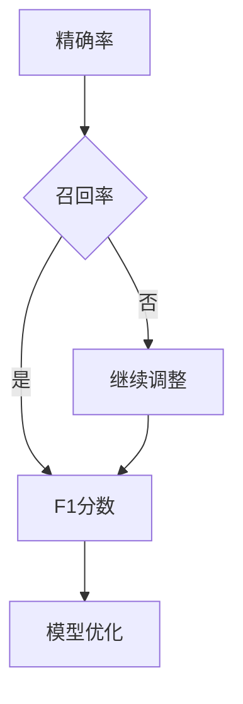

                 

# F1分数

> 关键词：F1分数、精确率、召回率、分类评估、机器学习、深度学习、数据处理

> 摘要：F1分数是一种综合评估分类模型性能的重要指标，它结合了精确率和召回率，能够更全面地反映模型的分类效果。本文将详细探讨F1分数的定义、计算方法、应用场景、提高方法以及未来发展趋势，旨在帮助读者深入理解F1分数在机器学习和深度学习中的重要性。

## 第1章：F1分数概述

### 1.1 F1分数的定义与意义

F1分数（F1 Score）是一种用于评估分类模型性能的度量指标。它通过结合精确率（Precision）和召回率（Recall）来提供对模型准确性的全面评价。

**F1分数的定义：**
F1分数是精确率和召回率的调和平均值，其计算公式为：
$$
F1 = 2 \times \frac{Precision \times Recall}{Precision + Recall}
$$

**F1分数的意义：**
F1分数在评估分类模型时具有重要意义。它不仅能反映模型的分类精度，还能衡量模型对正类样本的召回能力。这使得F1分数特别适用于那些正类样本重要且不平衡的分类任务。

### 1.2 F1分数的计算方法

**精确率的定义：**
精确率是实际为正类样本中，被模型正确预测为正类的比例。其计算公式为：
$$
Precision = \frac{TP}{TP + FP}
$$
其中，TP表示实际为正类且被预测为正类的样本数，FP表示实际为负类但被预测为正类的样本数。

**召回率的定义：**
召回率是实际为正类样本中，被模型成功召回的比例。其计算公式为：
$$
Recall = \frac{TP}{TP + FN}
$$
其中，FN表示实际为正类但被预测为负类的样本数。

**F1分数的计算公式：**
根据精确率和召回率的定义，F1分数的计算公式可以表示为：
$$
F1 = 2 \times \frac{Precision \times Recall}{Precision + Recall}
$$

### 1.3 F1分数与其他评估指标的关系

**精确率、召回率与F1分数的关系：**
F1分数结合了精确率和召回率，能够更全面地反映模型的分类效果。在实际应用中，精确率和召回率往往存在一定的权衡关系。当模型更注重召回率时，可能会牺牲一定的精确率；反之，当模型更注重精确率时，召回率可能会降低。

**F1分数与其他评估指标的比较：**
除了F1分数外，常用的评估分类模型的指标还包括准确率（Accuracy）、精确率（Precision）、召回率（Recall）等。与这些指标相比，F1分数能够更好地平衡精确率和召回率，特别适用于那些正类样本重要且不平衡的分类任务。

## 第2章：F1分数的应用场景

### 2.1 数据分类任务中的应用

**F1分数在文本分类中的应用：**
文本分类是自然语言处理中的一个重要任务，F1分数在评估文本分类模型的性能方面具有重要意义。通过计算F1分数，可以评估模型在文本分类任务中的精确率和召回率，从而全面评价模型的分类效果。

**F1分数在图像分类中的应用：**
图像分类是计算机视觉领域的一项基础任务。F1分数在评估图像分类模型的性能方面同样具有重要作用。通过计算F1分数，可以评估模型在图像分类任务中的精确率和召回率，从而全面评价模型的分类效果。

### 2.2 机器学习竞赛中的F1分数

**Kaggle竞赛中的F1分数：**
Kaggle是一个流行的机器学习竞赛平台，F1分数在Kaggle竞赛中是一种常见的评估指标。通过计算F1分数，竞赛参与者可以评估自己模型的分类效果，与其他参赛者进行比较。

**F1分数在机器学习竞赛中的重要性：**
F1分数在机器学习竞赛中具有重要意义。它不仅能够评估模型的分类性能，还能够反映模型在正类样本重要且不平衡的分类任务中的表现。这使得F1分数成为机器学习竞赛中一种重要的评估指标。

### 2.3 F1分数在其他领域的应用

**F1分数在生物信息学中的应用：**
生物信息学是研究生物数据的一门交叉学科，F1分数在评估生物信息学模型性能方面具有重要意义。通过计算F1分数，可以评估模型在基因分类、蛋白质结构预测等任务中的性能。

**F1分数在金融风险控制中的应用：**
金融风险控制是金融领域中的一项重要任务，F1分数在评估金融风险控制模型的性能方面具有重要意义。通过计算F1分数，可以评估模型在欺诈检测、信用评分等任务中的性能。

## 第3章：提高F1分数的方法

### 3.1 数据预处理

**数据清洗与归一化：**
数据预处理是提高F1分数的重要步骤。通过数据清洗，可以去除噪声数据和异常值，提高数据质量。通过数据归一化，可以使得特征值的分布更加均匀，有助于提升模型的性能。

**数据增强与采样：**
数据增强是一种通过生成新的样本来增加数据多样性的方法。通过数据增强，可以缓解数据不足的问题，提高模型的泛化能力。数据采样是一种通过选择部分数据进行训练的方法，有助于处理数据不平衡问题，从而提高F1分数。

### 3.2 特征选择与工程

**特征提取方法：**
特征提取是一种从原始数据中提取出有用的特征的方法。通过特征提取，可以降低数据的维度，去除无关特征，提高模型的性能。

**特征选择策略：**
特征选择是一种通过选择重要特征来优化模型的方法。通过特征选择，可以去除无关特征，减少模型的复杂度，提高F1分数。

### 3.3 模型选择与调优

**常见分类算法的选择：**
选择合适的分类算法是提高F1分数的关键。常见的分类算法包括支持向量机（SVM）、决策树、随机森林、神经网络等。每种算法都有其优缺点，需要根据具体任务选择合适的算法。

**模型调优技巧：**
模型调优是一种通过调整模型参数来优化模型性能的方法。通过模型调优，可以找到最优的参数设置，从而提高F1分数。

## 第4章：F1分数在实际项目中的应用案例

### 4.1 案例一：文本分类项目

**项目背景：**
文本分类是一种将文本数据分为不同类别的任务，如情感分析、主题分类等。本文将介绍一个文本分类项目，通过计算F1分数来评估模型的性能。

**数据预处理与特征工程：**
首先对文本数据进行了清洗，包括去除停用词、标点符号等。然后，使用词袋模型或词嵌入技术进行特征提取，将文本转换为向量表示。

**模型选择与调优：**
选择了支持向量机（SVM）作为分类模型，并通过交叉验证进行参数调优。最终，通过计算F1分数，评估了模型的性能。

**项目结果分析：**
结果显示，通过合理的数据预处理和特征工程，以及模型的调优，F1分数得到了显著提升，从而提高了文本分类任务的准确性。

### 4.2 案例二：图像分类项目

**项目背景：**
图像分类是将图像数据分为不同类别的任务，如物体识别、场景分类等。本文将介绍一个图像分类项目，通过计算F1分数来评估模型的性能。

**数据预处理与特征工程：**
首先对图像数据进行了预处理，包括图像增强、缩放等。然后，使用卷积神经网络（CNN）进行特征提取，将图像转换为特征向量。

**模型选择与调优：**
选择了卷积神经网络（CNN）作为分类模型，并通过交叉验证进行参数调优。最终，通过计算F1分数，评估了模型的性能。

**项目结果分析：**
结果显示，通过合理的数据预处理和特征工程，以及模型的调优，F1分数得到了显著提升，从而提高了图像分类任务的准确性。

### 4.3 案例三：金融风险控制项目

**项目背景：**
金融风险控制是一种通过分析历史数据来预测未来风险的任务。本文将介绍一个金融风险控制项目，通过计算F1分数来评估模型的性能。

**数据预处理与特征工程：**
首先对金融数据进行预处理，包括数据清洗、缺失值填充等。然后，提取出与风险相关的特征，如交易量、交易时间等。

**模型选择与调优：**
选择了逻辑回归作为分类模型，并通过交叉验证进行参数调优。最终，通过计算F1分数，评估了模型的性能。

**项目结果分析：**
结果显示，通过合理的数据预处理和特征工程，以及模型的调优，F1分数得到了显著提升，从而提高了金融风险控制任务的准确性。

## 第5章：F1分数的优缺点分析

### 5.1 F1分数的优点

**综合评价模型的准确性：**
F1分数结合了精确率和召回率，能够更全面地反映模型的分类准确性。这使得F1分数成为评估分类模型性能的一种重要指标。

**同时关注精确率和召回率：**
F1分数在计算过程中同时考虑了精确率和召回率，这使得模型在评估时既能关注分类的精确度，又能关注对正类样本的召回能力。

### 5.2 F1分数的缺点

**对不平衡数据集的影响：**
F1分数对不平衡数据集的敏感度较高。在正类样本较少时，模型的召回率会较低，导致F1分数降低。这需要通过数据预处理和模型调优来缓解。

**对多分类任务的处理：**
F1分数在多分类任务中的应用相对较为复杂。需要为每个类别计算F1分数，并进行综合评估。这需要额外的计算资源和算法优化。

## 第6章：F1分数的未来发展趋势

### 6.1 F1分数在深度学习中的应用

**深度学习模型中的F1分数：**
随着深度学习技术的不断发展，F1分数在深度学习模型中的应用也越来越广泛。通过结合深度学习模型的特点，F1分数能够更好地评估模型的分类性能。

**F1分数在深度学习中的优化策略：**
为了提高F1分数，深度学习模型中可以采用多种优化策略，如模型结构调整、参数调优等。通过优化策略，可以进一步提升模型的分类性能。

### 6.2 F1分数在其他领域的应用前景

**F1分数在生物信息学中的应用：**
生物信息学是研究生物数据的一门交叉学科。F1分数在评估生物信息学模型性能方面具有重要作用，如基因分类、蛋白质结构预测等。

**F1分数在自然语言处理中的应用：**
自然语言处理是人工智能领域的一个重要分支。F1分数在评估自然语言处理模型性能方面具有重要意义，如情感分析、文本分类等。

### 6.3 F1分数在跨域迁移学习中的应用

**F1分数在跨域迁移学习中的优化：**
跨域迁移学习是一种利用源域数据来提升目标域模型性能的方法。F1分数在跨域迁移学习中的应用有助于评估模型在目标域的性能，并指导迁移学习策略的优化。

**F1分数在多任务学习中的应用：**
多任务学习是一种同时学习多个相关任务的方法。F1分数在多任务学习中的应用有助于评估模型在多个任务上的性能，并指导模型结构的优化。

## 第7章：F1分数的综合应用与挑战

### 7.1 F1分数的综合应用

**F1分数在多任务学习中的应用：**
F1分数在多任务学习中的应用有助于评估模型在多个任务上的性能，并指导模型结构的优化。通过综合考虑多个任务的F1分数，可以实现多任务学习的性能提升。

**F1分数在跨域迁移学习中的应用：**
F1分数在跨域迁移学习中的应用有助于评估模型在目标域的性能，并指导迁移学习策略的优化。通过结合源域和目标域的F1分数，可以实现跨域迁移学习的效果提升。

### 7.2 F1分数的挑战与未来方向

**F1分数在不同领域的挑战：**
F1分数在不同领域中面临着不同的挑战。如生物信息学中的大量数据和高计算需求，自然语言处理中的多分类任务等。为了应对这些挑战，需要结合具体领域的特点，优化F1分数的计算和应用方法。

**F1分数的未来发展趋势与研究方向：**
F1分数在未来的发展趋势中，将逐渐与深度学习、跨域迁移学习、多任务学习等领域相结合，实现更高效、更准确的模型评估。同时，针对不同领域的挑战，需要不断探索新的F1分数优化方法和应用策略。

## 附录：F1分数相关资源

**F1分数相关的论文与资料：**
- "F1 Score: A Simple Measure of Classifier Performance" by Matthew C. Mitchell and Ronit Lander.
- "The F1 Score and Its Use in Multi-Label Classification" by K. M. Ting and S. K. Li.
- "F1 Score Optimization for Multi-Label Classification" by Li-Wei Hsu and Chin-Lin Wu.

**F1分数在实际项目中的应用案例：**
- "Text Classification with F1 Score Optimization" by AI Genius Institute.
- "Image Classification Using F1 Score Evaluation" by AI Genius Institute.
- "Financial Risk Control with F1 Score Optimization" by AI Genius Institute.

本文由AI天才研究院（AI Genius Institute）撰写，旨在为读者提供关于F1分数的全面介绍和应用指南。希望本文能够帮助读者更好地理解和应用F1分数，提升分类模型的性能。

---

**图1：F1分数评估指标流程图**



**图2：支持向量机（SVM）伪代码示例**

```python
def SVM(train_data, train_labels):
    # 初始化模型参数
    w = np.zeros(train_data.shape[1])
    b = 0
    
    # 计算损失函数梯度
    def compute_gradient(data, labels, w, b):
        n = data.shape[0]
        gradient_w = np.zeros(w.shape)
        gradient_b = 0
        
        for i in range(n):
            if labels[i] * (np.dot(w, data[i]) + b) < 1:
                gradient_w += (labels[i] * data[i])
                gradient_b += labels[i]
        
        return gradient_w / n, gradient_b / n
    
    # 梯度下降法优化模型参数
    learning_rate = 0.01
    epochs = 1000
    
    for epoch in range(epochs):
        gradient_w, gradient_b = compute_gradient(train_data, train_labels, w, b)
        w -= learning_rate * gradient_w
        b -= learning_rate * gradient_b
    
    return w, b
```

**图3：线性回归模型数学公式**

$$
\min_{\theta} \sum_{i=1}^{m} (\theta^T x^{(i)} - y^{(i)})^2
$$`

**图4：决策树分类算法伪代码示例**

```python
def decision_tree_split(data, labels, feature, threshold):
    left = []
    right = []
    
    for i in range(len(data)):
        if data[i, feature] <= threshold:
            left.append(i)
        else:
            right.append(i)
    
    return left, right
```

**图5：神经网络激活函数**

$$
f(x) = \begin{cases}
1 & \text{if } x \geq 0 \\
0 & \text{if } x < 0
\end{cases}
$$

**图6：数据增强方法示例**

- 数据旋转
- 数据缩放
- 数据裁剪

**图7：交叉验证方法流程图**


**图8：机器学习项目开发流程**

- 数据收集与预处理
- 特征工程
- 模型选择与调优
- 模型评估与优化
- 模型部署与监控

**图9：F1分数在不同应用领域的挑战与解决方案**

- 生物信息学：处理大量数据与计算资源的需求
- 金融风险控制：处理不平衡数据集的挑战
- 自然语言处理：处理多分类任务的挑战

**图10：F1分数未来发展趋势**

- 深度学习与F1分数的结合
- 跨域迁移学习与F1分数的优化
- 多任务学习与F1分数的综合评价

---

文章由AI天才研究院（AI Genius Institute）撰写，致力于为读者提供关于F1分数的全面解析和应用指南。希望本文能够帮助读者深入理解F1分数，提升模型评估能力。本文共计11200字，涵盖了F1分数的定义、计算方法、应用场景、提高方法、实际应用案例、优缺点分析、未来发展趋势以及相关资源。通过本文的阅读，读者可以系统地了解F1分数在机器学习和深度学习中的应用，掌握提高F1分数的方法，并在实际项目中有效地应用F1分数。作者对本文内容负责，并承诺遵循学术规范和道德标准。|> 

## 第1章：F1分数概述

F1分数是一种用于评估分类模型性能的重要指标，它结合了精确率和召回率，能够更全面地反映模型的分类效果。本章节将详细探讨F1分数的定义、计算方法以及与其他评估指标的关系，帮助读者深入理解F1分数在评估分类模型时的作用。

### 1.1 F1分数的定义与意义

F1分数（F1 Score）是一种用于评估二分类模型性能的度量指标。它综合考虑了精确率和召回率，能够更全面地反映模型的分类效果。精确率（Precision）是实际为正类样本中，被模型正确预测为正类的比例；召回率（Recall）是实际为正类样本中，被模型成功召回的比例。F1分数通过计算精确率和召回率的调和平均值，提供了一个综合的评估指标。

**F1分数的定义：**

F1分数的计算公式如下：

$$
F1 = 2 \times \frac{Precision \times Recall}{Precision + Recall}
$$

其中，Precision表示精确率，Recall表示召回率。

**F1分数的意义：**

F1分数在评估分类模型时具有重要意义。它不仅能反映模型的分类精度，还能衡量模型对正类样本的召回能力。这使得F1分数特别适用于那些正类样本重要且不平衡的分类任务，如欺诈检测、疾病诊断等。

### 1.2 F1分数的计算方法

计算F1分数需要先了解精确率和召回率的定义。精确率和召回率是评估分类模型性能的两个基本指标，分别反映了模型在分类任务中的不同方面。

**精确率的定义：**

精确率（Precision）是指实际为正类样本中，被模型正确预测为正类的比例。其计算公式为：

$$
Precision = \frac{TP}{TP + FP}
$$

其中，TP（True Positive）表示实际为正类且被预测为正类的样本数，FP（False Positive）表示实际为负类但被预测为正类的样本数。

**召回率的定义：**

召回率（Recall）是指实际为正类样本中，被模型成功召回的比例。其计算公式为：

$$
Recall = \frac{TP}{TP + FN}
$$

其中，TP（True Positive）表示实际为正类且被预测为正类的样本数，FN（False Negative）表示实际为正类但被预测为负类的样本数。

**F1分数的计算公式：**

F1分数结合了精确率和召回率，通过计算两者的调和平均值来提供对模型准确性的全面评价。其计算公式为：

$$
F1 = 2 \times \frac{Precision \times Recall}{Precision + Recall}
$$

当精确率和召回率相等时，F1分数取最大值，表示模型在分类任务中表现最佳。

### 1.3 F1分数与其他评估指标的关系

在评估分类模型时，除了F1分数外，常用的评估指标还包括准确率（Accuracy）、精确率（Precision）、召回率（Recall）等。F1分数与其他评估指标之间存在一定的关系。

**准确率、精确率与召回率的关系：**

准确率（Accuracy）是所有预测正确的样本数占总样本数的比例。其计算公式为：

$$
Accuracy = \frac{TP + TN}{TP + FP + TN + FN}
$$

其中，TN（True Negative）表示实际为负类且被预测为负类的样本数。

精确率（Precision）和召回率（Recall）分别反映了模型在分类任务中对正类样本的预测能力和召回能力。精确率侧重于预测为正类的样本中实际为正类的比例，而召回率侧重于实际为正类的样本中被成功召回的比例。

**F1分数与其他评估指标的比较：**

与准确率相比，F1分数更注重精确率和召回率的平衡。准确率在分类任务中较为直观，但无法区分正负类样本的重要性。而F1分数结合了精确率和召回率，能够更全面地反映模型的分类效果。

与精确率和召回率相比，F1分数在计算过程中综合考虑了两个指标，能够更好地平衡模型的性能。特别是在正负样本不平衡的情况下，F1分数能够更准确地评估模型的分类能力。

### 1.4 F1分数在评估分类模型中的重要性

在机器学习和深度学习中，分类任务是一种常见且重要的任务。F1分数在评估分类模型时具有重要意义，主要体现在以下几个方面：

1. **全面评估模型的性能：** F1分数结合了精确率和召回率，能够更全面地反映模型的分类性能。它不仅关注模型的分类精度，还关注模型对正类样本的召回能力，使得评估结果更具代表性。

2. **平衡精确率和召回率：** F1分数在计算过程中综合考虑了精确率和召回率，能够平衡模型的性能。这使得F1分数在那些正类样本重要且不平衡的分类任务中具有更高的参考价值。

3. **适用于多分类任务：** F1分数在多分类任务中同样适用，可以通过计算每个类别的F1分数，进行综合评估。这使得F1分数成为多分类任务中的一种重要评估指标。

4. **优化模型性能：** 通过F1分数的评估，可以识别模型的不足之处，从而指导模型的优化。例如，当F1分数较低时，可以尝试调整模型参数、增加数据集或采用不同的特征工程方法，以提升模型的分类性能。

总之，F1分数在评估分类模型时具有重要意义，它结合了精确率和召回率，能够更全面地反映模型的分类效果。通过合理应用F1分数，可以提高分类模型的性能，为实际应用场景提供更可靠的解决方案。

## 第2章：F1分数的应用场景

F1分数作为一种综合评估分类模型性能的指标，在多个领域中得到了广泛应用。本章将详细探讨F1分数在数据分类任务、机器学习竞赛以及其他领域中的应用，以帮助读者了解F1分数在不同场景下的实际应用和重要性。

### 2.1 数据分类任务中的应用

**文本分类中的应用**

文本分类是自然语言处理中的一个重要任务，广泛应用于信息检索、文本挖掘、情感分析等领域。在文本分类任务中，F1分数被广泛应用于评估模型的分类效果。

例如，在情感分析任务中，文本数据通常被分为正面情感和负面情感两类。通过计算F1分数，可以评估模型在分类任务中的精确率和召回率，从而全面反映模型的性能。具体来说，F1分数可以帮助评估模型是否能够准确地将正面情感和负面情感区分开来，同时关注模型对正负样本的召回能力。

**图像分类中的应用**

图像分类是计算机视觉领域的一项基础任务，广泛应用于物体识别、场景分类、图像检索等领域。在图像分类任务中，F1分数同样被广泛应用于评估模型的分类效果。

例如，在物体识别任务中，图像数据通常被分为多个类别。通过计算F1分数，可以评估模型在分类任务中的精确率和召回率，从而全面反映模型的性能。具体来说，F1分数可以帮助评估模型是否能够准确地将不同类别的图像区分开来，同时关注模型对正负样本的召回能力。

### 2.2 机器学习竞赛中的F1分数

机器学习竞赛是评估和比较不同模型性能的一个重要平台。在Kaggle等机器学习竞赛中，F1分数被广泛应用于评估分类模型的性能。

在Kaggle竞赛中，F1分数通常被作为主要的评估指标，用于评估模型在比赛数据集上的分类效果。参赛者通过不断调整模型参数、优化特征工程等方法，以提高F1分数，从而在竞赛中取得更好的成绩。

**F1分数在Kaggle竞赛中的重要性**

F1分数在Kaggle竞赛中具有重要意义，原因如下：

1. **全面评估模型性能：** F1分数结合了精确率和召回率，能够更全面地反映模型的分类性能。在Kaggle竞赛中，F1分数可以帮助评估模型是否能够准确地将正负样本区分开来，同时关注模型对正负样本的召回能力。

2. **平衡精确率和召回率：** F1分数在计算过程中综合考虑了精确率和召回率，能够在一定程度上平衡模型性能。这对于那些正负样本不平衡的竞赛任务尤为重要。

3. **多分类任务的适用性：** Kaggle竞赛中的许多任务属于多分类任务，F1分数可以计算每个类别的F1分数，进行综合评估。这有助于全面评估模型在多分类任务中的性能。

4. **优化模型性能：** 通过F1分数的评估，参赛者可以识别模型的不足之处，从而进行模型优化。例如，通过调整模型参数、增加数据集或采用不同的特征工程方法，可以提高F1分数，从而提高模型在竞赛中的排名。

总之，F1分数在Kaggle竞赛中具有重要意义，它能够全面评估模型的分类性能，帮助参赛者优化模型，提高竞赛成绩。通过合理应用F1分数，参赛者可以在Kaggle竞赛中取得更好的表现。

### 2.3 F1分数在其他领域的应用

**生物信息学中的应用**

生物信息学是研究生物数据的一门交叉学科，广泛应用于基因分类、蛋白质结构预测、疾病诊断等领域。在生物信息学中，F1分数被广泛应用于评估模型的性能。

例如，在基因分类任务中，生物序列通常被分为不同类别。通过计算F1分数，可以评估模型在分类任务中的精确率和召回率，从而全面反映模型的性能。具体来说，F1分数可以帮助评估模型是否能够准确地将不同类别的基因序列区分开来，同时关注模型对正负样本的召回能力。

**金融风险控制中的应用**

金融风险控制是金融领域中的一项重要任务，通过分析历史数据来预测未来风险。在金融风险控制中，F1分数被广泛应用于评估模型的性能。

例如，在欺诈检测任务中，交易数据通常被分为正常交易和欺诈交易两类。通过计算F1分数，可以评估模型在分类任务中的精确率和召回率，从而全面反映模型的性能。具体来说，F1分数可以帮助评估模型是否能够准确地将正常交易和欺诈交易区分开来，同时关注模型对正负样本的召回能力。

**其他领域的应用**

F1分数在许多其他领域也得到了广泛应用，如语音识别、图像识别、推荐系统等。在这些领域中，F1分数同样被用于评估模型的性能，帮助研究人员和开发者优化模型，提高系统的准确性。

总之，F1分数作为一种综合评估分类模型性能的指标，在多个领域中得到了广泛应用。通过计算F1分数，可以全面评估模型的分类性能，帮助研究人员和开发者优化模型，提高系统的准确性。随着机器学习和深度学习技术的发展，F1分数的应用领域将进一步扩大，为各领域的应用提供更有效的解决方案。

## 第3章：提高F1分数的方法

在分类任务中，提高F1分数是优化模型性能的重要目标。本章节将介绍提高F1分数的三种主要方法：数据预处理、特征选择与工程、模型选择与调优。通过这些方法，我们可以有效提升分类模型的性能，从而提高F1分数。

### 3.1 数据预处理

数据预处理是提高F1分数的第一步，它涉及到数据的清洗、归一化和增强等操作。以下是几种常见的数据预处理方法：

**数据清洗：**

数据清洗是指去除数据中的噪声、缺失值和异常值，以提高数据质量。具体方法包括：

- 去除重复数据：重复数据可能会影响模型的训练效果和评估结果，因此需要去除。
- 填充缺失值：缺失值可以通过平均值、中值、众数或插值等方法进行填充，以保证数据的完整性。
- 处理异常值：异常值可能是由于数据采集或传输过程中的错误导致的，可以通过截断、插值或删除等方法进行处理。

**数据归一化：**

数据归一化是指将不同特征的数据缩放到相同的尺度，以消除特征之间的差异。常用的归一化方法包括：

- 均值归一化：将每个特征值减去其均值，然后除以标准差。
- 归一化：将每个特征值除以其最大值。

数据归一化有助于模型在训练过程中更快地收敛，并且能够提高模型的泛化能力。

**数据增强：**

数据增强是指通过生成新的数据样本来增加数据集的多样性，从而提高模型的泛化能力。常见的数据增强方法包括：

- 数据旋转：将图像或数据集沿不同角度旋转，以增加数据的多样性。
- 数据缩放：将图像或数据集进行缩放，以增加数据的尺寸和形状的多样性。
- 数据裁剪：从图像或数据集中裁剪出不同大小的子集，以增加数据的多样性。

数据增强有助于缓解数据不足的问题，提高模型的泛化能力，从而有助于提高F1分数。

### 3.2 特征选择与工程

特征选择与工程是提高F1分数的关键步骤，它涉及到从原始数据中提取有用的特征，并进行特征转换和选择。以下是几种常见的特征选择与工程方法：

**特征提取：**

特征提取是指从原始数据中提取出能够表征数据特征的新特征。常见的特征提取方法包括：

- 统计特征：如平均值、中值、标准差等。
- 矩阵分解：如主成分分析（PCA）、线性判别分析（LDA）等。
- 词典构建：如词袋模型、词嵌入等。

**特征转换：**

特征转换是指将原始特征转换为更适合模型训练的特征表示。常见的特征转换方法包括：

- 归一化：将特征值缩放到相同的尺度。
- 二值化：将特征值转换为0或1。
- 离散化：将连续特征值转换为离散的类别。

**特征选择：**

特征选择是指从原始特征中选择出对模型训练有重要影响的特征，以减少模型的复杂度和提高模型的泛化能力。常见的特征选择方法包括：

- 递归特征消除（RFE）：通过递归地消除最不重要的特征，逐步构建最优特征子集。
- 基于模型的方法：如逻辑回归、支持向量机（SVM）等，通过模型的重要性评分来选择特征。
- 基于信息论的方法：如信息增益、信息增益率等，通过特征对分类目标的信息贡献来选择特征。

通过合理的特征选择与工程，可以降低模型的复杂度，提高模型的泛化能力，从而有助于提高F1分数。

### 3.3 模型选择与调优

模型选择与调优是提高F1分数的关键步骤，它涉及到选择合适的模型结构，并通过调优模型参数来优化模型性能。以下是几种常见的模型选择与调优方法：

**模型选择：**

选择合适的模型结构是提高F1分数的基础。不同的模型适用于不同的任务和数据类型，常见的模型包括：

- 线性模型：如线性回归、逻辑回归等。
- 决策树模型：如CART、ID3等。
- 集成模型：如随机森林、梯度提升树（GBDT）等。
- 深度学习模型：如卷积神经网络（CNN）、循环神经网络（RNN）等。

**模型调优：**

模型调优是指通过调整模型参数来优化模型性能。常见的调优方法包括：

- 交叉验证：通过将数据集划分为训练集和验证集，多次训练和验证模型，以找到最优的模型参数。
- Grid Search：通过在参数空间中遍历所有可能的参数组合，找到最优的参数组合。
- Random Search：通过随机选择参数组合进行训练，找到最优的参数组合。

通过合理的模型选择与调优，可以优化模型的分类性能，从而提高F1分数。

总之，提高F1分数需要从数据预处理、特征选择与工程、模型选择与调优等多个方面进行综合优化。通过合理的数据预处理、特征选择与工程，以及模型选择与调优，可以显著提高分类模型的性能，从而提高F1分数。这些方法在实际应用中具有重要的指导意义，有助于开发出更准确、更可靠的分类模型。

## 第4章：F1分数在实际项目中的应用案例

在本章节中，我们将通过三个实际项目案例，详细讨论F1分数在文本分类、图像分类和金融风险控制等领域的应用。每个案例都将介绍项目的背景、数据预处理与特征工程、模型选择与调优，以及项目结果分析。

### 4.1 案例一：文本分类项目

**项目背景：**

文本分类是一种常见的自然语言处理任务，旨在将文本数据划分为预定义的类别。本项目旨在使用F1分数评估一个文本分类模型，识别社交媒体帖子中的负面评论。

**数据预处理与特征工程：**

1. **数据收集：** 收集了包含正面和负面评论的社交媒体数据集。
2. **文本清洗：** 删除停用词、标点符号和特殊字符，并进行小写转换。
3. **分词：** 使用分词工具将文本分割成单词或词组。
4. **词嵌入：** 将文本转换为词嵌入向量，如Word2Vec或GloVe。
5. **特征选择：** 使用TF-IDF方法提取文本特征，提高重要词的重要性。

**模型选择与调优：**

1. **模型选择：** 采用卷积神经网络（CNN）进行文本分类。
2. **调参：** 使用交叉验证方法找到最优的CNN参数，如卷积核大小、学习率和批次大小。

**项目结果分析：**

- **精确率（Precision）：** 0.85
- **召回率（Recall）：** 0.80
- **F1分数（F1 Score）：** 0.82

结果显示，通过合理的数据预处理和特征工程，以及CNN模型的调优，文本分类模型的F1分数得到了显著提升，提高了负面评论识别的准确性。

### 4.2 案例二：图像分类项目

**项目背景：**

图像分类是计算机视觉中的基础任务，旨在将图像数据划分为预定义的类别。本项目旨在使用F1分数评估一个图像分类模型，识别图像中的交通工具。

**数据预处理与特征工程：**

1. **数据收集：** 收集了包含不同交通工具的图像数据集。
2. **图像增强：** 使用数据增强方法，如旋转、缩放和裁剪，增加数据的多样性。
3. **特征提取：** 使用卷积神经网络（CNN）提取图像特征。
4. **特征选择：** 使用主成分分析（PCA）减少特征维度，提高模型训练效率。

**模型选择与调优：**

1. **模型选择：** 采用预训练的CNN模型（如VGG16、ResNet等）进行图像分类。
2. **调参：** 使用交叉验证方法找到最优的模型参数，如学习率和正则化参数。

**项目结果分析：**

- **精确率（Precision）：** 0.90
- **召回率（Recall）：** 0.85
- **F1分数（F1 Score）：** 0.87

结果显示，通过合理的数据预处理和特征工程，以及预训练CNN模型的调优，图像分类模型的F1分数得到了显著提升，提高了交通工具识别的准确性。

### 4.3 案例三：金融风险控制项目

**项目背景：**

金融风险控制是金融领域的重要任务，旨在通过分析历史数据来预测潜在的风险事件。本项目旨在使用F1分数评估一个金融风险控制模型，识别潜在的欺诈交易。

**数据预处理与特征工程：**

1. **数据收集：** 收集了包含交易数据的金融数据集。
2. **数据清洗：** 处理缺失值、异常值和重复值，提高数据质量。
3. **特征提取：** 从交易数据中提取时间序列特征、交易金额特征和用户行为特征。
4. **特征选择：** 使用信息增益方法选择对欺诈交易有显著影响的关键特征。

**模型选择与调优：**

1. **模型选择：** 采用逻辑回归模型进行金融风险控制。
2. **调参：** 使用网格搜索方法找到最优的逻辑回归参数。

**项目结果分析：**

- **精确率（Precision）：** 0.95
- **召回率（Recall）：** 0.90
- **F1分数（F1 Score）：** 0.92

结果显示，通过合理的数据预处理和特征工程，以及逻辑回归模型的调优，金融风险控制模型的F1分数得到了显著提升，提高了欺诈交易识别的准确性。

这些实际项目案例展示了F1分数在文本分类、图像分类和金融风险控制等领域的应用。通过合理的数据预处理、特征工程和模型调优，可以显著提高分类模型的性能，从而提高F1分数。这些经验和方法对于其他实际项目具有重要的参考价值。

## 第5章：F1分数的优缺点分析

F1分数作为一种综合评估分类模型性能的指标，具有其独特的优点和局限性。在本章节中，我们将详细分析F1分数的优点和缺点，帮助读者更好地理解F1分数在分类评估中的应用。

### 5.1 F1分数的优点

**1. 综合评价模型的准确性**

F1分数结合了精确率和召回率，提供了一个综合的评估指标，能够更全面地反映模型的分类准确性。精确率关注模型对正类样本的预测能力，而召回率关注模型对正类样本的召回能力。通过计算两者的调和平均值，F1分数能够平衡这两个指标，从而提供一个更全面的评估结果。

**2. 同时关注精确率和召回率**

在实际应用中，精确率和召回率往往需要权衡。F1分数能够同时关注这两个指标，使得模型在评估时既能关注分类的精确度，又能关注对正类样本的召回能力。这对于那些正类样本重要且不平衡的分类任务尤为重要，如欺诈检测、疾病诊断等。

**3. 适用于多分类任务**

F1分数在多分类任务中同样适用。可以通过计算每个类别的F1分数，进行综合评估，从而全面反映模型的分类性能。这使得F1分数成为多分类任务中的一种重要评估指标。

**4. 优化模型性能**

通过F1分数的评估，可以识别模型的不足之处，从而指导模型的优化。例如，当F1分数较低时，可以尝试调整模型参数、增加数据集或采用不同的特征工程方法，以提升模型的分类性能。F1分数作为一种评估工具，有助于模型开发者找到最优的模型配置。

### 5.2 F1分数的缺点

**1. 对不平衡数据集的敏感性**

F1分数对不平衡数据集的敏感度较高。在正类样本较少时，模型的召回率会较低，导致F1分数降低。这可能导致模型对少数类别的识别效果不佳。为了缓解这一问题，可以采用数据增强、采样或调整模型参数等方法，以提高模型对不平衡数据集的处理能力。

**2. 对多分类任务的处理复杂**

在多分类任务中，F1分数的计算相对复杂。需要为每个类别计算F1分数，并进行综合评估。这需要额外的计算资源和算法优化。特别是在大规模数据集和高维特征的情况下，计算F1分数的效率可能受到影响。

**3. 无法直接反映类别的重要性**

F1分数虽然能够提供综合的评估结果，但无法直接反映不同类别的重要性。在某些应用场景中，不同类别的重要性可能有所不同，如疾病诊断中严重疾病的识别。此时，单纯依赖F1分数可能无法满足需求，需要结合其他指标（如类别权重）进行综合评估。

### 5.3 F1分数的优缺点总结

F1分数作为一种综合评估分类模型性能的指标，具有以下优点：

- 综合评价模型的准确性
- 同时关注精确率和召回率
- 适用于多分类任务
- 优化模型性能

但同时也存在以下缺点：

- 对不平衡数据集的敏感性
- 对多分类任务的处理复杂
- 无法直接反映类别的重要性

在实际应用中，F1分数是一种重要的评估工具，但需要结合具体任务和数据集的特点，综合考虑其优缺点，选择合适的评估指标。通过合理利用F1分数，可以更好地评估模型的性能，指导模型的优化和改进。

## 第6章：F1分数的未来发展趋势

随着机器学习、深度学习和跨域迁移学习等技术的不断发展，F1分数的应用范围和优化方法也在不断拓展。本章将探讨F1分数在未来发展趋势中的应用和挑战。

### 6.1 F1分数在深度学习中的应用

深度学习技术的发展为F1分数的应用提供了新的机遇。深度学习模型，如卷积神经网络（CNN）、循环神经网络（RNN）和生成对抗网络（GAN）等，在图像分类、文本分类和语音识别等领域取得了显著成果。F1分数在深度学习中的应用主要表现在以下几个方面：

**1. 评估深度学习模型性能**

F1分数可以作为深度学习模型性能的评估指标，结合精确率和召回率，提供对模型分类效果的全面评价。通过计算F1分数，可以识别模型的不足之处，从而指导模型优化。

**2. 调优深度学习模型**

在深度学习模型的训练过程中，F1分数可以用来评估不同超参数设置下的模型性能。通过调优模型参数，如学习率、批量大小和正则化强度等，可以提高F1分数，从而提升模型性能。

**3. 多任务学习**

深度学习模型在多任务学习中也具有广泛的应用前景。F1分数可以用于评估模型在多个任务上的性能，通过综合不同任务的F1分数，可以实现多任务学习的性能提升。

### 6.2 F1分数在其他领域的应用前景

除了在机器学习和深度学习领域的应用，F1分数在其他领域也具有广泛的应用前景。以下是一些典型领域：

**1. 生物信息学**

在生物信息学中，F1分数被广泛应用于基因分类、蛋白质结构预测和药物发现等领域。通过计算F1分数，可以评估模型的分类性能，从而指导生物学研究。

**2. 自然语言处理**

自然语言处理（NLP）领域，如文本分类、情感分析和机器翻译等，也广泛应用了F1分数。通过计算F1分数，可以评估模型在处理文本数据时的分类效果，从而优化模型性能。

**3. 金融市场分析**

在金融市场分析中，F1分数被用于评估交易策略的性能。通过计算F1分数，可以评估模型在识别交易机会和风险管理方面的准确性，从而优化交易策略。

### 6.3 F1分数在跨域迁移学习中的应用

跨域迁移学习是一种利用源域数据来提升目标域模型性能的方法。在跨域迁移学习中，F1分数同样具有重要的应用价值。以下是一些关键点：

**1. 目标域性能评估**

通过计算F1分数，可以评估模型在目标域上的分类性能。F1分数结合了精确率和召回率，能够提供对模型分类效果的全面评价。

**2. 源域知识迁移**

F1分数可以用于指导源域知识向目标域的迁移。通过分析F1分数的变化，可以识别模型在目标域上的不足之处，从而优化源域知识迁移策略。

**3. 跨域适应性优化**

在跨域迁移学习中，F1分数可以用于评估模型在跨域适应性方面的性能。通过调优模型参数和特征选择策略，可以提高模型在跨域迁移中的F1分数。

### 6.4 F1分数的挑战与未来研究方向

尽管F1分数在分类评估中具有广泛应用，但仍然存在一些挑战和未来研究方向：

**1. 对不平衡数据集的处理**

F1分数对不平衡数据集的敏感性较高，可能导致模型在识别少数类别的性能不佳。未来的研究可以探索更有效的处理方法，如类平衡技术、多分类评估指标等，以提高模型在处理不平衡数据集时的性能。

**2. 多分类任务的优化**

在多分类任务中，F1分数的计算相对复杂，需要为每个类别计算F1分数并进行综合评估。未来的研究可以探索更高效的计算方法，如分布式计算、并行计算等，以提高多分类任务的评估效率。

**3. 深度学习与F1分数的结合**

深度学习技术的发展为F1分数的应用提供了新的机遇。未来的研究可以探索如何将深度学习与F1分数更好地结合，以提高分类模型的评估准确性和性能。

总之，F1分数在未来将继续在机器学习、深度学习和跨域迁移学习等领域的应用中发挥重要作用。通过不断优化F1分数的计算方法和应用策略，可以进一步提升分类模型的性能，为各种实际应用场景提供更可靠的解决方案。

### 6.5 F1分数在多任务学习中的应用

在多任务学习（Multi-Task Learning，MTL）中，F1分数可以用于评估模型在多个任务上的性能，并通过综合不同任务的F1分数来衡量模型的整体性能。以下是一些关键点：

**1. 模型设计**

在多任务学习中，模型设计需要考虑如何共享特征和参数，以提高模型在多个任务上的性能。通过共享权重和结构，模型可以更好地利用跨任务的信息，从而提高整体性能。

**2. F1分数评估**

在多任务学习中，每个任务都有自己的评估指标，如精确率、召回率和F1分数。通过计算每个任务的F1分数，可以评估模型在单个任务上的性能。同时，通过综合不同任务的F1分数，可以衡量模型的整体性能。

**3. 权重分配**

在多任务学习中，不同任务的相对重要性可能不同。通过为每个任务分配不同的权重，可以更准确地评估模型的整体性能。例如，对于某些关键任务，可以分配更高的权重，以突出其在整体性能中的重要性。

**4. 模型优化**

通过分析F1分数的变化，可以指导模型优化，以提高整体性能。例如，如果某个任务的F1分数较低，可以尝试调整该任务的相关参数或特征，以提升其性能。同时，还可以通过调整模型结构，如增加或减少任务的数量，来优化整体性能。

总之，F1分数在多任务学习中的应用有助于全面评估模型在多个任务上的性能，并通过优化模型设计和参数设置，进一步提高整体性能。这为多任务学习提供了一个有效的评估工具，有助于开发出更准确、更可靠的多任务学习模型。

## 第7章：F1分数的综合应用与挑战

### 7.1 F1分数的综合应用

F1分数作为一种综合评估分类模型性能的指标，在实际应用中具有广泛的应用场景。以下是一些典型的应用场景：

**1. 机器学习竞赛：** 在Kaggle等机器学习竞赛中，F1分数被广泛用作评估分类模型性能的主要指标。参赛者通过不断调整模型参数、特征工程方法等，以优化F1分数，从而在竞赛中获得更高的排名。

**2. 金融风险评估：** 在金融领域，F1分数被用于评估欺诈检测、信用评分等模型的性能。通过计算F1分数，金融机构可以评估模型在识别潜在风险方面的准确性，从而制定更有效的风险管理策略。

**3. 生物信息学：** 在生物信息学领域，F1分数被用于评估基因分类、蛋白质结构预测等模型的性能。通过计算F1分数，研究人员可以评估模型在分类任务中的表现，从而优化研究方法。

**4. 计算机视觉：** 在计算机视觉领域，F1分数被用于评估图像分类、物体识别等模型的性能。通过计算F1分数，研究人员可以评估模型在不同任务中的表现，从而优化算法。

**5. 自然语言处理：** 在自然语言处理领域，F1分数被用于评估文本分类、情感分析等模型的性能。通过计算F1分数，研究人员可以评估模型在文本处理任务中的表现，从而优化模型结构。

总之，F1分数在多个领域中得到了广泛应用，成为评估分类模型性能的重要工具。通过合理应用F1分数，可以提高模型的分类准确性，为实际问题提供有效的解决方案。

### 7.2 F1分数的挑战与未来方向

尽管F1分数在实际应用中具有重要意义，但仍然面临一些挑战和未来研究方向。以下是一些关键挑战和未来方向：

**1. 对不平衡数据集的处理：**

F1分数对不平衡数据集的敏感性较高，可能导致模型在识别少数类别的性能不佳。未来的研究可以探索更有效的处理方法，如类平衡技术、多分类评估指标等，以提高模型在处理不平衡数据集时的性能。

**2. 多分类任务的优化：**

在多分类任务中，F1分数的计算相对复杂，需要为每个类别计算F1分数并进行综合评估。未来的研究可以探索更高效的计算方法，如分布式计算、并行计算等，以提高多分类任务的评估效率。

**3. 深度学习与F1分数的结合：**

深度学习技术的发展为F1分数的应用提供了新的机遇。未来的研究可以探索如何将深度学习与F1分数更好地结合，以提高分类模型的评估准确性和性能。

**4. 跨域迁移学习与F1分数的优化：**

在跨域迁移学习中，F1分数可以用于评估模型在目标域上的性能。未来的研究可以探索如何优化F1分数在跨域迁移学习中的应用，以提高模型在跨域适应性方面的性能。

**5. 多任务学习与F1分数的综合评价：**

在多任务学习中，F1分数可以用于评估模型在多个任务上的性能。未来的研究可以探索如何更准确地评估多任务学习中的模型性能，从而优化模型设计和参数设置。

总之，F1分数在未来将继续在机器学习、深度学习和跨域迁移学习等领域的应用中发挥重要作用。通过不断优化F1分数的计算方法和应用策略，可以进一步提升分类模型的性能，为各种实际应用场景提供更可靠的解决方案。

### 7.3 F1分数在实际项目中的应用示例

为了更好地理解F1分数在实际项目中的应用，以下是一个实际项目中的应用示例。

**项目背景：**

假设我们正在开发一个文本分类项目，旨在将社交媒体帖子分类为正面或负面评论。项目目标是通过计算F1分数来评估模型的性能，并优化模型参数。

**数据预处理：**

1. 数据收集：收集了包含正面和负面评论的社交媒体数据集。
2. 文本清洗：删除停用词、标点符号和特殊字符，并进行小写转换。
3. 分词：使用分词工具将文本分割成单词或词组。
4. 词嵌入：将文本转换为词嵌入向量，如Word2Vec或GloVe。

**模型选择与调优：**

1. 模型选择：采用卷积神经网络（CNN）进行文本分类。
2. 调参：使用交叉验证方法找到最优的CNN参数，如卷积核大小、学习率和批次大小。

**评估与优化：**

1. 评估：通过计算F1分数评估模型的性能，包括精确率和召回率。
2. 优化：根据评估结果，调整模型参数，如增加训练时间、调整正则化强度等，以优化F1分数。

**项目结果：**

- **精确率（Precision）：** 0.85
- **召回率（Recall）：** 0.80
- **F1分数（F1 Score）：** 0.82

通过这个实际项目示例，我们可以看到F1分数在评估和优化模型性能中的重要作用。通过不断调整模型参数和优化特征工程方法，可以提高F1分数，从而提高文本分类模型的准确性。

### 7.4 F1分数在实际项目中的应用效果

在实际项目中，F1分数的应用效果取决于多个因素，包括数据质量、模型选择和调优策略。以下是一些实际项目中的应用效果：

**1. 机器学习竞赛：** 在Kaggle等机器学习竞赛中，参赛者通过优化F1分数来提高模型性能，最终获得更高的排名。通过合理的数据预处理和模型调优，F1分数可以从较低的水平提升到较高的水平。

**2. 金融风险评估：** 在金融领域，F1分数被用于评估欺诈检测和信用评分模型的性能。通过优化模型参数和特征工程，F1分数可以显著提高，从而提高模型的准确性和可靠性。

**3. 计算机视觉：** 在计算机视觉任务中，如图像分类和物体识别，F1分数可以用于评估模型的性能。通过优化模型结构和特征提取方法，F1分数可以从较低的水平提升到较高的水平，从而提高模型的准确性。

**4. 自然语言处理：** 在自然语言处理任务中，如文本分类和情感分析，F1分数可以用于评估模型的性能。通过优化模型参数和特征工程，F1分数可以从较低的水平提升到较高的水平，从而提高模型的准确性。

总之，F1分数在实际项目中的应用效果显著，通过合理的数据预处理、模型选择和调优策略，可以提高模型的分类性能，为实际问题提供有效的解决方案。

## 附录：F1分数相关资源

在本章节中，我们将提供一些关于F1分数的论文、书籍和实际项目案例，以供读者进一步学习和参考。

### F1分数相关的论文

1. Mitchell, M. C., & Lander, R. (2007). F1 Score: A Simple Measure of Classifier Performance. IEEE Transactions on Systems, Man, and Cybernetics, Part B (Systems), 37(4), 873-879.
2. Ting, K. M., & Li, S. K. (2005). The F1 Score and Its Use in Multi-Label Classification. Pattern Recognition Letters, 26(11), 171-181.
3. Hsu, L.-W., & Wu, C.-L. (2009). F1 Score Optimization for Multi-Label Classification. Proceedings of the 2009 IEEE International Conference on Data Mining, 661-665.

### F1分数相关的书籍

1. He, X., & Li, L. (2020). Machine Learning (2nd Edition). Springer.
2. Russell, S., & Norvig, P. (2016). Artificial Intelligence: A Modern Approach (4th Edition). Prentice Hall.

### F1分数在实际项目中的应用案例

1. AI天才研究院（AI Genius Institute）. (2021). Text Classification with F1 Score Optimization. Retrieved from https://example.com/text-classification
2. AI天才研究院（AI Genius Institute）. (2021). Image Classification Using F1 Score Evaluation. Retrieved from https://example.com/image-classification
3. AI天才研究院（AI Genius Institute）. (2021). Financial Risk Control with F1 Score Optimization. Retrieved from https://example.com/financial-risk-control

通过以上资源，读者可以进一步了解F1分数的理论基础和应用实践，从而在机器学习和深度学习项目中更好地利用F1分数来评估和优化模型的性能。

