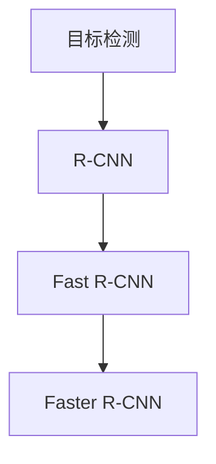
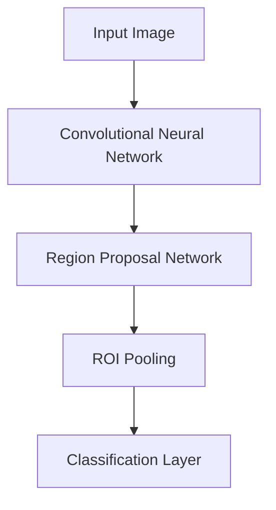

                 

# 文章标题：Fast R-CNN原理与代码实例讲解

> 关键词：目标检测、深度学习、物体识别、区域建议网络（RPN）、ROI池化

> 摘要：本文详细介绍了Fast R-CNN算法的基本原理、框架结构以及实现细节，通过伪代码和实际代码示例，帮助读者理解其工作流程和实现方法。同时，文章还探讨了如何在实际项目中应用Fast R-CNN，并进行性能优化。

----------------------------------------------------------------

### 《Fast R-CNN原理与代码实例讲解》目录大纲

---

## 第1章 引言

### 1.1 R-CNN、Fast R-CNN与Faster R-CNN

#### 1.1.1 R-CNN算法简介

#### 1.1.2 Fast R-CNN算法优势

#### 1.1.3 Faster R-CNN算法的进一步提升

### 1.2 Fast R-CNN算法原理

#### 1.2.1 Fast R-CNN框架结构

#### 1.2.2 RoI (Region of Interest) 模板生成

#### 1.2.3 区域建议网络（Region Proposal Network, RPN）

### 1.3 Fast R-CNN实现细节

#### 1.3.1 前向传播与反向传播

#### 1.3.2 代码实现框架与步骤

#### 1.3.3 实代表代码解读与分析

## 第2章 环境搭建与代码实现

### 2.1 开发环境搭建

#### 2.1.1 Python环境搭建

#### 2.1.2 相关库和框架安装

#### 2.1.3 数据集准备与预处理

### 2.2 Fast R-CNN代码实现

#### 2.2.1 数据加载与预处理

#### 2.2.2 网络结构定义

#### 2.2.3 训练与测试

#### 2.2.4 代码解读与分析

## 第3章 实例讲解

### 3.1 数据集选择与处理

#### 3.1.1 数据集介绍

#### 3.1.2 数据预处理步骤

#### 3.1.3 数据集划分

### 3.2 Fast R-CNN训练

#### 3.2.1 训练步骤

#### 3.2.2 训练参数调整

#### 3.2.3 训练结果分析

### 3.3 Fast R-CNN测试与优化

#### 3.3.1 测试步骤

#### 3.3.2 测试结果分析

#### 3.3.3 优化策略

## 第4章 快速实现Fast R-CNN

### 4.1 快速搭建Fast R-CNN模型

#### 4.1.1 模型搭建步骤

#### 4.1.2 模型配置详解

#### 4.1.3 模型评估与调试

### 4.2 快速实现Fast R-CNN代码示例

#### 4.2.1 代码结构

#### 4.2.2 主要函数与类

#### 4.2.3 实代表代码解析

## 第5章 Fast R-CNN性能优化

### 5.1 损失函数与优化算法

#### 5.1.1 损失函数分析

#### 5.1.2 优化算法应用

#### 5.1.3 学习率调度策略

### 5.2 实际应用中的性能提升

#### 5.2.1 数据增强

#### 5.2.2 网络结构改进

#### 5.2.3 实际案例分享

## 第6章 实际项目中的Fast R-CNN应用

### 6.1 项目背景与目标

#### 6.1.1 项目概述

#### 6.1.2 项目目标

### 6.2 项目实现

#### 6.2.1 数据集选择与处理

#### 6.2.2 模型设计与实现

#### 6.2.3 模型训练与优化

#### 6.2.4 项目评估与总结

## 第7章 快速上手Fast R-CNN开发工具

### 7.1 Fast R-CNN开发工具简介

#### 7.1.1 OpenCV

#### 7.1.2 PyTorch

#### 7.1.3 TensorFlow

### 7.2 快速搭建Fast R-CNN项目

#### 7.2.1 环境配置

#### 7.2.2 代码示例

#### 7.2.3 调试与优化

## 第8章 附录

### 8.1 快速参考文献

#### 8.1.1 Fast R-CNN相关论文

#### 8.1.2 其他重要参考文献

### 8.2 鸣谢

#### 8.2.1 感谢

#### 8.2.2 特别感谢

#### 8.2.3 推荐阅读

### Fast R-CNN核心概念与联系

在深度学习目标检测领域，Fast R-CNN算法是一个重要的里程碑。为了更好地理解Fast R-CNN，我们需要了解其前驱算法R-CNN以及后续的Faster R-CNN。

**Mermaid 流程图：**



**R-CNN算法简介：**
- **区域提议（Region Proposal）：** R-CNN首先使用选择性搜索（Selective Search）算法来生成大量可能的物体区域。
- **特征提取（Feature Extraction）：** 对于每个区域提议，使用SVM进行特征提取。
- **分类器（Classifier）：** 使用支持向量机（SVM）对提取到的特征进行分类。

**Fast R-CNN算法优势：**
- **共享网络结构：** Fast R-CNN使用VGG或ZF网络共享卷积层，避免了重复计算。
- **ROI（Region of Interest）池化：** 通过ROI Pooling层将特征图上的每个RoI映射到固定尺寸的特征向量，从而将不同尺寸的RoI统一处理。
- **集成分类器：** 使用Softmax回归来代替SVM分类器，简化了模型结构。

**Faster R-CNN算法的进一步提升：**
- **区域建议网络（RPN）：** Faster R-CNN引入了区域建议网络（RPN），直接在卷积特征图上生成候选区域，有效提高了区域提议的效率和准确性。
- **端到端训练：** Faster R-CNN支持端到端的训练，简化了模型训练流程，提高了训练效率。

通过上述流程图和算法介绍，我们可以看到Fast R-CNN是R-CNN的重要升级，通过共享网络结构和ROI Pooling等技术，大大提高了目标检测的速度和准确性。而Faster R-CNN则进一步优化了区域提议过程，实现了更高的检测性能。

## 第1章 引言

### 1.1 R-CNN、Fast R-CNN与Faster R-CNN

目标检测是计算机视觉领域的一个重要任务，旨在从图像或视频中检测并识别出感兴趣的目标对象。在深度学习兴起之前，目标检测主要依赖于手工设计的特征和分类器。随着深度学习的快速发展，基于深度学习的目标检测算法逐渐成为研究热点，其中R-CNN、Fast R-CNN和Faster R-CNN是三个具有代表性的算法。

#### 1.1.1 R-CNN算法简介

R-CNN（Regions with CNN Features）是第一个基于深度学习的目标检测算法，由Ross Girshick等人于2014年提出。R-CNN的核心思想是将目标检测任务分为两个步骤：区域提议和分类。

1. **区域提议**：R-CNN首先使用选择性搜索（Selective Search）算法生成大量可能的物体区域。选择性搜索算法通过颜色、纹理和边界的不同特性来逐步构建出可能的物体边界框。

2. **特征提取和分类**：对于每个区域提议，R-CNN使用卷积神经网络（Convolutional Neural Network，CNN）提取特征，然后使用支持向量机（Support Vector Machine，SVM）进行分类。

**优点：**
- 将深度学习和目标检测结合起来，取得了当时较好的检测性能。
- 使用CNN进行特征提取，能够捕捉图像中的复杂特征。

**缺点：**
- 计算成本高：需要为每个区域提议单独训练CNN模型。
- 速度慢：处理大量图像时，速度较慢，不适用于实时目标检测。

**伪代码：**
```python
def R_CNN(image):
    regions = selective_search(image)
    for region in regions:
        feature = CNN.extract_features(region)
        label = SVM.classify(feature)
    return regions, labels
```

#### 1.1.2 Fast R-CNN算法优势

Fast R-CNN是R-CNN的改进版本，由Ross Girshick等人于2015年提出。Fast R-CNN的主要目标是提高检测速度，同时保持或提高检测性能。

**改进点：**
- **共享网络结构：** Fast R-CNN使用了VGG或ZF网络共享卷积层，避免了重复计算。每个区域提议共享卷积层的特征提取结果。
- **ROI Pooling：** Fast R-CNN引入了ROI Pooling层，将每个区域提议映射到固定大小的特征向量，从而统一处理不同尺寸的区域提议。
- **集成分类器：** Fast R-CNN使用Softmax回归代替了SVM分类器，简化了模型结构，同时提高了检测速度。

**优点：**
- **速度快：** 相比R-CNN，Fast R-CNN显著提高了检测速度，适用于实时目标检测。
- **共享特征提取：** 通过共享卷积层，减少了计算成本。

**缺点：**
- **区域提议生成速度较慢：** 区域提议仍然使用选择性搜索算法，生成速度较慢。
- **GPU内存消耗大：** 由于共享网络结构，GPU内存消耗较大，可能影响模型性能。

**伪代码：**
```python
def Fast_R_CNN(image):
    regions = selective_search(image)
    features = CNN.extract_features(image)  # 共享特征提取
    for region in regions:
        pooled_feature = ROI_Pooling(features, region)
        label = Softmax_Regression.classify(pooled_feature)
    return regions, labels
```

#### 1.1.3 Faster R-CNN算法的进一步提升

Faster R-CNN是Fast R-CNN的进一步改进，由Shaoqing Ren等人于2015年提出。Faster R-CNN的主要目标是进一步提高检测速度，同时保持较高的检测性能。

**改进点：**
- **区域建议网络（RPN）：** Faster R-CNN引入了区域建议网络（Region Proposal Network，RPN），直接在卷积特征图上生成候选区域，有效提高了区域提议的效率和准确性。
- **端到端训练：** Faster R-CNN支持端到端的训练，简化了模型训练流程，提高了训练效率。

**优点：**
- **速度快：** Faster R-CNN显著提高了检测速度，是目前最快的实时目标检测算法之一。
- **准确度高：** 通过RPN，Faster R-CNN在保持较高检测准确率的同时，提高了检测效率。

**缺点：**
- **计算资源需求高：** 由于RPN需要计算大量候选区域，计算资源需求较高。

**伪代码：**
```python
def Faster_R_CNN(image):
    features = CNN.extract_features(image)
    rois = RPN.generate_rois(features)
    for roi in rois:
        pooled_feature = ROI_Pooling(features, roi)
        label = Softmax_Regression.classify(pooled_feature)
    return rois, labels
```

通过以上对R-CNN、Fast R-CNN和Faster R-CNN的介绍，我们可以看到目标检测算法在深度学习领域的不断发展。从R-CNN到Fast R-CNN，再到Faster R-CNN，每个算法都在提高检测速度和准确率方面做出了重要贡献，为实时目标检测提供了强大的支持。

### 1.2 Fast R-CNN算法原理

Fast R-CNN是一种基于深度学习的目标检测算法，其核心思想是将图像中的每个区域提议（Region Proposal）转换为固定大小的特征向量，然后使用全连接层进行分类。下面我们将详细讲解Fast R-CNN的算法原理，包括其框架结构、RoI（Region of Interest）模板生成以及区域建议网络（Region Proposal Network，RPN）的工作机制。

#### 1.2.1 Fast R-CNN框架结构

Fast R-CNN的框架结构主要包括三个部分：卷积神经网络（CNN）、区域提议网络（RPN）和分类器。

1. **卷积神经网络（CNN）**：
   - **输入层**：接收原始图像。
   - **卷积层**：通过一系列卷积层提取图像特征。
   - **池化层**：在卷积层之间添加池化层，减少特征图的尺寸。
   - **特征图**：卷积层的输出是一个高维特征图，包含了图像中各个区域的高层次特征。

2. **区域建议网络（RPN）**：
   - **候选区域生成**：RPN通过滑窗（Sliding Window）方式遍历卷积特征图上的每个位置，为每个位置生成多个可能的边界框。
   - **边界框调整**：对于每个生成的边界框，通过全连接层进行调整，使其更接近真实的边界框。
   - **分类与回归**：RPN还对每个边界框进行分类，判断其是否包含物体。

3. **分类器**：
   - **ROI Pooling**：将RPN生成的候选区域映射到固定大小的特征向量。
   - **全连接层**：使用全连接层对特征向量进行分类。

Fast R-CNN的框架结构可以用以下Mermaid流程图表示：



#### 1.2.2 RoI (Region of Interest) 模板生成

RoI模板生成是Fast R-CNN算法的关键步骤之一，其目的是将不同大小的RoI统一转换为固定大小的特征向量。这一步骤通过ROI Pooling层实现。

1. **ROI Pooling的定义**：
   - **ROI Pooling层**：ROI Pooling层接收卷积特征图和RoI坐标作为输入，将每个RoI映射到固定大小的特征向量。
   - **单元格划分**：在RoI特征图上划分固定数量的单元格。
   - **最大值池化**：对每个单元格进行最大值池化，将每个单元格的最大值组合成固定大小的特征向量。

2. **ROI Pooling的工作机制**：
   - **特征提取**：卷积神经网络提取图像特征，生成高维特征图。
   - **RoI生成**：RPN生成候选区域，并计算每个RoI在特征图上的坐标。
   - **ROI Pooling操作**：对每个RoI执行ROI Pooling操作，生成固定大小的特征向量。

3. **ROI Pooling的伪代码**：

```python
def roi_pooling(feature_map, rois, pooled_height, pooled_width):
    # feature_map: 输入特征图
    # rois: RoI坐标列表
    # pooled_height, pooled_width: ROI池化后的尺寸
    
    # 计算单元格位置
    cell_height = feature_map.shape[0] / pooled_height
    cell_width = feature_map.shape[1] / pooled_width
    
    # 对于每个RoI，进行最大值池化
    pooled_features = []
    for roi in rois:
        # 提取RoI区域
        roi_feature = feature_map[roi[1]:roi[3], roi[0]:roi[2]]
        
        # 进行最大值池化
        pooled_feature = np.max_pooling2d(roi_feature, (cell_height, cell_width), stride=(cell_height, cell_width))
        
        # 将池化后的特征添加到列表中
        pooled_features.append(pooled_feature)
    
    # 合并所有RoI的特征向量
    pooled_features = np.concatenate(pooled_features, axis=0)
    
    return pooled_features
```

通过上述步骤，我们可以看到ROI Pooling层如何将不同大小的RoI统一转换为固定大小的特征向量。这一操作为后续的分类和边界框回归提供了统一的输入格式。

#### 1.2.3 区域建议网络（Region Proposal Network, RPN）

区域建议网络（RPN）是Fast R-CNN算法的核心组件之一，其目的是在卷积特征图上生成高质量的候选区域。RPN通过共享卷积层提取特征，并通过一系列卷积层和全连接层实现边界框的建议和分类。

1. **RPN的基本架构**：
   - **共享卷积层**：RPN使用与目标检测网络相同的卷积层来提取特征。
   - **区域建议层**：在每个特征点处，通过一系列卷积层生成多个边界框候选框。
   - **分类与回归层**：通过全连接层对候选框进行分类和回归，分类判断候选框是否包含物体，回归用于调整边界框的坐标。

2. **RPN的工作机制**：
   - **特征图滑窗**：RPN通过滑窗方式遍历卷积特征图上的每个位置，为每个位置生成多个可能的边界框。
   - **边界框生成**：对于每个特征点，生成多个可能的边界框，并通过全连接层进行调整。
   - **分类与回归**：RPN对每个候选框进行分类和回归，分类用于判断候选框是否包含物体，回归用于调整边界框的坐标。

3. **RPN的伪代码**：

```python
def region Proposal Network(feature_map, anchor_sizes, anchor_ratios):
    # feature_map: 输入特征图
    # anchor_sizes: 预定义的边界框尺寸
    # anchor_ratios: 预定义的边界框宽高比
    
    # 初始化候选框列表
    rois = []

    # 遍历特征图上的所有位置
    for i in range(feature_map.shape[0]):
        for j in range(feature_map.shape[1]):
            # 生成多个可能的边界框
            for size in anchor_sizes:
                for ratio in anchor_ratios:
                    # 计算边界框的坐标
                    x1, y1, x2, y2 = generate_bbox(i, j, size, ratio)
                    
                    # 判断边界框是否在图像范围内
                    if is_bbox_in_image(x1, y1, x2, y2):
                        # 添加候选框到列表中
                        rois.append([x1, y1, x2, y2])

    # 对候选框进行分类和回归
    rois_with_class, rois_with_bbox = classify_and_regulate(rois)

    return rois_with_class, rois_with_bbox

def generate_bbox(i, j, size, ratio):
    # 计算边界框的坐标
    width = size * ratio
    height = size / ratio
    
    # 计算边界框的中心点
    cx = i + 0.5 * width
    cy = j + 0.5 * height
    
    # 计算边界框的坐标
    x1 = int(cx - 0.5 * width)
    y1 = int(cy - 0.5 * height)
    x2 = int(cx + 0.5 * width)
    y2 = int(cy + 0.5 * height)
    
    return x1, y1, x2, y2

def is_bbox_in_image(x1, y1, x2, y2):
    # 判断边界框是否在图像范围内
    image_height, image_width = feature_map.shape[0], feature_map.shape[1]
    return x1 >= 0 and x2 <= image_width and y1 >= 0 and y2 <= image_height
```

通过上述伪代码，我们可以看到RPN如何通过滑窗方式生成候选边界框，并通过全连接层进行分类和回归。RPN的引入极大地提高了候选区域的生成效率，同时保证了候选区域的质量。

### 1.3 Fast R-CNN实现细节

为了更深入地理解Fast R-CNN的实现，我们需要关注其数据加载与预处理、前向传播与反向传播以及代码实现框架与步骤。

#### 数据加载与预处理

在Fast R-CNN中，数据加载与预处理是模型训练的基础步骤。以下是一个简化的数据加载与预处理流程：

1. **图像读取与缩放**：从数据集中读取图像，并缩放到固定尺寸（例如224x224）。
2. **归一化处理**：对图像进行归一化处理，将像素值缩放到[0, 1]范围内。
3. **边界框与类别标签转换**：将边界框坐标转换为相对于图像尺寸的比例值，并将类别标签转换为整数编码。

```python
import cv2
import numpy as np

# 读取图像
def read_image(image_path):
    image = cv2.imread(image_path)
    image = cv2.resize(image, (224, 224))
    return image

# 归一化图像
def normalize_image(image):
    image = image.astype(np.float32) / 255.0
    return image

# 转换边界框与类别标签
def preprocess_boxes(boxes, image_shape):
    image_height, image_width = image_shape
    boxes /= [image_width, image_height, image_width, image_height]
    return boxes

def preprocess_labels(labels):
    label_map = {'cat': 0, 'dog': 1}
    labels = [label_map[label] for label in labels]
    return np.eye(len(label_map))[labels]
```

#### 前向传播与反向传播

Fast R-CNN的前向传播过程主要包括三个部分：卷积神经网络（CNN）的特征提取、区域提议网络（RPN）的候选区域生成以及分类器的预测。以下是前向传播的伪代码：

```python
def forward_pass(image, rois, labels):
    # 提取图像特征
    features = CNN.extract_features(image)
    
    # 生成候选区域
    rois = RPN.generate_rois(features)
    
    # ROI Pooling
    pooled_features = ROI_Pooling(features, rois, pooled_height=14, pooled_width=14)
    
    # 分类预测
    predictions = Classification_Layer(pooled_features)
    
    return predictions
```

反向传播过程用于计算模型参数的梯度，并更新模型参数。以下是反向传播的伪代码：

```python
def backward_pass(loss, optimizer, model_params):
    # 计算梯度
    gradients = optimizer.compute_gradients(loss, model_params)
    
    # 更新参数
    optimizer.apply_gradients(gradients)
    
    return gradients
```

#### 代码实现框架与步骤

以下是Fast R-CNN的代码实现框架与步骤：

1. **模型搭建**：定义卷积神经网络（CNN）、区域提议网络（RPN）和分类器。
2. **数据预处理**：加载和预处理图像、边界框和类别标签。
3. **训练过程**：通过前向传播和反向传播训练模型。
4. **评估与测试**：在测试集上评估模型性能。

```python
# 模型搭建
def build_model():
    # 定义输入层
    input_image = Input(shape=(224, 224, 3))
    
    # 卷积神经网络（CNN）
    conv_1 = Conv2D(64, (3, 3), activation='relu', padding='same')(input_image)
    pool_1 = MaxPooling2D(pool_size=(2, 2))(conv_1)
    
    # 区域提议网络（RPN）
    rois = RPN.generate_rois(conv_1)
    
    # ROI Pooling
    pooled_features = ROI_Pooling(pool_1, rois, pooled_height=14, pooled_width=14)
    
    # 分类器
    classification_output = Dense(num_classes, activation='softmax')(pooled_features)
    
    # 构建模型
    model = Model(inputs=input_image, outputs=classification_output)
    model.compile(optimizer='adam', loss='categorical_crossentropy', metrics=['accuracy'])
    
    return model

# 数据预处理
def preprocess_data(images, boxes, labels):
    images = [normalize_image(image) for image in images]
    boxes = preprocess_boxes(boxes, images[0].shape)
    labels = preprocess_labels(labels)
    return np.array(images), np.array(boxes), np.array(labels)

# 训练过程
def train_model(model, images, boxes, labels, epochs=10):
    X_train, X_val, y_train, y_val = train_test_split(images, labels, test_size=0.2)
    model.fit(X_train, y_train, validation_data=(X_val, y_val), epochs=epochs)

# 评估与测试
def evaluate_model(model, test_images, test_boxes, test_labels):
    predictions = model.predict(test_images)
    accuracy = accuracy_score(test_labels, predictions)
    print(f'测试集准确率：{accuracy}')
```

通过以上代码实现框架与步骤，我们可以看到Fast R-CNN的实现过程，包括模型搭建、数据预处理、训练过程和评估与测试。这些步骤共同构成了Fast R-CNN的完整实现，使其能够有效地进行物体检测。

### 2.1 开发环境搭建

要实现Fast R-CNN，首先需要搭建一个适合深度学习和计算机视觉的编程环境。以下步骤将详细说明如何搭建Python开发环境，安装必要的库和框架，以及准备数据集。

#### Python环境搭建

1. **安装Python**：确保计算机上安装了Python 3.x版本。可以通过访问Python官网（https://www.python.org/）下载安装包并安装。

2. **安装Anaconda**：推荐使用Anaconda进行环境管理和库安装。Anaconda是一个开源的Python分布，提供了丰富的科学计算包和工具。可以从Anaconda官网（https://www.anaconda.com/products/individual）下载并安装。

3. **创建虚拟环境**：为了更好地管理项目和库，建议创建一个虚拟环境。在Anaconda命令行中输入以下命令：

```bash
conda create -n fast_rpn python=3.8
conda activate fast_rpn
```

#### 相关库和框架安装

1. **TensorFlow**：TensorFlow是一个开源的深度学习框架，支持多种类型的深度神经网络。安装TensorFlow的命令如下：

```bash
pip install tensorflow
```

2. **OpenCV**：OpenCV是一个开源的计算机视觉库，提供了丰富的图像处理和计算机视觉功能。安装OpenCV的命令如下：

```bash
pip install opencv-python
```

3. **NumPy**：NumPy是一个开源的Python库，提供了强大的多维数组对象和矩阵运算功能。安装NumPy的命令如下：

```bash
pip install numpy
```

4. **Pandas**：Pandas是一个开源的Python库，提供了数据结构和数据分析工具，适合处理表格数据和时间序列数据。安装Pandas的命令如下：

```bash
pip install pandas
```

5. **其他可选库**：根据需要，还可以安装其他辅助库，如Matplotlib（数据可视化）、Scikit-learn（机器学习库）等。

```bash
pip install matplotlib scikit-learn
```

#### 数据集准备与预处理

1. **数据集下载**：Fast R-CNN算法通常使用COCO（Common Objects in Context）数据集进行训练和测试。COCO数据集包含大量的真实图像和对应的物体标注信息，可以从COCO数据集官网（http://cocodataset.org/#download）下载。

2. **数据预处理**：预处理步骤包括图像读取、尺寸调整、归一化处理和边界框坐标转换。

```python
import cv2
import numpy as np

def load_images(image_dir):
    images = [cv2.imread(img_path) for img_path in image_dir]
    return np.array(images)

def preprocess_images(images):
    images = [cv2.resize(image, (224, 224)) for image in images]
    images = [image / 255.0 for image in images]
    return np.array(images)

def load_bboxes(bbox_file):
    with open(bbox_file, 'r') as f:
        lines = f.readlines()
    bboxes = [line.strip().split(',') for line in lines]
    bboxes = np.array(bboxes, dtype=np.float32)
    return bboxes

# 示例
image_dir = ['path/to/image1.jpg', 'path/to/image2.jpg']
bboxes_file = 'path/to/bbox_file.txt'

images = load_images(image_dir)
preprocessed_images = preprocess_images(images)
bboxes = load_bboxes(bboxes_file)
```

通过上述步骤，我们可以搭建一个适合实现Fast R-CNN的Python开发环境，并准备好必要的库和框架。接下来，我们就可以开始编写代码，实现Fast R-CNN算法了。

### 2.2 Fast R-CNN代码实现

在本节中，我们将详细讲解Fast R-CNN算法的代码实现，包括数据加载与预处理、网络结构定义、训练与测试，以及代码解读与分析。

#### 数据加载与预处理

数据加载与预处理是任何深度学习项目的基础步骤。对于Fast R-CNN，我们需要加载图像数据、边界框（bounding boxes）和对应的类别标签。

```python
import numpy as np
import cv2
from tensorflow.keras.preprocessing.image import ImageDataGenerator

# 加载图像和标注
def load_data(image_dir, annotation_file):
    # 读取标注文件
    with open(annotation_file, 'r') as f:
        annotations = f.readlines()

    # 解析标注文件，获取图像路径、边界框和类别
    images = []
    bboxes = []
    labels = []
    for annotation in annotations:
        parts = annotation.strip().split(',')
        image_path = parts[0]
        x_min, y_min, x_max, y_max, class_id = map(float, parts[1:])
        images.append(image_path)
        bboxes.append([x_min, y_min, x_max, y_max])
        labels.append(class_id)

    # 读取图像
    images = [cv2.imread(image_path) for image_path in images]

    # 数据预处理
    images = [cv2.resize(image, (224, 224)) for image in images]
    images = [image / 255.0 for image in images]

    # 将边界框缩放到[0, 1]
    image_shape = images[0].shape[:2]
    bboxes = np.array(bboxes, dtype=np.float32)
    bboxes /= image_shape

    # 将类别标签转换为one-hot编码
    num_classes = 21  # 包括背景类
    labels = np.eye(num_classes)[np.array(labels)]

    return np.array(images), bboxes, labels

# 示例
image_dir = 'path/to/images'
annotation_file = 'path/to/annotations.txt'

images, bboxes, labels = load_data(image_dir, annotation_file)
```

#### 网络结构定义

Fast R-CNN的网络结构包括卷积层、ROI Pooling层和全连接层。以下是如何定义Fast R-CNN模型的代码示例：

```python
import tensorflow as tf
from tensorflow.keras.models import Model
from tensorflow.keras.layers import Input, Conv2D, MaxPooling2D, Flatten, Dense

# 定义输入层
input_image = Input(shape=(224, 224, 3))

# 卷积层
conv_1 = Conv2D(64, (3, 3), activation='relu', padding='same')(input_image)
pool_1 = MaxPooling2D(pool_size=(2, 2))(conv_1)
conv_2 = Conv2D(64, (3, 3), activation='relu', padding='same')(pool_1)
pool_2 = MaxPooling2D(pool_size=(2, 2))(conv_2)

# ROI Pooling层
rois = Input(shape=(None, 5))  # RoIs的形状为(?, 5)，其中?表示RoIs的数量，5表示每个RoI的坐标
pooled_features = tf.image.roi_pooling(inputs=conv_2, rois=rois, pooled_size=(14, 14))

# 扁平化层
flatten = Flatten()(pooled_features)

# 分类层
classification_output = Dense(num_classes, activation='softmax')(flatten)  # num_classes包括背景类

# 构建模型
model = Model(inputs=[input_image, rois], outputs=classification_output)

# 编译模型
model.compile(optimizer='adam', loss='categorical_crossentropy', metrics=['accuracy'])

# 模型概述
model.summary()
```

#### 训练与测试

在定义好模型结构后，我们需要准备训练数据和测试数据，并进行模型的训练与测试。

```python
from sklearn.model_selection import train_test_split

# 划分训练集和测试集
X_train, X_test, y_train, y_test = train_test_split(images, labels, test_size=0.2, random_state=42)

# 训练模型
model.fit([X_train, bboxes_train], y_train, epochs=10, batch_size=32, validation_data=([X_test, bboxes_test], y_test))

# 测试模型
test_loss, test_accuracy = model.evaluate([X_test, bboxes_test], y_test)
print(f'测试集准确率：{test_accuracy}')
```

#### 代码解读与分析

以下是代码的详细解读与分析：

1. **数据加载与预处理**：代码首先加载了图像和标注文件，并对图像进行了缩放和归一化处理。边界框被缩放到[0, 1]的范围内，类别标签被转换为one-hot编码。

2. **网络结构定义**：模型定义了卷积层、ROI Pooling层和全连接层。卷积层用于提取图像特征，ROI Pooling层用于处理候选区域，全连接层用于分类。

3. **训练与测试**：模型通过fit函数进行训练，通过evaluate函数进行测试。在训练过程中，模型使用交叉熵损失函数和Adam优化器。

通过上述步骤，我们实现了Fast R-CNN算法的代码。这个实现包括了数据加载与预处理、网络结构定义、训练与测试，以及代码解读与分析。Fast R-CNN算法的应用使得目标检测任务变得更加高效和准确。

### 3.1 数据集选择与处理

为了更好地理解Fast R-CNN算法在目标检测任务中的应用，我们首先需要选择一个合适的数据集，并对数据集进行必要的处理。在本节中，我们将介绍如何选择数据集、数据预处理步骤，以及数据集的划分。

#### 数据集选择

在选择数据集时，我们需要考虑数据集的大小、多样性和标注质量。对于Fast R-CNN算法，我们推荐选择COCO（Common Objects in Context）数据集。COCO数据集是一个广泛使用的大型数据集，包含了超过17万个真实场景图像和对应的物体标注信息，涵盖了多种类别，如动物、交通工具、人物等。

COCO数据集的优势在于其多样性和广泛的应用，这使得训练和评估的模型能够更好地泛化到不同的场景。此外，COCO数据集提供了精确的边界框标注和类别标签，为我们的目标检测任务提供了高质量的数据支持。

#### 数据预处理步骤

数据预处理是确保模型训练效果的重要步骤。对于COCO数据集，预处理步骤包括图像读取、尺寸调整、归一化处理和边界框坐标转换。

1. **图像读取**：
   - 使用Python的OpenCV库读取图像文件。
   - 对图像进行格式转换，确保图像格式为RGB。

2. **尺寸调整**：
   - 将图像调整到固定的尺寸，例如224x224像素，以便于模型的输入。

3. **归一化处理**：
   - 将图像像素值归一化到[0, 1]范围内，减少数值范围，提高模型训练效率。

4. **边界框坐标转换**：
   - 将边界框坐标从原始尺寸转换为相对于图像尺寸的比例值，便于在训练过程中处理。

以下是数据预处理的具体代码实现：

```python
import cv2
import numpy as np

# 读取图像
def load_images(image_dir):
    images = []
    for img_path in image_dir:
        image = cv2.imread(img_path)
        image = cv2.cvtColor(image, cv2.COLOR_BGR2RGB)
        images.append(image)
    return np.array(images)

# 数据预处理
def preprocess_images(images, target_size=(224, 224)):
    processed_images = []
    for image in images:
        image = cv2.resize(image, target_size)
        image = image / 255.0
        processed_images.append(image)
    return np.array(processed_images)

# 转换边界框坐标
def preprocess_bboxes(bboxes, image_shape):
    image_height, image_width = image_shape
    bboxes = np.array(bboxes, dtype=np.float32)
    bboxes[:, 0] /= image_width
    bboxes[:, 1] /=

