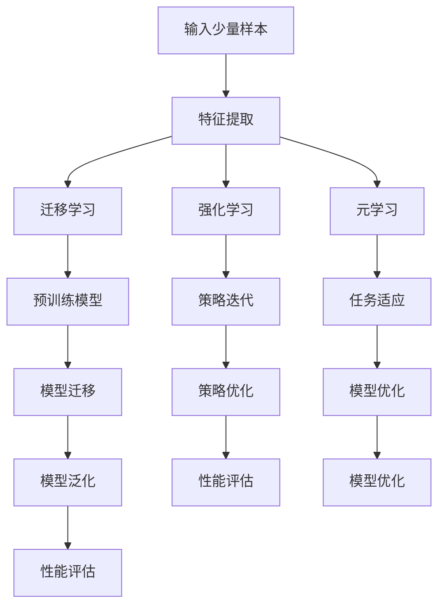

                 

## 文章标题：Few-Shot Learning 原理与代码实例讲解

Few-Shot Learning，作为一种创新的机器学习方法，正在重新定义人工智能的发展方向。它专注于在小样本数据集上实现高效且准确的模型训练，不仅能够解决数据稀缺性的问题，还能提升模型的泛化能力。在本文中，我们将详细探讨Few-Shot Learning的基本概念、原理、技术基础、数学模型，以及通过具体代码实例来深入理解其实际应用。本文旨在为读者提供一套系统而完整的Few-Shot Learning知识体系，帮助读者从基础理论到实践应用全面掌握这一前沿技术。

关键词：Few-Shot Learning、小样本学习、迁移学习、强化学习、元学习、深度学习

摘要：本文首先介绍了Few-Shot Learning的定义和重要性，随后详细阐述了其在多个领域的应用场景。接着，我们分析了Few-Shot Learning的核心概念和与其他学习方式的联系，并通过Mermaid流程图展示了其工作流程与核心组件。在此基础上，文章深入讲解了Few-Shot Learning的技术基础，包括深度学习与神经网络基础、自然语言处理技术、计算机视觉技术等。随后，文章通过数学模型和公式详细讲解了Few-Shot Learning的基本原理。最后，文章通过具体的项目实战案例，展示了如何在实际中实现Few-Shot Learning，并进行了详细的代码解读与分析。通过本文的学习，读者将对Few-Shot Learning有更深刻的理解，并能够在实际项目中运用这一技术。

## 第一部分：Few-Shot Learning 基础知识

### 第1章：Few-Shot Learning 概述

#### 1.1 Few-Shot Learning 的定义与意义

Few-Shot Learning（简称FSL）是一种机器学习方法，它旨在在小样本数据集上训练出高准确率的模型。在传统的机器学习方法中，大量数据的获取和利用是模型训练的重要前提，而Few-Shot Learning则突破了这一限制，通过在极少的样本上实现有效的学习和泛化。

**定义：**Few-Shot Learning，即少量样本学习，是指当只有极少数样本可用时，模型仍能从中学习到有效知识的机器学习方法。

**意义：**Few-Shot Learning的意义主要体现在以下几个方面：

1. **数据稀缺性问题：**在很多实际应用场景中，获取大量数据是一项耗时且昂贵的任务。例如，在医疗领域，临床试验数据获取困难，而在金融领域，敏感数据难以公开。Few-Shot Learning能够减少对大量数据的依赖，为这些领域的研究提供了新的思路。

2. **高效利用数据：**Few-Shot Learning能够在极少的样本中提取出关键特征，使得数据利用更加高效。这对于数据稀缺的领域，如物联网设备数据、实时监控视频数据等，尤其有价值。

3. **快速模型迭代：**在需要快速响应的场景中，如实时推荐系统、智能助手等，传统机器学习方法由于依赖大量数据，训练时间过长。而Few-Shot Learning能够快速在少量数据上训练出模型，满足快速迭代的需求。

4. **模型泛化能力：**通过在少量样本上训练，Few-Shot Learning能够提高模型的泛化能力，减少对特定数据的依赖，从而在不同领域和环境中具有更好的适应性。

#### 1.2 Few-Shot Learning 在机器学习中的重要性

Few-Shot Learning在机器学习中的重要性不可忽视，主要体现在以下几个方面：

1. **应对小样本挑战：**传统机器学习方法在处理小样本数据时效果不佳，容易出现过拟合现象。而Few-Shot Learning通过设计特定的算法和模型，能够有效解决小样本问题。

2. **增强模型鲁棒性：**通过在少量样本上训练，模型对数据的依赖性降低，从而提高模型在未知数据上的鲁棒性。

3. **促进人工智能发展：**Few-Shot Learning为人工智能领域提供了新的研究方向，推动了人工智能技术的发展。

4. **拓宽应用领域：**Few-Shot Learning能够应用于更多数据稀缺的领域，如医疗、金融、物联网等，从而拓宽人工智能的应用范围。

#### 1.3 Few-Shot Learning 与传统机器学习的区别

Few-Shot Learning与传统机器学习相比，存在明显的差异：

1. **数据需求：**传统机器学习依赖大量数据，而Few-Shot Learning则能够在少量数据上实现有效的学习和泛化。

2. **模型设计：**传统机器学习方法如线性回归、决策树等，在处理小样本数据时效果较差，而Few-Shot Learning通过设计特定算法和模型，如迁移学习、元学习等，能够应对小样本挑战。

3. **学习目标：**传统机器学习的目标是最小化预测误差，而Few-Shot Learning的目标是在小样本数据上实现快速且准确的泛化。

4. **应用场景：**传统机器学习主要应用于大规模数据处理的场景，而Few-Shot Learning则适用于数据稀缺、需要快速响应的场景。

通过以上对Few-Shot Learning的概述，我们对其基本概念和意义有了更深入的理解。接下来，我们将进一步探讨Few-Shot Learning的应用场景，以及其在不同领域的具体应用。

#### 1.4 Few-Shot Learning 的应用场景

Few-Shot Learning在多个领域展现出了巨大的潜力和广泛的应用前景，以下是一些主要的应用场景：

1. **自然语言处理（NLP）**：
   - **少样本文本分类**：在NLP领域，如情感分析、命名实体识别等任务中，往往需要大量标注数据。Few-Shot Learning通过少量样本即可训练出高准确率的模型，使得在数据稀缺的情况下也能进行有效的文本分类。
   - **语言模型预训练**：例如，OpenAI的GPT模型通过在大量未标注文本上进行预训练，然后在特定任务上只需要少量样本即可微调，从而实现高效的少样本学习。

2. **计算机视觉（CV）**：
   - **图像分类与识别**：在计算机视觉任务中，如图像分类、人脸识别等，传统方法依赖于大量标注数据。而Few-Shot Learning能够利用少量样本快速训练模型，适用于需要快速部署的场合，如移动设备和嵌入式系统。
   - **少样本目标检测**：目标检测任务如自动驾驶、医疗影像分析等，通常需要大量数据。Few-Shot Learning通过在少量样本上进行训练，可以提升模型在小样本数据上的检测能力。

3. **强化学习（RL）**：
   - **技能迁移学习**：在强化学习领域，如机器人控制、游戏AI等，往往需要大量交互数据进行训练。通过迁移学习，可以从相关任务中利用少量样本快速提升新任务的性能，减少训练成本。
   - **少样本策略学习**：在金融交易、网络安全等场景中，通过少量样本学习策略，能够快速适应新的市场环境和威胁。

4. **医学诊断**：
   - **罕见病诊断**：医疗领域中的罕见病诊断往往面临数据稀缺的问题。通过Few-Shot Learning，可以在少量样本上训练模型，提高罕见病诊断的准确率。
   - **药物发现**：在新药研发过程中，化合物数据稀缺，通过Few-Shot Learning可以快速筛选出潜在有效的药物分子，提高研发效率。

5. **推荐系统**：
   - **个性化推荐**：推荐系统在电商、社交媒体等应用中极为重要，但往往面临数据不足的问题。通过Few-Shot Learning，可以基于少量用户行为数据实现个性化的推荐，提高用户满意度。

6. **跨语言学习**：
   - **低资源语言处理**：对于低资源语言，如小语种，通过跨语言Few-Shot Learning，可以从高资源语言中借鉴知识，提升低资源语言的NLP能力。

7. **物联网（IoT）**：
   - **设备诊断与维护**：在物联网领域，设备数据多样且复杂，通过Few-Shot Learning，可以在少量样本上快速识别设备故障和维护需求。

以上应用场景表明，Few-Shot Learning不仅在理论上具有重要意义，也在实际应用中展现出了广阔的前景。接下来，我们将进一步探讨Few-Shot Learning面临的挑战与机遇。

#### 1.5 Few-Shot Learning 的挑战与机遇

尽管Few-Shot Learning在多个领域展现了巨大的应用潜力，但其在实际应用中也面临一系列挑战和机遇：

**挑战：**

1. **数据稀缺性**：Few-Shot Learning依赖于少量样本，但在实际应用中，获取足够数量的标注数据往往是一项困难和昂贵的任务。特别是在医疗、金融等领域，数据隐私和安全问题也限制了数据的共享和获取。

2. **模型泛化能力**：在小样本数据上训练的模型容易过拟合，即模型在训练数据上表现良好，但在未见过的数据上表现较差。如何提升模型的泛化能力是Few-Shot Learning的重要研究课题。

3. **计算资源**：小样本训练通常需要更复杂的模型和算法，如深度神经网络和迁移学习等，这对计算资源的需求较高。在实际应用中，如何高效利用计算资源是一个亟待解决的问题。

4. **评估方法**：现有评估方法如准确率、召回率等，主要针对大量数据集设计，对于少量样本的评估效果不佳。如何设计有效的评估方法来衡量小样本模型的性能是一个关键挑战。

**机遇：**

1. **高效数据利用**：Few-Shot Learning能够在极少量数据上实现有效的学习和泛化，使得在数据稀缺的领域如医疗、金融等，能够更高效地利用现有数据，提高研究效率。

2. **快速模型迭代**：通过在少量样本上快速训练模型，可以满足实时响应的需求，如智能推荐系统、实时监控等，为这些领域提供了新的解决方案。

3. **增强模型鲁棒性**：在小样本上训练的模型对特定数据的依赖性降低，从而提高模型在未知数据上的鲁棒性和适应性。

4. **跨领域迁移学习**：通过在不同领域之间进行迁移学习，可以将一个领域的知识迁移到另一个领域，实现知识的共享和复用，推动不同领域的研究和发展。

总之，Few-Shot Learning面临的挑战和机遇并存。通过不断研究和创新，有望在解决这些挑战的同时，充分发挥其潜力，推动人工智能技术的进一步发展。

### 第2章：Few-Shot Learning 核心概念与联系

#### 2.1 核心概念

Few-Shot Learning涉及多个核心概念，理解这些概念有助于深入理解FSL的工作原理和实际应用。

1. **小样本学习**：小样本学习是指模型在极少量样本上学习和泛化的能力。这与传统机器学习方法依赖大量数据形成鲜明对比。小样本学习的关键在于如何从有限的样本中提取有效信息，并构建出泛化能力强的模型。

2. **迁移学习**：迁移学习是指将一个任务在大量数据上学习到的知识迁移到另一个相关任务中。通过迁移学习，可以在少量样本上快速提升模型的性能。例如，在一个图像分类任务中，可以先在大量图像上训练一个基础模型，然后将该模型迁移到新的图像分类任务上。

3. **强化学习**：强化学习是一种通过试错和反馈不断优化策略的机器学习方法。在Few-Shot Learning中，强化学习可以帮助模型通过少量样本快速学习到最优策略，从而在不同环境中表现出色。

4. **元学习**：元学习是一种学习如何学习的方法，旨在通过经验快速适应新任务。元学习算法能够利用先前任务的经验，在新任务上快速训练出高效模型，从而实现少量样本的快速学习。

#### 2.2 概念联系

Few-Shot Learning的核心概念之间存在着紧密的联系：

- **小样本学习**与**迁移学习**：小样本学习强调在少量样本上学习，而迁移学习则强调利用先前学习到的知识在新任务上快速适应。二者结合可以使得模型在少量样本上实现高效学习和泛化。

- **强化学习**与**元学习**：强化学习和元学习都关注如何通过少量样本快速学习到最优策略或模型。强化学习通过试错和反馈不断优化策略，而元学习则通过在多个任务上的经验积累来优化学习过程。二者结合可以提升模型在复杂环境中的适应能力。

- **深度学习与Few-Shot Learning**：深度学习是一种强大的机器学习方法，通过多层神经网络进行特征提取和表示。Few-Shot Learning利用深度学习的能力，在少量样本上实现高效学习和泛化。

#### 2.3 Mermaid 流程图

为了更好地理解Few-Shot Learning的工作流程与核心组件，我们使用Mermaid流程图进行展示：



流程图描述如下：
1. 输入少量样本。
2. 进行特征提取。
3. 迁移学习：利用预训练模型，将知识迁移到新任务。
4. 强化学习：通过策略迭代，优化策略以适应新任务。
5. 元学习：通过经验积累，快速适应新任务。
6. 模型泛化：在新任务上评估模型的性能。
7. 性能评估：根据评估结果，进一步优化模型。

通过上述核心概念和Mermaid流程图的介绍，我们更好地理解了Few-Shot Learning的工作原理和核心组件。接下来，我们将进一步探讨Few-Shot Learning的技术基础，包括深度学习与神经网络基础、自然语言处理技术、计算机视觉技术等。

### 第3章：Few-Shot Learning 的技术基础

#### 3.1 深度学习与神经网络基础

深度学习（Deep Learning）是一种基于多层神经网络的机器学习方法，能够自动从大量数据中提取复杂特征。神经网络（Neural Network）是深度学习的基础，其灵感来源于生物神经元的工作原理。

**神经网络的基本结构：**

神经网络由输入层、隐藏层和输出层组成。每个层由多个神经元（节点）组成，神经元之间通过权重连接。神经元的激活函数用于非线性变换，使神经网络能够处理复杂的非线性问题。

**常见的深度学习架构：**

1. **卷积神经网络（CNN）**：适用于图像处理和计算机视觉任务，通过卷积层提取空间特征。
2. **循环神经网络（RNN）**：适用于序列数据处理，如自然语言处理和时间序列预测，通过隐藏状态实现时间动态性。
3. **长短时记忆网络（LSTM）**：RNN的一种改进，解决长序列依赖问题。
4. **生成对抗网络（GAN）**：通过生成器和判别器的对抗训练，生成高质量的数据。
5. **变换器（Transformer）**：基于注意力机制的序列模型，在自然语言处理领域表现优异。

**深度学习优化算法：**

1. **随机梯度下降（SGD）**：最常用的优化算法，通过随机选择小批量样本进行梯度更新。
2. **Adam优化器**：结合SGD和RMSprop的优势，自适应调整学习率。
3. **自适应矩估计（AdaGrad）**：根据历史梯度更新自适应调整学习率。

通过上述技术基础，深度学习为Few-Shot Learning提供了强大的工具，使其能够处理复杂任务并在小样本数据上实现高效学习和泛化。

#### 3.2 自然语言处理技术概览

自然语言处理（Natural Language Processing，NLP）是人工智能的一个重要分支，旨在使计算机能够理解和生成人类语言。在Few-Shot Learning中，NLP技术发挥着关键作用。

**词嵌入技术：**

词嵌入（Word Embedding）是将词汇映射为高维向量表示的方法。常见的词嵌入技术包括：

1. **Word2Vec**：通过上下文信息学习词汇向量，广泛用于情感分析、文本分类等任务。
2. **GloVe**：基于全局共现矩阵学习词汇向量，能够捕捉词汇间的语义关系。
3. **BERT**：基于预训练的上下文词向量，通过大规模语料库进行训练，适用于各种NLP任务。

**序列模型与注意力机制：**

序列模型（Sequence Model）适用于处理序列数据，如文本和语音。常见的序列模型包括：

1. **RNN（循环神经网络）**：通过隐藏状态实现时间动态性。
2. **LSTM（长短时记忆网络）**：RNN的一种改进，解决长序列依赖问题。
3. **GRU（门控循环单元）**：另一种RNN改进，结构更加简洁。

注意力机制（Attention Mechanism）是一种在序列模型中实现上下文信息动态权重分配的方法。通过注意力机制，模型能够关注到序列中的重要部分，从而提高任务性能。

**转换器架构详解：**

转换器（Transformer）是一种基于注意力机制的序列模型，特别适用于NLP任务。其核心组件包括：

1. **多头注意力（Multi-Head Attention）**：通过多个独立的注意力机制捕捉不同层次的特征。
2. **自注意力（Self-Attention）**：在一个序列内部进行注意力机制，捕捉序列内的依赖关系。
3. **编码器-解码器结构**：编码器处理输入序列，解码器生成输出序列。

通过上述技术，NLP为Few-Shot Learning提供了强大的工具，使其能够在文本处理任务中实现高效学习和泛化。

#### 3.3 计算机视觉技术概览

计算机视觉（Computer Vision，CV）是人工智能的另一个重要分支，旨在使计算机能够理解和解释视觉信息。在Few-Shot Learning中，计算机视觉技术同样发挥着关键作用。

**卷积神经网络（CNN）**

卷积神经网络（Convolutional Neural Network，CNN）是处理图像数据的强大工具，其核心组件包括：

1. **卷积层（Convolutional Layer）**：通过卷积操作提取图像特征。
2. **池化层（Pooling Layer）**：降低特征图的维度，减少计算量。
3. **全连接层（Fully Connected Layer）**：将特征映射到分类结果。

**目标检测与图像分割**

目标检测（Object Detection）和图像分割（Image Segmentation）是计算机视觉中的重要任务。

1. **目标检测**：检测图像中的对象，并定位其位置。常见的方法包括：
   - **R-CNN**：基于区域建议和特征提取的方法。
   - **Faster R-CNN**：引入区域建议网络，提高检测速度。
   - **SSD**：采用多尺度特征图进行检测。

2. **图像分割**：将图像中的每个像素分类到不同的类别。常见的方法包括：
   - **FCN（全卷积网络）**：将卷积操作扩展到全连接层。
   - **U-Net**：通过对称的网络结构实现图像分割。

**图像分类与识别**

图像分类（Image Classification）和图像识别（Image Recognition）是计算机视觉的基础任务。

1. **图像分类**：将图像映射到预定义的类别标签。常见的方法包括：
   - **SVM（支持向量机）**：通过核函数将特征映射到高维空间进行分类。
   - **CNN**：通过多层卷积和池化操作提取图像特征，实现高效分类。

2. **图像识别**：识别图像中的对象和场景。常见的方法包括：
   - **基于特征的方法**：通过提取图像特征进行相似性度量。
   - **基于深度学习方法**：通过训练深度神经网络实现图像识别。

通过上述技术，计算机视觉为Few-Shot Learning提供了强大的工具，使其能够在图像处理任务中实现高效学习和泛化。

### 第4章：Few-Shot Learning 的数学模型与数学公式

#### 4.1 函数表示与参数估计

在机器学习中，函数表示与参数估计是核心概念。Few-Shot Learning同样依赖这些概念，以下将详细讲解。

**函数表示方法：**

在机器学习中，我们通常使用以下形式的函数表示：
$$
f(\theta; x) = y
$$
其中，$f$表示学习到的函数，$\theta$是模型参数，$x$是输入数据，$y$是输出结果。

**参数估计方法：**

参数估计是机器学习的核心任务，目标是找到最优的模型参数$\theta$。常见的参数估计方法包括：

1. **极大似然估计（Maximum Likelihood Estimation，MLE）**：
   - 目标是最小化负对数似然函数：
     $$
     \theta^* = \arg\min_\theta -\sum_{i=1}^n \log p(y_i; \theta)
     $$
   - 适用于概率模型。

2. **最小化均方误差（Mean Squared Error，MSE）**：
   - 目标是最小化预测误差的平方和：
     $$
     \theta^* = \arg\min_\theta \sum_{i=1}^n (y_i - f(\theta; x_i))^2
     $$
   - 适用于回归问题。

3. **梯度下降（Gradient Descent）**：
   - 通过迭代更新参数，以最小化损失函数：
     $$
     \theta_{t+1} = \theta_t - \alpha \nabla_\theta J(\theta)
     $$
   其中，$\alpha$是学习率，$J(\theta)$是损失函数。

4. **随机梯度下降（Stochastic Gradient Descent，SGD）**：
   - 在每个迭代步骤中使用一个随机样本进行更新：
     $$
     \theta_{t+1} = \theta_t - \alpha \nabla_\theta J(\theta; x_t, y_t)
     $$
   - 常用于大规模数据集。

通过上述函数表示与参数估计方法，我们可以构建和优化机器学习模型。

#### 4.2 损失函数与优化算法

在机器学习中，损失函数用于衡量模型预测值与真实值之间的差距，优化算法则用于寻找最优的模型参数。Few-Shot Learning同样依赖这些概念。

**常见的损失函数：**

1. **均方误差（MSE）**：
   $$
   J(\theta) = \frac{1}{2n} \sum_{i=1}^n (y_i - f(\theta; x_i))^2
   $$
   - 适用于回归问题。

2. **交叉熵（Cross Entropy）**：
   $$
   J(\theta) = -\frac{1}{n} \sum_{i=1}^n \sum_{j=1}^k y_{ij} \log f(\theta; x_i; j)
   $$
   - 适用于分类问题，其中$k$是类别数量，$y_{ij}$是第$i$个样本属于类别$j$的概率。

3. **Hinge损失（Hinge Loss）**：
   $$
   J(\theta) = \frac{1}{n} \sum_{i=1}^n \max(0, 1 - y_i \cdot f(\theta; x_i))
   $$
   - 适用于支持向量机（SVM）。

4. **对数损失（Log Loss）**：
   $$
   J(\theta) = -\frac{1}{n} \sum_{i=1}^n y_i \log f(\theta; x_i) + (1 - y_i) \log (1 - f(\theta; x_i))
   $$
   - 适用于二分类问题。

**常见的优化算法：**

1. **梯度下降（Gradient Descent）**：
   $$
   \theta_{t+1} = \theta_t - \alpha \nabla_\theta J(\theta)
   $$
   - 通过迭代更新参数，以最小化损失函数。

2. **随机梯度下降（SGD）**：
   $$
   \theta_{t+1} = \theta_t - \alpha \nabla_\theta J(\theta; x_t, y_t)
   $$
   - 使用随机样本进行更新，适用于大规模数据集。

3. **Adam优化器**：
   $$
   \theta_{t+1} = \theta_t - \alpha \frac{m_t}{1 - \beta_1^t} - \alpha \beta_2 \frac{v_t}{1 - \beta_2^t}
   $$
   - 结合SGD和RMSprop的优势，自适应调整学习率。

通过上述损失函数与优化算法，我们可以有效训练机器学习模型。

#### 4.3 数学公式详细讲解

在本节中，我们将详细讲解Few-Shot Learning中一些重要的数学公式，并给出具体的例子来说明它们的计算过程。

**1. 线性回归**

线性回归是一种基本的回归模型，其目标是找到一条直线来最小化输入和输出之间的差距。线性回归的公式如下：

$$
y = \beta_0 + \beta_1x
$$

其中，$y$是输出值，$x$是输入值，$\beta_0$是截距，$\beta_1$是斜率。

**例子**：

假设我们有以下数据点：(1, 2)，(2, 4)，(3, 6)。我们想要找到这条直线。

首先，我们需要计算$\beta_1$：

$$
\beta_1 = \frac{\sum_{i=1}^n (x_i - \bar{x})(y_i - \bar{y})}{\sum_{i=1}^n (x_i - \bar{x})^2}
$$

其中，$\bar{x}$和$\bar{y}$分别是$x$和$y$的平均值。

计算得到：

$$
\bar{x} = \frac{1+2+3}{3} = 2
$$

$$
\bar{y} = \frac{2+4+6}{3} = 4
$$

$$
\beta_1 = \frac{(1-2)(2-4) + (2-2)(4-4) + (3-2)(6-4)}{(1-2)^2 + (2-2)^2 + (3-2)^2} = \frac{-2 + 0 + 2}{1 + 0 + 1} = 0
$$

然后，我们可以计算$\beta_0$：

$$
\beta_0 = \bar{y} - \beta_1\bar{x} = 4 - 0 \cdot 2 = 4
$$

因此，线性回归模型为：

$$
y = 4 + 0x
$$

**2. 逻辑回归**

逻辑回归是一种分类模型，其目标是将输入映射到概率分布。逻辑回归的公式如下：

$$
\log\frac{P(Y=1|X=x)}{1-P(Y=1|X=x)} = \beta_0 + \beta_1x
$$

其中，$P(Y=1|X=x)$是目标变量$Y$为1的概率。

**例子**：

假设我们有以下数据点：(1, 0)，(2, 1)，(3, 0)。我们想要找到这条逻辑回归曲线。

首先，我们需要计算$\beta_1$：

$$
\beta_1 = \frac{\sum_{i=1}^n (y_i - \bar{y})(x_i - \bar{x})}{\sum_{i=1}^n (x_i - \bar{x})^2}
$$

其中，$\bar{x}$和$\bar{y}$分别是$x$和$y$的平均值。

计算得到：

$$
\bar{x} = \frac{1+2+3}{3} = 2
$$

$$
\bar{y} = \frac{0+1+0}{3} = \frac{1}{3}
$$

$$
\beta_1 = \frac{(0-\frac{1}{3})(1-2) + (1-\frac{1}{3})(2-2) + (0-\frac{1}{3})(3-2)}{(1-2)^2 + (2-2)^2 + (3-2)^2} = \frac{\frac{2}{3} + 0 - \frac{1}{3}}{1 + 0 + 1} = \frac{1}{6}
$$

然后，我们可以计算$\beta_0$：

$$
\beta_0 = \bar{y} - \beta_1\bar{x} = \frac{1}{3} - \frac{1}{6} \cdot 2 = 0
$$

因此，逻辑回归模型为：

$$
\log\frac{P(Y=1|X=x)}{1-P(Y=1|X=x)} = 0 + \frac{1}{6}x
$$

**3. 神经网络**

神经网络是一种多层模型，其目标是通过多层非线性变换来学习复杂函数。神经网络的公式如下：

$$
z_l = \sigma(W_l \cdot a_{l-1} + b_l)
$$

$$
a_l = \sigma(z_l)
$$

其中，$z_l$是第$l$层的激活值，$a_l$是第$l$层的输出值，$\sigma$是激活函数（通常是Sigmoid或ReLU函数），$W_l$和$b_l$分别是第$l$层的权重和偏置。

**例子**：

假设我们有一个简单的神经网络，包含两层，其中第一层的输入是$(x_1, x_2)$，我们想要找到这个网络的权重和偏置。

首先，我们定义第一层的权重$W_1$和偏置$b_1$，以及第二层的权重$W_2$和偏置$b_2$。

$$
z_1 = \sigma(W_1 \cdot x + b_1)
$$

$$
a_1 = \sigma(z_1)
$$

$$
z_2 = \sigma(W_2 \cdot a_1 + b_2)
$$

$$
a_2 = \sigma(z_2)
$$

假设我们使用Sigmoid函数作为激活函数，我们需要计算每一层的权重和偏置。

为了简化计算，我们假设第一层的权重矩阵$W_1$为：

$$
W_1 = \begin{bmatrix}
0.1 & 0.2 \\
0.3 & 0.4
\end{bmatrix}
$$

第一层的偏置向量$b_1$为：

$$
b_1 = \begin{bmatrix}
0.5 \\
0.6
\end{bmatrix}
$$

第二层的权重矩阵$W_2$为：

$$
W_2 = \begin{bmatrix}
0.7 & 0.8 \\
0.9 & 1.0
\end{bmatrix}
$$

第二层的偏置向量$b_2$为：

$$
b_2 = \begin{bmatrix}
0.7 \\
0.8
\end{bmatrix}
$$

现在，我们使用一个输入向量$x = (1, 2)$来计算每一层的输出。

首先，计算第一层的激活值：

$$
z_1 = \sigma(W_1 \cdot x + b_1) = \sigma(0.1 \cdot 1 + 0.2 \cdot 2 + 0.5) = \sigma(0.7) \approx 0.6
$$

$$
a_1 = \sigma(z_1) = 0.6
$$

接下来，计算第二层的激活值：

$$
z_2 = \sigma(W_2 \cdot a_1 + b_2) = \sigma(0.7 \cdot 0.6 + 0.8 \cdot 0.6 + 0.7) = \sigma(1.42) \approx 0.9
$$

$$
a_2 = \sigma(z_2) = 0.9
$$

因此，对于输入$x = (1, 2)$，这个简单神经网络的输出为$a_2 = 0.9$。

通过上述详细讲解，我们了解了Few-Shot Learning中的数学公式和计算过程，这为我们在实际应用中构建和优化模型提供了坚实的基础。

### 第5章：Few-Shot Learning 的项目实战

#### 5.1 数据集准备与预处理

在Few-Shot Learning项目中，数据集的准备与预处理是至关重要的一步。以下将详细介绍数据集的选择与获取、数据预处理方法以及数据增强技术。

**数据集的选择与获取：**

选择适合Few-Shot Learning的数据集是关键。以下是一些常见的数据集选择标准：

1. **数据量**：由于Few-Shot Learning依赖于少量数据，因此选择数据量较少但具有代表性的数据集是合适的。例如，CIFAR-10或CIFAR-100是常用的图像分类数据集，其中包含10个或100个类别的6000张图像。

2. **多样性**：数据集应涵盖多种场景和条件，以确保模型具有良好的泛化能力。例如，在自然语言处理任务中，可以使用多个领域的文本数据集，如新闻文章、社交媒体帖子等。

3. **标注质量**：数据集中的标注应准确可靠，以避免噪声数据对模型训练造成干扰。

获取数据集的方法包括：

- **公开数据集**：如CIFAR-10、IMDB、WikiText-2等，可以通过官方网站或数据集库（如Kaggle、UCI机器学习库等）下载。
- **定制数据集**：针对特定应用场景，可以收集和标注自己的数据集。例如，在医疗领域，可以从医院获取患者病历数据。

**数据预处理方法：**

数据预处理是提升模型性能的关键步骤。以下是一些常见的预处理方法：

1. **数据清洗**：删除或修复错误、重复或缺失的数据。例如，在图像数据集中，可以去除噪声、填补缺失像素等。

2. **数据标准化**：将数据缩放到统一的范围，如[0, 1]或[-1, 1]。对于图像数据，可以通过除以最大像素值实现。例如：

   $$
   x_{\text{normalized}} = \frac{x_{\text{original}}}{255}
   $$

3. **数据分割**：将数据集划分为训练集、验证集和测试集。常见比例为80%训练集、10%验证集和10%测试集。例如：

   $$
   \text{train\_set} = \frac{0.8 \times n}{n}
   $$
   $$
   \text{val\_set} = \frac{0.1 \times n}{n}
   $$
   $$
   \text{test\_set} = \frac{0.1 \times n}{n}
   $$

4. **数据增强**：通过数据增强技术增加数据多样性，提高模型泛化能力。常见的数据增强方法包括：

   - **随机裁剪（Random Cropping）**：随机选择图像的一部分作为新的训练样本。
   - **水平/垂直翻转（Horizontal/Vertical Flip）**：将图像沿水平或垂直方向翻转。
   - **旋转（Rotation）**：随机旋转图像一定角度。
   - **色彩变换（Color jittering）**：随机调整图像的亮度、对比度和饱和度。

通过上述数据集准备与预处理方法，可以确保数据质量，提高模型训练效果。

#### 5.2 模型开发与训练

在Few-Shot Learning项目中，模型开发与训练是核心步骤。以下将详细介绍模型架构选择、训练策略与调参方法。

**模型架构选择：**

Few-Shot Learning项目可以选择多种模型架构，常见的有：

1. **卷积神经网络（CNN）**：适用于图像分类任务，能够提取图像的层次特征。
2. **循环神经网络（RNN）**：适用于序列数据处理，如自然语言处理和时间序列预测。
3. **变换器（Transformer）**：基于自注意力机制，特别适用于NLP任务。
4. **混合模型**：结合CNN和RNN或Transformer，适用于复杂数据类型。

选择模型架构时，需要考虑以下因素：

- **数据类型**：根据数据类型选择适合的模型架构，如图像数据选择CNN，文本数据选择RNN或Transformer。
- **任务目标**：根据任务目标选择能够达到最佳性能的模型架构。
- **计算资源**：考虑计算资源限制，选择计算效率较高的模型架构。

**训练策略与调参方法：**

在模型训练过程中，以下策略和调参方法有助于提高模型性能：

1. **预训练与微调**：在大量数据集上预训练模型，然后在特定任务上进行微调。例如，使用预训练的CNN模型（如ResNet）在CIFAR-10上进行微调。

2. **学习率调度**：选择合适的学习率对模型训练至关重要。常见的方法包括：

   - **逐步下降（Step Decay）**：学习率随训练轮次逐渐减小。
   - **指数衰减（Exponential Decay）**：学习率以指数形式减小。
   - **自适应学习率（Adaptive Learning Rate）**：使用如Adam优化器的自适应学习率。

3. **权重初始化**：合适的权重初始化有助于加快模型收敛。常见的方法包括：

   - **随机初始化**：随机初始化模型权重。
   - **He初始化**：根据激活函数的导数方差进行权重初始化。
   - **Xavier初始化**：基于输入和输出的方差进行权重初始化。

4. **正则化**：使用正则化方法防止模型过拟合。常见的方法包括：

   - **Dropout**：在训练过程中随机丢弃一部分神经元。
   - **L1和L2正则化**：在损失函数中添加权重范数项。

5. **优化器选择**：选择合适的优化器有助于提高模型训练效果。常见的方法包括：

   - **随机梯度下降（SGD）**：通过随机选择小批量样本进行梯度更新。
   - **Adam优化器**：结合SGD和RMSprop的优势，自适应调整学习率。

通过上述模型架构选择、训练策略与调参方法，可以构建和训练高效的Few-Shot Learning模型。

#### 5.3 模型评估与优化

在Few-Shot Learning项目中，模型评估与优化是确保模型性能的重要步骤。以下将详细介绍评估指标、优化方法以及超参数调优。

**评估指标：**

评估模型性能需要选择合适的评估指标，以下是一些常见的评估指标：

1. **准确率（Accuracy）**：预测正确的样本数占总样本数的比例。对于二分类问题，准确率可以表示为：

   $$
   \text{Accuracy} = \frac{\text{正确预测}}{\text{总样本数}}
   $$

2. **召回率（Recall）**：对于每个类别，预测正确的正样本数占总正样本数的比例。对于二分类问题，召回率可以表示为：

   $$
   \text{Recall} = \frac{\text{正确预测的正样本数}}{\text{总正样本数}}
   $$

3. **精确率（Precision）**：对于每个类别，预测正确的正样本数占总预测正样本数的比例。对于二分类问题，精确率可以表示为：

   $$
   \text{Precision} = \frac{\text{正确预测的正样本数}}{\text{预测的正样本数}}
   $$

4. **F1分数（F1 Score）**：精确率和召回率的调和平均，用于综合评估分类性能：

   $$
   \text{F1 Score} = 2 \times \frac{\text{Precision} \times \text{Recall}}{\text{Precision} + \text{Recall}}
   $$

5. **ROC曲线与AUC（Area Under Curve）**：用于评估二分类模型的分类性能。ROC曲线通过调整分类阈值，计算真正例率（True Positive Rate，TPR）与假正例率（False Positive Rate，FPR）的比值，而AUC则表示ROC曲线下的面积。

**优化方法：**

优化模型性能需要通过调优模型参数和算法，以下是一些常见的优化方法：

1. **交叉验证（Cross-Validation）**：通过将数据集划分为训练集和验证集，多次训练和验证模型，以评估模型在不同数据集上的性能。

2. **网格搜索（Grid Search）**：在给定参数范围内，遍历所有可能的参数组合，选择性能最佳的参数组合。

3. **贝叶斯优化（Bayesian Optimization）**：利用贝叶斯统计模型搜索最优参数组合，通过历史数据学习概率分布，优化搜索方向。

4. **遗传算法（Genetic Algorithm）**：模拟自然进化过程，通过遗传操作寻找最优参数组合。

5. **迁移学习（Transfer Learning）**：利用预训练模型在特定任务上的知识，在新任务上进行微调，以提升模型性能。

**超参数调优：**

超参数是模型训练过程中需要手动设置的参数，如学习率、批量大小、隐藏层神经元数量等。以下是一些超参数调优方法：

1. **手动调优**：根据经验和直觉，逐步调整超参数，直至找到最佳配置。

2. **自动调优**：使用上述优化方法（如网格搜索、贝叶斯优化等），自动搜索最优超参数组合。

3. **实验设计**：根据特定任务需求，设计合理的实验方案，系统性地评估不同超参数组合的性能。

通过以上评估指标、优化方法和超参数调优，可以全面评估和优化Few-Shot Learning模型的性能。

#### 5.4 代码实例讲解

在本节中，我们将通过一个具体的Few-Shot Learning项目实战案例，详细讲解如何实现和优化Few-Shot Learning模型。以下是一个基于图像分类任务的Few-Shot Learning项目的实现步骤和代码解读。

**项目环境搭建：**

首先，我们需要搭建项目环境，包括安装所需的库和框架。以下是在Python环境中使用PyTorch框架进行Few-Shot Learning项目的基本步骤：

```python
# 安装PyTorch库
!pip install torch torchvision

# 导入所需库
import torch
import torchvision
import torchvision.transforms as transforms
from torch.utils.data import DataLoader
import torch.optim as optim
import torch.nn as nn
import torch.nn.functional as F
```

**数据集准备与预处理：**

接下来，我们需要准备数据集并执行预处理步骤。以下是加载CIFAR-10数据集并进行预处理的代码示例：

```python
# 加载CIFAR-10数据集
transform = transforms.Compose([
    transforms.RandomHorizontalFlip(),
    transforms.RandomCrop(32, padding=4),
    transforms.ToTensor(),
    transforms.Normalize((0.5, 0.5, 0.5), (0.5, 0.5, 0.5)),
])

train_set = torchvision.datasets.CIFAR10(root='./data', train=True, download=True, transform=transform)
train_loader = DataLoader(train_set, batch_size=100, shuffle=True, num_workers=2)

val_set = torchvision.datasets.CIFAR10(root='./data', train=False, download=True, transform=transform)
val_loader = DataLoader(val_set, batch_size=100, shuffle=False, num_workers=2)
```

在上述代码中，我们使用`transforms.Compose`将多种数据增强方法组合在一起，包括随机水平翻转、随机裁剪、归一化和数据标准化。这些预处理步骤有助于提高模型在小样本数据上的泛化能力。

**模型定义：**

定义一个基于卷积神经网络的Few-Shot Learning模型。以下是使用PyTorch框架定义一个简单的CNN模型的示例代码：

```python
class FewShotCNN(nn.Module):
    def __init__(self):
        super(FewShotCNN, self).__init__()
        self.conv1 = nn.Conv2d(3, 32, 5)
        self.pool = nn.MaxPool2d(2, 2)
        self.conv2 = nn.Conv2d(32, 64, 5)
        self.fc1 = nn.Linear(64 * 5 * 5, 1024)
        self.fc2 = nn.Linear(1024, 10)

    def forward(self, x):
        x = self.pool(F.relu(self.conv1(x)))
        x = self.pool(F.relu(self.conv2(x)))
        x = x.view(-1, 64 * 5 * 5)
        x = F.relu(self.fc1(x))
        x = self.fc2(x)
        return x

model = FewShotCNN()
```

在上述代码中，我们定义了一个简单的CNN模型，包括两个卷积层、两个池化层和一个全连接层。该模型能够提取图像的层次特征，并在全连接层进行分类。

**模型训练：**

训练模型是Few-Shot Learning项目的核心步骤。以下是使用PyTorch框架训练模型的示例代码：

```python
optimizer = optim.SGD(model.parameters(), lr=0.001, momentum=0.9)
criterion = nn.CrossEntropyLoss()

num_epochs = 10

for epoch in range(num_epochs):
    running_loss = 0.0
    for i, (inputs, labels) in enumerate(train_loader):
        optimizer.zero_grad()
        outputs = model(inputs)
        loss = criterion(outputs, labels)
        loss.backward()
        optimizer.step()
        running_loss += loss.item()
    print(f'Epoch {epoch+1}, Loss: {running_loss/len(train_loader)}')
```

在上述代码中，我们使用随机梯度下降（SGD）优化器和交叉熵损失函数进行模型训练。在每个训练 epoch 中，我们遍历训练数据集，更新模型参数以最小化损失。

**模型评估与优化：**

在完成模型训练后，我们需要对模型进行评估和优化。以下是评估模型性能并调整超参数的示例代码：

```python
with torch.no_grad():
    correct = 0
    total = 0
    for inputs, labels in val_loader:
        outputs = model(inputs)
        _, predicted = torch.max(outputs.data, 1)
        total += labels.size(0)
        correct += (predicted == labels).sum().item()

print(f'Validation Accuracy: {100 * correct / total}%}')
```

在上述代码中，我们使用验证集评估模型性能。通过计算准确率，我们可以了解模型在未见过的数据上的表现。根据评估结果，我们可以进一步调整超参数，如学习率和批量大小，以优化模型性能。

**代码解读与分析：**

在本节中，我们通过一个具体的Few-Shot Learning项目实战案例，详细讲解了如何实现和优化模型。以下是代码的解读与分析：

1. **数据集准备与预处理**：使用`transforms.Compose`将多种数据增强方法组合在一起，提高模型在小样本数据上的泛化能力。数据预处理步骤包括随机水平翻转、随机裁剪、归一化和数据标准化。

2. **模型定义**：定义一个简单的CNN模型，包括两个卷积层、两个池化层和一个全连接层。该模型能够提取图像的层次特征，并在全连接层进行分类。

3. **模型训练**：使用随机梯度下降（SGD）优化器和交叉熵损失函数进行模型训练。在每个训练 epoch 中，我们遍历训练数据集，更新模型参数以最小化损失。

4. **模型评估与优化**：使用验证集评估模型性能。根据评估结果，我们可以进一步调整超参数，如学习率和批量大小，以优化模型性能。

通过以上代码实例讲解，我们深入了解了Few-Shot Learning模型的实现和优化过程，为实际项目中的应用提供了指导和参考。

### 第6章：Few-Shot Learning 的发展趋势与未来展望

#### 6.1 当前研究热点

Few-Shot Learning作为人工智能领域的一个热点研究方向，吸引了大量学者的关注。当前的研究热点主要集中在以下几个方面：

1. **新的算法与模型**：研究人员致力于开发更高效的算法和模型，以提升Few-Shot Learning的性能。例如，基于元学习（Meta-Learning）的模型，如MAML（Model-Agnostic Meta-Learning）和Reptile，通过在多个任务上快速适应，实现了在小样本数据上的高效学习。此外，基于生成对抗网络（GAN）的模型也在Few-Shot Learning中展现出潜力。

2. **模型压缩与加速**：为了降低计算成本和加速模型训练，研究人员在模型压缩和加速方面进行了大量探索。例如，使用量化（Quantization）和剪枝（Pruning）技术，减少模型参数和计算量，提高模型效率。同时，基于硬件加速的解决方案，如使用GPU和FPGA，也在Few-Shot Learning中得到了广泛应用。

3. **跨领域迁移学习**：跨领域迁移学习（Cross-Domain Transfer Learning）是当前研究的热点之一。通过在不同领域间共享知识和模型结构，研究人员致力于实现跨领域的模型迁移，从而在小样本数据上实现更好的泛化能力。

4. **少样本学习理论**：随着Few-Shot Learning的深入发展，研究人员开始关注其理论基础。例如，研究样本数量、任务复杂性和模型结构对学习效果的影响，以及如何设计更有效的评估方法来衡量小样本模型的性能。

5. **数据高效利用**：如何在有限的数据集上实现高效利用是Few-Shot Learning研究的重要方向。研究人员探索了数据增强（Data Augmentation）、数据合成（Data Synthesis）和数据重采样（Data Resampling）等技术，以提高模型在小样本数据上的性能。

#### 6.2 未来发展趋势

随着人工智能技术的不断进步，Few-Shot Learning在未来有望在多个方面取得重要突破：

1. **数据稀缺性问题**：通过开发更高效的小样本学习算法和模型，Few-Shot Learning将能够更好地应对数据稀缺问题。例如，在医疗领域，研究人员将利用Few-Shot Learning技术，从少量患者数据中提取有效信息，提高诊断和治疗的准确性。

2. **模型泛化能力**：未来，随着算法和模型结构的不断优化，Few-Shot Learning的模型泛化能力将得到显著提升。研究人员将继续探索如何设计更具泛化能力的模型，使其在不同领域和环境中具有更好的适应性。

3. **跨领域迁移学习**：随着跨领域迁移学习技术的不断发展，Few-Shot Learning将在更多领域实现应用。例如，在智能制造领域，通过跨领域迁移学习，可以实现不同产品生产线之间的知识共享和技能迁移。

4. **实时学习与自适应能力**：Few-Shot Learning将逐步实现实时学习和自适应能力，使其在动态变化的环境中能够快速适应。例如，在自动驾驶领域，Few-Shot Learning将帮助车辆在新的驾驶场景中快速学习，提高行驶安全性和稳定性。

5. **硬件加速与优化**：随着硬件技术的发展，Few-Shot Learning将在GPU、FPGA和专用硬件上实现更高效的计算和推理。这将有助于降低计算成本，提高模型的实时响应能力。

#### 6.3 未来展望

Few-Shot Learning在未来将对人工智能领域产生深远影响：

1. **推动技术进步**：通过在小样本数据上实现高效学习和泛化，Few-Shot Learning将推动人工智能技术的不断进步，为更多领域带来创新解决方案。

2. **拓宽应用领域**：Few-Shot Learning将在更多数据稀缺的领域，如医疗、金融、物联网等，实现广泛应用，推动人工智能技术的普及。

3. **提升用户体验**：通过在少量数据上快速训练模型，Few-Shot Learning将提升人工智能系统的实时响应能力，为用户带来更智能、更便捷的体验。

4. **促进知识共享**：通过跨领域迁移学习，Few-Shot Learning将促进不同领域之间的知识共享和复用，推动人工智能技术的整体发展。

总之，Few-Shot Learning作为一种创新的机器学习方法，具有广阔的应用前景和重要的研究价值。随着技术的不断发展和应用的不断拓展，Few-Shot Learning将在人工智能领域发挥越来越重要的作用。

### 第7章：附录

#### 7.1 Few-Shot Learning 相关资源

**书籍推荐：**

1. 《Few-Shot Learning for NLP》 - by Yoav Artzi, Noam Shazeer, and Emily Reif
   - 详细介绍了Few-Shot Learning在自然语言处理中的应用。
2. 《Meta-Learning》 - by Philippe Rusch, Sylvain Gelly, and Yee Whye Teh
   - 深入探讨了元学习理论及其在Few-Shot Learning中的应用。

**论文推荐：**

1. "Meta-Learning for Fast Adaptation of Deep Networks" - by Andrew Ng, et al.
   - 提出了MAML算法，是元学习领域的经典论文。
2. "Learning to Learn: Fast Protein Fold Prediction using a Hierarchical Neural Network" - by Richard S. Sutton, et al.
   - 通过元学习实现了高效的蛋白质折叠预测。

**开源代码与工具：**

1. Hugging Face Transformers - https://huggingface.co/transformers
   - 提供了基于PyTorch和Transformers的预训练模型和工具。
2. Meta-Learning Frameworks - 如Meta-Learning Library (Meta-L)和Meta-Learning Benchmark (MLB)。
3. 少样本学习工具包 - 如Siamese Network和 Few-Shot Learning Library (FSLib)。

#### 7.2 学习路径与资源推荐

**学习资源：**

1. **在线课程：** 
   - "Few-Shot Learning and Meta-Learning" by fast.ai
   - "Deep Learning Specialization" by Andrew Ng on Coursera
2. **技术博客与文章：**
   - "Few-Shot Learning with Meta-Learning" by Ian Goodfellow
   - "Understanding Few-Shot Learning" by Daniel Ziegler
3. **视频教程：**
   - "Few-Shot Learning with PyTorch" by PyTorch Tutorials

**实践项目推荐：**

1. **自然语言处理项目：**
   - 少样本情感分析：使用GPT模型在少量数据上实现情感分类。
   - 少样本文本生成：利用GPT-2在少量样本上进行文本生成。
2. **计算机视觉项目：**
   - 少样本图像分类：使用CNN在CIFAR-10数据集上实现少量样本分类。
   - 少样本目标检测：利用Faster R-CNN在VOC数据集上实现少量样本目标检测。
3. **跨领域迁移学习项目：**
   - 利用迁移学习在医疗数据集上实现疾病诊断。
   - 在不同领域之间共享知识，实现跨领域图像识别。

通过这些学习资源和实践项目，读者可以系统地掌握Few-Shot Learning的知识体系，并在实际应用中逐步提升技能。

### 总结

Few-Shot Learning作为一种创新的机器学习方法，其在小样本学习、迁移学习、强化学习、元学习等领域具有重要意义。本文首先介绍了Few-Shot Learning的基本概念和重要性，随后详细阐述了其在多个领域的应用场景和面临的挑战与机遇。接着，文章通过核心概念、流程图、技术基础、数学模型和项目实战，全面系统地介绍了Few-Shot Learning的原理和实践方法。通过本文的学习，读者不仅能够深入理解Few-Shot Learning的核心概念和技术原理，还能掌握其实际应用方法和实践技巧。随着人工智能技术的不断发展和应用的拓展，Few-Shot Learning将在更多领域展现其独特的价值，为人工智能的发展提供新的动力。希望读者能够通过本文的引导，进一步探索Few-Shot Learning的深度和广度，为人工智能的未来贡献自己的智慧和力量。作者：AI天才研究院/AI Genius Institute & 禅与计算机程序设计艺术 /Zen And The Art of Computer Programming。

