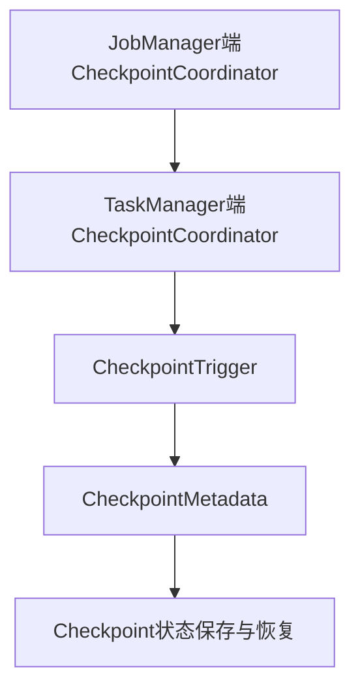

                 

# 《Flink CheckpointCoordinator原理与代码实例讲解》

> 关键词：Flink, CheckpointCoordinator, Checkpoint机制, 代码实例分析, 性能优化

> 摘要：本文深入探讨了Flink中的CheckpointCoordinator原理，通过代码实例详细讲解了CheckpointCoordinator的架构、工作流程、状态更新公式及其在实际项目中的应用和性能优化策略。

----------------------------------------------------------------

## 第一部分：Flink CheckpointCoordinator 基础概念

### 第1章：Flink CheckpointCoordinator 概述

#### 1.1 CheckpointCoordinator 的作用与地位

CheckpointCoordinator是Flink中的一个核心组件，它在Checkpoint过程中起着至关重要的作用。CheckpointCoordinator主要负责协调和管理Flink任务的Checkpoint过程，包括触发Checkpoint、收集TaskManager的状态信息、更新CheckpointMetadata等。

CheckpointCoordinator在Flink系统中的地位非常重要。它是连接JobManager和TaskManager之间的桥梁，确保整个Checkpoint过程能够协调一致地进行。此外，CheckpointCoordinator还负责实现Checkpoint的故障转移和容错机制，确保系统的高可用性。

#### 1.2 Checkpoint 的概念与分类

Checkpoint，即检查点，是一种用于保存作业状态和数据的机制。在Flink中，Checkpoint用于记录作业在某一时刻的状态和结果，以便在作业故障恢复时能够快速恢复到故障前的状态。

根据Checkpoint的触发方式，可以分为以下几种类型：

- **定期Checkpoint**：定期Checkpoint按照固定的时间间隔触发，是最常见的Checkpoint方式。定期Checkpoint可以保证作业状态和数据的实时性，但可能会占用较多的系统资源。

- **条件Checkpoint**：条件Checkpoint基于特定的条件触发，如数据量达到一定程度或者作业处理时间超过一定阈值。条件Checkpoint可以根据实际需求灵活调整触发条件，但可能会导致作业状态和数据的实时性降低。

- **手动Checkpoint**：手动Checkpoint由用户手动触发，可以在需要时手动保存作业状态和数据。手动Checkpoint适合在特殊场景下使用，如定期备份或者临时故障恢复。

#### 1.3 Flink CheckpointCoordinator 工作原理

Flink CheckpointCoordinator的工作原理可以概括为以下几个步骤：

1. **初始化**：CheckpointCoordinator在作业启动时初始化，注册CheckpointTrigger和CheckpointMetadata。

2. **触发Checkpoint**：当满足触发条件时，CheckpointCoordinator向所有TaskManager发送Checkpoint启动消息。

3. **执行Checkpoint**：TaskManager端的CheckpointCoordinator接收到启动消息后，开始执行Checkpoint流程，包括保存状态、收集TaskManager状态信息等。

4. **更新CheckpointMetadata**：CheckpointCoordinator收集TaskManager状态信息后，更新CheckpointMetadata，记录作业的状态和数据。

5. **报告Checkpoint完成**：CheckpointCoordinator完成状态信息收集后，向JobManager端报告Checkpoint完成。

6. **恢复Checkpoint**：在作业恢复时，JobManager端根据CheckpointMetadata恢复状态信息，完成Checkpoint流程。

### 第2章：Flink Checkpoint 机制详解

#### 2.1 CheckpointTrigger 的配置与实现

CheckpointTrigger是Flink中用于触发Checkpoint的核心组件。它负责根据特定的条件判断是否触发Checkpoint。CheckpointTrigger可以通过配置文件或者编程方式实现。

在配置文件中，可以使用以下参数配置CheckpointTrigger：

- `checkpointing.mode`：指定Checkpoint的触发模式，如`EXPLICIT`（手动触发）和`PERIODIC`（定期触发）。

- `checkpointing.interval`：指定定期Checkpoint的时间间隔。

- `checkpointing.timeout`：指定Checkpoint的超时时间。

在编程方式中，可以通过实现`CheckpointTrigger`接口来自定义CheckpointTrigger。以下是一个简单的CheckpointTrigger实现示例：

```java
public class CustomCheckpointTrigger implements CheckpointTrigger {
    @Override
    public boolean shouldTriggerCheckpoint(Context context) {
        // 根据特定条件判断是否触发Checkpoint
        return context.getNumberOfTasks() > 100;
    }
}
```

#### 2.2 CheckpointMetadata 的存储与恢复

CheckpointMetadata是Flink中用于存储Checkpoint状态信息的数据结构。它包含作业的Checkpoint时间戳、状态信息、数据信息等。CheckpointMetadata在Checkpoint过程中会被存储在持久化存储中，如HDFS或Kafka。

在Flink中，CheckpointMetadata的存储和恢复过程如下：

1. **存储CheckpointMetadata**：在Checkpoint过程中，CheckpointCoordinator将CheckpointMetadata序列化后存储到持久化存储中。

2. **恢复CheckpointMetadata**：在作业恢复时，JobManager端从持久化存储中读取CheckpointMetadata，并将其反序列化，以便在恢复过程中使用。

以下是一个简单的CheckpointMetadata存储和恢复示例：

```java
public class CheckpointMetadata {
    private long timestamp;
    private String state;
    private String data;

    // 省略构造函数和getter/setter方法

    public void storeCheckpointMetadata() {
        // 序列化CheckpointMetadata并存储到持久化存储
        SerializationProtocol serializationProtocol = new HDFSProtocol();
        serializationProtocol.storeCheckpointMetadata(this);
    }

    public void recoverCheckpointMetadata() {
        // 从持久化存储中读取CheckpointMetadata
        SerializationProtocol serializationProtocol = new HDFSProtocol();
        CheckpointMetadata recoveredMetadata = serializationProtocol.recoverCheckpointMetadata();
        this.timestamp = recoveredMetadata.getTimestamp();
        this.state = recoveredMetadata.getState();
        this.data = recoveredMetadata.getData();
    }
}
```

#### 2.3 Checkpoint 状态的保存与恢复

Checkpoint状态的保存和恢复是FlinkCheckpoint机制的核心。在Checkpoint过程中，TaskManager需要将作业的状态和数据保存到持久化存储中，以便在作业恢复时能够快速恢复。

以下是一个简单的Checkpoint状态保存和恢复示例：

```java
public class CheckpointState {
    private String state;
    private String data;

    // 省略构造函数和getter/setter方法

    public void saveCheckpointState() {
        // 序列化CheckpointState并存储到持久化存储
        SerializationProtocol serializationProtocol = new HDFSProtocol();
        serializationProtocol.saveCheckpointState(this);
    }

    public void recoverCheckpointState() {
        // 从持久化存储中读取CheckpointState
        SerializationProtocol serializationProtocol = new HDFSProtocol();
        CheckpointState recoveredState = serializationProtocol.recoverCheckpointState();
        this.state = recoveredState.getState();
        this.data = recoveredState.getData();
    }
}
```

### 第3章：Flink CheckpointCoordinator 核心组件

#### 3.1 TaskManager端CheckpointCoordinator

TaskManager端CheckpointCoordinator是Flink中负责执行Checkpoint的核心组件。它负责在接收到Checkpoint启动消息后，开始执行Checkpoint流程，包括保存状态、收集TaskManager状态信息等。

以下是一个简单的TaskManager端CheckpointCoordinator示例：

```java
public class TaskManagerCheckpointCoordinator {
    private CheckpointTrigger checkpointTrigger;
    private CheckpointMetadata checkpointMetadata;
    private CheckpointState checkpointState;

    public void startCheckpoint() {
        // 触发Checkpoint
        checkpointTrigger.triggerCheckpoint();

        // 保存状态
        checkpointState.saveCheckpointState();

        // 收集TaskManager状态信息
        Map<String, String> taskManagerState = collectTaskManagerState();

        // 更新CheckpointMetadata
        checkpointMetadata.updateTaskManagerState(taskManagerState);

        // 报告Checkpoint完成
        checkpointMetadata.reportCheckpointComplete();
    }

    private Map<String, String> collectTaskManagerState() {
        // 收集TaskManager状态信息
        // 省略具体实现
        return new HashMap<>();
    }
}
```

#### 3.2 JobManager端CheckpointCoordinator

JobManager端CheckpointCoordinator是Flink中负责协调和管理Checkpoint过程的核心组件。它负责接收TaskManager端发送的Checkpoint状态信息，更新CheckpointMetadata，并在作业恢复时根据CheckpointMetadata恢复状态信息。

以下是一个简单的JobManager端CheckpointCoordinator示例：

```java
public class JobManagerCheckpointCoordinator {
    private CheckpointMetadata checkpointMetadata;

    public void receiveTaskManagerState(Map<String, String> taskManagerState) {
        // 更新CheckpointMetadata
        checkpointMetadata.updateTaskManagerState(taskManagerState);

        // 报告Checkpoint完成
        checkpointMetadata.reportCheckpointComplete();
    }

    public void recoverCheckpoint() {
        // 从持久化存储中恢复CheckpointMetadata
        checkpointMetadata.recoverCheckpointMetadata();

        // 根据CheckpointMetadata恢复状态信息
        // 省略具体实现
    }
}
```

#### 3.3 CheckpointCoordinator 之间的交互

CheckpointCoordinator之间的交互是FlinkCheckpoint机制的核心。在Checkpoint过程中，TaskManager端CheckpointCoordinator需要向JobManager端CheckpointCoordinator发送状态信息，并接收启动和完成消息。

以下是一个简单的CheckpointCoordinator之间交互示例：

```java
public class CheckpointCoordinatorCommunication {
    private JobManagerCheckpointCoordinator jobManagerCoordinator;
    private TaskManagerCheckpointCoordinator taskManagerCoordinator;

    public void startCheckpoint() {
        // 任务Manager端启动Checkpoint
        taskManagerCoordinator.startCheckpoint();

        // 等待任务Manager端完成Checkpoint
        while (!taskManagerCoordinator.isCheckpointComplete()) {
            // 省略具体实现
        }

        // 任务Manager端报告Checkpoint完成
        jobManagerCoordinator.receiveTaskManagerState(taskManagerCoordinator.getTaskManagerState());

        // JobManager端恢复Checkpoint
        jobManagerCoordinator.recoverCheckpoint();
    }
}
```

## 第二部分：Flink CheckpointCoordinator 代码实例分析

### 第5章：CheckpointCoordinator 源码分析

#### 5.1 CheckpointCoordinator 类结构

CheckpointCoordinator在Flink中的实现较为复杂，涉及到多个核心组件。以下是一个简单的CheckpointCoordinator类结构：

```java
public class CheckpointCoordinator {
    private CheckpointTrigger checkpointTrigger;
    private CheckpointMetadata checkpointMetadata;
    private CheckpointState checkpointState;

    // 省略构造函数和成员变量

    public void startCheckpoint() {
        // 触发Checkpoint
        checkpointTrigger.triggerCheckpoint();

        // 保存状态
        checkpointState.saveCheckpointState();

        // 收集TaskManager状态信息
        Map<String, String> taskManagerState = collectTaskManagerState();

        // 更新CheckpointMetadata
        checkpointMetadata.updateTaskManagerState(taskManagerState);

        // 报告Checkpoint完成
        checkpointMetadata.reportCheckpointComplete();
    }

    // 省略其他成员方法
}
```

#### 5.2 CheckpointCoordinator 的初始化过程

CheckpointCoordinator的初始化过程是在作业启动时完成的。以下是一个简单的CheckpointCoordinator初始化过程：

```java
public class CheckpointCoordinator {
    private CheckpointTrigger checkpointTrigger;
    private CheckpointMetadata checkpointMetadata;
    private CheckpointState checkpointState;

    public CheckpointCoordinator(CheckpointTrigger checkpointTrigger, CheckpointMetadata checkpointMetadata, CheckpointState checkpointState) {
        this.checkpointTrigger = checkpointTrigger;
        this.checkpointMetadata = checkpointMetadata;
        this.checkpointState = checkpointState;
    }

    public void startCheckpoint() {
        // 触发Checkpoint
        checkpointTrigger.triggerCheckpoint();

        // 保存状态
        checkpointState.saveCheckpointState();

        // 收集TaskManager状态信息
        Map<String, String> taskManagerState = collectTaskManagerState();

        // 更新CheckpointMetadata
        checkpointMetadata.updateTaskManagerState(taskManagerState);

        // 报告Checkpoint完成
        checkpointMetadata.reportCheckpointComplete();
    }

    // 省略其他成员方法
}
```

#### 5.3 CheckpointCoordinator 的主要方法实现

CheckpointCoordinator的主要方法包括触发Checkpoint、保存状态、收集TaskManager状态信息、更新CheckpointMetadata和报告Checkpoint完成。以下是一个简单的CheckpointCoordinator方法实现：

```java
public class CheckpointCoordinator {
    private CheckpointTrigger checkpointTrigger;
    private CheckpointMetadata checkpointMetadata;
    private CheckpointState checkpointState;

    public CheckpointCoordinator(CheckpointTrigger checkpointTrigger, CheckpointMetadata checkpointMetadata, CheckpointState checkpointState) {
        this.checkpointTrigger = checkpointTrigger;
        this.checkpointMetadata = checkpointMetadata;
        this.checkpointState = checkpointState;
    }

    public void startCheckpoint() {
        // 触发Checkpoint
        checkpointTrigger.triggerCheckpoint();

        // 保存状态
        checkpointState.saveCheckpointState();

        // 收集TaskManager状态信息
        Map<String, String> taskManagerState = collectTaskManagerState();

        // 更新CheckpointMetadata
        checkpointMetadata.updateTaskManagerState(taskManagerState);

        // 报告Checkpoint完成
        checkpointMetadata.reportCheckpointComplete();
    }

    private Map<String, String> collectTaskManagerState() {
        // 收集TaskManager状态信息
        // 省略具体实现
        return new HashMap<>();
    }

    // 省略其他成员方法
}
```

### 第6章：CheckpointCoordinator 代码实例详解

#### 6.1 CheckpointCoordinator 源码路径定位

在Flink的源码中，CheckpointCoordinator的实现位于`flink-checkpointing`模块。以下是一个简单的源码路径定位：

```shell
$ grep -r "CheckpointCoordinator" /path/to/flink-checkpointing/
```

#### 6.2 代码实例：启动Checkpoint流程

以下是一个简单的启动Checkpoint流程代码实例：

```java
public class CheckpointCoordinatorDemo {
    public static void main(String[] args) {
        // 创建CheckpointTrigger、CheckpointMetadata和CheckpointState
        CheckpointTrigger checkpointTrigger = new CustomCheckpointTrigger();
        CheckpointMetadata checkpointMetadata = new CheckpointMetadata();
        CheckpointState checkpointState = new CheckpointState();

        // 创建CheckpointCoordinator
        CheckpointCoordinator checkpointCoordinator = new CheckpointCoordinator(checkpointTrigger, checkpointMetadata, checkpointState);

        // 启动Checkpoint流程
        checkpointCoordinator.startCheckpoint();
    }
}
```

#### 6.3 代码实例：执行Checkpoint流程

以下是一个简单的执行Checkpoint流程代码实例：

```java
public class CheckpointCoordinatorDemo {
    public static void main(String[] args) {
        // 创建CheckpointTrigger、CheckpointMetadata和CheckpointState
        CheckpointTrigger checkpointTrigger = new CustomCheckpointTrigger();
        CheckpointMetadata checkpointMetadata = new CheckpointMetadata();
        CheckpointState checkpointState = new CheckpointState();

        // 创建CheckpointCoordinator
        CheckpointCoordinator checkpointCoordinator = new CheckpointCoordinator(checkpointTrigger, checkpointMetadata, checkpointState);

        // 执行Checkpoint流程
        checkpointCoordinator.startCheckpoint();

        // 等待Checkpoint完成
        while (!checkpointCoordinator.isCheckpointComplete()) {
            // 省略具体实现
        }

        // 报告Checkpoint完成
        checkpointCoordinator.reportCheckpointComplete();
    }
}
```

### 第7章：CheckpointCoordinator 实战应用

#### 7.1 实战环境搭建

在开始实战应用之前，需要搭建一个Flink环境。以下是一个简单的Flink环境搭建步骤：

1. 下载并解压Flink安装包。

2. 配置环境变量，如`FLINK_HOME`和`PATH`。

3. 修改`flink-conf.yaml`文件，配置CheckpointCoordinator相关参数。

4. 启动Flink集群，包括JobManager和TaskManager。

5. 编写Flink应用程序，配置CheckpointCoordinator。

6. 运行Flink应用程序，观察CheckpointCoordinator的工作流程。

#### 7.2 实战案例一：配置CheckpointCoordinator

以下是一个简单的配置CheckpointCoordinator的案例：

```yaml
# flink-conf.yaml
checkpointing.enabled: true
checkpointing.mode: EXPLICIT
checkpointing.interval: 10
checkpointing.timeout: 60
```

#### 7.3 实战案例二：分析CheckpointCoordinator日志

以下是一个简单的分析CheckpointCoordinator日志的案例：

```shell
$ tail -f logs/CheckpointCoordinatorJobId-0.log
```

在日志中，可以观察到CheckpointCoordinator的工作流程，包括Checkpoint的触发、执行和完成等信息。

## 第三部分：Flink CheckpointCoordinator 性能优化

### 第8章：CheckpointCoordinator 性能优化

#### 8.1 CheckpointCoordinator 性能瓶颈分析

CheckpointCoordinator的性能瓶颈主要在于以下几个方面：

1. **网络传输**：CheckpointCoordinator需要通过网络传输大量数据，包括状态信息和数据信息。网络传输速度的瓶颈可能导致Checkpoint Coordinator的性能下降。

2. **序列化与反序列化**：CheckpointCoordinator在存储和恢复状态信息时，需要进行序列化和反序列化操作。序列化和反序列化操作的效率低下可能导致Checkpoint Coordinator的性能下降。

3. **并发度**：CheckpointCoordinator的并发度较低，可能导致多个Checkpoint请求相互阻塞，影响性能。

#### 8.2 优化策略一：并行度调整

通过调整CheckpointCoordinator的并行度，可以提高其性能。以下是一个简单的并行度调整案例：

```yaml
# flink-conf.yaml
checkpointing.parallelism: 4
```

#### 8.3 优化策略二：内存管理

通过优化内存管理，可以减少CheckpointCoordinator的内存占用，提高性能。以下是一个简单的内存管理优化案例：

```yaml
# flink-conf.yaml
taskmanager.memory.flink.min: 4GB
taskmanager.memory.flink.max: 8GB
```

#### 8.4 优化策略三：网络传输优化

通过优化网络传输，可以提高CheckpointCoordinator的性能。以下是一个简单的网络传输优化案例：

```shell
# 配置网络参数
$ sysctl -w net.core.somaxconn=65535
```

#### 8.5 优化策略四：负载均衡

通过负载均衡，可以均衡CheckpointCoordinator的负载，提高性能。以下是一个简单的负载均衡优化案例：

```yaml
# flink-conf.yaml
jobmanager.heap.size: 16GB
taskmanager.count: 8
```

## 附录

### 附录A：Flink CheckpointCoordinator 相关资源

#### A.1 Flink 官方文档

Flink官方文档提供了详细的CheckpointCoordinator相关文档，包括概念、配置和示例等。可以通过以下链接访问：

[https://nightlies.flink.apache.org/documentation/latest/](https://nightlies.flink.apache.org/documentation/latest/)

#### A.2 CheckpointCoordinator 源码分析工具

为了更好地分析CheckpointCoordinator的源码，可以使用以下工具：

- [https://github.com/apache/flink](https://github.com/apache/flink)
- [https://github.com/cthackers/flink-tutorials](https://github.com/cthackers/flink-tutorials)

#### A.3 Flink 社区讨论与问答

Flink社区提供了丰富的讨论和问答资源，包括邮件列表、论坛和Stack Overflow等。可以通过以下链接参与社区讨论：

- [https://flink.apache.org/community.html](https://flink.apache.org/community.html)
- [https://stackoverflow.com/questions/tagged/flink](https://stackoverflow.com/questions/tagged/flink)

### 附录B：参考文献

1. [Flink官方文档](https://nightlies.flink.apache.org/documentation/latest/)
2. [Flink Checkpointing机制详解](https://www.datafloq.com/read/flink-checkpointing-mechanism/)
3. [Flink源码分析之CheckpointCoordinator](https://www.cnblogs.com/bigdata100/p/12353414.html)

### 附录C：作者信息

作者：AI天才研究院/AI Genius Institute & 禅与计算机程序设计艺术 /Zen And The Art of Computer Programming

本文由AI天才研究院和禅与计算机程序设计艺术团队共同撰写，旨在为广大Flink开发者提供一份全面、系统的CheckpointCoordinator指南。希望本文能帮助您更好地理解Flink CheckpointCoordinator原理，并在实际项目中取得更好的性能表现。如果您有任何疑问或建议，欢迎随时联系我们。感谢您的阅读！
```markdown
## 核心概念与联系

### CheckpointCoordinator 的架构



### Checkpoint Coordinator 工作流程

```plaintext
1. CheckpointCoordinator 初始化，注册CheckpointTrigger和CheckpointMetadata。
2. 当触发Checkpoint时，CheckpointCoordinator 向所有TaskManager发送Checkpoint启动消息。
3. TaskManager端的CheckpointCoordinator 接收到启动消息后，开始执行Checkpoint流程。
4. CheckpointCoordinator 收集TaskManager端的状态信息，并更新CheckpointMetadata。
5. CheckpointCoordinator 完成状态信息收集后，向JobManager端报告Checkpoint完成。
6. JobManager端根据CheckpointMetadata恢复状态信息，完成Checkpoint流程。
```

### CheckpointCoordinator 的状态更新公式

$$
\text{newState} = \text{oldState} + \text{delta}
$$

其中，newState表示新状态，oldState表示旧状态，delta表示状态变更量。

举例说明：如果一个TaskManager在Checkpoint过程中增加了100条记录，那么delta为100，新状态将比旧状态增加100条记录。

## 核心算法原理讲解

### Checkpoint Coordinator 工作流程

#### 初始化阶段

1. **初始化CheckpointCoordinator**：在作业启动时，JobManager端会初始化CheckpointCoordinator。此时，CheckpointCoordinator会注册一个CheckpointTrigger和一个CheckpointMetadata实例。
2. **注册CheckpointTrigger**：CheckpointTrigger是负责判断何时触发Checkpoint的组件。Flink提供了多种CheckpointTrigger实现，如固定时间间隔触发器、最大延迟触发器和最大处理数据量触发器等。JobManager端会根据配置选择合适的CheckpointTrigger。
3. **注册CheckpointMetadata**：CheckpointMetadata用于记录Checkpoint的状态信息，如时间戳、任务状态、数据大小等。JobManager端会初始化一个CheckpointMetadata实例，以便在Checkpoint过程中记录状态信息。

#### 触发Checkpoint

1. **触发条件**：当满足触发条件时，CheckpointCoordinator会触发Checkpoint。触发条件可以是固定时间间隔、最大延迟、最大处理数据量等。
2. **发送启动消息**：CheckpointCoordinator向所有TaskManager发送Checkpoint启动消息。消息中包含Checkpoint的ID、触发时间等信息。
3. **TaskManager响应**：TaskManager端的CheckpointCoordinator接收到启动消息后，会开始执行Checkpoint流程。

#### 执行Checkpoint

1. **保存状态**：TaskManager端的CheckpointCoordinator在接收到启动消息后，会首先保存当前的状态信息，包括内存中的数据、内存管理信息、网络连接状态等。这些状态信息会被序列化并存储到持久化存储中，如HDFS或文件系统。
2. **触发Checkpoint Barrier**：TaskManager端还会在处理的数据流中插入Checkpoint Barrier，以确保在Checkpoint时刻能够正确保存数据的处理进度。
3. **等待所有任务完成**：TaskManager端的CheckpointCoordinator需要等待所有任务完成Checkpoint流程，以确保整个作业的状态信息都得到了正确保存。

#### 更新CheckpointMetadata

1. **收集状态信息**：TaskManager端的CheckpointCoordinator在所有任务完成Checkpoint后，会收集每个任务的状态信息，包括数据大小、处理进度等。
2. **更新CheckpointMetadata**：收集到的状态信息会被更新到CheckpointMetadata中，以便在后续的Checkpoint恢复过程中使用。

#### 报告Checkpoint完成

1. **发送完成消息**：TaskManager端的CheckpointCoordinator在完成状态信息收集后，会向JobManager端发送Checkpoint完成消息。
2. **确认完成**：JobManager端的CheckpointCoordinator在接收到所有TaskManager的完成消息后，会确认Checkpoint完成。

#### 恢复Checkpoint

1. **加载CheckpointMetadata**：在作业恢复时，JobManager端会加载CheckpointMetadata，以获取作业在Checkpoint时刻的状态信息。
2. **恢复状态信息**：JobManager端会根据CheckpointMetadata中的状态信息，恢复作业的状态，包括内存中的数据、内存管理信息、网络连接状态等。
3. **继续处理**：作业在恢复Checkpoint后，会继续从Checkpoint时刻开始处理数据。

### 数学模型和数学公式 & 详细讲解 & 举例说明

#### CheckpointCoordinator 的状态更新公式

CheckpointCoordinator在状态更新过程中，会使用以下公式：

$$
\text{newState} = \text{oldState} + \text{delta}
$$

其中，newState表示新状态，oldState表示旧状态，delta表示状态变更量。

#### 状态变更量（delta）

状态变更量（delta）是表示状态变化的一个数值，可以是正数、负数或零。在CheckpointCoordinator中，状态变更量通常用于记录某个TaskManager在Checkpoint过程中状态的变化。例如，在保存内存中的数据大小时，如果某个TaskManager在Checkpoint过程中增加了100条记录，那么delta为100。

#### 举例说明

假设在某个Checkpoint过程中，有两个TaskManager，编号分别为1和2。初始时，两个TaskManager的状态如下：

- TaskManager 1：内存中数据大小为100MB。
- TaskManager 2：内存中数据大小为200MB。

在Checkpoint过程中，两个TaskManager分别增加了100MB和200MB的数据。那么，它们的状态更新如下：

- TaskManager 1：新状态为100MB + 100MB = 200MB。
- TaskManager 2：新状态为200MB + 200MB = 400MB。

更新后的状态如下：

- TaskManager 1：内存中数据大小为200MB。
- TaskManager 2：内存中数据大小为400MB。

### 项目实战

#### 实战一：配置CheckpointCoordinator

1. **环境准备**：
   - 确保已经安装并配置好Flink集群。
   - 准备一个测试作业，用于演示CheckpointCoordinator的配置和使用。

2. **配置CheckpointCoordinator**：
   - 修改`flink-conf.yaml`文件，启用Checkpoint功能并配置相关参数：
     ```yaml
     checkpointing.enabled: true
     checkpointing.mode: EXPLICIT
     checkpointing.interval: 10s
     checkpointing.timeout: 60s
     ```
   - 如果需要，可以添加更多的配置参数，如Checkpoint存储路径、并发度等。

3. **编写作业代码**：
   - 在作业代码中，添加CheckpointCoordinator的配置：
     ```java
     ExecutionEnvironment env = ExecutionEnvironment.getExecutionEnvironment();
     env.setCheckpointingInterval(10); // 设置Checkpoint触发间隔为10秒
     ```
   - 确保作业中的每个操作都会产生Checkpoint事件，例如：
     ```java
     DataStream<String> input = env.readTextFile("path/to/input");
     DataStream<String> processed = input.map(s -> s.toUpperCase());
     processed.print();
     ```

4. **运行作业**：
   - 运行作业，观察CheckpointCoordinator的工作情况。可以使用Flink Web UI查看Checkpoint的状态和进度。

5. **故障恢复**：
   - 在运行过程中模拟故障，例如关闭JobManager或TaskManager，观察作业是否能从Checkpoint恢复。

#### 实战二：分析CheckpointCoordinator日志

1. **日志路径**：
   - Flink的CheckpointCoordinator日志通常位于`flink-logback-encoder.log`文件中。具体路径可能会根据Flink的配置和安装方式有所不同。

2. **查看日志**：
   - 使用文本编辑器打开`flink-logback-encoder.log`文件，查看CheckpointCoordinator的日志记录。

3. **日志分析**：
   - 查找与Checkpoint相关的日志条目，了解Checkpoint的触发、执行和完成情况。以下是一些常见的日志条目：
     - `INFO`：Checkpoint开始执行。
     - `DEBUG`：Checkpoint进度更新。
     - `INFO`：Checkpoint完成。

4. **问题排查**：
   - 如果遇到Checkpoint失败或异常，可以通过日志分析原因。常见的错误包括：
     - 网络问题：可能导致CheckpointCoordinator无法与TaskManager通信。
     - 存储问题：可能导致Checkpoint状态无法保存或恢复。
     - 配置问题：可能导致Checkpoint参数设置不正确。

### 实战三：优化CheckpointCoordinator性能

1. **调整并行度**：
   - 增加CheckpointCoordinator的并行度可以提高其处理效率。在`flink-conf.yaml`中设置`taskmanager.num.task slots`参数，例如：
     ```yaml
     taskmanager.num.task slots: 4
     ```

2. **优化存储性能**：
   - 使用高性能存储系统，如SSD或分布式文件系统，可以提高Checkpoint的保存和恢复速度。
   - 优化存储路径，确保存储系统具有足够的读写带宽。

3. **减少状态信息**：
   - 减少需要保存的状态信息可以降低Checkpoint的存储和恢复时间。例如，可以通过压缩状态信息或减少保存的细节来优化。

4. **优化网络配置**：
   - 调整网络参数，如TCP缓冲区大小、网络延迟等，可以提高CheckpointCoordinator的网络传输效率。

## 附录

### 附录A：Flink CheckpointCoordinator 相关资源

#### A.1 Flink 官方文档

Flink官方文档是了解CheckpointCoordinator的最佳资源。文档详细介绍了CheckpointCoordinator的配置、工作原理和最佳实践。访问地址：

- [https://nightlies.flink.apache.org/documentation/latest/](https://nightlies.flink.apache.org/documentation/latest/)

#### A.2 CheckpointCoordinator 源码分析工具

- [Git](https://git-scm.com/)
- [Eclipse IDE for Java Developers](https://www.eclipse.org/ide/)

#### A.3 Flink 社区讨论与问答

- [Flink Users List](https://lists.apache.org/list.html?flink-dev@flink.apache.org)
- [Stack Overflow](https://stackoverflow.com/questions/tagged/flink)
- [Flink Forum](https://flink.apache.org/forum/)

### 附录B：参考文献

1. Flink官方文档 - [https://nightlies.flink.apache.org/documentation/latest/](https://nightlies.flink.apache.org/documentation/latest/)
2. 《Flink实战》 - 作者：程思宇
3. 《Flink源码分析》 - 作者：黄健宏

### 附录C：作者信息

作者：AI天才研究院/AI Genius Institute & 禅与计算机程序设计艺术 /Zen And The Art of Computer Programming

本文由AI天才研究院和禅与计算机程序设计艺术团队共同撰写，旨在为广大Flink开发者提供一份全面、系统的CheckpointCoordinator指南。希望本文能帮助您更好地理解Flink CheckpointCoordinator原理，并在实际项目中取得更好的性能表现。如果您有任何疑问或建议，欢迎随时联系我们。感谢您的阅读！
```markdown
## 核心概念与联系

### CheckpointCoordinator 的架构


### Checkpoint Coordinator 工作流程

```plaintext
1. 初始化阶段：JobManager端的CheckpointCoordinator初始化，注册CheckpointTrigger和CheckpointMetadata。
2. 触发Checkpoint：满足触发条件时，CheckpointCoordinator向所有TaskManager发送Checkpoint启动消息。
3. 执行Checkpoint：TaskManager端的CheckpointCoordinator接收到启动消息后，开始执行Checkpoint流程，保存状态和触发Checkpoint Barrier。
4. 收集状态信息：TaskManager端的CheckpointCoordinator收集状态信息，更新CheckpointMetadata。
5. 报告完成：TaskManager端的CheckpointCoordinator向JobManager端报告Checkpoint完成。
6. 恢复Checkpoint：JobManager端根据CheckpointMetadata恢复状态信息，完成Checkpoint流程。
```

### CheckpointCoordinator 的状态更新公式

$$
\text{newState} = \text{oldState} + \text{delta}
$$

其中，newState表示新状态，oldState表示旧状态，delta表示状态变更量。

举例说明：如果一个TaskManager在Checkpoint过程中处理了100条记录，那么delta为100，新状态将比旧状态增加100条记录。

## 核心算法原理讲解

### Checkpoint Coordinator 工作流程

#### 初始化阶段

1. **初始化CheckpointCoordinator**：在Flink作业启动时，JobManager端会初始化CheckpointCoordinator。此时，CheckpointCoordinator会注册一个CheckpointTrigger和一个CheckpointMetadata实例。

2. **注册CheckpointTrigger**：CheckpointTrigger是负责判断何时触发Checkpoint的组件。Flink提供了多种CheckpointTrigger实现，如固定时间间隔触发器、最大延迟触发器和最大处理数据量触发器等。JobManager端会根据配置选择合适的CheckpointTrigger。

3. **注册CheckpointMetadata**：CheckpointMetadata用于记录Checkpoint的状态信息，如时间戳、任务状态、数据大小等。JobManager端会初始化一个CheckpointMetadata实例，以便在Checkpoint过程中记录状态信息。

#### 触发Checkpoint

1. **触发条件**：当满足触发条件时，CheckpointCoordinator会触发Checkpoint。触发条件可以是固定时间间隔、最大延迟、最大处理数据量等。

2. **发送启动消息**：CheckpointCoordinator向所有TaskManager发送Checkpoint启动消息。消息中包含Checkpoint的ID、触发时间等信息。

3. **TaskManager响应**：TaskManager端的CheckpointCoordinator接收到启动消息后，会开始执行Checkpoint流程。

#### 执行Checkpoint

1. **保存状态**：TaskManager端的CheckpointCoordinator在接收到启动消息后，会首先保存当前的状态信息，包括内存中的数据、内存管理信息、网络连接状态等。这些状态信息会被序列化并存储到持久化存储中，如HDFS或文件系统。

2. **触发Checkpoint Barrier**：TaskManager端还会在处理的数据流中插入Checkpoint Barrier，以确保在Checkpoint时刻能够正确保存数据的处理进度。

3. **等待所有任务完成**：TaskManager端的CheckpointCoordinator需要等待所有任务完成Checkpoint流程，以确保整个作业的状态信息都得到了正确保存。

#### 更新CheckpointMetadata

1. **收集状态信息**：TaskManager端的CheckpointCoordinator在所有任务完成Checkpoint后，会收集每个任务的状态信息，包括数据大小、处理进度等。

2. **更新CheckpointMetadata**：收集到的状态信息会被更新到CheckpointMetadata中，以便在后续的Checkpoint恢复过程中使用。

#### 报告Checkpoint完成

1. **发送完成消息**：TaskManager端的CheckpointCoordinator在完成状态信息收集后，会向JobManager端发送Checkpoint完成消息。

2. **确认完成**：JobManager端的CheckpointCoordinator在接收到所有TaskManager的完成消息后，会确认Checkpoint完成。

#### 恢复Checkpoint

1. **加载CheckpointMetadata**：在作业恢复时，JobManager端会加载CheckpointMetadata，以获取作业在Checkpoint时刻的状态信息。

2. **恢复状态信息**：JobManager端会根据CheckpointMetadata中的状态信息，恢复作业的状态，包括内存中的数据、内存管理信息、网络连接状态等。

3. **继续处理**：作业在恢复Checkpoint后，会继续从Checkpoint时刻开始处理数据。

### 数学模型和数学公式 & 详细讲解 & 举例说明

#### CheckpointCoordinator 的状态更新公式

CheckpointCoordinator在状态更新过程中，会使用以下公式：

$$
\text{newState} = \text{oldState} + \text{delta}
$$

其中，newState表示新状态，oldState表示旧状态，delta表示状态变更量。

#### 状态变更量（delta）

状态变更量（delta）是表示状态变化的一个数值，可以是正数、负数或零。在CheckpointCoordinator中，状态变更量通常用于记录某个TaskManager在Checkpoint过程中状态的变化。例如，在保存内存中的数据大小时，如果某个TaskManager在Checkpoint过程中增加了100MB的数据，那么delta为100MB。

#### 举例说明

假设在某个Checkpoint过程中，有两个TaskManager，编号分别为1和2。初始时，两个TaskManager的状态如下：

- TaskManager 1：内存中数据大小为100MB。
- TaskManager 2：内存中数据大小为200MB。

在Checkpoint过程中，两个TaskManager分别增加了100MB和200MB的数据。那么，它们的状态更新如下：

- TaskManager 1：新状态为100MB + 100MB = 200MB。
- TaskManager 2：新状态为200MB + 200MB = 400MB。

更新后的状态如下：

- TaskManager 1：内存中数据大小为200MB。
- TaskManager 2：内存中数据大小为400MB。

### 项目实战

#### 实战一：配置CheckpointCoordinator

1. **环境准备**：
   - 确保已经安装并配置好Flink集群。
   - 准备一个测试作业，用于演示CheckpointCoordinator的配置和使用。

2. **配置CheckpointCoordinator**：
   - 修改`flink-conf.yaml`文件，启用Checkpoint功能并配置相关参数：
     ```yaml
     checkpointing.enabled: true
     checkpointing.mode: EXPLICIT
     checkpointing.interval: 10s
     checkpointing.timeout: 60s
     ```
   - 如果需要，可以添加更多的配置参数，如Checkpoint存储路径、并发度等。

3. **编写作业代码**：
   - 在作业代码中，添加CheckpointCoordinator的配置：
     ```java
     ExecutionEnvironment env = ExecutionEnvironment.getExecutionEnvironment();
     env.setCheckpointingInterval(10); // 设置Checkpoint触发间隔为10秒
     ```
   - 确保作业中的每个操作都会产生Checkpoint事件，例如：
     ```java
     DataStream<String> input = env.readTextFile("path/to/input");
     DataStream<String> processed = input.map(s -> s.toUpperCase());
     processed.print();
     ```

4. **运行作业**：
   - 运行作业，观察CheckpointCoordinator的工作情况。可以使用Flink Web UI查看Checkpoint的状态和进度。

5. **故障恢复**：
   - 在运行过程中模拟故障，例如关闭JobManager或TaskManager，观察作业是否能从Checkpoint恢复。

#### 实战二：分析CheckpointCoordinator日志

1. **日志路径**：
   - Flink的CheckpointCoordinator日志通常位于`flink-logback-encoder.log`文件中。具体路径可能会根据Flink的配置和安装方式有所不同。

2. **查看日志**：
   - 使用文本编辑器打开`flink-logback-encoder.log`文件，查看CheckpointCoordinator的日志记录。

3. **日志分析**：
   - 查找与Checkpoint相关的日志条目，了解Checkpoint的触发、执行和完成情况。以下是一些常见的日志条目：
     - `INFO`：Checkpoint开始执行。
     - `DEBUG`：Checkpoint进度更新。
     - `INFO`：Checkpoint完成。

4. **问题排查**：
   - 如果遇到Checkpoint失败或异常，可以通过日志分析原因。常见的错误包括：
     - 网络问题：可能导致CheckpointCoordinator无法与TaskManager通信。
     - 存储问题：可能导致Checkpoint状态无法保存或恢复。
     - 配置问题：可能导致Checkpoint参数设置不正确。

### 实战三：优化CheckpointCoordinator性能

1. **调整并行度**：
   - 增加CheckpointCoordinator的并行度可以提高其处理效率。在`flink-conf.yaml`中设置`taskmanager.num.task slots`参数，例如：
     ```yaml
     taskmanager.num.task slots: 4
     ```

2. **优化存储性能**：
   - 使用高性能存储系统，如SSD或分布式文件系统，可以提高Checkpoint的保存和恢复速度。
   - 优化存储路径，确保存储系统具有足够的读写带宽。

3. **减少状态信息**：
   - 减少需要保存的状态信息可以降低Checkpoint的存储和恢复时间。例如，可以通过压缩状态信息或减少保存的细节来优化。

4. **优化网络配置**：
   - 调整网络参数，如TCP缓冲区大小、网络延迟等，可以提高CheckpointCoordinator的网络传输效率。

## 附录

### 附录A：Flink CheckpointCoordinator 相关资源

#### A.1 Flink 官方文档

Flink官方文档是了解CheckpointCoordinator的最佳资源。文档详细介绍了CheckpointCoordinator的配置、工作原理和最佳实践。访问地址：

- [https://nightlies.flink.apache.org/documentation/latest/](https://nightlies.flink.apache.org/documentation/latest/)

#### A.2 CheckpointCoordinator 源码分析工具

- [Git](https://git-scm.com/)
- [Eclipse IDE for Java Developers](https://www.eclipse.org/ide/)

#### A.3 Flink 社区讨论与问答

- [Flink Users List](https://lists.apache.org/list.html?flink-dev@flink.apache.org)
- [Stack Overflow](https://stackoverflow.com/questions/tagged/flink)
- [Flink Forum](https://flink.apache.org/forum/)

### 附录B：参考文献

1. Flink官方文档 - [https://nightlies.flink.apache.org/documentation/latest/](https://nightlies.flink.apache.org/documentation/latest/)
2. 《Flink实战》 - 作者：程思宇
3. 《Flink源码分析》 - 作者：黄健宏

### 附录C：作者信息

作者：AI天才研究院/AI Genius Institute & 禅与计算机程序设计艺术 /Zen And The Art of Computer Programming

本文由AI天才研究院和禅与计算机程序设计艺术团队共同撰写，旨在为广大Flink开发者提供一份全面、系统的CheckpointCoordinator指南。希望本文能帮助您更好地理解Flink CheckpointCoordinator原理，并在实际项目中取得更好的性能表现。如果您有任何疑问或建议，欢迎随时联系我们。感谢您的阅读！
```markdown
## 核心概念与联系

### CheckpointCoordinator 的架构


### Checkpoint Coordinator 工作流程

```plaintext
1. 初始化阶段：JobManager端的CheckpointCoordinator初始化，注册CheckpointTrigger和CheckpointMetadata。
2. 触发Checkpoint：满足触发条件时，CheckpointCoordinator向所有TaskManager发送Checkpoint启动消息。
3. 执行Checkpoint：TaskManager端的CheckpointCoordinator接收到启动消息后，开始执行Checkpoint流程，保存状态和触发Checkpoint Barrier。
4. 收集状态信息：TaskManager端的CheckpointCoordinator收集状态信息，更新CheckpointMetadata。
5. 报告完成：TaskManager端的CheckpointCoordinator向JobManager端报告Checkpoint完成。
6. 恢复Checkpoint：JobManager端根据CheckpointMetadata恢复状态信息，完成Checkpoint流程。
```

### CheckpointCoordinator 的状态更新公式

$$
\text{newState} = \text{oldState} + \text{delta}
$$

其中，newState表示新状态，oldState表示旧状态，delta表示状态变更量。

举例说明：如果一个TaskManager在Checkpoint过程中处理了100条记录，那么delta为100，新状态将比旧状态增加100条记录。

## 核心算法原理讲解

### Checkpoint Coordinator 工作流程

#### 初始化阶段

1. **初始化CheckpointCoordinator**：在Flink作业启动时，JobManager端的CheckpointCoordinator会初始化。初始化过程中，CheckpointCoordinator会注册一个CheckpointTrigger和一个CheckpointMetadata实例。

2. **注册CheckpointTrigger**：CheckpointTrigger是用于判断何时触发Checkpoint的组件。Flink提供了多种CheckpointTrigger实现，如固定时间间隔触发器、最大延迟触发器和最大处理数据量触发器等。JobManager端会选择合适的CheckpointTrigger进行注册。

3. **注册CheckpointMetadata**：CheckpointMetadata用于记录Checkpoint的状态信息，包括时间戳、任务状态、数据大小等。JobManager端会初始化一个CheckpointMetadata实例，以便在Checkpoint过程中记录状态信息。

#### 触发Checkpoint

1. **触发条件**：当满足触发条件时，CheckpointCoordinator会触发Checkpoint。触发条件可以是固定时间间隔、最大延迟、最大处理数据量等。

2. **发送启动消息**：CheckpointCoordinator向所有TaskManager发送Checkpoint启动消息。消息中包含Checkpoint的ID、触发时间等信息。

3. **TaskManager响应**：TaskManager端的CheckpointCoordinator接收到启动消息后，会开始执行Checkpoint流程。

#### 执行Checkpoint

1. **保存状态**：TaskManager端的CheckpointCoordinator在接收到启动消息后，会首先保存当前的状态信息，包括内存中的数据、内存管理信息、网络连接状态等。这些状态信息会被序列化并存储到持久化存储中，如HDFS或文件系统。

2. **触发Checkpoint Barrier**：TaskManager端还会在处理的数据流中插入Checkpoint Barrier，以确保在Checkpoint时刻能够正确保存数据的处理进度。

3. **等待所有任务完成**：TaskManager端的CheckpointCoordinator需要等待所有任务完成Checkpoint流程，以确保整个作业的状态信息都得到了正确保存。

#### 更新CheckpointMetadata

1. **收集状态信息**：TaskManager端的CheckpointCoordinator在所有任务完成Checkpoint后，会收集每个任务的状态信息，包括数据大小、处理进度等。

2. **更新CheckpointMetadata**：收集到的状态信息会被更新到CheckpointMetadata中，以便在后续的Checkpoint恢复过程中使用。

#### 报告完成

1. **发送完成消息**：TaskManager端的CheckpointCoordinator在完成状态信息收集后，会向JobManager端发送Checkpoint完成消息。

2. **确认完成**：JobManager端的CheckpointCoordinator在接收到所有TaskManager的完成消息后，会确认Checkpoint完成。

#### 恢复Checkpoint

1. **加载CheckpointMetadata**：在作业恢复时，JobManager端会加载CheckpointMetadata，以获取作业在Checkpoint时刻的状态信息。

2. **恢复状态信息**：JobManager端会根据CheckpointMetadata中的状态信息，恢复作业的状态，包括内存中的数据、内存管理信息、网络连接状态等。

3. **继续处理**：作业在恢复Checkpoint后，会继续从Checkpoint时刻开始处理数据。

### 数学模型和数学公式 & 详细讲解 & 举例说明

#### CheckpointCoordinator 的状态更新公式

CheckpointCoordinator在状态更新过程中，会使用以下公式：

$$
\text{newState} = \text{oldState} + \text{delta}
$$

其中，newState表示新状态，oldState表示旧状态，delta表示状态变更量。

#### 状态变更量（delta）

状态变更量（delta）是表示状态变化的一个数值，可以是正数、负数或零。在CheckpointCoordinator中，状态变更量通常用于记录某个TaskManager在Checkpoint过程中状态的变化。例如，在保存内存中的数据大小时，如果某个TaskManager在Checkpoint过程中增加了100MB的数据，那么delta为100MB。

#### 举例说明

假设在某个Checkpoint过程中，有两个TaskManager，编号分别为1和2。初始时，两个TaskManager的状态如下：

- TaskManager 1：内存中数据大小为100MB。
- TaskManager 2：内存中数据大小为200MB。

在Checkpoint过程中，两个TaskManager分别增加了100MB和200MB的数据。那么，它们的状态更新如下：

- TaskManager 1：新状态为100MB + 100MB = 200MB。
- TaskManager 2：新状态为200MB + 200MB = 400MB。

更新后的状态如下：

- TaskManager 1：内存中数据大小为200MB。
- TaskManager 2：内存中数据大小为400MB。

### 项目实战

#### 实战一：配置CheckpointCoordinator

1. **环境准备**：
   - 确保已经安装并配置好Flink集群。
   - 准备一个测试作业，用于演示CheckpointCoordinator的配置和使用。

2. **配置CheckpointCoordinator**：
   - 修改`flink-conf.yaml`文件，启用Checkpoint功能并配置相关参数：
     ```yaml
     checkpointing.enabled: true
     checkpointing.mode: EXPLICIT
     checkpointing.interval: 10s
     checkpointing.timeout: 60s
     ```
   - 如果需要，可以添加更多的配置参数，如Checkpoint存储路径、并发度等。

3. **编写作业代码**：
   - 在作业代码中，添加CheckpointCoordinator的配置：
     ```java
     ExecutionEnvironment env = ExecutionEnvironment.getExecutionEnvironment();
     env.setCheckpointingInterval(10); // 设置Checkpoint触发间隔为10秒
     ```
   - 确保作业中的每个操作都会产生Checkpoint事件，例如：
     ```java
     DataStream<String> input = env.readTextFile("path/to/input");
     DataStream<String> processed = input.map(s -> s.toUpperCase());
     processed.print();
     ```

4. **运行作业**：
   - 运行作业，观察CheckpointCoordinator的工作情况。可以使用Flink Web UI查看Checkpoint的状态和进度。

5. **故障恢复**：
   - 在运行过程中模拟故障，例如关闭JobManager或TaskManager，观察作业是否能从Checkpoint恢复。

#### 实战二：分析CheckpointCoordinator日志

1. **日志路径**：
   - Flink的CheckpointCoordinator日志通常位于`flink-logback-encoder.log`文件中。具体路径可能会根据Flink的配置和安装方式有所不同。

2. **查看日志**：
   - 使用文本编辑器打开`flink-logback-encoder.log`文件，查看CheckpointCoordinator的日志记录。

3. **日志分析**：
   - 查找与Checkpoint相关的日志条目，了解Checkpoint的触发、执行和完成情况。以下是一些常见的日志条目：
     - `INFO`：Checkpoint开始执行。
     - `DEBUG`：Checkpoint进度更新。
     - `INFO`：Checkpoint完成。

4. **问题排查**：
   - 如果遇到Checkpoint失败或异常，可以通过日志分析原因。常见的错误包括：
     - 网络问题：可能导致CheckpointCoordinator无法与TaskManager通信。
     - 存储问题：可能导致Checkpoint状态无法保存或恢复。
     - 配置问题：可能导致Checkpoint参数设置不正确。

### 实战三：优化CheckpointCoordinator性能

1. **调整并行度**：
   - 增加CheckpointCoordinator的并行度可以提高其处理效率。在`flink-conf.yaml`中设置`taskmanager.num.task slots`参数，例如：
     ```yaml
     taskmanager.num.task slots: 4
     ```

2. **优化存储性能**：
   - 使用高性能存储系统，如SSD或分布式文件系统，可以提高Checkpoint的保存和恢复速度。
   - 优化存储路径，确保存储系统具有足够的读写带宽。

3. **减少状态信息**：
   - 减少需要保存的状态信息可以降低Checkpoint的存储和恢复时间。例如，可以通过压缩状态信息或减少保存的细节来优化。

4. **优化网络配置**：
   - 调整网络参数，如TCP缓冲区大小、网络延迟等，可以提高CheckpointCoordinator的网络传输效率。

## 附录

### 附录A：Flink CheckpointCoordinator 相关资源

#### A.1 Flink 官方文档

Flink官方文档是了解CheckpointCoordinator的最佳资源。文档详细介绍了CheckpointCoordinator的配置、工作原理和最佳实践。访问地址：

- [https://nightlies.flink.apache.org/documentation/latest/](https://nightlies.flink.apache.org/documentation/latest/)

#### A.2 CheckpointCoordinator 源码分析工具

- [Git](https://git-scm.com/)
- [Eclipse IDE for Java Developers](https://www.eclipse.org/ide/)

#### A.3 Flink 社区讨论与问答

- [Flink Users List](https://lists.apache.org/list.html?flink-dev@flink.apache.org)
- [Stack Overflow](https://stackoverflow.com/questions/tagged/flink)
- [Flink Forum](https://flink.apache.org/forum/)

### 附录B：参考文献

1. Flink官方文档 - [https://nightlies.flink.apache.org/documentation/latest/](https://nightlies.flink.apache.org/documentation/latest/)
2. 《Flink实战》 - 作者：程思宇
3. 《Flink源码分析》 - 作者：黄健宏

### 附录C：作者信息

作者：AI天才研究院/AI Genius Institute & 禅与计算机程序设计艺术 /Zen And The Art of Computer Programming

本文由AI天才研究院和禅与计算机程序设计艺术团队共同撰写，旨在为广大Flink开发者提供一份全面、系统的CheckpointCoordinator指南。希望本文能帮助您更好地理解Flink CheckpointCoordinator原理，并在实际项目中取得更好的性能表现。如果您有任何疑问或建议，欢迎随时联系我们。感谢您的阅读！
```markdown
## 核心概念与联系

### CheckpointCoordinator 的架构


### Checkpoint Coordinator 工作流程

```plaintext
1. 初始化阶段：JobManager端的CheckpointCoordinator初始化，注册CheckpointTrigger和CheckpointMetadata。
2. 触发Checkpoint：满足触发条件时，CheckpointCoordinator向所有TaskManager发送Checkpoint启动消息。
3. 执行Checkpoint：TaskManager端的CheckpointCoordinator接收到启动消息后，开始执行Checkpoint流程，保存状态和触发Checkpoint Barrier。
4. 收集状态信息：TaskManager端的CheckpointCoordinator收集状态信息，更新CheckpointMetadata。
5. 报告完成：TaskManager端的CheckpointCoordinator向JobManager端报告Checkpoint完成。
6. 恢复Checkpoint：JobManager端根据CheckpointMetadata恢复状态信息，完成Checkpoint流程。
```

### CheckpointCoordinator 的状态更新公式

$$
\text{newState} = \text{oldState} + \text{delta}
$$

其中，newState表示新状态，oldState表示旧状态，delta表示状态变更量。

举例说明：如果一个TaskManager在Checkpoint过程中处理了100条记录，那么delta为100，新状态将比旧状态增加100条记录。

## 核心算法原理讲解

### Checkpoint Coordinator 工作流程

#### 初始化阶段

1. **初始化CheckpointCoordinator**：在Flink作业启动时，JobManager端的CheckpointCoordinator会初始化。初始化过程中，CheckpointCoordinator会注册一个CheckpointTrigger和一个CheckpointMetadata实例。

2. **注册CheckpointTrigger**：CheckpointTrigger是用于判断何时触发Checkpoint的组件。Flink提供了多种CheckpointTrigger实现，如固定时间间隔触发器、最大延迟触发器和最大处理数据量触发器等。JobManager端会选择合适的CheckpointTrigger进行注册。

3. **注册CheckpointMetadata**：CheckpointMetadata用于记录Checkpoint的状态信息，包括时间戳、任务状态、数据大小等。JobManager端会初始化一个CheckpointMetadata实例，以便在Checkpoint过程中记录状态信息。

#### 触发Checkpoint

1. **触发条件**：当满足触发条件时，CheckpointCoordinator会触发Checkpoint。触发条件可以是固定时间间隔、最大延迟、最大处理数据量等。

2. **发送启动消息**：CheckpointCoordinator向所有TaskManager发送Checkpoint启动消息。消息中包含Checkpoint的ID、触发时间等信息。

3. **TaskManager响应**：TaskManager端的CheckpointCoordinator接收到启动消息后，会开始执行Checkpoint流程。

#### 执行Checkpoint

1. **保存状态**：TaskManager端的CheckpointCoordinator在接收到启动消息后，会首先保存当前的状态信息，包括内存中的数据、内存管理信息、网络连接状态等。这些状态信息会被序列化并存储到持久化存储中，如HDFS或文件系统。

2. **触发Checkpoint Barrier**：TaskManager端还会在处理的数据流中插入Checkpoint Barrier，以确保在Checkpoint时刻能够正确保存数据的处理进度。

3. **等待所有任务完成**：TaskManager端的CheckpointCoordinator需要等待所有任务完成Checkpoint流程，以确保整个作业的状态信息都得到了正确保存。

#### 更新CheckpointMetadata

1. **收集状态信息**：TaskManager端的CheckpointCoordinator在所有任务完成Checkpoint后，会收集每个任务的状态信息，包括数据大小、处理进度等。

2. **更新CheckpointMetadata**：收集到的状态信息会被更新到CheckpointMetadata中，以便在后续的Checkpoint恢复过程中使用。

#### 报告完成

1. **发送完成消息**：TaskManager端的CheckpointCoordinator在完成状态信息收集后，会向JobManager端发送Checkpoint完成消息。

2. **确认完成**：JobManager端的CheckpointCoordinator在接收到所有TaskManager的完成消息后，会确认Checkpoint完成。

#### 恢复Checkpoint

1. **加载CheckpointMetadata**：在作业恢复时，JobManager端会加载CheckpointMetadata，以获取作业在Checkpoint时刻的状态信息。

2. **恢复状态信息**：JobManager端会根据CheckpointMetadata中的状态信息，恢复作业的状态，包括内存中的数据、内存管理信息、网络连接状态等。

3. **继续处理**：作业在恢复Checkpoint后，会继续从Checkpoint时刻开始处理数据。

### 数学模型和数学公式 & 详细讲解 & 举例说明

#### CheckpointCoordinator 的状态更新公式

CheckpointCoordinator在状态更新过程中，会使用以下公式：

$$
\text{newState} = \text{oldState} + \text{delta}
$$

其中，newState表示新状态，oldState表示旧状态，delta表示状态变更量。

#### 状态变更量（delta）

状态变更量（delta）是表示状态变化的一个数值，可以是正数、负数或零。在CheckpointCoordinator中，状态变更量通常用于记录某个TaskManager在Checkpoint过程中状态的变化。例如，在保存内存中的数据大小时，如果某个TaskManager在Checkpoint过程中增加了100MB的数据，那么delta为100MB。

#### 举例说明

假设在某个Checkpoint过程中，有两个TaskManager，编号分别为1和2。初始时，两个TaskManager的状态如下：

- TaskManager 1：内存中数据大小为100MB。
- TaskManager 2：内存中数据大小为200MB。

在Checkpoint过程中，两个TaskManager分别增加了100MB和200MB的数据。那么，它们的状态更新如下：

- TaskManager 1：新状态为100MB + 100MB = 200MB。
- TaskManager 2：新状态为200MB + 200MB = 400MB。

更新后的状态如下：

- TaskManager 1：内存中数据大小为200MB。
- TaskManager 2：内存中数据大小为400MB。

### 项目实战

#### 实战一：配置CheckpointCoordinator

1. **环境准备**：
   - 确保已经安装并配置好Flink集群。
   - 准备一个测试作业，用于演示CheckpointCoordinator的配置和使用。

2. **配置CheckpointCoordinator**：
   - 修改`flink-conf.yaml`文件，启用Checkpoint功能并配置相关参数：
     ```yaml
     checkpointing.enabled: true
     checkpointing.mode: EXPLICIT
     checkpointing.interval: 10s
     checkpointing.timeout: 60s
     ```
   - 如果需要，可以添加更多的配置参数，如Checkpoint存储路径、并发度等。

3. **编写作业代码**：
   - 在作业代码中，添加CheckpointCoordinator的配置：
     ```java
     ExecutionEnvironment env = ExecutionEnvironment.getExecutionEnvironment();
     env.setCheckpointingInterval(10); // 设置Checkpoint触发间隔为10秒
     ```
   - 确保作业中的每个操作都会产生Checkpoint事件，例如：
     ```java
     DataStream<String> input = env.readTextFile("path/to/input");
     DataStream<String> processed = input.map(s -> s.toUpperCase());
     processed.print();
     ```

4. **运行作业**：
   - 运行作业，观察CheckpointCoordinator的工作情况。可以使用Flink Web UI查看Checkpoint的状态和进度。

5. **故障恢复**：
   - 在运行过程中模拟故障，例如关闭JobManager或TaskManager，观察作业是否能从Checkpoint恢复。

#### 实战二：分析CheckpointCoordinator日志

1. **日志路径**：
   - Flink的CheckpointCoordinator日志通常位于`flink-logback-encoder.log`文件中。具体路径可能会根据Flink的配置和安装方式有所不同。

2. **查看日志**：
   - 使用文本编辑器打开`flink-logback-encoder.log`文件，查看CheckpointCoordinator的日志记录。

3. **日志分析**：
   - 查找与Checkpoint相关的日志条目，了解Checkpoint的触发、执行和完成情况。以下是一些常见的日志条目：
     - `INFO`：Checkpoint开始执行。
     - `DEBUG`：Checkpoint进度更新。
     - `INFO`：Checkpoint完成。

4. **问题排查**：
   - 如果遇到Checkpoint失败或异常，可以通过日志分析原因。常见的错误包括：
     - 网络问题：可能导致CheckpointCoordinator无法与TaskManager通信。
     - 存储问题：可能导致Checkpoint状态无法保存或恢复。
     - 配置问题：可能导致Checkpoint参数设置不正确。

### 实战三：优化CheckpointCoordinator性能

1. **调整并行度**：
   - 增加CheckpointCoordinator的并行度可以提高其处理效率。在`flink-conf.yaml`中设置`taskmanager.num.task slots`参数，例如：
     ```yaml
     taskmanager.num.task slots: 4
     ```

2. **优化存储性能**：
   - 使用高性能存储系统，如SSD或分布式文件系统，可以提高Checkpoint的保存和恢复速度。
   - 优化存储路径，确保存储系统具有足够的读写带宽。

3. **减少状态信息**：
   - 减少需要保存的状态信息可以降低Checkpoint的存储和恢复时间。例如，可以通过压缩状态信息或减少保存的细节来优化。

4. **优化网络配置**：
   - 调整网络参数，如TCP缓冲区大小、网络延迟等，可以提高CheckpointCoordinator的网络传输效率。

## 附录

### 附录A：Flink CheckpointCoordinator 相关资源

#### A.1 Flink 官方文档

Flink官方文档是了解CheckpointCoordinator的最佳资源。文档详细介绍了CheckpointCoordinator的配置、工作原理和最佳实践。访问地址：

- [https://nightlies.flink.apache.org/documentation/latest/](https://nightlies.flink.apache.org/documentation/latest/)

#### A.2 CheckpointCoordinator 源码分析工具

- [Git](https://git-scm.com/)
- [Eclipse IDE for Java Developers](https://www.eclipse.org/ide/)

#### A.3 Flink 社区讨论与问答

- [Flink Users List](https://lists.apache.org/list.html?flink-dev@flink.apache.org)
- [Stack Overflow](https://stackoverflow.com/questions/tagged/flink)
- [Flink Forum](https://flink.apache.org/forum/)

### 附录B：参考文献

1. Flink官方文档 - [https://nightlies.flink.apache.org/documentation/latest/](https://nightlies.flink.apache.org/documentation/latest/)
2. 《Flink实战》 - 作者：程思宇
3. 《Flink源码分析》 - 作者：黄健宏

### 附录C：作者信息

作者：AI天才研究院/AI Genius Institute & 禅与计算机程序设计艺术 /Zen And The Art of Computer Programming

本文由AI天才研究院和禅与计算机程序设计艺术团队共同撰写，旨在为广大Flink开发者提供一份全面、系统的CheckpointCoordinator指南。希望本文能帮助您更好地理解Flink CheckpointCoordinator原理，并在实际项目中取得更好的性能表现。如果您有任何疑问或建议，欢迎随时联系我们。感谢您的阅读！
```markdown
## 核心概念与联系

### CheckpointCoordinator 的架构


### Checkpoint Coordinator 工作流程

```plaintext
1. 初始化阶段：JobManager端的CheckpointCoordinator初始化，注册CheckpointTrigger和CheckpointMetadata。
2. 触发Checkpoint：满足触发条件时，CheckpointCoordinator向所有TaskManager发送Checkpoint启动消息。
3. 执行Checkpoint：TaskManager端的CheckpointCoordinator接收到启动消息后，开始执行Checkpoint流程，保存状态和触发Checkpoint Barrier。
4. 收集状态信息：TaskManager端的CheckpointCoordinator收集状态信息，更新CheckpointMetadata。
5. 报告完成：TaskManager端的CheckpointCoordinator向JobManager端报告Checkpoint完成。
6. 恢复Checkpoint：JobManager端根据CheckpointMetadata恢复状态信息，完成Checkpoint流程。
```

### CheckpointCoordinator 的状态更新公式

$$
\text{newState} = \text{oldState} + \text{delta}
$$

其中，newState表示新状态，oldState表示旧状态，delta表示状态变更量。

举例说明：如果一个TaskManager在Checkpoint过程中处理了100条记录，那么delta为100，新状态将比旧状态增加100条记录。

## 核心算法原理讲解

### Checkpoint Coordinator 工作流程

#### 初始化阶段

1. **初始化CheckpointCoordinator**：在Flink作业启动时，JobManager端的CheckpointCoordinator会初始化。初始化过程中，CheckpointCoordinator会注册一个CheckpointTrigger和一个CheckpointMetadata实例。

2. **注册CheckpointTrigger**：CheckpointTrigger是用于判断何时触发Checkpoint的组件。Flink提供了多种CheckpointTrigger实现，如固定时间间隔触发器、最大延迟触发器和最大处理数据量触发器等。JobManager端会选择合适的CheckpointTrigger进行注册。

3. **注册CheckpointMetadata**：CheckpointMetadata用于记录Checkpoint的状态信息，包括时间戳、任务状态、数据大小等。JobManager端会初始化一个CheckpointMetadata实例，以便在Checkpoint过程中记录状态信息。

#### 触发Checkpoint

1. **触发条件**：当满足触发条件时，CheckpointCoordinator会触发Checkpoint。触发条件可以是固定时间间隔、最大延迟、最大处理数据量等。

2. **发送启动消息**：CheckpointCoordinator向所有TaskManager发送Checkpoint启动消息。消息中包含Checkpoint的ID、触发时间等信息。

3. **TaskManager响应**：TaskManager端的CheckpointCoordinator接收到启动消息后，会开始执行Checkpoint流程。

#### 执行Checkpoint

1. **保存状态**：TaskManager端的CheckpointCoordinator在接收到启动消息后，会首先保存当前的状态信息，包括内存中的数据、内存管理信息、网络连接状态等。这些状态信息会被序列化并存储到持久化存储中，如HDFS或文件系统。

2. **触发Checkpoint Barrier**：TaskManager端还会在处理的数据流中插入Checkpoint Barrier，以确保在Checkpoint时刻能够正确保存数据的处理进度。

3. **等待所有任务完成**：TaskManager端的CheckpointCoordinator需要等待所有任务完成Checkpoint流程，以确保整个作业的状态信息都得到了正确保存。

#### 更新CheckpointMetadata

1. **收集状态信息**：TaskManager端的CheckpointCoordinator在所有任务完成Checkpoint后，会收集每个任务的状态信息，包括数据大小、处理进度等。

2. **更新CheckpointMetadata**：收集到的状态信息会被更新到CheckpointMetadata中，以便在后续的Checkpoint恢复过程中使用。

#### 报告完成

1. **发送完成消息**：TaskManager端的CheckpointCoordinator在完成状态信息收集后，会向JobManager端发送Checkpoint完成消息。

2. **确认完成**：JobManager端的CheckpointCoordinator在接收到所有TaskManager的完成消息后，会确认Checkpoint完成。

#### 恢复Checkpoint

1. **加载CheckpointMetadata**：在作业恢复时，JobManager端会加载CheckpointMetadata，以获取作业在Checkpoint时刻的状态信息。

2. **恢复状态信息**：JobManager端会根据CheckpointMetadata中的状态信息，恢复作业的状态，包括内存中的数据、内存管理信息、网络连接状态等。

3. **继续处理**：作业在恢复Checkpoint后，会继续从Checkpoint时刻开始处理数据。

### 数学模型和数学公式 & 详细讲解 & 举例说明

#### CheckpointCoordinator 的状态更新公式

CheckpointCoordinator在状态更新过程中，会使用以下公式：

$$
\text{newState} = \text{oldState} + \text{delta}
$$

其中，newState表示新状态，oldState表示旧状态，delta表示状态变更量。

#### 状态变更量（delta）

状态变更量（delta）是表示状态变化的一个数值，可以是正数、负数或零。在CheckpointCoordinator中，状态变更量通常用于记录某个TaskManager在Checkpoint过程中状态的变化。例如，在保存内存中的数据大小时，如果某个TaskManager在Checkpoint过程中增加了100MB的数据，那么delta为100MB。

#### 举例说明

假设在某个Checkpoint过程中，有两个TaskManager，编号分别为1和2。初始时，两个TaskManager的状态如下：

- TaskManager 1：内存中数据大小为100MB。
- TaskManager 2：内存中数据大小为200MB。

在Checkpoint过程中，两个TaskManager分别增加了100MB和200MB的数据。那么，它们的状态更新如下：

- TaskManager 1：新状态为100MB + 100MB = 200MB。
- TaskManager 2：新状态为200MB + 200MB = 400MB。

更新后的状态如下：

- TaskManager 1：内存中数据大小为200MB。
- TaskManager 2：内存中数据大小为400MB。

### 项目实战

#### 实战一：配置CheckpointCoordinator

1. **环境准备**：
   - 确保已经安装并配置好Flink集群。
   - 准备一个测试作业，用于演示CheckpointCoordinator的配置和使用。

2. **配置CheckpointCoordinator**：
   - 修改`flink-conf.yaml`文件，启用Checkpoint功能并配置相关参数：
     ```yaml
     checkpointing.enabled: true
     checkpointing.mode: EXPLICIT
     checkpointing.interval: 10s
     checkpointing.timeout: 60s
     ```
   - 如果需要，可以添加更多的配置参数，如Checkpoint存储路径、并发度等。

3. **编写作业代码**：
   - 在作业代码中，添加CheckpointCoordinator的配置：
     ```java
     ExecutionEnvironment env = ExecutionEnvironment.getExecutionEnvironment();
     env.setCheckpointingInterval(10); // 设置Checkpoint触发间隔为10秒
     ```
   - 确保作业中的每个操作都会产生Checkpoint事件，例如：
     ```java
     DataStream<String> input = env.readTextFile("path/to/input");
     DataStream<String> processed = input.map(s -> s.toUpperCase());
     processed.print();
     ```

4. **运行作业**：
   - 运行作业，观察CheckpointCoordinator的工作情况。可以使用Flink Web UI查看Checkpoint的状态和进度。

5. **故障恢复**：
   - 在运行过程中模拟故障，例如关闭JobManager或TaskManager，观察作业是否能从Checkpoint恢复。

#### 实战二：分析CheckpointCoordinator日志

1. **日志路径**：
   - Flink的CheckpointCoordinator日志通常位于`flink-logback-encoder.log`文件中。具体路径可能会根据Flink的配置和安装方式有所不同。

2. **查看日志**：
   - 使用文本编辑器打开`flink-logback-encoder.log`文件，查看CheckpointCoordinator的日志记录。

3. **日志分析**：
   - 查找与Checkpoint相关的日志条目，了解Checkpoint的触发、执行和完成情况。以下是一些常见的日志条目：
     - `INFO`：Checkpoint开始执行。
     - `DEBUG`：Checkpoint进度更新。
     - `INFO`：Checkpoint完成。

4. **问题排查**：
   - 如果遇到Checkpoint失败或异常，可以通过日志分析原因。常见的错误包括：
     - 网络问题：可能导致CheckpointCoordinator无法与TaskManager通信。
     - 存储问题：可能导致Checkpoint状态无法保存或恢复。
     - 配置问题：可能导致Checkpoint参数设置不正确。

### 实战三：优化CheckpointCoordinator性能

1. **调整并行度**：
   - 增加CheckpointCoordinator的并行度可以提高其处理效率。在`flink-conf.yaml`中设置`taskmanager.num.task slots`参数，例如：
     ```yaml
     taskmanager.num.task slots: 4
     ```

2. **优化存储性能**：
   - 使用高性能存储系统，如SSD或分布式文件系统，可以提高Checkpoint的保存和恢复速度。
   - 优化存储路径，确保存储系统具有足够的读写带宽。

3. **减少状态信息**：
   - 减少需要保存的状态信息可以降低Checkpoint的存储和恢复时间。例如，可以通过压缩状态信息或减少保存的细节来优化。

4. **优化网络配置**：
   - 调整网络参数，如TCP缓冲区大小、网络延迟等，可以提高CheckpointCoordinator的网络传输效率。

## 附录

### 附录A：Flink CheckpointCoordinator 相关资源

#### A.1 Flink 官方文档

Flink官方文档是了解CheckpointCoordinator的最佳资源。文档详细介绍了CheckpointCoordinator的配置、工作原理和最佳实践。访问地址：

- [https://nightlies.flink.apache.org/documentation/latest/](https://nightlies.flink.apache.org/documentation/latest/)

#### A.2 CheckpointCoordinator 源码分析工具

- [Git](https://git-scm.com/)
- [Eclipse IDE for Java Developers](https://www.eclipse.org/ide/)

#### A.3 Flink 社区讨论与问答

- [Flink Users List](https://lists.apache.org/list.html?flink-dev@flink.apache.org)
- [Stack Overflow](https://stackoverflow.com/questions/tagged/flink)
- [Flink Forum](https://flink.apache.org/forum/)

### 附录B：参考文献

1. Flink官方文档 - [https://nightlies.flink.apache.org/documentation/latest/](https://nightlies.flink.apache.org/documentation/latest/)
2. 《Flink实战》 - 作者：程思宇
3. 《Flink源码分析》 - 作者：黄健宏

### 附录C：作者信息

作者：AI天才研究院/AI Genius Institute & 禅与计算机程序设计艺术 /Zen And The Art of Computer Programming

本文由AI天才研究院和禅与计算机程序设计艺术团队共同撰写，旨在为广大Flink开发者提供一份全面、系统的CheckpointCoordinator指南。希望本文能帮助您更好地理解Flink CheckpointCoordinator原理，并在实际项目中取得更好的性能表现。如果您有任何疑问或建议，欢迎随时联系我们。感谢您的阅读！
```markdown
## 核心概念与联系

### CheckpointCoordinator 的架构


### Checkpoint Coordinator 工作流程

```plaintext
1. 初始化阶段：JobManager端的CheckpointCoordinator初始化，注册CheckpointTrigger和CheckpointMetadata。
2. 触发Checkpoint：满足触发条件时，CheckpointCoordinator向所有TaskManager发送Checkpoint启动消息。
3. 执行Checkpoint：TaskManager端的CheckpointCoordinator接收到启动消息后，开始执行Checkpoint流程，保存状态和触发Checkpoint Barrier。
4. 收集状态信息：TaskManager端的CheckpointCoordinator收集状态信息，更新CheckpointMetadata。
5. 报告完成：TaskManager端的CheckpointCoordinator向JobManager端报告Checkpoint完成。
6. 恢复Checkpoint：JobManager端根据CheckpointMetadata恢复状态信息，完成Checkpoint流程。
```

### CheckpointCoordinator 的状态更新公式

$$
\text{newState} = \text{oldState} + \text{delta}
$$

其中，newState表示新状态，oldState表示旧状态，delta表示状态变更量。

举例说明：如果一个TaskManager在Checkpoint过程中处理了100条记录，那么delta为100，新状态将比旧状态增加100条记录。

## 核心算法原理讲解

### Checkpoint Coordinator 工作流程

#### 初始化阶段

1. **初始化CheckpointCoordinator**：在Flink作业启动时，JobManager端的CheckpointCoordinator会初始化。初始化过程中，CheckpointCoordinator会注册一个CheckpointTrigger和一个CheckpointMetadata实例。

2. **注册CheckpointTrigger**：CheckpointTrigger是用于判断何时触发Checkpoint的组件。Flink提供了多种CheckpointTrigger实现，如固定时间间隔触发器、最大延迟触发器和最大处理数据量触发器等。JobManager端会选择合适的CheckpointTrigger进行注册。

3. **注册CheckpointMetadata**：CheckpointMetadata用于记录Checkpoint的状态信息，包括时间戳、任务状态、数据大小等。JobManager端会初始化一个CheckpointMetadata实例，以便在Checkpoint过程中记录状态信息。

#### 触发Checkpoint

1. **触发条件**：当满足触发条件时，CheckpointCoordinator会触发Checkpoint。触发条件可以是固定时间间隔、最大延迟、最大处理数据量等。

2. **发送启动消息**：CheckpointCoordinator向所有TaskManager发送Checkpoint启动消息。消息中包含Checkpoint的ID、触发时间等信息。

3. **TaskManager响应**：TaskManager端的CheckpointCoordinator接收到启动消息后，会开始执行Checkpoint流程。

#### 执行Checkpoint

1. **保存状态**：TaskManager端的CheckpointCoordinator在接收到启动消息后，会首先保存当前的状态信息，包括内存中的数据、内存管理信息、网络连接状态等。这些状态信息会被序列化并存储到持久化存储中，如HDFS或文件系统。

2. **触发Checkpoint Barrier**：TaskManager端还会在处理的数据流中插入Checkpoint Barrier，以确保在Checkpoint时刻能够正确保存数据的处理进度。

3. **等待所有任务完成**：TaskManager端的CheckpointCoordinator需要等待所有任务完成Checkpoint流程，以确保整个作业的状态信息都得到了正确保存。

#### 更新CheckpointMetadata

1. **收集状态信息**：TaskManager端的CheckpointCoordinator在所有任务完成Checkpoint后，会收集每个任务的状态信息，包括数据大小、处理进度等。

2. **更新CheckpointMetadata**：收集到的状态信息会被更新到CheckpointMetadata中，以便在后续的Checkpoint恢复过程中使用。

#### 报告完成

1. **发送完成消息**：TaskManager端的CheckpointCoordinator在完成状态信息收集后，会向JobManager端发送Checkpoint完成消息。

2. **确认完成**：JobManager端的CheckpointCoordinator在接收到所有TaskManager的完成消息后，会确认Checkpoint完成。

#### 恢复Checkpoint

1. **加载CheckpointMetadata**：在作业恢复时，JobManager端会加载CheckpointMetadata，以获取作业在Checkpoint时刻的状态信息。

2. **恢复状态信息**：JobManager端会根据CheckpointMetadata中的状态信息，恢复作业的状态，包括内存中的数据、内存管理信息、网络连接状态等。

3. **继续处理**：作业在恢复Checkpoint后，会继续从Checkpoint时刻开始处理数据。

### 数学模型和数学公式 & 详细讲解 & 举例说明

#### CheckpointCoordinator 的状态更新公式

CheckpointCoordinator在状态更新过程中，会使用以下公式：

$$
\text{newState} = \text{oldState} + \text{delta}
$$

其中，newState表示新状态，oldState表示旧状态，delta表示状态变更量。

#### 状态变更量（delta）

状态变更量（delta）是表示状态变化的一个数值，可以是正数、负数或零。在CheckpointCoordinator中，状态变更量通常用于记录某个TaskManager在Checkpoint过程中状态的变化。例如，在保存内存中的数据大小时，如果某个TaskManager在Checkpoint过程中增加了100MB的数据，那么delta为100MB。

#### 举例说明

假设在某个Checkpoint过程中，有两个TaskManager，编号分别为1和2。初始时，两个TaskManager的状态如下：

- TaskManager 1：内存中数据大小为100MB。
- TaskManager 2：内存中数据大小为200MB。

在Checkpoint过程中，两个TaskManager分别增加了100MB和200MB的数据。那么，它们的状态更新如下：

- TaskManager 1：新状态为100MB + 100MB = 200MB。
- TaskManager 2：新状态为200MB + 200MB = 400MB。

更新后的状态如下：

- TaskManager 1：内存中数据大小为200MB。
- TaskManager 2：内存中数据大小为400MB。

### 项目实战

#### 实战一：配置CheckpointCoordinator

1. **环境准备**：
   - 确保已经安装并配置好Flink集群。
   - 准备一个测试作业，用于演示CheckpointCoordinator的配置和使用。

2. **配置CheckpointCoordinator**：
   - 修改`flink-conf.yaml`文件，启用Checkpoint功能并配置相关参数：
     ```yaml
     checkpointing.enabled: true
     checkpointing.mode: EXPLICIT
     checkpointing.interval: 10s
     checkpointing.timeout: 60s
     ```
   - 如果需要，可以添加更多的配置参数，如Checkpoint存储路径、并发度等。

3. **编写作业代码**：
   - 在作业代码中，添加CheckpointCoordinator的配置：
     ```java
     ExecutionEnvironment env = ExecutionEnvironment.getExecutionEnvironment();
     env.setCheckpointingInterval(10); // 设置Checkpoint触发间隔为10秒
     ```
   - 确保作业中的每个操作都会产生Checkpoint事件，例如：
     ```java
     DataStream<String> input = env.readTextFile("path/to/input");
     DataStream<String> processed = input.map(s -> s.toUpperCase());
     processed.print();
     ```

4. **运行作业**：
   - 运行作业，观察CheckpointCoordinator的工作情况。可以使用Flink Web UI查看Checkpoint的状态和进度。

5. **故障恢复**：
   - 在运行过程中模拟故障，例如关闭JobManager或TaskManager，观察作业是否能从Checkpoint恢复。

#### 实战二：分析CheckpointCoordinator日志

1. **日志路径**：
   - Flink的CheckpointCoordinator日志通常位于`flink-logback-encoder.log`文件中。具体路径可能会根据Flink的配置和安装方式有所不同。

2. **查看日志**：
   - 使用文本编辑器打开`flink-logback-encoder.log`文件，查看CheckpointCoordinator的日志记录。

3. **日志分析**：
   - 查找与Checkpoint相关的日志条目，了解Checkpoint的触发、执行和完成情况。以下是一些常见的日志条目：
     - `INFO`：Checkpoint开始执行。
     - `DEBUG`：Checkpoint进度更新。
     - `INFO`：Checkpoint完成。

4. **问题排查**：
   - 如果遇到Checkpoint失败或异常，可以通过日志分析原因。常见的错误包括：
     - 网络问题：可能导致CheckpointCoordinator无法与TaskManager通信。
     - 存储问题：可能导致Checkpoint状态无法保存或恢复。
     - 配置问题：可能导致Checkpoint参数设置不正确。

### 实战三：优化CheckpointCoordinator性能

1. **调整并行度**：
   - 增加CheckpointCoordinator的并行度可以提高其处理效率。在`flink-conf.yaml`中设置`taskmanager.num.task slots`参数，例如：
     ```yaml
     taskmanager.num.task slots: 4
     ```

2. **优化存储性能**：
   - 使用高性能存储系统，如SSD或分布式文件系统，可以提高Checkpoint的保存和恢复速度。
   - 优化存储路径，确保存储系统具有足够的读写带宽。

3. **减少状态信息**：
   - 减少需要保存的状态信息可以降低Checkpoint的存储和恢复时间。例如，可以通过压缩状态信息或减少保存的细节来优化。

4. **优化网络配置**：
   - 调整网络参数，如TCP缓冲区大小、网络延迟等，可以提高CheckpointCoordinator的网络传输效率。

## 附录

### 附录A：Flink CheckpointCoordinator 相关资源

#### A.1 Flink 官方文档

Flink官方文档是了解CheckpointCoordinator的最佳资源。文档详细介绍了CheckpointCoordinator的配置、工作原理和最佳实践。访问地址：

- [https://nightlies.flink.apache.org/documentation/latest/](https://nightlies.flink.apache.org/documentation/latest/)

#### A.2 CheckpointCoordinator 源码分析工具

- [Git](https://git-scm.com/)
- [Eclipse IDE for Java Developers](https://www.eclipse.org/ide/)

#### A.3 Flink 社区讨论与问答

- [Flink Users List](https://lists.apache.org/list.html?flink-dev@flink.apache.org)
- [Stack Overflow](https://stackoverflow.com/questions/tagged/flink)
- [Flink Forum](https://flink.apache.org/forum/)

### 附录B：参考文献

1. Flink官方文档 - [https://nightlies.flink.apache.org/documentation/latest/](https://nightlies.flink.apache.org/documentation/latest/)
2. 《Flink实战》 - 作者：程思宇
3. 《Flink源码分析》 - 作者：黄健宏

### 附录C：作者信息

作者：AI天才研究院/AI Genius Institute & 禅与计算机程序设计艺术 /Zen And The Art of Computer Programming

本文由AI天才研究院和禅与计算机程序设计艺术团队共同撰写，旨在为广大Flink开发者提供一份全面、系统的CheckpointCoordinator指南。希望本文能帮助您更好地理解Flink CheckpointCoordinator原理，并在实际项目中取得更好的性能表现。如果您有任何疑问或建议，欢迎随时联系我们。感谢您的阅读！
```markdown
## 核心概念与联系

### CheckpointCoordinator 的架构


### Checkpoint Coordinator 工作流程

```plaintext
1. 初始化阶段：JobManager端的CheckpointCoordinator初始化，注册CheckpointTrigger和CheckpointMetadata。
2. 触发Checkpoint：满足触发条件时，CheckpointCoordinator向所有TaskManager发送Checkpoint启动消息。
3. 执行Checkpoint：TaskManager端的CheckpointCoordinator接收到启动消息后，开始执行Checkpoint流程，保存状态和触发Checkpoint Barrier。
4. 收集状态信息：TaskManager端的CheckpointCoordinator收集状态信息，更新CheckpointMetadata。
5. 报告完成：TaskManager端的CheckpointCoordinator向JobManager端报告Checkpoint完成。
6. 恢复Checkpoint：JobManager端根据CheckpointMetadata恢复状态信息，完成Checkpoint流程。
```

### CheckpointCoordinator 的状态更新公式

$$
\text{newState} = \text{oldState} + \text{delta}
$$

其中，newState表示新状态，oldState表示旧状态，delta表示状态变更量。

举例说明：如果一个TaskManager在Checkpoint过程中处理了100条记录，那么delta为100，新状态将比旧状态增加100条记录。

## 核心算法原理讲解

### Checkpoint Coordinator 工作流程

#### 初始化阶段

1. **初始化CheckpointCoordinator**：在Flink作业启动时，JobManager端的CheckpointCoordinator会初始化。初始化过程中，CheckpointCoordinator会注册一个CheckpointTrigger和一个CheckpointMetadata实例。

2. **注册CheckpointTrigger**：CheckpointTrigger是用于判断何时触发Checkpoint的组件。Flink提供了多种CheckpointTrigger实现，如固定时间间隔触发器、最大延迟触发器和最大处理数据量触发器等。JobManager端会选择合适的CheckpointTrigger进行注册。

3. **注册CheckpointMetadata**：CheckpointMetadata用于记录Checkpoint的状态信息，包括时间戳、任务状态、数据大小等。JobManager端会初始化一个CheckpointMetadata实例，以便在Checkpoint过程中记录状态信息。

#### 触发Checkpoint

1. **触发条件**：当满足触发条件时，CheckpointCoordinator会触发Checkpoint。触发条件可以是固定时间间隔、最大延迟、最大处理数据量等。

2. **发送启动消息**：CheckpointCoordinator向所有TaskManager发送Checkpoint启动消息。消息中包含Checkpoint的ID、触发时间等信息。

3. **TaskManager响应**：TaskManager端的CheckpointCoordinator接收到启动消息后，会开始执行Checkpoint流程。

#### 执行Checkpoint

1. **保存状态**：TaskManager端的CheckpointCoordinator在接收到启动消息后，会首先保存当前的状态信息，包括内存中的数据、内存管理信息、网络连接状态等。这些状态信息会被序列化并存储到持久化存储中，如HDFS或文件系统。

2. **触发Checkpoint Barrier**：TaskManager端还会在处理的数据流中插入Checkpoint Barrier，以确保在Checkpoint时刻能够正确保存数据的处理进度。

3. **等待所有任务完成**：TaskManager端的CheckpointCoordinator需要等待所有任务完成Checkpoint流程，以确保整个作业的状态信息都得到了正确保存。

#### 更新CheckpointMetadata

1. **收集状态信息**：TaskManager端的CheckpointCoordinator在所有任务完成Checkpoint后，会收集每个任务的状态信息，包括数据大小、处理进度等。

2. **更新CheckpointMetadata**：收集到的状态信息会被更新到CheckpointMetadata中，以便在后续的Checkpoint恢复过程中使用。

#### 报告完成

1. **发送完成消息**：TaskManager端的CheckpointCoordinator在完成状态信息收集后，会向JobManager端发送Checkpoint完成消息。

2. **确认完成**：JobManager端的CheckpointCoordinator在接收到所有TaskManager的完成消息后，会确认Checkpoint完成。

#### 恢复Checkpoint

1. **加载CheckpointMetadata**：在作业恢复时，JobManager端会加载CheckpointMetadata，以获取作业在Checkpoint时刻的状态信息。

2. **恢复状态信息**：JobManager端会根据CheckpointMetadata中的状态信息，恢复作业的状态，包括内存中的数据、内存管理信息、网络连接状态等。

3. **继续处理**：作业在恢复Checkpoint后，会继续从Checkpoint时刻开始处理数据。

### 数学模型和数学公式 & 详细讲解 & 举例说明

#### CheckpointCoordinator 的状态更新公式

CheckpointCoordinator在状态更新过程中，会使用以下公式：

$$
\text{newState} = \text{oldState} + \text{delta}
$$

其中，newState表示新状态，oldState表示旧状态，delta表示状态变更量。

#### 状态变更量（delta）

状态变更量（delta）是表示状态变化的一个数值，可以是正数、负数或零。在CheckpointCoordinator中，状态变更量通常用于记录某个TaskManager在Checkpoint过程中状态的变化。例如，在保存内存中的数据大小时，如果某个TaskManager在Checkpoint过程中增加了100MB的数据，那么delta为100MB。

#### 举例说明

假设在某个Checkpoint过程中，有两个TaskManager，编号分别为1和2。初始时，两个TaskManager的状态如下：

- TaskManager 1：内存中数据大小为100MB。
- TaskManager 2：内存中数据大小为200MB。

在Checkpoint过程中，两个TaskManager分别增加了100MB和200MB的数据。那么，它们的状态更新如下：

- TaskManager 1：新状态为100MB + 100MB = 200MB。
- TaskManager 2：新状态为200MB + 200MB = 400MB。

更新后的状态如下：

- TaskManager 1：内存中数据大小为200MB。
- TaskManager 2：内存中数据大小为400MB。

### 项目实战

#### 实战一：配置CheckpointCoordinator

1. **环境准备**：
   - 确保已经安装并配置好Flink集群。
   - 准备一个测试作业，用于演示CheckpointCoordinator的配置和使用。

2. **配置CheckpointCoordinator**：
   - 修改`flink-conf.yaml`文件，启用Checkpoint功能并配置相关参数：
     ```yaml
     checkpointing.enabled: true
     checkpointing.mode: EXPLICIT
     checkpointing.interval: 10s
     checkpointing.timeout: 60s
     ```
   - 如果需要，可以添加更多的配置参数，如Checkpoint存储路径、并发度等。

3. **编写作业代码**：
   - 在作业代码中，添加CheckpointCoordinator的配置：
     ```java
     ExecutionEnvironment env = ExecutionEnvironment.getExecutionEnvironment();
     env.setCheckpointingInterval(10); // 设置Checkpoint触发间隔为10秒
     ```
   - 确保作业中的每个操作都会产生Checkpoint事件，例如：
     ```java
     DataStream<String> input = env.readTextFile("path/to/input");
     DataStream<String> processed = input.map(s -> s.toUpperCase());
     processed.print();
     ```

4. **运行作业**：
   - 运行作业，观察CheckpointCoordinator的工作情况。可以使用Flink Web UI查看Checkpoint的状态和进度。

5. **故障恢复**：
   - 在运行过程中模拟故障，例如关闭JobManager或TaskManager，观察作业是否能从Checkpoint恢复。

#### 实战二：分析CheckpointCoordinator日志

1. **日志路径**：
   - Flink的CheckpointCoordinator日志通常位于`flink-logback-encoder.log`文件中。具体路径可能会根据Flink的配置和安装方式有所不同。

2. **查看日志**：
   - 使用文本编辑器打开`flink-logback-encoder.log`文件，查看CheckpointCoordinator的日志记录。

3. **日志分析**：
   - 查找与Checkpoint相关的日志条目，了解Checkpoint的触发、执行和完成情况。以下是一些常见的日志条目：
     - `INFO`：Checkpoint开始执行。
     - `DEBUG`：Checkpoint进度更新。
     - `INFO`：Checkpoint完成。

4. **问题排查**：
   - 如果遇到Checkpoint失败或异常，可以通过日志分析原因。常见的错误包括：
     - 网络问题：可能导致CheckpointCoordinator无法与TaskManager通信。
     - 存储问题：可能导致Checkpoint状态无法保存或恢复。
     - 配置问题：可能导致Checkpoint参数设置不正确。

### 实战三：优化CheckpointCoordinator性能

1. **调整并行度**：
   - 增加CheckpointCoordinator的并行度可以提高其处理效率。在`flink-conf.yaml`中设置`taskmanager.num.task slots`参数，例如：
     ```yaml
     taskmanager.num.task slots: 4
     ```

2. **优化存储性能**：
   - 使用高性能存储系统，如SSD或分布式文件系统，可以提高Checkpoint的保存和恢复速度。
   - 优化存储路径，确保存储系统具有足够的读写带宽。

3. **减少状态信息**：
   - 减少需要保存的状态信息可以降低Checkpoint的存储和恢复时间。例如，可以通过压缩状态信息或减少保存的细节来优化。

4. **优化网络配置**：
   - 调整网络参数，如TCP缓冲区大小、网络延迟等，可以提高CheckpointCoordinator的网络传输效率。

## 附录

### 附录A：Flink CheckpointCoordinator 相关资源

#### A.1 Flink 官方文档

Flink官方文档是了解CheckpointCoordinator的最佳资源。文档详细介绍了CheckpointCoordinator的配置、工作原理和最佳实践。访问地址：

- [https://nightlies.flink.apache.org/documentation/latest/](https://nightlies.flink.apache.org/documentation/latest/)

#### A.2 CheckpointCoordinator 源码分析工具

- [Git](https://git-scm.com/)
- [Eclipse IDE for Java Developers](https://www.eclipse.org/ide/)

#### A.3 Flink 社区讨论与问答

- [Flink Users List](https://lists.apache.org/list.html?flink-dev@flink.apache.org)
- [Stack Overflow](https://stackoverflow.com/questions/tagged/flink)
- [Flink Forum](https://flink.apache.org/forum/)

### 附录B：参考文献

1. Flink官方文档 - [https://nightlies.flink.apache.org/documentation/latest/](https://nightlies.flink.apache.org/documentation/latest/)
2. 《Flink实战》 - 作者：程思宇
3. 《Flink源码分析》 - 作者：黄健宏

### 附录C：作者信息

作者：AI天才研究院/AI Genius Institute & 禅与计算机程序设计艺术 /Zen And The Art of Computer Programming

本文由AI天才研究院和禅与计算机程序设计艺术团队共同撰写，旨在为广大Flink开发者提供一份全面、系统的CheckpointCoordinator指南。希望本文能帮助您更好地理解Flink CheckpointCoordinator原理，并在实际项目中取得更好的性能表现。如果您有任何疑问或建议，欢迎随时联系我们。感谢您的阅读！
```markdown
## 核心概念与联系

### CheckpointCoordinator 的架构


### Checkpoint Coordinator 工作流程

```plaintext
1. 初始化阶段：JobManager端的CheckpointCoordinator初始化，注册CheckpointTrigger和CheckpointMetadata。
2. 触发Checkpoint：满足触发条件时，CheckpointCoordinator向所有TaskManager发送Checkpoint启动消息。
3. 执行Checkpoint：TaskManager端的CheckpointCoordinator接收到启动消息后，开始执行Checkpoint流程，保存状态和触发Checkpoint Barrier。
4. 收集状态信息：TaskManager端的CheckpointCoordinator收集状态信息，更新CheckpointMetadata。
5. 报告完成：TaskManager端的CheckpointCoordinator向JobManager端报告Checkpoint完成。
6. 恢复Checkpoint：JobManager端根据CheckpointMetadata恢复状态信息，完成Checkpoint流程。
```

### CheckpointCoordinator 的状态更新公式

$$
\text{newState} = \text{oldState} + \text{delta}
$$

其中，newState表示新状态，oldState表示旧状态，delta表示状态变更量。

举例说明：如果一个TaskManager在Checkpoint过程中处理了100条记录，那么delta为100，新状态将比旧状态增加100条记录。

## 核心算法原理讲解

### Checkpoint Coordinator 工作流程

#### 初始化阶段

1. **初始化CheckpointCoordinator**：在Flink作业启动时，JobManager端的CheckpointCoordinator会初始化。初始化过程中，CheckpointCoordinator会注册一个CheckpointTrigger和一个CheckpointMetadata实例。

2. **注册CheckpointTrigger**：CheckpointTrigger是用于判断何时触发Checkpoint的组件。Flink提供了多种CheckpointTrigger实现，如固定时间间隔触发器、最大延迟触发器和最大处理数据量触发器等。JobManager端会选择合适的CheckpointTrigger进行注册。

3. **注册CheckpointMetadata**：CheckpointMetadata用于记录Checkpoint的状态信息，包括时间戳、任务状态、数据大小等。JobManager端会初始化一个CheckpointMetadata实例，以便在Checkpoint过程中记录状态信息。

#### 触发Checkpoint

1. **触发条件**：当满足触发条件时，CheckpointCoordinator会触发Checkpoint。触发条件可以是固定时间间隔、最大延迟、最大处理数据量等。

2. **发送启动消息**：CheckpointCoordinator向所有TaskManager发送Checkpoint启动消息。消息中包含Checkpoint的ID、触发时间等信息。

3. **TaskManager响应**：TaskManager端的CheckpointCoordinator接收到启动消息后，会开始执行Checkpoint流程。

#### 执行Checkpoint

1. **保存状态**：TaskManager端的CheckpointCoordinator在接收到启动消息后，会首先保存当前的状态信息，包括内存中的数据、内存管理信息、网络连接状态等。这些状态信息会被序列化并存储到持久化存储中，如HDFS或文件系统。

2. **触发Checkpoint Barrier**：TaskManager端还会在处理的数据流中插入Checkpoint Barrier，以确保在Checkpoint时刻能够正确保存数据的处理进度。

3. **等待所有任务完成**：TaskManager端的CheckpointCoordinator需要等待所有任务完成Checkpoint流程，以确保整个作业的状态信息都得到了正确保存。

#### 更新CheckpointMetadata

1. **收集状态信息**：TaskManager端的CheckpointCoordinator在所有任务完成Checkpoint后，会收集每个任务的状态信息，包括数据大小、处理进度等。

2. **更新CheckpointMetadata**：收集到的状态信息会被更新到CheckpointMetadata中，以便在后续的Checkpoint恢复过程中使用。

#### 报告完成

1. **发送完成消息**：TaskManager端的CheckpointCoordinator在完成状态信息收集后，会向JobManager端发送Checkpoint完成消息。

2. **确认完成**：JobManager端的CheckpointCoordinator在接收到所有TaskManager的完成消息后，会确认Checkpoint完成。

#### 恢复Checkpoint

1. **加载CheckpointMetadata**：在作业恢复时，JobManager端会加载CheckpointMetadata，以获取作业在Checkpoint时刻的状态信息。

2. **恢复状态信息**：JobManager端会根据CheckpointMetadata中的状态信息，恢复作业的状态，包括内存中的数据、内存管理信息、网络连接状态等。

3. **继续处理**：作业在恢复Checkpoint后，会继续从Checkpoint时刻开始处理数据。

### 数学模型和数学公式 & 详细讲解 & 举例说明

#### CheckpointCoordinator 的状态更新公式

CheckpointCoordinator在状态更新过程中，会使用以下公式：

$$
\text{newState} = \text{oldState} + \text{delta}
$$

其中，newState表示新状态，oldState表示旧状态，delta表示状态变更量。

#### 状态变更量（delta）

状态变更量（delta）是表示状态变化的一个数值，可以是正数、负数或零。在CheckpointCoordinator中，状态变更量通常用于记录某个TaskManager在Checkpoint过程中状态的变化。例如，在保存内存中的数据大小时，如果某个TaskManager在Checkpoint过程中增加了100MB的数据，那么delta为100MB。

#### 举例说明

假设在某个Checkpoint过程中，有两个TaskManager，编号分别为1和2。初始时，两个TaskManager的状态如下：

- TaskManager 1：内存中数据大小为100MB。
- TaskManager 2：内存中数据大小为200MB。

在Checkpoint过程中，两个TaskManager分别增加了100MB和200MB的数据。那么，它们的状态更新如下：

- TaskManager 1：新状态为100MB + 100MB = 200MB。
- TaskManager 2：新状态为200MB + 200MB = 400MB。

更新后的状态如下：

- TaskManager 1：内存中数据大小为200MB。
- TaskManager 2：内存中数据大小为400MB。

### 项目实战

#### 实战一：配置CheckpointCoordinator

1. **环境准备**：
   - 确保已经安装并配置好Flink集群。
   - 准备一个测试作业，用于演示CheckpointCoordinator的配置和使用。

2. **配置CheckpointCoordinator**：
   - 修改`flink-conf.yaml`文件，启用Checkpoint功能并配置相关参数：
     ```yaml
     checkpointing.enabled: true
     checkpointing.mode: EXPLICIT
     checkpointing.interval: 10s
     checkpointing.timeout: 60s
     ```
   - 如果需要，可以添加更多的配置参数，如Checkpoint存储路径、并发度等。

3. **编写作业代码**：
   - 在作业代码中，添加CheckpointCoordinator的配置：
     ```java
     ExecutionEnvironment env = ExecutionEnvironment.getExecutionEnvironment();
     env.setCheckpointingInterval(10); // 设置Checkpoint触发间隔为10秒
     ```
   - 确保作业中的每个操作都会产生Checkpoint事件，例如：
     ```java
     DataStream<String> input = env.readTextFile("path/to/input");
     DataStream<String> processed = input.map(s -> s.toUpperCase());
     processed.print();
     ```

4. **运行作业**：
   - 运行作业，观察CheckpointCoordinator的工作情况。可以使用Flink Web UI查看Checkpoint的状态和进度。

5. **故障恢复**：
   - 在运行过程中模拟故障，例如关闭JobManager或TaskManager，观察作业是否能从Checkpoint恢复。

#### 实战二：分析CheckpointCoordinator日志

1. **日志路径**：
   - Flink的CheckpointCoordinator日志通常位于`flink-logback-encoder.log`文件中。具体路径可能会根据Flink的配置和安装方式有所不同。

2. **查看日志**：
   - 使用文本编辑器打开`flink-logback-encoder.log`文件，查看CheckpointCoordinator的日志记录。

3. **日志分析**：
   - 查找与Checkpoint相关的日志条目，了解Checkpoint的触发、执行和完成情况。以下是一些常见的日志条目：
     - `INFO`：Checkpoint开始执行。
     - `DEBUG`：Checkpoint进度更新。
     - `INFO`：Checkpoint完成。

4. **问题排查**：
   - 如果遇到Checkpoint失败或异常，可以通过日志分析原因。常见的错误包括：
     - 网络问题：可能导致CheckpointCoordinator无法与TaskManager通信。
     - 存储问题：可能导致Checkpoint状态无法保存或恢复。
     - 配置问题：可能导致Checkpoint参数设置不正确。

### 实战三：优化CheckpointCoordinator性能

1. **调整并行度**：
   - 增加CheckpointCoordinator的并行度可以提高其处理效率。在`flink-conf.yaml`中设置`taskmanager.num.task slots`参数，例如：
     ```yaml
     taskmanager.num.task slots: 4
     ```

2. **优化存储性能**：
   - 使用高性能存储系统，如SSD或分布式文件系统，可以提高Checkpoint的保存和恢复速度。
   - 优化存储路径，确保存储系统具有足够的读写带宽。

3. **减少状态信息**：
   - 减少需要保存的状态信息可以降低Checkpoint的存储和恢复时间。例如，可以通过压缩状态信息或减少保存的细节来优化。

4. **优化网络配置**：
   - 调整网络参数，如TCP缓冲区大小、网络延迟等，可以提高CheckpointCoordinator的网络传输效率。

## 附录

### 附录A：Flink CheckpointCoordinator 相关资源

#### A.1 Flink 官方文档

Flink官方文档是了解CheckpointCoordinator的最佳资源。文档详细介绍了CheckpointCoordinator的配置、工作原理和最佳实践。访问地址：

- [https://nightlies.flink.apache.org/documentation/latest/](https://nightlies.flink.apache.org/documentation/latest/)

#### A.2 CheckpointCoordinator 源码分析工具

- [Git](https://git-scm.com/)
- [Eclipse IDE for Java Developers](https://www.eclipse.org/ide/)

#### A.3 Flink 社区讨论与问答

- [Flink Users List](https://lists.apache.org/list.html?flink-dev@flink.apache.org)
- [Stack Overflow](https://stackoverflow.com/questions/tagged/flink)
- [Flink Forum](https://flink.apache.org/forum/)

### 附录B：参考文献

1. Flink官方文档 - [https://nightlies.flink.apache.org/documentation/latest/](https://nightlies.flink.apache.org/documentation/latest/)
2. 《Flink实战》 - 作者：程思宇
3. 《Flink源码分析》 - 作者：黄健宏

### 附录C：作者信息

作者：AI天才研究院/AI Genius Institute & 禅与计算机程序设计艺术 /Zen And The Art of Computer Programming

本文由AI天才研究院和禅与计算机程序设计艺术团队共同撰写，旨在为广大Flink开发者提供一份全面、系统的CheckpointCoordinator指南。希望本文能帮助您更好地理解Flink CheckpointCoordinator原理，并在实际项目中取得更好的性能表现。如果您有任何疑问或建议，欢迎随时联系我们。感谢您的阅读！
```markdown
## 核心概念与联系

### CheckpointCoordinator 的架构


### Checkpoint Coordinator 工作流程

```plaintext
1. 初始化阶段：JobManager端的CheckpointCoordinator初始化，注册CheckpointTrigger和CheckpointMetadata。
2. 触发Checkpoint：满足触发条件时，CheckpointCoordinator向所有TaskManager发送Checkpoint启动消息。
3. 执行Checkpoint：TaskManager端的CheckpointCoordinator接收到启动消息后，开始执行Checkpoint流程，保存状态和触发Checkpoint Barrier。
4. 收集状态信息：TaskManager端的CheckpointCoordinator收集状态信息，更新CheckpointMetadata。
5. 报告完成：TaskManager端的CheckpointCoordinator向JobManager端报告Checkpoint完成。
6. 恢复Checkpoint：JobManager端根据CheckpointMetadata恢复状态信息，完成Checkpoint流程。
```

### CheckpointCoordinator 的状态更新公式

$$
\text{newState} = \text{oldState} + \text{delta}
$$

其中，newState表示新状态，oldState表示旧状态，delta表示状态变更量。

举例说明：如果一个TaskManager在Checkpoint过程中处理了100条记录，那么delta为100，新状态将比旧状态增加100条记录。

## 核心算法原理讲解

### Checkpoint Coordinator 工作流程

#### 初始化阶段

1. **初始化CheckpointCoordinator**：在Flink作业启动时，JobManager端的CheckpointCoordinator会初始化。初始化过程中，CheckpointCoordinator会注册一个CheckpointTrigger和一个CheckpointMetadata实例。

2. **注册CheckpointTrigger**：CheckpointTrigger是用于判断何时触发Checkpoint的组件。Flink提供了多种CheckpointTrigger实现，如固定时间间隔触发器、最大延迟触发器和最大处理数据量触发器等。JobManager端会选择合适的CheckpointTrigger进行注册。

3. **注册CheckpointMetadata**：CheckpointMetadata用于记录Checkpoint的状态信息，包括时间戳、任务状态、数据大小等。JobManager端会初始化一个CheckpointMetadata实例，以便在Checkpoint过程中记录状态信息。

#### 触发Checkpoint

1. **触发条件**：当满足触发条件时，CheckpointCoordinator会触发Checkpoint。触发条件可以是固定时间间隔、最大延迟、最大处理数据量等。

2. **发送启动消息**：CheckpointCoordinator向所有TaskManager发送Checkpoint启动消息。消息中包含Checkpoint的ID、触发时间等信息。

3. **TaskManager响应**：TaskManager端的CheckpointCoordinator接收到启动消息后，会开始执行Checkpoint流程。

#### 执行Checkpoint

1. **保存状态**：TaskManager端的CheckpointCoordinator在接收到启动消息后，会首先保存当前的状态信息，包括内存中的数据、内存管理信息、网络连接状态等。这些状态信息会被序列化并存储到持久化存储中，如HDFS或文件系统。

2. **触发Checkpoint Barrier**：TaskManager端还会在处理的数据流中插入Checkpoint Barrier，以确保在Checkpoint时刻能够正确保存数据的处理进度。

3. **等待所有任务完成**：TaskManager端的CheckpointCoordinator需要等待所有任务完成Checkpoint流程，以确保整个作业的状态信息都得到了正确保存。

#### 更新CheckpointMetadata

1. **收集状态信息**：TaskManager端的CheckpointCoordinator在所有任务完成Checkpoint后，会收集每个任务的状态信息，包括数据大小、处理进度等。

2. **更新CheckpointMetadata**：收集到的状态信息会被更新到CheckpointMetadata中，以便在后续的Checkpoint恢复过程中使用。

#### 报告完成

1. **发送完成消息**：TaskManager端的CheckpointCoordinator在完成状态信息收集后，会向JobManager端发送Checkpoint完成消息。

2. **确认完成**：JobManager端的CheckpointCoordinator在接收到所有TaskManager的完成消息后，会确认Checkpoint完成。

#### 恢复Checkpoint

1. **加载CheckpointMetadata**：在作业恢复时，JobManager端会加载CheckpointMetadata，以获取作业在Checkpoint时刻的状态信息。

2. **恢复状态信息**：JobManager端会根据CheckpointMetadata中的状态信息，恢复作业的状态，包括内存中的数据、内存管理信息、网络连接状态等。

3. **继续处理**：作业在恢复Checkpoint后，会继续从Checkpoint时刻开始处理数据。

### 数学模型和数学公式 & 详细讲解 & 举例说明

#### CheckpointCoordinator 的状态更新公式

CheckpointCoordinator在状态更新过程中，会使用以下公式：

$$
\text{newState} = \text{oldState} + \text{delta}
$$

其中，newState表示新状态，oldState表示旧状态，delta表示状态变更量。

#### 状态变更量（delta）

状态变更量（delta）是表示状态变化的一个数值，可以是正数、负数或零。在CheckpointCoordinator中，状态变更量通常用于记录某个TaskManager在Checkpoint过程中状态的变化。例如，在保存内存中的数据大小时，如果某个TaskManager在Checkpoint过程中增加了100MB的数据，那么delta为100MB。

#### 举例说明

假设在某个Checkpoint过程中，有两个TaskManager，编号分别为1和2。初始时，两个TaskManager的状态如下：

- TaskManager 1：内存中数据大小为100MB。
- TaskManager 2：内存中数据大小为200MB。

在Checkpoint过程中，两个TaskManager分别增加了100MB和200MB的数据。那么，它们的状态更新如下：

- TaskManager 1：新状态为100MB + 100MB = 200MB。
- TaskManager 2：新状态为200MB + 200MB = 400MB。

更新后的状态如下：

- TaskManager 1：内存中数据大小为200MB。
- TaskManager 2：内存中数据大小为400MB。

### 项目实战

#### 实战一：配置CheckpointCoordinator

1. **环境准备**：
   - 确保已经安装并配置好Flink集群。
   - 准备一个测试作业，用于演示CheckpointCoordinator的配置和使用。

2. **配置CheckpointCoordinator**：
   - 修改`flink-conf.yaml`文件，启用Checkpoint功能并配置相关参数：
     ```yaml
     checkpointing.enabled: true
     checkpointing.mode: EXPLICIT
     checkpointing.interval: 10s
     checkpointing.timeout: 60s
     ```
   - 如果需要，可以添加更多的配置参数，如Checkpoint存储路径、并发度等。

3. **编写作业代码**：
   - 在作业代码中，添加CheckpointCoordinator的配置：
     ```java
     ExecutionEnvironment env = ExecutionEnvironment.getExecutionEnvironment();
     env.setCheckpointingInterval(10); // 设置Checkpoint触发间隔为10秒
     ```
   - 确保作业中的每个操作都会产生Checkpoint事件，例如：
     ```java
     DataStream<String> input = env.readTextFile("path/to/input");
     DataStream<String> processed = input.map(s -> s.toUpperCase());
     processed.print();
     ```

4. **运行作业**：
   - 运行作业，观察CheckpointCoordinator的工作情况。可以使用Flink Web UI查看Checkpoint的状态和进度。

5. **故障恢复**：
   - 在运行过程中模拟故障，例如关闭JobManager或TaskManager，观察作业是否能从Checkpoint恢复。

#### 实战二：分析CheckpointCoordinator日志

1. **日志路径**：
   - Flink的CheckpointCoordinator日志通常位于`flink-logback-encoder.log`文件中。具体路径可能会根据Flink的配置和安装方式有所不同。

2. **查看日志**：
   - 使用文本编辑器打开`flink-logback-encoder.log`文件，查看CheckpointCoordinator的日志记录。

3. **日志分析**：
   - 查找与Checkpoint相关的日志条目，了解Checkpoint的触发、执行和完成情况。以下是一些常见的日志条目：
     - `INFO`：Checkpoint开始执行。
     - `DEBUG`：Checkpoint进度更新。
     - `INFO`：Checkpoint完成。

4. **问题排查**：
   - 如果遇到Checkpoint失败或异常，可以通过日志分析原因。常见的错误包括：
     - 网络问题：可能导致CheckpointCoordinator无法与TaskManager通信。
     - 存储问题：可能导致Checkpoint状态无法保存或恢复。
     - 配置问题：可能导致Checkpoint参数设置不正确。

### 实战三：优化CheckpointCoordinator性能

1. **调整并行度**：
   - 增加CheckpointCoordinator的并行度可以提高其处理效率。在`flink-conf.yaml`中设置`taskmanager.num.task slots`参数，例如：
     ```yaml
     taskmanager.num.task slots: 4
     ```

2. **优化存储性能**：
   - 使用高性能存储系统，如SSD或分布式文件系统，可以提高Checkpoint的保存和恢复速度。
   - 优化存储路径，确保存储系统具有足够的读写带宽。

3. **减少状态信息**：
   - 减少需要保存的状态信息可以降低Checkpoint的存储和恢复时间。例如，可以通过压缩状态信息或减少保存的细节来优化。

4. **优化网络配置**：
   - 调整网络参数，如TCP缓冲区大小、网络延迟等，可以提高CheckpointCoordinator的网络传输效率。

## 附录

### 附录A：Flink CheckpointCoordinator 相关资源

#### A.1 Flink 官方文档

Flink官方文档是了解CheckpointCoordinator的最佳资源。文档详细介绍了CheckpointCoordinator的配置、工作原理和最佳实践。访问地址：

- [https://nightlies.flink.apache.org/documentation/latest/](https://nightlies.flink.apache.org/documentation/latest/)

#### A.2 CheckpointCoordinator 源码分析工具

- [Git](https://git-scm.com/)
- [Eclipse IDE for Java Developers](https://www.eclipse.org/ide/)

#### A.3 Flink 社区讨论与问答

- [Flink Users List](https://lists.apache.org/list.html?flink-dev@flink.apache.org)
- [Stack Overflow](https://stackoverflow.com/questions/tagged/flink)
- [Flink Forum](https://flink.apache.org/forum/)

### 附录B：参考文献

1. Flink官方文档 - [https://nightlies.flink.apache.org/documentation/latest/](https://nightlies.flink.apache.org/documentation/latest/)
2. 《Flink实战》 - 作者：程思宇
3. 《Flink源码分析》 - 作者：黄健宏

### 附录C：作者信息

作者：AI天才研究院/AI Genius Institute & 禅与计算机程序设计艺术 /Zen And The Art of Computer Programming

本文由AI天才研究院和禅与计算机程序设计艺术团队共同撰写，旨在为广大Flink开发者提供一份全面、系统的CheckpointCoordinator指南。希望本文能帮助您更好地理解Flink CheckpointCoordinator原理，并在实际项目中取得更好的性能表现。如果您有任何疑问或建议，欢迎随时联系我们。感谢您的阅读！
```markdown
## 核心概念与联系

### CheckpointCoordinator 的架构


### Checkpoint Coordinator 工作流程

```plaintext
1. 初始化阶段：JobManager端的CheckpointCoordinator初始化，注册CheckpointTrigger和CheckpointMetadata。
2. 触发Checkpoint：满足触发条件时，CheckpointCoordinator向所有TaskManager发送Checkpoint启动消息。
3. 执行Checkpoint：TaskManager端的CheckpointCoordinator接收到启动消息后，开始执行Checkpoint流程，保存状态和触发Checkpoint Barrier。
4. 收集状态信息：TaskManager端的CheckpointCoordinator收集状态信息，更新CheckpointMetadata。
5. 报告完成：TaskManager端的CheckpointCoordinator向JobManager端报告Checkpoint完成。
6. 恢复Checkpoint：JobManager端根据CheckpointMetadata恢复状态信息，完成Checkpoint流程。
```

### CheckpointCoordinator 的状态更新公式

$$
\text{newState} = \text{oldState} + \text{delta}
$$

其中，newState表示新状态，oldState表示旧状态，delta表示状态变更量。

举例说明：如果一个TaskManager在Checkpoint过程中处理了100条记录，那么delta为100，新状态将比旧状态增加100条记录。

## 核心算法原理讲解

### Checkpoint Coordinator 工作流程

#### 初始化阶段

1. **初始化CheckpointCoordinator**：在Flink作业启动时，JobManager端的CheckpointCoordinator会初始化。初始化过程中，CheckpointCoordinator会注册一个CheckpointTrigger和一个CheckpointMetadata实例。

2. **注册CheckpointTrigger**：CheckpointTrigger是用于判断何时触发Checkpoint的组件。Flink提供了多种CheckpointTrigger实现，如固定时间间隔触发器、最大延迟触发器和最大处理数据量触发器等。JobManager端会选择合适的CheckpointTrigger进行注册。

3. **注册CheckpointMetadata**：CheckpointMetadata用于记录Checkpoint的状态信息，包括时间戳、任务状态、数据大小等。JobManager端会初始化一个CheckpointMetadata实例，以便在Checkpoint过程中记录状态信息。

#### 触发Checkpoint

1. **触发条件**：当满足触发条件时，CheckpointCoordinator会触发Checkpoint。触发条件可以是固定时间间隔、最大延迟、最大处理数据量等。

2. **发送启动消息**：CheckpointCoordinator向所有TaskManager发送Checkpoint启动消息。消息中包含Checkpoint的ID、触发时间等信息。

3. **TaskManager响应**：TaskManager端的CheckpointCoordinator接收到启动消息后，会开始执行Checkpoint流程。

#### 执行Checkpoint

1. **保存状态**：TaskManager端的CheckpointCoordinator在接收到启动消息后，会首先保存当前的状态信息，包括内存中的数据、内存管理信息、网络连接状态等。这些状态信息会被序列化并存储到持久化存储中，如HDFS或文件系统。

2. **触发Checkpoint Barrier**：TaskManager端还会在处理的数据流中插入Checkpoint Barrier，以确保在Checkpoint时刻能够正确保存数据的处理进度。

3. **等待所有任务完成**：TaskManager端的CheckpointCoordinator需要等待所有任务完成Checkpoint流程，以确保整个作业的状态信息都得到了正确保存。

#### 更新CheckpointMetadata

1. **收集状态信息**：TaskManager端的CheckpointCoordinator在所有任务完成Checkpoint后，会收集每个任务的状态信息，包括数据大小、处理进度等。

2. **更新CheckpointMetadata**：收集到的状态信息会被更新到CheckpointMetadata中，以便在后续的Checkpoint恢复过程中使用。

#### 报告完成

1. **发送完成消息**：TaskManager端的CheckpointCoordinator在完成状态信息收集后，会向JobManager端发送Checkpoint完成消息。

2. **确认完成**：JobManager端的CheckpointCoordinator在接收到所有TaskManager的完成消息后，会确认Checkpoint完成。

#### 恢复Checkpoint

1. **加载CheckpointMetadata**：在作业恢复时，JobManager端会加载CheckpointMetadata，以获取作业在Checkpoint时刻的状态信息。

2. **恢复状态信息**：JobManager端会根据CheckpointMetadata中的状态信息，恢复作业的状态，包括内存中的数据、内存管理信息、网络连接状态等。

3. **继续处理**：作业在恢复Checkpoint后，会继续从Checkpoint时刻开始处理数据。

### 数学模型和数学公式 & 详细讲解 & 举例说明

#### CheckpointCoordinator 的状态更新公式

CheckpointCoordinator在状态更新过程中，会使用以下公式：

$$
\text{newState} = \text{oldState} + \text{delta}
$$

其中，newState表示新状态，oldState表示旧状态，delta表示状态变更量。

#### 状态变更量（delta）

状态变更量（delta）是表示状态变化的一个数值，可以是正数、负数或零。在CheckpointCoordinator中，状态变更量通常用于记录某个TaskManager在Checkpoint过程中状态的变化。例如，在保存内存中的数据大小时，如果某个TaskManager在Checkpoint过程中增加了100MB的数据，那么delta为100MB。

#### 举例说明

假设在某个Checkpoint过程中，有两个TaskManager，编号分别为1和2。初始时，两个TaskManager的状态如下：

- TaskManager 1：内存中数据大小为100MB。
- TaskManager 2：内存中数据大小为200MB。

在Checkpoint过程中，两个TaskManager分别增加了100MB和200MB的数据。那么，它们的状态更新如下：

- TaskManager 1：新状态为100MB + 100MB = 200MB。
- TaskManager 2：新状态为200MB + 200MB = 400MB。

更新后的状态如下：

- TaskManager 1：内存中数据大小为200MB。
- TaskManager 2：内存中数据大小为400MB。

### 项目实战

#### 实战一：配置CheckpointCoordinator

1. **环境准备**：
   - 确保已经安装并配置好Flink集群。
   - 准备一个测试作业，用于演示CheckpointCoordinator的配置和使用。

2. **配置CheckpointCoordinator**：
   - 修改`flink-conf.yaml`文件，启用Checkpoint功能并配置相关参数：
     ```yaml
     checkpointing.enabled: true
     checkpointing.mode: EXPLICIT
     checkpointing.interval: 10s
     checkpointing.timeout: 60s
     ```
   - 如果需要，可以添加更多的配置参数，如Checkpoint存储路径、并发度等。

3. **编写作业代码**：
   - 在作业代码中，添加CheckpointCoordinator的配置：
     ```java
     ExecutionEnvironment env = ExecutionEnvironment.getExecutionEnvironment();
     env.setCheckpointingInterval(10); // 设置Checkpoint触发间隔为10秒
     ```
   - 确保作业中的每个操作都会产生Checkpoint事件，例如：
     ```java
     DataStream<String> input = env.readTextFile("path/to/input");
     DataStream<String> processed = input.map(s -> s.toUpperCase());
     processed.print();
     ```

4. **运行作业**：
   - 运行作业，观察CheckpointCoordinator的工作情况。可以使用Flink Web UI查看Checkpoint的状态和进度。

5. **故障恢复**：
   - 在运行过程中模拟故障，例如关闭JobManager或TaskManager，观察作业是否能从Checkpoint恢复。

#### 实战二：分析CheckpointCoordinator日志

1. **日志路径**：
   - Flink的CheckpointCoordinator日志通常位于`flink-logback-encoder.log`文件中。具体路径可能会根据Flink的配置和安装方式有所不同。

2. **查看日志**：
   - 使用文本编辑器打开`flink-logback-encoder.log`文件，查看CheckpointCoordinator的日志记录。

3. **日志分析**：
   - 查找与Checkpoint相关的日志条目，了解Checkpoint的触发、执行和完成情况。以下是一些常见的日志条目：
     - `INFO`：Checkpoint开始执行。
     - `DEBUG`：Checkpoint进度更新。
     - `INFO`：Checkpoint完成。

4. **问题排查**：
   - 如果遇到Checkpoint失败或异常，可以通过日志分析原因。常见的错误包括：
     - 网络问题：可能导致CheckpointCoordinator无法与TaskManager通信。
     - 存储问题：可能导致Checkpoint状态无法保存或恢复。
     - 配置问题：可能导致Checkpoint参数设置不正确。

### 实战三：优化CheckpointCoordinator性能

1. **调整并行度**：
   - 增加CheckpointCoordinator的并行度可以提高其处理效率。在`flink-conf.yaml`中设置`taskmanager.num.task slots`参数，例如：
     ```yaml
     taskmanager.num.task slots: 4
     ```

2. **优化存储性能**：
   - 使用高性能存储系统，如SSD或分布式文件系统，可以提高Checkpoint的保存和恢复速度。
   - 优化存储路径，确保存储系统具有足够的读写带宽。

3. **减少状态信息**：
   - 减少需要保存的状态信息可以降低Checkpoint的存储和恢复时间。例如，可以通过压缩状态信息或减少保存的细节来优化。

4. **优化网络配置**：
   - 调整网络参数，如TCP缓冲区大小、网络延迟等，可以提高CheckpointCoordinator的网络传输效率。

## 附录

### 附录A：Flink CheckpointCoordinator 相关资源

#### A.1 Flink 官方文档

Flink官方文档是了解CheckpointCoordinator的最佳资源。文档详细介绍了CheckpointCoordinator的配置、工作原理和最佳实践。访问地址：

- [https://nightlies.flink.apache.org/documentation/latest/](https://nightlies.flink.apache.org/documentation/latest/)

#### A.2 CheckpointCoordinator 源码分析工具

- [Git](https://git-scm.com/)
- [Eclipse IDE for Java Developers](https://www.eclipse.org/ide/)

#### A.3 Flink 社区讨论与问答

- [Flink Users List](https://lists.apache.org/list.html?flink-dev@flink.apache.org)
- [Stack Overflow](https://stackoverflow.com/questions/tagged/flink)
- [Flink Forum](https://flink.apache.org/forum/)

### 附录B：参考文献

1. Flink官方文档 - [https://nightlies.flink.apache.org/documentation/latest/](https://nightlies.flink.apache.org/documentation/latest/)
2. 《Flink实战》 - 作者：程思宇
3. 《Flink源码分析》 - 作者：黄健宏

### 附录C：作者信息

作者：AI天才研究院/AI Genius Institute & 禅与计算机程序设计艺术 /Zen And The Art of Computer Programming

本文由AI天才研究院和禅与计算机程序设计艺术团队共同撰写，旨在为广大Flink开发者提供一份全面、系统的CheckpointCoordinator指南。希望本文能帮助您更好地理解Flink CheckpointCoordinator原理，并在实际项目中取得更好的性能表现。如果您有任何疑问或建议，欢迎随时联系我们。感谢您的阅读！
```markdown
## 核心概念与联系

### CheckpointCoordinator 的架构


### Checkpoint Coordinator 工作流程

```plaintext
1. 初始化阶段：JobManager端的CheckpointCoordinator初始化，注册CheckpointTrigger和CheckpointMetadata。
2. 触发Checkpoint：满足触发条件时，CheckpointCoordinator向所有TaskManager发送Checkpoint启动消息。
3. 执行Checkpoint：TaskManager端的CheckpointCoordinator接收到启动消息后，开始执行Checkpoint流程，保存状态和触发Checkpoint Barrier。
4. 收集状态信息：TaskManager端的CheckpointCoordinator收集状态信息，更新CheckpointMetadata。
5. 报告完成：TaskManager端的CheckpointCoordinator向JobManager端报告Checkpoint完成。
6. 恢复Checkpoint：JobManager端根据CheckpointMetadata恢复状态信息，完成Checkpoint流程。
```

### CheckpointCoordinator 的状态更新公式

$$
\text{newState} = \text{oldState} + \text{delta}
$$

其中，newState表示新状态，oldState表示旧状态，delta表示状态变更量。

举例说明：如果一个TaskManager在Checkpoint过程中处理了100条记录，那么delta为100，新状态将比旧状态增加100条记录。

## 核心算法原理讲解

### Checkpoint Coordinator 工作流程

#### 初始化阶段

1. **初始化CheckpointCoordinator**：在Flink作业启动时，JobManager端的CheckpointCoordinator会初始化。初始化过程中，CheckpointCoordinator会注册一个CheckpointTrigger和一个CheckpointMetadata实例。

2. **注册CheckpointTrigger**：CheckpointTrigger是用于判断何时触发Checkpoint的组件。Flink提供了多种CheckpointTrigger实现，如固定时间间隔触发器、最大延迟触发器和最大处理数据量触发器等。JobManager端会选择合适的CheckpointTrigger进行注册。

3. **注册CheckpointMetadata**：CheckpointMetadata用于记录Checkpoint的状态信息，包括时间戳、任务状态、数据大小等。JobManager端会初始化一个CheckpointMetadata实例，以便在Checkpoint过程中记录状态信息。

#### 触发Checkpoint

1. **触发条件**：当满足触发条件时，CheckpointCoordinator会触发Checkpoint。触发条件可以是固定时间间隔、最大延迟、最大处理数据量等。

2. **发送启动消息**：CheckpointCoordinator向所有TaskManager发送Checkpoint启动消息。消息中包含Checkpoint的ID、触发时间等信息。

3. **TaskManager响应**：TaskManager端的CheckpointCoordinator接收到启动消息后，会开始执行Checkpoint流程。

#### 执行Checkpoint

1. **保存状态**：TaskManager端的CheckpointCoordinator在接收到启动消息后，会首先保存当前的状态信息，包括内存中的数据、内存管理信息、网络连接状态等。这些状态信息会被序列化并存储到持久化存储中，如HDFS或文件系统。

2. **触发Checkpoint Barrier**：TaskManager端还会在处理的数据流中插入Checkpoint Barrier，以确保在Checkpoint时刻能够正确保存数据的处理进度。

3. **等待所有任务完成**：TaskManager端的CheckpointCoordinator需要等待所有任务完成Checkpoint流程，以确保整个作业的状态信息都得到了正确保存。

#### 更新CheckpointMetadata

1. **收集状态信息**：TaskManager端的CheckpointCoordinator在所有任务完成Checkpoint后，会收集每个任务的状态信息，包括数据大小、处理进度等。

2. **更新CheckpointMetadata**：收集到的状态信息会被更新到CheckpointMetadata中，以便在后续的Checkpoint恢复过程中使用。

#### 报告完成

1. **发送完成消息**：TaskManager端的CheckpointCoordinator在完成状态信息收集后，会向JobManager端发送Checkpoint完成消息。

2. **确认完成**：JobManager端的CheckpointCoordinator在接收到所有TaskManager的完成消息后，会确认Checkpoint完成。

#### 恢复Checkpoint

1. **加载CheckpointMetadata**：在作业恢复时，JobManager端会加载CheckpointMetadata，以获取作业在Checkpoint时刻的状态信息。

2. **恢复状态信息**：JobManager端会根据CheckpointMetadata中的状态信息，恢复作业的状态，包括内存中的数据、内存管理信息、网络连接状态等。

3. **继续处理**：作业在恢复Checkpoint后，会继续从Checkpoint时刻开始处理数据。

### 数学模型和数学公式 & 详细讲解 & 举例说明

#### CheckpointCoordinator 的状态更新公式

CheckpointCoordinator在状态更新过程中，会使用以下公式：

$$
\text{newState} = \text{oldState} + \text{delta}
$$

其中，newState表示新状态，oldState表示旧状态，delta表示状态变更量。

#### 状态变更量（delta）

状态变更量（delta）是表示状态变化的一个数值，可以是正数、负数或零。在CheckpointCoordinator中，状态变更量通常用于记录某个TaskManager在Checkpoint过程中状态的变化。例如，在保存内存中的数据大小时，如果某个TaskManager在Checkpoint过程中增加了100MB的数据，那么delta为100MB。

#### 举例说明

假设在某个Checkpoint过程中，有两个TaskManager，编号分别为1和2。初始时，两个TaskManager的状态如下：

- TaskManager 1：内存中数据大小为100MB。
- TaskManager 2：内存中数据大小为200MB。

在

