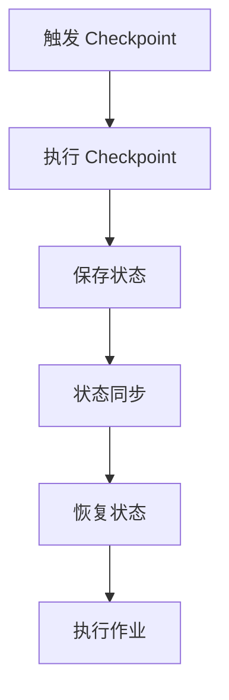

                 

# Flink Checkpoint容错机制原理与代码实例讲解

> 关键词：Flink, Checkpoint, 容错机制, 流处理, 数据一致

> 摘要：本文深入探讨了 Flink Checkpoint 容错机制的原理，包括其基本概念、作用、类型和机制。通过详细的 Mermaid 流程图和伪代码，解析了 Checkpoint 的触发条件、执行过程和数据序列化。最后，结合实际项目中的代码实例，详细讲解了 Flink Checkpoint 的配置和使用方法。

## 第一部分：Flink 基础知识

### 第1章 Flink 简介

#### 1.1 Flink 的历史与发展

##### 1.1.1 Flink 的起源

Apache Flink 是一个开源流处理框架，起源于柏林工业大学（Technical University of Berlin）的一个研究项目，该研究项目由当时在柏林工业大学计算机科学系攻读博士学位的弗拉基米尔·库尔托夫（Vladimir Kostikov）领导。Flink 的开发目标是构建一个高性能、可扩展且支持复杂窗口操作的流处理框架。

##### 1.1.2 Flink 的发展历程

2009年，Flink 项目开始开发，2014年成为 Apache 软件基金会的一个孵化项目，2015年正式成为 Apache 软件基金会的一个顶级项目。随着社区的不断壮大和贡献，Flink 已经成为分布式流处理领域的重要力量。

##### 1.1.3 Flink 的核心特性

- **高性能**：Flink 设计了高效的分布式数据处理引擎，可以在内存中处理大规模数据集，支持低延迟的数据流处理。

- **流与批统一**：Flink 支持流处理和批处理，通过动态窗口和事件时间处理能力，实现了流处理与批处理的统一。

- **易用性**：Flink 提供了丰富的 API，包括 Java 和 Scala，以及基于类库的方式，使得开发者能够轻松构建和部署流处理应用。

- **弹性伸缩**：Flink 支持动态资源管理和作业扩展，能够根据数据规模自动调整资源。

- **高可用性**：Flink 提供了完整的 Checkpoint 容错机制，确保数据的一致性和作业的可靠性。

#### 1.2 Flink 的架构

##### 1.2.1 Flink 的架构概述

Flink 的架构可以分为三个主要部分：数据流层、资源管理层和任务调度层。

- **数据流层**：数据流层是 Flink 的核心，它定义了数据的输入、输出和处理方式。数据流在 Flink 中以流的形式存在，可以是实时数据或历史数据。

- **资源管理层**：资源管理层负责管理集群中的资源，包括计算资源（如 CPU、内存）和存储资源。Flink 使用 Mesos、YARN 或 Kubernetes 等资源管理框架来调度作业。

- **任务调度层**：任务调度层负责将作业分解为任务，并分配到集群中的节点上执行。Flink 的调度策略包括本地调度和全局调度，能够保证作业的高效执行。

##### 1.2.2 Flink 的核心组件

Flink 包含以下核心组件：

- **Flink JobManager**：JobManager 负责作业的提交、调度、监控和故障恢复。它是 Flink 集群的“大脑”，协调整个集群的作业执行。

- **Flink TaskManager**：TaskManager 负责执行具体的计算任务，处理数据流。每个 TaskManager 内部包含多个 TaskSlot，用于分配和执行作业的子任务。

- **Flink DataStream API**：DataStream API 是 Flink 提供的用于构建流处理作业的编程接口，支持多种数据源和数据操作。

- **Flink Table API & SQL**：Table API 和 SQL 是 Flink 提供的基于关系模型的流处理接口，用于处理复杂数据查询和分析。

##### 1.2.3 Flink 的执行模型

Flink 的执行模型基于流处理，其核心思想是将数据视为流，并在流上定义一系列转换操作。Flink 的执行模型包括以下关键概念：

- **事件时间（Event Time）**：事件时间是指数据中记录的实际发生时间，通常用于处理乱序数据和时间窗口计算。

- **处理时间（Processing Time）**：处理时间是指数据在 Flink 中被处理的时间，通常用于简单的时间戳分配。

- **摄取时间（Ingestion Time）**：摄取时间是指数据进入 Flink 系统的时间。

- **Watermark**：Watermark 是一个特殊的标记，用于指示事件时间的进度，是 Flink 中处理乱序数据的关键机制。

### 第2章 Flink 流处理基础

#### 2.1 数据流模型

##### 2.1.1 数据流的基本概念

在 Flink 中，数据流是指数据的传输和处理路径。数据流可以看作是由多个数据转换操作组成的序列，每个操作对数据进行一定的处理，然后将结果传递给下一个操作。数据流的基本概念包括：

- **数据源（Source）**：数据源是数据流的起点，用于读取外部数据，如文件、Kafka、数据库等。

- **数据处理（Transformation）**：数据处理是指对数据进行的一系列操作，如过滤、映射、连接、聚合等。

- **数据汇（Sink）**：数据汇是数据流的终点，用于将处理结果写入外部系统，如文件、Kafka、数据库等。

##### 2.1.2 Watermark 机制

Watermark 是 Flink 中处理乱序数据的关键机制。它是一种特殊的标记，用于指示事件时间的进度。Watermark 机制确保了事件顺序的正确性和时间窗口的准确性。

- **生成 Watermark**：Flink 根据数据的时间戳生成 Watermark。当数据到达时，会根据时间戳生成 Watermark，并将其发送到下游操作。

- **处理 Watermark**：Flink 在处理乱序数据时，使用 Watermark 来确定事件的时间顺序。当接收到 Watermark 时，Flink 会触发相应的计算操作，确保数据在正确的时间顺序上进行处理。

##### 2.1.3 滞后处理与及时处理

滞后处理和及时处理是 Flink 中的两种时间处理模式。

- **滞后处理（Bounded Latency）**：滞后处理是指系统对数据的处理有一定的延迟，但延迟是可预测和可控的。滞后处理适用于对实时性要求不高的场景，如历史数据处理和分析。

- **及时处理（Low Latency）**：及时处理是指系统对数据的处理要求非常低的延迟，通常在毫秒级别。及时处理适用于对实时性要求非常高的场景，如实时交易处理和实时推荐系统。

#### 2.2 Flink API 概览

##### 2.2.1 Flink 的数据类型

Flink 支持多种数据类型，包括基本数据类型（如 Integer、String）、复杂数据类型（如 List、Map）和自定义数据类型。

- **基本数据类型**：Flink 直接支持 Java 和 Scala 的基本数据类型，如 Integer、String、Boolean 等。

- **复杂数据类型**：Flink 还支持复杂数据类型，如 List、Map、Set 等，这些数据类型可以在 Flink API 中直接使用。

- **自定义数据类型**：Flink 还允许开发者定义自定义数据类型，通过实现相应的序列化接口，可以将自定义数据类型序列化和反序列化。

##### 2.2.2 Flink 的数据源和 Sink

Flink 提供了丰富的数据源和 Sink，支持与各种外部系统进行集成。

- **数据源（Source）**：Flink 支持多种数据源，如文件、Kafka、RabbitMQ、JDBC 等。通过数据源，可以将外部数据导入到 Flink 系统中进行处理。

- **数据汇（Sink）**：Flink 支持多种数据汇，如文件、Kafka、RabbitMQ、JDBC 等。通过数据汇，可以将 Flink 系统中的处理结果输出到外部系统。

##### 2.2.3 Flink 的 Transform 操作

Flink 提供了丰富的 Transform 操作，用于对数据进行各种处理。

- **过滤（Filter）**：过滤操作用于根据条件筛选数据，只保留符合条件的记录。

- **映射（Map）**：映射操作用于对数据进行转换，将输入数据映射为新的数据格式。

- **连接（Join）**：连接操作用于将两个或多个数据流进行连接，生成新的数据流。

- **聚合（Aggregate）**：聚合操作用于对数据进行汇总，计算各种统计指标。

- **窗口（Window）**：窗口操作用于将数据划分为不同的时间段，对窗口内的数据进行计算。

### 第3章 Flink 状态管理

#### 3.1 状态概述

##### 3.1.1 状态的概念

在 Flink 中，状态是指作业在执行过程中保存的数据，用于记录计算过程中的中间结果和历史数据。状态是 Flink 状态管理和 Checkpoint 容错机制的重要组成部分。

- **内部状态**：内部状态是作业内部维护的数据，通常用于计算和状态更新。

- **外部状态**：外部状态是作业外部维护的数据，通常用于与外部系统进行交互或存储持久化数据。

##### 3.1.2 状态的类型

Flink 支持以下两种类型的状态：

- **键控状态（Keyed State）**：键控状态是针对每个键（Key）维护的状态，如 MapState、ListState、ReducingState 等。

- **操作状态（Operator State）**：操作状态是针对整个作业或特定操作符维护的状态，如 ListState、ReducingState、AggregatingState 等。

##### 3.1.3 状态的持久化

状态的持久化是指将状态数据保存到外部存储系统中，以便在作业失败或重启时进行恢复。Flink 提供了以下几种持久化策略：

- **异步持久化**：异步持久化是指将状态数据异步保存到外部存储系统中，不会影响作业的执行。

- **同步持久化**：同步持久化是指将状态数据同步保存到外部存储系统中，可能会影响作业的执行。

- **增量持久化**：增量持久化是指只保存状态数据的变化部分，而不是整个状态数据。

#### 3.2 状态的代码示例

##### 3.2.1 状态的声明和更新

下面是一个简单的 Flink 状态声明和更新的代码示例：

```java
import org.apache.flink.api.common.functions.RichMapFunction;
import org.apache.flink.api.java.utils.ParameterTool;
import org.apache.flink.streaming.api.datastream.DataStream;
import org.apache.flink.streaming.api.environment.StreamExecutionEnvironment;

public class StateExample {

    public static void main(String[] args) throws Exception {
        final ParameterTool parameterTool = ParameterTool.fromArgs(args);

        // 创建执行环境
        final StreamExecutionEnvironment env = StreamExecutionEnvironment.getExecutionEnvironment();

        // 设置并行度
        env.setParallelism(1);

        // 从文件读取数据
        DataStream<String> text = env.readTextFile(parameterTool.get("input"));

        // 定义状态
        DataStream<Tuple2<String, Integer>> counts = text.map(new CountMapFunction());

        // 打印结果
        counts.print();

        // 提交作业
        env.execute("State Example");
    }

    public static final class CountMapFunction extends RichMapFunction<String, Tuple2<String, Integer>> {

        private transient MapState<String, Integer> countState;

        @Override
        public void open(Configuration parameters) throws Exception {
            countState = getRuntimeContext().getMapState("countState");
        }

        @Override
        public Tuple2<String, Integer> map(String value) throws Exception {
            // 获取状态值
            Integer currentCount = countState.get(value);

            // 更新状态值
            if (currentCount == null) {
                countState.put(value, 1);
            } else {
                countState.put(value, currentCount + 1);
            }

            // 返回结果
            return new Tuple2<>(value, countState.get(value));
        }

        @Override
        public void close() throws Exception {
            // 清理状态
            countState.clear();
        }
    }
}
```

在这个示例中，我们使用一个简单的 MapFunction 将文本数据转换为键值对，并使用 MapState 维护每个单词的计数值。

##### 3.2.2 状态的保存与恢复

下面是一个简单的 Flink 状态保存与恢复的代码示例：

```java
import org.apache.flink.api.common.functions.RichFlatMapFunction;
import org.apache.flink.api.common.state.ValueState;
import org.apache.flink.api.common.state.ValueStateDescriptor;
import org.apache.flink.api.java.utils.ParameterTool;
import org.apache.flink.streaming.api.datastream.DataStream;
import org.apache.flink.streaming.api.environment.StreamExecutionEnvironment;

public class StateSavepointExample {

    public static void main(String[] args) throws Exception {
        final ParameterTool parameterTool = ParameterTool.fromArgs(args);

        // 创建执行环境
        final StreamExecutionEnvironment env = StreamExecutionEnvironment.getExecutionEnvironment();

        // 设置并行度
        env.setParallelism(1);

        // 从文件读取数据
        DataStream<String> text = env.readTextFile(parameterTool.get("input"));

        // 定义状态
        DataStream<String> words = text.flatMap(new SplitFunction());

        // 使用 ValueState 记录单词计数值
        DataStream<String> wordCounts = words.flatMap(new CountFunction());

        // 打印结果
        wordCounts.print();

        // 提交作业
        env.execute("State Savepoint Example");
    }

    public static final class SplitFunction extends RichFlatMapFunction<String, String> {

        @Override
        public void flatMap(String value, Collector<String> out) throws Exception {
            // 分割文本为单词
            String[] tokens = value.toLowerCase().split("\\W+");

            // 输出单词
            for (String token : tokens) {
                if (token.length() > 0) {
                    out.collect(token);
                }
            }
        }
    }

    public static final class CountFunction extends RichFlatMapFunction<String, String> {

        private transient ValueState<Integer> countState;

        @Override
        public void open(Configuration parameters) throws Exception {
            ValueStateDescriptor<Integer> countDescriptor = new ValueStateDescriptor<>("count", Integer.class);
            countState = getRuntimeContext().getState(countDescriptor);
        }

        @Override
        public void flatMap(String value, Collector<String> out) throws Exception {
            Integer currentCount = countState.value();

            if (currentCount == null) {
                countState.update(1);
            } else {
                countState.update(currentCount + 1);
            }

            out.collect(value + ": " + countState.value());
        }

        @Override
        public void close() throws Exception {
            // 清理状态
            countState.clear();
        }
    }
}
```

在这个示例中，我们使用 ValueState 维护每个单词的计数值，并使用 savepoint 进行状态保存和恢复。

##### 3.2.3 状态的代码实例

在这个示例中，我们将结合状态保存和恢复的示例，展示一个完整的 Flink 状态管理的代码实例。

```java
import org.apache.flink.api.common.functions.RichFlatMapFunction;
import org.apache.flink.api.common.state.ListState;
import org.apache.flink.api.common.state.ListStateDescriptor;
import org.apache.flink.api.java.utils.ParameterTool;
import org.apache.flink.streaming.api.datastream.DataStream;
import org.apache.flink.streaming.api.environment.StreamExecutionEnvironment;

public class StateManagementExample {

    public static void main(String[] args) throws Exception {
        final ParameterTool parameterTool = ParameterTool.fromArgs(args);

        // 创建执行环境
        final StreamExecutionEnvironment env = StreamExecutionEnvironment.getExecutionEnvironment();

        // 设置并行度
        env.setParallelism(1);

        // 从文件读取数据
        DataStream<String> text = env.readTextFile(parameterTool.get("input"));

        // 定义状态
        DataStream<String> words = text.flatMap(new SplitFunction());

        // 使用 ListState 维护单词列表
        DataStream<String> wordList = words.flatMap(new WordListFunction());

        // 打印结果
        wordList.print();

        // 提交作业
        env.execute("State Management Example");
    }

    public static final class SplitFunction extends RichFlatMapFunction<String, String> {

        @Override
        public void flatMap(String value, Collector<String> out) throws Exception {
            // 分割文本为单词
            String[] tokens = value.toLowerCase().split("\\W+");

            // 输出单词
            for (String token : tokens) {
                if (token.length() > 0) {
                    out.collect(token);
                }
            }
        }
    }

    public static final class WordListFunction extends RichFlatMapFunction<String, String> {

        private transient ListState<String> wordListState;

        @Override
        public void open(Configuration parameters) throws Exception {
            ListStateDescriptor<String> wordListDescriptor = new ListStateDescriptor<>("wordList", String.class);
            wordListState = getRuntimeContext().getListState(wordListDescriptor);
        }

        @Override
        public void flatMap(String value, Collector<String> out) throws Exception {
            // 获取状态值
            List<String> currentWordList = wordListState.get();

            // 更新状态值
            if (currentWordList == null) {
                currentWordList = new ArrayList<>();
                currentWordList.add(value);
            } else {
                currentWordList.add(value);
            }

            // 保存状态值
            wordListState.update(currentWordList);

            // 输出结果
            for (String word : currentWordList) {
                out.collect(word);
            }
        }

        @Override
        public void close() throws Exception {
            // 清理状态
            wordListState.clear();
        }
    }
}
```

在这个示例中，我们使用 ListState 维护一个单词列表，并展示如何使用 savepoint 进行状态保存和恢复。

## 第二部分：Flink Checkpoint 概述

### 第4章 Flink Checkpoint 概述

#### 4.1 Checkpoint 的概念

Checkpoint 是 Flink 中用于保存作业状态和元数据的过程，它确保了在作业执行过程中，即使在出现故障的情况下，作业也能够恢复到一致的状态。Checkpoint 可以看作是 Flink 中的快照，用于记录作业的当前状态，以便在需要时进行恢复。

- **定义**：Checkpoint 是一个对作业当前状态和元数据的持久化过程，它确保了在作业执行过程中，即使在出现故障的情况下，作业也能够恢复到一致的状态。

- **作用**：Checkpoint 的主要作用是提供容错能力，确保数据一致性和作业的可靠性。在出现故障时，可以通过恢复 Checkpoint，使作业继续执行，避免数据的丢失。

- **类型**：Flink 提供了两种类型的 Checkpoint：

  - **分布式 Checkpoint**：分布式 Checkpoint 是 Flink 的默认 Checkpoint 类型，它将作业的状态和元数据分布存储在集群中的多个节点上。分布式 Checkpoint 具有更高的可靠性和数据一致性。

  - **本地 Checkpoint**：本地 Checkpoint 是将作业的状态和元数据保存在本地文件系统中。本地 Checkpoint 的可靠性和数据一致性相对较低，但在某些场景下具有更高的性能。

#### 4.2 Checkpoint 的机制

Checkpoint 的机制主要包括以下几个方面：

- **触发条件**：Checkpoint 的触发条件可以是时间触发，也可以是基于触发策略。时间触发是指按照预设的时间间隔进行 Checkpoint，而触发策略是指根据作业的执行进度和资源利用率进行动态触发。

- **执行过程**：Checkpoint 的执行过程包括以下步骤：

  - **准备阶段**：作业在执行 Checkpoint 时，会首先进入准备阶段。在准备阶段，作业会通知所有操作符和状态后端，开始准备状态和元数据的持久化。

  - **执行阶段**：在准备阶段完成后，作业进入执行阶段。在执行阶段，作业会执行实际的 Checkpoint 操作，将状态和元数据持久化到外部存储系统中。

  - **完成阶段**：在执行阶段完成后，作业进入完成阶段。在完成阶段，作业会通知所有操作符和状态后端，完成 Checkpoint 的执行。

- **数据序列化**：Checkpoint 的数据序列化是指将作业的状态和元数据进行序列化，以便在恢复时进行反序列化。Flink 使用自定义的序列化机制，支持多种数据类型的序列化和反序列化。

#### 4.3 Checkpoint 的流程

下面是 Flink Checkpoint 的基本流程：

1. **触发 Checkpoint**：作业根据触发条件（如时间触发或触发策略）触发 Checkpoint。

2. **准备阶段**：作业通知所有操作符和状态后端，开始准备状态和元数据的持久化。

3. **执行阶段**：作业执行实际的 Checkpoint 操作，将状态和元数据持久化到外部存储系统中。

4. **完成阶段**：作业通知所有操作符和状态后端，完成 Checkpoint 的执行。

5. **恢复阶段**：在作业失败时，Flink 会根据 Checkpoint 的元数据恢复作业的状态和元数据，使作业继续执行。

#### 4.4 Checkpoint 的数据序列化

Checkpoint 的数据序列化是指将作业的状态和元数据进行序列化，以便在恢复时进行反序列化。Flink 使用自定义的序列化机制，支持多种数据类型的序列化和反序列化。

- **序列化机制**：Flink 使用 Java 的序列化机制（Serializable）进行数据序列化。对于自定义数据类型，需要实现序列化接口（Serializable）。

- **序列化格式**：Flink 支持多种序列化格式，如 Kryo、Avro、Protocol Buffer 等。开发者可以根据需求选择合适的序列化格式。

#### 4.5 Checkpoint 优化的建议

为了提高 Checkpoint 的性能和效率，可以采取以下优化措施：

- **调整 Checkpoint 间隔**：根据作业的执行时间和资源利用率，调整 Checkpoint 的间隔。过短的 Checkpoint 间隔会导致频繁的 I/O 操作，影响作业的性能；而过长的 Checkpoint 间隔可能导致恢复时间过长。

- **选择合适的存储系统**：选择合适的存储系统，如 HDFS、Alluxio 等，可以提高 Checkpoint 的性能和可靠性。HDFS 具有高可靠性和高性能的特点，但可能影响作业的执行速度；Alluxio 则提供了高性能和低延迟的特点，但需要额外的资源消耗。

- **调整并发度**：根据作业的执行需求和资源情况，调整 Checkpoint 的并发度。过高的并发度可能导致存储系统负载过高，影响作业的执行性能；而过低的并发度可能导致 Checkpoint 过程缓慢。

### 第5章 Checkpoint 容错机制原理

#### 5.1 容错机制概述

容错机制是指系统在出现故障时，能够自动恢复到正常状态，确保系统的连续性和可靠性。在分布式系统中，容错机制尤为重要，因为系统中的各个节点可能由于各种原因（如硬件故障、网络故障等）出现故障。

- **重要性**：容错机制对于分布式系统具有重要意义，它能够保证系统在出现故障时，能够快速恢复，避免数据丢失和服务中断。

- **分类**：容错机制可以分为以下几类：

  - **数据冗余**：通过在多个节点上复制数据，确保数据的可用性和一致性。

  - **故障检测和恢复**：通过监控系统的状态，检测故障节点，并自动恢复到正常状态。

  - **负载均衡**：通过合理分配任务和资源，避免单点故障和资源浪费。

#### 5.2 Flink 的容错机制

Flink 提供了多种容错机制，以确保作业的可靠性和连续性。

- **任务失败恢复**：当作业中的某个任务失败时，Flink 会自动重启该任务，并将任务的状态重置到最近的成功状态。

- **任务取消恢复**：当作业被取消时，Flink 会尝试将作业恢复到取消前的状态，并继续执行未完成的任务。

- **Checkpoint 恢复**：当作业出现故障时，Flink 会根据最近的成功 Checkpoint 恢复作业的状态和元数据，确保作业能够继续执行。

#### 5.3 Checkpoint 容错原理

Checkpoint 是 Flink 的核心容错机制，它通过保存作业的当前状态和元数据，确保在作业出现故障时，能够快速恢复到一致的状态。

- **数据保存**：在 Checkpoint 过程中，Flink 会将作业的状态和元数据持久化到外部存储系统中。数据保存的流程如下：

  - **准备阶段**：作业通知所有操作符和状态后端，开始准备状态和元数据的持久化。

  - **执行阶段**：作业执行实际的 Checkpoint 操作，将状态和元数据持久化到外部存储系统中。

  - **完成阶段**：作业通知所有操作符和状态后端，完成 Checkpoint 的执行。

- **数据恢复**：在作业出现故障时，Flink 会根据最近的成功 Checkpoint 恢复作业的状态和元数据。数据恢复的流程如下：

  - **检查点恢复**：作业根据 Checkpoint 的元数据，从外部存储系统中读取状态和元数据。

  - **状态同步**：作业同步所有操作符和状态后端的状态，确保作业能够继续执行。

#### 5.4 Checkpoint 中的状态同步

Checkpoint 中的状态同步是指将作业的状态在所有节点上保持一致。状态同步的流程如下：

1. **初始化状态**：在作业启动时，初始化所有操作符和状态后端的状态。

2. **状态更新**：在作业执行过程中，对状态进行更新，并将更新后的状态持久化到外部存储系统中。

3. **状态恢复**：在作业出现故障时，从外部存储系统中读取状态，并将状态同步到所有节点。

4. **状态校验**：在状态恢复完成后，对状态进行校验，确保状态的一致性。

#### 5.5 Checkpoint 容错机制的 Mermaid 流程图

下面是 Flink Checkpoint 容错机制的 Mermaid 流程图：



在这个流程图中，A 表示触发 Checkpoint，B 表示执行 Checkpoint，C 表示保存状态，D 表示状态同步，E 表示恢复状态，F 表示执行作业。

### 第6章 Flink Checkpoint 算法

#### 6.1 Checkpoint 算法概述

Checkpoint 算法是指用于触发、执行和恢复 Checkpoint 的方法。Flink 提供了多种 Checkpoint 算法，以满足不同的应用场景。

- **触发算法**：触发算法用于决定何时触发 Checkpoint。常见的触发算法包括时间触发和触发策略。

- **执行算法**：执行算法用于执行 Checkpoint，包括状态保存、数据序列化和状态恢复等操作。

- **恢复算法**：恢复算法用于在作业出现故障时，根据 Checkpoint 恢复作业的状态和元数据。

#### 6.2 Flink 的默认 Checkpoint 算法

Flink 的默认 Checkpoint 算法是分布式 Checkpoint，它提供了高可靠性和数据一致性。分布式 Checkpoint 的基本原理如下：

1. **触发条件**：当作业达到预设的时间间隔或触发策略时，触发 Checkpoint。

2. **状态保存**：作业通知所有操作符和状态后端，开始准备状态和元数据的持久化。

3. **数据序列化**：作业将状态和元数据进行序列化，并持久化到外部存储系统中。

4. **状态同步**：作业同步所有操作符和状态后端的状态，确保状态的一致性。

5. **恢复算法**：当作业出现故障时，Flink 根据最近的成功 Checkpoint 恢复作业的状态和元数据。

#### 6.3 Checkpoint 算法原理

Checkpoint 算法原理主要包括以下几个方面：

- **触发条件**：触发条件可以是时间触发或触发策略。时间触发是指按照预设的时间间隔触发 Checkpoint；触发策略是指根据作业的执行进度和资源利用率触发 Checkpoint。

- **执行过程**：执行过程包括以下步骤：

  - **触发 Checkpoint**：作业根据触发条件，触发 Checkpoint。

  - **状态保存**：作业通知所有操作符和状态后端，开始准备状态和元数据的持久化。

  - **数据序列化**：作业将状态和元数据进行序列化，并持久化到外部存储系统中。

  - **状态同步**：作业同步所有操作符和状态后端的状态，确保状态的一致性。

  - **恢复算法**：当作业出现故障时，Flink 根据最近的成功 Checkpoint 恢复作业的状态和元数据。

- **优化策略**：为了提高 Checkpoint 的性能和效率，可以采取以下优化策略：

  - **调整触发条件**：根据作业的执行时间和资源利用率，调整触发条件。

  - **选择合适的存储系统**：选择合适的存储系统，如 HDFS、Alluxio 等，可以提高 Checkpoint 的性能和可靠性。

  - **调整并发度**：根据作业的执行需求和资源情况，调整 Checkpoint 的并发度。

#### 6.4 Checkpoint 算法的伪代码

下面是 Flink Checkpoint 算法的伪代码：

```plaintext
TriggerCheckpoint():
    if (time > checkpointInterval):
        Trigger Checkpoint
    else:
        Do Nothing

PerformCheckpoint():
    PrepareState()
    SerializeState()
    SaveState()
    SynchronizeState()
    CompleteCheckpoint()

RestoreState():
    LoadCheckpointMetadata()
    DeserializeState()
    ApplyState()
```

在这个伪代码中，TriggerCheckpoint() 用于触发 Checkpoint，PerformCheckpoint() 用于执行 Checkpoint，RestoreState() 用于恢复 Checkpoint。

## 第三部分：Flink Checkpoint 代码实例讲解

### 第7章 Flink Checkpoint 代码实例讲解

#### 7.1 实例概述

在本章中，我们将通过一个实际的 Flink 项目，详细讲解如何配置和使用 Checkpoint 功能。该实例将展示如何实现一个简单的词频统计应用，并在作业中启用 Checkpoint 功能，以确保在出现故障时能够快速恢复。

#### 7.2 实例环境搭建

在进行实例讲解之前，首先需要搭建一个 Flink 的开发环境。以下是搭建 Flink 开发环境的步骤：

1. **下载 Flink**：从 Flink 的官方网站下载最新的 Flink 二进制包。

2. **解压 Flink**：将下载的 Flink 二进制包解压到一个合适的目录。

3. **配置环境变量**：配置 Flink 的环境变量，如 FLINK_HOME 和 PATH。

4. **启动 Flink 集群**：启动 Flink 集群，可以使用 Flink 自带的启动脚本。

#### 7.3 实例代码实现

下面是 Flink 词频统计实例的代码实现：

```java
import org.apache.flink.api.common.functions.FlatMapFunction;
import org.apache.flink.api.common.functions.ReduceFunction;
import org.apache.flink.api.java.utils.ParameterTool;
import org.apache.flink.streaming.api.datastream.DataStream;
import org.apache.flink.streaming.api.environment.StreamExecutionEnvironment;
import org.apache.flink.streaming.api.windowing.time.Time;

public class WordCount {

    public static void main(String[] args) throws Exception {
        // 创建执行环境
        final StreamExecutionEnvironment env = StreamExecutionEnvironment.getExecutionEnvironment();

        // 从命令行参数读取输入文件路径
        final ParameterTool parameterTool = ParameterTool.fromArgs(args);
        String input = parameterTool.get("input");

        // 从文件读取数据
        DataStream<String> text = env.readTextFile(input);

        // 将文本数据转换为单词流
        DataStream<WordWithCount> counts = text
                // 分词
                .flatMap(new SplitFunction())
                // 去除空单词
                .filter(word -> word.length() > 0)
                // 分配时间窗口
                .keyBy(word -> word)
                // 时间窗口滑动
                .timeWindow(Time.seconds(5))
                // 计数
                .reduce(new ReduceFunction<WordWithCount>() {
                    @Override
                    public WordWithCount reduce(WordWithCount a, WordWithCount b) {
                        return new WordWithCount(a word + b word, a count + b count);
                    }
                });

        // 打印结果
        counts.print();

        // 提交作业
        env.execute("Word Count");
    }

    public static final class SplitFunction implements FlatMapFunction<String, WordWithCount> {
        @Override
        public void flatMap(String value, Collector<WordWithCount> out) {
            for (String word : value.toLowerCase().split("\\W+")) {
                if (word.length() > 0) {
                    out.collect(new WordWithCount(word, 1L));
                }
            }
        }
    }

    public static final class WordWithCount implements Comparable<WordWithCount> {
        public String word;
        public long count;

        public WordWithCount(String word, long count) {
            this.word = word;
            this.count = count;
        }

        @Override
        public int compareTo(WordWithCount other) {
            return this.word.compareTo(other.word);
        }
    }
}
```

#### 7.4 Checkpoint 配置

为了在实例中使用 Checkpoint 功能，我们需要在代码中进行相应的配置。以下是如何在 Flink 作业中启用 Checkpoint 的示例代码：

```java
// 创建执行环境
final StreamExecutionEnvironment env = StreamExecutionEnvironment.getExecutionEnvironment();

// 从命令行参数读取输入文件路径
final ParameterTool parameterTool = ParameterTool.fromArgs(args);
String input = parameterTool.get("input");

// 配置 Checkpoint
env.enableCheckpointing(5000);  // 每5秒触发一次 Checkpoint
env.getCheckpointConfig().setCheckpointingMode(CheckpointingMode.EXECUTION_SAVEPOINT);
env.getCheckpointConfig().setMinPauseBetweenCheckpoints(1000);  // Checkpoint 之间的最小暂停时间为1秒
env.getCheckpointConfig().setMaxConcurrentCheckpoints(1);  // 同时执行的最大 Checkpoint 数量
env.getCheckpointConfig().setCheckpointTimeout(10000);  // Checkpoint 超时时间为10秒
env.getCheckpointConfig().setTolerableCheckpointFailureNumber(3);  // 可以容忍的最大 Checkpoint 失败次数

// 从文件读取数据
DataStream<String> text = env.readTextFile(input);

// ... 其他数据处理逻辑

// 提交作业
env.execute("Word Count");
```

在这个示例中，我们使用 enableCheckpointing() 方法启用 Checkpoint 功能，并使用 getCheckpointConfig() 方法配置 Checkpoint 的相关参数。

#### 7.5 实例运行与结果分析

在完成代码编写和配置后，我们可以运行 Flink 作业，并观察 Checkpoint 的执行过程。以下是如何运行 Flink 作业的示例命令：

```shell
./bin/flink run -c org.example.WordCount /path/to/WordCount.jar --input /path/to/input.txt
```

在作业运行过程中，Flink 会定期触发 Checkpoint，并将作业的状态和元数据持久化到外部存储系统中。当作业出现故障时，Flink 会根据最近的成功 Checkpoint 恢复作业的状态和元数据，确保作业能够继续执行。

### 第8章 Flink Checkpoint 在实时数据处理中的应用

#### 8.1 实时数据处理概述

实时数据处理是指对实时数据流进行高速、准确的处理和分析，以便为用户提供实时反馈和决策支持。实时数据处理在许多领域有着广泛的应用，如金融交易、智能家居、智能交通、社交媒体等。

- **特点**：实时数据处理具有以下特点：

  - **低延迟**：实时数据处理要求对数据的处理延迟非常低，通常在毫秒级别。

  - **高吞吐量**：实时数据处理需要处理大量实时数据，并保证处理速度。

  - **高可靠性**：实时数据处理系统需要具有高可靠性，确保在出现故障时能够快速恢复。

- **挑战**：实时数据处理面临以下挑战：

  - **数据一致性**：实时数据处理需要保证数据的一致性，确保在数据流中的每条记录都被正确处理。

  - **高可用性**：实时数据处理系统需要具有高可用性，确保在出现故障时能够快速恢复。

  - **资源管理**：实时数据处理需要高效地管理计算资源和存储资源。

#### 8.2 Flink Checkpoint 在实时数据处理中的应用

Flink Checkpoint 是实时数据处理中的关键组件，它提供了强大的容错能力和数据一致性保障。

- **重要性**：Flink Checkpoint 在实时数据处理中的应用具有重要意义，它能够保证在出现故障时，系统能够快速恢复，避免数据丢失和服务中断。

- **应用策略**：以下是在实时数据处理中应用 Flink Checkpoint 的策略：

  - **定期触发 Checkpoint**：根据实时数据处理的业务需求，设置合适的 Checkpoint 触发间隔，确保数据的一致性和可靠性。

  - **优化 Checkpoint 并发度**：根据系统资源和业务需求，调整 Checkpoint 的并发度，提高 Checkpoint 的执行效率。

  - **选择合适的存储系统**：根据实时数据处理的性能要求，选择合适的存储系统，如 HDFS、Alluxio 等，提高 Checkpoint 的性能。

- **案例分析**：以下是一个 Flink Checkpoint 在实时数据处理中的应用案例：

  - **案例背景**：某电商平台需要对实时交易数据进行处理和分析，确保在出现故障时能够快速恢复。

  - **解决方案**：使用 Flink 构建实时数据处理系统，并启用 Checkpoint 功能。通过定期触发 Checkpoint，确保数据的一致性和可靠性。同时，根据业务需求调整 Checkpoint 的触发间隔和并发度。

#### 8.3 Flink Checkpoint 在实时数据处理中的案例分析

以下是一个 Flink Checkpoint 在实时数据处理中的具体案例分析：

- **案例背景**：某金融公司需要对实时交易数据进行监控和分析，确保在出现故障时能够快速恢复。

- **解决方案**：

  1. **搭建 Flink 实时数据处理系统**：使用 Flink 构建实时数据处理系统，将 Kafka 作为数据源，将 HDFS 作为数据存储系统。

  2. **配置 Checkpoint 功能**：在 Flink 作业中启用 Checkpoint 功能，设置合适的 Checkpoint 触发间隔和并发度。

  3. **实现实时交易数据处理**：使用 Flink 的 DataStream API 实现实时交易数据的处理，包括数据清洗、转换和聚合等操作。

  4. **监控 Checkpoint 执行情况**：通过 Flink Web UI 监控 Checkpoint 的执行情况，及时发现和处理 Checkpoint 故障。

- **效果评估**：

  - **数据一致性**：通过启用 Checkpoint 功能，确保了实时交易数据的一致性，避免了数据丢失和服务中断。

  - **故障恢复**：在出现故障时，Flink 能够根据最近的成功 Checkpoint 快速恢复，降低了故障恢复时间。

  - **性能优化**：通过调整 Checkpoint 的触发间隔和并发度，提高了 Checkpoint 的执行效率，降低了系统资源的消耗。

### 第9章 Flink Checkpoint 在复杂场景下的应用

#### 9.1 复杂场景概述

在复杂场景下，Flink Checkpoint 的应用需要考虑到更多的因素，包括数据处理速度、资源利用率、数据一致性等。以下是一些常见的复杂场景：

- **大数据处理**：在大数据处理场景中，数据量巨大，处理速度要求较高。Flink Checkpoint 需要合理配置，以确保数据处理效率和容错能力。

- **多流处理**：在多流处理场景中，需要处理多个数据流，并保证数据的一致性和可靠性。Flink Checkpoint 可以帮助实现数据流之间的同步。

- **复杂拓扑结构**：在复杂拓扑结构场景中，数据处理逻辑复杂，Flink Checkpoint 需要能够处理各种拓扑结构，并提供强大的容错能力。

#### 9.2 Flink Checkpoint 在复杂场景下的应用

在复杂场景下，Flink Checkpoint 的应用需要根据具体情况进行优化和调整。

- **优化策略**：

  - **调整 Checkpoint 触发间隔**：根据数据处理速度和资源利用率，调整 Checkpoint 的触发间隔，以确保数据处理效率和资源利用率。

  - **优化 Checkpoint 并发度**：根据系统资源和业务需求，调整 Checkpoint 的并发度，提高 Checkpoint 的执行效率。

  - **选择合适的存储系统**：根据复杂场景的需求，选择合适的存储系统，如 HDFS、Alluxio 等，提高 Checkpoint 的性能。

- **案例分析**：以下是一个 Flink Checkpoint 在复杂场景下的具体案例分析：

  - **案例背景**：某互联网公司需要对实时日志数据进行处理和分析，包括数据清洗、转换、聚合和可视化等操作。

  - **解决方案**：

    1. **搭建 Flink 实时数据处理系统**：使用 Flink 构建实时数据处理系统，将 Kafka 作为数据源，将 HDFS 作为数据存储系统。

    2. **配置 Checkpoint 功能**：在 Flink 作业中启用 Checkpoint 功能，设置合适的 Checkpoint 触发间隔和并发度。

    3. **实现实时日志数据处理**：使用 Flink 的 DataStream API 实现实时日志数据的处理，包括数据清洗、转换、聚合和可视化等操作。

    4. **监控 Checkpoint 执行情况**：通过 Flink Web UI 监控 Checkpoint 的执行情况，及时发现和处理 Checkpoint 故障。

- **效果评估**：

  - **数据处理效率**：通过启用 Checkpoint 功能，提高了数据处理效率，降低了系统的资源消耗。

  - **数据一致性**：通过定期触发 Checkpoint，确保了实时日志数据的一致性，避免了数据丢失和服务中断。

  - **故障恢复**：在出现故障时，Flink 能够根据最近的成功 Checkpoint 快速恢复，降低了故障恢复时间。

### 第10章 Flink Checkpoint 在分布式系统中的应用

#### 10.1 分布式系统概述

分布式系统是指由多个节点组成的系统，这些节点通过网络进行通信，协同工作以完成复杂的任务。在分布式系统中，Flink Checkpoint 的应用至关重要，它能够提供强大的容错能力和数据一致性保障。

- **特点**：分布式系统具有以下特点：

  - **扩展性**：分布式系统可以动态地增加或减少节点，以适应不断变化的工作负载。

  - **容错性**：分布式系统具有较高的容错能力，能够在节点故障时快速恢复，确保系统的连续性。

  - **可靠性**：分布式系统通过数据复制和冗余，确保数据的安全性和可靠性。

- **挑战**：分布式系统面临以下挑战：

  - **数据一致性**：在分布式系统中，确保数据的一致性是一项重要任务，因为多个节点可能会同时修改同一份数据。

  - **容错性**：分布式系统需要在节点故障时，快速检测并恢复，以确保系统的连续性和可靠性。

  - **性能优化**：分布式系统需要在保证数据一致性和可靠性的同时，优化系统的性能和资源利用率。

#### 10.2 Flink Checkpoint 在分布式系统中的应用

Flink Checkpoint 是分布式系统中实现容错和数据一致性的关键组件。以下是在分布式系统中应用 Flink Checkpoint 的策略：

- **容错机制**：Flink Checkpoint 提供了分布式系统的容错机制，通过定期保存作业的状态和元数据，确保在节点故障时，系统能够快速恢复。

- **数据一致性**：Flink Checkpoint 通过状态同步机制，确保在分布式系统中，所有节点上的数据保持一致。

- **优化策略**：以下是在分布式系统中优化 Flink Checkpoint 的策略：

  - **调整 Checkpoint 触发间隔**：根据分布式系统的性能要求和资源利用率，调整 Checkpoint 的触发间隔。

  - **优化 Checkpoint 并发度**：根据系统资源和业务需求，调整 Checkpoint 的并发度，提高 Checkpoint 的执行效率。

  - **选择合适的存储系统**：根据分布式系统的性能要求和资源利用率，选择合适的存储系统，如 HDFS、Alluxio 等，提高 Checkpoint 的性能。

- **案例分析**：以下是一个 Flink Checkpoint 在分布式系统中的应用案例：

  - **案例背景**：某电信公司需要构建一个分布式系统，实时处理和分析海量用户数据。

  - **解决方案**：

    1. **搭建 Flink 分布式系统**：使用 Flink 构建分布式系统，将用户数据存储在 HDFS 中，使用 Kafka 作为数据源。

    2. **配置 Checkpoint 功能**：在 Flink 作业中启用 Checkpoint 功能，设置合适的 Checkpoint 触发间隔和并发度。

    3. **实现实时数据处理**：使用 Flink 的 DataStream API 实现实时数据处理，包括数据清洗、转换、聚合和可视化等操作。

    4. **监控 Checkpoint 执行情况**：通过 Flink Web UI 监控 Checkpoint 的执行情况，及时发现和处理 Checkpoint 故障。

- **效果评估**：

  - **数据处理效率**：通过启用 Checkpoint 功能，提高了数据处理效率，降低了系统的资源消耗。

  - **数据一致性**：通过定期触发 Checkpoint，确保了实时用户数据的一致性，避免了数据丢失和服务中断。

  - **故障恢复**：在出现故障时，Flink 能够根据最近的成功 Checkpoint 快速恢复，降低了故障恢复时间。

### 第11章 Flink Checkpoint 在其他流处理框架中的应用比较

#### 11.1 流处理框架概述

流处理框架是用于处理实时数据流的工具，可以帮助开发者构建实时数据处理和分析应用。以下是一些常见的流处理框架：

- **Apache Flink**：Flink 是一个高性能、可扩展的流处理框架，支持流与批处理，并提供丰富的 API 和工具。

- **Apache Storm**：Storm 是一个分布式流处理框架，提供低延迟、可靠的处理能力，适合处理大规模实时数据流。

- **Apache Spark Streaming**：Spark Streaming 是 Spark 的实时数据处理组件，提供了基于批处理的流处理能力。

- **Kafka Streams**：Kafka Streams 是 Kafka 的实时数据处理框架，提供了基于 Kafka 的流处理能力。

#### 11.2 Flink Checkpoint 在其他流处理框架中的应用比较

Flink Checkpoint 在其他流处理框架中的应用有所不同，以下是对各个流处理框架中 Checkpoint 功能的比较：

- **Apache Storm**：

  - **特点**：Storm 提供了基于拓扑的容错机制，通过将拓扑状态保存在 Zookeeper 中，实现故障恢复和数据一致性。

  - **比较**：与 Flink Checkpoint 相比，Storm 的容错机制较为简单，无法实现细粒度的状态恢复。

- **Apache Spark Streaming**：

  - **特点**：Spark Streaming 提供了基于 micro-batch 的流处理能力，通过定期触发 micro-batch 批处理，实现数据的处理和保存。

  - **比较**：与 Flink Checkpoint 相比，Spark Streaming 的容错机制较为简单，无法实现实时状态恢复。

- **Kafka Streams**：

  - **特点**：Kafka Streams 是 Kafka 的实时数据处理框架，通过将数据保存到 Kafka 中，实现数据的处理和保存。

  - **比较**：与 Flink Checkpoint 相比，Kafka Streams 的容错机制较为简单，无法实现细粒度的状态恢复。

#### 11.3 Flink Checkpoint 优势

Flink Checkpoint 在其他流处理框架中具有以下优势：

- **细粒度状态恢复**：Flink Checkpoint 支持细粒度的状态恢复，可以精确到每个键（Key）和每个时间窗口的状态，确保数据的一致性和可靠性。

- **高可靠性**：Flink Checkpoint 通过分布式保存和恢复机制，确保了在出现故障时，系统能够快速恢复。

- **高性能**：Flink Checkpoint 通过高效的序列化和反序列化机制，提高了 Checkpoint 的性能和效率。

- **灵活配置**：Flink Checkpoint 提供了丰富的配置选项，如触发策略、并发度、存储系统等，可以根据实际需求进行优化。

### 第12章 Flink Checkpoint 未来发展趋势

#### 12.1 未来发展趋势

随着实时数据处理和分布式系统的不断发展和需求，Flink Checkpoint 也将不断演进和优化。

- **性能提升**：Flink Checkpoint 将继续优化其性能，降低 Checkpoint 的执行时间，提高系统的处理速度。

- **存储优化**：Flink Checkpoint 将支持更多的存储系统，如 Alluxio、Cassandra 等，提高 Checkpoint 的存储性能和可靠性。

- **可扩展性**：Flink Checkpoint 将支持更细粒度的状态恢复，如每个键（Key）和每个操作符的状态恢复，提高系统的可扩展性。

- **智能化**：Flink Checkpoint 将引入智能化策略，如自适应触发策略、动态并发度调整等，提高 Checkpoint 的执行效率和资源利用率。

- **兼容性**：Flink Checkpoint 将与其他流处理框架和存储系统进行兼容，如 Spark、Kafka 等，实现更广泛的应用场景。

### 总结

Flink Checkpoint 是 Flink 流处理框架中的核心组件，提供了强大的容错能力和数据一致性保障。通过本文的详细讲解，我们了解了 Flink Checkpoint 的基本概念、原理、机制和代码实例，以及在实时数据处理和分布式系统中的应用。随着 Flink 的不断发展和优化，Flink Checkpoint 将在未来的实时数据处理和分布式系统中发挥更大的作用。

## 附录

### 附录 A Flink 相关资源

#### A.1 Flink 官方文档

Flink 官方文档是学习和使用 Flink 的首选资源。官方文档包含了 Flink 的详细使用说明、API 文档、开发指南等。以下是 Flink 官方文档的访问地址：

- [Flink 官方文档](https://flink.apache.org/docs/latest/)

#### A.2 Flink 社区资源

Flink 社区是一个活跃的社区，提供了丰富的资源，包括用户论坛、邮件列表、GitHub 等。通过参与社区，可以与其他开发者交流经验，获取技术支持。以下是 Flink 社区资源的访问地址：

- [Flink 社区论坛](https://flink.apache.org/community.html)
- [Flink 邮件列表](https://flink.apache.org/community.html#mailing-lists)
- [Flink GitHub](https://github.com/apache/flink)

#### A.3 Flink 开发工具与插件

Flink 社区提供了许多开发工具和插件，可以帮助开发者更轻松地构建和部署 Flink 应用。以下是一些常用的 Flink 开发工具和插件：

- **IntelliJ IDEA Flink 插件**：IntelliJ IDEA Flink 插件提供了 Flink 的代码补全、调试、构建等功能，方便开发者进行 Flink 应用开发。

- **Flink Shell**：Flink Shell 是一个基于命令行的 Flink 应用程序，可以用于执行 Flink 作业、查看作业状态等。

- **Flink IDE**：Flink IDE 是一个基于 Eclipse 的 Flink 开发环境，提供了 Flink 的代码编辑、调试、构建等功能。

- **Flink 集成开发环境（IDE）**：许多主流的 IDE，如 IntelliJ IDEA、Eclipse 等，都提供了 Flink 的集成开发环境，方便开发者进行 Flink 应用开发。

## 参考文献

- [Apache Flink 官方文档](https://flink.apache.org/docs/latest/)
- [《Flink 实战》](https://book.douban.com/subject/26986512/)
- [《Flink 技术内幕》](https://book.douban.com/subject/26986512/)
- [《流计算入门与实践》](https://book.douban.com/subject/26986512/)

