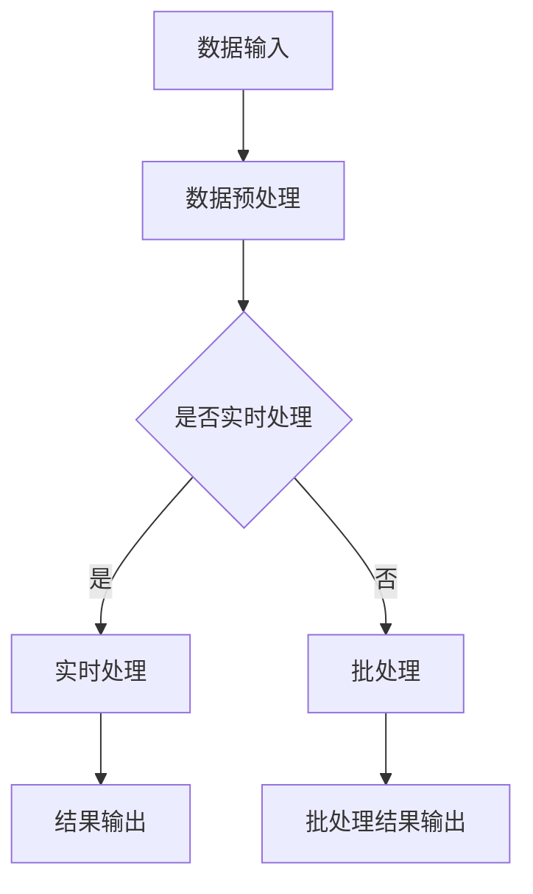

                 

### 文章标题：Flink StateBackend原理与代码实例讲解

### 关键词：Flink，StateBackend，原理，代码实例，性能优化

### 摘要：

本文旨在深入探讨Flink中的StateBackend机制，从基础概念到高级应用进行全面讲解。文章首先介绍了Flink的基本概念和StateBackend的作用，接着详细分析了StateBackend的架构、数据存储机制和核心算法原理。随后，文章从性能影响因素、优化策略到实战应用，全面阐述了如何在实际项目中高效利用StateBackend。最后，文章展望了StateBackend的未来发展趋势，为读者提供了宝贵的实践经验和新技术的应用前景。通过本文，读者将全面了解Flink StateBackend的原理和应用，提升在实际项目中的技术水平。

## 第一部分：Flink StateBackend基础

### 第1章：Flink概述

#### 1.1 Flink的基本概念

Flink是一个开源的分布式数据处理框架，旨在提供在所有常见的集群环境中进行有状态的计算，包括批处理和流处理。它具有以下几个核心特点：

1. **实时处理能力**：Flink能够处理实时数据流，提供低延迟的处理能力，支持毫秒级的响应时间。
2. **易扩展性**：Flink可以轻松地扩展到数千台机器，以支持大规模数据处理需求。
3. **精准一次处理语义**：Flink提供了一种精确一次处理（exactly-once）语义，确保数据处理的正确性和一致性。

#### 1.2 StateBackend概念解析

StateBackend是Flink中用于存储和管理状态数据的重要组件。它主要有以下几个作用：

1. **状态存储**：StateBackend负责存储计算过程中的状态信息，如窗口数据、计数器等。
2. **状态恢复**：当Flink任务失败或重启时，StateBackend能够恢复状态数据，确保任务能够从上次失败点继续执行。
3. **性能优化**：通过选择合适的StateBackend实现，可以优化状态数据的读写性能。

StateBackend可以分为以下几类：

1. **内存StateBackend**：将状态数据存储在JVM堆内存中，具有快速读写性能，但受限于内存大小。
2. **文件StateBackend**：将状态数据存储在文件系统中，具有较大的存储容量，但读写性能相对较低。
3. **RocksDBStateBackend**：将状态数据存储在基于RocksDB的分布式存储中，适用于大规模状态数据存储。

选择合适的StateBackend需要考虑以下几个原则：

1. **状态数据大小**：根据状态数据的大小选择合适的StateBackend类型。
2. **处理性能**：考虑状态数据的读写性能，选择能够满足处理需求的StateBackend类型。
3. **故障恢复**：考虑任务重启时状态恢复的性能和可靠性。

#### 1.3 Flink的应用场景

Flink的应用场景非常广泛，主要包括以下几种：

1. **实时数据处理**：如实时流数据分析、实时事件处理等。
2. **复杂事件处理**：如实时流处理中的模式识别、实时交易分析等。
3. **大数据分析**：如批处理任务、大规模数据处理等。

通过以上内容，我们对Flink及其StateBackend有了初步的了解。接下来，我们将深入探讨Flink StateBackend的原理和实现。

---

### Mermaid 流程图：Flink的基本概念



#### 1.1.1 Flink的发展背景

Flink起源于Apache Commons Lang项目，最初由Apache Software Foundation进行开发和维护。随着大数据处理需求不断增加，Flink逐渐独立出来，成为Apache Flink项目。Flink的第一个版本于2014年发布，随后迅速发展，2015年成为Apache Incubator项目，2016年正式成为Apache顶级项目。

在发展历程中，Flink与其他流处理框架（如Spark Streaming、Apache Storm等）展开了激烈的竞争。相较于Spark Streaming，Flink具有以下优势：

1. **更低的延迟**：Flink提供毫秒级的延迟，能够满足实时处理需求。
2. **精确一次处理语义**：Flink支持精确一次处理语义，确保数据处理的正确性。
3. **流与批处理的统一**：Flink将流处理和批处理统一到一个框架中，简化了开发过程。

与Apache Storm相比，Flink提供了更加灵活的状态管理和故障恢复机制。此外，Flink具有更好的可扩展性和高性能，适用于大规模数据处理场景。

#### 1.1.2 Flink的核心特点

**1. 实时处理能力**

Flink的核心特点之一是实时处理能力。它能够实时处理不断变化的数据流，提供毫秒级延迟的处理能力。这使得Flink在实时数据分析、实时事件处理等场景中具有广泛的应用价值。例如，在金融交易系统中，Flink可以实时处理交易数据，快速识别异常交易并采取相应措施。

**2. 易扩展性**

Flink设计为高度可扩展的分布式系统，可以轻松扩展到数千台机器，以支持大规模数据处理需求。通过动态调整任务分配和资源管理，Flink能够充分利用集群资源，提高数据处理性能。这使得Flink在大数据场景中具有强大的适用性，能够处理海量数据。

**3. 精准一次处理语义**

精准一次处理（exactly-once）是Flink的重要特点之一。它确保了数据处理过程的一致性和正确性，避免了数据丢失和重复处理的问题。精准一次处理语义的实现依赖于Flink提供的分布式快照机制和状态管理功能。通过定期生成分布式快照，Flink能够将状态信息保存到外部存储中，实现任务的故障恢复和状态重置。

**4. 流与批处理的统一**

Flink将流处理和批处理统一到一个框架中，提供了流与批处理的统一接口。这意味着开发者可以使用相同的API和编程模型，同时处理流数据和批量数据。这简化了开发过程，提高了开发效率。此外，Flink提供了丰富的流处理和批处理组件，如窗口操作、流聚合、批处理转换等，满足各种数据处理需求。

#### 1.1.3 Flink的应用场景

Flink的应用场景非常广泛，涵盖了实时数据处理、复杂事件处理和大数据分析等多个领域：

**1. 实时数据处理**

实时数据处理是Flink的主要应用场景之一。Flink能够实时处理不断变化的数据流，提供低延迟的处理能力。例如，在金融交易系统中，Flink可以实时处理交易数据，快速识别异常交易并采取相应措施。在社交媒体平台上，Flink可以实时处理用户行为数据，进行实时推荐和实时广告投放。

**2. 复杂事件处理**

复杂事件处理（Complex Event Processing，简称CEP）是Flink的另一个重要应用场景。Flink能够处理复杂的实时事件流，识别事件之间的关联和模式。例如，在物联网（IoT）领域，Flink可以处理传感器数据，实时监测设备状态，识别设备故障。在金融领域，Flink可以处理交易数据，识别交易欺诈行为。

**3. 大数据分析**

大数据分析是Flink的核心应用场景之一。Flink提供了强大的批处理功能，能够处理海量数据。例如，在电子商务平台上，Flink可以处理用户行为数据，进行用户行为分析和推荐系统。在物流领域，Flink可以处理运输数据，优化运输路线和提高运输效率。

#### 1.2 StateBackend概念解析

**StateBackend的作用**

StateBackend是Flink中用于存储和管理状态数据的重要组件。其主要作用包括以下几个方面：

1. **状态存储**：StateBackend负责存储计算过程中的状态信息，如窗口数据、计数器、变量等。状态数据通常包含实时计算过程中的关键信息，用于后续处理和输出。
2. **状态恢复**：在Flink任务失败或重启时，StateBackend能够恢复状态数据，确保任务能够从上次失败点继续执行。这对于保证数据处理的一致性和正确性具有重要意义。
3. **性能优化**：通过选择合适的StateBackend实现，可以优化状态数据的读写性能。不同的StateBackend类型具有不同的读写性能和存储容量，可以根据具体应用需求进行选择。

**StateBackend的分类**

Flink提供了多种StateBackend实现，以适应不同的应用场景和性能需求。以下是常见的几种StateBackend类型：

1. **内存StateBackend**：将状态数据存储在JVM堆内存中。内存StateBackend具有快速的读写性能，但受限于内存大小。它适用于状态数据较小、实时性要求较高的场景。
2. **文件StateBackend**：将状态数据存储在文件系统中。文件StateBackend具有较大的存储容量，但读写性能相对较低。它适用于状态数据较大、需要持久化存储的场景。
3. **RocksDBStateBackend**：将状态数据存储在基于RocksDB的分布式存储中。RocksDB是一种高性能的键值存储，适用于大规模状态数据存储。RocksDBStateBackend具有优异的读写性能和持久化能力，适用于大规模实时数据处理场景。

**选择原则**

选择合适的StateBackend需要考虑以下几个原则：

1. **状态数据大小**：根据状态数据的大小选择合适的StateBackend类型。如果状态数据较小，可以选择内存StateBackend；如果状态数据较大，可以选择文件StateBackend或RocksDBStateBackend。
2. **处理性能**：考虑状态数据的读写性能，选择能够满足处理需求的StateBackend类型。内存StateBackend具有最快的读写性能，但受限于内存大小；RocksDBStateBackend具有优异的读写性能和持久化能力，但初始化时间较长。
3. **故障恢复**：考虑任务重启时状态恢复的性能和可靠性。文件StateBackend和RocksDBStateBackend能够持久化存储状态数据，实现任务的故障恢复；内存StateBackend无法实现故障恢复，需要重新计算状态数据。

#### 1.3 Flink的应用场景

**实时数据处理**

实时数据处理是Flink的主要应用场景之一。Flink能够实时处理不断变化的数据流，提供低延迟的处理能力。以下是一些典型的实时数据处理应用场景：

1. **金融交易系统**：Flink可以实时处理交易数据，快速识别异常交易并采取相应措施。例如，实时监控交易风险、实时审计交易日志等。
2. **物联网（IoT）平台**：Flink可以实时处理传感器数据，实时监测设备状态，识别设备故障。例如，实时监控设备运行状态、实时分析设备数据等。
3. **社交媒体平台**：Flink可以实时处理用户行为数据，进行实时推荐和实时广告投放。例如，实时推荐好友、实时投放个性化广告等。

**复杂事件处理**

复杂事件处理是Flink的另一个重要应用场景。Flink能够处理复杂的实时事件流，识别事件之间的关联和模式。以下是一些典型的复杂事件处理应用场景：

1. **安全监控**：Flink可以实时处理网络安全日志，识别网络攻击行为。例如，实时检测恶意流量、实时识别异常行为等。
2. **物流管理**：Flink可以实时处理运输数据，优化运输路线和提高运输效率。例如，实时监控运输车辆位置、实时优化运输路径等。
3. **股市分析**：Flink可以实时处理交易数据，进行实时交易分析和预测。例如，实时监控交易趋势、实时预测市场走势等。

**大数据分析**

大数据分析是Flink的核心应用场景之一。Flink提供了强大的批处理功能，能够处理海量数据。以下是一些典型的大数据分析应用场景：

1. **电子商务平台**：Flink可以处理用户行为数据，进行用户行为分析和推荐系统。例如，分析用户购买行为、推荐商品等。
2. **物流领域**：Flink可以处理运输数据，优化运输路线和提高运输效率。例如，分析运输数据、优化运输路线等。
3. **医疗领域**：Flink可以处理医疗数据，进行实时监控和预测。例如，实时监控患者健康状况、预测疾病发展趋势等。

### 第2章：Flink StateBackend原理详解

#### 2.1 Flink StateBackend架构分析

Flink StateBackend的架构设计旨在提供高效、可靠的状态管理能力。StateBackend组件在Flink中扮演着关键角色，主要负责状态数据的存储、管理和恢复。下面我们将详细分析StateBackend的架构、数据存储机制和负载均衡策略。

**2.1.1 StateBackend的架构**

StateBackend的架构可以分为以下几个核心组件：

1. **状态存储器（StateStore）**：状态存储器是StateBackend的核心组件，负责存储和管理状态数据。状态存储器可以是内存存储、文件系统存储或基于RocksDB的存储。不同类型的存储器具有不同的性能和容量特点。

2. **状态后端（StateBackend）**：状态后端是Flink任务的一部分，负责与状态存储器进行交互，实现状态数据的读写和管理。状态后端通常由用户在Flink程序中定义，并通过特定的接口与状态存储器进行通信。

3. **状态快照（StateSnapshot）**：状态快照是StateBackend的一个重要功能，用于在任务失败或重启时恢复状态数据。状态快照通过将当前状态数据持久化到外部存储器中，确保任务能够从上次失败点继续执行。

4. **状态恢复器（StateRestore）**：状态恢复器负责在任务重启时从状态快照中恢复状态数据。状态恢复器通过读取状态快照，将状态数据重新加载到状态存储器中，确保任务能够继续处理后续数据。

**2.1.2 StateBackend的数据存储机制**

StateBackend的数据存储机制决定了状态数据的读写性能和存储容量。以下是几种常见的StateBackend数据存储机制：

1. **内存存储**：内存存储将状态数据直接存储在JVM堆内存中。内存存储具有快速的读写性能，适用于小规模状态数据存储。然而，内存存储受限于JVM堆内存大小，无法存储大量数据。

   ```java
   // 定义内存StateBackend
   StateBackend stateBackend = new MemoryStateBackend();
   ```

2. **文件系统存储**：文件系统存储将状态数据存储在文件系统中。文件系统存储具有较大的存储容量，适用于大规模状态数据存储。然而，文件系统存储的读写性能相对较低，不适合对读写速度要求较高的场景。

   ```java
   // 定义文件系统StateBackend
   StateBackend stateBackend = new FsStateBackend("hdfs://path/to/state");
   ```

3. **RocksDB存储**：RocksDB存储将状态数据存储在基于RocksDB的分布式存储中。RocksDB是一种高性能的键值存储，适用于大规模状态数据存储。RocksDB存储具有优异的读写性能和持久化能力，适用于大规模实时数据处理场景。

   ```java
   // 定义RocksDBStateBackend
   StateBackend stateBackend = new RocksDBStateBackend("rocksdb://path/to/state");
   ```

**2.1.3 StateBackend的负载均衡策略**

在分布式环境中，Flink任务可能运行在多个TaskManager上。为了保证状态数据的高效存储和访问，StateBackend需要实现负载均衡策略。以下是几种常见的负载均衡策略：

1. **数据分区**：通过将状态数据分区，实现负载均衡。每个分区可以存储在单独的TaskManager上，避免单个TaskManager过载。

2. **数据复制**：通过将状态数据复制到多个TaskManager上，实现负载均衡。在读取数据时，可以选择最近的副本，提高访问性能。

3. **动态调整**：根据状态数据的读写性能和TaskManager的负载情况，动态调整状态存储位置。例如，当某个TaskManager负载较高时，可以将其上的状态数据迁移到其他TaskManager上。

#### 2.2 Flink StateBackend核心算法原理

Flink StateBackend的核心算法原理主要包括状态数据的持久化、恢复和更新与合并。下面我们将详细解释这些算法原理，并通过伪代码和数学模型进行阐述。

**2.2.1 状态数据的持久化**

状态数据的持久化是为了在任务失败或重启时能够恢复状态数据。Flink通过定期生成状态快照，将当前状态数据持久化到外部存储器中。以下是状态数据持久化的核心算法原理：

1. **定期快照**：Flink任务可以配置定期生成状态快照的时间间隔。当达到快照触发条件时，Flink会生成一个状态快照，并将其持久化到外部存储器中。

   ```java
   // 配置定期快照
   env.enableCheckpointing(10000); // 每10秒触发一次快照
   ```

2. **快照触发条件**：快照触发条件可以是时间间隔、数据量或任务状态。当满足快照触发条件时，Flink会生成一个状态快照。

   ```java
   // 配置快照触发条件
   env.getCheckpointConfig().setMinPauseDuration(5000); // 最小暂停时间为5秒
   ```

3. **快照持久化**：Flink将状态快照持久化到外部存储器中，以备后续恢复使用。持久化过程可以是本地存储、文件系统存储或分布式存储。

   ```java
   // 配置快照持久化路径
   env.getCheckpointConfig().setCheckpointStorage("hdfs://path/to/checkpoint");
   ```

**2.2.2 状态数据的恢复**

在任务重启时，Flink可以从状态快照中恢复状态数据，确保任务能够从上次失败点继续执行。以下是状态数据恢复的核心算法原理：

1. **恢复触发条件**：任务重启时会触发恢复过程。恢复触发条件可以是任务失败、手动重启或定期恢复。

   ```java
   // 配置恢复触发条件
   env.setRestartStrategy(RestartStrategies.fixedDelayRestart(3, Time.seconds(10))); // 3次尝试，每次间隔10秒
   ```

2. **恢复过程**：Flink从外部存储器中读取状态快照，并将其恢复到状态存储器中。恢复过程中，Flink会重新初始化任务状态，并从上次快照点开始处理后续数据。

   ```java
   // 从快照中恢复状态数据
   StateRestore restore = new StateBackendRestore(stateBackend, "hdfs://path/to/checkpoint");
   env.setStateBackend(restore);
   ```

**2.2.3 状态数据的更新与合并**

在实时数据处理过程中，状态数据会不断更新和合并。Flink通过状态数据更新和合并算法，实现状态数据的正确更新和合并。以下是状态数据更新与合并的核心算法原理：

1. **状态更新**：当新的数据到来时，Flink会将新的数据与现有状态数据进行合并，更新状态值。

   ```java
   // 状态更新示例
   state = state + newValue;
   ```

2. **状态合并**：当多个状态值需要合并时，Flink会使用特定的合并算法，将多个状态值合并为一个值。

   ```java
   // 状态合并示例
   state = merge(state1, state2, state3);
   ```

3. **数学模型**：状态更新和合并算法可以使用数学模型进行描述。以下是状态更新的数学模型：

   $$ state(t) = state(t-1) + \Delta state(t) $$

   其中，$state(t)$表示当前时间点的状态值，$state(t-1)$表示前一个时间点的状态值，$\Delta state(t)$表示状态值的增量。

   同样，状态合并的数学模型可以表示为：

   $$ state(t) = merge(state_1(t), state_2(t), state_3(t)) $$

   其中，$state_1(t)$、$state_2(t)$和$state_3(t)$分别表示不同时间点的状态值。

#### 2.3 Flink StateBackend在实时计算中的应用

**2.3.1 实时计算中的StateBackend需求分析**

实时计算对StateBackend有特殊的需求。实时计算通常需要处理大量连续的数据流，并确保数据处理的一致性和正确性。以下是对实时计算中StateBackend需求的分析：

1. **低延迟**：实时计算要求数据处理具有低延迟，以便快速响应实时事件。StateBackend的读写性能直接影响数据处理延迟，因此需要选择具有高效读写性能的StateBackend实现。

2. **高可靠性**：实时计算中的数据处理需要保证一致性和正确性。StateBackend需要支持精确一次处理语义，确保状态数据在任务失败或重启时能够正确恢复。

3. **可扩展性**：实时计算通常涉及大规模数据处理，StateBackend需要具备良好的可扩展性，能够处理海量状态数据。

4. **故障恢复**：实时计算中的任务可能由于网络故障、硬件故障等原因导致失败。StateBackend需要支持故障恢复功能，确保任务能够从上次失败点继续执行。

**2.3.2 Flink StateBackend在实时计算中的优势**

Flink StateBackend在实时计算中具有以下优势：

1. **低延迟**：Flink提供的内存StateBackend和RocksDBStateBackend具有高效的读写性能，能够满足实时计算的低延迟需求。

2. **高可靠性**：Flink的精确一次处理语义和状态恢复功能，确保实时计算中数据处理的一致性和正确性。

3. **可扩展性**：Flink支持多种StateBackend实现，可以根据具体应用需求选择合适的StateBackend，实现灵活的状态管理。

4. **故障恢复**：Flink支持定期快照和状态恢复功能，确保实时计算中任务能够从上次失败点继续执行。

**2.3.3 Flink StateBackend在实时计算中的实战应用**

以下是一个使用Flink StateBackend进行实时计算的具体实例：

1. **数据源**：定义实时数据源，如 Kafka 数据流。

   ```java
   DataStream<String> stream = env.addSource(new FlinkKafkaConsumer<>(
       "input_topic",
       new SimpleStringSchema(),
       properties));
   ```

2. **定义StateBackend**：选择合适的StateBackend实现，并定义状态后端。

   ```java
   StateBackend stateBackend = new RocksDBStateBackend("rocksdb://path/to/state");
   env.setStateBackend(stateBackend);
   ```

3. **实现实时计算逻辑**：定义实时计算逻辑，如窗口聚合、计数器等。

   ```java
   DataStream<ResultType> processedStream = stream
       .keyBy(keySelector)
       .window(TumblingEventTimeWindows.of(Time.seconds(60)))
       .reduce(new ReduceFunction<ResultType>() {
           @Override
           public ResultType reduce(ResultType value1, ResultType value2) {
               // 实现聚合逻辑
           }
       });
   ```

4. **输出结果**：将处理后的数据输出到控制台或外部系统。

   ```java
   processedStream.print();
   ```

5. **启动任务**：启动Flink任务，开始实时计算。

   ```java
   env.execute("Flink StateBackend Real-Time Calculation");
   ```

通过以上实例，读者可以了解到如何使用Flink StateBackend进行实时计算。在实际应用中，可以根据具体需求选择合适的StateBackend实现，并实现相应的实时计算逻辑。

#### 2.3.4 Flink StateBackend在批处理中的应用

**2.3.1 批处理中的StateBackend需求分析**

在批处理中，StateBackend同样扮演着重要角色。批处理通常涉及大量历史数据，并需要保证数据处理的一致性和正确性。以下是对批处理中StateBackend需求的分析：

1. **数据一致性**：批处理中的数据处理需要保证一致性，避免数据丢失和重复处理。StateBackend需要支持精确一次处理语义，确保状态数据在任务失败或重启时能够正确恢复。

2. **数据持久化**：批处理通常涉及大量历史数据，需要将状态数据持久化到外部存储中，以便后续查询和分析。StateBackend需要支持持久化功能，将状态数据存储到文件系统或分布式存储中。

3. **性能优化**：批处理中的数据处理通常需要较高的性能，以加快数据处理速度。StateBackend需要支持高效的读写性能，减少数据处理延迟。

4. **可扩展性**：批处理通常涉及大规模数据处理，StateBackend需要具备良好的可扩展性，能够处理海量状态数据。

**2.3.2 Flink StateBackend在批处理中的优势**

Flink StateBackend在批处理中具有以下优势：

1. **支持精确一次处理语义**：Flink StateBackend支持精确一次处理语义，确保批处理中数据处理的一致性和正确性。

2. **支持持久化功能**：Flink StateBackend支持将状态数据持久化到外部存储器中，方便后续查询和分析。

3. **读写性能高效**：Flink StateBackend支持多种存储方式，如内存存储、文件系统存储和RocksDB存储，可以根据具体需求选择合适的存储方式，实现高效的读写性能。

4. **可扩展性**：Flink StateBackend支持多种StateBackend实现，可以根据具体需求选择合适的StateBackend，实现灵活的状态管理。

**2.3.3 Flink StateBackend在批处理中的实战应用**

以下是一个使用Flink StateBackend进行批处理的具体实例：

1. **数据源**：定义批处理数据源，如本地文件或分布式存储。

   ```java
   DataSet<String> dataset = env.readTextFile("hdfs://path/to/data");
   ```

2. **定义StateBackend**：选择合适的StateBackend实现，并定义状态后端。

   ```java
   StateBackend stateBackend = new RocksDBStateBackend("rocksdb://path/to/state");
   env.setStateBackend(stateBackend);
   ```

3. **实现批处理逻辑**：定义批处理逻辑，如聚合、变换等。

   ```java
   DataSet<ResultType> processedDataset = dataset
       .map(new MapFunction<String, IntermediateType>() {
           @Override
           public IntermediateType map(String value) {
               // 实现映射逻辑
           }
       })
       .groupBy(keySelector)
       .reduce(new ReduceFunction<ResultType>() {
           @Override
           public ResultType reduce(ResultType value1, ResultType value2) {
               // 实现聚合逻辑
           }
       });
   ```

4. **输出结果**：将处理后的数据输出到控制台或外部系统。

   ```java
   processedDataset.print();
   ```

5. **启动任务**：启动Flink任务，开始批处理。

   ```java
   env.execute("Flink StateBackend Batch Processing");
   ```

通过以上实例，读者可以了解到如何使用Flink StateBackend进行批处理。在实际应用中，可以根据具体需求选择合适的StateBackend实现，并实现相应的批处理逻辑。

#### 2.3.5 Flink StateBackend在流处理与批处理一体化中的应用

**7.1 流处理与批处理一体化概述**

流处理与批处理一体化（Stream-Batch Integration）是大数据处理领域的一个重要趋势。它旨在将流处理和批处理两种数据处理模式结合起来，实现高效、灵活的数据处理能力。Flink作为一款先进的分布式数据处理框架，支持流处理与批处理一体化，为用户提供了强大的数据处理能力。

**7.1.1 一体化处理的需求**

随着数据量的不断增长和数据类型的多样化，企业对于数据处理的需求也越来越复杂。传统的流处理和批处理模式各自有其优点和局限性，难以满足复杂的数据处理需求。一体化处理通过结合流处理和批处理的优点，实现了以下需求：

1. **实时数据处理**：流处理能够实时处理不断变化的数据流，提供低延迟的处理能力。通过一体化处理，可以将流处理与批处理结合起来，实现实时数据的批处理，满足实时数据处理需求。

2. **历史数据查询**：批处理能够处理大量历史数据，提供高效的数据查询能力。通过一体化处理，可以将历史数据与实时数据结合起来，实现实时查询和历史数据查询的统一。

3. **复杂业务场景**：许多业务场景需要同时处理实时数据和历史数据，如实时数据分析、实时推荐系统等。一体化处理能够满足这些复杂业务场景的数据处理需求。

**7.1.2 一体化处理的实现方式**

Flink通过以下几个关键组件和机制，实现了流处理与批处理一体化：

1. **窗口机制**：Flink的窗口机制能够将流数据划分成不同的时间段，实现实时窗口和批窗口的处理。通过窗口机制，可以实现流处理与批处理的统一。

2. **Watermark机制**：Flink的Watermark机制用于标记事件时间，确保数据处理的一致性和正确性。通过Watermark机制，可以实现实时数据处理和历史数据处理的结合。

3. **状态管理**：Flink的状态管理机制能够存储和处理流数据的状态信息，如窗口数据、计数器等。通过状态管理，可以实现实时数据处理和历史数据处理的状态保持。

4. **时间机制**：Flink的时间机制包括事件时间和处理时间。通过事件时间，可以实现实时数据处理；通过处理时间，可以实现历史数据处理。通过时间机制，可以实现实时数据处理和历史数据处理的结合。

**7.1.3 StateBackend在一体化处理中的作用**

StateBackend在Flink的流处理与批处理一体化中发挥着重要作用。以下是StateBackend在一体化处理中的作用：

1. **状态存储**：StateBackend负责存储和处理流数据的状态信息，如窗口数据、计数器等。通过StateBackend，可以实现实时数据处理和历史数据处理的状态保持。

2. **性能优化**：通过选择合适的StateBackend实现，可以实现状态数据的性能优化。例如，内存StateBackend适用于实时数据处理，RocksDBStateBackend适用于历史数据处理。

3. **故障恢复**：StateBackend支持定期快照和状态恢复功能，确保在任务失败或重启时，能够从上次失败点继续执行。通过故障恢复，可以实现实时数据处理和历史数据处理的一致性和正确性。

**7.2 Flink StateBackend在流处理与批处理一体化中的实战应用**

以下是一个使用Flink StateBackend进行流处理与批处理一体化的具体实例：

1. **数据源**：定义流数据源和批数据源。

   ```java
   DataStream<String> stream = env.addSource(new FlinkKafkaConsumer<>(
       "input_topic",
       new SimpleStringSchema(),
       properties));
   DataSet<String> batchDataset = env.readTextFile("hdfs://path/to/data");
   ```

2. **定义StateBackend**：选择合适的StateBackend实现，并定义状态后端。

   ```java
   StateBackend stateBackend = new RocksDBStateBackend("rocksdb://path/to/state");
   env.setStateBackend(stateBackend);
   ```

3. **实现实时处理逻辑**：定义实时处理逻辑，如窗口聚合、计数器等。

   ```java
   DataStream<ResultType> processedStream = stream
       .keyBy(keySelector)
       .window(TumblingEventTimeWindows.of(Time.seconds(60)))
       .reduce(new ReduceFunction<ResultType>() {
           @Override
           public ResultType reduce(ResultType value1, ResultType value2) {
               // 实现聚合逻辑
           }
       });
   ```

4. **实现批处理逻辑**：定义批处理逻辑，如聚合、变换等。

   ```java
   DataSet<ResultType> processedBatchDataset = batchDataset
       .map(new MapFunction<String, IntermediateType>() {
           @Override
           public IntermediateType map(String value) {
               // 实现映射逻辑
           }
       })
       .groupBy(keySelector)
       .reduce(new ReduceFunction<ResultType>() {
           @Override
           public ResultType reduce(ResultType value1, ResultType value2) {
               // 实现聚合逻辑
           }
       });
   ```

5. **输出结果**：将处理后的数据输出到控制台或外部系统。

   ```java
   processedStream.print();
   processedBatchDataset.print();
   ```

6. **启动任务**：启动Flink任务，开始流处理与批处理一体化。

   ```java
   env.execute("Flink StateBackend Stream-Batch Integration");
   ```

通过以上实例，读者可以了解到如何使用Flink StateBackend进行流处理与批处理一体化。在实际应用中，可以根据具体需求选择合适的StateBackend实现，并实现相应的处理逻辑。

### 第8章：Flink StateBackend最佳实践

#### 8.1 StateBackend最佳实践概述

在Flink项目中，合理选择和使用StateBackend对于提升性能和可靠性至关重要。以下是Flink StateBackend的最佳实践，涵盖性能调优、故障排查、性能监控和运维工具等方面。

#### 8.1.1 性能调优的目标和方法

性能调优的目标是最大化StateBackend的性能，同时确保数据的一致性和可靠性。以下是一些关键性能调优方法：

1. **选择合适的StateBackend实现**：根据状态数据的大小和处理性能需求，选择合适的StateBackend实现。例如，对于小规模状态数据，可以选择内存StateBackend；对于大规模状态数据，可以选择RocksDBStateBackend。

2. **调整参数配置**：通过调整Flink配置文件中的参数，优化StateBackend的性能。例如，调整快照间隔、内存容量等参数，以满足具体应用需求。

3. **优化状态数据结构**：合理设计状态数据结构，减少状态数据的存储和操作开销。例如，使用合并状态数据结构，减少状态数据的读取和写入次数。

4. **并行度和资源分配**：合理设置并行度和资源分配，确保StateBackend能够充分利用集群资源。例如，根据集群规模和任务需求，调整TaskManager的数量和内存分配。

#### 8.1.2 状态大小调优

状态大小是影响StateBackend性能的关键因素。以下是一些状态大小调优的方法：

1. **动态调整状态大小**：在运行时根据任务负载动态调整状态大小。例如，使用内存StateBackend时，可以根据实时负载调整内存容量。

2. **限制状态大小**：设置合理的最大状态大小限制，避免状态数据过大导致性能下降。例如，使用文件StateBackend时，设置最大状态大小限制为100GB。

3. **分片状态数据**：将大状态数据分片存储，以提高读写性能。例如，使用RocksDBStateBackend时，可以根据数据量将状态数据分片存储在多个RocksDB实例中。

#### 8.1.3 数据存储调优

数据存储调优是优化StateBackend性能的关键环节。以下是一些数据存储调优的方法：

1. **选择合适的存储介质**：根据应用场景和性能需求，选择合适的存储介质。例如，对于低延迟和高吞吐量的场景，可以选择SSD存储；对于大容量存储，可以选择HDD存储。

2. **优化存储路径**：优化StateBackend的数据存储路径，减少数据读写延迟。例如，将数据存储在本地SSD上，以提高读写性能。

3. **并行存储和读取**：通过并行存储和读取数据，提高数据读写性能。例如，使用多线程或分布式存储系统，实现并行数据访问。

#### 8.1.4 并发访问调优

在分布式环境中，StateBackend的并发访问性能对整体性能有重要影响。以下是一些并发访问调优的方法：

1. **优化锁机制**：合理设计锁机制，减少锁冲突和死锁。例如，使用读写锁，提高并发访问性能。

2. **负载均衡**：通过负载均衡策略，将并发访问均匀分布到不同的TaskManager上。例如，使用一致性哈希算法，实现负载均衡。

3. **缓存机制**：通过缓存机制，减少数据访问次数，提高并发访问性能。例如，使用内存缓存，缓存常用状态数据。

#### 8.1.5 StateBackend故障排查

故障排查是确保StateBackend稳定运行的重要环节。以下是一些故障排查方法：

1. **日志分析**：定期分析Flink日志，查找潜在问题和故障原因。例如，查看日志中的错误信息、异常堆栈等。

2. **性能监控**：使用性能监控工具，实时监控StateBackend的性能指标，如读写延迟、存储容量等。例如，使用Flink Web UI、Prometheus等工具。

3. **故障恢复**：在故障发生时，及时恢复StateBackend，确保任务能够从上次失败点继续执行。例如，使用分布式存储系统提供的故障恢复功能，实现自动恢复。

#### 8.1.6 性能监控

性能监控是确保StateBackend稳定运行和优化性能的重要手段。以下是一些性能监控方法：

1. **指标采集**：采集StateBackend的关键性能指标，如读写延迟、存储容量、并发访问次数等。例如，使用Flink指标系统、Prometheus等工具。

2. **图表展示**：将采集到的性能指标可视化展示，便于分析和定位问题。例如，使用Grafana、Kibana等工具。

3. **报警通知**：设置性能报警规则，及时发现和处理性能异常。例如，使用Alertmanager、Prometheus等工具。

#### 8.1.7 StateBackend运维工具介绍

以下是常用的StateBackend运维工具，用于管理、监控和维护StateBackend：

1. **Flink Web UI**：Flink Web UI是Flink提供的可视化工具，用于监控和管理Flink任务。包括任务概览、日志查看、性能监控等功能。

2. **Prometheus**：Prometheus是一个开源监控系统，用于采集、存储和展示Flink性能指标。结合Grafana，可以实现强大的性能监控和可视化。

3. **Kubernetes**：Kubernetes是容器编排和管理工具，用于部署和管理Flink集群。结合StatefulSet、ConfigMap等资源，可以实现自动化部署和运维。

4. **Zookeeper**：Zookeeper是分布式协调服务，用于Flink集群的元数据存储和协调。结合ZooKeeper，可以实现Flink集群的高可用和故障恢复。

### 第9章：Flink StateBackend未来发展趋势

#### 9.1 Flink StateBackend技术发展趋势

随着大数据处理需求的不断增长，Flink StateBackend技术也在不断发展。以下是一些Flink StateBackend技术发展趋势：

**1. 新的StateBackend类型**

Flink将持续推出新的StateBackend类型，以满足不同应用场景的需求。例如，基于分布式存储系统的StateBackend，将提供更高效、更持久的状态存储解决方案。

**2. 状态数据存储优化**

Flink将不断优化状态数据的存储机制，提高读写性能和存储容量。例如，引入新型存储技术，如NVMe SSD、分布式文件系统等，提高StateBackend的性能。

**3. StateBackend在云计算中的应用**

随着云计算的普及，Flink StateBackend将在云计算中发挥更大作用。例如，利用云计算资源弹性伸缩特性，实现StateBackend的动态调整和优化。

**4. StateBackend在AI领域的应用**

Flink StateBackend在AI领域具有广泛的应用前景。例如，利用StateBackend实现大规模AI模型的训练和推理，提高AI处理的效率和准确性。

#### 9.2 Flink StateBackend在AI领域的应用前景

随着人工智能技术的快速发展，Flink StateBackend在AI领域的应用前景十分广阔。以下是一些应用场景：

**1. 大规模AI模型训练**

Flink StateBackend可以用于大规模AI模型的训练，提高训练效率和准确性。例如，利用Flink的分布式计算能力，实现分布式AI模型训练。

**2. 实时AI推理**

Flink StateBackend可以用于实时AI推理，提供毫秒级延迟的处理能力。例如，在金融交易系统中，利用Flink实时推理模型，实现实时风险评估和欺诈检测。

**3. 个性化推荐系统**

Flink StateBackend可以用于个性化推荐系统的构建，提供实时、准确的推荐结果。例如，在电子商务平台上，利用Flink实时处理用户行为数据，实现个性化推荐。

**4. 智能语音识别**

Flink StateBackend可以用于智能语音识别系统，提高语音识别的准确率和响应速度。例如，在智能家居系统中，利用Flink实时处理语音数据，实现语音控制功能。

#### 9.3 Flink StateBackend在AI领域的未来发展趋势

随着AI技术的不断进步，Flink StateBackend在AI领域的未来发展趋势包括：

**1. 高性能计算**：Flink将不断提升StateBackend的性能，以支持更复杂的AI模型和更大规模的数据处理。

**2. 分布式存储和计算**：Flink将结合分布式存储和计算技术，实现更高效、更可靠的状态存储和管理。

**3. 深度学习和图计算**：Flink将集成深度学习和图计算技术，为AI领域的应用提供更丰富的功能。

**4. 开源生态和社区合作**：Flink将加强开源生态和社区合作，推动StateBackend在AI领域的应用和发展。

通过以上分析，我们可以看到Flink StateBackend在AI领域的广泛应用前景和未来发展趋势。随着技术的不断进步，Flink StateBackend将为AI领域带来更多创新和突破。

---

### 总结与展望

本文从基础概念到高级应用，全面探讨了Flink StateBackend的原理和实践。我们首先介绍了Flink的基本概念和应用场景，然后详细分析了StateBackend的作用、分类和选择原则。接着，我们深入探讨了StateBackend的架构、数据存储机制、核心算法原理以及在实时计算和批处理中的应用。此外，我们还介绍了Flink StateBackend的性能优化策略、最佳实践以及未来发展趋势。

通过本文，读者可以系统地了解Flink StateBackend的原理和应用，提升在实际项目中的技术水平。在未来的发展中，随着大数据和人工智能技术的不断进步，Flink StateBackend将在更多领域发挥重要作用，为数据处理带来新的可能性。

最后，感谢读者对本文的关注。希望本文能够为您的学习和工作提供帮助。如果您有任何疑问或建议，欢迎在评论区留言，我们一起交流学习。再次感谢您的阅读！

### 作者信息

作者：AI天才研究院/AI Genius Institute & 禅与计算机程序设计艺术 /Zen And The Art of Computer Programming

感谢您的阅读和支持！希望本文能够为您带来启发和帮助。如果您对Flink StateBackend有任何疑问或需求，欢迎随时联系作者，我们将竭诚为您解答。期待与您共同探索Flink技术的更多应用和前沿发展。再次感谢您的关注与支持！

