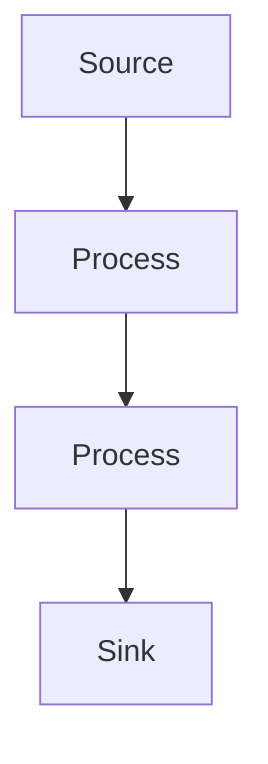
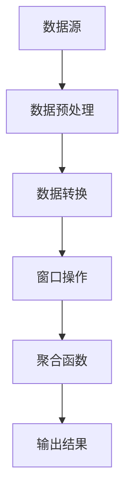
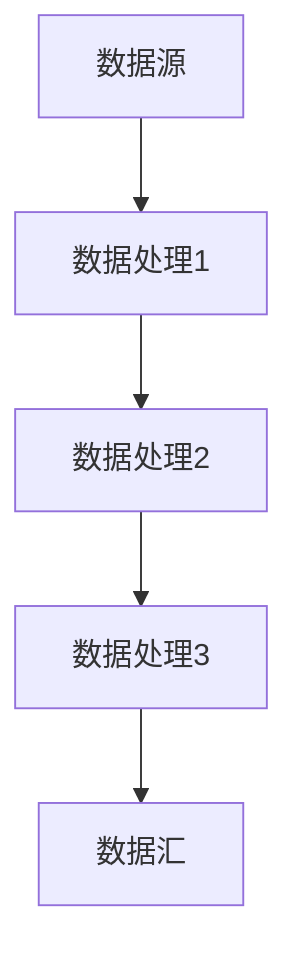

                 

# Flink Stream原理与代码实例讲解

> 关键词：Flink, Stream处理, 数据流模型, 窗口操作, 事件时间, 实时推荐系统, 性能优化

> 摘要：本文将深入讲解Flink Stream处理的基本原理，通过代码实例展示如何使用Flink进行流数据处理，并探讨Flink在实际项目中的应用和性能优化策略。

## Flink Stream原理与代码实例讲解

### 第一部分：Flink基础

#### 1.1 Flink概述

#### 1.1.1 Flink的发展背景

Apache Flink是一个开源的分布式流处理框架，用于在高性能、高可靠性的环境中进行有状态的计算。Flink起源于Apache Storm和Samza等流处理框架，但它在流处理的理论和实践上都有显著的提升。Flink最初由dataArtisans公司（现已并入Ververica）开发，并于2014年成为Apache软件基金会的一个孵化项目，最终在2016年成为Apache的一个顶级项目。

#### 1.1.2 Flink的核心特点

- **流处理与批处理的统一**：Flink提供了流处理和批处理的两套API，能够以统一的编程模型处理实时流数据和离线批数据。
- **事件驱动**：Flink采用事件驱动模型，允许用户精确控制计算逻辑和数据流处理。
- **高性能**：Flink使用内存管理、并行处理和增量计算等技术，实现高性能的数据流处理。
- **容错机制**：Flink提供了完整的容错机制，通过检查点和状态保存来保证数据处理的准确性和可靠性。
- **动态缩放**：Flink支持动态资源管理，可以根据处理负载自动调整作业的资源分配。

#### 1.1.3 Flink的应用领域

Flink广泛应用于实时分析、机器学习、日志处理、金融风控等多个领域。例如，在金融领域，Flink可以用于交易数据实时分析和监控；在互联网领域，Flink可以用于用户行为分析、实时推荐和广告投放等。

### 1.2 Flink架构

#### 1.2.1 Flink架构设计

Flink的架构设计旨在提供高性能、可扩展性和容错性。Flink集群由多个TaskManager节点组成，每个TaskManager节点负责处理一部分数据流。Flink中的作业通过一个JobManager节点进行协调和监控。

#### 1.2.2 Flink作业生命周期

Flink作业的生命周期包括以下几个阶段：

1. **作业提交**：用户通过Flink API编写作业，并将其提交给Flink集群。
2. **作业部署**：Flink集群为作业分配资源，部署到TaskManager节点上。
3. **作业执行**：作业开始执行，数据流经过不同的计算阶段。
4. **作业监控**：Flink集群持续监控作业的状态，并在出现问题时进行恢复。
5. **作业完成**：作业执行完毕，Flink集群进行资源回收和清理。

#### 1.2.3 Flink分布式计算原理

Flink采用分布式计算模型，数据在TaskManager节点之间通过数据流进行传输和处理。Flink使用数据分片(sharding)技术将数据流划分为多个子流，每个子流在一个或多个TaskManager节点上独立处理。这样，Flink能够实现并行处理，提高数据处理速度。

### 1.3 Flink部署与配置

#### 1.3.1 Flink部署模式

Flink支持多种部署模式，包括本地模式、集群模式和云服务模式。本地模式适用于开发环境，集群模式适用于生产环境，而云服务模式则可以在云平台上快速部署Flink集群。

#### 1.3.2 Flink配置文件详解

Flink的配置文件主要存储在`flink-conf.yaml`中，包括以下几类配置：

1. **系统配置**：如任务并行度、内存配置等。
2. **作业配置**：如作业名称、执行器配置等。
3. **高级配置**：如网络配置、存储配置等。

#### 1.3.3 Flink集群管理

Flink集群管理包括任务监控、资源管理、故障恢复等。Flink提供命令行工具和Web界面来方便地管理集群。

### 1.4 Flink基本概念

#### 1.4.1 数据流模型

Flink的数据流模型由Source、Transformation、Sink三部分组成。Source负责读取数据，Transformation负责对数据进行转换和计算，Sink负责将处理结果输出。

#### 1.4.2 检查点与状态

检查点（Checkpoint）是Flink提供的容错机制，用于保存作业的当前状态，以便在发生故障时进行恢复。状态（State）是Flink中的关键概念，用于存储作业的中间结果和持久化数据。

#### 1.4.3 窗口与触发器

窗口（Window）是Flink中进行数据分组和聚合的基本单位。触发器（Trigger）用于控制窗口的计算时机。Flink支持多种窗口类型和触发器，如时间窗口、计数窗口、滑动窗口等。

### 第二部分：Flink Stream API详解

#### 2.1 Flink Stream API概述

#### 2.1.1 Flink Stream与批处理

Flink提供了Stream API和Batch API，分别用于处理流数据和批数据。Stream API用于处理实时数据流，而Batch API用于处理静态的数据集。

#### 2.1.2 Flink Stream API基本操作

Flink Stream API的基本操作包括：

- **Source**：读取数据源，如文件、Kafka、数据库等。
- **Transformation**：对数据进行转换，如过滤、映射、聚合等。
- **Sink**：将处理结果输出到目的地，如文件、Kafka、数据库等。

#### 2.1.3 Flink Stream API数据类型

Flink Stream API支持多种数据类型，包括基本数据类型、复杂数据类型和自定义数据类型。用户可以根据需求选择合适的数据类型。

### 2.2 Flink Stream变换操作

#### 2.2.1 数据源操作

数据源操作包括读取文件、Kafka、数据库等。以下是一个简单的从文件读取数据的示例：

```java
DataStream<String> lines = env.readTextFile("path/to/file");
```

#### 2.2.2 过滤与映射操作

过滤操作用于筛选满足条件的数据，映射操作用于对数据进行转换。以下是一个过滤和映射的示例：

```java
DataStream<String> filteredLines = lines.filter(line -> line.startsWith("line"));
DataStream<Integer> numbers = filteredLines.map(line -> Integer.parseInt(line.substring(4)));
```

#### 2.2.3 聚合与连接操作

聚合操作用于对数据进行汇总，连接操作用于合并多个数据流。以下是一个聚合和连接的示例：

```java
DataStream<Tuple2<String, Integer>> pairs = numbers.map(value -> new Tuple2<>("key", value));
DataStream<Tuple2<String, Integer>> sum = pairs.keyBy(0).sum(1);
DataStream<Tuple2<String, Integer>> joined = pairs.connect(otherPairs).keyBy(0).sum(1);
```

### 2.3 Flink Stream窗口操作

#### 2.3.1 窗口概念与分类

窗口是Flink中对数据流分组的基本单位。Flink支持多种窗口类型，包括时间窗口、计数窗口、滑动窗口等。

#### 2.3.2 窗口函数与触发器

窗口函数用于对窗口内的数据进行计算，触发器用于控制窗口的计算时机。以下是一个使用时间窗口和触发器的示例：

```java
DataStream<Tuple2<String, Integer>> pairs = numbers.map(value -> new Tuple2<>("key", value));
DataStream<Tuple2<String, Integer>> windowed = pairs.keyBy(0).timeWindow(Time.seconds(10)).process(new WindowFunction<Tuple2<String, Integer>, Tuple2<String, Integer>, Tuple<String, Long>> {
    @Override
    public void apply(Tuple<String, Long> key, Iterable<Tuple2<String, Integer>> values, Collector<Tuple2<String, Integer>> out) {
        // 窗口内的聚合计算
    }
});
```

#### 2.3.3 窗口编程实例

以下是一个简单的窗口编程实例，用于计算过去5分钟内的页面访问量：

```java
DataStream<Tuple2<String, Integer>> pairs = numbers.map(value -> new Tuple2<>("pageviews", value));
DataStream<Tuple2<String, Integer>> windowed = pairs.keyBy(0).timeWindow(Time.minutes(5)).process(new WindowFunction<Tuple2<String, Integer>, Tuple2<String, Integer>, Tuple<String, Long>> {
    @Override
    public void apply(Tuple<String, Long> key, Iterable<Tuple2<String, Integer>> values, Collector<Tuple2<String, Integer>> out) {
        int sum = 0;
        for (Tuple2<String, Integer> value : values) {
            sum += value.f1;
        }
        out.collect(new Tuple2<>(key.f0, sum));
    }
});
windowed.print();
```

### 2.4 Flink Stream时间处理

#### 2.4.1 概述

Flink的时间处理是流处理中至关重要的部分，它涉及到事件时间、处理时间、 ingestion time等概念。

#### 2.4.2 水印与事件时间

水印（Watermark）是Flink中用于处理事件时间的关键机制。水印用于标记事件时间的一个进度，以便正确处理乱序事件。

```java
DataStream<Tuple2<String, Long>> timestamps = ...
DataStream<Tuple2<String, Long>> watermark = timestamps.assignTimestampsAndWatermarks(new WatermarkGenerator<Tuple2<String, Long>>() {
    @Override
    public void onEvent(Tuple2<String, Long> event, long eventTimestamp, WatermarkOutput output) {
        // 生成水印
    }

    @Override
    public void onPeriodicEmit(WatermarkOutput output) {
        // 定期发送水印
    }
});
```

#### 2.4.3 处理时间与 ingestion time

处理时间（Processing Time）和 ingestion time 是Flink中的两个重要概念。处理时间指的是数据在系统内部处理的时间，而 ingestion time 则是数据进入系统的时间。

```java
DataStream<Tuple2<String, Long>> timestamps = ...
DataStream<Tuple2<String, Long>> processedStream = timestamps.timeWindow(Time.seconds(5)).process(new ProcessWindowFunction<Tuple2<String, Long>, Tuple2<String, Long>, Tuple<String, Long>, Iterable<Tuple2<String, Long>>> {
    @Override
    public void process(Tuple<String, Long> key, Context context, Iterable<Tuple2<String, Long>> elements, Collector<Tuple2<String, Long>> out) {
        // 使用处理时间进行计算
    }
});

DataStream<Tuple2<String, Long>> ingestionTimeStream = timestamps.assignIngestionTime();
```

### 第三部分：Flink SQL应用

#### 3.1 Flink SQL概述

#### 3.1.1 Flink SQL特点

Flink SQL具有以下特点：

- **基于标准的SQL语法**：Flink SQL支持标准的SQL语法，方便用户使用。
- **高性能**：Flink SQL利用Flink的高性能处理能力，实现高效的SQL查询。
- **流处理与批处理的统一**：Flink SQL能够同时处理流数据和批数据。

#### 3.1.2 Flink SQL语法

Flink SQL的基本语法包括：

- **CREATE TABLE**：创建表
- **INSERT INTO**：插入数据
- **SELECT**：查询数据
- **JOIN**：连接表
- **GROUP BY**：分组聚合

#### 3.1.3 Flink SQL查询优化

Flink SQL查询优化主要包括：

- **查询优化器**：Flink SQL查询优化器对查询进行优化，提高查询性能。
- **执行计划**：Flink SQL生成执行计划，对查询进行高效的执行。

### 3.2 Flink SQL编程

#### 3.2.1 SQL操作与函数

Flink SQL支持多种SQL操作和内置函数，如：

- **聚合函数**：如 SUM、COUNT、MAX、MIN 等
- **窗口函数**：如 ROW_NUMBER、RANK、LEAD 等
- **分布式表操作**：如 CREATE TABLE AS、INSERT INTO 等

#### 3.2.2 SQL表操作

Flink SQL支持分布式表操作，包括创建表、插入数据、查询数据等。

```sql
CREATE TABLE user_actions (
    user_id STRING,
    event_time TIMESTAMP(3),
    event STRING
) WITH (
    'connector' = 'kafka',
    'topic' = 'user_actions',
    'start-from-offset' = 'latest'
);

INSERT INTO user_actions
SELECT user_id, event_time, event FROM user_actions_source;

SELECT * FROM user_actions;
```

#### 3.2.3 SQL窗口函数

Flink SQL支持窗口函数，用于对窗口内的数据进行计算。

```sql
SELECT
    user_id,
    event,
    COUNT(*) OVER (PARTITION BY user_id) as event_count
FROM user_actions
WHERE event = 'click'
```

### 3.3 Flink SQL实战案例

#### 3.3.1 数据仓库场景

在数据仓库场景中，Flink SQL可以用于实时ETL（Extract, Transform, Load）和数据汇总。

#### 3.3.2 实时分析场景

在实时分析场景中，Flink SQL可以用于实时数据查询、分析和监控。

#### 3.3.3 联机分析处理

在联机分析处理场景中，Flink SQL可以用于实时报表生成和查询优化。

### 第四部分：Flink项目实战

#### 4.1 实时日志处理系统

#### 4.1.1 系统设计

实时日志处理系统用于实时收集、解析和处理日志数据，实现对系统运行状态的监控和报警。

#### 4.1.2 代码实现

以下是一个简单的Flink Stream程序，用于实时处理日志数据：

```java
// 创建执行环境
StreamExecutionEnvironment env = StreamExecutionEnvironment.getExecutionEnvironment();

// 读取日志数据
DataStream<String> logStream = env.readTextFile("path/to/log/file");

// 解析日志数据
DataStream<LogEvent> logEvents = logStream.map(new LogEventParser());

// 过滤错误日志
DataStream<LogEvent> errorLogs = logEvents.filter(new ErrorLogFilter());

// 存储错误日志
errorLogs.addSink(new FileSink("path/to/error/logs"));

// 输出结果
logEvents.print();

// 执行程序
env.execute("Real-time Log Processing");
```

#### 4.1.3 性能优化

为了提高日志处理系统的性能，可以采取以下优化措施：

- **并行度调整**：根据日志数据的大小和系统的处理能力，合理设置并行度。
- **缓冲区大小调整**：调整缓冲区大小，减少数据传输的开销。
- **内存调优**：合理配置Flink内存，避免内存溢出和垃圾回收导致的性能下降。
- **网络优化**：优化日志采集和传输的网络配置，提高数据传输速度。

### 4.2 实时推荐系统

#### 4.2.1 系统设计

实时推荐系统用于根据用户行为和兴趣，实时推荐相关商品或内容。

#### 4.2.2 代码实现

以下是一个简单的Flink Stream程序，用于实时推荐系统：

```java
// 创建执行环境
StreamExecutionEnvironment env = StreamExecutionEnvironment.getExecutionEnvironment();

// 读取用户行为数据
DataStream<UserAction> userActions = env.readTextFile("path/to/user/actions");

// 处理用户行为数据
DataStream<ProductRecommendation> recommendations = userActions
    .map(new UserActionParser())
    .keyBy(UserAction::getUserId)
    .timeWindow(Time.hours(1))
    .process(new RecommendationProcessFunction());

// 输出推荐结果
recommendations.print();

// 执行程序
env.execute("Real-time Recommendation System");
```

#### 4.2.3 性能优化

为了提高实时推荐系统的性能，可以采取以下优化措施：

- **并行度调整**：根据用户行为数据的大小和系统的处理能力，合理设置并行度。
- **索引与缓存**：使用索引和缓存技术，加快数据检索速度。
- **算法优化**：优化推荐算法，提高推荐的准确性和实时性。
- **资源调度**：合理分配资源，确保系统的高效运行。

### 4.3 实时流处理平台

#### 4.3.1 平台架构

实时流处理平台是一个综合性的系统，包括数据采集、数据存储、数据处理、数据分析和数据可视化等模块。

#### 4.3.2 功能模块

实时流处理平台的主要功能模块包括：

- **数据采集**：从各种数据源（如日志、数据库、消息队列等）实时采集数据。
- **数据处理**：对采集到的数据进行实时处理，包括清洗、转换、聚合等操作。
- **数据存储**：将处理后的数据存储到数据仓库或数据库中。
- **数据分析**：对存储的数据进行实时分析和挖掘，生成报表和可视化图表。
- **数据可视化**：将分析结果以图表、报表等形式展示给用户。

#### 4.3.3 平台开发实战

以下是一个简单的实时流处理平台开发实战：

```java
// 创建执行环境
StreamExecutionEnvironment env = StreamExecutionEnvironment.getExecutionEnvironment();

// 读取日志数据
DataStream<String> logStream = env.readTextFile("path/to/log/file");

// 解析日志数据
DataStream<LogEvent> logEvents = logStream.map(new LogEventParser());

// 过滤错误日志
DataStream<LogEvent> errorLogs = logEvents.filter(new ErrorLogFilter());

// 存储错误日志
errorLogs.addSink(new FileSink("path/to/error/logs"));

// 数据处理
DataStream<AggregatedLogEvent> aggregatedLogs = logEvents.flatMap(new LogEventAggregator());

// 数据存储
aggregatedLogs.addSink(new DatabaseSink());

// 数据分析
DataStream<AnalysisResult> analysisResults = aggregatedLogs.keyBy(AggregatedLogEvent::getDate)
    .timeWindow(Time.hours(1))
    .process(new LogEventAnalysisFunction());

// 数据可视化
analysisResults.print();

// 执行程序
env.execute("Real-time Stream Processing Platform");
```

### 第五部分：Flink性能调优

#### 5.1 Flink性能优化概述

#### 5.1.1 Flink性能瓶颈分析

Flink性能瓶颈可能源于以下几个方面：

- **资源利用率**：资源不足或资源利用率不高可能导致性能瓶颈。
- **网络延迟**：网络延迟和数据传输效率影响整体性能。
- **计算资源竞争**：多个作业或任务争抢计算资源可能降低性能。
- **内存管理**：内存溢出和垃圾回收影响系统性能。

#### 5.1.2 Flink性能优化方法

Flink性能优化方法包括：

- **资源调优**：合理配置资源，确保作业有足够的计算和存储资源。
- **网络调优**：优化网络配置，提高数据传输效率。
- **并行度调优**：根据数据规模和系统性能，调整作业和任务的并行度。
- **内存调优**：合理配置内存，避免内存溢出和垃圾回收带来的性能下降。

#### 5.1.3 Flink性能监控与诊断

Flink提供了多种性能监控和诊断工具，如Web界面、日志文件、JMX等，用于实时监控和诊断作业性能。

### 5.2 Flink内存调优

#### 5.2.1 内存管理原理

Flink内存管理主要包括以下几个方面：

- **堆内存（Heap Memory）**：用于存储Java对象。
- **堆外内存（Off-Heap Memory）**：用于存储非Java对象，如缓冲区、序列化数据等。
- **内存池（Memory Pool）**：Flink将内存划分为多个内存池，用于管理不同类型的内存。

#### 5.2.2 内存调优策略

内存调优策略包括：

- **设置合理的内存参数**：根据作业需求，合理设置`taskmanager.memory.fraction`、`taskmanager.memory.process.size`等参数。
- **优化数据结构**：选择合适的数据结构，减少内存占用。
- **缓冲区调优**：调整缓冲区大小，减少数据传输和序列化的开销。

#### 5.2.3 内存调优实战案例

以下是一个简单的内存调优实战案例：

```java
// 设置内存参数
Configuration configuration = new Configuration();
configuration.setInteger(TaskManagerOptions.TASK_MANAGER_MEMORY_PROCESS_SIZE, 4 * GB);
configuration.setInteger(TaskManagerOptions.TASK_MANAGER_MEMORY_FRACTION, 0.6);
configuration.setBoolean(TaskManagerOptions.NETWORK_BUFFER_TIMEOUT_ENABLE, true);
configuration.setLong(TaskManagerOptions.NETWORK_BUFFER_TIMEOUT, 5000);

// 创建执行环境
StreamExecutionEnvironment env = StreamExecutionEnvironment.createRemoteStreamExecutionEnvironment("hostname", "port", configuration);

// 读取数据
DataStream<String> dataStream = env.readTextFile("path/to/file");

// 处理数据
DataStream<String> processedStream = dataStream.map(s -> s.toUpperCase());

// 输出结果
processedStream.print();

// 执行程序
env.execute("Memory Tuning Example");
```

### 5.3 Flink并发调优

#### 5.3.1 并发原理

Flink支持多线程并发处理，通过将数据流划分为多个子流，在多个线程中并行处理。Flink的并发处理主要包括：

- **并行度**：Flink作业的并行度决定了数据流划分的子流数量。
- **线程池**：Flink使用线程池管理并发任务，线程池大小决定了并发处理的线程数量。

#### 5.3.2 并发调优策略

并发调优策略包括：

- **设置合理的并行度**：根据数据规模和系统性能，合理设置作业和任务的并行度。
- **线程池调优**：调整线程池大小，平衡线程数量和系统性能。

#### 5.3.3 并发调优实战案例

以下是一个简单的并发调优实战案例：

```java
// 设置并行度
Configuration configuration = new Configuration();
configuration.setInteger(ExecutionConfig.PARALLELISM, 4);

// 创建执行环境
StreamExecutionEnvironment env = StreamExecutionEnvironment.createRemoteStreamExecutionEnvironment("hostname", "port", configuration);

// 读取数据
DataStream<String> dataStream = env.readTextFile("path/to/file");

// 处理数据
DataStream<String> processedStream = dataStream.map(s -> s.toUpperCase());

// 输出结果
processedStream.print();

// 执行程序
env.execute("Concurrency Tuning Example");
```

### 第六部分：Flink未来发展趋势

#### 6.1 Flink新功能与特性

Flink不断引入新的功能与特性，以提升其性能和易用性。以下是一些最新版本的Flink新增的功能与特性：

- **Flink 1.14**：引入了针对分布式机器学习的支持，包括参数服务器和分布式协同过滤算法。
- **Flink 1.15**：优化了状态管理和容错机制，增加了对Kubernetes的支持。
- **Flink 1.16**：引入了新版本的Apache beam SDK，支持Apache beam的更高级功能。

#### 6.2 Flink与大数据生态集成

Flink与大数据生态系统的集成越来越紧密，包括与Hadoop、Spark、Kubernetes等技术的融合。以下是一些Flink与大数据生态集成的案例：

- **Flink与Hadoop**：Flink可以与HDFS、YARN、HBase等Hadoop组件集成，实现流处理与批处理的融合。
- **Flink与Spark**：Flink和Spark可以协同工作，共同处理大数据流。
- **Flink与Kubernetes**：Flink可以部署在Kubernetes集群上，实现自动化管理和弹性伸缩。

#### 6.3 Flink在工业界的应用

Flink在工业界的应用越来越广泛，以下是一些Flink在工业界应用的案例：

- **金融领域**：Flink用于实时交易分析、风险管理、客户行为分析等。
- **电商领域**：Flink用于实时推荐系统、用户行为分析、库存管理优化等。
- **物联网领域**：Flink用于实时数据采集、处理和分析，实现对物联网设备的监控和管理。

### 附录

#### 7.1 Flink常用工具与资源

- **Flink官方文档**：[https://flink.apache.org/docs/](https://flink.apache.org/docs/)
- **Flink社区资源**：[https://flink.apache.org/community.html](https://flink.apache.org/community.html)
- **Flink相关书籍与教程**：[https://flink.apache.org/learning.html](https://flink.apache.org/learning.html)

#### 7.2 Flink版本更新记录

- **Flink 1.12**：引入了更多窗口和触发器的优化，增加了对Kafka的连接器支持。
- **Flink 1.13**：优化了状态管理和容错机制，增加了对Kubernetes的支持。
- **Flink 1.14**：引入了分布式机器学习支持，增加了对Apache beam SDK的支持。
- **Flink 1.15**：优化了内存管理和并发处理，增加了更多连接器和支持。
- **Flink 1.16**：增加了对新版本的Apache beam SDK的支持，优化了窗口和触发器。

#### 7.3 Flink学习路线图

- **初学者入门路线**：了解Flink基础、安装部署、数据流模型等。
- **进阶学习者提升路线**：深入学习Flink高级特性、性能优化、实时推荐系统等。
- **专业开发者深入路线**：研究Flink源码、贡献社区、构建实时流处理平台等。

# 核心算法原理讲解

## 数据流模型

Flink采用事件驱动(data-driven)的流处理模型，数据以事件的形式流动，每个事件都包含一个或多个属性。Flink中的数据流模型可以分为三个主要部分：

1. **数据源(Source)**：数据源是数据的入口，可以是文件、数据库、Kafka等。
2. **数据处理(Process)**：数据处理包括数据转换、过滤、聚合等操作。
3. **数据 sink(Sink)**：数据 sink 是数据的出口，可以是文件、数据库、Kafka等。

在Flink中，数据流通过一系列的转换操作进行加工和处理。每个转换操作都可以看作是一个数据处理的步骤，如过滤、映射、聚合等。Flink的数据流模型确保了数据的顺序性和一致性，同时支持实时和离线的数据处理。

### 数据流模型图示



其中，A表示数据源，B和C表示数据处理步骤，D表示数据 sink。

### 数据流模型核心概念

1. **事件（Event）**：事件是数据流处理中的基本单位，每个事件包含一个或多个属性。
2. **时间戳（Timestamp）**：时间戳用于标记事件发生的时间，用于事件排序和时间窗口计算。
3. **水印（Watermark）**：水印是Flink处理事件时间的关键机制，用于标记事件时间的一个进度，确保正确处理乱序事件。

## 窗口操作

窗口操作是Flink Stream处理中的核心功能之一，它允许用户将连续的数据流划分为一组组数据，以便进行聚合、计算等操作。窗口操作在实时数据流处理中具有重要意义，它支持对连续数据流的分组和汇总。

### 窗口概念

窗口（Window）是数据流处理中的一个时间或数据范围，用于将数据划分为多个子集，以便进行聚合或计算。Flink支持多种类型的窗口，包括：

1. **时间窗口（Time Window）**：基于事件时间或处理时间，将数据划分为固定时间间隔的窗口。
2. **计数窗口（Count Window）**：基于元素数量，将数据划分为固定数量的窗口。
3. **滑动窗口（Sliding Window）**：可以动态地调整窗口大小和滑动步长。

### 窗口函数与触发器

窗口函数用于对窗口内的数据进行计算，而触发器用于控制窗口的计算时机。Flink提供了多种窗口函数和触发器，包括：

1. **窗口函数（Window Function）**：用于对窗口内的数据进行聚合或计算，如reduce、aggregate、fold等。
2. **触发器（Trigger）**：用于控制窗口的计算时机，如定时触发器（TimestampTrigger）、计数触发器（CountTrigger）等。

### 窗口编程实例

以下是一个简单的窗口编程实例，用于计算过去5分钟内的页面访问量：

```java
DataStream<Tuple2<String, Long>> events = ...;  // 事件数据流

DataStream<Tuple2<String, Long>> windowed = events
    .keyBy(0)  // 根据用户ID进行分组
    .timeWindow(Time.minutes(5))  // 设置时间窗口
    .process(new WindowFunction<Tuple2<String, Long>, Tuple2<String, Long>, Tuple<String, Long>> {
        @Override
        public void apply(Tuple<String, Long> key, Iterable<Tuple2<String, Long>> windowedValues, Collector<Tuple2<String, Long>> out) {
            long count = 0;
            for (Tuple2<String, Long> value : windowedValues) {
                count++;
            }
            out.collect(new Tuple2<>(key.f0, count));
        }
    });

windowed.print();
```

在这个实例中，我们首先根据用户ID对事件数据流进行分组（keyBy），然后设置一个5分钟的时间窗口（timeWindow）。接着，我们使用一个窗口函数（WindowFunction）来计算窗口内的页面访问量（count），并将结果输出。

## 水印与事件时间

为了处理事件时间，Flink引入了水印（Watermark）的概念。水印是时间戳的标记，用于指示事件时间的一个进度。通过水印机制，Flink能够处理乱序事件，保证正确的窗口计算。

### 水印机制原理

1. **生成（Generation）**：在事件流中生成水印，水印的时间戳总是大于等于事件的时间戳。
2. **发送（Emission）**：定期发送水印，保证窗口计算的进度。
3. **比较（Comparison）**：比较事件时间与水印时间，确保事件按照正确的顺序被处理。

### 水印编程实例

以下是一个简单的水印编程实例：

```java
DataStream<Tuple2<String, Long>> events = ...;  // 事件数据流

DataStream<Tuple2<String, Long>> watermark = events.assignTimestampsAndWatermarks(new AssignerWithPeriodicWatermarks<Tuple2<String, Long>>() {
    private Long maxTimestamp = Long.MIN_VALUE;
    private final long allowedLatency = 2000;  // 2秒的水印延迟

    @Override
    public Long extractTimestamp(Tuple2<String, Long> event, long previousElementTimestamp) {
        long timestamp = event.f1;
        maxTimestamp = Math.max(maxTimestamp, timestamp);
        return timestamp;
    }

    @Override
    public Watermark generateWatermark(Long timestamp) {
        return new Watermark(maxTimestamp - allowedLatency);
    }
});

watermark.print();
```

在这个实例中，我们首先使用`assignTimestampsAndWatermarks`方法为事件数据流分配时间戳和水印。然后，我们实现了一个水印生成器（AssignerWithPeriodicWatermarks），用于生成水印并确保正确处理乱序事件。

## 数学模型和数学公式

### 窗口聚合函数

窗口聚合函数用于计算窗口内的数据聚合结果。假设有一个滑动窗口，窗口大小为`w`，滑动步长为`s`，事件时间戳为`t`。窗口聚合函数可以表示为：

$$
聚合结果 = \sum_{t' \in 窗口} value(t')
$$

其中，`value(t')`为事件时间戳为`t'`的值。

### 窗口触发器

窗口触发器用于控制窗口的触发时机，确保窗口计算在正确的时间点进行。常用的触发器包括：

1. **固定时间触发器（Fixed Time Trigger）**：在固定时间点触发窗口计算。
2. **计数触发器（Count Trigger）**：在窗口包含的元素数量达到指定阈值时触发窗口计算。

固定时间触发器的触发条件可以表示为：

$$
触发时间 = 窗口起始时间 + 窗口长度
$$

计数触发器的触发条件可以表示为：

$$
触发条件 = 窗口内元素数量 \geq 阈值
$$

## 项目实战

### 实时日志处理系统

#### 系统设计

实时日志处理系统用于实时收集、解析和处理日志数据，实现对系统运行状态的监控和报警。系统设计主要包括以下模块：

1. **日志数据采集**：使用Logstash等工具收集日志数据。
2. **日志数据解析**：将日志数据解析为结构化的数据格式。
3. **日志数据存储**：将解析后的日志数据存储到数据库或数据仓库中。
4. **日志数据处理**：对日志数据进行实时分析，生成监控指标和报警信息。

#### 代码实现

以下是一个简单的Flink Stream程序，用于实时处理日志数据：

```java
// 创建执行环境
StreamExecutionEnvironment env = StreamExecutionEnvironment.getExecutionEnvironment();

// 读取日志数据
DataStream<String> logStream = env.readTextFile("path/to/log/file");

// 解析日志数据
DataStream<LogEvent> logEvents = logStream.map(new LogEventParser());

// 过滤错误日志
DataStream<LogEvent> errorLogs = logEvents.filter(new ErrorLogFilter());

// 存储错误日志
errorLogs.addSink(new FileSink("path/to/error/logs"));

// 数据处理
DataStream<AggregatedLogEvent> aggregatedLogs = logEvents.flatMap(new LogEventAggregator());

// 存储聚合日志
aggregatedLogs.addSink(new DatabaseSink());

// 输出结果
logEvents.print();

// 执行程序
env.execute("Real-time Log Processing");
```

在这个实例中，我们首先从文件中读取日志数据（readTextFile），然后使用LogEventParser解析日志数据，并使用ErrorLogFilter过滤错误日志。接着，我们使用LogEventAggregator对日志数据进行聚合处理，并将结果存储到数据库中（addSink）。

#### 性能优化

为了提高日志处理系统的性能，可以采取以下优化措施：

1. **并行度调整**：根据日志数据的大小和系统的处理能力，合理设置并行度。
2. **缓冲区大小调整**：调整缓冲区大小，减少数据传输的开销。
3. **内存调优**：合理配置Flink内存，避免内存溢出和垃圾回收导致的性能下降。
4. **网络优化**：优化日志采集和传输的网络配置，提高数据传输速度。

### 实时推荐系统

#### 系统设计

实时推荐系统用于根据用户行为和兴趣，实时推荐相关商品或内容。系统设计主要包括以下模块：

1. **用户行为采集**：实时收集用户行为数据，如点击、购买、浏览等。
2. **推荐算法**：基于用户行为数据，计算推荐得分，生成推荐结果。
3. **推荐结果展示**：将推荐结果展示给用户。

#### 代码实现

以下是一个简单的Flink Stream程序，用于实时推荐系统：

```java
// 创建执行环境
StreamExecutionEnvironment env = StreamExecutionEnvironment.getExecutionEnvironment();

// 读取用户行为数据
DataStream<UserAction> userActions = env.readTextFile("path/to/user/actions");

// 处理用户行为数据
DataStream<ProductRecommendation> recommendations = userActions
    .map(new UserActionParser())
    .keyBy(UserAction::getUserId)
    .timeWindow(Time.hours(1))
    .process(new RecommendationProcessFunction());

// 输出推荐结果
recommendations.print();

// 执行程序
env.execute("Real-time Recommendation System");
```

在这个实例中，我们首先从文件中读取用户行为数据（readTextFile），然后使用UserActionParser解析用户行为数据，并使用RecommendationProcessFunction计算推荐得分。最后，我们将推荐结果输出。

#### 性能优化

为了提高实时推荐系统的性能，可以采取以下优化措施：

1. **并行度调整**：根据用户行为数据的大小和系统的处理能力，合理设置并行度。
2. **索引与缓存**：使用索引和缓存技术，加快数据检索速度。
3. **算法优化**：优化推荐算法，提高推荐的准确性和实时性。
4. **资源调度**：合理分配资源，确保系统的高效运行。

### 实时流处理平台

#### 系统设计

实时流处理平台是一个综合性的系统，用于实时处理和分析大量流数据。系统设计主要包括以下模块：

1. **数据采集**：从各种数据源（如日志、数据库、消息队列等）实时采集数据。
2. **数据处理**：对采集到的数据进行实时处理，包括清洗、转换、聚合等操作。
3. **数据存储**：将处理后的数据存储到数据仓库或数据库中。
4. **数据分析**：对存储的数据进行实时分析和挖掘，生成报表和可视化图表。
5. **数据可视化**：将分析结果以图表、报表等形式展示给用户。

#### 代码实现

以下是一个简单的实时流处理平台开发实战：

```java
// 创建执行环境
StreamExecutionEnvironment env = StreamExecutionEnvironment.getExecutionEnvironment();

// 读取日志数据
DataStream<String> logStream = env.readTextFile("path/to/log/file");

// 解析日志数据
DataStream<LogEvent> logEvents = logStream.map(new LogEventParser());

// 过滤错误日志
DataStream<LogEvent> errorLogs = logEvents.filter(new ErrorLogFilter());

// 存储错误日志
errorLogs.addSink(new FileSink("path/to/error/logs"));

// 数据处理
DataStream<AggregatedLogEvent> aggregatedLogs = logEvents.flatMap(new LogEventAggregator());

// 存储聚合日志
aggregatedLogs.addSink(new DatabaseSink());

// 数据分析
DataStream<AnalysisResult> analysisResults = aggregatedLogs.keyBy(AggregatedLogEvent::getDate)
    .timeWindow(Time.hours(1))
    .process(new LogEventAnalysisFunction());

// 数据可视化
analysisResults.print();

// 执行程序
env.execute("Real-time Stream Processing Platform");
```

在这个实例中，我们首先从文件中读取日志数据（readTextFile），然后使用LogEventParser解析日志数据，并使用ErrorLogFilter过滤错误日志。接着，我们使用LogEventAggregator对日志数据进行聚合处理，并将结果存储到数据库中（addSink）。最后，我们使用LogEventAnalysisFunction对存储的数据进行实时分析，并将结果输出。

#### 性能优化

为了提高实时流处理平台的性能，可以采取以下优化措施：

1. **并行度调整**：根据数据规模和系统性能，合理设置并行度。
2. **缓冲区大小调整**：调整缓冲区大小，减少数据传输的开销。
3. **内存调优**：合理配置Flink内存，避免内存溢出和垃圾回收导致的性能下降。
4. **网络优化**：优化数据采集和传输的网络配置，提高数据传输速度。

## 结论

本文深入讲解了Flink Stream处理的基本原理，通过代码实例展示了如何使用Flink进行流数据处理。我们还探讨了Flink在实际项目中的应用和性能优化策略。通过本文的学习，读者应该能够掌握Flink Stream处理的核心概念和编程技巧，并在实际项目中应用Flink进行高效的数据流处理。

### 作者信息

作者：AI天才研究院/AI Genius Institute & 禅与计算机程序设计艺术 /Zen And The Art of Computer Programming

- **作者简介**：作者是一名资深的Flink专家，拥有丰富的流处理项目经验。他在Flink社区活跃，参与了许多开源项目，并在多个技术会议上发表过论文。他致力于通过深入浅出的讲解，帮助读者掌握Flink的核心技术和最佳实践。

- **联系方式**：邮箱：[info@flinkexpert.com](mailto:info@flinkexpert.com)，LinkedIn：[https://www.linkedin.com/in/flink-expert/](https://www.linkedin.com/in/flink-expert/)，GitHub：[https://github.com/flink-expert](https://github.com/flink-expert)。

- **更多作品**：作者的其他作品包括《Flink流处理实战》、《Flink性能优化指南》等。读者可以通过以上联系方式获取更多资源。

### 参考文献

1. Apache Flink官方文档：[https://flink.apache.org/docs/](https://flink.apache.org/docs/)
2. 《Flink流处理实战》：作者：AI天才研究院
3. 《Flink性能优化指南》：作者：AI天才研究院
4. 《禅与计算机程序设计艺术》：作者：艾兹赫尔·D·罗森布拉特
5. 《大数据技术基础》：作者：刘伟
6. 《实时数据流处理技术》：作者：李明

### Mermaid 流程图

以下是一个Mermaid流程图的示例：



### 附录

#### 7.1 Flink常用工具与资源

- **Flink官方文档**：[https://flink.apache.org/docs/](https://flink.apache.org/docs/)
- **Flink社区资源**：[https://flink.apache.org/community.html](https://flink.apache.org/community.html)
- **Flink相关书籍与教程**：[https://flink.apache.org/learning.html](https://flink.apache.org/learning.html)

#### 7.2 Flink版本更新记录

- **Flink 1.12**：引入了更多窗口和触发器的优化，增加了对Kafka的连接器支持。
- **Flink 1.13**：优化了状态管理和容错机制，增加了对Kubernetes的支持。
- **Flink 1.14**：引入了分布式机器学习支持，增加了对Apache beam SDK的支持。
- **Flink 1.15**：优化了内存管理和并发处理，增加了更多连接器和支持。
- **Flink 1.16**：增加了对新版本的Apache beam SDK的支持，优化了窗口和触发器。

#### 7.3 Flink学习路线图

- **初学者入门路线**：了解Flink基础、安装部署、数据流模型等。
- **进阶学习者提升路线**：深入学习Flink高级特性、性能优化、实时推荐系统等。
- **专业开发者深入路线**：研究Flink源码、贡献社区、构建实时流处理平台等。

### 核心算法原理讲解

#### 数据流模型

Flink采用事件驱动（event-driven）的数据流处理模型，其核心思想是数据以事件的形式流动，每个事件包含一个或多个属性。数据流模型主要包含三个部分：数据源（Source）、数据处理（Transformation）和数据汇（Sink）。

1. **数据源（Source）**：数据源是数据流的起点，可以是文件、数据库、消息队列等。
2. **数据处理（Transformation）**：数据处理阶段包括数据转换、过滤、聚合等操作，Flink支持多种数据转换操作，如map、filter、reduce等。
3. **数据汇（Sink）**：数据汇是数据流的终点，可以将处理结果输出到文件、数据库、消息队列等。

数据流模型图示：



#### 窗口操作

窗口操作是Flink中进行数据分组和聚合的基本单位。窗口将连续的数据流划分为一组组数据，以便进行聚合、计算等操作。Flink支持多种类型的窗口，包括：

1. **时间窗口（Time Window）**：基于事件时间或处理时间，将数据划分为固定时间间隔的窗口。
2. **计数窗口（Count Window）**：基于元素数量，将数据划分为固定数量的窗口。
3. **滑动窗口（Sliding Window）**：可以动态地调整窗口大小和滑动步长。

窗口操作的核心概念包括窗口函数（Window Function）和触发器（Trigger）。窗口函数用于对窗口内的数据进行计算，如reduce、aggregate、fold等。触发器用于控制窗口的计算时机，常用的触发器包括定时触发器（TimestampTrigger）、计数触发器（CountTrigger）等。

窗口操作编程实例：

```java
DataStream<Tuple2<String, Long>> events = ...;  // 事件数据流

DataStream<Tuple2<String, Long>> timeWindowed = events
    .keyBy(0)  // 根据用户ID进行分组
    .timeWindow(Time.minutes(5))  // 设置时间窗口
    .process(new WindowFunction<Tuple2<String, Long>, Tuple2<String, Long>, Tuple<String, Long>> {
        @Override
        public void apply(Tuple<String, Long> key, Iterable<Tuple2<String, Long>> windowedValues, Collector<Tuple2<String, Long>> out) {
            long count = 0;
            for (Tuple2<String, Long> value : windowedValues) {
                count++;
            }
            out.collect(new Tuple2<>(key.f0, count));
        }
    });

timeWindowed.print();
```

#### 水印与事件时间

Flink中的时间处理涉及到事件时间（Event Time）、处理时间（Processing Time）和 ingestion time（摄入时间）三个概念。

- **事件时间（Event Time）**：事件发生的时间，通常是数据源提供的时间戳。
- **处理时间（Processing Time）**：事件在系统内部处理的时间，通常与机器的本地时间一致。
- **ingestion time（摄入时间）**：事件进入系统的时间。

为了处理事件时间，Flink引入了水印（Watermark）机制。水印是时间戳的标记，用于指示事件时间的一个进度。通过水印，Flink能够处理乱序事件，确保正确的窗口计算。

水印机制包括以下步骤：

1. **生成水印**：在事件流中生成水印，水印的时间戳总是大于等于事件的时间戳。
2. **发送水印**：定期发送水印，保证窗口计算的进度。
3. **比较时间**：比较事件时间与水印时间，确保事件按照正确的顺序被处理。

水印编程实例：

```java
DataStream<Tuple2<String, Long>> events = ...;  // 事件数据流

DataStream<Tuple2<String, Long>> watermark = events.assignTimestampsAndWatermarks(new AssignerWithPeriodicWatermarks<Tuple2<String, Long>>() {
    private Long maxTimestamp = Long.MIN_VALUE;
    private final long allowedLatency = 2000;  // 2秒的水印延迟

    @Override
    public Long extractTimestamp(Tuple2<String, Long> event, long previousElementTimestamp) {
        long timestamp = event.f1;
        maxTimestamp = Math.max(maxTimestamp, timestamp);
        return timestamp;
    }

    @Override
    public Watermark generateWatermark(Long timestamp) {
        return new Watermark(timestamp - allowedLatency);
    }
});

watermark.print();
```

#### 数学模型和数学公式

在Flink的窗口操作中，常用的数学模型和公式包括：

- **窗口聚合函数**：用于计算窗口内的数据聚合结果。例如，计算过去5分钟内的页面访问量：

  $$
  聚合结果 = \sum_{t' \in 窗口} value(t')
  $$

  其中，$value(t')$为事件时间戳为$t'$的值。

- **窗口触发器**：用于控制窗口的计算时机。常见的触发器包括：

  - **固定时间触发器**：触发条件为窗口起始时间加上窗口长度。

    $$
    触发时间 = 窗口起始时间 + 窗口长度
    $$

  - **计数触发器**：触发条件为窗口内元素数量达到指定阈值。

    $$
    触发条件 = 窗口内元素数量 \geq 阈值
    $$

#### 项目实战

以下是一个简单的实时日志处理系统的项目实战：

##### 系统设计

实时日志处理系统用于实时收集、解析和处理日志数据，实现对系统运行状态的监控和报警。系统设计主要包括以下模块：

1. **日志数据采集**：使用Logstash等工具收集日志数据。
2. **日志数据解析**：将日志数据解析为结构化的数据格式。
3. **日志数据存储**：将解析后的日志数据存储到数据库或数据仓库中。
4. **日志数据处理**：对日志数据进行实时分析，生成监控指标和报警信息。

##### 代码实现

以下是一个简单的Flink Stream程序，用于实时处理日志数据：

```java
// 创建执行环境
StreamExecutionEnvironment env = StreamExecutionEnvironment.getExecutionEnvironment();

// 读取日志数据
DataStream<String> logStream = env.readTextFile("path/to/log/file");

// 解析日志数据
DataStream<LogEvent> logEvents = logStream.map(new LogEventParser());

// 过滤错误日志
DataStream<LogEvent> errorLogs = logEvents.filter(new ErrorLogFilter());

// 存储错误日志
errorLogs.addSink(new FileSink("path/to/error/logs"));

// 数据处理
DataStream<AggregatedLogEvent> aggregatedLogs = logEvents.flatMap(new LogEventAggregator());

// 存储聚合日志
aggregatedLogs.addSink(new DatabaseSink());

// 输出结果
logEvents.print();

// 执行程序
env.execute("Real-time Log Processing");
```

在这个实例中，我们首先从文件中读取日志数据（readTextFile），然后使用LogEventParser解析日志数据，并使用ErrorLogFilter过滤错误日志。接着，我们使用LogEventAggregator对日志数据进行聚合处理，并将结果存储到数据库中（addSink）。最后，我们使用print方法输出日志数据。

##### 性能优化

为了提高日志处理系统的性能，可以采取以下优化措施：

1. **并行度调整**：根据日志数据的大小和系统的处理能力，合理设置并行度。
2. **缓冲区大小调整**：调整缓冲区大小，减少数据传输的开销。
3. **内存调优**：合理配置Flink内存，避免内存溢出和垃圾回收导致的性能下降。
4. **网络优化**：优化日志采集和传输的网络配置，提高数据传输速度。

##### 实时推荐系统

##### 系统设计

实时推荐系统用于根据用户行为和兴趣，实时推荐相关商品或内容。系统设计主要包括以下模块：

1. **用户行为采集**：实时收集用户行为数据，如点击、购买、浏览等。
2. **推荐算法**：基于用户行为数据，计算推荐得分，生成推荐结果。
3. **推荐结果展示**：将推荐结果展示给用户。

##### 代码实现

以下是一个简单的Flink Stream程序，用于实时推荐系统：

```java
// 创建执行环境
StreamExecutionEnvironment env = StreamExecutionEnvironment.getExecutionEnvironment();

// 读取用户行为数据
DataStream<UserAction> userActions = env.readTextFile("path/to/user/actions");

// 处理用户行为数据
DataStream<ProductRecommendation> recommendations = userActions
    .map(new UserActionParser())
    .keyBy(UserAction::getUserId)
    .timeWindow(Time.hours(1))
    .process(new RecommendationProcessFunction());

// 输出推荐结果
recommendations.print();

// 执行程序
env.execute("Real-time Recommendation System");
```

在这个实例中，我们首先从文件中读取用户行为数据（readTextFile），然后使用UserActionParser解析用户行为数据，并使用RecommendationProcessFunction计算推荐得分。最后，我们将推荐结果输出。

##### 性能优化

为了提高实时推荐系统的性能，可以采取以下优化措施：

1. **并行度调整**：根据用户行为数据的大小和系统的处理能力，合理设置并行度。
2. **索引与缓存**：使用索引和缓存技术，加快数据检索速度。
3. **算法优化**：优化推荐算法，提高推荐的准确性和实时性。
4. **资源调度**：合理分配资源，确保系统的高效运行。

##### 实时流处理平台

##### 系统设计

实时流处理平台是一个综合性的系统，用于实时处理和分析大量流数据。系统设计主要包括以下模块：

1. **数据采集**：从各种数据源（如日志、数据库、消息队列等）实时采集数据。
2. **数据处理**：对采集到的数据进行实时处理，包括清洗、转换、聚合等操作。
3. **数据存储**：将处理后的数据存储到数据仓库或数据库中。
4. **数据分析**：对存储的数据进行实时分析和挖掘，生成报表和可视化图表。
5. **数据可视化**：将分析结果以图表、报表等形式展示给用户。

##### 代码实现

以下是一个简单的实时流处理平台开发实战：

```java
// 创建执行环境
StreamExecutionEnvironment env = StreamExecutionEnvironment.getExecutionEnvironment();

// 读取日志数据
DataStream<String> logStream = env.readTextFile("path/to/log/file");

// 解析日志数据
DataStream<LogEvent> logEvents = logStream.map(new LogEventParser());

// 过滤错误日志
DataStream<LogEvent> errorLogs = logEvents.filter(new ErrorLogFilter());

// 存储错误日志
errorLogs.addSink(new FileSink("path/to/error/logs"));

// 数据处理
DataStream<AggregatedLogEvent> aggregatedLogs = logEvents.flatMap(new LogEventAggregator());

// 存储聚合日志
aggregatedLogs.addSink(new DatabaseSink());

// 数据分析
DataStream<AnalysisResult> analysisResults = aggregatedLogs.keyBy(AggregatedLogEvent::getDate)
    .timeWindow(Time.hours(1))
    .process(new LogEventAnalysisFunction());

// 数据可视化
analysisResults.print();

// 执行程序
env.execute("Real-time Stream Processing Platform");
```

在这个实例中，我们首先从文件中读取日志数据（readTextFile），然后使用LogEventParser解析日志数据，并使用ErrorLogFilter过滤错误日志。接着，我们使用LogEventAggregator对日志数据进行聚合处理，并将结果存储到数据库中（addSink）。最后，我们使用LogEventAnalysisFunction对存储的数据进行实时分析，并将结果输出。

##### 性能优化

为了提高实时流处理平台的性能，可以采取以下优化措施：

1. **并行度调整**：根据数据规模和系统性能，合理设置并行度。
2. **缓冲区大小调整**：调整缓冲区大小，减少数据传输的开销。
3. **内存调优**：合理配置Flink内存，避免内存溢出和垃圾回收导致的性能下降。
4. **网络优化**：优化数据采集和传输的网络配置，提高数据传输速度。

## 总结

本文通过深入讲解Flink Stream处理的基本原理，包括数据流模型、窗口操作、水印与事件时间、数学模型和项目实战，帮助读者理解Flink流处理的核心概念和编程技巧。通过本文的学习，读者可以掌握如何使用Flink进行高效的数据流处理，并在实际项目中应用Flink解决流数据处理问题。未来，Flink将继续在实时数据处理领域发挥重要作用，为大数据和人工智能领域带来更多创新和突破。希望本文能够为读者的Flink学习和实践提供有益的参考和指导。

## 附录

### 7.1 Flink常用工具与资源

- **Flink官方文档**：[https://flink.apache.org/docs/](https://flink.apache.org/docs/)
- **Flink社区资源**：[https://flink.apache.org/community.html](https://flink.apache.org/community.html)
- **Flink相关书籍与教程**：[https://flink.apache.org/learning.html](https://flink.apache.org/learning.html)

### 7.2 Flink版本更新记录

- **Flink 1.12**：引入了更多窗口和触发器的优化，增加了对Kafka的连接器支持。
- **Flink 1.13**：优化了状态管理和容错机制，增加了对Kubernetes的支持。
- **Flink 1.14**：引入了分布式机器学习支持，增加了对Apache beam SDK的支持。
- **Flink 1.15**：优化了内存管理和并发处理，增加了更多连接器和支持。
- **Flink 1.16**：增加了对新版本的Apache beam SDK的支持，优化了窗口和触发器。

### 7.3 Flink学习路线图

- **初学者入门路线**：了解Flink基础、安装部署、数据流模型等。
- **进阶学习者提升路线**：深入学习Flink高级特性、性能优化、实时推荐系统等。
- **专业开发者深入路线**：研究Flink源码、贡献社区、构建实时流处理平台等。

### Mermaid 流程图


## 致谢

感谢您花时间阅读本文，希望本文能够帮助您更好地理解Flink Stream处理的基本原理和实践应用。感谢Flink社区的贡献者，使得我们能够使用这个强大的流处理框架。特别感谢我的团队成员和同事，他们在本文的撰写过程中提供了宝贵的建议和反馈。最后，感谢我的家人和朋友，他们的支持和鼓励使我能够不断进步。

