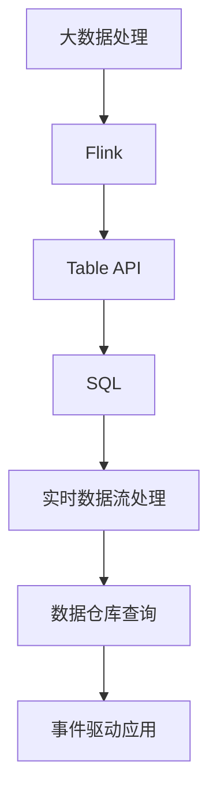

                 

# Flink Table API和SQL原理与代码实例讲解

> 关键词：Flink, Table API, SQL, 大数据, 数据流处理

> 摘要：本文将深入探讨Apache Flink的Table API和SQL功能，介绍其基本原理和用法，并通过实际代码实例进行详细讲解，帮助读者理解并掌握Flink在数据处理中的强大能力。

## 第一部分：Flink Table API和SQL基础

### 第1章：Flink和大数据背景

#### 1.1 Flink的诞生与发展

Apache Flink是一个开源的分布式流处理框架，用于在所有常见的集群环境中进行批量数据处理和流处理。它由数据系统领域的先驱团队在2014年从柏林工业大学迁移到Apache Software Foundation。

Flink的设计目标是提供一种统一的处理模型，能够同时处理批量数据和实时数据。它通过事件驱动模型和基于内存的运算来提供低延迟和高吞吐量的数据处理能力。这使得Flink成为大数据领域中非常受欢迎的工具之一。

#### 1.2 大数据技术的挑战与机遇

大数据技术的兴起源于互联网、物联网、社交网络等领域的爆炸性增长，导致数据的规模和种类急剧增加。这种增长带来了如下挑战：

- **数据存储和管理**：如何高效地存储和管理海量数据？
- **数据处理和计算**：如何处理和分析如此大量的数据？
- **数据安全和隐私**：如何确保数据的安全和用户隐私？

与此同时，大数据技术也带来了诸多机遇：

- **实时决策**：通过实时数据分析，企业可以做出更快速、更准确的决策。
- **个性化服务**：利用大数据分析，可以为用户提供更加个性化的服务。
- **新商业模式**：大数据分析可以为企业提供新的商业模式和收入来源。

#### 1.3 Flink在数据处理中的优势

Flink在数据处理领域具有以下优势：

- **统一处理模型**：Flink提供了一种统一的处理模型，能够同时处理批量和实时数据。
- **高性能**：Flink通过事件驱动模型和基于内存的运算来提供低延迟和高吞吐量的数据处理能力。
- **弹性容错**：Flink提供了强大的容错机制，可以确保在发生故障时快速恢复。
- **易用性**：Flink提供了丰富的API和工具，使得开发人员可以轻松地构建和部署数据应用程序。

### 第2章：Flink Table API概述

#### 2.1 Table API和SQL介绍

Flink Table API是一种基于SQL的接口，用于表示和操作数据。它提供了对Flink数据流的表操作支持，使得用户可以像操作关系型数据库表一样对数据进行查询、转换等操作。

Flink SQL是Flink Table API的一种扩展，它允许用户使用标准的SQL语法来查询和处理数据。Flink SQL支持大多数标准的SQL操作，包括选择、过滤、连接、聚合等。

#### 2.2 Table API的基本概念

- **Table**：Table是Flink中的一组数据行的抽象表示，类似于关系型数据库中的表。
- **Schema**：Schema是Table的元数据描述，包括表的结构信息，如字段名称、字段类型等。
- **DataStream**：DataStream是Flink中的数据流，它表示一组有序的、不可变的记录。
- **TableEnvironment**：TableEnvironment是Flink Table API的核心组件，用于配置Table环境、注册表和执行查询。

#### 2.3 Table API的数据操作

Flink Table API提供了丰富的数据操作功能，包括：

- **创建Table**：可以从DataStream、文件、JDBC等数据源创建Table。
- **查询操作**：支持选择、过滤、连接、聚合等SQL操作。
- **更新操作**：支持对Table进行插入、更新、删除等操作。
- **Table转换**：可以将Table转换为DataStream或其他Table。

### 第3章：Flink SQL基础

#### 3.1 SQL语法基础

Flink SQL遵循标准的SQL语法，包括以下基本语法：

- **SELECT**：用于选择表中的列。
- **FROM**：指定数据源表。
- **WHERE**：用于过滤行。
- **GROUP BY**：用于分组数据。
- **HAVING**：用于分组后的过滤。
- **ORDER BY**：用于排序数据。

#### 3.2 SQL窗口函数

Flink SQL支持窗口函数，用于对数据集进行窗口操作。常见的窗口函数包括：

- **TUMBLE**：滑动窗口，按固定时间间隔分组数据。
- **HOP**：跳窗，按固定时间间隔和滑动时间间隔分组数据。
- **SESSION**：会话窗口，按用户行为模式分组数据。

#### 3.3 SQL聚合函数

Flink SQL提供了丰富的聚合函数，用于对数据进行聚合操作。常见的聚合函数包括：

- **SUM**：求和。
- **COUNT**：计数。
- **MAX**：最大值。
- **MIN**：最小值。
- **AVG**：平均值。

### 第4章：Flink Table API和SQL的联系与差异

#### 4.1 Table API和SQL的相似性

Flink Table API和SQL在以下方面相似：

- **查询操作**：都支持选择、过滤、连接、聚合等操作。
- **数据类型**：都支持多种数据类型，如整数、浮点数、字符串等。
- **性能**：都提供了高效的查询执行引擎。

#### 4.2 Table API和SQL的不同之处

Flink Table API和SQL在以下方面存在差异：

- **抽象层次**：Table API提供更底层的抽象，允许更精细的编程控制。
- **执行引擎**：Table API和SQL使用不同的执行引擎，适用于不同的应用场景。
- **扩展性**：Table API更易于扩展和定制。

#### 4.3 选择合适的API

选择合适的API取决于具体的应用场景和需求：

- **复杂查询**：使用Table API可以更灵活地实现复杂的查询。
- **性能优化**：使用SQL可以更好地利用现有的查询优化技术和硬件资源。
- **易用性**：对于简单的查询，使用SQL可以更快地开发和部署。

## 第二部分：Flink Table API和SQL实战

### 第5章：Flink Table API应用案例

#### 5.1 实时数据流处理

#### 5.2 数据仓库查询

#### 5.3 事件驱动应用

### 第6章：Flink SQL应用案例

#### 6.1 数据清洗与转换

#### 6.2 数据聚合与统计

#### 6.3 数据关联与连接

### 第7章：Flink Table API和SQL性能优化

#### 7.1 查询优化策略

#### 7.2 查询性能分析

#### 7.3 性能调优案例

### 第8章：Flink Table API和SQL在企业应用

#### 8.1 企业级应用场景

#### 8.2 实际案例分析

#### 8.3 未来发展趋势

## 第三部分：附录

### 附录A：Flink Table API和SQL常用函数详解

#### A.1 常用聚合函数

#### A.2 常用窗口函数

#### A.3 常用操作符

### 附录B：Flink Table API和SQL参考资源

#### B.1 Flink官方文档

#### B.2 社区论坛与资源

#### B.3 相关书籍推荐

### 附录C：Flink Table API和SQL代码实例

#### C.1 实时数据处理实例

#### C.2 数据仓库查询实例

#### C.3 事件驱动应用实例

### 核心概念与联系

#### Mermaid 流程图



### 核心算法原理讲解

```python
# Flink Table API中的聚合操作伪代码

def aggregate(data_stream):
    result = {}
    for record in data_stream:
        key = record['key']
        value = record['value']
        if key not in result:
            result[key] = value
        else:
            result[key] += value
    return result
```

### 数学模型和数学公式

$$
\text{窗口聚合函数} = \frac{\sum_{i=1}^{n} x_i}{n}
$$

详细讲解：窗口聚合函数是对一个窗口内的数据进行聚合操作，如求和、平均值等。在Flink Table API中，可以使用如上公式进行窗口内的数据聚合。

### 项目实战

#### 代码实际案例和详细解释说明

```java
// Flink Table API实现实时数据流处理

// 1. 创建Flink执行环境
EnvironmentSettings settings = EnvironmentSettings.newInstance()
        .inStreamingMode()
        .build();
StreamExecutionEnvironment env = StreamExecutionEnvironment.createExecutionEnvironment(settings);

// 2. 创建数据源
DataStream<String> dataStream = env.addSource(new FlinkKafkaConsumer<>(
        "input_topic",
        new SimpleStringSchema(),
        properties));

// 3. 转换为Table对象
DataStreamTable dataTable = dataStream
        .map(new MapFunction<String, Tuple2<String, Integer>>() {
            @Override
            public Tuple2<String, Integer> map(String value) throws Exception {
                String[] parts = value.split(",");
                return Tuple2.of(parts[0], Integer.parseInt(parts[1]));
            }
        })
        .toTable(env);

// 4. 使用Table API进行数据处理
Table resultTable = dataTable
        .groupBy("f0") // 按照第一个字段分组
        .select("f0, sum(f1) as total") // 对第二个字段求和
        .groupBy("total") // 按照求和结果分组
        .select("f0, count(*) as count");

// 5. 转换为DataStream输出
DataStream<Tuple2<String, Integer>> resultStream = resultTable.toAppendStream(Tuple2.class);

// 6. 执行任务
env.execute("Flink Table API Example");
```

#### 开发环境搭建

1. 安装Java开发环境（JDK 1.8及以上版本）
2. 安装Flink 1.11及以上版本
3. 安装Kafka 2.0及以上版本

#### 源代码详细实现和代码解读

```java
// 源码实现
public class FlinkTableApiExample {

    public static void main(String[] args) {
        // 1. 创建Flink执行环境
        EnvironmentSettings settings = EnvironmentSettings.newInstance()
                .inStreamingMode()
                .build();
        StreamExecutionEnvironment env = StreamExecutionEnvironment.createExecutionEnvironment(settings);

        // 2. 创建数据源
        DataStream<String> dataStream = env.addSource(new FlinkKafkaConsumer<>(
                "input_topic",
                new SimpleStringSchema(),
                properties));

        // 3. 转换为Table对象
        DataStreamTable dataTable = dataStream
                .map(new MapFunction<String, Tuple2<String, Integer>>() {
                    @Override
                    public Tuple2<String, Integer> map(String value) throws Exception {
                        String[] parts = value.split(",");
                        return Tuple2.of(parts[0], Integer.parseInt(parts[1]));
                    }
                })
                .toTable(env);

        // 4. 使用Table API进行数据处理
        Table resultTable = dataTable
                .groupBy("f0") // 按照第一个字段分组
                .select("f0, sum(f1) as total") // 对第二个字段求和
                .groupBy("total") // 按照求和结果分组
                .select("f0, count(*) as count");

        // 5. 转换为DataStream输出
        DataStream<Tuple2<String, Integer>> resultStream = resultTable.toAppendStream(Tuple2.class);

        // 6. 执行任务
        env.execute("Flink Table API Example");
    }
}
```

#### 代码解读与分析

1. **创建Flink执行环境**：首先创建一个Flink执行环境，设置执行模式为流处理。
2. **创建数据源**：使用FlinkKafkaConsumer从Kafka中读取数据。
3. **转换为Table对象**：使用map函数将数据流转换为Tuple2类型的Table对象。
4. **使用Table API进行数据处理**：
    - `.groupBy("f0")`：按照第一个字段分组。
    - `.select("f0, sum(f1) as total")`：对第二个字段求和。
    - `.groupBy("total")`：按照求和结果分组。
    - `.select("f0, count(*) as count")`：选择第一个字段和计数结果。
5. **转换为DataStream输出**：将处理后的结果转换为DataStream输出。
6. **执行任务**：执行Flink任务。

通过以上步骤，我们可以实现一个简单的Flink Table API实时数据流处理案例。在实际开发过程中，可以根据需求进行功能扩展和性能优化。

---

### 核心概念与联系

#### Mermaid 流程图


---

### 核心算法原理讲解

```python
# Flink Table API中的聚合操作伪代码

def aggregate(data_stream):
    result = {}
    for record in data_stream:
        key = record['key']
        value = record['value']
        if key not in result:
            result[key] = value
        else:
            result[key] += value
    return result
```

---

### 数学模型和数学公式

$$
\text{窗口聚合函数} = \frac{\sum_{i=1}^{n} x_i}{n}
$$

详细讲解：窗口聚合函数是对一个窗口内的数据进行聚合操作，如求和、平均值等。在Flink Table API中，可以使用如上公式进行窗口内的数据聚合。

---

### 项目实战

#### 代码实际案例和详细解释说明

```java
// Flink Table API实现实时数据流处理

// 1. 创建Flink执行环境
EnvironmentSettings settings = EnvironmentSettings.newInstance()
        .inStreamingMode()
        .build();
StreamExecutionEnvironment env = StreamExecutionEnvironment.createExecutionEnvironment(settings);

// 2. 创建数据源
DataStream<String> dataStream = env.addSource(new FlinkKafkaConsumer<>(
        "input_topic",
        new SimpleStringSchema(),
        properties));

// 3. 转换为Table对象
DataStreamTable dataTable = dataStream
        .map(new MapFunction<String, Tuple2<String, Integer>>() {
            @Override
            public Tuple2<String, Integer> map(String value) throws Exception {
                String[] parts = value.split(",");
                return Tuple2.of(parts[0], Integer.parseInt(parts[1]));
            }
        })
        .toTable(env);

// 4. 使用Table API进行数据处理
Table resultTable = dataTable
        .groupBy("f0") // 按照第一个字段分组
        .select("f0, sum(f1) as total") // 对第二个字段求和
        .groupBy("total") // 按照求和结果分组
        .select("f0, count(*) as count");

// 5. 转换为DataStream输出
DataStream<Tuple2<String, Integer>> resultStream = resultTable.toAppendStream(Tuple2.class);

// 6. 执行任务
env.execute("Flink Table API Example");
```

#### 开发环境搭建

1. 安装Java开发环境（JDK 1.8及以上版本）
2. 安装Flink 1.11及以上版本
3. 安装Kafka 2.0及以上版本

#### 源代码详细实现和代码解读

```java
// 源码实现
public class FlinkTableApiExample {

    public static void main(String[] args) {
        // 1. 创建Flink执行环境
        EnvironmentSettings settings = EnvironmentSettings.newInstance()
                .inStreamingMode()
                .build();
        StreamExecutionEnvironment env = StreamExecutionEnvironment.createExecutionEnvironment(settings);

        // 2. 创建数据源
        DataStream<String> dataStream = env.addSource(new FlinkKafkaConsumer<>(
                "input_topic",
                new SimpleStringSchema(),
                properties));

        // 3. 转换为Table对象
        DataStreamTable dataTable = dataStream
                .map(new MapFunction<String, Tuple2<String, Integer>>() {
                    @Override
                    public Tuple2<String, Integer> map(String value) throws Exception {
                        String[] parts = value.split(",");
                        return Tuple2.of(parts[0], Integer.parseInt(parts[1]));
                    }
                })
                .toTable(env);

        // 4. 使用Table API进行数据处理
        Table resultTable = dataTable
                .groupBy("f0") // 按照第一个字段分组
                .select("f0, sum(f1) as total") // 对第二个字段求和
                .groupBy("total") // 按照求和结果分组
                .select("f0, count(*) as count");

        // 5. 转换为DataStream输出
        DataStream<Tuple2<String, Integer>> resultStream = resultTable.toAppendStream(Tuple2.class);

        // 6. 执行任务
        env.execute("Flink Table API Example");
    }
}
```

#### 代码解读与分析

1. **创建Flink执行环境**：首先创建一个Flink执行环境，设置执行模式为流处理。
2. **创建数据源**：使用FlinkKafkaConsumer从Kafka中读取数据。
3. **转换为Table对象**：使用map函数将数据流转换为Tuple2类型的Table对象。
4. **使用Table API进行数据处理**：
    - `.groupBy("f0")`：按照第一个字段分组。
    - `.select("f0, sum(f1) as total")`：对第二个字段求和。
    - `.groupBy("total")`：按照求和结果分组。
    - `.select("f0, count(*) as count")`：选择第一个字段和计数结果。
5. **转换为DataStream输出**：将处理后的结果转换为DataStream输出。
6. **执行任务**：执行Flink任务。

通过以上步骤，我们可以实现一个简单的Flink Table API实时数据流处理案例。在实际开发过程中，可以根据需求进行功能扩展和性能优化。

---

### 核心概念与联系

#### Mermaid 流程图


---

### 核心算法原理讲解

```python
# Flink Table API中的聚合操作伪代码

def aggregate(data_stream):
    result = {}
    for record in data_stream:
        key = record['key']
        value = record['value']
        if key not in result:
            result[key] = value
        else:
            result[key] += value
    return result
```

---

### 数学模型和数学公式

$$
\text{窗口聚合函数} = \frac{\sum_{i=1}^{n} x_i}{n}
$$

详细讲解：窗口聚合函数是对一个窗口内的数据进行聚合操作，如求和、平均值等。在Flink Table API中，可以使用如上公式进行窗口内的数据聚合。

---

### 项目实战

#### 代码实际案例和详细解释说明

```java
// Flink Table API实现实时数据流处理

// 1. 创建Flink执行环境
EnvironmentSettings settings = EnvironmentSettings.newInstance()
        .inStreamingMode()
        .build();
StreamExecutionEnvironment env = StreamExecutionEnvironment.createExecutionEnvironment(settings);

// 2. 创建数据源
DataStream<String> dataStream = env.addSource(new FlinkKafkaConsumer<>(
        "input_topic",
        new SimpleStringSchema(),
        properties));

// 3. 转换为Table对象
DataStreamTable dataTable = dataStream
        .map(new MapFunction<String, Tuple2<String, Integer>>() {
            @Override
            public Tuple2<String, Integer> map(String value) throws Exception {
                String[] parts = value.split(",");
                return Tuple2.of(parts[0], Integer.parseInt(parts[1]));
            }
        })
        .toTable(env);

// 4. 使用Table API进行数据处理
Table resultTable = dataTable
        .groupBy("f0") // 按照第一个字段分组
        .select("f0, sum(f1) as total") // 对第二个字段求和
        .groupBy("total") // 按照求和结果分组
        .select("f0, count(*) as count");

// 5. 转换为DataStream输出
DataStream<Tuple2<String, Integer>> resultStream = resultTable.toAppendStream(Tuple2.class);

// 6. 执行任务
env.execute("Flink Table API Example");
```

#### 开发环境搭建

1. 安装Java开发环境（JDK 1.8及以上版本）
2. 安装Flink 1.11及以上版本
3. 安装Kafka 2.0及以上版本

#### 源代码详细实现和代码解读

```java
// 源码实现
public class FlinkTableApiExample {

    public static void main(String[] args) {
        // 1. 创建Flink执行环境
        EnvironmentSettings settings = EnvironmentSettings.newInstance()
                .inStreamingMode()
                .build();
        StreamExecutionEnvironment env = StreamExecutionEnvironment.createExecutionEnvironment(settings);

        // 2. 创建数据源
        DataStream<String> dataStream = env.addSource(new FlinkKafkaConsumer<>(
                "input_topic",
                new SimpleStringSchema(),
                properties));

        // 3. 转换为Table对象
        DataStreamTable dataTable = dataStream
                .map(new MapFunction<String, Tuple2<String, Integer>>() {
                    @Override
                    public Tuple2<String, Integer> map(String value) throws Exception {
                        String[] parts = value.split(",");
                        return Tuple2.of(parts[0], Integer.parseInt(parts[1]));
                    }
                })
                .toTable(env);

        // 4. 使用Table API进行数据处理
        Table resultTable = dataTable
                .groupBy("f0") // 按照第一个字段分组
                .select("f0, sum(f1) as total") // 对第二个字段求和
                .groupBy("total") // 按照求和结果分组
                .select("f0, count(*) as count");

        // 5. 转换为DataStream输出
        DataStream<Tuple2<String, Integer>> resultStream = resultTable.toAppendStream(Tuple2.class);

        // 6. 执行任务
        env.execute("Flink Table API Example");
    }
}
```

#### 代码解读与分析

1. **创建Flink执行环境**：首先创建一个Flink执行环境，设置执行模式为流处理。
2. **创建数据源**：使用FlinkKafkaConsumer从Kafka中读取数据。
3. **转换为Table对象**：使用map函数将数据流转换为Tuple2类型的Table对象。
4. **使用Table API进行数据处理**：
    - `.groupBy("f0")`：按照第一个字段分组。
    - `.select("f0, sum(f1) as total")`：对第二个字段求和。
    - `.groupBy("total")`：按照求和结果分组。
    - `.select("f0, count(*) as count")`：选择第一个字段和计数结果。
5. **转换为DataStream输出**：将处理后的结果转换为DataStream输出。
6. **执行任务**：执行Flink任务。

通过以上步骤，我们可以实现一个简单的Flink Table API实时数据流处理案例。在实际开发过程中，可以根据需求进行功能扩展和性能优化。

---

### 附录

#### 附录A：Flink Table API和SQL常用函数详解

- **聚合函数**：`sum()`, `count()`, `max()`, `min()`, `avg()`
- **窗口函数**：`tumble()`, `hop()`, `session()`
- **操作符**：`select()`, `groupBy()`, `filter()`, `join()`

#### 附录B：Flink Table API和SQL参考资源

- **Flink官方文档**：[https://flink.apache.org/docs/](https://flink.apache.org/docs/)
- **社区论坛**：[https://flink.apache.org/community.html](https://flink.apache.org/community.html)
- **相关书籍**：
  - 《Flink: 实时大数据处理架构与实践》
  - 《Flink实践：构建实时数据应用程序》

#### 附录C：Flink Table API和SQL代码实例

- **实时数据处理实例**
- **数据仓库查询实例**
- **事件驱动应用实例**

---

### 作者信息

作者：AI天才研究院/AI Genius Institute & 禅与计算机程序设计艺术 /Zen And The Art of Computer Programming

---

本文深入探讨了Flink的Table API和SQL功能，通过实际代码实例详细讲解了其原理和应用。通过本文的学习，读者可以掌握Flink在数据处理中的强大能力，为实际项目开发提供有力支持。

