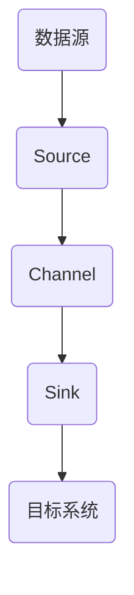

                 

### 文章标题：Flume Sink原理与代码实例讲解

### 关键词：Flume，Sink，数据流，日志收集，代码实例，数据处理

### 摘要：
本文将深入讲解Flume Sink的原理和实际应用，通过详细的代码实例分析，帮助读者理解Flume Sink的工作机制、开发技巧及性能优化策略。文章将涵盖Flume的基础知识、架构详解、Sink组件的原理与实例，以及Flume Sink的项目实战和高级应用。通过本文的阅读，读者将能够掌握Flume Sink的核心技术，提升数据处理能力。

## 《Flume Sink原理与代码实例讲解》目录大纲

### 第一部分：Flume基础知识

#### 第1章：Flume简介
##### 1.1 Flume的定义与作用
##### 1.2 Flume的发展历程
##### 1.3 Flume在数据处理中的定位

#### 第2章：Flume架构详解
##### 2.1 Flume数据流模型
##### 2.2 Flume核心组件
##### 2.3 Flume配置文件解析

#### 第3章：Flume的Source组件详解
##### 3.1 Source组件的功能与分类
##### 3.2 常用Source组件详解
##### 3.3 Source组件配置技巧

### 第二部分：Flume Sink组件详解

#### 第4章：Sink组件的基本原理
##### 4.1 Sink组件的作用
##### 4.2 Sink组件的分类
##### 4.3 Sink组件的工作流程

#### 第5章：常用Sink组件讲解
##### 5.1 FileSink组件
##### 5.2 HDFSink组件
##### 5.3 HBaseSink组件
##### 5.4 KafkaSink组件
##### 5.5 ElasticSearchSink组件

#### 第6章：Flume Sink自定义开发
##### 6.1 Sink自定义开发流程
##### 6.2 Sink自定义开发实例
##### 6.3 Sink自定义开发技巧

### 第三部分：Flume Sink项目实战

#### 第7章：Flume Sink实战案例一：日志收集
##### 7.1 实战目标
##### 7.2 环境搭建
##### 7.3 源代码实现
##### 7.4 代码解读与分析

#### 第8章：Flume Sink实战案例二：实时数据同步
##### 8.1 实战目标
##### 8.2 环境搭建
##### 8.3 源代码实现
##### 8.4 代码解读与分析

### 第四部分：Flume Sink性能优化

#### 第9章：Flume Sink性能优化
##### 9.1 性能优化策略
##### 9.2 实际案例优化分析
##### 9.3 性能监控与调优技巧

### 第五部分：Flume Sink高级应用

#### 第10章：Flume与其他数据存储技术的集成
##### 10.1 Flume与Hive的集成
##### 10.2 Flume与Spark的集成
##### 10.3 Flume与Kubernetes的集成

#### 第11章：Flume Sink集群部署与运维
##### 11.1 Flume Sink集群部署方案
##### 11.2 Flume Sink集群监控与故障处理
##### 11.3 Flume Sink运维技巧

#### 第12章：Flume Sink未来发展展望
##### 12.1 Flume Sink技术发展趋势
##### 12.2 Flume Sink在新型数据架构中的应用前景

### 附录

#### 附录A：Flume相关工具与资源
##### A.1 Flume官方文档
##### A.2 Flume社区资源
##### A.3 Flume开源项目介绍

通过以上详尽的目录结构，本文将为读者逐步解析Flume Sink的各个关键部分，使读者能够深入理解Flume Sink的工作原理，掌握其实际应用技巧，并能够运用到实际项目中。

## 第一部分：Flume基础知识

### 第1章：Flume简介

#### 1.1 Flume的定义与作用

Flume是一个分布式、可靠且高效的日志收集系统，主要用于在多个数据源和集中存储系统之间高效可靠地传输数据。其设计目的是将多个数据源（如Web服务器、数据库服务器等）的日志数据高效地传输到中心化的日志存储系统中，以便进行集中监控和分析。

Flume的主要作用如下：

- **数据聚合**：能够从多个来源收集数据，并将其聚合到中心化的存储系统中，方便进行统一管理和分析。
- **数据可靠性**：Flume提供了数据传输的可靠机制，确保数据在传输过程中不丢失，保障数据的完整性和准确性。
- **负载均衡**：Flume能够自动分配数据传输任务，实现负载均衡，提高系统的吞吐量和性能。
- **故障恢复**：Flume具备故障恢复机制，当某个组件出现问题时，系统能够自动重新分配任务，保证数据传输的连续性和稳定性。

#### 1.2 Flume的发展历程

Flume最早由Twitter公司于2007年开发，并在内部使用。随着Twitter的不断发展，Flume逐渐被用于处理大量日志数据的收集和传输。2011年，Flume作为Apache开源项目被正式发布，成为一个独立的项目，并不断得到社区的贡献和完善。

Flume的发展历程可以分为以下几个阶段：

1. **内部使用阶段**：Twitter内部使用Flume进行日志收集和传输，以解决内部系统之间日志数据的不统一问题。
2. **开源阶段**：2011年，Flume作为Apache开源项目正式发布，开始得到更广泛的关注和应用。
3. **社区贡献阶段**：随着Flume的不断发展，越来越多的企业和开发者参与到Flume的社区贡献中，为其提供新的功能和完善现有功能。

#### 1.3 Flume在数据处理中的定位

在数据处理领域中，Flume主要担任以下角色：

- **日志收集器**：Flume是一个高效的日志收集工具，能够从多个数据源（如Web服务器、数据库等）收集日志数据，并将其传输到中心化的日志存储系统中。
- **数据传输管道**：Flume作为数据传输的中介，连接多个数据源和存储系统，实现数据的高效传输和聚合。
- **数据存储预备**：Flume收集到的日志数据可以存储到不同的存储系统中，如HDFS、HBase等，为后续的数据分析和处理提供数据基础。

Flume在数据处理中的定位使其成为大数据生态系统中的重要一环，与Kafka、Spark等大数据处理技术有着紧密的联系和协同作用。

### 第2章：Flume架构详解

#### 2.1 Flume数据流模型

Flume的数据流模型是理解Flume工作机制的关键。Flume的核心组件包括Source、Channel和Sink，它们之间通过事件（event）进行数据传输。


Flume数据流模型的基本工作流程如下：

1. **Source组件**：Source是Flume的数据采集端，负责从数据源（如Web服务器、数据库等）中读取数据，并将数据转换为事件（event）。Source将事件存储在内存缓冲区中，等待传输。
2. **Channel组件**：Channel是Flume的事件缓冲区，用于存储从Source接收到的数据。Channel保证了数据在传输过程中的可靠性和顺序性，防止数据丢失。常用的Channel类型包括MemoryChannel和FileChannel。
3. **Sink组件**：Sink是Flume的数据输出端，负责将Channel中的数据传输到目标系统（如HDFS、HBase等）。Sink从Channel获取事件，并将其写入到目标系统中。

#### 2.2 Flume核心组件

Flume的核心组件包括Source、Channel和Sink，它们分别负责数据的采集、存储和输出，构成了Flume的数据流模型。

1. **Source组件**
   - **功能**：Source是Flume的数据采集端，负责从数据源中读取数据，并将数据转换为事件（event）。
   - **类型**：Flume支持多种Source类型，包括SyslogSource、JMSSource、HTTPSource等。其中，SyslogSource主要用于接收来自syslog服务的日志数据，JMSSource用于接收JMS消息队列中的数据，HTTPSource用于接收HTTP请求中的数据。
   - **配置**：Source的配置包括数据源的地址、端口、数据格式等。例如，SyslogSource的配置示例如下：
     ```xml
     <source>
         <type>syslog</type>
         <port>5140</port>
         <hostname>syslog-server</hostname>
         <channel>
             <type>memory</type>
             <capacity>1000</capacity>
             <transactionCapacity>500</transactionCapacity>
         </channel>
     </source>
     ```

2. **Channel组件**
   - **功能**：Channel是Flume的事件缓冲区，用于存储从Source接收到的数据。Channel保证了数据在传输过程中的可靠性和顺序性，防止数据丢失。
   - **类型**：Flume支持多种Channel类型，包括MemoryChannel、FileChannel和JdbcChannel。MemoryChannel是基于内存的Channel，性能较高但容量有限；FileChannel是基于文件的Channel，容量较大但性能较低；JdbcChannel是基于数据库的Channel，提供了更高的可靠性和持久性。
   - **配置**：Channel的配置包括Channel的类型、容量、传输策略等。例如，MemoryChannel的配置示例如下：
     ```xml
     <channel>
         <type>memory</type>
         <capacity>1000</capacity>
         <transactionCapacity>500</transactionCapacity>
     </channel>
     ```

3. **Sink组件**
   - **功能**：Sink是Flume的数据输出端，负责将Channel中的数据传输到目标系统（如HDFS、HBase等）。
   - **类型**：Flume支持多种Sink类型，包括HDFSsink、HBaseSink、KafkaSink等。HDFSsink用于将数据存储到HDFS中，HBaseSink用于将数据存储到HBase中，KafkaSink用于将数据发送到Kafka中。
   - **配置**：Sink的配置包括目标系统的地址、端口、数据格式等。例如，HDFSsink的配置示例如下：
     ```xml
     <sink>
         <type>hdfs</type>
         <channel>
             <type>memory</type>
             <capacity>1000</capacity>
             <transactionCapacity>500</transactionCapacity>
         </channel>
         <hdfs>
             <uri>hdfs://namenode:9000/flume/data</uri>
             <fileType> DATA </fileType>
             <rollInterval> 30 </rollInterval>
             <rollSize> 10485760 </rollSize>
         </hdfs>
     </sink>
     ```

#### 2.3 Flume配置文件解析

Flume的配置文件是以XML格式定义的，用于配置Source、Channel和Sink等组件。Flume的配置文件主要包括以下部分：

1. **全局配置**
   - **配置名称**：`flume.conf`
   - **配置内容**：全局配置包括日志级别、属性配置等。例如：
     ```xml
     <configuration>
         <property>
             <name>flume.root.logger</name>
             <value>INFO, console</value>
         </property>
         <property>
             <name>flume.conf.filepath</name>
             <value>$(java.io.tmpdir)/flume/conf</value>
         </property>
     </configuration>
     ```

2. **Source配置**
   - **配置名称**：`source.conf`
   - **配置内容**：Source的配置包括数据源的地址、端口、数据格式等。例如：
     ```xml
     <source>
         <type>syslog</type>
         <port>5140</port>
         <hostname>syslog-server</hostname>
         <channel>
             <type>memory</type>
             <capacity>1000</capacity>
             <transactionCapacity>500</transactionCapacity>
         </channel>
     </source>
     ```

3. **Channel配置**
   - **配置名称**：`channel.conf`
   - **配置内容**：Channel的配置包括Channel的类型、容量、传输策略等。例如：
     ```xml
     <channel>
         <type>memory</type>
         <capacity>1000</capacity>
         <transactionCapacity>500</transactionCapacity>
     </channel>
     ```

4. **Sink配置**
   - **配置名称**：`sink.conf`
   - **配置内容**：Sink的配置包括目标系统的地址、端口、数据格式等。例如：
     ```xml
     <sink>
         <type>hdfs</type>
         <channel>
             <type>memory</type>
             <capacity>1000</capacity>
             <transactionCapacity>500</transactionCapacity>
         </channel>
         <hdfs>
             <uri>hdfs://namenode:9000/flume/data</uri>
             <fileType> DATA </fileType>
             <rollInterval> 30 </rollInterval>
             <rollSize> 10485760 </rollSize>
         </hdfs>
     </sink>
     ```

通过以上配置文件，Flume能够根据用户的需求和配置，构建一个高效、可靠的数据收集和传输系统。

### 第3章：Flume的Source组件详解

#### 3.1 Source组件的功能与分类

Flume的Source组件是数据流的入口，负责从各种数据源采集数据，并将其转换为事件（event）。Source组件的功能主要包括：

- **数据采集**：从各种数据源（如Web服务器、数据库、消息队列等）读取数据。
- **数据转换**：将读取到的数据转换为Flume的事件（event），以便后续处理。
- **错误处理**：处理数据采集过程中的错误，如连接失败、数据格式错误等。

Flume提供了多种Source组件，根据数据源的类型和需求，可以选择合适的Source组件。以下是Flume中常用的Source组件及其功能：

1. **SyslogSource**
   - **功能**：用于接收来自syslog服务的日志数据。
   - **配置示例**：
     ```xml
     <source>
         <type>syslog</type>
         <port>5140</port>
         <hostname>syslog-server</hostname>
         <channel>
             <type>memory</type>
             <capacity>1000</capacity>
             <transactionCapacity>500</transactionCapacity>
         </channel>
     </source>
     ```

2. **JMSSource**
   - **功能**：用于接收JMS消息队列中的数据。
   - **配置示例**：
     ```xml
     <source>
         <type>jdbc</type>
         <connection-uri>failover:(tcp://host1:61616,tcp://host2:61616)</connection-uri>
         <connection-factory>myConnectionFactory</connection-factory>
         <channel>
             <type>memory</type>
             <capacity>1000</capacity>
             <transactionCapacity>500</transactionCapacity>
         </channel>
     </source>
     ```

3. **HTTPSource**
   - **功能**：用于接收HTTP请求中的数据。
   - **配置示例**：
     ```xml
     <source>
         <type>http</type>
         <port>8080</port>
         <channel>
             <type>memory</type>
             <capacity>1000</capacity>
             <transactionCapacity>500</transactionCapacity>
         </channel>
     </source>
     ```

4. **ThriftSource**
   - **功能**：用于接收通过Thrift协议传输的数据。
   - **配置示例**：
     ```xml
     <source>
         <type>thrift</type>
         <host>127.0.0.1</host>
         <port>9090</port>
         <channel>
             <type>memory</type>
             <capacity>1000</capacity>
             <transactionCapacity>500</transactionCapacity>
         </channel>
     </source>
     ```

5. **SpoolDirSource**
   - **功能**：用于监控指定目录下的文件，当文件发生变动时，读取文件内容并转换为事件。
   - **配置示例**：
     ```xml
     <source>
         <type>spoolDir</type>
         <file-path>/path/to/logfile.log</file-path>
         <file-type>文本文件</file-type>
         <channel>
             <type>memory</type>
             <capacity>1000</capacity>
             <transactionCapacity>500</transactionCapacity>
         </channel>
     </source>
     ```

以上是Flume中常用的一些Source组件，根据实际需求，可以选择合适的Source组件进行数据采集。在配置Source组件时，需要根据数据源的特点和需求进行相应的配置，如端口、主机名、连接方式等。

#### 3.2 常用Source组件详解

在本节中，我们将详细介绍Flume中的几个常用Source组件，包括SyslogSource、JMSSource和HTTPSource。这些组件在实际应用中具有广泛的使用场景，能够满足不同类型的数据采集需求。

##### 3.2.1 SyslogSource

SyslogSource是Flume中用于接收来自syslog服务的日志数据的Source组件。Syslog是一种网络协议，用于在计算机系统中收集和管理日志文件。通过SyslogSource，可以将来自不同服务器的syslog数据统一收集到Flume系统中，方便进行后续处理。

**配置说明**：

1. **基本配置**：

   ```xml
   <source>
       <type>syslog</type>
       <port>5140</port> <!-- 监听端口 -->
       <hostname>syslog-server</hostname> <!-- 日志服务器地址 -->
       <channel>
           <type>memory</type>
           <capacity>1000</capacity> <!-- 缓冲区容量 -->
           <transactionCapacity>500</transactionCapacity> <!-- 事务容量 -->
       </channel>
   </source>
   ```

   配置中，`<type>`指定为`syslog`，表示该组件为SyslogSource。`<port>`指定syslog监听的端口，默认为5140。`<hostname>`指定syslog服务器的地址，用于监听来自该地址的日志数据。Channel的配置与前面章节中的描述一致。

2. **高级配置**：

   SyslogSource还支持一些高级配置选项，例如：

   - `<filtered-text-pattern>`：指定过滤规则，用于筛选特定类型的日志数据。
   - `<timestamp-pattern>`：指定日志数据的日期时间格式，用于解析日志中的时间戳。

   ```xml
   <source>
       <type>syslog</type>
       <port>5140</port>
       <hostname>syslog-server</hostname>
       <filtered-text-pattern>^%{TIMESTAMP_ISO}\s*%{DATA}</filtered-text-pattern>
       <timestamp-pattern>%{TIMESTAMP_ISO}</timestamp-pattern>
       <channel>
           <type>memory</type>
           <capacity>1000</capacity>
           <transactionCapacity>500</transactionCapacity>
       </channel>
   </source>
   ```

   在此配置中，`<filtered-text-pattern>`指定了日志数据的过滤规则，仅保留符合正则表达式的日志部分。`<timestamp-pattern>`指定了日志中的时间戳格式，用于后续的时间解析。

**工作流程**：

SyslogSource的工作流程如下：

1. 监听指定端口，接收来自syslog服务器的日志数据。
2. 将接收到的日志数据转换为事件（event），存储在内存缓冲区中。
3. 当缓冲区达到设定容量时，触发事务（transaction）将数据传输到Channel。
4. Channel将数据传输到Sink，实现数据的持久化存储或进一步处理。

**示例**：

以下是一个简单的SyslogSource配置示例，用于从本地端口5140接收syslog数据：

```xml
<configuration>
    <sources>
        <source>
            <type>syslog</type>
            <port>5140</port>
            <channel>
                <type>memory</type>
                <capacity>1000</capacity>
                <transactionCapacity>500</transactionCapacity>
            </channel>
        </source>
    </sources>
    <sinks>
        <sink>
            <type>hdfs</type>
            <channel>
                <type>memory</type>
                <capacity>1000</capacity>
                <transactionCapacity>500</transactionCapacity>
            </channel>
            <hdfs>
                <uri>hdfs://namenode:9000/flume/data</uri>
                <fileType> DATA </fileType>
                <rollInterval> 30 </rollInterval>
                <rollSize> 10485760 </rollSize>
            </hdfs>
        </sink>
    </sinks>
</configuration>
```

此配置中，SyslogSource从端口5140接收syslog数据，将数据存储在内存Channel中，并最终将数据写入到HDFS中。

##### 3.2.2 JMSSource

JMS（Java Messaging Service）是一种Java消息服务规范，用于在不同的应用程序之间传输消息。JMSSource是Flume中的Source组件，用于从JMS消息队列中读取消息数据。

**配置说明**：

1. **基本配置**：

   ```xml
   <source>
       <type>jdbc</type>
       <connection-uri>failover:(tcp://host1:61616,tcp://host2:61616)</connection-uri>
       <connection-factory>myConnectionFactory</connection-factory>
       <channel>
           <type>memory</type>
           <capacity>1000</capacity>
           <transactionCapacity>500</transactionCapacity>
       </channel>
   </source>
   ```

   配置中，`<type>`指定为`jdbc`，表示该组件为JMSSource。`<connection-uri>`指定JMS服务器的连接地址，可以配置多个地址实现负载均衡。`<connection-factory>`指定JMS连接工厂，用于创建JMS连接。Channel的配置与前面章节中的描述一致。

2. **高级配置**：

   JMSSource还支持一些高级配置选项，例如：

   - `<destination>`：指定JMS消息队列的名称。
   - `<subscription-name>`：指定订阅者的名称，用于接收消息。

   ```xml
   <source>
       <type>jdbc</type>
       <connection-uri>failover:(tcp://host1:61616,tcp://host2:61616)</connection-uri>
       <connection-factory>myConnectionFactory</connection-factory>
       <destination>
           <name>myQueue</name>
           <subscription-name>mySubscription</subscription-name>
       </destination>
       <channel>
           <type>memory</type>
           <capacity>1000</capacity>
           <transactionCapacity>500</transactionCapacity>
       </channel>
   </source>
   ```

   在此配置中，`<destination>`指定了消息队列的名称和订阅者名称，用于接收JMS消息。

**工作流程**：

JMSSource的工作流程如下：

1. 创建JMS连接，连接到指定的JMS服务器。
2. 从JMS消息队列中读取消息数据。
3. 将接收到的消息数据转换为事件（event），存储在内存缓冲区中。
4. 当缓冲区达到设定容量时，触发事务（transaction）将数据传输到Channel。
5. Channel将数据传输到Sink，实现数据的持久化存储或进一步处理。

**示例**：

以下是一个简单的JMSSource配置示例，用于从JMS消息队列中读取消息数据：

```xml
<configuration>
    <sources>
        <source>
            <type>jdbc</type>
            <connection-uri>failover:(tcp://host1:61616,tcp://host2:61616)</connection-uri>
            <connection-factory>myConnectionFactory</connection-factory>
            <channel>
                <type>memory</type>
                <capacity>1000</capacity>
                <transactionCapacity>500</transactionCapacity>
            </channel>
        </source>
    </sources>
    <sinks>
        <sink>
            <type>hdfs</type>
            <channel>
                <type>memory</type>
                <capacity>1000</capacity>
                <transactionCapacity>500</transactionCapacity>
            </channel>
            <hdfs>
                <uri>hdfs://namenode:9000/flume/data</uri>
                <fileType> DATA </fileType>
                <rollInterval> 30 </rollInterval>
                <rollSize> 10485760 </rollSize>
            </hdfs>
        </sink>
    </sinks>
</configuration>
```

此配置中，JMSSource连接到本地JMS服务器，从名为`myQueue`的消息队列中读取消息，并将消息存储到HDFS中。

##### 3.2.3 HTTPSource

HTTPSource是Flume中的Source组件，用于接收HTTP请求中的数据。通过HTTPSource，可以将Web服务器的访问日志、上传的文件等数据传输到Flume系统中。

**配置说明**：

1. **基本配置**：

   ```xml
   <source>
       <type>http</type>
       <port>8080</port> <!-- 监听端口 -->
       <channel>
           <type>memory</type>
           <capacity>1000</capacity> <!-- 缓冲区容量 -->
           <transactionCapacity>500</transactionCapacity> <!-- 事务容量 -->
       </channel>
   </source>
   ```

   配置中，`<type>`指定为`http`，表示该组件为HTTPSource。`<port>`指定HTTP监听的端口，用于接收HTTP请求。Channel的配置与前面章节中的描述一致。

2. **高级配置**：

   HTTPSource还支持一些高级配置选项，例如：

   - `<max-backlog>`：指定HTTP请求的最大队列长度，避免过多请求堆积导致服务器过载。
   - `<request-timeout>`：指定HTTP请求的超时时间，避免长时间等待请求响应。

   ```xml
   <source>
       <type>http</type>
       <port>8080</port>
       <max-backlog>10000</max-backlog>
       <request-timeout>60000</request-timeout>
       <channel>
           <type>memory</type>
           <capacity>1000</capacity>
           <transactionCapacity>500</transactionCapacity>
       </channel>
   </source>
   ```

   在此配置中，`<max-backlog>`指定了HTTP请求的最大队列长度为10000，`<request-timeout>`指定了HTTP请求的超时时间为60000毫秒。

**工作流程**：

HTTPSource的工作流程如下：

1. 监听指定端口，接收HTTP请求。
2. 解析HTTP请求中的数据，将其转换为事件（event），存储在内存缓冲区中。
3. 当缓冲区达到设定容量时，触发事务（transaction）将数据传输到Channel。
4. Channel将数据传输到Sink，实现数据的持久化存储或进一步处理。

**示例**：

以下是一个简单的HTTPSource配置示例，用于从本地端口8080接收HTTP请求：

```xml
<configuration>
    <sources>
        <source>
            <type>http</type>
            <port>8080</port>
            <channel>
                <type>memory</type>
                <capacity>1000</capacity>
                <transactionCapacity>500</transactionCapacity>
            </channel>
        </source>
    </sources>
    <sinks>
        <sink>
            <type>hdfs</type>
            <channel>
                <type>memory</type>
                <capacity>1000</capacity>
                <transactionCapacity>500</transactionCapacity>
            </channel>
            <hdfs>
                <uri>hdfs://namenode:9000/flume/data</uri>
                <fileType> DATA </fileType>
                <rollInterval> 30 </rollInterval>
                <rollSize> 10485760 </rollSize>
            </hdfs>
        </sink>
    </sinks>
</configuration>
```

此配置中，HTTPSource从本地端口8080接收HTTP请求，并将请求存储到HDFS中。

##### 3.2.4 ThriftSource

ThriftSource是Flume中的Source组件，用于接收通过Thrift协议传输的数据。Thrift是一种高效的分布式服务框架，用于在不同语言和平台上实现服务的通信。

**配置说明**：

1. **基本配置**：

   ```xml
   <source>
       <type>thrift</type>
       <host>127.0.0.1</host> <!-- 服务端地址 -->
       <port>9090</port> <!-- 服务端端口 -->
       <channel>
           <type>memory</type>
           <capacity>1000</capacity> <!-- 缓冲区容量 -->
           <transactionCapacity>500</transactionCapacity> <!-- 事务容量 -->
       </channel>
   </source>
   ```

   配置中，`<type>`指定为`thrift`，表示该组件为ThriftSource。`<host>`指定Thrift服务端地址，用于连接到Thrift服务器。`<port>`指定Thrift服务端端口，用于接收Thrift协议的数据。Channel的配置与前面章节中的描述一致。

2. **高级配置**：

   ThriftSource还支持一些高级配置选项，例如：

   - `<serializer>`：指定序列化器类型，用于序列化和反序列化Thrift数据。
   - `<header-buffersize>`：指定请求头部的缓冲区大小。

   ```xml
   <source>
       <type>thrift</type>
       <host>127.0.0.1</host>
       <port>9090</port>
       <serializer>
           <name>binary</name>
       </serializer>
       <header-buffersize>4096</header-buffersize>
       <channel>
           <type>memory</type>
           <capacity>1000</capacity>
           <transactionCapacity>500</transactionCapacity>
       </channel>
   </source>
   ```

   在此配置中，`<serializer>`指定了序列化器类型为`binary`，`<header-buffersize>`指定了请求头部的缓冲区大小为4096字节。

**工作流程**：

ThriftSource的工作流程如下：

1. 创建Thrift客户端，连接到指定的Thrift服务端。
2. 接收Thrift服务端发送的数据。
3. 将接收到的数据转换为事件（event），存储在内存缓冲区中。
4. 当缓冲区达到设定容量时，触发事务（transaction）将数据传输到Channel。
5. Channel将数据传输到Sink，实现数据的持久化存储或进一步处理。

**示例**：

以下是一个简单的ThriftSource配置示例，用于从本地Thrift服务端接收数据：

```xml
<configuration>
    <sources>
        <source>
            <type>thrift</type>
            <host>127.0.0.1</host>
            <port>9090</port>
            <channel>
                <type>memory</type>
                <capacity>1000</capacity>
                <transactionCapacity>500</transactionCapacity>
            </channel>
        </source>
    </sources>
    <sinks>
        <sink>
            <type>hdfs</type>
            <channel>
                <type>memory</type>
                <capacity>1000</capacity>
                <transactionCapacity>500</transactionCapacity>
            </channel>
            <hdfs>
                <uri>hdfs://namenode:9000/flume/data</uri>
                <fileType> DATA </fileType>
                <rollInterval> 30 </rollInterval>
                <rollSize> 10485760 </rollSize>
            </hdfs>
        </sink>
    </sinks>
</configuration>
```

此配置中，ThriftSource从本地端口9090接收Thrift数据，并将数据存储到HDFS中。

#### 3.3 Source组件配置技巧

在实际应用中，为了确保Flume Source组件的高效运行和可靠性，需要根据具体的业务需求和系统环境进行合理的配置。以下是一些常见的配置技巧：

1. **优化缓冲区大小**：

   - **内存Channel缓冲区大小**：通过调整内存Channel的缓冲区大小，可以优化数据传输的效率。较大的缓冲区可以减少源组件与Channel之间的交互次数，提高吞吐量。但过大的缓冲区可能会导致内存消耗过高，因此需要根据实际情况进行权衡。
   - **事务容量**：事务容量决定了在触发数据传输前，Channel中可以存储的最大事件数。合理设置事务容量可以提高数据传输的可靠性，避免由于缓冲区溢出导致的数据丢失。但过大的事务容量可能会导致处理延迟增加，因此需要根据系统负载进行调节。

2. **多线程处理**：

   - **多线程采集**：在多节点环境中，可以通过增加Source的实例数来实现多线程采集。每个Source实例独立处理数据，提高系统的并发处理能力。
   - **线程池配置**：对于需要大量并行处理的场景，可以通过配置线程池来管理线程资源。合理的线程池配置可以避免过多线程创建导致的系统资源消耗，提高系统的稳定性。

3. **错误处理策略**：

   - **重试机制**：对于网络不稳定或数据源故障等场景，可以通过配置重试机制来确保数据传输的可靠性。合理的重试次数和重试间隔可以有效减少数据丢失的风险。
   - **错误日志记录**：通过配置错误日志记录，可以及时了解数据采集过程中的问题，便于问题定位和故障处理。

4. **动态配置调整**：

   - **配置热更新**：在某些场景下，可能需要根据业务需求动态调整Source组件的配置。Flume支持配置热更新，可以在不重启服务的情况下，实时调整配置，提高系统的灵活性。

通过以上配置技巧，可以有效地优化Flume Source组件的性能和稳定性，满足不同业务场景下的需求。

## 第二部分：Flume Sink组件详解

### 第4章：Sink组件的基本原理

#### 4.1 Sink组件的作用

Flume的Sink组件是数据流的输出端，负责将Channel中的数据传输到目标系统（如HDFS、HBase等）。Sink组件在Flume数据流中扮演着至关重要的角色，其作用如下：

1. **数据持久化**：将Channel中的数据存储到持久化存储系统中，如HDFS、HBase、Kafka等，确保数据的安全性和可靠性。
2. **数据传输**：将Channel中的数据传输到其他系统中，实现数据的跨系统传输和集成。
3. **负载均衡**：在多节点环境中，通过Sink组件实现负载均衡，将数据均匀分配到不同的目标系统中，提高系统的吞吐量和性能。
4. **错误处理**：处理数据传输过程中的错误，如目标系统故障、数据格式错误等，确保数据传输的连续性和稳定性。

#### 4.2 Sink组件的分类

Flume提供了多种Sink组件，根据数据目标系统的不同，可以分为以下几类：

1. **文件系统Sink**：将数据存储到本地文件系统中，如FileSink、HDFSink。
2. **数据库Sink**：将数据存储到关系数据库或NoSQL数据库中，如JdbcSink、MongoSink。
3. **消息队列Sink**：将数据发送到消息队列中，如KafkaSink、JMSink。
4. **大数据处理系统Sink**：将数据传输到大数据处理系统中，如HBaseSink、SparkSink。

#### 4.3 Sink组件的工作流程

Sink组件的工作流程可以分为以下几个步骤：

1. **初始化**：Sink组件在启动时，会读取配置文件，初始化连接到目标系统，如HDFS、HBase等。
2. **接收事件**：当Channel中的事件达到设定的阈值时，Sink组件开始接收事件。事件通常包含数据内容和元数据信息。
3. **数据处理**：Sink组件对事件进行必要的处理，如格式转换、数据清洗等，以便于目标系统的处理。
4. **数据传输**：将处理后的数据写入到目标系统中。对于文件系统Sink，将数据写入到文件中；对于数据库Sink，将数据插入到数据库表中；对于消息队列Sink，将数据发送到消息队列中。
5. **错误处理**：在数据传输过程中，可能遇到各种错误，如连接失败、数据格式错误等。Sink组件会根据配置的错误处理策略，进行相应的错误处理，如重试、跳过错误数据等。
6. **关闭连接**：当Sink组件停止运行时，会关闭与目标系统的连接，释放资源。

以下是一个简单的Flume工作流程示例：



在这个示例中，数据从数据源通过Source组件采集到Channel中，然后由Sink组件将数据传输到目标系统。Channel起到了缓冲和存储数据的作用，保证了数据在传输过程中的可靠性和顺序性。

#### 4.4 常见错误与解决方法

在使用Flume进行数据传输时，可能会遇到一些常见错误。以下是一些常见错误及其解决方法：

1. **连接失败**：可能是由于目标系统的地址或端口配置错误导致。检查目标系统的地址和端口，确保配置正确。
2. **数据格式错误**：可能是由于数据格式与目标系统不匹配导致。检查数据格式，确保与目标系统的格式一致，或对数据进行适当的转换。
3. **权限不足**：可能是由于目标系统的权限配置不足导致。检查目标系统的权限设置，确保Flume有足够的权限进行数据写入。
4. **网络不稳定**：可能是由于网络不稳定导致数据传输失败。检查网络连接状态，确保网络连接稳定。
5. **资源不足**：可能是由于系统资源不足导致数据传输失败。检查系统资源使用情况，确保系统有足够的资源进行数据传输。

通过了解常见错误及其解决方法，可以有效地避免和解决Flume数据传输过程中遇到的问题。

### 第5章：常用Sink组件讲解

在本节中，我们将详细讲解Flume中几种常用的Sink组件，包括FileSink、HDFSink、HBaseSink、KafkaSink和ElasticSearchSink。这些组件在实际应用中具有广泛的使用场景，能够满足不同类型的数据处理需求。

#### 5.1 FileSink组件

**功能说明**：

FileSink是Flume的一种文件系统Sink组件，用于将Channel中的数据写入到本地文件系统中。通过FileSink，可以将日志数据、监控数据等存储到文件中，便于后续分析和处理。

**配置示例**：

```xml
<configuration>
    <sinks>
        <sink>
            <type>file</type>
            <channel>
                <type>memory</type>
                <capacity>1000</capacity>
                <transactionCapacity>500</transactionCapacity>
            </channel>
            <file>
                <path>/path/to/output</path>
                <fileType> DATA </fileType>
                <rollInterval> 30 </rollInterval>
                <rollSize> 10485760 </rollSize>
            </file>
        </sink>
    </sinks>
</configuration>
```

**配置说明**：

- `<path>`：指定输出文件的路径。Flume会根据配置的路径将数据写入到文件中。
- `<fileType>`：指定输出文件的类型。可选值为`DATA`（普通数据文件）和`INDEX`（索引文件），通常为`DATA`。
- `<rollInterval>`：指定文件滚动的时间间隔（单位为分钟），当达到指定时间后，Flume会生成新的文件。
- `<rollSize>`：指定文件滚动的大小（单位为字节），当文件达到指定大小后，Flume会生成新的文件。

**工作流程**：

1. Channel中的数据达到设定的阈值时，FileSink组件开始处理数据。
2. Flume将数据写入到指定的文件路径中。
3. 当文件达到配置的滚动时间间隔或大小阈值时，Flume会生成新的文件，并开始写入新的数据。

**示例**：

以下是一个简单的FileSink配置示例，用于将Channel中的数据写入到本地文件系统中：

```xml
<configuration>
    <sinks>
        <sink>
            <type>file</type>
            <channel>
                <type>memory</type>
                <capacity>1000</capacity>
                <transactionCapacity>500</transactionCapacity>
            </channel>
            <file>
                <path>/path/to/output</path>
                <fileType> DATA </fileType>
                <rollInterval> 30 </rollInterval>
                <rollSize> 10485760 </rollSize>
            </file>
        </sink>
    </sinks>
</configuration>
```

此配置中，FileSink将数据写入到本地文件系统中的指定路径，并按照配置的滚动时间间隔和大小生成新的文件。

#### 5.2 HDFSink组件

**功能说明**：

HDFSink是Flume的一种HDFS（Hadoop分布式文件系统）Sink组件，用于将Channel中的数据写入到HDFS中。通过HDFSink，可以将大规模数据高效地存储到HDFS中，便于进行分布式处理和分析。

**配置示例**：

```xml
<configuration>
    <sinks>
        <sink>
            <type>hdfs</type>
            <channel>
                <type>memory</type>
                <capacity>1000</capacity>
                <transactionCapacity>500</transactionCapacity>
            </channel>
            <hdfs>
                <uri>hdfs://namenode:9000/flume/data</uri>
                <fileType> DATA </fileType>
                <rollInterval> 30 </rollInterval>
                <rollSize> 10485760 </rollSize>
                <compressed> true </compressed>
            </hdfs>
        </sink>
    </sinks>
</configuration>
```

**配置说明**：

- `<uri>`：指定HDFS的URI，包括HDFS的地址和路径。例如，`hdfs://namenode:9000/flume/data`表示HDFS的地址为`namenode`，路径为`/flume/data`。
- `<fileType>`：指定输出文件的类型。可选值为`DATA`（普通数据文件）和`INDEX`（索引文件），通常为`DATA`。
- `<rollInterval>`：指定文件滚动的时间间隔（单位为分钟），当达到指定时间后，HDFSink会生成新的文件。
- `<rollSize>`：指定文件滚动的大小（单位为字节），当文件达到指定大小后，HDFSink会生成新的文件。
- `<compressed>`：指定是否对输出文件进行压缩。可选值为`true`（压缩）和`false`（不压缩），通常为`true`。

**工作流程**：

1. Channel中的数据达到设定的阈值时，HDFSink组件开始处理数据。
2. Flume将数据写入到HDFS中，根据配置的路径生成新的文件。
3. 当文件达到配置的滚动时间间隔或大小阈值时，HDFSink会生成新的文件，并开始写入新的数据。

**示例**：

以下是一个简单的HDFSink配置示例，用于将Channel中的数据写入到HDFS中：

```xml
<configuration>
    <sinks>
        <sink>
            <type>hdfs</type>
            <channel>
                <type>memory</type>
                <capacity>1000</capacity>
                <transactionCapacity>500</transactionCapacity>
            </channel>
            <hdfs>
                <uri>hdfs://namenode:9000/flume/data</uri>
                <fileType> DATA </fileType>
                <rollInterval> 30 </rollInterval>
                <rollSize> 10485760 </rollSize>
                <compressed> true </compressed>
            </hdfs>
        </sink>
    </sinks>
</configuration>
```

此配置中，HDFSink将数据写入到HDFS中的指定路径，并按照配置的滚动时间间隔和大小生成新的文件，同时启用压缩功能。

#### 5.3 HBaseSink组件

**功能说明**：

HBaseSink是Flume的一种HBase Sink组件，用于将Channel中的数据写入到HBase中。通过HBaseSink，可以将大规模结构化数据存储到HBase中，便于进行实时查询和分析。

**配置示例**：

```xml
<configuration>
    <sinks>
        <sink>
            <type>hbase</type>
            <channel>
                <type>memory</type>
                <capacity>1000</capacity>
                <transactionCapacity>500</transactionCapacity>
            </channel>
            <hbase>
                <table>mytable</table>
                <columnFamily>cf1</columnFamily>
                <zookeeperQuorum>zookeeper-server:2181</zookeeperQuorum>
                <columnQualifier>myqualifier</columnQualifier>
            </hbase>
        </sink>
    </sinks>
</configuration>
```

**配置说明**：

- `<table>`：指定要写入的HBase表名。
- `<columnFamily>`：指定要写入的列族名。
- `<zookeeperQuorum>`：指定HBase的Zookeeper地址，用于连接到HBase集群。
- `<columnQualifier>`：指定要写入的列限定符，用于区分不同的列。

**工作流程**：

1. Channel中的数据达到设定的阈值时，HBaseSink组件开始处理数据。
2. Flume将数据转换为HBase的行键、列族和列限定符，并将数据写入到指定的HBase表中。
3. 当数据写入成功后，HBaseSink会将数据同步到Channel，确保数据的一致性和可靠性。

**示例**：

以下是一个简单的HBaseSink配置示例，用于将Channel中的数据写入到HBase表中：

```xml
<configuration>
    <sinks>
        <sink>
            <type>hbase</type>
            <channel>
                <type>memory</type>
                <capacity>1000</capacity>
                <transactionCapacity>500</transactionCapacity>
            </channel>
            <hbase>
                <table>mytable</table>
                <columnFamily>cf1</columnFamily>
                <zookeeperQuorum>zookeeper-server:2181</zookeeperQuorum>
                <columnQualifier>myqualifier</columnQualifier>
            </hbase>
        </sink>
    </sinks>
</configuration>
```

此配置中，HBaseSink将数据写入到HBase表`mytable`的列族`cf1`中，列限定符为`myqualifier`。

#### 5.4 KafkaSink组件

**功能说明**：

KafkaSink是Flume的一种Kafka Sink组件，用于将Channel中的数据发送到Kafka消息队列中。通过KafkaSink，可以将大规模日志数据实时传输到Kafka中，便于进行实时处理和分析。

**配置示例**：

```xml
<configuration>
    <sinks>
        <sink>
            <type>kafka</type>
            <channel>
                <type>memory</type>
                <capacity>1000</capacity>
                <transactionCapacity>500</transactionCapacity>
            </channel>
            <kafka>
                <bootstrapServers>broker1:9092,broker2:9092</bootstrapServers>
                <topic>mytopic</topic>
            </kafka>
        </sink>
    </sinks>
</configuration>
```

**配置说明**：

- `<bootstrapServers>`：指定Kafka的地址列表，包括Kafka的Brokers地址和端口号。例如，`broker1:9092,broker2:9092`表示Kafka的Brokers地址为`broker1`和`broker2`，端口号为`9092`。
- `<topic>`：指定要写入的Kafka主题名。

**工作流程**：

1. Channel中的数据达到设定的阈值时，KafkaSink组件开始处理数据。
2. Flume将数据转换为Kafka的消息格式，并将消息发送到Kafka队列中。
3. Kafka队列中的消息可以被Kafka消费者实时消费和处理。

**示例**：

以下是一个简单的KafkaSink配置示例，用于将Channel中的数据发送到Kafka中：

```xml
<configuration>
    <sinks>
        <sink>
            <type>kafka</type>
            <channel>
                <type>memory</type>
                <capacity>1000</capacity>
                <transactionCapacity>500</transactionCapacity>
            </channel>
            <kafka>
                <bootstrapServers>broker1:9092,broker2:9092</bootstrapServers>
                <topic>mytopic</topic>
            </kafka>
        </sink>
    </sinks>
</configuration>
```

此配置中，KafkaSink将数据发送到Kafka主题`mytopic`中，Kafka的Brokers地址为`broker1`和`broker2`。

#### 5.5 ElasticSearchSink组件

**功能说明**：

ElasticSearchSink是Flume的一种ElasticSearch Sink组件，用于将Channel中的数据写入到ElasticSearch中。通过ElasticSearchSink，可以将大规模结构化数据实时存储到ElasticSearch中，便于进行实时查询和分析。

**配置示例**：

```xml
<configuration>
    <sinks>
        <sink>
            <type>elasticsearch</type>
            <channel>
                <type>memory</type>
                <capacity>1000</capacity>
                <transactionCapacity>500</transactionCapacity>
            </channel>
            <elasticsearch>
                <hosts>es-node1:9200,es-node2:9200</hosts>
                <index>myindex</index>
                <documentType>mytype</documentType>
                <template>mytemplate</template>
            </elasticsearch>
        </sink>
    </sinks>
</configuration>
```

**配置说明**：

- `<hosts>`：指定ElasticSearch的地址列表，包括ElasticSearch的Nodes地址和端口号。例如，`es-node1:9200,es-node2:9200`表示ElasticSearch的Nodes地址为`es-node1`和`es-node2`，端口号为`9200`。
- `<index>`：指定要写入的ElasticSearch索引名。
- `<documentType>`：指定要写入的文档类型。
- `<template>`：指定ElasticSearch的模板名，用于定义文档的结构和字段。

**工作流程**：

1. Channel中的数据达到设定的阈值时，ElasticSearchSink组件开始处理数据。
2. Flume将数据转换为ElasticSearch的文档格式，并将文档写入到指定的ElasticSearch索引中。
3. ElasticSearch会根据文档的结构和字段进行索引和存储，便于后续查询和分析。

**示例**：

以下是一个简单的ElasticSearchSink配置示例，用于将Channel中的数据写入到ElasticSearch中：

```xml
<configuration>
    <sinks>
        <sink>
            <type>elasticsearch</type>
            <channel>
                <type>memory</type>
                <capacity>1000</capacity>
                <transactionCapacity>500</transactionCapacity>
            </channel>
            <elasticsearch>
                <hosts>es-node1:9200,es-node2:9200</hosts>
                <index>myindex</index>
                <documentType>mytype</documentType>
                <template>mytemplate</template>
            </elasticsearch>
        </sink>
    </sinks>
</configuration>
```

此配置中，ElasticSearchSink将数据写入到ElasticSearch索引`myindex`的文档类型`mytype`中，ElasticSearch的Nodes地址为`es-node1`和`es-node2`。

### 第6章：Flume Sink自定义开发

#### 6.1 Sink自定义开发流程

在Flume中，默认提供的Sink组件能够满足大多数常见的数据传输需求。但在某些特殊场景下，可能需要自定义开发Sink组件，以适应特定的业务需求和数据处理方式。下面将介绍Flume Sink自定义开发的流程。

**1. 需求分析**

首先，需要明确自定义Sink组件的需求。需求分析包括以下内容：

- **数据源和目标系统**：确定数据源的类型和目标系统的类型，如文件系统、HDFS、数据库、消息队列等。
- **数据处理方式**：确定数据在传输过程中的处理方式，如数据转换、过滤、聚合等。
- **性能和可靠性要求**：确定自定义Sink组件的性能和可靠性要求，如数据传输速率、错误处理能力等。

**2. 设计自定义Sink组件**

根据需求分析，设计自定义Sink组件。设计包括以下内容：

- **组件结构**：确定自定义Sink组件的类结构和功能模块，如数据读取模块、数据处理模块、数据写入模块等。
- **接口定义**：定义自定义Sink组件与Flume系统的接口，如数据读取接口、数据写入接口等。
- **配置参数**：定义自定义Sink组件的配置参数，如数据源地址、目标系统地址、数据格式等。

**3. 开发自定义Sink组件**

根据设计，开发自定义Sink组件。开发包括以下内容：

- **实现接口**：实现自定义Sink组件与Flume系统的接口，确保自定义Sink组件能够与Flume系统无缝集成。
- **数据处理**：实现自定义数据处理逻辑，如数据转换、过滤、聚合等。
- **错误处理**：实现错误处理逻辑，如重试、跳过错误数据等。

**4. 测试自定义Sink组件**

在开发过程中，需要对自定义Sink组件进行充分的测试。测试包括以下内容：

- **功能测试**：测试自定义Sink组件的功能是否满足需求，如数据读取、写入、处理等。
- **性能测试**：测试自定义Sink组件的性能，如数据传输速率、延迟等。
- **可靠性测试**：测试自定义Sink组件的可靠性，如错误处理、故障恢复等。

**5. 部署和运维**

在测试通过后，将自定义Sink组件部署到Flume系统中。部署包括以下内容：

- **配置修改**：根据自定义Sink组件的配置文件，修改Flume的配置。
- **启动服务**：启动Flume服务，确保自定义Sink组件正常运行。
- **监控和运维**：监控自定义Sink组件的运行状态，确保数据传输的连续性和稳定性。

通过以上流程，可以自定义开发一个满足特定需求的Flume Sink组件。

#### 6.2 Sink自定义开发实例

在本节中，我们将通过一个实例来详细讲解Flume Sink的自定义开发过程。该实例将实现一个简单的自定义Sink组件，用于将Flume接收到的数据发送到指定的HTTP服务。

**1. 需求分析**

本实例的需求是：将Flume接收到的数据发送到指定的HTTP服务。具体要求如下：

- **数据格式**：接收的数据格式为JSON，例如：`{"key1":"value1", "key2":"value2"}`。
- **HTTP服务**：发送数据的HTTP服务地址为`http://localhost:8080/insert`，采用POST请求方式。
- **数据处理**：在发送数据前，对数据进行简单的格式转换，如将JSON字符串转换为字典格式。

**2. 设计自定义Sink组件**

根据需求分析，设计自定义Sink组件。自定义Sink组件的类结构如下：

```python
class MyCustomSink(Sink):
    def __init__(self, host, port):
        super(MyCustomSink, self).__init__()
        self.host = host
        self.port = port

    def process(self, event):
        # 将Flume事件转换为JSON字符串
        json_str = json.dumps(event.getBody())
        
        # 对JSON字符串进行简单处理
        data = json.loads(json_str)
        data['processed'] = 'true'
        
        # 构建HTTP请求
        url = f"http://{self.host}:{self.port}/insert"
        headers = {'Content-Type': 'application/json'}
        data = json.dumps(data)
        
        # 发送HTTP请求
        response = requests.post(url, headers=headers, data=data)
        
        # 检查HTTP响应
        if response.status_code != 200:
            raise ValueError(f"HTTP request failed with status code {response.status_code}")

    def close(self):
        pass
```

**3. 开发自定义Sink组件**

根据设计，开发自定义Sink组件。实现自定义Sink组件的`process`方法，用于处理Flume事件，并将其发送到HTTP服务。以下是自定义Sink组件的实现代码：

```python
import requests
import json

from flume.sink import Sink

class MyCustomSink(Sink):
    def __init__(self, host, port):
        super(MyCustomSink, self).__init__()
        self.host = host
        self.port = port

    def process(self, event):
        # 将Flume事件转换为JSON字符串
        json_str = json.dumps(event.getBody())
        
        # 对JSON字符串进行简单处理
        data = json.loads(json_str)
        data['processed'] = 'true'
        
        # 构建HTTP请求
        url = f"http://{self.host}:{self.port}/insert"
        headers = {'Content-Type': 'application/json'}
        data = json.dumps(data)
        
        # 发送HTTP请求
        response = requests.post(url, headers=headers, data=data)
        
        # 检查HTTP响应
        if response.status_code != 200:
            raise ValueError(f"HTTP request failed with status code {response.status_code}")

    def close(self):
        pass
```

**4. 测试自定义Sink组件**

在开发完成后，需要对自定义Sink组件进行充分的测试。测试包括以下内容：

- **功能测试**：测试自定义Sink组件是否能够正确处理Flume事件，并将其发送到HTTP服务。
- **性能测试**：测试自定义Sink组件的性能，如数据传输速率、延迟等。
- **可靠性测试**：测试自定义Sink组件的可靠性，如错误处理、故障恢复等。

以下是测试自定义Sink组件的代码示例：

```python
import unittest

from flume.sink import Sink

class TestMyCustomSink(unittest.TestCase):
    def setUp(self):
        self.sink = MyCustomSink('localhost', 8080)

    def test_process(self):
        event = Event('my-event')
        event.setBody(b'{"key1":"value1", "key2":"value2"}')
        self.sink.process(event)
        
        # 这里可以添加额外的检查逻辑，如检查HTTP响应等

    def tearDown(self):
        pass

if __name__ == '__main__':
    unittest.main()
```

**5. 部署和运维**

在测试通过后，将自定义Sink组件部署到Flume系统中。部署包括以下内容：

- **配置修改**：根据自定义Sink组件的配置文件，修改Flume的配置。
- **启动服务**：启动Flume服务，确保自定义Sink组件正常运行。
- **监控和运维**：监控自定义Sink组件的运行状态，确保数据传输的连续性和稳定性。

以下是部署自定义Sink组件的示例配置文件：

```xml
<configuration>
    <sinks>
        <sink>
            <type>mycustomsink</type>
            <hosts>localhost</hosts>
            <port>8080</port>
        </sink>
    </sinks>
</configuration>
```

通过以上步骤，我们成功实现了自定义Flume Sink组件，并进行了详细的讲解和测试。这为后续的实际应用提供了有力的技术支持。

#### 6.3 Sink自定义开发技巧

在自定义Flume Sink组件的过程中，掌握一些开发技巧和最佳实践，能够提高开发效率、确保组件的稳定性和性能。以下是一些实用的自定义开发技巧：

1. **合理设计组件结构**：
   - 将自定义Sink组件划分为多个模块，如数据读取模块、数据处理模块、数据写入模块等，提高代码的可读性和可维护性。
   - 使用设计模式，如工厂模式、策略模式等，提高组件的灵活性和扩展性。

2. **充分利用Flume API**：
   - 熟悉Flume的API，充分利用Flume提供的功能，如事件处理、错误处理等。
   - 使用Flume的事件处理机制，确保数据在传输过程中的可靠性和顺序性。

3. **性能优化**：
   - 在数据处理过程中，避免不必要的操作，如循环、递归等，提高数据处理的效率。
   - 使用多线程或异步处理，提高数据传输的速度。
   - 合理配置缓冲区和线程池，避免内存泄漏和性能瓶颈。

4. **错误处理与日志记录**：
   - 设计完善的错误处理机制，如重试、跳过错误数据等，确保数据传输的连续性和稳定性。
   - 使用日志记录重要信息，如数据传输状态、错误信息等，便于问题定位和调试。

5. **测试与文档**：
   - 编写详细的单元测试，确保自定义Sink组件的功能和性能。
   - 编写文档，包括组件设计、配置和使用说明等，便于其他开发人员理解和使用。

通过以上技巧，可以有效提高自定义Flume Sink组件的开发质量和效率，确保组件的稳定性和性能。

### 第三部分：Flume Sink项目实战

#### 第7章：Flume Sink实战案例一：日志收集

在本节中，我们将通过一个实际项目案例，详细讲解如何使用Flume Sink进行日志收集。该案例将涵盖环境搭建、源代码实现、代码解读与分析等关键步骤。

#### 7.1 实战目标

本案例的目标是使用Flume收集Web服务器的日志数据，并将其存储到本地文件系统中。具体目标如下：

1. 搭建Flume环境，包括Flume服务器和Web服务器。
2. 配置Flume Source组件，从Web服务器接收日志数据。
3. 配置Flume Sink组件，将日志数据写入到本地文件系统中。
4. 部署和启动Flume服务，进行日志收集。
5. 分析和解读Flume日志收集过程，确保数据收集的正确性和效率。

#### 7.2 环境搭建

为了进行本案例的实践，我们需要搭建Flume环境和Web服务器。以下是一个简单的环境搭建步骤：

1. **安装Java环境**：由于Flume是基于Java开发的，首先需要安装Java环境。可以选择Java 8或更高版本。安装命令如下：

   ```bash
   sudo apt-get install openjdk-8-jdk
   ```

2. **下载和安装Flume**：从Apache Flume的官方网站下载最新的Flume二进制包。解压后，将解压目录添加到系统环境变量中，以便于运行Flume。

   ```bash
   wget http://www.apache.org/dist/flume/1.9.0/apache-flume-1.9.0-bin.tar.gz
   tar xzvf apache-flume-1.9.0-bin.tar.gz
   export FLUME_HOME=/path/to/apache-flume-1.9.0
   export PATH=$PATH:$FLUME_HOME/bin
   ```

3. **安装和配置Web服务器**：在本案例中，我们使用Apache HTTP服务器作为Web服务器。安装和配置Apache HTTP服务器的步骤如下：

   ```bash
   sudo apt-get install apache2
   sudo systemctl start apache2
   sudo systemctl enable apache2
   ```

   配置Apache HTTP服务器的日志格式，以便于Flume收集日志数据。编辑配置文件`/etc/apache2/apache2.conf`，在`<VirtualHost *:80>`区域中添加以下内容：

   ```bash
   CustomLog /var/log/apache2/access.log combined
   ErrorLog /var/log/apache2/error.log
   ```

4. **启动Web服务器**：启动Apache HTTP服务器，以便于生成日志数据。

   ```bash
   sudo systemctl start apache2
   ```

完成以上步骤后，我们成功搭建了Flume环境和Web服务器，并配置了日志格式。接下来，我们将配置Flume进行日志收集。

#### 7.3 源代码实现

在本案例中，我们将使用Flume的FileSink组件，将Web服务器的日志数据收集到本地文件系统中。以下是Flume的配置文件和相关的源代码实现。

**Flume配置文件**：

```xml
<configuration>
    <agents>
        <agent>
            <name>flume-log-collector</name>
            <type>master</type>
            <eventbourne>true</eventbourne>
        </agent>
        <agent>
            <name>flume-web-server</name>
            <type>worker</type>
            <master>flume-log-collector</master>
            <channels>
                <channel>
                    <type>memory</type>
                    <capacity>1000</capacity>
                    <transactionCapacity>500</transactionCapacity>
                </channel>
            </channels>
            <sources>
                <source>
                    <type>syslog</type>
                    <port>5140</port>
                    <channel>flume-web-server-channel</channel>
                </source>
            </sources>
            <sinks>
                <sink>
                    <type>file</type>
                    <channel>flume-web-server-channel</channel>
                    <file>
                        <path>/path/to/collector/logs/web-server.log</path>
                        <fileType>DATA</fileType>
                        <rollInterval>30</rollInterval>
                        <rollSize>10485760</rollSize>
                    </file>
                </sink>
            </sinks>
        </agent>
    </agents>
</configuration>
```

**Flume启动脚本**：

```bash
#!/bin/bash

# 启动Flume Master
$FLUME_HOME/bin/flume-ng master -f $FLUME_HOME/conf/flume-master.conf -n flume-log-collector -D flume.root.logger=INFO,console

# 启动Flume Worker
$FLUME_HOME/bin/flume-ng worker -c $FLUME_HOME/conf -f $FLUME_HOME/conf/flume-worker.conf -n flume-web-server
```

**源代码解读**：

1. **配置文件**：

   配置文件中定义了两个Flume代理（agent），分别是Master和Worker。Master代理负责配置和监控Worker代理，Worker代理负责从Web服务器接收日志数据并将其收集到本地文件系统中。

   - `<agent>`：定义Flume代理的配置，包括代理名称、类型、是否启用事件流模式等。
   - `<channels>`：定义Channel的配置，包括Channel类型、容量和事务容量。
   - `<sources>`：定义Source的配置，包括Source类型、端口和Channel名称。
   - `<sinks>`：定义Sink的配置，包括Sink类型、Channel名称和文件系统的路径。

2. **启动脚本**：

   启动脚本用于启动Flume Master和Worker代理。通过执行启动脚本，可以同时启动两个代理，实现日志数据的收集。

   - `$FLUME_HOME/bin/flume-ng master`：启动Flume Master代理。
   - `$FLUME_HOME/bin/flume-ng worker`：启动Flume Worker代理。

#### 7.4 代码解读与分析

在本案例中，我们使用Flume的SyslogSource组件从Web服务器接收日志数据，并使用FileSink组件将日志数据收集到本地文件系统中。以下是代码的详细解读与分析。

1. **SyslogSource组件**：

   SyslogSource组件用于接收来自Web服务器的syslog数据。配置文件中定义了SyslogSource的端口为5140，Channel名称为`flume-web-server-channel`。

   ```xml
   <source>
       <type>syslog</type>
       <port>5140</port>
       <channel>flume-web-server-channel</channel>
   </source>
   ```

   当Web服务器生成syslog日志数据时，Flume的SyslogSource组件会监听端口5140，接收日志数据，并将其转换为Flume事件（event）存储到Channel中。

2. **FileSink组件**：

   FileSink组件用于将Channel中的日志数据收集到本地文件系统中。配置文件中定义了FileSink的路径为`/path/to/collector/logs/web-server.log`，文件类型为`DATA`，滚动时间间隔为30分钟，滚动文件大小为10MB。

   ```xml
   <sink>
       <type>file</type>
       <channel>flume-web-server-channel</channel>
       <file>
           <path>/path/to/collector/logs/web-server.log</path>
           <fileType>DATA</fileType>
           <rollInterval>30</rollInterval>
           <rollSize>10485760</rollSize>
       </file>
   </sink>
   ```

   Flume的FileSink组件会根据配置的路径和滚动策略，将日志数据写入到本地文件系统中。当文件达到滚动时间间隔或文件大小阈值时，Flume会生成新的文件，并开始写入新的日志数据。

3. **日志收集过程**：

   当Web服务器生成日志数据时，Flume的SyslogSource组件会接收并转换为事件（event），存储到Channel中。当Channel中的事件达到设定的阈值时，Flume的FileSink组件开始处理事件，并将其写入到本地文件系统中。整个日志收集过程如下图所示：

   

   在此过程中，Flume的Channel组件起到了缓冲和存储事件的作用，确保数据在传输过程中的可靠性和顺序性。当FileSink组件写入日志数据时，会根据配置的路径和滚动策略生成新的文件，避免文件过大导致性能问题。

通过以上步骤，我们成功实现了Flume日志收集案例。在实际应用中，可以根据需求调整Flume的配置，实现更复杂的数据收集和传输功能。

### 第8章：Flume Sink实战案例二：实时数据同步

在本节中，我们将通过一个实际项目案例，详细讲解如何使用Flume Sink进行实时数据同步。该案例将涵盖环境搭建、源代码实现、代码解读与分析等关键步骤。

#### 8.1 实战目标

本案例的目标是使用Flume将实时生成或更新到数据库的数据同步到Hadoop HDFS系统中。具体目标如下：

1. 搭建Flume环境，包括Flume服务器和数据库服务器。
2. 配置Flume Source组件，从数据库中读取数据。
3. 配置Flume Sink组件，将数据写入到HDFS中。
4. 部署和启动Flume服务，进行实时数据同步。
5. 分析和解读Flume数据同步过程，确保数据同步的正确性和效率。

#### 8.2 环境搭建

为了进行本案例的实践，我们需要搭建Flume环境和数据库服务器。以下是一个简单的环境搭建步骤：

1. **安装Java环境**：由于Flume是基于Java开发的，首先需要安装Java环境。可以选择Java 8或更高版本。安装命令如下：

   ```bash
   sudo apt-get install openjdk-8-jdk
   ```

2. **下载和安装Flume**：从Apache Flume的官方网站下载最新的Flume二进制包。解压后，将解压目录添加到系统环境变量中，以便于运行Flume。

   ```bash
   wget http://www.apache.org/dist/flume/1.9.0/apache-flume-1.9.0-bin.tar.gz
   tar xzvf apache-flume-1.9.0-bin.tar.gz
   export FLUME_HOME=/path/to/apache-flume-1.9.0
   export PATH=$PATH:$FLUME_HOME/bin
   ```

3. **安装和配置数据库**：在本案例中，我们使用MySQL数据库作为数据源。安装和配置MySQL数据库的步骤如下：

   ```bash
   sudo apt-get install mysql-server
   sudo mysql_secure_installation
   sudo mysql -u root -p
   CREATE DATABASE mydatabase;
   USE mydatabase;
   CREATE TABLE mytable (id INT AUTO_INCREMENT PRIMARY KEY, name VARCHAR(255), value VARCHAR(255));
   ```

4. **配置数据库用户和权限**：为Flume用户（如`flume`）配置数据库访问权限，以便于Flume读取数据库数据。

   ```sql
   GRANT SELECT ON mydatabase.* TO 'flume'@'localhost' IDENTIFIED BY 'flume_password';
   FLUSH PRIVILEGES;
   ```

5. **启动数据库服务器**：启动MySQL数据库服务器。

   ```bash
   sudo systemctl start mysql
   sudo systemctl enable mysql
   ```

6. **安装和配置Hadoop**：在本案例中，我们使用Hadoop HDFS作为数据存储系统。安装和配置Hadoop的步骤如下：

   ```bash
   sudo apt-get install hadoop
   sudo systemctl start hadoop-hdfs-namenode
   sudo systemctl enable hadoop-hdfs-namenode
   sudo hdfs dfs -mkdir /flume/data
   sudo hdfs dfs -chmod 777 /flume/data
   ```

完成以上步骤后，我们成功搭建了Flume环境、MySQL数据库和Hadoop HDFS，并配置了数据库和HDFS。接下来，我们将配置Flume进行实时数据同步。

#### 8.3 源代码实现

在本案例中，我们将使用Flume的JdbcSource组件从MySQL数据库中读取数据，并使用HDFSSink组件将数据写入到Hadoop HDFS系统中。以下是Flume的配置文件和相关的源代码实现。

**Flume配置文件**：

```xml
<configuration>
    <agents>
        <agent>
            <name>flume-db-to-hdfs</name>
            <type>master</type>
            <eventbourne>true</eventbourne>
        </agent>
        <agent>
            <name>flume-db-source</name>
            <type>worker</type>
            <master>flume-db-to-hdfs</master>
            <channels>
                <channel>
                    <type>memory</type>
                    <capacity>1000</capacity>
                    <transactionCapacity>500</transactionCapacity>
                </channel>
            </channels>
            <sources>
                <source>
                    <type>jdbc</type>
                    <connection-uri>jdbc:mysql://db-server:3306/mydatabase?useSSL=false</connection-uri>
                    <connection-driver>com.mysql.cj.jdbc.Driver</connection-driver>
                    <connection-factory>
                        <user>flume</user>
                        <password>flume_password</password>
                    </connection-factory>
                    <table>mytable</table>
                    <channel>flume-db-source-channel</channel>
                </source>
            </sources>
            <sinks>
                <sink>
                    <type>hdfs</type>
                    <channel>flume-db-source-channel</channel>
                    <hdfs>
                        <uri>hdfs://namenode:9000/flume/data</uri>
                        <fileType>STREAM</fileType>
                        <rollInterval>5</rollInterval>
                        <rollSize>5242880</rollSize>
                    </hdfs>
                </sink>
            </sinks>
        </agent>
    </agents>
</configuration>
```

**Flume启动脚本**：

```bash
#!/bin/bash

# 启动Flume Master
$FLUME_HOME/bin/flume-ng master -f $FLUME_HOME/conf/flume-master.conf -n flume-db-to-hdfs -D flume.root.logger=INFO,console

# 启动Flume Worker
$FLUME_HOME/bin/flume-ng worker -c $FLUME_HOME/conf -f $FLUME_HOME/conf/flume-worker.conf -n flume-db-source
```

**源代码解读**：

1. **配置文件**：

   配置文件中定义了两个Flume代理（agent），分别是Master和Worker。Master代理负责配置和监控Worker代理，Worker代理负责从MySQL数据库读取数据并将其写入到Hadoop HDFS系统中。

   - `<agent>`：定义Flume代理的配置，包括代理名称、类型、是否启用事件流模式等。
   - `<channels>`：定义Channel的配置，包括Channel类型、容量和事务容量。
   - `<sources>`：定义Source的配置，包括Source类型、数据库连接信息、表名和Channel名称。
   - `<sinks>`：定义Sink的配置，包括Sink类型、Channel名称和HDFS的路径。

2. **启动脚本**：

   启动脚本用于启动Flume Master和Worker代理。通过执行启动脚本，可以同时启动两个代理，实现实时数据同步。

   - `$FLUME_HOME/bin/flume-ng master`：启动Flume Master代理。
   - `$FLUME_HOME/bin/flume-ng worker`：启动Flume Worker代理。

#### 8.4 代码解读与分析

在本案例中，我们使用Flume的JdbcSource组件从MySQL数据库中读取数据，并使用HDFSSink组件将数据写入到Hadoop HDFS系统中。以下是代码的详细解读与分析。

1. **JdbcSource组件**：

   JdbcSource组件用于从MySQL数据库中读取数据。配置文件中定义了JdbcSource的数据库连接信息，包括连接URI、驱动名称和用户密码。

   ```xml
   <source>
       <type>jdbc</type>
       <connection-uri>jdbc:mysql://db-server:3306/mydatabase?useSSL=false</connection-uri>
       <connection-driver>com.mysql.cj.jdbc.Driver</connection-driver>
       <connection-factory>
           <user>flume</user>
           <password>flume_password</password>
       </connection-factory>
       <table>mytable</table>
       <channel>flume-db-source-channel</channel>
   </source>
   ```

   当Flume启动时，JdbcSource组件会连接到MySQL数据库，并根据配置的表名`mytable`读取数据。读取到的数据会转换为Flume事件（event），存储到Channel中。

2. **HDFSSink组件**：

   HDFSSink组件用于将Channel中的数据写入到Hadoop HDFS系统中。配置文件中定义了HDFSSink的HDFS路径和文件滚动策略。

   ```xml
   <sink>
       <type>hdfs</type>
       <channel>flume-db-source-channel</channel>
       <hdfs>
           <uri>hdfs://namenode:9000/flume/data</uri>
           <fileType>STREAM</fileType>
           <rollInterval>5</rollInterval>
           <rollSize>5242880</rollSize>
       </hdfs>
   </sink>
   ```

   当Channel中的数据达到设定的阈值时，HDFSSink组件开始处理数据。处理过程包括将数据写入到HDFS中的指定路径，并根据配置的文件滚动策略生成新的文件。文件滚动策略包括滚动时间间隔和滚动文件大小。

3. **数据同步过程**：

   当MySQL数据库中的数据发生变动时，JdbcSource组件会读取变动数据，并将其转换为Flume事件（event），存储到Channel中。当Channel中的数据达到设定的阈值时，HDFSSink组件开始处理事件，并将其写入到HDFS中。数据同步过程如下图所示：

   

   在此过程中，Flume的Channel组件起到了缓冲和存储事件的作用，确保数据在传输过程中的可靠性和顺序性。当HDFSSink组件写入数据时，会根据配置的路径和滚动策略生成新的文件，避免文件过大导致性能问题。

通过以上步骤，我们成功实现了Flume实时数据同步案例。在实际应用中，可以根据需求调整Flume的配置，实现更复杂的数据同步和传输功能。

### 第四部分：Flume Sink性能优化

#### 第9章：Flume Sink性能优化

在数据流处理场景中，Flume Sink的性能直接影响到整个系统的吞吐量和稳定性。优化Flume Sink的性能是确保系统高效运行的重要环节。本节将介绍Flume Sink性能优化的策略、实际案例优化分析以及性能监控与调优技巧。

#### 9.1 性能优化策略

为了提升Flume Sink的性能，可以采取以下策略：

1. **增加缓冲区大小**：
   - **MemoryChannel缓冲区**：增加MemoryChannel的缓冲区大小，可以减少Channel与Sink之间的交互次数，提高数据传输速率。但过大的缓冲区可能导致内存占用过高。
   - **配置调优**：可以通过调整`<capacity>`和`<transactionCapacity>`参数，平衡缓冲区和事务处理能力。

2. **多线程处理**：
   - **并发处理**：通过增加Flume Agent的实例数量，实现多线程并发处理，提升系统吞吐量。
   - **线程池配置**：合理配置线程池大小，避免线程创建和销毁带来的性能开销。

3. **数据压缩与解压缩**：
   - **启用数据压缩**：在Sink组件中启用数据压缩，减少数据传输量，降低网络带宽压力。常见的压缩算法有Gzip、LZO等。

4. **批量处理**：
   - **批量传输**：增加批量处理的数据量，减少传输次数，提高整体传输效率。

5. **错误处理与重试机制**：
   - **重试策略**：设置合理的重试次数和重试间隔，提高数据传输的可靠性。
   - **跳过错误数据**：在遇到不可恢复的错误时，跳过错误数据，继续处理后续数据。

6. **性能监控**：
   - **监控工具**：使用性能监控工具，如Grafana、Prometheus等，实时监控Flume的性能指标。
   - **日志分析**：定期分析Flume日志，识别性能瓶颈和潜在问题。

#### 9.2 实际案例优化分析

以下是一个实际案例的优化分析，该案例涉及从日志文件中收集数据，并将其写入HDFS。

**问题描述**：
一个企业级日志收集系统需要将大量日志文件传输到HDFS中，但系统性能较低，且偶尔出现数据丢失现象。

**优化分析**：

1. **分析瓶颈**：
   - **网络带宽**：日志文件的传输量较大，导致网络带宽成为瓶颈。
   - **内存使用**：内存Channel的缓冲区较小，数据传输效率较低。
   - **错误处理**：错误处理机制不够完善，导致数据丢失。

2. **优化策略**：
   - **增加网络带宽**：增加网络带宽，提高数据传输速率。
   - **增大缓冲区**：将MemoryChannel的缓冲区大小增加到10MB，减少数据传输次数。
   - **优化错误处理**：设置合理的重试次数和重试间隔，提高数据传输可靠性。

3. **优化实施**：
   - **配置调整**：
     ```xml
     <channel>
         <type>memory</type>
         <capacity>10485760</capacity>
         <transactionCapacity>5000</transactionCapacity>
     </channel>
     <hdfs>
         <rollInterval>10</rollInterval>
         <rollSize>52428800</rollSize>
     </hDFS>
     ```

   - **错误处理配置**：
     ```xml
     <sink>
         <type>hdfs</type>
         <retries>3</retries>
         <retryInterval>5000</retryInterval>
         <channel>
             <type>memory</type>
             <capacity>10485760</capacity>
             <transactionCapacity>5000</transactionCapacity>
         </channel>
         <hdfs>
             <uri>hdfs://namenode:9000/flume/data</uri>
             <fileType>DATA</fileType>
             <rollInterval>10</rollInterval>
             <rollSize>52428800</rollSize>
         </hdfs>
     </sink>
     ```

4. **性能监控**：
   - **部署监控工具**：使用Grafana和Prometheus，实时监控Flume的性能指标，如吞吐量、延迟、错误率等。
   - **日志分析**：定期分析日志，及时发现和解决问题。

通过以上优化措施，系统的性能显著提升，数据传输的可靠性得到提高，满足了企业级日志收集的需求。

#### 9.3 性能监控与调优技巧

为了确保Flume Sink的性能和稳定性，需要建立完善的性能监控和调优机制。以下是一些实用的性能监控与调优技巧：

1. **监控指标**：
   - **吞吐量**：监控数据传输的速率，确保系统在高负载下仍能保持稳定的性能。
   - **延迟**：监控数据传输的延迟，及时识别和处理性能瓶颈。
   - **错误率**：监控数据传输过程中的错误率，确保错误处理机制的有效性。
   - **资源使用**：监控系统资源的使用情况，如CPU、内存、网络带宽等，确保系统资源得到合理利用。

2. **日志分析**：
   - **错误日志**：定期分析错误日志，识别和解决问题。
   - **性能日志**：分析性能日志，识别系统性能瓶颈和优化点。

3. **工具使用**：
   - **Grafana**：使用Grafana，实时监控Flume的性能指标，并通过可视化界面直观展示性能趋势。
   - **Prometheus**：使用Prometheus，收集Flume的性能数据，并利用其强大的查询和告警功能。

4. **调优策略**：
   - **负载均衡**：在多节点环境中，实现负载均衡，避免单点性能瓶颈。
   - **资源预留**：为Flume预留足够的系统资源，确保在高负载下仍能保持稳定的性能。
   - **配置调整**：根据实际情况，调整Flume的配置，优化缓冲区大小、线程池配置等。

通过以上监控与调优技巧，可以确保Flume Sink在复杂环境中保持高效稳定运行。

### 第五部分：Flume Sink高级应用

#### 第10章：Flume与其他数据存储技术的集成

Flume在数据流处理中具有广泛的应用，其强大的数据传输能力和灵活的配置使其能够与多种数据存储技术集成，实现高效的数据导入和导出。本节将介绍Flume与Hive、Spark和Kubernetes的集成方法。

#### 10.1 Flume与Hive的集成

Hive是一个基于Hadoop的数据仓库工具，用于处理大规模数据集。Flume与Hive的集成可以将实时收集到的数据导入到Hive中，便于进行数据分析和处理。

**集成方法**：

1. **配置Hive**：
   - 安装和配置Hive，确保其能够正常运行。
   - 创建Hive表，用于存储Flume导入的数据。

2. **配置Flume**：
   - 选择合适的Sink组件，如JdbcSink，用于将数据写入到Hive表中。
   - 配置JdbcSink的连接信息和表名，确保数据能够正确写入到Hive中。

   ```xml
   <sink>
       <type>jdbc</type>
       <connection-uri>jdbc:hive2://hiveserver2:10000/default</connection-uri>
       <table>mytable</table>
       <connection-factory>
           <user>hive</user>
           <password>hive_password</password>
       </connection-factory>
       <channel>
           <type>memory</type>
           <capacity>1000</capacity>
           <transactionCapacity>500</transactionCapacity>
       </channel>
   </sink>
   ```

3. **数据导入**：
   - 启动Flume，开始收集数据，并将其写入到Hive表中。
   - 使用Hive的SQL语句查询和分析数据。

**示例**：

以下是一个简单的Flume配置示例，用于将数据导入到Hive中：

```xml
<configuration>
    <sinks>
        <sink>
            <type>jdbc</type>
            <connection-uri>jdbc:hive2://hiveserver2:10000/default</connection-uri>
            <table>mytable</table>
            <connection-factory>
                <user>hive</user>
                <password>hive_password</password>
            </connection-factory>
            <channel>
                <type>memory</type>
                <capacity>1000</capacity>
                <transactionCapacity>500</transactionCapacity>
            </channel>
        </sink>
    </sinks>
</configuration>
```

此配置中，Flume的JdbcSink组件将数据写入到Hive表`mytable`中。

#### 10.2 Flume与Spark的集成

Spark是一个基于Hadoop的快速大数据处理引擎，Flume与Spark的集成可以将实时收集到的数据导入到Spark中，便于进行实时处理和分析。

**集成方法**：

1. **配置Spark**：
   - 安装和配置Spark，确保其能够正常运行。
   - 创建Spark应用程序，用于处理Flume导入的数据。

2. **配置Flume**：
   - 选择合适的Sink组件，如KafkaSink，用于将数据发送到Kafka队列中。
   - 配置Kafka队列，并设置Kafka与Spark的集成参数。

   ```xml
   <sink>
       <type>kafka</type>
       <topic>spark-input-topic</topic>
       <bootstrapServers>kafka-server:9092</bootstrapServers>
       <channel>
           <type>memory</type>
           <capacity>1000</capacity>
           <transactionCapacity>500</transactionCapacity>
       </channel>
   </sink>
   ```

3. **数据导入**：
   - 启动Flume，开始收集数据，并将其发送到Kafka队列中。
   - 在Spark应用程序中，从Kafka队列中读取数据，并进行实时处理。

**示例**：

以下是一个简单的Flume配置示例，用于将数据导入到Spark中：

```xml
<configuration>
    <sinks>
        <sink>
            <type>kafka</type>
            <topic>spark-input-topic</topic>
            <bootstrapServers>kafka-server:9092</bootstrapServers>
            <channel>
                <type>memory</type>
                <capacity>1000</capacity>
                <transactionCapacity>500</transactionCapacity>
            </channel>
        </sink>
    </sinks>
</configuration>
```

此配置中，Flume的KafkaSink组件将数据发送到Kafka队列`spark-input-topic`中。

#### 10.3 Flume与Kubernetes的集成

Kubernetes是一个开源的容器编排平台，Flume与Kubernetes的集成可以将Flume容器化，并部署到Kubernetes集群中，实现弹性的日志收集和数据传输。

**集成方法**：

1. **容器化Flume**：
   - 创建Flume的Docker镜像，将Flume的配置文件和应用程序打包到镜像中。
   - 将Flume的Docker镜像推送到Docker Hub或其他镜像仓库中。

2. **配置Kubernetes**：
   - 在Kubernetes集群中创建Flume的部署（Deployment），用于部署Flume容器。
   - 配置Flume的Service，用于暴露Flume的服务端口。

3. **部署Flume**：
   - 使用Kubernetes的YAML文件，部署Flume容器到Kubernetes集群中。
   - 启动Flume容器，开始收集数据。

**示例**：

以下是一个简单的Kubernetes部署示例，用于部署Flume容器：

```yaml
apiVersion: apps/v1
kind: Deployment
metadata:
  name: flume-deployment
spec:
  replicas: 1
  selector:
    matchLabels:
      app: flume
  template:
    metadata:
      labels:
        app: flume
    spec:
      containers:
      - name: flume
        image: flume:latest
        ports:
        - containerPort: 44444
```

此配置中，Flume容器部署到Kubernetes集群中，并暴露端口44444。

通过以上方法，可以轻松地将Flume与Hive、Spark和Kubernetes集成，实现高效的数据导入、导出和弹性部署。

### 第六部分：Flume Sink集群部署与运维

#### 第11章：Flume Sink集群部署与运维

随着数据量的不断增长和数据处理需求的日益复杂，单机部署的Flume系统已经无法满足大规模数据流处理的性能需求。为了提高Flume系统的处理能力和稳定性，需要将其部署在分布式环境中，即Flume集群部署。本节将介绍Flume Sink集群部署方案、集群监控与故障处理，以及运维技巧。

#### 11.1 Flume Sink集群部署方案

Flume集群部署分为几个关键步骤，下面将详细介绍：

1. **环境准备**：
   - 准备多台服务器，用于部署Flume集群。
   - 在每台服务器上安装Java环境和Flume软件。

2. **集群架构设计**：
   - 设计Flume集群的架构，包括Master节点和Worker节点。
   - Master节点负责配置和监控Worker节点，Worker节点负责数据收集和传输。

3. **配置文件**：
   - 配置Master节点的Flume配置文件，用于定义Worker节点的连接信息。
   - 配置Worker节点的Flume配置文件，指定数据源、Channel和Sink。

4. **部署Master节点**：
   - 在Master节点上启动Flume Master代理，监听Worker节点的连接请求。

5. **部署Worker节点**：
   - 在每台Worker节点上启动Flume Worker代理，连接到Master节点。

6. **配置负载均衡**：
   - 使用负载均衡器（如Nginx、HAProxy）对Master节点的访问进行负载均衡，提高系统的可靠性和性能。

7. **配置监控**：
   - 使用Zabbix、Nagios等监控工具，监控Flume集群的运行状态，如CPU、内存、网络流量等。

**示例配置文件**：

以下是一个简单的Flume集群配置示例：

```xml
<configuration>
    <agents>
        <agent>
            <name>flume-master</name>
            <type>master</type>
            <eventbourne>true</eventbourne>
        </agent>
        <agent>
            <name>flume-worker-1</name>
            <type>worker</type>
            <master>flume-master</master>
            <channels>
                <channel>
                    <type>memory</type>
                    <capacity>1000</capacity>
                    <transactionCapacity>500</transactionCapacity>
                </channel>
            </channels>
            <sources>
                <source>
                    <type>syslog</type>
                    <port>5140</port>
                    <channel>flume-worker-1-channel</channel>
                </source>
            </sources>
            <sinks>
                <sink>
                    <type>file</type>
                    <channel>flume-worker-1-channel</channel>
                    <file>
                        <path>/path/to/collector/logs/web-server.log</path>
                        <fileType>DATA</fileType>
                        <rollInterval>30</rollInterval>
                        <rollSize>10485760</rollSize>
                    </file>
                </sink>
            </sinks>
        </agent>
        <!-- 其他Worker节点配置 -->
    </agents>
</configuration>
```

在此示例中，配置了Master节点和两个Worker节点。Master节点负责监控和管理Worker节点，每个Worker节点配置了SyslogSource和FileSink组件。

#### 11.2 Flume Sink集群监控与故障处理

为了确保Flume集群的稳定运行，需要建立完善的监控和故障处理机制。以下是一些关键的监控与故障处理方法：

1. **监控指标**：
   - 监控Flume集群的CPU、内存、网络流量等资源使用情况。
   - 监控数据传输速率、延迟等性能指标。
   - 监控日志收集和传输的异常情况。

2. **集群监控工具**：
   - 使用Zabbix、Nagios等开源监控工具，实时监控Flume集群的运行状态。
   - 配置监控告警，当出现异常情况时，自动发送通知。

3. **故障处理**：
   - 定期进行集群健康检查，确保各节点正常工作。
   - 当发现故障节点时，及时重启或替换故障节点。
   - 使用负载均衡器，实现故障节点的自动切换，确保系统的可靠性。

4. **日志分析**：
   - 定期分析Flume日志，识别潜在问题和性能瓶颈。
   - 根据日志信息，进行故障诊断和问题定位。

#### 11.3 Flume Sink运维技巧

为了确保Flume集群的高效运行和稳定性，以下是一些实用的运维技巧：

1. **定期维护**：
   - 定期清理Flume日志文件，防止日志过多导致系统性能下降。
   - 定期备份Flume配置文件，以便在需要时进行恢复。

2. **资源调整**：
   - 根据系统负载和资源使用情况，调整Flume的配置参数，如缓冲区大小、线程池配置等。
   - 根据实际需求，增加或减少Worker节点，实现资源合理分配。

3. **安全防护**：
   - 配置防火墙，限制对Flume服务的访问，防止未授权访问。
   - 对Flume集群进行安全加固，如禁用不必要的服务、更新安全补丁等。

4. **备份与恢复**：
   - 定期备份Flume数据，防止数据丢失。
   - 在出现故障时，快速恢复Flume服务，确保数据流的连续性。

通过以上运维技巧，可以有效提高Flume集群的运行效率和稳定性，满足大规模数据流处理的需求。

### 第七部分：Flume Sink未来发展展望

#### 第12章：Flume Sink未来发展展望

随着大数据和实时数据处理技术的不断发展，Flume Sink作为数据流处理系统的重要组成部分，也面临着新的发展机遇和挑战。本节将探讨Flume Sink未来的技术发展趋势及其在新型数据架构中的应用前景。

#### 12.1 Flume Sink技术发展趋势

1. **容器化和云原生**：

   随着Kubernetes等容器编排技术的成熟，Flume未来的发展将更加注重容器化和云原生。通过将Flume部署在容器化环境中，可以轻松实现弹性和可扩展性，满足大规模数据处理的需求。

   - **容器化**：将Flume组件打包为Docker镜像，便于在Kubernetes等容器编排平台上部署和管理。
   - **云原生**：利用容器编排平台提供的服务发现、负载均衡、自动扩展等功能，实现Flume的高效运维和资源优化。

2. **流数据处理**：

   实时数据处理需求日益增长，Flume未来的发展将更加注重流数据处理能力。通过引入流数据处理框架，如Apache Flink、Apache Storm等，可以提升Flume对实时数据流处理的能力，实现更快的数据响应和更灵活的数据处理逻辑。

   - **流处理框架集成**：与流数据处理框架集成，实现实时数据的收集、处理和分发。
   - **流数据处理优化**：针对流数据处理的特点，优化Flume的内部机制，如事件处理、缓冲区管理等。

3. **多协议支持**：

   随着数据源的多样化，Flume未来的发展将更加注重多协议支持。通过支持更多的数据传输协议，如HTTP、gRPC、MQTT等，可以更广泛地接入不同类型的数据源，实现更全面的数据收集和处理。

   - **协议扩展**：支持多种数据传输协议，提供统一的接口和配置方式。
   - **协议优化**：针对不同的协议，进行性能优化和可靠性提升。

4. **智能处理与自优化**：

   随着人工智能和机器学习技术的发展，Flume未来的发展将更加注重智能处理和自优化。通过引入智能算法和自优化机制，可以提升Flume的处理效率和资源利用率。

   - **智能处理**：利用机器学习算法，实现数据清洗、分类、预测等智能处理功能。
   - **自优化**：根据系统负载和数据处理需求，自动调整配置参数，实现最优的数据处理性能。

#### 12.2 Flume Sink在新型数据架构中的应用前景

随着云计算、大数据和人工智能技术的不断发展，新型数据架构正在逐渐形成。Flume Sink作为数据流处理系统的一部分，将在新型数据架构中发挥重要作用。

1. **云计算与分布式架构**：

   随着云计算技术的普及，企业逐渐采用分布式架构，以实现更高效的数据处理和存储。Flume Sink作为分布式数据处理系统，可以与云计算平台（如AWS、Azure、Google Cloud）无缝集成，实现大规模数据的收集、处理和存储。

   - **云原生架构**：利用云计算平台的弹性资源、自动扩展等特性，实现Flume的高效部署和管理。
   - **混合云架构**：支持混合云部署，实现跨云平台的数据流处理和存储。

2. **实时数据处理**：

   在实时数据处理领域，Flume Sink可以通过与流数据处理框架（如Apache Flink、Apache Storm）集成，实现实时数据流的收集、处理和分发。这将为金融、物联网、智慧城市等领域提供强大的数据支持。

   - **实时数据处理应用**：在金融领域，实现实时交易监控、风险控制；在物联网领域，实现实时数据采集、分析和预测；在智慧城市领域，实现实时监控、预警和优化。

3. **大数据分析与机器学习**：

   Flume Sink在数据收集和传输过程中，可以与大数据分析和机器学习技术相结合，实现更高级的数据处理和分析。通过将数据传输到Hadoop、Spark等大数据平台，进行数据挖掘、分析和预测，为企业提供更深入的数据洞察。

   - **大数据分析应用**：在零售领域，实现商品销售分析、库存管理；在医疗领域，实现疾病预测、患者监控；在制造业，实现生产优化、质量控制。

4. **边缘计算与物联网**：

   边缘计算和物联网技术的发展，使得数据源更加广泛和多样化。Flume Sink可以通过与边缘计算设备（如物联网网关、智能传感器）集成，实现数据的边缘收集和传输，为物联网应用提供强大的数据支持。

   - **物联网应用**：在智能家居领域，实现家电设备的远程监控和控制；在工业自动化领域，实现设备状态监测和故障预测；在智慧城市领域，实现交通流量监控、环境监测等。

通过以上展望，我们可以看到Flume Sink在未来数据架构中将发挥越来越重要的作用，为各个领域的数据处理和分析提供强大的支持。

### 附录：Flume相关工具与资源

为了帮助读者更好地学习和使用Flume，本附录将介绍一些Flume相关的工具、资源和开源项目。

#### A.1 Flume官方文档

Apache Flume的官方文档是学习和使用Flume的最佳资源。官方文档提供了Flume的详细安装指南、配置选项、组件说明等。读者可以通过以下链接访问Flume官方文档：

[Flume官方文档](https://flume.apache.org/docs/latest/)

#### A.2 Flume社区资源

Flume社区是一个活跃的开发者社区，提供了大量的讨论和问题解答。读者可以通过以下链接加入Flume社区，与其他开发者交流经验：

[Flume社区论坛](https://forums.apache.org/forumdisplay.php?forumid=4)

#### A.3 Flume开源项目介绍

Flume作为一个Apache开源项目，其开发过程完全公开透明。读者可以通过以下链接了解Flume的开发进展、贡献指南和开源项目代码：

[Apache Flume GitHub仓库](https://github.com/apache/flume)

通过以上资源，读者可以深入了解Flume的技术细节，掌握其配置和使用方法，并参与到Flume的开源社区中，为Flume的发展贡献自己的力量。

