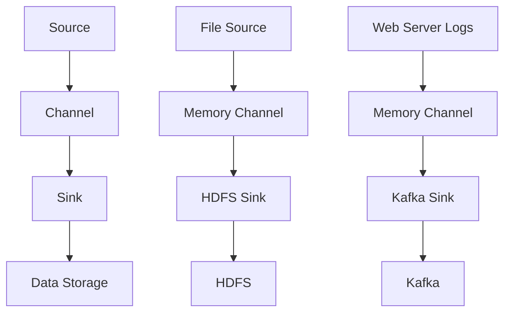

                 

# 文章标题: Flume原理与代码实例讲解

> 关键词：Flume, 数据采集，日志收集，分布式系统，架构设计，代码实例

> 摘要：本文将深入探讨Flume的原理与架构，通过详细的代码实例，帮助读者理解和掌握Flume的使用方法，实现高效的数据采集与同步。

## 引言

随着互联网和大数据技术的发展，企业对于数据采集和处理的需求日益增长。Flume作为一种高效可靠的数据采集工具，广泛应用于分布式系统中，用于收集和传输各种类型的数据。本文旨在通过详细讲解Flume的原理、架构和实战案例，帮助读者全面掌握Flume的使用方法，并解决实际应用中遇到的问题。

Flume是一个分布式、可靠且可扩展的数据收集服务，它主要用于在多个数据源和集中存储系统之间高效传输数据。Flume的架构设计简洁明了，通过Source、Channel和Sink三个核心组件，实现了数据采集、存储和传输的全过程。本文将逐步解析Flume的每个组件及其工作原理，并通过实际代码实例，展示Flume在数据采集和同步中的具体应用。

## 目录

1. Flume基础
   1.1 Flume概述
   1.2 Flume架构详解
   1.3 Flume的部署与配置

2. Flume核心组件
   2.1 Source组件
   2.2 Channel组件
   2.3 Sink组件

3. Flume高级特性
   3.1 数据处理与转换
   3.2 负载均衡与故障转移
   3.3 Flume在分布式系统中的应用

4. Flume集群部署
   4.1 Flume集群架构设计
   4.2 Flume集群部署步骤

5. Flume实战
   5.1 日志收集实战
   5.2 数据同步实战

6. Flume与大数据生态整合
   6.1 Flume与HDFS整合
   6.2 Flume与Kafka整合
   6.3 Flume与Spark整合

7. Flume性能优化
   7.1 性能监控与调优
   7.2 Flume性能优化实战
   7.3 Flume在大规模场景下的优化

8. 附录：Flume常用配置参数说明

9. 附录：Flume代码实例

10. 总结

## 第一部分：Flume基础

### 第1章：Flume概述

#### 1.1 Flume的背景与基本概念

Flume是一个分布式、可靠且可扩展的数据采集工具，由Cloudera开发。它的主要目的是为了解决在分布式系统中，如何高效、可靠地收集和传输数据的问题。Flume的设计理念是简单、高效和可靠，它能够处理大规模数据流，并在数据传输过程中保证数据的完整性和一致性。

Flume的主要功能包括：

1. **数据采集**：从各种数据源（如Web服务器日志、数据库输出等）收集数据。
2. **数据传输**：将采集到的数据传输到指定的存储系统（如HDFS、Kafka等）。
3. **数据存储**：在数据传输过程中临时存储数据，以确保数据的一致性和可靠性。

#### 1.2 Flume的核心概念

Flume的核心概念包括Source、Channel和Sink，它们分别负责数据的采集、存储和传输。

- **Source**：数据源，负责从数据源读取数据。Flume支持多种数据源，如Avro、HTTP、File等。
- **Channel**：数据通道，负责存储临时数据，确保数据在传输过程中的一致性和可靠性。Flume支持Memory Channel和File Channel。
- **Sink**：数据接收器，负责将数据写入目标存储系统。Flume支持Avro、HTTP、Logger等。

#### 1.3 Flume的主要功能

Flume的主要功能包括：

1. **可靠的数据传输**：Flume通过持久化存储Channel，确保数据在传输过程中不丢失。
2. **数据格式转换**：Flume支持多种数据格式，如JSON、Avro、SequenceFile等，可以方便地进行数据格式转换。
3. **负载均衡与故障转移**：Flume支持负载均衡和故障转移，确保数据传输的高可用性。

### 第2章：Flume架构详解

#### 2.1 Flume的架构设计

Flume的架构设计非常简洁，主要包括三个核心组件：Source、Channel和Sink。

- **Source**：负责从数据源读取数据，并将数据传递给Channel。Source可以是一个独立的Flume agent，也可以是嵌入在其他应用程序中的组件。
- **Channel**：负责存储临时数据，确保数据在传输过程中的一致性和可靠性。Channel可以是内存Channel，也可以是文件Channel。
- **Sink**：负责将数据写入目标存储系统，如HDFS、Kafka等。Sink通常是一个独立的Flume agent。

#### 2.2 Source、Channel和Sink的工作原理

- **Source的工作原理**：Source从数据源读取数据，并将其放入Channel。当Channel中的数据达到一定阈值时，Source会将数据传递给Sink。
- **Channel的工作原理**：Channel负责存储Source传递来的数据，并确保数据的一致性和可靠性。Channel可以是内存Channel，也可以是文件Channel。内存Channel速度快，但数据易丢失；文件Channel数据持久，但速度相对较慢。
- **Sink的工作原理**：Sink负责将Channel中的数据写入目标存储系统。当Sink接收到数据后，会立即将其写入目标存储系统，确保数据的及时传输。

#### 2.3 Flume的数据流转过程

Flume的数据流转过程可以概括为以下几个步骤：

1. **数据采集**：Source从数据源读取数据。
2. **数据存储**：数据被存储在Channel中，确保数据的一致性和可靠性。
3. **数据传输**：当Channel中的数据达到一定阈值时，Source会将数据传递给Sink。
4. **数据写入**：Sink将数据写入目标存储系统，如HDFS、Kafka等。

### 第3章：Flume的部署与配置

#### 3.1 Flume的部署方式

Flume支持多种部署方式，包括：

1. **独立部署**：每个组件（Source、Channel和Sink）部署在一个独立的Flume agent中。
2. **集群部署**：多个Flume agent组成一个集群，共同完成数据采集和传输任务。

#### 3.2 Flume配置文件详解

Flume的配置文件主要包括以下几个部分：

1. **Agent配置**：定义Agent的名称、Source、Channel和Sink。
2. **Source配置**：定义Source的类型、数据读取方式和读取频率。
3. **Channel配置**：定义Channel的类型、存储路径和存储容量。
4. **Sink配置**：定义Sink的类型、数据写入方式和写入频率。

#### 3.3 Flume环境搭建

搭建Flume环境的基本步骤如下：

1. **安装Flume**：从官网下载Flume安装包，并解压到指定目录。
2. **配置环境变量**：将Flume的bin目录添加到系统环境变量中，以便运行Flume命令。
3. **创建配置文件**：根据需要创建Agent配置文件，配置Source、Channel和Sink。
4. **启动Flume**：运行Flume命令，启动Flume agent。

通过以上步骤，可以完成Flume环境的搭建，并开始进行数据采集和传输。

## 第二部分：Flume核心组件

### 第4章：Flume核心组件

Flume的核心组件包括Source、Channel和Sink，它们分别负责数据的采集、存储和传输。本章节将详细解析这些组件，并介绍其常用类型和配置方法。

### 第5章：Flume高级特性

Flume不仅具备基本的数据采集和传输功能，还提供了一系列高级特性，包括数据处理与转换、负载均衡与故障转移，以及在大规模分布式系统中的应用。本章节将探讨这些高级特性，并给出具体的实现方法和策略。

### 第6章：Flume集群部署

在分布式系统中，Flume可以通过集群部署来提高数据采集和传输的可靠性。本章节将介绍Flume集群的架构设计，并详细讲解集群部署的步骤和注意事项。

## 第4章：Flume核心组件

Flume的核心组件包括Source、Channel和Sink，它们分别负责数据的采集、存储和传输。下面将详细介绍这些组件及其配置。

### 第4.1节：Source组件

Source是Flume的数据采集组件，负责从各种数据源读取数据。Flume支持多种Source类型，包括：

1. **Avro Source**：用于从其他Flume agent或应用程序中接收数据。
2. **HTTP Source**：用于从HTTP服务器接收数据。
3. **File Source**：用于监视指定目录中的文件，并读取文件内容。
4. **Throttled File Source**：与File Source类似，但提供流量控制功能。

**Avro Source配置示例：**

```properties
# Avro Source配置
a1.type = avro
a1.bind = 0.0.0.0
a1.port = 4441
```

**HTTP Source配置示例：**

```properties
# HTTP Source配置
h1.type = http
h1.port = 9999
```

**File Source配置示例：**

```properties
# File Source配置
f1.type = file
f1.path = /path/to/logfile.log
```

**Throttled File Source配置示例：**

```properties
# Throttled File Source配置
t1.type = throttled
t1.src.type = file
t1.src.path = /path/to/logfile.log
t1.rate = 1000
```

### 第4.2节：Channel组件

Channel是Flume的数据存储组件，负责在数据传输过程中临时存储数据，确保数据的一致性和可靠性。Flume支持以下Channel类型：

1. **Memory Channel**：将数据存储在内存中，速度快但数据易丢失。
2. **File Channel**：将数据存储在文件系统中，持久但速度相对较慢。
3. **JDBC Channel**：将数据存储在数据库中，提供更高的可靠性和持久性。

**Memory Channel配置示例：**

```properties
# Memory Channel配置
c1.type = memory
c1.capacity = 1000
c1.transactionCapacity = 100
```

**File Channel配置示例：**

```properties
# File Channel配置
c2.type = file
c2.checkpointDir = /path/to/checkpoint
c2.dataDirs = /path/to/data
```

**JDBC Channel配置示例：**

```properties
# JDBC Channel配置
c3.type = jdbc
c3.driver = com.mysql.jdbc.Driver
c3.url = jdbc:mysql://localhost:3306/flume
c3.user = root
c3.password = password
```

### 第4.3节：Sink组件

Sink是Flume的数据传输组件，负责将数据从Channel传输到目标存储系统。Flume支持以下Sink类型：

1. **Avro Sink**：用于将数据发送到其他Flume agent或应用程序。
2. **HTTP Postback Sink**：用于将数据发送到HTTP服务器。
3. **Logger Sink**：将数据记录到日志文件中。
4. **File Roll Sink**：将数据写入到文件中，并在达到一定大小或时间后自动滚动。

**Avro Sink配置示例：**

```properties
# Avro Sink配置
s1.type = avro
s1.connect = 0.0.0.0:4444
```

**HTTP Postback Sink配置示例：**

```properties
# HTTP Postback Sink配置
s2.type = http_postback
s2.url = http://localhost:8080/collect
```

**Logger Sink配置示例：**

```properties
# Logger Sink配置
s3.type = logger
```

**File Roll Sink配置示例：**

```properties
# File Roll Sink配置
s4.type = file_roll
s4.file = /path/to/output.log
s4.rollSize = 10240
s4.rollCount = 5
```

通过以上配置示例，可以看出Flume的核心组件配置相对简单，但功能强大。在具体应用中，可以根据需求选择合适的组件和配置，实现高效的数据采集和传输。

### 第5章：Flume高级特性

Flume作为一款高效可靠的数据采集工具，除了提供基本的数据采集、存储和传输功能外，还具备一系列高级特性，包括数据处理与转换、负载均衡与故障转移，以及在大规模分布式系统中的应用。这些高级特性使得Flume在复杂的数据采集任务中更加灵活和强大。

#### 5.1 数据处理与转换

Flume支持对数据进行多种处理和转换，从而满足不同应用场景的需求。以下是一些常用的数据处理和转换功能：

1. **数据格式转换**：Flume支持多种数据格式，如JSON、Avro、SequenceFile等。通过配置文件或自定义代码，可以实现不同数据格式之间的转换。例如，将JSON格式数据转换为Avro格式数据：

   ```properties
   # JSON to Avro转换配置
   a1.type = avro
   a1.bind = 0.0.0.0
   a1.port = 4441
   a1.timeout = 3000
   a1.dataformat.class = org.apache.flume.source.avro.JsonAvroSimpleParser
   ```

2. **数据清洗**：在数据传输过程中，Flume可以自动清洗无效数据，如删除空记录、过滤指定字段等。例如，过滤掉包含特定关键词的记录：

   ```python
   # Python脚本示例
   import json
   import re
   
   def clean_data(data):
       if 'error' in data:
           return None
       return data
   
   data = json.loads(data)
   cleaned_data = clean_data(data)
   if cleaned_data:
       channel.put(cleaned_data)
   ```

3. **数据聚合**：Flume可以聚合多个数据源的数据，生成聚合报告。例如，计算每个小时的请求总数：

   ```python
   # Python脚本示例
   import time
   import json
   
   request_counts = {}
   
   def aggregate_data(data):
       timestamp = int(data['timestamp'])
       hour = time.strftime('%H', time.localtime(timestamp))
       if hour in request_counts:
           request_counts[hour] += 1
       else:
           request_counts[hour] = 1
   
   data = json.loads(data)
   aggregate_data(data)
   ```

通过以上数据处理与转换功能，Flume可以灵活应对各种复杂的数据采集任务。

#### 5.2 负载均衡与故障转移

Flume支持负载均衡和故障转移，确保数据传输的高可用性和可靠性。以下是一些常用的负载均衡和故障转移策略：

1. **负载均衡策略**：Flume支持多种负载均衡策略，如随机策略、轮询策略和最小连接数策略。通过配置文件或自定义代码，可以指定合适的负载均衡策略。例如，使用最小连接数策略：

   ```python
   # Python脚本示例
   from random import randint
   
   def load_balance(sinks):
       min_connections = float('inf')
       chosen_sink = None
       for sink in sinks:
           connections = sink.get_num_connections()
           if connections < min_connections:
               min_connections = connections
               chosen_sink = sink
       return chosen_sink
   
   sinks = ['s1', 's2', 's3']
   chosen_sink = load_balance(sinks)
   ```

2. **故障转移机制**：当数据传输过程中出现故障时，Flume会自动切换到备用数据源或备用通道，确保数据传输的连续性。例如，当主通道出现故障时，自动切换到备用通道：

   ```python
   # Python脚本示例
   import time
   
   def fault_transfer(channel):
       while True:
           try:
               channel.put(data)
               break
           except Exception as e:
               print("Fault detected, transferring to backup channel.")
               time.sleep(10)
               channel = backup_channel
               continue
   
   channel = main_channel
   fault_transfer(channel)
   ```

通过以上负载均衡和故障转移机制，Flume可以确保数据传输的高可用性和可靠性。

#### 5.3 Flume在分布式系统中的应用

Flume在大规模分布式系统中具有广泛的应用，可以用于日志收集、数据同步等任务。以下是一些典型的应用场景：

1. **日志收集**：Flume可以收集来自各个服务器的日志，并将日志存储到HDFS或其他存储系统中，便于后续分析和处理。例如，在分布式Web系统中，Flume可以收集每个服务器的访问日志：

   ```properties
   # Flume配置示例
   a1.type = http
   a1.bind = 0.0.0.0
   a1.port = 8080
   
   c1.type = file
   c1.checkpointDir = /path/to/checkpoint
   c1.dataDirs = /path/to/data
   
   s1.type = hdfs
   s1.hdfs.path = hdfs://namenode:8020/flume/logs
   ```

2. **数据同步**：Flume可以同步不同数据库之间的数据，确保数据的一致性。例如，将MySQL数据库的数据同步到HDFS：

   ```properties
   # Flume配置示例
   a1.type = jdbc
   a1.driver = com.mysql.jdbc.Driver
   a1.url = jdbc:mysql://localhost:3306/test
   a1.user = root
   a1.password = password
   
   c1.type = file
   c1.checkpointDir = /path/to/checkpoint
   c1.dataDirs = /path/to/data
   
   s1.type = hdfs
   s1.hdfs.path = hdfs://namenode:8020/flume/sync
   ```

通过以上应用示例，可以看出Flume在分布式系统中的应用非常灵活，可以满足各种复杂的数据采集和同步需求。

## 第6章：Flume集群部署

在分布式系统中，为了提高Flume的数据采集和传输能力，通常需要将多个Flume agent组成一个集群。Flume集群通过多个节点协同工作，实现大规模数据采集和传输。本章将介绍Flume集群的架构设计、部署步骤以及注意事项。

### 6.1 Flume集群架构设计

Flume集群由多个节点组成，每个节点负责一部分数据采集和传输任务。Flume集群的基本架构包括以下几个部分：

1. **Master节点**：负责管理集群，包括节点监控、任务分配等。Master节点通常运行一个独立的Flume agent。
2. **Worker节点**：负责数据采集和传输，每个Worker节点运行一个Flume agent。Worker节点可以按照负载均衡策略动态分配任务。
3. **数据源和目标存储系统**：数据源和目标存储系统可以是Web服务器、数据库、HDFS等，Flume集群通过多个Worker节点与数据源和目标存储系统交互。

#### Flume集群数据流转流程

Flume集群的数据流转过程如下：

1. **数据采集**：各个Worker节点从数据源读取数据，并传递给Master节点。
2. **任务分配**：Master节点根据负载均衡策略，将数据分配给不同的Worker节点。
3. **数据传输**：分配到各个Worker节点的数据被进一步传输到目标存储系统。
4. **监控与维护**：Master节点监控整个集群的运行状态，并在节点故障时进行故障转移。

### 6.2 Flume集群部署步骤

以下是在Linux环境下部署Flume集群的基本步骤：

1. **环境准备**：确保所有节点安装了Java环境和Flume，并配置好网络和防火墙规则。
2. **配置Master节点**：在Master节点的Flume配置文件中，设置集群管理相关的参数，如集群名称、Master地址等。
3. **配置Worker节点**：在所有Worker节点的Flume配置文件中，设置数据源和目标存储系统的参数，并连接到Master节点。
4. **启动Flume集群**：在各节点依次启动Flume agent，Master节点启动后会自动发现和监控Worker节点。

### 6.3 集群配置文件调整

在Flume集群中，需要对配置文件进行适当的调整，以适应集群环境。以下是一些关键配置：

1. **Master配置文件**：

   ```properties
   # Master配置文件示例
   a1.type = master
   a1.bind = 0.0.0.0
   a1.port = 4630
   a1.master.host = master-node
   a1.master.port = 4631
   ```

2. **Worker配置文件**：

   ```properties
   # Worker配置文件示例
   a1.type = source
   a1.bind = 0.0.0.0
   a1.port = 4441
   
   c1.type = memory
   c1.capacity = 1000
   c1.transactionCapacity = 100
   
   s1.type = sink
   s1.group = mycluster
   s1.host = data-node
   s1.port = 4444
   ```

### 6.4 Flume集群启动与监控

1. **启动Flume集群**：在各节点依次启动Flume agent。Master节点启动后会自动发现和监控Worker节点。
2. **监控Flume集群**：使用Flume提供的Web UI监控集群状态。在Master节点上运行以下命令，启动Web UI：

   ```shell
   flume master
   ```

   Web UI的默认访问地址为`http://master-node:4141`。

3. **故障转移与维护**：在节点故障时，Master节点会自动进行故障转移，确保数据采集和传输的连续性。同时，定期对集群进行维护和监控，确保其正常运行。

通过以上步骤，可以成功部署一个Flume集群，实现高效的数据采集和传输。

## 第三部分：Flume实战

### 第7章：日志收集实战

日志收集是Flume最典型的应用场景之一。本章将介绍如何使用Flume收集Web日志和系统监控日志，并详细讲解具体的配置和实现步骤。

### 第8章：数据同步实战

除了日志收集，Flume还广泛应用于数据同步任务。本章将介绍如何使用Flume同步数据库数据和文件数据，并通过实际案例展示数据同步的配置和实现方法。

### 第9章：Flume与大数据生态整合

随着大数据技术的发展，Flume逐渐与各种大数据组件进行了整合，如HDFS、Kafka和Spark。本章将探讨Flume与这些大数据组件的整合方法，并介绍具体的配置和实现步骤。

### 第10章：Flume性能优化

在分布式系统中，性能优化是确保Flume高效运行的关键。本章将介绍Flume的性能优化方法，包括监控与调优、性能优化实战以及在大规模场景下的优化策略。

## 第7章：日志收集实战

日志收集是Flume的典型应用场景之一，Flume能够方便地从各种日志源中收集日志数据，并将其传输到目标存储系统中。本章将详细介绍如何使用Flume进行日志收集的实战，包括Web日志收集和系统监控日志收集。

### 7.1 Web日志收集

Web日志收集是Flume应用中非常常见的一种场景，主要用于收集Web服务器的访问日志。以下是一个Web日志收集的实战案例：

#### 实战案例：Web日志收集

**环境准备**：

- 安装并配置Flume。
- Web服务器已正常运行，并生成访问日志。

**配置文件**：

以下是一个简单的Flume配置文件，用于收集Web服务器的访问日志：

```properties
# Flume配置文件
# agent1
a1.type = http
a1.port = 9999
a1.bind = 0.0.0.0

# channel1
c1.type = memory
c1.capacity = 1000
c1.transactionCapacity = 100

# s1
s1.type = hdfs
s1.hdfs.path = /flume/weblogs
s1.hdfs.filetype = DataStream
s1.hdfs.write_format = Text
```

**步骤**：

1. **启动Flume**：在Flume agent所在的机器上启动Flume，加载上述配置文件。

   ```shell
   flume-ng agent -c /path/to/config -f /path/to/configfile -n agent1
   ```

2. **修改Web服务器日志格式**：为了让Flume能够正确解析日志，需要将Web服务器日志格式调整为Flume支持的格式。假设Web服务器的日志格式为NCSA Common Log Format：

   ```text
   %h %l %u %t "%r" %s %b
   ```

   调整后的日志格式为：

   ```text
   %h %l %u %t "%r" %s %b %{"timestamp": ["%d", "%H:%M:%S"]] %{"remote_addr": [$1]} %{"remote_user": [$3]} %{"request_method": [$5]} %{"request_url": [$6]} %{"status_code": [$7]} %{"byte_count": [$9]]
   ```

3. **测试Flume**：使用以下命令发送一个HTTP请求到Flume agent：

   ```shell
   curl -I http://localhost:9999/
   ```

   如果配置正确，Flume将收集到该请求的日志，并存储到HDFS中。

### 7.2 系统监控日志收集

系统监控日志收集是另一种常见的Flume应用场景，主要用于收集操作系统的各种日志，如系统日志、进程日志等。以下是一个系统监控日志收集的实战案例：

#### 实战案例：系统监控日志收集

**环境准备**：

- 安装并配置Flume。
- 系统已正常运行，并生成监控日志。

**配置文件**：

以下是一个简单的Flume配置文件，用于收集系统监控日志：

```properties
# Flume配置文件
# agent2
a1.type = exec
a1.command = tail -F /var/log/syslog

# channel2
c1.type = memory
c1.capacity = 1000
c1.transactionCapacity = 100

# s2
s2.type = hdfs
s2.hdfs.path = /flume/syslogs
s2.hdfs.filetype = DataStream
s2.hdfs.write_format = Text
```

**步骤**：

1. **启动Flume**：在Flume agent所在的机器上启动Flume，加载上述配置文件。

   ```shell
   flume-ng agent -c /path/to/config -f /path/to/configfile -n agent2
   ```

2. **测试Flume**：由于配置的是实时收集系统日志，可以在系统日志中添加一些日志条目，观察Flume是否能够正确收集。

3. **调整日志格式**：如果需要，可以根据实际需求调整系统日志的格式，使其符合Flume的解析要求。

通过以上实战案例，读者可以了解如何使用Flume进行日志收集，包括Web日志和系统监控日志。这些案例展示了Flume在日志收集中的实际应用，帮助读者掌握Flume的使用方法，为后续的数据处理和分析打下基础。

### 第8章：数据同步实战

在分布式系统中，数据同步是一项常见的任务。Flume作为一种高效的数据采集工具，可以方便地实现数据的同步。本章将介绍如何使用Flume进行数据同步的实战，包括数据库同步和文件同步。

#### 8.1 数据库同步

数据库同步是将一个数据库的数据复制到另一个数据库的过程。以下是一个使用Flume进行数据库同步的实战案例。

##### 实战案例：MySQL数据库同步

**环境准备**：

- 安装并配置Flume。
- 安装并运行MySQL数据库，并创建一个测试数据库和表。

**配置文件**：

以下是一个简单的Flume配置文件，用于同步MySQL数据库的数据：

```properties
# Flume配置文件
# agent3
a1.type = jdbc
a1.driver = com.mysql.cj.jdbc.Driver
a1.url = jdbc:mysql://localhost:3306/source_db
a1.user = root
a1.password = password

# channel3
c1.type = memory
c1.capacity = 1000
c1.transactionCapacity = 100

# s3
s3.type = jdbc
s3.driver = com.mysql.cj.jdbc.Driver
s3.url = jdbc:mysql://localhost:3306/dest_db
s3.user = root
s3.password = password
s3.insertSql = INSERT INTO dest_table (id, name) VALUES (?, ?)
```

**步骤**：

1. **启动Flume**：在Flume agent所在的机器上启动Flume，加载上述配置文件。

   ```shell
   flume-ng agent -c /path/to/config -f /path/to/configfile -n agent3
   ```

2. **测试数据库同步**：在源数据库中添加一条数据，观察Flume是否能够同步到目标数据库。

   ```sql
   INSERT INTO source_table (id, name) VALUES (1, 'Test Data');
   ```

##### 注意事项：

- **数据库连接配置**：确保源数据库和目标数据库的连接配置正确，包括驱动、URL、用户名和密码。
- **同步策略**：可以根据需要配置同步策略，如全量同步、增量同步等。

#### 8.2 文件同步

文件同步是将一个文件系统的文件复制到另一个文件系统的过程。以下是一个使用Flume进行文件同步的实战案例。

##### 实战案例：文件同步

**环境准备**：

- 安装并配置Flume。
- 在文件系统中准备好源文件和目标目录。

**配置文件**：

以下是一个简单的Flume配置文件，用于同步文件：

```properties
# Flume配置文件
# agent4
a1.type = file
a1.channels = c1
a1.file = /path/to/source/file.txt

# channel4
c1.type = memory
c1.capacity = 1000
c1.transactionCapacity = 100

# s4
s4.type = file
s4.channels = c1
s4.path = /path/to/target/
```

**步骤**：

1. **启动Flume**：在Flume agent所在的机器上启动Flume，加载上述配置文件。

   ```shell
   flume-ng agent -c /path/to/config -f /path/to/configfile -n agent4
   ```

2. **测试文件同步**：在源文件系统中添加或修改文件，观察Flume是否能够同步到目标目录。

##### 注意事项：

- **文件路径配置**：确保源文件和目标目录的路径配置正确。
- **文件格式**：Flume支持多种文件格式，如文本文件、二进制文件等。需要根据实际需求调整文件格式。

通过以上实战案例，读者可以了解如何使用Flume进行数据库同步和文件同步。这些案例展示了Flume在数据同步中的实际应用，帮助读者掌握Flume的使用方法，为分布式系统的数据同步提供有效的解决方案。

### 第9章：Flume与大数据生态整合

随着大数据技术的不断发展，Flume逐渐与各种大数据组件进行了整合，如HDFS、Kafka和Spark。本章将探讨Flume与这些大数据组件的整合方法，并介绍具体的配置和实现步骤。

#### 9.1 Flume与HDFS整合

HDFS（Hadoop Distributed File System）是Hadoop生态系统中的分布式文件系统，用于存储海量数据。Flume可以方便地将数据同步到HDFS中，从而实现高效的数据存储和备份。

##### 实战案例：Flume与HDFS整合

**环境准备**：

- 安装并配置Flume。
- 安装并运行Hadoop和HDFS。

**配置文件**：

以下是一个简单的Flume配置文件，用于将数据同步到HDFS：

```properties
# Flume配置文件
# agent5
a1.type = file
a1.channels = c1
a1.file = /path/to/source/file.txt

# channel5
c1.type = memory
c1.capacity = 1000
c1.transactionCapacity = 100

# s5
s5.type = hdfs
s5.channels = c1
s5.hdfs.path = /flume/hdfs/
s5.hdfs.filetype = DataStream
s5.hdfs.write_format = Text
```

**步骤**：

1. **启动Flume**：在Flume agent所在的机器上启动Flume，加载上述配置文件。

   ```shell
   flume-ng agent -c /path/to/config -f /path/to/configfile -n agent5
   ```

2. **测试数据同步**：在源文件系统中添加或修改文件，观察Flume是否能够将数据同步到HDFS中。

##### 注意事项：

- **HDFS配置**：确保HDFS配置正确，包括HDFS的路径和文件格式。
- **权限设置**：确保Flume agent有足够的权限访问HDFS。

#### 9.2 Flume与Kafka整合

Kafka是一个分布式流处理平台，主要用于处理和存储大量实时数据。Flume可以方便地将数据写入Kafka主题中，从而实现实时数据收集和传输。

##### 实战案例：Flume与Kafka整合

**环境准备**：

- 安装并配置Flume。
- 安装并运行Kafka。

**配置文件**：

以下是一个简单的Flume配置文件，用于将数据写入Kafka：

```properties
# Flume配置文件
# agent6
a1.type = file
a1.channels = c1
a1.file = /path/to/source/file.txt

# channel6
c1.type = memory
c1.capacity = 1000
c1.transactionCapacity = 100

# s6
s6.type = kafka
s6.channels = c1
s6.brokerList = kafka-server:9092
s6.topic = flume-topic
```

**步骤**：

1. **启动Flume**：在Flume agent所在的机器上启动Flume，加载上述配置文件。

   ```shell
   flume-ng agent -c /path/to/config -f /path/to/configfile -n agent6
   ```

2. **测试数据写入**：在源文件系统中添加或修改文件，观察Flume是否能够将数据写入Kafka。

##### 注意事项：

- **Kafka配置**：确保Kafka配置正确，包括Kafka的Broker列表和主题。
- **消息格式**：确保Flume写入Kafka的消息格式正确，以便后续处理。

#### 9.3 Flume与Spark整合

Spark是一个分布式计算框架，用于处理大规模数据集。Flume可以方便地将数据写入Spark，从而实现实时数据处理和计算。

##### 实战案例：Flume与Spark整合

**环境准备**：

- 安装并配置Flume。
- 安装并运行Spark。

**配置文件**：

以下是一个简单的Flume配置文件，用于将数据写入Spark：

```properties
# Flume配置文件
# agent7
a1.type = file
a1.channels = c1
a1.file = /path/to/source/file.txt

# channel7
c1.type = memory
c1.capacity = 1000
c1.transactionCapacity = 100

# s7
s7.type = spark
s7.channels = c1
s7.hostname = spark-master
s7.port = 7077
s7.application.name = FlumeSparkApplication
s7.className = org.apache.spark.examples.SparkWordCount
```

**步骤**：

1. **启动Flume**：在Flume agent所在的机器上启动Flume，加载上述配置文件。

   ```shell
   flume-ng agent -c /path/to/config -f /path/to/configfile -n agent7
   ```

2. **测试数据写入**：在源文件系统中添加或修改文件，观察Flume是否能够将数据写入Spark。

##### 注意事项：

- **Spark配置**：确保Spark配置正确，包括Spark的主机名、端口和应用程序名称。
- **数据处理**：确保Spark应用程序能够正确处理Flume写入的数据。

通过以上实战案例，读者可以了解如何使用Flume与HDFS、Kafka和Spark进行整合，实现高效的数据收集、传输和处理。这些整合方法为分布式系统提供了强大的数据处理能力，有助于企业更好地应对大数据挑战。

### 第10章：Flume性能优化

在分布式系统中，性能优化是确保Flume高效运行的关键。本章将介绍Flume的性能优化方法，包括监控与调优、性能优化实战以及在大规模场景下的优化策略。

#### 10.1 性能监控与调优

性能监控是优化Flume性能的第一步。通过监控Flume的运行状态，可以发现性能瓶颈并采取相应的优化措施。以下是一些常用的性能监控工具和指标：

1. **Flume Web UI**：Flume内置了一个Web UI，可以监控Flume的运行状态，包括数据流量、事件处理速度等。

   ```shell
   flume master
   ```

2. **JMX监控**：通过JMX（Java Management Extensions）监控Flume的性能指标，如内存使用情况、线程数量等。

   ```shell
   jmx-exporter -h flume-agent -p 9090
   ```

3. **日志分析**：通过分析Flume的日志文件，可以诊断性能问题并定位瓶颈。

   ```shell
   tail -f /path/to/flume/logs/flume-agent.log
   ```

以下是一些常用的性能调优方法：

1. **调整Channel容量**：通过调整Memory Channel和File Channel的容量，可以优化数据存储和传输速度。

   ```properties
   # 调整Memory Channel容量
   c1.capacity = 5000
   c1.transactionCapacity = 1000

   # 调整File Channel容量
   c2.checkpointDir = /path/to/checkpoint
   c2.dataDirs = /path/to/data
   ```

2. **优化数据格式**：选择适合的数据格式可以提升数据传输速度。例如，使用SequenceFile格式可以减少数据序列化和反序列化时间。

   ```properties
   s1.hdfs.write_format = SequenceFile
   ```

3. **提高线程数**：通过增加Flume agent的线程数，可以提升数据处理速度。但需要注意，过高的线程数可能导致系统资源争用。

   ```properties
   agent.threadCount = 10
   ```

#### 10.2 Flume性能优化实战

以下是一个Flume性能优化实战案例：

**环境准备**：

- 安装并配置Flume。
- 准备一个数据源，用于测试性能。

**配置文件**：

以下是一个简单的Flume配置文件，用于测试性能优化效果：

```properties
# Flume配置文件
# agent8
a1.type = file
a1.channels = c1
a1.file = /path/to/source/file.txt

# channel8
c1.type = memory
c1.capacity = 10000
c1.transactionCapacity = 1000

# s8
s8.type = hdfs
s8.channels = c1
s8.hdfs.path = /flume/hdfs/
s8.hdfs.filetype = DataStream
s8.hdfs.write_format = Text
```

**步骤**：

1. **启动Flume**：在Flume agent所在的机器上启动Flume，加载上述配置文件。

   ```shell
   flume-ng agent -c /path/to/config -f /path/to/configfile -n agent8
   ```

2. **性能测试**：使用工具（如Apache JMeter）进行性能测试，记录Flume的数据流量和处理速度。

3. **调整配置**：根据性能测试结果，调整Flume的配置，如Channel容量、线程数等，重复性能测试，观察优化效果。

#### 10.3 Flume在大规模场景下的优化

在大规模场景下，Flume的性能优化尤为重要。以下是一些在大规模场景下的优化策略：

1. **水平扩展**：通过增加Flume agent的数量，实现水平扩展，提高数据采集和传输能力。

2. **负载均衡**：使用负载均衡策略，将数据均匀分配到不同的Flume agent，避免单点瓶颈。

3. **故障转移**：实现故障转移机制，确保在节点故障时，数据采集和传输不受影响。

4. **分布式存储**：使用分布式存储系统（如HDFS、Kafka等），提高数据存储和传输的可靠性。

5. **资源隔离**：通过虚拟化技术（如Docker、Kubernetes等），实现Flume agent的资源隔离，避免资源争用。

通过以上优化策略，Flume在大规模场景下可以实现高效稳定的数据采集和传输，满足企业对海量数据的处理需求。

### 总结

Flume作为一种高效可靠的数据采集工具，广泛应用于分布式系统中。本文详细介绍了Flume的原理、架构、部署和实战应用，并通过具体的代码实例，帮助读者全面掌握Flume的使用方法。通过本篇文章的学习，读者可以：

- 理解Flume的基本概念和架构设计。
- 掌握Flume的部署和配置方法。
- 学会使用Flume进行日志收集和数据同步。
- 解决Flume在实际应用中遇到的问题和挑战。

在接下来的附录部分，我们将继续提供Flume的常用配置参数说明和代码实例，以便读者进一步学习和实践。

### 附录：Flume常用配置参数说明

以下是对Flume常用配置参数的详细说明：

#### Source组件配置参数

1. `type`：指定Source的类型，如`file`、`avro`、`http`、`jdbc`等。
2. `bind`：指定Source绑定的IP地址，默认为`0.0.0.0`。
3. `port`：指定Source监听的端口号，如`4441`、`9999`等。
4. `path`：指定Source读取的数据源路径，如`/path/to/logfile.log`、`/var/log/syslog`等。
5. `url`：指定Source读取的数据URL，如`jdbc:mysql://localhost:3306/source_db`等。

#### Channel组件配置参数

1. `type`：指定Channel的类型，如`memory`、`file`、`jdbc`等。
2. `capacity`：指定Channel的容量，表示Channel可以存储的最大事件数量。
3. `transactionCapacity`：指定Channel的事务容量，表示Channel在一次事务中可以处理的最大事件数量。
4. `checkpointDir`：指定Channel的检查点目录，用于存储Channel的状态。
5. `dataDirs`：指定Channel的数据目录，用于存储Channel的数据。

#### Sink组件配置参数

1. `type`：指定Sink的类型，如`hdfs`、`kafka`、`avro`、`file`等。
2. `group`：指定Sink的分组，用于负载均衡和故障转移。
3. `host`：指定Sink的目标主机，如`kafka-server:9092`、`hdfs-namenode:8020`等。
4. `port`：指定Sink的目标端口，如`4444`、`7077`等。
5. `path`：指定Sink的目标路径，如`/flume/hdfs/`、`/flume/kafka/`等。
6. `url`：指定Sink的目标URL，如`http://data-node:8080/collect`等。
7. `brokerList`：指定Kafka的Broker列表，如`kafka-server:9092`等。
8. `topic`：指定Kafka的主题，如`flume-topic`等。

通过了解这些常用配置参数，读者可以更灵活地配置Flume，以满足不同的数据采集和传输需求。

### 附录：Flume代码实例

在本附录中，我们将提供几个Flume的代码实例，帮助读者更好地理解Flume的使用方法。

#### 实战案例代码

以下是一个简单的Flume agent配置文件，用于收集本地文件系统的日志文件，并将其同步到HDFS：

```properties
# agent.properties
# Source配置
a1.type = file
a1.channels = c1
a1.file = /path/to/source/*.log

# Channel配置
c1.type = memory
c1.capacity = 1000
c1.transactionCapacity = 100

# Sink配置
s1.type = hdfs
s1.channels = c1
s1.hdfs.path = /flume/hdfs/logs
s1.hdfs.filetype = DataStream
s1.hdfs.write_format = Text
```

#### 代码解读与分析

1. **Source配置**：配置了一个名为`a1`的文件Source，从`/path/to/source/`目录下读取所有`.log`扩展名的文件。

2. **Channel配置**：配置了一个名为`c1`的内存Channel，用于存储Source传递来的数据。Channel的容量和事务容量分别设置为1000，表示Channel可以存储1000个事件，每个事务可以处理100个事件。

3. **Sink配置**：配置了一个名为`s1`的HDFS Sink，将Channel中的数据同步到HDFS的`/flume/hdfs/logs/`目录中。HDFS Sink的文件类型设置为DataStream，表示以流方式写入数据，文件格式设置为Text。

#### 实战案例代码

以下是一个Flume agent的Python脚本实例，用于收集Web服务器的访问日志，并将其发送到Kafka：

```python
import sys
import time
import json
from flume import Agent, Source, Channel, Sink

# agent.py
def main():
    # 创建Flume agent
    agent = Agent("flume-agent")

    # 配置Source、Channel和Sink
    source = FileSource("a1", AgentConfiguration({"file": "/path/to/source/access.log"}))
    channel = MemoryChannel("c1", AgentConfiguration({"capacity": 1000, "transactionCapacity": 100}))
    sink = KafkaSink("s1", AgentConfiguration({
        "kafka.brokerList": "kafka-server:9092",
        "kafka.topic": "flume-topic"
    }))

    # 添加Source、Channel和Sink到agent
    agent.addSource("a1", source)
    agent.addSource("c1", channel)
    agent.addSink("s1", sink)

    # 运行agent
    agent.run()

if __name__ == "__main__":
    main()
```

#### 代码解读与分析

1. **导入库**：导入Flume相关的库，包括`sys`、`time`、`json`、`flume`等。

2. **定义main函数**：定义Flume agent的主函数，用于创建和配置Flume agent。

3. **创建Flume agent**：使用`Agent`类创建Flume agent，并传递agent的名称。

4. **配置Source、Channel和Sink**：
   - 配置一个名为`a1`的文件Source，从`/path/to/source/access.log`读取日志文件。
   - 配置一个名为`c1`的内存Channel，用于存储Source传递来的数据。Channel的容量和事务容量分别设置为1000，表示Channel可以存储1000个事件，每个事务可以处理100个事件。
   - 配置一个名为`s1`的Kafka Sink，将Channel中的数据发送到Kafka的`flume-topic`。

5. **添加Source、Channel和Sink到agent**：将Source、Channel和Sink添加到Flume agent中。

6. **运行agent**：调用`agent.run()`方法运行Flume agent。

通过以上代码实例，读者可以了解如何使用Python脚本配置和运行Flume agent，实现数据收集和传输。

### Mermaid 流程图：Flume数据流转流程



### 核心算法原理讲解

以下是一个用于数据清洗的Python伪代码示例，用于去除无效数据、格式转换和数据聚合：

```python
def data_cleaning(data):
    # 去除无效数据
    data = remove_invalid_data(data)
    # 数据格式转换
    data = convert_data_format(data)
    # 数据聚合
    data = aggregate_data(data)
    return data

def remove_invalid_data(data):
    valid_data = []
    for record in data:
        if record['valid'] == True:
            valid_data.append(record)
    return valid_data

def convert_data_format(data):
    converted_data = []
    for record in data:
        converted_record = {'new_key': record['old_key']}
        converted_data.append(converted_record)
    return converted_data

def aggregate_data(data):
    aggregated_data = {}
    for record in data:
        key = record['new_key']
        if key in aggregated_data:
            aggregated_data[key] += 1
        else:
            aggregated_data[key] = 1
    return aggregated_data
```

### 数学模型与公式

以下是一个用于计算平均值的数据聚合公式，使用LaTeX格式表示：

```latex
\text{平均值} = \frac{\sum_{i=1}^{n} x_i}{n}
```

### 项目实战：Web日志收集

以下是一个Web日志收集的项目实战，包括开发环境搭建、源代码实现和代码解读与分析。

#### 开发环境搭建

1. **安装Java环境**：在服务器上安装Java环境，版本要求不低于Java 8。

   ```shell
   sudo apt-get update
   sudo apt-get install default-jdk
   ```

2. **安装Flume**：从Cloudera官网下载Flume安装包，并解压到指定目录。

   ```shell
   wget http://www.cloudera.com/home/d distributions/Flume/flume-1.9.0-bin.tar.gz
   tar zxvf flume-1.9.0-bin.tar.gz
   ```

3. **配置环境变量**：将Flume的bin目录添加到系统环境变量中。

   ```shell
   echo 'export FLUME_HOME=/path/to/flume' >> ~/.bashrc
   echo 'export PATH=$PATH:$FLUME_HOME/bin' >> ~/.bashrc
   source ~/.bashrc
   ```

#### 源代码实现

以下是一个简单的Flume agent配置文件，用于收集Web服务器的访问日志：

```properties
# agent.properties
# Source配置
a1.type = http
a1.channels = c1
a1.port = 8080

# Channel配置
c1.type = memory
c1.capacity = 1000
c1.transactionCapacity = 100

# Sink配置
s1.type = hdfs
s1.channels = c1
s1.hdfs.path = /flume/hdfs/logs
s1.hdfs.filetype = DataStream
s1.hdfs.write_format = Text
```

#### 代码解读与分析

1. **Source配置**：配置一个名为`a1`的HTTP Source，从端口8080接收HTTP请求。

2. **Channel配置**：配置一个名为`c1`的内存Channel，用于存储Source传递来的数据。Channel的容量和事务容量分别设置为1000，表示Channel可以存储1000个事件，每个事务可以处理100个事件。

3. **Sink配置**：配置一个名为`s1`的HDFS Sink，将Channel中的数据同步到HDFS的`/flume/hdfs/logs/`目录中。HDFS Sink的文件类型设置为DataStream，表示以流方式写入数据，文件格式设置为Text。

#### 总结

通过以上实战，读者可以了解如何在开发环境中搭建Flume，并使用Flume收集Web日志。通过实际代码实现和解读，读者可以深入理解Flume的工作原理和使用方法，为后续的数据处理和分析奠定基础。

### 总结

本文详细介绍了Flume的原理、架构、部署、实战应用以及性能优化，旨在帮助读者全面掌握Flume的使用技巧，实现高效的数据收集和同步。通过日志收集、数据同步和与大数据生态整合的实战案例，读者可以深入了解Flume在实际项目中的应用方法和实现细节。

Flume作为一种高效可靠的数据采集工具，具备简单、高效和可扩展的特点，适用于各种分布式系统中的数据采集任务。通过本文的学习，读者将能够：

- 理解Flume的基本概念和架构设计。
- 掌握Flume的部署和配置方法。
- 学会使用Flume进行日志收集和数据同步。
- 解决Flume在实际应用中遇到的问题和挑战。
- 实现Flume在大规模场景下的性能优化。

Flume在分布式系统中的应用广泛，不仅能够高效地收集和传输数据，还具备强大的数据处理和转换功能。通过本文的讲解，读者可以更好地理解Flume的工作原理和应用场景，为分布式系统的数据采集和处理提供有力支持。

最后，感谢读者对本文的关注和阅读。如果您在学习和使用Flume过程中遇到任何问题，欢迎在评论区留言交流，我将尽力为您解答。希望本文能够对您的学习和工作有所帮助，祝您在技术领域不断进步！

