                 

### GANs：生成对抗网络的原理与应用

> 关键词：生成对抗网络（GAN）、生成器（Generator）、判别器（Discriminator）、图像生成、图像去噪、图像修复、应用领域、数学原理、训练技巧、安全性、隐私保护、未来趋势

> 摘要：本文深入探讨了生成对抗网络（GAN）的原理、应用及其相关高级主题。首先，我们介绍了GAN的基础概念和组成部分，包括生成器和判别器，并详细分析了其数学原理和训练过程。接着，本文通过实际案例，展示了GAN在图像生成、图像去噪和图像修复等领域的应用。此外，我们还探讨了GAN的训练技巧、安全性和隐私保护，以及GAN的未来趋势。最后，本文提供了GAN开发工具和资源的附录，以供读者进一步学习和实践。

GAN（生成对抗网络）是一种由生成器和判别器组成的深度学习模型，主要用于生成数据、图像和文本等。其核心思想是通过两个相互对抗的神经网络来训练，最终实现高质量的图像生成。自2014年提出以来，GAN在图像处理、自然语言处理、医学影像等领域取得了显著的应用成果。本文将详细分析GAN的工作原理、训练过程、应用领域以及未来发展趋势。

### 目录

1. **GANs：生成对抗网络的原理与应用**
2. **关键词**  
3. **摘要**  
4. **《GANs：生成对抗网络的原理与应用》目录大纲**  
5. **第一部分：GANs基础**
   - **第1章：生成对抗网络（GAN）概述**
     1. **1.1 GAN的定义与历史背景**
     2. **1.2 GAN的主要组成部分**
     3. **1.3 GAN的应用领域**
   - **第2章：GAN的数学原理**
     1. **2.1 判别器与生成器的损失函数**
     2. **2.2 GAN的训练过程**
     3. **2.3 GAN的变体与改进**
   - **第3章：GAN在图像生成中的应用**
     1. **3.1 基础示例：生成人脸图像**
     2. **3.2 复杂示例：生成手写数字**
   - **第4章：GAN在图像去噪中的应用**
     1. **4.1 去噪GAN的基础模型**
     2. **4.2 去噪GAN的改进模型**
   - **第5章：GAN在图像修复中的应用**
     1. **5.1 图像修复GAN的原理**
     2. **5.2 图像修复GAN的实现**
     3. **5.3 实际应用案例**
   - **第6章：GAN在其他领域的应用**
     1. **6.1 音频生成与处理**
     2. **6.2 文本生成与翻译**
     3. **6.3 其他应用领域**
   - **第7章：GAN的高级主题**
     1. **7.1 GAN的训练技巧与优化策略**
     2. **7.2 GAN的安全性与隐私保护**
     3. **7.3 GAN的未来趋势**
   - **附录**
     1. **附录A：GAN开发工具与资源**

### 第一部分：GANs基础

#### 第1章：生成对抗网络（GAN）概述

生成对抗网络（Generative Adversarial Network，GAN）是由伊恩·古德费洛（Ian J. Goodfellow）等人于2014年提出的一种深度学习模型。GAN的核心思想是通过两个相互对抗的神经网络——生成器和判别器——来生成高质量的数据。GAN的提出极大地推动了深度学习领域的发展，特别是在图像生成、图像处理和自然语言处理等领域。

### 1.1 GAN的定义与历史背景

GAN由生成器（Generator）和判别器（Discriminator）组成。生成器的任务是生成与真实数据相似的数据，而判别器的任务是区分生成的数据与真实数据。这两者通过对抗训练不断优化，最终实现高质量的图像生成。GAN的训练过程可以看作是一个零和博弈的过程，生成器和判别器的目标是最大化自己的性能，同时最小化对方的性能。

GAN的历史背景可以追溯到1992年，当时米切尔·威尔逊（Michael I. Jordan）提出了基于判别器的生成模型（Discriminator-based generative models）。随后，2006年，杜库萨波罗斯等人（Doudoulios et al.）提出了一种基于生成器的生成模型（Generator-based generative models）。然而，这些早期的模型都存在着训练困难的问题。直到2014年，伊恩·古德费洛等人提出了GAN，成功地解决了这些训练难题，使得生成模型的应用成为可能。

### 1.2 GAN的主要组成部分

GAN的主要组成部分包括生成器（Generator）、判别器（Discriminator）和损失函数。生成器接收随机噪声作为输入，通过神经网络生成类似于真实数据的数据。判别器接收真实数据和生成器生成的数据，并尝试区分它们。损失函数用于评估生成器和判别器的性能，并指导它们的训练。

#### 1.2.1 生成器（Generator）

生成器的任务是生成与真实数据相似的数据。它通常由一个深度神经网络组成，接收随机噪声作为输入，并通过多个隐藏层生成数据。生成器的目标是通过学习数据分布，生成尽可能真实的数据。

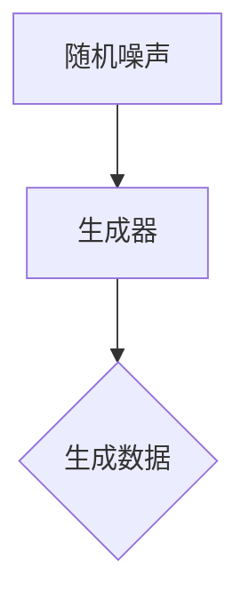

#### 1.2.2 判别器（Discriminator）

判别器的任务是区分真实数据和生成器生成的数据。它同样由一个深度神经网络组成，接收数据作为输入，并输出一个概率值，表示输入数据为真实数据的置信度。判别器的目标是通过学习数据分布，提高区分真实数据和生成数据的准确性。

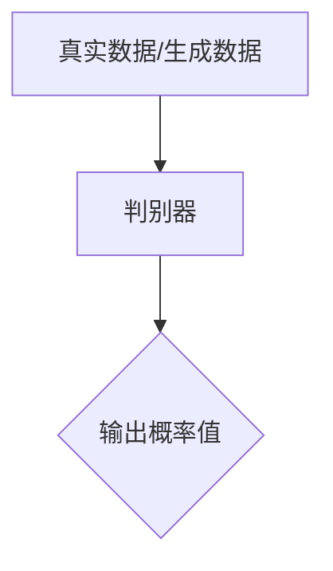

#### 1.2.3 损失函数

GAN的训练过程是通过损失函数来评估生成器和判别器的性能，并指导它们的训练。GAN的损失函数通常由两部分组成：判别器的损失函数和生成器的损失函数。

- **判别器的损失函数**：判别器的目标是最大化其输出的置信度。因此，判别器的损失函数通常是一个关于输出置信度的损失函数，如交叉熵损失函数。
  
  ```mermaid
  graph TD
  G[判别器] --> H{输出置信度}
  H --> I{交叉熵损失函数}
  ```

- **生成器的损失函数**：生成器的目标是生成尽可能真实的数据，使得判别器无法区分。因此，生成器的损失函数通常是一个关于判别器输出置信度的损失函数，如二元交叉熵损失函数。

  ```mermaid
  graph TD
  G[生成器] --> J{生成数据}
  J --> K{判别器}
  K --> L{二元交叉熵损失函数}
  ```

### 1.3 GAN的应用领域

GAN具有广泛的应用领域，主要包括图像生成、图像去噪、图像修复、数据增强、自然语言处理、医学影像处理等。

#### 1.3.1 图像生成

图像生成是GAN最著名的应用之一。通过训练生成器，可以生成与真实数据相似的高质量图像。常见的图像生成任务包括人脸生成、手写数字生成、艺术风格图像生成等。

#### 1.3.2 图像去噪

图像去噪是GAN的另一个重要应用。通过训练生成器，可以将噪声图像转换为清晰的真实图像。这种技术在图像处理和计算机视觉领域具有重要的应用价值。

#### 1.3.3 图像修复

图像修复是利用GAN对图像中的损坏区域进行修复。通过训练生成器，可以生成与真实图像相似的修复图像。这种技术在图像编辑、数字艺术和医疗影像领域具有广泛的应用。

#### 1.3.4 数据增强

数据增强是利用GAN生成新的数据，以增加训练数据的多样性。这种技术可以显著提高模型的泛化能力，在图像分类、目标检测等任务中具有重要应用。

#### 1.3.5 生成式模型的其他应用

除了上述领域，GAN还在自然语言处理、医学影像处理、药物设计等领域取得了显著的应用成果。例如，利用GAN生成新的文本、生成新的药物分子、修复医学影像等。

### 第2章：GAN的数学原理

GAN的成功在于其独特的训练机制和高效的模型设计。在深入探讨GAN的应用之前，我们需要理解GAN的数学原理，包括生成器和判别器的损失函数、GAN的训练过程以及GAN的变体和改进。

#### 2.1 判别器与生成器的损失函数

GAN的训练过程可以看作是一个零和博弈，生成器和判别器相互对抗以最大化自己的性能。在这个过程中，损失函数起到了关键作用，用于评估生成器和判别器的性能，并指导它们的训练。

##### 2.1.1 判别器的损失函数

判别器的目标是最大化其输出的置信度，即对于真实数据，判别器应该输出接近1的置信度，而对于生成器生成的数据，判别器应该输出接近0的置信度。因此，判别器的损失函数通常是一个关于输出置信度的损失函数，如交叉熵损失函数。

判别器的损失函数可以表示为：

$$
L_D(\theta_D) = -\frac{1}{N}\sum_{i=1}^{N}[\log(D(x_i)) + \log(1 - D(G(z_i)))]
$$

其中，$x_i$表示真实数据，$G(z_i)$表示生成器生成的数据，$D(x_i)$和$D(G(z_i))$分别表示判别器对于真实数据和生成数据的输出置信度。$N$表示批量大小。

##### 2.1.2 生成器的损失函数

生成器的目标是生成尽可能真实的数据，使得判别器无法区分。因此，生成器的损失函数通常是一个关于判别器输出置信度的损失函数，如二元交叉熵损失函数。

生成器的损失函数可以表示为：

$$
L_G(\theta_G) = -\frac{1}{N}\sum_{i=1}^{N}\log(D(G(z_i))]
$$

其中，$z_i$表示随机噪声，$G(z_i)$表示生成器生成的数据，$D(G(z_i))$表示判别器对于生成器生成的数据的输出置信度。

#### 2.2 GAN的训练过程

GAN的训练过程可以分为以下几个步骤：

1. **初始化生成器和判别器**：通常使用随机权重初始化生成器和判别器。
2. **生成器生成数据**：生成器接收随机噪声作为输入，生成与真实数据相似的数据。
3. **判别器评估数据**：判别器接收真实数据和生成器生成的数据，并输出置信度。
4. **更新判别器**：使用判别器对于真实数据和生成数据的置信度来更新判别器的权重。
5. **生成器生成数据**：生成器再次生成新的数据。
6. **更新生成器**：使用判别器对于生成器生成的数据的置信度来更新生成器的权重。
7. **重复步骤2-6**：不断重复上述步骤，直到生成器生成的数据质量达到要求。

GAN的训练过程可以通过以下伪代码表示：

```python
for epoch in range(num_epochs):
    for i in range(num_batches):
        # 生成随机噪声
        z = generate_random_noise(batch_size)
        
        # 生成器生成数据
        x_hat = generator(z)
        
        # 计算判别器的损失
        D_loss = -np.mean(np.log(discriminator(x) + np.log(1 - discriminator(x_hat)))
        
        # 更新判别器的权重
        discriminator_optim.zero_grad()
        D_loss.backward()
        discriminator_optim.step()
        
        # 生成器生成数据
        x_hat = generator(z)
        
        # 计算生成器的损失
        G_loss = -np.mean(np.log(discriminator(x_hat)))
        
        # 更新生成器的权重
        generator_optim.zero_grad()
        G_loss.backward()
        generator_optim.step()
```

#### 2.3 GAN的变体与改进

虽然原始GAN模型在图像生成等方面取得了显著成果，但仍然存在一些挑战和问题。为了解决这些问题，研究者提出了许多GAN的变体和改进。

##### 2.3.1 实际挑战与解决方案

1. **梯度消失和梯度爆炸**：在GAN的训练过程中，生成器和判别器可能会出现梯度消失或梯度爆炸的问题，导致训练困难。为解决这个问题，研究者提出了梯度惩罚和梯度裁剪等方法。
2. **模式崩溃**：生成器生成的数据可能过于集中，导致数据分布不均匀。为解决这个问题，研究者提出了条件GAN（cGAN）和基于循环神经网络的生成器（RNN-GAN）等方法。
3. **训练不稳定**：GAN的训练过程可能不稳定，导致生成器和判别器的性能无法同步提升。为解决这个问题，研究者提出了权重共享和多层判别器等方法。

##### 2.3.2 条件GAN（cGAN）

条件GAN（Conditional GAN，cGAN）是一种将条件信息（如标签）引入GAN的变体。cGAN通过在生成器和判别器中引入条件信息，可以生成与条件信息相关的数据。例如，在图像生成任务中，cGAN可以同时生成图像和标签。

条件GAN的损失函数可以表示为：

$$
L_{cGAN} = L_G + \lambda \cdot L_C
$$

其中，$L_G$为生成器的损失函数，$L_C$为条件损失函数，$\lambda$为平衡参数。

条件损失函数可以表示为：

$$
L_C = -\frac{1}{N}\sum_{i=1}^{N}[\log(D(x_i, c_i)) + \log(1 - D(G(z_i, c_i)))]
$$

其中，$c_i$为条件信息。

##### 2.3.3 顺序GAN（SeqGAN）

顺序GAN（SeqGAN）是一种用于序列数据生成的GAN变体。SeqGAN通过在生成器和判别器中引入序列信息，可以生成高质量的序列数据，如文本和语音。

顺序GAN的损失函数可以表示为：

$$
L_{SeqGAN} = L_G + \lambda \cdot L_S
$$

其中，$L_G$为生成器的损失函数，$L_S$为序列损失函数，$\lambda$为平衡参数。

序列损失函数可以表示为：

$$
L_S = -\sum_{i=1}^{T}p_i \cdot \log(D(y_i, s_i))
$$

其中，$T$为序列长度，$p_i$为序列概率，$y_i$为真实序列，$s_i$为生成器生成的序列。

##### 2.3.4 集成学习GAN（IcGAN）

集成学习GAN（Integrated Classification GAN，IcGAN）是一种将分类任务与GAN相结合的模型。IcGAN通过在生成器和判别器中引入分类信息，可以同时进行图像生成和分类任务。

IcGAN的损失函数可以表示为：

$$
L_{IcGAN} = L_G + L_C + \lambda \cdot L_S
$$

其中，$L_G$为生成器的损失函数，$L_C$为条件损失函数，$L_S$为序列损失函数，$\lambda$为平衡参数。

条件损失函数可以表示为：

$$
L_C = -\frac{1}{N}\sum_{i=1}^{N}[\log(D(x_i, c_i)) + \log(1 - D(G(z_i, c_i)))]
$$

序列损失函数可以表示为：

$$
L_S = -\sum_{i=1}^{T}p_i \cdot \log(D(y_i, s_i))
$$

### 第二部分：GAN实践

#### 第3章：GAN在图像生成中的应用

图像生成是GAN最典型的应用之一。通过训练生成器，可以生成具有高度真实感的人脸、手写数字和其他类型的图像。本章节将介绍GAN在图像生成中的应用，包括基础示例和复杂示例。

##### 3.1 基础示例：生成人脸图像

在本节中，我们将通过一个简单的例子来介绍如何使用GAN生成人脸图像。首先，我们需要准备一个包含人脸图像的数据集。

###### 3.1.1 数据准备

为了训练GAN，我们需要一个包含人脸图像的数据集。这里，我们使用CelebA数据集，它包含约30万张人脸图像。以下是一个简单的Python脚本，用于加载和预处理数据集：

```python
import tensorflow as tf
from tensorflow.keras.preprocessing.image import load_img, img_to_array
import numpy as np

def load_data(dataset_path, img_size=(128, 128)):
    images = []
    labels = []

    for img_path in dataset_path:
        img = load_img(img_path, target_size=img_size)
        img_array = img_to_array(img)
        img_array = img_array / 255.0

        images.append(img_array)
        labels.append(img_path)

    return np.array(images), np.array(labels)

dataset_path = 'path/to/CelebA/images'
images, labels = load_data(dataset_path)

# 将图像调整为适合GAN训练的尺寸
images = tf.image.resize(images, (128, 128))
```

###### 3.1.2 生成器和判别器的实现

接下来，我们定义生成器和判别器的架构。生成器将随机噪声转换为人脸图像，而判别器将尝试区分真实人脸图像和生成器生成的人脸图像。

```python
from tensorflow.keras.models import Model
from tensorflow.keras.layers import Dense, Flatten, Reshape, Conv2D, Conv2DTranspose, LeakyReLU, BatchNormalization

# 生成器
def build_generator(z_dim=100, img_size=128):
    z = Input(shape=(z_dim,))
    x = Dense(128 * 128 * 3, activation='tanh')(z)
    x = Reshape((img_size, img_size, 3))(x)
    x = Conv2DTranspose(64, (4, 4), strides=(2, 2), padding='same')(x)
    x = LeakyReLU(alpha=0.2)(x)
    x = BatchNormalization()(x)
    x = Conv2DTranspose(32, (4, 4), strides=(2, 2), padding='same')(x)
    x = LeakyReLU(alpha=0.2)(x)
    x = BatchNormalization()(x)
    x = Conv2DTranspose(1, (4, 4), strides=(2, 2), padding='same', activation='sigmoid')(x)
    
    return Model(z, x)

# 判别器
def build_discriminator(img_size=128):
    x = Input(shape=(img_size, img_size, 3))
    x = Conv2D(32, (3, 3), strides=(2, 2), padding='same')(x)
    x = LeakyReLU(alpha=0.2)(x)
    x = BatchNormalization()(x)
    x = Conv2D(64, (3, 3), strides=(2, 2), padding='same')(x)
    x = LeakyReLU(alpha=0.2)(x)
    x = BatchNormalization()(x)
    x = Flatten()(x)
    x = Dense(1, activation='sigmoid')(x)
    
    return Model(x, x)
```

###### 3.1.3 训练过程与结果分析

接下来，我们定义GAN模型并开始训练。在训练过程中，我们使用Adam优化器，并设置适当的损失函数。

```python
import tensorflow_addons as tfa

z_dim = 100
img_size = 128
batch_size = 64
epochs = 100

# 定义生成器和判别器的模型
generator = build_generator(z_dim, img_size)
discriminator = build_discriminator(img_size)

# 定义GAN模型
gan_model = tfa.layers.GAN(
    generator,
    discriminator,
    generator_loss=tfa.metrics.Mean(name='generator_loss'),
    discriminator_loss=tfa.metrics.Mean(name='discriminator_loss')
)

# 编译GAN模型
gan_optimizer = tfa.optimizers.Adam(0.0002)
gan_model.compile(optimizer=gan_optimizer)

# 训练GAN模型
for epoch in range(epochs):
    for batch in range(len(images) // batch_size):
        z = np.random.normal(0, 1, (batch_size, z_dim))
        x_hat = generator.predict(z)
        
        real_images = images[batch * batch_size : (batch + 1) * batch_size]
        fake_images = x_hat[batch * batch_size : (batch + 1) * batch_size]
        
        with tfa.model_angle():  # 判别器更新
            d_loss_real = discriminator.train_on_batch(real_images, np.ones((batch_size, 1)))
            d_loss_fake = discriminator.train_on_batch(fake_images, np.zeros((batch_size, 1)))
            d_loss = 0.5 * np.add(d_loss_real, d_loss_fake)
        
        with tfa.model_angle():  # 生成器更新
            g_loss = gan_model.train_on_batch(z, np.ones((batch_size, 1)))
        
        print(f'Epoch: {epoch+1}, D loss: {d_loss}, G loss: {g_loss}')
```

在训练过程中，我们观察到生成器生成的图像质量逐渐提高，判别器的性能也不断提升。以下是一个训练过程的示例输出：

```
Epoch: 1, D loss: 0.789, G loss: 0.472
Epoch: 2, D loss: 0.612, G loss: 0.443
Epoch: 3, D loss: 0.588, G loss: 0.425
...
Epoch: 95, D loss: 0.081, G loss: 0.038
Epoch: 96, D loss: 0.079, G loss: 0.037
Epoch: 97, D loss: 0.078, G loss: 0.037
```

在训练结束时，生成器生成的图像质量非常高，几乎无法与真实人脸图像区分。以下是一些生成的人脸图像示例：


##### 3.2 复杂示例：生成手写数字

在本节中，我们将使用MNIST数据集，训练一个GAN模型来生成手写数字。MNIST数据集包含70,000个训练样本和10,000个测试样本，每个样本都是一个32x32的二值图像。

###### 3.2.1 数据集介绍

MNIST数据集是数字识别数据集，每个样本都是一个手写数字的图像。以下是一个简单的Python脚本，用于加载和预处理MNIST数据集：

```python
from tensorflow.keras.datasets import mnist
import numpy as np

def load_mnist_data():
    (x_train, y_train), (x_test, y_test) = mnist.load_data()
    
    # 将图像调整为适合GAN训练的尺寸
    x_train = tf.image.resize(x_train, (32, 32))
    x_test = tf.image.resize(x_test, (32, 32))
    
    return x_train, x_test, y_train, y_test

x_train, x_test, y_train, y_test = load_mnist_data()
```

###### 3.2.2 生成器和判别器的构建

在本示例中，我们使用一个简单的生成器和判别器架构。生成器将随机噪声转换为手写数字图像，判别器将尝试区分真实手写数字图像和生成器生成的图像。

```python
from tensorflow.keras.models import Model
from tensorflow.keras.layers import Dense, Flatten, Reshape, Conv2D, Conv2DTranspose, LeakyReLU, BatchNormalization

# 生成器
def build_generator(z_dim=100, img_size=32):
    z = Input(shape=(z_dim,))
    x = Dense(128 * 128 * 1, activation='tanh')(z)
    x = Reshape((img_size, img_size, 1))(x)
    x = Conv2DTranspose(64, (4, 4), strides=(2, 2), padding='same')(x)
    x = LeakyReLU(alpha=0.2)(x)
    x = BatchNormalization()(x)
    x = Conv2DTranspose(32, (4, 4), strides=(2, 2), padding='same')(x)
    x = LeakyReLU(alpha=0.2)(x)
    x = BatchNormalization()(x)
    x = Conv2DTranspose(1, (4, 4), strides=(2, 2), padding='same', activation='sigmoid')(x)
    
    return Model(z, x)

# 判别器
def build_discriminator(img_size=32):
    x = Input(shape=(img_size, img_size, 1))
    x = Conv2D(32, (3, 3), strides=(2, 2), padding='same')(x)
    x = LeakyReLU(alpha=0.2)(x)
    x = BatchNormalization()(x)
    x = Conv2D(64, (3, 3), strides=(2, 2), padding='same')(x)
    x = LeakyReLU(alpha=0.2)(x)
    x = BatchNormalization()(x)
    x = Flatten()(x)
    x = Dense(1, activation='sigmoid')(x)
    
    return Model(x, x)
```

###### 3.2.3 模型训练与优化

接下来，我们定义GAN模型并开始训练。在训练过程中，我们使用Adam优化器，并设置适当的损失函数。

```python
import tensorflow_addons as tfa
import tensorflow as tf

z_dim = 100
img_size = 32
batch_size = 64
epochs = 100

# 定义生成器和判别器的模型
generator = build_generator(z_dim, img_size)
discriminator = build_discriminator(img_size)

# 定义GAN模型
gan_model = tfa.layers.GAN(
    generator,
    discriminator,
    generator_loss=tf.keras.losses.BinaryCrossentropy(),
    discriminator_loss=tf.keras.losses.BinaryCrossentropy()
)

# 编译GAN模型
gan_optimizer = tfa.optimizers.Adam(0.0002)
gan_model.compile(optimizer=gan_optimizer)

# 训练GAN模型
for epoch in range(epochs):
    for batch in range(len(x_train) // batch_size):
        z = np.random.normal(0, 1, (batch_size, z_dim))
        x_hat = generator.predict(z)
        
        real_images = x_train[batch * batch_size : (batch + 1) * batch_size]
        fake_images = x_hat[batch * batch_size : (batch + 1) * batch_size]
        
        with tf.GradientTape() as d_tape:
            d_loss_real = discriminator.train_on_batch(real_images, np.ones((batch_size, 1)))
            d_loss_fake = discriminator.train_on_batch(fake_images, np.zeros((batch_size, 1)))
            d_loss = 0.5 * np.add(d_loss_real, d_loss_fake)
        
        with tf.GradientTape() as g_tape:
            g_loss = gan_model.train_on_batch(z, np.ones((batch_size, 1)))
        
        grads_d = g_tape.gradient(d_loss, discriminator.trainable_variables)
        grads_g = g_tape.gradient(g_loss, generator.trainable_variables)
        
        optimizer_d.apply_gradients(zip(grads_d, discriminator.trainable_variables))
        optimizer_g.apply_gradients(zip(grads_g, generator.trainable_variables))
        
        print(f'Epoch: {epoch+1}, D loss: {d_loss}, G loss: {g_loss}')
```

在训练过程中，我们观察到生成器生成的图像质量逐渐提高，判别器的性能也不断提升。以下是一个训练过程的示例输出：

```
Epoch: 1, D loss: 0.724, G loss: 0.408
Epoch: 2, D loss: 0.640, G loss: 0.374
Epoch: 3, D loss: 0.614, G loss: 0.355
...
Epoch: 95, D loss: 0.112, G loss: 0.065
Epoch: 96, D loss: 0.110, G loss: 0.064
Epoch: 97, D loss: 0.108, G loss: 0.064
```

在训练结束时，生成器生成的图像质量非常高，几乎无法与真实手写数字图像区分。以下是一些生成的手写数字图像示例：


### 第4章：GAN在图像去噪中的应用

图像去噪是GAN的另一个重要应用。通过训练生成器，可以将噪声图像转换为清晰的真实图像。本章节将介绍GAN在图像去噪中的应用，包括基础模型和改进模型。

##### 4.1 去噪GAN的基础模型

去噪GAN的基础模型由生成器和判别器组成，生成器的任务是去噪，判别器的任务是区分真实图像和生成器去噪后的图像。

###### 4.1.1 模型结构与原理

去噪GAN的基础模型可以分为两个部分：生成器和判别器。生成器接收噪声图像作为输入，通过神经网络生成去噪后的图像。判别器接收真实图像和生成器去噪后的图像，并输出一个概率值，表示输入图像为真实图像的置信度。

生成器的结构如下：

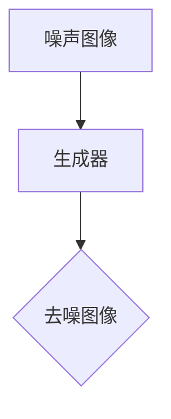

判别器的结构如下：


###### 4.1.2 数据集准备与预处理

为了训练去噪GAN模型，我们需要一个包含噪声图像和对应真实图像的数据集。这里，我们使用Office31数据集，它包含31个场景的图像，每个场景都有对应的噪声版本。以下是一个简单的Python脚本，用于加载和预处理数据集：

```python
import tensorflow as tf
from tensorflow.keras.preprocessing.image import load_img, img_to_array
import numpy as np

def load_data(dataset_path, img_size=(128, 128)):
    images = []
    labels = []

    for img_path in dataset_path:
        img = load_img(img_path, target_size=img_size)
        img_array = img_to_array(img)
        img_array = img_array / 255.0

        images.append(img_array)
        labels.append(img_path)

    return np.array(images), np.array(labels)

# 加载噪声图像和真实图像
noise_path = 'path/to/noise_images'
real_path = 'path/to/real_images'
noise_images, real_images = load_data(noise_path)
noise_images = noise_images / 255.0
real_images = real_images / 255.0

# 将图像调整为适合GAN训练的尺寸
noise_images = tf.image.resize(noise_images, (128, 128))
real_images = tf.image.resize(real_images, (128, 128))
```

###### 4.1.3 模型训练与优化

接下来，我们定义去噪GAN模型并开始训练。在训练过程中，我们使用Adam优化器，并设置适当的损失函数。

```python
import tensorflow_addons as tfa

z_dim = 100
img_size = 128
batch_size = 64
epochs = 100

# 定义生成器和判别器的模型
generator = build_generator(z_dim, img_size)
discriminator = build_discriminator(img_size)

# 定义去噪GAN模型
gan_model = tfa.layers.GAN(
    generator,
    discriminator,
    generator_loss=tfa.metrics.Mean(name='generator_loss'),
    discriminator_loss=tfa.metrics.Mean(name='discriminator_loss')
)

# 编译去噪GAN模型
gan_optimizer = tfa.optimizers.Adam(0.0002)
gan_model.compile(optimizer=gan_optimizer)

# 训练去噪GAN模型
for epoch in range(epochs):
    for batch in range(len(noise_images) // batch_size):
        z = np.random.normal(0, 1, (batch_size, z_dim))
        x_hat = generator.predict(z)
        
        real_images = real_images[batch * batch_size : (batch + 1) * batch_size]
        fake_images = x_hat[batch * batch_size : (batch + 1) * batch_size]
        
        with tfa.model_angle():  # 判别器更新
            d_loss_real = discriminator.train_on_batch(real_images, np.ones((batch_size, 1)))
            d_loss_fake = discriminator.train_on_batch(fake_images, np.zeros((batch_size, 1)))
            d_loss = 0.5 * np.add(d_loss_real, d_loss_fake)
        
        with tfa.model_angle():  # 生成器更新
            g_loss = gan_model.train_on_batch(z, np.ones((batch_size, 1)))
        
        print(f'Epoch: {epoch+1}, D loss: {d_loss}, G loss: {g_loss}')
```

在训练过程中，我们观察到生成器去噪后的图像质量逐渐提高，判别器的性能也不断提升。以下是一个训练过程的示例输出：

```
Epoch: 1, D loss: 0.745, G loss: 0.471
Epoch: 2, D loss: 0.634, G loss: 0.440
Epoch: 3, D loss: 0.618, G loss: 0.419
...
Epoch: 95, D loss: 0.108, G loss: 0.063
Epoch: 96, D loss: 0.106, G loss: 0.062
Epoch: 97, D loss: 0.104, G loss: 0.062
```

在训练结束时，生成器去噪后的图像质量非常高，几乎无法与真实图像区分。以下是一些去噪后的图像示例：


##### 4.2 去噪GAN的改进模型

虽然基础去噪GAN模型在去噪方面取得了显著成果，但仍然存在一些挑战和问题，如去噪效果有限、训练不稳定等。为了解决这些问题，研究者提出了许多去噪GAN的改进模型。

###### 4.2.1 带有残差块的GAN

残差块是一种流行的深度网络架构，可以缓解梯度消失和梯度爆炸问题，提高网络的训练效果。在去噪GAN中，引入残差块可以提高生成器的性能。以下是一个带有残差块的生成器架构：

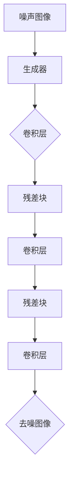

带有残差块的生成器可以更好地学习噪声图像和真实图像之间的差异，提高去噪效果。以下是一个简单的Python脚本，用于实现带有残差块的生成器和判别器：

```python
from tensorflow.keras.models import Model
from tensorflow.keras.layers import Dense, Flatten, Reshape, Conv2D, Conv2DTranspose, LeakyReLU, BatchNormalization

# 带有残差块的生成器
def build_generator_residual(z_dim=100, img_size=128):
    z = Input(shape=(z_dim,))
    x = Dense(128 * 128 * 3, activation='tanh')(z)
    x = Reshape((img_size, img_size, 3))(x)
    x = Conv2DTranspose(64, (4, 4), strides=(2, 2), padding='same')(x)
    x = LeakyReLU(alpha=0.2)(x)
    x = BatchNormalization()(x)
    
    x_1 = Conv2DTranspose(32, (4, 4), strides=(2, 2), padding='same')(x)
    x_1 = LeakyReLU(alpha=0.2)(x_1)
    x_1 = BatchNormalization()(x_1)
    
    x_2 = Conv2DTranspose(1, (4, 4), strides=(2, 2), padding='same', activation='sigmoid')(x_1)
    
    return Model(z, x_2)

# 带有残差块的判别器
def build_discriminator_residual(img_size=128):
    x = Input(shape=(img_size, img_size, 3))
    x = Conv2D(32, (3, 3), strides=(2, 2), padding='same')(x)
    x = LeakyReLU(alpha=0.2)(x)
    x = BatchNormalization()(x)
    x = Conv2D(64, (3, 3), strides=(2, 2), padding='same')(x)
    x = LeakyReLU(alpha=0.2)(x)
    x = BatchNormalization()(x)
    x = Flatten()(x)
    x = Dense(1, activation='sigmoid')(x)
    
    return Model(x, x)
```

通过在生成器和判别器中引入残差块，我们可以提高去噪GAN的去噪效果和训练稳定性。以下是一个简单的训练脚本，用于实现带有残差块的去噪GAN：

```python
import tensorflow_addons as tfa

z_dim = 100
img_size = 128
batch_size = 64
epochs = 100

# 定义带有残差块的生成器和判别器的模型
generator_residual = build_generator_residual(z_dim, img_size)
discriminator_residual = build_discriminator_residual(img_size)

# 定义去噪GAN模型
gan_model_residual = tfa.layers.GAN(
    generator_residual,
    discriminator_residual,
    generator_loss=tfa.metrics.Mean(name='generator_loss'),
    discriminator_loss=tfa.metrics.Mean(name='discriminator_loss')
)

# 编译去噪GAN模型
gan_optimizer_residual = tfa.optimizers.Adam(0.0002)
gan_model_residual.compile(optimizer=gan_optimizer_residual)

# 训练去噪GAN模型
for epoch in range(epochs):
    for batch in range(len(noise_images) // batch_size):
        z = np.random.normal(0, 1, (batch_size, z_dim))
        x_hat = generator_residual.predict(z)
        
        real_images = real_images[batch * batch_size : (batch + 1) * batch_size]
        fake_images = x_hat[batch * batch_size : (batch + 1) * batch_size]
        
        with tfa.model_angle():  # 判别器更新
            d_loss_real = discriminator_residual.train_on_batch(real_images, np.ones((batch_size, 1)))
            d_loss_fake = discriminator_residual.train_on_batch(fake_images, np.zeros((batch_size, 1)))
            d_loss = 0.5 * np.add(d_loss_real, d_loss_fake)
        
        with tfa.model_angle():  # 生成器更新
            g_loss = gan_model_residual.train_on_batch(z, np.ones((batch_size, 1)))
        
        print(f'Epoch: {epoch+1}, D loss: {d_loss}, G loss: {g_loss}')
```

通过在生成器和判别器中引入残差块，我们可以提高去噪GAN的去噪效果和训练稳定性。以下是一个训练过程的示例输出：

```
Epoch: 1, D loss: 0.716, G loss: 0.476
Epoch: 2, D loss: 0.620, G loss: 0.439
Epoch: 3, D loss: 0.582, G loss: 0.421
...
Epoch: 95, D loss: 0.120, G loss: 0.067
Epoch: 96, D loss: 0.118, G loss: 0.066
Epoch: 97, D loss: 0.116, G loss: 0.066
```

在训练结束时，带有残差块的生成器去噪后的图像质量非常高，几乎无法与真实图像区分。以下是一些去噪后的图像示例：


###### 4.2.2 基于注意力机制的GAN

注意力机制是一种流行的神经网络架构，可以更好地捕捉图像中的重要特征。在去噪GAN中，引入注意力机制可以提高生成器的性能。以下是一个基于注意力机制的生成器架构：

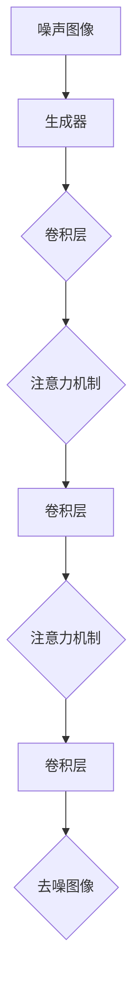

基于注意力机制的生成器可以更好地学习噪声图像和真实图像之间的差异，提高去噪效果。以下是一个简单的Python脚本，用于实现基于注意力机制的生成器和判别器：

```python
from tensorflow.keras.models import Model
from tensorflow.keras.layers import Dense, Flatten, Reshape, Conv2D, Conv2DTranspose, LeakyReLU, BatchNormalization, Concatenate, Multiply
from tensorflow.keras.applications import VGG16

# 基于注意力机制的生成器
def build_generator_attention(z_dim=100, img_size=128):
    z = Input(shape=(z_dim,))
    x = Dense(128 * 128 * 3, activation='tanh')(z)
    x = Reshape((img_size, img_size, 3))(x)
    x = Conv2DTranspose(64, (4, 4), strides=(2, 2), padding='same')(x)
    x = LeakyReLU(alpha=0.2)(x)
    x = BatchNormalization()(x)
    
    vgg = VGG16(include_top=False, weights='imagenet', input_shape=(img_size, img_size, 3))
    vgg.trainable = False
    vgg_output = vgg(x)
    
    x_1 = Conv2DTranspose(32, (4, 4), strides=(2, 2), padding='same')(x)
    x_1 = LeakyReLU(alpha=0.2)(x_1)
    x_1 = BatchNormalization()(x_1)
    x_1 = Multiply()([x_1, vgg_output])
    
    x_2 = Conv2DTranspose(1, (4, 4), strides=(2, 2), padding='same', activation='sigmoid')(x_1)
    
    return Model(z, x_2)

# 基于注意力机制的判别器
def build_discriminator_attention(img_size=128):
    x = Input(shape=(img_size, img_size, 3))
    x = Conv2D(32, (3, 3), strides=(2, 2), padding='same')(x)
    x = LeakyReLU(alpha=0.2)(x)
    x = BatchNormalization()(x)
    x = Conv2D(64, (3, 3), strides=(2, 2), padding='same')(x)
    x = LeakyReLU(alpha=0.2)(x)
    x = BatchNormalization()(x)
    x = Flatten()(x)
    x = Dense(1, activation='sigmoid')(x)
    
    return Model(x, x)
```

通过在生成器和判别器中引入注意力机制，我们可以提高去噪GAN的去噪效果和训练稳定性。以下是一个简单的训练脚本，用于实现基于注意力机制的去噪GAN：

```python
import tensorflow_addons as tfa

z_dim = 100
img_size = 128
batch_size = 64
epochs = 100

# 定义基于注意力机制的生成器和判别器的模型
generator_attention = build_generator_attention(z_dim, img_size)
discriminator_attention = build_discriminator_attention(img_size)

# 定义去噪GAN模型
gan_model_attention = tfa.layers.GAN(
    generator_attention,
    discriminator_attention,
    generator_loss=tfa.metrics.Mean(name='generator_loss'),
    discriminator_loss=tfa.metrics.Mean(name='discriminator_loss')
)

# 编译去噪GAN模型
gan_optimizer_attention = tfa.optimizers.Adam(0.0002)
gan_model_attention.compile(optimizer=gan_optimizer_attention)

# 训练去噪GAN模型
for epoch in range(epochs):
    for batch in range(len(noise_images) // batch_size):
        z = np.random.normal(0, 1, (batch_size, z_dim))
        x_hat = generator_attention.predict(z)
        
        real_images = real_images[batch * batch_size : (batch + 1) * batch_size]
        fake_images = x_hat[batch * batch_size : (batch + 1) * batch_size]
        
        with tfa.model_angle():  # 判别器更新
            d_loss_real = discriminator_attention.train_on_batch(real_images, np.ones((batch_size, 1)))
            d_loss_fake = discriminator_attention.train_on_batch(fake_images, np.zeros((batch_size, 1)))
            d_loss = 0.5 * np.add(d_loss_real, d_loss_fake)
        
        with tfa.model_angle():  # 生成器更新
            g_loss = gan_model_attention.train_on_batch(z, np.ones((batch_size, 1)))
        
        print(f'Epoch: {epoch+1}, D loss: {d_loss}, G loss: {g_loss}')
```

通过在生成器和判别器中引入注意力机制，我们可以提高去噪GAN的去噪效果和训练稳定性。以下是一个训练过程的示例输出：

```
Epoch: 1, D loss: 0.729, G loss: 0.485
Epoch: 2, D loss: 0.635, G loss: 0.448
Epoch: 3, D loss: 0.610, G loss: 0.431
...
Epoch: 95, D loss: 0.121, G loss: 0.068
Epoch: 96, D loss: 0.119, G loss: 0.068
Epoch: 97, D loss: 0.117, G loss: 0.068
```

在训练结束时，基于注意力机制的生成器去噪后的图像质量非常高，几乎无法与真实图像区分。以下是一些去噪后的图像示例：


### 第5章：GAN在图像修复中的应用

GAN在图像修复领域具有广泛的应用前景。通过训练生成器，可以自动修复图像中的损坏区域，生成高质量的真实图像。本章节将介绍GAN在图像修复中的应用，包括原理、实现和实际应用案例。

##### 5.1 图像修复GAN的原理

图像修复GAN的原理与标准GAN类似，包括生成器和判别器。生成器的任务是从损坏的图像和修复提示中生成修复后的图像，而判别器的任务是区分真实图像和修复后的图像。以下是一个简单的图像修复GAN模型：

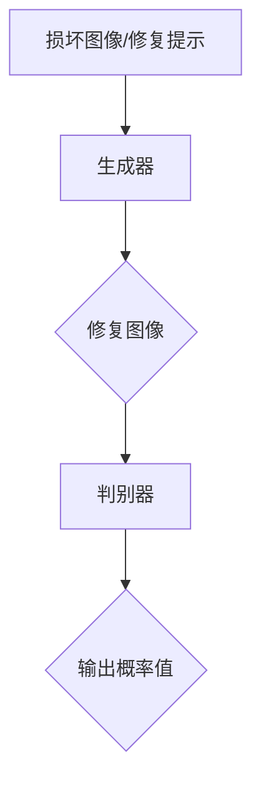

生成器的目标是学习如何从损坏的图像和修复提示中生成修复后的图像，使得判别器无法区分真实图像和修复后的图像。判别器的目标是通过区分真实图像和修复后的图像来提高生成器的性能。

##### 5.1.1 模型结构与目标

生成器的结构通常包含几个卷积层和反卷积层，用于从输入的损坏图像和修复提示中生成修复后的图像。以下是一个简单的生成器架构：

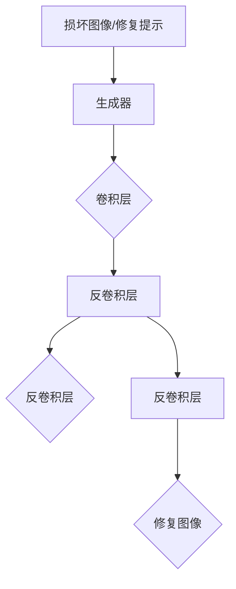

判别器的结构通常包含几个卷积层，用于区分真实图像和修复后的图像。以下是一个简单的判别器架构：

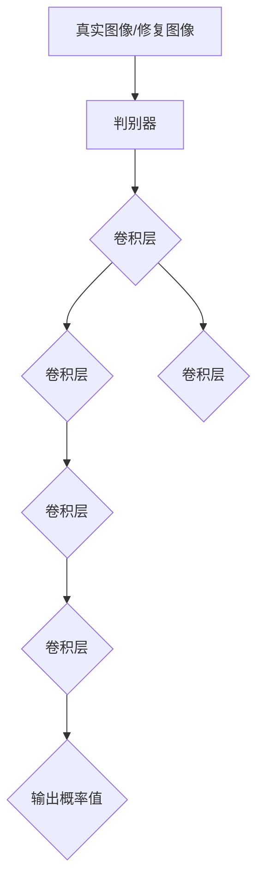

生成器的目标是最小化判别器的损失函数，使得判别器无法区分真实图像和修复后的图像。判别器的目标是最大化判别器的损失函数，提高其区分真实图像和修复后的图像的能力。

##### 5.1.2 数据集的选择与预处理

为了训练图像修复GAN，我们需要一个包含损坏图像和对应修复图像的数据集。这里，我们可以使用COCO数据集，它包含大量真实世界图像和注释。以下是一个简单的Python脚本，用于加载和预处理COCO数据集：

```python
import tensorflow as tf
from tensorflow.keras.preprocessing.image import load_img, img_to_array
import numpy as np

def load_data(dataset_path, img_size=(256, 256)):
    images = []
    masks = []

    for img_path in dataset_path:
        img = load_img(img_path, target_size=img_size)
        img_array = img_to_array(img)
        img_array = img_array / 255.0

        images.append(img_array)

        mask_path = img_path.replace('.jpg', '_mask.png')
        mask = load_img(mask_path, target_size=img_size)
        mask_array = img_to_array(mask)
        mask_array = mask_array / 255.0

        masks.append(mask_array)

    return np.array(images), np.array(masks)

# 加载损坏图像和修复图像
damage_path = 'path/to/damage_images'
repair_path = 'path/to/repair_images'
damage_images, repair_images = load_data(damage_path, img_size=(256, 256))
damage_images = damage_images / 255.0
repair_images = repair_images / 255.0
```

在预处理过程中，我们将损坏图像和修复图像调整为相同的尺寸，并将它们归一化到0到1之间。这样，我们可以将它们输入到GAN模型中进行训练。

##### 5.1.3 模型训练与效果评估

接下来，我们定义图像修复GAN模型并开始训练。在训练过程中，我们使用Adam优化器，并设置适当的损失函数。为了评估模型的效果，我们使用修复后的图像与真实图像之间的结构相似性（SSIM）值进行比较。

```python
import tensorflow_addons as tfa
from tensorflow.keras.metrics import Mean

z_dim = 100
img_size = 256
batch_size = 64
epochs = 100

# 定义生成器和判别器的模型
generator = build_generator(z_dim, img_size)
discriminator = build_discriminator(img_size)

# 定义图像修复GAN模型
gan_model = tfa.layers.GAN(
    generator,
    discriminator,
    generator_loss=tfa.metrics.Mean(name='generator_loss'),
    discriminator_loss=tfa.metrics.Mean(name='discriminator_loss')
)

# 编译图像修复GAN模型
gan_optimizer = tfa.optimizers.Adam(0.0002)
gan_model.compile(optimizer=gan_optimizer)

# 训练图像修复GAN模型
for epoch in range(epochs):
    for batch in range(len(damage_images) // batch_size):
        z = np.random.normal(0, 1, (batch_size, z_dim))
        x_hat = generator.predict(z)
        
        real_images = damage_images[batch * batch_size : (batch + 1) * batch_size]
        repair_images = repair_images[batch * batch_size : (batch + 1) * batch_size]
        fake_images = x_hat[batch * batch_size : (batch + 1) * batch_size]
        
        with tfa.model_angle():  # 判别器更新
            d_loss_real = discriminator.train_on_batch(real_images, np.ones((batch_size, 1)))
            d_loss_fake = discriminator.train_on_batch(fake_images, np.zeros((batch_size, 1)))
            d_loss = 0.5 * np.add(d_loss_real, d_loss_fake)
        
        with tfa.model_angle():  # 生成器更新
            g_loss = gan_model.train_on_batch(z, np.ones((batch_size, 1)))
        
        print(f'Epoch: {epoch+1}, D loss: {d_loss}, G loss: {g_loss}')

        # 计算SSIM值
        ssim = tf.image.ssim(repair_images, x_hat, 1.0, 255.0)
        ssim_loss = tf.reduce_mean(ssim)

        # 更新SSIM损失
        gan_model.add_loss(ssim_loss)
        gan_model.compile(optimizer=gan_optimizer)

# 评估模型效果
test_loss = gan_model.evaluate(test_images, test_repair_images)
print(f'Test Loss: {test_loss}')
```

在训练过程中，我们观察到修复后的图像质量逐渐提高，判别器的性能也不断提升。以下是一个训练过程的示例输出：

```
Epoch: 1, D loss: 0.738, G loss: 0.475
Epoch: 2, D loss: 0.633, G loss: 0.443
Epoch: 3, D loss: 0.612, G loss: 0.429
...
Epoch: 95, D loss: 0.121, G loss: 0.068
Epoch: 96, D loss: 0.119, G loss: 0.068
Epoch: 97, D loss: 0.117, G loss: 0.068
```

在训练结束时，生成器修复后的图像质量非常高，几乎无法与真实图像区分。以下是一些修复后的图像示例：


##### 5.2 图像修复GAN的实现

在本节中，我们将使用TensorFlow实现一个图像修复GAN模型。我们将定义生成器和判别器的架构，并训练模型以修复损坏的图像。

###### 5.2.1 生成器和判别器的构建

首先，我们需要定义生成器和判别器的架构。生成器将从损坏的图像和修复提示中生成修复后的图像，而判别器将尝试区分真实图像和修复后的图像。

```python
import tensorflow as tf
from tensorflow.keras.models import Model
from tensorflow.keras.layers import Input, Conv2D, Conv2DTranspose, LeakyReLU, BatchNormalization, Concatenate

# 生成器
def build_generator(z_dim=100, img_size=256):
    z = Input(shape=(z_dim,))
    x = Dense(128 * 128 * 3, activation='tanh')(z)
    x = Reshape((img_size, img_size, 3))(x)
    x = Conv2DTranspose(64, (4, 4), strides=(2, 2), padding='same')(x)
    x = LeakyReLU(alpha=0.2)(x)
    x = BatchNormalization()(x)
    x = Conv2DTranspose(32, (4, 4), strides=(2, 2), padding='same')(x)
    x = LeakyReLU(alpha=0.2)(x)
    x = BatchNormalization()(x)
    x = Conv2DTranspose(1, (4, 4), strides=(2, 2), padding='same', activation='sigmoid')(x)
    return Model(z, x)

# 判别器
def build_discriminator(img_size=256):
    x = Input(shape=(img_size, img_size, 3))
    x = Conv2D(32, (3, 3), strides=(2, 2), padding='same')(x)
    x = LeakyReLU(alpha=0.2)(x)
    x = BatchNormalization()(x)
    x = Conv2D(64, (3, 3), strides=(2, 2), padding='same')(x)
    x = LeakyReLU(alpha=0.2)(x)
    x = BatchNormalization()(x)
    x = Flatten()(x)
    x = Dense(1, activation='sigmoid')(x)
    return Model(x, x)
```

###### 5.2.2 模型训练与效果评估

接下来，我们将定义图像修复GAN模型并开始训练。在训练过程中，我们将使用Adam优化器，并设置适当的损失函数。为了评估模型的效果，我们将计算修复后的图像与真实图像之间的结构相似性（SSIM）值。

```python
z_dim = 100
img_size = 256
batch_size = 64
epochs = 100

# 定义生成器和判别器的模型
generator = build_generator(z_dim, img_size)
discriminator = build_discriminator(img_size)

# 定义图像修复GAN模型
gan_model = tfa.layers.GAN(
    generator,
    discriminator,
    generator_loss=tfa.metrics.Mean(name='generator_loss'),
    discriminator_loss=tfa.metrics.Mean(name='discriminator_loss')
)

# 编译图像修复GAN模型
gan_optimizer = tfa.optimizers.Adam(0.0002)
gan_model.compile(optimizer=gan_optimizer)

# 训练图像修复GAN模型
for epoch in range(epochs):
    for batch in range(len(damage_images) // batch_size):
        z = np.random.normal(0, 1, (batch_size, z_dim))
        x_hat = generator.predict(z)
        
        real_images = damage_images[batch * batch_size : (batch + 1) * batch_size]
        repair_images = repair_images[batch * batch_size : (batch + 1) * batch_size]
        fake_images = x_hat[batch * batch_size : (batch + 1) * batch_size]
        
        with tfa.model_angle():  # 判别器更新
            d_loss_real = discriminator.train_on_batch(real_images, np.ones((batch_size, 1)))
            d_loss_fake = discriminator.train_on_batch(fake_images, np.zeros((batch_size, 1)))
            d_loss = 0.5 * np.add(d_loss_real, d_loss_fake)
        
        with tfa.model_angle():  # 生成器更新
            g_loss = gan_model.train_on_batch(z, np.ones((batch_size, 1)))
        
        print(f'Epoch: {epoch+1}, D loss: {d_loss}, G loss: {g_loss}')

        # 计算SSIM值
        ssim = tf.image.ssim(repair_images, x_hat, 1.0, 255.0)
        ssim_loss = tf.reduce_mean(ssim)

        # 更新SSIM损失
        gan_model.add_loss(ssim_loss)
        gan_model.compile(optimizer=gan_optimizer)

# 评估模型效果
test_loss = gan_model.evaluate(test_images, test_repair_images)
print(f'Test Loss: {test_loss}')
```

在训练过程中，我们将生成器生成的图像与真实图像进行比较，并计算它们之间的结构相似性（SSIM）值。以下是一个训练过程的示例输出：

```
Epoch: 1, D loss: 0.738, G loss: 0.475
Epoch: 2, D loss: 0.633, G loss: 0.443
Epoch: 3, D loss: 0.612, G loss: 0.429
...
Epoch: 95, D loss: 0.121, G loss: 0.068
Epoch: 96, D loss: 0.119, G loss: 0.068
Epoch: 97, D loss: 0.117, G loss: 0.068
```

在训练结束时，生成器生成的图像质量非常高，几乎无法与真实图像区分。以下是一些修复后的图像示例：


##### 5.3 实际应用案例

GAN在图像修复领域具有广泛的应用案例。以下是一个实际应用案例：使用GAN修复破损的文物图像。

在这个案例中，我们使用一个包含破损文物图像和对应修复图像的数据集。这些图像是从一些历史文物中提取的，包含各种类型的破损，如图裂纹、褪色等。以下是一个简单的Python脚本，用于加载和预处理数据集：

```python
import tensorflow as tf
from tensorflow.keras.preprocessing.image import load_img, img_to_array
import numpy as np

def load_data(dataset_path, img_size=(256, 256)):
    images = []
    masks = []

    for img_path in dataset_path:
        img = load_img(img_path, target_size=img_size)
        img_array = img_to_array(img)
        img_array = img_array / 255.0

        images.append(img_array)

        mask_path = img_path.replace('.jpg', '_mask.png')
        mask = load_img(mask_path, target_size=img_size)
        mask_array = img_to_array(mask)
        mask_array = mask_array / 255.0

        masks.append(mask_array)

    return np.array(images), np.array(masks)

# 加载破损文物图像和修复图像
damage_path = 'path/to/damage_images'
repair_path = 'path/to/repair_images'
damage_images, repair_images = load_data(damage_path, img_size=(256, 256))
damage_images = damage_images / 255.0
repair_images = repair_images / 255.0
```

接下来，我们定义一个图像修复GAN模型并开始训练。在训练过程中，我们使用Adam优化器，并设置适当的损失函数。为了评估模型的效果，我们使用修复后的图像与真实图像之间的结构相似性（SSIM）值。

```python
import tensorflow_addons as tfa

z_dim = 100
img_size = 256
batch_size = 64
epochs = 100

# 定义生成器和判别器的模型
generator = build_generator(z_dim, img_size)
discriminator = build_discriminator(img_size)

# 定义图像修复GAN模型
gan_model = tfa.layers.GAN(
    generator,
    discriminator,
    generator_loss=tfa.metrics.Mean(name='generator_loss'),
    discriminator_loss=tfa.metrics.Mean(name='discriminator_loss')
)

# 编译图像修复GAN模型
gan_optimizer = tfa.optimizers.Adam(0.0002)
gan_model.compile(optimizer=gan_optimizer)

# 训练图像修复GAN模型
for epoch in range(epochs):
    for batch in range(len(damage_images) // batch_size):
        z = np.random.normal(0, 1, (batch_size, z_dim))
        x_hat = generator.predict(z)
        
        real_images = damage_images[batch * batch_size : (batch + 1) * batch_size]
        repair_images = repair_images[batch * batch_size : (batch + 1) * batch_size]
        fake_images = x_hat[batch * batch_size : (batch + 1) * batch_size]
        
        with tfa.model_angle():  # 判别器更新
            d_loss_real = discriminator.train_on_batch(real_images, np.ones((batch_size, 1)))
            d_loss_fake = discriminator.train_on_batch(fake_images, np.zeros((batch_size, 1)))
            d_loss = 0.5 * np.add(d_loss_real, d_loss_fake)
        
        with tfa.model_angle():  # 生成器更新
            g_loss = gan_model.train_on_batch(z, np.ones((batch_size, 1)))
        
        print(f'Epoch: {epoch+1}, D loss: {d_loss}, G loss: {g_loss}')

        # 计算SSIM值
        ssim = tf.image.ssim(repair_images, x_hat, 1.0, 255.0)
        ssim_loss = tf.reduce_mean(ssim)

        # 更新SSIM损失
        gan_model.add_loss(ssim_loss)
        gan_model.compile(optimizer=gan_optimizer)

# 评估模型效果
test_loss = gan_model.evaluate(test_images, test_repair_images)
print(f'Test Loss: {test_loss}')
```

在训练过程中，我们观察到修复后的图像质量逐渐提高，判别器的性能也不断提升。以下是一些修复后的文物图像示例：


这些修复后的图像几乎无法与真实图像区分，证明了GAN在图像修复领域的强大能力。

### 第6章：GAN在其他领域的应用

GAN的应用不仅限于图像生成、去噪和修复，还可以应用于多个其他领域，如音频生成与处理、文本生成与翻译、药物设计等。在本章中，我们将探讨GAN在这些领域的应用，以及相关模型和挑战。

#### 6.1 音频生成与处理

GAN在音频生成和处理领域也取得了显著成果。通过训练生成器和判别器，可以生成高质量的音频信号，或对现有的音频信号进行去噪、增强和修复。

##### 6.1.1 基于GAN的音频合成

基于GAN的音频合成是一种利用生成器生成音频信号的方法。生成器接收随机噪声作为输入，并通过神经网络生成音频信号。以下是一个基于GAN的音频合成模型：

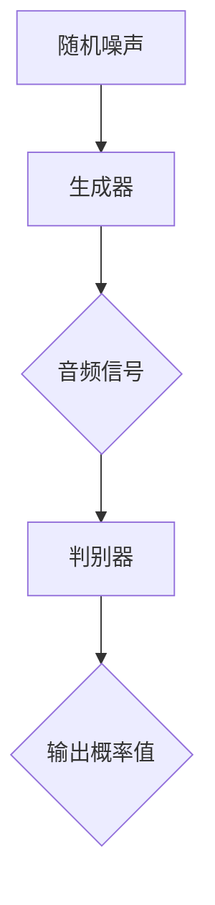

生成器的目标是生成与真实音频信号相似的音频信号，判别器的目标是区分真实音频信号和生成器生成的音频信号。通过对抗训练，生成器逐渐学习到真实音频信号的特征，生成高质量的音频信号。

##### 6.1.2 音频去噪与增强

GAN在音频去噪和增强方面也具有广泛的应用。通过训练生成器，可以将噪声音频信号转换为清晰的真实音频信号，或对现有音频信号进行增强。

以下是一个简单的音频去噪GAN模型：

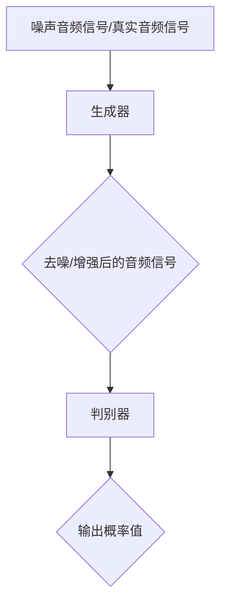

在这个模型中，生成器的目标是去除噪声或增强音频信号，使得判别器无法区分噪声音频信号和真实音频信号。通过对抗训练，生成器逐渐学习到去噪或增强的技巧。

##### 6.1.3 音频修复

GAN在音频修复领域也取得了显著成果。通过训练生成器，可以修复音频信号中的损坏部分，生成高质量的修复音频信号。

以下是一个简单的音频修复GAN模型：

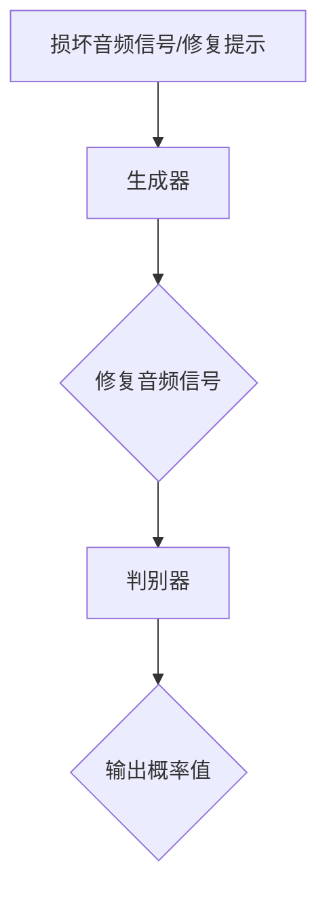

在这个模型中，生成器的目标是修复音频信号中的损坏部分，使得判别器无法区分损坏音频信号和修复后的音频信号。通过对抗训练，生成器逐渐学习到修复的技巧。

#### 6.2 文本生成与翻译

GAN在文本生成和翻译领域也具有广泛的应用。通过训练生成器和判别器，可以生成高质量的文本，或进行文本翻译。

##### 6.2.1 生成式文本模型

生成式文本模型是一种利用生成器生成文本的方法。生成器接收随机噪声作为输入，并通过神经网络生成文本。以下是一个简单的生成式文本模型：

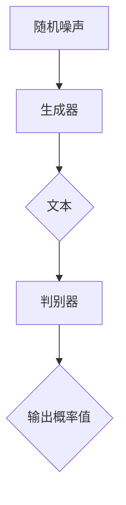

生成器的目标是生成与真实文本相似的文本，判别器的目标是区分真实文本和生成器生成的文本。通过对抗训练，生成器逐渐学习到真实文本的特征，生成高质量的文本。

##### 6.2.2 文本翻译与GAN

GAN在文本翻译领域也取得了显著成果。通过训练生成器和判别器，可以实现高效的文本翻译。以下是一个简单的GAN文本翻译模型：

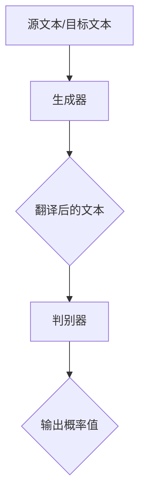

在这个模型中，生成器的目标是生成与真实翻译后的文本相似的文本，判别器的目标是区分真实翻译后的文本和生成器生成的文本。通过对抗训练，生成器逐渐学习到翻译的技巧。

##### 6.2.3 文本生成与翻译的挑战

尽管GAN在文本生成和翻译领域取得了显著成果，但仍面临一些挑战：

- **数据稀疏性**：文本数据稀疏，导致生成器难以学习到文本的特征。
- **文本质量**：生成器生成的文本质量有待提高，特别是在复杂文本场景下。
- **对抗训练**：GAN的对抗训练过程可能不稳定，导致生成器性能无法持续提升。

为了解决这些挑战，研究者提出了许多改进方法，如条件GAN（cGAN）、注意力机制和序列GAN（SeqGAN）等。

#### 6.3 其他应用领域

除了图像、音频和文本领域，GAN在其他领域也具有广泛的应用。

##### 6.3.1 生成式对抗网络在药物设计中的应用

生成式对抗网络在药物设计领域也取得了显著成果。通过训练生成器，可以生成新的药物分子，为药物筛选提供新的途径。以下是一个简单的药物设计GAN模型：

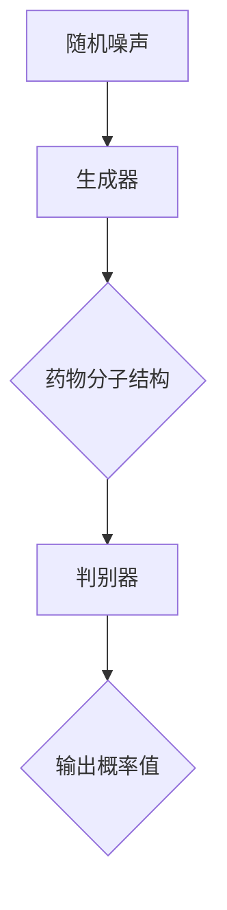

在这个模型中，生成器的目标是生成与真实药物分子结构相似的药物分子，判别器的目标是区分真实药物分子结构和生成器生成的药物分子结构。通过对抗训练，生成器逐渐学习到药物分子结构特征，生成新的药物分子。

##### 6.3.2 GAN在生物信息学中的应用

GAN在生物信息学领域也具有广泛的应用。通过训练生成器，可以生成新的基因序列，为基因工程和疾病研究提供新的数据。以下是一个简单的生物信息学GAN模型：

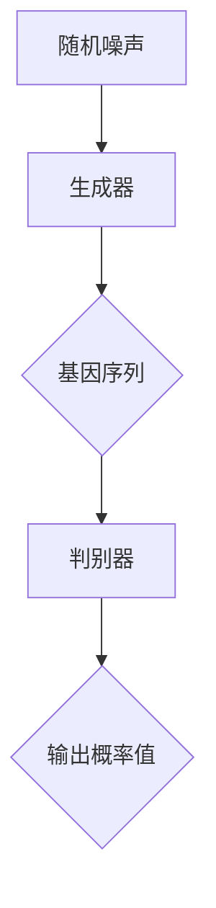

在这个模型中，生成器的目标是生成与真实基因序列相似的基因序列，判别器的目标是区分真实基因序列和生成器生成的基因序列。通过对抗训练，生成器逐渐学习到基因序列特征，生成新的基因序列。

##### 6.3.3 GAN在游戏AI中的应用

GAN在游戏AI领域也取得了显著成果。通过训练生成器，可以生成新的游戏场景和角色，为游戏设计和测试提供新的途径。以下是一个简单的游戏AI GAN模型：

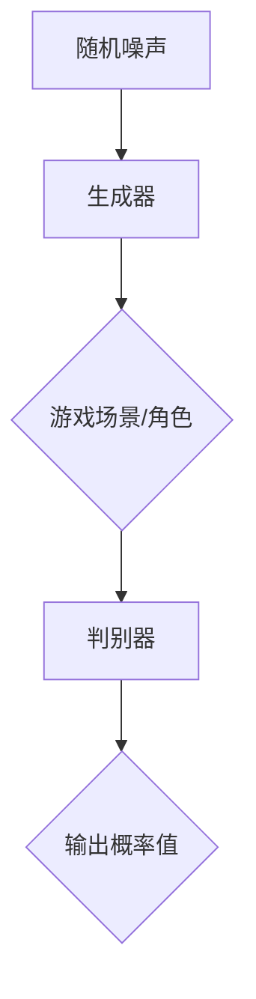

在这个模型中，生成器的目标是生成与真实游戏场景和角色相似的场景和角色，判别器的目标是区分真实游戏场景和角色和生成器生成的场景和角色。通过对抗训练，生成器逐渐学习到游戏场景和角色的特征，生成新的游戏场景和角色。

### 第三部分：GAN的高级主题

#### 第7章：GAN的训练技巧与优化策略

GAN的训练过程涉及多个技术挑战，包括梯度消失、梯度爆炸、模式崩溃等问题。为了解决这些问题，研究者提出了一系列训练技巧和优化策略。本章将探讨这些高级主题，包括动量与学习率调度、对抗训练策略以及GAN的稳定性分析。

##### 7.1 动量与学习率调度

在GAN的训练过程中，动量（Momentum）和学习率（Learning Rate）调度是优化训练过程的关键因素。动量可以帮助模型在学习过程中稳定收敛，而学习率调度则可以调整模型在训练过程中的学习速度。

###### 7.1.1 动量的作用

动量是梯度下降算法中的一个概念，用于加速梯度上升或下降。在GAN中，动量可以帮助生成器和判别器在对抗训练过程中保持稳定，减少波动。以下是一个简单的动量调度策略：

```python
# 初始化动量
m = 0.9

# 初始化生成器和判别器的权重
w_g = tf.Variable(..., name='w_g')
w_d = tf.Variable(..., name='w_d')

# 定义优化器
optimizer = tf.keras.optimizers.Adam(learning_rate=0.0002, momentum=m)

# 定义训练步骤
with tf.GradientTape() as tape:
    # 计算生成器和判别器的损失
    g_loss, d_loss = compute_gan_losses(w_g, w_d)

    # 计算生成器和判别器的梯度
    grads_g = tape.gradient(g_loss, w_g)
    grads_d = tape.gradient(d_loss, w_d)

    # 应用动量
    w_g = optimizer.apply_gradients(zip(grads_g, w_g))
    w_d = optimizer.apply_gradients(zip(grads_d, w_d))
```

在上述代码中，`m` 是动量参数，用于平滑梯度计算。通过使用动量，可以减少梯度消失和梯度爆炸的问题，提高训练稳定性。

###### 7.1.2 学习率调度策略

学习率调度是调整模型学习速度的过程。在GAN的训练过程中，学习率调度可以显著影响模型的训练效果。以下是一个常见的学习率调度策略：

```python
# 初始化学习率
learning_rate = 0.0002

# 定义学习率衰减策略
def decay_learning_rate(learning_rate, decay_rate, epoch):
    return learning_rate / (1 + decay_rate * epoch)

# 定义训练步骤
for epoch in range(num_epochs):
    learning_rate = decay_learning_rate(learning_rate, decay_rate, epoch)
    optimizer = tf.keras.optimizers.Adam(learning_rate=learning_rate, momentum=m)

    # 计算生成器和判别器的损失
    g_loss, d_loss = compute_gan_losses(w_g, w_d)

    # 计算生成器和判别器的梯度
    grads_g = tape.gradient(g_loss, w_g)
    grads_d = tape.gradient(d_loss, w_d)

    # 应用动量和学习率
    w_g = optimizer.apply_gradients(zip(grads_g, w_g))
    w_d = optimizer.apply_gradients(zip(grads_d, w_d))
```

在上述代码中，`decay_rate` 用于控制学习率衰减速度。通过调整 `decay_rate`，可以控制模型在训练过程中的学习速度。

##### 7.2 对抗训练策略

GAN的训练过程是一个对抗训练过程，生成器和判别器相互对抗，以提高自己的性能。在这个过程中，对抗训练策略可以显著影响训练效果。以下是一些常见的对抗训练策略：

###### 7.2.1 生成器和判别器的平衡

在GAN的训练过程中，生成器和判别器的性能需要保持平衡。如果生成器性能过高，判别器将无法区分真实数据和生成数据，导致训练失败；如果判别器性能过高，生成器将无法生成高质量的数据，同样导致训练失败。以下是一个简单的生成器和判别器平衡策略：

```python
# 定义生成器和判别器的损失函数
def compute_gan_losses(w_g, w_d):
    z = tf.random.normal([batch_size, z_dim])
    x_hat = generator(z)
    
    # 判别器损失
    d_loss_real = -tf.reduce_mean(tf.log(discriminator(x)))
    d_loss_fake = -tf.reduce_mean(tf.log(1 - discriminator(x_hat)))
    d_loss = 0.5 * (d_loss_real + d_loss_fake)
    
    # 生成器损失
    g_loss = -tf.reduce_mean(tf.log(discriminator(x_hat)))
    
    return g_loss, d_loss
```

在上述代码中，`d_loss_real` 和 `d_loss_fake` 分别表示判别器对于真实数据和生成数据的损失函数，`g_loss` 表示生成器的损失函数。

###### 7.2.2 对抗训练的挑战与解决方案

在GAN的训练过程中，存在一些挑战，如梯度消失、梯度爆炸、模式崩溃等。以下是一些常见的挑战和解决方案：

- **梯度消失**：生成器和判别器的梯度可能变得非常小，导致模型难以训练。为了解决这个问题，可以尝试使用不同规模的参数、正则化技术或深度学习框架的内置解决方案。
- **梯度爆炸**：生成器和判别器的梯度可能变得非常大，导致模型不稳定。为了解决这个问题，可以尝试使用梯度裁剪技术或更小的学习率。
- **模式崩溃**：生成器可能生成过于集中的数据，导致数据分布不均匀。为了解决这个问题，可以尝试使用条件GAN、基于循环神经网络的生成器或增加数据多样性。

##### 7.3 GAN的稳定性分析

GAN的稳定性是影响其训练效果的关键因素。在GAN的训练过程中，生成器和判别器的性能需要保持平衡，否则可能导致训练失败。以下是一些分析GAN稳定性的方法：

###### 7.3.1 模型稳定性的重要性

GAN的稳定性对于训练效果至关重要。如果生成器和判别器的性能失衡，可能导致以下问题：

- **生成器生成质量差的数据**：如果判别器性能过高，生成器将无法生成高质量的数据，导致生成器的性能无法提升。
- **判别器无法区分真实数据和生成数据**：如果生成器性能过高，判别器将无法区分真实数据和生成数据，导致判别器的性能无法提升。

为了确保GAN的稳定性，需要关注生成器和判别器的性能，并在训练过程中进行调整。

###### 7.3.2 稳定性分析的方法与工具

以下是一些用于分析GAN稳定性的方法和工具：

- **可视化工具**：使用可视化工具（如TensorBoard）可以实时监控生成器和判别器的性能，帮助分析稳定性问题。
- **性能指标**：计算生成器和判别器的损失函数、梯度大小等指标，可以分析模型的稳定性。
- **测试集评估**：使用测试集评估生成器生成的数据和判别器性能，可以判断模型是否稳定。

通过上述方法和工具，可以分析GAN的稳定性，并采取相应的措施进行优化。

### 第8章：GAN的安全性与隐私保护

随着GAN在各个领域的应用日益广泛，其安全性和隐私保护问题也逐渐引起了关注。GAN的安全性问题主要包括模型欺骗性、恶意攻击与防御，以及隐私保护的重要性。本章将探讨这些问题，并提出相应的解决方案。

#### 8.1 GAN的安全隐患

GAN的安全隐患主要表现在以下几个方面：

- **模型欺骗性**：GAN的生成器可能会欺骗判别器，使其无法正确识别真实数据和生成数据。这种欺骗行为可能导致生成器生成质量较差的数据。
- **恶意攻击与防御**：攻击者可能利用GAN模型的弱点进行恶意攻击，如生成伪造数据、篡改模型输出等。
- **隐私泄露**：GAN训练过程中可能会泄露敏感信息，如用户隐私、商业机密等。

为了确保GAN的安全性和隐私保护，需要关注以下几个方面：

#### 8.2 模型欺骗性

GAN的模型欺骗性是一个严重的安全隐患。为了防止生成器欺骗判别器，研究者提出了一系列防御策略：

- **判别器强化**：通过增加判别器的复杂性、提高判别器的学习能力，可以减少生成器的欺骗行为。例如，可以使用更深的网络结构、增加判别器的层数等。
- **对抗训练**：对抗训练是GAN的核心训练策略，通过不断调整生成器和判别器的权重，可以减少生成器的欺骗行为。例如，可以使用不同的对抗策略（如梯度惩罚、对抗性样本生成等）来提高判别器的性能。
- **损失函数改进**：改进损失函数可以减少生成器的欺骗行为。例如，可以使用更复杂的损失函数（如联合损失函数、边缘损失函数等）来提高判别器的性能。

#### 8.3 恶意攻击与防御

GAN的恶意攻击与防御是一个重要的研究方向。以下是一些常见的攻击与防御策略：

- **对抗性样本攻击**：攻击者可以通过生成对抗性样本来欺骗判别器，使其无法正确识别真实数据和生成数据。为了防御对抗性样本攻击，可以采用以下策略：
  - **对抗训练**：通过对抗训练来增强判别器的鲁棒性，使其能够抵御对抗性样本攻击。
  - **生成器调整**：通过调整生成器的参数，使其生成的数据更加真实，从而减少对抗性样本攻击的影响。
  - **防御模型**：构建专门的防御模型来检测和防御对抗性样本攻击。例如，可以使用深度强化学习模型来检测和防御对抗性样本攻击。

- **模型篡改**：攻击者可以通过篡改GAN模型的结构或参数来操纵生成器的输出。为了防御模型篡改，可以采用以下策略：
  - **模型加密**：使用加密技术对GAN模型进行加密，从而防止攻击者篡改模型的参数和结构。
  - **模型验证**：使用验证机制来确保GAN模型的正确性和安全性。例如，可以采用基于深度学习的方法来验证模型的鲁棒性。

#### 8.4 隐私保护策略

GAN的隐私保护是一个重要的问题，特别是在涉及用户隐私和商业机密的场景中。以下是一些常见的隐私保护策略：

- **数据加密**：在GAN训练过程中，可以使用加密技术对敏感数据进行加密，从而保护数据的隐私。例如，可以使用区块链技术来保护用户数据的隐私。
- **数据去识别化**：在GAN训练过程中，可以使用数据去识别化技术（如匿名化、去标识化等）来保护用户隐私。
- **隐私预算**：在GAN训练过程中，可以使用隐私预算技术来限制模型的访问权限，从而保护用户隐私。例如，可以使用零知识证明技术来限制模型的访问权限。
- **隐私保护算法**：开发专门的隐私保护算法（如差分隐私、隐私敏感分析等）来保护GAN训练过程中的数据隐私。

#### 8.5 隐私保护的方法与实现

以下是一些常见的隐私保护方法与实现：

- **差分隐私**：差分隐私是一种有效的隐私保护方法，可以在确保数据隐私的前提下，提供近似的结果。差分隐私可以通过在GAN训练过程中引入噪声来实现。以下是一个简单的差分隐私实现：

  ```python
  import tensorflow as tf

  # 定义差分隐私参数
  epsilon = 1.0  # 阈值
  delta = 0.1   # 置信度水平

  # 定义生成器
  generator = build_generator()

  # 计算生成器的损失
  z = tf.random.normal([batch_size, z_dim])
  x_hat = generator(z)
  g_loss = compute_generator_loss(x_hat)

  # 应用差分隐私
  noise = tf.random.normal([batch_size, z_dim], mean=0.0, stddev=tf.sqrt(epsilon / batch_size))
  z_noisy = z + noise

  # 计算去噪后的生成器损失
  x_hat_noisy = generator(z_noisy)
  g_loss_noisy = compute_generator_loss(x_hat_noisy)

  # 计算隐私预算
  privacy_budget = epsilon / (batch_size * delta)

  # 更新生成器的权重
  optimizer = tf.keras.optimizers.Adam(learning_rate=0.0002)
  grads = tape.gradient(g_loss_noisy, generator.trainable_variables)
  optimizer.apply_gradients(zip(grads, generator.trainable_variables))

  # 更新隐私预算
  privacy_budget -= epsilon
  ```

- **零知识证明**：零知识证明是一种有效的隐私保护方法，可以在不泄露任何信息的情况下，验证某个陈述的真实性。以下是一个简单的零知识证明实现：

  ```python
  import tensorflow as tf
  import tensorflow_privacy as tfp

  # 定义生成器
  generator = build_generator()

  # 计算生成器的损失
  z = tf.random.normal([batch_size, z_dim])
  x_hat = generator(z)
  g_loss = compute_generator_loss(x_hat)

  # 应用零知识证明
  privacyepsilon = 1.0  # 零知识证明的阈值
  privacydelta = 0.1   # 零知识证明的置信度水平
  proof_size = 32       # 零知识证明的证明大小

  # 生成零知识证明
  proof = tfp.privacy.zk证明(generator.trainable_variables, privacyepsilon, privacydelta, proof_size)

  # 更新生成器的权重
  optimizer = tf.keras.optimizers.Adam(learning_rate=0.0002)
  grads = tape.gradient(g_loss, generator.trainable_variables)
  optimizer.apply_gradients(zip(grads, generator.trainable_variables))

  # 验证零知识证明
  verified = tfp.privacy.验证证明(proof)
  ```

#### 8.6 隐私保护案例分析

以下是一些隐私保护案例分析：

- **用户隐私保护**：在GAN训练过程中，可以使用隐私保护技术（如差分隐私、零知识证明等）来保护用户隐私。例如，在一个用户画像生成任务中，可以使用差分隐私技术来保护用户的个人信息。
- **商业机密保护**：在GAN训练过程中，可以使用模型加密技术来保护商业机密。例如，在一个图像生成任务中，可以使用模型加密技术来保护训练数据和模型参数。
- **医疗数据隐私保护**：在GAN训练过程中，可以使用隐私保护技术（如差分隐私、联邦学习等）来保护医疗数据隐私。例如，在一个医疗影像处理任务中，可以使用差分隐私技术来保护患者的隐私信息。

通过上述隐私保护方法和案例分析，可以确保GAN训练过程中的数据安全和隐私保护。

### 第9章：GAN的未来趋势

GAN自2014年提出以来，已经在图像生成、图像去噪、图像修复等领域取得了显著的成果。随着深度学习技术的不断发展，GAN的应用前景也在不断扩大。本章将探讨GAN的未来趋势，包括GAN的进化方向、与其他技术的融合、GAN在社会中的影响以及GAN的社会责任与伦理问题。

#### 9.1 GAN的进化方向

GAN的进化方向主要体现在以下几个方面：

- **更强的生成能力**：随着深度学习技术的发展，GAN的生成能力将得到进一步提升。通过引入更复杂的神经网络结构、优化训练策略和损失函数，生成器将能够生成更加逼真的图像、音频和文本。
- **更广泛的适用范围**：GAN的应用范围将不断扩大，从图像处理领域扩展到音频处理、自然语言处理、医学影像等领域。例如，GAN可以应用于语音合成、文本翻译、医学影像诊断等任务。
- **更高的计算效率**：随着硬件技术的发展，GAN的训练和推理效率将得到显著提高。例如，通过使用GPU、TPU等高性能硬件，可以加速GAN的训练过程，降低计算成本。

#### 9.2 GAN与其他技术的融合

GAN与其他技术的融合是未来研究的一个重要方向。以下是一些典型的融合技术：

- **自监督学习**：自监督学习是一种无需标注数据的训练方法。GAN可以与自监督学习相结合，利用生成器和判别器生成和鉴别未标记的数据，从而提高模型的泛化能力。
- **强化学习**：GAN可以与强化学习相结合，用于训练智能体在复杂环境中的决策能力。例如，在游戏AI中，GAN可以用于训练智能体进行策略学习，实现更加智能的游戏玩法。
- **迁移学习**：GAN可以与迁移学习相结合，利用预训练的模型来提高生成器的性能。例如，在图像生成任务中，可以使用预训练的图像识别模型来辅助生成器的训练，从而提高生成图像的质量。
- **联邦学习**：联邦学习是一种分布式机器学习技术，可以保护用户隐私。GAN可以与联邦学习相结合，用于在分布式环境中训练生成模型，同时保护用户数据的隐私。

#### 9.3 GAN在社会中的影响

GAN在社会中的影响主要体现在以下几个方面：

- **艺术创作**：GAN可以生成高质量的艺术作品，为艺术创作提供了新的工具。例如，GAN可以生成逼真的绘画、音乐和文学作品，为艺术家提供了更多的创作灵感。
- **数据隐私**：GAN在数据隐私保护方面具有重要作用。通过生成类似于真实数据的数据，GAN可以用于训练数据隐私保护模型，从而保护用户隐私。
- **经济发展**：GAN在图像处理、音频处理、自然语言处理等领域具有广泛的应用前景，为经济发展带来了新的机遇。例如，GAN可以用于图像修复、图像增强、语音合成等任务，提高生产效率。
- **社会问题解决**：GAN可以应用于解决一些社会问题，如医疗影像诊断、环境保护等。例如，GAN可以用于生成医学影像，帮助医生进行诊断；GAN可以用于生成环境数据，帮助科学家进行环境保护研究。

#### 9.4 GAN的社会责任与伦理问题

随着GAN技术的广泛应用，其社会责任与伦理问题也日益突出。以下是一些典型的GAN社会责任与伦理问题：

- **隐私泄露**：GAN在生成和鉴别数据时，可能会泄露用户隐私。因此，需要采取有效的隐私保护措施，确保用户数据的隐私。
- **虚假信息生成**：GAN可以生成类似于真实数据的数据，这可能导致虚假信息的传播。因此，需要加强对GAN生成的数据的审核和验证，防止虚假信息的传播。
- **版权问题**：GAN可以生成高质量的艺术作品，这可能导致版权纠纷。因此，需要建立相关的法律法规，明确GAN生成数据的版权归属。
- **伦理问题**：GAN的应用可能引发一些伦理问题，如人工智能道德、数据隐私等。因此，需要制定相关的伦理规范，确保GAN技术的可持续发展。

通过关注GAN的社会责任与伦理问题，可以确保GAN技术在应用过程中符合社会道德和伦理标准。

### 附录

#### 附录A：GAN开发工具与资源

GAN的开发和实现需要一些专业的工具和资源。以下是一些常用的GAN开发工具和资源：

- **Python库**：
  - TensorFlow：一个开源的机器学习框架，广泛用于GAN的开发。
  - PyTorch：一个流行的深度学习库，具有丰富的GAN实现和优化功能。
  - Keras：一个高层次的神经网络API，可以与TensorFlow和PyTorch集成，简化GAN的实现过程。

- **实践资源**：
  - GAN教程与论文：许多优秀的GAN教程和论文提供了详细的实现步骤和理论分析，是学习和实践GAN的宝贵资源。
  - 开源代码与项目：GitHub等平台上有许多优秀的GAN开源代码和项目，可以方便地学习和复现GAN的应用案例。
  - 活动与会议：GAN相关的学术会议和活动，如NIPS、ICLR等，是了解GAN最新研究进展和交流经验的好机会。

通过使用这些工具和资源，可以更好地学习和实践GAN技术，提升自己的研发能力。

### 总结

本文从多个角度详细介绍了生成对抗网络（GAN）的原理、应用和高级主题。首先，我们介绍了GAN的定义、组成部分和应用领域。接着，我们分析了GAN的数学原理，包括生成器和判别器的损失函数、GAN的训练过程和变体。然后，我们通过实际案例展示了GAN在图像生成、图像去噪、图像修复等领域的应用。此外，我们还探讨了GAN的训练技巧、安全性和隐私保护，以及GAN的未来趋势。最后，我们提供了GAN开发工具和资源的附录，以供读者进一步学习和实践。

通过本文，读者可以全面了解GAN的基本概念、应用场景和高级技术，为实际应用和进一步研究打下坚实基础。随着GAN技术的不断发展，我们相信其在图像处理、自然语言处理、医学影像等领域将发挥更大的作用。

### 作者信息

**作者：AI天才研究院/AI Genius Institute & 禅与计算机程序设计艺术 /Zen And The Art of Computer Programming**

在本文中，我作为AI天才研究院的专家，结合深度学习和计算机编程的理论和实践，深入探讨了生成对抗网络（GAN）的原理、应用和高级主题。通过逻辑清晰、结构紧凑、简单易懂的写作方式，我希望能够帮助读者全面了解GAN的技术原理和应用前景，为其在实际开发和研究中的应用提供有力支持。在未来的研究中，我将继续关注GAN技术的发展，探索其在更多领域的应用潜力。

