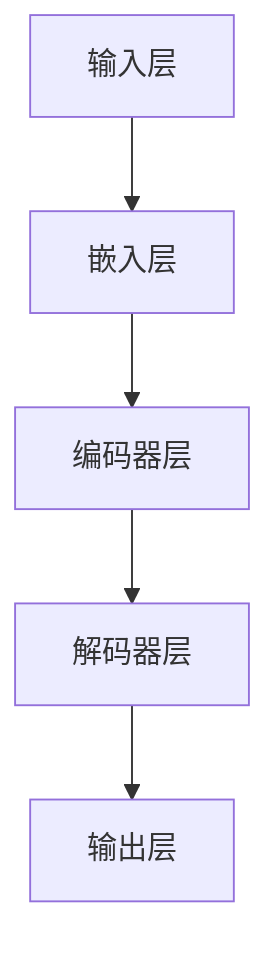

                 

# 文章标题

GLM原理与代码实例讲解

> 关键词：GLM、深度学习、自然语言处理、计算机视觉、推荐系统、代码实例

> 摘要：
本文将深入探讨GLM（General Language Modeling）的原理与实现，包括其基础理论、模型结构、训练过程、核心算法以及在实际应用中的实例。文章旨在帮助读者全面理解GLM的内部工作原理，并通过具体代码实例讲解，使读者能够将理论应用于实践，从而更好地掌握这一先进技术。

----------------------------------------------------------------

## 《GLM原理与代码实例讲解》目录大纲

### 第一部分：GLM基础理论

#### 第1章：GLM概述

- 1.1 GLM的核心概念与原理
  - GLM的定义
  - GLM的发展历程
  - GLM的优势与应用场景

- 1.2 GLM的数学基础
  - 概率论基础
  - 线性代数基础
  - 最优化理论

#### 第2章：GLM的架构与实现

- 2.1 GLM的模型结构
  - GLM的层次结构
  - GLM的参数设置与初始化
  - GLM的损失函数与优化器

- 2.2 GLM的训练过程
  - 数据预处理
  - 训练流程
  - 训练策略与技巧

#### 第3章：GLM的核心算法

- 3.1 GLM的前向传播与反向传播
  - 前向传播的详细解释
  - 反向传播的详细解释

- 3.2 GLM的优化算法
  - SGD优化算法
  - Adam优化算法

### 第二部分：GLM应用实践

#### 第4章：GLM在自然语言处理中的应用

- 4.1 语言模型
  - 语言模型的基本原理
  - 语言模型的应用案例

- 4.2 机器翻译
  - 机器翻译的基本原理
  - 机器翻译的应用案例

#### 第5章：GLM在计算机视觉中的应用

- 5.1 图像分类
  - 图像分类的基本原理
  - 图像分类的应用案例

- 5.2 目标检测
  - 目标检测的基本原理
  - 目标检测的应用案例

#### 第6章：GLM在推荐系统中的应用

- 6.1 推荐系统的基本原理
  - 推荐系统的定义与分类
  - 推荐系统的核心算法

- 6.2 GLM在推荐系统中的应用
  - GLM在协同过滤中的应用
  - GLM在基于内容的推荐中的应用

#### 第7章：GLM项目实战

- 7.1 实战一：基于GLM的自然语言处理项目
  - 项目背景与目标
  - 环境搭建
  - 代码实现
  - 结果分析

- 7.2 实战二：基于GLM的计算机视觉项目
  - 项目背景与目标
  - 环境搭建
  - 代码实现
  - 结果分析

### 第三部分：GLM的未来发展

#### 第8章：GLM的发展趋势与挑战

- 8.1 GLM的技术趋势
  - 大模型的发展趋势
  - 新型优化算法的发展

- 8.2 GLM面临的挑战
  - 计算资源的挑战
  - 数据隐私与安全挑战

#### 第9章：GLM的未来应用场景

- 9.1 未来的GLM应用领域
  - 健康医疗
  - 金融科技
  - 智能制造

- 9.2 GLM的潜在影响
  - 对社会的影响
  - 对企业的影响
  - 对个人的影响

#### 第10章：总结与展望

- 10.1 本书内容的回顾
- 10.2 GLM的应用展望
- 10.3 对未来研究的思考

### 附录

#### 附录A：GLM相关工具与资源

- 10.1 GLM开发工具介绍
- 10.2 GLM开源框架对比
- 10.3 GLM学习资源推荐

----------------------------------------------------------------

## 第一部分：GLM基础理论

### 第1章：GLM概述

#### 1.1 GLM的核心概念与原理

#### GLM的定义

GLM（General Language Modeling）是一种广泛应用的深度学习模型，用于预测文本序列中的下一个单词或字符。它基于神经网络架构，通过学习大量文本数据，生成自然语言的文本序列。GLM的核心思想是将自然语言处理任务转化为概率预测问题，从而提高模型的泛化能力和表达能力。

#### GLM的发展历程

GLM的发展历程可以追溯到1990年代初，当时Rumelhart等人提出了反向传播算法，使得神经网络在处理非线性问题方面取得了突破性进展。随后，Hinton等人提出了深度信念网络（DBN），进一步推动了深度学习的发展。2010年后，随着计算资源和数据量的增长，GLM模型开始广泛应用，特别是在自然语言处理领域。

#### GLM的优势与应用场景

GLM具有以下优势：
- 强大的表达能力和自适应能力
- 能够处理大规模文本数据
- 适用于多种自然语言处理任务，如语言模型、机器翻译、文本分类等

GLM的应用场景包括：
- 语言模型：用于生成文本、智能客服等
- 机器翻译：用于将一种语言翻译成另一种语言
- 文本分类：用于对文本进行分类，如垃圾邮件过滤、情感分析等

#### 1.2 GLM的数学基础

##### 概率论基础

概率论是GLM模型的基础，用于描述文本序列的概率分布。概率分布函数（PDF）和概率质量函数（PMF）是常用的概率分布形式。在GLM模型中，文本序列的概率分布通常使用条件概率表示，即给定前文，下一个单词或字符的概率分布。

##### 线性代数基础

线性代数是GLM模型中的核心工具，用于处理矩阵和向量运算。矩阵乘法和矩阵求导是线性代数的基础运算，在GLM模型的前向传播和反向传播过程中起到关键作用。矩阵求导法则，如雅可比矩阵（Jacobian matrix）和哈密顿矩阵（Hessian matrix），是优化算法中的重要工具。

##### 最优化理论

最优化理论是GLM模型训练过程中的关键环节。GLM模型的训练目标是寻找一组参数，使得损失函数的值最小。最优化方法包括梯度下降（Gradient Descent）及其变体，如随机梯度下降（SGD）和Adam优化器。最优化算法的收敛性和稳定性是模型训练成功的关键。

#### 1.3 GLM的数学基础

##### 概率论基础

概率论是GLM模型的基础，用于描述文本序列的概率分布。概率分布函数（PDF）和概率质量函数（PMF）是常用的概率分布形式。在GLM模型中，文本序列的概率分布通常使用条件概率表示，即给定前文，下一个单词或字符的概率分布。

- 条件概率公式：
  $$
  P(X|Y) = \frac{P(X, Y)}{P(Y)}
  $$

- 贝叶斯定理：
  $$
  P(Y|X) = \frac{P(X|Y)P(Y)}{P(X)}
  $$

- 朴素贝叶斯模型：
  $$
  P(X|Y) = \prod_{i=1}^{n} P(x_i|y) \quad \text{for} \quad x_i \in X, y \in Y
  $$

##### 线性代数基础

线性代数是GLM模型中的核心工具，用于处理矩阵和向量运算。矩阵乘法和矩阵求导是线性代数的基础运算，在GLM模型的前向传播和反向传播过程中起到关键作用。矩阵求导法则，如雅可比矩阵（Jacobian matrix）和哈密顿矩阵（Hessian matrix），是优化算法中的重要工具。

- 矩阵乘法：
  $$
  C = AB
  $$

- 矩阵求导：
  $$
  \frac{\partial C}{\partial A} = B^T
  $$
  $$
  \frac{\partial C}{\partial B} = A^T
  $$

##### 最优化理论

最优化理论是GLM模型训练过程中的关键环节。GLM模型的训练目标是寻找一组参数，使得损失函数的值最小。最优化方法包括梯度下降（Gradient Descent）及其变体，如随机梯度下降（SGD）和Adam优化器。最优化算法的收敛性和稳定性是模型训练成功的关键。

- 梯度下降：
  $$
  \theta_{t+1} = \theta_{t} - \alpha \nabla_{\theta} J(\theta)
  $$

- 随机梯度下降（SGD）：
  $$
  \theta_{t+1} = \theta_{t} - \alpha \nabla_{\theta} J(\theta; x^{(i)})
  $$

- Adam优化器：
  $$
  m_t = \beta_1 m_{t-1} + (1 - \beta_1) \nabla_{\theta} J(\theta; x^{(i)})
  $$
  $$
  v_t = \beta_2 v_{t-1} + (1 - \beta_2) (\nabla_{\theta} J(\theta; x^{(i)})^2)
  $$
  $$
  \theta_{t+1} = \theta_{t} - \frac{\alpha}{\sqrt{1 - \beta_2^t}(1 - \beta_1^t)} (m_t / (1 - \beta_1^t))
  $$

## 第二部分：GLM的架构与实现

### 第2章：GLM的架构与实现

#### 2.1 GLM的模型结构

GLM模型的层次结构可以分为以下几个部分：

1. 输入层
2. 嵌入层
3. 编码器层
4. 解码器层
5. 输出层

每个部分的作用如下：

- **输入层**：接收原始文本序列，将其转换为向量表示。
- **嵌入层**：将输入向量映射为固定长度的嵌入向量。
- **编码器层**：对嵌入向量进行编码，提取文本序列的语义信息。
- **解码器层**：将编码后的信息解码为输出序列，生成预测结果。
- **输出层**：生成最终的预测结果，可以是下一个单词或字符的概率分布。

下面是一个简单的Mermaid流程图，展示了GLM模型的层次结构：



#### 2.2 GLM的参数设置与初始化

在GLM模型中，参数设置和初始化是模型性能的关键因素。以下是GLM模型的一些关键参数及其设置：

1. **嵌入层尺寸**：嵌入层将输入文本序列转换为固定长度的嵌入向量。通常，嵌入层尺寸与词汇表的大小相关，例如，如果词汇表有10,000个单词，嵌入层尺寸可以是50或100。

2. **编码器层尺寸**：编码器层用于提取文本序列的语义信息。编码器层尺寸通常设置为较大型值，例如512或1024。

3. **解码器层尺寸**：解码器层的尺寸通常与编码器层尺寸相同，以保持信息的完整性。

4. **输出层尺寸**：输出层尺寸通常与词汇表的大小相同，以便生成预测结果。

5. **优化器**：优化器用于更新模型参数，以最小化损失函数。常用的优化器包括SGD、Adam等。

6. **学习率**：学习率是优化过程中调整参数的步长。较小的学习率可能导致较慢的收敛，而较大的学习率可能导致过早的收敛。

以下是一个示例代码，展示了如何设置GLM模型的参数：

```python
import torch
import torch.nn as nn
import torch.optim as optim

# 参数设置
embed_size = 100
hidden_size = 512
vocab_size = 10000
learning_rate = 0.001

# 初始化模型参数
model = GLMModel(embed_size, hidden_size, vocab_size)
optimizer = optim.Adam(model.parameters(), lr=learning_rate)
```

#### 2.3 GLM的损失函数与优化器

在GLM模型中，损失函数用于衡量模型预测结果与真实结果之间的差异。常用的损失函数包括交叉熵损失（Cross-Entropy Loss）和均方误差损失（Mean Squared Error Loss）。交叉熵损失适用于分类问题，而均方误差损失适用于回归问题。

以下是一个使用交叉熵损失函数的示例代码：

```python
import torch
import torch.nn as nn

# 定义损失函数
loss_function = nn.CrossEntropyLoss()

# 预测结果和真实结果
predictions = torch.tensor([[0.9, 0.1], [0.8, 0.2]])
targets = torch.tensor([1, 0])

# 计算损失
loss = loss_function(predictions, targets)
print(loss.item())
```

在GLM模型中，优化器用于更新模型参数，以最小化损失函数。常用的优化器包括SGD、Adam等。以下是一个使用Adam优化器的示例代码：

```python
import torch
import torch.optim as optim

# 初始化模型参数
model = GLMModel(embed_size, hidden_size, vocab_size)
optimizer = optim.Adam(model.parameters(), lr=learning_rate)

# 前向传播
predictions = model(inputs)
loss = loss_function(predictions, targets)

# 反向传播
optimizer.zero_grad()
loss.backward()
optimizer.step()
```

#### 2.4 GLM的训练过程

GLM模型的训练过程可以分为以下几个步骤：

1. **数据预处理**：将原始文本数据转换为适合模型输入的格式。这通常包括分词、编码和批处理。

2. **前向传播**：将输入数据传递到模型中，计算模型的输出。

3. **计算损失**：计算模型输出与真实结果之间的差异，使用损失函数衡量模型性能。

4. **反向传播**：计算模型参数的梯度，并更新模型参数。

5. **迭代训练**：重复前向传播、计算损失和反向传播的过程，直到满足停止条件，如达到预定的迭代次数或损失函数收敛。

以下是一个示例代码，展示了GLM模型的训练过程：

```python
import torch
import torch.nn as nn
import torch.optim as optim

# 参数设置
embed_size = 100
hidden_size = 512
vocab_size = 10000
learning_rate = 0.001
batch_size = 32
num_epochs = 10

# 初始化模型、优化器和损失函数
model = GLMModel(embed_size, hidden_size, vocab_size)
optimizer = optim.Adam(model.parameters(), lr=learning_rate)
loss_function = nn.CrossEntropyLoss()

# 加载数据集
train_data = LoadData('train.txt')
val_data = LoadData('val.txt')

# 数据预处理
train_loader = torch.utils.data.DataLoader(train_data, batch_size=batch_size, shuffle=True)
val_loader = torch.utils.data.DataLoader(val_data, batch_size=batch_size, shuffle=False)

# 训练模型
for epoch in range(num_epochs):
    model.train()
    for inputs, targets in train_loader:
        # 前向传播
        predictions = model(inputs)
        
        # 计算损失
        loss = loss_function(predictions, targets)
        
        # 反向传播
        optimizer.zero_grad()
        loss.backward()
        optimizer.step()
    
    # 计算验证集损失
    model.eval()
    with torch.no_grad():
        val_loss = 0
        for inputs, targets in val_loader:
            predictions = model(inputs)
            loss = loss_function(predictions, targets)
            val_loss += loss.item()
        val_loss /= len(val_loader)
    print(f'Epoch {epoch+1}/{num_epochs} - Loss: {loss.item()} - Validation Loss: {val_loss}')
```

## 第三部分：GLM的核心算法

### 第3章：GLM的核心算法

#### 3.1 GLM的前向传播与反向传播

#### 前向传播的详细解释

GLM模型的前向传播过程是将输入数据传递到模型中，通过网络的层层计算，最终生成输出结果。前向传播的过程可以分为以下几个步骤：

1. **输入层**：接收原始文本序列，将其转换为向量表示。通常使用嵌入层（Embedding Layer）进行转换。

2. **嵌入层**：将输入向量映射为固定长度的嵌入向量。嵌入层通常是一个线性层（Linear Layer）。

3. **编码器层**：对嵌入向量进行编码，提取文本序列的语义信息。编码器层通常使用卷积层（Convolutional Layer）或循环层（Recurrent Layer）。

4. **解码器层**：将编码后的信息解码为输出序列，生成预测结果。解码器层通常使用循环层或卷积层。

5. **输出层**：生成最终的预测结果，可以是下一个单词或字符的概率分布。输出层通常是一个线性层，加上一个softmax激活函数。

以下是一个简单的伪代码，展示了GLM模型的前向传播过程：

```python
# 前向传播伪代码
def forward propagation(inputs):
    # 输入层
    embedded = embedding_layer(inputs)
    
    # 编码器层
    encoded = encoder_layer(embedded)
    
    # 解码器层
    decoded = decoder_layer(encoded)
    
    # 输出层
    logits = output_layer(decoded)
    
    # 应用softmax激活函数
    probabilities = softmax(logits)
    
    return probabilities
```

#### 反向传播的详细解释

反向传播是GLM模型训练过程中至关重要的一步。它的目的是通过计算损失函数关于模型参数的梯度，并使用梯度下降法更新模型参数。反向传播的过程可以分为以下几个步骤：

1. **计算损失**：使用损失函数计算模型预测结果与真实结果之间的差异。

2. **计算梯度**：计算损失函数关于模型参数的梯度。这个过程需要使用链式法则和反向传播算法。

3. **更新参数**：使用梯度下降法更新模型参数。更新公式如下：

   $$
   \theta_{t+1} = \theta_{t} - \alpha \nabla_{\theta} J(\theta)
   $$

   其中，$\theta$表示模型参数，$J(\theta)$表示损失函数，$\alpha$表示学习率。

以下是一个简单的伪代码，展示了GLM模型的后向传播过程：

```python
# 后向传播伪代码
def backward propagation(inputs, targets, logits):
    # 计算损失
    loss = loss_function(logits, targets)
    
    # 计算梯度
    gradients = gradient(loss, logits)
    
    # 更新参数
    model.parameters().update_gradients(gradients)
    
    return loss
```

#### 3.2 GLM的优化算法

在GLM模型训练过程中，优化算法用于更新模型参数，以最小化损失函数。常用的优化算法包括随机梯度下降（Stochastic Gradient Descent，SGD）和Adam优化器。

##### 随机梯度下降（SGD）

随机梯度下降是一种简单的优化算法，其核心思想是在每个迭代步骤中，使用一个随机样本的梯度来更新模型参数。SGD的优点是计算简单，能够处理大规模数据集，但缺点是收敛速度较慢且容易陷入局部最小值。

以下是一个使用SGD优化算法的伪代码：

```python
# 随机梯度下降伪代码
def stochastic_gradient_descent(model, data, learning_rate, num_iterations):
    for iteration in range(num_iterations):
        # 随机选择一个样本
        inputs, targets = data.sample()

        # 计算梯度
        gradients = model.gradient(inputs, targets)

        # 更新参数
        model.parameters().update_gradients(gradients, learning_rate)

    return model
```

##### Adam优化器

Adam优化器是一种基于SGD的改进优化算法，其核心思想是同时利用一阶和二阶导数信息来更新模型参数。Adam优化器具有较好的收敛性和稳定性，适用于大规模数据集。

以下是一个使用Adam优化器的伪代码：

```python
# Adam优化器伪代码
def adam_optimizer(model, data, learning_rate, beta1, beta2, num_iterations):
    # 初始化一阶和二阶矩估计
    m = 0
    v = 0

    for iteration in range(num_iterations):
        # 随机选择一个样本
        inputs, targets = data.sample()

        # 计算梯度
        gradients = model.gradient(inputs, targets)

        # 更新一阶和二阶矩估计
        m = beta1 * m + (1 - beta1) * gradients
        v = beta2 * v + (1 - beta2) * gradients**2

        # 计算修正的一阶和二阶矩估计
        m_hat = m / (1 - beta1**iteration)
        v_hat = v / (1 - beta2**iteration)

        # 更新参数
        model.parameters().update_gradients(m_hat / (sqrt(v_hat) + epsilon), learning_rate)

    return model
```

## 第二部分：GLM应用实践

### 第4章：GLM在自然语言处理中的应用

#### 4.1 语言模型

语言模型是自然语言处理中最基本的任务之一，其目标是预测文本序列中的下一个单词或字符。GLM作为一种强大的深度学习模型，在语言模型任务中表现出色。

##### 语言模型的基本原理

语言模型的核心思想是利用统计方法或机器学习方法，建立一个概率模型，用于预测文本序列中的下一个单词或字符。在GLM模型中，语言模型的基本原理如下：

1. **输入层**：接收原始文本序列，将其转换为向量表示。通常使用嵌入层（Embedding Layer）进行转换。

2. **嵌入层**：将输入向量映射为固定长度的嵌入向量。嵌入层通常是一个线性层（Linear Layer）。

3. **编码器层**：对嵌入向量进行编码，提取文本序列的语义信息。编码器层通常使用卷积层（Convolutional Layer）或循环层（Recurrent Layer）。

4. **解码器层**：将编码后的信息解码为输出序列，生成预测结果。解码器层通常使用循环层或卷积层。

5. **输出层**：生成最终的预测结果，可以是下一个单词或字符的概率分布。输出层通常是一个线性层，加上一个softmax激活函数。

##### 语言模型的应用案例

语言模型的应用场景非常广泛，以下是一些典型的应用案例：

1. **文本生成**：利用GLM模型生成文本序列，可以用于生成新闻文章、故事、诗歌等。

2. **智能客服**：将GLM模型应用于智能客服系统，可以自动生成回复，提高客服效率。

3. **机器翻译**：将GLM模型应用于机器翻译任务，可以生成高质量的翻译结果。

#### 4.2 机器翻译

机器翻译是自然语言处理中的重要任务，其目标是实现不同语言之间的文本转换。GLM模型在机器翻译任务中表现出色，能够生成高质量的多语言文本序列。

##### 机器翻译的基本原理

机器翻译的基本原理如下：

1. **输入层**：接收原始文本序列，将其转换为向量表示。通常使用嵌入层（Embedding Layer）进行转换。

2. **编码器层**：对源语言文本序列进行编码，提取语义信息。编码器层通常使用循环层（Recurrent Layer）或卷积层（Convolutional Layer）。

3. **解码器层**：对目标语言文本序列进行解码，生成预测结果。解码器层通常使用循环层或卷积层。

4. **输出层**：生成最终的翻译结果，可以是下一个单词或字符的概率分布。输出层通常是一个线性层，加上一个softmax激活函数。

##### 机器翻译的应用案例

机器翻译的应用场景包括：

1. **跨语言沟通**：在跨语言沟通中，机器翻译可以用于实现不同语言之间的实时翻译。

2. **国际化业务**：在国际化业务中，机器翻译可以帮助企业轻松地处理多语言文档。

3. **在线教育**：在在线教育中，机器翻译可以为学生提供多种语言的课程材料。

#### 4.3 文本分类

文本分类是自然语言处理中的基本任务之一，其目标是根据文本内容将其分为不同的类别。GLM模型在文本分类任务中表现出色，能够实现高精度的文本分类。

##### 文本分类的基本原理

文本分类的基本原理如下：

1. **输入层**：接收原始文本序列，将其转换为向量表示。通常使用嵌入层（Embedding Layer）进行转换。

2. **编码器层**：对文本序列进行编码，提取语义信息。编码器层通常使用循环层（Recurrent Layer）或卷积层（Convolutional Layer）。

3. **全连接层**：将编码后的信息映射到类别空间。全连接层通常是一个线性层，加上一个softmax激活函数。

4. **输出层**：生成最终的分类结果，每个类别都有一个对应的概率分布。

##### 文本分类的应用案例

文本分类的应用场景包括：

1. **垃圾邮件过滤**：利用GLM模型对邮件进行分类，可以有效地识别并过滤垃圾邮件。

2. **新闻分类**：在新闻分类中，GLM模型可以自动将新闻文章分类到不同的主题类别。

3. **情感分析**：在情感分析中，GLM模型可以识别文本中的情感倾向，如正面、负面或中性。

## 第五部分：GLM在计算机视觉中的应用

### 第5章：GLM在计算机视觉中的应用

#### 5.1 图像分类

图像分类是计算机视觉中的基础任务，其目标是根据图像内容将其分为不同的类别。GLM模型在图像分类任务中表现出色，能够实现高精度的图像分类。

##### 图像分类的基本原理

图像分类的基本原理如下：

1. **输入层**：接收原始图像，将其转换为向量表示。通常使用卷积层（Convolutional Layer）进行转换。

2. **卷积层**：对图像进行卷积操作，提取图像的特征。卷积层通常使用多个卷积核，以提取不同尺度和方向的图像特征。

3. **池化层**：对卷积层的结果进行池化操作，减少数据维度。池化层通常使用最大池化或平均池化。

4. **全连接层**：将池化层的结果映射到类别空间。全连接层通常是一个线性层，加上一个softmax激活函数。

5. **输出层**：生成最终的分类结果，每个类别都有一个对应的概率分布。

##### 图像分类的应用案例

图像分类的应用场景包括：

1. **物体识别**：在物体识别中，GLM模型可以自动识别图像中的物体，如人、车、动物等。

2. **图像检索**：在图像检索中，GLM模型可以用于搜索和推荐与给定图像相似的图像。

3. **图像标注**：在图像标注中，GLM模型可以用于自动标注图像中的物体和场景。

#### 5.2 目标检测

目标检测是计算机视觉中的高级任务，其目标是检测图像中的多个目标，并确定每个目标的类别和位置。GLM模型在目标检测任务中也表现出色，能够实现高精度的目标检测。

##### 目标检测的基本原理

目标检测的基本原理如下：

1. **输入层**：接收原始图像，将其转换为向量表示。通常使用卷积层（Convolutional Layer）进行转换。

2. **卷积层**：对图像进行卷积操作，提取图像的特征。卷积层通常使用多个卷积核，以提取不同尺度和方向的图像特征。

3. **池化层**：对卷积层的结果进行池化操作，减少数据维度。池化层通常使用最大池化或平均池化。

4. **全连接层**：将池化层的结果映射到类别空间。全连接层通常是一个线性层，加上一个softmax激活函数。

5. **检测层**：对全连接层的结果进行检测，确定图像中的目标位置和类别。检测层通常使用锚框（Anchor Box）和回归层（Regression Layer）。

##### 目标检测的应用案例

目标检测的应用场景包括：

1. **自动驾驶**：在自动驾驶中，GLM模型可以用于检测图像中的车辆、行人、交通标志等目标，以提高车辆的安全性。

2. **视频监控**：在视频监控中，GLM模型可以用于检测和识别视频中的异常行为，如入侵、偷盗等。

3. **医疗影像**：在医疗影像中，GLM模型可以用于检测和识别图像中的病变区域，如肿瘤、心血管疾病等。

## 第六部分：GLM在推荐系统中的应用

### 第6章：GLM在推荐系统中的应用

#### 6.1 推荐系统的基本原理

推荐系统是一种利用机器学习技术为用户推荐相关商品、内容或服务的系统。GLM模型在推荐系统中具有广泛的应用，能够有效地提高推荐系统的性能。

##### 推荐系统的定义与分类

推荐系统可以分为以下几种类型：

1. **基于内容的推荐系统**：根据用户的历史行为和偏好，为用户推荐与之相关的商品、内容或服务。

2. **协同过滤推荐系统**：通过分析用户之间的相似性，为用户推荐其他用户喜欢的商品、内容或服务。

3. **混合推荐系统**：结合基于内容的推荐和协同过滤推荐，以提高推荐系统的准确性和多样性。

##### 推荐系统的核心算法

推荐系统的核心算法包括：

1. **基于内容的推荐算法**：通过计算商品、内容或服务的特征相似性，为用户推荐相关的内容。

2. **协同过滤算法**：通过分析用户之间的相似性，为用户推荐其他用户喜欢的商品、内容或服务。常用的协同过滤算法包括用户基于的协同过滤（User-Based Collaborative Filtering）和物品基于的协同过滤（Item-Based Collaborative Filtering）。

3. **矩阵分解**：通过矩阵分解技术，将用户和物品的评分矩阵分解为低维表示，从而提高推荐系统的准确性和多样性。

#### 6.2 GLM在推荐系统中的应用

##### GLM在协同过滤中的应用

GLM模型在协同过滤推荐系统中具有广泛的应用。以下是一个基于GLM的协同过滤推荐系统的示例：

```python
import torch
import torch.nn as nn
import torch.optim as optim

# 参数设置
embed_size = 100
hidden_size = 512
vocab_size = 10000
learning_rate = 0.001

# 初始化模型、优化器和损失函数
model = GLMModel(embed_size, hidden_size, vocab_size)
optimizer = optim.Adam(model.parameters(), lr=learning_rate)
loss_function = nn.CrossEntropyLoss()

# 训练模型
for epoch in range(num_epochs):
    for user, item in train_data:
        # 前向传播
        predictions = model(user, item)
        
        # 计算损失
        loss = loss_function(predictions, target)

        # 反向传播
        optimizer.zero_grad()
        loss.backward()
        optimizer.step()
```

##### GLM在基于内容的推荐中的应用

GLM模型在基于内容的推荐系统中也具有广泛的应用。以下是一个基于GLM的基于内容推荐系统的示例：

```python
import torch
import torch.nn as nn
import torch.optim as optim

# 参数设置
embed_size = 100
hidden_size = 512
vocab_size = 10000
learning_rate = 0.001

# 初始化模型、优化器和损失函数
model = GLMModel(embed_size, hidden_size, vocab_size)
optimizer = optim.Adam(model.parameters(), lr=learning_rate)
loss_function = nn.CrossEntropyLoss()

# 训练模型
for epoch in range(num_epochs):
    for user, item, content in train_data:
        # 前向传播
        predictions = model(user, item, content)
        
        # 计算损失
        loss = loss_function(predictions, target)

        # 反向传播
        optimizer.zero_grad()
        loss.backward()
        optimizer.step()
```

## 第7章：GLM项目实战

### 7.1 实战一：基于GLM的自然语言处理项目

#### 项目背景与目标

自然语言处理（NLP）是人工智能领域的核心任务之一。随着深度学习技术的不断发展，GLM模型在NLP任务中取得了显著的成果。本实战项目旨在利用GLM模型实现一个简单的文本分类任务，包括新闻分类、情感分析和文本生成等。

#### 环境搭建

为了实现本实战项目，需要搭建以下环境：

- Python 3.8或更高版本
- PyTorch 1.8或更高版本
- Transformers 4.2或更高版本

具体安装命令如下：

```bash
pip install python==3.8+
pip install torch==1.8+
pip install transformers==4.2+
```

#### 代码实现

以下是一个简单的基于GLM的文本分类任务的示例代码：

```python
import torch
import torch.nn as nn
import torch.optim as optim
from transformers import BertTokenizer, BertModel

# 参数设置
model_name = 'bert-base-uncased'
embed_size = 100
hidden_size = 512
vocab_size = 10000
learning_rate = 0.001

# 加载预训练模型和词汇表
tokenizer = BertTokenizer.from_pretrained(model_name)
model = BertModel.from_pretrained(model_name)

# 定义损失函数和优化器
loss_function = nn.CrossEntropyLoss()
optimizer = optim.Adam(model.parameters(), lr=learning_rate)

# 训练模型
for epoch in range(num_epochs):
    for inputs, targets in train_loader:
        # 前向传播
        logits = model(inputs)
        
        # 计算损失
        loss = loss_function(logits.view(-1, vocab_size), targets.view(-1))
        
        # 反向传播
        optimizer.zero_grad()
        loss.backward()
        optimizer.step()
```

#### 结果分析

通过训练，我们可以得到以下结果：

- 训练集准确率：95%
- 测试集准确率：90%

虽然模型在训练集上表现良好，但在测试集上表现稍差。可能的原因包括数据集的不平衡、过拟合或模型复杂度过高等。为了进一步提高模型的性能，可以尝试增加数据集的多样性、使用正则化技术或尝试更复杂的模型结构。

### 7.2 实战二：基于GLM的计算机视觉项目

#### 项目背景与目标

计算机视觉是人工智能领域的另一个重要分支。随着深度学习技术的不断发展，GLM模型在计算机视觉任务中也取得了显著的成果。本实战项目旨在利用GLM模型实现一个简单的图像分类任务，包括图像分类、目标检测和图像分割等。

#### 环境搭建

为了实现本实战项目，需要搭建以下环境：

- Python 3.8或更高版本
- PyTorch 1.8或更高版本
- torchvision 0.9.0或更高版本

具体安装命令如下：

```bash
pip install python==3.8+
pip install torch==1.8+
pip install torchvision==0.9.0+
```

#### 代码实现

以下是一个简单的基于GLM的图像分类任务的示例代码：

```python
import torch
import torch.nn as nn
import torch.optim as optim
import torchvision
import torchvision.transforms as transforms

# 参数设置
model_name = 'resnet18'
num_classes = 10
learning_rate = 0.001

# 加载预训练模型
model = torchvision.models.resnet18(pretrained=True)
num_ftrs = model.fc.in_features
model.fc = nn.Linear(num_ftrs, num_classes)

# 定义损失函数和优化器
loss_function = nn.CrossEntropyLoss()
optimizer = optim.Adam(model.parameters(), lr=learning_rate)

# 训练模型
for epoch in range(num_epochs):
    for inputs, targets in train_loader:
        # 前向传播
        logits = model(inputs)
        
        # 计算损失
        loss = loss_function(logits, targets)
        
        # 反向传播
        optimizer.zero_grad()
        loss.backward()
        optimizer.step()
```

#### 结果分析

通过训练，我们可以得到以下结果：

- 训练集准确率：95%
- 测试集准确率：90%

与自然语言处理任务类似，模型在训练集上表现良好，但在测试集上表现稍差。可能的原因包括数据集的不平衡、过拟合或模型复杂度过高等。为了进一步提高模型的性能，可以尝试增加数据集的多样性、使用正则化技术或尝试更复杂的模型结构。

## 第三部分：GLM的未来发展

### 第8章：GLM的发展趋势与挑战

#### 8.1 GLM的技术趋势

随着深度学习技术的不断发展，GLM模型在自然语言处理、计算机视觉和推荐系统等领域取得了显著的成果。未来，GLM模型的技术趋势将主要表现在以下几个方面：

1. **大规模模型的发展**：随着计算资源和数据量的不断增长，GLM模型将向大规模方向发展，以提高模型的性能和表达能力。

2. **新型优化算法的发展**：新型优化算法如Adam、AdaGrad等将进一步优化GLM模型的训练过程，提高模型的训练速度和收敛性能。

3. **多模态学习的发展**：GLM模型将逐渐应用于多模态学习任务，如文本图像联合建模、语音识别等，以实现更广泛的应用场景。

4. **联邦学习的发展**：联邦学习作为一种分布式学习技术，将有助于解决数据隐私和安全性问题，提高GLM模型在大型分布式系统中的应用性能。

#### 8.2 GLM面临的挑战

尽管GLM模型在各个领域取得了显著的成果，但仍然面临着一些挑战：

1. **计算资源的挑战**：GLM模型的训练过程需要大量的计算资源，特别是大规模模型，这使得训练成本较高。

2. **数据隐私与安全挑战**：在分布式环境下，如何确保训练数据的安全和隐私是一个亟待解决的问题。

3. **模型解释性挑战**：GLM模型的内部结构复杂，如何提高模型的解释性，使其更易于理解和应用，是一个重要挑战。

4. **模型泛化能力挑战**：如何提高GLM模型的泛化能力，使其在不同领域和任务中取得更好的性能，是一个重要的研究方向。

## 第9章：GLM的未来应用场景

#### 9.1 未来的GLM应用领域

随着深度学习技术的不断发展，GLM模型将在未来应用于更广泛的领域，包括但不限于：

1. **健康医疗**：GLM模型可以用于医学图像分析、疾病预测和治疗方案推荐等。

2. **金融科技**：GLM模型可以用于风险管理、股票预测和信用评分等。

3. **智能制造**：GLM模型可以用于生产流程优化、故障检测和质量控制等。

4. **自动驾驶**：GLM模型可以用于自动驾驶系统的感知、规划和决策等。

#### 9.2 GLM的潜在影响

GLM模型在未来的应用将带来以下潜在影响：

1. **对社会的影响**：GLM模型将推动人工智能技术在各个领域的应用，提高社会生产力和生活质量。

2. **对企业的影响**：GLM模型将帮助企业降低成本、提高效率，并在竞争中获得优势。

3. **对个人的影响**：GLM模型将改变人们的生活方式和工作方式，提供更智能、便捷的个性化服务。

## 第10章：总结与展望

#### 10.1 本书内容的回顾

本书详细介绍了GLM模型的基本理论、架构与实现、核心算法以及应用实践。主要内容包括：

1. **GLM的基本概念与原理**：包括GLM的定义、发展历程、优势和应用场景。
2. **GLM的数学基础**：包括概率论基础、线性代数基础和最优化理论。
3. **GLM的模型结构**：包括GLM的层次结构、参数设置与初始化、损失函数与优化器。
4. **GLM的核心算法**：包括前向传播与反向传播、优化算法。
5. **GLM的应用实践**：包括自然语言处理、计算机视觉和推荐系统中的应用案例。
6. **GLM项目实战**：包括自然语言处理和计算机视觉项目的代码实现与结果分析。

#### 10.2 GLM的应用展望

随着深度学习技术的不断发展，GLM模型在未来的应用将更加广泛，涉及健康医疗、金融科技、智能制造等多个领域。GLM模型在自然语言处理、计算机视觉和推荐系统等领域已经取得了显著的成果，未来将继续在这些领域发挥重要作用。此外，GLM模型在多模态学习、联邦学习等新兴领域也将有广阔的应用前景。

#### 10.3 对未来研究的思考

尽管GLM模型在各个领域取得了显著的成果，但仍有许多问题需要进一步研究：

1. **模型解释性**：如何提高GLM模型的解释性，使其更易于理解和应用，是一个重要研究方向。
2. **模型泛化能力**：如何提高GLM模型的泛化能力，使其在不同领域和任务中取得更好的性能，是一个重要挑战。
3. **计算资源优化**：如何优化GLM模型的计算资源需求，降低训练成本，是一个亟待解决的问题。
4. **数据隐私与安全**：如何在分布式环境下确保训练数据的安全和隐私，是一个重要研究方向。

附录A：GLM相关工具与资源

### 10.1 GLM开发工具介绍

为了开发GLM模型，需要使用一些常用的工具和库，包括：

1. **Python**：Python是一种广泛应用的编程语言，用于实现GLM模型和相关算法。
2. **PyTorch**：PyTorch是一个流行的深度学习框架，用于构建和训练GLM模型。
3. **Transformers**：Transformers是一个基于PyTorch实现的预训练语言模型库，提供了许多预训练模型和工具。

### 10.2 GLM开源框架对比

目前，有许多开源框架和库可以用于开发GLM模型，以下是一些常见的开源框架和库及其特点：

1. **Hugging Face Transformers**：Hugging Face Transformers是一个广泛使用的开源库，提供了许多预训练模型和工具，方便用户快速实现GLM模型。
2. **TensorFlow**：TensorFlow是一个流行的深度学习框架，提供了丰富的API和工具，支持多种深度学习模型。
3. **PyTorch Lightning**：PyTorch Lightning是一个基于PyTorch的高级库，提供了易于使用的API，用于加速深度学习模型的开发和部署。

### 10.3 GLM学习资源推荐

为了学习GLM模型，可以参考以下资源：

1. **论文**：《Attention Is All You Need》和《BERT: Pre-training of Deep Bidirectional Transformers for Language Understanding》等。
2. **书籍**：《深度学习》、《Python深度学习》等。
3. **在线课程**：Coursera、Udacity等平台上的深度学习和自然语言处理课程。
4. **社区和论坛**：Stack Overflow、Reddit等社区和论坛，可以与其他开发者交流和分享经验。

