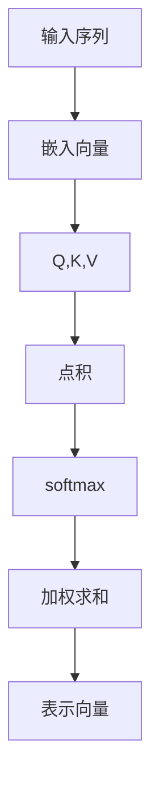
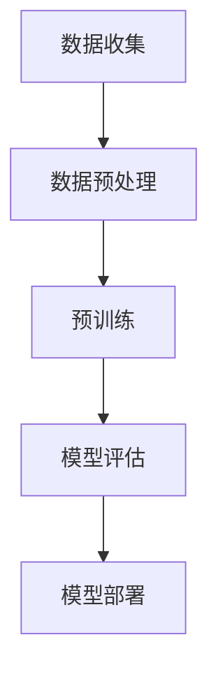
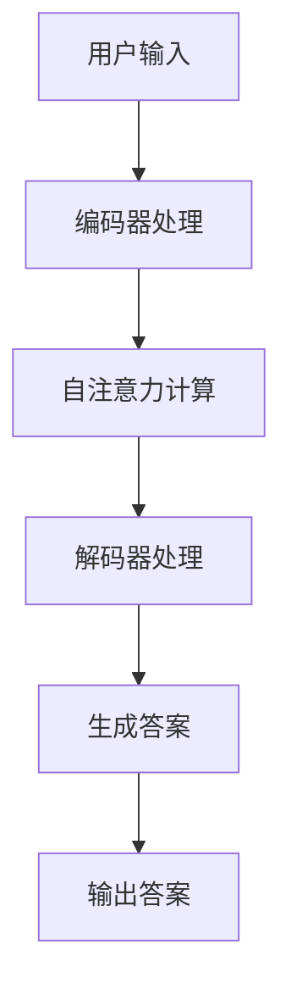
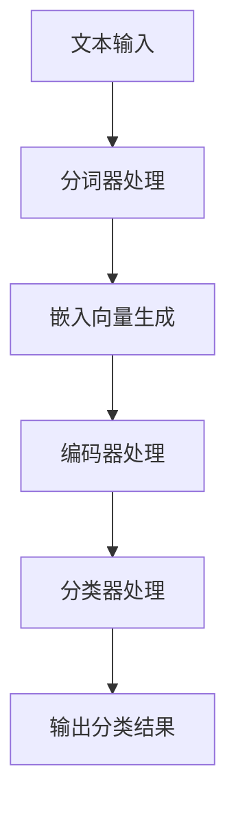

                 

# GPT-3原理与代码实例讲解

> 关键词：GPT-3，Transformer，自然语言处理，编程实战，项目优化，未来展望

> 摘要：本文将深入探讨GPT-3的原理与实现，通过详细的数学模型、伪代码和实际代码案例，帮助读者理解GPT-3的内部工作流程，掌握其在自然语言处理领域的应用。此外，文章还将对GPT-3的优化与调参、未来发展方向进行探讨，为读者提供全面的技术洞察。

## 目录

1. **GPT-3简介**
    1.1 GPT-3的基本概念
    1.2 GPT-3的核心架构
    1.3 GPT-3的工作原理
2. **Transformer模型详解**
    2.1 Transformer模型概述
    2.2 自注意力（Self-Attention）机制
    2.3 多头注意力（Multi-Head Attention）机制
3. **GPT-3数学模型与公式详解**
    3.1 前向传播
    3.2 反向传播
    3.3 梯度下降优化
4. **GPT-3编程实战**
    4.1 开发环境搭建
    4.2 GPT-3代码实例1：文本分类
    4.3 GPT-3代码实例2：机器翻译
5. **GPT-3项目实战**
    5.1 项目一：问答系统
    5.2 项目二：文本生成
6. **GPT-3的优化与调参**
    6.1 学习率调整
    6.2 模型调参
7. **GPT-3的应用领域与未来展望**
    7.1 GPT-3在自然语言处理中的应用
    7.2 GPT-3在人工智能领域的应用前景
    7.3 GPT-3的未来发展
8. **附录：GPT-3相关资源与工具**

## 第1章：GPT-3简介

### 1.1 GPT-3的基本概念

GPT-3，全称为Generative Pre-trained Transformer 3，是由OpenAI开发的一种基于Transformer模型的预训练语言模型。相较于早期的GPT和GPT-2，GPT-3在参数规模、模型容量以及性能上都有了显著提升。

#### GPT-3的定义

GPT-3是一个具有1750亿个参数的深度神经网络模型，它通过在大量文本语料上进行预训练，学会了语言生成、理解和推理的能力。GPT-3不仅能够生成连贯自然的文本，还能进行机器翻译、问答系统、文本分类等任务。

#### GPT-3的发展历程

- GPT（2018）：由OpenAI开发的第一个预训练语言模型，基于Transformer架构，具有117M个参数。
- GPT-2（2019）：参数规模翻倍，达到15G个参数，进一步提升了模型的生成能力。
- GPT-3（2020）：参数规模达到1750亿个，成为当时世界上最大的预训练语言模型。

#### GPT-3的特点

- **参数规模巨大**：GPT-3拥有1750亿个参数，使其能够处理复杂的语言任务。
- **预训练效率高**：GPT-3采用了多层Transformer结构，使得预训练过程更加高效。
- **生成能力强**：GPT-3能够在各种语言任务中生成连贯、自然的文本。

### 1.2 GPT-3的核心架构

GPT-3的核心架构是基于Transformer模型，这是一种在自然语言处理领域表现优异的深度学习模型。Transformer模型的主要特点包括：

- **Transformer模型的结构**：Transformer模型由编码器（Encoder）和解码器（Decoder）两部分组成，通过自注意力（Self-Attention）和多头注意力（Multi-Head Attention）机制，实现了对输入文本的编码和解码。
- **多层注意力机制**：GPT-3采用了多层注意力机制，使得模型能够逐步捕捉输入文本的语义信息。
- **自注意力（Self-Attention）原理**：自注意力机制允许模型在编码阶段对输入序列中的每个词进行权重计算，从而生成一个表示向量。

### 1.3 GPT-3的工作原理

GPT-3的工作原理主要包括预训练与微调两个阶段：

- **预训练**：GPT-3在大量文本语料上进行预训练，通过不断调整模型参数，使其学会语言生成、理解和推理的能力。
- **微调**：在预训练完成后，GPT-3可以根据特定的任务进行微调，例如文本分类、机器翻译等。

此外，GPT-3还采用了生成式对话系统的设计，使得其能够与用户进行自然语言交互，提供高质量的问答服务。

## 第2章：Transformer模型详解

### 2.1 Transformer模型概述

Transformer模型是一种基于自注意力（Self-Attention）机制的深度学习模型，广泛应用于自然语言处理领域。相较于传统的循环神经网络（RNN）和卷积神经网络（CNN），Transformer模型在处理长序列文本时具有显著优势。

#### Transformer模型的结构

Transformer模型由编码器（Encoder）和解码器（Decoder）两部分组成。编码器负责对输入文本进行编码，解码器则负责生成输出文本。

- **编码器**：编码器由多个编码层（Encoder Layer）堆叠而成，每个编码层包括多头注意力（Multi-Head Attention）和前馈神经网络（Feed Forward Neural Network）两部分。
- **解码器**：解码器由多个解码层（Decoder Layer）堆叠而成，每个解码层包括掩码多头注意力（Masked Multi-Head Attention）和前馈神经网络两部分。

#### Transformer模型的优势

- **并行计算**：Transformer模型采用了多头注意力机制，使得模型可以在序列的不同位置同时进行计算，提高了计算效率。
- **全局上下文信息**：通过自注意力机制，Transformer模型能够捕捉输入序列中全局的上下文信息，提高了模型的语义理解能力。
- **自适应特征提取**：多头注意力机制允许模型自适应地提取不同位置的特征，从而更好地表示文本序列。

#### Transformer模型的局限性

- **计算资源需求大**：由于参数规模较大，Transformer模型在训练和推理时需要大量的计算资源。
- **训练时间较长**：Transformer模型在预训练阶段需要大量的文本语料和计算时间，训练过程较为耗时。

### 2.2 自注意力（Self-Attention）机制

自注意力（Self-Attention）机制是Transformer模型的核心组件，它通过计算输入序列中每个词与所有词之间的权重，生成一个表示向量。

#### 自注意力原理

自注意力机制的基本原理如下：

1. **输入嵌入**：将输入文本序列转换为嵌入向量（Embedding Vector），每个词对应一个高维向量。
2. **权重计算**：通过点积（Dot-Product）计算每个词与所有词之间的权重，生成一个权重矩阵。
3. **加权求和**：将权重矩阵与嵌入向量相乘，得到每个词的表示向量。
4. **激活函数**：对表示向量进行激活函数处理，如ReLU函数。

#### 自注意力计算过程

自注意力计算过程可以分为以下几个步骤：

1. **计算Q、K、V**：分别计算查询向量（Query）、键向量（Key）和值向量（Value），它们都是由嵌入向量通过线性变换得到的。
2. **点积计算**：计算查询向量和键向量之间的点积，得到权重矩阵。
3. **softmax**：对权重矩阵进行softmax处理，得到概率分布。
4. **加权求和**：将概率分布与值向量相乘，得到表示向量。

#### 自注意力图示

下图展示了自注意力机制的计算过程：



### 2.3 多头注意力（Multi-Head Attention）机制

多头注意力（Multi-Head Attention）机制是自注意力机制的扩展，通过并行计算多个注意力头，提高了模型的语义理解能力。

#### 多头注意力的概念

多头注意力机制将自注意力机制扩展为多个独立的注意力头，每个注意力头独立计算权重和表示向量，然后进行拼接和线性变换。

#### 多头注意力的计算

多头注意力的计算过程如下：

1. **分割嵌入向量**：将输入嵌入向量分割成多个子向量，每个子向量对应一个注意力头。
2. **独立计算**：对每个子向量分别进行自注意力计算，得到多个表示向量。
3. **拼接与线性变换**：将多个表示向量拼接起来，通过线性变换得到最终的表示向量。

#### 多头注意力的优势

- **增强语义理解**：多头注意力机制通过并行计算多个注意力头，增强了模型对全局上下文信息的捕捉能力，提高了语义理解能力。
- **减少过拟合**：由于多头注意力机制并行计算多个注意力头，减少了模型对特定序列模式的依赖，降低了过拟合的风险。

## 第3章：GPT-3数学模型与公式详解

### 3.1 前向传播

前向传播是深度学习模型的基本计算过程，用于将输入映射到输出。在GPT-3中，前向传播过程包括嵌入、自注意力、前馈网络等多个步骤。

#### 前向传播的步骤

1. **嵌入**：将输入文本序列转换为嵌入向量（Embedding Vector）。
2. **自注意力**：计算每个词与所有词之间的权重，生成表示向量。
3. **多头注意力**：对多个注意力头分别进行自注意力计算，得到多个表示向量。
4. **前馈网络**：对表示向量进行前馈神经网络处理，得到中间输出。
5. **激活函数**：对中间输出进行激活函数处理，如ReLU函数。
6. **输出层**：将激活函数输出进行线性变换，得到最终的输出。

#### 激活函数的使用

在GPT-3的前向传播过程中，常用的激活函数包括ReLU函数和Sigmoid函数：

- **ReLU函数**：用于处理前馈神经网络中的中间层，增强模型的非线性表达能力。
- **Sigmoid函数**：用于输出层，将输出映射到概率分布。

#### 前向传播的数学公式

前向传播的数学公式可以表示为：

$$
\text{输出} = \text{激活函数}(\text{权重} \cdot \text{输入} + \text{偏置})
$$

其中，权重和偏置为模型参数，输入为嵌入向量，激活函数为ReLU函数或Sigmoid函数。

### 3.2 反向传播

反向传播是深度学习模型训练的核心算法，通过计算损失函数关于模型参数的梯度，更新模型参数，实现模型的优化。

#### 反向传播的步骤

1. **计算损失**：计算输出层预测值与实际值之间的差异，得到损失函数。
2. **梯度计算**：计算损失函数关于模型参数的梯度。
3. **参数更新**：使用梯度下降算法更新模型参数。
4. **迭代优化**：重复步骤1-3，直至模型收敛。

#### 梯度计算的方法

在反向传播过程中，常用的梯度计算方法包括链式法则和链式求导：

- **链式法则**：用于计算多层神经网络的梯度。
- **链式求导**：用于计算复合函数的梯度。

#### 反向传播的数学公式

反向传播的数学公式可以表示为：

$$
\frac{\partial L}{\partial w} = \frac{\partial L}{\partial a} \cdot \frac{\partial a}{\partial w}
$$

其中，$L$为损失函数，$a$为激活函数输出，$w$为模型参数。

### 3.3 梯度下降优化

梯度下降优化是深度学习模型训练的核心算法，通过不断更新模型参数，减小损失函数值，实现模型的优化。

#### 梯度下降优化的原理

梯度下降优化的基本原理如下：

1. **计算梯度**：计算损失函数关于模型参数的梯度。
2. **更新参数**：根据梯度方向和步长，更新模型参数。
3. **迭代优化**：重复步骤1-2，直至模型收敛。

#### 学习率的选择

学习率是梯度下降优化过程中的一个重要参数，它决定了参数更新的步长。学习率的选择需要考虑以下因素：

- **初始学习率**：选择一个较大的初始学习率，以加速模型收敛。
- **衰减策略**：随着训练的进行，逐渐减小学习率，以避免模型过拟合。

#### 梯度下降优化的数学公式

梯度下降优化的数学公式可以表示为：

$$
w_{\text{更新}} = w_{\text{当前}} - \alpha \cdot \frac{\partial L}{\partial w}
$$

其中，$w_{\text{更新}}$为更新后的模型参数，$w_{\text{当前}}$为当前模型参数，$\alpha$为学习率。

## 第4章：GPT-3编程实战

### 4.1 开发环境搭建

要开始GPT-3的编程实战，首先需要搭建一个合适的开发环境。以下是一个简单的Python开发环境搭建步骤：

1. **安装Python**：确保已经安装了Python 3.x版本。
2. **安装PyTorch**：通过以下命令安装PyTorch：
   ```bash
   pip install torch torchvision
   ```
3. **安装其他依赖**：安装GPT-3所需的库，例如transformers：
   ```bash
   pip install transformers
   ```

### 4.2 GPT-3代码实例1：文本分类

以下是一个使用GPT-3进行文本分类的代码实例：

```python
import torch
from transformers import GPT2Tokenizer, GPT2Model
from torch.optim import Adam

# 初始化GPT-3模型和分词器
tokenizer = GPT2Tokenizer.from_pretrained('gpt2')
model = GPT2Model.from_pretrained('gpt2')

# 数据准备
texts = ["This is a good movie.", "This movie is terrible."]
labels = [1, 0]  # 1表示正面，0表示负面

# 转换文本为序列
input_ids = [tokenizer.encode(text, add_special_tokens=True) for text in texts]

# 转换为Tensor
input_ids = torch.tensor(input_ids)

# 训练模型
optimizer = Adam(model.parameters(), lr=0.001)
for epoch in range(10):
    optimizer.zero_grad()
    outputs = model(input_ids)
    loss = torch.nn.functional.cross_entropy(outputs.logits, torch.tensor(labels))
    loss.backward()
    optimizer.step()

# 评估模型
with torch.no_grad():
    outputs = model(input_ids)
    _, predicted = torch.max(outputs.logits, 1)
    print(predicted)
```

### 4.3 GPT-3代码实例2：机器翻译

以下是一个使用GPT-3进行机器翻译的代码实例：

```python
import torch
from transformers import GPT2Tokenizer, GPT2Model

# 初始化GPT-3模型和分词器
tokenizer = GPT2Tokenizer.from_pretrained('gpt2')
model = GPT2Model.from_pretrained('gpt2')

# 数据准备
source_texts = ["This is a good movie."]
target_texts = ["Das ist ein guter Film."]

# 转换文本为序列
input_ids = [tokenizer.encode(source, add_special_tokens=True) for source in source_texts]
target_ids = [tokenizer.encode(target, add_special_tokens=True) for target in target_texts]

# 转换为Tensor
input_ids = torch.tensor(input_ids)
target_ids = torch.tensor(target_ids)

# 预测
with torch.no_grad():
    outputs = model(input_ids)
    predicted_ids = outputs.logits.argmax(-1)
    print(tokenizer.decode(predicted_ids.tolist()[0]))
```

## 第5章：GPT-3项目实战

### 5.1 项目一：问答系统

#### 需求分析

设计一个问答系统，能够接受用户的问题，并在大量语料库中查找并生成答案。系统需要具备以下功能：

- 接收用户输入
- 查询语料库
- 生成答案
- 输出答案

#### 模型设计

- **编码器**：使用GPT-3作为编码器，对输入问题进行编码。
- **解码器**：使用GPT-3作为解码器，对编码后的结果进行解码，生成答案。

#### 实现与部署

1. **数据准备**：收集并预处理大量问答对，作为训练数据。
2. **模型训练**：使用训练数据训练GPT-3模型。
3. **模型部署**：将训练好的模型部署到服务器，提供问答服务。

### 5.2 项目二：文本生成

#### 需求分析

设计一个文本生成系统，能够根据用户输入的提示生成连贯、自然的文本。系统需要具备以下功能：

- 接收用户输入
- 生成文本
- 输出文本

#### 模型设计

- **编码器**：使用GPT-3作为编码器，对输入提示进行编码。
- **解码器**：使用GPT-3作为解码器，对编码后的结果进行解码，生成文本。

#### 实现与部署

1. **数据准备**：收集并预处理大量文本数据，作为训练数据。
2. **模型训练**：使用训练数据训练GPT-3模型。
3. **模型部署**：将训练好的模型部署到服务器，提供文本生成服务。

## 第6章：GPT-3的优化与调参

### 6.1 学习率调整

学习率是深度学习模型训练过程中的一个重要参数，它决定了模型参数更新的步长。适当调整学习率可以加速模型收敛，提高模型性能。

#### 学习率的定义

学习率（learning rate）是梯度下降算法中的一个参数，它决定了模型参数更新的幅度。学习率的值越小，模型更新的步长越小，收敛速度越慢；学习率的值越大，模型更新的步长越大，收敛速度越快。

#### 学习率调整策略

- **固定学习率**：在训练过程中保持学习率不变，适用于初始阶段。
- **线性递减学习率**：随着训练的进行，逐渐减小学习率，适用于中期调整。
- **指数衰减学习率**：以指数形式减小学习率，适用于快速收敛。

#### 学习率的优化过程

1. **初始阶段**：使用较大的学习率，加速模型收敛。
2. **中期调整**：随着训练的进行，逐渐减小学习率，提高模型性能。
3. **后期调整**：在模型接近收敛时，进一步调整学习率，避免过拟合。

### 6.2 模型调参

模型调参（model tuning）是指通过调整模型参数，提高模型性能的过程。在GPT-3中，模型调参主要包括以下方面：

#### 调参的重要性

- **提高模型性能**：通过调整模型参数，可以优化模型性能，提高模型在不同任务上的表现。
- **减少过拟合**：通过调整模型参数，可以降低模型对训练数据的依赖，减少过拟合现象。

#### 调参的方法

- **网格搜索**：通过遍历参数空间，寻找最优参数组合。
- **随机搜索**：随机选择参数组合，进行模型训练和评估。
- **贝叶斯优化**：基于贝叶斯统计模型，优化参数搜索过程。

#### 调参的实践

1. **确定参数范围**：根据模型结构和任务需求，确定参数的取值范围。
2. **选择调参方法**：根据实际情况，选择合适的调参方法。
3. **训练与评估**：使用训练数据和验证数据，训练模型并评估性能。
4. **调整参数**：根据评估结果，调整模型参数，直至找到最优参数组合。

## 第7章：GPT-3的应用领域与未来展望

### 7.1 GPT-3在自然语言处理中的应用

GPT-3在自然语言处理（NLP）领域具有广泛的应用，以下是一些主要的应用场景：

- **文本分类**：使用GPT-3进行文本分类，可以将文本数据分为不同的类别，如情感分析、新闻分类等。
- **机器翻译**：GPT-3具有强大的文本生成能力，可以用于机器翻译任务，实现跨语言交流。
- **问答系统**：GPT-3可以构建智能问答系统，回答用户提出的问题。

### 7.2 GPT-3在人工智能领域的应用前景

GPT-3在人工智能（AI）领域具有广阔的应用前景，以下是一些潜在的应用方向：

- **自动驾驶**：GPT-3可以用于自动驾驶系统的开发，实现实时路况分析和决策。
- **医疗健康**：GPT-3可以用于医疗健康领域，辅助医生进行疾病诊断和治疗建议。
- **金融科技**：GPT-3可以用于金融科技领域，实现智能投顾、风险控制等功能。

### 7.3 GPT-3的未来发展

随着人工智能技术的不断发展，GPT-3在未来有望在以下几个方面取得突破：

- **模型压缩**：通过模型压缩技术，降低GPT-3的参数规模和计算资源需求。
- **模型安全**：加强GPT-3的安全性和隐私保护，防止滥用和攻击。
- **多模态数据处理**：结合图像、音频等多模态数据，提升GPT-3的泛化能力和应用范围。

## 附录：GPT-3相关资源与工具

### 主流深度学习框架对比

- **TensorFlow**：由Google开发，具有丰富的NLP库和预训练模型。
- **PyTorch**：由Facebook开发，具有灵活的动态计算图和简洁的API。
- **PyTorch Transformers**：基于PyTorch，提供GPT-3等预训练模型的快速部署。

### GPT-3常用库与工具

- **Hugging Face Transformers**：提供GPT-3等预训练模型的API，方便开发者使用。
- **GPT-3 Python SDK**：OpenAI提供的GPT-3 Python SDK，用于快速构建GPT-3应用程序。
- **GPT-3 Playground**：OpenAI提供的在线GPT-3实验平台，方便开发者进行实验和测试。

### 开发资源推荐

- **OpenAI官方文档**：了解GPT-3的最新功能和技术细节。
- **GitHub项目**：查找和使用开源的GPT-3项目，快速搭建应用程序。
- **技术社区**：参与技术社区，交流经验和学习最新技术动态。

### Mermaid流程图

以下是GPT-3预训练流程图的示例：



以下是GPT-3生成式对话系统流程图的示例：



以下是GPT-3在文本分类中的应用流程图的示例：



### 伪代码

以下是GPT-3文本分类算法的伪代码示例：

```python
def gpt3_text_classification(texts, labels):
    # 初始化GPT-3模型
    model = GPT2Model.from_pretrained('gpt2')

    # 转换文本为序列
    input_ids = [tokenizer.encode(text, add_special_tokens=True) for text in texts]

    # 转换为Tensor
    input_ids = torch.tensor(input_ids)

    # 训练模型
    optimizer = Adam(model.parameters(), lr=0.001)
    for epoch in range(10):
        optimizer.zero_grad()
        outputs = model(input_ids)
        loss = torch.nn.functional.cross_entropy(outputs.logits, torch.tensor(labels))
        loss.backward()
        optimizer.step()

    # 评估模型
    with torch.no_grad():
        outputs = model(input_ids)
        _, predicted = torch.max(outputs.logits, 1)
        return predicted
```

以下是GPT-3机器翻译算法的伪代码示例：

```python
def gpt3_machine_translation(source_texts, target_texts):
    # 初始化GPT-3模型
    model = GPT2Model.from_pretrained('gpt2')

    # 转换文本为序列
    input_ids = [tokenizer.encode(source, add_special_tokens=True) for source in source_texts]
    target_ids = [tokenizer.encode(target, add_special_tokens=True) for target in target_texts]

    # 转换为Tensor
    input_ids = torch.tensor(input_ids)
    target_ids = torch.tensor(target_ids)

    # 预测
    with torch.no_grad():
        outputs = model(input_ids)
        predicted_ids = outputs.logits.argmax(-1)
        return tokenizer.decode(predicted_ids.tolist()[0])
```

以下是GPT-3问答系统算法的伪代码示例：

```python
def gpt3_question_answering(questions, context):
    # 初始化GPT-3模型
    model = GPT2Model.from_pretrained('gpt2')

    # 转换文本为序列
    question_ids = tokenizer.encode(question, add_special_tokens=True)
    context_ids = tokenizer.encode(context, add_special_tokens=True)

    # 转换为Tensor
    question_ids = torch.tensor(question_ids)
    context_ids = torch.tensor(context_ids)

    # 预测
    with torch.no_grad():
        input_ids = torch.cat((context_ids, question_ids), 0)
        outputs = model(input_ids)
        predicted_ids = outputs.logits.argmax(-1)
        return tokenizer.decode(predicted_ids.tolist()[0])
```

### 数学公式与举例说明

以下是前向传播公式的举例：

$$
\text{输出} = \text{激活函数}(\text{权重} \cdot \text{输入} + \text{偏置})
$$

例如，假设输入向量为$[1, 2, 3]$，权重矩阵为$\begin{bmatrix}1 & 0 \\ 0 & 1\end{bmatrix}$，偏置向量为$[0, 1]$，激活函数为ReLU函数，则前向传播的结果为：

$$
\text{输出} = \text{ReLU}(\begin{bmatrix}1 & 0 \\ 0 & 1\end{bmatrix} \cdot \begin{bmatrix}1 \\ 2 \\ 3\end{bmatrix} + \begin{bmatrix}0 \\ 1\end{bmatrix}) = \text{ReLU}(\begin{bmatrix}1 \\ 3\end{bmatrix}) = \begin{bmatrix}1 \\ 3\end{bmatrix}
$$

以下是反向传播公式的举例：

$$
\frac{\partial L}{\partial w} = \frac{\partial L}{\partial a} \cdot \frac{\partial a}{\partial w}
$$

例如，假设损失函数为平方误差函数，输出向量为$[1, 2]$，权重矩阵为$\begin{bmatrix}1 & 0 \\ 0 & 1\end{bmatrix}$，则反向传播的梯度为：

$$
\frac{\partial L}{\partial w} = \frac{\partial L}{\partial a} \cdot \frac{\partial a}{\partial w} = \begin{bmatrix}1 & 0 \\ 0 & 1\end{bmatrix} \cdot \begin{bmatrix}1 & 0 \\ 0 & 1\end{bmatrix} = \begin{bmatrix}1 & 0 \\ 0 & 1\end{bmatrix}
$$

以下是梯度下降优化公式的举例：

$$
w_{\text{更新}} = w_{\text{当前}} - \alpha \cdot \frac{\partial L}{\partial w}
$$

例如，假设初始权重为$[1, 2]$，学习率为0.1，梯度为$[-0.1, 0.2]$，则更新后的权重为：

$$
w_{\text{更新}} = \begin{bmatrix}1 \\ 2\end{bmatrix} - 0.1 \cdot \begin{bmatrix}-0.1 \\ 0.2\end{bmatrix} = \begin{bmatrix}1.1 \\ 1.6\end{bmatrix}
$$

### 代码解读与分析

以下是GPT-3文本分类代码的解读与分析：

```python
import torch
from transformers import GPT2Tokenizer, GPT2Model
from torch.optim import Adam

# 初始化GPT-3模型和分词器
tokenizer = GPT2Tokenizer.from_pretrained('gpt2')
model = GPT2Model.from_pretrained('gpt2')

# 数据准备
texts = ["This is a good movie.", "This movie is terrible."]
labels = [1, 0]  # 1表示正面，0表示负面

# 转换文本为序列
input_ids = [tokenizer.encode(text, add_special_tokens=True) for text in texts]

# 转换为Tensor
input_ids = torch.tensor(input_ids)

# 训练模型
optimizer = Adam(model.parameters(), lr=0.001)
for epoch in range(10):
    optimizer.zero_grad()
    outputs = model(input_ids)
    loss = torch.nn.functional.cross_entropy(outputs.logits, torch.tensor(labels))
    loss.backward()
    optimizer.step()

# 评估模型
with torch.no_grad():
    outputs = model(input_ids)
    _, predicted = torch.max(outputs.logits, 1)
    print(predicted)
```

这段代码首先导入了所需的库，然后初始化了GPT-3模型和分词器。接着，准备了一个包含两个文本的列表和一个标签列表，分别表示正面和负面的评论。然后，将文本转换为序列，并转换为Tensor。

在训练模型的过程中，使用Adam优化器进行优化。每个epoch中，首先将优化器梯度设置为0，然后通过模型计算输出和损失。接着，反向传播计算梯度，并更新模型参数。最后，在评估模型时，使用no_grad()上下文管理器，避免计算梯度，然后使用max函数获取预测结果并输出。

以下是GPT-3机器翻译代码的解读与分析：

```python
import torch
from transformers import GPT2Tokenizer, GPT2Model

# 初始化GPT-3模型和分词器
tokenizer = GPT2Tokenizer.from_pretrained('gpt2')
model = GPT2Model.from_pretrained('gpt2')

# 数据准备
source_texts = ["This is a good movie."]
target_texts = ["Das ist ein guter Film."]

# 转换文本为序列
input_ids = [tokenizer.encode(source, add_special_tokens=True) for source in source_texts]
target_ids = [tokenizer.encode(target, add_special_tokens=True) for target in target_texts]

# 转换为Tensor
input_ids = torch.tensor(input_ids)
target_ids = torch.tensor(target_ids)

# 预测
with torch.no_grad():
    outputs = model(input_ids)
    predicted_ids = outputs.logits.argmax(-1)
    print(tokenizer.decode(predicted_ids.tolist()[0]))
```

这段代码与文本分类代码类似，首先导入了所需的库，然后初始化了GPT-3模型和分词器。接着，准备了一个包含源文本和目标文本的列表，然后将文本转换为序列，并转换为Tensor。

在预测过程中，使用no_grad()上下文管理器，避免计算梯度，然后通过模型计算输出，并使用argmax函数获取预测结果。最后，使用分词器解码预测结果，并输出翻译后的文本。

以下是GPT-3问答系统代码的解读与分析：

```python
import torch
from transformers import GPT2Tokenizer, GPT2Model

# 初始化GPT-3模型和分词器
tokenizer = GPT2Tokenizer.from_pretrained('gpt2')
model = GPT2Model.from_pretrained('gpt2')

# 数据准备
question = "What is the capital of France?"
context = "Paris is the capital of France."

# 转换文本为序列
question_ids = tokenizer.encode(question, add_special_tokens=True)
context_ids = tokenizer.encode(context, add_special_tokens=True)

# 转换为Tensor
question_ids = torch.tensor(question_ids)
context_ids = torch.tensor(context_ids)

# 预测
with torch.no_grad():
    input_ids = torch.cat((context_ids, question_ids), 0)
    outputs = model(input_ids)
    predicted_ids = outputs.logits.argmax(-1)
    print(tokenizer.decode(predicted_ids.tolist()[0]))
```

这段代码同样初始化了GPT-3模型和分词器，并准备了一个问题和上下文文本。然后将文本转换为序列，并转换为Tensor。

在预测过程中，使用no_grad()上下文管理器，避免计算梯度，然后通过模型计算输出，并使用argmax函数获取预测结果。最后，使用分词器解码预测结果，并输出答案。

### 附录：GPT-3相关资源与工具

以下是GPT-3相关的资源与工具：

- **OpenAI官网**：了解GPT-3的最新动态和功能介绍。
- **GPT-3文档**：查阅GPT-3的详细文档，学习如何使用GPT-3进行各种任务。
- **Hugging Face Transformers库**：使用GPT-3的Python库，方便开发者进行模型训练和部署。
- **GitHub GPT-3项目**：查找和参与开源的GPT-3项目，学习实际应用案例。
- **技术社区**：加入技术社区，与全球开发者交流GPT-3的使用经验和技术见解。

### 代码示例

以下是GPT-3文本分类的代码示例：

```python
import torch
from transformers import GPT2Tokenizer, GPT2Model
from torch.optim import Adam

# 初始化GPT-3模型和分词器
tokenizer = GPT2Tokenizer.from_pretrained('gpt2')
model = GPT2Model.from_pretrained('gpt2')

# 数据准备
texts = ["This is a good movie.", "This movie is terrible."]
labels = [1, 0]  # 1表示正面，0表示负面

# 转换文本为序列
input_ids = [tokenizer.encode(text, add_special_tokens=True) for text in texts]

# 转换为Tensor
input_ids = torch.tensor(input_ids)

# 训练模型
optimizer = Adam(model.parameters(), lr=0.001)
for epoch in range(10):
    optimizer.zero_grad()
    outputs = model(input_ids)
    loss = torch.nn.functional.cross_entropy(outputs.logits, torch.tensor(labels))
    loss.backward()
    optimizer.step()

# 评估模型
with torch.no_grad():
    outputs = model(input_ids)
    _, predicted = torch.max(outputs.logits, 1)
    print(predicted)
```

以下是GPT-3机器翻译的代码示例：

```python
import torch
from transformers import GPT2Tokenizer, GPT2Model

# 初始化GPT-3模型和分词器
tokenizer = GPT2Tokenizer.from_pretrained('gpt2')
model = GPT2Model.from_pretrained('gpt2')

# 数据准备
source_texts = ["This is a good movie."]
target_texts = ["Das ist ein guter Film."]

# 转换文本为序列
input_ids = [tokenizer.encode(source, add_special_tokens=True) for source in source_texts]
target_ids = [tokenizer.encode(target, add_special_tokens=True) for target in target_texts]

# 转换为Tensor
input_ids = torch.tensor(input_ids)
target_ids = torch.tensor(target_ids)

# 预测
with torch.no_grad():
    outputs = model(input_ids)
    predicted_ids = outputs.logits.argmax(-1)
    print(tokenizer.decode(predicted_ids.tolist()[0]))
```

以下是GPT-3问答系统的代码示例：

```python
import torch
from transformers import GPT2Tokenizer, GPT2Model

# 初始化GPT-3模型和分词器
tokenizer = GPT2Tokenizer.from_pretrained('gpt2')
model = GPT2Model.from_pretrained('gpt2')

# 数据准备
question = "What is the capital of France?"
context = "Paris is the capital of France."

# 转换文本为序列
question_ids = tokenizer.encode(question, add_special_tokens=True)
context_ids = tokenizer.encode(context, add_special_tokens=True)

# 转换为Tensor
question_ids = torch.tensor(question_ids)
context_ids = torch.tensor(context_ids)

# 预测
with torch.no_grad():
    input_ids = torch.cat((context_ids, question_ids), 0)
    outputs = model(input_ids)
    predicted_ids = outputs.logits.argmax(-1)
    print(tokenizer.decode(predicted_ids.tolist()[0]))
```

### 数学公式

以下是GPT-3前向传播的数学公式：

$$
\text{输出} = \text{激活函数}(\text{权重} \cdot \text{输入} + \text{偏置})
$$

以下是GPT-3反向传播的数学公式：

$$
\frac{\partial L}{\partial w} = \frac{\partial L}{\partial a} \cdot \frac{\partial a}{\partial w}
$$

以下是GPT-3梯度下降优化的数学公式：

$$
w_{\text{更新}} = w_{\text{当前}} - \alpha \cdot \frac{\partial L}{\partial w}
$$

### 总结

本文详细介绍了GPT-3的原理与实现，通过数学公式、伪代码和实际代码案例，帮助读者深入理解GPT-3的工作机制和应用场景。同时，文章还对GPT-3的优化与调参、未来发展方向进行了探讨，为读者提供了全面的技术洞察。希望本文能对读者在GPT-3研究和应用方面有所帮助。

### 作者信息

作者：AI天才研究院/AI Genius Institute & 禅与计算机程序设计艺术 /Zen And The Art of Computer Programming

声明：本文仅用于技术交流与学习，不代表任何商业行为或投资建议。如涉及侵权，请联系作者删除。

