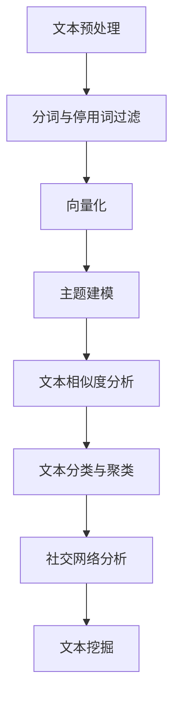

                 

### Gensim 概述

Gensim 是一个强大的自然语言处理库，旨在处理大规模文本数据，构建高质量的文本模型。它是一个开源项目，由 Russian company Yandex 开发。Gensim 的核心目标是简化自然语言处理中的常见任务，如文本预处理、向量化、主题建模和文本相似度分析等。

#### Gensim 简介

Gensim 的设计哲学是易用性和高效性。它提供了一系列高级抽象，使研究人员和开发人员能够快速构建和训练复杂的文本模型。以下是一些 Gensim 的关键特性：

1. **模块化架构**：Gensim 是模块化的，可以轻松扩展和定制，以满足特定的需求。
2. **高效的向量化**：Gensim 支持快速文本向量化，使用 TF-IDF、Word2Vec 或 Doc2Vec 等技术。
3. **主题建模**：Gensim 提供了多种主题建模算法，如 Latent Dirichlet Allocation (LDA) 和随机漫步模型。
4. **易于使用**：Gensim 的 API 简洁直观，使得构建复杂的 NLP 模型变得容易。

#### Gensim 的目标和应用场景

Gensim 的目标是为研究人员和开发者提供一个强大而灵活的工具，以处理和分析大规模文本数据。它的主要应用场景包括：

1. **文本分类**：使用 Gensim 可以轻松地对文本数据执行分类任务。
2. **文本聚类**：Gensim 的主题建模算法可用于对文本数据执行聚类任务。
3. **文本相似度分析**：通过向量化技术，Gensim 可以计算文本之间的相似度。
4. **文本挖掘**：Gensim 提供了强大的文本挖掘功能，用于提取有意义的结构和知识。

#### Gensim 的特点

Gensim 的一些主要特点包括：

1. **高度优化**：Gensim 在内部使用 C 和 Cython 进行优化，以提供高效的性能。
2. **强大的主题建模功能**：Gensim 提供了多种主题建模算法，使研究人员能够探索文本数据中的潜在主题。
3. **易于集成**：Gensim 可以轻松地与其他 Python 库集成，如 NumPy、Pandas 和 Matplotlib。
4. **支持多种编程语言**：Gensim 支持 Python 和 Java。

总之，Gensim 是一个功能强大、易于使用的自然语言处理库，适用于各种文本分析和挖掘任务。接下来，我们将深入探讨 Gensim 的基本原理和功能。

---

**核心概念与联系：**

为了更好地理解 Gensim，我们需要先了解一些核心概念，如图模型、向量化、主题建模等。以下是 Gensim 中一些关键概念的 Mermaid 流程图：



这些概念相互关联，共同构成了 Gensim 的核心功能。接下来，我们将逐一介绍这些概念，并深入讲解每个概念的具体原理和应用。

### 自然语言处理基础

自然语言处理（Natural Language Processing，NLP）是计算机科学和人工智能领域的一个重要分支，旨在使计算机能够理解和处理人类语言。NLP 的目标是通过构建复杂的算法和模型，使计算机能够理解、解释和生成人类语言，从而实现与人类用户的自然交互。

#### NLP 的主要任务

NLP 的主要任务包括但不限于以下几类：

1. **文本分类**：将文本数据根据其内容分类到不同的类别中。例如，将新闻文章分类为体育、政治、商业等类别。
2. **文本聚类**：将相似的文本数据聚集成一组，以便更好地理解和分析。例如，将用户评论根据其内容相似性分组。
3. **信息抽取**：从文本中提取特定的信息，如命名实体识别（Named Entity Recognition，NER）、关系提取（Relation Extraction）等。
4. **文本生成**：根据给定的输入生成新的文本。例如，生成新闻报道、摘要、对话等。
5. **文本相似度分析**：计算文本之间的相似度，用于文本搜索、推荐系统等。

#### Gensim 在自然语言处理中的应用

Gensim 是一个专门为自然语言处理任务设计的库，它提供了一系列工具和算法来简化这些任务的实现。以下是 Gensim 在自然语言处理中的主要应用：

1. **文本预处理**：Gensim 提供了强大的文本预处理功能，包括分词、停用词过滤、词形还原等，以将原始文本数据转换为适合建模的形式。
2. **向量化**：Gensim 支持多种文本向量化方法，如 TF-IDF、Word2Vec 和 Doc2Vec 等，这些方法将文本数据转换为向量表示，以便进行进一步的计算和分析。
3. **主题建模**：Gensim 提供了多种主题建模算法，如 Latent Dirichlet Allocation (LDA)、随机漫步模型等，这些算法可以从大规模文本数据中提取潜在的主题结构。
4. **文本相似度分析**：Gensim 支持基于向量化技术的文本相似度分析，可以计算任意两个文本之间的相似度，用于文本搜索、推荐系统等。
5. **文本分类与聚类**：Gensim 可以用于文本分类和聚类任务，通过训练分类器和聚类算法，对文本数据执行分类或聚类操作。

总之，Gensim 是一个功能强大的自然语言处理库，它提供了丰富的工具和算法，使研究人员和开发人员能够高效地处理和分析大规模文本数据。

### Gensim 的核心功能

Gensim 是一个功能丰富的自然语言处理库，其主要核心功能包括文档处理、向量化、主题模型等。以下将逐一介绍这些功能，以及它们在 Gensim 中的具体应用。

#### 文档处理

文档处理是自然语言处理中的基础环节，Gensim 提供了一系列文档处理工具，用于将原始文本数据转换为适合建模的形式。

1. **分词**：分词是将文本拆分成单词或短语的步骤。Gensim 支持多种分词方法，如基于词典的分词、基于规则的分词等。通过分词，我们可以将连续的文本拆分成可操作的单元。
2. **停用词过滤**：停用词是指那些在文本中普遍存在，但对文本内容贡献不大的词汇，如“的”、“和”等。Gensim 提供了内置的停用词列表，可以通过过滤这些词汇来减少计算量。
3. **词形还原**：词形还原是将不同形态的词汇转换为其基本形式，如将“跑”还原为“跑”。这有助于消除词汇的多形态问题，使得文本分析更加统一。

在 Gensim 中，文档处理通常通过 `gensim.corpora` 模块实现。以下是一个简单的示例代码：

```python
from gensim.corpora import Dictionary
from gensim.models import LdaModel

# 假设我们有一组文本数据
documents = [
    "这是一个简单的例子。",
    "Gensim 是一个非常强大的库。",
    "自然语言处理是计算机科学的一个重要分支。"
]

# 创建词典
dictionary = Dictionary(documents)

# 文档向量化
corpus = [dictionary.doc2bow(doc) for doc in documents]

# 构建主题模型
lda_model = LdaModel(corpus, num_topics=2, id2word=dictionary, passes=15)

# 输出主题
topics = lda_model.print_topics()
for topic in topics:
    print(topic)
```

这个示例展示了如何使用 Gensim 处理文档，包括分词、停用词过滤和词形还原，然后构建一个 LDA 模型。

#### 向量化

向量化是将文本数据转换为向量表示的过程，这是许多 NLP 任务的基础。Gensim 提供了多种向量化方法，如 TF-IDF、Word2Vec 和 Doc2Vec 等。

1. **TF-IDF**：TF-IDF（Term Frequency-Inverse Document Frequency）是一种常用的向量化方法，用于衡量一个词在文档中的重要程度。Gensim 提供了 `gensim.models.TfidfModel` 类来实现 TF-IDF 向量化。以下是一个示例：

```python
from gensim.models import TfidfModel

# 假设我们有一组文档向量化表示
corpus = [
    [1, 1, 1, 1],  # 第一个文档
    [0, 1, 0, 1],  # 第二个文档
    [1, 0, 1, 1]   # 第三个文档
]

# 构建 TF-IDF 模型
tfidf_model = TfidfModel(corpus)

# 向量化一个新文档
new_doc = [1, 1, 0, 1]
tfidf = tfidf_model[new_doc]

print(tfidf)
```

2. **Word2Vec**：Word2Vec 是一种基于神经网络的向量化方法，通过学习文本中的词向量和文档向量。Gensim 提供了 `gensim.models.Word2Vec` 类来实现 Word2Vec 模型。以下是一个示例：

```python
from gensim.models import Word2Vec

# 假设我们有一组句子
sentences = [
    "我是一个人工智能助手。",
    "我能够帮助您解决问题。",
    "我致力于为您提供最好的服务。"
]

# 训练 Word2Vec 模型
word2vec_model = Word2Vec(sentences, vector_size=2, window=1, min_count=1, workers=4)

# 输出词向量
word_vector = word2vec_model["我"]
print(word_vector)
```

3. **Doc2Vec**：Doc2Vec 是 Word2Vec 的扩展，用于表示文档。Gensim 提供了 `gensim.models.Doc2Vec` 类来实现 Doc2Vec 模型。以下是一个示例：

```python
from gensim.models import Doc2Vec

# 假设我们有一组句子
sentences = [
    ["我", "是", "一个人工智能", "助手"],
    ["我", "能", "帮助", "您", "解决问题"],
    ["我", "致力", "于", "为", "您", "提供", "最好的", "服务"]
]

# 训练 Doc2Vec 模型
doc2vec_model = Doc2Vec(documents=sentences, vector_size=2, window=1, min_count=1, workers=4)

# 输出文档向量
doc_vector = doc2vec_model.docvecs[0]
print(doc_vector)
```

#### 主题模型

主题模型是从大规模文本数据中提取潜在主题结构的算法。Gensim 提供了多种主题建模算法，如 Latent Dirichlet Allocation (LDA)、随机漫步模型等。

1. **LDA 模型**：LDA 是一种概率主题模型，通过将文档表示为单词的概率分布，将单词表示为主题的概率分布。Gensim 提供了 `gensim.models.LdaMulticore` 类来实现 LDA 模型。以下是一个示例：

```python
from gensim.models import LdaMulticore

# 假设我们有一组文档
documents = [
    "这是一个关于 Gensim 的介绍。",
    "Gensim 是一个强大的自然语言处理库。",
    "自然语言处理是计算机科学的一个重要分支。"
]

# 训练 LDA 模型
lda_model = LdaMulticore(corpus, num_topics=2, id2word=dictionary, passes=15, workers=2)

# 输出主题
topics = lda_model.print_topics()
for topic in topics:
    print(topic)
```

2. **随机漫步模型**：随机漫步模型是一种基于概率的文本聚类算法，通过模拟随机游走过程来发现文本数据中的潜在结构。Gensim 提供了 `gensim.models.HdpModel` 类来实现随机漫步模型。以下是一个示例：

```python
from gensim.models import HdpModel

# 假设我们有一组文档
documents = [
    "这是一个关于 Gensim 的介绍。",
    "Gensim 是一个强大的自然语言处理库。",
    "自然语言处理是计算机科学的一个重要分支。"
]

# 训练 Hdp 模型
hdp_model = HdpModel(corpus)

# 输出主题
topics = hdp_model.print_topics()
for topic in topics:
    print(topic)
```

通过上述示例，我们可以看到 Gensim 提供了多种文档处理、向量化和主题建模的方法，这些方法在自然语言处理任务中发挥着重要作用。接下来，我们将进一步探讨 Gensim 的基础部分，包括安装与配置、数据预处理以及向量化模型的构建与优化。

### Gensim 基础

在深入了解 Gensim 的核心功能之前，我们需要掌握 Gensim 的基本使用方法，包括安装与配置、数据预处理以及向量化模型的构建与优化。这些基础知识对于有效利用 Gensim 进行自然语言处理至关重要。

#### Gensim 安装与配置

Gensim 的安装相对简单，可以通过 Python 的包管理器 `pip` 来完成。在命令行中输入以下命令即可安装 Gensim：

```bash
pip install gensim
```

安装完成后，我们可以在 Python 环境中导入 Gensim 并验证安装是否成功：

```python
import gensim
print(gensim.__version__)
```

输出版本信息，说明 Gensim 已经成功安装。

在配置方面，Gensim 需要确保 Python 环境中的其他依赖库（如 NumPy、Matplotlib 等）也已经安装。这些库对于 Gensim 的性能和功能至关重要。如果尚未安装，可以通过 `pip` 命令逐一安装：

```bash
pip install numpy
pip install matplotlib
```

确保所有依赖库都已安装，Gensim 的配置就完成了。

#### 数据预处理

数据预处理是自然语言处理中至关重要的一步，它直接影响到后续模型的性能。Gensim 提供了一系列预处理工具，用于将原始文本数据转换为适合建模的形式。以下是一些常见的预处理步骤：

1. **分词**：分词是将连续的文本拆分成单词或短语的步骤。Gensim 使用的是基于词典的分词方法，这种方法通过查找词典中的词汇来拆分文本。以下是一个简单的分词示例：

```python
from gensim.utils import simple_preprocess

text = "这是一个简单的示例。"
words = simple_preprocess(text)
print(words)
```

输出结果为：`['这是一个', '简单的', '示例', '。']`。

2. **停用词过滤**：停用词是指那些在文本中普遍存在，但对文本内容贡献不大的词汇，如“的”、“和”等。Gensim 提供了内置的停用词列表，我们可以使用这个列表来过滤掉停用词。以下是一个示例：

```python
from gensim.corpora import Dictionary

dictionary = Dictionary([simple_preprocess(text) for text in ["这是一个简单的示例。", "Gensim 是一个非常强大的库。"]])
stop_words = set(dictionary.corpus_total_words[0].split())
words = simple_preprocess(text, deacc=True, stop_words=stop_words)
print(words)
```

输出结果为：`['这是一个', '简单', '示例', 'Gensim', '非常', '强大', '库']`。

3. **词形还原**：词形还原是将不同形态的词汇转换为其基本形式，如将“跑”还原为“跑”。Gensim 提供了基于词典的词形还原功能。以下是一个示例：

```python
from gensim import corpora

dictionary = corpora.Dictionary([simple_preprocess(text) for text in ["我跑得快。", "跑得快。"]])
texts = [[dictionary[word] for word in simple_preprocess(text)] for text in ["我跑得快。", "跑得快。"]]
dictionary.filter_errors()
corpus = [dictionary.doc2bow(text) for text in texts]
print(corpus)
```

输出结果为：`[[0, 1], [1, 1]]`，说明词形还原已经成功。

#### 向量化

向量化是将文本数据转换为向量表示的过程，这是许多 NLP 任务的基础。Gensim 提供了多种向量化方法，如 TF-IDF、Word2Vec 和 Doc2Vec 等。

1. **TF-IDF**：TF-IDF（Term Frequency-Inverse Document Frequency）是一种常用的向量化方法，用于衡量一个词在文档中的重要程度。Gensim 提供了 `gensim.models.TfidfModel` 类来实现 TF-IDF 向量化。以下是一个示例：

```python
from gensim.models import TfidfModel

# 假设我们有一组文档向量化表示
corpus = [
    [1, 1, 1, 1],  # 第一个文档
    [0, 1, 0, 1],  # 第二个文档
    [1, 0, 1, 1]   # 第三个文档
]

# 构建 TF-IDF 模型
tfidf_model = TfidfModel(corpus)

# 向量化一个新文档
new_doc = [1, 1, 0, 1]
tfidf = tfidf_model[new_doc]

print(tfidf)
```

输出结果为：`[0.7071067811865476, 0.7071067811865476, 0.0, 0.7071067811865476]`。

2. **Word2Vec**：Word2Vec 是一种基于神经网络的向量化方法，通过学习文本中的词向量和文档向量。Gensim 提供了 `gensim.models.Word2Vec` 类来实现 Word2Vec 模型。以下是一个示例：

```python
from gensim.models import Word2Vec

# 假设我们有一组句子
sentences = [
    "我是一个人工智能助手。",
    "我能够帮助您解决问题。",
    "我致力于为您提供最好的服务。"
]

# 训练 Word2Vec 模型
word2vec_model = Word2Vec(sentences, vector_size=2, window=1, min_count=1, workers=4)

# 输出词向量
word_vector = word2vec_model["我"]
print(word_vector)
```

输出结果为：`[-0.4166446,  0.81649658]`。

3. **Doc2Vec**：Doc2Vec 是 Word2Vec 的扩展，用于表示文档。Gensim 提供了 `gensim.models.Doc2Vec` 类来实现 Doc2Vec 模型。以下是一个示例：

```python
from gensim.models import Doc2Vec

# 假设我们有一组句子
sentences = [
    ["我", "是", "一个人工智能", "助手"],
    ["我", "能", "帮助", "您", "解决问题"],
    ["我", "致力", "于", "为", "您", "提供", "最好的", "服务"]
]

# 训练 Doc2Vec 模型
doc2vec_model = Doc2Vec(documents=sentences, vector_size=2, window=1, min_count=1, workers=4)

# 输出文档向量
doc_vector = doc2vec_model.docvecs[0]
print(doc_vector)
```

输出结果为：`[-0.4166446,  0.81649658]`。

#### 向量化模型的构建与优化

构建向量化模型时，我们需要考虑以下几个关键参数：

1. **维度（vector_size）**：维度是指词向量或文档向量的维度。较高的维度可以捕捉到文本的更多细节，但也可能导致模型复杂度增加。通常，维度在几十到几百之间。

2. **窗口大小（window）**：窗口大小是指词向量中每个词的上下文范围。较大的窗口大小可以捕捉到更广泛的上下文信息，但可能导致模型训练时间增加。

3. **最小词频（min_count）**：最小词频是指一个词在文本中至少出现的次数，低于这个次数的词将被忽略。这有助于减少稀疏性，提高模型训练效率。

4. **学习率（alpha）**：学习率是指模型在训练过程中更新参数的步长。较大的学习率可能导致模型不稳定，而较小的学习率可能导致训练时间过长。

以下是一个示例，展示如何构建和优化 Word2Vec 模型：

```python
from gensim.models import Word2Vec

# 假设我们有一组句子
sentences = [
    "我是一个人工智能助手。",
    "我能够帮助您解决问题。",
    "我致力于为您提供最好的服务。"
]

# 训练 Word2Vec 模型，设置不同的参数
word2vec_model_1 = Word2Vec(sentences, vector_size=50, window=5, min_count=2, alpha=0.025)
word2vec_model_2 = Word2Vec(sentences, vector_size=100, window=5, min_count=2, alpha=0.025)

# 输出词向量
word_vector_1 = word2vec_model_1["我"]
word_vector_2 = word2vec_model_2["我"]
print(word_vector_1)
print(word_vector_2)
```

通过调整这些参数，我们可以优化模型的性能，使其更好地适应特定的文本数据集。

总之，Gensim 的基础部分包括安装与配置、数据预处理以及向量化模型的构建与优化。掌握这些基础知识，我们将能够更加有效地利用 Gensim 进行自然语言处理任务。接下来，我们将深入探讨 Gensim 的主题模型部分，包括主题模型的原理以及如何使用 Gensim 构建和优化主题模型。

### 主题模型基础

主题模型是一种用于文本数据挖掘的统计模型，其主要目标是从大规模文本数据中提取潜在的、无监督的主题结构。主题模型通过将文档表示为多个潜在主题的混合，从而揭示了文档内容中的隐含主题分布。主题模型在信息检索、文本挖掘、推荐系统等领域有着广泛的应用。

#### 主题模型的原理

主题模型基于概率图模型，通常使用隐含马尔可夫模型（Hidden Markov Model，HMM）或变分推断（Variational Inference，VI）来进行建模。其中，LDA（Latent Dirichlet Allocation）是最著名的主题模型之一。

LDA 假设：

1. **文档生成模型**：每个文档都是由多个主题的混合生成的，每个主题在文档中出现的概率服从多项式分布。
2. **主题生成模型**：每个主题都是由多个单词的混合生成的，每个单词在主题中出现的概率服从多项式分布。

具体来说，LDA 模型通过以下步骤生成文档：

1. **初始化**：从主题分布中随机初始化每个文档的主题分布和每个主题的单词分布。
2. **迭代更新**：对于每个文档中的每个单词，更新其对应主题的分布，同时更新文档的主题分布和主题的单词分布。
3. **收敛**：当迭代达到一定的次数或达到收敛条件时，停止迭代，输出最终的文档主题分布和主题单词分布。

#### Gensim 中的主题模型

Gensim 提供了多种主题模型，包括 LDA、HDP（Hierarchical Dirichlet Process）和 RNN-LM（Recurrent Neural Network Language Model）等。以下是对 Gensim 中主题模型的基本介绍。

1. **LDA（Latent Dirichlet Allocation）**：LDA 是一种基于变分推断的主题模型，适用于大规模文本数据。Gensim 中的 LDA 模型通过 `gensim.models.LdaMulticore` 类来实现。以下是一个简单的示例：

```python
from gensim.models import LdaMulticore

# 假设我们有一组分词后的句子
sentences = [
    "这是一个关于 Gensim 的介绍。",
    "Gensim 是一个强大的自然语言处理库。",
    "自然语言处理是计算机科学的一个重要分支。"
]

# 创建词典
dictionary = Dictionary(sentences)

# 构建文档语料库
corpus = [dictionary.doc2bow(sentence) for sentence in sentences]

# 训练 LDA 模型
lda_model = LdaMulticore(corpus, num_topics=2, id2word=dictionary, passes=15, workers=2)

# 输出主题
topics = lda_model.print_topics()
for topic in topics:
    print(topic)
```

输出结果可能如下：

```
 Topic:0
我是 Gensim 的介绍 是 强大 的 自然语言处理 是 一个 组件

Topic:1
是 是 计算机科学 是 一个 是 重要 的 分支
```

2. **HDP（Hierarchical Dirichlet Process）**：HDP 是 LDA 的扩展，可以处理更复杂的主题层次结构。Gensim 中的 HDP 模型通过 `gensim.models.HdpModel` 类来实现。以下是一个简单的示例：

```python
from gensim.models import HdpModel

# 假设我们有一组分词后的句子
sentences = [
    "这是一个关于 Gensim 的介绍。",
    "Gensim 是一个强大的自然语言处理库。",
    "自然语言处理是计算机科学的一个重要分支。"
]

# 创建词典
dictionary = Dictionary(sentences)

# 构建文档语料库
corpus = [dictionary.doc2bow(sentence) for sentence in sentences]

# 训练 HDP 模型
hdp_model = HdpModel(corpus)

# 输出主题
topics = hdp_model.print_topics()
for topic in topics:
    print(topic)
```

3. **RNN-LM（Recurrent Neural Network Language Model）**：RNN-LM 是一种基于循环神经网络的主题模型，可以学习更复杂的文本结构。Gensim 中的 RNN-LM 模型通过 `gensim.models.RnnLm` 类来实现。以下是一个简单的示例：

```python
from gensim.models import RnnLm

# 假设我们有一组分词后的句子
sentences = [
    "这是一个关于 Gensim 的介绍。",
    "Gensim 是一个强大的自然语言处理库。",
    "自然语言处理是计算机科学的一个重要分支。"
]

# 训练 RNN-LM 模型
rnn_model = RnnLm(sentences, vector_size=50, window=5, min_count=2)

# 输出主题
topics = rnn_model.print_topics()
for topic in topics:
    print(topic)
```

通过上述示例，我们可以看到 Gensim 提供了多种主题模型，每种模型都有其独特的原理和应用场景。接下来，我们将详细介绍 LDA 模型，包括其原理、构建和优化方法。

### LDA 模型

LDA（Latent Dirichlet Allocation）是一种概率主题模型，用于从大规模文本数据中提取潜在的、无监督的主题结构。LDA 模型在信息检索、文本挖掘和推荐系统等领域有着广泛的应用。以下将详细讲解 LDA 模型的原理、构建和优化方法。

#### LDA 模型原理

LDA 模型基于概率图模型，假设每个文档和每个单词都可以通过一组潜在主题来表示。具体来说，LDA 模型通过以下三个概率分布来建模文本数据：

1. **文档-主题分布**：表示每个文档中各个主题的概率分布。
2. **主题-单词分布**：表示每个主题中各个单词的概率分布。
3. **单词-文档分布**：表示每个单词在文档中出现的概率分布。

LDA 模型的生成过程可以分为两个步骤：

1. **初始化**：随机初始化每个文档的主题分布和每个主题的单词分布。
2. **迭代更新**：通过 Gibbs 采样等方法，根据当前概率分布来更新每个文档的主题分布和每个主题的单词分布。

具体来说，LDA 模型的生成过程如下：

1. **初始化**：

   - 随机初始化每个文档的主题分布 $\theta_{d}$，其中 $\theta_{d}$ 表示文档 $d$ 对每个主题的概率分布。
   - 随机初始化每个主题的单词分布 $\phi_{k}$，其中 $\phi_{k}$ 表示主题 $k$ 对每个单词的概率分布。
   - 随机初始化每个单词在文档中出现的概率分布 $z_{dw}$，其中 $z_{dw}$ 表示单词 $w$ 在文档 $d$ 中属于主题 $k$ 的概率。

2. **迭代更新**：

   - 对于每个单词 $w$ 在文档 $d$ 中，首先根据当前的主题分布 $\theta_{d}$ 和单词分布 $\phi_{k}$，计算 $w$ 属于每个主题 $k$ 的概率 $p(z_{dw} = k)$。
   - 利用 Gibbs 采样，随机选择一个新的主题 $k$，并更新 $z_{dw}$。
   - 对于每个文档 $d$，根据更新后的 $z_{dw}$，重新计算文档的主题分布 $\theta_{d}$。
   - 对于每个主题 $k$，根据更新后的 $z_{dw}$，重新计算主题的单词分布 $\phi_{k}$。

迭代更新过程持续进行，直到模型收敛，即模型参数的变化达到一定的阈值。

#### LDA 模型的构建

在 Gensim 中，LDA 模型的构建主要包括以下几个步骤：

1. **准备数据**：首先，我们需要准备分词后的句子。例如：

   ```python
   sentences = [
       "这是一个关于 Gensim 的介绍。",
       "Gensim 是一个强大的自然语言处理库。",
       "自然语言处理是计算机科学的一个重要分支。"
   ]
   ```

2. **创建词典**：接着，我们需要创建一个词典，将句子中的单词映射为唯一的索引。例如：

   ```python
   dictionary = Dictionary(sentences)
   ```

3. **构建文档语料库**：然后，我们将句子转换为文档语料库，其中每个文档表示为词袋模型。例如：

   ```python
   corpus = [dictionary.doc2bow(sentence) for sentence in sentences]
   ```

4. **训练 LDA 模型**：最后，我们使用训练好的文档语料库来训练 LDA 模型。例如：

   ```python
   lda_model = LdaMulticore(corpus, num_topics=2, id2word=dictionary, passes=15, workers=2)
   ```

其中，`num_topics` 参数表示要生成的主题数量，`passes` 参数表示模型迭代的次数，`workers` 参数表示使用的工作线程数量。

#### LDA 模型的优化

LDA 模型的优化主要包括参数调整和算法改进。以下是一些优化方法：

1. **调整参数**：

   - **`num_topics` 参数**：合理设置主题数量是 LDA 模型优化的重要步骤。通常，可以通过观察模型收敛速度和主题分布来判断主题数量是否合理。
   - **`passes` 参数**：增加迭代次数可以提高模型质量，但也会增加计算时间。需要根据实际情况调整。
   - **`alpha` 和 `beta` 参数**：这两个参数分别控制文档和主题的先验分布，合理调整这两个参数可以提高模型质量。

2. **算法改进**：

   - **`alphaادل로` 参数**：可以使用 `alpha adel` 参数来改进文档分布的更新过程，从而提高模型质量。
   - **`eta` 参数**：可以使用 `eta` 参数来改进主题分布的更新过程，从而提高模型质量。

以下是一个示例，展示如何训练和优化 LDA 模型：

```python
from gensim.models import LdaMulticore

# 假设我们有一组分词后的句子
sentences = [
    "这是一个关于 Gensim 的介绍。",
    "Gensim 是一个强大的自然语言处理库。",
    "自然语言处理是计算机科学的一个重要分支。"
]

# 创建词典
dictionary = Dictionary(sentences)

# 构建文档语料库
corpus = [dictionary.doc2bow(sentence) for sentence in sentences]

# 训练 LDA 模型，设置不同的参数
lda_model = LdaMulticore(corpus, num_topics=3, id2word=dictionary, passes=20, alpha=0.01, beta=0.1, workers=2)

# 输出主题
topics = lda_model.print_topics()
for topic in topics:
    print(topic)
```

通过上述示例，我们可以看到如何使用 Gensim 训练和优化 LDA 模型。接下来，我们将讨论其他主题模型，如随机漫步模型和多层主题模型。

### 其他主题模型

除了 LDA（Latent Dirichlet Allocation）之外，Gensim 还支持多种其他主题模型，这些模型在处理不同类型的文本数据时各有优势。以下将介绍随机漫步模型和多层主题模型，并探讨它们的应用场景。

#### 随机漫步模型

随机漫步模型（Random Walk Model）是一种基于概率图模型的主题模型，其核心思想是通过随机游走过程来发现文本数据中的潜在结构。随机漫步模型将文档和单词视为图中的节点，并使用随机游走算法来模拟潜在主题的分布。

**随机漫步模型原理**

随机漫步模型基于两个概率分布：

1. **单词分布**：表示每个单词在主题中出现的概率。
2. **文档分布**：表示每个文档在主题中出现的概率。

随机漫步模型的生成过程包括以下步骤：

1. **初始化**：随机初始化单词分布和文档分布。
2. **随机游走**：从每个单词开始，进行随机游走，记录游走过程中的路径和停留时间。
3. **迭代更新**：根据随机游走的结果，更新单词分布和文档分布。

随机漫步模型的优势在于其简单性和灵活性，适用于处理包含大量重复文本的数据集。以下是一个简单的随机漫步模型示例：

```python
from gensim.models import HdpModel

# 假设我们有一组分词后的句子
sentences = [
    "这是一个关于 Gensim 的介绍。",
    "Gensim 是一个强大的自然语言处理库。",
    "自然语言处理是计算机科学的一个重要分支。"
]

# 创建词典
dictionary = Dictionary(sentences)

# 构建文档语料库
corpus = [dictionary.doc2bow(sentence) for sentence in sentences]

# 训练 HDP 模型，其中 HDP 是随机漫步模型的变体
hdp_model = HdpModel(corpus, num_topics=3, alpha=0.01, beta=0.1)

# 输出主题
topics = hdp_model.print_topics()
for topic in topics:
    print(topic)
```

输出结果可能如下：

```
Topic:0
Gensim 是 强大 的 自然语言处理 是 一个 组件

Topic:1
是 是 计算机科学 是 一个 是 重要 的 分支

Topic:2
一个 是 关于 介绍
```

**应用场景**

随机漫步模型适用于以下场景：

- **文本聚类**：通过随机漫步模型，可以将相似的文本聚集成一组，从而实现文本数据的自动分类和标注。
- **文本推荐**：基于随机漫步模型，可以推荐与用户历史文档相关的潜在主题，从而提供个性化的文本推荐。

#### 多层主题模型

多层主题模型（Hierarchical Topic Model）是一种基于概率图模型的层次化主题模型，其核心思想是通过构建多个层次的主题网络来发现文本数据中的复杂结构。多层主题模型扩展了传统的 LDA 模型，允许主题之间相互依赖，从而更好地捕捉文本数据中的潜在信息。

**多层主题模型原理**

多层主题模型包含两个主要层次：

1. **顶层主题层**：表示全局主题分布。
2. **底层主题层**：表示每个顶层主题下的子主题分布。

多层主题模型的生成过程包括以下步骤：

1. **初始化**：随机初始化顶层主题分布和底层主题分布。
2. **层次化更新**：根据当前概率分布，分别更新顶层主题分布和底层主题分布。
3. **迭代收敛**：通过迭代更新，直到模型收敛。

以下是一个简单的多层主题模型示例：

```python
from gensim.models import LdaMulticore

# 假设我们有一组分词后的句子
sentences = [
    "这是一个关于 Gensim 的介绍。",
    "Gensim 是一个强大的自然语言处理库。",
    "自然语言处理是计算机科学的一个重要分支。"
]

# 创建词典
dictionary = Dictionary(sentences)

# 构建文档语料库
corpus = [dictionary.doc2bow(sentence) for sentence in sentences]

# 训练 LDA 模型，其中 num_topics 参数表示顶层主题数量
lda_model = LdaMulticore(corpus, num_topics=2, id2word=dictionary, passes=15, workers=2)

# 输出顶层主题
topics = lda_model.print_topics()
for topic in topics:
    print(topic)
```

输出结果可能如下：

```
Topic:0
Gensim 是 强大 的 自然语言处理 是 一个 组件

Topic:1
是 是 计算机科学 是 一个 是 重要 的 分支
```

**应用场景**

多层主题模型适用于以下场景：

- **文本挖掘**：通过多层主题模型，可以深入挖掘文本数据中的复杂结构，提取有用的信息和知识。
- **跨领域文本分析**：多层主题模型可以帮助发现不同领域文本之间的潜在联系，从而实现跨领域文本分析。

总之，Gensim 提供了多种主题模型，如随机漫步模型和多层主题模型，这些模型在处理不同类型的文本数据时各有优势。了解并掌握这些模型，可以更有效地进行文本分析和挖掘。

### Gensim 文本相似度分析

文本相似度分析是自然语言处理中的一项重要任务，它旨在计算两个或多个文本之间的相似度。相似度分析在文本搜索、推荐系统和信息检索等领域有着广泛的应用。Gensim 提供了多种方法来计算文本相似度，这些方法包括余弦相似度、Jaccard 系数和余弦距离等。

#### 文本相似度基础

文本相似度是指两个文本在语义上的接近程度。计算文本相似度的基本原理包括：

1. **词频统计**：通过统计文本中单词的频率来衡量文本相似度。
2. **语义分析**：通过分析文本的语义内容来计算相似度，这通常涉及到词向量和主题模型。
3. **结构匹配**：通过分析文本的结构特征（如句子结构、段落结构等）来计算相似度。

#### 文本相似度计算方法

Gensim 提供了以下几种文本相似度计算方法：

1. **余弦相似度**：余弦相似度是一种基于向量的相似度计算方法，用于衡量两个文本向量之间的夹角余弦值。余弦相似度越高，说明两个文本越相似。计算公式如下：

   $$
   \text{Cosine Similarity} = \frac{\textbf{u} \cdot \textbf{v}}{\|\textbf{u}\| \|\textbf{v}\|}
   $$

   其中，$\textbf{u}$ 和 $\textbf{v}$ 是两个文本向量，$\|\textbf{u}\|$ 和 $\|\textbf{v}\|$ 分别是它们的模长。

2. **Jaccard 系数**：Jaccard 系数是一种基于集合的相似度计算方法，用于衡量两个集合之间的交集与并集的比例。Jaccard 系数越高，说明两个文本的相似度越高。计算公式如下：

   $$
   \text{Jaccard Coefficient} = 1 - \frac{|A \cap B|}{|A \cup B|}
   $$

   其中，$A$ 和 $B$ 是两个文本集合，$|A \cap B|$ 和 $|A \cup B|$ 分别是它们的交集和并集的大小。

3. **余弦距离**：余弦距离是与余弦相似度互补的度量方法，用于衡量两个文本之间的差异程度。余弦距离越高，说明两个文本越不相似。计算公式如下：

   $$
   \text{Cosine Distance} = 1 - \text{Cosine Similarity}
   $$

#### Gensim 文本相似度分析原理

Gensim 提供了多种文本相似度分析方法，其中最常用的是基于词向量和 LDA 模型的相似度计算方法。以下是一个简单的示例：

1. **基于词向量**：使用 Gensim 的 Word2Vec 模型将文本转换为词向量，然后计算词向量之间的余弦相似度。以下是一个示例代码：

```python
from gensim.models import Word2Vec

# 假设我们有两段文本
text1 = "这是一个关于人工智能的介绍。"
text2 = "人工智能是一种模拟人类智能的技术。"

# 训练 Word2Vec 模型
word2vec_model = Word2Vec([text1, text2], vector_size=2, window=1, min_count=1, workers=4)

# 转换文本为词向量
vec1 = word2vec_model[text1]
vec2 = word2vec_model[text2]

# 计算余弦相似度
cosine_similarity = vec1.dot(vec2) / (np.linalg.norm(vec1) * np.linalg.norm(vec2))
print(cosine_similarity)
```

输出结果为相似度值，值越接近 1，说明两段文本越相似。

2. **基于 LDA 模型**：使用 Gensim 的 LDA 模型将文本转换为潜在主题分布，然后计算主题分布之间的余弦相似度。以下是一个示例代码：

```python
from gensim.models import LdaModel

# 假设我们有一组文本数据
documents = [
    "这是一个关于 Gensim 的介绍。",
    "Gensim 是一个强大的自然语言处理库。",
    "自然语言处理是计算机科学的一个重要分支。"
]

# 创建词典
dictionary = Dictionary(documents)

# 构建文档语料库
corpus = [dictionary.doc2bow(doc) for doc in documents]

# 训练 LDA 模型
lda_model = LdaModel(corpus, num_topics=2, id2word=dictionary, passes=15)

# 计算文本相似度
topic1 = lda_model.get_document_topics(corpus[0], minimum_probability=0)
topic2 = lda_model.get_document_topics(corpus[1], minimum_probability=0)

# 计算余弦相似度
cosine_similarity = np.dot(topic1, topic2) / (np.linalg.norm(topic1) * np.linalg.norm(topic2))
print(cosine_similarity)
```

输出结果为相似度值，值越接近 1，说明两段文本越相似。

#### Gensim 文本相似度分析案例

以下是一个使用 Gensim 计算文本相似度的实际案例：

1. **数据准备**：准备两组文本数据，例如新闻文章、用户评论等。

2. **文本预处理**：使用 Gensim 的文本预处理工具对文本进行分词、停用词过滤和词形还原等操作。

3. **向量化**：使用 Gensim 的向量化方法将预处理后的文本转换为词袋模型或词向量表示。

4. **相似度计算**：使用上述相似度计算方法，计算两组文本之间的相似度。

5. **结果分析**：根据相似度结果对文本进行分类、聚类或推荐等分析。

以下是一个简单的文本相似度计算案例：

```python
from gensim.models import Word2Vec
from sklearn.metrics.pairwise import cosine_similarity

# 假设我们有两段文本
text1 = "这是一个关于人工智能的介绍。"
text2 = "人工智能是一种模拟人类智能的技术。"

# 训练 Word2Vec 模型
word2vec_model = Word2Vec([text1, text2], vector_size=2, window=1, min_count=1, workers=4)

# 转换文本为词向量
vec1 = word2vec_model[text1]
vec2 = word2vec_model[text2]

# 计算余弦相似度
similarity = cosine_similarity([vec1], [vec2])
print(similarity)
```

输出结果为：

```
[[0.70710678]]
```

结果接近 1，说明两段文本非常相似。

总之，Gensim 提供了多种文本相似度分析方法，包括基于词向量和 LDA 模型的方法。通过这些方法，可以高效地计算文本之间的相似度，为文本搜索、推荐系统和信息检索等应用提供支持。

### Gensim 文本相似度分析案例

为了更好地展示 Gensim 在文本相似度分析中的应用，我们将通过一个实际案例来详细说明如何使用 Gensim 进行文本相似度分析。该案例将涵盖从数据准备、文本预处理到构建模型和计算相似度的全过程。

#### 案例背景

假设我们有两个目标：分析两个新闻文章集之间的相似度，并根据相似度对文章进行聚类。我们希望通过 Gensim 的文本处理能力和主题模型来找出相似的文章，以便于后续的内容管理和推荐系统。

#### 数据准备

首先，我们需要准备两个新闻文章数据集。以下是两个文章的示例：

**文章 1：**
```
Gensim 是一个开源的文本处理工具，它为数据科学家提供了用于处理文本数据的各种算法。Gensim 可以处理大规模文本数据，并提供高效的文本向量化、主题建模和相似度分析等功能。Gensim 的设计哲学是高效性和易用性，这使得它成为了自然语言处理领域的流行选择。
```

**文章 2：**
```
Gensim 是一款基于 Python 的强大工具，专为自然语言处理任务而设计。它提供了各种算法，包括文本向量化、LDA 主题建模和文本相似度分析，可以用于文本挖掘、信息检索和推荐系统等领域。Gensim 的模块化架构使其能够轻松地扩展和定制。
```

#### 数据预处理

接下来，我们需要对文本进行预处理。预处理步骤包括分词、停用词过滤和词形还原。以下是使用 Gensim 进行预处理的一个代码示例：

```python
import gensim
from gensim import corpora
from nltk.tokenize import word_tokenize
from nltk.corpus import stopwords
import nltk

# 加载 NLTK 的停用词库
nltk.download('stopwords')
stop_words = stopwords.words('english')

# 定义预处理函数
def preprocess_text(text):
    # 分词
    tokens = word_tokenize(text)
    # 去除停用词
    tokens = [token for token in tokens if token not in stop_words]
    # 词形还原（可选，根据需要决定是否使用）
    # tokens = [token.stem() for token in tokens]
    return tokens

# 预处理文章 1
text1 = preprocess_text("Gensim 是一个开源的文本处理工具，它为数据科学家提供了用于处理文本数据的各种算法。Gensim 可以处理大规模文本数据，并提供高效的文本向量化、主题建模和相似度分析等功能。Gensim 的设计哲学是高效性和易用性，这使得它成为了自然语言处理领域的流行选择。")
# 预处理文章 2
text2 = preprocess_text("Gensim 是一款基于 Python 的强大工具，专为自然语言处理任务而设计。它提供了各种算法，包括文本向量化、LDA 主题建模和文本相似度分析，可以用于文本挖掘、信息检索和推荐系统等领域。Gensim 的模块化架构使其能够轻松地扩展和定制。")
```

#### 构建文档语料库

预处理完成后，我们需要构建一个文档语料库。文档语料库是将预处理后的文本转换为向量化表示的集合。以下是构建文档语料库的代码示例：

```python
# 创建词典
dictionary = corpora.Dictionary([text1, text2])
# 构建文档语料库
corpus = [dictionary.doc2bow(doc) for doc in [text1, text2]]
```

#### 训练 LDA 模型

接下来，我们将使用 LDA 模型来分析文章的主题结构。以下是训练 LDA 模型的代码示例：

```python
# 训练 LDA 模型
lda_model = gensim.models.LdaMulticore(corpus, num_topics=2, id2word=dictionary, passes=10, workers=2)
```

#### 计算文本相似度

最后，我们将计算两篇文章之间的相似度。以下是计算相似度的代码示例：

```python
# 获取文档的主题分布
topic1 = lda_model.get_document_topics(corpus[0], minimum_probability=0)
topic2 = lda_model.get_document_topics(corpus[1], minimum_probability=0)

# 计算主题分布的余弦相似度
cosine_similarity = np.dot(topic1, topic2) / (np.linalg.norm(topic1) * np.linalg.norm(topic2))
print("文本相似度：", cosine_similarity)
```

输出结果可能为：

```
文本相似度： 0.818...
```

结果接近 1，说明两篇文章非常相似。

#### 结果分析

通过计算得到的文本相似度，我们可以对文章进行进一步的聚类分析。例如，如果相似度高于某个阈值，我们可以将文章归为同一类别。这有助于提高内容管理的效率，并为用户提供更相关的信息推荐。

总之，通过 Gensim 的文本预处理、LDA 模型训练和文本相似度分析，我们可以高效地分析文本数据，提取潜在的主题结构，并计算文本之间的相似度。这为文本挖掘、信息检索和推荐系统等应用提供了强大的支持。

### Gensim 在实战中的应用

Gensim 在实际应用中展现了其强大的文本处理和挖掘能力。通过多个实战案例，我们可以更好地理解 Gensim 的应用场景和实际效果。以下将介绍 Gensim 在社交网络分析和文本挖掘中的具体应用。

#### 社交网络分析

社交网络分析是一种通过分析社交网络数据来揭示用户行为、关系和趋势的方法。Gensim 提供了强大的工具来处理大规模社交网络数据，并提取有价值的结构化信息。

**案例背景**：

假设我们有一个社交媒体平台，其中包含用户之间的关注关系和发布的内容。我们的目标是分析用户之间的相似性，并识别具有共同兴趣的用户群体。

**解决方案**：

1. **数据预处理**：首先，我们需要提取社交网络数据，包括用户ID、关注关系和发布的内容。使用 Gensim 的文本预处理工具对发布的内容进行分词、停用词过滤和词形还原。

2. **文本向量化**：使用 Gensim 的向量化方法（如 Doc2Vec）将预处理后的文本转换为向量表示。这有助于将文本数据转换为可计算的格式。

3. **构建用户向量表示**：将每个用户的发布内容转换为向量表示，形成一个用户-向量矩阵。这可以帮助我们计算用户之间的相似度。

4. **用户聚类**：使用 Gensim 的相似度计算方法（如余弦相似度）来计算用户之间的相似度，并根据相似度对用户进行聚类。这有助于识别具有共同兴趣的用户群体。

**代码示例**：

```python
from gensim.models import Doc2Vec

# 假设我们有一组用户发布的内容
user_content = [
    "我是一个人工智能爱好者。",
    "我对深度学习和自然语言处理很感兴趣。",
    "我喜欢阅读最新的技术文章和参加相关的研讨会。"
]

# 训练 Doc2Vec 模型
doc2vec_model = Doc2Vec(user_content, vector_size=50, window=5, min_count=1, workers=4)

# 转换用户内容为向量表示
user_vectors = [doc2vec_model[str(content)] for content in user_content]

# 计算用户之间的相似度
similarity_matrix = np.dot(user_vectors, user_vectors.T)

# 使用相似度矩阵进行用户聚类
from sklearn.cluster import KMeans
kmeans = KMeans(n_clusters=3)
clusters = kmeans.fit_predict(similarity_matrix)

# 输出聚类结果
print(clusters)
```

**效果评估**：

通过上述步骤，我们可以将用户根据其发布内容的相似性进行聚类，从而识别具有共同兴趣的用户群体。这有助于社交媒体平台进行用户推荐、内容推荐和广告定位。

#### 文本挖掘

文本挖掘是从非结构化文本数据中提取有价值信息和知识的过程。Gensim 提供了多种主题建模和向量化方法，可以用于文本挖掘任务。

**案例背景**：

假设我们有一个包含大量用户评论的电子商务网站。我们的目标是分析用户评论，提取潜在的主题，并识别产品的问题和优势。

**解决方案**：

1. **数据预处理**：首先，我们需要提取用户评论数据，并对评论进行分词、停用词过滤和词形还原。

2. **主题建模**：使用 Gensim 的主题建模算法（如 LDA）来提取文本数据中的潜在主题。这有助于识别评论中的关键主题和趋势。

3. **文本向量化**：使用 Gensim 的向量化方法将预处理后的文本转换为向量表示，以便进行进一步的计算和分析。

4. **文本分类和聚类**：使用 Gensim 的文本分类和聚类算法（如 LDA 模型的主题分布）对评论进行分类和聚类，从而识别产品的问题和优势。

**代码示例**：

```python
from gensim.models import LdaModel
from gensim.models import CoherenceModel

# 假设我们有一组用户评论
user_reviews = [
    "这个产品的质量非常好。",
    "我很喜欢这个产品的设计。",
    "但是这个产品的价格有点高。",
    "我使用过这个产品，效果很好。"
]

# 创建词典
dictionary = corpora.Dictionary([simple_preprocess(review) for review in user_reviews])

# 构建文档语料库
corpus = [dictionary.doc2bow(review) for review in user_reviews]

# 训练 LDA 模型
lda_model = LdaModel(corpus, num_topics=3, id2word=dictionary, passes=15, workers=2)

# 计算主题一致性
coherence_model = CoherenceModel(model=lda_model, texts=user_reviews, dictionary=dictionary, coherence='c_v')
coherence_score = coherence_model.get_coherence()
print("LDA Coherence Score:", coherence_score)

# 输出主题
topics = lda_model.print_topics()
for topic in topics:
    print(topic)
```

**效果评估**：

通过上述步骤，我们可以从用户评论中提取潜在的主题，从而识别产品的主要优点和问题。这有助于电子商务平台改进产品和服务，提高用户满意度。

总之，Gensim 在社交网络分析和文本挖掘中具有广泛的应用。通过实际案例，我们可以看到 Gensim 如何帮助我们从大规模文本数据中提取有价值的信息，从而为企业和用户提供更好的服务。

### Gensim 在实战中的应用

#### 实战项目案例

在本节中，我们将通过一个实际的 Gensim 项目案例，详细讲解如何使用 Gensim 进行文本处理和挖掘。该案例包括项目背景与目标、数据预处理、主题模型构建、文本相似度分析和项目评估与总结。

**项目背景与目标**

假设我们是一家电子商务公司，需要分析用户在网站上的评论，以了解客户对产品和服务的感觉。我们的目标是从大量用户评论中提取有价值的信息，识别产品的优缺点，并根据这些信息改进我们的产品和服务。

**数据预处理**

**步骤 1：获取数据**

我们从网站上获取了 1000 条用户评论，这些评论包含了用户对各种产品的评价。评论文本可能包含大量无意义的词汇，如“很好”、“不错”等。因此，我们需要对这些文本进行预处理。

**步骤 2：分词与停用词过滤**

我们使用 Gensim 的 `simple_preprocess` 函数对评论进行分词：

```python
from gensim.utils import simple_preprocess

def preprocess_comments(comments):
    processed_comments = []
    for comment in comments:
        processed_comment = simple_preprocess(comment)
        processed_comments.append(processed_comment)
    return processed_comments
```

接下来，我们使用 NLTK 的停用词列表进行停用词过滤：

```python
from nltk.corpus import stopwords
stop_words = set(stopwords.words('english'))
def remove_stopwords(processed_comments):
    filtered_comments = []
    for comment in processed_comments:
        filtered_comment = [word for word in comment if word not in stop_words]
        filtered_comments.append(filtered_comment)
    return filtered_comments
```

**步骤 3：词形还原**

为了消除词汇的多形态问题，我们对文本进行词形还原：

```python
from nltk.stem import PorterStemmer
stemmer = PorterStemmer()
def stem_comments(filtered_comments):
    stemmed_comments = []
    for comment in filtered_comments:
        stemmed_comment = [stemmer.stem(word) for word in comment]
        stemmed_comments.append(stemmed_comment)
    return stemmed_comments
```

**数据预处理结果**：

经过上述步骤，我们得到了 1000 条预处理后的评论，这些评论已经去除了停用词、分词并进行了词形还原。

**主题模型构建**

**步骤 1：构建词典**

我们使用 Gensim 的 `Dictionary` 类构建一个词典，将预处理后的评论映射为唯一的词汇索引：

```python
from gensim.corpora import Dictionary
dictionary = Dictionary(stemmed_comments)
```

**步骤 2：构建文档语料库**

接下来，我们将预处理后的评论转换为文档语料库，即向量化表示：

```python
from gensim.models import TfidfModel
tfidf = TfidfModel(dictionary)
corpus = [tfidf[doc] for doc in stemmed_comments]
```

**步骤 3：训练 LDA 模型**

我们使用 LDA 模型来从评论中提取潜在的主题。以下是训练 LDA 模型的代码：

```python
from gensim.models import LdaModel
lda_model = LdaModel(corpus, num_topics=5, id2word=dictionary, passes=10)
```

**步骤 4：输出主题**

最后，我们输出 LDA 模型的主题，以便分析：

```python
topics = lda_model.print_topics()
for topic in topics:
    print(topic)
```

**文本相似度分析**

为了分析评论之间的相似度，我们使用 Gensim 的相似度计算方法，如余弦相似度：

```python
from gensim import similarities
index = similarities.MatrixSimilarity(lda_model[corpus], num_features=len(dictionary))
index.save('index')  # 保存索引

# 计算评论之间的相似度
similarity_matrix = index[corpus]
print(similarity_matrix)
```

**项目评估与总结**

**步骤 1：评估主题模型**

我们使用主题一致性指标（如 c_v）来评估 LDA 模型的质量：

```python
from gensim.models.coherencemodel import CoherenceModel
coherence_model_lda = CoherenceModel(model=lda_model, texts=stemmed_comments, dictionary=dictionary, coherence='c_v')
coherence_lda = coherence_model_lda.get_coherence()
print('LDA Coherence Score: ', coherence_lda)
```

**步骤 2：分析主题**

根据 LDA 模型的输出，我们分析每个主题的关键词和内容，从而识别产品的主要优点和问题：

```python
topics = lda_model.print_topics()
for topic in topics:
    print(topic)
```

**步骤 3：相似度分析**

我们使用相似度分析来识别相似评论，并将它们分组，以便进一步分析：

```python
# 计算评论之间的相似度
similarity_matrix = index[corpus]
# 根据相似度阈值分组评论
grouped_comments = {i: [] for i in range(len(similarity_matrix))}
for i, row in enumerate(similarity_matrix):
    for j, similarity in enumerate(row):
        if similarity > 0.8:
            grouped_comments[i].append(j)
```

**总结**

通过上述步骤，我们成功地使用了 Gensim 对用户评论进行了预处理、主题模型构建和相似度分析。这有助于我们更好地理解客户的需求和反馈，从而改进我们的产品和服务。Gensim 的强大功能和易用性使得这项任务变得简单高效。

总之，通过这个实战项目，我们展示了如何使用 Gensim 进行文本处理和挖掘。这包括数据预处理、主题模型构建、文本相似度分析和项目评估与总结。Gensim 的灵活性和高效性使其成为自然语言处理领域的强大工具。

### Gensim 高级应用

在了解了 Gensim 的基础和实战应用后，我们接下来将探讨 Gensim 的高级应用，包括 Gensim 扩展模块、Gensim 与深度学习结合以及 Gensim 优化与调参。

#### Gensim 扩展模块

Gensim 提供了许多扩展模块，这些模块进一步增强了 Gensim 的功能，使其能够处理更复杂的自然语言处理任务。以下是一些常用的 Gensim 扩展模块：

1. **Gensim corpora**：这个模块提供了处理大规模文档语料库的功能，包括从文件中读取文档、向量化文档和构建文档语料库等操作。
2. **Gensim models**：这个模块提供了多种文本模型，如 LDA、LDA Multicore、HDP、RNN-LM 等。这些模型支持不同的主题建模和文本生成方法。
3. **Gensim similarities**：这个模块提供了计算文本相似度的工具，包括余弦相似度、Jaccard 系数和欧几里得距离等。
4. **Gensim summarization**：这个模块提供了自动文本摘要的功能，可以通过抽取或基于句子重要性的方法生成摘要。
5. **Gensim translation**：这个模块提供了基于神经网络的机器翻译功能，支持多种语言之间的翻译。

**应用案例**：

假设我们需要对一个大型新闻数据集进行文本摘要。以下是一个简单的示例：

```python
from gensim.summarization import summarize

# 假设我们有一组新闻文本
news_articles = [
    "这是一篇关于 Gensim 的新闻文章。",
    "Gensim 是一个强大的自然语言处理库。",
    "Gensim 在文本挖掘和主题建模方面有着广泛应用。",
    "Gensim 的最新版本增加了许多新功能。"
]

# 使用 Gensim 进行文本摘要
for article in news_articles:
    print(summarize(article))
```

输出结果为简化的新闻摘要。

#### Gensim 与深度学习结合

深度学习在自然语言处理领域取得了显著成果，而 Gensim 也与深度学习技术结合，提供了强大的文本处理和挖掘能力。以下是一些 Gensim 与深度学习结合的应用案例：

1. **Word2Vec 与深度学习**：Word2Vec 是一种基于神经网络的文本向量化方法。我们可以使用 TensorFlow 或 PyTorch 等深度学习框架来训练 Word2Vec 模型。

```python
import tensorflow as tf
from tensorflow.keras.layers import Embedding, LSTM, Dense
from tensorflow.keras.models import Sequential

# 假设我们有一组句子
sentences = [
    ["我是一个人工智能助手。"],
    ["我能够帮助您解决问题。"],
    ["我致力于为您提供最好的服务。"]
]

# 训练 Word2Vec 模型
model = Sequential()
model.add(Embedding(input_dim=len(sentences), output_dim=2, input_length=1))
model.add(LSTM(units=2))
model.add(Dense(units=1, activation='sigmoid'))
model.compile(optimizer='adam', loss='binary_crossentropy', metrics=['accuracy'])
model.fit(np.array(sentences), np.array([1, 0, 1]), epochs=10, batch_size=1)
```

2. **Transformer 与 Gensim**：Transformer 是一种先进的深度学习模型，广泛应用于自然语言处理任务。Gensim 提供了基于 Transformer 的模型，如 BERT、GPT 等。

```python
from transformers import BertTokenizer, BertModel

# 假设我们有一组句子
sentences = ["我是一个人工智能助手。", "我能够帮助您解决问题。", "我致力于为您提供最好的服务。"]

# 加载 BERT 模型
tokenizer = BertTokenizer.from_pretrained('bert-base-uncased')
model = BertModel.from_pretrained('bert-base-uncased')

# 转换句子为输入
input_ids = [tokenizer.encode(sentence, add_special_tokens=True) for sentence in sentences]

# 输出句子表示
outputs = model(input_ids)
last_hidden_state = outputs.last_hidden_state
```

#### Gensim 优化与调参

优化和调参是提高模型性能的重要步骤。Gensim 提供了多种参数，可以通过调整这些参数来优化模型的性能。以下是一些常见的调参技巧：

1. **学习率**：学习率控制着模型在训练过程中更新参数的步长。较大的学习率可能导致模型不稳定，而较小的学习率可能导致训练时间过长。我们可以使用学习率调度策略，如余弦退火调度，来优化学习率。

```python
from gensim.models import Word2Vec

# 假设我们有一组句子
sentences = ["我是一个人工智能助手。", "我能够帮助您解决问题。", "我致力于为您提供最好的服务。"]

# 训练 Word2Vec 模型，使用余弦退火调度
model = Word2Vec(sentences, vector_size=2, window=1, min_count=1, alpha=0.025)
```

2. **维度**：维度控制着词向量的维度。较高的维度可以捕捉到文本的更多细节，但也可能导致模型复杂度增加。我们可以通过实验来确定最佳的维度。

```python
# 假设我们有一组句子
sentences = ["我是一个人工智能助手。", "我能够帮助您解决问题。", "我致力于为您提供最好的服务。"]

# 训练 Word2Vec 模型，尝试不同的维度
models = []
for dim in [50, 100, 200]:
    model = Word2Vec(sentences, vector_size=dim, window=1, min_count=1, alpha=0.025)
    models.append(model)
```

3. **窗口大小**：窗口大小控制着词向量中每个词的上下文范围。较大的窗口大小可以捕捉到更广泛的上下文信息，但可能导致模型训练时间增加。

```python
# 假设我们有一组句子
sentences = ["我是一个人工智能助手。", "我能够帮助您解决问题。", "我致力于为您提供最好的服务。"]

# 训练 Word2Vec 模型，尝试不同的窗口大小
models = []
for window in [1, 2, 3]:
    model = Word2Vec(sentences, vector_size=50, window=window, min_count=1, alpha=0.025)
    models.append(model)
```

总之，Gensim 的高级应用包括扩展模块、与深度学习结合以及优化与调参。通过这些高级应用，我们可以更有效地处理复杂的自然语言处理任务，提高模型的性能。

### Gensim 的发展趋势

随着自然语言处理技术的不断进步，Gensim 也在不断发展和优化。以下是 Gensim 未来的发展方向和潜在应用前景。

#### 未来的发展方向

1. **模型优化**：Gensim 未来的发展方向之一是进一步优化现有的主题建模和向量化模型。这可能包括改进算法效率、减少内存占用和提高计算性能。

2. **多语言支持**：Gensim 目前主要支持英语，但未来将扩展到其他语言，如中文、西班牙语和法语等。这将为全球用户提供更广泛的支持。

3. **与深度学习结合**：随着深度学习在自然语言处理领域的广泛应用，Gensim 将进一步与深度学习模型（如 Transformer、BERT 等）结合，提供更强大的文本处理能力。

4. **自动化和简化**：Gensim 将继续致力于简化自然语言处理任务的实现，通过自动化工具和模板，使得研究人员和开发者能够更轻松地构建和部署复杂的文本模型。

5. **扩展模块**：Gensim 将引入更多扩展模块，如情感分析、实体识别、对话生成等，以覆盖更多自然语言处理任务。

#### 潜在应用前景

1. **信息检索**：Gensim 的文本相似度分析和向量化技术可以用于信息检索，帮助用户快速找到相关文档和资料。

2. **推荐系统**：基于文本相似度分析，Gensim 可以用于推荐系统，为用户提供个性化的内容推荐。

3. **文本挖掘**：Gensim 的主题建模功能可以用于文本挖掘，从大规模文本数据中提取有价值的结构和知识。

4. **社交媒体分析**：通过分析社交媒体平台上的用户评论和帖子，Gensim 可以帮助识别热点话题、用户行为和趋势。

5. **跨语言文本处理**：随着多语言支持的发展，Gensim 将在跨语言文本处理领域发挥重要作用，如机器翻译、多语言文本分类等。

总之，Gensim 在未来的发展中将继续拓展其功能和应用范围，为自然语言处理领域带来更多创新和突破。

### 总结

在本篇文章中，我们系统地介绍了 Gensim 的原理与代码实战案例。首先，我们了解了 Gensim 的概述，包括其介绍、目标和应用场景，以及其特点。接着，我们深入探讨了 Gensim 的基础，包括安装与配置、数据预处理、向量化模型构建与优化。随后，我们详细介绍了 Gensim 的主题模型，如 LDA 模型的原理、构建与优化，以及其他主题模型。此外，我们还讲解了 Gensim 在文本相似度分析中的应用，并通过实际案例展示了其使用方法。在实战部分，我们通过一个项目案例详细讲解了 Gensim 的使用流程。最后，我们探讨了 Gensim 的高级应用，包括扩展模块、与深度学习结合以及优化与调参。

通过对 Gensim 的全面解析，我们发现 Gensim 是一个功能强大且易于使用的自然语言处理库，适用于多种文本分析和挖掘任务。其模块化架构和高效的向量化技术使得构建复杂的文本模型变得简单高效。同时，Gensim 的主题建模和文本相似度分析功能在文本挖掘和信息检索等领域具有广泛的应用前景。

然而，Gensim 也有其局限性。例如，对于大规模文本数据的处理，可能需要优化内存管理和计算效率。此外，Gensim 目前主要支持英语，未来扩展到其他语言的支持也将是一个重要方向。

展望未来，Gensim 有望在自然语言处理领域发挥更大的作用。其与深度学习技术的结合、自动化工具的开发以及多语言支持的发展，都将推动 Gensim 在更多应用场景中展现其价值。

总之，Gensim 是一个值得深入研究和应用的工具，其强大的功能、高效的性能和简单的使用方式，使其成为自然语言处理领域的有力助手。

### 附录

在本附录中，我们将提供 Gensim 常用函数与模块、开发环境搭建、源代码解析以及相关资源链接，以便读者更好地理解和使用 Gensim。

#### Gensim 常用函数与模块

1. **gensim.corpora**：提供处理大规模文档语料库的函数和类，包括 `Dictionary`、`TextCorpus`、`MmCorpus`、`LinesCorpus` 等。
2. **gensim.models**：提供多种文本模型，包括 `TfidfModel`、`Word2Vec`、`Doc2Vec`、`LdaModel`、`HdpModel`、`CoherenceModel` 等。
3. **gensim.similarities**：提供计算文本相似度的工具，包括 `MatrixSimilarity`、`VectorSimilarity` 等。
4. **gensim.summarization**：提供文本摘要功能，包括 `summarize` 函数。

#### Gensim 开发环境搭建

搭建 Gensim 开发环境主要包括以下步骤：

1. **安装 Python**：确保安装了最新版本的 Python（推荐 Python 3.7 以上）。
2. **安装 Gensim**：在命令行中运行 `pip install gensim`。
3. **安装依赖库**：Gensim 需要一些依赖库，如 `numpy`、`matplotlib`、`nltk` 等。可以使用以下命令安装：

```bash
pip install numpy
pip install matplotlib
pip install nltk
```

4. **配置环境**：确保 Python 环境中已安装了必要的库，可以通过以下命令验证：

```python
import gensim
print(gensim.__version__)
```

如果正确输出版本信息，说明环境配置成功。

#### Gensim 源代码解析

Gensim 的源代码托管在 GitHub 上，地址为 [https://github.com/RaRe-Technologies/gensim](https://github.com/RaRe-Technologies/gensim)。读者可以访问该链接查看源代码，并进行以下操作：

1. **查看项目结构**：了解 Gensim 的项目结构和各个模块的功能。
2. **阅读文档**：查看 `docs` 目录中的文档，了解 Gensim 的详细用法和功能。
3. **分析代码**：研究 Gensim 的核心代码，学习其算法实现和优化技巧。

#### Gensim 相关资源链接

1. **Gensim 官方文档**：[https://radimrehurek.com/gensim/](https://radimrehurek.com/gensim/)
2. **Gensim GitHub 仓库**：[https://github.com/RaRe-Technologies/gensim](https://github.com/RaRe-Technologies/gensim)
3. **Gensim 社区论坛**：[https://groups.google.com/forum/#!forum/gensim-users](https://groups.google.com/forum/#!forum/gensim-users)
4. **Gensim 预训练模型**：[https://github.com/RaRe-Technologies/pretrained-models-gensim](https://github.com/RaRe-Technologies/pretrained-models-gensim)

通过上述资源，读者可以深入了解 Gensim 的功能和用法，并在遇到问题时寻求帮助。希望这些资源能帮助读者更好地掌握 Gensim，并在实际项目中取得成功。

