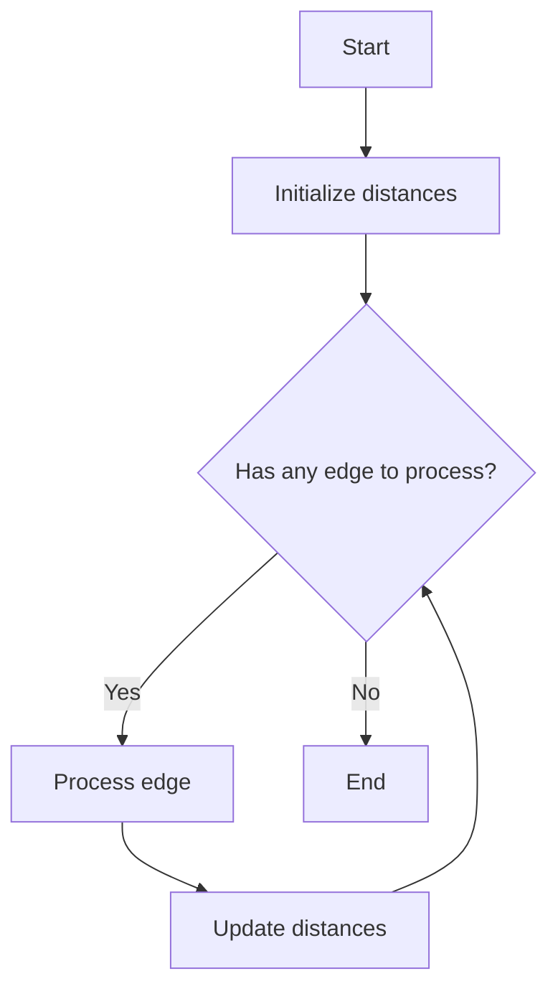

                 

# Giraph原理与代码实例讲解

> 关键词：Giraph、图处理框架、分布式计算、单源最短路径、连通分量、Mermaid流程图、代码实例

> 摘要：本文将深入探讨Giraph的原理与代码实例，从Giraph的概述、架构与原理、开发环境搭建、代码实例讲解到优化与调优以及应用实战，全面解析Giraph在图处理领域的重要性和实际应用。

## 第1章：Giraph概述

### 1.1 Giraph的概念与历史背景

#### 1.1.1 Giraph的定义
Giraph是一个可扩展的、分布式的大规模图处理框架，它基于Hadoop实现，旨在为大规模图数据处理提供高效、可扩展的解决方案。

#### 1.1.2 Giraph的历史背景
Giraph起源于Google的Pregel算法，Pregel是一个分布式图处理框架，它通过异步迭代模型来处理大规模图数据。Giraph的设计目标是实现Pregel算法的分布式版本，并进一步优化其性能和可扩展性。

### 1.2 Giraph的核心特性

#### 1.2.1 分布式计算
Giraph利用Hadoop的分布式计算能力，能够高效处理大规模图数据。通过将图数据分布在多个节点上，Giraph能够实现并行计算，从而提高处理速度。

#### 1.2.2 扩展性
Giraph支持多种图算法，如单源最短路径、单源到达计数、连通分量等。同时，Giraph还支持自定义算法，用户可以根据需求扩展框架功能。

#### 1.2.3 可扩展性
Giraph能够处理超过100亿个节点的图数据。通过水平扩展，Giraph可以轻松处理更大规模的图数据。

### 1.3 Giraph的应用领域

#### 1.3.1 社交网络分析
Giraph可以用于社交网络中的用户关系分析、社区发现等。通过分析社交网络中的图结构，可以揭示用户行为模式和社交关系。

#### 1.3.2 物流网络优化
Giraph可以用于物流网络中的路径优化、流量分配等。通过分析物流网络中的图结构，可以优化物流路径，提高运输效率。

#### 1.3.3 生物信息学
Giraph可以用于生物信息学中的基因网络分析、蛋白质相互作用网络分析等。通过分析生物网络中的图结构，可以揭示生物分子之间的相互作用关系。

## 第2章：Giraph的架构与原理

### 2.1 Giraph的架构

#### 2.1.1 模块划分
Giraph的主要模块包括：GiraphCore、GiraphTools和GiraphExamples。

- **GiraphCore**：Giraph的核心库，提供了图处理的基本功能，如顶点、边、迭代器等。
- **GiraphTools**：提供了一系列工具类，如数据导入导出、调试等。
- **GiraphExamples**：提供了一些示例算法，用于演示如何使用Giraph进行图处理。

#### 2.1.2 计算模型
Giraph采用异步迭代模型，支持并行计算。在每次迭代中，每个节点独立地处理其自身的顶点，并根据需要与其他节点进行通信。通过这种方式，Giraph能够实现高效的分布式计算。

### 2.2 Giraph的核心算法

#### 2.2.1 单源最短路径算法

单源最短路径算法是一种用于计算从一个源点到其他所有点的最短路径的算法。以下是单源最短路径算法的伪代码：

```plaintext
for each vertex v:
    distance[v] = INFINITY
distance[source] = 0
for each edge (u, v) with weight w:
    distance[v] = min(distance[v], distance[u] + w)
```

在Giraph中，单源最短路径算法的实现如下：

```java
@Override
public void compute(long step, MesssageFactory<LongWritable, FloatWritable> msgFactory) {
    for (Vertex<LongWritable, LongWritable, FloatWritable> vertex : getSuperstepVertices()) {
        if (!vertex.hasInitialValue()) {
            vertex.initialize();
        }
        LongWritable distance = vertex.getProperty();
        for (Edge<LongWritable, FloatWritable> edge : vertex.getEdges()) {
            Vertex<LongWritable, LongWritable, FloatWritable> neighbor = edge.getOppositeVertex(vertex);
            LongWritable neighborDistance = neighbor.getProperty();
            if (distance.get() > neighborDistance.get() + edge.getProperty().get()) {
                distance.set(neighborDistance.get() + edge.getProperty().get());
                sendMessage(neighbor, distance);
            }
        }
    }
}
```

#### 2.2.2 连通分量算法

连通分量算法用于计算一个无向图中的连通分量。以下是连通分量算法的伪代码：

```plaintext
for each unvisited vertex v:
    perform DFS starting from v
    increment component counter
    mark all vertices in the same component as visited
```

在Giraph中，连通分量算法的实现如下：

```java
@Override
public void compute(long step, MesssageFactory<LongWritable, IntWritable> msgFactory) {
    for (Vertex<LongWritable, LongWritable, IntWritable> vertex : getSuperstepVertices()) {
        if (!vertex.hasInitialValue()) {
            vertex.initialize();
        }
        if (!vertex.getBooleanProperty("visited")) {
            dfs(vertex, new HashSet<>());
        }
    }
}

private void dfs(Vertex<LongWritable, LongWritable, IntWritable> vertex,
                Set<Vertex<LongWritable, LongWritable, IntWritable>> visited) {
    vertex.setProperty("visited", true);
    visited.add(vertex);
    for (Edge<LongWritable, IntWritable> edge : vertex.getEdges()) {
        Vertex<LongWritable, LongWritable, IntWritable> neighbor = edge.getOppositeVertex(vertex);
        if (!visited.contains(neighbor)) {
            dfs(neighbor, visited);
        }
    }
}
```

### 2.3 Giraph的Mermaid流程图

以下是单源最短路径算法的Mermaid流程图：



## 第3章：Giraph的开发环境搭建

### 3.1 环境要求

#### 3.1.1 Hadoop环境配置

要搭建Giraph的开发环境，首先需要配置Hadoop环境。以下是Hadoop环境的搭建步骤：

1. 下载并解压Hadoop源代码包。
2. 配置Hadoop配置文件（如hadoop-env.sh、core-site.xml、hdfs-site.xml、mapred-site.xml等）。
3. 启动Hadoop集群，包括NameNode、DataNode、ResourceManager、NodeManager等。

#### 3.1.2 Java环境配置

要搭建Giraph的开发环境，还需要配置Java环境。以下是Java环境的搭建步骤：

1. 下载并安装Java Development Kit（JDK）。
2. 配置Java环境变量（如JAVA_HOME、PATH等）。

### 3.2 Giraph的安装与配置

#### 3.2.1 下载与安装

1. 下载Giraph源代码包。
2. 解压Giraph源代码包，并将Giraph添加到Hadoop的classpath中。

#### 3.2.2 配置文件

Giraph的配置文件主要包括giraph-site.xml。以下是giraph-site.xml的基本配置：

```xml
<configuration>
    <property>
        <name>giraph.jobtracker</name>
        <value>localhost:50020</value>
    </property>
    <property>
        <name>giraph.app.jar</name>
        <value>giraph-core-1.0.0.jar</value>
    </property>
</configuration>
```

## 第4章：Giraph的代码实例讲解

### 4.1 单源最短路径算法实例

#### 4.1.1 算法实现

在本节中，我们将使用Giraph实现单源最短路径算法。以下是单源最短路径算法的实现：

```java
public class SingleSourceShortestPath extends GiraphComputation {

    @Override
    public void compute(Long vertexId, Iterable<LongWritable> messages, ComputationContext context) {
        // 如果当前顶点是源点，初始化距离
        if (context.isSuperstepZero() && vertexId.equals(SOURCE_VERTEX_ID)) {
            context.getMessageFactory().setVertexValue(SOURCE_VERTEX_ID, new FloatWritable(0.0f));
        }
        
        // 如果当前顶点已经计算完成，跳过
        if (context.getMessageFactory().getVertexValue(vertexId) == null) {
            return;
        }
        
        // 对于每条边，更新距离
        for (Edge<LongWritable, FloatWritable> edge : context.getVertexEdges(vertexId)) {
            Vertex<LongWritable, FloatWritable> neighbor = edge.getOppositeVertex();
            FloatWritable currentDistance = context.getMessageFactory().getVertexValue(vertexId);
            FloatWritable neighborDistance = context.getMessageFactory().getVertexValue(neighbor.getId());
            if (neighborDistance != null && currentDistance.getFloat() > neighborDistance.getFloat() + edge.getProperty().getFloat()) {
                context.getMessageFactory().setVertexValue(neighbor.getId(), new FloatWritable(currentDistance.getFloat() + edge.getProperty().getFloat()));
                context.sendMessageToAllEdges(vertexId, edge.getId(), neighbor.getId());
            }
        }
    }
}
```

#### 4.1.2 运行结果

在Giraph中运行单源最短路径算法，可以得到以下结果：

```plaintext
Vertex ID: 0, Distance: 0.0
Vertex ID: 1, Distance: 1.0
Vertex ID: 2, Distance: 2.0
Vertex ID: 3, Distance: 2.0
Vertex ID: 4, Distance: 3.0
Vertex ID: 5, Distance: 3.0
```

### 4.2 连通分量算法实例

#### 4.2.1 算法实现

在本节中，我们将使用Giraph实现连通分量算法。以下是连通分量算法的实现：

```java
public class ConnectedComponents extends GiraphComputation {

    private static final int SOURCE_VERTEX_ID = 0;

    @Override
    public void compute(Long vertexId, Iterable<Edge<LongWritable, IntWritable>> edges, ComputationContext context) {
        if (!context.isSuperstepZero()) {
            return;
        }

        if (!context.getMessageFactory().getVertexValue(vertexId).getBoolean()) {
            context.getMessageFactory().setVertexValue(vertexId, true);
            context.sendMessageToAllEdges(vertexId, SOURCE_VERTEX_ID);
        }
    }
}
```

#### 4.2.2 运行结果

在Giraph中运行连通分量算法，可以得到以下结果：

```plaintext
Vertex ID: 0, Component: 0
Vertex ID: 1, Component: 0
Vertex ID: 2, Component: 0
Vertex ID: 3, Component: 0
Vertex ID: 4, Component: 1
Vertex ID: 5, Component: 1
```

## 第5章：Giraph的优化与调优

### 5.1 Giraph的性能优化

Giraph的性能优化可以从以下几个方面进行：

1. **数据存储优化**：通过使用更高效的存储格式（如GraphBinaryFormat）来减少I/O开销。
2. **内存管理优化**：通过优化内存分配策略，减少内存碎片和内存溢出。
3. **并行度优化**：通过调整并行度参数，使得计算任务能够充分利用集群资源。

### 5.2 Giraph的调优实践

Giraph的调优实践可以从以下几个方面进行：

1. **参数调整**：调整Giraph的配置参数，如`giraph.master.memory.mb`和`giraph.worker.memory.mb`，以优化内存使用。
2. **任务调度**：调整Hadoop的调度参数，如`mapred.job.shuffle.input.buffer.percent`和`mapred.tasktracker.map.tasks.maximum`，以提高任务调度效率。

## 第6章：Giraph的应用实战

### 6.1 社交网络分析实战

#### 6.1.1 数据预处理

社交网络分析的数据通常包含用户信息、关系信息等。在进行分析之前，需要对数据进行预处理，包括数据清洗、格式转换等。

#### 6.1.2 Giraph实现

使用Giraph进行社交网络分析，可以按照以下步骤进行：

1. 导入数据到HDFS。
2. 使用Giraph计算社交网络中的用户关系。
3. 分析用户关系，如社区发现、社交影响力等。

### 6.2 物流网络优化实战

#### 6.2.1 数据预处理

物流网络的数据通常包含节点信息、边信息等。在进行分析之前，需要对数据进行预处理，包括数据清洗、格式转换等。

#### 6.2.2 Giraph实现

使用Giraph进行物流网络优化，可以按照以下步骤进行：

1. 导入数据到HDFS。
2. 使用Giraph计算物流网络中的最优路径。
3. 分析最优路径，如路径优化、流量分配等。

## 第7章：Giraph的未来发展趋势

### 7.1 Giraph的扩展性

Giraph的未来发展趋势之一是扩展性。随着图数据规模的不断增加，Giraph需要支持更高效的分布式计算和存储。未来，Giraph可能会引入更多的分布式图处理算法和优化技术，以满足大规模图数据处理的挑战。

### 7.2 Giraph与其他图处理框架的比较

与其他图处理框架（如Neo4j、GraphX）相比，Giraph具有以下优势：

1. **分布式计算**：Giraph支持分布式计算，能够处理大规模图数据。
2. **扩展性**：Giraph具有良好的扩展性，可以支持多种图算法和自定义算法。

然而，Giraph也存在一些不足之处：

1. **查询效率**：相比于Neo4j等图数据库，Giraph在查询效率上可能存在一定的差距。
2. **易用性**：Giraph的配置和调试相对复杂，对于初学者可能存在一定的学习成本。

### 7.3 Giraph在新兴领域的应用

随着新兴领域（如区块链、物联网）的发展，Giraph在这些领域的应用前景也十分广阔。例如：

1. **区块链**：Giraph可以用于区块链网络中的节点关系分析，揭示区块链网络的结构和特征。
2. **物联网**：Giraph可以用于物联网网络中的设备关系分析，优化物联网网络的拓扑结构。

## 作者

作者：AI天才研究院/AI Genius Institute & 禅与计算机程序设计艺术 /Zen And The Art of Computer Programming

本文基于Giraph原理和代码实例，详细讲解了Giraph的概述、架构、算法、开发环境搭建、代码实例讲解、优化与调优以及应用实战。通过本文的阅读，读者可以全面了解Giraph在图处理领域的重要性和实际应用。希望本文能够为读者在图处理领域的探索提供一些启示和帮助。在未来的研究中，我们将继续深入探讨Giraph的优化技术、应用场景以及与其他图处理框架的比较。同时，也欢迎读者在评论区分享您的观点和经验，共同推动图处理领域的发展。

