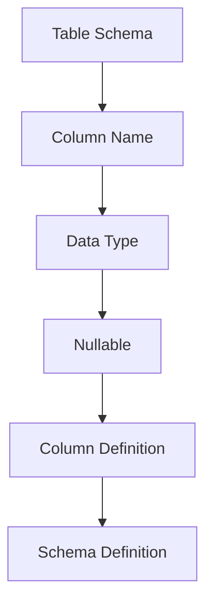

                 

# HCatalog Table原理与代码实例讲解

> 关键词：HCatalog Table，Hadoop生态系统，数据处理，大数据分析，性能优化

> 摘要：本文将深入探讨HCatalog Table的原理、架构及其在Hadoop生态系统中的应用。通过详细分析核心概念和算法原理，并结合代码实例，本文旨在帮助读者全面掌握HCatalog Table的使用方法和最佳实践，从而提升大数据处理和分析的效率。

## 第一部分：HCatalog Table基础理论

### 第1章：HCatalog Table概述

#### 1.1 HCatalog Table基本概念

HCatalog是一个基于Hadoop的表格管理工具，它允许用户以关系型数据库的表的形式来组织和访问大数据集。HCatalog Table是HCatalog的核心组件，它代表了数据存储中的表格结构。

**HCatalog简介**

HCatalog起源于Facebook，旨在解决大数据环境下数据的存储和访问问题。它提供了一套API，允许用户轻松地将结构化数据存储在Hadoop文件系统中，并支持各种数据源，如HDFS、HBase、Apache Hive等。

**Table概念**

Table在数据库中是一个二维表，由行和列组成。每个列具有特定的数据类型和名称，行表示数据的记录。在HCatalog中，Table是一个逻辑视图，它可以是物理存储的子集或多个物理存储的组合。

**Table与Database的关系**

在HCatalog中，Table是Database的组成部分。Database是一个逻辑命名空间，用于组织和管理多个Table。一个Database可以包含多个Table，每个Table都可以独立管理和访问。

#### 1.2 HCatalog Table结构

**Table Schema**

Table Schema定义了Table的列结构，包括列名、数据类型、是否允许为NULL等属性。一个典型的Table Schema可能如下所示：



**Table的数据类型**

HCatalog支持多种数据类型，包括基础数据类型（如INT、FLOAT、STRING）和复杂数据类型（如ARRAY、MAP）。复杂数据类型允许用户存储多维数据，如图形、XML文档等。

**Table属性**

Table属性包括Table名称、Database名称、数据存储路径等。属性定义了Table的元数据，这些元数据存储在Hadoop的元数据存储中，如HDFS的元数据目录。

#### 1.3 HCatalog Table的作用

**数据集成**

HCatalog Table可以与各种数据源集成，如HDFS、HBase、Amazon S3等，实现数据的多源接入和统一管理。

**数据处理**

通过HCatalog，用户可以使用Hadoop生态系统中的各种数据处理工具（如MapReduce、Spark、Pig等）对数据进行处理和分析。

**数据分析**

HCatalog Table支持SQL查询，用户可以使用标准的SQL语句进行数据分析，从而实现复杂的数据查询和报表生成。

### 第2章：HCatalog Table核心概念解析

#### 2.1 数据分区

**数据分区的意义**

数据分区是将大量数据划分为多个更小、更易于管理的部分的过程。分区可以提高查询性能，因为查询可以仅限于部分分区，而不是整个数据集。

**分区策略**

分区策略决定了如何将数据划分为多个分区。常见的分区策略包括基于列值分区、基于时间分区和基于范围分区。

**分区管理与优化**

分区管理包括创建、删除和修改分区。分区优化包括选择合适的分区策略和合理设置分区数量，以提高查询性能。

#### 2.2 数据压缩

**压缩的重要性**

数据压缩可以减少存储空间和I/O负载，提高数据传输速度。在处理大规模数据时，数据压缩尤为重要。

**常见压缩算法**

常见的压缩算法包括Gzip、Bzip2、LZO等。每种算法都有其优缺点，用户可以根据具体场景选择合适的压缩算法。

**压缩性能评估**

压缩性能评估包括压缩率、压缩时间和解压缩时间。通过评估不同压缩算法的性能，用户可以找到最佳压缩方案。

#### 2.3 数据存储

**数据存储格式**

HCatalog支持多种数据存储格式，如TextFile、SequenceFile、Parquet、ORC等。每种存储格式都有其特点，适用于不同的应用场景。

**存储管理**

存储管理包括数据的存储路径设置、权限管理和备份与恢复。

**存储优化**

存储优化包括合理设置数据存储路径、使用存储压缩和选择合适的存储格式，以提高存储性能。

### 第3章：HCatalog Table与Hadoop生态系统整合

#### 3.1 HCatalog与HDFS

**数据存储管理**

HCatalog与HDFS的整合使得用户可以将数据存储在HDFS上，并使用HCatalog Table进行管理。数据存储路径通常由Table属性指定。

**数据访问控制**

HCatalog提供了数据访问控制机制，用户可以使用HDFS的访问控制列表（ACL）来控制对数据的访问。

#### 3.2 HCatalog与MapReduce

**Table作为MapReduce输入输出**

HCatalog Table可以作为MapReduce作业的输入输出，用户可以使用HCatalog API读取Table数据并写入结果。

**MapReduce作业优化**

通过合理设置MapReduce作业的配置参数，如reduce任务数、内存管理等，可以优化MapReduce作业的性能。

#### 3.3 HCatalog与Spark整合

**Spark与HCatalog的关系**

Spark是Hadoop生态系统中的一个重要组件，它提供了高效的数据处理能力。Spark SQL是Spark的一个模块，允许用户使用SQL查询大数据集。

**Spark SQL与HCatalog的交互**

Spark SQL可以使用HCatalog Table作为数据源，用户可以在Spark SQL中使用标准的SQL语句对Table数据进行查询和分析。

## 第二部分：HCatalog Table编程基础

### 第4章：HCatalog Table编程基础

#### 4.1 HCatalog编程模型

**HCatalog API介绍**

HCatalog提供了一套Java和Python API，允许用户创建、查询、更新和删除Table。通过这些API，用户可以方便地使用HCatalog Table进行数据操作。

**HCatalog编程流程**

HCatalog编程流程包括以下步骤：

1. 创建Table Schema
2. 创建Table
3. 插入数据
4. 查询数据
5. 更新和删除数据
6. 删除Table

#### 4.2 HCatalog数据操作

**数据插入、更新与删除**

数据插入、更新和删除是数据操作的核心。以下是一个使用HCatalog Java API进行数据插入的示例：

```java
import org.apache.hadoop.hcatalog.api.HCatTable;
import org.apache.hadoop.hcatalog.api.HCatClient;
import org.apache.hadoop.hcatalog.data.schema.HCatSchema;
import org.apache.hadoop.hcatalog.data.*;

public void insertData() {
    HCatClient client = HCatClient.createJavaClient();
    HCatTable table = client.getTable("database_name", "table_name");

    HCatSchema schema = table.getSchema();
    HCatRecord record = new HCatRecord(schema);

    // 设置列值
    record.set(0, "value1");
    record.set(1, "value2");
    // ...

    // 插入数据
    client.addComponent("database_name", "table_name", record);
}
```

**数据查询与过滤**

数据查询和过滤是数据操作中的另一个重要方面。以下是一个使用HCatalog Java API进行数据查询的示例：

```java
import org.apache.hadoop.hcatalog.api.HCatClient;
import org.apache.hadoop.hcatalog.api.HCatQuery;
import org.apache.hadoop.hcatalog.api.HCatRecord;

public void queryData() {
    HCatClient client = HCatClient.createJavaClient();
    HCatQuery query = client.createQuery("SELECT * FROM database_name.table_name WHERE column_name = 'value1'");

    for (HCatRecord record : query.getResultAsList()) {
        // 处理查询结果
    }
}
```

#### 4.3 HCatalog性能优化

**索引的使用**

索引可以提高查询性能，尤其是在处理大量数据时。HCatalog支持多种索引类型，如B-Tree索引、Hash索引等。

**读写优化策略**

读写优化策略包括合理设置数据存储路径、使用存储压缩和选择合适的存储格式，以提高读写性能。

## 第三部分：HCatalog Table应用实战

### 第5章：HCatalog Table在数据分析中的应用

#### 5.1 数据预处理

**数据清洗**

数据清洗是数据分析的重要步骤，包括去除重复数据、处理缺失值、修正错误数据等。

**数据转换**

数据转换包括数据类型的转换、数据格式的转换等，以确保数据的一致性和准确性。

**数据归一化**

数据归一化是将数据按比例缩放到一个特定的范围，以便进行有效的数据分析。

#### 5.2 数据分析实战

**用户行为分析**

用户行为分析是大数据分析中的一个重要领域，包括用户访问频率、用户留存率、用户转化率等指标。

**数据可视化**

数据可视化是将数据以图形化的方式展示，以便用户更好地理解和分析数据。

#### 5.3 数据挖掘

**聚类分析**

聚类分析是一种无监督学习方法，用于将数据分组为多个类别。

**关联规则挖掘**

关联规则挖掘是一种用于发现数据之间关联关系的方法，常用于市场篮子分析和推荐系统。

### 第6章：HCatalog Table在大数据项目中的应用案例

#### 6.1 项目背景

**项目简介**

本项目是一个电商平台的数据分析项目，旨在通过分析用户行为数据，提升用户体验和销售业绩。

**技术挑战**

项目面临的技术挑战包括海量数据处理、实时数据分析和数据可视化。

#### 6.2 项目架构

**数据采集与存储**

项目采用Kafka作为数据采集工具，将用户行为数据实时写入HDFS。

**数据处理与分析**

项目使用Spark进行数据处理和分析，包括数据清洗、用户行为分析、数据挖掘等。

**系统性能优化**

项目通过使用索引、合理设置存储格式和优化网络配置，提升系统性能。

#### 6.3 项目实施

**HCatalog Table应用实例**

项目使用HCatalog Table存储用户行为数据，并使用Spark SQL进行数据分析。

**代码实现与分析**

以下是项目中的一个示例代码，用于查询用户的浏览记录：

```scala
val query = """
  SELECT user_id, url, COUNT(*) as visit_count
  FROM user_behavior
  GROUP BY user_id, url
"""
val results = spark.sql(query)

// 输出查询结果
results.show()
```

## 第7章：HCatalog Table的未来发展趋势与挑战

#### 7.1 HCatalog Table的未来发展方向

**技术创新**

HCatalog Table的未来发展方向包括增强对复杂数据类型的支持、提升查询性能和优化存储效率。

**应用扩展**

HCatalog Table可以应用于更多的领域，如物联网、人工智能等，实现更广泛的数据管理和分析。

#### 7.2 挑战与解决方案

**数据管理挑战**

数据管理挑战包括数据安全性、数据一致性和数据治理。

解决方案包括引入分布式数据库和元数据管理系统，以提高数据管理能力。

**性能优化难题**

性能优化难题包括存储优化、网络优化和查询优化。

解决方案包括使用更高效的存储格式、优化网络拓扑结构和改进查询算法。

## 附录：HCatalog Table开发工具与资源

**开发工具介绍**

**HCatalog命令行工具**

HCatalog命令行工具允许用户通过命令行方式管理Table，包括创建、删除、查询等操作。

**HCatalog编程库**

HCatalog编程库为Java和Python提供了API，方便用户通过编程方式与HCatalog交互。

**实用资源**

**HCatalog官方文档**

HCatalog官方文档提供了详细的API文档和用户指南，帮助用户快速上手。

**社区与论坛**

HCatalog社区和论坛为用户提供了交流和学习的平台，用户可以在这里提问、分享经验和获取帮助。

## 作者信息

作者：AI天才研究院/AI Genius Institute & 禅与计算机程序设计艺术 /Zen And The Art of Computer Programming

