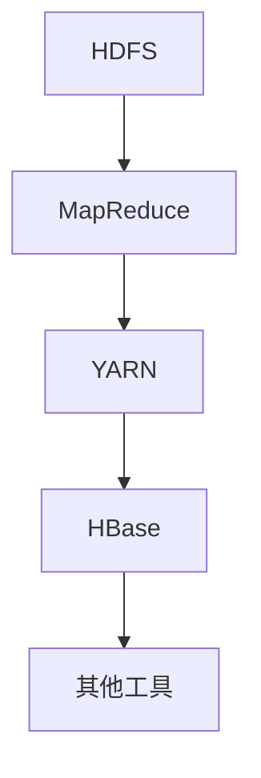
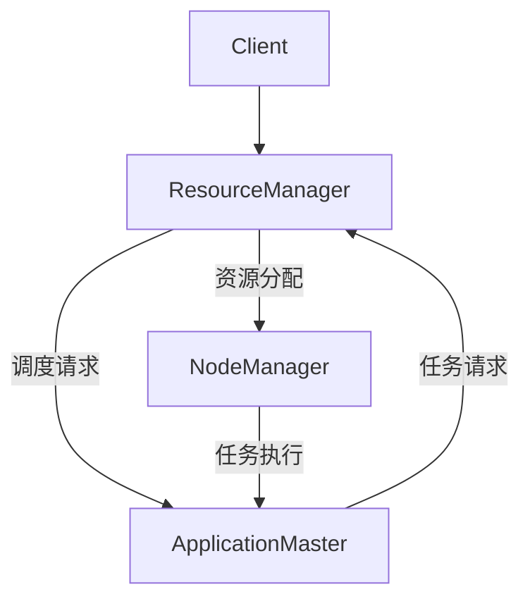

                 

### 《Hadoop》

#### 关键词

Hadoop，大数据，分布式计算，HDFS，MapReduce，YARN，HBase，实时处理

#### 摘要

本文将深入探讨Hadoop，这一在大数据时代具有重要影响力的开源框架。我们将从Hadoop的发展背景、生态系统、基础架构、核心组件详解、生态系统工具、项目实战、集群搭建与运维以及发展趋势和应用等方面，系统地介绍Hadoop的技术原理、架构设计、应用场景和实践方法。通过本文的阅读，读者将能够全面了解Hadoop的技术特点，掌握其核心组件的使用方法，并能够将其应用于实际项目开发中。

### 《Hadoop》目录大纲

#### 第1章 Hadoop概述

- **1.1 Hadoop的发展背景**
- **1.2 Hadoop生态系统**
- **1.3 Hadoop的应用领域**

#### 第2章 Hadoop基础架构

- **2.1 Hadoop分布式文件系统（HDFS）**
- **2.2 Hadoop分布式计算框架（MapReduce）**
- **2.3 Hadoop的其他重要组件**

#### 第3章 Hadoop核心组件详解

- **3.1 HDFS详解**
- **3.2 MapReduce详解**
- **3.3 HBase详解**
- **3.4 YARN详解**

#### 第4章 Hadoop生态系统工具

- **4.1 数据处理工具**
- **4.2 实时处理框架**
- **4.3 数据仓库工具**

#### 第5章 Hadoop项目实战

- **5.1 数据采集与处理**
- **5.2 数据分析与挖掘**
- **5.3 实时数据处理**

#### 第6章 Hadoop集群搭建与运维

- **6.1 集群搭建步骤**
- **6.2 集群运维**
- **6.3 安全与性能优化**

#### 第7章 Hadoop发展趋势与应用

- **7.1 Hadoop的未来发展**
- **7.2 Hadoop在各行业应用**

#### 附录

- **7.1 常用工具与资源**
- **7.2 索引**

### 核心概念与联系

- **Hadoop核心组件关系图**

### 核心算法原理讲解

- **数据清洗与转换伪代码**

### 数学模型和数学公式

- **HDFS数据复制概率计算公式**

### 项目实战

- **Hadoop数据采集与处理实战代码解读**
- **Hadoop实时数据处理实战代码解读**

### 核心概念与联系

在深入探讨Hadoop之前，理解其核心概念和组件之间的联系是非常关键的。Hadoop的核心组件包括Hadoop分布式文件系统（HDFS）、Hadoop分布式计算框架（MapReduce）和Hadoop资源调度器（YARN）等。这些组件共同构成了Hadoop强大的分布式数据处理能力。

以下是一个简单的Hadoop核心组件关系图，使用Mermaid语法绘制：



在这个图中，HDFS负责数据的存储和管理，MapReduce负责数据处理和计算，YARN负责资源调度和管理。HBase是一个分布式存储系统，可以用于存储大规模的数据集。其他工具如Storm、Flink和Hive等，则提供了更多的数据处理和分析能力。

#### Hadoop分布式文件系统（HDFS）

Hadoop分布式文件系统（HDFS）是Hadoop的核心组件之一，负责大数据的存储。HDFS设计用于处理海量数据，具有高吞吐量和容错能力。它采用了分块存储机制，将大文件分割成固定大小的数据块（默认为128MB或256MB），并存储在分布式节点上。

HDFS的主要特点包括：

1. **高容错性**：通过数据复制机制，确保数据在系统中保持多个副本，从而在节点故障时仍能保证数据不丢失。
2. **高吞吐量**：通过并行处理数据，实现高效的数据访问。
3. **高可靠性**：数据块在传输过程中采用校验和机制，确保数据的完整性。

HDFS架构包括NameNode和DataNode两部分：

- **NameNode**：负责管理文件系统的命名空间，维护文件与数据块的映射关系，并调度数据块的分配。
- **DataNode**：负责存储实际的数据块，并响应客户端的读写请求。

在HDFS中，数据复制策略如下：

- 每个数据块默认有三个副本，分别存储在不同的节点上。
- 复制过程由NameNode控制，DataNode在副本不足时自动触发复制。

假设HDFS中有n个节点，一个数据块有三个副本，根据二项式分布，我们可以计算出数据复制概率的数学模型：

$$
P(\text{至少一个副本存活}) = 1 - P(\text{所有副本均失败})
$$

其中，数据块副本失败的概率为：

$$
P(\text{副本失败}) = \left(1 - \frac{1}{n}\right)^3
$$

因此，数据块至少有一个副本存活的概率为：

$$
P(\text{至少一个副本存活}) = 1 - \left(1 - \frac{1}{n}\right)^3
$$

对于n个节点的集群，这个概率接近1，表明HDFS具有很高的数据可靠性。

#### 数据清洗与转换伪代码

数据清洗与转换是大数据处理中的重要步骤。以下是一个简单示例，使用伪代码描述数据清洗和转换的过程：

```python
# 数据清洗伪代码
def data_cleaning(data):
    cleaned_data = []
    for record in data:
        if is_valid(record):
            cleaned_data.append(record)
    return cleaned_data

# 数据转换伪代码
def data_conversion(data):
    converted_data = []
    for record in cleaned_data:
        converted_record = convert(record)
        converted_data.append(converted_record)
    return converted_data

# 辅助函数：判断数据是否有效
def is_valid(record):
    # 根据实际需求定义有效性条件
    return True

# 辅助函数：转换数据
def convert(record):
    # 根据实际需求定义转换逻辑
    return record
```

在这个伪代码中，`data_cleaning`函数用于清洗数据，去除无效记录；`data_conversion`函数用于转换数据，将清洗后的数据按照特定格式进行处理。这些步骤是实现高效数据处理的基础。

#### Hadoop分布式计算框架（MapReduce）

Hadoop分布式计算框架（MapReduce）是Hadoop的核心组件之一，用于大规模数据的处理和计算。MapReduce采用“分而治之”的思想，将大规模数据处理任务分解成多个小任务，分别执行，然后汇总结果。

MapReduce的基本编程模型包括Map阶段和Reduce阶段：

1. **Map阶段**：输入数据被划分为固定大小的数据块，每个数据块由一个Map任务处理。Map任务读取输入数据，按照某种映射函数处理，输出键值对。
2. **Reduce阶段**：Map阶段的输出结果是一个中间键值对集合，这些键值对根据键进行分组，传递给Reduce任务。Reduce任务对每组键值对进行处理，输出最终结果。

MapReduce的执行流程如下：

1. **输入**：读取输入数据，将其划分为数据块，分发到各个Map任务。
2. **Map**：每个Map任务对数据块进行处理，输出中间键值对。
3. **Shuffle**：将中间键值对根据键进行分组，分发到各个Reduce任务。
4. **Reduce**：每个Reduce任务对分组后的中间键值对进行处理，输出最终结果。
5. **输出**：将最终结果写入输出文件。

以下是MapReduce任务的伪代码：

```python
# Map阶段伪代码
def map(key, value):
    for new_key, new_value in generate_output():
        emit(new_key, new_value)

# Reduce阶段伪代码
def reduce(key, values):
    for output_value in generate_output(values):
        emit(output_value)
```

在这个伪代码中，`map`函数负责处理输入数据，生成中间键值对；`reduce`函数负责对中间键值对进行汇总和输出。通过这种模型，MapReduce能够高效地处理海量数据。

#### Hadoop资源调度器（YARN）

Hadoop资源调度器（YARN）是Hadoop的新一代资源管理框架，取代了旧的MapReduce资源管理模型。YARN的主要目标是在Hadoop集群上高效地调度和管理各种类型的计算任务，包括MapReduce、Spark和其他数据处理框架。

YARN的核心架构包括两个主要组件：

1. ** ResourceManager**：负责整体资源管理和调度，将资源分配给各个ApplicationMaster。
2. **NodeManager**：在每个计算节点上运行，负责资源管理和任务监控。

YARN的资源调度策略主要包括：

1. **公平调度**：根据资源的空闲情况公平地分配资源。
2. **容量调度**：根据节点容量分配资源，确保每个队列都能获得一定比例的资源。
3. **动态资源调整**：根据任务的执行情况动态调整资源分配。

以下是YARN的架构图：



在这个架构图中，Client向ResourceManager提交任务请求，ResourceManager根据资源情况调度任务，分配给ApplicationMaster。ApplicationMaster负责协调NodeManager上的任务执行，并将任务状态反馈给ResourceManager。

#### Hadoop的其他重要组件

除了HDFS、MapReduce和YARN，Hadoop生态系统还包括其他重要组件，如HBase、Storm、Flink等。这些组件提供了丰富的数据处理和分析能力，进一步扩展了Hadoop的功能。

1. **HBase**：一个分布式、可扩展的大规模数据存储系统，适用于实时随机访问。
2. **Storm**：一个实时流处理框架，适用于实时数据处理。
3. **Flink**：一个流处理和批处理统一的数据处理框架。

这些组件在Hadoop生态系统中扮演着重要角色，提供了多样化的数据处理解决方案。

#### 数据处理工具

Hadoop生态系统中的数据处理工具包括Hive、Pig和Spark等，它们提供了强大的数据处理和分析能力。

1. **Hive**：一个基于Hadoop的SQL查询引擎，用于大数据的存储、查询和分析。
2. **Pig**：一个基于Hadoop的大数据处理平台，使用简单易懂的Pig Latin语言进行数据处理。
3. **Spark**：一个高速大数据处理框架，支持批处理和流处理。

这些工具在Hadoop数据处理中发挥着重要作用，提供了多样化的数据处理方式。

#### 实时处理框架

实时处理框架如Storm和Flink，为Hadoop生态系统提供了强大的实时数据处理能力。

1. **Storm**：一个分布式、实时处理框架，适用于低延迟实时数据处理。
2. **Flink**：一个流处理和批处理统一的数据处理框架，适用于复杂实时数据处理场景。

这些实时处理框架能够处理大规模实时数据，提供了高效的数据处理解决方案。

#### 数据仓库工具

数据仓库工具如Impala和Hive on Spark，为Hadoop生态系统提供了强大的数据处理和分析能力。

1. **Impala**：一个高速大数据查询引擎，适用于实时数据仓库查询。
2. **Hive on Spark**：一个基于Spark的Hive查询引擎，结合了Hive和Spark的优势。

这些数据仓库工具能够高效地处理和分析海量数据，提供了强大的数据处理和分析能力。

#### Hadoop项目实战

Hadoop项目实战包括数据采集与处理、数据分析和挖掘、实时数据处理等，通过实际案例和代码解读，展示Hadoop的应用场景和实践方法。

1. **数据采集与处理**：使用Flume和Kafka进行数据采集，使用Hive和Pig进行数据处理。
2. **数据分析和挖掘**：使用Hive和Spark进行数据探索性分析，使用机器学习算法进行数据挖掘。
3. **实时数据处理**：使用Storm和Flink进行实时数据处理，处理低延迟实时数据。

通过这些实战案例，读者可以了解Hadoop在实际项目中的应用方法，掌握Hadoop的技术实现细节。

#### Hadoop集群搭建与运维

Hadoop集群搭建与运维是确保Hadoop系统正常运行的关键。包括集群搭建步骤、集群运维、集群故障排查和性能优化等方面的内容。

1. **集群搭建步骤**：从环境准备到Hadoop集群配置，逐步构建Hadoop集群。
2. **集群运维**：监控集群状态，处理集群故障，确保集群稳定运行。
3. **集群故障排查**：分析集群故障原因，排查并解决故障。
4. **性能优化**：优化Hadoop集群配置，提高集群性能。

通过这些运维实践，读者可以掌握Hadoop集群的搭建与运维方法，确保Hadoop系统的高效运行。

#### Hadoop发展趋势与应用

Hadoop在大数据时代具有重要的地位，其发展趋势和应用前景广阔。包括Hadoop版本演进、新兴技术展望、在各行业应用等方面的内容。

1. **Hadoop版本演进**：了解Hadoop版本的发展和演进过程。
2. **新兴技术展望**：探讨Hadoop在新兴技术领域的发展和应用。
3. **在各行业应用**：分析Hadoop在互联网、金融、制造业等行业的应用场景和实践案例。

通过这些内容，读者可以了解Hadoop的发展趋势和应用方向，为实际项目开发提供指导。

#### 附录

附录部分包括常用工具与资源和索引，为读者提供进一步学习和参考的资源。

1. **常用工具与资源**：列出常用的Hadoop工具和资源，包括文档、教程、社区等。
2. **索引**：提供Hadoop相关术语的解释和参考文献，方便读者查阅。

通过这些附录内容，读者可以深入了解Hadoop的相关知识，拓展学习范围。

### 总结

本文系统介绍了Hadoop的技术原理、架构设计、应用场景和实践方法。通过详细的讲解和实战案例，读者可以全面了解Hadoop的核心组件和生态系统工具，掌握Hadoop在数据存储、数据处理和实时处理等方面的应用方法。Hadoop作为大数据时代的核心框架，具有广泛的应用前景和发展潜力，值得深入学习和实践。

### 作者信息

- 作者：AI天才研究院/AI Genius Institute & 禅与计算机程序设计艺术 /Zen And The Art of Computer Programming

通过本文的阅读，读者将对Hadoop有更深入的理解，为实际项目开发提供有力支持。希望本文能够帮助读者在Hadoop的学习和实践中取得更好的成果。

