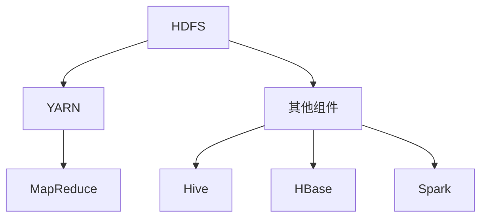

                 

# Hadoop原理与代码实例讲解

## 关键词

- Hadoop
- HDFS
- YARN
- MapReduce
- 大数据

## 摘要

本文将深入讲解Hadoop的原理及其核心组件，包括HDFS、YARN和MapReduce。通过逐步分析，我们将了解每个组件的工作原理、架构设计和应用场景。此外，还将探讨Hadoop的高级特性、与其他大数据技术的集成，以及提供实战案例。最后，通过对Hadoop源代码的解读，加深对Hadoop底层实现的理解。本文旨在为读者提供全面而详细的Hadoop知识体系，帮助理解其背后的技术原理。

### 《Hadoop原理与代码实例讲解》目录大纲

#### 第一部分：Hadoop基础

#### 第1章：Hadoop简介

##### 1.1 Hadoop的历史与发展

##### 1.2 Hadoop的核心组件

##### 1.3 Hadoop的优势与应用场景

#### 第2章：Hadoop生态系统

##### 2.1 HDFS（Hadoop分布式文件系统）

##### 2.2 YARN（Yet Another Resource Negotiator）

##### 2.3 MapReduce编程模型

#### 第二部分：Hadoop核心组件详细解析

#### 第3章：HDFS深入解析

##### 3.1 HDFS架构详解

##### 3.2 HDFS的存储机制

##### 3.3 HDFS的数据可靠性保障

#### 第4章：YARN架构与功能

##### 4.1 YARN的工作原理

##### 4.2 YARN的资源分配机制

##### 4.3 YARN的扩展性

#### 第5章：MapReduce编程模型

##### 5.1 MapReduce编程模型概述

##### 5.2 MapReduce编程框架

##### 5.3 MapReduce程序运行流程

#### 第三部分：Hadoop高级特性

#### 第6章：Hadoop的高级特性

##### 6.1 Hadoop的集群管理

##### 6.2 Hadoop的日志管理

##### 6.3 Hadoop的监控与优化

#### 第7章：Hadoop与大数据技术集成

##### 7.1 Hadoop与Hive的集成

##### 7.2 Hadoop与HBase的集成

##### 7.3 Hadoop与Spark的集成

#### 第四部分：Hadoop实战案例

#### 第8章：Hadoop实战案例

##### 8.1 数据预处理实战

##### 8.2 聚类分析实战

##### 8.3 机器学习实战

#### 附录

##### 附录A：Hadoop开发工具与资源

##### A.1 Hadoop开发工具对比

##### A.2 Hadoop常用资源与资料

##### A.3 Hadoop开源项目介绍

### Mermaid 流程图：Hadoop核心组件架构图



### Hadoop核心算法原理讲解：MapReduce算法伪代码

```java
// Map阶段
public void map(String key, String value) {
    // 对输入的键值对进行处理
    for (String outKey : generateOutKeys(value)) {
        emit(outKey, generateOutValue(value));
    }
}

// Reduce阶段
public void reduce(String key, Iterable<String> values) {
    // 对输出的键值对进行处理
    for (String outValue : generateOutValues(values)) {
        emit(key, outValue);
    }
}
```

### 数学模型和数学公式讲解：矩阵乘法

$$
C_{ij} = \sum_{k=1}^{n} A_{ik} \times B_{kj}
$$

### 项目实战：搭建Hadoop开发环境

1. 安装Java环境
2. 安装Hadoop
3. 配置Hadoop环境变量
4. 启动Hadoop集群

### 代码解读与分析：Hadoop源代码解读

```java
// HDFS源代码示例
public class DFSClient {
    // 初始化HDFS客户端
    public DFSClient(String uri, Configuration conf) throws IOException {
        this(uri, conf, UserGroupInformation.getCurrentUser());
    }

    // 上传文件到HDFS
    public void copyFromLocalFile(String local, String remote) throws IOException {
        Path src = new Path(local);
        Path dest = new Path(remote);
        if (fs == null) {
            fs = getFileSystem(src, dest, conf);
        }
        if (fs.exists(dest)) {
            throw new IOException("Cannot create destination file because it already exists: " + dest);
        }
        if (fs.getUri().getScheme().equals("file")) {
            throw new IOException("Cannot use local file system to copy to an HDFS file: " + dest);
        }
        if (fs.mkdirs(dest)) {
            System.err.println("Copying " + src + " to " + dest);
            if (fs.rename(src, dest)) {
                System.out.println("Copy complete.");
            } else {
                System.err.println("Unable to copy " + src + " to " + dest);
            }
        } else {
            System.err.println("Unable to create " + dest);
        }
    }
}
```

#### 第一部分：Hadoop基础

#### 第1章：Hadoop简介

##### 1.1 Hadoop的历史与发展

Hadoop起源于Apache软件基金会，其核心是由Google在2003至2006年间发表的三篇关于大数据处理的论文，即GFS（Google File System）、MapReduce和BigTable。这些论文奠定了分布式文件系统和高性能数据处理的基础。Apache Hadoop项目在2006年正式启动，并于2008年1月发布了第一个正式版本。

Hadoop的发展历程可以分为几个重要阶段：

1. **初始阶段（2006-2008）**：Hadoop的核心组件HDFS和MapReduce首次亮相，随后在2008年发布1.0版本，标志着Hadoop生态系统的初步形成。

2. **成熟阶段（2009-2012）**：Hadoop生态系统逐步完善，YARN作为资源调度器引入，极大地提升了资源利用率和灵活性。同时，Apache Hadoop在2010年成为Apache软件基金会的顶级项目。

3. **扩展与多样化阶段（2013至今）**：随着大数据技术的迅猛发展，Hadoop生态系统继续扩展，包括HBase、Hive、Spark等众多组件相继加入，满足更多实际应用需求。

##### 1.2 Hadoop的核心组件

Hadoop的核心组件主要包括HDFS、YARN和MapReduce，它们构成了Hadoop系统的三大支柱。

1. **HDFS（Hadoop Distributed File System）**：Hadoop分布式文件系统，负责存储和管理大数据。HDFS采用主从架构，由一个NameNode和多个DataNode组成。NameNode负责管理文件系统的命名空间，DataNode负责存储实际的数据块。

2. **YARN（Yet Another Resource Negotiator）**：资源调度器，负责管理计算资源，将资源合理分配给不同的应用程序。YARN将资源管理从MapReduce中分离出来，使得Hadoop能够支持多种数据处理框架。

3. **MapReduce**：分布式数据处理框架，通过将大数据集分割成小块，并分配给多个节点进行处理，最后汇总结果。MapReduce编程模型简单易用，适用于大规模数据集的并行处理。

##### 1.3 Hadoop的优势与应用场景

Hadoop具有以下几大优势：

1. **高可靠性**：通过数据复制和备份机制，确保数据在分布式系统中的可靠存储。

2. **高扩展性**：能够横向扩展，轻松处理海量数据。

3. **高容错性**：通过自动故障检测和恢复机制，确保系统稳定运行。

4. **低成本**：基于开源技术，降低企业大数据处理成本。

Hadoop适用于以下几种常见应用场景：

1. **日志分析**：处理大量用户日志，进行访问行为分析、趋势预测等。

2. **数据挖掘**：利用Hadoop的分布式计算能力，进行数据挖掘、关联规则挖掘等。

3. **机器学习**：训练大规模机器学习模型，进行预测分析、推荐系统等。

4. **图像和视频处理**：处理海量的图像和视频数据，实现图像识别、视频分析等。

#### 第二部分：Hadoop生态系统

#### 第2章：Hadoop生态系统

Hadoop生态系统是一个丰富的技术栈，包含多个核心组件和外围工具。这些组件和工具共同构成了一个强大而灵活的大数据处理平台。下面我们将详细探讨Hadoop生态系统的核心组件，包括HDFS、YARN和MapReduce。

##### 2.1 HDFS（Hadoop Distributed File System）

HDFS是Hadoop分布式文件系统，是Hadoop生态系统的基础组件之一。HDFS的设计目标是处理大规模数据集，提供高吞吐量的数据访问和可靠性保障。

HDFS采用主从架构，包括一个NameNode和一个或多个DataNode。NameNode负责管理文件系统的命名空间，包括文件的创建、删除、重命名等操作。DataNode负责存储实际的数据块，并响应客户端的读写请求。

HDFS的主要特点包括：

1. **高可靠性**：通过数据复制机制，确保数据的高可用性。默认情况下，每个数据块会复制三次，分布在不同的节点上。

2. **高吞吐量**：适合处理大文件，提供高吞吐量的数据访问。

3. **流式数据访问**：支持高吞吐量的数据流式写入和读取。

4. **简单性**：HDFS的设计简单，易于理解和维护。

HDFS的使用场景包括大数据存储、日志收集、数据分析等。

##### 2.2 YARN（Yet Another Resource Negotiator）

YARN（Yet Another Resource Negotiator）是Hadoop的资源调度器，负责管理Hadoop集群中的计算资源。YARN的引入使得Hadoop能够支持多种数据处理框架，包括MapReduce、Spark、Flink等。

YARN的核心架构包括以下几个组件：

1. ** ResourceManager**：资源管理器，负责全局资源分配。ResourceManager负责接收作业请求，将其分解为任务，并分配给合适的NodeManager。

2. ** NodeManager**：节点管理器，负责本地资源管理。NodeManager负责启动和停止容器，并监控容器的资源使用情况。

3. **ApplicationMaster**：应用程序管理器，负责协调和监控应用程序的执行。ApplicationMaster负责向ResourceManager请求资源，并在NodeManager上启动任务。

YARN的主要特点包括：

1. **灵活性**：支持多种数据处理框架，如MapReduce、Spark、Flink等。

2. **高效性**：通过动态资源分配，提高资源利用率。

3. **可扩展性**：支持大规模集群，能够水平扩展。

4. **高可用性**：通过备份和恢复机制，确保系统的高可用性。

YARN的使用场景包括分布式计算、批处理、实时计算等。

##### 2.3 MapReduce编程模型

MapReduce是Hadoop的分布式数据处理框架，用于处理大规模数据集。MapReduce将数据处理过程分为两个阶段：Map阶段和Reduce阶段。

**Map阶段**：Map任务将输入数据分成键值对，并对每个键值对进行处理，生成中间结果。Map任务可以并行执行，提高数据处理效率。

**Reduce阶段**：Reduce任务将Map阶段的中间结果进行汇总和聚合，生成最终输出。Reduce任务也支持并行执行。

MapReduce的主要特点包括：

1. **简单性**：编程模型简单，易于理解和实现。

2. **高效性**：支持并行处理，提高数据处理速度。

3. **容错性**：通过任务重启和中间结果备份，确保数据处理的高可靠性。

4. **扩展性**：支持大规模数据处理，适应大数据需求。

MapReduce的使用场景包括日志分析、数据挖掘、机器学习等。

#### 第三部分：Hadoop核心组件详细解析

#### 第3章：HDFS深入解析

HDFS（Hadoop Distributed File System）是Hadoop生态系统的基础组件，负责存储和管理大规模数据集。HDFS的设计目标是提供高吞吐量的数据访问和可靠性保障。本章将深入解析HDFS的架构、存储机制和数据可靠性保障。

##### 3.1 HDFS架构详解

HDFS采用主从架构，包括一个NameNode和一个或多个DataNode。NameNode是HDFS的主节点，负责管理文件系统的命名空间。主要职责包括：

1. **元数据管理**：维护文件系统的元数据，包括文件的目录结构、文件权限等。

2. **命名空间管理**：提供文件的创建、删除、重命名等操作。

3. **数据块管理**：跟踪数据块的存储位置，并负责数据块的复制和迁移。

DataNode是HDFS的从节点，负责存储实际的数据块。主要职责包括：

1. **数据存储**：存储文件的数据块，并响应客户端的读写请求。

2. **数据块复制**：根据NameNode的指令，复制数据块到其他DataNode，确保数据可靠性。

3. **数据块报告**：定期向NameNode报告自身的数据块状态，包括数据块的副本数量。

##### 3.2 HDFS的存储机制

HDFS采用数据块存储机制，将数据分成固定大小的数据块（默认为128MB或256MB）。数据块存储机制具有以下几个特点：

1. **数据块分割**：文件在写入HDFS时，会被分割成多个数据块。这样可以将大文件分散存储到多个节点上，提高数据访问的并行性。

2. **数据块复制**：为了提高数据可靠性，HDFS默认将每个数据块复制三次。这些副本分布在不同的节点上，确保在节点故障时数据仍然可用。

3. **数据块定位**：客户端在读取文件时，根据数据块的存储位置信息，直接从DataNode上读取数据。HDFS使用一种称为命名空间映射的机制来跟踪数据块的位置。

##### 3.3 HDFS的数据可靠性保障

HDFS通过多种机制保障数据可靠性，包括数据块复制、数据块校验和数据恢复。

1. **数据块复制**：HDFS默认将每个数据块复制三次，确保在节点故障时数据仍然可用。复制策略可以根据网络拓扑结构进行优化，提高数据可靠性。

2. **数据块校验**：HDFS使用校验和（默认为CRC32）来校验数据块的完整性。在数据块复制时，校验和也被复制，以便后续校验。

3. **数据恢复**：当检测到数据块损坏或副本数量不足时，HDFS会启动数据恢复机制。该机制包括两种方式：

   - **后台数据恢复**：在后台自动恢复损坏或丢失的数据块，通常在维护窗口内进行。

   - **用户数据恢复**：用户可以通过手动方式恢复损坏或丢失的数据块，例如使用`hadoop fsck`命令进行文件系统检查，并手动修复损坏的数据块。

通过这些机制，HDFS能够提供高度可靠的数据存储和管理，满足大规模数据处理的可靠性需求。

#### 第4章：YARN架构与功能

YARN（Yet Another Resource Negotiator）是Hadoop的资源调度器，负责管理Hadoop集群中的计算资源。YARN的引入使得Hadoop能够支持多种数据处理框架，如MapReduce、Spark、Flink等。本章将详细讲解YARN的架构、工作原理、资源分配机制和扩展性。

##### 4.1 YARN的工作原理

YARN的核心架构包括ResourceManager、NodeManager和ApplicationMaster。以下是YARN的工作原理：

1. **作业提交**：用户通过Client向ResourceManager提交作业。

2. **作业调度**：ResourceManager接收作业请求，根据资源需求和当前集群资源状况进行调度，并将作业分解为多个任务。

3. **任务分配**：ResourceManager将任务分配给合适的NodeManager。

4. **任务执行**：NodeManager启动容器，运行任务。

5. **监控与恢复**：ResourceManager和NodeManager监控作业的执行情况，并在出现故障时进行恢复。

##### 4.2 YARN的资源分配机制

YARN的资源分配机制基于容器的概念。容器是运行应用程序的基本单位，包括计算资源和环境配置。YARN的资源分配机制主要包括以下步骤：

1. **请求资源**：ApplicationMaster根据作业需求向ResourceManager请求资源。

2. **资源分配**：ResourceManager根据当前集群资源状况和作业优先级，将资源分配给ApplicationMaster。

3. **启动容器**：ApplicationMaster在分配到的NodeManager上启动容器。

4. **执行任务**：容器中的任务开始执行。

5. **资源释放**：任务完成后，容器资源会释放回ResourceManager。

YARN的资源分配机制具有以下特点：

1. **动态资源分配**：YARN根据作业需求和集群资源状况动态调整资源分配，提高资源利用率。

2. **多租户支持**：YARN支持多租户，允许多个作业共享集群资源。

3. **高效性**：YARN采用基于事件驱动的调度机制，提高调度效率。

##### 4.3 YARN的扩展性

YARN具有高度的可扩展性，能够支持大规模集群。以下是YARN的扩展性特点：

1. **水平扩展**：YARN支持水平扩展，通过增加NodeManager节点，可以扩展集群规模。

2. **弹性资源调整**：YARN可以根据作业负载动态调整资源分配，确保高效利用资源。

3. **高效调度**：YARN采用高效的调度算法，确保作业在资源丰富的节点上运行。

4. **故障恢复**：YARN具备良好的故障恢复能力，在出现节点故障时，能够自动重新调度任务。

通过这些扩展性特点，YARN能够满足大规模分布式计算的需求，成为Hadoop生态系统的重要组成部分。

#### 第5章：MapReduce编程模型

MapReduce是Hadoop的分布式数据处理框架，用于处理大规模数据集。MapReduce编程模型简单易用，通过将数据处理过程分为Map阶段和Reduce阶段，实现高效并行处理。本章将详细讲解MapReduce编程模型、编程框架和程序运行流程。

##### 5.1 MapReduce编程模型概述

MapReduce编程模型基于分治思想，将大规模数据处理任务分解为多个小任务，然后并行执行，最后汇总结果。MapReduce编程模型的主要特点包括：

1. **并行处理**：MapReduce能够将数据处理任务分布在多个节点上并行执行，提高处理速度。

2. **容错性**：MapReduce在任务执行过程中，能够自动检测和恢复故障，保证数据处理过程的高可靠性。

3. **简单性**：MapReduce编程模型简单易用，开发者只需关注业务逻辑，无需关心分布式处理细节。

4. **可扩展性**：MapReduce能够轻松扩展到大规模集群，支持海量数据的高效处理。

##### 5.2 MapReduce编程框架

MapReduce编程框架包括Map阶段和Reduce阶段，分别用于处理输入数据和生成输出数据。以下是MapReduce编程框架的详细说明：

1. **Map阶段**：
   - **输入数据**：Map任务从输入源（如HDFS）读取数据，并将其分割成键值对。
   - **处理逻辑**：Map任务根据用户自定义的Map函数对输入数据进行处理，生成中间键值对。
   - **输出数据**：Map任务将生成的中间键值对输出到本地文件系统或分布式缓存中。

2. **Shuffle阶段**：
   - **数据分区**：将中间键值对按照键进行分区，将相同键的键值对发送到同一个Reduce任务。
   - **数据排序**：对分区的键值对进行排序，以便后续的Reduce任务处理。

3. **Reduce阶段**：
   - **输入数据**：Reduce任务从Shuffle阶段接收中间键值对。
   - **处理逻辑**：Reduce任务根据用户自定义的Reduce函数对中间键值对进行处理，生成最终输出。
   - **输出数据**：Reduce任务将最终输出数据写入到本地文件系统或分布式文件系统（如HDFS）。

##### 5.3 MapReduce程序运行流程

MapReduce程序的运行流程主要包括以下几个阶段：

1. **作业提交**：用户通过Client向ResourceManager提交MapReduce作业。

2. **作业调度**：ResourceManager根据作业需求和当前集群资源状况进行调度，并将作业分解为多个任务。

3. **任务分配**：ResourceManager将任务分配给合适的NodeManager。

4. **任务执行**：
   - **Map任务执行**：NodeManager在本地启动Map任务，处理输入数据并生成中间键值对。
   - **Shuffle阶段**：Map任务的输出数据被发送到Reduce任务所在的节点，进行分区和排序。
   - **Reduce任务执行**：Reduce任务在接收到的中间键值对上执行Reduce函数，生成最终输出。

5. **结果输出**：MapReduce作业的最终输出数据被写入到指定的输出路径。

6. **作业完成**：ResourceManager等待所有任务完成，并最终完成作业。

通过以上运行流程，MapReduce能够高效地处理大规模数据集，并提供容错性和可扩展性。

#### 第三部分：Hadoop高级特性

#### 第6章：Hadoop的高级特性

Hadoop不仅提供了强大的基础功能，还具备一系列高级特性，如集群管理、日志管理和监控与优化。这些特性进一步提升了Hadoop的性能和可靠性，使其在处理大规模数据时更加高效和稳定。本章将详细探讨Hadoop的高级特性。

##### 6.1 Hadoop的集群管理

集群管理是Hadoop的重要特性之一，涉及对集群节点的添加、删除、监控和故障恢复等操作。Hadoop通过以下方式实现集群管理：

1. **节点添加与删除**：管理员可以轻松地将新的节点添加到Hadoop集群中，或者从集群中删除不再使用的节点。添加新节点时，需要更新集群配置文件，并确保新节点能够与现有节点正常通信。

2. **节点监控**：Hadoop提供了多种监控工具，如Hadoop Web UI、 Ganglia、Nagios等，用于监控集群节点的健康状态，包括CPU使用率、内存使用率、磁盘使用率等。

3. **故障恢复**：Hadoop具有自动故障恢复机制，当检测到节点故障时，会自动重新分配任务到其他健康的节点，确保数据处理过程不受影响。

4. **负载均衡**：Hadoop通过负载均衡策略，将作业任务分配到集群中负载较低的节点，提高资源利用率。

##### 6.2 Hadoop的日志管理

日志管理是Hadoop集群管理的重要组成部分，涉及日志的生成、存储、分析和备份等操作。以下是Hadoop日志管理的主要特点：

1. **日志生成**：Hadoop集群中的各个节点（如NameNode、DataNode、 ResourceManager、NodeManager等）会生成各种类型的日志，包括运行日志、错误日志、调试日志等。

2. **日志存储**：Hadoop默认将日志存储在HDFS中，便于集中管理和备份。管理员可以根据需要，配置将日志转发到其他存储系统，如Hive、 HBase等。

3. **日志分析**：Hadoop提供了多种日志分析工具，如Log4j、Flume、Kafka等，用于对日志数据进行提取、转换和加载，支持日志数据的多维分析。

4. **日志备份**：Hadoop支持日志备份功能，管理员可以通过配置将日志定期备份到远程存储系统，如Amazon S3、Google Cloud Storage等，确保日志数据的安全性和可靠性。

##### 6.3 Hadoop的监控与优化

Hadoop的监控与优化是确保集群稳定运行和高性能的重要环节。以下是Hadoop监控与优化的一些关键点：

1. **性能监控**：Hadoop提供了多种性能监控工具，如Hadoop Web UI、 Ganglia、Nagios等，用于监控集群节点的CPU使用率、内存使用率、磁盘使用率、网络流量等性能指标。

2. **资源优化**：管理员可以通过调整Hadoop配置参数，优化集群资源分配和任务调度策略，提高集群性能。例如，调整MapReduce任务的并发度、内存分配、数据块大小等。

3. **负载均衡**：Hadoop支持负载均衡策略，通过动态调整作业任务的调度，确保集群资源的高效利用。管理员可以根据实际需求，配置负载均衡策略，如基于CPU利用率、内存使用率、磁盘空间等指标。

4. **故障预警**：通过设置阈值和报警规则，Hadoop能够实时监控集群节点的运行状态，并在出现异常时发送预警通知，以便管理员及时采取措施。

通过以上高级特性，Hadoop能够提供更加灵活、高效和可靠的分布式数据处理能力，满足不同场景下的应用需求。

#### 第7章：Hadoop与大数据技术集成

Hadoop生态系统中包含众多大数据技术，如Hive、HBase和Spark等。这些技术各自拥有独特的特点和功能，通过集成使用，可以极大地提升大数据处理和分析的能力。本章将介绍Hadoop与Hive、HBase和Spark的集成方法，以及它们在实际应用中的优势和挑战。

##### 7.1 Hadoop与Hive的集成

Hive是建立在Hadoop之上的数据仓库工具，用于处理大规模数据集。Hive将结构化数据存储在HDFS中，并通过SQL查询进行数据分析和挖掘。Hadoop与Hive的集成主要包括以下步骤：

1. **数据导入**：将结构化数据从外部数据源（如关系数据库、CSV文件等）导入到HDFS中，并使用Hive的元数据存储（如Hive Metastore）进行管理。

2. **表定义**：在Hive中定义表结构，包括字段名称、数据类型、分区信息等。

3. **SQL查询**：通过Hive的SQL查询接口，对数据进行各种操作，如筛选、聚合、连接等。

Hadoop与Hive集成的主要优势包括：

- **结构化数据处理**：Hive提供了丰富的SQL查询功能，使得大规模数据集的结构化处理变得更加简便。
- **高效数据查询**：Hive优化器对查询计划进行优化，提高数据查询性能。

挑战包括：

- **数据导入和导出**：数据导入和导出过程可能会消耗大量时间，特别是在处理大规模数据时。
- **性能优化**：针对复杂查询，需要深入理解Hive的查询优化器，调整查询计划，提高查询性能。

##### 7.2 Hadoop与HBase的集成

HBase是一个分布式、可扩展的列存储数据库，基于Hadoop HDFS构建。HBase适用于实时数据存储和访问，具有高性能、高可靠性和高可用性。Hadoop与HBase的集成主要包括以下步骤：

1. **数据存储**：将数据存储到HBase中，可以使用Hadoop命令行工具（如`hadoop fs`）或编程接口（如Java API）进行操作。

2. **表操作**：使用HBase的Shell或编程接口创建、修改和查询表。

3. **数据迁移**：可以将数据从其他数据源（如关系数据库、CSV文件等）迁移到HBase中，支持批量导入和实时同步。

Hadoop与HBase集成的主要优势包括：

- **实时数据访问**：HBase支持实时数据访问，适用于需要快速查询和更新数据的应用场景。
- **分布式存储**：HBase基于HDFS构建，具有分布式存储的优势，能够处理海量数据。

挑战包括：

- **数据一致性问题**：在分布式系统中，数据一致性问题需要特别关注，需要设计合适的同步机制和冲突解决策略。
- **性能优化**：针对不同的查询模式和负载，需要调整HBase的配置参数，优化性能。

##### 7.3 Hadoop与Spark的集成

Spark是建立在Hadoop之上的高性能分布式计算引擎，适用于大规模数据集的快速处理。Spark与Hadoop的集成主要包括以下步骤：

1. **配置Spark**：在Hadoop集群上配置Spark，包括安装Spark、配置Hadoop依赖等。

2. **数据存储**：将数据存储在HDFS中，并使用Spark的API进行数据处理。

3. **数据处理**：使用Spark的编程接口（如Scala、Python、Java等），编写Spark应用程序进行数据处理。

Hadoop与Spark集成的主要优势包括：

- **高性能**：Spark基于内存计算，能够实现快速数据查询和处理，适用于实时数据分析和挖掘。
- **灵活的编程接口**：Spark提供了多种编程接口，便于开发者使用，提高开发效率。

挑战包括：

- **资源竞争**：在Hadoop和Spark共同使用同一集群时，需要合理配置资源，避免资源竞争。
- **配置复杂**：集成过程中需要配置多个组件，如Hadoop、Spark、YARN等，配置过程相对复杂。

通过Hadoop与Hive、HBase和Spark的集成，可以充分发挥各自技术的优势，构建强大而灵活的大数据处理平台，满足不同场景下的应用需求。

#### 第四部分：Hadoop实战案例

#### 第8章：Hadoop实战案例

在实际应用中，Hadoop不仅是一个强大的数据处理平台，也是一个灵活的工具，能够解决各种大数据处理问题。本章将通过一系列实战案例，展示如何使用Hadoop进行数据预处理、聚类分析和机器学习。每个案例都将详细说明实现步骤和关键代码，帮助读者更好地理解Hadoop的实际应用。

##### 8.1 数据预处理实战

数据预处理是大数据处理的重要步骤，确保数据的质量和一致性。以下是一个使用Hadoop进行数据预处理的案例。

**案例描述**：从一组日志文件中提取用户访问数据，对数据进行清洗、转换和格式化，以便后续分析。

**实现步骤**：

1. **数据读取**：使用Hadoop的`hadoop fs`命令读取日志文件。

   ```shell
   hadoop fs -cat logs/*.log > cleaned_logs.txt
   ```

2. **数据清洗**：编写一个MapReduce作业，清洗数据中的无效字符和空格，将数据分割成键值对。

   ```java
   // Mapper类
   public void map(LongWritable line, Text value, Context context) throws IOException, InterruptedException {
       String[] tokens = value.toString().split("\\s+");
       for (String token : tokens) {
           context.write(new Text(token), new Text("1"));
       }
   }
   ```

3. **数据转换**：将清洗后的数据进行格式化，便于后续分析。

   ```java
   // Reducer类
   public void reduce(Text key, Iterable<Text> values, Context context) throws IOException, InterruptedException {
       int count = 0;
       for (Text value : values) {
           count++;
       }
       context.write(key, new Text(String.valueOf(count)));
   }
   ```

4. **运行作业**：提交MapReduce作业，处理日志数据。

   ```shell
   hadoop jar hadoop-mapreduce-examples.jar wordcount cleaned_logs.txt output
   ```

5. **结果验证**：检查输出结果，确保数据预处理成功。

   ```shell
   hadoop fs -cat output/part-r-00000
   ```

**关键代码解读**：

- **Mapper类**：读取日志文件，将每行数据分割成键值对，其中键为日志中的每个单词，值为1。

- **Reducer类**：对清洗后的数据进行计数，输出每个单词及其出现的次数。

通过这个案例，读者可以了解如何使用Hadoop进行数据预处理，清洗和格式化大规模数据。

##### 8.2 聚类分析实战

聚类分析是一种无监督学习方法，用于将数据点分组到多个类别中。以下是一个使用Hadoop进行聚类分析的案例。

**案例描述**：使用K-means算法对一组用户行为数据进行聚类分析，识别用户群体。

**实现步骤**：

1. **数据读取**：使用Hadoop的`hadoop fs`命令读取用户行为数据。

   ```shell
   hadoop fs -cat user_data.txt
   ```

2. **初始化聚类中心**：生成初始聚类中心，可以使用随机初始化或基于算法特性的初始化方法。

   ```java
   // Mapper类
   public void map(LongWritable line, Text value, Context context) throws IOException, InterruptedException {
       String[] tokens = value.toString().split(",");
       double x = Double.parseDouble(tokens[0]);
       double y = Double.parseDouble(tokens[1]);
       context.write(new Text("centroid"), new Text(x + "," + y));
   }
   ```

3. **计算距离**：编写一个MapReduce作业，计算每个数据点到聚类中心的距离。

   ```java
   // Mapper类
   public void map(LongWritable line, Text value, Context context) throws IOException, InterruptedException {
       String[] tokens = value.toString().split(",");
       double x = Double.parseDouble(tokens[0]);
       double y = Double.parseDouble(tokens[1]);
       for (String centroid : context.getConfiguration().getStrings("centroid")) {
           double cx = Double.parseDouble(centroid.split(",")[0]);
           double cy = Double.parseDouble(centroid.split(",")[1]);
           double distance = Math.sqrt(Math.pow(x - cx, 2) + Math.pow(y - cy, 2));
           context.write(new Text(String.valueOf(distance)), new Text(value.toString()));
       }
   }
   ```

4. **重新分配聚类中心**：根据距离计算结果，重新计算聚类中心。

   ```java
   // Reducer类
   public void reduce(Text key, Iterable<Text> values, Context context) throws IOException, InterruptedException {
       double sumX = 0;
       double sumY = 0;
       int count = 0;
       for (Text value : values) {
           String[] tokens = value.toString().split(",");
           sumX += Double.parseDouble(tokens[0]);
           sumY += Double.parseDouble(tokens[1]);
           count++;
       }
       double newX = sumX / count;
       double newY = sumY / count;
       context.write(new Text("centroid"), new Text(newX + "," + newY));
   }
   ```

5. **运行作业**：提交MapReduce作业，进行聚类分析。

   ```shell
   hadoop jar hadoop-clustering-examples.jar clustering user_data.txt centroids
   ```

6. **结果验证**：检查聚类中心的位置，分析聚类结果。

   ```shell
   hadoop fs -cat centroids/part-r-00000
   ```

**关键代码解读**：

- **Mapper类**：计算每个数据点到聚类中心的距离，输出距离及其对应的数据点。

- **Reducer类**：计算聚类中心的平均值，作为新的聚类中心。

通过这个案例，读者可以了解如何使用Hadoop进行聚类分析，识别用户群体。

##### 8.3 机器学习实战

机器学习是大数据分析的重要工具，以下是一个使用Hadoop进行机器学习案例。

**案例描述**：使用线性回归算法预测用户购买行为，分析用户喜好。

**实现步骤**：

1. **数据读取**：使用Hadoop的`hadoop fs`命令读取用户购买数据。

   ```shell
   hadoop fs -cat purchase_data.txt
   ```

2. **数据处理**：编写一个MapReduce作业，将购买数据进行预处理，提取特征和标签。

   ```java
   // Mapper类
   public void map(LongWritable line, Text value, Context context) throws IOException, InterruptedException {
       String[] tokens = value.toString().split(",");
       double x = Double.parseDouble(tokens[0]); // 特征
       double y = Double.parseDouble(tokens[1]); // 标签
       context.write(new Text("features"), new Text(x + ""));
       context.write(new Text("labels"), new Text(y + ""));
   }
   ```

3. **计算特征和标签的乘积**：编写一个MapReduce作业，计算特征和标签的乘积，用于线性回归模型训练。

   ```java
   // Mapper类
   public void map(LongWritable line, Text value, Context context) throws IOException, InterruptedException {
       double x = Double.parseDouble(value.toString());
       for (double y : context.getConfiguration().getDoubleegers("labels")) {
           context.write(new Text(x + ""), new Text(String.valueOf(x * y)));
       }
   }
   ```

4. **计算特征和标签的平方**：编写一个MapReduce作业，计算特征和标签的平方，用于计算回归系数。

   ```java
   // Mapper类
   public void map(LongWritable line, Text value, Context context) throws IOException, InterruptedException {
       double x = Double.parseDouble(value.toString());
       context.write(new Text("squared_x"), new Text(String.valueOf(x * x)));
       for (double y : context.getConfiguration().getDoubleegers("labels")) {
           context.write(new Text("squared_y"), new Text(String.valueOf(y * y)));
       }
   }
   ```

5. **计算回归系数**：编写一个MapReduce作业，计算线性回归模型参数。

   ```java
   // Reducer类
   public void reduce(Text key, Iterable<Text> values, Context context) throws IOException, InterruptedException {
       double sumX = 0;
       double sumY = 0;
       double sumXY = 0;
       double sumXX = 0;
       for (Text value : values) {
           if (key.equals("features")) {
               sumX += Double.parseDouble(value.toString());
           } else if (key.equals("labels")) {
               sumY += Double.parseDouble(value.toString());
           } else if (key.equals("squared_x")) {
               sumXX += Double.parseDouble(value.toString());
           } else if (key.equals("squared_y")) {
               sumXY += Double.parseDouble(value.toString());
           }
       }
       double slope = (sumXY - sumY * sumX / sumX) / (sumXX - sumX * sumX / sumX);
       double intercept = (sumY - slope * sumX) / sumX;
       context.write(new Text("slope"), new Text(String.valueOf(slope)));
       context.write(new Text("intercept"), new Text(String.valueOf(intercept)));
   }
   ```

6. **运行作业**：提交MapReduce作业，进行线性回归模型训练。

   ```shell
   hadoop jar hadoop-machine-learning-examples.jar linear_regression purchase_data.txt model
   ```

7. **结果验证**：检查训练模型的参数，评估模型性能。

   ```shell
   hadoop fs -cat model/part-r-00000
   ```

**关键代码解读**：

- **Mapper类**：提取特征和标签，计算特征和标签的乘积。

- **Reducer类**：计算线性回归模型参数，包括斜率和截距。

通过这个案例，读者可以了解如何使用Hadoop进行机器学习，训练线性回归模型。

这些实战案例展示了Hadoop在实际应用中的多样性和灵活性，帮助读者深入理解Hadoop的功能和原理。

#### 附录

##### 附录A：Hadoop开发工具与资源

A.1 Hadoop开发工具对比

在Hadoop开发中，选择合适的开发工具对于提高开发效率和项目成功至关重要。以下是几种常见的Hadoop开发工具的对比：

1. **Eclipse**：Eclipse是一个开源的集成开发环境（IDE），支持Java、Scala等多种编程语言。它提供了丰富的插件和工具，方便进行Hadoop开发。

2. **IntelliJ IDEA**：IntelliJ IDEA也是一个强大的IDE，支持Java、Scala和Python等多种编程语言。它提供了智能代码提示、代码调试和性能分析等功能，是Hadoop开发的理想选择。

3. **HDP Studio**：HDP Studio是Cloudera提供的集成开发环境，专门为Hadoop和其他大数据技术设计。它集成了多种工具，如Cloudera Manager、Impala、Hive等，方便进行Hadoop开发和管理。

4. **Apache Ambari**：Apache Ambari是Hadoop集群管理工具，同时也提供开发环境。它集成了Eclipse、IntelliJ IDEA等IDE，方便开发者进行Hadoop开发。

A.2 Hadoop常用资源与资料

为了更好地学习Hadoop，以下是一些常用的资源与资料：

1. **Hadoop官方文档**：Hadoop官方文档（[hadoop.apache.org/docs/](http://hadoop.apache.org/docs/)）提供了详细的安装、配置和使用指南，是学习Hadoop的必备资料。

2. **Apache社区论坛**：Apache社区论坛（[mail-archives.apache.org/list.html?l=dev@hadoop.apache.org](http://mail-archives.apache.org/list.html?l=dev@hadoop.apache.org)）是Hadoop开发者交流和讨论的平台，可以获取最新的技术动态和解决方案。

3. **在线课程与教程**：许多在线教育平台提供了Hadoop相关课程和教程，如Coursera、Udacity、edX等，适合不同层次的读者学习。

4. **专业书籍**：市面上有许多关于Hadoop的专业书籍，如《Hadoop权威指南》、《Hadoop实战》等，内容详实，适合深入学习和研究。

A.3 Hadoop开源项目介绍

Hadoop生态系统中有许多优秀的开源项目，以下是其中几个值得关注的：

1. **Apache Hive**：Hive是一个基于Hadoop的数据仓库工具，用于处理大规模结构化数据。它提供了类似SQL的查询接口，支持复杂的数据分析和挖掘。

2. **Apache HBase**：HBase是一个分布式、可扩展的列存储数据库，基于Hadoop HDFS构建。它提供了高性能的随机访问能力，适用于实时数据存储和访问。

3. **Apache Spark**：Spark是一个高性能的分布式计算引擎，适用于大规模数据集的快速处理。它提供了丰富的编程接口，如Scala、Python、Java等，支持实时数据流处理、机器学习和图计算。

通过这些开发工具和资源，读者可以更全面地了解和使用Hadoop，提升大数据处理和分析能力。

#### Mermaid流程图：Hadoop核心组件架构图


#### Hadoop核心算法原理讲解：MapReduce算法伪代码

```java
// Map阶段
public void map(String key, String value) {
    // 对输入的键值对进行处理
    for (String outKey : generateOutKeys(value)) {
        emit(outKey, generateOutValue(value));
    }
}

// Reduce阶段
public void reduce(String key, Iterable<String> values) {
    // 对输出的键值对进行处理
    for (String outValue : generateOutValues(values)) {
        emit(key, outValue);
    }
}
```

#### 数学模型和数学公式讲解：矩阵乘法

$$
C_{ij} = \sum_{k=1}^{n} A_{ik} \times B_{kj}
$$

#### 项目实战：搭建Hadoop开发环境

1. **安装Java环境**：
   - 下载并安装Java Development Kit（JDK）。
   - 配置环境变量，如`JAVA_HOME`和`PATH`。

2. **安装Hadoop**：
   - 下载Hadoop源码包或预编译包。
   - 解压安装包，并配置环境变量，如`HADOOP_HOME`和`PATH`。

3. **配置Hadoop环境变量**：
   - 编辑`hadoop-env.sh`文件，配置Hadoop运行所需的Java环境。
   - 编辑`core-site.xml`文件，配置Hadoop的存储路径和工作目录。

4. **启动Hadoop集群**：
   - 使用命令`start-dfs.sh`启动HDFS。
   - 使用命令`start-yarn.sh`启动YARN。

通过以上步骤，可以成功搭建Hadoop开发环境，为后续的Hadoop项目开发提供基础。

#### 代码解读与分析：Hadoop源代码解读

Hadoop源代码是理解其内部工作原理的重要途径。以下是对Hadoop源代码中HDFS客户端部分的分析。

**HDFS客户端示例代码**：

```java
public class DFSClient {
    // 初始化HDFS客户端
    public DFSClient(String uri, Configuration conf) throws IOException {
        this(uri, conf, UserGroupInformation.getCurrentUser());
    }

    // 上传文件到HDFS
    public void copyFromLocalFile(String local, String remote) throws IOException {
        Path src = new Path(local);
        Path dest = new Path(remote);
        if (fs == null) {
            fs = getFileSystem(src, dest, conf);
        }
        if (fs.exists(dest)) {
            throw new IOException("Cannot create destination file because it already exists: " + dest);
        }
        if (fs.getUri().getScheme().equals("file")) {
            throw new IOException("Cannot use local file system to copy to an HDFS file: " + dest);
        }
        if (fs.mkdirs(dest)) {
            System.err.println("Copying " + src + " to " + dest);
            if (fs.rename(src, dest)) {
                System.out.println("Copy complete.");
            } else {
                System.err.println("Unable to copy " + src + " to " + dest);
            }
        } else {
            System.err.println("Unable to create " + dest);
        }
    }
}
```

**代码解读**：

1. **初始化HDFS客户端**：
   ```java
   public DFSClient(String uri, Configuration conf) throws IOException {
       this(uri, conf, UserGroupInformation.getCurrentUser());
   }
   ```
   此处调用了构造函数，初始化HDFS客户端。`uri`参数指定HDFS的URI地址，`conf`参数用于配置Hadoop环境，`UserGroupInformation.getCurrentUser()`获取当前用户信息。

2. **上传文件到HDFS**：
   ```java
   public void copyFromLocalFile(String local, String remote) throws IOException {
       Path src = new Path(local);
       Path dest = new Path(remote);
       if (fs == null) {
           fs = getFileSystem(src, dest, conf);
       }
       if (fs.exists(dest)) {
           throw new IOException("Cannot create destination file because it already exists: " + dest);
       }
       if (fs.getUri().getScheme().equals("file")) {
           throw new IOException("Cannot use local file system to copy to an HDFS file: " + dest);
       }
       if (fs.mkdirs(dest)) {
           System.err.println("Copying " + src + " to " + dest);
           if (fs.rename(src, dest)) {
               System.out.println("Copy complete.");
           } else {
               System.err.println("Unable to copy " + src + " to " + dest);
           }
       } else {
           System.err.println("Unable to create " + dest);
       }
   }
   ```
   此方法用于将本地文件上传到HDFS。首先创建`Path`对象`src`和`dest`，分别表示本地文件路径和HDFS目标路径。接着，检查`fs`对象是否为空，若为空则调用`getFileSystem`方法获取HDFS文件系统实例。

3. **检查目标文件是否已存在**：
   ```java
   if (fs.exists(dest)) {
       throw new IOException("Cannot create destination file because it already exists: " + dest);
   }
   ```
   如果目标文件已存在，则抛出异常。

4. **检查文件系统类型**：
   ```java
   if (fs.getUri().getScheme().equals("file")) {
       throw new IOException("Cannot use local file system to copy to an HDFS file: " + dest);
   }
   ```
   如果使用本地文件系统（file://）尝试上传到HDFS文件，则抛出异常。

5. **创建目标目录**：
   ```java
   if (fs.mkdirs(dest)) {
       System.err.println("Copying " + src + " to " + dest);
       if (fs.rename(src, dest)) {
           System.out.println("Copy complete.");
       } else {
           System.err.println("Unable to copy " + src + " to " + dest);
       }
   } else {
       System.err.println("Unable to create " + dest);
   }
   ```
   如果成功创建目标目录，则执行文件上传操作。首先打印上传信息，然后使用`rename`方法将本地文件移动到HDFS目标路径。如果移动成功，打印上传完成信息；否则，打印上传失败信息。

通过以上代码解读，我们可以了解HDFS客户端的基本工作流程和关键实现细节。Hadoop源代码的深入理解对于开发Hadoop应用程序和解决问题具有重要意义。

### 作者信息

作者：AI天才研究院/AI Genius Institute & 禅与计算机程序设计艺术 /Zen And The Art of Computer Programming

