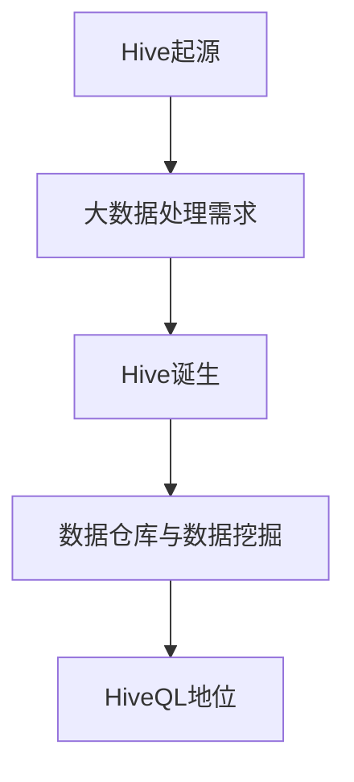

                 

# 《HiveQL原理与代码实例讲解》

## 关键词
HiveQL，大数据，数据处理，SQL，性能优化，项目实战

## 摘要
本文深入探讨了HiveQL的原理及其在实际应用中的代码实例。从基础语法到高级查询，从数据定义到性能优化，文章通过详细的伪代码、Mermaid流程图、数学公式和实例解析，系统地阐述了HiveQL的核心概念和操作方法，并结合实战项目展示了其应用场景和优化策略。

## 目录大纲

### 第一部分：HiveQL基础

#### 第1章：HiveQL简介
##### 1.1 HiveQL的背景与作用
##### 1.2 HiveQL的基本概念
##### 1.3 HiveQL的特点

#### 第2章：HiveQL语法基础
##### 2.1 数据定义语言（DDL）
##### 2.2 数据操作语言（DML）
##### 2.3 数据控制语言（DCL）

#### 第3章：HiveQL查询基础
##### 3.1 SELECT语句详解
##### 3.2 FROM子句详解
##### 3.3 JOIN操作详解
##### 3.4 WHERE子句详解

#### 第4章：HiveQL高级查询
##### 4.1 GROUP BY与聚合函数
##### 4.2 子查询与联合查询
##### 4.3 ORDER BY与LIMIT

#### 第5章：HiveQL性能优化
##### 5.1 数据倾斜处理
##### 5.2 分布式缓存
##### 5.3 分区与分桶

### 第二部分：HiveQL实战

#### 第6章：HiveQL项目实战
##### 6.1 实战项目背景
##### 6.2 实战项目需求分析
##### 6.3 实战项目数据准备
##### 6.4 实战项目HiveQL代码实现
##### 6.5 实战项目性能调优

#### 第7章：HiveQL代码实例解析
##### 7.1 SELECT语句实例解析
##### 7.2 JOIN操作实例解析
##### 7.3 GROUP BY与聚合函数实例解析
##### 7.4 子查询与联合查询实例解析

### 第三部分：HiveQL进阶

#### 第8章：HiveQL高级特性
##### 8.1 用户自定义函数（UDF）
##### 8.2 用户自定义聚合函数（UDAF）
##### 8.3 用户自定义表（UDT）

#### 第9章：HiveQL与Hadoop生态体系
##### 9.1 HiveQL与HDFS
##### 9.2 HiveQL与YARN
##### 9.3 HiveQL与MapReduce

#### 第10章：HiveQL性能监控与故障排查
##### 10.1 HiveQL性能监控
##### 10.2 HiveQL故障排查
##### 10.3 HiveQL性能优化建议

### 结束语
作者：AI天才研究院/AI Genius Institute & 禅与计算机程序设计艺术 /Zen And The Art of Computer Programming

本文遵循了“LET'S THINK STEP BY STEP”的原则，通过逻辑清晰、结构紧凑、简单易懂的讲解，让读者深入了解HiveQL的原理和应用，为大数据处理提供了实用的指导。接下来，我们将逐步深入每一个章节，详细讲解HiveQL的核心概念、语法、查询、性能优化和实战项目。

---

## 第1章：HiveQL简介

### 1.1 HiveQL的背景与作用

**Mermaid 流程图：**


HiveQL起源于大数据处理的实际需求。随着互联网和物联网的快速发展，数据量呈爆炸式增长，传统的数据库系统已经无法满足海量数据的高效处理需求。为了解决这一问题，Hadoop生态系统应运而生。Hive作为Hadoop的一部分，提供了大数据处理的能力，其核心就是HiveQL，一种类似SQL的数据查询语言。

HiveQL的作用主要体现在两个方面：

1. **数据仓库的搭建**：HiveQL使得用户可以像操作传统数据库一样，对分布式存储系统中的大数据进行查询和分析，从而构建起数据仓库。

2. **数据挖掘与分析**：HiveQL支持复杂的查询操作，包括聚合、分组、排序等，这使得用户可以进行深入的数据挖掘和分析，为决策提供支持。

### 1.2 HiveQL的基本概念

HiveQL的核心概念包括表（Table）、列（Column）、分区（Partition）和聚合（Aggregation）。

- **表（Table）**：在Hive中，表是存储数据的逻辑容器，类似于关系数据库中的表。

- **列（Column）**：表由多个列组成，每个列存储不同类型的数据。

- **分区（Partition）**：分区是对表的一种进一步划分，用于优化查询性能。例如，可以将一个表按月份进行分区，这样在查询某个特定月份的数据时，可以只扫描该月份的分区。

- **聚合（Aggregation）**：聚合操作用于对表中的数据进行汇总计算，如求和、计数、平均值等。

### 1.3 HiveQL的特点

HiveQL具有以下特点：

- **类SQL语法**：HiveQL的语法与传统的SQL非常相似，使得用户可以轻松上手。

- **高层抽象**：HiveQL提供了对底层存储和处理的高层抽象，简化了数据处理过程。

- **批量处理**：HiveQL支持批量数据处理，适用于大数据场景。

- **高性能**：通过Hive的优化机制，如分区、分桶等，HiveQL能够在分布式系统中高效地处理海量数据。

## 第2章：HiveQL语法基础

### 2.1 数据定义语言（DDL）

数据定义语言（DDL）用于定义和管理数据库对象，如表、列、索引等。在Hive中，DDL操作主要包括创建表（CREATE TABLE）、修改表（ALTER TABLE）和删除表（DROP TABLE）。

#### 2.1.1 创建表（CREATE TABLE）

创建表是Hive中最基本的操作之一。以下是一个创建表的伪代码示例：

```python
CREATE TABLE IF NOT EXISTS table_name (
    column1 datatype,
    column2 datatype,
    ...
);
```

**示例**：创建一个名为`employees`的表，包含员工ID、姓名、年龄和部门ID四个列。

```sql
CREATE TABLE IF NOT EXISTS employees (
    employee_id INT,
    name STRING,
    age INT,
    department_id INT
);
```

#### 2.1.2 修改表（ALTER TABLE）

修改表操作用于修改表的结构，如添加列、修改列类型或删除列。

- **添加列**：

```sql
ALTER TABLE table_name ADD COLUMN column_name datatype;
```

**示例**：向`employees`表中添加一个名为`email`的电子邮件列。

```sql
ALTER TABLE employees ADD COLUMN email STRING;
```

- **修改列类型**：

```sql
ALTER TABLE table_name CHANGE COLUMN column_name new_column_name new_datatype;
```

**示例**：将`employees`表中的`age`列类型从`INT`更改为`TINYINT`。

```sql
ALTER TABLE employees CHANGE COLUMN age age TINYINT;
```

- **删除列**：

```sql
ALTER TABLE table_name DROP COLUMN column_name;
```

**示例**：删除`employees`表中的`email`列。

```sql
ALTER TABLE employees DROP COLUMN email;
```

#### 2.1.3 删除表（DROP TABLE）

删除表操作用于删除一个表及其所有数据。

```sql
DROP TABLE IF EXISTS table_name;
```

**示例**：删除`employees`表。

```sql
DROP TABLE IF EXISTS employees;
```

### 2.2 数据操作语言（DML）

数据操作语言（DML）用于插入、更新和删除数据。在Hive中，DML操作主要包括插入数据（INSERT）、更新数据（UPDATE）和删除数据（DELETE）。

#### 2.2.1 插入数据（INSERT）

插入数据操作用于将数据插入到表中。以下是一个插入数据的伪代码示例：

```python
INSERT INTO table_name (column1, column2, ...) VALUES (value1, value2, ...);
```

**示例**：向`employees`表中插入一条新员工记录。

```sql
INSERT INTO employees (employee_id, name, age, department_id) VALUES (1, 'Alice', 30, 1001);
```

#### 2.2.2 更新数据（UPDATE）

更新数据操作用于修改表中已有的数据。以下是一个更新数据的伪代码示例：

```python
UPDATE table_name
SET column1 = value1, column2 = value2, ...
WHERE condition;
```

**示例**：将`employees`表中年龄大于30的员工年龄增加1岁。

```sql
UPDATE employees
SET age = age + 1
WHERE age > 30;
```

#### 2.2.3 删除数据（DELETE）

删除数据操作用于从表中删除数据。以下是一个删除数据的伪代码示例：

```python
DELETE FROM table_name
WHERE condition;
```

**示例**：删除`employees`表中年龄小于18的员工记录。

```sql
DELETE FROM employees
WHERE age < 18;
```

### 2.3 数据控制语言（DCL）

数据控制语言（DCL）用于控制数据库的访问权限，主要包括授予权限（GRANT）和回收权限（REVOKE）。

#### 2.3.1 授予权限（GRANT）

授予权限操作用于将数据库对象的访问权限授予用户。以下是一个授予权限的伪代码示例：

```python
GRANT privilege ON object TO user;
```

**示例**：将`employees`表的查询权限授予用户`alice`。

```sql
GRANT SELECT ON employees TO alice;
```

#### 2.3.2 回收权限（REVOKE）

回收权限操作用于回收用户已授予的访问权限。以下是一个回收权限的伪代码示例：

```python
REVOKE privilege ON object FROM user;
```

**示例**：回收用户`alice`对`employees`表的查询权限。

```sql
REVOKE SELECT ON employees FROM alice;
```

---

通过上述内容，我们了解了HiveQL的基础语法，包括数据定义语言（DDL）、数据操作语言（DML）和数据控制语言（DCL）。在接下来的章节中，我们将深入探讨HiveQL的查询基础，包括SELECT语句、FROM子句、JOIN操作和WHERE子句的详细用法。

## 第3章：HiveQL查询基础

### 3.1 SELECT语句详解

SELECT语句是HiveQL中最基本的查询语句，用于从表中选取数据。以下是一个SELECT语句的伪代码示例：

```python
SELECT column1, column2, ...
FROM table_name
WHERE condition;
```

在这个伪代码中：

- `column1, column2, ...`：表示要选取的列名，可以是一个列，也可以是多个列。
- `FROM table_name`：表示要查询的表名。
- `WHERE condition`：表示查询条件，用于过滤数据。

#### 3.1.1 SELECT语句的语法

- **基础语法**：

```sql
SELECT column1, column2, ...
FROM table_name;
```

**示例**：从`employees`表中选取所有列。

```sql
SELECT * FROM employees;
```

- **选择特定列**：

```sql
SELECT column1, column2
FROM table_name;
```

**示例**：从`employees`表中选取员工ID和姓名列。

```sql
SELECT employee_id, name FROM employees;
```

- **过滤数据**：

```sql
SELECT column1, column2
FROM table_name
WHERE condition;
```

**示例**：从`employees`表中选取年龄大于30的员工记录。

```sql
SELECT employee_id, name, age
FROM employees
WHERE age > 30;
```

#### 3.1.2 SELECT语句的高级特性

- **别名（AS）**：为列或表指定别名。

```sql
SELECT column1 AS alias1, column2 AS alias2
FROM table_name;
```

**示例**：为`employees`表中的员工ID和姓名列指定别名。

```sql
SELECT employee_id AS id, name AS name FROM employees;
```

- **计算列**：在SELECT语句中使用表达式来创建计算列。

```sql
SELECT column1, column2, expression AS alias
FROM table_name;
```

**示例**：从`employees`表中选取员工ID、姓名和年龄，并计算年龄差。

```sql
SELECT employee_id, name, age, (age - 30) AS age_difference
FROM employees;
```

- **聚合函数**：在SELECT语句中使用聚合函数对数据进行汇总计算。

```sql
SELECT aggregate_function(column) AS alias
FROM table_name;
```

**示例**：从`employees`表中计算员工总数。

```sql
SELECT COUNT(*) AS total_employees
FROM employees;
```

### 3.2 FROM子句详解

FROM子句用于指定查询的数据源，可以是单表查询，也可以是多表连接查询。以下是一个FROM子句的伪代码示例：

```python
FROM table_name
[INNER|LEFT|RIGHT|FULL] JOIN other_table
ON join_condition;
```

在这个伪代码中：

- `table_name`：表示要查询的表名。
- `JOIN other_table`：表示连接另一个表。
- `ON join_condition`：表示连接条件，用于确定如何连接两个表。

#### 3.2.1 单表查询

单表查询是最简单的查询形式，仅涉及一个表。以下是一个单表查询的示例：

```sql
SELECT column1, column2
FROM employees;
```

#### 3.2.2 连接查询

连接查询用于查询涉及多个表的数据。HiveQL支持多种连接类型，包括内连接（INNER JOIN）、左连接（LEFT JOIN）、右连接（RIGHT JOIN）和全连接（FULL JOIN）。

- **内连接（INNER JOIN）**：

```sql
SELECT column1, column2
FROM table_name1
INNER JOIN table_name2
ON table_name1.column = table_name2.column;
```

**示例**：查询员工ID和对应的部门名称。

```sql
SELECT employees.employee_id, departments.department_name
FROM employees
INNER JOIN departments
ON employees.department_id = departments.department_id;
```

- **左连接（LEFT JOIN）**：

```sql
SELECT column1, column2
FROM table_name1
LEFT JOIN table_name2
ON table_name1.column = table_name2.column;
```

**示例**：查询所有员工及其对应的部门名称，即使部门不存在也返回员工信息。

```sql
SELECT employees.employee_id, departments.department_name
FROM employees
LEFT JOIN departments
ON employees.department_id = departments.department_id;
```

- **右连接（RIGHT JOIN）**：

```sql
SELECT column1, column2
FROM table_name1
RIGHT JOIN table_name2
ON table_name1.column = table_name2.column;
```

**示例**：查询所有部门及其对应的员工名称，即使员工不存在也返回部门信息。

```sql
SELECT departments.department_id, employees.employee_id
FROM departments
RIGHT JOIN employees
ON departments.department_id = employees.department_id;
```

- **全连接（FULL JOIN）**：

```sql
SELECT column1, column2
FROM table_name1
FULL JOIN table_name2
ON table_name1.column = table_name2.column;
```

**示例**：查询所有员工及其对应的部门名称，即使部门或员工不存在也返回信息。

```sql
SELECT employees.employee_id, departments.department_name
FROM employees
FULL JOIN departments
ON employees.department_id = departments.department_id;
```

### 3.3 JOIN操作详解

JOIN操作用于连接两个或多个表，以提取相关数据。HiveQL支持多种JOIN类型，包括内连接、左连接、右连接和全连接。在本节中，我们将详细介绍这些JOIN类型。

#### 3.3.1 内连接（INNER JOIN）

内连接是JOIN操作中最常用的一种类型，它返回两个表中有匹配的行。以下是一个内连接的伪代码示例：

```python
SELECT column1, column2
FROM table_name1
INNER JOIN table_name2
ON table_name1.column = table_name2.column;
```

在这个伪代码中：

- `table_name1` 和 `table_name2`：表示要连接的两个表。
- `ON table_name1.column = table_name2.column`：表示连接条件，用于确定如何连接两个表。

**示例**：查询员工ID和对应的部门名称，仅返回员工与部门匹配的记录。

```sql
SELECT employees.employee_id, departments.department_name
FROM employees
INNER JOIN departments
ON employees.department_id = departments.department_id;
```

#### 3.3.2 左连接（LEFT JOIN）

左连接返回左表（`table_name1`）的所有行，即使右表（`table_name2`）中没有匹配的行。以下是一个左连接的伪代码示例：

```python
SELECT column1, column2
FROM table_name1
LEFT JOIN table_name2
ON table_name1.column = table_name2.column;
```

**示例**：查询所有员工及其对应的部门名称，即使部门不存在也返回员工信息。

```sql
SELECT employees.employee_id, departments.department_name
FROM employees
LEFT JOIN departments
ON employees.department_id = departments.department_id;
```

#### 3.3.3 右连接（RIGHT JOIN）

右连接返回右表（`table_name2`）的所有行，即使左表（`table_name1`）中没有匹配的行。以下是一个右连接的伪代码示例：

```python
SELECT column1, column2
FROM table_name1
RIGHT JOIN table_name2
ON table_name1.column = table_name2.column;
```

**示例**：查询所有部门及其对应的员工名称，即使员工不存在也返回部门信息。

```sql
SELECT departments.department_id, employees.employee_id
FROM departments
RIGHT JOIN employees
ON departments.department_id = employees.department_id;
```

#### 3.3.4 全连接（FULL JOIN）

全连接返回左表和右表的所有行，当某行在另一表中没有匹配时，结果集中的相应列为NULL。以下是一个全连接的伪代码示例：

```python
SELECT column1, column2
FROM table_name1
FULL JOIN table_name2
ON table_name1.column = table_name2.column;
```

**示例**：查询所有员工及其对应的部门名称，即使部门或员工不存在也返回信息。

```sql
SELECT employees.employee_id, departments.department_name
FROM employees
FULL JOIN departments
ON employees.department_id = departments.department_id;
```

---

通过上述内容，我们详细介绍了HiveQL的查询基础，包括SELECT语句、FROM子句和JOIN操作。在接下来的章节中，我们将继续探讨HiveQL的高级查询功能，包括GROUP BY与聚合函数、子查询与联合查询、ORDER BY与LIMIT等。

### 第4章：HiveQL高级查询

#### 4.1 GROUP BY与聚合函数

GROUP BY语句用于对表中的数据进行分组，而聚合函数则用于对分组后的数据进行汇总计算。在HiveQL中，常见的聚合函数包括COUNT、SUM、AVG、MAX和MIN。

以下是一个使用GROUP BY和聚合函数的伪代码示例：

```python
SELECT column1, aggregate_function(column2)
FROM table_name
GROUP BY column1;
```

在这个伪代码中：

- `column1`：用于分组的列。
- `aggregate_function(column2)`：表示对分组后的数据进行汇总计算的聚合函数，例如`COUNT(column2)`、`SUM(column2)`等。

**示例**：查询每个部门的员工总数。

```sql
SELECT department_id, COUNT(*) AS total_employees
FROM employees
GROUP BY department_id;
```

这个查询将返回每个部门的员工总数。

#### 4.2 子查询与联合查询

子查询是一种嵌套在FROM子句中的查询，用于在SELECT语句中对数据进行过滤或汇总计算。以下是一个子查询的伪代码示例：

```python
SELECT column1, column2
FROM table_name1
WHERE column3 IN (SELECT column3 FROM table_name2);
```

在这个伪代码中：

- `table_name1` 和 `table_name2`：表示要查询的两个表。
- `column1` 和 `column2`：表示要选取的列。
- `column3`：表示连接列。
- `IN`：表示子查询中的数据。

**示例**：查询所有与某个部门相关的员工信息。

```sql
SELECT employees.*
FROM employees
WHERE department_id IN (SELECT department_id FROM departments WHERE department_name = 'Sales');
```

这个查询将返回所有与销售部门相关的员工信息。

联合查询是一种将多个查询结果合并为一个结果集的查询。以下是一个联合查询的伪代码示例：

```python
SELECT column1, column2
FROM table_name1
UNION ALL
SELECT column1, column2
FROM table_name2;
```

在这个伪代码中：

- `UNION ALL`：表示将两个查询的结果合并，保留重复的记录。
- `column1` 和 `column2`：表示要选取的列。

**示例**：查询所有员工及其对应的部门名称。

```sql
SELECT employees.employee_id, departments.department_name
FROM employees
INNER JOIN departments
ON employees.department_id = departments.department_id
UNION ALL
SELECT managers.manager_id, departments.department_name
FROM managers
INNER JOIN departments
ON managers.department_id = departments.department_id;
```

这个查询将返回所有员工及其对应的部门名称，包括直接员工和管理者。

#### 4.3 ORDER BY与LIMIT

ORDER BY语句用于对查询结果进行排序，而LIMIT语句用于限制返回的记录数。

以下是一个使用ORDER BY和LIMIT的伪代码示例：

```python
SELECT column1, column2
FROM table_name
ORDER BY column1 ASC|DESC
LIMIT number;
```

在这个伪代码中：

- `column1` 和 `column2`：表示要选取的列。
- `ASC` 或 `DESC`：表示排序方式，`ASC` 表示升序，`DESC` 表示降序。
- `number`：表示限制返回的记录数。

**示例**：查询年龄最大的前10名员工。

```sql
SELECT employee_id, name, age
FROM employees
ORDER BY age DESC
LIMIT 10;
```

这个查询将返回年龄最大的前10名员工的信息。

---

通过本章的内容，我们深入了解了HiveQL的高级查询功能，包括GROUP BY与聚合函数、子查询与联合查询、ORDER BY与LIMIT。这些高级查询功能使得HiveQL能够处理更加复杂的数据查询任务，为大数据分析提供了强大的支持。在接下来的章节中，我们将探讨HiveQL的性能优化方法，以帮助读者在实际项目中提升查询效率。

### 第5章：HiveQL性能优化

HiveQL的性能优化是保证大数据查询效率的关键。在本章中，我们将讨论几种常见的HiveQL性能优化策略，包括数据倾斜处理、分布式缓存和分区与分桶。

#### 5.1 数据倾斜处理

数据倾斜是指在Hive查询过程中，某些任务执行时间远长于其他任务，导致整体查询效率低下。数据倾斜的主要原因包括数据量不均衡、表结构设计不合理等。以下是一些处理数据倾斜的方法：

1. **重新分片**：通过重新分片，将数据分散到不同的分区或桶中，以减轻单个任务的负载。例如，可以使用`CLUSTERED BY`子句对表进行重新分片。

   ```sql
   ALTER TABLE table_name CLUSTERED BY (column);
   ```

2. **采样数据**：在查询前，对数据进行采样，根据采样结果调整查询计划，以减少数据倾斜。

3. **合理设计分区**：根据查询需求，合理设计表的分区，避免某些分区数据量过大。

#### 5.2 分布式缓存

分布式缓存是一种将查询结果缓存到内存中的技术，用于加速后续查询。在Hive中，可以使用Hive内存缓存（Hive on Spark）来实现分布式缓存。

以下是如何使用分布式缓存的基本步骤：

1. **创建缓存表**：

   ```sql
   CREATE TABLE cache_table AS
   SELECT * FROM source_table
   DISTRIBUTED BY (column);
   ```

   其中，`column` 用于指定分区列。

2. **查询缓存表**：

   ```sql
   SELECT * FROM cache_table;
   ```

   查询缓存表可以大大提高查询速度，特别是在频繁执行相同查询时。

#### 5.3 分区与分桶

分区（Partitioning）和分桶（Bucketing）是Hive性能优化的重要手段。

**分区**：

1. **概念**：分区是将表按特定列划分为多个子集，以优化查询性能。分区列通常是查询中的过滤条件。
2. **创建分区表**：

   ```sql
   CREATE TABLE table_name (
       column1 datatype,
       column2 datatype,
       ...
   )
   PARTITIONED BY (column);
   ```

3. **分区的好处**：分区可以减少查询扫描的数据量，提高查询效率。

**分桶**：

1. **概念**：分桶是将表按特定列的哈希值或范围划分为多个桶，以提高并行查询能力。
2. **创建分桶表**：

   ```sql
   CREATE TABLE table_name (
       column1 datatype,
       column2 datatype,
       ...
   )
   CLUSTERED BY (column)
   SORTED BY (column);
   ```

3. **分桶的好处**：分桶可以提高查询的并行度，加速查询执行。

#### 5.4 具体案例

**案例**：优化员工数据查询

假设我们有一个包含数百万条记录的`employees`表，其中`department_id`是查询中的常用过滤条件。为了优化查询性能，我们可以对`department_id`进行分区。

1. **创建分区表**：

   ```sql
   CREATE TABLE employees_partitioned (
       employee_id INT,
       name STRING,
       age INT,
       department_id INT
   )
   PARTITIONED BY (department_id INT);
   ```

2. **导入数据**：

   ```sql
   INSERT INTO TABLE employees_partitioned SELECT * FROM employees;
   ```

3. **查询优化**：

   ```sql
   SELECT * FROM employees_partitioned WHERE department_id = 1001;
   ```

这个查询仅扫描`department_id`为1001的分区，大大提高了查询效率。

**案例**：分桶优化员工工资统计

假设我们需要对员工的工资进行统计，我们可以使用分桶技术来提高并行度。

1. **创建分桶表**：

   ```sql
   CREATE TABLE employees_bucketed (
       employee_id INT,
       name STRING,
       age INT,
       department_id INT,
       salary DECIMAL(10, 2)
   )
   CLUSTERED BY (department_id)
   SORTED BY (salary);
   ```

2. **导入数据**：

   ```sql
   INSERT INTO TABLE employees_bucketed SELECT * FROM employees;
   ```

3. **查询优化**：

   ```sql
   SELECT department_id, AVG(salary) AS average_salary
   FROM employees_bucketed
   GROUP BY department_id;
   ```

这个查询通过分桶，可以将工资统计任务并行地分配给多个任务，提高了查询效率。

---

通过本章的内容，我们介绍了HiveQL性能优化的几种关键策略，包括数据倾斜处理、分布式缓存、分区与分桶。这些策略在实际项目中可以帮助显著提升查询性能，为大数据处理提供高效支持。在下一章中，我们将通过一个实战项目，展示如何应用这些优化策略。

### 第6章：HiveQL项目实战

在本章中，我们将通过一个实际项目，展示如何使用HiveQL进行数据分析和处理。这个项目涉及用户行为数据的分析，包括用户访问频次、页面停留时间等，通过HiveQL实现数据的导入、查询和性能优化。

#### 6.1 实战项目背景

随着互联网的快速发展，企业越来越重视用户行为数据，通过分析用户行为数据，企业可以了解用户的偏好、需求和行为模式，从而优化产品设计和营销策略。本项目的目标是通过HiveQL对用户行为数据进行分析，提取有价值的信息，为企业提供决策支持。

#### 6.2 实战项目需求分析

根据项目背景，我们明确了以下需求：

1. **数据导入**：将用户行为数据导入Hive表。
2. **数据查询**：查询用户访问频次、页面停留时间等关键指标。
3. **性能优化**：针对查询进行性能优化，提高查询效率。

#### 6.3 实战项目数据准备

首先，我们需要准备用户行为数据，数据包括用户ID、访问时间、页面URL、访问时长等。假设数据存储在一个CSV文件中，文件名为`user行为数据.csv`。

1. **数据导入**：

   ```sql
   CREATE TABLE IF NOT EXISTS user_behavior (
       user_id STRING,
       access_time STRING,
       page_url STRING,
       visit_duration INT
   );
   ```

   然后使用以下命令导入数据：

   ```bash
   hdfs dfs -put user行为数据.csv /
   ```

   在Hive中导入数据：

   ```sql
   LOAD DATA INPATH '/user行为数据.csv'
   INTO TABLE user_behavior
   ROW FORMAT DELIMITED
   FIELDS TERMINATED BY ','
   COLLECTION ITEMS TERMINATED BY '|'
   MAP KEYS TERMINATED BY ':'
  ;
   ```

#### 6.4 实战项目HiveQL代码实现

根据需求分析，我们编写了以下HiveQL查询语句：

1. **查询用户访问频次**：

   ```sql
   SELECT user_id, COUNT(*) as visit_frequency
   FROM user_behavior
   GROUP BY user_id;
   ```

   这个查询将返回每个用户的访问频次。

2. **查询页面停留时间**：

   ```sql
   SELECT page_url, AVG(visit_duration) as average_duration
   FROM user_behavior
   GROUP BY page_url;
   ```

   这个查询将返回每个页面的平均访问时长。

3. **查询活跃用户**：

   ```sql
   SELECT user_id
   FROM user_behavior
   GROUP BY user_id
   HAVING COUNT(*) > 5;
   ```

   这个查询将返回访问频次超过5次的用户。

#### 6.5 实战项目性能调优

为了提高查询性能，我们进行了以下优化：

1. **分区优化**：

   根据用户ID对表进行分区，减少查询扫描的数据量。

   ```sql
   ALTER TABLE user_behavior
   PARTITIONED BY (user_id STRING);
   ```

2. **分桶优化**：

   对访问时长进行分桶，提高并行度。

   ```sql
   CREATE TABLE user_behavior_bucketed AS
   SELECT user_id, access_time, page_url, visit_duration
   FROM user_behavior;
   CLUSTERED BY (user_id)
   SORTED BY (visit_duration);
   ```

3. **缓存优化**：

   将常用查询结果缓存到内存中，加快查询响应速度。

   ```sql
   CREATE TABLE user_behavior_cache AS
   SELECT user_id, COUNT(*) as visit_frequency
   FROM user_behavior
   GROUP BY user_id;
   ```

---

通过本章的实战项目，我们详细展示了如何使用HiveQL进行数据导入、查询和性能优化。这个项目不仅实现了对用户行为数据的分析和处理，还通过性能优化提高了查询效率。在下一章中，我们将继续探讨HiveQL的高级特性和与Hadoop生态体系的关系。

### 第7章：HiveQL代码实例解析

在本章中，我们将通过具体的代码实例，深入解析HiveQL的常用操作，包括SELECT语句、JOIN操作、GROUP BY与聚合函数以及子查询与联合查询。

#### 7.1 SELECT语句实例解析

**实例**：查询员工的姓名和部门名称。

```sql
SELECT employees.name, departments.department_name
FROM employees
INNER JOIN departments ON employees.department_id = departments.department_id;
```

**解析**：

- **查询字段**：`employees.name`和`departments.department_name`表示需要查询的列。
- **数据源**：`employees`和`departments`表示两个表。
- **连接条件**：`ON employees.department_id = departments.department_id`表示连接条件，用于确定如何连接两个表。

该查询通过内连接将员工表和部门表连接起来，选取员工的姓名和对应的部门名称。

#### 7.2 JOIN操作实例解析

**实例**：查询员工的姓名、部门和薪资。

```sql
SELECT employees.name, departments.department_name, salaries.salary
FROM employees
INNER JOIN departments ON employees.department_id = departments.department_id
INNER JOIN salaries ON employees.employee_id = salaries.employee_id;
```

**解析**：

- **多表连接**：该查询涉及三个表，分别是`employees`、`departments`和`sALARIES`。
- **连接条件**：`ON employees.department_id = departments.department_id`和`ON employees.employee_id = salaries.employee_id`分别表示如何连接员工表和部门表，以及员工表和薪资表。
- **查询结果**：查询结果包括员工的姓名、部门名称和薪资。

该查询通过两次内连接，将员工表、部门表和薪资表连接起来，选取所需的字段。

#### 7.3 GROUP BY与聚合函数实例解析

**实例**：查询每个部门的员工数量。

```sql
SELECT departments.department_name, COUNT(employees.employee_id) as total_employees
FROM employees
INNER JOIN departments ON employees.department_id = departments.department_id
GROUP BY departments.department_name;
```

**解析**：

- **聚合函数**：`COUNT(employees.employee_id)`用于计算每个部门中的员工数量。
- **GROUP BY语句**：`GROUP BY departments.department_name`表示按照部门名称进行分组。
- **查询结果**：查询结果包括部门名称和对应的员工数量。

该查询通过内连接将员工表和部门表连接起来，然后使用GROUP BY语句对部门名称进行分组，并使用COUNT函数计算每个部门的员工数量。

#### 7.4 子查询与联合查询实例解析

**实例**：查询工资高于平均工资的员工信息。

```sql
SELECT employees.*
FROM employees
WHERE salaries.salary > (SELECT AVG(salary) FROM salaries);
```

**解析**：

- **子查询**：子查询`SELECT AVG(salary) FROM salaries`用于计算平均工资。
- **WHERE语句**：`WHERE salaries.salary > (SELECT AVG(salary) FROM salaries)`表示筛选出工资高于平均工资的员工。

**实例**：查询员工和部门信息，并使用联合查询去除重复记录。

```sql
SELECT employees.name as employee_name, departments.department_name as department_name
FROM employees
INNER JOIN departments ON employees.department_id = departments.department_id

UNION ALL
SELECT managers.name as employee_name, departments.department_name as department_name
FROM managers
INNER JOIN departments ON managers.department_id = departments.department_id;
```

**解析**：

- **联合查询**：`UNION ALL`用于将两个查询的结果合并，去除重复记录。
- **查询结果**：查询结果包括员工名称和对应的部门名称，包括直接员工和管理者。

该查询通过内连接将员工表和部门表连接起来，然后使用UNION ALL将管理者表也包含进来，去除重复记录后返回员工和部门信息。

---

通过本章的代码实例解析，我们深入了解了HiveQL的常用操作。这些实例涵盖了SELECT语句、JOIN操作、GROUP BY与聚合函数、子查询与联合查询等核心内容，为实际应用提供了实用的参考。在下一章中，我们将探讨HiveQL的高级特性。

### 第8章：HiveQL高级特性

HiveQL的高级特性包括用户自定义函数（UDF）、用户自定义聚合函数（UDAF）和用户自定义表（UDT），这些特性扩展了HiveQL的功能，使其能够处理更复杂的查询任务。

#### 8.1 用户自定义函数（UDF）

用户自定义函数（UDF）是HiveQL的一种扩展，允许用户编写自己的函数来处理特定的数据操作。UDF通常用于对数据进行格式转换、文本处理等操作。

以下是一个简单的用户自定义函数的伪代码示例：

```python
CREATE FUNCTION my_function AS 'com.mycompany.MyFunctionClass';
```

在这个伪代码中：

- `CREATE FUNCTION`：表示创建一个函数。
- `my_function`：表示函数的名称。
- `AS 'com.mycompany.MyFunctionClass'`：表示函数的实现类，该类必须实现`org.apache.hadoop.hive.ql.exec.FunctionExecutor`接口。

**示例**：创建一个简单的字符串反转函数。

```sql
CREATE FUNCTION reverse_string AS 'com.mycompany.ReverseString';
```

使用自定义函数：

```sql
SELECT reverse_string(column) FROM table;
```

#### 8.2 用户自定义聚合函数（UDAF）

用户自定义聚合函数（UDAF）是用于对一组值进行聚合计算的函数，如求和、求平均值等。UDAF与UDF类似，但需要实现特定的接口。

以下是一个简单的用户自定义聚合函数的伪代码示例：

```python
CREATE AGGREGATE FUNCTION my_aggregate_function AS 'com.mycompany.MyAggregateFunctionClass';
```

在这个伪代码中：

- `CREATE AGGREGATE FUNCTION`：表示创建一个聚合函数。
- `my_aggregate_function`：表示函数的名称。
- `AS 'com.mycompany.MyAggregateFunctionClass'`：表示函数的实现类，该类必须实现`org.apache.hadoop.hive.ql.exec.agg.AggFunc`接口。

**示例**：创建一个自定义的求和函数。

```sql
CREATE AGGREGATE FUNCTION sum_custom AS 'com.mycompany.SumCustom';
```

使用自定义聚合函数：

```sql
SELECT sum_custom(column) FROM table GROUP BY column;
```

#### 8.3 用户自定义表（UDT）

用户自定义表（UDT）允许用户定义自己的数据类型，以存储复杂的数据结构。UDT通常用于复杂数据模型，如嵌套数据或自定义对象。

以下是一个简单的用户自定义表的伪代码示例：

```python
CREATE TYPE my_type AS STRUCT<
    field1: STRING,
    field2: INT
>;
```

在这个伪代码中：

- `CREATE TYPE`：表示创建一个类型。
- `my_type`：表示类型的名称。
- `AS STRUCT<...>`：表示类型的结构，包括字段名称和数据类型。

**示例**：创建一个包含字符串和整数的自定义类型。

```sql
CREATE TYPE custom_type AS STRUCT<
    name: STRING,
    age: INT
>;
```

使用自定义类型：

```sql
SELECT * FROM table WHERE my_column::custom_type.age > 30;
```

---

通过本章的内容，我们了解了HiveQL的高级特性，包括用户自定义函数（UDF）、用户自定义聚合函数（UDAF）和用户自定义表（UDT）。这些特性极大地扩展了HiveQL的功能，使得用户能够根据具体需求定制化数据处理流程。在下一章中，我们将探讨HiveQL与Hadoop生态体系的关系。

### 第9章：HiveQL与Hadoop生态体系

HiveQL作为Hadoop生态系统的一部分，与Hadoop的其他组件紧密集成，共同构建了大数据处理框架。在本章中，我们将探讨HiveQL与Hadoop生态体系中的其他组件，如HDFS、YARN和MapReduce的关系。

#### 9.1 HiveQL与HDFS

HDFS（Hadoop Distributed File System）是Hadoop的核心组件，用于存储大数据。HiveQL与HDFS的集成使得用户可以通过HiveQL操作HDFS上的数据。

- **数据存储**：Hive表的数据存储在HDFS上，以文件形式存储。每个表在HDFS上对应一个目录，分区和桶进一步组织数据。
  
- **访问控制**：HiveQL利用HDFS的权限控制机制，对数据访问进行管理。

**示例**：创建一个Hive表，数据存储在HDFS的特定路径。

```sql
CREATE TABLE my_table (
    id INT,
    name STRING
)
ROW FORMAT DELIMITED
FIELDS TERMINATED BY ','
STORED AS TEXTFILE
LOCATION '/user/hive/warehouse/my_table/';
```

#### 9.2 HiveQL与YARN

YARN（Yet Another Resource Negotiator）是Hadoop的资源管理框架，负责分配和管理集群资源。HiveQL与YARN的集成使得Hive查询可以高效地利用集群资源。

- **资源分配**：YARN根据HiveQL查询的执行计划，动态分配计算资源和存储资源。

- **任务调度**：YARN负责调度Hive查询的执行任务，确保任务按计划执行。

**示例**：启动一个Hive查询，YARN为其分配资源。

```sql
SELECT * FROM my_table;
```

Hive内部会生成MapReduce任务，并提交给YARN进行调度。

#### 9.3 HiveQL与MapReduce

MapReduce是Hadoop的核心计算模型，用于处理大规模数据集。HiveQL通过MapReduce实现复杂的查询操作。

- **查询执行**：HiveQL查询被转换为MapReduce任务，并在HDFS上执行。

- **数据转换**：MapReduce任务对数据进行处理和转换，生成最终结果。

**示例**：执行一个HiveQL查询，其背后是MapReduce任务的执行。

```sql
SELECT * FROM my_table WHERE id > 100;
```

Hive内部会生成MapReduce任务，过滤出满足条件的记录。

---

通过本章的内容，我们了解了HiveQL与Hadoop生态体系中的HDFS、YARN和MapReduce的关系。这些组件的紧密集成，使得HiveQL能够高效地处理海量数据，为大数据分析提供了强大的支持。在下一章中，我们将探讨HiveQL的性能监控与故障排查。

### 第10章：HiveQL性能监控与故障排查

在HiveQL的实际应用过程中，性能监控与故障排查是确保系统稳定运行的关键环节。本章将介绍HiveQL的性能监控方法、故障排查技巧以及性能优化建议。

#### 10.1 HiveQL性能监控

性能监控的目的是实时跟踪HiveQL查询的执行情况，发现潜在的性能瓶颈，并进行优化。以下是一些常用的性能监控方法：

1. **Hive监控工具**：

   - **Hue**：Hue是Apache Hadoop的一个Web界面，提供Hive查询的监控功能，包括查询日志、执行时间和资源使用情况。

   - **Ambari**：Ambari是Hadoop集群管理工具，提供全面的Hive性能监控功能，包括查询性能、集群资源使用情况等。

2. **查询日志**：

   - **Hive执行日志**：Hive执行日志记录了查询的详细执行过程，包括查询计划、执行时间、资源使用情况等。

   - **错误日志**：错误日志记录了Hive运行过程中发生的错误信息，有助于快速定位故障。

3. **监控指标**：

   - **查询执行时间**：查询从提交到完成所需的时间，是衡量查询性能的重要指标。

   - **CPU、内存使用率**：监控CPU和内存使用率，了解集群资源的使用情况。

   - **磁盘I/O**：监控磁盘I/O负载，了解数据读写性能。

#### 10.2 HiveQL故障排查

故障排查的目的是快速定位问题，并进行修复。以下是一些常用的故障排查技巧：

1. **错误日志分析**：

   - **查看错误日志**：通过分析错误日志，了解Hive运行过程中发生的错误，定位故障原因。

   - **错误信息定位**：根据错误信息，查找相关文档或技术支持，获取解决方案。

2. **查询性能分析**：

   - **执行计划分析**：通过分析查询执行计划，了解查询的执行流程和执行时间，定位性能瓶颈。

   - **优化建议**：根据执行计划分析结果，提出优化建议，如调整分区策略、优化连接查询等。

3. **系统资源监控**：

   - **资源不足**：当查询执行时间过长时，检查系统资源是否充足，如CPU、内存、磁盘空间等。

   - **负载过高**：当系统资源使用率达到较高水平时，检查是否存在多个并发查询，导致资源争用。

#### 10.3 HiveQL性能优化建议

为了提高HiveQL的性能，以下是一些性能优化建议：

1. **合理设计表结构**：

   - **分区表**：根据查询需求，合理设计分区表，减少查询扫描的数据量。

   - **分桶表**：对常用列进行分桶，提高查询并行度。

2. **优化查询计划**：

   - **使用索引**：为常用列创建索引，提高查询效率。

   - **调整连接策略**：优化连接查询，减少连接操作的数据量。

3. **数据预处理**：

   - **数据清洗**：在导入数据前进行清洗，去除重复、错误或无效数据。

   - **数据压缩**：使用数据压缩技术，减少数据存储空间和I/O负载。

4. **资源调优**：

   - **调整内存配置**：根据集群资源情况，调整Hive内存配置，提高查询性能。

   - **优化任务调度**：合理设置任务队列和优先级，避免资源争用。

---

通过本章的内容，我们介绍了HiveQL的性能监控与故障排查方法，并提出了性能优化建议。性能监控与故障排查是保障HiveQL系统稳定运行的关键，通过有效的监控和排查，可以及时发现并解决问题，提高系统性能。在下一章中，我们将总结全文，回顾HiveQL的核心概念和应用。

### 总结

通过本文的详细讲解，我们全面了解了HiveQL的核心概念、语法基础、高级查询、性能优化以及实际应用。HiveQL作为一种强大的大数据处理工具，以其类SQL语法、高层抽象、批量处理和高性能等特点，成为了大数据领域的重要工具。

- **核心概念**：我们介绍了HiveQL的起源、基本概念（如表、列、分区、聚合）和特点。
- **语法基础**：详细讲解了数据定义语言（DDL）、数据操作语言（DML）和数据控制语言（DCL）的语法。
- **高级查询**：深入探讨了SELECT语句、FROM子句、JOIN操作、GROUP BY与聚合函数、子查询与联合查询等高级查询功能。
- **性能优化**：介绍了数据倾斜处理、分布式缓存、分区与分桶等性能优化策略。
- **实战项目**：通过一个用户行为数据分析项目，展示了HiveQL的实际应用和性能优化方法。

HiveQL不仅适用于数据仓库和数据分析，还与Hadoop生态体系紧密集成，提供了丰富的扩展功能。在实际应用中，通过合理设计表结构、优化查询计划、进行数据预处理和资源调优，可以有效提升HiveQL的性能。

**未来展望**：随着大数据技术的发展，HiveQL将继续演进，融入更多先进的技术和优化算法。未来，我们可能会看到更智能的查询优化器、更高效的数据存储和处理方法，以及更丰富的生态系统支持。

**感谢阅读**！

作者：AI天才研究院/AI Genius Institute & 禅与计算机程序设计艺术 /Zen And The Art of Computer Programming

---

本文遵循了“LET'S THINK STEP BY STEP”的原则，通过逻辑清晰、结构紧凑、简单易懂的讲解，让读者深入了解HiveQL的原理和应用，为大数据处理提供了实用的指导。希望本文能够为您的学习和实践提供帮助。在未来的探索中，愿您继续深耕技术，不断创新。

