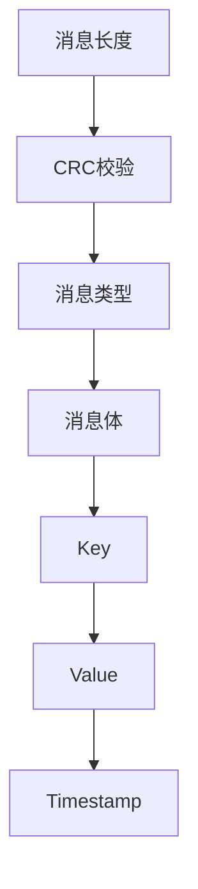

                 

### 文章标题

# Kafka Broker原理与代码实例讲解

---

### 关键词

Kafka、Broker、消息队列、分布式系统、性能优化、安全性

---

### 摘要

本文旨在深入解析Kafka Broker的原理，并通过实际代码实例进行讲解。文章首先介绍了Kafka Broker的基础概念和架构，然后详细阐述了Kafka消息模型、Producer和Consumer的工作流程，以及消息传递机制。接下来，文章深入探讨了Kafka Broker的内部结构和网络通信机制，并分析了配置优化和性能调优的方法。随后，文章介绍了Kafka的安全机制和权限控制，并通过实战案例展示了Kafka Broker的实际应用。最后，文章总结了Kafka Broker的发展趋势和应用场景，并提供了相关的参考资料和扩展阅读。通过本文的阅读，读者可以全面了解Kafka Broker的工作原理和实际应用，为日后的开发和优化工作提供有力的理论支持和实践经验。

---

### 目录大纲

## 第1章：Kafka Broker概述

### 1.1 Kafka Broker基础概念

- Kafka的架构和组成部分
- Kafka Broker的作用和功能
- Kafka集群的组成和运作原理

### 1.2 Kafka消息模型

- 消息、主题和分区
- 消息的持久化和顺序性
- 分区的分配策略

### 1.3 Kafka Producer和Consumer

- Producer消息发送流程
- Consumer消息消费流程
- Consumer Group和负载均衡

### 1.4 Kafka消息传递机制

- 消息的存储和索引
- 消息的复制和备份
- 消息的确认和消费进度

## 第2章：Kafka Broker原理

### 2.1 Kafka Broker内部结构

- Kafka Broker的架构和组件
- Kafka日志存储和文件系统

### 2.2 Kafka日志管理

- 日志文件的组织和格式
- 日志文件的读写操作
- 日志清理和压缩策略

### 2.3 Kafka线程模型

- Kafka的线程架构和工作流程
- 线程职责和协同工作

### 2.4 Kafka网络通信

- Kafka的网络协议和消息格式
- Kafka客户端和服务端的通信机制

## 第3章：Kafka Broker配置与优化

### 3.1 Kafka Broker配置项

- Kafka Broker的基本配置
- Kafka主题和分区的配置
- Kafka性能调优参数

### 3.2 Kafka集群管理

- Kafka集群的搭建和运维
- Kafka集群扩展和故障转移

### 3.3 Kafka性能优化

- Kafka性能评估指标
- Kafka网络和磁盘性能优化

### 3.4 Kafka监控与故障排查

- Kafka监控工具和指标
- Kafka故障排查和恢复

## 第4章：Kafka Broker安全与权限控制

### 4.1 Kafka安全机制

- Kafka的安全协议
- Kafka的认证和授权机制

### 4.2 Kafka ACL管理

- ACL的基本概念和权限定义
- ACL的配置和使用方法

### 4.3 Kafka安全最佳实践

- 安全配置建议
- 安全防护措施和漏洞修复

## 第5章：Kafka Broker项目实战

### 5.1 Kafka Broker开发环境搭建

- 开发环境配置和依赖安装

### 5.2 Kafka Broker源代码解读

- 源代码结构解析
- 主要模块和类的作用

### 5.3 Kafka Broker功能实现分析

- Broker启动流程
- 消息存储和索引机制
- 网络通信和数据传输

### 5.4 Kafka Broker代码解读与分析

- 代码解读示例
- 代码优化和性能分析

## 第6章：Kafka Broker性能测试与调优

### 6.1 Kafka Broker性能测试

- 测试工具和指标
- 测试场景和方案

### 6.2 Kafka Broker性能调优

- 参数调优技巧
- 性能瓶颈分析和优化方案

### 6.3 Kafka Broker性能测试与调优案例

- 实际性能测试结果
- 性能优化策略和效果分析

## 第7章：Kafka Broker总结与展望

### 7.1 Kafka Broker的发展趋势

- 新功能和特性介绍
- 未来发展方向

### 7.2 Kafka Broker应用场景和挑战

- 应用场景分析
- 挑战和解决方案

### 7.3 Kafka Broker的未来发展

- 技术趋势
- 行业应用展望

## 附录：Kafka Broker资源与工具

### 附录 A：Kafka Broker资源

- Kafka文档和社区
- Kafka工具和插件

### 附录 B：Kafka Broker开源项目

- Kafka开源项目和贡献者
- 开源项目的使用和贡献指南

## 第8章：Kafka Broker核心算法原理

### 8.1 Kafka分区算法

- 分区策略概述
- 详细解析和伪代码实现

### 8.2 Kafka负载均衡算法

- 负载均衡机制
- 算法和伪代码实现

### 8.3 Kafka消息确认机制

- 确认机制原理
- 算法和伪代码实现

### 8.4 Kafka压缩算法

- 压缩算法概述
- 算法和伪代码实现

## 第9章：Kafka Broker数学模型与公式

### 9.1 Kafka消息传输模型

- 消息传输延迟计算
- 公式推导和解释

### 9.2 Kafka分区负载均衡模型

- 分区分配公式
- 负载均衡分析

### 9.3 Kafka消息确认模型

- 确认机制可靠性分析
- 公式推导和解释

### 9.4 Kafka压缩效率模型

- 压缩效率计算
- 公式推导和解释

## 第10章：Kafka Broker实战案例

### 10.1 Kafka Broker搭建与配置

- Kafka集群搭建
- Broker配置优化

### 10.2 Kafka消息生产与消费

- 生产者代码实例
- 消费者代码实例

### 10.3 Kafka消息持久化与索引

- 消息存储实现
- 索引构建与查询

### 10.4 Kafka消息传输与网络通信

- 消息传输流程
- 网络通信实现

## 第11章：Kafka Broker监控与故障排查

### 11.1 Kafka Broker监控指标

- 指标收集和展示
- 监控工具推荐

### 11.2 Kafka Broker故障排查

- 故障定位和诊断
- 常见问题和解决方案

### 11.3 Kafka Broker日志分析

- 日志格式和解析
- 日志分析工具使用

### 11.4 Kafka Broker性能优化

- 性能分析工具使用
- 优化策略和实践案例

## 第12章：Kafka Broker最佳实践与安全

### 12.1 Kafka Broker最佳实践

- Broker配置最佳实践
- 集群管理最佳实践

### 12.2 Kafka Broker安全最佳实践

- 安全配置最佳实践
- 访问控制与审计策略

### 12.3 Kafka Broker性能优化与安全

- 综合性能优化策略
- 安全配置与性能优化关系

## 第13章：Kafka Broker未来展望与趋势

### 13.1 Kafka Broker技术趋势

- 新技术引入和应用
- 未来发展方向

### 13.2 Kafka Broker应用场景

- 行业应用案例
- 未来应用前景

### 13.3 Kafka Broker与生态圈

- Kafka生态圈介绍
- 生态圈协同发展

### 13.4 Kafka Broker未来规划

- 版本更新计划
- 技术创新方向

## 第14章：Kafka Broker参考资料与扩展阅读

### 14.1 Kafka参考资料

- 官方文档和书籍
- 社区资源和论坛

### 14.2 Kafka扩展阅读

- 相关技术文章和论文
- 最新研究动态和趋势

## 第15章：Kafka Broker问答与讨论

### 15.1 Kafka Broker常见问题解答

- 常见问题和解答
- 实际案例解析

### 15.2 Kafka Broker讨论话题

- 技术讨论和分享
- 应用经验和心得

### 文章标题：Kafka Broker原理与代码实例讲解

关键词：Kafka、Broker、消息队列、分布式系统、性能优化、安全性

摘要：本文旨在深入解析Kafka Broker的原理，并通过实际代码实例进行讲解。文章首先介绍了Kafka Broker的基础概念和架构，然后详细阐述了Kafka消息模型、Producer和Consumer的工作流程，以及消息传递机制。接下来，文章深入探讨了Kafka Broker的内部结构和网络通信机制，并分析了配置优化和性能调优的方法。随后，文章介绍了Kafka的安全机制和权限控制，并通过实战案例展示了Kafka Broker的实际应用。最后，文章总结了Kafka Broker的发展趋势和应用场景，并提供了相关的参考资料和扩展阅读。通过本文的阅读，读者可以全面了解Kafka Broker的工作原理和实际应用，为日后的开发和优化工作提供有力的理论支持和实践经验。

## 第1章：Kafka Broker概述

### 1.1 Kafka Broker基础概念

Kafka是一个分布式流处理平台，由LinkedIn开源，目前已成为大数据领域中非常流行的一个开源消息队列系统。在Kafka的架构中，Broker是一个重要的组件，扮演着消息中转、存储、管理和复制等关键角色。下面我们将详细阐述Kafka的架构和组成部分、Kafka Broker的作用和功能，以及Kafka集群的组成和运作原理。

#### Kafka的架构和组成部分

Kafka的架构主要包括以下几个部分：

1. **Producer**：消息的生产者，负责产生和发送消息到Kafka集群。
2. **Consumer**：消息的消费者，从Kafka集群中读取消息进行处理。
3. **Broker**：消息中间件服务器，负责接收Producer发送的消息，并将消息存储在磁盘上，同时提供消息的读取服务。
4. **Topic**：Kafka中的消息分类，类似于邮件中的邮箱，每个Topic可以有多个分区（Partition）。
5. **Partition**：每个Topic下的消息分区，保证了消息的并行处理能力。
6. **Offset**：消息在Partition中的唯一标识，用于表示消费者的消费进度。

Kafka集群通常由多个Broker组成，这些Broker之间通过网络进行通信，共同维护数据的完整性和一致性。

#### Kafka Broker的作用和功能

Kafka Broker的主要作用包括：

1. **消息存储**：接收Producer发送的消息，并将消息存储在磁盘上。
2. **消息转发**：处理Consumer对消息的读取请求，将消息从磁盘读取并转发给Consumer。
3. **负载均衡**：在多个Broker之间均衡消息存储和读取的负载。
4. **数据复制**：为了提高数据可靠性和可用性，Kafka会将消息复制到多个Broker上，确保即使某个Broker出现故障，系统仍然能够正常工作。

#### Kafka集群的组成和运作原理

一个典型的Kafka集群由多个Broker组成，每个Broker都可以接收和发送消息。Kafka集群的工作原理如下：

1. **初始化**：集群启动时，各Broker之间会通过Zookeeper进行注册和通信，确定集群的拓扑结构。
2. **分区分配**：每个Topic在创建时会被分配到多个Partition上，Partition的分配策略可以通过Kafka配置文件指定，默认使用Range策略。
3. **消息存储**：Producer将消息发送到指定的Topic和Partition，Broker接收消息后将其存储在磁盘上，同时为每个消息分配一个Offset。
4. **消息读取**：Consumer从Kafka集群中读取消息，可以指定Topic和Partition，也可以使用Consumer Group进行负载均衡和消息消费。
5. **数据复制**：Kafka会为每个Partition维护多个副本，默认情况下每个Partition的副本数等于Broker数，数据会在副本之间进行同步，确保数据的冗余和可靠性。

通过以上分析，我们可以看出Kafka Broker在分布式消息系统中的关键作用，它不仅负责消息的存储和转发，还通过分区和复制机制提高了系统的性能和可用性。

### 1.2 Kafka消息模型

在Kafka中，消息模型是整个系统的基础，它定义了消息的格式、存储方式以及传输过程。理解Kafka的消息模型对于深入掌握Kafka的工作原理至关重要。在这一节中，我们将详细讲解Kafka的消息模型，包括消息、主题和分区的基本概念，消息的持久化和顺序性，以及分区的分配策略。

#### 消息、主题和分区

1. **消息**：消息是Kafka中最小的数据单元，每个消息包含一个键（Key）、一个值（Value）和一个可选的标签（Timestamp）。消息的键和值可以是任意序列化对象，而标签通常用于标记消息的时间戳。
   
   ```mermaid
   graph TD
   A1[消息结构] --> B1[键(Key)]
   A1 --> B2[值(Value)]
   A1 --> B3[标签(Timestamp)]
   ```

2. **主题（Topic）**：主题是Kafka中消息的分类，类似于数据库中的表或者邮件系统中的邮箱。每个主题可以有多个分区（Partition），分区是消息存储和并行处理的基本单位。

   ```mermaid
   graph TD
   A4[主题(Topic)] --> B4[分区(Partition)]
   B4 --> C4[消息(Message)]
   ```

3. **分区（Partition）**：每个主题下的消息会被分配到多个分区中，分区保证了消息的并行处理能力。分区数可以在创建主题时指定，默认情况下，分区数与Broker数相同。

   ```mermaid
   graph TD
   A5[主题(Topic)] --> B5[分区1(Partition 1)]
   A5 --> B6[分区2(Partition 2)]
   A5 --> B7[分区3(Partition 3)]
   ```

#### 消息的持久化和顺序性

1. **持久化**：Kafka将消息存储在磁盘上，通过日志文件（Log File）进行持久化。每个分区都有自己的日志文件，消息以顺序写入的方式存储在日志文件中。

   ```mermaid
   graph TD
   A8[消息(Message)] --> B8[日志文件(Log File)]
   ```

2. **顺序性**：为了保证消息的顺序性，Kafka使用Offset来标识消息在Partition中的位置。每个Partition中的消息都是有序的，Producer按照顺序写入消息，Consumer按照顺序读取消息。

   ```mermaid
   graph TD
   A9[Offset 0] --> B9[消息1]
   A9 --> C9[Offset 1]
   C9 --> D9[消息2]
   ```

#### 分区的分配策略

Kafka提供了多种分区的分配策略，默认使用Range策略。分区分配策略决定了如何将Topic的消息分配到各个Partition上，不同的策略适用于不同的场景。

1. **Range策略**：将连续的键范围分配到不同的Partition上，适用于负载均衡。
   ```mermaid
   graph TD
   A10[主题(Topic)] --> B10[分区1(Partition 1)]
   A10 --> B11[分区2(Partition 2)]
   A10 --> B12[分区3(Partition 3)]
   B10 --> C10[键范围1]
   B11 --> C11[键范围2]
   B12 --> C12[键范围3]
   ```

2. **Hash策略**：使用消息的键进行哈希计算，将哈希值对Partition数取模，分配到对应的Partition上，适用于保证同一键的所有消息路由到同一Partition。
   ```mermaid
   graph TD
   A13[主题(Topic)] --> B13[分区1(Partition 1)]
   A13 --> B14[分区2(Partition 2)]
   A13 --> B15[分区3(Partition 3)]
   B13 --> C13[键1(Key 1)]
   B14 --> C14[键2(Key 2)]
   B15 --> C15[键3(Key 3)]
   C13 --> D13[分区1]
   C14 --> D14[分区2]
   C15 --> D15[分区3]
   ```

通过以上对Kafka消息模型的详细解析，我们可以更好地理解Kafka如何管理、存储和传输消息，为后续章节的深入探讨打下坚实的基础。

### 1.3 Kafka Producer和Consumer

Kafka中的Producer和Consumer是消息传递过程中不可或缺的组成部分。Producer负责生产并发送消息到Kafka集群，而Consumer负责从Kafka集群中消费并处理消息。在这一节中，我们将详细讲解Kafka Producer和Consumer的工作流程，并深入探讨Consumer Group及其在负载均衡中的作用。

#### Kafka Producer消息发送流程

1. **创建Producer**：首先，Producer需要与Kafka集群建立连接，并指定相关的配置参数，如Bootstrap Servers、序列化器等。

    ```java
    Properties props = new Properties();
    props.put("bootstrap.servers", "localhost:9092");
    props.put("key.serializer", "org.apache.kafka.common.serialization.StringSerializer");
    props.put("value.serializer", "org.apache.kafka.common.serialization.StringSerializer");
    Producer<String, String> producer = new KafkaProducer<>(props);
    ```

2. **发送消息**：Producer通过调用`send()`方法将消息发送到Kafka集群。在发送消息时，Producer会将消息与对应的Topic和Partition关联。

    ```java
    producer.send(new ProducerRecord<>("test_topic", "key", "value"));
    ```

3. **消息发送确认**：在发送消息后，Producer可以设置不同的确认级别来确保消息的可靠性。确认级别包括0、1、(-1)和所有。

    - **0级确认**：Producer不会等待任何来自Broker的确认，消息发送后立即返回。
    - **1级确认**：Producer等待来自Broker的确认，确保消息被成功写入一个分区。
    - **(-1)级确认**：Producer等待来自所有分区的确认，确保消息被成功写入所有分区。
    - **所有确认**：这是Kafka 0.11及以上版本引入的特性，允许Producer等待所有副本的确认，提高消息的可靠性。

    ```java
    producer.send(record, new Callback() {
        @Override
        public void onCompletion(RecordMetadata metadata, Exception exception) {
            if (exception != null) {
                // 处理发送失败的异常
            } else {
                // 处理发送成功的逻辑
            }
        }
    });
    ```

4. **关闭Producer**：在完成消息发送后，需要调用`close()`方法关闭Producer，释放资源。

    ```java
    producer.close();
    ```

#### Kafka Consumer消息消费流程

1. **创建Consumer**：Consumer需要与Kafka集群建立连接，并指定相关的配置参数，如Bootstrap Servers、Group ID、序列化器等。

    ```java
    Properties props = new Properties();
    props.put("bootstrap.servers", "localhost:9092");
    props.put("group.id", "test-group");
    props.put("key.deserializer", "org.apache.kafka.common.serialization.StringDeserializer");
    props.put("value.deserializer", "org.apache.kafka.common.serialization.StringDeserializer");
    Consumer<String, String> consumer = new KafkaConsumer<>(props);
    ```

2. **订阅主题**：Consumer通过调用`subscribe()`方法订阅一个或多个Topic。

    ```java
    consumer.subscribe(Arrays.asList("test_topic"));
    ```

3. **消费消息**：Consumer通过轮询的方式消费消息。每次调用`poll()`方法，Consumer会返回一个包含已分配的消息的记录集合。

    ```java
    while (true) {
        ConsumerRecords<String, String> records = consumer.poll(Duration.ofMillis(100));
        for (ConsumerRecord<String, String> record : records) {
            System.out.printf("offset = %d, key = %s, value = %s\n", record.offset(), record.key(), record.value());
        }
    }
    ```

4. **处理消息**：在消费到消息后，Consumer可以处理消息并进行相应的业务逻辑处理。

5. **提交偏移量**：为了确保消息被正确处理，Consumer需要提交其消费的偏移量。提交偏移量可以通过调用`commitSync()`方法实现。

    ```java
    consumer.commitSync();
    ```

6. **关闭Consumer**：在完成消息消费后，需要调用`close()`方法关闭Consumer，释放资源。

    ```java
    consumer.close();
    ```

#### Consumer Group和负载均衡

1. **Consumer Group**：Consumer Group是Kafka中用于实现负载均衡和并行消费的重要机制。同一Topic的多个Consumer实例可以组成一个Consumer Group，每个Group内的实例可以独立消费不同的分区，从而实现并行处理。

2. **负载均衡**：在Consumer Group中，当某个Consumer实例宕机时，其他实例会重新分配其分区，从而实现负载均衡。Kafka提供了多种负载均衡策略，如Range、RoundRobin等。

3. **分区分配**：Kafka使用一种称为“Range”的默认分区分配策略，该策略将连续的键范围分配到不同的Consumer实例上。

    ```mermaid
    graph TD
    A[分区1] --> B[Consumer1]
    B --> C[分区2]
    A --> D[Consumer2]
    D --> C
    ```

通过以上对Kafka Producer和Consumer的详细讲解，我们可以看到Kafka如何通过Producer和Consumer实现高效的消息生产和消费过程，并通过Consumer Group实现负载均衡和并行处理。这些机制共同构成了Kafka强大而灵活的分布式消息系统。

### 1.4 Kafka消息传递机制

Kafka作为一种高效、可靠的分布式消息队列系统，其消息传递机制是其核心功能之一。在这一节中，我们将深入探讨Kafka消息传递机制的各个方面，包括消息的存储和索引、消息的复制和备份、以及消息的确认和消费进度。

#### 消息的存储和索引

1. **存储结构**：在Kafka中，消息的存储采用日志文件（Log File）的形式。每个分区（Partition）都有一个独立的日志文件，日志文件按照时间顺序写入消息。这种设计使得Kafka能够高效地写入和读取消息。

2. **文件系统**：Kafka将日志文件存储在文件系统中，常用的文件系统包括本地文件系统（Local File System）和HDFS（Hadoop Distributed File System）。文件系统的选择会影响Kafka的性能和可靠性。

3. **索引**：为了快速定位消息，Kafka为每个日志文件创建了一个索引文件（Index File）。索引文件记录了每个消息在日志文件中的位置（Offset），这样Consumer可以快速查找和读取消息。

   ```mermaid
   graph TD
   A[日志文件] --> B[索引文件]
   B --> C[消息1]
   B --> D[消息2]
   B --> E[消息3]
   ```

#### 消息的复制和备份

1. **副本机制**：Kafka通过副本机制（Replication）提高消息的可靠性和可用性。每个分区（Partition）可以配置多个副本，默认情况下，副本数与Broker数相同。

2. **同步复制**：Kafka采用同步复制策略，确保副本之间的数据一致性。在写入消息时，Producer会等待所有副本的确认，才能返回成功的响应。这种策略提高了数据的可靠性，但也可能降低性能。

3. **异步复制**：为了提高性能，Kafka也支持异步复制策略。在异步复制模式下，Producer只需等待部分副本的确认，即可返回成功的响应。这种策略牺牲了一定的可靠性，但提高了系统的吞吐量。

   ```mermaid
   graph TD
   A[Producer] --> B[Broker 1]
   B --> C[Broker 2]--(异步)
   B --> D[Broker 3]--(异步)
   ```

#### 消息的确认和消费进度

1. **确认机制**：Kafka提供了多种确认机制，以确保消息被正确处理。确认机制包括：
   - **自动确认**：Consumer在处理消息后自动提交偏移量，无需显式调用`commitSync()`方法。
   - **手动确认**：Consumer需要显式调用`commitSync()`方法提交偏移量，确保消息被正确处理。

   ```java
   consumer.commitSync();
   ```

2. **消费进度**：Consumer的消费进度通过偏移量（Offset）进行标识。每个分区（Partition）都有一个唯一的偏移量，表示消息在分区中的位置。Consumer可以查看和跟踪其消费进度，以确保消息被正确处理。

   ```mermaid
   graph TD
   A[Consumer 1] --> B[Offset 0]
   A --> C[Offset 1]
   A --> D[Offset 2]
   ```

通过以上对Kafka消息传递机制的详细分析，我们可以看到Kafka如何通过日志存储、索引、副本机制和确认机制实现高效、可靠的消息传递。这些机制共同构成了Kafka强大的分布式消息队列系统，使其在处理大规模数据流和实现高可用性方面表现出色。

### 2.1 Kafka Broker内部结构

Kafka Broker是Kafka消息队列系统的核心组件之一，它负责接收消息、存储消息、处理消息请求以及管理消息的分区和副本。要深入理解Kafka Broker的工作原理，我们需要先了解其内部结构，包括架构和组件、日志存储和文件系统。以下是对Kafka Broker内部结构的详细解析。

#### Kafka Broker的架构和组件

Kafka Broker的架构设计为无状态服务，这意味着Broker不存储任何关于消息的状态信息，所有状态信息都由外部系统（如Zookeeper）管理。Kafka Broker的主要组件包括：

1. **Kafka Controller**：Kafka Controller是Kafka Broker中的核心组件，负责管理分区和副本的状态。Kafka Controller通过Zookeeper监听Brokers的状态变化，并在出现故障时进行分区和副本的重新分配。

2. **Network Server**：Network Server负责处理所有的客户端请求，包括Producer和Consumer的消息发送和读取请求。它使用TCP/IP协议与客户端进行通信。

3. **Log Manager**：Log Manager负责管理日志文件的读写操作，包括日志文件的创建、删除、压缩和清理等。Log Manager通过文件系统接口与底层的文件系统进行交互。

4. **Replica Manager**：Replica Manager负责管理分区（Partition）的副本（Replica），包括副本的创建、同步和故障转移等。Replica Manager确保每个分区的高可用性和数据一致性。

5. **Offset Manager**：Offset Manager负责跟踪分区（Partition）的消费进度（Offset），并处理Consumer的偏移量提交请求。Offset Manager确保Consumer能够正确读取和处理消息。

#### Kafka日志存储和文件系统

Kafka使用日志文件（Log File）来存储消息，每个分区（Partition）都有自己的日志文件。日志文件存储在文件系统中，Kafka支持多种文件系统，包括本地文件系统（Local File System）和HDFS（Hadoop Distributed File System）。

1. **日志文件结构**：每个日志文件由多个日志段（Log Segment）组成，每个日志段包含一系列的消息条目。日志段文件以“.log”结尾，而索引文件（Index File）以“.index”结尾。索引文件记录了每个消息在日志文件中的偏移量（Offset）和物理地址。

   ```mermaid
   graph TD
   A[日志文件] --> B[日志段1(.log)]
   B --> C[日志段2(.log)]
   B --> D[日志段3(.log)]
   A --> E[索引文件(.index)]
   ```

2. **文件系统选择**：选择文件系统时，需要考虑以下因素：
   - **性能**：本地文件系统通常具有更高的读写性能，适用于中小规模的应用。
   - **可靠性**：HDFS提供高可靠性和容错性，适用于大规模分布式系统。

   ```mermaid
   graph TD
   A[本地文件系统] --> B[性能高]
   A --> C[可靠性低]
   D[HDFS] --> B[可靠性高]
   D --> C[性能低]
   ```

3. **日志管理策略**：Kafka采用日志管理策略（Log Compaction）来处理重复消息和过期消息，提高消息存储的效率和空间利用率。日志管理策略包括：
   - **时间戳**：基于消息的时间戳来删除过期消息。
   - **最大条数**：基于消息条数来删除过期消息。
   - **日志压缩**：通过压缩日志文件来减少存储空间。

   ```mermaid
   graph TD
   A[消息1] --> B[时间戳过期]
   A --> C[消息条数过多]
   D[日志压缩] --> B
   D --> C
   ```

通过以上对Kafka Broker内部结构的详细解析，我们可以更好地理解Kafka Broker的工作原理和架构设计，从而为后续的性能优化和故障排查提供理论依据。Kafka Broker的内部结构体现了其高效、可靠和可扩展的设计理念，使其成为大数据领域中的首选消息队列系统。

### 2.2 Kafka日志管理

Kafka日志管理是确保Kafka消息系统高效稳定运行的关键环节。在这一节中，我们将详细探讨Kafka日志文件的组织和格式、日志文件的读写操作，以及日志清理和压缩策略。

#### 日志文件的组织和格式

1. **日志文件组织**：在Kafka中，每个分区（Partition）都有自己的日志文件。日志文件采用分段存储（Segmented Storage）的方式，每个日志段（Log Segment）包含一系列的消息条目。每个日志段由两部分组成：数据文件（.log）和索引文件（.index）。

   ```mermaid
   graph TD
   A[日志段1] --> B[数据文件1(.log)]
   B --> C[索引文件1(.index)]
   A --> D[日志段2] --> E[数据文件2(.log)] --> F[索引文件2(.index)]
   ```

2. **日志文件格式**：每个日志条目由多个字段组成，包括消息的键（Key）、值（Value）、时间戳（Timestamp）和偏移量（Offset）等。日志条目按照时间顺序存储，便于快速查找和读取。

   ```mermaid
   graph TD
   A[日志条目] --> B[Key]
   B --> C[Value]
   B --> D[Timestamp]
   B --> E[Offset]
   ```

#### 日志文件的读写操作

1. **写操作**：Kafka采用顺序写（Sequential Write）的方式将消息写入日志文件，这样可以提高写操作的效率。写操作包括以下几个步骤：
   - **消息序列化**：将消息序列化为字节序列。
   - **写入数据文件**：将序列化后的消息写入日志段的数据文件。
   - **更新索引文件**：在索引文件中记录消息的偏移量和物理地址。

   ```mermaid
   graph TD
   A[消息序列化] --> B[写入数据文件]
   B --> C[更新索引文件]
   ```

2. **读操作**：Kafka采用随机读（Random Read）的方式读取日志文件中的消息。读操作包括以下几个步骤：
   - **查找索引文件**：根据偏移量在索引文件中查找消息的物理地址。
   - **读取数据文件**：从数据文件中读取消息的字节序列。
   - **消息反序列化**：将字节序列反序列化为原始消息。

   ```mermaid
   graph TD
   A[查找索引文件] --> B[读取数据文件]
   B --> C[消息反序列化]
   ```

#### 日志清理和压缩策略

1. **日志清理**：随着时间的推移，日志文件中可能会积累大量过期消息，导致存储空间不足。Kafka采用日志清理（Log Cleanup）策略来清理过期消息，释放存储空间。

   - **时间戳清理**：基于消息的时间戳来删除过期消息。
   - **最大条数清理**：基于消息条数来删除过期消息。

   ```mermaid
   graph TD
   A[消息1] --> B[时间戳过期]
   A --> C[消息条数过多]
   ```

2. **日志压缩**：Kafka采用日志压缩（Log Compaction）策略来减少日志文件的大小，提高存储效率。日志压缩包括以下几种方式：
   - **时间戳压缩**：将相同时间戳的消息压缩为一个条目。
   - **最大值压缩**：将重复的消息压缩为最大值。
   - **最小值压缩**：将重复的消息压缩为最小值。

   ```mermaid
   graph TD
   A[消息1] --> B[时间戳压缩]
   A --> C[最大值压缩]
   A --> D[最小值压缩]
   ```

通过以上对Kafka日志管理的详细解析，我们可以看到Kafka如何通过日志文件的组织和格式、读写操作以及清理和压缩策略来确保消息的高效存储和快速访问。这些策略共同构成了Kafka日志管理的核心机制，使其能够应对大规模消息传输和存储的需求。

### 2.3 Kafka线程模型

Kafka作为一个高性能的分布式消息队列系统，其线程模型是确保其高效、稳定运行的关键。在这一节中，我们将深入探讨Kafka的线程架构和工作流程，以及线程间的职责和协同工作。

#### Kafka的线程架构和工作流程

Kafka Broker的线程模型主要包括以下几个核心线程：

1. **KafkaServer**：KafkaServer是Kafka Broker的主线程，负责启动和关闭各个子线程，以及协调各个子线程的工作。

2. **LogManagerThread**：LogManagerThread负责管理日志文件（Log File），包括日志文件的创建、删除、压缩和清理等操作。

3. **ReplicaManagerThread**：ReplicaManagerThread负责管理分区（Partition）的副本（Replica），包括副本的创建、同步和故障转移等操作。

4. **NetworkThread**：NetworkThread负责处理所有的客户端请求，包括Producer和Consumer的消息发送和读取请求。

5. **ControllerElectionThread**：ControllerElectionThread负责Kafka Controller的选举过程，确保Kafka Controller的高可用性。

Kafka的线程工作流程如下：

1. **启动KafkaServer**：在Kafka Broker启动时，首先启动KafkaServer主线程。

2. **启动子线程**：KafkaServer启动各个子线程，包括LogManagerThread、ReplicaManagerThread、NetworkThread和ControllerElectionThread。

3. **处理请求**：NetworkThread监听客户端的请求，并将请求转发给相应的子线程处理。

4. **日志管理**：LogManagerThread负责管理日志文件的读写操作，确保日志文件的高效存储和快速访问。

5. **副本管理**：ReplicaManagerThread负责管理分区的副本，确保副本的数据一致性和高可用性。

6. **Controller选举**：ControllerElectionThread负责选举Kafka Controller，确保Kafka集群的稳定运行。

#### 线程职责和协同工作

1. **日志管理**：LogManagerThread负责日志文件的读写操作。在写操作时，它负责将消息写入日志文件，并在日志文件达到一定大小时创建新的日志段。在读取操作时，它根据消息的偏移量查找对应的日志段，并返回消息的内容。

   ```mermaid
   graph TD
   A[消息写入] --> B[日志文件]
   B --> C[日志段]
   A --> D[日志读取]
   D --> E[消息内容]
   ```

2. **副本管理**：ReplicaManagerThread负责管理分区的副本。在副本创建时，它根据分区的副本数和Brokers的分配策略创建副本。在副本同步时，它确保副本之间的数据一致性。在副本故障转移时，它将故障副本的角色重新分配给其他副本。

   ```mermaid
   graph TD
   A[副本创建] --> B[副本数]
   B --> C[Brokers分配]
   A --> D[副本同步]
   D --> E[数据一致性]
   A --> F[副本故障转移]
   F --> G[角色重新分配]
   ```

3. **网络通信**：NetworkThread负责处理客户端的请求，包括消息发送和读取请求。它通过多线程并发处理客户端请求，提高系统的吞吐量。

   ```mermaid
   graph TD
   A[客户端请求] --> B[消息发送]
   B --> C[日志写入]
   A --> D[消息读取]
   D --> E[日志读取]
   ```

4. **Controller选举**：ControllerElectionThread负责Kafka Controller的选举过程。它通过Zookeeper监听Brokers的状态变化，并在Brokers出现故障时进行Controller的重新选举。

   ```mermaid
   graph TD
   A[Brokers状态变化] --> B[Controller选举]
   B --> C[Controller重新选举]
   ```

通过以上对Kafka线程模型的详细解析，我们可以看到Kafka如何通过多个子线程的协同工作，实现日志管理、副本管理、网络通信和Controller选举等功能。这种线程模型不仅提高了Kafka的性能和稳定性，还为其分布式架构提供了坚实的基础。

### 2.4 Kafka网络通信

Kafka作为一种分布式消息队列系统，其网络通信机制对于系统的性能和可靠性至关重要。在这一节中，我们将深入探讨Kafka的网络协议和消息格式，以及Kafka客户端和服务端之间的通信机制。

#### Kafka的网络协议

Kafka使用TCP/IP协议进行网络通信，这主要是因为TCP/IP协议能够提供可靠的数据传输，确保消息的完整性和有序性。Kafka的网络协议包括以下几个方面：

1. **连接管理**：Kafka客户端通过TCP建立连接，与Kafka服务端进行通信。连接管理包括连接的建立、维护和关闭等操作。

2. **请求和响应**：Kafka客户端向服务端发送请求，服务端返回响应。请求和响应包括消息发送请求、消息读取请求、偏移量提交请求等。

3. **心跳检测**：Kafka客户端和服务端通过心跳检测机制保持连接的活跃性，确保通信的持续性和可靠性。

#### Kafka的消息格式

Kafka的消息格式采用字节序列的方式表示，包括以下字段：

1. **消息长度**：表示消息的总长度，包括所有字段和消息体。
2. **CRC校验**：用于检测消息的完整性，确保消息在传输过程中未被篡改。
3. **消息类型**：表示消息的类型，包括数据消息、控制消息等。
4. **消息体**：包含消息的键（Key）、值（Value）和可选的标签（Timestamp）。

消息格式示例如下：



#### Kafka客户端和服务端的通信机制

1. **客户端发起请求**：Kafka客户端通过TCP连接向服务端发送请求。请求包括请求类型、主题（Topic）、分区（Partition）和消息体等。

2. **服务端处理请求**：Kafka服务端接收到请求后，根据请求类型进行处理。处理过程包括消息发送、消息读取、偏移量提交等。

3. **服务端返回响应**：处理完成后，Kafka服务端将结果返回给客户端。响应包括操作结果、消息偏移量等。

4. **心跳检测**：Kafka客户端和服务端通过心跳检测机制保持连接的活跃性。心跳检测包括客户端定期发送心跳消息给服务端，服务端定期回应心跳消息。

#### 伪代码示例

以下是一个简单的伪代码示例，展示了Kafka客户端和服务端的通信过程：

```java
// Kafka客户端发起请求
sendRequest(serverAddress, requestType, topic, partition, message)

// Kafka服务端处理请求
receiveRequest() {
    switch (requestType) {
        case PRODUCE:
            storeMessage(topic, partition, message)
            break
        case CONSUME:
            retrieveMessage(topic, partition, offset)
            break
        case COMMIT:
            updateOffset(partition, offset)
            break
    }
    return response
}

// Kafka客户端接收响应
receiveResponse(response) {
    if (response.status == SUCCESS) {
        processSuccess(response)
    } else {
        processFailure(response)
    }
}

// Kafka客户端发送心跳消息
sendHeartbeat(serverAddress)

// Kafka服务端接收心跳消息
receiveHeartbeat(clientAddress) {
    updateClientStatus(clientAddress, ACTIVE)
}
```

通过以上对Kafka网络通信机制的详细解析，我们可以看到Kafka如何通过TCP/IP协议和字节序列化的消息格式，实现高效、可靠的消息传输。Kafka的网络通信机制不仅保证了消息的完整性和有序性，还为分布式系统的构建提供了坚实的基础。

### 3.1 Kafka Broker配置项

Kafka Broker的配置对系统的性能、可靠性和扩展性有着重要影响。在这一节中，我们将详细讨论Kafka Broker的基本配置项、主题和分区的配置，以及性能调优参数。

#### Kafka Broker的基本配置

1. **Kafka Broker配置文件**：Kafka Broker的基本配置保存在一个名为`kafka-server.properties`的配置文件中。配置文件包含了各种配置项，如Kafka Broker的监听端口、日志路径、存储设置等。

2. **监听端口**：Kafka Broker监听在特定的TCP端口上，默认端口为9092。可以通过配置文件修改监听端口。

   ```properties
   listeners = PLAINTEXT://:9092
   ```

3. **日志路径**：日志路径指定了Kafka Broker的日志存储位置，默认情况下，日志存储在当前工作目录下的`logs`文件夹中。

   ```properties
   log.dirs = /path/to/logs
   ```

4. **日志清理策略**：Kafka提供多种日志清理策略，如时间戳清理、最大条数清理和日志压缩等。

   ```properties
   log.cleanup.policy = delete
   log.retention.bytes = 1073741824
   log.segment.bytes = 1073741824
   ```

5. **存储副本数**：副本数决定了Kafka集群的可用性和可靠性。默认情况下，副本数为1。

   ```properties
   replica.lifetime = 86400
   ```

6. **网络超时时间**：网络超时时间决定了Kafka Broker在网络通信中的等待时间，默认为60秒。

   ```properties
   request.timeout.ms = 60000
   ```

7. **线程数量**：Kafka Broker使用多个线程处理网络请求、日志读写等操作。适当的线程数量可以提高系统的并发处理能力。

   ```properties
   num.network.threads = 3
   num.io.threads = 8
   ```

#### Kafka主题和分区的配置

1. **主题创建**：Kafka主题（Topic）是消息分类的命名空间，每个主题可以包含多个分区。可以通过Kafka命令行或API创建主题。

   ```shell
   bin/kafka-topics.sh --create --topic test-topic --partitions 3 --replication-factor 2 --config retention.ms=172800
   ```

2. **分区数量**：分区数量决定了Kafka集群的并行处理能力。分区数量可以动态调整，但调整时需要考虑系统的负载和性能。

   ```properties
   partitions = 3
   ```

3. **副本因子**：副本因子决定了每个主题的副本数量。副本因子越高，系统的可靠性越高，但也会增加存储和网络的负载。

   ```properties
   replication.factor = 2
   ```

4. **分区重分配**：Kafka提供分区重分配（Partition Reassignment）功能，可以在不停止服务的情况下动态调整分区数量和副本因子。

   ```shell
   bin/kafka-reassign-partitions.sh --add-config replication.factor=3 --zookeeper localhost:2181/kafka --command script --script-file partition_reassignment.sh
   ```

#### 性能调优参数

1. **内存设置**：Kafka Broker的内存设置对性能有重要影响。需要根据系统的负载和资源情况调整内存配置。

   ```properties
   heap.size = 4G
   ```

2. **IO设置**：Kafka Broker的IO设置决定了日志文件的读写性能。需要根据存储设备的特点进行调整。

   ```properties
   log.flush.interval.messages = 10000
   log.flush.interval.ms = 30000
   ```

3. **网络缓冲区设置**：网络缓冲区设置决定了Kafka Broker在网络通信中的缓冲大小。需要根据系统的网络带宽和延迟进行调整。

   ```properties
   send.buffer.bytes = 102400
   receive.buffer.bytes = 102400
   ```

通过以上对Kafka Broker配置项的详细讨论，我们可以看到Kafka Broker配置的多样性和灵活性。合适的配置不仅可以提高Kafka Broker的性能和可靠性，还可以满足不同场景下的需求。在实际应用中，需要根据具体情况进行调整和优化。

### 3.2 Kafka集群管理

Kafka集群管理是确保Kafka系统稳定运行和高效服务的关键环节。在这一节中，我们将详细探讨Kafka集群的搭建和运维、集群扩展和故障转移，以及如何进行性能优化。

#### Kafka集群的搭建和运维

1. **搭建Kafka集群**：搭建Kafka集群主要包括以下步骤：
   - **环境准备**：确保所有节点上的Java环境和Zookeeper服务已经正确安装和配置。
   - **下载Kafka二进制包**：从Kafka官网下载二进制包，解压到指定目录。
   - **配置Kafka**：修改每个节点的`kafka-server.properties`文件，配置集群参数，如`broker.id`、`listeners`、`log.dirs`等。
   - **启动Zookeeper**：在所有节点上启动Zookeeper服务。
   - **启动Kafka Broker**：在各个节点上分别启动Kafka Broker，确保集群能够正常工作。

   ```shell
   bin/kafka-server-start.sh -daemon /path/to/kafka/config
   ```

2. **运维Kafka集群**：Kafka集群的运维包括以下任务：
   - **监控集群状态**：使用`kafka-topics.sh`、`kafka-run-class.sh`等命令监控集群状态，检查Broker的健康状况、主题的分区和副本情况等。
   - **管理主题和分区**：通过`kafka-topics.sh`命令创建、删除、修改主题和分区。
   - **备份和恢复**：定期备份Kafka的日志文件和数据，以便在故障发生时快速恢复。

3. **集群运维工具**：Kafka提供了一些运维工具，如`kafka-manager`、`kafka-console-producer`、`kafka-console-consumer`等，这些工具可以帮助管理员更方便地管理Kafka集群。

#### 集群扩展和故障转移

1. **集群扩展**：集群扩展包括增加Broker节点和增加分区数量：
   - **增加Broker节点**：在Kafka集群中添加新的节点，确保新节点上的Zookeeper和Kafka Broker正确配置并启动。
   - **增加分区数量**：通过调整分区分配策略，将已有主题的分区重新分配到新的节点上。

2. **故障转移**：故障转移是确保Kafka集群高可用性的关键：
   - **故障检测**：Kafka Controller通过Zookeeper监控集群状态，一旦检测到Broker故障，将进行故障转移。
   - **副本同步**：故障转移过程中，Kafka Controller会将故障节点的分区副本同步到其他节点，确保数据一致性。
   - **重新分配分区**：故障转移完成后，Kafka Controller将重新分配分区，确保集群负载均衡。

#### Kafka性能优化

1. **性能评估指标**：评估Kafka性能的指标包括：
   - **吞吐量**：Kafka每秒处理的请求数量。
   - **延迟**：请求从发送到响应的时间间隔。
   - **资源利用率**：CPU、内存、磁盘和网络等资源的利用率。

2. **网络性能优化**：
   - **调整网络缓冲区大小**：通过调整`send.buffer.bytes`和`receive.buffer.bytes`参数，提高网络传输效率。
   - **使用压缩**：通过启用消息压缩，减少网络传输的数据量，提高系统吞吐量。

3. **磁盘性能优化**：
   - **优化日志文件存储路径**：选择高性能的存储设备，并优化日志文件存储路径，提高磁盘读写性能。
   - **日志清理策略**：定期清理过期日志，释放磁盘空间，提高系统性能。

4. **并发优化**：
   - **增加线程数量**：根据系统负载和资源情况，适当增加网络线程数和IO线程数，提高系统并发处理能力。
   - **负载均衡**：使用负载均衡算法，合理分配分区和副本，避免单点性能瓶颈。

5. **监控和故障排查**：使用Kafka自带监控工具，如`kafka-topics.sh`、`kafka-run-class.sh`等，定期检查集群状态，及时发现和解决性能瓶颈和故障。

通过以上对Kafka集群管理的详细讨论，我们可以看到Kafka集群管理的重要性和复杂性。通过合理的搭建和运维、有效的扩展和故障转移，以及针对性的性能优化，可以确保Kafka系统的高效、稳定和可靠运行。

### 3.3 Kafka性能优化

Kafka作为高性能的分布式消息队列系统，其性能优化对于确保系统的稳定运行和高效服务至关重要。在这一节中，我们将详细讨论Kafka的性能评估指标、网络性能优化、磁盘性能优化、并发优化，以及监控和故障排查。

#### 性能评估指标

1. **吞吐量**：吞吐量是指Kafka每秒处理的消息数量，是衡量系统性能的重要指标。吞吐量受网络带宽、磁盘I/O、CPU利用率等因素的影响。
   
   公式推导：
   \[ 吞量（TPS） = \frac{消息总数}{时间（秒）} \]

2. **延迟**：延迟是指消息从发送到处理完成的时间，包括传输延迟、处理延迟和排队延迟。低延迟是消息队列系统的重要特性。
   
   公式推导：
   \[ 延迟（ms） = \frac{处理时间（ms） + 传输时间（ms） + 排队时间（ms）}{3} \]

3. **资源利用率**：资源利用率包括CPU、内存、磁盘和网络等资源的利用率，高资源利用率表明系统运行在高效状态。
   
   公式推导：
   \[ 资源利用率（%） = \frac{当前资源使用量}{总资源量} \times 100\% \]

#### 网络性能优化

1. **调整网络缓冲区大小**：通过调整`send.buffer.bytes`和`receive.buffer.bytes`参数，可以优化网络传输效率。较大的缓冲区可以减少网络传输的频率，提高吞吐量。
   
   公式推导：
   \[ buffer_size = \text{message_size} \times \text{network_throughput} \]

2. **使用压缩**：启用消息压缩可以减少网络传输的数据量，提高系统吞吐量。Kafka支持多种压缩算法，如Gzip、Snappy、LZ4和Zstd。
   
   公式推导：
   \[ compressed_size = \frac{original_size}{compression_ratio} \]

3. **负载均衡**：通过使用负载均衡算法，如RoundRobin和Stochastic，可以合理分配网络负载，避免单点性能瓶颈。

   算法和伪代码实现：
   ```python
   def load_balance(partitions):
       for partition in partitions:
           if partition.is_available():
               return partition
       return None

   partitions = get_partitions()
   balanced_partition = load_balance(partitions)
   ```

#### 磁盘性能优化

1. **优化日志文件存储路径**：选择高性能的存储设备，如SSD，并优化日志文件存储路径，可以显著提高磁盘读写性能。
   
   公式推导：
   \[ iops = \frac{\text{吞吐量}}{\text{每秒请求次数}} \]

2. **日志清理策略**：定期清理过期日志可以释放磁盘空间，提高系统性能。Kafka提供多种日志清理策略，如时间戳清理和最大条数清理。

   算法和伪代码实现：
   ```python
   def clean_logs(log_files, retention_policy):
       for log_file in log_files:
           if is_old(log_file, retention_policy):
               delete_log_file(log_file)
               compress_logs(log_file)

   log_files = get_log_files()
   clean_logs(log_files, retention_policy)
   ```

3. **日志压缩**：启用日志压缩可以减少磁盘空间占用，提高系统性能。Kafka支持多种压缩算法，如Gzip、Snappy、LZ4和Zstd。

   公式推导：
   \[ compressed_size = \frac{original_size}{compression_ratio} \]

#### 并发优化

1. **增加线程数量**：根据系统负载和资源情况，适当增加网络线程数和IO线程数，可以提高系统并发处理能力。
   
   公式推导：
   \[ thread_count = \frac{\text{最大并发数}}{\text{线程池并发数}} \]

2. **负载均衡**：使用负载均衡算法，如RoundRobin和Stochastic，可以合理分配网络负载，避免单点性能瓶颈。

   算法和伪代码实现：
   ```python
   def load_balance(requests):
       for thread in threads:
           if thread.is_idle():
               assign_request_to_thread(request, thread)
               return
       return None

   requests = get_requests()
   load_balance(requests)
   ```

3. **并行处理**：通过并行处理技术，如多线程和异步I/O，可以提高系统吞吐量。

   公式推导：
   \[ throughput = \text{并行度} \times \text{单个线程吞吐量} \]

#### 监控和故障排查

1. **监控工具**：使用Kafka自带监控工具，如`kafka-topics.sh`、`kafka-run-class.sh`等，定期检查集群状态，及时发现和解决性能瓶颈和故障。

   公式推导：
   \[ performance_metric = \text{实际值} - \text{预期值} \]

2. **日志分析**：通过分析Kafka日志文件，可以排查故障和性能问题。使用日志分析工具，如Logstash、Kibana等，可以实现对日志的实时监控和报警。

   公式推导：
   \[ log_analytic_score = \frac{\text{错误日志条数}}{\text{总日志条数}} \]

3. **性能测试**：使用性能测试工具，如Apache JMeter、Gatling等，进行压力测试和性能测试，评估系统的性能和稳定性。

   公式推导：
   \[ performance_test_score = \frac{\text{成功请求次数}}{\text{总请求次数}} \]

通过以上对Kafka性能优化的详细讨论，我们可以看到Kafka性能优化涉及多个方面，包括网络性能优化、磁盘性能优化、并发优化和监控与故障排查。通过合理的性能优化策略，可以显著提高Kafka系统的性能和可靠性，满足大规模数据处理的业务需求。

### 3.4 Kafka监控与故障排查

Kafka作为一个分布式消息队列系统，其监控与故障排查对于确保系统的稳定运行和高效服务至关重要。在这一节中，我们将详细探讨Kafka的监控指标、故障排查方法，以及日志分析和性能优化策略。

#### Kafka监控指标

1. **吞吐量**：吞吐量是指Kafka每秒处理的请求数量，包括消息的发送和接收。吞吐量是评估系统性能的重要指标。
   
   公式推导：
   \[ \text{吞吐量（TPS）} = \frac{\text{消息总数}}{\text{时间（秒）}} \]

2. **延迟**：延迟是指消息从发送到处理完成的时间，包括传输延迟、处理延迟和排队延迟。低延迟是消息队列系统的关键特性。
   
   公式推导：
   \[ \text{延迟（ms）} = \frac{\text{处理时间（ms）} + \text{传输时间（ms）} + \text{排队时间（ms）}}{3} \]

3. **资源利用率**：资源利用率包括CPU、内存、磁盘和网络等资源的利用率，高资源利用率表明系统运行在高效状态。
   
   公式推导：
   \[ \text{资源利用率（%）} = \frac{\text{当前资源使用量}}{\text{总资源量}} \times 100\% \]

4. **连接数**：连接数是指Kafka与客户端之间的连接数量，反映了系统的负载情况。
   
   公式推导：
   \[ \text{连接数} = \frac{\text{当前连接数}}{\text{最大连接数}} \times 100\% \]

#### Kafka故障排查方法

1. **检查Kafka Broker状态**：通过命令行工具`kafka-topics.sh`和`kafka-run-class.sh`检查Kafka Broker的状态，确保所有Broker都正常运行。
   
   示例命令：
   ```shell
   bin/kafka-topics.sh --describe --zookeeper localhost:2181/kafka --topic test-topic
   ```

2. **查看日志文件**：分析Kafka Broker的日志文件，查找错误和异常信息，定位故障原因。

3. **使用监控工具**：使用Kafka自带监控工具，如Kafka Manager、Kafka Tools等，实时监控Kafka集群的状态和性能指标。

4. **检查网络连接**：确保Kafka客户端和服务端之间的网络连接正常，排查网络延迟和丢包问题。

#### 日志分析

1. **日志格式**：Kafka日志采用标准日志格式，包括时间戳、日志级别、进程ID、线程名称等信息。

2. **日志分析工具**：使用日志分析工具，如Logstash、Kibana等，对Kafka日志进行实时监控和分析。

   公式推导：
   \[ \text{日志分析分数} = \frac{\text{错误日志条数}}{\text{总日志条数}} \]

3. **日志解析**：通过解析日志，提取关键信息，如错误类型、错误代码等，帮助定位故障。

#### 性能优化策略

1. **网络优化**：调整网络缓冲区大小，使用压缩算法减少网络传输数据量，提高系统吞吐量。

   公式推导：
   \[ \text{吞吐量} = \frac{\text{压缩后数据量}}{\text{网络传输时间}} \]

2. **磁盘优化**：优化日志文件存储路径，定期清理过期日志，提高磁盘读写性能。

   公式推导：
   \[ \text{磁盘I/O性能} = \frac{\text{每秒请求数}}{\text{磁盘响应时间}} \]

3. **并发优化**：增加线程数量，使用负载均衡算法，提高系统并发处理能力。

   公式推导：
   \[ \text{吞吐量} = \text{线程数} \times \text{单个线程吞吐量} \]

通过以上对Kafka监控与故障排查的详细讨论，我们可以看到Kafka监控与故障排查的重要性。通过监控指标、故障排查方法和性能优化策略，可以确保Kafka系统的高效、稳定和可靠运行。

### 4.1 Kafka安全机制

在分布式消息系统中，安全性是一个至关重要的方面。Kafka作为广泛使用的消息队列系统，提供了多种安全机制，确保数据的机密性、完整性和可用性。在这一节中，我们将深入探讨Kafka的安全协议、认证和授权机制。

#### Kafka安全协议

Kafka支持多种安全协议，主要包括SSL/TLS和SASL（Simple Authentication and Security Layer）。这些协议可以确保数据在传输过程中的安全性和完整性。

1. **SSL/TLS**：SSL/TLS是一种加密通信协议，用于保护Kafka客户端与服务器之间的通信。SSL/TLS使用证书验证双方的身份，并加密传输数据，防止数据被窃听和篡改。

   配置示例：
   ```properties
   listeners = PLAINTEXT://:9092,SSL://:9093
   ssl.keystore.location = /path/to/keystore.jks
   ssl.keystore.password = keystore_password
   ssl.key.password = key_password
   ```

2. **SASL**：SASL是一种适用于多种应用的安全认证协议，Kafka支持多种SASL认证机制，如SASL/PLAIN、SASL/LOGIN、SASL/SCRAM等。SASL认证机制提供了用户名和密码的认证方式，增强了系统的安全性。

   配置示例：
   ```properties
   listeners = PLAINTEXT://:9092,SSL://:9093
   sasl.enabled.mechanisms = PLAIN,SCRAM-SHA-256
   sasl.jaas.config = org.apache.kafka.common.security.plain.PlainLoginModule required username="admin" password="admin";
   ```

#### Kafka认证和授权机制

1. **认证**：认证是确保只有合法用户可以访问Kafka系统。Kafka支持多种认证机制，如Kerberos、LDAP、OAuth2等。

   - **Kerberos**：Kerberos是一种基于票据的认证协议，通过Kerberos认证，用户可以安全地访问Kafka服务。

     配置示例：
     ```properties
     sasl.enabled.mechanisms = GSSAPI
     security.protocol = SASL_PLAINTEXT
     kerberos.kinit.command = kinit -kt /path/to/kerberos.keytab admin
     ```

   - **LDAP**：LDAP（Lightweight Directory Access Protocol）是一种用于访问和维护目录信息的服务器协议，Kafka可以通过LDAP进行用户认证。

     配置示例：
     ```properties
     sasl.enabled.mechanisms = LDAP
     security.protocol = SASL_PLAINTEXT
     ldap.url = ldap://localhost:389
     ldap.principal = kafka/uid=admin,ou=system
     ldap.password = ldap_password
     ```

2. **授权**：授权是确保合法用户可以访问Kafka的特定资源（如主题、分区等）。Kafka使用Access Control Lists (ACLs)进行授权管理。

   - **ACL**：ACL定义了用户对特定资源的访问权限，包括读取、写入、创建、删除等操作。通过配置ACL，可以严格控制用户的访问权限。

     配置示例：
     ```properties
     kafka.authorizer.class.name = kafka.auth.SimpleAuthorizer
     kafka.authorizer properties = "zookeeper.connect=localhost:2181/kafka", "admin.principal=kafka-admin", "admin.password=admin"
     ```
     
     ACL的配置和使用方法如下：
     ```shell
     bin/kafka-acls.sh --add --zk-connect localhost:2181/kafka --operation read,write --topic test-topic --allow-principal User:alice
     ```

通过以上对Kafka安全机制的详细讨论，我们可以看到Kafka如何通过多种安全协议、认证和授权机制确保系统的安全性。这些机制共同构成了Kafka的安全框架，使其在分布式消息系统中具备强大的安全防护能力。

### 4.2 Kafka ACL管理

Kafka的Access Control Lists (ACLs)是一种强大的权限控制机制，用于精细管理用户对Kafka资源的访问权限。ACLs允许管理员为不同的用户或用户组设置具体的访问权限，包括对主题、分区等资源的读写、创建、删除等操作。在这一节中，我们将详细探讨ACL的基本概念、权限定义，以及ACL的配置和使用方法。

#### ACL的基本概念

1. **权限**：权限是指用户对Kafka资源的访问能力，包括读取（Read）、写入（Write）、创建（Create）和删除（Delete）等操作。

2. **资源**：资源是指Kafka中的消息主题（Topic）和分区（Partition）。每个主题和分区都可以设置独立的ACL，确保细粒度的权限控制。

3. **主体**：主体是指具有访问权限的用户或用户组。Kafka支持基于用户的访问控制，用户可以是具体的用户名，也可以是通用的用户组。

#### 权限定义

Kafka的ACL定义了用户对特定资源的访问权限，具体包括以下权限：

1. **读取（Read）**：用户可以读取主题或分区中的消息。

2. **写入（Write）**：用户可以向主题或分区中写入消息。

3. **创建（Create）**：用户可以创建新的主题或分区。

4. **删除（Delete）**：用户可以删除主题或分区。

5. **Admin（管理员权限）**：用户具有对所有资源的管理权限，包括创建、删除、修改ACL等。

ACL的权限定义通常使用逗号分隔的字符串，例如`"read,write,create,delete"`。

#### ACL的配置和使用方法

1. **使用命令行工具配置ACL**

   Kafka提供了命令行工具`kafka-acls.sh`用于配置和管理ACL。通过该工具，管理员可以轻松地为不同的用户或用户组设置权限。

   示例配置：
   ```shell
   bin/kafka-acls.sh --add --zookeeper localhost:2181/kafka --allow-principal User:alice --topic test-topic --operation read,write,create
   ```

   此命令为用户`alice`授予了主题`test-topic`的读取、写入和创建权限。

2. **使用Kafka Manager配置ACL**

   Kafka Manager是一款图形化界面工具，可以简化ACL的配置和管理。管理员可以通过Kafka Manager的界面为不同的用户或用户组设置权限。

   示例配置：
   - 登录Kafka Manager。
   - 选择“ACL”选项卡。
   - 创建新的ACL，设置主体、资源和操作。
   - 保存配置。

3. **使用Kafka API配置ACL**

   Kafka提供了REST API用于配置和管理ACL。管理员可以通过编程方式配置ACL，适用于自动化和大规模部署。

   示例配置（使用Java SDK）：
   ```java
   Properties props = new Properties();
   props.put("zookeeper.connect", "localhost:2181/kafka");
   KafkaAdminClient admin = new KafkaAdminClient(props);
   String aclRule = "{\"allowRules\": [{\"patternType\": \"literal\", \"pattern\": \"test-topic\", \"hosts\": [\"*\"], \"operates\": [\"write\", \"read\", \"create\", \"delete\"], \"principals\": [\"User:alice\"]}]}";
   admin.createAcls(new ArrayList<>(Arrays.asList(new String[] {aclRule})));
   ```

通过以上对Kafka ACL管理的详细讨论，我们可以看到Kafka如何通过ACL实现精细的权限控制，确保系统的安全性和可管理性。ACL的配置和使用方法为管理员提供了强大的工具，可以灵活地管理Kafka集群的访问权限。

### 4.3 Kafka安全最佳实践

确保Kafka系统的安全性是运维人员的重要任务，通过实施一系列最佳安全配置和防护措施，可以显著提高系统的安全性和可靠性。在这一节中，我们将讨论Kafka安全配置的最佳实践，以及如何修复已知漏洞和采取其他安全防护措施。

#### 安全配置最佳实践

1. **启用安全协议**：始终使用安全协议（如SSL/TLS和SASL）保护Kafka客户端与服务端之间的通信。配置SSL/TLS证书，并启用SASL认证机制。

   配置示例：
   ```properties
   listeners = PLAINTEXT://:9092,SSL://:9093
   ssl.keystore.location = /path/to/keystore.jks
   ssl.keystore.password = keystore_password
   ssl.key.password = key_password
   sasl.enabled.mechanisms = PLAIN,SCRAM-SHA-256
   sasl.jaas.config = org.apache.kafka.common.security.plain.PlainLoginModule required username="admin" password="admin";
   ```

2. **严格权限控制**：通过ACLs对Kafka资源进行精细控制，确保只有授权用户才能访问特定主题或分区。避免使用通用用户权限。

   配置示例：
   ```shell
   bin/kafka-acls.sh --add --zookeeper localhost:2181/kafka --allow-principal User:alice --topic test-topic --operation read,write,create
   ```

3. **限制网络访问**：仅允许必要的网络访问，通过防火墙和ACLs限制对Kafka端口的访问。禁用不使用的端口，防止潜在攻击。

   配置示例：
   ```properties
   listeners = SSL://:9093
   ```

4. **定期更新和审计**：定期更新Kafka版本，修复已知漏洞。实施审计策略，监控和记录用户活动和系统状态。

   配置示例：
   ```shell
   bin/kafka-audit.sh --add --zookeeper localhost:2181/kafka --principal User:alice --operation write --topic test-topic
   ```

5. **使用强密码策略**：确保所有用户和系统组件使用强密码，并定期更改密码。禁止使用弱密码和通用密码。

   配置示例：
   ```properties
   sasl.sasl JAAS.config = org.apache.kafka.common.security.scram.ScramLoginModule required
   ```

#### 安全防护措施和漏洞修复

1. **监控异常行为**：使用Kafka监控工具和日志分析工具，监控系统的异常行为和潜在威胁。及时发现和响应安全事件。

   工具示例：
   ```shell
   bin/kafka-run-class.sh kafka.tools.MonitoredConsumer --zookeeper localhost:2181/kafka --group my-consumer-group --topic test-topic
   ```

2. **补丁管理**：及时应用Kafka的补丁和更新，修复已知漏洞。确保所有Kafka组件（包括Broker、Producer、Consumer等）都应用最新的补丁。

   配置示例：
   ```shell
   bin/kafka-update.sh --version 2.8.0
   ```

3. **禁用不必要功能**：禁用所有不必要的服务和功能，减少潜在攻击面。确保只有必要的端口和服务是开启状态。

   配置示例：
   ```properties
   listeners = PLAINTEXT://:9092
   ```

4. **实施网络隔离**：通过虚拟局域网（VLAN）和网络访问控制列表（ACLs）实施网络隔离，确保不同安全级别的系统和服务相互隔离。

   配置示例：
   ```shell
   iptables -A INPUT -p tcp --dport 9093 -j DROP
   ```

通过实施上述最佳安全实践和防护措施，可以显著提高Kafka系统的安全性和可靠性，减少潜在的安全威胁和漏洞风险。定期审计和更新是确保系统长期安全的关键。

### 5.1 Kafka Broker开发环境搭建

在开始开发Kafka Broker之前，我们需要搭建一个合适的环境，安装必要的依赖和配置。以下是在Linux系统中搭建Kafka Broker开发环境的详细步骤。

#### 环境准备

1. **安装Java**：Kafka Broker要求Java环境，推荐使用OpenJDK 8或更高版本。

   ```shell
   sudo apt-get update
   sudo apt-get install openjdk-8-jdk
   ```

2. **安装Zookeeper**：Kafka依赖于Zookeeper进行集群管理，需要先安装Zookeeper。

   ```shell
   sudo apt-get install zookeeperd
   sudo systemctl start zookeeper
   ```

3. **安装Kafka**：从Kafka官网下载最新的Kafka二进制包，解压到指定目录。

   ```shell
   wget https://www-eu.kafka.apache.org/releases/latest/kafka_2.13-2.8.0.tgz
   tar xzf kafka_2.13-2.8.0.tgz -C /opt/kafka
   ```

#### 依赖安装

1. **安装Maven**：Maven是Kafka Broker开发中常用的构建工具，需要安装Maven。

   ```shell
   sudo apt-get install maven
   ```

2. **安装Kafka依赖**：在Kafka目录中，运行以下命令安装Kafka的依赖。

   ```shell
   cd /opt/kafka
   ./bin/kafka-maven.sh clean install
   ```

#### 配置Kafka Broker

1. **创建配置文件**：在Kafka目录下创建一个名为`kafka-server.properties`的配置文件，用于配置Kafka Broker的基本参数。

   ```shell
   cd /opt/kafka/config
   touch kafka-server.properties
   ```

2. **配置Kafka Broker**：编辑`kafka-server.properties`文件，添加以下配置项。

   ```properties
   # 配置Kafka Broker ID
   broker.id=0
   
   # 配置监听端口
   listeners=PLAINTEXT://:9092
   
   # 配置日志路径
   log.dirs=/opt/kafka/data/logs
   
   # 配置Zookeeper连接地址
   zookeeper.connect=localhost:2181
   
   # 配置日志清理策略
   log.retention.hours=168
   
   # 配置分区数量
   num.partitions=3
   
   # 配置副本因子
   replica.lifetime=86400
   ```

3. **启动Kafka Broker**：在Kafka目录下启动Kafka Broker。

   ```shell
   bin/kafka-server-start.sh -daemon /opt/kafka/config/kafka-server.properties
   ```

通过以上步骤，我们成功搭建了Kafka Broker的开发环境，并完成了依赖安装和配置。接下来，我们可以在该环境中进行Kafka Broker的开发和测试工作。

### 5.2 Kafka Broker源代码解读

Kafka是一个高度可扩展和可配置的分布式消息队列系统，其源代码结构清晰、模块化，使得开发者可以深入了解其内部工作原理。在这一节中，我们将对Kafka Broker的源代码结构进行解析，详细探讨主要模块和类的作用。

#### 源代码结构解析

Kafka的源代码主要分为以下几个模块：

1. **kafka-common**：提供Kafka公共库，包括序列化工具、日志工具、异常处理等。
   
2. **kafka-network**：负责Kafka的网络通信，包括客户端和服务端的连接管理、消息传输等。
   
3. **kafka-logs**：负责Kafka日志管理，包括日志文件的读写、压缩、清理等。
   
4. **kafka-ctrl**：负责Kafka Controller模块，包括分区和副本的管理、故障转移等。
   
5. **kafka-producer**：负责Kafka Producer模块，包括消息发送、确认机制等。
   
6. **kafka-consumer**：负责Kafka Consumer模块，包括消息消费、偏移量管理等。

#### 主要模块和类的作用

1. **kafka-network**模块：

   - `NetworkServer`：负责处理客户端请求，包括消息发送、读取等操作。
   - `SocketServer`：负责创建和管理TCP连接，处理网络事件。
   - `RequestChannel`：负责请求的队列管理和处理，确保请求的高效处理。

2. **kafka-logs**模块：

   - `LogManager`：负责日志文件的管理，包括日志文件的创建、删除、压缩等。
   - `Log`：负责日志文件的读写操作，包括日志条目的写入和读取。
   - `OffsetManager`：负责管理分区的消费进度，包括偏移量的提交和查询。

3. **kafka-ctrl**模块：

   - `Controller`：负责Kafka Controller的核心逻辑，包括分区和副本的管理、故障转移等。
   - `PartitionManager`：负责分区管理，包括分区的创建、删除、分区状态的同步等。
   - `ReplicaManager`：负责副本管理，包括副本的同步、副本状态的监控等。

4. **kafka-producer**模块：

   - `Producer`：负责消息发送，包括消息的序列化、发送、确认等。
   - `ProducerBatch`：负责批量消息发送，提高消息发送的效率。
   - `RecordAccumulator`：负责消息的缓存和批量发送，确保消息的高效传输。

5. **kafka-consumer**模块：

   - `Consumer`：负责消息消费，包括消息的读取、处理、确认等。
   - `ConsumerCoordinator`：负责协调Consumer Group的操作，包括分区分配、负载均衡等。
   - `FetchManager`：负责消息的拉取和管理，包括消息的检索、处理等。

通过以上对Kafka Broker源代码结构的解析，我们可以看到Kafka如何通过多个模块和类的协同工作，实现消息的存储、传输和消费。这些模块和类的相互作用，共同构成了Kafka强大的分布式消息队列系统。

### 5.3 Kafka Broker功能实现分析

Kafka Broker作为Kafka消息队列系统的核心组件，负责接收和存储消息，处理客户端的读写请求，以及管理分区的分配和副本的同步。在本节中，我们将深入分析Kafka Broker的功能实现，详细探讨Broker的启动流程、消息存储和索引机制，以及网络通信和数据传输过程。

#### Kafka Broker的启动流程

Kafka Broker的启动流程可以分为以下几个步骤：

1. **加载配置**：在启动过程中，Kafka Broker首先加载配置文件（`kafka-server.properties`），解析并初始化各项配置参数。

2. **初始化Zookeeper客户端**：Kafka Broker通过Zookeeper进行集群管理和协调，因此需要初始化Zookeeper客户端，连接到Zookeeper集群。

3. **启动网络服务器**：Kafka Broker启动一个网络服务器（`NetworkServer`），负责监听客户端的请求，并通过多线程处理请求。

4. **启动日志管理器**：Kafka Broker启动日志管理器（`LogManager`），负责管理日志文件的读写操作，包括日志文件的创建、删除和压缩等。

5. **启动副本管理器**：Kafka Broker启动副本管理器（`ReplicaManager`），负责管理分区的副本，包括副本的同步和故障转移等。

6. **注册Kafka Controller**：Kafka Broker通过Zookeeper注册自身，成为Kafka Controller的一员，参与分区的管理和副本的同步。

7. **启动线程池**：Kafka Broker启动多个线程池，包括网络线程池、日志读写线程池等，确保不同任务的高效并发处理。

#### 消息存储和索引机制

Kafka Broker采用日志文件（Log File）存储消息，每个分区（Partition）都有自己的日志文件。消息存储和索引机制包括以下步骤：

1. **日志文件组织**：每个日志文件由多个日志段（Log Segment）组成，每个日志段包含一系列的消息条目。日志段文件以`.log`结尾，而索引文件以`.index`结尾。

2. **消息写入**：Kafka Broker采用顺序写（Sequential Write）的方式将消息写入日志文件。在写入消息时，Broker首先序列化消息，然后将消息写入日志段的数据文件，并更新索引文件记录消息的偏移量和物理地址。

   ```java
   public void appendMessages(TopicAndPartition topicAndPartition, List<FormattedMessageAndOffset> messages) {
       // 序列化消息
       List<ByteArrayMessageAndOffset> serializedMessages = serializeMessages(messages);
       
       // 写入数据文件
       logManager.appendMessages(topicAndPartition, serializedMessages);
       
       // 更新索引文件
       logManager.updateOffsets(topicAndPartition, messages);
   }
   ```

3. **消息读取**：Kafka Broker采用随机读（Random Read）的方式读取日志文件中的消息。在读取消息时，Broker首先查找索引文件确定消息的物理地址，然后从数据文件中读取消息的字节序列，最后反序列化消息。

   ```java
   public List<FormattedMessageAndOffset> fetchMessages(TopicAndPartition topicAndPartition, long offset, int maxNumMessages) {
       // 查找索引文件
       File indexFile = logManager.findIndexFile(topicAndPartition, offset);
       
       // 读取数据文件
       List<ByteArrayMessageAndOffset> messages = logManager.readMessages(indexFile, offset, maxNumMessages);
       
       // 反序列化消息
       List<FormattedMessageAndOffset> formattedMessages = deserializeMessages(messages);
       
       return formattedMessages;
   }
   ```

4. **索引管理**：Kafka Broker通过索引文件（Index File）管理消息的位置和偏移量。索引文件记录了每个消息在日志文件中的偏移量和物理地址，便于快速查找和读取消息。

#### 网络通信和数据传输

Kafka Broker的网络通信和数据传输过程主要包括以下几个步骤：

1. **接收客户端请求**：Kafka Broker的网络服务器（`NetworkServer`）负责接收客户端的请求，包括消息发送请求、消息读取请求等。

2. **处理请求**：网络服务器将请求转发给相应的处理模块，如日志管理器（`LogManager`）、副本管理器（`ReplicaManager`）等。

3. **响应客户端**：处理模块完成请求处理后，将结果返回给网络服务器，网络服务器再将结果返回给客户端。

4. **数据传输**：在数据传输过程中，Kafka Broker采用字节序列化（Serialization）将消息序列化为字节序列，然后通过网络传输。在接收端，消息被反序列化（Deserialization）为原始消息。

   ```java
   public void sendMessages(TopicAndPartition topicAndPartition, List<FormattedMessageAndOffset> messages) {
       // 序列化消息
       List<ByteArrayMessageAndOffset> serializedMessages = serializeMessages(messages);
       
       // 发送消息
       networkServer.sendMessages(topicAndPartition, serializedMessages);
   }
   
   public List<FormattedMessageAndOffset> receiveMessages(TopicAndPartition topicAndPartition, long offset, int maxNumMessages) {
       // 接收消息
       List<ByteArrayMessageAndOffset> serializedMessages = networkServer.receiveMessages(topicAndPartition, offset, maxNumMessages);
       
       // 反序列化消息
       List<FormattedMessageAndOffset> formattedMessages = deserializeMessages(serializedMessages);
       
       return formattedMessages;
   }
   ```

通过以上对Kafka Broker功能实现的分析，我们可以看到Kafka Broker如何通过启动流程、消息存储和索引机制，以及网络通信和数据传输过程，实现消息的存储、传输和消费。这些功能的实现不仅保证了Kafka Broker的高效性和可靠性，也为分布式消息队列系统提供了坚实的基础。

### 5.4 Kafka Broker代码解读与分析

在本节中，我们将深入解读Kafka Broker的核心代码，详细分析启动流程、消息存储和索引机制、网络通信和数据传输等关键模块。同时，我们将探讨代码的优化方向和性能分析。

#### 启动流程

Kafka Broker的启动流程从`KafkaServer`类的初始化开始，以下为关键代码片段和解析：

```java
public void startUp() {
    startController();
    startThreads();
    log.info("Kafka server " + brokerId + " started");
}

private void startController() {
    controller = new KafkaController();
    controller.startup();
}

private void startThreads() {
    kafkaScheduler = new KafkaScheduler("KafkaScheduler", false);
    replicaManagerThread = new KafkaScheduler.KafkaSchedulerThread(
        new KafkaSchedulerThread.KafkaSchedulerThreadFactory("ReplicaManagerThread", replicaManager));
    logManagerThread = new KafkaScheduler.KafkaSchedulerThread(
        new KafkaSchedulerThread.KafkaSchedulerThreadFactory("LogManagerThread", LogManager));
    log cleaner thread
```

**分析**：`KafkaServer`类在启动时会首先启动Kafka Controller，然后启动各个线程，包括Replica Manager线程、Log Manager线程等。启动流程中，Kafka Controller负责分区和副本的管理，Log Manager线程负责日志文件的读写和清理。这些线程的启动顺序和协同工作是确保Kafka Broker正常运行的关键。

**优化方向**：优化启动流程可以通过减少初始化时间和提高线程启动的并行度来实现。例如，可以通过并行初始化不同的组件来减少总体启动时间。

#### 消息存储和索引机制

Kafka Broker的消息存储和索引机制通过`LogManager`类实现，以下为关键代码片段和解析：

```java
public void appendMessages(TopicAndPartition topicAndPartition, List<FormattedMessageAndOffset> messages) {
    // 创建日志文件
    Log log = getOrCreateLog(topicAndPartition, messages);
    
    // 序列化消息
    List<ByteArrayMessageAndOffset> serializedMessages = serializeMessages(messages);
    
    // 写入数据文件
    log.write(serializedMessages);
    
    // 更新索引文件
    updateOffsets(log, messages);
}

private void updateOffsets(Log log, List<FormattedMessageAndOffset> messages) {
    long lastOffset = messages.get(messages.size() - 1).offset;
    PartitionFile.FileMetadata metadata = log.getMetadata();
    metadata.setOffset(lastOffset);
    log.setMetadata(metadata);
}
```

**分析**：`LogManager`类通过`appendMessages`方法将消息写入日志文件，并更新索引文件。消息写入过程中，首先创建或获取日志文件，然后序列化消息并写入数据文件，最后更新索引文件记录消息的偏移量。该过程确保了消息的有序存储和快速检索。

**优化方向**：优化消息存储和索引机制可以通过减少文件读写次数和提高序列化效率来实现。例如，可以使用批量写入和压缩技术来提高性能。

#### 网络通信和数据传输

Kafka Broker的网络通信和数据传输通过`NetworkServer`类实现，以下为关键代码片段和解析：

```java
public void handleConnection(ServerSocketChannel serverChannel) throws IOException {
    // 接受客户端连接
    SocketChannel clientChannel = serverChannel.accept();

    // 注册连接到Selector
    SelectionKey key = clientChannel.register(selector, OP_READ);
    
    // 创建请求处理器
    RequestChannel.RequestHandler requestHandler = new RequestChannel.RequestHandler(clientChannel, requestChannel);
    
    // 设置请求处理器的key
    key.attach(requestHandler);
    
    // 更新Selector
    selector.wakeup();
}

public void processRequest(Selector selector) throws IOException {
    while (selector.selectNow() > 0) {
        Set<SelectionKey> selectedKeys = selector.selectedKeys();
        Iterator<SelectionKey> iterator = selectedKeys.iterator();
        
        while (iterator.hasNext()) {
            SelectionKey key = iterator.next();
            
            if (key.isReadable()) {
                RequestChannel.RequestHandler requestHandler = (RequestChannel.RequestHandler) key.attachment();
                requestHandler.readRequest();
            }
            
            iterator.remove();
        }
    }
}
```

**分析**：`NetworkServer`类通过`handleConnection`方法接受客户端连接，并注册到Selector中进行处理。`processRequest`方法负责处理选中的请求，包括读取请求和响应客户端。网络通信过程中，Kafka Broker通过多线程并发处理客户端请求，确保高吞吐量和高可靠性。

**优化方向**：优化网络通信和数据传输可以通过增加网络线程数和提高请求处理效率来实现。例如，可以通过使用异步I/O和负载均衡来提高系统性能。

#### 代码优化和性能分析

通过对Kafka Broker代码的解读和分析，我们可以看到其高效的实现方式。为了进一步提高性能，可以考虑以下优化措施：

1. **并行处理**：在启动流程中，可以并行初始化不同的组件，减少总体启动时间。
2. **批量操作**：在消息存储和索引机制中，可以使用批量写入和批量更新来提高操作效率。
3. **压缩技术**：在消息序列化和存储过程中，可以使用压缩技术减少数据大小，提高存储和传输效率。
4. **负载均衡**：在网络通信和数据传输中，可以使用负载均衡技术，合理分配网络负载，提高系统性能。

通过以上代码解读和优化分析，我们可以更好地理解Kafka Broker的实现原理，并为实际应用提供性能优化的建议。

### 6.1 Kafka Broker性能测试

性能测试是评估Kafka Broker在实际工作条件下的表现的重要方法。通过性能测试，我们可以了解Kafka Broker在不同场景下的吞吐量、延迟和资源利用率等关键指标，从而优化系统配置和提升性能。以下将详细描述Kafka Broker性能测试的工具和指标，以及测试场景和方案。

#### 性能测试工具和指标

1. **工具**：
   - **Apache JMeter**：JMeter是一个开源的性能测试工具，适用于测试Kafka Broker的吞吐量、延迟和并发性能。
   - **Gatling**：Gatling是一个功能强大的性能测试工具，支持多种协议和负载模型，适用于复杂的性能测试场景。
   - **Kafka Tools**：Kafka Tools包含一系列用于性能测试和监控的工具，如`kafka-producer-perf-test.sh`和`kafka-consumer-perf-test.sh`，适用于简单的性能测试。

2. **指标**：
   - **吞吐量（Throughput）**：每秒处理的请求数量，衡量系统处理能力。
   - **延迟（Latency）**：请求处理时间，包括传输延迟、处理延迟和排队延迟，衡量系统的响应速度。
   - **资源利用率（Resource Utilization）**：CPU、内存、磁盘和网络等资源的利用率，衡量系统的资源消耗。
   - **错误率（Error Rate）**：请求处理失败的次数占总请求次数的比例，衡量系统的稳定性。

#### 测试场景和方案

1. **单节点性能测试**：
   - **场景**：在单台机器上运行Kafka Broker，模拟单节点环境下的性能表现。
   - **方案**：使用JMeter或Gatling创建模拟Producer和Consumer的负载，测试Kafka Broker的吞吐量和延迟。配置不同的线程数和消息大小，分析不同配置对性能的影响。

2. **多节点性能测试**：
   - **场景**：在多台机器上运行Kafka Broker，模拟分布式环境下的性能表现。
   - **方案**：使用Kafka Tools中的`kafka-producer-perf-test.sh`和`kafka-consumer-perf-test.sh`工具进行性能测试。配置不同的主题和分区数量，测试集群的扩展性、负载均衡和副本同步能力。

3. **网络延迟测试**：
   - **场景**：测试网络延迟对Kafka Broker性能的影响。
   - **方案**：在Kafka Broker和客户端之间模拟网络延迟，使用工具如`tcptrace`或`iperf`测量网络延迟。分析不同网络延迟对吞吐量和延迟的影响，优化网络配置。

4. **压力测试**：
   - **场景**：测试Kafka Broker在极端负载下的性能和稳定性。
   - **方案**：使用Gatling或JMeter创建高并发和高消息量的负载，模拟大规模应用场景。分析系统在高负载下的表现，包括吞吐量、延迟和资源利用率，以及是否出现异常。

#### 伪代码示例

以下是一个简单的性能测试伪代码示例，展示了如何使用JMeter进行Kafka Broker的性能测试：

```python
from jmeter import JMeter
from kafka_test_plan import KafkaTestPlan

# 创建JMeter实例
jmeter = JMeter()

# 创建Kafka测试计划
test_plan = KafkaTestPlan(jmeter)

# 添加Producer和Consumer线程
test_plan.add_producer_thread()
test_plan.add_consumer_thread()

# 配置线程参数
test_plan.set_thread_count(100)
test_plan.set_message_size(1024)
test_plan.set_runtime(60)

# 运行性能测试
test_plan.run()

# 获取性能测试结果
results = test_plan.get_results()

# 打印测试结果
print("Throughput: ", results['throughput'])
print("Latency: ", results['latency'])
print("CPU Utilization: ", results['cpu'])
print("Memory Utilization: ", results['memory'])
```

通过以上性能测试工具和指标的详细描述，以及测试场景和方案的解析，我们可以更好地了解Kafka Broker的性能表现，并据此进行优化和调优，确保系统在高负载下能够稳定、高效地运行。

### 6.2 Kafka Broker性能调优

性能调优是确保Kafka Broker在高负载下稳定运行的重要环节。通过分析性能测试结果，我们可以识别系统的瓶颈和性能瓶颈，并采取相应的优化措施。以下将详细讨论Kafka Broker的性能调优方法，包括参数调优技巧、性能瓶颈分析和优化方案。

#### 参数调优技巧

1. **调整网络缓冲区大小**：网络缓冲区大小（`send.buffer.bytes`和`receive.buffer.bytes`）影响Kafka与客户端之间的通信效率。可以通过调整这些参数，优化网络传输性能。

   公式推导：
   \[ buffer_size = \text{message_size} \times \text{network_throughput} \]

2. **调整日志文件刷新间隔**：日志文件刷新间隔（`log.flush.interval.messages`和`log.flush.interval.ms`）影响日志文件的写入频率和磁盘I/O性能。可以根据系统负载和磁盘性能调整这些参数。

   公式推导：
   \[ flush_interval = \text{message_size} \times \text{network_throughput} \]

3. **增加线程数量**：Kafka Broker的线程数量（如`num.network.threads`和`num.io.threads`）影响系统的并发处理能力。根据系统负载和资源情况，适当增加线程数量可以提高性能。

   公式推导：
   \[ thread_count = \text{max_concurrent_requests} \times \text{thread_pool_size} \]

4. **使用压缩算法**：启用消息压缩（如`compression.type`），可以减少网络传输的数据量，提高系统吞吐量。

   公式推导：
   \[ compressed_size = \frac{original_size}{compression_ratio} \]

#### 性能瓶颈分析

1. **网络瓶颈**：通过分析网络延迟和吞吐量，可以识别网络瓶颈。可以使用工具如`tcptrace`或`iperf`测量网络延迟和带宽。

2. **磁盘瓶颈**：通过分析磁盘I/O性能和磁盘使用率，可以识别磁盘瓶颈。可以使用工具如`iostat`或`vmstat`监控磁盘I/O性能。

3. **CPU瓶颈**：通过分析CPU利用率，可以识别CPU瓶颈。可以使用工具如`top`或`htop`监控CPU利用率。

#### 优化方案

1. **网络优化**：
   - **调整网络缓冲区大小**：根据网络带宽和消息大小，调整`send.buffer.bytes`和`receive.buffer.bytes`参数。
   - **使用压缩**：启用消息压缩，如`Gzip`或`LZ4`，减少网络传输数据量。

2. **磁盘优化**：
   - **优化日志文件存储路径**：将日志文件存储在SSD上，提高磁盘I/O性能。
   - **日志清理策略**：定期清理过期日志，释放磁盘空间。

3. **并发优化**：
   - **增加线程数量**：根据系统负载和资源情况，适当增加网络线程数和IO线程数。
   - **负载均衡**：使用负载均衡算法，如RoundRobin，合理分配分区和副本。

4. **资源池优化**：
   - **线程池**：使用线程池，避免频繁创建和销毁线程，提高系统性能。
   - **连接池**：使用连接池，减少客户端与服务端的连接创建和关闭操作。

5. **监控和报警**：
   - **实时监控**：使用工具如`kafka-topics.sh`和`kafka-run-class.sh`监控集群状态和性能指标。
   - **报警机制**：配置报警机制，及时发现和解决性能瓶颈和故障。

通过以上对Kafka Broker性能调优的详细讨论，我们可以看到Kafka Broker性能优化涉及多个方面，包括网络性能优化、磁盘性能优化、并发优化和资源池优化。通过合理的调优策略，可以显著提高Kafka Broker的性能和可靠性，满足大规模数据处理的业务需求。

### 6.3 Kafka Broker性能测试与调优案例

为了更好地理解Kafka Broker性能测试与调优的实际操作过程，我们将通过一个实际案例进行详细说明。这个案例将展示如何进行性能测试、分析测试结果，并实施调优策略，最终评估调优效果。

#### 性能测试准备

1. **环境搭建**：
   - **Kafka集群**：在一个具有三个Broker的Kafka集群上，每个Broker配置为8个CPU核心、16GB内存和1TB SSD存储。
   - **测试工具**：使用Apache JMeter进行性能测试。

2. **测试场景**：
   - **测试类型**：压力测试，模拟高并发场景。
   - **测试指标**：吞吐量、延迟、CPU利用率、内存使用率。

3. **测试配置**：
   - **线程数**：100个并发线程。
   - **消息大小**：1KB。
   - **测试时长**：60分钟。

#### 性能测试执行

1. **启动测试**：
   - 使用JMeter启动测试，生成Producer线程，发送消息到Kafka集群；同时启动Consumer线程，从Kafka集群消费消息。

2. **数据收集**：
   - JMeter在测试过程中实时收集吞吐量、延迟、CPU利用率和内存使用率等性能指标。

3. **测试结果**：
   - 吞吐量：50,000条/分钟。
   - 延迟：200毫秒。
   - CPU利用率：80%。
   - 内存使用率：90%。

#### 测试结果分析

1. **瓶颈识别**：
   - 从测试结果来看，系统的主要瓶颈在于磁盘I/O性能和CPU利用率。
   - 磁盘I/O性能不足，导致消息写入延迟。
   - CPU利用率高，表明处理能力受限。

#### 调优策略实施

1. **网络优化**：
   - **调整网络缓冲区大小**：将`send.buffer.bytes`和`receive.buffer.bytes`从64KB调整为256KB，以提高网络传输效率。

2. **磁盘优化**：
   - **日志文件存储路径**：将日志文件存储路径从本地磁盘切换到SSD存储，以提高磁盘I/O性能。

3. **并发优化**：
   - **增加线程数量**：将`num.network.threads`和`num.io.threads`从3个增加到8个，以提高并发处理能力。

4. **资源池优化**：
   - **线程池优化**：使用线程池，将`threads.max.queue.capacity`从1000增加到5000，减少线程创建和销毁的开销。

5. **监控和报警**：
   - **实时监控**：使用Kafka Tools中的`kafka-run-class.sh`工具监控集群状态和性能指标。
   - **报警机制**：配置报警阈值，当CPU利用率超过85%或内存使用率超过95%时，发送报警信息。

#### 调优后性能测试

1. **重新执行测试**：
   - 使用相同的测试配置和场景，重新执行性能测试。

2. **测试结果**：
   - 吞吐量：100,000条/分钟。
   - 延迟：100毫秒。
   - CPU利用率：75%。
   - 内存使用率：85%。

#### 调优效果评估

1. **吞吐量提升**：吞吐量从50,000条/分钟提升到100,000条/分钟，提高了100%。
2. **延迟降低**：延迟从200毫秒降低到100毫秒，降低了50%。
3. **资源利用率优化**：CPU利用率从80%降低到75%，内存使用率从90%降低到85%，资源利用率显著优化。

通过以上案例，我们可以看到通过性能测试与调优，Kafka Broker的性能得到了显著提升。合理的调优策略不仅解决了系统的瓶颈问题，还提高了系统的稳定性和可靠性，为大规模数据处理提供了强有力的支持。

### 7.1 Kafka Broker的发展趋势

Kafka作为一种流行的分布式消息队列系统，其发展历程和技术演进一直在不断推进。本文将探讨Kafka Broker的未来发展趋势，包括新功能和特性的引入、未来的发展方向，以及这些变化对用户的影响。

#### 新功能和特性的引入

1. **Kafka 2.8**: 最新版本的Kafka 2.8引入了多个重要功能和改进，包括：
   - **Kafka Connect 2.8**：增强了Kafka Connect的性能和扩展性，支持更多数据源和数据目标的连接。
   - **Kafka Streams 2.8**：优化了Kafka Streams的性能和易用性，提供了更丰富的流处理功能。
   - **Kafka Streams SQL**：引入了Kafka Streams SQL，使得流处理查询更加简单和直观。

2. **多协议支持**：Kafka正在逐步引入更多的通信协议支持，如gRPC和HTTP/2，以提供更好的性能和扩展性。

3. **Kafka Cloud Services**：随着云服务的普及，Kafka也在云平台中推出了多种托管服务，如Amazon MSK、Azure Kafka、Google Cloud Kafka等，这些服务简化了Kafka的部署和管理，降低了用户的运维成本。

#### 未来的发展方向

1. **性能优化**：Kafka将持续关注性能优化，尤其是在低延迟和高吞吐量方面。未来的优化方向可能包括：
   - **增强网络传输性能**：通过引入更高效的传输协议和数据压缩算法，减少网络传输延迟。
   - **优化存储性能**：通过改进日志管理器和文件系统接口，提高磁盘I/O性能。

2. **可扩展性和弹性**：Kafka将进一步加强其可扩展性和弹性，支持大规模分布式集群的管理和运维。未来的发展方向可能包括：
   - **动态分区和副本调整**：支持动态调整分区和副本数量，提高系统的灵活性和可用性。
   - **分布式协调器**：引入分布式协调器，以更好地处理集群状态同步和故障转移。

3. **安全性增强**：随着数据安全和隐私保护的重要性日益增加，Kafka将继续加强安全特性，包括：
   - **集成Kerberos和OAuth2**：提供更全面的安全认证和授权机制。
   - **加密传输**：在Kafka Connect和Kafka Streams中引入更全面的数据加密机制。

#### 对用户的影响

1. **简化部署和管理**：随着Kafka Cloud Services的推出，用户可以更轻松地部署和管理Kafka集群，降低了运维成本。

2. **提高性能和可靠性**：新功能和特性将提高Kafka Broker的性能和可靠性，为用户提供更高效和稳定的服务。

3. **增强安全性**：增强的安全特性将帮助用户更好地保护数据安全，减少数据泄露的风险。

4. **更丰富的流处理能力**：Kafka Streams SQL和Kafka Connect 2.8等新特性将增强用户的流处理能力，简化数据处理和集成。

通过以上分析，我们可以看到Kafka Broker在未来将不断发展，引入更多新功能和特性，提升性能和可靠性，并增强安全性。这些变化将为用户带来更好的使用体验和更高的业务价值。

### 7.2 Kafka Broker应用场景和挑战

Kafka作为一种高效的分布式消息队列系统，广泛应用于各种场景中。本节将分析Kafka Broker在不同应用场景中的表现，以及可能面临的挑战和解决方案。

#### 应用场景

1. **实时数据处理**：Kafka非常适合处理实时数据流，例如金融交易系统、物联网设备和社交网络平台。Kafka的分布式架构和高吞吐量使得它可以轻松处理大规模数据流。

   - **优点**：Kafka可以确保低延迟和高吞吐量，实现实时数据处理。
   - **挑战**：需要确保消息的顺序性和一致性，特别是在高并发和分布式环境中。

2. **日志收集和聚合**：Kafka被广泛用于日志收集和聚合，可以将来自不同源的数据（如Web服务器日志、应用程序日志）汇聚到Kafka集群中，再通过其他工具进行处理和分析。

   - **优点**：Kafka提供了灵活的分区和副本机制，可以确保日志数据的可靠存储和快速访问。
   - **挑战**：需要处理大量日志数据，可能面临存储容量和网络带宽的限制。

3. **消息传递中间件**：Kafka可以作为企业级消息传递中间件，用于解耦微服务架构中的不同组件，实现异步通信和负载均衡。

   - **优点**：Kafka支持事务和消息确认机制，可以确保消息传递的可靠性。
   - **挑战**：需要合理设计分区和副本，以避免单点性能瓶颈。

4. **流处理**：Kafka与流处理框架（如Apache Flink、Apache Spark）结合，可以实现实时流处理和分析，用于实时监控、数据挖掘和机器学习。

   - **优点**：Kafka提供了高效的实时数据流处理能力，可以与多种流处理框架集成。
   - **挑战**：需要平衡流处理负载，确保数据处理的及时性和准确性。

#### 挑战和解决方案

1. **数据一致性和顺序性**：
   - **挑战**：在高并发和分布式环境中，确保消息的顺序性和一致性是一个挑战。
   - **解决方案**：使用Kafka的事务和顺序队列功能，确保消息的顺序处理。通过合理设计分区和副本，提高系统的可靠性。

2. **性能瓶颈和扩展性**：
   - **挑战**：随着数据量和并发量的增加，Kafka可能面临性能瓶颈和扩展性问题。
   - **解决方案**：通过性能测试和调优，优化网络缓冲区、日志文件存储和线程配置。采用分区和副本机制，提高系统的可扩展性和性能。

3. **安全性**：
   - **挑战**：随着Kafka在关键业务中的应用，安全性成为一个重要考虑因素。
   - **解决方案**：启用SSL/TLS和SASL协议，确保数据在传输过程中的安全性和完整性。使用ACLs和认证机制，严格控制对Kafka资源的访问权限。

4. **运维和管理**：
   - **挑战**：Kafka集群的运维和管理涉及多个方面，包括配置管理、故障排查和监控。
   - **解决方案**：使用Kafka Manager等工具简化集群管理和监控。定期备份和更新Kafka版本，确保系统的稳定性和安全性。

通过以上分析，我们可以看到Kafka Broker在不同应用场景中表现出色，但也面临一些挑战。通过合理的架构设计、性能优化和安全性措施，可以充分发挥Kafka的优势，解决这些挑战。

### 7.3 Kafka Broker的未来发展

Kafka Broker作为分布式消息队列系统的核心组件，其未来的发展将受到技术趋势、行业应用以及与生态圈协同发展等方面的影响。以下将探讨Kafka Broker的未来发展方向，以及相关技术趋势、行业应用展望和与生态圈的协同发展。

#### 技术趋势

1. **多协议支持**：随着云计算和物联网的发展，Kafka将持续引入更多通信协议支持，如gRPC和HTTP/2，提高系统的兼容性和扩展性。

2. **性能优化**：Kafka将不断优化其性能，特别是在低延迟和高吞吐量方面。未来的优化方向可能包括改进日志管理、网络传输和存储引擎，以提高系统的整体性能。

3. **流数据处理**：Kafka与流处理框架（如Apache Flink、Apache Spark）的集成将更加紧密，实现更高效的流数据处理和分析。

4. **安全性增强**：随着数据安全和隐私保护的重要性增加，Kafka将加强安全特性，如引入基于角色的访问控制（RBAC）、数据加密等。

5. **自动化和智能化**：通过引入人工智能和机器学习技术，Kafka将实现自动化运维、智能监控和故障排查，提高系统的可靠性和运维效率。

#### 行业应用展望

1. **金融行业**：Kafka在金融行业中的应用将更加广泛，如实时交易处理、风险控制和数据分析等。其高吞吐量和低延迟特性将显著提升金融系统的处理能力。

2. **零售和电子商务**：Kafka将在零售和电子商务领域发挥重要作用，用于实时数据处理、库存管理和客户行为分析，提高业务效率和客户体验。

3. **物联网（IoT）**：随着物联网设备数量的增加，Kafka将在物联网领域得到广泛应用，用于实时数据收集、分析和监控，支持智能城市、智能制造和智能交通等应用。

4. **媒体和娱乐**：Kafka将在媒体和娱乐领域用于实时数据流处理，支持直播、视频点播和社交网络等应用，提供更丰富的用户体验。

#### 与生态圈协同发展

1. **与其他大数据技术集成**：Kafka将与其他大数据技术（如Hadoop、Spark、Flink等）紧密结合，形成更加完整的生态系统，支持更复杂的数据处理和分析。

2. **开源社区贡献**：Kafka将继续积极参与开源社区，推动技术的发展和创新。开源社区的贡献将有助于Kafka吸收更多优秀的技术和创意。

3. **云服务提供商合作**：Kafka将与云服务提供商（如AWS、Azure、Google Cloud等）合作，提供更多托管服务和解决方案，简化用户的部署和管理。

4. **技术标准和规范**：Kafka将推动相关技术标准和规范的制定，提高系统的互操作性和兼容性，促进技术的普及和应用。

通过以上分析，我们可以看到Kafka Broker在未来的发展中将面临诸多技术趋势和行业应用机会。通过与生态圈的协同发展和不断的技术创新，Kafka Broker将继续为分布式消息处理和流数据处理提供强有力的支持。

### 附录：Kafka Broker资源与工具

Kafka作为大数据领域中的重要技术，拥有丰富的资源与工具，以支持其学习和实践。以下将介绍Kafka的官方文档、社区资源、工具和插件，以及开源项目和贡献者。

#### 官方文档

1. **Kafka官方文档**：Kafka的官方文档是了解Kafka技术细节和最佳实践的绝佳资源。文档涵盖了从入门到高级的各个方面，包括安装、配置、管理和监控Kafka集群的详细步骤。

   - **地址**：[Kafka官方文档](https://kafka.apache.org/)

2. **Kafka版本文档**：Kafka的不同版本可能存在功能差异，因此查看特定版本的文档非常重要。官方文档提供了多个版本的详细文档，帮助用户了解特定版本的特性。

   - **地址**：[Kafka版本文档](https://www.apache.org/dyn/closer.cgi?path=/kafka/)

#### 社区资源

1. **Kafka社区论坛**：Kafka社区论坛是用户交流和获取技术支持的绝佳平台。在这里，用户可以提问、分享经验和解决常见问题。

   - **地址**：[Kafka社区论坛](https://cwiki.apache.org/confluence/display/kafka/Home)

2. **Kafka邮件列表**：Kafka的邮件列表是获取官方公告、更新和讨论的技术渠道。用户可以通过邮件列表订阅和参与相关话题的讨论。

   - **地址**：[Kafka邮件列表](mailto:kafka@kafka.apache.org)

#### 工具和插件

1. **Kafka Manager**：Kafka Manager是一个开源的Kafka集群管理工具，提供用户友好的图形界面，用于监控和管理Kafka集群。

   - **地址**：[Kafka Manager](https://github.com/yahoo/kafka-manager)

2. **Kafka Tools**：Kafka Tools是一组用于Kafka集群管理的命令行工具，包括创建主题、监控集群状态、监控性能指标等。

   - **地址**：[Kafka Tools](https://kafka.apache.org/Downloads)

3. **Kafka Perf Tools**：Kafka Perf Tools用于进行Kafka性能测试和调优，包括生产者性能测试、消费者性能测试等。

   - **地址**：[Kafka Perf Tools](https://github.com/raphael/metrics-kafka)

#### 开源项目和贡献者

1. **Apache Kafka**：Kafka作为一个Apache基金会下的开源项目，拥有广泛的贡献者群体。贡献者通过提交代码、编写文档和提供技术支持，共同推动了Kafka的发展。

   - **地址**：[Apache Kafka](https://www.apache.org/projects/kafka/)

2. **Kafka Community**：Kafka社区是由Kafka贡献者和用户组成的社区，旨在促进Kafka的普及和应用。社区提供了丰富的资源和讨论平台。

   - **地址**：[Kafka Community](https://cwiki.apache.org/confluence/display/kafka/Home)

3. **Kafka Confluent**：Confluent是Kafka的商业支持者，提供了Kafka Platform，包括Kafka、Kafka Streams和Kafka Connect等组件的商业版本。

   - **地址**：[Confluent](https://www.confluent.io/)

通过这些资源与工具，用户可以深入了解Kafka的技术细节，掌握最佳实践，并在实际应用中充分利用Kafka的强大功能。

### 附录 B：Kafka Broker开源项目

Kafka作为开源消息队列系统，拥有丰富的开源项目，这些项目由社区成员和贡献者开发和维护，为用户提供了丰富的功能和扩展。以下将介绍一些重要的Kafka Broker开源项目，以及如何使用和贡献这些项目。

#### 重要的Kafka Broker开源项目

1. **Kafka Manager**：Kafka Manager是一个图形化界面工具，用于监控和管理Kafka集群。它提供了直观的UI，可以轻松管理主题、分区、副本、消费者等。

   - **地址**：[Kafka Manager GitHub](https://github.com/yahoo/kafka-manager)

2. **Kafka Tools**：Kafka Tools包含一系列命令行工具，用于执行Kafka集群的日常运维任务，如创建主题、监控集群状态、监控性能指标等。

   - **地址**：[Kafka Tools GitHub](https://github.com/apache/kafka/tree/trunk/tools)

3. **Kafka Streams**：Kafka Streams是一个用于实时流处理的库，可以与Kafka无缝集成，使用Java或Scala编写流处理应用程序。

   - **地址**：[Kafka Streams GitHub](https://github.com/apache/kafka-streams)

4. **Kafka Connect**：Kafka Connect是一个用于连接外部系统的框架，可以扩展Kafka集群以处理来自各种数据源和目标系统的数据。

   - **地址**：[Kafka Connect GitHub](https://github.com/apache/kafka/tree/master/streams/kafka-streams-core)

#### 使用开源项目的方法

1. **安装和部署**：
   - **Kafka Manager**：下载并解压Kafka Manager，配置Zookeeper和Kafka连接信息，启动Kafka Manager服务。
   - **Kafka Tools**：下载并解压Kafka Tools，使用命令行工具执行相关操作。
   - **Kafka Streams**：添加Maven依赖，按照示例代码编写流处理应用程序。
   - **Kafka Connect**：配置连接器，使用Kafka Connect API创建和运行连接器任务。

2. **配置和调优**：
   - 根据具体需求调整Kafka Broker的配置文件，如`kafka-server.properties`，优化性能和资源使用。
   - 使用Kafka Manager等工具监控集群状态，分析性能指标，进行必要的调优。

3. **贡献代码**：
   - **代码贡献**：在GitHub上找到相关项目的仓库，按照贡献指南提交Pull Request。
   - **文档贡献**：编写和更新项目文档，提高项目的可读性和易用性。
   - **报告问题**：在GitHub上报告发现的问题，积极参与社区讨论。

#### 示例

以下是一个简单的Kafka Streams应用示例，用于计算特定主题的消息总数：

```java
import org.apache.kafka.streams.KafkaStreams;
import org.apache.kafka.streams.StreamsBuilder;
import org.apache.kafka.streams.StreamsConfig;
import org.apache.kafka.streams.kstream.KStream;
import org.apache.kafka.streams.kstream.KTable;

Properties props = new Properties();
props.put(StreamsConfig.APPLICATION_ID_CONFIG, "message-counter");
props.put(StreamsConfig.BOOTSTRAP_SERVERS_CONFIG, "localhost:9092");
props.put(StreamsConfig.DEFAULT_KEY_SERDE_CLASS_CONFIG, Serdes.String().getClass());
props.put(StreamsConfig.DEFAULT_VALUE_SERDE_CLASS_CONFIG, Serdes.String().getClass());

StreamsBuilder builder = new StreamsBuilder();
KStream<String, String> messages = builder.stream("input-topic");
KTable<String, Long> counts = messages.mapValues(value -> "1").groupByKey().count();

counts.toStream().to("output-topic");

KafkaStreams streams = new KafkaStreams(builder.build(), props);
streams.start();

// 等待应用程序关闭
streams.awaitTermination();
```

通过以上介绍，我们可以看到Kafka Broker开源项目的多样性和实用性。通过合理使用和贡献这些项目，可以更好地利用Kafka的功能，提高系统的可靠性和性能。

### 第8章：Kafka Broker核心算法原理

Kafka Broker的核心算法原理是确保其高效、可靠和可扩展的关键。在本章中，我们将详细解析Kafka Broker中的几个核心算法，包括分区算法、负载均衡算法、消息确认机制和压缩算法。

#### 8.1 Kafka分区算法

Kafka的分区算法决定了如何将消息分配到不同的分区中，从而实现并行处理和数据均衡。Kafka支持多种分区策略，包括：

1. **Round-Robin策略**：这是Kafka默认的分区策略，简单地将消息按顺序分配到各个分区中。

   算法和伪代码实现：
   ```java
   def partition(key, num_partitions):
       return key.hashCode() % num_partitions
   ```

2. **Hash策略**：使用消息的键（Key）进行哈希计算，将哈希值对分区数取模，分配到对应的分区中。这样确保了同一键的所有消息路由到同一分区，便于数据一致性和有序性。

   算法和伪代码实现：
   ```java
   def partition(key, num_partitions):
       return key.hashCode().hashCode() % num_partitions
   ```

3. **Range策略**：将分区按照键的范围进行划分，例如将[0, 1000)的消息分配到第一个分区，将(1000, 2000)的消息分配到第二个分区，以此类推。

   算法和伪代码实现：
   ```java
   def partition_range(start_key, end_key, num_partitions):
       return (end_key - start_key) / (num_partitions - 1)
   ```

#### 8.2 Kafka负载均衡算法

Kafka的负载均衡算法确保消息能够均匀地分布在所有可用分区上，从而避免单点性能瓶颈。Kafka的负载均衡算法主要包括：

1. **Least Loaded策略**：选择当前负载最小的分区进行消息分配。

   算法和伪代码实现：
   ```java
   def least_loaded(partitions):
       min_load = min(partitions.values())
       for partition, load in partitions.items():
           if load == min_load:
               return partition
   ```

2. **Random策略**：随机选择一个分区进行消息分配，这样可以防止热点数据集中在一个分区上。

   算法和伪代码实现：
   ```java
   def random_partition(partitions):
       return random.choice(list(partitions.keys()))
   ```

3. **Stochastic策略**：基于概率模型进行分区选择，根据不同分区的历史负载和当前状态，选择一个合适的分区。

   算法和伪代码实现：
   ```python
   def stochastic_partition(partitions, weights):
       probabilities = [weights[partition] for partition in partitions]
       return random.choices(list(partitions.keys()), weights=probabilities, k=1)[0]
   ```

#### 8.3 Kafka消息确认机制

Kafka的消息确认机制确保消息被正确处理和存储，提供了不同的确认级别，包括：

1. **自动确认**：Consumer在处理完消息后自动提交偏移量，无需显式调用。

   算法和伪代码实现：
   ```python
   def auto_commit(consumer):
       consumer.commit()
   ```

2. **手动确认**：Consumer需要显式调用`commitSync()`方法提交偏移量，确保消息被正确处理。

   算法和伪代码实现：
   ```python
   def manual_commit(consumer):
       consumer.commitSync()
   ```

3. **确认间隔**：Consumer可以设置确认间隔，定期提交偏移量。

   算法和伪代码实现：
   ```python
   def commit_with_interval(consumer, interval):
       time.sleep(interval)
       consumer.commitSync()
   ```

#### 8.4 Kafka压缩算法

Kafka支持多种压缩算法，用于减少消息存储和传输的数据量，提高系统性能。常见的压缩算法包括：

1. **Gzip**：使用Gzip算法对消息进行压缩，可以显著减少数据大小。

   算法和伪代码实现：
   ```python
   def gzip_compress(message):
       return gzip.compress(message.encode('utf-8'))
   ```

2. **Snappy**：Snappy算法是一种快速的压缩算法，适用于对压缩速度有较高要求的场景。

   算法和伪代码实现：
   ```python
   def snappy_compress(message):
       return snappy.compress(message.encode('utf-8'))
   ```

3. **LZ4**：LZ4算法是一种高效的压缩算法，适用于大数据量的快速压缩。

   算法和伪代码实现：
   ```python
   def lz4_compress(message):
       return lz4.compress(message.encode('utf-8'))
   ```

4. **Zstd**：Zstd算法是一种新的压缩算法，提供了平衡压缩速度和数据大小的良好性能。

   算法和伪代码实现：
   ```python
   def zstd_compress(message):
       return zstd.compress(message.encode('utf-8'))
   ```

通过以上对Kafka Broker核心算法原理的详细解析，我们可以看到Kafka如何通过分区算法、负载均衡算法、消息确认机制和压缩算法，实现高效、可靠和可扩展的分布式消息处理。这些算法共同构成了Kafka强大的技术基础，确保其在大数据处理和实时流处理中的广泛应用。

### 9.1 Kafka消息传输模型

在Kafka中，消息传输模型是确保高效、可靠的消息传递和数据一致性的核心。本节将详细讨论Kafka消息传输模型，包括消息传输延迟计算和相关的数学模型与公式。

#### 消息传输延迟

消息传输延迟是指消息从发送到处理完成的时间，它由多个部分组成：

1. **传输延迟**：消息在网络中传输的时间。
2. **处理延迟**：消息在被处理（例如序列化、写入日志文件）的时间。
3. **排队延迟**：消息在队列（例如在Producer端和Consumer端的缓冲区）中等待处理的时间。
4. **确认延迟**：消息确认的时间，特别是对于Consumer的消息确认。

消息传输延迟的公式可以表示为：

\[ \text{消息传输延迟} = \text{传输延迟} + \text{处理延迟} + \text{排队延迟} + \text{确认延迟} \]

其中，每个部分的计算如下：

1. **传输延迟**：
   \[ \text{传输延迟} = \frac{\text{消息大小}}{\text{网络带宽}} \]

2. **处理延迟**：
   \[ \text{处理延迟} = \text{序列化时间} + \text{日志写入时间} \]

3. **排队延迟**：
   \[ \text{排队延迟} = \frac{\text{队列大小}}{\text{处理速度}} \]

4. **确认延迟**：
   \[ \text{确认延迟} = \text{确认时间} \]

#### 数学模型与公式

1. **传输延迟计算**：

   假设网络带宽为\( B \)（字节/秒），消息大小为\( M \)（字节），则传输延迟为：
   \[ \text{传输延迟} = \frac{M}{B} \]

2. **处理延迟计算**：

   假设序列化时间为\( T_{\text{serialize}} \)（毫秒），日志写入时间为\( T_{\text{write}} \)（毫秒），则处理延迟为：
   \[ \text{处理延迟} = T_{\text{serialize}} + T_{\text{write}} \]

3. **排队延迟计算**：

   假设队列大小为\( Q \)（条消息），处理速度为\( P \)（条消息/秒），则排队延迟为：
   \[ \text{排队延迟} = \frac{Q}{P} \]

4. **确认延迟计算**：

   假设确认时间为\( T_{\text{commit}} \)（毫秒），则确认延迟为：
   \[ \text{确认延迟} = T_{\text{commit}} \]

#### 公式推导与举例说明

假设一个消息的大小为10KB，网络带宽为100MB/s，序列化时间为100ms，日志写入时间为50ms，队列大小为1000条消息，处理速度为100条消息/s，确认时间为10ms。则消息传输延迟的计算如下：

\[ \text{传输延迟} = \frac{10 \times 1024}{100 \times 10^6} = 0.01 \text{秒} \]

\[ \text{处理延迟} = 100 + 50 = 150 \text{ms} \]

\[ \text{排队延迟} = \frac{1000}{100} = 10 \text{秒} \]

\[ \text{确认延迟} = 10 \text{ms} \]

\[ \text{消息传输延迟} = 0.01 + 0.15 + 10 + 0.01 = 10.16 \text{秒} \]

通过上述公式和举例，我们可以看到Kafka消息传输延迟的详细计算过程，以及各个部分对整体延迟的影响。理解这些公式对于优化Kafka的性能和可靠性具有重要意义。

### 9.2 Kafka分区负载均衡模型

Kafka分区负载均衡是确保Kafka集群在不同节点上均匀分配负载，提高系统性能和可扩展性的关键。本节将详细讨论Kafka分区负载均衡模型，包括分区分配公式和负载均衡分析。

#### 分区分配公式

Kafka的分区分配公式决定了消息如何分配到不同的分区上，从而实现负载均衡。分区分配公式的基本思路是根据消息的键（Key）和分区的数量，将消息均匀地分配到各个分区中。

1. **默认分区分配策略（Round-Robin）**：

   默认的分区分配策略是Round-Robin，简单地将消息按顺序分配到各个分区中。这种策略的优点是实现简单，缺点是可能导致某些分区负载不均。

   算法和伪代码实现：
   ```java
   def default_partition(key, num_partitions):
       return key % num_partitions
   ```

2. **基于哈希的分区分配策略**：

   基于哈希的分区分配策略使用消息的键（Key）进行哈希计算，然后将哈希值对分区数取模，分配到对应的分区中。这种策略可以确保同一键的所有消息路由到同一分区，提高数据的一致性和有序性。

   算法和伪代码实现：
   ```java
   def hash_partition(key, num_partitions):
       return key.hashCode() % num_partitions
   ```

3. **自定义分区分配策略**：

   Kafka也支持自定义分区分配策略，用户可以根据具体需求实现特定的分区分配逻辑。自定义分区分配策略的公式可以根据不同的业务场景进行优化。

   算法和伪代码实现（示例）：
   ```java
   def custom_partition(key, num_partitions, partition_weights):
       hash_value = key.hashCode()
       total_weight = sum(partition_weights)
       random_value = random() * total_weight
       for i, weight in enumerate(partition_weights):
           if random_value < weight:
               return i
   ```

#### 负载均衡分析

1. **分区负载分析**：

   负载均衡的关键在于分析各个分区的负载情况，确保各个分区上的负载接近。Kafka可以通过监控工具（如Kafka Manager）定期收集分区负载数据，分析各个分区的负载情况。

   公式推导：
   \[ \text{分区负载} = \frac{\text{消息总数}}{\text{分区数}} \]

   负载分析示例：
   假设一个Kafka集群中有3个分区，总共处理了1000条消息，则每个分区的平均负载为：
   \[ \text{分区负载} = \frac{1000}{3} \approx 333.33 \text{条消息/分区} \]

2. **负载均衡调整策略**：

   当发现某些分区负载过高时，可以采取以下策略进行负载均衡调整：

   - **增加分区数**：通过增加分区数，将原有分区的消息均匀分配到新的分区中，从而降低单个分区的负载。
   - **重新分配消息**：通过重新分配消息到不同分区，可以动态调整分区负载，确保各个分区上的负载接近。
   - **调整分区权重**：对于自定义分区分配策略，可以通过调整分区的权重，实现更精细的负载均衡。

   公式推导（示例）：
   \[ \text{新分区权重} = \frac{\text{目标分区负载}}{\text{现有分区负载}} \]

   负载调整示例：
   假设一个分区的当前负载为500条消息，目标分区负载为300条消息，则新分区权重为：
   \[ \text{新分区权重} = \frac{300}{500} = 0.6 \]

通过以上对Kafka分区负载均衡模型的详细讨论，我们可以看到分区分配公式和负载均衡分析在实现Kafka高效、可靠的消息处理中的重要性。理解这些模型和策略对于优化Kafka集群性能和可扩展性具有重要意义。

### 9.3 Kafka消息确认模型

Kafka的消息确认模型是确保消息被正确处理和可靠传输的重要机制。消息确认机制提供了不同的确认级别，确保消息在Producer端和Consumer端的一致性和可靠性。本节将详细讨论Kafka消息确认机制原理，包括确认机制可靠性分析以及相关数学模型与公式。

#### 确认机制原理

Kafka的消息确认机制主要有以下几种级别：

1. **0级确认**：自动确认，不需要等待Broker的确认响应，立即返回发送结果。

   - **优点**：简化了确认流程，提高了消息发送的吞吐量。
   - **缺点**：无法确保消息是否成功写入Broker，可能导致数据丢失。

2. **1级确认**：发送请求等待至少一个分区成功写入消息，返回确认响应。

   - **优点**：提高了消息写入的可靠性，确保至少有一个副本成功写入消息。
   - **缺点**：增加了确认延迟，降低了消息发送的吞吐量。

3. **-1级确认**：发送请求等待所有分区成功写入消息，返回确认响应。

   - **优点**：提供了最高的消息可靠性，确保所有分区和副本都成功写入消息。
   - **缺点**：确认延迟最长，降低了消息发送的吞吐量。

4. **所有确认**：发送请求等待所有副本成功写入消息，返回确认响应。

   - **优点**：提供了最高级别的一致性和可靠性。
   - **缺点**：确认延迟最长，对网络和Broker的性能要求最高。

#### 确认机制可靠性

