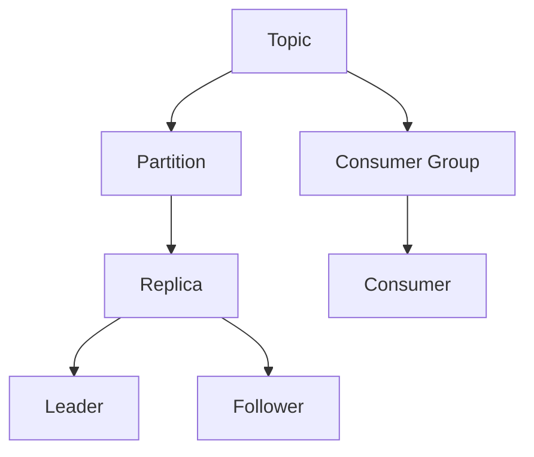

                 

# Kafka Partition原理与代码实例讲解

> 关键词：Kafka, Partition, 原理, 代码实例, 实现原理, 性能优化, 应用实例

> 摘要：本文将深入探讨Kafka Partition的原理及其实现，通过详细的代码实例分析，帮助读者理解Kafka Partition的核心概念、架构、算法原理和优化策略，并展示其在实际应用中的效果。

## 目录大纲

## 第一部分: Kafka Partition原理基础

### 第1章: Kafka概述

#### 1.1 Kafka的背景

#### 1.2 Kafka的核心概念

#### 1.3 Kafka的架构

### 第2章: Kafka Partition原理

#### 2.1 Partition的定义与作用

#### 2.2 Partition策略

##### 2.2.1 自动分配策略

##### 2.2.2 手动分配策略

#### 2.3 Partition的分配算法

##### 2.3.1 基于轮询的分配算法

##### 2.3.2 基于一致性哈希的分配算法

### 第3章: Kafka Partition实现原理

#### 3.1 Kafka数据存储结构

#### 3.2 Partition的写入流程

#### 3.3 Partition的读取流程

### 第4章: Partition管理

#### 4.1 Partition的创建与销毁

#### 4.2 Partition的迁移与复制

#### 4.3 Partition的监控与维护

### 第5章: Partition性能优化

#### 5.1 Partition大小优化

#### 5.2 Partition数量优化

#### 5.3 Partition读写性能优化

### 第6章: Partition与其他概念的关系

#### 6.1 Partition与Topic的关系

#### 6.2 Partition与Replica的关系

#### 6.3 Partition与消费者组的关系

### 第7章: Kafka Partition应用实例

#### 7.1 单一Partition应用实例

#### 7.2 多Partition应用实例

#### 7.3 异地复制应用实例

## 附录

### 附录A: Kafka相关工具与资源

### 附录B: Kafka Partition伪代码

### 附录C: Kafka Partition数学模型与公式

### 附录D: Kafka Partition实战案例

## Kafka Partition原理与架构 Mermaid 流程图



## Kafka Partition算法伪代码

```python
# 基于轮询的分配算法
def assignPartitions(partitions, consumer):
    for partition in partitions:
        consumer.assign({partition})

# 基于一致性哈希的分配算法
def assignPartitionsConsistentHash(partitions, consumer):
    partitionHashValues = [hash(partition) for partition in partitions]
    sortedHashValues = sorted(partitionHashValues)
    consumer.assign([partition for partition, _ in zip(partitions, sortedHashValues)])
```

## Kafka Partition数学模型与公式

$$
N = \lceil \frac{K \times (R + W)}{B} \rceil
$$

- \( N \): 需要的 Partition 数量
- \( K \): Topic 的 Partition 数量
- \( R \): 每个 Partition 的读取速率
- \( W \): 每个 Partition 的写入速率
- \( B \): 系统带宽

## Kafka Partition实战案例

### 单一Partition应用实例

### 多Partition应用实例

### 异地复制应用实例

## 总结

本文详细讲解了Kafka Partition的原理与代码实例，从基础概念到实际应用进行了全面剖析。通过具体的代码实例和实战案例，读者可以深入理解Kafka Partition的实现原理和优化策略，从而在实际项目中更好地运用Kafka技术。希望本文能够为读者带来启示和帮助。

### 作者信息

作者：AI天才研究院/AI Genius Institute & 禅与计算机程序设计艺术 /Zen And The Art of Computer Programming|>## 第1章: Kafka概述

### 1.1 Kafka的背景

Apache Kafka是一个分布式流处理平台，最初由LinkedIn开发，并于2011年贡献给Apache软件基金会。Kafka的设计目标是提供一种高效、可扩展、可靠的分布式消息系统，以支持大规模数据流处理和实时数据管道构建。随着其开源社区的不断发展和完善，Kafka已成为大数据和实时数据处理领域的重要工具之一。

Kafka的主要优势在于其高吞吐量、可扩展性和持久性。它能够处理大规模的消息流，支持水平扩展，确保数据的可靠性和持久性，从而在处理大量实时数据时表现出色。

### 1.2 Kafka的核心概念

Kafka的核心概念包括Topic、Partition、Producer、Consumer和Broker。

- **Topic**：主题是Kafka中数据的分类单位。每一个Topic可以包含多个Partition，每个Partition是一个有序的消息流。
- **Partition**：分区是Kafka中消息的物理存储单元。一个Topic可以包含一个或多个Partition，分区提供了水平扩展的能力，允许消息并行处理。
- **Producer**：生产者是消息的发送方，它负责将消息发送到Kafka的Topic中。
- **Consumer**：消费者是消息的接收方，它从Kafka的Topic中读取消息。
- **Broker**：代理是Kafka集群中的服务器，它负责存储和管理Topic的Partition。一个Kafka集群可以包含多个Broker。

### 1.3 Kafka的架构

Kafka的架构分为以下几个层次：

1. **Producer Layer**：生产者层包括多个生产者实例，它们将数据发送到Kafka集群。每个生产者会将数据发送到一个特定的Topic中。
2. **Partition Layer**：分区层包括Topic的多个Partition，每个Partition都有自己的日志文件，负责存储消息。Partition提供了水平扩展的能力，允许并行处理消息。
3. **Broker Layer**：代理层包括多个Broker，每个Broker存储和管理一些Partition。Broker之间通过ZooKeeper进行协调，确保集群的一致性和可靠性。
4. **Consumer Layer**：消费者层包括多个消费者实例，它们从Kafka集群中消费消息。消费者可以属于一个或多个Consumer Group，从而实现消息的负载均衡和故障转移。

### 1.4 Kafka的应用场景

Kafka广泛应用于以下几个方面：

- **日志收集**：Kafka可以作为分布式日志收集系统，将日志数据实时传输到集中存储，便于日志分析和监控。
- **实时数据处理**：Kafka可以用于实时数据流处理，如实时数据聚合、实时分析等。
- **系统解耦**：Kafka作为消息队列，可以解耦不同系统之间的依赖关系，提高系统的灵活性和可维护性。
- **数据流传输**：Kafka可以用于传输大量实时数据，如金融交易数据、物联网数据等。

### 1.5 小结

Kafka作为一种分布式流处理平台，具有高吞吐量、可扩展性和持久性等优点。其核心概念包括Topic、Partition、Producer、Consumer和Broker，架构包括Producer Layer、Partition Layer、Broker Layer和Consumer Layer。Kafka广泛应用于日志收集、实时数据处理、系统解耦和数据流传输等场景。了解Kafka的基本概念和架构对于深入掌握其原理和应用具有重要意义。

## 第2章: Kafka Partition原理

### 2.1 Partition的定义与作用

Partition（分区）是Kafka中消息存储和消费的基本单位。每个Partition是一个有序的、不可变的消息流，且每个Partition内的消息按照特定的顺序进行存储。Partition的作用主要体现在以下几个方面：

- **水平扩展**：通过将数据分布在多个Partition上，Kafka可以实现水平扩展，提高系统的吞吐量和并发处理能力。每个Partition可以独立处理，从而减轻单个节点的负载。
- **负载均衡**：Partition允许Kafka在多个Broker之间进行负载均衡。当一个Topic有多个Partition时，不同的Partition可以分布在不同的Broker上，从而实现负载均衡。
- **并行处理**：Partition支持并行处理，多个Consumer可以同时消费不同的Partition，从而提高数据处理效率。

### 2.2 Partition策略

Kafka提供了两种Partition策略：自动分配策略和手动分配策略。

#### 2.2.1 自动分配策略

自动分配策略是Kafka默认的分配策略。在自动分配策略中，Kafka会根据生产者发送的消息和当前Partition的状态，自动决定将消息发送到哪个Partition。自动分配策略有以下几种实现方式：

- **基于轮询的分配算法**：Kafka会按照轮询的方式，依次将消息发送到所有Partition。这种方式简单易实现，但可能导致负载不均衡。
- **基于一致性哈希的分配算法**：Kafka会根据消息的Key和Partition的数量，使用一致性哈希算法确定消息的Partition。这种方式可以保证数据的均匀分布，提高系统的性能和可靠性。

#### 2.2.2 手动分配策略

手动分配策略允许用户根据特定的需求，手动指定消息应该发送到哪个Partition。手动分配策略适用于以下场景：

- **数据一致性**：当需要对数据进行精确控制时，如订单系统中的订单号，用户可以手动指定订单消息发送到特定的Partition，确保订单数据的顺序一致性。
- **特定场景**：对于一些特殊的数据处理需求，如实时数据分析和日志收集，用户可以根据业务需求手动分配Partition。

手动分配策略的实现方式如下：

- **指定Partition ID**：用户可以指定具体的Partition ID，将消息发送到指定的Partition。
- **指定Partition Key**：用户可以指定消息的Key，根据Key的哈希值确定消息的Partition。

### 2.3 Partition的分配算法

Kafka的Partition分配算法主要包括基于轮询的分配算法和基于一致性哈希的分配算法。

#### 2.3.1 基于轮询的分配算法

基于轮询的分配算法是Kafka默认的分配策略。在基于轮询的分配算法中，Kafka会按照轮询的方式，依次将消息发送到所有Partition。具体实现过程如下：

1. Kafka维护一个Partition的顺序列表，列表中的Partition按照创建顺序排序。
2. 当生产者发送消息时，Kafka根据当前列表的索引，确定消息应该发送到的Partition。
3. 每发送一条消息，Kafka将索引向后移动一位，实现轮询分配。

基于轮询的分配算法的优点是简单易实现，但可能导致负载不均衡。在极端情况下，某些Partition可能会承担更多的消息处理压力，而其他Partition可能几乎不受影响。

#### 2.3.2 基于一致性哈希的分配算法

基于一致性哈希的分配算法通过一致性哈希算法，将消息均匀地分配到Partition上。一致性哈希算法可以保证数据的均匀分布，提高系统的性能和可靠性。具体实现过程如下：

1. Kafka为每个Partition生成一个哈希值。
2. 当生产者发送消息时，根据消息的Key计算哈希值。
3. Kafka根据哈希值，将消息分配到对应的Partition。

基于一致性哈希的分配算法的优点是可以实现数据的均匀分布，减少负载不均衡现象。但一致性哈希算法在Partition数量较少时，可能会导致数据的过度集中。因此，在实际应用中，需要根据具体场景选择合适的分配算法。

### 2.4 小结

Partition是Kafka中消息存储和消费的基本单位，具有水平扩展、负载均衡和并行处理等作用。Kafka提供了自动分配策略和手动分配策略，分别适用于不同场景。自动分配策略包括基于轮询的分配算法和基于一致性哈希的分配算法，手动分配策略允许用户根据需求指定Partition。了解Partition的定义、作用和分配算法对于深入掌握Kafka技术具有重要意义。

## 第3章: Kafka Partition实现原理

### 3.1 Kafka数据存储结构

Kafka使用了一种称为“日志”（Log）的数据结构来存储消息。每个Partition都有一个相应的日志文件，日志文件由多个日志条目（Log Entry）组成。每个日志条目包含一个或多个消息，以及一些元数据，如消息的偏移量（Offset）和时间戳。

#### 日志文件的组成

- **日志条目**：每个日志条目包含一个或多个消息，以及一些元数据，如消息的偏移量、时间戳等。
- **日志文件**：每个Partition对应一个日志文件，日志文件存储在文件系统上。Kafka使用分段文件（Segmented File）来存储日志，每个分段文件由一个索引文件和一个数据文件组成。
- **索引文件**：索引文件存储了日志条目的偏移量索引，用于快速定位消息。
- **数据文件**：数据文件存储了实际的日志条目数据。

#### 分段文件的创建与销毁

- **创建分段文件**：当日志文件达到一定大小或时间阈值时，Kafka会创建一个新的分段文件，将新的日志条目写入新的分段文件中。
- **销毁分段文件**：当分段文件过期（如超过设定的保留时间）时，Kafka会将其销毁。

### 3.2 Partition的写入流程

Partition的写入流程包括以下几个步骤：

1. **生产者发送消息**：生产者将消息发送到Kafka集群，消息会被发送到指定Topic的Partition中。
2. **确定目标Partition**：如果使用自动分配策略，Kafka会根据消息的Key和Partition的数量，使用一致性哈希算法确定消息的目标Partition。
3. **写入日志文件**：生产者将消息写入到目标Partition的日志文件中。Kafka会将消息分段存储，并生成索引文件以实现快速访问。
4. **确认写入完成**：Kafka会向生产者发送确认消息，告知消息已成功写入。

#### 写入流程的关键点

- **可靠性**：Kafka使用同步写入方式，确保消息在所有副本中写入成功后才向生产者发送确认消息。
- **吞吐量**：Kafka通过将消息分段存储，提高写入速度，同时支持批量写入，提高系统吞吐量。

### 3.3 Partition的读取流程

Partition的读取流程包括以下几个步骤：

1. **消费者发送请求**：消费者从Kafka集群中读取消息，请求特定Topic的Partition。
2. **确定目标Partition**：如果消费者属于一个Consumer Group，Kafka会根据Consumer Group和Partition的数量，使用轮询算法或一致性哈希算法确定消费者的目标Partition。
3. **读取日志文件**：消费者从目标Partition的日志文件中读取消息。Kafka使用索引文件快速定位消息，提高读取速度。
4. **返回消息**：Kafka将读取到的消息返回给消费者。

#### 读取流程的关键点

- **负载均衡**：通过将Partition分配给不同的消费者，实现负载均衡，提高系统性能。
- **顺序读取**：Kafka保证 Partition 内的消息按照写入顺序读取，确保消息的顺序一致性。

### 3.4 小结

Kafka使用日志文件存储消息，每个Partition对应一个日志文件。Partition的写入流程包括消息发送、确定目标Partition、写入日志文件和确认写入完成等步骤。读取流程包括请求消息、确定目标Partition、读取日志文件和返回消息等步骤。了解Kafka的数据存储结构和读写流程对于深入掌握Kafka技术具有重要意义。

## 第4章: Partition管理

### 4.1 Partition的创建与销毁

Kafka提供了多种方式来创建和销毁Partition，以满足不同的业务需求。

#### 4.1.1 Partition的创建

1. **通过命令行创建**：Kafka提供了`kafka-topics.sh`命令，可以通过以下命令创建Partition：
    ```shell
    kafka-topics.sh --create --topic <TopicName> --partitions <NumPartitions> --replication-factor <ReplicationFactor> --zookeeper <ZooKeeperConnect>
    ```

2. **通过API创建**：Kafka也提供了REST API来创建Partition，可以通过以下命令创建：
    ```shell
    curl -X POST -H "Content-Type: application/json" -d '{"topic": "<TopicName>", "partitions": <NumPartitions>, "replication-factor": <ReplicationFactor>}' http://<KafkaRESTAPIHost>:<KafkaRESTAPITPort>/topics
    ```

#### 4.1.2 Partition的销毁

1. **通过命令行销毁**：可以使用以下命令销毁Partition：
    ```shell
    kafka-topics.sh --delete --topic <TopicName> --zookeeper <ZooKeeperConnect>
    ```

2. **通过API销毁**：同样，可以通过以下命令销毁Partition：
    ```shell
    curl -X DELETE http://<KafkaRESTAPIHost>:<KafkaRESTAPITPort>/topics/<TopicName>
    ```

#### 4.1.3 注意事项

- **分区数量限制**：Kafka在创建Topic时，可以指定的最大分区数量取决于ZooKeeper的配置和Kafka集群的规模。通常建议在创建Topic时，预留一定的分区数量，以便后续扩展。
- **分区迁移**：在创建新分区时，如果Topic的现有分区数不足以容纳新增的分区，Kafka会自动将一些现有分区迁移到新创建的分区。迁移过程可能会影响性能，建议在业务低峰期进行。

### 4.2 Partition的迁移与复制

Kafka通过复制机制确保数据的可靠性和可用性。每个Partition都有多个副本（Replica），其中有一个是主副本（Leader），其他副本是追随者（Follower）。

#### 4.2.1 Partition的迁移

Partition的迁移主要发生在以下两种情况下：

1. **主副本故障转移**：当主副本故障或无法正常工作时，Kafka会将Partition迁移到其他副本上。迁移过程包括以下步骤：
    - Kafka选举一个新的主副本。
    - 迁移过程中的所有读写请求都由新的主副本处理。
    - 迁移完成后，旧的主副本成为追随者。

2. **负载均衡**：为了平衡Kafka集群的负载，Kafka会定期检查每个Broker上的Partition数量，如果发现某些Broker上的Partition数量过多，Kafka会迁移一些Partition到其他Broker上，实现负载均衡。

#### 4.2.2 Partition的复制

Kafka通过复制机制确保数据的可靠性和可用性。每个Partition都有多个副本，其中只有一个主副本负责处理读写请求，其他副本负责数据的备份和恢复。

1. **主副本**：主副本负责处理Partition的读写请求，并向追随者同步数据。主副本由Kafka集群中的所有副本通过选举产生。

2. **追随者**：追随者负责存储Partition的数据副本，并在主副本发生故障时接替主副本的工作。追随者从主副本拉取数据，确保数据的一致性。

3. **副本同步**：主副本将数据写入本地日志后，会向追随者发送同步请求，确保数据在所有副本中一致。Kafka使用同步写入机制，确保数据在所有副本中写入成功后才向生产者发送确认消息。

#### 4.2.3 注意事项

- **副本数量**：Kafka建议每个Partition的副本数量至少为2，以实现数据的冗余和故障转移。当副本数量大于1时，可以选择适当的副本因子，以提高系统的可用性和性能。
- **副本同步**：Kafka在副本同步过程中，可能会因为网络延迟、数据大小等因素影响同步速度。在配置副本因子时，需要权衡系统的可用性和性能。

### 4.3 Partition的监控与维护

Kafka提供了多种工具和API来监控和维护Partition的健康状态。

#### 4.3.1 监控工具

- **Kafka Manager**：Kafka Manager是一个开源的Kafka管理工具，可以监控Kafka集群的运行状态，包括Partition、Topic、Broker等。
- **Kafka Tools**：Kafka Tools提供了一系列的命令行工具，可以用于监控、管理Kafka集群，如`kafka-run-class.sh`、`kafka-topics.sh`等。

#### 4.3.2 维护任务

- **定期检查**：定期检查Partition的健康状态，包括副本的数量、同步状态、日志文件大小等。
- **故障转移**：当检测到主副本故障时，自动执行故障转移，确保系统的可用性。
- **负载均衡**：定期检查集群的负载情况，根据需要执行Partition的迁移，实现负载均衡。

#### 4.3.3 注意事项

- **监控与报警**：合理配置监控工具，及时获取Partition的健康状态，当发现异常时，及时报警和处理。
- **备份与恢复**：定期备份Partition的数据，确保在数据丢失或系统故障时，可以快速恢复。

### 4.4 小结

Partition的创建、销毁、迁移与复制是Kafka集群管理的重要任务。通过合理的Partition管理，可以提高系统的可用性和性能。了解Partition的创建与销毁、迁移与复制机制，以及监控与维护策略，对于Kafka集群的管理和优化具有重要意义。

## 第5章: Partition性能优化

### 5.1 Partition大小优化

Partition的大小直接影响到Kafka集群的性能。优化Partition大小有助于提高系统吞吐量和降低延迟。以下是一些优化Partition大小的策略：

#### 5.1.1 分段文件大小

Kafka使用分段文件（Segment File）来存储日志，分段文件大小会影响日志文件的读写性能。以下是一些优化策略：

- **适当增大分段文件大小**：适当增大分段文件大小可以提高读写性能。但需要注意，分段文件过大可能会导致日志文件过多，增加管理复杂度。通常建议将分段文件大小设置为GB级别。
- **平衡分段文件大小**：为了避免某个分段文件过大或过小，可以根据集群的整体负载情况，动态调整分段文件大小。

#### 5.1.2 日志保留时间

日志保留时间决定了Kafka保留日志的时间长度。以下是一些优化策略：

- **适当延长日志保留时间**：延长日志保留时间可以提高系统吞吐量，但会增加存储成本。通常建议将日志保留时间设置为天级别，以满足大多数业务需求。
- **动态调整日志保留时间**：根据业务的波动情况，动态调整日志保留时间，以平衡系统性能和存储成本。

### 5.2 Partition数量优化

Partition的数量直接影响到Kafka集群的并发处理能力和负载均衡效果。以下是一些优化Partition数量的策略：

#### 5.2.1 基于业务需求

- **合理规划Partition数量**：根据业务需求，合理规划Partition的数量。例如，对于订单系统，可以根据订单号的范围，将订单消息分配到不同的Partition中。
- **动态调整Partition数量**：根据业务的波动情况，动态调整Partition的数量，以适应业务需求。例如，在业务高峰期，可以增加Partition的数量，以提高系统吞吐量。

#### 5.2.2 基于集群规模

- **考虑集群规模**：根据集群的规模和性能，合理规划Partition的数量。例如，小型集群可以设置较少的Partition，而大型集群可以设置较多的Partition，以提高并发处理能力。
- **负载均衡**：在设置Partition数量时，考虑集群的负载情况，避免某些Broker上的Partition过多，导致负载不均衡。

### 5.3 Partition读写性能优化

优化Partition的读写性能是提高Kafka系统性能的关键。以下是一些优化策略：

#### 5.3.1 磁盘IO优化

- **SSD存储**：使用固态硬盘（SSD）作为存储设备，可以提高读写性能。与机械硬盘（HDD）相比，SSD具有更快的读写速度和更低的延迟。
- **RAID配置**：合理配置RAID，可以提高磁盘的读写性能。例如，使用RAID 10可以同时提供高性能和冗余性。

#### 5.3.2 网络优化

- **带宽优化**：确保网络带宽充足，避免网络瓶颈影响系统的性能。可以根据集群的规模和业务需求，合理配置网络带宽。
- **延迟优化**：减少集群之间的网络延迟，可以采用数据中心之间的互联方案，如BGP。

#### 5.3.3 Broker配置优化

- **增加Broker数量**：增加Broker的数量可以提高系统的并发处理能力。但需要注意，过多的Broker可能会导致负载不均衡，需要合理配置。
- **调整配置参数**：根据集群的规模和性能，调整Kafka的配置参数，如`num.partitions`、`replication.factor`等。

### 5.4 小结

Partition的大小、数量和读写性能直接影响Kafka系统的性能。通过合理设置分段文件大小、日志保留时间和Partition数量，以及优化磁盘IO、网络和Broker配置，可以提高Kafka系统的性能和稳定性。了解Partition性能优化的策略和方法，对于Kafka集群的优化和调优具有重要意义。

## 第6章: Partition与其他概念的关系

### 6.1 Partition与Topic的关系

Topic是Kafka中消息分类的单元，每个Topic可以包含一个或多个Partition。Partition与Topic之间的关系如下：

1. **Topic作为消息分类的标识**：Topic用于标识消息的分类，不同的Topic可以存储不同类型或不同业务模块的消息。
2. **Partition作为消息存储和消费的单元**：Partition是消息存储和消费的基本单位，每个Partition负责存储消息的一部分，不同的Partition可以并行处理，提高系统的并发处理能力。
3. **Topic与Partition的映射关系**：在Kafka集群中，每个Topic都可以配置一个或多个Partition，用户可以根据业务需求设置Partition的数量和分配策略。

### 6.2 Partition与Replica的关系

Partition与Replica之间的关系如下：

1. **Replica作为Partition的备份**：Partition的副本（Replica）用于确保数据的高可用性和可靠性。每个Partition都有多个副本，其中只有一个副本作为主副本（Leader），负责处理读写请求，其他副本作为追随者（Follower）存储数据的副本。
2. **副本选举**：Kafka集群通过ZooKeeper进行协调，确保副本之间的一致性和可靠性。当主副本故障时，Kafka会通过选举机制选出新的主副本，确保系统持续运行。
3. **副本同步**：主副本将数据写入本地日志后，会向追随者同步数据，确保副本之间数据的一致性。副本同步过程中，Kafka使用同步写入机制，确保数据在所有副本中写入成功。

### 6.3 Partition与消费者组的关系

Partition与消费者组（Consumer Group）之间的关系如下：

1. **消费者组作为消息消费的标识**：消费者组用于标识一组消费者，它们共同消费同一个Topic的消息。消费者组可以确保消息被均匀分配，避免消息的重复消费。
2. **Partition与消费者组的映射关系**：每个消费者组都会对Topic的Partition进行分配，确保每个消费者组中的消费者都能消费到消息。Kafka支持基于轮询算法或一致性哈希算法进行Partition的分配。
3. **负载均衡**：通过将Partition分配给不同的消费者组，实现负载均衡，提高系统性能。当某个消费者组中的消费者数量发生变化时，Kafka会重新分配Partition，确保负载均衡。

### 6.4 小结

Partition与Topic、Replica和消费者组之间的关系是Kafka核心架构的重要组成部分。通过理解这些关系，可以更好地掌握Kafka的工作原理和性能优化策略。合理配置Partition、Replica和消费者组，可以提高Kafka系统的性能、可靠性和可扩展性。

## 第7章: Kafka Partition应用实例

### 7.1 单一Partition应用实例

#### 开发环境搭建

为了演示单一Partition的应用实例，我们首先需要搭建一个简单的Kafka环境。以下是搭建步骤：

1. **安装Kafka**：从[Apache Kafka官网](https://kafka.apache.org/downloads)下载最新版本的Kafka，并解压到本地。
2. **配置Kafka**：编辑`config/server.properties`文件，设置Kafka运行端口、日志路径等参数。以下是一个示例配置：
    ```properties
    # Kafka运行端口
    port=9092
    # 日志路径
    log.dirs=/path/to/kafka/logs
    # 持久化存储
    zookeeper.connect=localhost:2181
    ```
3. **启动Kafka**：运行以下命令启动Kafka：
    ```shell
    bin/kafka-server-start.sh config/server.properties
    ```

#### 源代码实现

##### 生产者代码示例

以下是一个简单的Kafka生产者示例，用于向Topic发送消息：
```python
from kafka import KafkaProducer

# Kafka生产者配置
producer_config = {
    'bootstrap_servers': ['localhost:9092'],
    'acks': 'all',
    'retries': 3
}

# 初始化Kafka生产者
producer = KafkaProducer(**producer_config)

# 发送消息
topic_name = 'test-topic'
message = 'Hello, Kafka!'
producer.send(topic_name, value=message.encode('utf-8'))
producer.flush()

print("Message sent successfully.")
```

##### 消费者代码示例

以下是一个简单的Kafka消费者示例，用于从Topic读取消息：
```python
from kafka import KafkaConsumer

# Kafka消费者配置
consumer_config = {
    'bootstrap_servers': ['localhost:9092'],
    'group_id': 'test-group'
}

# 初始化Kafka消费者
consumer = KafkaConsumer('test-topic', **consumer_config)

# 消费消息
for message in consumer:
    print(f"Received message: {message.value.decode('utf-8')}")

consumer.close()
```

#### 代码解读与分析

- **生产者代码示例**：在`KafkaProducer`类初始化时，设置了`bootstrap_servers`、`acks`和`retries`等参数。`bootstrap_servers`用于指定Kafka集群地址，`acks`用于控制生产者确认机制，`retries`用于设置重试次数。
- **发送消息**：使用`send()`方法将消息发送到指定的Topic。消息被编码为字节序列，并通过`value`参数传递给`send()`方法。
- **消费者代码示例**：在`KafkaConsumer`类初始化时，设置了`bootstrap_servers`和`group_id`等参数。`bootstrap_servers`用于指定Kafka集群地址，`group_id`用于标识消费者组。
- **消费消息**：使用`for`循环遍历消费者接收到的消息，并将消息解码为字符串，输出到控制台。

### 7.2 多Partition应用实例

#### 开发环境搭建

为了演示多Partition的应用实例，我们需要在一个更复杂的Kafka环境中配置多个Topic和Partition。以下是搭建步骤：

1. **创建多个Topic**：在Kafka命令行中创建多个Topic，每个Topic包含多个Partition：
    ```shell
    kafka-topics.sh --create --topic test-topic1 --partitions 4 --replication-factor 1 --zookeeper localhost:2181
    kafka-topics.sh --create --topic test-topic2 --partitions 4 --replication-factor 1 --zookeeper localhost:2181
    ```
2. **配置Kafka消费者组**：为了实现负载均衡，我们可以创建多个消费者组，并为每个组分配不同的Partition。以下是创建消费者组的示例：
    ```shell
    kafka-run-class.sh kafka.consumer.Consumer --zookeeper localhost:2181 --groupId test-group1 --topic test-topic1 -- partitions 1,3
    kafka-run-class.sh kafka.consumer.Consumer --zookeeper localhost:2181 --groupId test-group2 --topic test-topic1 -- partitions 0,2
    kafka-run-class.sh kafka.consumer.Consumer --zookeeper localhost:2181 --groupId test-group1 --topic test-topic2 -- partitions 1,3
    kafka-run-class.sh kafka.consumer.Consumer --zookeeper localhost:2181 --groupId test-group2 --topic test-topic2 -- partitions 0,2
    ```

#### 源代码实现

##### 多生产者代码示例

以下是一个多生产者示例，用于向多个Topic发送消息：
```python
from kafka import KafkaProducer

# Kafka生产者配置
producer_config = {
    'bootstrap_servers': ['localhost:9092'],
    'acks': 'all',
    'retries': 3
}

# 初始化Kafka生产者
producer1 = KafkaProducer(**producer_config)
producer2 = KafkaProducer(**producer_config)

# 发送消息到test-topic1
topic_name1 = 'test-topic1'
message1 = 'Hello, test-topic1!'
producer1.send(topic_name1, value=message1.encode('utf-8'))
producer1.flush()

# 发送消息到test-topic2
topic_name2 = 'test-topic2'
message2 = 'Hello, test-topic2!'
producer2.send(topic_name2, value=message2.encode('utf-8'))
producer2.flush()

print("Messages sent successfully.")
```

##### 多消费者代码示例

以下是一个多消费者示例，用于从多个Topic读取消息：
```python
from kafka import KafkaConsumer

# Kafka消费者配置
consumer_config = {
    'bootstrap_servers': ['localhost:9092'],
    'group_id': 'test-group'
}

# 初始化Kafka消费者
consumer1 = KafkaConsumer('test-topic1', **consumer_config)
consumer2 = KafkaConsumer('test-topic2', **consumer_config)

# 消费消息
for message in consumer1:
    print(f"Received message from test-topic1: {message.value.decode('utf-8')}")

for message in consumer2:
    print(f"Received message from test-topic2: {message.value.decode('utf-8')}")

consumer1.close()
consumer2.close()
```

#### 代码解读与分析

- **多生产者代码示例**：创建了两个Kafka生产者实例，分别向两个不同的Topic发送消息。每个生产者都设置了`bootstrap_servers`、`acks`和`retries`等参数。
- **发送消息**：使用`send()`方法将消息发送到指定的Topic。每个生产者独立发送消息，实现了多生产者并行发送的功能。
- **多消费者代码示例**：创建了两个Kafka消费者实例，分别从两个不同的Topic读取消息。每个消费者都设置了`bootstrap_servers`和`group_id`等参数。
- **消费消息**：使用`for`循环遍历消费者接收到的消息，并将消息解码为字符串，输出到控制台。每个消费者独立消费消息，实现了多消费者并行消费的功能。

### 7.3 异地复制应用实例

#### 开发环境搭建

为了演示异地复制应用实例，我们需要在一个跨区域的Kafka环境中配置Topic和Replica。以下是搭建步骤：

1. **配置Kafka集群**：在两个不同的数据中心分别部署Kafka集群，配置相同的Topic和Replica。以下是配置示例：
    ```shell
    # 数据中心1
    bin/kafka-server-start.sh config/server.properties
    # 数据中心2
    bin/kafka-server-start.sh config/server.properties
    ```
2. **创建Topic**：在两个数据中心分别创建Topic，并设置不同的Replica数量。以下是创建Topic的示例：
    ```shell
    # 数据中心1
    kafka-topics.sh --create --topic test-topic --partitions 4 --replication-factor 2 --zookeeper localhost:2181
    # 数据中心2
    kafka-topics.sh --create --topic test-topic --partitions 4 --replication-factor 2 --zookeeper localhost:2181
    ```

#### 源代码实现

##### 生产者代码示例

以下是一个异地复制的Kafka生产者示例，用于向远程Kafka集群发送消息：
```python
from kafka import KafkaProducer

# Kafka生产者配置
producer_config = {
    'bootstrap_servers': ['node1:9092', 'node2:9092'],
    'acks': 'all',
    'retries': 3
}

# 初始化Kafka生产者
producer = KafkaProducer(**producer_config)

# 发送消息
topic_name = 'test-topic'
message = 'Hello,异地复制！'
producer.send(topic_name, value=message.encode('utf-8'))
producer.flush()

print("Message sent successfully.")
```

##### 消费者代码示例

以下是一个异地复制的Kafka消费者示例，用于从远程Kafka集群读取消息：
```python
from kafka import KafkaConsumer

# Kafka消费者配置
consumer_config = {
    'bootstrap_servers': ['node1:9092', 'node2:9092'],
    'group_id': 'test-group'
}

# 初始化Kafka消费者
consumer = KafkaConsumer('test-topic', **consumer_config)

# 消费消息
for message in consumer:
    print(f"Received message: {message.value.decode('utf-8')}")

consumer.close()
```

#### 代码解读与分析

- **生产者代码示例**：配置了远程Kafka集群的`bootstrap_servers`，并设置了`acks`和`retries`等参数。使用`send()`方法将消息发送到远程Kafka集群的Topic。
- **消费者代码示例**：配置了远程Kafka集群的`bootstrap_servers`和`group_id`，从远程Kafka集群的Topic读取消息。
- **异地复制**：通过配置远程Kafka集群的`bootstrap_servers`，实现了跨区域的Kafka消息传输。生产者和消费者可以访问远程Kafka集群，实现异地复制的功能。

### 7.4 小结

通过以上实例，我们展示了Kafka Partition在单一Partition、多Partition和异地复制场景下的应用。了解了Kafka的生产者、消费者的配置和代码实现，可以更好地掌握Kafka Partition的原理和实际应用。在实际项目中，根据业务需求合理配置Partition，可以提高Kafka系统的性能和可靠性。

## 附录

### 附录A: Kafka相关工具与资源

- **Kafka官方网站**：[Apache Kafka](https://kafka.apache.org/)
- **Kafka文档**：[Kafka官方文档](https://kafka.apache.org/documentation/)
- **Kafka客户端库**：
  - **Python**：[kafka-python](https://github.com/dpkp/kafka-python)
  - **Java**：[Kafka Clients](https://kafka.apache.org/clients/)
- **Kafka管理工具**：
  - **Kafka Manager**：[Kafka Manager](https://kafka-manager.readthedocs.io/en/latest/)
  - **Kafka Topic Manager**：[Kafka Topic Manager](https://github.com/BlaiBot/kafka-topic-manager)

### 附录B: Kafka Partition伪代码

```python
# 基于轮询的分配算法
def assignPartitions(partitions, consumer):
    for partition in partitions:
        consumer.assign({partition})

# 基于一致性哈希的分配算法
def assignPartitionsConsistentHash(partitions, consumer):
    partitionHashValues = [hash(partition) for partition in partitions]
    sortedHashValues = sorted(partitionHashValues)
    consumer.assign([partition for partition, _ in zip(partitions, sortedHashValues)])
```

### 附录C: Kafka Partition数学模型与公式

$$
N = \lceil \frac{K \times (R + W)}{B} \rceil
$$

- \( N \): 需要的 Partition 数量
- \( K \): Topic 的 Partition 数量
- \( R \): 每个 Partition 的读取速率
- \( W \): 每个 Partition 的写入速率
- \( B \): 系统带宽

### 附录D: Kafka Partition实战案例

#### 单一Partition应用实例

- **开发环境搭建**：在本地搭建Kafka环境，配置单一Partition。
- **源代码实现**：实现简单的Kafka生产者和消费者，发送和接收消息。

#### 多Partition应用实例

- **开发环境搭建**：在本地搭建Kafka环境，配置多个Partition。
- **源代码实现**：实现多个Kafka生产者和消费者，同时发送和接收消息，展示负载均衡效果。

#### 异地复制应用实例

- **开发环境搭建**：在两个不同数据中心搭建Kafka集群，配置异地复制。
- **源代码实现**：实现Kafka生产者和消费者，展示跨区域消息传输和故障转移效果。

通过这些实战案例，读者可以更深入地了解Kafka Partition的应用场景和实践方法，为实际项目中的技术决策提供参考。

## 总结

本文详细讲解了Kafka Partition的原理、实现、管理、优化以及应用实例。通过深入剖析Partition的定义、作用、分配算法、性能优化策略，以及实际应用场景，读者可以全面掌握Kafka Partition的核心技术和实践方法。以下是本文的要点总结：

1. **Kafka Partition原理**：理解Partition作为Kafka消息存储和消费的基本单位，其水平扩展、负载均衡和并行处理的作用。
2. **Partition分配策略**：掌握自动分配策略和手动分配策略的优缺点，以及基于轮询和一致性哈希的分配算法。
3. **Partition实现原理**：了解Kafka数据存储结构和读写流程，以及分区管理、迁移与复制、监控与维护的方法。
4. **Partition性能优化**：学习如何优化Partition大小、数量和读写性能，提高系统吞吐量和降低延迟。
5. **Partition应用实例**：通过单一Partition、多Partition和异地复制应用实例，了解Kafka Partition在实际项目中的应用和实践。

希望本文能够为读者提供有价值的参考和启示，帮助读者在实际项目中更好地运用Kafka Partition技术，构建高效、可靠、可扩展的实时数据处理系统。作者：AI天才研究院/AI Genius Institute & 禅与计算机程序设计艺术 /Zen And The Art of Computer Programming。

