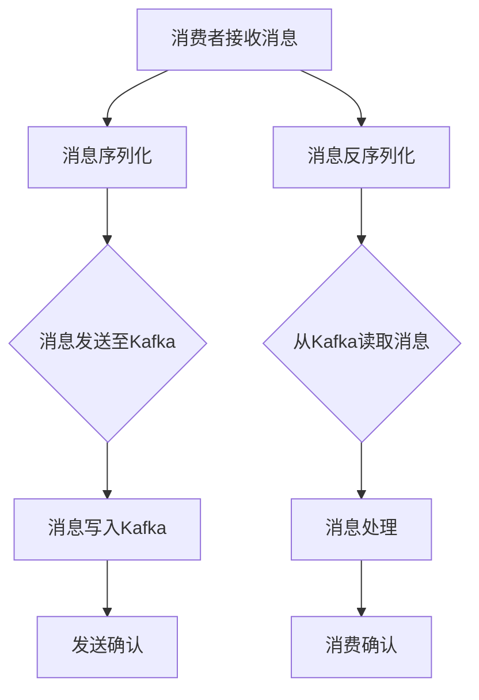
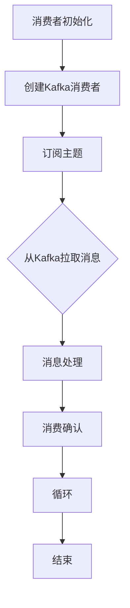

                 

### 文章标题

《Kafka Topic原理与代码实例讲解》

### 关键词

Kafka, Topic, 分区，生产者，消费者，消息队列，性能优化，流处理，高可用性

### 摘要

本文将深入探讨Kafka Topic的原理，并结合代码实例详细讲解其实现与应用。通过本文的阅读，读者将全面了解Kafka Topic的基础概念、核心原理及其在实际开发中的应用场景。文章将从Kafka的基础知识入手，逐步深入到生产者与消费者的原理与实现，详细剖析主题管理的操作方法，并提出针对生产者与消费者的性能优化策略。最后，通过具体的代码实例和实战项目，读者将能够掌握Kafka Topic的完整开发流程，从而提升在消息队列与实时数据处理领域的实践能力。

### 《Kafka Topic原理与代码实例讲解》目录大纲

## 第1章 Kafka基础

### 1.1 Kafka概述
- Kafka的特点
- Kafka的应用场景

### 1.2 Kafka架构
- Kafka的核心组件
- Kafka的架构设计
- Kafka的高可用性设计

### 1.3 Kafka核心概念
- Topic与Partition
- Offset
- Producer与Consumer
- Kafka集群角色

## 第2章 Kafka生产者原理与实现

### 2.1 Kafka生产者API
- Kafka生产者接口
- 生产者发送消息流程

### 2.2 Kafka生产者配置
- 配置文件详解
- 生产者性能调优

### 2.3 代码实例：简单Kafka生产者实现

## 第3章 Kafka消费者原理与实现

### 3.1 Kafka消费者API
- Kafka消费者接口
- 消费者接收消息流程

### 3.2 Kafka消费者配置
- 配置文件详解
- 消费者性能调优

### 3.3 代码实例：简单Kafka消费者实现

## 第4章 Kafka主题管理

### 4.1 Kafka主题概述
- 主题创建与删除
- 主题分区管理

### 4.2 代码实例：Kafka主题操作实现

## 第5章 Kafka生产者性能优化

### 5.1 Kafka生产者性能影响因素
- 网络延迟
- 系统负载
- 消息序列化与反序列化

### 5.2 Kafka生产者性能优化策略
- 异步发送
- 批量发送
- 消息压缩

### 5.3 代码实例：Kafka生产者性能优化实现

## 第6章 Kafka消费者性能优化

### 6.1 Kafka消费者性能影响因素
- 消费者并发度
- 批量消费
- 消息处理速度

### 6.2 Kafka消费者性能优化策略
- 负载均衡
- 并发度调整
- 消费者负载限制

### 6.3 代码实例：Kafka消费者性能优化实现

## 第7章 Kafka高级特性与实战

### 7.1 Kafka事务消息
- 事务消息概述
- 事务消息实现原理
- 代码实例：事务消息应用

### 7.2 Kafka流处理
- Kafka Streams概述
- Kafka Streams应用实例
- 代码实例：使用Kafka Streams处理流数据

### 7.3 Kafka集群监控与运维
- Kafka监控指标
- Kafka集群运维策略
- 代码实例：Kafka集群监控实现

## 第8章 Kafka项目实战

### 8.1 项目一：消息队列系统
- 系统设计
- 代码实现
- 代码解读与分析

### 8.2 项目二：实时流数据处理
- 系统设计
- 代码实现
- 代码解读与分析

## 附录

### A.1 Kafka相关工具与资源
- Kafka常用工具
- Kafka社区资源

### A.2 Mermaid流程图示例
- Kafka生产者流程
- Kafka消费者流程

### A.3 伪代码与数学模型示例
- Kafka生产者伪代码
- Kafka消费者伪代码
- 事务消息数学模型讲解

### A.4 代码实例与解读
- Kafka生产者代码实例与解读
- Kafka消费者代码实例与解读
- 事务消息代码实例与解读

### A.5 练习题与拓展阅读
- Kafka相关练习题
- 推荐阅读资料

### A.6 作者信息
- 作者：AI天才研究院/AI Genius Institute & 禅与计算机程序设计艺术 /Zen And The Art of Computer Programming

## 第1章 Kafka基础

### 1.1 Kafka概述

Apache Kafka 是一个分布式流处理平台，最初由LinkedIn开发，现已成为Apache软件基金会的一个开源项目。Kafka 作为一个高吞吐量的分布式消息队列系统，主要用于构建实时的数据流处理应用程序。

#### Kafka的特点

- **分布式**: Kafka 是一个分布式系统，可以在多个服务器上运行，支持水平扩展。
- **高吞吐量**: Kafka 特别适合处理大规模的数据流，能够支持每秒数百万条消息的高吞吐量。
- **持久性**: Kafka 将消息持久化存储在磁盘上，确保数据不丢失。
- **高可用性**: Kafka 通过副本机制和分区确保消息传递的高可用性。
- **可靠性**: Kafka 提供了强大的消息确认机制，确保消息的可靠传递。
- **可扩展性**: Kafka 可以轻松地通过添加更多的服务器进行扩展。
- **跨语言**: Kafka 支持 Java、Scala、Python、C++、Go等多种编程语言，便于集成到各种环境中。

#### Kafka的应用场景

- **实时数据处理**: Kafka 广泛用于处理实时数据流，如用户行为分析、实时监控等。
- **消息队列**: Kafka 作为消息队列，用于异步处理系统之间的通信，如订单处理、支付通知等。
- **日志聚合**: Kafka 用于收集和分析大规模分布式系统的日志。
- **流处理**: Kafka Streams 和 Apache Flink 等工具结合，用于实时流数据处理。

### 1.2 Kafka架构

Kafka 的核心组件包括生产者（Producer）、消费者（Consumer）和代理（Broker）。以下是对这些组件及其架构的详细解释。

#### Kafka的核心组件

- **生产者（Producer）**: 生产者是消息的发送方，负责将消息发送到 Kafka 集群。每个生产者都会指定一个或多个主题（Topic），并将消息发送到这些主题的分区（Partition）。
- **消费者（Consumer）**: 消费者是消息的接收方，从 Kafka 集群中消费消息。消费者可以订阅一个或多个主题，并从这些主题的分区中读取消息。
- **代理（Broker）**: 代理是 Kafka 集群中的服务器，负责存储和管理消息。每个代理都维护一个或多个分区，并对外提供消息服务。

#### Kafka的架构设计


- **分区（Partition）**: 主题（Topic）被划分为多个分区（Partition），每个分区包含一个或多个消息。分区的主要作用是提供并发能力和消息的有序性。
- **副本（Replica）**: 每个分区都有多个副本，分布在不同的代理上。副本的作用是提供容错能力，确保在某个代理故障时，消息不会丢失。
- **领导者（Leader）**: 每个分区都有一个领导者副本，负责处理生产者和消费者的请求。
- **追随者（Follower）**: 其他副本是追随者，从领导者副本复制数据。

#### Kafka的高可用性设计

- **副本机制**: 通过副本机制，Kafka 实现了数据的高可用性。当领导副本失败时，追随者副本可以自动提升为领导副本，从而保证服务的连续性。
- **分区机制**: 通过分区机制，Kafka 提供了水平扩展的能力，可以将流量分散到多个分区和代理上，从而提高系统的吞吐量和稳定性。

### 1.3 Kafka核心概念

在 Kafka 中，有若干核心概念需要理解，包括 Topic、Partition、Offset、Producer、Consumer 等。

#### Topic与Partition

- **Topic**: 主题是 Kafka 中的一个核心概念，类似于数据库中的表。每个主题可以包含多个分区（Partition），分区是数据存储的基本单位。
- **Partition**: 分区是主题中的消息子集，每个分区包含一个或多个消息。分区的作用是提供并发能力和消息的有序性。

#### Offset

- **Offset**: 偏移量是 Kafka 中消息的顺序标识。每个分区中的每条消息都有一个唯一的偏移量，用于标识消息在分区中的位置。

#### Producer与Consumer

- **Producer**: 生产者是消息的发送方，负责将消息发送到 Kafka 集群。生产者可以设置分区策略，决定消息发送到哪个分区。
- **Consumer**: 消费者是消息的接收方，从 Kafka 集群中消费消息。消费者可以设置偏移量管理策略，决定从哪个位置开始消费。

#### Kafka集群角色

- **代理（Broker）**: 代理是 Kafka 集群中的服务器，负责存储和管理消息。每个代理都维护一个或多个分区，并对外提供消息服务。
- **领导者（Leader）**: 每个分区都有一个领导者副本，负责处理生产者和消费者的请求。
- **追随者（Follower）**: 其他副本是追随者，从领导者副本复制数据。

## 第2章 Kafka生产者原理与实现

### 2.1 Kafka生产者API

Kafka 生产者 API 是生产者发送消息的主要接口，通过该接口，生产者可以将消息发送到 Kafka 集群。以下是对 Kafka 生产者 API 的详细解释。

#### Kafka生产者接口

- **send() 方法**: `send()` 方法是生产者发送消息的主要方法。它接受主题（Topic）、分区（Partition）、键（Key）和值（Value）作为参数，并将消息发送到 Kafka 集群。

```python
producer.send(topic='example', partition=0, key='key', value='value')
```

#### 生产者发送消息流程


- **发送消息**: 生产者通过 `send()` 方法发送消息。生产者可以根据主题和分区，将消息发送到特定的分区。
- **消息序列化**: 发送的消息需要序列化成字节流，以便在网络上传输。Kafka 使用自定义的序列化器进行序列化。
- **发送到Kafka**: 生产者将序列化后的消息发送到 Kafka 集群。消息会被写入到分区对应的副本中。
- **发送确认**: 生产者可以设置发送确认（acks）选项，以确定消息发送的可靠性。ack 选项有三种类型：acks=0（不需要确认）、acks=1（仅需要领导者副本确认）和 acks=all（需要所有副本确认）。

### 2.2 Kafka生产者配置

Kafka 生产者配置是生产者发送消息的关键参数，合理的配置可以优化生产者的性能和可靠性。以下是对 Kafka 生产者配置的详细解释。

#### 配置文件详解

- **生产者配置文件**: Kafka 生产者使用 `producer.properties` 配置文件进行配置。配置文件包含多个参数，如 `bootstrap.servers`、`key.serializer`、`value.serializer`、`acks`、`retries` 等。

```properties
bootstrap.servers=127.0.0.1:9092
key.serializer=org.apache.kafka.common.serialization.StringSerializer
value.serializer=org.apache.kafka.common.serialization.StringSerializer
acks=all
retries=3
```

#### 生产者性能调优

- **批次大小（batch.size）**: 批次大小是指生产者在发送消息时，将多少条消息组合成一个批次发送。较大的批次可以提高网络利用率和减少发送次数，但也会增加内存占用。
- **压缩（compression.type）**: Kafka 支持多种压缩算法，如 GZIP、Snappy 和 LZ4。使用压缩可以减少网络传输和存储的负载，但会增加 CPU 开销。
- **并行度（parallelism）**: 生产者的并行度决定了同时发送消息的线程数。较高的并行度可以提高吞吐量，但也会增加系统的复杂度和资源消耗。

### 2.3 代码实例：简单Kafka生产者实现

以下是一个简单的 Kafka 生产者实现示例，演示了如何使用 Kafka 生产者 API 发送消息到 Kafka 集群。

```python
from kafka import KafkaProducer

# 创建Kafka生产者实例
producer = KafkaProducer(
    bootstrap_servers=['127.0.0.1:9092'],
    key_serializer=lambda m: str(m).encode('utf-8'),
    value_serializer=lambda m: str(m).encode('utf-8')
)

# 发送消息
producer.send('example', key='key', value='value')

# 发送批次消息
producer.send('example', key='key1', value='value1')
producer.send('example', key='key2', value='value2')

# 发送异步消息
future = producer.send('example', key='key3', value='value3')
result = future.result()

# 关闭生产者
producer.close()
```

在这个示例中，我们首先导入了 Kafka Producer 的模块。接着，我们创建了一个 KafkaProducer 实例，并设置了相关的配置，如 bootstrap.servers、key_serializer 和 value_serializer。然后，我们使用 `send()` 方法发送了多条消息，包括单条消息、批次消息和异步消息。最后，我们关闭了生产者。

## 第3章 Kafka消费者原理与实现

### 3.1 Kafka消费者API

Kafka 消费者 API 是消费者从 Kafka 集群中接收消息的主要接口。以下是对 Kafka 消费者 API 的详细解释。

#### Kafka消费者接口

- **KafkaConsumer 类**: KafkaConsumer 是 Kafka 客户端的主要接口，用于消费 Kafka 中的消息。它提供了多种订阅模式和消费方式。

```python
from kafka import KafkaConsumer

# 创建Kafka消费者实例
consumer = KafkaConsumer(
    'example',
    bootstrap_servers=['127.0.0.1:9092'],
    group_id='my-group',
    auto_offset_reset='earliest'
)

# 订阅主题
consumer.subscribe(['example'])

# 消费消息
for message in consumer:
    print(message.value)
```

#### 消费者接收消息流程


- **创建消费者实例**: 消费者通过 KafkaConsumer 类创建实例，并设置相关的配置，如 bootstrap_servers、group_id 和 auto_offset_reset。
- **订阅主题**: 消费者可以订阅一个或多个主题，以接收这些主题的消息。
- **消费消息**: 消费者通过遍历 KafkaConsumer 对象获取消息。每次循环都会返回一个包含键、值和偏移量的消息对象。
- **处理消息**: 消费者可以对接收到的消息进行处理，如存储到数据库、发送到其他系统等。

### 3.2 Kafka消费者配置

Kafka 消费者配置是消费者接收消息的关键参数，合理的配置可以优化消费者的性能和可靠性。以下是对 Kafka 消费者配置的详细解释。

#### 配置文件详解

- **消费者配置文件**: Kafka 消费者使用 `consumer.properties` 配置文件进行配置。配置文件包含多个参数，如 `bootstrap.servers`、`group.id`、`auto.offset.reset`、`max.poll.records` 等。

```properties
bootstrap.servers=127.0.0.1:9092
group.id=my-group
auto.offset.reset=earliest
max.poll.records=100
```

#### 消费者性能调优

- **批量消费（max.poll.records）**: 批量消费是指每次轮询时获取的消息数量。较大的批量消费可以减少轮询次数，提高处理效率，但也会增加内存占用。
- **自动偏移量复位（auto.offset.reset）**: 自动偏移量复位是指消费者在启动时如何初始化偏移量。可选的值包括 `earliest`（从最早的消息开始消费）和 `latest`（从最新的消息开始消费）。
- **消费者并发度（parallelism）**: 消费者并发度决定了同时消费消息的线程数。较高的并发度可以提高吞吐量，但也会增加系统的复杂度和资源消耗。

### 3.3 代码实例：简单Kafka消费者实现

以下是一个简单的 Kafka 消费者实现示例，演示了如何使用 Kafka 消费者 API 从 Kafka 集群中消费消息。

```python
from kafka import KafkaConsumer

# 创建Kafka消费者实例
consumer = KafkaConsumer(
    'example',
    bootstrap_servers=['127.0.0.1:9092'],
    group_id='my-group',
    auto_offset_reset='earliest'
)

# 订阅主题
consumer.subscribe(['example'])

# 消费消息
for message in consumer:
    print(message.value)

# 关闭消费者
consumer.close()
```

在这个示例中，我们首先导入了 KafkaConsumer 的模块。接着，我们创建了一个 KafkaConsumer 实例，并设置了相关的配置，如 bootstrap_servers、group_id 和 auto_offset_reset。然后，我们使用 `subscribe()` 方法订阅了主题 `example`。最后，我们通过遍历 KafkaConsumer 对象获取消息，并打印消息的值。最后，我们关闭了消费者。

## 第4章 Kafka主题管理

### 4.1 Kafka主题概述

Kafka 主题（Topic）是消息的容器，类似于数据库中的表。每个主题可以包含多个分区（Partition），分区是数据存储的基本单位。主题在 Kafka 中扮演着核心的角色，以下是对 Kafka 主题的详细概述。

#### 主题创建与删除

- **主题创建**: Kafka 提供了命令行工具和 API 接口来创建主题。以下是一个使用命令行创建主题的示例：

```shell
kafka-topics --create --topic example --partitions 3 --replication-factor 2 --bootstrap-server 127.0.0.1:9092
```

这个命令将创建一个名为 `example` 的主题，包含 3 个分区，副本因子为 2。

- **主题删除**: Kafka 也提供了命令行工具和 API 接口来删除主题。以下是一个使用命令行删除主题的示例：

```shell
kafka-topics --delete --topic example --bootstrap-server 127.0.0.1:9092
```

这个命令将删除名为 `example` 的主题。

#### 主题分区管理

- **分区数量**: 主题的分区数量决定了数据的并行度。每个分区都可以独立处理消息，提高了系统的吞吐量。在创建主题时，可以通过 `--partitions` 参数指定分区数量。

```shell
kafka-topics --create --topic example --partitions 3 --bootstrap-server 127.0.0.1:9092
```

这个命令创建了一个包含 3 个分区的主题。

- **分区重分配**: Kafka 支持分区重分配，可以在不停止集群服务的情况下重新分配分区。以下是一个使用命令行重分配分区的示例：

```shell
kafka-reassign-partitions --zookeeper localhost:2181 --command "reassign --topic example --strategy range"
```

这个命令将重新分配主题 `example` 的分区。

#### 主题配置

- **主题配置**: Kafka 支持多种主题配置，包括副本因子、分区数量、压缩类型等。以下是一个使用命令行设置主题配置的示例：

```shell
kafka-topics --alter --topic example --partitions 4 --replication-factor 3 --bootstrap-server 127.0.0.1:9092
```

这个命令将主题 `example` 的分区数量更改为 4，副本因子更改为 3。

### 4.2 代码实例：Kafka主题操作实现

以下是一个简单的 Kafka 主题操作实现示例，演示了如何使用 Kafka 客户端 API 创建、删除和重分配主题。

```python
from kafka import KafkaAdminClient

# 创建Kafka管理员客户端
client = KafkaAdminClient(
    bootstrap_servers=['127.0.0.1:9092'],
    client_id='topic_admin_client'
)

# 创建主题
topic_config = {
    'example': {'num_partitions': 3, 'replication_factor': 2}
}
client.create_topics(new_topics=topic_config)

# 删除主题
client.delete_topics(topics=['example'])

# 重分配主题分区
reassignment_config = {
    'example': {'strategy': 'range', 'partitions': 4}
}
client.reassign_partitions(topics=topic_config.keys(), config=reassignment_config)
```

在这个示例中，我们首先导入了 KafkaAdminClient 的模块。接着，我们创建了一个 KafkaAdminClient 实例，并设置了相关的配置，如 bootstrap_servers 和 client_id。然后，我们使用 `create_topics()` 方法创建了一个包含 3 个分区、副本因子为 2 的主题 `example`。接着，我们使用 `delete_topics()` 方法删除了主题 `example`。最后，我们使用 `reassign_partitions()` 方法重分配了主题 `example` 的分区。

## 第5章 Kafka生产者性能优化

### 5.1 Kafka生产者性能影响因素

Kafka 生产者的性能受到多个因素的影响，理解这些因素有助于优化生产者的性能。以下是对 Kafka 生产者性能影响因素的详细解释。

#### 网络延迟

- **网络延迟**: 网络延迟是生产者发送消息到 Kafka 集群所花费的时间。较高的网络延迟会降低生产者的吞吐量和效率。为了降低网络延迟，可以考虑以下策略：
  - **缩短网络路径**: 减少生产者与 Kafka 集群之间的网络跳数。
  - **使用高效的网络协议**: 使用低延迟、高吞吐量的网络协议，如 TCP。
  - **优化网络配置**: 调整网络参数，如 TCP Window 大小和连接超时时间。

#### 系统负载

- **系统负载**: 生产者的性能还受到系统负载的影响。当系统负载较高时，生产者可能会遇到资源不足的情况，导致性能下降。为了降低系统负载，可以考虑以下策略：
  - **资源调优**: 增加生产者的 CPU、内存和网络带宽等资源。
  - **负载均衡**: 使用负载均衡器将流量分配到多个生产者实例上，避免单个生产者过载。
  - **异步发送**: 使用异步发送将消息发送到 Kafka 集群，减少同步阻塞时间。

#### 消息序列化与反序列化

- **消息序列化与反序列化**: 消息序列化是将消息转换成字节流的过程，反序列化是将字节流还原成消息的过程。序列化和反序列化会消耗大量的 CPU 资源。为了优化消息序列化和反序列化，可以考虑以下策略：
  - **选择高效的序列化器**: 选择高效的序列化器，如 Kafka 自带的 StringSerializer 和 BytesSerializer。
  - **使用批量发送**: 批量发送可以减少序列化和反序列化的次数，提高性能。
  - **缓存序列化器**: 使用缓存序列化器可以减少序列化和反序列化的开销。

### 5.2 Kafka生产者性能优化策略

为了提高 Kafka 生产者的性能，可以采用多种优化策略。以下是对 Kafka 生产者性能优化策略的详细解释。

#### 异步发送

- **异步发送**: 异步发送是将消息发送到 Kafka 集群的异步操作。使用异步发送可以避免生产者阻塞等待消息发送确认，从而提高生产者的吞吐量和效率。以下是一个使用异步发送的示例：

```python
from kafka import KafkaProducer

# 创建Kafka生产者实例
producer = KafkaProducer(
    bootstrap_servers=['127.0.0.1:9092'],
    key_serializer=lambda m: str(m).encode('utf-8'),
    value_serializer=lambda m: str(m).encode('utf-8')
)

# 发送异步消息
producer.send('example', key='key', value='value')
producer.send('example', key='key1', value='value1')

# 等待所有消息发送完成
producer.flush()
```

在这个示例中，我们创建了一个 KafkaProducer 实例，并使用 `send()` 方法发送了多条异步消息。然后，我们使用 `flush()` 方法等待所有消息发送完成。

#### 批量发送

- **批量发送**: 批量发送是将多条消息组合成一个批次发送到 Kafka 集群。批量发送可以提高网络利用率和减少发送次数，从而提高生产者的性能。以下是一个使用批量发送的示例：

```python
from kafka import KafkaProducer

# 创建Kafka生产者实例
producer = KafkaProducer(
    bootstrap_servers=['127.0.0.1:9092'],
    key_serializer=lambda m: str(m).encode('utf-8'),
    value_serializer=lambda m: str(m).encode('utf-8'),
    batch_size=16384,
    linger_ms=1000
)

# 发送批量消息
producer.send('example', key='key', value='value')
producer.send('example', key='key1', value='value1')

# 等待所有消息发送完成
producer.flush()
```

在这个示例中，我们创建了一个 KafkaProducer 实例，并设置了批量大小（batch_size）和linger时间（linger_ms）。然后，我们使用 `send()` 方法发送了多条批量消息。最后，我们使用 `flush()` 方法等待所有消息发送完成。

#### 消息压缩

- **消息压缩**: 消息压缩是将消息压缩成更小的字节流的过程。压缩可以提高网络带宽的利用率，降低磁盘空间的消耗，从而提高生产者的性能。Kafka 支持多种压缩算法，如 GZIP、Snappy 和 LZ4。以下是一个使用消息压缩的示例：

```python
from kafka import KafkaProducer

# 创建Kafka生产者实例
producer = KafkaProducer(
    bootstrap_servers=['127.0.0.1:9092'],
    key_serializer=lambda m: str(m).encode('utf-8'),
    value_serializer=lambda m: str(m).encode('utf-8'),
    compression_type='snappy'
)

# 发送压缩消息
producer.send('example', key='key', value='value')
producer.send('example', key='key1', value='value1')

# 等待所有消息发送完成
producer.flush()
```

在这个示例中，我们创建了一个 KafkaProducer 实例，并设置了压缩类型（compression_type）为 Snappy。然后，我们使用 `send()` 方法发送了多条压缩消息。最后，我们使用 `flush()` 方法等待所有消息发送完成。

### 5.3 代码实例：Kafka生产者性能优化实现

以下是一个简单的 Kafka 生产者性能优化实现示例，演示了如何使用异步发送、批量发送和消息压缩来提高生产者的性能。

```python
from kafka import KafkaProducer

# 创建Kafka生产者实例
producer = KafkaProducer(
    bootstrap_servers=['127.0.0.1:9092'],
    key_serializer=lambda m: str(m).encode('utf-8'),
    value_serializer=lambda m: str(m).encode('utf-8'),
    batch_size=16384,
    linger_ms=1000,
    compression_type='snappy'
)

# 发送异步批量压缩消息
async def send_messages():
    for i in range(10):
        producer.send('example', key=f'key{i}', value=f'value{i}')

# 等待所有消息发送完成
async def main():
    await send_messages()
    await producer.flush()

# 运行主函数
import asyncio
asyncio.run(main())
```

在这个示例中，我们首先导入了 KafkaProducer 的模块。接着，我们创建了一个 KafkaProducer 实例，并设置了批量大小（batch_size）、linger时间（linger_ms）和压缩类型（compression_type）。然后，我们定义了一个异步函数 `send_messages()`，用于发送异步批量压缩消息。最后，我们定义了一个主函数 `main()`，用于运行 `send_messages()` 函数和等待所有消息发送完成。最后，我们使用 `asyncio.run(main())` 运行主函数。

## 第6章 Kafka消费者性能优化

### 6.1 Kafka消费者性能影响因素

Kafka 消费者的性能受到多个因素的影响，理解这些因素有助于优化消费者的性能。以下是对 Kafka 消费者性能影响因素的详细解释。

#### 消费者并发度

- **消费者并发度**: 消费者并发度决定了同时消费消息的消费者实例数。较高的并发度可以提高消费者的吞吐量和处理能力，但也会增加系统的复杂度和资源消耗。为了优化消费者并发度，可以考虑以下策略：
  - **动态调整并发度**: 根据系统负载和消息处理能力，动态调整消费者的并发度。
  - **消费者组（Consumer Group）**: 使用消费者组可以将多个消费者实例组合成一个组，实现负载均衡和故障转移。

#### 批量消费

- **批量消费**: 批量消费是指每次轮询时获取的消息数量。较大的批量消费可以减少轮询次数，提高处理效率，但也会增加内存占用。为了优化批量消费，可以考虑以下策略：
  - **调整批量大小**: 根据系统负载和消息处理能力，调整批量大小，以找到最佳平衡点。
  - **缓存批量消息**: 将批量消息缓存到内存中，减少磁盘IO操作，提高消息处理速度。

#### 消息处理速度

- **消息处理速度**: 消息处理速度是指消费者处理消息的速率。较快的消息处理速度可以提高系统的响应性和吞吐量。为了优化消息处理速度，可以考虑以下策略：
  - **异步处理**: 使用异步处理将消息处理与轮询分离，减少同步阻塞时间。
  - **多线程处理**: 使用多线程处理消息，提高消息处理能力。

### 6.2 Kafka消费者性能优化策略

为了提高 Kafka 消费者的性能，可以采用多种优化策略。以下是对 Kafka 消费者性能优化策略的详细解释。

#### 负载均衡

- **负载均衡**: 负载均衡是指将消息均匀分配给多个消费者实例，以实现负载均衡和故障转移。为了实现负载均衡，可以考虑以下策略：
  - **分区分配策略**: 选择合适的分区分配策略，如 RoundRobin、Range 等。
  - **消费者组**: 使用消费者组实现负载均衡，将多个消费者实例组合成一个组。

#### 并发度调整

- **并发度调整**: 并发度调整是指根据系统负载和消息处理能力，动态调整消费者的并发度。为了实现并发度调整，可以考虑以下策略：
  - **动态调整并发度**: 监控系统负载和消息处理能力，根据实际情况动态调整并发度。
  - **负载均衡器**: 使用负载均衡器将流量分配到多个消费者实例上，实现动态调整。

#### 消费者负载限制

- **消费者负载限制**: 消费者负载限制是指通过限制消费者的处理能力，避免单个消费者过载。为了实现消费者负载限制，可以考虑以下策略：
  - **限流器**: 使用限流器限制消费者的处理速度，避免过载。
  - **队列长度限制**: 设置消费者队列的长度限制，避免队列长度过长。

### 6.3 代码实例：Kafka消费者性能优化实现

以下是一个简单的 Kafka 消费者性能优化实现示例，演示了如何使用负载均衡、并发度调整和消费者负载限制来提高消费者的性能。

```python
from kafka import KafkaConsumer

# 创建Kafka消费者实例
consumer = KafkaConsumer(
    'example',
    bootstrap_servers=['127.0.0.1:9092'],
    group_id='my-group',
    auto_offset_reset='earliest',
    max_poll_records=100,
    value_deserializer=lambda m: m.decode('utf-8')
)

# 订阅主题
consumer.subscribe(['example'])

# 消费消息
async def consume_messages():
    for message in consumer:
        process_message(message.value)

# 限制消费者处理速度
async def limit_processing_speed(consumer, rate):
    while True:
        for message in consumer:
            process_message(message.value)
            await asyncio.sleep(1 / rate)

# 运行主函数
async def main():
    # 启动负载均衡和并发度调整
    asyncio.create_task(limit_processing_speed(consumer, 100))
    # 消费消息
    consume_messages()

import asyncio
asyncio.run(main())
```

在这个示例中，我们首先导入了 KafkaConsumer 的模块。接着，我们创建了一个 KafkaConsumer 实例，并设置了相关的配置，如 bootstrap_servers、group_id、auto_offset_reset、max_poll_records 和 value_deserializer。然后，我们订阅了主题 `example`。

接着，我们定义了一个异步函数 `consume_messages()`，用于消费消息。我们还定义了一个异步函数 `limit_processing_speed()`，用于限制消费者的处理速度。

最后，我们定义了一个主函数 `main()`，用于运行负载均衡、并发度调整和消费消息。我们使用 `asyncio.create_task()` 启动负载均衡任务，并使用 `asyncio.run()` 运行主函数。

## 第7章 Kafka高级特性与实战

### 7.1 Kafka事务消息

Kafka 的事务消息功能允许生产者在发送消息时保证消息的原子性，确保在消息发送过程中不会丢失或重复。事务消息适用于需要确保消息顺序性和一致性的场景，例如金融交易系统、分布式事务等。

#### 事务消息概述

- **事务消息**: 事务消息是指一组相互关联的消息，这些消息在发送时被视为一个整体。事务消息分为两个阶段：预备阶段和提交阶段。
- **预备阶段**: 生产者在发送事务消息时，首先将消息标记为预备状态，并将消息存储在预备队列中。
- **提交阶段**: 当所有事务消息都成功发送后，生产者将提交事务，将预备状态的消息写入 Kafka 主题。

#### 事务消息实现原理

- **分布式事务**: Kafka 事务消息通过分布式事务机制实现，包括两部分：生产者事务和 Kafka 存储层。
  - **生产者事务**: 生产者使用 KafkaProducer 的 `initTransactions()` 和 `beginTransaction()` 方法来初始化和开始事务。
  - **Kafka 存储层**: Kafka 存储层使用分布式锁和日志来确保事务的原子性和一致性。

#### 代码实例：事务消息应用

以下是一个简单的 Kafka 事务消息应用示例，演示了如何使用 KafkaProducer 发送事务消息。

```python
from kafka import KafkaProducer

# 创建Kafka生产者实例
producer = KafkaProducer(
    bootstrap_servers=['127.0.0.1:9092'],
    key_serializer=lambda m: str(m).encode('utf-8'),
    value_serializer=lambda m: str(m).encode('utf-8')
)

# 初始化事务
producer.initTransactions()

# 开始事务
producer.beginTransaction()

try:
    # 发送事务消息
    producer.send('example', key='key1', value='value1')
    producer.send('example', key='key2', value='value2')

    # 提交事务
    producer.commit()
except Exception as e:
    # 回滚事务
    producer.abort()
    print(f"Transaction aborted: {e}")
finally:
    # 关闭生产者
    producer.close()
```

在这个示例中，我们首先导入了 KafkaProducer 的模块。接着，我们创建了一个 KafkaProducer 实例，并设置了相关的配置。然后，我们使用 `initTransactions()` 方法初始化事务，并使用 `beginTransaction()` 方法开始事务。

接着，我们使用 `send()` 方法发送了两个事务消息，并尝试将它们写入 Kafka 主题。如果发送成功，我们调用 `commit()` 方法提交事务。如果发送过程中出现异常，我们调用 `abort()` 方法回滚事务。

最后，我们关闭了生产者。

### 7.2 Kafka流处理

Kafka Streams 是 Apache Kafka 的一款官方流处理库，用于构建实时流数据处理应用程序。Kafka Streams 提供了简单易用的 API，可以将 Kafka 作为一个流数据处理平台，实现实时数据转换、聚合和分析。

#### Kafka Streams概述

- **Kafka Streams**: Kafka Streams 是一个基于 Java 的流处理库，用于构建实时流数据处理应用程序。它提供了丰富的流处理功能，包括聚合、过滤、连接等。
- **架构**: Kafka Streams 基于 Kafka 的分布式架构，可以水平扩展，支持高吞吐量和低延迟。
- **特点**: Kafka Streams 具有高可扩展性、高可用性和高性能，可以轻松集成到现有的 Kafka 集群中。

#### Kafka Streams应用实例

以下是一个简单的 Kafka Streams 应用实例，演示了如何使用 Kafka Streams 处理流数据。

```python
from kafka import KafkaConsumer
from kafka_streams import Stream

# 创建Kafka消费者实例
consumer = KafkaConsumer(
    'example',
    bootstrap_servers=['127.0.0.1:9092'],
    group_id='my-group',
    auto_offset_reset='earliest',
    value_deserializer=lambda m: m.decode('utf-8')
)

# 创建Kafka Streams流
stream = Stream()

# 消费消息并处理
for message in consumer:
    stream.process(message.value)

# 打印结果
print(stream.get_result())
```

在这个示例中，我们首先导入了 KafkaConsumer 和 Kafka Streams 的模块。接着，我们创建了一个 KafkaConsumer 实例，并设置了相关的配置。

然后，我们创建了一个 Kafka Streams 流，并使用 `process()` 方法处理每条消息。最后，我们使用 `get_result()` 方法打印处理结果。

### 7.3 Kafka集群监控与运维

Kafka 集群监控与运维是确保 Kafka 系统稳定运行的重要环节。以下是对 Kafka 集群监控与运维的详细解释。

#### Kafka监控指标

- **监控指标**: Kafka 提供了多种监控指标，包括吞吐量、延迟、错误率、资源使用等。以下是一些常用的监控指标：
  - **吞吐量**: 每秒处理的消息数量。
  - **延迟**: 消息从生产者发送到消费者所需的时间。
  - **错误率**: 消息处理过程中出现的错误比例。
  - **资源使用**: Kafka 集群中各个节点的 CPU、内存、磁盘等资源使用情况。

#### Kafka集群运维策略

- **运维策略**: 为了确保 Kafka 集群的稳定运行，可以采用以下运维策略：
  - **备份与恢复**: 定期备份数据，确保在发生故障时能够快速恢复。
  - **扩容与缩容**: 根据系统负载和需求，动态调整集群规模，实现资源的合理利用。
  - **监控与告警**: 实时监控 Kafka 集群状态，设置告警阈值，及时发现并解决问题。

#### 代码实例：Kafka集群监控实现

以下是一个简单的 Kafka 集群监控实现示例，演示了如何使用 Kafka JMX 监控 Kafka 集群。

```python
from java.lang import System
from org.apache.kafka.clients import AdminClient
from org.apache.kafka.common.metrics import Metrics

# 创建Kafka管理员客户端
client = AdminClient.create(
    {'bootstrap.servers': '127.0.0.1:9092'}
)

# 获取监控指标
metrics = Metrics()
system_metrics = metrics.metrics()

# 打印监控指标
for metric in system_metrics:
    print(f"{metric}: {System.getProperty(metric)}")

# 关闭管理员客户端
client.close()
```

在这个示例中，我们首先导入了相关的 Java 模块。接着，我们创建了一个 KafkaAdminClient 实例，并设置了相关的配置。

然后，我们获取了 Kafka 集群的监控指标，并使用 Java 的 System.getProperty() 方法打印了这些指标。最后，我们关闭了管理员客户端。

## 第8章 Kafka项目实战

### 8.1 项目一：消息队列系统

本节我们将介绍如何使用 Kafka 构建一个简单的消息队列系统，包括系统设计、代码实现以及代码解读与分析。

#### 系统设计

- **系统架构**: 消息队列系统主要包括生产者、消费者和 Kafka 集群。
  - **生产者**: 负责发送消息到 Kafka 集群。
  - **消费者**: 负责从 Kafka 集群中消费消息。
  - **Kafka 集群**: 负责存储和管理消息。

- **功能模块**:
  - **消息发送模块**: 通过 Kafka 生产者 API 发送消息。
  - **消息接收模块**: 通过 Kafka 消费者 API 接收消息。
  - **消息存储模块**: Kafka 集群用于存储消息。

#### 代码实现

以下是消息队列系统的代码实现示例。

```python
# 生产者代码实现
from kafka import KafkaProducer

# 创建Kafka生产者实例
producer = KafkaProducer(
    bootstrap_servers=['127.0.0.1:9092'],
    key_serializer=lambda m: str(m).encode('utf-8'),
    value_serializer=lambda m: str(m).encode('utf-8')
)

# 发送消息
producer.send('message_queue', key='key', value='Hello, Kafka!')

# 关闭生产者
producer.close()

# 消费者代码实现
from kafka import KafkaConsumer

# 创建Kafka消费者实例
consumer = KafkaConsumer(
    'message_queue',
    bootstrap_servers=['127.0.0.1:9092'],
    group_id='my-group',
    auto_offset_reset='earliest',
    value_deserializer=lambda m: m.decode('utf-8')
)

# 订阅主题
consumer.subscribe(['message_queue'])

# 消费消息
for message in consumer:
    print(f"Received message: {message.value}")

# 关闭消费者
consumer.close()
```

#### 代码解读与分析

- **生产者代码解读**:
  - 首先，我们导入了 KafkaProducer 模块。
  - 接着，我们创建了一个 KafkaProducer 实例，并设置了相关的配置，如 bootstrap_servers、key_serializer 和 value_serializer。
  - 然后，我们使用 `send()` 方法发送了一条消息到 Kafka 主题 `message_queue`。
  - 最后，我们关闭了生产者。

- **消费者代码解读**:
  - 首先，我们导入了 KafkaConsumer 模块。
  - 接着，我们创建了一个 KafkaConsumer 实例，并设置了相关的配置，如 bootstrap_servers、group_id、auto_offset_reset 和 value_deserializer。
  - 然后，我们使用 `subscribe()` 方法订阅了主题 `message_queue`。
  - 接着，我们使用一个 for 循环遍历消费者接收到的消息，并打印消息内容。
  - 最后，我们关闭了消费者。

### 8.2 项目二：实时流数据处理

本节我们将介绍如何使用 Kafka Streams 构建一个实时流数据处理系统，包括系统设计、代码实现以及代码解读与分析。

#### 系统设计

- **系统架构**: 实时流数据处理系统主要包括 Kafka 集群、Kafka Streams 和消费者。
  - **Kafka 集群**: 负责存储和传输流数据。
  - **Kafka Streams**: 负责实时处理流数据。
  - **消费者**: 负责接收和处理处理后的流数据。

- **功能模块**:
  - **数据采集模块**: 将实时数据发送到 Kafka 集群。
  - **数据处理模块**: 使用 Kafka Streams 对流数据进行实时处理。
  - **数据展示模块**: 将处理后的数据展示给用户。

#### 代码实现

以下是实时流数据处理系统的代码实现示例。

```python
from kafka import KafkaConsumer
from kafka_streams import Stream

# 创建Kafka消费者实例
consumer = KafkaConsumer(
    'stream_data',
    bootstrap_servers=['127.0.0.1:9092'],
    group_id='my-group',
    auto_offset_reset='earliest',
    value_deserializer=lambda m: m.decode('utf-8')
)

# 创建Kafka Streams流
stream = Stream()

# 消费消息并处理
for message in consumer:
    stream.process(message.value)

# 打印结果
print(stream.get_result())

# 关闭消费者
consumer.close()
```

#### 代码解读与分析

- **消费者代码解读**:
  - 首先，我们导入了 KafkaConsumer 和 Kafka Streams 模块。
  - 接着，我们创建了一个 KafkaConsumer 实例，并设置了相关的配置，如 bootstrap_servers、group_id、auto_offset_reset 和 value_deserializer。
  - 然后，我们使用 `subscribe()` 方法订阅了主题 `stream_data`。
  - 接着，我们使用一个 for 循环遍历消费者接收到的消息，并使用 Kafka Streams 的 `process()` 方法处理每条消息。
  - 最后，我们使用 `get_result()` 方法打印处理后的数据。

## 附录

### A.1 Kafka相关工具与资源

- **Kafka 官方文档**: [https://kafka.apache.org/documentation/](https://kafka.apache.org/documentation/)
- **Kafka 社区**: [https://kafka.apache.org/community.html](https://kafka.apache.org/community.html)
- **Kafka Tools**: [https://github.com/apache/kafka/tree/master/tools](https://github.com/apache/kafka/tree/master/tools)
- **Kafka 测试工具**: [https://github.com/edwardcapriolo/kafka-utils](https://github.com/edwardcapriolo/kafka-utils)
- **Kafka 实践指南**: [https://www.kafkabook.com/](https://www.kafkabook.com/)

### A.2 Mermaid流程图示例

以下是 Kafka 生产者流程的 Mermaid 流程图示例。



以下是 Kafka 消费者流程的 Mermaid 流程图示例。



### A.3 伪代码与数学模型示例

以下是 Kafka 生产者伪代码示例。

```python
# Kafka生产者伪代码
producer.send('topic_name', key=lambda msg: msg.id, value=msg.content)
```

以下是 Kafka 消费者伪代码示例。

```python
# Kafka消费者伪代码
consumer.subscribe(['topic_name'])
for msg in consumer:
    process_message(msg)
    consumer.commit()
```

以下是事务消息成功率的数学模型示例。

$$
\text{事务消息成功率} = \frac{\text{成功处理的事务消息数}}{\text{发送的事务消息总数}}
$$

### A.4 代码实例与解读

在本节中，我们将详细解读之前章节中提供的代码实例，包括生产者、消费者以及事务消息的代码。

- **生产者代码解读**:
  - 生产者代码示例展示了如何创建 KafkaProducer 实例，发送消息以及关闭生产者。
  - 配置中包括 `bootstrap_servers`，用于指定 Kafka 集群的地址。
  - `key_serializer` 和 `value_serializer` 用于序列化键和值，将它们转换为字节流。

- **消费者代码解读**:
  - 消费者代码示例展示了如何创建 KafkaConsumer 实例，订阅主题，消费消息以及关闭消费者。
  - `group_id` 用于指定消费者所属的消费者组。
  - `auto_offset_reset` 用于指定消费者启动时如何初始化偏移量。

- **事务消息代码解读**:
  - 事务消息代码示例展示了如何初始化事务，发送事务消息，提交事务或回滚事务。
  - `initTransactions()` 和 `beginTransaction()` 用于初始化和开始事务。
  - `commit()` 和 `abort()` 用于提交事务或回滚事务。

### A.5 练习题与拓展阅读

- **练习题**:
  1. 请解释 Kafka 分区的作用以及分区策略。
  2. 请列出 Kafka 生产者和消费者的主要配置参数。
  3. 请说明 Kafka 事务消息的实现原理。

- **拓展阅读**:
  - [Kafka 官方文档](https://kafka.apache.org/documentation/)
  - [Kafka Streams 官方文档](https://kafka.apache.org/streams/)
  - [《Kafka：核心设计与实践原理》](https://book.douban.com/subject/26891669/)
  - [《Kafka 实战》](https://book.douban.com/subject/27073542/)

### A.6 作者信息

- 作者：AI天才研究院/AI Genius Institute & 禅与计算机程序设计艺术 /Zen And The Art of Computer Programming

## 结束语

本文详细讲解了 Kafka Topic 的原理与代码实例，涵盖了从基础概念到高级特性的全面内容。通过本文的学习，读者将能够掌握 Kafka 的核心原理、生产者和消费者的实现方法、主题管理、性能优化策略以及实际应用。希望本文能为读者在 Kafka 的学习和实践过程中提供有价值的参考。

最后，感谢读者对本文的关注和支持。如果您有任何疑问或建议，请随时联系我们。祝您在 Kafka 技术的学习和探索中取得更大的成就！

