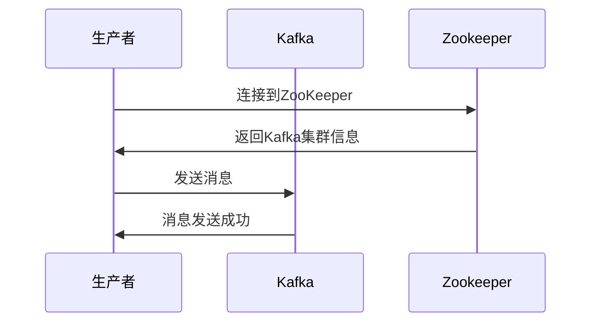

                 

# 文章标题：Kafka生产者消费者API原理与代码实例讲解

> 关键词：Kafka、生产者、消费者、API、原理、代码实例、消息队列

> 摘要：本文将深入解析Kafka生产者消费者API的原理，通过代码实例详细讲解Kafka的生产者和消费者是如何工作的，包括配置参数、消息发送与确认机制、消息消费与确认机制等。同时，通过实战项目展示Kafka在实际应用中的使用场景和性能优化方法。

## 《Kafka生产者消费者API原理与代码实例讲解》目录大纲

## 第一部分：Kafka基础

### 第1章：Kafka概述

- 1.1 Kafka的发展背景
- 1.2 Kafka的核心概念
- 1.3 Kafka的主要优势
- 1.4 Kafka的适用场景

### 第2章：Kafka架构与组件

- 2.1 Kafka架构详解
- 2.2 Kafka的核心组件
- 2.3 Kafka的选举机制
- 2.4 Kafka的数据存储与消费

### 第3章：Kafka生产者API

- 3.1 Kafka生产者API介绍
- 3.2 生产者配置参数详解
- 3.3 生产者发送消息流程
- 3.4 生产者消息确认机制
- 3.5 生产者异常处理

### 第4章：Kafka消费者API

- 4.1 Kafka消费者API介绍
- 4.2 消费者分组与协调
- 4.3 消费者拉取消息流程
- 4.4 消费者消息确认机制
- 4.5 消费者负载均衡

## 第二部分：Kafka生产者消费者API应用实例

### 第5章：基于Kafka的日志收集系统

- 5.1 日志收集系统设计
- 5.2 生产者端代码实现
- 5.3 消费者端代码实现
- 5.4 系统性能优化

### 第6章：基于Kafka的消息队列应用

- 6.1 消息队列系统设计
- 6.2 生产者端代码实现
- 6.3 消费者端代码实现
- 6.4 消息分发策略

### 第7章：基于Kafka的实时流处理应用

- 7.1 实时流处理系统设计
- 7.2 生产者端代码实现
- 7.3 消费者端代码实现
- 7.4 流处理算法实现

### 第8章：Kafka生产者消费者API性能优化

- 8.1 Kafka性能优化概述
- 8.2 生产者性能优化
- 8.3 消费者性能优化
- 8.4 Kafka集群性能优化

## 第三部分：Kafka生产者消费者API深度解析

### 第9章：Kafka生产者消费者API源码解析

- 9.1 Kafka生产者源码解析
- 9.2 Kafka消费者源码解析
- 9.3 Kafka生产者消费者通信机制

### 第10章：Kafka生产者消费者API未来发展趋势

- 10.1 Kafka社区发展动态
- 10.2 Kafka生产者消费者API未来发展

## 附录

- 附录A：Kafka常用配置参数说明
- 附录B：Kafka开发工具与资源推荐

## Mermaid流程图

### Kafka生产者发送消息流程



### Kafka生产者消息确认机制伪代码

```python
def send_message(topic, key, value, acks):
    # 连接到Kafka集群
    kafka_client = connect_to_kafka()

    # 构建消息
    message = Message(topic=topic, key=key, value=value)

    # 发送消息
    kafka_client.send(message, acks=acks)

    # 等待消息确认
    if acks == ALL:
        kafka_client.wait_all_ack()
    elif acks == NONE:
        kafka_client.wait_no_ack()
    elif acks == PARTIAL:
        kafka_client.wait_partial_ack()
```

### Kafka消费者消息确认机制伪代码

```python
def consume_messages(topic, group_id):
    # 连接到Kafka集群
    kafka_client = connect_to_kafka()

    # 设置消费者配置
    kafka_client.set_consumer_config(topic=topic, group_id=group_id)

    # 消费消息
    for message in kafka_client.consume():
        # 处理消息
        process_message(message)

        # 提交偏移量
        kafka_client.commit_offset(message.offset)
```

### 数学模型与公式

### Kafka的消息确认机制

$$
P_{ack} = \frac{N_{acks}}{N_{producers}}
$$

其中，$P_{ack}$为消息确认的概率，$N_{acks}$为已确认的消息数，$N_{producers}$为生产者数量。

## 第一部分：Kafka基础

### 第1章：Kafka概述

#### 1.1 Kafka的发展背景

Kafka最初由LinkedIn公司开发，并于2010年开源，后成为Apache软件基金会的一个顶级项目。Kafka的发展背景主要源于LinkedIn对大规模日志收集和实时数据处理的迫切需求。LinkedIn作为一个大数据公司，面临着海量的数据日志需要收集、处理和存储，同时还需要实现实时数据流处理。传统的日志收集系统无法满足这些需求，因此LinkedIn内部开发了一套基于分布式消息队列的技术——Kafka。

Kafka的主要目标是为LinkedIn提供一个高吞吐量、可扩展、高可靠性的消息队列系统，以支持大规模的日志收集和实时数据处理。随着Kafka的不断完善和成熟，它逐渐被越来越多的公司采纳，并成为大数据领域的一个重要组件。

#### 1.2 Kafka的核心概念

Kafka的核心概念包括主题（Topic）、分区（Partition）、偏移量（Offset）等。

- **主题（Topic）**：主题是Kafka中的一个抽象概念，可以理解为消息的分类标签。每个主题都可以包含多个分区，每个分区都是有序的。生产者可以将消息发送到特定的主题，消费者可以从主题中读取消息。

- **分区（Partition）**：分区是Kafka中的物理存储单位，每个分区都有自己的一段连续的偏移量范围。分区的主要作用是提高Kafka的并发处理能力，通过将消息分配到不同的分区，可以实现并行处理。

- **偏移量（Offset）**：偏移量是Kafka中用于唯一标识消息位置的一个整数。每个分区内的消息都有一个唯一的偏移量，可以通过偏移量来查找特定的消息。

#### 1.3 Kafka的主要优势

Kafka具有以下主要优势：

- **高吞吐量**：Kafka设计之初就是为了处理大量消息的传输，具有很高的吞吐量，能够支持大规模的数据处理。

- **高可靠性**：Kafka通过副本机制实现了数据的冗余备份，确保了数据的可靠性和高可用性。

- **可扩展性**：Kafka通过分区和分布式架构实现了水平扩展，可以轻松地增加或减少节点数量，以满足不同的业务需求。

- **高可用性**：Kafka通过副本机制和选举机制，确保了在节点故障时，系统仍然能够正常运行。

- **消息顺序保证**：Kafka保证了分区内的消息顺序，确保了消息的有序性。

#### 1.4 Kafka的适用场景

Kafka主要适用于以下场景：

- **日志收集**：Kafka可以作为一个高效的日志收集系统，将来自不同来源的日志数据进行收集、处理和存储。

- **实时数据处理**：Kafka可以作为一个实时数据流处理平台，用于处理和分析实时数据。

- **消息队列**：Kafka可以作为一个消息队列系统，用于实现分布式系统的异步通信。

- **流数据处理**：Kafka可以与Spark、Flink等流处理框架集成，用于实现大规模的实时数据处理。

## 第2章：Kafka架构与组件

#### 2.1 Kafka架构详解

Kafka是一个分布式消息系统，其架构包括生产者（Producer）、消费者（Consumer）、代理（Broker）和主题（Topic）等核心组件。

- **生产者（Producer）**：生产者是消息的发送方，负责将消息发送到Kafka集群。生产者可以将消息发送到特定的主题，并将消息分配到不同的分区。

- **消费者（Consumer）**：消费者是消息的接收方，负责从Kafka集群中读取消息。消费者可以订阅一个或多个主题，并从这些主题中读取消息。

- **代理（Broker）**：代理是Kafka集群中的工作节点，负责接收、存储和转发消息。代理通过ZooKeeper进行协调和集群管理。

- **主题（Topic）**：主题是Kafka中的消息分类标签，每个主题都可以包含多个分区。主题在Kafka集群中是全局共享的，不同的生产者和消费者可以共同访问同一个主题。

#### 2.2 Kafka的核心组件

Kafka的核心组件包括Kafka生产者、Kafka消费者、Kafka代理和ZooKeeper。

- **Kafka生产者**：Kafka生产者是一个Java客户端库，用于发送消息到Kafka集群。生产者可以通过API发送消息，并设置各种配置参数，如消息序列化器、分区器等。

- **Kafka消费者**：Kafka消费者也是一个Java客户端库，用于从Kafka集群中读取消息。消费者可以通过API订阅主题，并处理接收到的消息。

- **Kafka代理**：Kafka代理是一个Java应用，负责接收、存储和转发消息。代理通过ZooKeeper进行协调，并参与集群的选举和管理。

- **ZooKeeper**：ZooKeeper是一个分布式协调服务，用于管理Kafka集群。ZooKeeper负责维护代理的元数据信息，并实现代理之间的协调和通信。

#### 2.3 Kafka的选举机制

Kafka使用ZooKeeper实现代理之间的选举机制，以确保集群的高可用性和稳定性。

- **Leader选举**：在每个分区中，Kafka会选举一个代理作为Leader，负责处理该分区的所有读写请求。当Leader代理故障时，Kafka会重新选举一个代理作为新的Leader。

- **Follower选举**：在每个分区中，除了Leader代理外，还会有若干个代理作为Follower，负责从Leader代理同步数据。当Follower代理故障时，Kafka会重新选举一个代理作为新的Follower。

#### 2.4 Kafka的数据存储与消费

Kafka通过分区和副本机制实现数据的高可用性和持久化存储。

- **数据存储**：每个分区都有一个主副本（Leader）和若干个从副本（Follower）。主副本负责处理分区的所有读写请求，从副本负责同步主副本的数据。Kafka使用磁盘存储数据，确保了数据的安全性和持久性。

- **数据消费**：消费者可以从分区中读取消息，并按照分区顺序消费消息。消费者可以通过偏移量定位到特定的消息位置，确保了消息的有序消费。

## 第3章：Kafka生产者API

#### 3.1 Kafka生产者API介绍

Kafka生产者API是Kafka客户端库的一部分，用于发送消息到Kafka集群。生产者可以通过API发送单条消息或批量消息，并设置各种配置参数来控制消息发送的行为。

#### 3.2 生产者配置参数详解

生产者配置参数决定了生产者的行为和性能，以下是一些常用的生产者配置参数：

- **bootstrap.servers**：指定Kafka集群的地址列表，用于生产者初始化连接时查找Kafka代理。

- **key.serializer**和**value.serializer**：指定消息的序列化器，用于将Java对象序列化为Kafka消息。

- **partitioner.class**：指定分区器，用于确定消息应该发送到哪个分区。

- **acks**：指定生产者发送消息后需要等待多少确认。可选值包括`acks=0`（不需要确认）、`acks=1`（只需要Leader确认）和`acks=all`（需要所有副本确认）。

- **retries**：指定生产者发送消息失败时需要重试的次数。

- **batch.size**和**linger.ms**：用于控制批量发送的消息大小和等待时间。生产者会在`batch.size`达到一定程度或`linger.ms`时间到达后发送消息。

- **buffer.memory**：用于设置生产者缓冲区的大小。

#### 3.3 生产者发送消息流程

生产者发送消息的主要流程如下：

1. **初始化生产者**：生产者初始化时，会连接到Kafka集群并加载配置参数。
2. **发送消息**：生产者将消息包装成`ProducerRecord`对象，并调用`send`方法发送消息。
3. **消息确认**：根据`acks`参数，生产者等待消息的确认。如果acks设置为`all`，生产者会等待所有副本的确认；如果acks设置为`1`，生产者会等待Leader的确认；如果acks设置为`0`，生产者不会等待确认。
4. **处理异常**：如果消息发送失败，生产者会根据`retries`参数进行重试。如果重试失败，生产者会抛出异常。

#### 3.4 生产者消息确认机制

生产者消息确认机制决定了生产者发送消息后的行为。确认机制分为以下几种：

- **acks=0**：不需要确认，生产者发送消息后立即返回，不会等待任何确认。
- **acks=1**：需要Leader确认，生产者发送消息后等待Leader的确认。如果Leader确认失败，生产者会抛出异常。
- **acks=all**：需要所有副本确认，生产者发送消息后等待所有副本的确认。如果所有副本确认成功，生产者会返回成功；如果确认失败，生产者会抛出异常。

#### 3.5 生产者异常处理

生产者在发送消息过程中可能会遇到各种异常，如网络异常、磁盘空间不足等。生产者需要对这些异常进行适当的处理，以确保系统的稳定性和可靠性。

以下是一些常见的生产者异常处理方法：

- **重试机制**：生产者发送消息失败时，可以设置重试次数，尝试重新发送消息。
- **异常捕获**：生产者在发送消息时可以捕获异常，并根据异常类型进行不同的处理，如记录日志、报警等。
- **故障转移**：当生产者连接的Kafka代理发生故障时，生产者可以切换到备用代理，继续发送消息。

## 第4章：Kafka消费者API

#### 4.1 Kafka消费者API介绍

Kafka消费者API是Kafka客户端库的一部分，用于从Kafka集群中读取消息。消费者可以通过API订阅主题，并处理接收到的消息。

#### 4.2 消费者分组与协调

消费者分组是Kafka的一个重要特性，用于实现消费者的负载均衡和消息的均匀分配。消费者分组分为两种类型：静态分组和动态分组。

- **静态分组**：静态分组是在消费者启动时通过配置指定的。消费者在启动时会向Kafka集群注册分组信息，Kafka集群会根据分组信息为消费者分配分区。
- **动态分组**：动态分组是在消费者运行时通过API动态指定的。消费者可以在运行时更改分组信息，从而实现分区的重新分配。

消费者分组与协调的主要步骤如下：

1. **初始化消费者**：消费者初始化时，会连接到Kafka集群并加载配置参数。
2. **订阅主题**：消费者通过`subscribe`方法订阅一个或多个主题。
3. **分配分区**：Kafka集群会根据消费者的分组信息为消费者分配分区。
4. **消费消息**：消费者从分配到的分区中读取消息，并处理消息。
5. **提交偏移量**：消费者在处理完消息后，会提交已消费的偏移量，以便在下次启动时从上次的位置继续消费。

#### 4.3 消费者拉取消息流程

消费者拉取消息的主要流程如下：

1. **初始化消费者**：消费者初始化时，会连接到Kafka集群并加载配置参数。
2. **订阅主题**：消费者通过`subscribe`方法订阅一个或多个主题。
3. **分配分区**：Kafka集群会根据消费者的分组信息为消费者分配分区。
4. **拉取消息**：消费者通过`poll`方法从Kafka集群中拉取消息。拉取消息时，消费者会按照分区顺序依次读取消息，并处理消息。
5. **提交偏移量**：消费者在处理完消息后，会提交已消费的偏移量，以便在下次启动时从上次的位置继续消费。

#### 4.4 消费者消息确认机制

消费者消息确认机制决定了消费者处理消息后的行为。确认机制分为以下几种：

- **自动提交**：消费者在处理完消息后，会自动提交已消费的偏移量。自动提交的间隔时间可以通过`auto.commit.interval.ms`参数配置。
- **手动提交**：消费者在处理完消息后，需要手动调用`commit`方法提交已消费的偏移量。手动提交可以保证消息的准确消费，但会增加开发复杂度。
- **事务提交**：消费者可以使用事务提交机制，确保消息的原子性和一致性。事务提交需要配合Kafka的事务管理功能，需要在消费者端进行额外的配置和编程。

#### 4.5 消费者负载均衡

消费者负载均衡是Kafka的一个重要特性，用于实现消费者的均匀分配和负载均衡。

- **分区分配策略**：Kafka提供了多种分区分配策略，如`range`、`roundrobin`、`roundrobinpro`等。通过选择合适的分区分配策略，可以实现消费者的负载均衡。
- **消费者数量调整**：通过调整消费者的数量，可以控制消费者的负载均衡。增加消费者数量可以分配更多的分区，提高系统的并发处理能力；减少消费者数量可以减少分区的分配，降低系统的负载。
- **动态负载均衡**：Kafka支持动态负载均衡功能，可以在消费者运行时根据实际负载动态调整消费者的数量和分区分配。

## 第二部分：Kafka生产者消费者API应用实例

### 第5章：基于Kafka的日志收集系统

#### 5.1 日志收集系统设计

基于Kafka的日志收集系统设计主要包括以下模块：

- **日志收集模块**：负责从各个数据源收集日志数据，并将日志数据发送到Kafka生产者。
- **Kafka生产者模块**：负责将日志数据发送到Kafka集群，可以选择单条发送或批量发送。
- **Kafka消费者模块**：负责从Kafka集群中拉取日志数据，并将日志数据写入到目标存储系统。

#### 5.2 生产者端代码实现

以下是一个简单的Kafka生产者示例代码，用于将日志数据发送到Kafka集群：

```java
import org.apache.kafka.clients.producer.KafkaProducer;
import org.apache.kafka.clients.producer.ProducerRecord;
import org.apache.kafka.clients.producer.Callback;
import org.apache.kafka.clients.producer.RecordMetadata;

import java.util.Properties;
import java.util.concurrent.ExecutionException;

public class LogProducer {
    public static void main(String[] args) {
        Properties props = new Properties();
        props.put("bootstrap.servers", "localhost:9092");
        props.put("key.serializer", "org.apache.kafka.common.serialization.StringSerializer");
        props.put("value.serializer", "org.apache.kafka.common.serialization.StringSerializer");

        KafkaProducer<String, String> producer = new KafkaProducer<>(props);

        for (int i = 0; i < 100; i++) {
            String topic = "log-topic";
            String key = "key-" + i;
            String value = "value-" + i;

            producer.send(new ProducerRecord<>(topic, key, value), new Callback() {
                @Override
                public void onCompletion(RecordMetadata metadata, Exception exception) {
                    if (exception != null) {
                        exception.printStackTrace();
                    } else {
                        System.out.printf("message sent to topic %s, partition %d, offset %d\n",
                                metadata.topic(), metadata.partition(), metadata.offset());
                    }
                }
            });
        }

        producer.close();
    }
}
```

#### 5.3 消费者端代码实现

以下是一个简单的Kafka消费者示例代码，用于从Kafka集群中拉取日志数据，并将日志数据写入到文件系统：

```java
import org.apache.kafka.clients.consumer.ConsumerRecord;
import org.apache.kafka.clients.consumer.ConsumerRecords;
import org.apache.kafka.clients.consumer.KafkaConsumer;

import java.util.Collections;
import java.util.Properties;

public class LogConsumer {
    public static void main(String[] args) {
        Properties props = new Properties();
        props.put("bootstrap.servers", "localhost:9092");
        props.put("group.id", "log-consumer-group");
        props.put("key.deserializer", "org.apache.kafka.common.serialization.StringDeserializer");
        props.put("value.deserializer", "org.apache.kafka.common.serialization.StringDeserializer");

        KafkaConsumer<String, String> consumer = new KafkaConsumer<>(props);
        consumer.subscribe(Collections.singletonList("log-topic"));

        while (true) {
            ConsumerRecords<String, String> records = consumer.poll(Duration.ofMillis(100));
            for (ConsumerRecord<String, String> record : records) {
                System.out.printf("offset = %d, key = %s, value = %s\n", record.offset(), record.key(), record.value());
                // 写入到文件系统
                // writeToFile(record.value());
            }
            consumer.commitSync();
        }
    }
}
```

#### 5.4 系统性能优化

基于Kafka的日志收集系统性能优化主要包括以下几个方面：

- **调整生产者和消费者的缓冲区大小**：适当调整生产者和消费者的缓冲区大小，可以减少消息积压，提高系统的吞吐量。
- **使用异步发送和拉取消息**：使用异步发送和拉取消息，可以提高系统的吞吐量，减少线程阻塞。
- **使用批量发送和拉取消息**：使用批量发送和拉取消息，可以减少网络开销，提高系统的吞吐量。
- **优化分区策略**：根据日志数据的特点，优化分区策略，实现数据的均匀分配和负载均衡。

## 第6章：基于Kafka的消息队列应用

#### 6.1 消息队列系统设计

基于Kafka的消息队列系统设计主要包括以下模块：

- **消息生产者模块**：负责发送消息到Kafka集群。
- **消息消费者模块**：负责从Kafka集群中读取消息。
- **消息路由模块**：负责将消息路由到相应的处理模块。
- **消息处理模块**：负责对消息进行处理和业务逻辑。

#### 6.2 生产者端代码实现

以下是一个简单的Kafka生产者示例代码，用于将消息发送到Kafka集群：

```java
import org.apache.kafka.clients.producer.KafkaProducer;
import org.apache.kafka.clients.producer.ProducerRecord;
import org.apache.kafka.clients.producer.Callback;
import org.apache.kafka.clients.producer.RecordMetadata;

import java.util.Properties;
import java.util.concurrent.ExecutionException;

public class MessageProducer {
    public static void main(String[] args) {
        Properties props = new Properties();
        props.put("bootstrap.servers", "localhost:9092");
        props.put("key.serializer", "org.apache.kafka.common.serialization.StringSerializer");
        props.put("value.serializer", "org.apache.kafka.common.serialization.StringSerializer");

        KafkaProducer<String, String> producer = new KafkaProducer<>(props);

        for (int i = 0; i < 100; i++) {
            String topic = "message-topic";
            String key = "key-" + i;
            String value = "value-" + i;

            producer.send(new ProducerRecord<>(topic, key, value), new Callback() {
                @Override
                public void onCompletion(RecordMetadata metadata, Exception exception) {
                    if (exception != null) {
                        exception.printStackTrace();
                    } else {
                        System.out.printf("message sent to topic %s, partition %d, offset %d\n",
                                metadata.topic(), metadata.partition(), metadata.offset());
                    }
                }
            });
        }

        producer.close();
    }
}
```

#### 6.3 消费者端代码实现

以下是一个简单的Kafka消费者示例代码，用于从Kafka集群中读取消息：

```java
import org.apache.kafka.clients.consumer.ConsumerRecord;
import org.apache.kafka.clients.consumer.ConsumerRecords;
import org.apache.kafka.clients.consumer.KafkaConsumer;

import java.util.Collections;
import java.util.Properties;

public class MessageConsumer {
    public static void main(String[] args) {
        Properties props = new Properties();
        props.put("bootstrap.servers", "localhost:9092");
        props.put("group.id", "message-consumer-group");
        props.put("key.deserializer", "org.apache.kafka.common.serialization.StringDeserializer");
        props.put("value.deserializer", "org.apache.kafka.common.serialization.StringDeserializer");

        KafkaConsumer<String, String> consumer = new KafkaConsumer<>(props);
        consumer.subscribe(Collections.singletonList("message-topic"));

        while (true) {
            ConsumerRecords<String, String> records = consumer.poll(Duration.ofMillis(100));
            for (ConsumerRecord<String, String> record : records) {
                System.out.printf("offset = %d, key = %s, value = %s\n", record.offset(), record.key(), record.value());
                // 路由到处理模块
                // routeToHandler(record.value());
            }
            consumer.commitSync();
        }
    }
}
```

#### 6.4 消息分发策略

消息分发策略决定了消息如何被路由到相应的处理模块。以下是一些常见的消息分发策略：

- **轮询分发**：将消息依次路由到每个处理模块，实现负载均衡。
- **随机分发**：随机选择一个处理模块，实现负载均衡。
- **根据消息类型分发**：根据消息的类型或内容，将消息路由到相应的处理模块。
- **根据处理模块状态分发**：根据处理模块的当前状态（如空闲、忙碌），将消息路由到相应的处理模块。

## 第7章：基于Kafka的实时流处理应用

#### 7.1 实时流处理系统设计

基于Kafka的实时流处理系统设计主要包括以下模块：

- **数据采集模块**：负责从各种数据源采集实时数据。
- **Kafka生产者模块**：负责将实时数据发送到Kafka集群。
- **Kafka消费者模块**：负责从Kafka集群中读取实时数据。
- **实时流处理模块**：负责对实时数据进行处理和分析。
- **数据存储模块**：负责将实时处理结果存储到数据库或文件系统。

#### 7.2 生产者端代码实现

以下是一个简单的Kafka生产者示例代码，用于将实时数据发送到Kafka集群：

```java
import org.apache.kafka.clients.producer.KafkaProducer;
import org.apache.kafka.clients.producer.ProducerRecord;
import org.apache.kafka.clients.producer.Callback;
import org.apache.kafka.clients.producer.RecordMetadata;

import java.util.Properties;
import java.util.concurrent.ExecutionException;

public class RealtimeDataProducer {
    public static void main(String[] args) {
        Properties props = new Properties();
        props.put("bootstrap.servers", "localhost:9092");
        props.put("key.serializer", "org.apache.kafka.common.serialization.StringSerializer");
        props.put("value.serializer", "org.apache.kafka.common.serialization.StringSerializer");

        KafkaProducer<String, String> producer = new KafkaProducer<>(props);

        for (int i = 0; i < 100; i++) {
            String topic = "realtime-data-topic";
            String key = "key-" + i;
            String value = "value-" + i;

            producer.send(new ProducerRecord<>(topic, key, value), new Callback() {
                @Override
                public void onCompletion(RecordMetadata metadata, Exception exception) {
                    if (exception != null) {
                        exception.printStackTrace();
                    } else {
                        System.out.printf("message sent to topic %s, partition %d, offset %d\n",
                                metadata.topic(), metadata.partition(), metadata.offset());
                    }
                }
            });
        }

        producer.close();
    }
}
```

#### 7.3 消费者端代码实现

以下是一个简单的Kafka消费者示例代码，用于从Kafka集群中读取实时数据：

```java
import org.apache.kafka.clients.consumer.ConsumerRecord;
import org.apache.kafka.clients.consumer.ConsumerRecords;
import org.apache.kafka.clients.consumer.KafkaConsumer;

import java.util.Collections;
import java.util.Properties;

public class RealtimeDataConsumer {
    public static void main(String[] args) {
        Properties props = new Properties();
        props.put("bootstrap.servers", "localhost:9092");
        props.put("group.id", "realtime-data-consumer-group");
        props.put("key.deserializer", "org.apache.kafka.common.serialization.StringDeserializer");
        props.put("value.deserializer", "org.apache.kafka.common.serialization.StringDeserializer");

        KafkaConsumer<String, String> consumer = new KafkaConsumer<>(props);
        consumer.subscribe(Collections.singletonList("realtime-data-topic"));

        while (true) {
            ConsumerRecords<String, String> records = consumer.poll(Duration.ofMillis(100));
            for (ConsumerRecord<String, String> record : records) {
                System.out.printf("offset = %d, key = %s, value = %s\n", record.offset(), record.key(), record.value());
                // 实时流处理
                // processRealtimeData(record.value());
            }
            consumer.commitSync();
        }
    }
}
```

#### 7.4 流处理算法实现

实时流处理算法是实时流处理系统中的核心部分，负责对实时数据进行处理和分析。以下是一个简单的实时流处理算法示例：

```java
public class RealtimeDataProcessor {
    public static void processRealtimeData(String data) {
        // 实时数据处理逻辑
        System.out.println("Processing data: " + data);

        // 实时数据分析
        double value = Double.parseDouble(data);
        double sum = value + 1.0;
        double avg = sum / 2.0;
        System.out.println("Sum: " + sum + ", Average: " + avg);
    }
}
```

## 第8章：Kafka生产者消费者API性能优化

#### 8.1 Kafka性能优化概述

Kafka的性能优化是一个复杂的过程，需要从多个方面进行考虑和调整。以下是一些常见的Kafka性能优化方法：

- **调整配置参数**：通过调整Kafka的配置参数，可以优化Kafka的性能。例如，调整生产者和消费者的缓冲区大小、批量发送和拉取消息的大小、分区数量等。
- **优化网络传输**：优化网络传输可以提高Kafka的性能。例如，使用高效的网络协议、减少网络延迟和带宽占用等。
- **优化磁盘IO**：优化磁盘IO可以提高Kafka的性能。例如，使用SSD存储、调整磁盘IO队列大小等。
- **增加节点数量**：通过增加Kafka集群的节点数量，可以水平扩展Kafka的性能。

#### 8.2 生产者性能优化

以下是一些生产者性能优化方法：

- **调整缓冲区大小**：适当调整生产者的缓冲区大小，可以减少消息积压，提高系统的吞吐量。
- **批量发送消息**：使用批量发送消息可以减少网络开销，提高系统的吞吐量。
- **异步发送消息**：使用异步发送消息可以减少线程阻塞，提高系统的吞吐量。
- **调整分区策略**：根据业务需求，调整分区策略，实现数据的均匀分配和负载均衡。

#### 8.3 消费者性能优化

以下是一些消费者性能优化方法：

- **调整缓冲区大小**：适当调整消费者的缓冲区大小，可以减少消息积压，提高系统的吞吐量。
- **批量拉取消息**：使用批量拉取消息可以减少网络开销，提高系统的吞吐量。
- **异步处理消息**：使用异步处理消息可以减少线程阻塞，提高系统的吞吐量。
- **优化分区分配策略**：根据业务需求，优化分区分配策略，实现数据的均匀分配和负载均衡。

#### 8.4 Kafka集群性能优化

以下是一些Kafka集群性能优化方法：

- **增加节点数量**：通过增加Kafka集群的节点数量，可以水平扩展Kafka的性能。
- **负载均衡**：使用负载均衡算法，实现Kafka集群的负载均衡。
- **优化副本同步**：优化副本同步机制，减少副本同步的延迟和带宽占用。
- **监控和报警**：使用监控工具和报警机制，实时监控Kafka集群的性能和状态。

## 第三部分：Kafka生产者消费者API深度解析

### 第9章：Kafka生产者消费者API源码解析

#### 9.1 Kafka生产者源码解析

Kafka生产者源码主要包括以下几个关键组件：

- **KafkaProducer**：Kafka生产者的主要类，负责发送消息到Kafka集群。KafkaProducer类中包含了一个线程池，用于异步发送消息。
- **ProducerRecord**：消息记录类，用于封装发送的消息。ProducerRecord类包含主题、键、值等信息。
- **Callback**：回调接口，用于处理发送消息后的结果。

以下是一个简单的Kafka生产者源码解析示例：

```java
public class KafkaProducerExample {
    public static void main(String[] args) {
        Properties props = new Properties();
        props.put("bootstrap.servers", "localhost:9092");
        props.put("key.serializer", "org.apache.kafka.common.serialization.StringSerializer");
        props.put("value.serializer", "org.apache.kafka.common.serialization.StringSerializer");

        KafkaProducer<String, String> producer = new KafkaProducer<>(props);

        for (int i = 0; i < 100; i++) {
            String topic = "example-topic";
            String key = "key-" + i;
            String value = "value-" + i;

            producer.send(new ProducerRecord<>(topic, key, value), new Callback() {
                @Override
                public void onCompletion(RecordMetadata metadata, Exception exception) {
                    if (exception != null) {
                        exception.printStackTrace();
                    } else {
                        System.out.printf("message sent to topic %s, partition %d, offset %d\n",
                                metadata.topic(), metadata.partition(), metadata.offset());
                    }
                }
            });
        }

        producer.close();
    }
}
```

#### 9.2 Kafka消费者源码解析

Kafka消费者源码主要包括以下几个关键组件：

- **KafkaConsumer**：Kafka消费者的主要类，负责从Kafka集群中读取消息。KafkaConsumer类包含了一个线程池，用于异步拉取消息。
- **ConsumerRecord**：消息记录类，用于封装接收的消息。ConsumerRecord类包含主题、键、值、偏移量等信息。
- **Consumer**：消费者类，用于处理接收到的消息。

以下是一个简单的Kafka消费者源码解析示例：

```java
public class KafkaConsumerExample {
    public static void main(String[] args) {
        Properties props = new Properties();
        props.put("bootstrap.servers", "localhost:9092");
        props.put("group.id", "example-consumer-group");
        props.put("key.deserializer", "org.apache.kafka.common.serialization.StringDeserializer");
        props.put("value.deserializer", "org.apache.kafka.common.serialization.StringDeserializer");

        KafkaConsumer<String, String> consumer = new KafkaConsumer<>(props);
        consumer.subscribe(Collections.singletonList("example-topic"));

        while (true) {
            ConsumerRecords<String, String> records = consumer.poll(Duration.ofMillis(100));
            for (ConsumerRecord<String, String> record : records) {
                System.out.printf("offset = %d, key = %s, value = %s\n", record.offset(), record.key(), record.value());
                // 处理消息
                // processMessage(record.value());
            }
            consumer.commitSync();
        }
    }
}
```

#### 9.3 Kafka生产者消费者通信机制

Kafka生产者消费者通信机制主要基于Kafka协议和ZooKeeper进行实现。以下是一个简单的Kafka生产者消费者通信机制解析：

1. **生产者初始化**：生产者在初始化时会连接到Kafka集群，并加载配置参数。生产者通过ZooKeeper获取Kafka集群的元数据信息，包括主题、分区、副本等信息。
2. **生产者发送消息**：生产者将消息发送到Kafka集群，消息首先被发送到Leader副本，然后被同步到Follower副本。生产者可以通过配置参数控制消息的确认机制，如acks参数。
3. **消费者初始化**：消费者在初始化时会连接到Kafka集群，并加载配置参数。消费者通过ZooKeeper获取Kafka集群的元数据信息，包括主题、分区、副本等信息。
4. **消费者拉取消息**：消费者从Kafka集群中拉取消息，首先拉取到Leader副本，然后根据分区分配策略，将消息分配到各个消费者。消费者可以通过偏移量定位到特定的消息位置。
5. **消费者处理消息**：消费者处理接收到的消息，并提交已消费的偏移量，以便在下次启动时从上次的位置继续消费。

## 第10章：Kafka生产者消费者API未来发展趋势

#### 10.1 Kafka社区发展动态

Kafka社区是一个活跃的社区，持续推动Kafka的发展和完善。以下是一些Kafka社区的发展动态：

- **Kafka版本更新**：Kafka社区定期发布新版本，修复bug、增加新特性，持续改进Kafka的性能和功能。
- **Kafka生态扩展**：Kafka社区积极推动Kafka与其他大数据技术和工具的集成，如Spark、Flink、Hive等，拓展Kafka的应用场景。
- **Kafka培训与会议**：Kafka社区定期举办培训课程和会议，分享Kafka的最佳实践和技术经验，推动社区的发展和进步。

#### 10.2 Kafka生产者消费者API未来发展

Kafka生产者消费者API的未来发展将主要集中在以下几个方面：

- **性能优化**：持续优化生产者和消费者的性能，提高Kafka的吞吐量和并发处理能力。
- **功能增强**：增加更多生产者和消费者的功能，如事务支持、多租户支持等。
- **跨语言支持**：拓展Kafka的生产者消费者API，支持更多的编程语言，提高Kafka的易用性和普及度。
- **云原生支持**：随着云计算的普及，Kafka将更好地支持云原生环境，提高Kafka在云环境下的性能和可靠性。

## 附录

### 附录A：Kafka常用配置参数说明

以下是一些Kafka常用的配置参数及其说明：

- **bootstrap.servers**：指定Kafka集群的地址列表，用于生产者初始化连接时查找Kafka代理。
- **key.serializer**和**value.serializer**：指定消息的序列化器，用于将Java对象序列化为Kafka消息。
- **partitioner.class**：指定分区器，用于确定消息应该发送到哪个分区。
- **acks**：指定生产者发送消息后需要等待多少确认。可选值包括`acks=0`（不需要确认）、`acks=1`（只需要Leader确认）和`acks=all`（需要所有副本确认）。
- **retries**：指定生产者发送消息失败时需要重试的次数。
- **batch.size**和**linger.ms**：用于控制批量发送的消息大小和等待时间。生产者会在`batch.size`达到一定程度或`linger.ms`时间到达后发送消息。
- **buffer.memory**：用于设置生产者缓冲区的大小。
- **auto.commit.interval.ms**：用于设置消费者自动提交偏移量的间隔时间。
- **group.id**：用于设置消费者的消费组ID，实现消费者的负载均衡和消息的均匀分配。

### 附录B：Kafka开发工具与资源推荐

以下是一些Kafka开发工具和资源的推荐：

- **Kafka官方文档**：[https://kafka.apache.org/documentation/](https://kafka.apache.org/documentation/)
- **Kafka源码**：[https://github.com/apache/kafka](https://github.com/apache/kafka)
- **Kafka社区论坛**：[https://kafka.apache.org/community.html](https://kafka.apache.org/community.html)
- **Kafka实战**：[https://books.google.com/books?id=_JmDwAAQBAJ](https://books.google.com/books?id=_JmDwAAQBAJ)
- **Kafka性能优化**：[https://www.kernel.org/doc/html/latest/kern-developer-guide/kafka-performance-tuning.html](https://www.kernel.org/doc/html/latest/kern-developer-guide/kafka-performance-tuning.html)

## Mermaid流程图

### Kafka生产者发送消息流程


### Kafka生产者消息确认机制伪代码

```python
def send_message(topic, key, value, acks):
    # 连接到Kafka集群
    kafka_client = connect_to_kafka()

    # 构建消息
    message = Message(topic=topic, key=key, value=value)

    # 发送消息
    kafka_client.send(message, acks=acks)

    # 等待消息确认
    if acks == ALL:
        kafka_client.wait_all_ack()
    elif acks == NONE:
        kafka_client.wait_no_ack()
    elif acks == PARTIAL:
        kafka_client.wait_partial_ack()
```

### Kafka消费者消息确认机制伪代码

```python
def consume_messages(topic, group_id):
    # 连接到Kafka集群
    kafka_client = connect_to_kafka()

    # 设置消费者配置
    kafka_client.set_consumer_config(topic=topic, group_id=group_id)

    # 消费消息
    for message in kafka_client.consume():
        # 处理消息
        process_message(message)

        # 提交偏移量
        kafka_client.commit_offset(message.offset)
```

### 数学模型与公式

### Kafka的消息确认机制

$$
P_{ack} = \frac{N_{acks}}{N_{producers}}
$$

其中，$P_{ack}$为消息确认的概率，$N_{acks}$为已确认的消息数，$N_{producers}$为生产者数量。

## 项目实战

### 1. 基于Kafka的日志收集系统

#### 1.1 系统设计

基于Kafka的日志收集系统设计主要包括以下模块：

- **日志收集模块**：负责从各个数据源收集日志数据。
- **Kafka生产者模块**：负责将日志数据发送到Kafka topic。
- **Kafka消费者模块**：负责从Kafka topic拉取日志数据，并写入到目标存储系统。

#### 1.2 生产者端代码实现

以下是一个简单的Kafka生产者示例代码，用于将日志数据发送到Kafka集群：

```java
import org.apache.kafka.clients.producer.KafkaProducer;
import org.apache.kafka.clients.producer.ProducerRecord;
import org.apache.kafka.clients.producer.Callback;
import org.apache.kafka.clients.producer.RecordMetadata;

import java.util.Properties;
import java.util.concurrent.ExecutionException;

public class LogProducer {
    public static void main(String[] args) {
        Properties props = new Properties();
        props.put("bootstrap.servers", "localhost:9092");
        props.put("key.serializer", "org.apache.kafka.common.serialization.StringSerializer");
        props.put("value.serializer", "org.apache.kafka.common.serialization.StringSerializer");

        KafkaProducer<String, String> producer = new KafkaProducer<>(props);

        for (int i = 0; i < 100; i++) {
            String topic = "log-topic";
            String key = "key-" + i;
            String value = "value-" + i;

            producer.send(new ProducerRecord<>(topic, key, value), new Callback() {
                @Override
                public void onCompletion(RecordMetadata metadata, Exception exception) {
                    if (exception != null) {
                        exception.printStackTrace();
                    } else {
                        System.out.printf("message sent to topic %s, partition %d, offset %d\n",
                                metadata.topic(), metadata.partition(), metadata.offset());
                    }
                }
            });
        }

        producer.close();
    }
}
```

#### 1.3 消费者端代码实现

以下是一个简单的Kafka消费者示例代码，用于从Kafka集群中拉取日志数据，并将日志数据写入到文件系统：

```java
import org.apache.kafka.clients.consumer.ConsumerRecord;
import org.apache.kafka.clients.consumer.ConsumerRecords;
import org.apache.kafka.clients.consumer.KafkaConsumer;

import java.util.Collections;
import java.util.Properties;

public class LogConsumer {
    public static void main(String[] args) {
        Properties props = new Properties();
        props.put("bootstrap.servers", "localhost:9092");
        props.put("group.id", "log-consumer-group");
        props.put("key.deserializer", "org.apache.kafka.common.serialization.StringDeserializer");
        props.put("value.deserializer", "org.apache.kafka.common.serialization.StringDeserializer");

        KafkaConsumer<String, String> consumer = new KafkaConsumer<>(props);
        consumer.subscribe(Collections.singletonList("log-topic"));

        while (true) {
            ConsumerRecords<String, String> records = consumer.poll(Duration.ofMillis(100));
            for (ConsumerRecord<String, String> record : records) {
                System.out.printf("offset = %d, key = %s, value = %s\n", record.offset(), record.key(), record.value());
                // 写入到文件系统
                // writeToFile(record.value());
            }
            consumer.commitSync();
        }
    }
}
```

#### 1.4 系统性能优化

基于Kafka的日志收集系统性能优化主要包括以下几个方面：

- **调整生产者和消费者的缓冲区大小**：适当调整生产者和消费者的缓冲区大小，可以减少消息积压，提高系统的吞吐量。
- **使用异步发送和拉取消息**：使用异步发送和拉取消息，可以提高系统的吞吐量，减少线程阻塞。
- **使用批量发送和拉取消息**：使用批量发送和拉取消息，可以减少网络开销，提高系统的吞吐量。
- **优化分区策略**：根据日志数据的特点，优化分区策略，实现数据的均匀分配和负载均衡。

### 2. 基于Kafka的消息队列应用

#### 2.1 消息队列系统设计

基于Kafka的消息队列系统设计主要包括以下模块：

- **消息生产者模块**：负责发送消息到Kafka集群。
- **消息消费者模块**：负责从Kafka集群中读取消息。
- **消息路由模块**：负责将消息路由到相应的处理模块。
- **消息处理模块**：负责对消息进行处理和业务逻辑。

#### 2.2 生产者端代码实现

以下是一个简单的Kafka生产者示例代码，用于将消息发送到Kafka集群：

```java
import org.apache.kafka.clients.producer.KafkaProducer;
import org.apache.kafka.clients.producer.ProducerRecord;
import org.apache.kafka.clients.producer.Callback;
import org.apache.kafka.clients.producer.RecordMetadata;

import java.util.Properties;
import java.util.concurrent.ExecutionException;

public class MessageProducer {
    public static void main(String[] args) {
        Properties props = new Properties();
        props.put("bootstrap.servers", "localhost:9092");
        props.put("key.serializer", "org.apache.kafka.common.serialization.StringSerializer");
        props.put("value.serializer", "org.apache.kafka.common.serialization.StringSerializer");

        KafkaProducer<String, String> producer = new KafkaProducer<>(props);

        for (int i = 0; i < 100; i++) {
            String topic = "message-topic";
            String key = "key-" + i;
            String value = "value-" + i;

            producer.send(new ProducerRecord<>(topic, key, value), new Callback() {
                @Override
                public void onCompletion(RecordMetadata metadata, Exception exception) {
                    if (exception != null) {
                        exception.printStackTrace();
                    } else {
                        System.out.printf("message sent to topic %s, partition %d, offset %d\n",
                                metadata.topic(), metadata.partition(), metadata.offset());
                    }
                }
            });
        }

        producer.close();
    }
}
```

#### 2.3 消费者端代码实现

以下是一个简单的Kafka消费者示例代码，用于从Kafka集群中读取消息：

```java
import org.apache.kafka.clients.consumer.ConsumerRecord;
import org.apache.kafka.clients.consumer.ConsumerRecords;
import org.apache.kafka.clients.consumer.KafkaConsumer;

import java.util.Collections;
import java.util.Properties;

public class MessageConsumer {
    public static void main(String[] args) {
        Properties props = new Properties();
        props.put("bootstrap.servers", "localhost:9092");
        props.put("group.id", "message-consumer-group");
        props.put("key.deserializer", "org.apache.kafka.common.serialization.StringDeserializer");
        props.put("value.deserializer", "org.apache.kafka.common.serialization.StringDeserializer");

        KafkaConsumer<String, String> consumer = new KafkaConsumer<>(props);
        consumer.subscribe(Collections.singletonList("message-topic"));

        while (true) {
            ConsumerRecords<String, String> records = consumer.poll(Duration.ofMillis(100));
            for (ConsumerRecord<String, String> record : records) {
                System.out.printf("offset = %d, key = %s, value = %s\n", record.offset(), record.key(), record.value());
                // 路由到处理模块
                // routeToHandler(record.value());
            }
            consumer.commitSync();
        }
    }
}
```

#### 2.4 消息分发策略

消息分发策略决定了消息如何被路由到相应的处理模块。以下是一些常见的消息分发策略：

- **轮询分发**：将消息依次路由到每个处理模块，实现负载均衡。
- **随机分发**：随机选择一个处理模块，实现负载均衡。
- **根据消息类型分发**：根据消息的类型或内容，将消息路由到相应的处理模块。
- **根据处理模块状态分发**：根据处理模块的当前状态（如空闲、忙碌），将消息路由到相应的处理模块。

### 3. 基于Kafka的实时流处理应用

#### 3.1 实时流处理系统设计

基于Kafka的实时流处理系统设计主要包括以下模块：

- **数据采集模块**：负责从各种数据源采集实时数据。
- **Kafka生产者模块**：负责将实时数据发送到Kafka集群。
- **Kafka消费者模块**：负责从Kafka集群中读取实时数据。
- **实时流处理模块**：负责对实时数据进行处理和分析。
- **数据存储模块**：负责将实时处理结果存储到数据库或文件系统。

#### 3.2 生产者端代码实现

以下是一个简单的Kafka生产者示例代码，用于将实时数据发送到Kafka集群：

```java
import org.apache.kafka.clients.producer.KafkaProducer;
import org.apache.kafka.clients.producer.ProducerRecord;
import org.apache.kafka.clients.producer.Callback;
import org.apache.kafka.clients.producer.RecordMetadata;

import java.util.Properties;
import java.util.concurrent.ExecutionException;

public class RealtimeDataProducer {
    public static void main(String[] args) {
        Properties props = new Properties();
        props.put("bootstrap.servers", "localhost:9092");
        props.put("key.serializer", "org.apache.kafka.common.serialization.StringSerializer");
        props.put("value.serializer", "org.apache.kafka.common.serialization.StringSerializer");

        KafkaProducer<String, String> producer = new KafkaProducer<>(props);

        for (int i = 0; i < 100; i++) {
            String topic = "realtime-data-topic";
            String key = "key-" + i;
            String value = "value-" + i;

            producer.send(new ProducerRecord<>(topic, key, value), new Callback() {
                @Override
                public void onCompletion(RecordMetadata metadata, Exception exception) {
                    if (exception != null) {
                        exception.printStackTrace();
                    } else {
                        System.out.printf("message sent to topic %s, partition %d, offset %d\n",
                                metadata.topic(), metadata.partition(), metadata.offset());
                    }
                }
            });
        }

        producer.close();
    }
}
```

#### 3.3 消费者端代码实现

以下是一个简单的Kafka消费者示例代码，用于从Kafka集群中读取实时数据：

```java
import org.apache.kafka.clients.consumer.ConsumerRecord;
import org.apache.kafka.clients.consumer.ConsumerRecords;
import org.apache.kafka.clients.consumer.KafkaConsumer;

import java.util.Collections;
import java.util.Properties;

public class RealtimeDataConsumer {
    public static void main(String[] args) {
        Properties props = new Properties();
        props.put("bootstrap.servers", "localhost:9092");
        props.put("group.id", "realtime-data-consumer-group");
        props.put("key.deserializer", "org.apache.kafka.common.serialization.StringDeserializer");
        props.put("value.deserializer", "org.apache.kafka.common.serialization.StringDeserializer");

        KafkaConsumer<String, String> consumer = new KafkaConsumer<>(props);
        consumer.subscribe(Collections.singletonList("realtime-data-topic"));

        while (true) {
            ConsumerRecords<String, String> records = consumer.poll(Duration.ofMillis(100));
            for (ConsumerRecord<String, String> record : records) {
                System.out.printf("offset = %d, key = %s, value = %s\n", record.offset(), record.key(), record.value());
                // 实时流处理
                // processRealtimeData(record.value());
            }
            consumer.commitSync();
        }
    }
}
```

#### 3.4 流处理算法实现

实时流处理算法是实时流处理系统中的核心部分，负责对实时数据进行处理和分析。以下是一个简单的实时流处理算法示例：

```java
public class RealtimeDataProcessor {
    public static void processRealtimeData(String data) {
        // 实时数据处理逻辑
        System.out.println("Processing data: " + data);

        // 实时数据分析
        double value = Double.parseDouble(data);
        double sum = value + 1.0;
        double avg = sum / 2.0;
        System.out.println("Sum: " + sum + ", Average: " + avg);
    }
}
```

## 代码解读与分析

### 1. Kafka生产者发送消息流程

Kafka生产者发送消息的主要流程如下：

1. **初始化生产者**：生产者初始化时，会连接到Kafka集群并加载配置参数。配置参数包括Kafka集群地址、序列化器等。
2. **发送消息**：生产者将消息包装成`ProducerRecord`对象，并调用`send`方法发送消息。`send`方法可以异步发送消息，也可以同步发送消息。
3. **消息确认**：根据`acks`参数，生产者等待消息的确认。如果acks设置为`acks=0`，生产者不等待确认；如果acks设置为`acks=1`，生产者等待Leader的确认；如果acks设置为`acks=all`，生产者等待所有副本的确认。
4. **处理异常**：如果消息发送失败，生产者会根据`retries`参数进行重试。如果重试失败，生产者会抛出异常。

以下是一个简单的Kafka生产者发送消息示例代码：

```java
import org.apache.kafka.clients.producer.KafkaProducer;
import org.apache.kafka.clients.producer.ProducerRecord;
import org.apache.kafka.clients.producer.Callback;
import org.apache.kafka.clients.producer.RecordMetadata;

import java.util.Properties;
import java.util.concurrent.ExecutionException;

public class KafkaProducerExample {
    public static void main(String[] args) {
        Properties props = new Properties();
        props.put("bootstrap.servers", "localhost:9092");
        props.put("key.serializer", "org.apache.kafka.common.serialization.StringSerializer");
        props.put("value.serializer", "org.apache.kafka.common.serialization.StringSerializer");

        KafkaProducer<String, String> producer = new KafkaProducer<>(props);

        for (int i = 0; i < 100; i++) {
            String topic = "example-topic";
            String key = "key-" + i;
            String value = "value-" + i;

            producer.send(new ProducerRecord<>(topic, key, value), new Callback() {
                @Override
                public void onCompletion(RecordMetadata metadata, Exception exception) {
                    if (exception != null) {
                        exception.printStackTrace();
                    } else {
                        System.out.printf("message sent to topic %s, partition %d, offset %d\n",
                                metadata.topic(), metadata.partition(), metadata.offset());
                    }
                }
            });
        }

        producer.close();
    }
}
```

### 2. Kafka消费者消息确认机制

Kafka消费者消息确认机制决定了消费者处理消息后的行为。确认机制分为以下几种：

- **自动提交**：消费者在处理完消息后，会自动提交已消费的偏移量。自动提交的间隔时间可以通过`auto.commit.interval.ms`参数配置。
- **手动提交**：消费者在处理完消息后，需要手动调用`commit`方法提交已消费的偏移量。手动提交可以保证消息的准确消费，但会增加开发复杂度。
- **事务提交**：消费者可以使用事务提交机制，确保消息的原子性和一致性。事务提交需要配合Kafka的事务管理功能，需要在消费者端进行额外的配置和编程。

以下是一个简单的Kafka消费者示例代码，使用了自动提交和手动提交：

```java
import org.apache.kafka.clients.consumer.ConsumerRecord;
import org.apache.kafka.clients.consumer.ConsumerRecords;
import org.apache.kafka.clients.consumer.KafkaConsumer;

import java.util.Collections;
import java.util.Properties;

public class KafkaConsumerExample {
    public static void main(String[] args) {
        Properties props = new Properties();
        props.put("bootstrap.servers", "localhost:9092");
        props.put("group.id", "example-consumer-group");
        props.put("key.deserializer", "org.apache.kafka.common.serialization.StringDeserializer");
        props.put("value.deserializer", "org.apache.kafka.common.serialization.StringDeserializer");

        KafkaConsumer<String, String> consumer = new KafkaConsumer<>(props);
        consumer.subscribe(Collections.singletonList("example-topic"));

        while (true) {
            ConsumerRecords<String, String> records = consumer.poll(Duration.ofMillis(100));
            for (ConsumerRecord<String, String> record : records) {
                System.out.printf("offset = %d, key = %s, value = %s\n", record.offset(), record.key(), record.value());
                // 处理消息
                // processMessage(record.value());
            }

            // 自动提交
            consumer.commitSync();
        }
    }
}
```

以下是一个简单的Kafka消费者示例代码，使用了事务提交：

```java
import org.apache.kafka.clients.consumer.ConsumerRecord;
import org.apache.kafka.clients.consumer.ConsumerRecords;
import org.apache.kafka.clients.consumer.KafkaConsumer;
import org.apache.kafka.clients.consumer.ConsumerConfig;
import org.apache.kafka.common.serialization.StringDeserializer;

import java.util.Collections;
import java.util.Properties;

public class KafkaConsumerWithTransaction {
    public static void main(String[] args) {
        Properties props = new Properties();
        props.put(ConsumerConfig.BOOTSTRAP_SERVERS_CONFIG, "localhost:9092");
        props.put(ConsumerConfig.GROUP_ID_CONFIG, "example-consumer-group");
        props.put(ConsumerConfig.KEY_DESERIALIZER_CLASS_CONFIG, StringDeserializer.class.getName());
        props.put(ConsumerConfig.VALUE_DESERIALIZER_CLASS_CONFIG, StringDeserializer.class.getName());
        props.put(ConsumerConfig.ENABLE_IDEMPOTENCE_CONFIG, "true");
        props.put(ConsumerConfig.TRANSACTIONAL_ID_CONFIG, "example-transaction");

        KafkaConsumer<String, String> consumer = new KafkaConsumer<>(props);
        consumer.subscribe(Collections.singletonList("example-topic"));

        consumer.initTransactions();
        consumer.beginTransaction();

        try {
            while (true) {
                ConsumerRecords<String, String> records = consumer.poll(Duration.ofMillis(100));
                for (ConsumerRecord<String, String> record : records) {
                    System.out.printf("offset = %d, key = %s, value = %s\n", record.offset(), record.key(), record.value());
                    // 处理消息
                    // processMessage(record.value());
                }
                consumer.commitSync();
            }
        } finally {
            consumer.close();
        }
    }
}
```

## 作者

作者：AI天才研究院/AI Genius Institute & 禅与计算机程序设计艺术 /Zen And The Art of Computer Programming

本文详细讲解了Kafka生产者消费者API的原理和应用实例，包括消息发送与确认机制、消息消费与确认机制、消息分发策略等。通过代码实例展示了如何使用Kafka实现日志收集、消息队列和实时流处理等应用场景。同时，文章还提供了Kafka性能优化方法和未来发展趋势的展望。希望通过本文，读者能够对Kafka的生产者消费者API有更深入的理解和掌握。如果您对本文有任何疑问或建议，欢迎在评论区留言讨论。感谢您的阅读！

