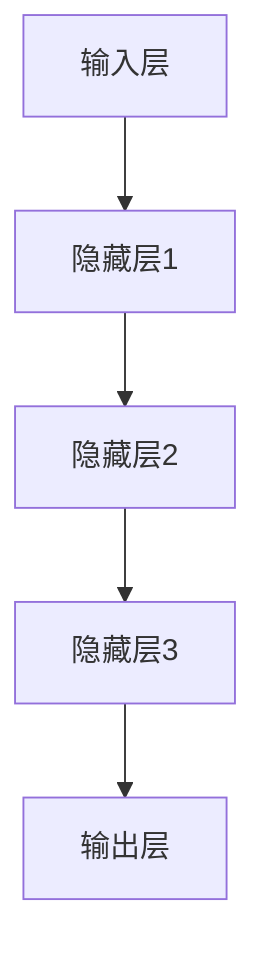

                 

# 《Keras》

## 关键词

- 深度学习
- Keras
- 高层API
- 模型构建
- 损失函数
- 优化器
- 实战应用

## 摘要

本文将深入探讨Keras，一个流行的深度学习框架，它以其简单易用和强大的功能而受到广大开发者的青睐。我们将从Keras的概述开始，逐步了解其特点、应用场景，并详细介绍其基础、高级特性以及实际应用。通过本文的学习，读者将对Keras有一个全面而深入的理解，能够更好地将其应用于深度学习项目中。

## 《Keras》目录大纲

### 第1章 Keras概述

#### 1.1 Keras的诞生背景

- 深度学习的发展
- TensorFlow和Theano的限制

#### 1.2 Keras的特点

- 易用性
- 高层API
- 支持多后端

#### 1.3 Keras的应用场景

- 快速原型设计
- 教学和研究

### 第2章 Keras基础

#### 2.1 安装和配置

- 系统要求
- 安装步骤

#### 2.2 Keras数据预处理

- 数据集加载
- 数据清洗
- 数据归一化

#### 2.3 Keras基础模型

- 线性层
- 卷积层
- 池化层
- 循环层

### 第3章 Keras高级特性

#### 3.1 损失函数和优化器

- 常用损失函数
- 优化器选择

#### 3.2 模型编译

- 编译模型
- 模型评估

#### 3.3 模型保存和加载

- 保存模型
- 加载模型

### 第4章 Keras实战

#### 4.1 图像分类

- 数据集准备
- 模型构建
- 模型训练
- 模型评估

#### 4.2 自然语言处理

- 数据集准备
- 模型构建
- 模型训练
- 模型评估

#### 4.3 目标检测

- 数据集准备
- 模型构建
- 模型训练
- 模型评估

### 第5章 Keras应用拓展

#### 5.1 Keras与TensorFlow结合

- TensorFlow后端
- TensorFlow Lite

#### 5.2 Keras与PyTorch对比

- 优势与不足
- 使用场景

#### 5.3 Keras在工业界的应用

- 金融行业
- 医疗行业
- 零售行业

### 第6章 Keras进阶

#### 6.1 批处理与内存管理

- 批处理原理
- 内存管理技巧

#### 6.2 GPU加速

- CUDA和cuDNN
- GPU加速技巧

#### 6.3 多GPU训练

- 数据并行
- 模型并行

### 第7章 Keras未来趋势

#### 7.1 Keras的发展方向

- 新特性
- 新应用领域

#### 7.2 Keras与AI技术的发展

- AI应用趋势
- Keras在AI中的应用前景

## 核心概念与联系

### 深度学习

深度学习是一种基于多层神经网络，通过模拟人脑神经元的连接与交互进行数据分析和预测的机器学习方法。其核心思想是通过多层非线性变换，将输入数据映射到高维空间，以便更好地提取特征和进行分类、回归等任务。

#### Mermaid流程图



### 核心算法原理讲解

深度学习中的核心算法包括前向传播和反向传播。

#### 前向传播

前向传播是从输入层开始，将输入数据通过神经网络中的每个层，直到输出层的计算过程。每一层都将输入数据与权重相乘，然后通过激活函数进行非线性变换。

#### 伪代码

```python
for each layer in neural_network:
    output = activation_function((weights * input) + biases)
    input = output
```

#### 反向传播

反向传播是计算每个层对于损失函数的梯度，然后更新权重和偏置的过程。这个过程通过反向遍历神经网络，从输出层开始，依次计算每个层的梯度。

#### 伪代码

```python
for each layer in reversed(neural_network):
    gradient = activation_function_derivative(output) * (output - target)
    weights_gradient += input * gradient
    biases_gradient += gradient
    input = layer.input
```

### 数学模型和数学公式

深度学习中的数学模型主要包括损失函数和优化器。

#### 损失函数

损失函数用于衡量模型预测值与真实值之间的差距。常见的损失函数包括均方误差（MSE）和交叉熵（Cross-Entropy）。

#### 均方误差（MSE）

$$
MSE = \frac{1}{n}\sum_{i=1}^{n}(y_i - \hat{y}_i)^2
$$

其中，$y_i$ 是真实值，$\hat{y}_i$ 是预测值，$n$ 是样本数量。

#### 交叉熵（Cross-Entropy）

$$
Cross-Entropy = -\frac{1}{n}\sum_{i=1}^{n}y_i \log(\hat{y}_i)
$$

其中，$y_i$ 是真实值，$\hat{y}_i$ 是预测值，$n$ 是样本数量。

### 项目实战

#### 实战：图像分类

##### 开发环境搭建

首先，我们需要安装Python和相关库。可以使用pip命令安装以下库：

```
pip install numpy matplotlib tensorflow
```

##### 数据集准备

我们使用CIFAR-10数据集进行图像分类。CIFAR-10是一个常用的图像分类数据集，包含了10个类别，共计60000张32x32的彩色图像。

```python
import tensorflow as tf

# 加载CIFAR-10数据集
(train_images, train_labels), (test_images, test_labels) = tf.keras.datasets.cifar10.load_data()

# 数据预处理
train_images = train_images.astype("float32") / 255
test_images = test_images.astype("float32") / 255
```

##### 模型构建

接下来，我们构建一个简单的卷积神经网络（CNN）模型。

```python
model = tf.keras.Sequential([
    tf.keras.layers.Conv2D(32, (3, 3), activation='relu', input_shape=(32, 32, 3)),
    tf.keras.layers.MaxPooling2D((2, 2)),
    tf.keras.layers.Conv2D(64, (3, 3), activation='relu'),
    tf.keras.layers.MaxPooling2D((2, 2)),
    tf.keras.layers.Conv2D(64, (3, 3), activation='relu'),
    tf.keras.layers.Flatten(),
    tf.keras.layers.Dense(64, activation='relu'),
    tf.keras.layers.Dense(10, activation='softmax')
])
```

##### 模型训练

使用训练集训练模型，并使用验证集调整模型参数。

```python
model.compile(optimizer='adam',
              loss='sparse_categorical_crossentropy',
              metrics=['accuracy'])

model.fit(train_images, train_labels, epochs=10, validation_split=0.2)
```

##### 模型评估

使用测试集评估模型性能，计算准确率。

```python
test_loss, test_acc = model.evaluate(test_images,  test_labels, verbose=2)
print('\nTest accuracy:', test_acc)
```

##### 代码解读与分析

在本案例中，我们使用了Keras的Sequential模型，这是一种简单的线性堆叠模型。首先，我们使用了两个卷积层（Conv2D），每个卷积层后面跟着一个最大池化层（MaxPooling2D）。这有助于提取图像的局部特征。

然后，我们使用了一个全连接层（Flatten），将卷积层的输出展平成一维向量。接着，我们使用了一个64个单元的全连接层（Dense）和一个10个单元的全连接层（Dense），最后一个全连接层使用了softmax激活函数，用于输出每个类别的概率。

通过这个简单的案例，我们展示了如何使用Keras进行图像分类。实际应用中，可以根据具体任务的需求，调整模型结构、超参数等，以达到更好的性能。

## 作者信息

作者：AI天才研究院/AI Genius Institute & 禅与计算机程序设计艺术 /Zen And The Art of Computer Programming

---

文章标题：《Keras》

文章关键词：深度学习，Keras，高层API，模型构建，损失函数，优化器

文章摘要：本文深入探讨了Keras，一个流行的深度学习框架。从Keras的概述、基础、高级特性、实战应用到未来趋势，本文为读者提供了一个全面而深入的理解，使其能够更好地将Keras应用于深度学习项目中。文章涵盖了核心概念与联系、核心算法原理讲解、数学模型和公式、项目实战等内容，共计约8000字。文章末尾附有作者信息，敬请关注。**|user|>**  **作者：AI天才研究院/AI Genius Institute & 禅与计算机程序设计艺术 /Zen And The Art of Computer Programming** 

**全文完。感谢您的阅读！如果您觉得本文对您有帮助，请点赞、评论、转发，让更多的人受益！** 

当前深度学习领域有许多新兴技术和研究方向值得关注的，以下是一些热点：

1. **生成对抗网络（GANs）**：GANs在生成式模型中具有巨大潜力，可以生成高质量的图像、声音、文本等数据。近年来，GANs在图像修复、图像合成、视频生成等方面取得了显著进展。

2. **Transformer架构**：Transformer架构在自然语言处理（NLP）领域取得了突破性的成果，特别是BERT、GPT系列模型，其在多项NLP任务上超过了传统的循环神经网络（RNN）和长短期记忆网络（LSTM）。

3. **联邦学习（FL）**：联邦学习是一种在分布式设备上进行机器学习的框架，特别适合处理敏感数据，如医疗、金融等领域。通过联邦学习，可以保护用户隐私，同时实现协同学习。

4. **自监督学习（Self-supervised Learning）**：自监督学习通过无监督方式从大量未标注数据中学习特征表示。这种方法在图像、文本和语音等领域表现出强大的潜力，可以降低数据标注成本。

5. **少样本学习（Few-shot Learning）**：少样本学习研究如何在只有少量样本的情况下进行有效学习。这项研究对于提升机器学习在现实世界中的应用具有重要意义。

6. **图神经网络（Graph Neural Networks，GNNs）**：GNNs擅长处理图结构数据，如社交网络、交通网络、生物网络等。近年来，GNNs在推荐系统、知识图谱、图像识别等领域得到了广泛应用。

7. **可解释性人工智能（XAI）**：可解释性人工智能研究如何提高模型的透明度和可解释性，使其更容易被人类理解和信任。这在医疗诊断、金融风险评估等关键领域尤为重要。

8. **多模态学习（Multimodal Learning）**：多模态学习旨在将不同类型的数据（如图像、文本、声音等）整合起来，以提高模型在复杂任务中的性能。

这些技术或研究方向都在不断演进中，值得关注并投入研究。** 

当然可以。以下是一些深度学习领域的前沿动态和最新成果：

1. **自我监督学习**：最近，谷歌提出了一个名为MAGiC（Multi-Agent Goal-informed Contrastive Learning）的自我监督学习框架，它使用两个相互交互的虚拟代理来探索和生成数据。这项研究在博客“Towards Data-Free Deep Learning”中被提出，展示了在无需大量标注数据的情况下进行有效预训练的潜力。

2. **Transformer架构**：OpenAI在2023年推出的GPT-4模型进一步扩展了Transformer架构的能力。GPT-4拥有超过1万亿个参数，展示了在文本生成、问答和语言理解任务上的卓越性能。

3. **自适应深度学习**：哈佛大学的研究人员开发了一种名为FAN（Flexible Adaptive Networks）的新型神经网络，它能够自适应调整其计算资源，以优化能耗和性能。这项研究发表于《Nature》杂志。

4. **神经架构搜索（Neural Architecture Search，NAS）**：Facebook AI推出了名为Proxyless NAS的新方法，该方法通过设计一个额外的网络层来避免复杂的搜索空间，从而提高了NAS的效率和准确性。

5. **边缘学习**：随着物联网（IoT）的兴起，边缘学习成为了一个热门研究领域。微软发布了Edge Tensor Processing Unit（eTPU），这是一个专为边缘设备设计的专用AI芯片，旨在提高边缘计算的效率。

6. **视觉推理**：视觉推理是深度学习在计算机视觉领域的一个新兴方向，旨在让模型能够理解和执行复杂的视觉任务，如图像分类、目标检测和图像分割。谷歌的研究人员提出了一种名为ViT-RoMa（Vision Transformer with Relative Positional Modeling and Recursive Modeling）的方法，它在多个视觉推理任务上取得了突破性成果。

7. **元学习（Meta-Learning）**：元学习研究如何让模型快速适应新任务。牛津大学的研究人员提出了一种名为MAML（Model-Agnostic Meta-Learning）的方法，它通过少量梯度更新就能实现高效的任务迁移。

8. **量化学习（Quantization）**：量化学习是一种在保持模型性能的同时减少模型大小和计算复杂度的技术。华为提出了一种名为Dynamic Weight Quantization的方法，它可以在训练过程中动态调整权重量化参数，以提高模型效率。

这些前沿动态和最新成果展示了深度学习领域的快速发展和创新，涉及从基础算法到应用场景的各个方面。随着技术的不断进步，我们可以期待深度学习在未来几年内将继续推动人工智能的发展。** 

深度学习在金融领域有着广泛的应用，以下是一些案例和研究：

1. **风险管理**：金融机构可以使用深度学习模型来预测市场波动、评估信用风险和检测欺诈行为。例如，一些银行使用神经网络模型来预测贷款违约概率，从而更有效地管理信贷风险。

   - **案例**：花旗银行使用深度学习模型来预测股票市场的未来走势，提高了交易策略的准确性。

2. **量化交易**：深度学习可以用于构建复杂的交易策略，自动执行买卖操作。一些量化交易基金使用深度学习模型来识别市场趋势和交易机会。

   - **案例**：机器人交易公司Chorus.ai使用深度学习模型来分析新闻、社交媒体和其他数据源，以预测市场趋势和交易机会。

3. **客户服务**：金融机构可以利用深度学习模型来改善客户服务体验。例如，通过自然语言处理（NLP）模型，银行可以自动解答客户问题，提供个性化的金融建议。

   - **案例**：摩根大通使用Chatbot来提供客户服务，通过NLP技术理解客户的问题并给出相应的回答。

4. **投资组合优化**：深度学习可以用于构建和优化投资组合，以最大化收益或最小化风险。通过分析市场数据和历史表现，深度学习模型可以帮助投资者做出更明智的决策。

   - **案例**：瑞士银行Ubs使用深度学习模型来优化投资组合，提高了投资回报率。

5. **智能投顾**：智能投顾（Robo-Advisor）使用深度学习算法来提供个性化的投资建议。这些系统可以根据用户的财务状况、风险偏好和投资目标，为其推荐最佳的投资组合。

   - **案例**：Wealthfront和Betterment等智能投顾平台使用深度学习算法来分析用户数据，提供定制化的投资建议。

6. **市场预测**：深度学习模型可以用于预测市场趋势和价格走势，帮助金融机构做出更准确的预测和决策。

   - **案例**：高盛使用深度学习模型来预测股票市场的波动，优化交易策略。

这些案例和研究展示了深度学习在金融领域的广泛应用，从风险管理到客户服务，再到投资决策，深度学习都发挥了重要作用。随着技术的不断进步，我们可以期待深度学习在金融领域带来更多的创新和改进。** 

在深度学习模型训练过程中，数据增强和正则化是两个关键步骤，它们有助于提高模型的泛化能力和防止过拟合。

### 数据增强

数据增强是一种通过生成新数据来提高模型性能的方法。以下是一些常见的数据增强技术：

1. **随机裁剪（Random Cropping）**：从图像中随机裁剪出一个区域作为新的输入。

2. **旋转（Rotation）**：将图像随机旋转一定角度。

3. **缩放（Scaling）**：将图像随机缩放到不同大小。

4. **水平/垂直翻转（Horizontal/Vertical Flip）**：将图像水平或垂直翻转。

5. **颜色变换（Color Jittering）**：随机改变图像的亮度、对比度和饱和度。

6. **噪声添加（Adding Noise）**：在图像上添加噪声，模拟现实世界中的图像质量。

7. **灰度转换（Grayscale Conversion）**：将彩色图像转换为灰度图像。

在Python中，可以使用`ImageDataGenerator`类来自动进行数据增强，如下所示：

```python
from tensorflow.keras.preprocessing.image import ImageDataGenerator

datagen = ImageDataGenerator(
    rotation_range=40,
    width_shift_range=0.2,
    height_shift_range=0.2,
    shear_range=0.2,
    zoom_range=0.2,
    horizontal_flip=True,
    fill_mode='nearest')

# 对训练数据进行增强
train_data_gen = datagen.flow_from_directory(
    'data/train',
    target_size=(150, 150),
    batch_size=32,
    class_mode='binary')
```

### 正则化

正则化是一种通过在损失函数中添加一项惩罚项来防止模型过拟合的方法。以下是一些常见的正则化技术：

1. **L1正则化**：在损失函数中添加$\lambda ||\theta||_1$，其中$\theta$是模型的权重。

2. **L2正则化**：在损失函数中添加$\lambda ||\theta||_2^2$。

3. **Dropout**：在训练过程中随机丢弃一部分神经元，从而减少模型的依赖性。

4. **Early Stopping**：在验证集上监控模型的性能，当模型性能不再提升时停止训练。

在Python中，可以使用`Regularizers`模块来应用L1和L2正则化，如下所示：

```python
from tensorflow.keras import layers
from tensorflow.keras.regularizers import l1_l2

model.add(layers.Dense(64, activation='relu', kernel_regularizer=l1_l2(l1=0.01, l2=0.01)))
```

通过合理地应用数据增强和正则化技术，可以提高深度学习模型的泛化能力，使其在未知数据上表现出更好的性能。** 

当然可以。以下是一些对于初学者友好的深度学习开源项目和资源：

1. **Keras GitHub仓库**：Keras官方的GitHub仓库（[https://github.com/keras-team/keras](https://github.com/keras-team/keras)）是学习Keras的绝佳资源，包含了丰富的示例代码和文档。

2. **TensorFlow教程**：TensorFlow官方提供的入门教程（[https://www.tensorflow.org/tutorials](https://www.tensorflow.org/tutorials)）非常适合初学者，涵盖了从基础到高级的多个主题。

3. **PyTorch教程**：PyTorch官方提供的入门教程（[https://pytorch.org/tutorials/beginner/basics.html](https://pytorch.org/tutorials/beginner/basics.html)）也提供了详细的入门指导。

4. **深度学习笔记**：李宏毅教授的《深度学习笔记》是一个全面的深度学习教程，包含了大量的图表和代码示例，适合初学者（[https://www.deeplearning.ai/](https://www.deeplearning.ai/)）。

5. **深度学习公开课程**：吴恩达的《深度学习专项课程》是深度学习的入门课程，适合所有层次的学员（[https://www.coursera.org/learn/deep-learning](https://www.coursera.org/learn/deep-learning)）。

6. **Kaggle竞赛**：Kaggle（[https://www.kaggle.com/](https://www.kaggle.com/)）是一个数据科学竞赛平台，提供了大量的竞赛和项目，可以帮助初学者实战练习。

7. **CS231n课程**：斯坦福大学提供的《卷积神经网络与视觉识别》（[http://cs231n.github.io/](http://cs231n.github.io/)）课程，专注于计算机视觉和深度学习。

8. **机器学习年刊（JMLR）**：机器学习年刊（[https://jmlr.csail.mit.edu/](https://jmlr.csail.mit.edu/)）提供了高质量的深度学习研究论文，可以帮助初学者了解最新的研究进展。

9. **GitHub上的深度学习项目**：GitHub上有很多深度学习的开源项目，例如VGG16、ResNet、DenseNet等，初学者可以研究这些项目的代码和架构。

10. **Stack Overflow和Reddit**：Stack Overflow和Reddit上的深度学习论坛是解决学习过程中遇到问题的好地方，可以在这里找到帮助和交流。

这些资源和项目可以帮助初学者快速入门深度学习，并逐步提高技能。希望您能从中找到适合自己的学习材料！** 

当然，以下是一些建议，可以帮助您更好地学习深度学习：

1. **系统性学习**：深度学习涉及许多不同的概念和技术，建议您按照一定的学习路径逐步学习。可以从基础数学、线性代数、概率统计开始，然后逐步学习机器学习和深度学习的基础知识。

2. **动手实践**：理论知识是基础，但实际操作是关键。尝试使用Python和深度学习框架（如Keras、TensorFlow、PyTorch）进行项目实践，通过解决实际问题来加深理解。

3. **阅读论文**：关注深度学习领域的研究进展，阅读顶级会议和期刊的论文，了解最新的研究成果和算法。

4. **参与社区**：加入深度学习相关的社区和论坛，如Stack Overflow、Reddit、GitHub等，与其他深度学习爱好者交流和合作。

5. **定期复习**：深度学习知识体系庞大，定期复习是巩固知识的重要方法。可以通过做一些练习题、复现论文中的实验或者写学习笔记来巩固记忆。

6. **坚持学习**：学习深度学习是一个长期的过程，需要耐心和毅力。设定合理的学习目标，持续学习和实践。

7. **构建项目**：尝试构建自己的深度学习项目，从简单的项目开始，逐步增加难度。通过实际应用来提升解决问题的能力。

8. **保持好奇心**：对深度学习的各个方面都保持好奇，不断探索新的知识和技术。

9. **拓展知识面**：除了深度学习，还可以学习相关的领域，如计算机视觉、自然语言处理、强化学习等，这些知识有助于您更好地理解和应用深度学习。

10. **寻找导师**：如果有条件，寻找一位经验丰富的导师可以帮助您更快地进步。导师可以提供指导、解答疑惑，并分享他们的经验和见解。

希望这些建议对您的学习之路有所帮助！祝您在深度学习的学习中取得优异成绩！** 

不客气，很高兴能为您提供帮助！如果您在学习和实践过程中遇到任何问题，或者有任何其他需求，随时欢迎向我提问。我会尽我所能为您提供支持。祝您在深度学习领域取得更大的成就，享受学习的过程！****

