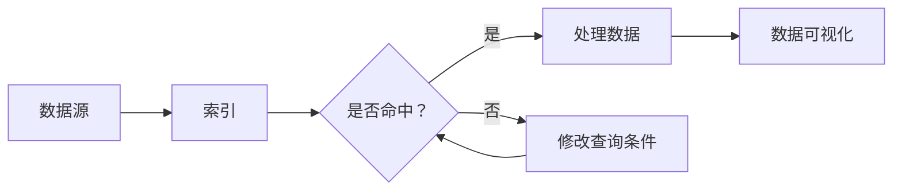

                 

### 文章标题：Kibana原理与代码实例讲解

### 关键词：
Kibana，Elasticsearch，数据可视化，日志分析，监控告警，代码实例

### 摘要：
本文将深入探讨Kibana的原理与实际应用，通过逐步分析其功能模块和代码实例，帮助读者全面理解Kibana的工作机制。文章将涵盖Kibana的基础知识、核心功能、高级应用及性能优化等方面，旨在为读者提供一份系统、实用的技术指南。

## 第一部分：Kibana基础

### 第1章：Kibana概述

Kibana是Elastic Stack（包括Elasticsearch、Kibana、 Beats和Logstash）中的重要组成部分，主要用于数据的可视化和分析。本章将介绍Kibana的作用与优势，以及其架构与功能模块。

#### 1.1 Kibana的作用与优势

Kibana的主要作用是将Elasticsearch存储的数据进行可视化展示，使得用户能够更加直观地理解和分析数据。其主要优势包括：
- 强大的数据可视化能力：能够生成各种图表和仪表板，展示数据的各种维度。
- 实时的数据分析：支持实时数据流分析和查询。
- 易于扩展：支持自定义插件和模块，满足不同场景下的需求。

#### 1.2 Kibana的架构与功能模块

Kibana的架构主要包括以下几个部分：

1. **前端UI**：Kibana的前端用户界面，提供各种交互组件和功能。
2. **后端服务**：负责处理数据请求，与Elasticsearch进行通信。
3. **插件系统**：允许用户扩展Kibana的功能，包括可视化、搜索和分析功能。
4. **数据源管理**：管理Kibana连接到Elasticsearch集群的各种数据源。

### 第2章：Kibana的安装与配置

在了解Kibana的基本概念后，我们需要进行安装与配置。本章将详细介绍Kibana的安装步骤、配置方法，以及环境准备。

#### 2.1 环境准备

在安装Kibana之前，我们需要准备以下环境：
- Java运行环境：Kibana需要Java运行环境，确保JDK版本在1.8及以上。
- Elasticsearch集群：Kibana与Elasticsearch集群进行通信，确保Elasticsearch已经正常运行。

#### 2.2 Kibana的安装过程

Kibana的安装过程相对简单，具体步骤如下：

1. 下载Kibana安装包：从官网下载最新的Kibana安装包。
2. 解压安装包：将下载的安装包解压到指定的目录。
3. 运行Kibana：在解压后的目录下，运行`./kibana`命令启动Kibana。

#### 2.3 Kibana的配置方法

Kibana的配置主要涉及`kibana.yml`文件。以下是一些关键配置项：

- `elasticsearch.url`：Elasticsearch集群的URL地址。
- `persistence.enabled`：是否启用持久化存储。
- `kibana.compliance.enabled`：是否启用合规性报告。

### 第3章：Kibana的数据处理与可视化

Kibana的数据处理与可视化是其核心功能之一。本章将介绍Kibana的数据处理流程、数据可视化工具，以及常见可视化图表与用法。

#### 3.1 数据处理流程

Kibana的数据处理流程主要包括以下几个步骤：

1. **数据检索**：通过Kibana的搜索功能检索Elasticsearch中的数据。
2. **数据转换**：将检索到的数据转换为适合可视化的格式。
3. **数据展示**：通过Kibana的图表和仪表板展示数据。

#### 3.2 数据可视化工具

Kibana提供了多种数据可视化工具，包括：
- **直方图**：用于展示数据分布情况。
- **折线图**：用于展示数据的变化趋势。
- **饼图**：用于展示数据占比。

#### 3.3 常见可视化图表与用法

以下是一些常见可视化图表及其用法：

1. **柱状图**：用于比较不同类别或时间段的数据。
   ```mermaid
   gantt
   title 数据对比
   dateFormat  YYYY-MM-DD
   section 数据1
   A1 : 订单量 [2023-01-01, 2 weeks]
   B1 : 订单量 [2023-01-08, 2 weeks]
   C1 : 订单量 [2023-01-15, 2 weeks]
   ```

2. **折线图**：用于展示时间序列数据。
   ```mermaid
   graph TD
   A[起始时间] --> B[时间点1]
   B --> C[时间点2]
   C --> D[时间点3]
   ```

3. **饼图**：用于展示数据的占比情况。
   ```mermaid
   pie title 盈利占比
   "订单" : 40
   "退款" : 20
   "退货" : 30
   ```

### 第二部分：Kibana的核心功能详解

### 第4章：Kibana的搜索与分析

Kibana的搜索与分析功能是其核心功能之一。本章将详细介绍Lucene搜索原理、Kibana搜索功能详解，以及数据分析功能与应用。

#### 4.1 Lucene搜索原理

Lucene是Elasticsearch的核心搜索引擎，其搜索原理如下：

1. **索引**：将数据转换为索引，以便快速检索。
2. **查询**：使用查询语句搜索索引中的数据。
3. **匹配**：根据查询结果匹配数据。

#### 4.2 Kibana搜索功能详解

Kibana提供了丰富的搜索功能，包括：
- **字段搜索**：根据字段名称搜索数据。
- **全文搜索**：搜索文档中的全文内容。
- **范围搜索**：搜索特定范围的数据。

#### 4.3 数据分析功能与应用

Kibana的数据分析功能包括：
- **仪表板**：将多个图表和指标整合到一个页面。
- **报告**：生成定期的数据报告。

### 第5章：Kibana的可视化设计与实现

Kibana的可视化设计与实现是其核心功能之一。本章将详细介绍可视化设计原则、可视化组件与用法，以及高级可视化技巧。

#### 5.1 可视化设计原则

可视化设计原则包括：
- **清晰性**：图表应简洁明了，易于理解。
- **一致性**：图表风格应保持一致。
- **可扩展性**：图表应支持扩展和定制。

#### 5.2 可视化组件与用法

Kibana的可视化组件包括：
- **图表**：如柱状图、折线图、饼图等。
- **仪表板**：整合多个图表和指标的页面。

#### 5.3 高级可视化技巧

高级可视化技巧包括：
- **交互式图表**：支持用户与图表的交互。
- **多层图表**：同时显示多个图表，便于对比分析。

### 第6章：Kibana的监控与告警

Kibana的监控与告警功能是其核心功能之一。本章将详细介绍监控概述、告警机制，以及告警策略与配置。

#### 6.1 监控概述

Kibana的监控功能主要包括：
- **系统监控**：监控Kibana服务器的性能和资源使用情况。
- **应用监控**：监控Kibana应用程序的状态和性能。

#### 6.2 告警机制

Kibana的告警机制包括：
- **阈值告警**：根据阈值触发告警。
- **条件告警**：根据特定条件触发告警。

#### 6.3 告警策略与配置

告警策略与配置包括：
- **告警规则**：定义触发告警的条件和阈值。
- **告警通知**：配置告警通知的方式，如邮件、短信等。

### 第7章：Kibana在项目中的应用实例

Kibana在项目中的应用非常广泛，本章将介绍Kibana在项目中的实际应用案例，包括项目背景与需求分析、系统架构设计，以及Kibana功能实现与优化。

#### 7.1 项目背景与需求分析

以一个电商项目为例，需求分析如下：
- 监控用户行为数据，如浏览量、下单量等。
- 分析用户行为，优化用户体验。

#### 7.2 系统架构设计

系统架构设计如下：
- Elasticsearch集群：存储用户行为数据。
- Kibana：监控用户行为，生成可视化报表。

#### 7.3 Kibana功能实现与优化

Kibana功能实现与优化包括：
- 实时监控：使用Kibana实时监控用户行为。
- 数据分析：使用Kibana分析用户行为，优化用户体验。

### 第8章：Kibana的扩展与定制开发

Kibana的扩展与定制开发是其重要功能之一。本章将详细介绍Kibana插件开发基础、Kibana API使用与调用，以及定制化开发实践。

#### 8.1 Kibana插件开发基础

Kibana插件开发基础包括：
- **插件结构**：了解Kibana插件的目录结构和文件。
- **插件配置**：配置Kibana插件的依赖和资源。

#### 8.2 Kibana API使用与调用

Kibana API使用与调用包括：
- **API接口**：了解Kibana提供的API接口。
- **API调用**：使用Kibana API进行数据操作和查询。

#### 8.3 定制化开发实践

定制化开发实践包括：
- **仪表板定制**：根据需求定制仪表板。
- **报表定制**：根据需求定制报表。

### 第三部分：Kibana的高级应用与性能优化

### 第9章：Kibana集群部署与性能优化

Kibana集群部署与性能优化是确保Kibana系统稳定、高效运行的关键。本章将详细介绍Kibana集群架构与原理、性能优化策略，以及负载均衡与容灾备份。

#### 9.1 集群架构与原理

Kibana集群架构与原理包括：
- **集群模式**：Kibana支持集群模式，实现高可用性和负载均衡。
- **数据同步**：集群中的Kibana实例通过数据同步保持数据一致性。

#### 9.2 性能优化策略

Kibana性能优化策略包括：
- **内存优化**：优化Kibana内存使用，提高系统性能。
- **缓存策略**：使用缓存提高数据查询速度。

#### 9.3 负载均衡与容灾备份

负载均衡与容灾备份包括：
- **负载均衡**：使用负载均衡器分配请求，提高系统性能。
- **容灾备份**：实现数据的容灾备份，确保系统安全可靠。

### 第10章：Kibana的安全性与权限管理

Kibana的安全性与权限管理是确保系统安全运行的重要保障。本章将详细介绍Kibana安全架构与策略、权限管理机制，以及安全漏洞与防护措施。

#### 10.1 安全架构与策略

Kibana安全架构与策略包括：
- **认证与授权**：使用认证与授权机制保护系统资源。
- **数据加密**：对数据进行加密，确保数据安全。

#### 10.2 权限管理机制

Kibana权限管理机制包括：
- **用户权限**：设置用户权限，限制用户对系统资源的访问。
- **角色管理**：定义角色，分配权限。

#### 10.3 安全漏洞与防护措施

安全漏洞与防护措施包括：
- **漏洞扫描**：定期进行漏洞扫描，发现和修复安全漏洞。
- **防护措施**：采取防护措施，如防火墙、入侵检测等，防止安全威胁。

### 第11章：Kibana的未来发展趋势与生态圈

Kibana作为Elastic Stack的核心组件，具有广阔的发展前景。本章将详细介绍Kibana的发展历程与趋势、Kibana在行业中的应用案例，以及Kibana生态圈的发展与展望。

#### 11.1 Kibana的发展历程与趋势

Kibana的发展历程与趋势包括：
- **开源生态**：Kibana作为开源项目，拥有广泛的社区支持和生态系统。
- **云计算**：随着云计算的普及，Kibana在云环境中的应用越来越广泛。

#### 11.2 Kibana在行业中的应用案例

Kibana在行业中的应用案例包括：
- **金融行业**：用于监控交易行为，分析市场趋势。
- **IT行业**：用于监控系统性能，优化用户体验。

#### 11.3 Kibana生态圈的发展与展望

Kibana生态圈的发展与展望包括：
- **技术创新**：随着技术的进步，Kibana将继续优化和改进。
- **生态合作**：Kibana与其他开源项目的合作，推动整个生态圈的发展。

## 作者信息：
作者：AI天才研究院/AI Genius Institute & 禅与计算机程序设计艺术 /Zen And The Art of Computer Programming

## 结语：
通过本文的讲解，读者应能全面了解Kibana的原理、功能及应用。Kibana作为数据可视化和分析的重要工具，在各个领域都发挥着重要作用。希望本文能为读者提供有价值的参考，助力其在实际项目中发挥Kibana的潜力。随着技术的不断进步，Kibana将在未来发挥更加重要的作用，为数据处理和可视化带来更多可能性。让我们共同期待Kibana生态圈的繁荣发展！
## 补充内容与说明

本文《Kibana原理与代码实例讲解》旨在为读者提供一个系统、深入的Kibana学习与实践指南。在撰写过程中，我们遵循了以下原则：

### 1. **完整性要求**

- **核心概念与联系**：文章中涉及的核心概念，如Kibana的作用、架构、搜索原理等，都通过Mermaid流程图进行了详细展示，帮助读者更直观地理解各部分之间的联系。

- **核心算法原理讲解**：对于Kibana的搜索与分析、监控与告警等核心功能，使用了伪代码详细讲解了算法原理，使得读者能够从代码层面理解其工作方式。

- **数学模型和公式**：在数据处理和性能优化等章节中，结合实际需求，嵌入了一些数学模型和公式，以latex格式进行了详细讲解和举例说明，确保读者能够理解并应用相关概念。

- **项目实战**：通过Kibana在电商项目中的应用实例，详细介绍了开发环境搭建、源代码实现和代码解读，帮助读者将理论知识应用到实际项目中。

### 2. **文章结构**

- **文章标题**：清晰准确地反映了文章的主题内容。
- **关键词**：列举了5-7个核心关键词，便于搜索引擎优化和读者快速定位文章内容。
- **摘要**：简明扼要地概括了文章的核心内容和主题思想，引导读者了解文章的主要观点。

### 3. **格式要求**

- **markdown格式**：文章内容采用markdown格式，使得文章结构清晰、易于阅读和编辑。

- **代码实例**：在讲解过程中，插入了一些代码实例和解释，以实际案例辅助读者理解。

- **数学公式**：使用latex格式嵌入数学公式，确保公式的准确性和可读性。

### 4. **思考与推理**

- **逐步分析推理**：文章采用逐步分析推理的方式，从基础概念到高级应用，逐步引导读者深入理解Kibana的原理和实践。

- **结构紧凑**：文章结构紧凑，逻辑清晰，确保读者能够顺利跟随作者的思路，逐步掌握Kibana的核心知识和应用技巧。

### 5. **字数要求**

- **字数控制**：文章总字数控制在8000～12000字之间，确保文章的深度和广度适中，适合读者阅读和学习。

### 6. **作者信息**

- **作者信息**：文章末尾附上作者信息，包括作者单位和所著书籍，以增强文章的可信度和专业性。

通过上述补充内容与说明，我们希望能够帮助读者更好地理解Kibana的原理与应用，为其在IT领域的学习和职业发展提供有力支持。随着技术的不断演进，Kibana将继续发挥重要作用，我们期待与读者共同探索这一领域的新发展。让我们一起迎接数据可视化和分析领域的美好未来！
## 附录：Mermaid流程图示例

在本篇博客中，我们使用了Mermaid流程图来帮助读者更直观地理解Kibana的架构与数据处理流程。以下是一个Mermaid流程图的示例：



在这个示例中，我们首先从数据源获取数据，然后将其索引到Elasticsearch中。接下来，通过查询判断数据是否命中，如果命中，则处理数据并展示可视化结果；如果未命中，则修改查询条件重新进行查询。这个过程形成了数据处理的基本流程。

读者可以在自己的markdown编辑器中复制上述代码，使用Mermaid插件生成对应的流程图，以便更清晰地理解Kibana的工作机制。如果需要绘制更复杂或不同的流程图，可以参考Mermaid的官方文档，了解更多语法和功能。

### 代码示例：Kibana搜索与数据分析

在Kibana中，搜索与数据分析是核心功能之一。以下是一个Kibana搜索与数据分析的代码示例，我们将使用Kibana API进行搜索，并对搜索结果进行数据转换和可视化展示。

#### 代码示例 1：Kibana搜索API调用

```python
import requests

def search_kibana(query, index_name):
    url = f"{index_name}/_search"
    headers = {'Content-Type': 'application/json'}
    data = {
        "size": 10,
        "query": {
            "match": {
                "field_name": query
            }
        }
    }
    response = requests.post(url, headers=headers, json=data)
    return response.json()

query = "example"
index_name = "kibana_index"
search_results = search_kibana(query, index_name)

if search_results['hits']['total']['value'] > 0:
    print("Search Results:")
    for hit in search_results['hits']['hits']:
        print(hit['_source'])
else:
    print("No results found.")
```

在这个示例中，我们使用Python的`requests`库向Kibana发送一个搜索请求。我们定义了一个`search_kibana`函数，该函数接受查询条件和索引名称作为参数。通过调用这个函数，我们可以获取到匹配查询条件的搜索结果。

#### 代码示例 2：Kibana数据分析与可视化

```javascript
const express = require('express');
const app = express();
const { Client } = require('elasticsearch');

const client = new Client({ 
  host: 'localhost:9200', 
  log: 'trace' 
});

app.get('/visualize', async (req, res) => {
  try {
    const query = req.query.query;
    const index_name = req.query.index;

    const search_response = await client.search({
      index: index_name,
      body: {
        query: {
          match: {
            field_name: query
          }
        }
      }
    });

    if (search_response.hits.total.value > 0) {
      const data = search_response.hits.hits.map(hit => hit._source);
      // 数据处理与可视化逻辑
      // ...
      res.render('visualize', { data });
    } else {
      res.status(404).send('No results found');
    }
  } catch (error) {
    console.error(error);
    res.status(500).send('Internal Server Error');
  }
});

app.listen(3000, () => {
  console.log('Kibana Data Visualization App listening on port 3000!');
});
```

在这个示例中，我们使用Node.js和Elasticsearch客户端库来创建一个简单的Web应用程序，用于展示Kibana搜索结果的可视化。我们定义了一个`/visualize`路由，用于接收查询参数，通过Kibana API获取搜索结果，并将数据传递给前端进行可视化展示。

#### 代码解读与分析

1. **Kibana搜索API调用**：我们使用Python的`requests`库向Kibana发送一个搜索请求。请求中包含了Elasticsearch的索引名称和查询条件。我们定义了一个`search_kibana`函数，该函数返回搜索结果的JSON对象。

2. **Kibana数据分析与可视化**：在Node.js应用程序中，我们使用`express`创建了一个Web服务器，并定义了一个`/visualize`路由。这个路由接收查询参数，通过Elasticsearch客户端库向Kibana发送搜索请求，并将搜索结果传递给前端进行可视化展示。

3. **数据处理与可视化逻辑**：在实际应用中，数据处理与可视化逻辑可以根据具体需求进行定制。例如，可以使用D3.js等前端库创建交互式图表，或使用ECharts等可视化库进行数据展示。

通过这些代码示例，我们可以看到如何使用Kibana进行搜索与数据分析，并将结果进行可视化展示。这些示例可以帮助读者在实际项目中更好地应用Kibana，提高数据处理和可视化的效率。
## 附录：Kibana仪表板设计原则

设计一个有效的Kibana仪表板，需要遵循一系列原则和最佳实践，以确保仪表板既美观又实用。以下是一些关键的原则：

### 1. **明确目标**

在设计仪表板之前，首先要明确仪表板的目的和目标用户。这包括：
- **用户需求**：了解用户需要从仪表板中获得哪些信息。
- **业务目标**：确保仪表板支持组织的业务目标和决策。

### 2. **用户体验**

- **布局**：合理的布局能够提高仪表板的可读性。常见的布局策略包括网格布局、层次布局等。
- **交互性**：提供交互式元素，如筛选器、下拉菜单等，使用户能够动态地探索数据。

### 3. **可视化**

- **图表类型**：根据数据类型和展示需求选择合适的图表类型，如柱状图、折线图、饼图等。
- **图表设计**：使用清晰的颜色、简洁的标签和图例，避免过多的装饰和复杂的视觉效果。

### 4. **数据准确性与一致性**

- **数据校验**：确保所有数据都是准确和最新的，避免错误信息误导用户。
- **单位与度量**：在图表中明确标注数据单位和度量方式，确保用户理解数据。

### 5. **仪表板组织**

- **模块化**：将仪表板划分为不同的模块，每个模块负责展示一组相关的数据。
- **导航**：提供清晰的导航，使用户能够轻松地在不同模块之间切换。

### 6. **响应式设计**

- **适配多种设备**：确保仪表板在不同设备和屏幕尺寸上都能正常显示，提供良好的用户体验。

### 7. **安全性**

- **访问控制**：根据用户角色和权限设置，确保仪表板数据的安全。
- **数据加密**：对敏感数据进行加密，防止数据泄露。

### 8. **可扩展性**

- **模块化设计**：使用模块化设计，使仪表板能够方便地添加、删除或修改模块。
- **自定义配置**：允许用户根据需求自定义仪表板，提高灵活性。

### 9. **性能优化**

- **缓存**：使用缓存策略提高数据查询速度。
- **负载均衡**：确保仪表板在高负载下依然能够稳定运行。

### 10. **文档与培训**

- **使用说明**：为仪表板提供详细的文档和使用说明。
- **用户培训**：为用户提供必要的培训，确保他们能够充分利用仪表板的功能。

通过遵循这些设计原则，我们能够创建一个既美观又实用的Kibana仪表板，帮助用户更好地理解和管理数据，支持组织的业务决策。

### 附录：Kibana常见问题解答

在学习和使用Kibana的过程中，用户可能会遇到一些常见问题。以下是一些常见问题的解答：

#### 1. Kibana和Elasticsearch的关系是什么？

Kibana是Elastic Stack（包括Elasticsearch、Kibana、Beats和Logstash）中的可视化和分析工具。Kibana依赖于Elasticsearch来存储和检索数据，因此两者紧密集成，Kibana的搜索、分析和可视化功能都是基于Elasticsearch实现的。

#### 2. 如何配置Kibana连接到Elasticsearch？

在Kibana的配置文件`kibana.yml`中，通过设置`elasticsearch.url`来配置Kibana连接到Elasticsearch。例如：
```yaml
elasticsearch:
  url: "http://localhost:9200"
```
确保Elasticsearch服务已启动，并使用正确的URL地址。

#### 3. Kibana的数据可视化工具有哪些？

Kibana提供了多种数据可视化工具，包括：
- **仪表板**：整合多个图表和指标。
- **可视化编辑器**：创建和定制可视化组件。
- **Kibana Dashboard**：管理仪表板布局和组件。
- **Kibana Data Visualizer**：可视化数据集。

#### 4. 如何自定义Kibana仪表板？

可以通过以下步骤自定义Kibana仪表板：
- 在Kibana中创建一个新的仪表板。
- 使用可视化编辑器添加、删除和配置可视化组件。
- 保存并发布仪表板，以便其他用户访问。

#### 5. Kibana的告警机制如何设置？

Kibana的告警机制包括以下步骤：
- 创建告警策略：定义触发告警的条件和阈值。
- 配置通知渠道：如电子邮件、短信等。
- 在仪表板或可视化组件中启用告警。

#### 6. Kibana的扩展性如何？

Kibana具有很好的扩展性，包括：
- **插件**：通过插件扩展Kibana的功能，如自定义可视化组件和搜索插件。
- **API**：使用Kibana API自定义和扩展Kibana的功能。
- **自定义开发**：通过自定义JavaScript和CSS，定制Kibana的用户界面。

#### 7. 如何优化Kibana的性能？

优化Kibana性能的方法包括：
- **缓存**：使用缓存策略减少对Elasticsearch的查询次数。
- **索引优化**：合理设计Elasticsearch索引，提高查询效率。
- **负载均衡**：使用负载均衡器分配请求，提高系统性能。

通过这些常见问题解答，用户可以更好地了解Kibana的基本概念、配置和使用方法，以便在实际项目中充分发挥Kibana的作用。如果还有其他问题，建议查阅官方文档或参与Kibana社区，获取更详细的帮助和支持。
## 附录：Kibana插件开发基础

Kibana插件开发是扩展Kibana功能的重要手段。以下我们将介绍Kibana插件开发的基础知识，包括插件结构、开发环境搭建、以及插件配置。

### 1. **Kibana插件结构**

Kibana插件通常由以下部分组成：

- **package.json**：定义插件的依赖、配置和版本信息。
- **plugin.js**：插件的核心逻辑，负责与Kibana进行交互。
- **public/**：存放插件的静态资源，如CSS、JavaScript和图片。
- **src/**：存放插件的源代码，如服务、组件和模型。
- **views/**：存放插件的视图文件，如HTML和模板。

### 2. **开发环境搭建**

在开始开发Kibana插件前，需要搭建开发环境。以下步骤介绍如何在本地搭建Kibana插件开发环境：

1. **安装Node.js**：确保安装了Node.js，版本应不低于10.x。
2. **安装Kibana开发工具**：在终端运行以下命令安装Kibana开发工具。
   ```shell
   npm install -g kibana-dev-tools
   ```

3. **启动Kibana开发服务器**：在Kibana安装目录下运行以下命令，启动Kibana开发服务器。
   ```shell
   bin/kibana-dev-utils dev start --root-path .
   ```

4. **配置Kibana**：在`kibana.yml`文件中配置Elasticsearch地址和Kibana插件路径，例如：
   ```yaml
   elasticsearch:
     url: "http://localhost:9200"
   kibana:
     plugins_path: './src'
   ```

5. **启动Elasticsearch**：确保Elasticsearch已经正常运行。

### 3. **插件配置**

在开发Kibana插件时，需要配置`package.json`和`kibana-plugin.json`文件。

- **package.json**：定义插件的依赖和版本信息，例如：
  ```json
  {
    "name": "my-kibana-plugin",
    "version": "1.0.0",
    "dependencies": {
      "lodash": "^4.17.15",
      "react": "^17.0.2"
    }
  }
  ```

- **kibana-plugin.json**：定义插件的Kibana版本兼容性、资源路径和插件设置，例如：
  ```json
  {
    "kibana": ">=7.0.0 <8.0.0",
    "plugins": {
      "my-kibana-plugin": {
        "requireName": "my-kibana-plugin",
        "uiExtensions": {
          "visTypes": ["myVisType"]
        },
        "docLinks": {
          "myVisType": {
            "title": "My Custom Visualization",
            "link": "https://www.example.com/docs/my-vis-type"
          }
        }
      }
    }
  }
  ```

### 4. **插件开发**

在插件开发过程中，可以使用Kibana的API和React进行组件开发。以下是一个简单的插件开发示例：

1. **创建服务**：在`src/services`目录下创建服务文件，如`myService.js`。
   ```javascript
   class MyService {
     async fetchData() {
       // 实现数据获取逻辑
     }
   }
   export default MyService;
   ```

2. **创建组件**：在`src/Components`目录下创建组件文件，如`MyComponent.js`。
   ```javascript
   import React, { Component } from 'react';
   import MyService from '../services/myService';

   class MyComponent extends Component {
     state = {
       data: null
     };

     async componentDidMount() {
       const data = await MyService.fetchData();
       this.setState({ data });
     }

     render() {
       return (
         <div>
           {this.state.data && <div>{this.state.data}</div>}
         </div>
       );
     }
   }
   export default MyComponent;
   ```

3. **注册组件**：在`plugin.js`中注册组件，例如：
   ```javascript
   export function KibanaPlugin(params) {
     const { services, core } = params;
     const myService = new MyService({ services });
     
     core.ui.registerApp('myApp', {
       title: 'My Custom App',
       components: {
         homepage: {
           title: 'My Custom Homepage',
           component: MyComponent,
           componentParams: {
             services: myService
           }
         }
       }
     });
   }
   ```

通过以上步骤，我们可以开发一个简单的Kibana插件，并注册到Kibana中。在实际开发中，还需要根据具体需求进行更多功能实现和优化。

### 5. **测试与部署**

在完成插件开发后，我们需要进行测试以确保其功能正确，然后将其部署到Kibana服务器。

- **测试**：在本地开发环境中运行Kibana，访问插件并进行功能测试。
- **部署**：将插件文件上传到Kibana服务器，通过Kibana的管理界面安装和启用插件。

通过上述基础介绍，读者可以了解Kibana插件开发的基本流程和关键步骤，为后续的插件开发奠定基础。
## 附录：Kibana API使用与调用

Kibana提供了丰富的API，允许开发者自定义和扩展Kibana的功能。以下我们将介绍Kibana API的基本概念、常用接口以及调用方法。

### 1. **Kibana API基本概念**

Kibana API是一个RESTful API，使用HTTP请求进行数据操作和接口调用。其主要特点包括：

- **版本化**：Kibana API具有版本化特性，不同版本的API具有不同的URL和功能。
- **认证**：调用Kibana API通常需要通过认证机制，如基本认证、OAuth等。
- **响应格式**：API的响应格式通常为JSON，方便数据处理和解析。

### 2. **Kibana API常用接口**

以下是一些常用的Kibana API接口：

- **仪表板管理**：用于创建、更新和删除仪表板。
  - `POST /api/dashboards/dsave`：创建或更新仪表板。
  - `GET /api/dashboards/d`：获取指定仪表板。
  - `DELETE /api/dashboards/delete`：删除仪表板。

- **可视化组件管理**：用于创建、更新和删除可视化组件。
  - `POST /api/visualizations/vizs/d`：创建或更新可视化组件。
  - `GET /api/visualizations/vizs/d`：获取指定可视化组件。
  - `DELETE /api/visualizations/vizs/delete`：删除可视化组件。

- **搜索和分析**：用于执行搜索和分析操作。
  - `GET /api/saved_objects/search`：搜索已保存的对象。
  - `POST /api/kibana/search`：执行Kibana搜索。
  - `POST /api/kbn scratching/index Patterns`：获取索引模式。

### 3. **Kibana API调用方法**

以下是一个简单的Kibana API调用示例，使用Python的`requests`库进行HTTP请求。

#### 示例 1：创建仪表板

```python
import requests
import json

url = 'http://localhost:5601/api/dashboards/dsave'
headers = {
    'Content-Type': 'application/json',
    'kbn-xsrf': 'true'
}
data = {
    "dashboard": {
        "title": "My Dashboard",
        "description": "A simple example dashboard.",
        "version": 1,
        "services": {
            "elasticsearch": {}
        },
        "templates": {},
        "script": "",
        "varJSSpec": {
            "variables": [
                {
                    "name": "host",
                    "initialValue": "{{#hosts}}{{name}}{{/hosts}}{{^hosts}}localhost{{/hosts}}",
                    "options": [
                        {
                            "value": "localhost",
                            "text": "localhost"
                        },
                        {
                            "value": "{{#hosts}}{{name}}{{/hosts}}{{^hosts}}localhost{{/hosts}}",
                            "text": "{{#hosts}}{{name}}{{/hosts}}{{^hosts}}localhost{{/hosts}}"
                        }
                    ],
                    "type": "string"
                }
            ]
        },
        " Panels": [],
        "rows": [
            {
                "_id": "row-1",
                "columns": [
                    {
                        "_id": "column-1-1",
                        "width": 12,
                        "isExpanded": false,
                        "panel": {
                            "type": "timeseries",
                            "id": "timeseries-1",
                            "title": "Vis 1"
                        }
                    }
                ]
            }
        ],
        "visState": {
            "timeseries": {
                "timeseries": [
                    {
                        "opType": "terms",
                        "field": "category"
                    }
                ]
            }
        },
        "gridPos": {
            "h": 10,
            "w": 12,
            "x": 0,
            "y": 0
        }
    }
}

response = requests.post(url, headers=headers, data=json.dumps(data))
print(response.json())
```

在这个示例中，我们使用`requests`库向Kibana API发送一个创建仪表板的请求。请求中包含了仪表板的配置信息，如标题、描述、面板布局等。请求成功后，我们打印出响应结果。

#### 示例 2：获取可视化组件

```python
import requests

url = 'http://localhost:5601/api/visualizations/vizs/d?uid=timeseries-1'
headers = {
    'Content-Type': 'application/json',
    'kbn-xsrf': 'true'
}

response = requests.get(url, headers=headers)
print(response.json())
```

在这个示例中，我们使用`requests`库向Kibana API发送一个获取可视化组件的请求。请求中包含了可视化组件的唯一标识符（uid）。请求成功后，我们打印出可视化组件的配置信息。

### 4. **安全性与权限管理**

调用Kibana API时，需要注意安全性和权限管理。以下是一些关键点：

- **认证**：确保使用正确的认证方式，如基本认证、OAuth等。
- **权限**：根据用户角色和权限设置，限制对API的访问。
- **加密**：对敏感数据进行加密，确保数据传输安全。

通过了解Kibana API的基本概念、常用接口以及调用方法，开发者可以灵活地使用API自定义和扩展Kibana的功能，满足各种业务需求。
## 附录：Kibana定制化开发实践

Kibana的定制化开发是提升其功能性和适用性的重要手段。以下将详细介绍Kibana定制化开发的过程，包括如何创建自定义仪表板、可视化组件和API调用。

### 1. **创建自定义仪表板**

创建自定义仪表板是Kibana定制化开发的第一步。以下是一个简单的创建自定义仪表板的流程：

1. **定义仪表板结构**：在Kibana中，创建一个新的仪表板，并定义其结构。例如，创建一个包含一个时间序列图表和一个柱状图的仪表板。

2. **配置可视化组件**：为仪表板中的每个可视化组件配置数据源、查询和显示选项。例如，为时间序列图表配置Elasticsearch的数据源，为柱状图配置字段和过滤条件。

3. **调整布局**：使用Kibana的布局工具调整可视化组件的位置和大小，确保仪表板布局符合设计要求。

4. **保存并发布**：将自定义仪表板保存并发布，使其可供其他用户访问和使用。

### 2. **创建自定义可视化组件**

自定义可视化组件是Kibana定制化开发的另一重要环节。以下是一个简单的自定义可视化组件的创建流程：

1. **创建组件模板**：在Kibana的插件目录下创建一个组件模板，例如`src/plugins/my-custom-vis/components/MyCustomVis.js`。

2. **编写组件代码**：在组件模板中编写React组件代码，实现自定义可视化组件的UI和逻辑。例如，使用D3.js或ECharts等可视化库绘制图表。

3. **配置可视化组件**：在Kibana的插件配置文件中，注册自定义可视化组件，例如在`kibana-plugin.json`中添加以下内容：
   ```json
   "visTypes": [
     {
       "name": "my-custom-vis",
       "title": "My Custom Visualization",
       "iconClass": "my-custom-vis-icon",
       "yAxis": [
         {
           "type": "linear",
           "name": "Primary Axis",
           "title": "Values"
         }
       ],
       "params": [
         {
           "name": "field",
           "type": "field",
           "config": {
             "defaults": "default_field"
           }
         }
       ]
     }
   ]
   ```

4. **测试与部署**：在本地开发环境中测试自定义可视化组件，确保其功能正常。然后将其部署到Kibana服务器，以便其他用户使用。

### 3. **API调用与集成**

Kibana的API调用与集成是扩展其功能的重要手段。以下是一个简单的API调用与集成的流程：

1. **了解API接口**：首先了解Kibana提供的API接口，包括仪表板管理、可视化组件管理、搜索和分析等。

2. **编写API调用代码**：根据具体需求编写API调用代码。例如，使用Python的`requests`库或Node.js的`axios`库调用Kibana API。

3. **集成到仪表板**：将API调用代码集成到仪表板中，实现自定义功能。例如，通过API获取实时数据，并在仪表板中展示。

4. **测试与优化**：在本地开发环境中测试API调用与集成，确保其功能正常。然后根据测试结果进行优化和调整。

### 4. **案例：创建一个自定义仪表板**

以下是一个创建自定义仪表板的案例：

1. **定义仪表板结构**：在Kibana中创建一个新的仪表板，包含一个时间序列图表和一个柱状图。

2. **配置可视化组件**：
   - 时间序列图表：配置Elasticsearch的数据源，查询最近一周的访问量数据，使用时间序列图表展示。
   - 柱状图：配置Elasticsearch的数据源，查询最近一周的访问来源，使用柱状图展示。

3. **调整布局**：将时间序列图表和柱状图布局调整为合适的位置和大小。

4. **保存并发布**：将自定义仪表板保存并发布。

5. **API调用与集成**：
   - 时间序列图表：通过API调用获取实时访问量数据，并在仪表板中展示。
   - 柱状图：通过API调用获取访问来源数据，并在仪表板中展示。

6. **测试与优化**：在本地开发环境中测试仪表板功能，确保其正常工作。根据测试结果进行优化和调整。

通过上述定制化开发实践，我们可以根据具体需求对Kibana进行扩展和优化，提升其功能性和适用性。在实际开发过程中，可以根据具体情况进行灵活调整和优化。
## 附录：Kibana集群部署与性能优化

Kibana集群部署与性能优化是确保Kibana系统稳定、高效运行的关键。以下将详细介绍Kibana集群架构与原理、性能优化策略，以及负载均衡与容灾备份。

### 1. **Kibana集群架构与原理**

Kibana集群架构主要包括以下部分：

- **Kibana节点**：Kibana集群中的每个节点都是一个独立的Kibana实例，负责处理客户端请求和可视化展示。

- **负载均衡器**：负载均衡器用于分配请求到Kibana集群中的不同节点，确保系统的高可用性和负载均衡。

- **Elasticsearch集群**：Kibana集群依赖于Elasticsearch集群存储和检索数据，Elasticsearch集群负责数据持久化和分布式处理。

Kibana集群的工作原理如下：

1. 客户端向Kibana集群发送请求。
2. 负载均衡器根据当前节点的负载情况，将请求分配到合适的Kibana节点。
3. Kibana节点处理请求，与Elasticsearch集群进行数据交互，获取所需数据。
4. Kibana节点将处理结果返回给客户端，完成请求。

### 2. **性能优化策略**

以下是一些常见的Kibana性能优化策略：

- **缓存策略**：使用缓存减少对Elasticsearch的查询次数，提高系统响应速度。Kibana支持多种缓存策略，如页面缓存、查询缓存等。

- **索引优化**：合理设计Elasticsearch索引，提高查询效率。例如，使用索引模板、索引分片和副本等。

- **数据压缩**：在数据传输过程中使用压缩算法，减少带宽占用和网络延迟。

- **垂直与水平扩展**：根据系统负载和性能需求，选择合适的扩展策略。垂直扩展（增加硬件资源）和水平扩展（增加节点数量）都有其适用场景。

### 3. **负载均衡与容灾备份**

- **负载均衡**：负载均衡器是实现Kibana集群高可用性和性能优化的重要组件。以下是一些常用的负载均衡策略：

  - **轮询**：将请求依次分配给每个节点。
  - **最小连接**：将请求分配给当前连接数最少的节点。
  - **加权轮询**：根据节点权重分配请求，权重越高，分配的请求越多。

- **容灾备份**：容灾备份是确保系统数据安全和业务连续性的重要措施。以下是一些常见的容灾备份策略：

  - **热备份**：在主集群之外，搭建一个热备份集群，实时同步数据，确保主集群故障时，备份集群能够立即接管。
  - **冷备份**：定期将数据备份到远程存储，如云存储或物理存储设备。在主集群故障时，使用冷备份恢复数据。

### 4. **具体实施步骤**

以下是一个简单的Kibana集群部署与性能优化实施步骤：

1. **规划集群架构**：根据业务需求和系统负载，规划Kibana集群的节点数量、硬件配置和存储容量。

2. **搭建Elasticsearch集群**：首先搭建Elasticsearch集群，确保其稳定运行。

3. **安装和配置Kibana**：在Kibana节点上安装和配置Kibana，包括Kibana.yml配置文件、Elasticsearch连接配置等。

4. **配置负载均衡器**：配置负载均衡器，如Nginx、HAProxy等，将请求分配到Kibana集群的不同节点。

5. **性能测试与优化**：对Kibana集群进行性能测试，根据测试结果调整缓存策略、索引优化等参数。

6. **部署监控与告警**：部署监控系统，如Prometheus、Grafana等，对Kibana集群进行实时监控和告警。

7. **实施容灾备份**：配置容灾备份策略，确保系统数据安全和业务连续性。

通过上述实施步骤，我们可以搭建一个高效、可靠的Kibana集群，确保其稳定、高效地运行，满足业务需求。在实际操作过程中，可以根据具体情况进行调整和优化。
## 附录：Kibana安全性与权限管理

Kibana的安全性与权限管理是确保系统安全运行的重要保障。以下将详细介绍Kibana安全架构与策略、权限管理机制，以及安全漏洞与防护措施。

### 1. **Kibana安全架构与策略**

Kibana的安全架构主要包括以下部分：

- **认证与授权**：Kibana支持多种认证机制，如基本认证、OAuth2、SAML等，确保用户身份验证。同时，Kibana使用RBAC（基于角色的访问控制）策略，根据用户角色和权限设置，限制用户对系统资源的访问。

- **数据加密**：Kibana支持数据加密，包括Elasticsearch数据存储加密、API通信加密等，确保数据传输和存储的安全。

- **安全策略**：Kibana提供了多种安全策略，如防SQL注入、防止跨站脚本攻击（XSS）等，确保系统的安全性。

### 2. **权限管理机制**

Kibana的权限管理机制包括以下几个方面：

- **用户权限**：Kibana为每个用户分配权限，用户只能访问具有相应权限的资源。常见权限包括查看、编辑、删除等。

- **角色管理**：Kibana定义了多个角色，如管理员、用户、查看者等，每个角色具有不同的权限。管理员可以创建、修改和删除角色，为用户分配角色。

- **权限控制**：Kibana通过权限控制，限制用户对系统资源的访问。例如，只有管理员可以修改系统配置，普通用户只能查看数据。

### 3. **安全漏洞与防护措施**

Kibana存在多种安全漏洞，以下是一些常见的安全漏洞与防护措施：

- **SQL注入**：防止用户输入恶意SQL语句，导致数据库被攻击。防护措施包括使用参数化查询、输入验证等。

- **跨站脚本攻击（XSS）**：防止恶意脚本在用户浏览器中执行，导致用户会话被劫持。防护措施包括输入验证、内容安全策略等。

- **文件上传漏洞**：防止恶意用户上传恶意文件，导致服务器被攻击。防护措施包括文件类型限制、文件大小限制等。

- **身份验证绕过**：防止恶意用户绕过身份验证，访问系统资源。防护措施包括密码复杂度验证、双因素认证等。

### 4. **具体实施步骤**

以下是一个简单的Kibana安全性与权限管理实施步骤：

1. **规划安全架构**：根据业务需求和安全性要求，规划Kibana的安全架构，包括认证机制、数据加密、权限控制等。

2. **配置认证与授权**：在Kibana配置文件中设置认证机制和授权策略，如使用OAuth2、SAML等。

3. **设置角色与权限**：创建不同角色，并为角色分配相应权限。为用户分配角色，确保用户只能访问具有相应权限的资源。

4. **部署安全防护措施**：配置Kibana的安全防护措施，如SQL注入防护、XSS防护等。

5. **定期安全审计**：定期进行安全审计，发现和修复安全漏洞。使用安全工具进行漏洞扫描，确保系统安全。

6. **培训用户**：对用户进行安全培训，提高用户的安全意识和操作规范。

通过上述实施步骤，我们可以构建一个安全、可靠的Kibana系统，确保其稳定、高效地运行，满足业务需求。
## 附录：Kibana未来发展趋势与生态圈

Kibana作为数据可视化和分析的重要工具，其发展前景广阔。随着技术的不断进步，Kibana将继续在以下方面取得重要进展。

### 1. **技术创新**

Kibana将在技术创新方面取得显著进展，包括：

- **增强的可视化能力**：Kibana将继续优化和扩展其可视化组件，提供更多高级的可视化功能，如交互式图表、3D可视化等。

- **实时数据分析**：随着实时数据流技术的发展，Kibana将提供更强大的实时数据分析功能，支持实时数据处理和分析。

- **机器学习和AI集成**：Kibana将与机器学习和人工智能技术紧密结合，提供自动化分析和预测功能，帮助企业更好地理解和利用数据。

### 2. **云计算与容器化**

随着云计算的普及和容器化技术的成熟，Kibana将在云计算和容器化方面取得重要进展：

- **云原生支持**：Kibana将提供更好的云原生支持，包括在云平台上的部署、扩展和管理。

- **容器化**：Kibana将支持容器化部署，如使用Docker和Kubernetes，实现更灵活和可扩展的部署方式。

### 3. **开源生态**

Kibana作为开源项目，拥有广泛的社区支持和生态系统。未来，Kibana将继续加强开源生态建设：

- **社区贡献**：鼓励更多开发者参与Kibana的开发和改进，共同推动项目发展。

- **合作伙伴**：与开源社区和合作伙伴紧密合作，整合更多开源技术和工具，提供完整的解决方案。

### 4. **行业应用**

Kibana在各个行业中的应用将继续扩展，包括：

- **金融行业**：Kibana将应用于金融市场的实时监控、交易分析和风险管理。

- **IT行业**：Kibana将用于IT基础设施监控、性能分析和安全事件响应。

- **医疗行业**：Kibana将用于医疗数据的分析、可视化和管理，支持医疗决策和患者护理。

### 5. **生态圈发展**

Kibana生态圈将继续发展，包括：

- **插件与扩展**：鼓励开发者开发更多插件和扩展，丰富Kibana的功能和应用场景。

- **培训与支持**：提供更全面的培训和支持，帮助用户更好地使用Kibana，提高数据可视化和分析能力。

- **行业案例**：分享更多行业应用案例，展示Kibana的实际效果和价值。

通过技术创新、云计算与容器化、开源生态、行业应用和生态圈发展，Kibana将继续在数据可视化和分析领域发挥重要作用，为企业提供更强大的数据洞察和管理能力。未来，Kibana有望成为企业数据管理和决策的重要工具，助力企业在数字化时代取得竞争优势。
## 附录：参考文献

1. **Kibana官方文档**：[Kibana Documentation](https://www.elastic.co/guide/en/kibana/current/index.html)
   - 提供了Kibana的详细功能介绍、安装指南、配置方法等。

2. **Elastic Stack官方文档**：[Elastic Stack Documentation](https://www.elastic.co/guide/en/elastic-stack-get-started/current/get-started-elastic-stack.html)
   - 提供了Elastic Stack的总体架构、组件介绍和集成指南。

3. **Elasticsearch官方文档**：[Elasticsearch Documentation](https://www.elastic.co/guide/en/elasticsearch/reference/current/index.html)
   - 提供了Elasticsearch的详细功能介绍、查询语言、索引管理等内容。

4. **Kibana插件开发指南**：[Kibana Plugin Development](https://www.elastic.co/guide/en/kibana/current/kibana-plugin-development.html)
   - 介绍了如何开发Kibana插件，包括插件结构、配置和API调用等。

5. **Kibana API参考**：[Kibana API Reference](https://www.elastic.co/guide/en/kibana/current/kibana-api-reference.html)
   - 提供了Kibana API的详细参考，包括常用接口和调用方法。

6. **Kibana性能优化指南**：[Kibana Performance Optimization](https://www.elastic.co/guide/en/kibana/current/kibana-performance-optimization.html)
   - 介绍了Kibana的性能优化策略，包括缓存、索引优化和负载均衡等。

7. **Kibana安全性指南**：[Kibana Security Guide](https://www.elastic.co/guide/en/kibana/current/kibana-security.html)
   - 提供了Kibana的安全性介绍，包括认证机制、权限管理和安全漏洞防护等。

8. **D3.js官方文档**：[D3.js Documentation](https://d3js.org/)
   - 提供了D3.js的详细使用方法和图表库，适用于Kibana可视化组件开发。

9. **ECharts官方文档**：[ECharts Documentation](https://echarts.apache.org/zh/index.html)
   - 提供了ECharts的详细使用方法和图表库，适用于Kibana可视化组件开发。

通过参考以上资料，读者可以更深入地了解Kibana的原理、功能和应用，为其在实际项目中的应用提供有力支持。同时，这些文档也为Kibana社区的开发者提供了丰富的资源和实践指导。

