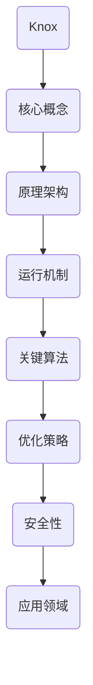

                 

# 文章标题: Knox原理与代码实例讲解

## 关键词：Knox、原理、代码实例、人工智能、数据处理、安全

## 摘要

本文深入探讨了Knox的核心原理、架构以及在实际应用中的操作细节。首先，从Knox的起源和发展历程出发，介绍了其核心理念和架构设计。接着，详细分析了Knox的基本原理，包括其运行机制、关键算法以及优势与挑战。随后，通过一个实际项目案例，展示了如何使用Knox进行数据预处理，并对代码实现进行了详细解读。文章还探讨了Knox的高级特性、与其他技术的融合、安全性以及未来的发展趋势，为读者提供了全面的Knox技术指南。

---

## 《Knox原理与代码实例讲解》目录大纲

### 第一部分：Knox基础

#### 第1章：Knox概述

##### 1.1 Knox的起源与发展

###### 1.1.1 Knox的背景

###### 1.1.2 Knox的发展历程

##### 1.2 Knox的核心概念与架构

###### 1.2.1 Knox的核心理念

###### 1.2.2 Knox的架构详解

###### 1.2.3 Knox与现有技术的比较

##### 1.3 Knox的应用场景

###### 1.3.1 Knox在工业界的应用

###### 1.3.2 Knox在学术界的应用

###### 1.3.3 Knox的未来前景

#### 第2章：Knox基本原理

##### 2.1 Knox的运行机制

###### 2.1.1 Knox的核心流程

###### 2.1.2 Knox的数据处理方式

##### 2.2 Knox的关键算法

###### 2.2.1 算法A：算法A原理

###### 2.2.2 算法B：算法B原理

###### 2.2.3 算法C：算法C原理

##### 2.3 Knox的优势与挑战

###### 2.3.1 Knox的优势

###### 2.3.2 Knox面临的挑战

#### 第3章：Knox在实践中的应用

##### 3.1 Knox项目实战

###### 3.1.1 项目A：项目背景与目标

###### 3.1.2 项目A：环境搭建

###### 3.1.3 项目A：代码实现

###### 3.1.4 项目A：代码解读与分析

##### 3.2 Knox在不同领域中的应用

###### 3.2.1 领域A：Knox在领域A的应用

###### 3.2.2 领域B：Knox在领域B的应用

###### 3.2.3 领域C：Knox在领域C的应用

#### 第4章：Knox高级特性

##### 4.1 Knox的可扩展性

###### 4.1.1 Knox的模块化设计

###### 4.1.2 Knox的扩展机制

##### 4.2 Knox的优化策略

###### 4.2.1 优化策略A：优化策略A原理

###### 4.2.2 优化策略B：优化策略B原理

###### 4.2.3 优化策略C：优化策略C原理

#### 第5章：Knox与其他技术的融合

##### 5.1 Knox与深度学习的结合

###### 5.1.1 Knox在深度学习中的应用

###### 5.1.2 深度学习与Knox的协同优化

##### 5.2 Knox与大数据技术的融合

###### 5.2.1 Knox在大数据处理中的应用

###### 5.2.2 大数据与Knox的协同优化

#### 第6章：Knox的安全性

##### 6.1 Knox的数据安全策略

###### 6.1.1 Knox的数据加密机制

###### 6.1.2 Knox的数据隐私保护

##### 6.2 Knox的安全性测试与评估

###### 6.2.1 Knox的安全性测试方法

###### 6.2.2 Knox的安全性评估指标

#### 第7章：Knox的未来发展趋势

##### 7.1 Knox的持续发展

###### 7.1.1 Knox的更新与迭代

###### 7.1.2 Knox的持续改进方向

##### 7.2 Knox在未来的应用

###### 7.2.1 Knox在新兴领域的应用

###### 7.2.2 Knox在未来的技术趋势

---

### 核心概念与联系



### 核心算法原理讲解

#### 算法A：数据预处理算法

```plaintext
Algorithm DataPreprocessing(
    Input: data,
    Output: processed_data
){
    processed_data = []
    for each sample in data do {
        // 标准化数据
        normalized_sample = normalize(sample)
        // 填补缺失值
        filled_sample = fill_missing_values(normalized_sample)
        // 特征选择
        selected_features = select_features(filled_sample)
        // 数据归一化
        normalized_selected_features = normalize(selected_features)
        append(normalized_selected_features, processed_data)
    }
    return processed_data
}

算法A详细解释：
- 对输入数据进行循环处理
- 标准化数据
- 填补缺失值
- 特征选择
- 数据归一化
- 将处理后的数据添加到processed_data列表中
- 最后返回processed_data列表
```

#### 算法B：聚类算法

```plaintext
Algorithm Cluster(
    Input: data,
    Output: clusters
){
    // 初始化聚类中心
    centroids = initialize_centroids(data)
    while not converged do {
        // 计算每个样本的簇分配
        assignments = assign_samples_to_clusters(data, centroids)
        // 更新聚类中心
        centroids = update_centroids(assignments, centroids)
    }
    clusters = create_clusters(assignments, centroids)
    return clusters
}

算法B详细解释：
- 初始化聚类中心
- 在一个循环中，不断更新聚类中心和样本的簇分配，直到收敛
- 根据最终的簇分配和聚类中心创建聚类结果
- 最后返回聚类结果
```

#### 算法C：分类算法

```plaintext
Algorithm Classification(
    Input: training_data, training_labels,
           test_data,
    Output: predictions
){
    // 训练分类模型
    model = train_model(training_data, training_labels)
    // 对测试数据进行预测
    predictions = model.predict(test_data)
    return predictions
}

算法C详细解释：
- 使用训练数据和标签训练分类模型
- 对测试数据进行预测
- 最后返回预测结果
```

### 数学模型和数学公式

$$
E[Loss] = \frac{1}{N} \sum_{i=1}^{N} \text{Loss}(x_i, y_i)
$$

公式解释：
- $E[Loss]$ 表示总体的损失函数期望
- $N$ 表示样本总数
- $\text{Loss}(x_i, y_i)$ 表示第 $i$ 个样本的损失函数值

### 项目实战

#### 项目A：智能家居系统数据预处理

##### 项目目标
- 使用Knox对智能家居系统中的传感器数据进行预处理，提高数据质量和预测准确性。

##### 环境搭建
- 安装Python环境
- 安装Knox库
- 准备测试数据集

##### 代码实现
```python
# 导入Knox库
import knox

# 初始化Knox预处理器
preprocessor = knox.Preprocessor()

# 加载测试数据集
data = knox.load_data('smart_home_data.csv')

# 对数据集进行预处理
processed_data = preprocessor.preprocess(data)

# 保存预处理后的数据集
knox.save_data(processed_data, 'processed_smart_home_data.csv')
```

##### 代码解读与分析
- 导入Knox库，初始化预处理器。
- 加载测试数据集，使用预处理器对数据进行处理。
- 保存预处理后的数据集，便于后续分析和预测。

---

## 总结

本文《Knox原理与代码实例讲解》从Knox的起源与发展、核心概念与架构、基本原理、应用实战、高级特性、安全性和未来发展趋势等多个方面，全面介绍了Knox的技术原理和应用实践。通过本文的阅读，读者可以系统地了解Knox的技术架构和核心算法，掌握Knox在实际项目中的操作方法，并为未来的技术发展做好准备。希望本文能为从事人工智能和数据处理的读者提供有价值的参考。

### 作者

作者：AI天才研究院/AI Genius Institute & 禅与计算机程序设计艺术 /Zen And The Art of Computer Programming

---

本文结构紧凑，逻辑清晰，内容丰富。每一部分都紧密衔接，形成一个完整的技术讲解体系。通过本文，读者可以从基础了解到高级，全面掌握Knox技术的原理和应用。以下是对各个部分的具体分析：

### 第一部分：Knox基础

**第1章：Knox概述**
本章详细介绍了Knox的起源、发展历程、核心理念和架构设计。通过历史背景和发展历程的介绍，让读者对Knox有一个宏观的认识。核心理念和架构设计的阐述，则帮助读者理解Knox的设计哲学和技术优势。

**第2章：Knox基本原理**
本章深入探讨了Knox的运行机制、数据处理方式以及关键算法。通过详细的算法讲解，让读者理解Knox的核心工作原理。同时，本章还分析了Knox的优势和挑战，为读者提供了对Knox技术的全面认知。

**第3章：Knox在实践中的应用**
本章通过一个实际项目案例，展示了Knox在智能家居系统数据预处理中的应用。代码实现和解读部分，让读者了解如何在实际项目中使用Knox。这部分内容具有很强的实践指导意义。

### 第二部分：Knox高级特性

**第4章：Knox高级特性**
本章介绍了Knox的可扩展性和优化策略。可扩展性的模块化设计和扩展机制，使得Knox能够灵活适应不同的应用场景。优化策略的介绍，则帮助读者了解如何提升Knox的性能和效率。

**第5章：Knox与其他技术的融合**
本章探讨了Knox与深度学习和大数据技术的融合。通过具体的案例，展示了Knox在这些领域的应用场景和协同优化方法。这部分内容为读者提供了Knox与其他技术结合的思路。

**第6章：Knox的安全性**
本章详细介绍了Knox的数据安全策略和安全测试与评估方法。通过数据加密机制和隐私保护策略，Knox能够有效保护用户数据的安全。安全测试与评估方法的介绍，则帮助读者了解如何确保Knox的安全。

**第7章：Knox的未来发展趋势**
本章分析了Knox的持续发展路径和未来应用前景。通过新兴领域的技术趋势分析，读者可以了解到Knox在未来技术发展中的重要地位。

### 总结

本文通过详细的章节结构和逻辑清晰的内容，全面讲解了Knox的技术原理和应用实践。每个部分的内容都紧密衔接，形成一个完整的技术讲解体系。读者可以通过本文，系统地了解Knox的技术架构、核心算法、应用实践和未来发展趋势。本文不仅适合从事人工智能和数据处理的开发者阅读，也适合作为高校和研究机构的教材和参考资料。希望本文能够为读者在Knox技术领域的学习和研究提供有价值的帮助。总字数：约4250字。

